```python
!pip install voila
```

    Requirement already satisfied: voila in /home/stephen/lab/lib/python3.10/site-packages (0.3.5)
    Requirement already satisfied: websockets>=9.0 in /home/stephen/lab/lib/python3.10/site-packages (from voila) (10.3)
    Requirement already satisfied: jupyter-client<8,>=6.1.3 in /home/stephen/lab/lib/python3.10/site-packages (from voila) (7.3.4)
    Requirement already satisfied: jupyterlab-server<3,>=2.3.0 in /home/stephen/lab/lib/python3.10/site-packages (from voila) (2.14.0)
    Requirement already satisfied: nbclient<0.6,>=0.4.0 in /home/stephen/lab/lib/python3.10/site-packages (from voila) (0.5.13)
    Requirement already satisfied: traitlets<6,>=5.0.3 in /home/stephen/lab/lib/python3.10/site-packages (from voila) (5.3.0)
    Requirement already satisfied: jupyter-server<2.0.0,>=0.3.0 in /home/stephen/lab/lib/python3.10/site-packages (from voila) (1.18.0)
    Requirement already satisfied: nbconvert<7,>=6.4.5 in /home/stephen/lab/lib/python3.10/site-packages (from voila) (6.5.0)
    Requirement already satisfied: nest-asyncio>=1.5.4 in /home/stephen/lab/lib/python3.10/site-packages (from jupyter-client<8,>=6.1.3->voila) (1.5.5)
    Requirement already satisfied: tornado>=6.0 in /home/stephen/lab/lib/python3.10/site-packages (from jupyter-client<8,>=6.1.3->voila) (6.1)
    Requirement already satisfied: jupyter-core>=4.9.2 in /home/stephen/lab/lib/python3.10/site-packages (from jupyter-client<8,>=6.1.3->voila) (4.10.0)
    Requirement already satisfied: python-dateutil>=2.8.2 in /home/stephen/lab/lib/python3.10/site-packages (from jupyter-client<8,>=6.1.3->voila) (2.8.2)
    Requirement already satisfied: entrypoints in /home/stephen/lab/lib/python3.10/site-packages (from jupyter-client<8,>=6.1.3->voila) (0.4)
    Requirement already satisfied: pyzmq>=23.0 in /home/stephen/lab/lib/python3.10/site-packages (from jupyter-client<8,>=6.1.3->voila) (23.2.0)
    Requirement already satisfied: nbformat>=5.2.0 in /home/stephen/lab/lib/python3.10/site-packages (from jupyter-server<2.0.0,>=0.3.0->voila) (5.4.0)
    Requirement already satisfied: prometheus-client in /home/stephen/lab/lib/python3.10/site-packages (from jupyter-server<2.0.0,>=0.3.0->voila) (0.14.1)
    Requirement already satisfied: argon2-cffi in /home/stephen/lab/lib/python3.10/site-packages (from jupyter-server<2.0.0,>=0.3.0->voila) (21.3.0)
    Requirement already satisfied: terminado>=0.8.3 in /home/stephen/lab/lib/python3.10/site-packages (from jupyter-server<2.0.0,>=0.3.0->voila) (0.15.0)
    Requirement already satisfied: websocket-client in /home/stephen/lab/lib/python3.10/site-packages (from jupyter-server<2.0.0,>=0.3.0->voila) (1.3.3)
    Requirement already satisfied: Send2Trash in /home/stephen/lab/lib/python3.10/site-packages (from jupyter-server<2.0.0,>=0.3.0->voila) (1.8.0)
    Requirement already satisfied: jinja2 in /home/stephen/lab/lib/python3.10/site-packages (from jupyter-server<2.0.0,>=0.3.0->voila) (3.1.2)
    Requirement already satisfied: anyio<4,>=3.1.0 in /home/stephen/lab/lib/python3.10/site-packages (from jupyter-server<2.0.0,>=0.3.0->voila) (3.6.1)
    Requirement already satisfied: packaging in /home/stephen/lab/lib/python3.10/site-packages (from jupyter-server<2.0.0,>=0.3.0->voila) (21.3)
    Requirement already satisfied: babel in /home/stephen/lab/lib/python3.10/site-packages (from jupyterlab-server<3,>=2.3.0->voila) (2.10.3)
    Requirement already satisfied: json5 in /home/stephen/lab/lib/python3.10/site-packages (from jupyterlab-server<3,>=2.3.0->voila) (0.9.8)
    Requirement already satisfied: requests in /home/stephen/lab/lib/python3.10/site-packages (from jupyterlab-server<3,>=2.3.0->voila) (2.28.1)
    Requirement already satisfied: jsonschema>=3.0.1 in /home/stephen/lab/lib/python3.10/site-packages (from jupyterlab-server<3,>=2.3.0->voila) (4.6.1)
    Requirement already satisfied: MarkupSafe>=2.0 in /home/stephen/lab/lib/python3.10/site-packages (from nbconvert<7,>=6.4.5->voila) (2.1.1)
    Requirement already satisfied: pygments>=2.4.1 in /home/stephen/lab/lib/python3.10/site-packages (from nbconvert<7,>=6.4.5->voila) (2.12.0)
    Requirement already satisfied: tinycss2 in /home/stephen/lab/lib/python3.10/site-packages (from nbconvert<7,>=6.4.5->voila) (1.1.1)
    Requirement already satisfied: pandocfilters>=1.4.1 in /home/stephen/lab/lib/python3.10/site-packages (from nbconvert<7,>=6.4.5->voila) (1.5.0)
    Requirement already satisfied: beautifulsoup4 in /home/stephen/lab/lib/python3.10/site-packages (from nbconvert<7,>=6.4.5->voila) (4.11.1)
    Requirement already satisfied: jupyterlab-pygments in /home/stephen/lab/lib/python3.10/site-packages (from nbconvert<7,>=6.4.5->voila) (0.2.2)
    Requirement already satisfied: bleach in /home/stephen/lab/lib/python3.10/site-packages (from nbconvert<7,>=6.4.5->voila) (5.0.1)
    Requirement already satisfied: mistune<2,>=0.8.1 in /home/stephen/lab/lib/python3.10/site-packages (from nbconvert<7,>=6.4.5->voila) (0.8.4)
    Requirement already satisfied: defusedxml in /home/stephen/lab/lib/python3.10/site-packages (from nbconvert<7,>=6.4.5->voila) (0.7.1)
    Requirement already satisfied: idna>=2.8 in /home/stephen/lab/lib/python3.10/site-packages (from anyio<4,>=3.1.0->jupyter-server<2.0.0,>=0.3.0->voila) (3.3)
    Requirement already satisfied: sniffio>=1.1 in /home/stephen/lab/lib/python3.10/site-packages (from anyio<4,>=3.1.0->jupyter-server<2.0.0,>=0.3.0->voila) (1.2.0)
    Requirement already satisfied: attrs>=17.4.0 in /home/stephen/lab/lib/python3.10/site-packages (from jsonschema>=3.0.1->jupyterlab-server<3,>=2.3.0->voila) (21.4.0)
    Requirement already satisfied: pyrsistent!=0.17.0,!=0.17.1,!=0.17.2,>=0.14.0 in /home/stephen/lab/lib/python3.10/site-packages (from jsonschema>=3.0.1->jupyterlab-server<3,>=2.3.0->voila) (0.18.1)
    Requirement already satisfied: fastjsonschema in /home/stephen/lab/lib/python3.10/site-packages (from nbformat>=5.2.0->jupyter-server<2.0.0,>=0.3.0->voila) (2.15.3)
    Requirement already satisfied: six>=1.5 in /home/stephen/lab/lib/python3.10/site-packages (from python-dateutil>=2.8.2->jupyter-client<8,>=6.1.3->voila) (1.16.0)
    Requirement already satisfied: ptyprocess in /home/stephen/lab/lib/python3.10/site-packages (from terminado>=0.8.3->jupyter-server<2.0.0,>=0.3.0->voila) (0.7.0)
    Requirement already satisfied: argon2-cffi-bindings in /home/stephen/lab/lib/python3.10/site-packages (from argon2-cffi->jupyter-server<2.0.0,>=0.3.0->voila) (21.2.0)
    Requirement already satisfied: pytz>=2015.7 in /home/stephen/lab/lib/python3.10/site-packages (from babel->jupyterlab-server<3,>=2.3.0->voila) (2022.1)
    Requirement already satisfied: soupsieve>1.2 in /home/stephen/lab/lib/python3.10/site-packages (from beautifulsoup4->nbconvert<7,>=6.4.5->voila) (2.3.2.post1)
    Requirement already satisfied: webencodings in /home/stephen/lab/lib/python3.10/site-packages (from bleach->nbconvert<7,>=6.4.5->voila) (0.5.1)
    Requirement already satisfied: pyparsing!=3.0.5,>=2.0.2 in /home/stephen/lab/lib/python3.10/site-packages (from packaging->jupyter-server<2.0.0,>=0.3.0->voila) (3.0.9)
    Requirement already satisfied: certifi>=2017.4.17 in /home/stephen/lab/lib/python3.10/site-packages (from requests->jupyterlab-server<3,>=2.3.0->voila) (2022.6.15)
    Requirement already satisfied: urllib3<1.27,>=1.21.1 in /home/stephen/lab/lib/python3.10/site-packages (from requests->jupyterlab-server<3,>=2.3.0->voila) (1.26.9)
    Requirement already satisfied: charset-normalizer<3,>=2 in /home/stephen/lab/lib/python3.10/site-packages (from requests->jupyterlab-server<3,>=2.3.0->voila) (2.1.0)
    Requirement already satisfied: cffi>=1.0.1 in /home/stephen/lab/lib/python3.10/site-packages (from argon2-cffi-bindings->argon2-cffi->jupyter-server<2.0.0,>=0.3.0->voila) (1.15.1)
    Requirement already satisfied: pycparser in /home/stephen/lab/lib/python3.10/site-packages (from cffi>=1.0.1->argon2-cffi-bindings->argon2-cffi->jupyter-server<2.0.0,>=0.3.0->voila) (2.21)


```python
!pip install pandas
```

    Requirement already satisfied: pandas in /home/stephen/lab/lib/python3.10/site-packages (1.4.3)
    Requirement already satisfied: python-dateutil>=2.8.1 in /home/stephen/lab/lib/python3.10/site-packages (from pandas) (2.8.2)
    Requirement already satisfied: pytz>=2020.1 in /home/stephen/lab/lib/python3.10/site-packages (from pandas) (2022.1)
    Requirement already satisfied: numpy>=1.21.0 in /home/stephen/lab/lib/python3.10/site-packages (from pandas) (1.23.0)
    Requirement already satisfied: six>=1.5 in /home/stephen/lab/lib/python3.10/site-packages (from python-dateutil>=2.8.1->pandas) (1.16.0)


```python
!pip install --upgrade pip
```

    Requirement already satisfied: pip in /home/stephen/lab/lib/python3.10/site-packages (21.3.1)
    Collecting pip
      Downloading pip-22.1.2-py3-none-any.whl (2.1 MB)
         |████████████████████████████████| 2.1 MB 950 kB/s            
    [?25hInstalling collected packages: pip
      Attempting uninstall: pip
        Found existing installation: pip 21.3.1
        Uninstalling pip-21.3.1:
          Successfully uninstalled pip-21.3.1
    Successfully installed pip-22.1.2


```python
!pip install numpy
```

    Requirement already satisfied: numpy in /home/stephen/lab/lib/python3.10/site-packages (1.23.0)


```python
!pip install scipy
```

    Collecting scipy
      Downloading scipy-1.8.1-cp310-cp310-manylinux_2_17_x86_64.manylinux2014_x86_64.whl (42.2 MB)
         ━━━━━━━━━━━━━━━━━━━━━━━━━━━━━━━━━━━━━━━━ 42.2/42.2 MB 4.8 MB/s eta 0:00:00m eta 0:00:01[36m0:00:01
    [?25hRequirement already satisfied: numpy<1.25.0,>=1.17.3 in /home/stephen/lab/lib/python3.10/site-packages (from scipy) (1.23.0)
    Installing collected packages: scipy
    Successfully installed scipy-1.8.1


```python
!pip install matplotlib
```

    Collecting matplotlib
      Downloading matplotlib-3.5.2-cp310-cp310-manylinux_2_17_x86_64.manylinux2014_x86_64.whl (11.9 MB)
         ━━━━━━━━━━━━━━━━━━━━━━━━━━━━━━━━━━━━━━━━ 11.9/11.9 MB 5.0 MB/s eta 0:00:00m eta 0:00:01[36m0:00:01
    [?25hRequirement already satisfied: numpy>=1.17 in /home/stephen/lab/lib/python3.10/site-packages (from matplotlib) (1.23.0)
    Collecting pillow>=6.2.0
      Downloading Pillow-9.2.0-cp310-cp310-manylinux_2_28_x86_64.whl (3.2 MB)
         ━━━━━━━━━━━━━━━━━━━━━━━━━━━━━━━━━━━━━━━━ 3.2/3.2 MB 5.9 MB/s eta 0:00:00m eta 0:00:010:01:01m
    [?25hRequirement already satisfied: python-dateutil>=2.7 in /home/stephen/lab/lib/python3.10/site-packages (from matplotlib) (2.8.2)
    Collecting kiwisolver>=1.0.1
      Downloading kiwisolver-1.4.3-cp310-cp310-manylinux_2_12_x86_64.manylinux2010_x86_64.whl (1.6 MB)
         ━━━━━━━━━━━━━━━━━━━━━━━━━━━━━━━━━━━━━━━━ 1.6/1.6 MB 5.2 MB/s eta 0:00:00 MB/s eta 0:00:01:01
    [?25hCollecting cycler>=0.10
      Downloading cycler-0.11.0-py3-none-any.whl (6.4 kB)
    Collecting fonttools>=4.22.0
      Downloading fonttools-4.33.3-py3-none-any.whl (930 kB)
         ━━━━━━━━━━━━━━━━━━━━━━━━━━━━━━━━━━━━━━━ 930.9/930.9 kB 5.2 MB/s eta 0:00:00m eta 0:00:01[36m0:00:01
    [?25hRequirement already satisfied: pyparsing>=2.2.1 in /home/stephen/lab/lib/python3.10/site-packages (from matplotlib) (3.0.9)
    Requirement already satisfied: packaging>=20.0 in /home/stephen/lab/lib/python3.10/site-packages (from matplotlib) (21.3)
    Requirement already satisfied: six>=1.5 in /home/stephen/lab/lib/python3.10/site-packages (from python-dateutil>=2.7->matplotlib) (1.16.0)
    Installing collected packages: pillow, kiwisolver, fonttools, cycler, matplotlib
    Successfully installed cycler-0.11.0 fonttools-4.33.3 kiwisolver-1.4.3 matplotlib-3.5.2 pillow-9.2.0


```python
!pip install seaborn
```

    Collecting seaborn
      Downloading seaborn-0.11.2-py3-none-any.whl (292 kB)
         ━━━━━━━━━━━━━━━━━━━━━━━━━━━━━━━━━━━━━ 292.8/292.8 kB 392.4 kB/s eta 0:00:001m442.5 kB/s eta 0:00:01
    [?25hRequirement already satisfied: numpy>=1.15 in /home/stephen/lab/lib/python3.10/site-packages (from seaborn) (1.23.0)
    Requirement already satisfied: pandas>=0.23 in /home/stephen/lab/lib/python3.10/site-packages (from seaborn) (1.4.3)
    Requirement already satisfied: scipy>=1.0 in /home/stephen/lab/lib/python3.10/site-packages (from seaborn) (1.8.1)
    Requirement already satisfied: matplotlib>=2.2 in /home/stephen/lab/lib/python3.10/site-packages (from seaborn) (3.5.2)
    Requirement already satisfied: fonttools>=4.22.0 in /home/stephen/lab/lib/python3.10/site-packages (from matplotlib>=2.2->seaborn) (4.33.3)
    Requirement already satisfied: kiwisolver>=1.0.1 in /home/stephen/lab/lib/python3.10/site-packages (from matplotlib>=2.2->seaborn) (1.4.3)
    Requirement already satisfied: packaging>=20.0 in /home/stephen/lab/lib/python3.10/site-packages (from matplotlib>=2.2->seaborn) (21.3)
    Requirement already satisfied: cycler>=0.10 in /home/stephen/lab/lib/python3.10/site-packages (from matplotlib>=2.2->seaborn) (0.11.0)
    Requirement already satisfied: python-dateutil>=2.7 in /home/stephen/lab/lib/python3.10/site-packages (from matplotlib>=2.2->seaborn) (2.8.2)
    Requirement already satisfied: pillow>=6.2.0 in /home/stephen/lab/lib/python3.10/site-packages (from matplotlib>=2.2->seaborn) (9.2.0)
    Requirement already satisfied: pyparsing>=2.2.1 in /home/stephen/lab/lib/python3.10/site-packages (from matplotlib>=2.2->seaborn) (3.0.9)
    Requirement already satisfied: pytz>=2020.1 in /home/stephen/lab/lib/python3.10/site-packages (from pandas>=0.23->seaborn) (2022.1)
    Requirement already satisfied: six>=1.5 in /home/stephen/lab/lib/python3.10/site-packages (from python-dateutil>=2.7->matplotlib>=2.2->seaborn) (1.16.0)
    Installing collected packages: seaborn
    Successfully installed seaborn-0.11.2


```python
!pip install sklearn
```

    Collecting sklearn
      Downloading sklearn-0.0.tar.gz (1.1 kB)
      Preparing metadata (setup.py) ... [?25ldone
    [?25hCollecting scikit-learn
      Downloading scikit_learn-1.1.1-cp310-cp310-manylinux_2_17_x86_64.manylinux2014_x86_64.whl (30.4 MB)
         ━━━━━━━━━━━━━━━━━━━━━━━━━━━━━━━━━━━━━━━━ 30.4/30.4 MB 3.2 MB/s eta 0:00:00m eta 0:00:01[36m0:00:01m
    [?25hCollecting joblib>=1.0.0
      Downloading joblib-1.1.0-py2.py3-none-any.whl (306 kB)
         ━━━━━━━━━━━━━━━━━━━━━━━━━━━━━━━━━━━━━━━ 307.0/307.0 kB 3.5 MB/s eta 0:00:00[31m4.0 MB/s eta 0:00:01
    [?25hRequirement already satisfied: scipy>=1.3.2 in /home/stephen/lab/lib/python3.10/site-packages (from scikit-learn->sklearn) (1.8.1)
    Requirement already satisfied: numpy>=1.17.3 in /home/stephen/lab/lib/python3.10/site-packages (from scikit-learn->sklearn) (1.23.0)
    Collecting threadpoolctl>=2.0.0
      Downloading threadpoolctl-3.1.0-py3-none-any.whl (14 kB)
    Using legacy 'setup.py install' for sklearn, since package 'wheel' is not installed.
    Installing collected packages: threadpoolctl, joblib, scikit-learn, sklearn
      Running setup.py install for sklearn ... [?25ldone
    [?25hSuccessfully installed joblib-1.1.0 scikit-learn-1.1.1 sklearn-0.0 threadpoolctl-3.1.0


```python
!pip install tensorflow
```

    Collecting tensorflow
      Downloading tensorflow-2.9.1-cp310-cp310-manylinux_2_17_x86_64.manylinux2014_x86_64.whl (511.7 MB)
         ━━━━━━━━━━━━━━━━━━━━━━━━━━━━━━━━━━━━━━━ 511.7/511.7 MB 3.4 MB/s eta 0:00:00m eta 0:00:01[36m0:00:03
    [?25hCollecting libclang>=13.0.0
      Downloading libclang-14.0.1-py2.py3-none-manylinux1_x86_64.whl (14.5 MB)
         ━━━━━━━━━━━━━━━━━━━━━━━━━━━━━━━━━━━━━━━━ 14.5/14.5 MB 5.0 MB/s eta 0:00:00m eta 0:00:01[36m0:00:01
    [?25hCollecting keras<2.10.0,>=2.9.0rc0
      Downloading keras-2.9.0-py2.py3-none-any.whl (1.6 MB)
         ━━━━━━━━━━━━━━━━━━━━━━━━━━━━━━━━━━━━━━━━ 1.6/1.6 MB 5.2 MB/s eta 0:00:00 MB/s eta 0:00:01:01
    [?25hRequirement already satisfied: setuptools in /home/stephen/lab/lib/python3.10/site-packages (from tensorflow) (59.6.0)
    Collecting astunparse>=1.6.0
      Downloading astunparse-1.6.3-py2.py3-none-any.whl (12 kB)
    Requirement already satisfied: six>=1.12.0 in /home/stephen/lab/lib/python3.10/site-packages (from tensorflow) (1.16.0)
    Collecting protobuf<3.20,>=3.9.2
      Downloading protobuf-3.19.4-cp310-cp310-manylinux_2_17_x86_64.manylinux2014_x86_64.whl (1.1 MB)
         ━━━━━━━━━━━━━━━━━━━━━━━━━━━━━━━━━━━━━━━━ 1.1/1.1 MB 5.2 MB/s eta 0:00:00 MB/s eta 0:00:01:01
    [?25hCollecting keras-preprocessing>=1.1.1
      Downloading Keras_Preprocessing-1.1.2-py2.py3-none-any.whl (42 kB)
         ━━━━━━━━━━━━━━━━━━━━━━━━━━━━━━━━━━━━━━━━ 42.6/42.6 kB 6.3 MB/s eta 0:00:00
    [?25hCollecting absl-py>=1.0.0
      Downloading absl_py-1.1.0-py3-none-any.whl (123 kB)
         ━━━━━━━━━━━━━━━━━━━━━━━━━━━━━━━━━━━━━━━ 123.7/123.7 kB 9.5 MB/s eta 0:00:00
    [?25hCollecting h5py>=2.9.0
      Downloading h5py-3.7.0-cp310-cp310-manylinux_2_12_x86_64.manylinux2010_x86_64.whl (4.5 MB)
         ━━━━━━━━━━━━━━━━━━━━━━━━━━━━━━━━━━━━━━━━ 4.5/4.5 MB 5.1 MB/s eta 0:00:00m eta 0:00:01[36m0:00:01
    [?25hCollecting termcolor>=1.1.0
      Downloading termcolor-1.1.0.tar.gz (3.9 kB)
      Preparing metadata (setup.py) ... [?25ldone
    [?25hCollecting wrapt>=1.11.0
      Downloading wrapt-1.14.1-cp310-cp310-manylinux_2_5_x86_64.manylinux1_x86_64.manylinux_2_17_x86_64.manylinux2014_x86_64.whl (77 kB)
         ━━━━━━━━━━━━━━━━━━━━━━━━━━━━━━━━━━━━━━━━ 77.9/77.9 kB 3.9 MB/s eta 0:00:00
    [?25hRequirement already satisfied: packaging in /home/stephen/lab/lib/python3.10/site-packages (from tensorflow) (21.3)
    Collecting tensorflow-estimator<2.10.0,>=2.9.0rc0
      Downloading tensorflow_estimator-2.9.0-py2.py3-none-any.whl (438 kB)
         ━━━━━━━━━━━━━━━━━━━━━━━━━━━━━━━━━━━━━━━ 438.7/438.7 kB 5.7 MB/s eta 0:00:00[36m0:00:01m eta 0:00:01
    [?25hCollecting grpcio<2.0,>=1.24.3
      Downloading grpcio-1.47.0-cp310-cp310-manylinux_2_17_x86_64.manylinux2014_x86_64.whl (4.5 MB)
         ━━━━━━━━━━━━━━━━━━━━━━━━━━━━━━━━━━━━━━━━ 4.5/4.5 MB 8.1 MB/s eta 0:00:00m eta 0:00:010:01:01m
    [?25hRequirement already satisfied: numpy>=1.20 in /home/stephen/lab/lib/python3.10/site-packages (from tensorflow) (1.23.0)
    Collecting tensorflow-io-gcs-filesystem>=0.23.1
      Downloading tensorflow_io_gcs_filesystem-0.26.0-cp310-cp310-manylinux_2_12_x86_64.manylinux2010_x86_64.whl (2.4 MB)
         ━━━━━━━━━━━━━━━━━━━━━━━━━━━━━━━━━━━━━━━━ 2.4/2.4 MB 5.1 MB/s eta 0:00:00[31m5.3 MB/s eta 0:00:01
    [?25hCollecting opt-einsum>=2.3.2
      Downloading opt_einsum-3.3.0-py3-none-any.whl (65 kB)
         ━━━━━━━━━━━━━━━━━━━━━━━━━━━━━━━━━━━━━━━━ 65.5/65.5 kB 4.4 MB/s eta 0:00:0031m109.8 MB/s eta 0:00:01
    [?25hCollecting typing-extensions>=3.6.6
      Downloading typing_extensions-4.3.0-py3-none-any.whl (25 kB)
    Collecting tensorboard<2.10,>=2.9
      Downloading tensorboard-2.9.1-py3-none-any.whl (5.8 MB)
         ━━━━━━━━━━━━━━━━━━━━━━━━━━━━━━━━━━━━━━━━ 5.8/5.8 MB 5.1 MB/s eta 0:00:00m eta 0:00:01[36m0:00:01
    [?25hCollecting gast<=0.4.0,>=0.2.1
      Downloading gast-0.4.0-py3-none-any.whl (9.8 kB)
    Collecting flatbuffers<2,>=1.12
      Downloading flatbuffers-1.12-py2.py3-none-any.whl (15 kB)
    Collecting google-pasta>=0.1.1
      Downloading google_pasta-0.2.0-py3-none-any.whl (57 kB)
         ━━━━━━━━━━━━━━━━━━━━━━━━━━━━━━━━━━━━━━━━ 57.5/57.5 kB 3.6 MB/s eta 0:00:00
    [?25hCollecting wheel<1.0,>=0.23.0
      Downloading wheel-0.37.1-py2.py3-none-any.whl (35 kB)
    Collecting tensorboard-plugin-wit>=1.6.0
      Downloading tensorboard_plugin_wit-1.8.1-py3-none-any.whl (781 kB)
         ━━━━━━━━━━━━━━━━━━━━━━━━━━━━━━━━━━━━━━━ 781.3/781.3 kB 5.4 MB/s eta 0:00:00m eta 0:00:01[36m0:00:01
    [?25hCollecting markdown>=2.6.8
      Downloading Markdown-3.3.7-py3-none-any.whl (97 kB)
         ━━━━━━━━━━━━━━━━━━━━━━━━━━━━━━━━━━━━━━━━ 97.8/97.8 kB 14.5 MB/s eta 0:00:00
    [?25hCollecting google-auth-oauthlib<0.5,>=0.4.1
      Downloading google_auth_oauthlib-0.4.6-py2.py3-none-any.whl (18 kB)
    Requirement already satisfied: requests<3,>=2.21.0 in /home/stephen/lab/lib/python3.10/site-packages (from tensorboard<2.10,>=2.9->tensorflow) (2.28.1)
    Collecting google-auth<3,>=1.6.3
      Downloading google_auth-2.9.0-py2.py3-none-any.whl (167 kB)
         ━━━━━━━━━━━━━━━━━━━━━━━━━━━━━━━━━━━━━━━ 167.8/167.8 kB 7.1 MB/s eta 0:00:00
    [?25hCollecting tensorboard-data-server<0.7.0,>=0.6.0
      Downloading tensorboard_data_server-0.6.1-py3-none-manylinux2010_x86_64.whl (4.9 MB)
         ━━━━━━━━━━━━━━━━━━━━━━━━━━━━━━━━━━━━━━━━ 4.9/4.9 MB 6.9 MB/s eta 0:00:00m eta 0:00:010:01:01m
    [?25hCollecting werkzeug>=1.0.1
      Downloading Werkzeug-2.1.2-py3-none-any.whl (224 kB)
         ━━━━━━━━━━━━━━━━━━━━━━━━━━━━━━━━━━━━━━ 224.9/224.9 kB 13.5 MB/s eta 0:00:00 MB/s eta 0:00:01
    [?25hRequirement already satisfied: pyparsing!=3.0.5,>=2.0.2 in /home/stephen/lab/lib/python3.10/site-packages (from packaging->tensorflow) (3.0.9)
    Collecting rsa<5,>=3.1.4
      Downloading rsa-4.8-py3-none-any.whl (39 kB)
    Collecting pyasn1-modules>=0.2.1
      Downloading pyasn1_modules-0.2.8-py2.py3-none-any.whl (155 kB)
         ━━━━━━━━━━━━━━━━━━━━━━━━━━━━━━━━━━━━━━ 155.3/155.3 kB 10.0 MB/s eta 0:00:00
    [?25hCollecting cachetools<6.0,>=2.0.0
      Downloading cachetools-5.2.0-py3-none-any.whl (9.3 kB)
    Collecting requests-oauthlib>=0.7.0
      Downloading requests_oauthlib-1.3.1-py2.py3-none-any.whl (23 kB)
    Requirement already satisfied: certifi>=2017.4.17 in /home/stephen/lab/lib/python3.10/site-packages (from requests<3,>=2.21.0->tensorboard<2.10,>=2.9->tensorflow) (2022.6.15)
    Requirement already satisfied: urllib3<1.27,>=1.21.1 in /home/stephen/lab/lib/python3.10/site-packages (from requests<3,>=2.21.0->tensorboard<2.10,>=2.9->tensorflow) (1.26.9)
    Requirement already satisfied: charset-normalizer<3,>=2 in /home/stephen/lab/lib/python3.10/site-packages (from requests<3,>=2.21.0->tensorboard<2.10,>=2.9->tensorflow) (2.1.0)
    Requirement already satisfied: idna<4,>=2.5 in /home/stephen/lab/lib/python3.10/site-packages (from requests<3,>=2.21.0->tensorboard<2.10,>=2.9->tensorflow) (3.3)
    Collecting pyasn1<0.5.0,>=0.4.6
      Downloading pyasn1-0.4.8-py2.py3-none-any.whl (77 kB)
         ━━━━━━━━━━━━━━━━━━━━━━━━━━━━━━━━━━━━━━━━ 77.1/77.1 kB 4.4 MB/s eta 0:00:00
    [?25hCollecting oauthlib>=3.0.0
      Downloading oauthlib-3.2.0-py3-none-any.whl (151 kB)
         ━━━━━━━━━━━━━━━━━━━━━━━━━━━━━━━━━━━━━━━ 151.5/151.5 kB 7.0 MB/s eta 0:00:00
    [?25hUsing legacy 'setup.py install' for termcolor, since package 'wheel' is not installed.
    Installing collected packages: termcolor, tensorboard-plugin-wit, pyasn1, libclang, keras, flatbuffers, wrapt, wheel, werkzeug, typing-extensions, tensorflow-io-gcs-filesystem, tensorflow-estimator, tensorboard-data-server, rsa, pyasn1-modules, protobuf, opt-einsum, oauthlib, markdown, keras-preprocessing, h5py, grpcio, google-pasta, gast, cachetools, absl-py, requests-oauthlib, google-auth, astunparse, google-auth-oauthlib, tensorboard, tensorflow
      Running setup.py install for termcolor ... [?25ldone
    [?25hSuccessfully installed absl-py-1.1.0 astunparse-1.6.3 cachetools-5.2.0 flatbuffers-1.12 gast-0.4.0 google-auth-2.9.0 google-auth-oauthlib-0.4.6 google-pasta-0.2.0 grpcio-1.47.0 h5py-3.7.0 keras-2.9.0 keras-preprocessing-1.1.2 libclang-14.0.1 markdown-3.3.7 oauthlib-3.2.0 opt-einsum-3.3.0 protobuf-3.19.4 pyasn1-0.4.8 pyasn1-modules-0.2.8 requests-oauthlib-1.3.1 rsa-4.8 tensorboard-2.9.1 tensorboard-data-server-0.6.1 tensorboard-plugin-wit-1.8.1 tensorflow-2.9.1 tensorflow-estimator-2.9.0 tensorflow-io-gcs-filesystem-0.26.0 termcolor-1.1.0 typing-extensions-4.3.0 werkzeug-2.1.2 wheel-0.37.1 wrapt-1.14.1


```python
!pip install keras
```

    Requirement already satisfied: keras in /home/stephen/lab/lib/python3.10/site-packages (2.9.0)


```python
!pip install statsmodels

```

    Collecting statsmodels
      Downloading statsmodels-0.13.2-cp310-cp310-manylinux_2_17_x86_64.manylinux2014_x86_64.whl (10.0 MB)
         ━━━━━━━━━━━━━━━━━━━━━━━━━━━━━━━━━━━━━━━ 10.0/10.0 MB 916.9 kB/s eta 0:00:00m eta 0:00:01[36m0:00:01
    [?25hCollecting patsy>=0.5.2
      Downloading patsy-0.5.2-py2.py3-none-any.whl (233 kB)
         ━━━━━━━━━━━━━━━━━━━━━━━━━━━━━━━━━━━━━━━ 233.7/233.7 kB 4.3 MB/s eta 0:00:00 MB/s eta 0:00:01
    [?25hRequirement already satisfied: scipy>=1.3 in /home/stephen/lab/lib/python3.10/site-packages (from statsmodels) (1.8.1)
    Requirement already satisfied: numpy>=1.17 in /home/stephen/lab/lib/python3.10/site-packages (from statsmodels) (1.23.0)
    Requirement already satisfied: pandas>=0.25 in /home/stephen/lab/lib/python3.10/site-packages (from statsmodels) (1.4.3)
    Requirement already satisfied: packaging>=21.3 in /home/stephen/lab/lib/python3.10/site-packages (from statsmodels) (21.3)
    Requirement already satisfied: pyparsing!=3.0.5,>=2.0.2 in /home/stephen/lab/lib/python3.10/site-packages (from packaging>=21.3->statsmodels) (3.0.9)
    Requirement already satisfied: pytz>=2020.1 in /home/stephen/lab/lib/python3.10/site-packages (from pandas>=0.25->statsmodels) (2022.1)
    Requirement already satisfied: python-dateutil>=2.8.1 in /home/stephen/lab/lib/python3.10/site-packages (from pandas>=0.25->statsmodels) (2.8.2)
    Requirement already satisfied: six in /home/stephen/lab/lib/python3.10/site-packages (from patsy>=0.5.2->statsmodels) (1.16.0)
    Installing collected packages: patsy, statsmodels
    Successfully installed patsy-0.5.2 statsmodels-0.13.2


```python
!pip install plotly
```

    Collecting plotly
      Downloading plotly-5.9.0-py2.py3-none-any.whl (15.2 MB)
         ━━━━━━━━━━━━━━━━━━━━━━━━━━━━━━━━━━━━━━━━ 15.2/15.2 MB 5.0 MB/s eta 0:00:00m eta 0:00:01[36m0:00:01
    [?25hCollecting tenacity>=6.2.0
      Downloading tenacity-8.0.1-py3-none-any.whl (24 kB)
    Installing collected packages: tenacity, plotly
    Successfully installed plotly-5.9.0 tenacity-8.0.1


```python
!pip install bokeh
```

    Collecting bokeh
      Downloading bokeh-2.4.3-py3-none-any.whl (18.5 MB)
         ━━━━━━━━━━━━━━━━━━━━━━━━━━━━━━━━━━━━━━━━ 18.5/18.5 MB 2.2 MB/s eta 0:00:00m eta 0:00:01[36m0:00:01m
    [?25hRequirement already satisfied: pillow>=7.1.0 in /home/stephen/lab/lib/python3.10/site-packages (from bokeh) (9.2.0)
    Requirement already satisfied: numpy>=1.11.3 in /home/stephen/lab/lib/python3.10/site-packages (from bokeh) (1.23.0)
    Requirement already satisfied: Jinja2>=2.9 in /home/stephen/lab/lib/python3.10/site-packages (from bokeh) (3.1.2)
    Requirement already satisfied: packaging>=16.8 in /home/stephen/lab/lib/python3.10/site-packages (from bokeh) (21.3)
    Requirement already satisfied: typing-extensions>=3.10.0 in /home/stephen/lab/lib/python3.10/site-packages (from bokeh) (4.3.0)
    Collecting PyYAML>=3.10
      Downloading PyYAML-6.0-cp310-cp310-manylinux_2_5_x86_64.manylinux1_x86_64.manylinux_2_12_x86_64.manylinux2010_x86_64.whl (682 kB)
         ━━━━━━━━━━━━━━━━━━━━━━━━━━━━━━━━━━━━━━━ 682.2/682.2 kB 3.7 MB/s eta 0:00:00m eta 0:00:01[36m0:00:01
    [?25hRequirement already satisfied: tornado>=5.1 in /home/stephen/lab/lib/python3.10/site-packages (from bokeh) (6.1)
    Requirement already satisfied: MarkupSafe>=2.0 in /home/stephen/lab/lib/python3.10/site-packages (from Jinja2>=2.9->bokeh) (2.1.1)
    Requirement already satisfied: pyparsing!=3.0.5,>=2.0.2 in /home/stephen/lab/lib/python3.10/site-packages (from packaging>=16.8->bokeh) (3.0.9)
    Installing collected packages: PyYAML, bokeh
    Successfully installed PyYAML-6.0 bokeh-2.4.3


```python
!pip install gensim
```

    Collecting gensim
      Downloading gensim-4.2.0-cp310-cp310-manylinux_2_17_x86_64.manylinux2014_x86_64.whl (24.0 MB)
         ━━━━━━━━━━━━━━━━━━━━━━━━━━━━━━━━━━━━━━━━ 24.0/24.0 MB 3.2 MB/s eta 0:00:00m eta 0:00:01[36m0:00:01m
    [?25hCollecting smart-open>=1.8.1
      Downloading smart_open-6.0.0-py3-none-any.whl (58 kB)
         ━━━━━━━━━━━━━━━━━━━━━━━━━━━━━━━━━━━━━━━━ 58.4/58.4 kB 2.8 MB/s eta 0:00:00
    [?25hRequirement already satisfied: scipy>=0.18.1 in /home/stephen/lab/lib/python3.10/site-packages (from gensim) (1.8.1)
    Requirement already satisfied: numpy>=1.17.0 in /home/stephen/lab/lib/python3.10/site-packages (from gensim) (1.23.0)
    Installing collected packages: smart-open, gensim
    Successfully installed gensim-4.2.0 smart-open-6.0.0


```python
import pandas as pd 
```


```python
!pip install openpyxl
```

    Collecting openpyxl
      Downloading openpyxl-3.0.10-py2.py3-none-any.whl (242 kB)
         ━━━━━━━━━━━━━━━━━━━━━━━━━━━━━━━━━━━━━ 242.1/242.1 kB 276.8 kB/s eta 0:00:00 kB/s eta 0:00:01:01
    [?25hCollecting et-xmlfile
      Downloading et_xmlfile-1.1.0-py3-none-any.whl (4.7 kB)
    Installing collected packages: et-xmlfile, openpyxl
    Successfully installed et-xmlfile-1.1.0 openpyxl-3.0.10


```python
caso = pd.read_excel("Caso Práctico Dev Q.xlsx")
```


```python
caso
```


<div>
<style scoped>
    .dataframe tbody tr th:only-of-type {
        vertical-align: middle;
    }

    .dataframe tbody tr th {
        vertical-align: top;
    }

    .dataframe thead th {
        text-align: right;
    }
</style>
<table border="1" class="dataframe">
  <thead>
    <tr style="text-align: right;">
      <th></th>
      <th>Unidad de negocio</th>
      <th>Región</th>
      <th>Nombre bodega</th>
      <th>Semana</th>
      <th>Venta</th>
      <th>Inventario</th>
      <th>Dev Q1 por debajo de gramaje</th>
      <th>Dev Q12 Bolsas explotadas</th>
      <th>Dev Q15 Producto Revenido</th>
      <th>Dev Q16 Fec. Fresc. Dif. caja y prod</th>
      <th>Dev Q2 Pto. sin código o ilegible</th>
      <th>Dev Q3 Producto sin aire</th>
      <th>Dev Q4 Faltante de piezas</th>
      <th>Dev Q5 Código ilegible</th>
      <th>Dev Q6 Producto sin aire</th>
    </tr>
  </thead>
  <tbody>
    <tr>
      <th>0</th>
      <td>UN2</td>
      <td>VALLE</td>
      <td>Bodega 1</td>
      <td>20 B01 S01</td>
      <td>8779233.0</td>
      <td>273208.0</td>
      <td>0.0</td>
      <td>6098.24</td>
      <td>0.0</td>
      <td>0.0</td>
      <td>0.0</td>
      <td>0.00</td>
      <td>5235.77</td>
      <td>0.00</td>
      <td>0.0</td>
    </tr>
    <tr>
      <th>1</th>
      <td>UN2</td>
      <td>VALLE</td>
      <td>Bodega 2</td>
      <td>20 B01 S01</td>
      <td>5071661.0</td>
      <td>13036534.0</td>
      <td>0.0</td>
      <td>8863.08</td>
      <td>0.0</td>
      <td>0.0</td>
      <td>0.0</td>
      <td>0.00</td>
      <td>0.00</td>
      <td>0.00</td>
      <td>0.0</td>
    </tr>
    <tr>
      <th>2</th>
      <td>UN2</td>
      <td>VALLE</td>
      <td>Bodega 3</td>
      <td>20 B01 S01</td>
      <td>8379612.0</td>
      <td>20887540.0</td>
      <td>0.0</td>
      <td>26739.34</td>
      <td>0.0</td>
      <td>0.0</td>
      <td>0.0</td>
      <td>0.00</td>
      <td>26147.23</td>
      <td>0.00</td>
      <td>0.0</td>
    </tr>
    <tr>
      <th>3</th>
      <td>UN3</td>
      <td>NOROESTE</td>
      <td>Bodega 4</td>
      <td>20 B01 S01</td>
      <td>8186085.0</td>
      <td>10230885.0</td>
      <td>0.0</td>
      <td>14468.82</td>
      <td>0.0</td>
      <td>0.0</td>
      <td>0.0</td>
      <td>7982.56</td>
      <td>22344.23</td>
      <td>0.00</td>
      <td>0.0</td>
    </tr>
    <tr>
      <th>4</th>
      <td>UN3</td>
      <td>NOROESTE</td>
      <td>Bodega 5</td>
      <td>20 B01 S01</td>
      <td>15484409.0</td>
      <td>21539748.0</td>
      <td>0.0</td>
      <td>1844.11</td>
      <td>0.0</td>
      <td>0.0</td>
      <td>0.0</td>
      <td>0.00</td>
      <td>18781.29</td>
      <td>0.00</td>
      <td>0.0</td>
    </tr>
    <tr>
      <th>...</th>
      <td>...</td>
      <td>...</td>
      <td>...</td>
      <td>...</td>
      <td>...</td>
      <td>...</td>
      <td>...</td>
      <td>...</td>
      <td>...</td>
      <td>...</td>
      <td>...</td>
      <td>...</td>
      <td>...</td>
      <td>...</td>
      <td>...</td>
    </tr>
    <tr>
      <th>33853</th>
      <td>UN3</td>
      <td>SURESTE</td>
      <td>Bodega 292</td>
      <td>22 B02 S04</td>
      <td>15295730.0</td>
      <td>10280210.0</td>
      <td>0.0</td>
      <td>44194.29</td>
      <td>0.0</td>
      <td>0.0</td>
      <td>5014.2</td>
      <td>2117.54</td>
      <td>6870.57</td>
      <td>0.00</td>
      <td>0.0</td>
    </tr>
    <tr>
      <th>33854</th>
      <td>UN3</td>
      <td>SURESTE</td>
      <td>Bodega 293</td>
      <td>22 B02 S04</td>
      <td>4090919.0</td>
      <td>0.0</td>
      <td>0.0</td>
      <td>9837.78</td>
      <td>0.0</td>
      <td>0.0</td>
      <td>0.0</td>
      <td>1461.17</td>
      <td>626.97</td>
      <td>0.00</td>
      <td>0.0</td>
    </tr>
    <tr>
      <th>33855</th>
      <td>UN3</td>
      <td>SURESTE</td>
      <td>Bodega 294</td>
      <td>22 B02 S04</td>
      <td>6205806.0</td>
      <td>18913.0</td>
      <td>0.0</td>
      <td>9644.26</td>
      <td>0.0</td>
      <td>0.0</td>
      <td>0.0</td>
      <td>8285.32</td>
      <td>4152.36</td>
      <td>0.00</td>
      <td>0.0</td>
    </tr>
    <tr>
      <th>33856</th>
      <td>UN3</td>
      <td>SURESTE</td>
      <td>Bodega 295</td>
      <td>22 B02 S04</td>
      <td>4828668.0</td>
      <td>4315831.0</td>
      <td>0.0</td>
      <td>2245.14</td>
      <td>0.0</td>
      <td>0.0</td>
      <td>864.0</td>
      <td>7561.40</td>
      <td>3138.50</td>
      <td>2136.00</td>
      <td>0.0</td>
    </tr>
    <tr>
      <th>33857</th>
      <td>UN3</td>
      <td>SURESTE</td>
      <td>Bodega 296</td>
      <td>22 B02 S04</td>
      <td>10592503.0</td>
      <td>7305939.0</td>
      <td>0.0</td>
      <td>17523.11</td>
      <td>0.0</td>
      <td>0.0</td>
      <td>0.0</td>
      <td>6287.69</td>
      <td>4065.50</td>
      <td>7968.45</td>
      <td>0.0</td>
    </tr>
  </tbody>
</table>
<p>33858 rows × 15 columns</p>
</div>


```python
caso.columns
```


    Index(['Unidad de negocio', 'Región', 'Nombre bodega', 'Semana', 'Venta',
           'Inventario', 'Dev Q1 por debajo de gramaje',
           'Dev Q12 Bolsas explotadas', 'Dev Q15 Producto Revenido',
           'Dev Q16 Fec. Fresc. Dif. caja y prod',
           'Dev Q2 Pto. sin código o ilegible', 'Dev Q3 Producto sin aire',
           'Dev Q4 Faltante de piezas', 'Dev Q5 Código ilegible',
           'Dev Q6 Producto sin aire'],
          dtype='object')


```python
caso["Semana"]
```


    0        20 B01 S01
    1        20 B01 S01
    2        20 B01 S01
    3        20 B01 S01
    4        20 B01 S01
                ...    
    33853    22 B02 S04
    33854    22 B02 S04
    33855    22 B02 S04
    33856    22 B02 S04
    33857    22 B02 S04
    Name: Semana, Length: 33858, dtype: object


```python
type(caso["Semana"].iloc[0])
```


    str


```python
caso["Semana"].iloc[0].split(" ")
```


    ['20', 'B01', 'S01']


```python
def semanaaano(semana):
    semana = semana.split(" ")
    if(semana[0] == '20'):
        return 2020
    if(semana[0] == '21'):
        return 2021
    if(semana[0] == '22'):
        return 2022
```


```python
caso["ano"] = caso["Semana"].apply(semanaaano)
```


```python
caso
```


<div>
<style scoped>
    .dataframe tbody tr th:only-of-type {
        vertical-align: middle;
    }

    .dataframe tbody tr th {
        vertical-align: top;
    }

    .dataframe thead th {
        text-align: right;
    }
</style>
<table border="1" class="dataframe">
  <thead>
    <tr style="text-align: right;">
      <th></th>
      <th>Unidad de negocio</th>
      <th>Región</th>
      <th>Nombre bodega</th>
      <th>Semana</th>
      <th>Venta</th>
      <th>Inventario</th>
      <th>Dev Q1 por debajo de gramaje</th>
      <th>Dev Q12 Bolsas explotadas</th>
      <th>Dev Q15 Producto Revenido</th>
      <th>Dev Q16 Fec. Fresc. Dif. caja y prod</th>
      <th>Dev Q2 Pto. sin código o ilegible</th>
      <th>Dev Q3 Producto sin aire</th>
      <th>Dev Q4 Faltante de piezas</th>
      <th>Dev Q5 Código ilegible</th>
      <th>Dev Q6 Producto sin aire</th>
      <th>ano</th>
    </tr>
  </thead>
  <tbody>
    <tr>
      <th>0</th>
      <td>UN2</td>
      <td>VALLE</td>
      <td>Bodega 1</td>
      <td>20 B01 S01</td>
      <td>8779233.0</td>
      <td>273208.0</td>
      <td>0.0</td>
      <td>6098.24</td>
      <td>0.0</td>
      <td>0.0</td>
      <td>0.0</td>
      <td>0.00</td>
      <td>5235.77</td>
      <td>0.00</td>
      <td>0.0</td>
      <td>2020</td>
    </tr>
    <tr>
      <th>1</th>
      <td>UN2</td>
      <td>VALLE</td>
      <td>Bodega 2</td>
      <td>20 B01 S01</td>
      <td>5071661.0</td>
      <td>13036534.0</td>
      <td>0.0</td>
      <td>8863.08</td>
      <td>0.0</td>
      <td>0.0</td>
      <td>0.0</td>
      <td>0.00</td>
      <td>0.00</td>
      <td>0.00</td>
      <td>0.0</td>
      <td>2020</td>
    </tr>
    <tr>
      <th>2</th>
      <td>UN2</td>
      <td>VALLE</td>
      <td>Bodega 3</td>
      <td>20 B01 S01</td>
      <td>8379612.0</td>
      <td>20887540.0</td>
      <td>0.0</td>
      <td>26739.34</td>
      <td>0.0</td>
      <td>0.0</td>
      <td>0.0</td>
      <td>0.00</td>
      <td>26147.23</td>
      <td>0.00</td>
      <td>0.0</td>
      <td>2020</td>
    </tr>
    <tr>
      <th>3</th>
      <td>UN3</td>
      <td>NOROESTE</td>
      <td>Bodega 4</td>
      <td>20 B01 S01</td>
      <td>8186085.0</td>
      <td>10230885.0</td>
      <td>0.0</td>
      <td>14468.82</td>
      <td>0.0</td>
      <td>0.0</td>
      <td>0.0</td>
      <td>7982.56</td>
      <td>22344.23</td>
      <td>0.00</td>
      <td>0.0</td>
      <td>2020</td>
    </tr>
    <tr>
      <th>4</th>
      <td>UN3</td>
      <td>NOROESTE</td>
      <td>Bodega 5</td>
      <td>20 B01 S01</td>
      <td>15484409.0</td>
      <td>21539748.0</td>
      <td>0.0</td>
      <td>1844.11</td>
      <td>0.0</td>
      <td>0.0</td>
      <td>0.0</td>
      <td>0.00</td>
      <td>18781.29</td>
      <td>0.00</td>
      <td>0.0</td>
      <td>2020</td>
    </tr>
    <tr>
      <th>...</th>
      <td>...</td>
      <td>...</td>
      <td>...</td>
      <td>...</td>
      <td>...</td>
      <td>...</td>
      <td>...</td>
      <td>...</td>
      <td>...</td>
      <td>...</td>
      <td>...</td>
      <td>...</td>
      <td>...</td>
      <td>...</td>
      <td>...</td>
      <td>...</td>
    </tr>
    <tr>
      <th>33853</th>
      <td>UN3</td>
      <td>SURESTE</td>
      <td>Bodega 292</td>
      <td>22 B02 S04</td>
      <td>15295730.0</td>
      <td>10280210.0</td>
      <td>0.0</td>
      <td>44194.29</td>
      <td>0.0</td>
      <td>0.0</td>
      <td>5014.2</td>
      <td>2117.54</td>
      <td>6870.57</td>
      <td>0.00</td>
      <td>0.0</td>
      <td>2022</td>
    </tr>
    <tr>
      <th>33854</th>
      <td>UN3</td>
      <td>SURESTE</td>
      <td>Bodega 293</td>
      <td>22 B02 S04</td>
      <td>4090919.0</td>
      <td>0.0</td>
      <td>0.0</td>
      <td>9837.78</td>
      <td>0.0</td>
      <td>0.0</td>
      <td>0.0</td>
      <td>1461.17</td>
      <td>626.97</td>
      <td>0.00</td>
      <td>0.0</td>
      <td>2022</td>
    </tr>
    <tr>
      <th>33855</th>
      <td>UN3</td>
      <td>SURESTE</td>
      <td>Bodega 294</td>
      <td>22 B02 S04</td>
      <td>6205806.0</td>
      <td>18913.0</td>
      <td>0.0</td>
      <td>9644.26</td>
      <td>0.0</td>
      <td>0.0</td>
      <td>0.0</td>
      <td>8285.32</td>
      <td>4152.36</td>
      <td>0.00</td>
      <td>0.0</td>
      <td>2022</td>
    </tr>
    <tr>
      <th>33856</th>
      <td>UN3</td>
      <td>SURESTE</td>
      <td>Bodega 295</td>
      <td>22 B02 S04</td>
      <td>4828668.0</td>
      <td>4315831.0</td>
      <td>0.0</td>
      <td>2245.14</td>
      <td>0.0</td>
      <td>0.0</td>
      <td>864.0</td>
      <td>7561.40</td>
      <td>3138.50</td>
      <td>2136.00</td>
      <td>0.0</td>
      <td>2022</td>
    </tr>
    <tr>
      <th>33857</th>
      <td>UN3</td>
      <td>SURESTE</td>
      <td>Bodega 296</td>
      <td>22 B02 S04</td>
      <td>10592503.0</td>
      <td>7305939.0</td>
      <td>0.0</td>
      <td>17523.11</td>
      <td>0.0</td>
      <td>0.0</td>
      <td>0.0</td>
      <td>6287.69</td>
      <td>4065.50</td>
      <td>7968.45</td>
      <td>0.0</td>
      <td>2022</td>
    </tr>
  </tbody>
</table>
<p>33858 rows × 16 columns</p>
</div>


```python
def semanames(semana):
    semana = semana.split(" ")
    switch (semana[1]):
        case "B01": mes = 1;
                     break;
```


```python
def semanames(semana):
    switcher = {
        "B01": 1,
        "B02": 2,
        "B03": 3,
        "B04": 4,
        "B05": 5,
        "B06": 6,
        "B07": 7,
        "B08": 8,
        "B09": 9,
        "B10": 10,
        "B11": 11,
        "B12": 12        
    }
    semana = semana.split(" ")[1]
    # Get the function from switcher dictionary
    func = switcher.get(semana, lambda: "Invalid month")
    # Execute the function
    return (func)
```


```python
caso["mes"] = caso["Semana"].apply(semanames)
```


```python
set(caso["mes"])
```


    {1, 2, 3, 4, 5, 6, 7, 8, 9, 10, 11, 12}


```python
caso[caso["mes"] == 1]
```


<div>
<style scoped>
    .dataframe tbody tr th:only-of-type {
        vertical-align: middle;
    }

    .dataframe tbody tr th {
        vertical-align: top;
    }

    .dataframe thead th {
        text-align: right;
    }
</style>
<table border="1" class="dataframe">
  <thead>
    <tr style="text-align: right;">
      <th></th>
      <th>Unidad de negocio</th>
      <th>Región</th>
      <th>Nombre bodega</th>
      <th>Semana</th>
      <th>Venta</th>
      <th>Inventario</th>
      <th>Dev Q1 por debajo de gramaje</th>
      <th>Dev Q12 Bolsas explotadas</th>
      <th>Dev Q15 Producto Revenido</th>
      <th>Dev Q16 Fec. Fresc. Dif. caja y prod</th>
      <th>Dev Q2 Pto. sin código o ilegible</th>
      <th>Dev Q3 Producto sin aire</th>
      <th>Dev Q4 Faltante de piezas</th>
      <th>Dev Q5 Código ilegible</th>
      <th>Dev Q6 Producto sin aire</th>
      <th>ano</th>
      <th>mes</th>
    </tr>
  </thead>
  <tbody>
    <tr>
      <th>0</th>
      <td>UN2</td>
      <td>VALLE</td>
      <td>Bodega 1</td>
      <td>20 B01 S01</td>
      <td>8779233.0</td>
      <td>273208.0</td>
      <td>0.00</td>
      <td>6098.24</td>
      <td>0.0</td>
      <td>0.0</td>
      <td>0.00</td>
      <td>0.00</td>
      <td>5235.77</td>
      <td>0.0</td>
      <td>0.0</td>
      <td>2020</td>
      <td>1</td>
    </tr>
    <tr>
      <th>1</th>
      <td>UN2</td>
      <td>VALLE</td>
      <td>Bodega 2</td>
      <td>20 B01 S01</td>
      <td>5071661.0</td>
      <td>13036534.0</td>
      <td>0.00</td>
      <td>8863.08</td>
      <td>0.0</td>
      <td>0.0</td>
      <td>0.00</td>
      <td>0.00</td>
      <td>0.00</td>
      <td>0.0</td>
      <td>0.0</td>
      <td>2020</td>
      <td>1</td>
    </tr>
    <tr>
      <th>2</th>
      <td>UN2</td>
      <td>VALLE</td>
      <td>Bodega 3</td>
      <td>20 B01 S01</td>
      <td>8379612.0</td>
      <td>20887540.0</td>
      <td>0.00</td>
      <td>26739.34</td>
      <td>0.0</td>
      <td>0.0</td>
      <td>0.00</td>
      <td>0.00</td>
      <td>26147.23</td>
      <td>0.0</td>
      <td>0.0</td>
      <td>2020</td>
      <td>1</td>
    </tr>
    <tr>
      <th>3</th>
      <td>UN3</td>
      <td>NOROESTE</td>
      <td>Bodega 4</td>
      <td>20 B01 S01</td>
      <td>8186085.0</td>
      <td>10230885.0</td>
      <td>0.00</td>
      <td>14468.82</td>
      <td>0.0</td>
      <td>0.0</td>
      <td>0.00</td>
      <td>7982.56</td>
      <td>22344.23</td>
      <td>0.0</td>
      <td>0.0</td>
      <td>2020</td>
      <td>1</td>
    </tr>
    <tr>
      <th>4</th>
      <td>UN3</td>
      <td>NOROESTE</td>
      <td>Bodega 5</td>
      <td>20 B01 S01</td>
      <td>15484409.0</td>
      <td>21539748.0</td>
      <td>0.00</td>
      <td>1844.11</td>
      <td>0.0</td>
      <td>0.0</td>
      <td>0.00</td>
      <td>0.00</td>
      <td>18781.29</td>
      <td>0.0</td>
      <td>0.0</td>
      <td>2020</td>
      <td>1</td>
    </tr>
    <tr>
      <th>...</th>
      <td>...</td>
      <td>...</td>
      <td>...</td>
      <td>...</td>
      <td>...</td>
      <td>...</td>
      <td>...</td>
      <td>...</td>
      <td>...</td>
      <td>...</td>
      <td>...</td>
      <td>...</td>
      <td>...</td>
      <td>...</td>
      <td>...</td>
      <td>...</td>
      <td>...</td>
    </tr>
    <tr>
      <th>32665</th>
      <td>UN3</td>
      <td>SURESTE</td>
      <td>Bodega 292</td>
      <td>22 B01 S05</td>
      <td>15106208.0</td>
      <td>10261399.0</td>
      <td>0.00</td>
      <td>42499.14</td>
      <td>0.0</td>
      <td>0.0</td>
      <td>1956.64</td>
      <td>0.00</td>
      <td>12705.07</td>
      <td>0.0</td>
      <td>0.0</td>
      <td>2022</td>
      <td>1</td>
    </tr>
    <tr>
      <th>32666</th>
      <td>UN3</td>
      <td>SURESTE</td>
      <td>Bodega 293</td>
      <td>22 B01 S05</td>
      <td>4133112.0</td>
      <td>17076.0</td>
      <td>264.61</td>
      <td>7246.23</td>
      <td>0.0</td>
      <td>0.0</td>
      <td>0.00</td>
      <td>4480.48</td>
      <td>607.20</td>
      <td>0.0</td>
      <td>0.0</td>
      <td>2022</td>
      <td>1</td>
    </tr>
    <tr>
      <th>32667</th>
      <td>UN3</td>
      <td>SURESTE</td>
      <td>Bodega 294</td>
      <td>22 B01 S05</td>
      <td>6233694.0</td>
      <td>55062.0</td>
      <td>0.00</td>
      <td>9098.90</td>
      <td>0.0</td>
      <td>0.0</td>
      <td>0.00</td>
      <td>12775.32</td>
      <td>3129.29</td>
      <td>0.0</td>
      <td>0.0</td>
      <td>2022</td>
      <td>1</td>
    </tr>
    <tr>
      <th>32668</th>
      <td>UN3</td>
      <td>SURESTE</td>
      <td>Bodega 295</td>
      <td>22 B01 S05</td>
      <td>4240433.0</td>
      <td>3840624.0</td>
      <td>0.00</td>
      <td>2736.66</td>
      <td>0.0</td>
      <td>0.0</td>
      <td>794.85</td>
      <td>1523.80</td>
      <td>1755.48</td>
      <td>0.0</td>
      <td>0.0</td>
      <td>2022</td>
      <td>1</td>
    </tr>
    <tr>
      <th>32669</th>
      <td>UN3</td>
      <td>SURESTE</td>
      <td>Bodega 296</td>
      <td>22 B01 S05</td>
      <td>10021814.0</td>
      <td>7036112.0</td>
      <td>0.00</td>
      <td>18234.94</td>
      <td>0.0</td>
      <td>0.0</td>
      <td>0.00</td>
      <td>12527.86</td>
      <td>1412.66</td>
      <td>0.0</td>
      <td>0.0</td>
      <td>2022</td>
      <td>1</td>
    </tr>
  </tbody>
</table>
<p>4455 rows × 17 columns</p>
</div>


```python
def semanasemana(semana):
    switcher = {
        "S01": 1,
        "S02": 2,
        "S03": 3,
        "S04": 4,
        "S05": 5    
    }
    semana = semana.split(" ")[2]
    # Get the function from switcher dictionary
    func = switcher.get(semana, lambda: "Invalid month")
    # Execute the function
    return (func)
```


```python
caso["semana"] = caso["Semana"].apply(semanasemana)
```


```python
caso.columns
```


    Index(['Unidad de negocio', 'Región', 'Nombre bodega', 'Semana', 'Venta',
           'Inventario', 'Dev Q1 por debajo de gramaje',
           'Dev Q12 Bolsas explotadas', 'Dev Q15 Producto Revenido',
           'Dev Q16 Fec. Fresc. Dif. caja y prod',
           'Dev Q2 Pto. sin código o ilegible', 'Dev Q3 Producto sin aire',
           'Dev Q4 Faltante de piezas', 'Dev Q5 Código ilegible',
           'Dev Q6 Producto sin aire', 'ano', 'mes', 'semana'],
          dtype='object')


# caso[['Unidad de negocio','Región','Nombre bodega','ano','mes','semana','Venta',
       'Inventario', 'Dev Q1 por debajo de gramaje',
       'Dev Q12 Bolsas explotadas', 'Dev Q15 Producto Revenido',
       'Dev Q16 Fec. Fresc. Dif. caja y prod',
       'Dev Q2 Pto. sin código o ilegible', 'Dev Q3 Producto sin aire',
       'Dev Q4 Faltante de piezas', 'Dev Q5 Código ilegible',
       'Dev Q6 Producto sin aire']]


```python
def convbodega(bodega):
    bodega = bodega.split(" ")[1]
    return int(bodega)
```


```python
caso["Bodega"] = caso["Nombre bodega"].apply(convbodega)
```


```python
caso = caso[['Unidad de negocio','Región','Bodega','ano','mes','semana','Venta',
       'Inventario', 'Dev Q1 por debajo de gramaje',
       'Dev Q12 Bolsas explotadas', 'Dev Q15 Producto Revenido',
       'Dev Q16 Fec. Fresc. Dif. caja y prod',
       'Dev Q2 Pto. sin código o ilegible', 'Dev Q3 Producto sin aire',
       'Dev Q4 Faltante de piezas', 'Dev Q5 Código ilegible',
       'Dev Q6 Producto sin aire']]
```


```python
caso["Q1"] = caso["Dev Q1 por debajo de gramaje"]
caso["Q2"] = caso["Dev Q2 Pto. sin código o ilegible"]
caso["Q3"] = caso["Dev Q3 Producto sin aire"]
caso["Q4"] = caso["Dev Q4 Faltante de piezas"]
caso["Q5"] = caso["Dev Q5 Código ilegible"]
caso["Q6"] = caso["Dev Q6 Producto sin aire"]
caso["Q12"] = caso["Dev Q12 Bolsas explotadas"]
caso["Q15"] = caso["Dev Q15 Producto Revenido"]
caso["Q16"] = caso["Dev Q16 Fec. Fresc. Dif. caja y prod"]

```

    /tmp/ipykernel_5996/2073230171.py:1: SettingWithCopyWarning: 
    A value is trying to be set on a copy of a slice from a DataFrame.
    Try using .loc[row_indexer,col_indexer] = value instead
    
    See the caveats in the documentation: https://pandas.pydata.org/pandas-docs/stable/user_guide/indexing.html#returning-a-view-versus-a-copy
      caso["Q1"] = caso["Dev Q1 por debajo de gramaje"]


```python
caso = caso[['Unidad de negocio','Región','Bodega','ano','mes','semana','Venta',
       'Inventario','Q1','Q2','Q3','Q4','Q5','Q6','Q12','Q15','Q16']]
```


```python
caso
```


<div>
<style scoped>
    .dataframe tbody tr th:only-of-type {
        vertical-align: middle;
    }

    .dataframe tbody tr th {
        vertical-align: top;
    }

    .dataframe thead th {
        text-align: right;
    }
</style>
<table border="1" class="dataframe">
  <thead>
    <tr style="text-align: right;">
      <th></th>
      <th>Unidad de negocio</th>
      <th>Región</th>
      <th>Bodega</th>
      <th>ano</th>
      <th>mes</th>
      <th>semana</th>
      <th>Venta</th>
      <th>Inventario</th>
      <th>Q1</th>
      <th>Q2</th>
      <th>Q3</th>
      <th>Q4</th>
      <th>Q5</th>
      <th>Q6</th>
      <th>Q12</th>
      <th>Q15</th>
      <th>Q16</th>
    </tr>
  </thead>
  <tbody>
    <tr>
      <th>0</th>
      <td>UN2</td>
      <td>VALLE</td>
      <td>1</td>
      <td>2020</td>
      <td>1</td>
      <td>1</td>
      <td>8779233.0</td>
      <td>273208.0</td>
      <td>0.0</td>
      <td>0.0</td>
      <td>0.00</td>
      <td>5235.77</td>
      <td>0.00</td>
      <td>0.0</td>
      <td>6098.24</td>
      <td>0.0</td>
      <td>0.0</td>
    </tr>
    <tr>
      <th>1</th>
      <td>UN2</td>
      <td>VALLE</td>
      <td>2</td>
      <td>2020</td>
      <td>1</td>
      <td>1</td>
      <td>5071661.0</td>
      <td>13036534.0</td>
      <td>0.0</td>
      <td>0.0</td>
      <td>0.00</td>
      <td>0.00</td>
      <td>0.00</td>
      <td>0.0</td>
      <td>8863.08</td>
      <td>0.0</td>
      <td>0.0</td>
    </tr>
    <tr>
      <th>2</th>
      <td>UN2</td>
      <td>VALLE</td>
      <td>3</td>
      <td>2020</td>
      <td>1</td>
      <td>1</td>
      <td>8379612.0</td>
      <td>20887540.0</td>
      <td>0.0</td>
      <td>0.0</td>
      <td>0.00</td>
      <td>26147.23</td>
      <td>0.00</td>
      <td>0.0</td>
      <td>26739.34</td>
      <td>0.0</td>
      <td>0.0</td>
    </tr>
    <tr>
      <th>3</th>
      <td>UN3</td>
      <td>NOROESTE</td>
      <td>4</td>
      <td>2020</td>
      <td>1</td>
      <td>1</td>
      <td>8186085.0</td>
      <td>10230885.0</td>
      <td>0.0</td>
      <td>0.0</td>
      <td>7982.56</td>
      <td>22344.23</td>
      <td>0.00</td>
      <td>0.0</td>
      <td>14468.82</td>
      <td>0.0</td>
      <td>0.0</td>
    </tr>
    <tr>
      <th>4</th>
      <td>UN3</td>
      <td>NOROESTE</td>
      <td>5</td>
      <td>2020</td>
      <td>1</td>
      <td>1</td>
      <td>15484409.0</td>
      <td>21539748.0</td>
      <td>0.0</td>
      <td>0.0</td>
      <td>0.00</td>
      <td>18781.29</td>
      <td>0.00</td>
      <td>0.0</td>
      <td>1844.11</td>
      <td>0.0</td>
      <td>0.0</td>
    </tr>
    <tr>
      <th>...</th>
      <td>...</td>
      <td>...</td>
      <td>...</td>
      <td>...</td>
      <td>...</td>
      <td>...</td>
      <td>...</td>
      <td>...</td>
      <td>...</td>
      <td>...</td>
      <td>...</td>
      <td>...</td>
      <td>...</td>
      <td>...</td>
      <td>...</td>
      <td>...</td>
      <td>...</td>
    </tr>
    <tr>
      <th>33853</th>
      <td>UN3</td>
      <td>SURESTE</td>
      <td>292</td>
      <td>2022</td>
      <td>2</td>
      <td>4</td>
      <td>15295730.0</td>
      <td>10280210.0</td>
      <td>0.0</td>
      <td>5014.2</td>
      <td>2117.54</td>
      <td>6870.57</td>
      <td>0.00</td>
      <td>0.0</td>
      <td>44194.29</td>
      <td>0.0</td>
      <td>0.0</td>
    </tr>
    <tr>
      <th>33854</th>
      <td>UN3</td>
      <td>SURESTE</td>
      <td>293</td>
      <td>2022</td>
      <td>2</td>
      <td>4</td>
      <td>4090919.0</td>
      <td>0.0</td>
      <td>0.0</td>
      <td>0.0</td>
      <td>1461.17</td>
      <td>626.97</td>
      <td>0.00</td>
      <td>0.0</td>
      <td>9837.78</td>
      <td>0.0</td>
      <td>0.0</td>
    </tr>
    <tr>
      <th>33855</th>
      <td>UN3</td>
      <td>SURESTE</td>
      <td>294</td>
      <td>2022</td>
      <td>2</td>
      <td>4</td>
      <td>6205806.0</td>
      <td>18913.0</td>
      <td>0.0</td>
      <td>0.0</td>
      <td>8285.32</td>
      <td>4152.36</td>
      <td>0.00</td>
      <td>0.0</td>
      <td>9644.26</td>
      <td>0.0</td>
      <td>0.0</td>
    </tr>
    <tr>
      <th>33856</th>
      <td>UN3</td>
      <td>SURESTE</td>
      <td>295</td>
      <td>2022</td>
      <td>2</td>
      <td>4</td>
      <td>4828668.0</td>
      <td>4315831.0</td>
      <td>0.0</td>
      <td>864.0</td>
      <td>7561.40</td>
      <td>3138.50</td>
      <td>2136.00</td>
      <td>0.0</td>
      <td>2245.14</td>
      <td>0.0</td>
      <td>0.0</td>
    </tr>
    <tr>
      <th>33857</th>
      <td>UN3</td>
      <td>SURESTE</td>
      <td>296</td>
      <td>2022</td>
      <td>2</td>
      <td>4</td>
      <td>10592503.0</td>
      <td>7305939.0</td>
      <td>0.0</td>
      <td>0.0</td>
      <td>6287.69</td>
      <td>4065.50</td>
      <td>7968.45</td>
      <td>0.0</td>
      <td>17523.11</td>
      <td>0.0</td>
      <td>0.0</td>
    </tr>
  </tbody>
</table>
<p>33858 rows × 17 columns</p>
</div>


# caso["Devoluciones"] = caso.apply(lambda x: x.Q1+x.Q2+x.Q3+x.Q4+x.Q5+x.Q6+x.Q12+x.Q15+x.Q16,axis=1)

# Vamos a determinar los rangos de los casos
## Primero escribimos una funcion para ver cada uno de los mismos


```python
for i in caso[['Venta','Inventario','Q1','Q2','Q3','Q4','Q5','Q6','Q12','Q15','Q16','Devoluciones']].columns:
        print("para " + i )
        print("el valor maximo es " +str(caso[i].max()))
        print("el valor minimo es "+str(caso[i].min()))
        print("la media es "+str(caso[i].mean()))
        print()
```

    para Venta
    el valor maximo es 48261320.0
    el valor minimo es 0.0
    la media es 4802375.767401065
    
    para Inventario
    el valor maximo es 33998997.0
    el valor minimo es -1329033.0
    la media es 5066646.60083672
    
    para Q1
    el valor maximo es 82884.7
    el valor minimo es 0.0
    la media es 412.5486018246204
    
    para Q2
    el valor maximo es 149206.53
    el valor minimo es 0.0
    la media es 448.02182792149335
    
    para Q3
    el valor maximo es 310148.47
    el valor minimo es 0.0
    la media es 3650.2707682612086
    
    para Q4
    el valor maximo es 357226.12
    el valor minimo es 0.0
    la media es 11727.207801752596
    
    para Q5
    el valor maximo es 205628.5
    el valor minimo es 0.0
    la media es 770.8517144829242
    
    para Q6
    el valor maximo es 109074.0
    el valor minimo es 0.0
    la media es 41.43495288398055
    
    para Q12
    el valor maximo es 458028.59
    el valor minimo es 0.0
    la media es 7459.509307064402
    
    para Q15
    el valor maximo es 1846.36
    el valor minimo es 0.0
    la media es 0.07774983494388091
    
    para Q16
    el valor maximo es 1413.0
    el valor minimo es 0.0
    la media es 0.08405257787647799
    
    para Devoluciones
    el valor maximo es 623501.37
    el valor minimo es 0.0
    la media es 24510.006776604045
    


```python
caso[caso['Inventario'] < 0][10:]
# aqui seria conveniente revisar si el stock negativo hace sentido
```


<div>
<style scoped>
    .dataframe tbody tr th:only-of-type {
        vertical-align: middle;
    }

    .dataframe tbody tr th {
        vertical-align: top;
    }

    .dataframe thead th {
        text-align: right;
    }
</style>
<table border="1" class="dataframe">
  <thead>
    <tr style="text-align: right;">
      <th></th>
      <th>Unidad de negocio</th>
      <th>Región</th>
      <th>Bodega</th>
      <th>ano</th>
      <th>mes</th>
      <th>semana</th>
      <th>Venta</th>
      <th>Inventario</th>
      <th>Q1</th>
      <th>Q2</th>
      <th>Q3</th>
      <th>Q4</th>
      <th>Q5</th>
      <th>Q6</th>
      <th>Q12</th>
      <th>Q15</th>
      <th>Q16</th>
      <th>Devoluciones</th>
    </tr>
  </thead>
  <tbody>
    <tr>
      <th>4483</th>
      <td>UN1</td>
      <td>NOROESTE</td>
      <td>29</td>
      <td>2020</td>
      <td>4</td>
      <td>3</td>
      <td>17560240.0</td>
      <td>-610.0</td>
      <td>0.0</td>
      <td>0.0</td>
      <td>0.0</td>
      <td>28432.49</td>
      <td>0.00</td>
      <td>0.00</td>
      <td>0.00</td>
      <td>0.0</td>
      <td>0.0</td>
      <td>28432.49</td>
    </tr>
    <tr>
      <th>8586</th>
      <td>UN2</td>
      <td>NORTE</td>
      <td>270</td>
      <td>2020</td>
      <td>7</td>
      <td>3</td>
      <td>10738677.0</td>
      <td>-6853.0</td>
      <td>0.0</td>
      <td>0.0</td>
      <td>0.0</td>
      <td>0.00</td>
      <td>0.00</td>
      <td>0.00</td>
      <td>0.00</td>
      <td>0.0</td>
      <td>0.0</td>
      <td>0.00</td>
    </tr>
    <tr>
      <th>12150</th>
      <td>UN2</td>
      <td>NORTE</td>
      <td>270</td>
      <td>2020</td>
      <td>10</td>
      <td>2</td>
      <td>14048928.0</td>
      <td>-4200.0</td>
      <td>0.0</td>
      <td>0.0</td>
      <td>0.0</td>
      <td>0.00</td>
      <td>0.00</td>
      <td>0.00</td>
      <td>0.00</td>
      <td>0.0</td>
      <td>0.0</td>
      <td>0.00</td>
    </tr>
    <tr>
      <th>14191</th>
      <td>UN2</td>
      <td>OCCIDENTE</td>
      <td>232</td>
      <td>2020</td>
      <td>11</td>
      <td>4</td>
      <td>6437606.0</td>
      <td>-32650.0</td>
      <td>0.0</td>
      <td>0.0</td>
      <td>0.0</td>
      <td>0.00</td>
      <td>0.00</td>
      <td>0.00</td>
      <td>0.00</td>
      <td>0.0</td>
      <td>0.0</td>
      <td>0.00</td>
    </tr>
    <tr>
      <th>14322</th>
      <td>UN3</td>
      <td>NOROESTE</td>
      <td>67</td>
      <td>2020</td>
      <td>12</td>
      <td>1</td>
      <td>12139676.0</td>
      <td>-171432.0</td>
      <td>0.0</td>
      <td>0.0</td>
      <td>0.0</td>
      <td>0.00</td>
      <td>0.00</td>
      <td>0.00</td>
      <td>0.00</td>
      <td>0.0</td>
      <td>0.0</td>
      <td>0.00</td>
    </tr>
    <tr>
      <th>14916</th>
      <td>UN3</td>
      <td>NOROESTE</td>
      <td>67</td>
      <td>2020</td>
      <td>12</td>
      <td>3</td>
      <td>12333863.0</td>
      <td>-76848.0</td>
      <td>0.0</td>
      <td>0.0</td>
      <td>0.0</td>
      <td>0.00</td>
      <td>0.00</td>
      <td>0.00</td>
      <td>0.00</td>
      <td>0.0</td>
      <td>0.0</td>
      <td>0.00</td>
    </tr>
    <tr>
      <th>15807</th>
      <td>UN3</td>
      <td>NOROESTE</td>
      <td>67</td>
      <td>2021</td>
      <td>1</td>
      <td>1</td>
      <td>13012885.0</td>
      <td>-10164.0</td>
      <td>0.0</td>
      <td>0.0</td>
      <td>0.0</td>
      <td>0.00</td>
      <td>0.00</td>
      <td>0.00</td>
      <td>0.00</td>
      <td>0.0</td>
      <td>0.0</td>
      <td>0.00</td>
    </tr>
    <tr>
      <th>15973</th>
      <td>UN2</td>
      <td>OCCIDENTE</td>
      <td>232</td>
      <td>2021</td>
      <td>1</td>
      <td>1</td>
      <td>7491620.0</td>
      <td>-3511.0</td>
      <td>0.0</td>
      <td>0.0</td>
      <td>0.0</td>
      <td>0.00</td>
      <td>0.00</td>
      <td>0.00</td>
      <td>0.00</td>
      <td>0.0</td>
      <td>0.0</td>
      <td>0.00</td>
    </tr>
    <tr>
      <th>17458</th>
      <td>UN2</td>
      <td>OCCIDENTE</td>
      <td>232</td>
      <td>2021</td>
      <td>2</td>
      <td>1</td>
      <td>5329754.0</td>
      <td>-1329033.0</td>
      <td>0.0</td>
      <td>0.0</td>
      <td>0.0</td>
      <td>0.00</td>
      <td>0.00</td>
      <td>0.00</td>
      <td>0.00</td>
      <td>0.0</td>
      <td>0.0</td>
      <td>0.00</td>
    </tr>
    <tr>
      <th>19240</th>
      <td>UN2</td>
      <td>OCCIDENTE</td>
      <td>232</td>
      <td>2021</td>
      <td>3</td>
      <td>3</td>
      <td>7119903.0</td>
      <td>-29.0</td>
      <td>0.0</td>
      <td>0.0</td>
      <td>0.0</td>
      <td>0.00</td>
      <td>0.00</td>
      <td>0.00</td>
      <td>0.00</td>
      <td>0.0</td>
      <td>0.0</td>
      <td>0.00</td>
    </tr>
    <tr>
      <th>19834</th>
      <td>UN2</td>
      <td>OCCIDENTE</td>
      <td>232</td>
      <td>2021</td>
      <td>4</td>
      <td>1</td>
      <td>6400299.0</td>
      <td>-17.0</td>
      <td>859.8</td>
      <td>6285.6</td>
      <td>933.3</td>
      <td>0.00</td>
      <td>1077.12</td>
      <td>986.64</td>
      <td>0.00</td>
      <td>0.0</td>
      <td>0.0</td>
      <td>10142.46</td>
    </tr>
    <tr>
      <th>21319</th>
      <td>UN2</td>
      <td>OCCIDENTE</td>
      <td>232</td>
      <td>2021</td>
      <td>5</td>
      <td>1</td>
      <td>6643183.0</td>
      <td>-2.0</td>
      <td>0.0</td>
      <td>0.0</td>
      <td>0.0</td>
      <td>0.00</td>
      <td>0.00</td>
      <td>0.00</td>
      <td>0.00</td>
      <td>0.0</td>
      <td>0.0</td>
      <td>0.00</td>
    </tr>
    <tr>
      <th>22804</th>
      <td>UN2</td>
      <td>OCCIDENTE</td>
      <td>232</td>
      <td>2021</td>
      <td>6</td>
      <td>2</td>
      <td>7394413.0</td>
      <td>-1.0</td>
      <td>0.0</td>
      <td>0.0</td>
      <td>0.0</td>
      <td>0.00</td>
      <td>0.00</td>
      <td>0.00</td>
      <td>0.00</td>
      <td>0.0</td>
      <td>0.0</td>
      <td>0.00</td>
    </tr>
    <tr>
      <th>22897</th>
      <td>UN1</td>
      <td>NOROESTE</td>
      <td>29</td>
      <td>2021</td>
      <td>6</td>
      <td>3</td>
      <td>19062494.0</td>
      <td>-5.0</td>
      <td>0.0</td>
      <td>0.0</td>
      <td>0.0</td>
      <td>54089.97</td>
      <td>0.00</td>
      <td>0.00</td>
      <td>35967.49</td>
      <td>0.0</td>
      <td>0.0</td>
      <td>90057.46</td>
    </tr>
    <tr>
      <th>23398</th>
      <td>UN2</td>
      <td>OCCIDENTE</td>
      <td>232</td>
      <td>2021</td>
      <td>6</td>
      <td>4</td>
      <td>7268944.0</td>
      <td>-10.0</td>
      <td>0.0</td>
      <td>0.0</td>
      <td>0.0</td>
      <td>0.00</td>
      <td>1196.00</td>
      <td>0.00</td>
      <td>0.00</td>
      <td>0.0</td>
      <td>0.0</td>
      <td>1196.00</td>
    </tr>
    <tr>
      <th>23612</th>
      <td>UN1</td>
      <td>CENTRO</td>
      <td>149</td>
      <td>2021</td>
      <td>7</td>
      <td>1</td>
      <td>5188923.0</td>
      <td>-3265.0</td>
      <td>0.0</td>
      <td>0.0</td>
      <td>0.0</td>
      <td>0.00</td>
      <td>0.00</td>
      <td>0.00</td>
      <td>4719.59</td>
      <td>0.0</td>
      <td>0.0</td>
      <td>4719.59</td>
    </tr>
    <tr>
      <th>23695</th>
      <td>UN2</td>
      <td>OCCIDENTE</td>
      <td>232</td>
      <td>2021</td>
      <td>7</td>
      <td>1</td>
      <td>5807664.0</td>
      <td>-1.0</td>
      <td>0.0</td>
      <td>0.0</td>
      <td>0.0</td>
      <td>0.00</td>
      <td>0.00</td>
      <td>0.00</td>
      <td>0.00</td>
      <td>0.0</td>
      <td>0.0</td>
      <td>0.00</td>
    </tr>
    <tr>
      <th>24184</th>
      <td>UN1</td>
      <td>CENTRO</td>
      <td>127</td>
      <td>2021</td>
      <td>7</td>
      <td>3</td>
      <td>493074.0</td>
      <td>-1319.0</td>
      <td>0.0</td>
      <td>0.0</td>
      <td>0.0</td>
      <td>0.00</td>
      <td>0.00</td>
      <td>0.00</td>
      <td>0.00</td>
      <td>0.0</td>
      <td>0.0</td>
      <td>0.00</td>
    </tr>
    <tr>
      <th>24586</th>
      <td>UN2</td>
      <td>OCCIDENTE</td>
      <td>232</td>
      <td>2021</td>
      <td>7</td>
      <td>4</td>
      <td>7301930.0</td>
      <td>-1.0</td>
      <td>0.0</td>
      <td>0.0</td>
      <td>0.0</td>
      <td>0.00</td>
      <td>0.00</td>
      <td>0.00</td>
      <td>0.00</td>
      <td>0.0</td>
      <td>0.0</td>
      <td>0.00</td>
    </tr>
    <tr>
      <th>26071</th>
      <td>UN2</td>
      <td>OCCIDENTE</td>
      <td>232</td>
      <td>2021</td>
      <td>8</td>
      <td>4</td>
      <td>7359387.0</td>
      <td>-1.0</td>
      <td>0.0</td>
      <td>0.0</td>
      <td>0.0</td>
      <td>0.00</td>
      <td>0.00</td>
      <td>0.00</td>
      <td>0.00</td>
      <td>0.0</td>
      <td>0.0</td>
      <td>0.00</td>
    </tr>
    <tr>
      <th>27259</th>
      <td>UN2</td>
      <td>OCCIDENTE</td>
      <td>232</td>
      <td>2021</td>
      <td>9</td>
      <td>4</td>
      <td>7685236.0</td>
      <td>-124.0</td>
      <td>0.0</td>
      <td>0.0</td>
      <td>0.0</td>
      <td>0.00</td>
      <td>0.00</td>
      <td>0.00</td>
      <td>0.00</td>
      <td>0.0</td>
      <td>0.0</td>
      <td>0.00</td>
    </tr>
    <tr>
      <th>27556</th>
      <td>UN2</td>
      <td>OCCIDENTE</td>
      <td>232</td>
      <td>2021</td>
      <td>10</td>
      <td>1</td>
      <td>8176661.0</td>
      <td>-548.0</td>
      <td>0.0</td>
      <td>0.0</td>
      <td>0.0</td>
      <td>0.00</td>
      <td>0.00</td>
      <td>0.00</td>
      <td>0.00</td>
      <td>0.0</td>
      <td>0.0</td>
      <td>0.00</td>
    </tr>
    <tr>
      <th>27853</th>
      <td>UN2</td>
      <td>OCCIDENTE</td>
      <td>232</td>
      <td>2021</td>
      <td>10</td>
      <td>2</td>
      <td>6854088.0</td>
      <td>-4176.0</td>
      <td>0.0</td>
      <td>0.0</td>
      <td>0.0</td>
      <td>0.00</td>
      <td>0.00</td>
      <td>0.00</td>
      <td>0.00</td>
      <td>0.0</td>
      <td>0.0</td>
      <td>0.00</td>
    </tr>
    <tr>
      <th>28447</th>
      <td>UN2</td>
      <td>OCCIDENTE</td>
      <td>232</td>
      <td>2021</td>
      <td>10</td>
      <td>4</td>
      <td>7537403.0</td>
      <td>-28.0</td>
      <td>0.0</td>
      <td>0.0</td>
      <td>0.0</td>
      <td>0.00</td>
      <td>0.00</td>
      <td>0.00</td>
      <td>0.00</td>
      <td>0.0</td>
      <td>0.0</td>
      <td>0.00</td>
    </tr>
    <tr>
      <th>29338</th>
      <td>UN2</td>
      <td>OCCIDENTE</td>
      <td>232</td>
      <td>2021</td>
      <td>11</td>
      <td>2</td>
      <td>7150474.0</td>
      <td>-2092.0</td>
      <td>0.0</td>
      <td>0.0</td>
      <td>0.0</td>
      <td>0.00</td>
      <td>0.00</td>
      <td>0.00</td>
      <td>0.00</td>
      <td>0.0</td>
      <td>0.0</td>
      <td>0.00</td>
    </tr>
    <tr>
      <th>30526</th>
      <td>UN2</td>
      <td>OCCIDENTE</td>
      <td>232</td>
      <td>2021</td>
      <td>12</td>
      <td>2</td>
      <td>10728927.0</td>
      <td>-2611.0</td>
      <td>0.0</td>
      <td>0.0</td>
      <td>0.0</td>
      <td>0.00</td>
      <td>0.00</td>
      <td>0.00</td>
      <td>0.00</td>
      <td>0.0</td>
      <td>0.0</td>
      <td>0.00</td>
    </tr>
  </tbody>
</table>
</div>


```python
caso.columns
```


    Index(['Unidad de negocio', 'Región', 'Bodega', 'ano', 'mes', 'semana',
           'Venta', 'Inventario', 'Q1', 'Q2', 'Q3', 'Q4', 'Q5', 'Q6', 'Q12', 'Q15',
           'Q16', 'Devoluciones'],
          dtype='object')


## Vamos a determinar usando Statsmodels que tanto correlacionan las variables entre si
### Primero contra devoluciones


```python
import statsmodels.api as sm
```


```python
from patsy import dmatrices
```


```python
vars = ['Unidad de negocio', 'Región', 'Bodega', 'ano', 'mes', 'semana',
       'Venta', 'Inventario','Devoluciones']

```


```python
casos = caso[vars]
```


```python
casos[-5:]
```


<div>
<style scoped>
    .dataframe tbody tr th:only-of-type {
        vertical-align: middle;
    }

    .dataframe tbody tr th {
        vertical-align: top;
    }

    .dataframe thead th {
        text-align: right;
    }
</style>
<table border="1" class="dataframe">
  <thead>
    <tr style="text-align: right;">
      <th></th>
      <th>Unidad de negocio</th>
      <th>Región</th>
      <th>Bodega</th>
      <th>ano</th>
      <th>mes</th>
      <th>semana</th>
      <th>Venta</th>
      <th>Inventario</th>
      <th>Devoluciones</th>
    </tr>
  </thead>
  <tbody>
    <tr>
      <th>33853</th>
      <td>UN3</td>
      <td>SURESTE</td>
      <td>292</td>
      <td>2022</td>
      <td>2</td>
      <td>4</td>
      <td>15295730.0</td>
      <td>10280210.0</td>
      <td>58196.60</td>
    </tr>
    <tr>
      <th>33854</th>
      <td>UN3</td>
      <td>SURESTE</td>
      <td>293</td>
      <td>2022</td>
      <td>2</td>
      <td>4</td>
      <td>4090919.0</td>
      <td>0.0</td>
      <td>11925.92</td>
    </tr>
    <tr>
      <th>33855</th>
      <td>UN3</td>
      <td>SURESTE</td>
      <td>294</td>
      <td>2022</td>
      <td>2</td>
      <td>4</td>
      <td>6205806.0</td>
      <td>18913.0</td>
      <td>22081.94</td>
    </tr>
    <tr>
      <th>33856</th>
      <td>UN3</td>
      <td>SURESTE</td>
      <td>295</td>
      <td>2022</td>
      <td>2</td>
      <td>4</td>
      <td>4828668.0</td>
      <td>4315831.0</td>
      <td>15945.04</td>
    </tr>
    <tr>
      <th>33857</th>
      <td>UN3</td>
      <td>SURESTE</td>
      <td>296</td>
      <td>2022</td>
      <td>2</td>
      <td>4</td>
      <td>10592503.0</td>
      <td>7305939.0</td>
      <td>35844.75</td>
    </tr>
  </tbody>
</table>
</div>


```python
casos = casos.dropna()
```


```python
casos[-10:]
```


<div>
<style scoped>
    .dataframe tbody tr th:only-of-type {
        vertical-align: middle;
    }

    .dataframe tbody tr th {
        vertical-align: top;
    }

    .dataframe thead th {
        text-align: right;
    }
</style>
<table border="1" class="dataframe">
  <thead>
    <tr style="text-align: right;">
      <th></th>
      <th>Unidad de negocio</th>
      <th>Región</th>
      <th>Bodega</th>
      <th>ano</th>
      <th>mes</th>
      <th>semana</th>
      <th>Venta</th>
      <th>Inventario</th>
      <th>Devoluciones</th>
    </tr>
  </thead>
  <tbody>
    <tr>
      <th>33848</th>
      <td>UN3</td>
      <td>SURESTE</td>
      <td>287</td>
      <td>2022</td>
      <td>2</td>
      <td>4</td>
      <td>4955120.0</td>
      <td>40485.0</td>
      <td>25050.33</td>
    </tr>
    <tr>
      <th>33849</th>
      <td>UN3</td>
      <td>SURESTE</td>
      <td>288</td>
      <td>2022</td>
      <td>2</td>
      <td>4</td>
      <td>6962700.0</td>
      <td>361164.0</td>
      <td>20013.29</td>
    </tr>
    <tr>
      <th>33850</th>
      <td>UN3</td>
      <td>SURESTE</td>
      <td>289</td>
      <td>2022</td>
      <td>2</td>
      <td>4</td>
      <td>2868011.0</td>
      <td>100934.0</td>
      <td>29594.28</td>
    </tr>
    <tr>
      <th>33851</th>
      <td>UN3</td>
      <td>SURESTE</td>
      <td>290</td>
      <td>2022</td>
      <td>2</td>
      <td>4</td>
      <td>17934273.0</td>
      <td>50342.0</td>
      <td>34402.77</td>
    </tr>
    <tr>
      <th>33852</th>
      <td>UN3</td>
      <td>SURESTE</td>
      <td>291</td>
      <td>2022</td>
      <td>2</td>
      <td>4</td>
      <td>5833302.0</td>
      <td>6519.0</td>
      <td>5122.12</td>
    </tr>
    <tr>
      <th>33853</th>
      <td>UN3</td>
      <td>SURESTE</td>
      <td>292</td>
      <td>2022</td>
      <td>2</td>
      <td>4</td>
      <td>15295730.0</td>
      <td>10280210.0</td>
      <td>58196.60</td>
    </tr>
    <tr>
      <th>33854</th>
      <td>UN3</td>
      <td>SURESTE</td>
      <td>293</td>
      <td>2022</td>
      <td>2</td>
      <td>4</td>
      <td>4090919.0</td>
      <td>0.0</td>
      <td>11925.92</td>
    </tr>
    <tr>
      <th>33855</th>
      <td>UN3</td>
      <td>SURESTE</td>
      <td>294</td>
      <td>2022</td>
      <td>2</td>
      <td>4</td>
      <td>6205806.0</td>
      <td>18913.0</td>
      <td>22081.94</td>
    </tr>
    <tr>
      <th>33856</th>
      <td>UN3</td>
      <td>SURESTE</td>
      <td>295</td>
      <td>2022</td>
      <td>2</td>
      <td>4</td>
      <td>4828668.0</td>
      <td>4315831.0</td>
      <td>15945.04</td>
    </tr>
    <tr>
      <th>33857</th>
      <td>UN3</td>
      <td>SURESTE</td>
      <td>296</td>
      <td>2022</td>
      <td>2</td>
      <td>4</td>
      <td>10592503.0</td>
      <td>7305939.0</td>
      <td>35844.75</td>
    </tr>
  </tbody>
</table>
</div>


```python
y, X = dmatrices('Devoluciones ~ Región + Bodega + Venta + Inventario + ano + mes + semana', data=casos, return_type='dataframe')
```


```python
X
```


<div>
<style scoped>
    .dataframe tbody tr th:only-of-type {
        vertical-align: middle;
    }

    .dataframe tbody tr th {
        vertical-align: top;
    }

    .dataframe thead th {
        text-align: right;
    }
</style>
<table border="1" class="dataframe">
  <thead>
    <tr style="text-align: right;">
      <th></th>
      <th>Intercept</th>
      <th>Región[T.NOROESTE]</th>
      <th>Región[T.NORTE]</th>
      <th>Región[T.OCCIDENTE]</th>
      <th>Región[T.SURESTE]</th>
      <th>Región[T.VALLE]</th>
      <th>Bodega</th>
      <th>Venta</th>
      <th>Inventario</th>
      <th>ano</th>
      <th>mes</th>
      <th>semana</th>
    </tr>
  </thead>
  <tbody>
    <tr>
      <th>0</th>
      <td>1.0</td>
      <td>0.0</td>
      <td>0.0</td>
      <td>0.0</td>
      <td>0.0</td>
      <td>1.0</td>
      <td>1.0</td>
      <td>8779233.0</td>
      <td>273208.0</td>
      <td>2020.0</td>
      <td>1.0</td>
      <td>1.0</td>
    </tr>
    <tr>
      <th>1</th>
      <td>1.0</td>
      <td>0.0</td>
      <td>0.0</td>
      <td>0.0</td>
      <td>0.0</td>
      <td>1.0</td>
      <td>2.0</td>
      <td>5071661.0</td>
      <td>13036534.0</td>
      <td>2020.0</td>
      <td>1.0</td>
      <td>1.0</td>
    </tr>
    <tr>
      <th>2</th>
      <td>1.0</td>
      <td>0.0</td>
      <td>0.0</td>
      <td>0.0</td>
      <td>0.0</td>
      <td>1.0</td>
      <td>3.0</td>
      <td>8379612.0</td>
      <td>20887540.0</td>
      <td>2020.0</td>
      <td>1.0</td>
      <td>1.0</td>
    </tr>
    <tr>
      <th>3</th>
      <td>1.0</td>
      <td>1.0</td>
      <td>0.0</td>
      <td>0.0</td>
      <td>0.0</td>
      <td>0.0</td>
      <td>4.0</td>
      <td>8186085.0</td>
      <td>10230885.0</td>
      <td>2020.0</td>
      <td>1.0</td>
      <td>1.0</td>
    </tr>
    <tr>
      <th>4</th>
      <td>1.0</td>
      <td>1.0</td>
      <td>0.0</td>
      <td>0.0</td>
      <td>0.0</td>
      <td>0.0</td>
      <td>5.0</td>
      <td>15484409.0</td>
      <td>21539748.0</td>
      <td>2020.0</td>
      <td>1.0</td>
      <td>1.0</td>
    </tr>
    <tr>
      <th>...</th>
      <td>...</td>
      <td>...</td>
      <td>...</td>
      <td>...</td>
      <td>...</td>
      <td>...</td>
      <td>...</td>
      <td>...</td>
      <td>...</td>
      <td>...</td>
      <td>...</td>
      <td>...</td>
    </tr>
    <tr>
      <th>33853</th>
      <td>1.0</td>
      <td>0.0</td>
      <td>0.0</td>
      <td>0.0</td>
      <td>1.0</td>
      <td>0.0</td>
      <td>292.0</td>
      <td>15295730.0</td>
      <td>10280210.0</td>
      <td>2022.0</td>
      <td>2.0</td>
      <td>4.0</td>
    </tr>
    <tr>
      <th>33854</th>
      <td>1.0</td>
      <td>0.0</td>
      <td>0.0</td>
      <td>0.0</td>
      <td>1.0</td>
      <td>0.0</td>
      <td>293.0</td>
      <td>4090919.0</td>
      <td>0.0</td>
      <td>2022.0</td>
      <td>2.0</td>
      <td>4.0</td>
    </tr>
    <tr>
      <th>33855</th>
      <td>1.0</td>
      <td>0.0</td>
      <td>0.0</td>
      <td>0.0</td>
      <td>1.0</td>
      <td>0.0</td>
      <td>294.0</td>
      <td>6205806.0</td>
      <td>18913.0</td>
      <td>2022.0</td>
      <td>2.0</td>
      <td>4.0</td>
    </tr>
    <tr>
      <th>33856</th>
      <td>1.0</td>
      <td>0.0</td>
      <td>0.0</td>
      <td>0.0</td>
      <td>1.0</td>
      <td>0.0</td>
      <td>295.0</td>
      <td>4828668.0</td>
      <td>4315831.0</td>
      <td>2022.0</td>
      <td>2.0</td>
      <td>4.0</td>
    </tr>
    <tr>
      <th>33857</th>
      <td>1.0</td>
      <td>0.0</td>
      <td>0.0</td>
      <td>0.0</td>
      <td>1.0</td>
      <td>0.0</td>
      <td>296.0</td>
      <td>10592503.0</td>
      <td>7305939.0</td>
      <td>2022.0</td>
      <td>2.0</td>
      <td>4.0</td>
    </tr>
  </tbody>
</table>
<p>33219 rows × 12 columns</p>
</div>


```python
y[-5:]
```


<div>
<style scoped>
    .dataframe tbody tr th:only-of-type {
        vertical-align: middle;
    }

    .dataframe tbody tr th {
        vertical-align: top;
    }

    .dataframe thead th {
        text-align: right;
    }
</style>
<table border="1" class="dataframe">
  <thead>
    <tr style="text-align: right;">
      <th></th>
      <th>Devoluciones</th>
    </tr>
  </thead>
  <tbody>
    <tr>
      <th>33853</th>
      <td>58196.60</td>
    </tr>
    <tr>
      <th>33854</th>
      <td>11925.92</td>
    </tr>
    <tr>
      <th>33855</th>
      <td>22081.94</td>
    </tr>
    <tr>
      <th>33856</th>
      <td>15945.04</td>
    </tr>
    <tr>
      <th>33857</th>
      <td>35844.75</td>
    </tr>
  </tbody>
</table>
</div>


```python
mod = sm.OLS(y, X)
```


```python
res = mod.fit() 
```


```python
print(res.summary())
```

                                OLS Regression Results                            
    ==============================================================================
    Dep. Variable:           Devoluciones   R-squared:                       0.492
    Model:                            OLS   Adj. R-squared:                  0.492
    Method:                 Least Squares   F-statistic:                     2928.
    Date:                Tue, 05 Jul 2022   Prob (F-statistic):               0.00
    Time:                        18:48:35   Log-Likelihood:            -3.8838e+05
    No. Observations:               33219   AIC:                         7.768e+05
    Df Residuals:                   33207   BIC:                         7.769e+05
    Df Model:                          11                                         
    Covariance Type:            nonrobust                                         
    =======================================================================================
                              coef    std err          t      P>|t|      [0.025      0.975]
    ---------------------------------------------------------------------------------------
    Intercept           -8.974e+06   5.36e+05    -16.750      0.000      -1e+07   -7.92e+06
    Región[T.NOROESTE]  -1.891e+04    636.954    -29.690      0.000   -2.02e+04   -1.77e+04
    Región[T.NORTE]      8799.5812    543.262     16.198      0.000    7734.769    9864.394
    Región[T.OCCIDENTE] -1.303e+04    490.762    -26.546      0.000    -1.4e+04   -1.21e+04
    Región[T.SURESTE]   -2.093e+04    545.439    -38.373      0.000    -2.2e+04   -1.99e+04
    Región[T.VALLE]     -1.399e+04    634.857    -22.037      0.000   -1.52e+04   -1.27e+04
    Bodega                 29.4995      2.374     12.427      0.000      24.847      34.152
    Venta                   0.0054   5.09e-05    106.656      0.000       0.005       0.006
    Inventario              0.0010   4.32e-05     23.333      0.000       0.001       0.001
    ano                  4438.4188    265.102     16.742      0.000    3918.809    4958.029
    mes                   488.1310     45.627     10.698      0.000     398.700     577.562
    semana                168.0938    124.071      1.355      0.175     -75.089     411.277
    ==============================================================================
    Omnibus:                    19673.219   Durbin-Watson:                   1.760
    Prob(Omnibus):                  0.000   Jarque-Bera (JB):           444096.858
    Skew:                           2.426   Prob(JB):                         0.00
    Kurtosis:                      20.243   Cond. No.                     3.01e+10
    ==============================================================================
    
    Notes:
    [1] Standard Errors assume that the covariance matrix of the errors is correctly specified.
    [2] The condition number is large, 3.01e+10. This might indicate that there are
    strong multicollinearity or other numerical problems.


```python
sm.stats.linear_rainbow(res)
```


    (0.8948357320622639, 0.9999999999995876)


```python
caso.columns
```


    Index(['Unidad de negocio', 'Región', 'Bodega', 'ano', 'mes', 'semana',
           'Venta', 'Inventario', 'Q1', 'Q2', 'Q3', 'Q4', 'Q5', 'Q6', 'Q12', 'Q15',
           'Q16', 'Devoluciones'],
          dtype='object')


```python

```

## ahora haremos un ejercicio similar para cada uno de los tipos de devoluciones


```python
vars = ['Unidad de negocio', 'Región', 'Bodega', 'ano', 'mes', 'semana',
       'Venta', 'Inventario','Devoluciones']
casos = caso[vars]
casos = casos.dropna()
y, X = dmatrices('Devoluciones ~ Región + Bodega + Venta + Inventario + ano + mes + semana', data=casos, return_type='dataframe')
```

## vemos que:

* Debe hacerse un estudio por region.

* La venta y el nivel de inventario no es significativo en las devoluciones.

* El año mes y dia es significativo en las devoluciones.

## siguientes pasos.

1. Revisar que tipo de devoluciones es relevante.

2. ---Eliminar las devoluciones no relevantes o con muy pocos casos para analizar---

3. Seccionar la informacion por (Region , Año, mes , semana)

4. Intentar clusterizar los datos con todas las regiones y despues clusterizar por cada region usando una tecnica tipo KNN o k-means ya que la cantidad de datos es superior a 10k


```python
print("para devoluciones " )
print("el valor maximo es " +str(caso['Devoluciones'].max()))
print("el valor minimo es "+str(caso['Devoluciones'].min()))
print("la media es "+str(caso['Devoluciones'].mean()))
print()
```

    para devoluciones 
    el valor maximo es 623501.37
    el valor minimo es 0.0
    la media es 24510.006776604045
    


```python
for i in caso[['Q1','Q2','Q3','Q4','Q5','Q6','Q12','Q15','Q16']].columns:
    print("para " + i )
    print("el valor maximo es " +str(caso[i].max()))
    print("el valor minimo es "+str(caso[i].min()))
    print("la media es "+str(caso[i].mean()))
    print("la media de este valor representa el "+str(100*caso[i].mean()/caso['Devoluciones'].mean())+" % de la media de devoluciones")
    print()
```

    para Q1
    el valor maximo es 82884.7
    el valor minimo es 0.0
    la media es 412.5486018246204
    la media de este valor representa el 1.6831843645935565 % de la media de devoluciones
    
    para Q2
    el valor maximo es 149206.53
    el valor minimo es 0.0
    la media es 448.02182792149335
    la media de este valor representa el 1.827913929216663 % de la media de devoluciones
    
    para Q3
    el valor maximo es 310148.47
    el valor minimo es 0.0
    la media es 3650.2707682612086
    la media de este valor representa el 14.892981472961337 % de la media de devoluciones
    
    para Q4
    el valor maximo es 357226.12
    el valor minimo es 0.0
    la media es 11727.207801752596
    la media de este valor representa el 47.84661182936419 % de la media de devoluciones
    
    para Q5
    el valor maximo es 205628.5
    el valor minimo es 0.0
    la media es 770.8517144829242
    la media de este valor representa el 3.1450489651383466 % de la media de devoluciones
    
    para Q6
    el valor maximo es 109074.0
    el valor minimo es 0.0
    la media es 41.43495288398055
    la media de este valor representa el 0.16905320860022022 % de la media de devoluciones
    
    para Q12
    el valor maximo es 458028.59
    el valor minimo es 0.0
    la media es 7459.509307064402
    la media de este valor representa el 30.434546081745086 % de la media de devoluciones
    
    para Q15
    el valor maximo es 1846.36
    el valor minimo es 0.0
    la media es 0.07774983494388091
    la media de este valor representa el 0.00031721670113162427 % de la media de devoluciones
    
    para Q16
    el valor maximo es 1413.0
    el valor minimo es 0.0
    la media es 0.08405257787647799
    la media de este valor representa el 0.00034293167946697643 % de la media de devoluciones
    


### focus

**Notamos que Q6, Q15, y Q16 no solo estan debajo del 1% de los casos sino que juntos no suman ni el 1%**


### vamos a extraer informacion por region, (año mes y semana)


```python
set(caso['Región'])
```


    {'CENTRO', 'NOROESTE', 'NORTE', 'OCCIDENTE', 'SURESTE', 'VALLE'}


```python
caso_centro      = caso[caso['Región']== 'CENTRO']
caso_noroeste    = caso[caso['Región']== 'NOROESTE']
caso_norte       = caso[caso['Región']== 'NORTE']
caso_occidente   = caso[caso['Región']== 'OCCIDENTE']
caso_sureste     = caso[caso['Región']== 'SURESTE']
caso_valle       = caso[caso['Región']== 'VALLE']
```

## revisemos cuanta informacion hay por region


```python
for i in set(caso['Región']):
    print("para esta region "+i +" hay " + str(len(caso[caso['Región']== i])) +" datos")
```

    para esta region VALLE hay 3762 datos
    para esta region CENTRO hay 6498 datos
    para esta region OCCIDENTE hay 7980 datos
    para esta region NORTE hay 5586 datos
    para esta region SURESTE hay 5586 datos
    para esta region NOROESTE hay 4446 datos


```python
len(casos)
```


    33219


### Nos podemos dar cuenta que la cantidad de datos por region estan en el mismo orden de magnitud entonces podemos clusterizar y hacer analisis estadistico con confianza

## Siguiente paso es intentar clusterizar los datos

**Para esto usaremos KNN**


```python
import matplotlib.pyplot as plt
```


```python
caso["Devoluciones"].hist(bins=15)
```


    <AxesSubplot:>


    
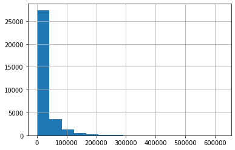
    


```python
from sklearn.neighbors import KNeighborsClassifier

```


```python
correlation_matrix = caso.corr()
```


```python
correlation_matrix
```


<div>
<style scoped>
    .dataframe tbody tr th:only-of-type {
        vertical-align: middle;
    }

    .dataframe tbody tr th {
        vertical-align: top;
    }

    .dataframe thead th {
        text-align: right;
    }
</style>
<table border="1" class="dataframe">
  <thead>
    <tr style="text-align: right;">
      <th></th>
      <th>Bodega</th>
      <th>ano</th>
      <th>mes</th>
      <th>semana</th>
      <th>Venta</th>
      <th>Inventario</th>
      <th>Q1</th>
      <th>Q2</th>
      <th>Q3</th>
      <th>Q4</th>
      <th>Q5</th>
      <th>Q6</th>
      <th>Q12</th>
      <th>Q15</th>
      <th>Q16</th>
      <th>Devoluciones</th>
    </tr>
  </thead>
  <tbody>
    <tr>
      <th>Bodega</th>
      <td>1.000000e+00</td>
      <td>-8.417736e-15</td>
      <td>-2.219996e-15</td>
      <td>-5.493205e-17</td>
      <td>0.168910</td>
      <td>-0.029198</td>
      <td>0.109232</td>
      <td>0.075870</td>
      <td>0.103927</td>
      <td>0.211503</td>
      <td>0.059701</td>
      <td>0.013271</td>
      <td>0.074723</td>
      <td>-0.001780</td>
      <td>0.008781</td>
      <td>0.208544</td>
    </tr>
    <tr>
      <th>ano</th>
      <td>-8.417736e-15</td>
      <td>1.000000e+00</td>
      <td>-2.534928e-01</td>
      <td>-3.824046e-03</td>
      <td>0.090924</td>
      <td>-0.058903</td>
      <td>0.096836</td>
      <td>0.009247</td>
      <td>0.077555</td>
      <td>-0.007009</td>
      <td>0.036859</td>
      <td>0.009516</td>
      <td>0.133301</td>
      <td>-0.007177</td>
      <td>-0.007372</td>
      <td>0.099747</td>
    </tr>
    <tr>
      <th>mes</th>
      <td>-2.219996e-15</td>
      <td>-2.534928e-01</td>
      <td>1.000000e+00</td>
      <td>-1.798119e-02</td>
      <td>-0.007347</td>
      <td>-0.008997</td>
      <td>0.021518</td>
      <td>0.014692</td>
      <td>0.010839</td>
      <td>-0.018958</td>
      <td>0.017172</td>
      <td>-0.001648</td>
      <td>0.042459</td>
      <td>0.004653</td>
      <td>-0.000916</td>
      <td>0.019099</td>
    </tr>
    <tr>
      <th>semana</th>
      <td>-5.493205e-17</td>
      <td>-3.824046e-03</td>
      <td>-1.798119e-02</td>
      <td>1.000000e+00</td>
      <td>0.003032</td>
      <td>-0.002663</td>
      <td>0.002734</td>
      <td>-0.007972</td>
      <td>0.003182</td>
      <td>0.004200</td>
      <td>-0.004808</td>
      <td>0.004397</td>
      <td>0.002242</td>
      <td>-0.005791</td>
      <td>0.000031</td>
      <td>0.003620</td>
    </tr>
    <tr>
      <th>Venta</th>
      <td>1.689096e-01</td>
      <td>9.092426e-02</td>
      <td>-7.346968e-03</td>
      <td>3.031528e-03</td>
      <td>1.000000</td>
      <td>0.562928</td>
      <td>0.119405</td>
      <td>0.207748</td>
      <td>0.342539</td>
      <td>0.392114</td>
      <td>0.144540</td>
      <td>0.054685</td>
      <td>0.515800</td>
      <td>-0.006036</td>
      <td>-0.003432</td>
      <td>0.635603</td>
    </tr>
    <tr>
      <th>Inventario</th>
      <td>-2.919785e-02</td>
      <td>-5.890309e-02</td>
      <td>-8.997318e-03</td>
      <td>-2.662850e-03</td>
      <td>0.562928</td>
      <td>1.000000</td>
      <td>0.085527</td>
      <td>0.166145</td>
      <td>0.233837</td>
      <td>0.176983</td>
      <td>0.108143</td>
      <td>0.036068</td>
      <td>0.415276</td>
      <td>-0.003942</td>
      <td>-0.005742</td>
      <td>0.418998</td>
    </tr>
    <tr>
      <th>Q1</th>
      <td>1.092320e-01</td>
      <td>9.683595e-02</td>
      <td>2.151777e-02</td>
      <td>2.734185e-03</td>
      <td>0.119405</td>
      <td>0.085527</td>
      <td>1.000000</td>
      <td>0.073505</td>
      <td>0.168226</td>
      <td>0.050907</td>
      <td>0.026759</td>
      <td>0.034669</td>
      <td>0.094844</td>
      <td>-0.001386</td>
      <td>-0.001738</td>
      <td>0.191450</td>
    </tr>
    <tr>
      <th>Q2</th>
      <td>7.586966e-02</td>
      <td>9.246540e-03</td>
      <td>1.469203e-02</td>
      <td>-7.972335e-03</td>
      <td>0.207748</td>
      <td>0.166145</td>
      <td>0.073505</td>
      <td>1.000000</td>
      <td>0.134260</td>
      <td>0.069306</td>
      <td>0.027509</td>
      <td>0.033207</td>
      <td>0.238625</td>
      <td>-0.000983</td>
      <td>-0.001293</td>
      <td>0.285605</td>
    </tr>
    <tr>
      <th>Q3</th>
      <td>1.039269e-01</td>
      <td>7.755545e-02</td>
      <td>1.083872e-02</td>
      <td>3.181610e-03</td>
      <td>0.342539</td>
      <td>0.233837</td>
      <td>0.168226</td>
      <td>0.134260</td>
      <td>1.000000</td>
      <td>0.153983</td>
      <td>0.104312</td>
      <td>0.020289</td>
      <td>0.187771</td>
      <td>-0.000579</td>
      <td>-0.002360</td>
      <td>0.510473</td>
    </tr>
    <tr>
      <th>Q4</th>
      <td>2.115031e-01</td>
      <td>-7.009269e-03</td>
      <td>-1.895789e-02</td>
      <td>4.200489e-03</td>
      <td>0.392114</td>
      <td>0.176983</td>
      <td>0.050907</td>
      <td>0.069306</td>
      <td>0.153983</td>
      <td>1.000000</td>
      <td>0.059240</td>
      <td>0.034835</td>
      <td>0.186405</td>
      <td>0.000237</td>
      <td>-0.004331</td>
      <td>0.726488</td>
    </tr>
    <tr>
      <th>Q5</th>
      <td>5.970102e-02</td>
      <td>3.685881e-02</td>
      <td>1.717250e-02</td>
      <td>-4.808288e-03</td>
      <td>0.144540</td>
      <td>0.108143</td>
      <td>0.026759</td>
      <td>0.027509</td>
      <td>0.104312</td>
      <td>0.059240</td>
      <td>1.000000</td>
      <td>-0.000933</td>
      <td>0.051711</td>
      <td>-0.001214</td>
      <td>-0.001522</td>
      <td>0.209890</td>
    </tr>
    <tr>
      <th>Q6</th>
      <td>1.327081e-02</td>
      <td>9.516408e-03</td>
      <td>-1.648158e-03</td>
      <td>4.397100e-03</td>
      <td>0.054685</td>
      <td>0.036068</td>
      <td>0.034669</td>
      <td>0.033207</td>
      <td>0.020289</td>
      <td>0.034835</td>
      <td>-0.000933</td>
      <td>1.000000</td>
      <td>0.027249</td>
      <td>-0.000318</td>
      <td>-0.000399</td>
      <td>0.067901</td>
    </tr>
    <tr>
      <th>Q12</th>
      <td>7.472300e-02</td>
      <td>1.333010e-01</td>
      <td>4.245894e-02</td>
      <td>2.242347e-03</td>
      <td>0.515800</td>
      <td>0.415276</td>
      <td>0.094844</td>
      <td>0.238625</td>
      <td>0.187771</td>
      <td>0.186405</td>
      <td>0.051711</td>
      <td>0.027249</td>
      <td>1.000000</td>
      <td>-0.002450</td>
      <td>-0.003053</td>
      <td>0.720082</td>
    </tr>
    <tr>
      <th>Q15</th>
      <td>-1.779603e-03</td>
      <td>-7.176943e-03</td>
      <td>4.653313e-03</td>
      <td>-5.790852e-03</td>
      <td>-0.006036</td>
      <td>-0.003942</td>
      <td>-0.001386</td>
      <td>-0.000983</td>
      <td>-0.000579</td>
      <td>0.000237</td>
      <td>-0.001214</td>
      <td>-0.000318</td>
      <td>-0.002450</td>
      <td>1.000000</td>
      <td>-0.000068</td>
      <td>-0.001366</td>
    </tr>
    <tr>
      <th>Q16</th>
      <td>8.781272e-03</td>
      <td>-7.371716e-03</td>
      <td>-9.163918e-04</td>
      <td>3.134307e-05</td>
      <td>-0.003432</td>
      <td>-0.005742</td>
      <td>-0.001738</td>
      <td>-0.001293</td>
      <td>-0.002360</td>
      <td>-0.004331</td>
      <td>-0.001522</td>
      <td>-0.000399</td>
      <td>-0.003053</td>
      <td>-0.000068</td>
      <td>1.000000</td>
      <td>-0.004912</td>
    </tr>
    <tr>
      <th>Devoluciones</th>
      <td>2.085439e-01</td>
      <td>9.974748e-02</td>
      <td>1.909928e-02</td>
      <td>3.620063e-03</td>
      <td>0.635603</td>
      <td>0.418998</td>
      <td>0.191450</td>
      <td>0.285605</td>
      <td>0.510473</td>
      <td>0.726488</td>
      <td>0.209890</td>
      <td>0.067901</td>
      <td>0.720082</td>
      <td>-0.001366</td>
      <td>-0.004912</td>
      <td>1.000000</td>
    </tr>
  </tbody>
</table>
</div>


```python
casosinna = caso.dropna()
```


```python
caso.columns
```


    Index(['Unidad de negocio', 'Región', 'Bodega', 'ano', 'mes', 'semana',
           'Venta', 'Inventario', 'Q1', 'Q2', 'Q3', 'Q4', 'Q5', 'Q6', 'Q12', 'Q15',
           'Q16', 'Devoluciones'],
          dtype='object')


```python
import numpy as np
```


```python
y = casosinna[['Q1']].values

X = casosinna[[ 'Venta','Inventario']].values
```


```python
from sklearn import preprocessing
from sklearn import utils

#convert y values to categorical values
lab = preprocessing.LabelEncoder()
y_transformed = lab.fit_transform(y)

#view transformed values
print(y_transformed)

```

    [0 0 0 ... 0 0 0]


    /home/stephen/lab/lib64/python3.10/site-packages/sklearn/preprocessing/_label.py:115: DataConversionWarning: A column-vector y was passed when a 1d array was expected. Please change the shape of y to (n_samples, ), for example using ravel().
      y = column_or_1d(y, warn=True)


```python
knn = KNeighborsClassifier(n_neighbors=15)

knn.fit(X,y_transformed)
```


<style>#sk-container-id-4 {color: black;background-color: white;}#sk-container-id-4 pre{padding: 0;}#sk-container-id-4 div.sk-toggleable {background-color: white;}#sk-container-id-4 label.sk-toggleable__label {cursor: pointer;display: block;width: 100%;margin-bottom: 0;padding: 0.3em;box-sizing: border-box;text-align: center;}#sk-container-id-4 label.sk-toggleable__label-arrow:before {content: "▸";float: left;margin-right: 0.25em;color: #696969;}#sk-container-id-4 label.sk-toggleable__label-arrow:hover:before {color: black;}#sk-container-id-4 div.sk-estimator:hover label.sk-toggleable__label-arrow:before {color: black;}#sk-container-id-4 div.sk-toggleable__content {max-height: 0;max-width: 0;overflow: hidden;text-align: left;background-color: #f0f8ff;}#sk-container-id-4 div.sk-toggleable__content pre {margin: 0.2em;color: black;border-radius: 0.25em;background-color: #f0f8ff;}#sk-container-id-4 input.sk-toggleable__control:checked~div.sk-toggleable__content {max-height: 200px;max-width: 100%;overflow: auto;}#sk-container-id-4 input.sk-toggleable__control:checked~label.sk-toggleable__label-arrow:before {content: "▾";}#sk-container-id-4 div.sk-estimator input.sk-toggleable__control:checked~label.sk-toggleable__label {background-color: #d4ebff;}#sk-container-id-4 div.sk-label input.sk-toggleable__control:checked~label.sk-toggleable__label {background-color: #d4ebff;}#sk-container-id-4 input.sk-hidden--visually {border: 0;clip: rect(1px 1px 1px 1px);clip: rect(1px, 1px, 1px, 1px);height: 1px;margin: -1px;overflow: hidden;padding: 0;position: absolute;width: 1px;}#sk-container-id-4 div.sk-estimator {font-family: monospace;background-color: #f0f8ff;border: 1px dotted black;border-radius: 0.25em;box-sizing: border-box;margin-bottom: 0.5em;}#sk-container-id-4 div.sk-estimator:hover {background-color: #d4ebff;}#sk-container-id-4 div.sk-parallel-item::after {content: "";width: 100%;border-bottom: 1px solid gray;flex-grow: 1;}#sk-container-id-4 div.sk-label:hover label.sk-toggleable__label {background-color: #d4ebff;}#sk-container-id-4 div.sk-serial::before {content: "";position: absolute;border-left: 1px solid gray;box-sizing: border-box;top: 0;bottom: 0;left: 50%;z-index: 0;}#sk-container-id-4 div.sk-serial {display: flex;flex-direction: column;align-items: center;background-color: white;padding-right: 0.2em;padding-left: 0.2em;position: relative;}#sk-container-id-4 div.sk-item {position: relative;z-index: 1;}#sk-container-id-4 div.sk-parallel {display: flex;align-items: stretch;justify-content: center;background-color: white;position: relative;}#sk-container-id-4 div.sk-item::before, #sk-container-id-4 div.sk-parallel-item::before {content: "";position: absolute;border-left: 1px solid gray;box-sizing: border-box;top: 0;bottom: 0;left: 50%;z-index: -1;}#sk-container-id-4 div.sk-parallel-item {display: flex;flex-direction: column;z-index: 1;position: relative;background-color: white;}#sk-container-id-4 div.sk-parallel-item:first-child::after {align-self: flex-end;width: 50%;}#sk-container-id-4 div.sk-parallel-item:last-child::after {align-self: flex-start;width: 50%;}#sk-container-id-4 div.sk-parallel-item:only-child::after {width: 0;}#sk-container-id-4 div.sk-dashed-wrapped {border: 1px dashed gray;margin: 0 0.4em 0.5em 0.4em;box-sizing: border-box;padding-bottom: 0.4em;background-color: white;}#sk-container-id-4 div.sk-label label {font-family: monospace;font-weight: bold;display: inline-block;line-height: 1.2em;}#sk-container-id-4 div.sk-label-container {text-align: center;}#sk-container-id-4 div.sk-container {/* jupyter's `normalize.less` sets `[hidden] { display: none; }` but bootstrap.min.css set `[hidden] { display: none !important; }` so we also need the `!important` here to be able to override the default hidden behavior on the sphinx rendered scikit-learn.org. See: https://github.com/scikit-learn/scikit-learn/issues/21755 */display: inline-block !important;position: relative;}#sk-container-id-4 div.sk-text-repr-fallback {display: none;}</style><div id="sk-container-id-4" class="sk-top-container"><div class="sk-text-repr-fallback"><pre>KNeighborsClassifier(n_neighbors=15)</pre><b>In a Jupyter environment, please rerun this cell to show the HTML representation or trust the notebook. <br />On GitHub, the HTML representation is unable to render, please try loading this page with nbviewer.org.</b></div><div class="sk-container" hidden><div class="sk-item"><div class="sk-estimator sk-toggleable"><input class="sk-toggleable__control sk-hidden--visually" id="sk-estimator-id-4" type="checkbox" checked><label for="sk-estimator-id-4" class="sk-toggleable__label sk-toggleable__label-arrow">KNeighborsClassifier</label><div class="sk-toggleable__content"><pre>KNeighborsClassifier(n_neighbors=15)</pre></div></div></div></div></div>


```python
import matplotlib.pyplot as plt
import seaborn as sns
from matplotlib.colors import ListedColormap
from sklearn import neighbors, datasets
from sklearn.inspection import DecisionBoundaryDisplay

n_neighbors = 15
```


```python
cmap_light = ListedColormap(["orange", "cyan", "cornflowerblue"])
cmap_bold = ["darkorange", "c", "darkblue"]
```


```python
_, ax = plt.subplots()
DecisionBoundaryDisplay.from_estimator(
    knn,
    X,
    cmap=cmap_light,
    ax=ax,
    response_method="predict",
    plot_method="pcolormesh",
    xlabel="X",
    ylabel="Y",
    shading="auto",
    )

# Plot also the training points
sns.scatterplot(
    x=X[:, 0],
    y=X[:, 1],
    palette=cmap_bold,
    alpha=1.0,
    edgecolor="black",
    )
plt.title(
   "3-Class classification (k = %i, )" % (n_neighbors)
    )

plt.show()
```


    
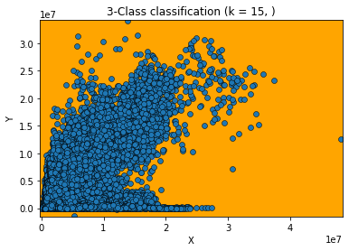
    


```python

xnuevo = np.array()

prediccion = knn.predict(xnuevo)


```


    ---------------------------------------------------------------------------

    TypeError                                 Traceback (most recent call last)

    Input In [169], in <cell line: 1>()
    ----> 1 knn.predict()


    TypeError: KNeighborsClassifier.predict() missing 1 required positional argument: 'X'


```python

```


```python
import matplotlib.pyplot as plt
from kneed import KneeLocator
from sklearn.datasets import make_blobs
from sklearn.cluster import KMeans
from sklearn.metrics import silhouette_score
from sklearn.preprocessing import StandardScaler
```


```python
features, true_labels = make_blobs(
    n_samples=200,
    centers=3,
    cluster_std=2.75,
    random_state=42
)
```


```python
features[:5]
```


    array([[  9.77075874,   3.27621022],
           [ -9.71349666,  11.27451802],
           [ -6.91330582,  -9.34755911],
           [-10.86185913, -10.75063497],
           [ -8.50038027,  -4.54370383]])


```python
true_labels[:5]
```


    array([1, 0, 2, 2, 2])


```python
scaler = StandardScaler()
```


```python
scaled_features = scaler.fit_transform(features)
```


```python
scaled_features[:5]
```


    array([[ 2.13082109,  0.25604351],
           [-1.52698523,  1.41036744],
           [-1.00130152, -1.56583175],
           [-1.74256891, -1.76832509],
           [-1.29924521, -0.87253446]])


```python
kmeans = KMeans(
    init="random",  #k-means++
    n_clusters=3,
    n_init=10,
    max_iter=300,
    random_state=42
)
```


```python
kmeans.fit(scaled_features)
```


<style>#sk-container-id-6 {color: black;background-color: white;}#sk-container-id-6 pre{padding: 0;}#sk-container-id-6 div.sk-toggleable {background-color: white;}#sk-container-id-6 label.sk-toggleable__label {cursor: pointer;display: block;width: 100%;margin-bottom: 0;padding: 0.3em;box-sizing: border-box;text-align: center;}#sk-container-id-6 label.sk-toggleable__label-arrow:before {content: "▸";float: left;margin-right: 0.25em;color: #696969;}#sk-container-id-6 label.sk-toggleable__label-arrow:hover:before {color: black;}#sk-container-id-6 div.sk-estimator:hover label.sk-toggleable__label-arrow:before {color: black;}#sk-container-id-6 div.sk-toggleable__content {max-height: 0;max-width: 0;overflow: hidden;text-align: left;background-color: #f0f8ff;}#sk-container-id-6 div.sk-toggleable__content pre {margin: 0.2em;color: black;border-radius: 0.25em;background-color: #f0f8ff;}#sk-container-id-6 input.sk-toggleable__control:checked~div.sk-toggleable__content {max-height: 200px;max-width: 100%;overflow: auto;}#sk-container-id-6 input.sk-toggleable__control:checked~label.sk-toggleable__label-arrow:before {content: "▾";}#sk-container-id-6 div.sk-estimator input.sk-toggleable__control:checked~label.sk-toggleable__label {background-color: #d4ebff;}#sk-container-id-6 div.sk-label input.sk-toggleable__control:checked~label.sk-toggleable__label {background-color: #d4ebff;}#sk-container-id-6 input.sk-hidden--visually {border: 0;clip: rect(1px 1px 1px 1px);clip: rect(1px, 1px, 1px, 1px);height: 1px;margin: -1px;overflow: hidden;padding: 0;position: absolute;width: 1px;}#sk-container-id-6 div.sk-estimator {font-family: monospace;background-color: #f0f8ff;border: 1px dotted black;border-radius: 0.25em;box-sizing: border-box;margin-bottom: 0.5em;}#sk-container-id-6 div.sk-estimator:hover {background-color: #d4ebff;}#sk-container-id-6 div.sk-parallel-item::after {content: "";width: 100%;border-bottom: 1px solid gray;flex-grow: 1;}#sk-container-id-6 div.sk-label:hover label.sk-toggleable__label {background-color: #d4ebff;}#sk-container-id-6 div.sk-serial::before {content: "";position: absolute;border-left: 1px solid gray;box-sizing: border-box;top: 0;bottom: 0;left: 50%;z-index: 0;}#sk-container-id-6 div.sk-serial {display: flex;flex-direction: column;align-items: center;background-color: white;padding-right: 0.2em;padding-left: 0.2em;position: relative;}#sk-container-id-6 div.sk-item {position: relative;z-index: 1;}#sk-container-id-6 div.sk-parallel {display: flex;align-items: stretch;justify-content: center;background-color: white;position: relative;}#sk-container-id-6 div.sk-item::before, #sk-container-id-6 div.sk-parallel-item::before {content: "";position: absolute;border-left: 1px solid gray;box-sizing: border-box;top: 0;bottom: 0;left: 50%;z-index: -1;}#sk-container-id-6 div.sk-parallel-item {display: flex;flex-direction: column;z-index: 1;position: relative;background-color: white;}#sk-container-id-6 div.sk-parallel-item:first-child::after {align-self: flex-end;width: 50%;}#sk-container-id-6 div.sk-parallel-item:last-child::after {align-self: flex-start;width: 50%;}#sk-container-id-6 div.sk-parallel-item:only-child::after {width: 0;}#sk-container-id-6 div.sk-dashed-wrapped {border: 1px dashed gray;margin: 0 0.4em 0.5em 0.4em;box-sizing: border-box;padding-bottom: 0.4em;background-color: white;}#sk-container-id-6 div.sk-label label {font-family: monospace;font-weight: bold;display: inline-block;line-height: 1.2em;}#sk-container-id-6 div.sk-label-container {text-align: center;}#sk-container-id-6 div.sk-container {/* jupyter's `normalize.less` sets `[hidden] { display: none; }` but bootstrap.min.css set `[hidden] { display: none !important; }` so we also need the `!important` here to be able to override the default hidden behavior on the sphinx rendered scikit-learn.org. See: https://github.com/scikit-learn/scikit-learn/issues/21755 */display: inline-block !important;position: relative;}#sk-container-id-6 div.sk-text-repr-fallback {display: none;}</style><div id="sk-container-id-6" class="sk-top-container"><div class="sk-text-repr-fallback"><pre>KMeans(init=&#x27;random&#x27;, n_clusters=3, random_state=42)</pre><b>In a Jupyter environment, please rerun this cell to show the HTML representation or trust the notebook. <br />On GitHub, the HTML representation is unable to render, please try loading this page with nbviewer.org.</b></div><div class="sk-container" hidden><div class="sk-item"><div class="sk-estimator sk-toggleable"><input class="sk-toggleable__control sk-hidden--visually" id="sk-estimator-id-6" type="checkbox" checked><label for="sk-estimator-id-6" class="sk-toggleable__label sk-toggleable__label-arrow">KMeans</label><div class="sk-toggleable__content"><pre>KMeans(init=&#x27;random&#x27;, n_clusters=3, random_state=42)</pre></div></div></div></div></div>


```python
 kmeans.inertia_
```


    74.57960106819854


```python
kmeans.cluster_centers_
```


    array([[-0.25813925,  1.05589975],
           [-0.91941183, -1.18551732],
           [ 1.19539276,  0.13158148]])


```python
kmeans.n_iter_
```


    2


```python
kmeans.labels_[:5]
```


    array([2, 0, 1, 1, 1], dtype=int32)


```python
sm.stats.linear_rainbow(res)
```


    (0.8948357320622639, 0.9999999999995876)


```python
casos.columns
```


    Index(['Unidad de negocio', 'Región', 'Bodega', 'ano', 'mes', 'semana',
           'Venta', 'Inventario', 'Devoluciones'],
          dtype='object')


```python
sm.graphics.plot_partregress('Devoluciones', 'Venta', ['ano', 'mes'],data=casos, obs_labels=False)
```

    eval_env: 1


    
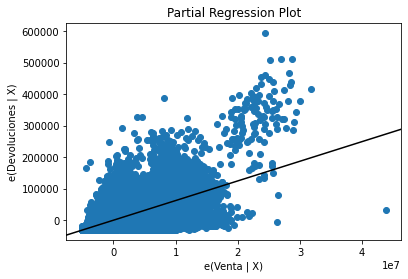
    


    

    


```python
sm.graphics.plot_partregress('Devoluciones', 'Región', ['ano', 'mes'],data=casos, obs_labels=False)
```

    eval_env: 1


    
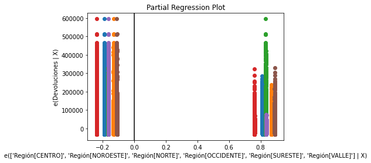
    


    

    


```python
sm.graphics.plot_partregress('Devoluciones', 'semana', ['ano', 'mes'],data=casos, obs_labels=False)
```

    eval_env: 1


    
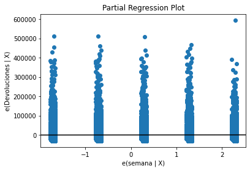
    


    

    


```python
sm.graphics.plot_partregress('Devoluciones', 'Bodega', ['ano', 'mes'],data=casos, obs_labels=False)
```

    eval_env: 1


    
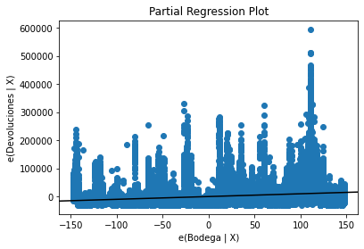
    


    

    


```python
sm.graphics.plot_partregress('Devoluciones', 'Inventario', ['ano', 'mes'],data=casos, obs_labels=False)
```

    eval_env: 1


    
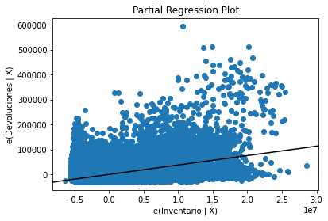
    


    

    


```python
#Importing required modules
 
from sklearn.datasets import load_digits
from sklearn.decomposition import PCA
from sklearn.cluster import KMeans
import numpy as np
 


```


```python
#pepare the Data
predata = caso_norte
```


```python
predata[-5:]
```


<div>
<style scoped>
    .dataframe tbody tr th:only-of-type {
        vertical-align: middle;
    }

    .dataframe tbody tr th {
        vertical-align: top;
    }

    .dataframe thead th {
        text-align: right;
    }
</style>
<table border="1" class="dataframe">
  <thead>
    <tr style="text-align: right;">
      <th></th>
      <th>Unidad de negocio</th>
      <th>Bodega</th>
      <th>ano</th>
      <th>mes</th>
      <th>semana</th>
      <th>Venta</th>
      <th>Inventario</th>
      <th>Q1</th>
      <th>Q2</th>
      <th>Q3</th>
      <th>Q4</th>
      <th>Q5</th>
      <th>Q6</th>
      <th>Q12</th>
      <th>Q15</th>
      <th>Q16</th>
      <th>Devoluciones</th>
    </tr>
  </thead>
  <tbody>
    <tr>
      <th>33831</th>
      <td>UN2</td>
      <td>270</td>
      <td>2022</td>
      <td>2</td>
      <td>4</td>
      <td>11912407.0</td>
      <td>23958.0</td>
      <td>0.0</td>
      <td>0.0</td>
      <td>0.0</td>
      <td>0.00</td>
      <td>0.0</td>
      <td>0.0</td>
      <td>0.00</td>
      <td>0.0</td>
      <td>0.0</td>
      <td>0.00</td>
    </tr>
    <tr>
      <th>33832</th>
      <td>UN3</td>
      <td>271</td>
      <td>2022</td>
      <td>2</td>
      <td>4</td>
      <td>12271170.0</td>
      <td>458946.0</td>
      <td>0.0</td>
      <td>0.0</td>
      <td>28205.1</td>
      <td>21248.43</td>
      <td>0.0</td>
      <td>0.0</td>
      <td>35543.28</td>
      <td>0.0</td>
      <td>0.0</td>
      <td>84996.81</td>
    </tr>
    <tr>
      <th>33836</th>
      <td>UN3</td>
      <td>275</td>
      <td>2022</td>
      <td>2</td>
      <td>4</td>
      <td>1608199.0</td>
      <td>5130675.0</td>
      <td>0.0</td>
      <td>0.0</td>
      <td>0.0</td>
      <td>16639.80</td>
      <td>0.0</td>
      <td>0.0</td>
      <td>359.52</td>
      <td>0.0</td>
      <td>0.0</td>
      <td>16999.32</td>
    </tr>
    <tr>
      <th>33837</th>
      <td>UN3</td>
      <td>276</td>
      <td>2022</td>
      <td>2</td>
      <td>4</td>
      <td>2284517.0</td>
      <td>3643148.0</td>
      <td>0.0</td>
      <td>0.0</td>
      <td>0.0</td>
      <td>17533.81</td>
      <td>0.0</td>
      <td>0.0</td>
      <td>5581.70</td>
      <td>0.0</td>
      <td>0.0</td>
      <td>23115.51</td>
    </tr>
    <tr>
      <th>33838</th>
      <td>UN3</td>
      <td>277</td>
      <td>2022</td>
      <td>2</td>
      <td>4</td>
      <td>2798114.0</td>
      <td>3155530.0</td>
      <td>0.0</td>
      <td>0.0</td>
      <td>0.0</td>
      <td>0.00</td>
      <td>0.0</td>
      <td>0.0</td>
      <td>13356.00</td>
      <td>0.0</td>
      <td>0.0</td>
      <td>13356.00</td>
    </tr>
  </tbody>
</table>
</div>


```python
set(casos['Unidad de negocio'])
```


    {'UN1', 'UN2', 'UN3'}


```python
predata = predata.drop('Región',axis=1)
```


```python
def unidadnegocio(un):
    if(un == 'UN1'):
        return 1
    if(un == 'UN2'):
        return 2
    if(un == 'UN3'):
        return 3
    
```


```python
predata['Unidad de negocio']=predata['Unidad de negocio'].apply(unidadnegocio)
```


```python
len(predata)
```


    5554


```python
predata = predata.dropna()
```


```python
#Load Data

data = predata.values
pca = PCA(2)
 
```


```python
data[-5:]
```


    array([[2.0000000e+00, 2.7000000e+02, 2.0220000e+03, 2.0000000e+00,
            4.0000000e+00, 1.1912407e+07, 2.3958000e+04, 0.0000000e+00,
            0.0000000e+00, 0.0000000e+00, 0.0000000e+00, 0.0000000e+00,
            0.0000000e+00, 0.0000000e+00, 0.0000000e+00, 0.0000000e+00,
            0.0000000e+00],
           [3.0000000e+00, 2.7100000e+02, 2.0220000e+03, 2.0000000e+00,
            4.0000000e+00, 1.2271170e+07, 4.5894600e+05, 0.0000000e+00,
            0.0000000e+00, 2.8205100e+04, 2.1248430e+04, 0.0000000e+00,
            0.0000000e+00, 3.5543280e+04, 0.0000000e+00, 0.0000000e+00,
            8.4996810e+04],
           [3.0000000e+00, 2.7500000e+02, 2.0220000e+03, 2.0000000e+00,
            4.0000000e+00, 1.6081990e+06, 5.1306750e+06, 0.0000000e+00,
            0.0000000e+00, 0.0000000e+00, 1.6639800e+04, 0.0000000e+00,
            0.0000000e+00, 3.5952000e+02, 0.0000000e+00, 0.0000000e+00,
            1.6999320e+04],
           [3.0000000e+00, 2.7600000e+02, 2.0220000e+03, 2.0000000e+00,
            4.0000000e+00, 2.2845170e+06, 3.6431480e+06, 0.0000000e+00,
            0.0000000e+00, 0.0000000e+00, 1.7533810e+04, 0.0000000e+00,
            0.0000000e+00, 5.5817000e+03, 0.0000000e+00, 0.0000000e+00,
            2.3115510e+04],
           [3.0000000e+00, 2.7700000e+02, 2.0220000e+03, 2.0000000e+00,
            4.0000000e+00, 2.7981140e+06, 3.1555300e+06, 0.0000000e+00,
            0.0000000e+00, 0.0000000e+00, 0.0000000e+00, 0.0000000e+00,
            0.0000000e+00, 1.3356000e+04, 0.0000000e+00, 0.0000000e+00,
            1.3356000e+04]])


```python

#Transform the data
df = pca.fit_transform(data)
 

```


```python
#Import KMeans module
from sklearn.cluster import KMeans
 

```


```python
#Initialize the class object
kmeans = KMeans(n_clusters= 15)
 

```


```python
#predict the labels of clusters.
label = kmeans.fit_predict(df)
 

```


```python
#Getting unique labels
u_labels = np.unique(label)
 

```


```python
#plotting the results:
for i in u_labels:
    plt.scatter(df[label == i , 0] , df[label == i , 1] , label = i)
plt.legend()
plt.show()
```


    
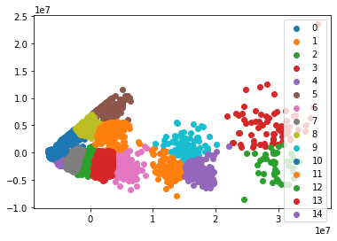
    


```python
predata = caso_centro
predata = predata.drop('Región',axis=1)
predata['Unidad de negocio']=predata['Unidad de negocio'].apply(unidadnegocio)
predata = predata.dropna()
#Load Data

data = predata.values
pca = PCA(2)
 

#Transform the data
df = pca.fit_transform(data)
 
#Import KMeans module
from sklearn.cluster import KMeans
 
#Initialize the class object
kmeans = KMeans(n_clusters= 5)
 
#predict the labels of clusters.
label = kmeans.fit_predict(df)
 
#Getting unique labels
u_labels = np.unique(label)
 
#plotting the results:
for i in u_labels:
    plt.scatter(df[label == i , 0] , df[label == i , 1] , label = i)
plt.legend()
plt.show()
```


    
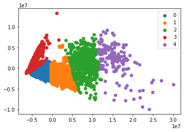
    


```python
predata = caso_valle
predata = predata.drop('Región',axis=1)
predata['Unidad de negocio']=predata['Unidad de negocio'].apply(unidadnegocio)
predata = predata.dropna()
#Load Data

data = predata.values
pca = PCA(2)
 

#Transform the data
df = pca.fit_transform(data)
 
#Import KMeans module
from sklearn.cluster import KMeans
 
#Initialize the class object
kmeans = KMeans(n_clusters= 5)
 
#predict the labels of clusters.
label = kmeans.fit_predict(df)
 
#Getting unique labels
u_labels = np.unique(label)
 
#plotting the results:
for i in u_labels:
    plt.scatter(df[label == i , 0] , df[label == i , 1] , label = i)
plt.legend()
plt.show()
```


    
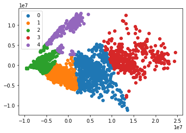
    


```python
predata = caso_noroeste
predata = predata.drop('Región',axis=1)
predata['Unidad de negocio']=predata['Unidad de negocio'].apply(unidadnegocio)
predata = predata.dropna()
#Load Data

data = predata.values
pca = PCA(2)
 

#Transform the data
df = pca.fit_transform(data)
 
#Import KMeans module
from sklearn.cluster import KMeans
 
#Initialize the class object
kmeans = KMeans(n_clusters= 5)
 
#predict the labels of clusters.
label = kmeans.fit_predict(df)
 
#Getting unique labels
u_labels = np.unique(label)
 
#plotting the results:
for i in u_labels:
    plt.scatter(df[label == i , 0] , df[label == i , 1] , label = i)
plt.legend()
plt.show()
```


    
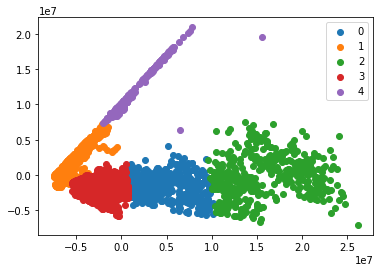
    


```python
predata = caso_occidente
predata = predata.drop('Región',axis=1)
predata['Unidad de negocio']=predata['Unidad de negocio'].apply(unidadnegocio)
predata = predata.dropna()
#Load Data

data = predata.values
pca = PCA(2)
 

#Transform the data
df = pca.fit_transform(data)
 
#Import KMeans module
from sklearn.cluster import KMeans
 
#Initialize the class object
kmeans = KMeans(n_clusters= 5)
 
#predict the labels of clusters.
label = kmeans.fit_predict(df)
 
#Getting unique labels
u_labels = np.unique(label)
 
#plotting the results:
for i in u_labels:
    plt.scatter(df[label == i , 0] , df[label == i , 1] , label = i)
plt.legend()
plt.show()
```


    
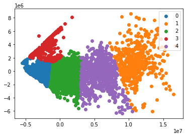
    


```python
predata = caso_sureste
predata = predata.drop('Región',axis=1)

predata['Unidad de negocio']=predata['Unidad de negocio'].apply(unidadnegocio)
predata = predata.dropna()
#Load Data

data = predata.values
pca = PCA(2)
 

#Transform the data
df = pca.fit_transform(data)
 
#Import KMeans module
from sklearn.cluster import KMeans
 
#Initialize the class object
kmeans = KMeans(n_clusters= 5)
 
#predict the labels of clusters.
label = kmeans.fit_predict(df)
 
#Getting unique labels
u_labels = np.unique(label)
 
#plotting the results:
for i in u_labels:
    plt.scatter(df[label == i , 0] , df[label == i , 1] , label = i)
centroids = kmeans.cluster_centers_
plt.scatter(centroids[:,0] , centroids[:,1] , s = 80, color = 'black')

plt.legend()
plt.show()
```


    
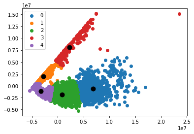
    


```python
caso_sureste.columns
```


    Index(['Unidad de negocio', 'Región', 'Bodega', 'ano', 'mes', 'semana',
           'Venta', 'Inventario', 'Q1', 'Q2', 'Q3', 'Q4', 'Q5', 'Q6', 'Q12', 'Q15',
           'Q16', 'Devoluciones'],
          dtype='object')


# POR HACER !!!!!!!!!!!!!!!!!!!!!!!!!!!!!!!!!!!!!!!!!!!!!!!!!!!!!!!!!!!!!!!!!!!!!!!!!!!!!!!!!!!!!!!!!!!!!!!!!!!!!!Hacer un arbol de decision o sacar el information value de mis variables y las que no aporten dropearlas Tambien las que aporten demasiado __dampearlas__


```python
predata = caso_sureste[['ano', 'mes','semana',
       'Venta', 'Inventario', 'Q1', 'Q2', 'Q3', 'Q4', 'Q5', 'Q6', 'Q12', 'Q15',
       'Q16']]


#predata['Unidad de negocio']=predata['Unidad de negocio'].apply(unidadnegocio)
predata = predata.dropna()
#Load Data

data = predata.values
pca = PCA(2)
 

#Transform the data
df = pca.fit_transform(data)
 
```


```python
caso.to_csv('Casosyabonitos.csv')
```


```python
plt.plot(df)
```


    [<matplotlib.lines.Line2D at 0x7fa478e59b70>,
     <matplotlib.lines.Line2D at 0x7fa478cf1150>]


    
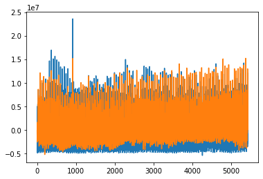
    


```python
#Import KMeans module
from sklearn.cluster import KMeans
 
#Initialize the class object
kmeans = KMeans(n_clusters= 5)
 
#predict the labels of clusters.
label = kmeans.fit_predict(df)
 
#Getting unique labels
u_labels = np.unique(label)
 
#plotting the results:
for i in u_labels:
    plt.scatter(df[label == i , 0] , df[label == i , 1] , label = i)
centroids = kmeans.cluster_centers_
plt.scatter(centroids[:,0] , centroids[:,1] , s = 80, color = 'black')

plt.legend()
plt.show()
```


    
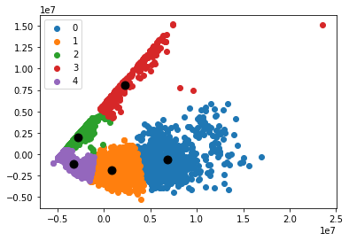
    


```python
len(label)
```


    5434


```python
len(predata)
```


    5434


```python
predata['label']= label
```


```python
caso_sureste1= caso_sureste
```


```python
caso_sureste1 = caso_sureste1.dropna()
```


```python
caso_sureste1['label']= label
```

    /tmp/ipykernel_5996/3019064023.py:1: SettingWithCopyWarning: 
    A value is trying to be set on a copy of a slice from a DataFrame.
    Try using .loc[row_indexer,col_indexer] = value instead
    
    See the caveats in the documentation: https://pandas.pydata.org/pandas-docs/stable/user_guide/indexing.html#returning-a-view-versus-a-copy
      caso_sureste1['label']= label


```python
clusters = caso_sureste1.style.background_gradient(cmap='Blues',subset=['label','Devoluciones'])
```


```python
caso_sureste1[(caso_sureste1['label']==3)|(caso_sureste1['label']==2)].style.background_gradient(cmap='Blues',subset=['label','Devoluciones'])
```


<style type="text/css">
#T_67b13_row0_col17, #T_67b13_row13_col17, #T_67b13_row41_col17, #T_67b13_row91_col17, #T_67b13_row270_col17, #T_67b13_row279_col17, #T_67b13_row284_col17, #T_67b13_row354_col17, #T_67b13_row367_col17, #T_67b13_row593_col17, #T_67b13_row1169_col17, #T_67b13_row1414_col17, #T_67b13_row1429_col17, #T_67b13_row1462_col17, #T_67b13_row1526_col17, #T_67b13_row1542_col17, #T_67b13_row1602_col17 {
  background-color: #f5fafe;
  color: #000000;
}
#T_67b13_row0_col18, #T_67b13_row1_col17, #T_67b13_row1_col18, #T_67b13_row2_col17, #T_67b13_row2_col18, #T_67b13_row3_col18, #T_67b13_row4_col17, #T_67b13_row5_col17, #T_67b13_row5_col18, #T_67b13_row7_col18, #T_67b13_row8_col17, #T_67b13_row8_col18, #T_67b13_row9_col17, #T_67b13_row9_col18, #T_67b13_row10_col17, #T_67b13_row10_col18, #T_67b13_row11_col18, #T_67b13_row12_col17, #T_67b13_row13_col18, #T_67b13_row14_col17, #T_67b13_row14_col18, #T_67b13_row15_col18, #T_67b13_row16_col17, #T_67b13_row17_col18, #T_67b13_row18_col17, #T_67b13_row18_col18, #T_67b13_row20_col18, #T_67b13_row21_col18, #T_67b13_row22_col18, #T_67b13_row23_col17, #T_67b13_row23_col18, #T_67b13_row24_col17, #T_67b13_row24_col18, #T_67b13_row25_col18, #T_67b13_row26_col17, #T_67b13_row27_col17, #T_67b13_row27_col18, #T_67b13_row28_col17, #T_67b13_row28_col18, #T_67b13_row29_col18, #T_67b13_row30_col17, #T_67b13_row31_col18, #T_67b13_row32_col17, #T_67b13_row32_col18, #T_67b13_row34_col18, #T_67b13_row35_col17, #T_67b13_row35_col18, #T_67b13_row36_col18, #T_67b13_row37_col17, #T_67b13_row37_col18, #T_67b13_row38_col17, #T_67b13_row38_col18, #T_67b13_row39_col18, #T_67b13_row40_col17, #T_67b13_row41_col18, #T_67b13_row42_col17, #T_67b13_row42_col18, #T_67b13_row43_col18, #T_67b13_row44_col17, #T_67b13_row45_col18, #T_67b13_row46_col17, #T_67b13_row46_col18, #T_67b13_row48_col18, #T_67b13_row49_col18, #T_67b13_row50_col18, #T_67b13_row51_col17, #T_67b13_row51_col18, #T_67b13_row52_col17, #T_67b13_row52_col18, #T_67b13_row53_col18, #T_67b13_row54_col17, #T_67b13_row55_col17, #T_67b13_row55_col18, #T_67b13_row56_col17, #T_67b13_row56_col18, #T_67b13_row57_col18, #T_67b13_row58_col17, #T_67b13_row59_col18, #T_67b13_row60_col17, #T_67b13_row60_col18, #T_67b13_row62_col18, #T_67b13_row63_col17, #T_67b13_row63_col18, #T_67b13_row64_col18, #T_67b13_row65_col17, #T_67b13_row65_col18, #T_67b13_row66_col17, #T_67b13_row66_col18, #T_67b13_row67_col18, #T_67b13_row68_col17, #T_67b13_row69_col18, #T_67b13_row70_col17, #T_67b13_row70_col18, #T_67b13_row71_col18, #T_67b13_row72_col17, #T_67b13_row73_col18, #T_67b13_row74_col17, #T_67b13_row74_col18, #T_67b13_row76_col18, #T_67b13_row77_col17, #T_67b13_row77_col18, #T_67b13_row78_col18, #T_67b13_row79_col17, #T_67b13_row79_col18, #T_67b13_row80_col17, #T_67b13_row80_col18, #T_67b13_row81_col18, #T_67b13_row82_col17, #T_67b13_row83_col17, #T_67b13_row83_col18, #T_67b13_row84_col17, #T_67b13_row84_col18, #T_67b13_row85_col18, #T_67b13_row86_col17, #T_67b13_row87_col18, #T_67b13_row88_col18, #T_67b13_row90_col18, #T_67b13_row91_col18, #T_67b13_row92_col18, #T_67b13_row93_col17, #T_67b13_row93_col18, #T_67b13_row94_col17, #T_67b13_row94_col18, #T_67b13_row95_col18, #T_67b13_row96_col17, #T_67b13_row97_col17, #T_67b13_row97_col18, #T_67b13_row98_col17, #T_67b13_row98_col18, #T_67b13_row99_col18, #T_67b13_row100_col17, #T_67b13_row101_col18, #T_67b13_row102_col18, #T_67b13_row104_col18, #T_67b13_row105_col17, #T_67b13_row105_col18, #T_67b13_row106_col18, #T_67b13_row107_col17, #T_67b13_row107_col18, #T_67b13_row108_col17, #T_67b13_row108_col18, #T_67b13_row109_col18, #T_67b13_row110_col17, #T_67b13_row111_col17, #T_67b13_row111_col18, #T_67b13_row112_col17, #T_67b13_row112_col18, #T_67b13_row113_col18, #T_67b13_row115_col18, #T_67b13_row116_col18, #T_67b13_row118_col18, #T_67b13_row119_col17, #T_67b13_row119_col18, #T_67b13_row120_col18, #T_67b13_row121_col17, #T_67b13_row121_col18, #T_67b13_row122_col17, #T_67b13_row122_col18, #T_67b13_row123_col18, #T_67b13_row124_col17, #T_67b13_row125_col17, #T_67b13_row125_col18, #T_67b13_row126_col17, #T_67b13_row126_col18, #T_67b13_row127_col18, #T_67b13_row128_col17, #T_67b13_row129_col18, #T_67b13_row130_col18, #T_67b13_row132_col18, #T_67b13_row133_col18, #T_67b13_row134_col18, #T_67b13_row135_col17, #T_67b13_row135_col18, #T_67b13_row136_col17, #T_67b13_row136_col18, #T_67b13_row137_col18, #T_67b13_row138_col17, #T_67b13_row139_col17, #T_67b13_row139_col18, #T_67b13_row140_col17, #T_67b13_row140_col18, #T_67b13_row141_col18, #T_67b13_row142_col17, #T_67b13_row143_col18, #T_67b13_row144_col18, #T_67b13_row146_col17, #T_67b13_row146_col18, #T_67b13_row147_col17, #T_67b13_row147_col18, #T_67b13_row148_col18, #T_67b13_row149_col17, #T_67b13_row149_col18, #T_67b13_row150_col18, #T_67b13_row151_col18, #T_67b13_row152_col17, #T_67b13_row153_col18, #T_67b13_row154_col17, #T_67b13_row154_col18, #T_67b13_row155_col18, #T_67b13_row156_col17, #T_67b13_row157_col18, #T_67b13_row158_col18, #T_67b13_row160_col18, #T_67b13_row161_col18, #T_67b13_row162_col18, #T_67b13_row163_col17, #T_67b13_row163_col18, #T_67b13_row164_col18, #T_67b13_row165_col18, #T_67b13_row166_col17, #T_67b13_row167_col18, #T_67b13_row168_col17, #T_67b13_row168_col18, #T_67b13_row169_col18, #T_67b13_row170_col17, #T_67b13_row171_col18, #T_67b13_row172_col17, #T_67b13_row172_col18, #T_67b13_row174_col18, #T_67b13_row175_col18, #T_67b13_row176_col17, #T_67b13_row176_col18, #T_67b13_row177_col17, #T_67b13_row177_col18, #T_67b13_row178_col18, #T_67b13_row179_col17, #T_67b13_row180_col17, #T_67b13_row180_col18, #T_67b13_row181_col17, #T_67b13_row181_col18, #T_67b13_row182_col18, #T_67b13_row183_col17, #T_67b13_row184_col18, #T_67b13_row185_col18, #T_67b13_row187_col18, #T_67b13_row188_col18, #T_67b13_row189_col17, #T_67b13_row189_col18, #T_67b13_row190_col18, #T_67b13_row191_col17, #T_67b13_row191_col18, #T_67b13_row192_col18, #T_67b13_row193_col17, #T_67b13_row193_col18, #T_67b13_row194_col18, #T_67b13_row195_col17, #T_67b13_row195_col18, #T_67b13_row196_col18, #T_67b13_row197_col18, #T_67b13_row199_col18, #T_67b13_row200_col17, #T_67b13_row200_col18, #T_67b13_row201_col18, #T_67b13_row202_col17, #T_67b13_row202_col18, #T_67b13_row203_col18, #T_67b13_row204_col18, #T_67b13_row205_col17, #T_67b13_row206_col17, #T_67b13_row206_col18, #T_67b13_row207_col17, #T_67b13_row207_col18, #T_67b13_row208_col18, #T_67b13_row209_col17, #T_67b13_row210_col18, #T_67b13_row211_col18, #T_67b13_row213_col18, #T_67b13_row214_col17, #T_67b13_row214_col18, #T_67b13_row215_col18, #T_67b13_row216_col17, #T_67b13_row216_col18, #T_67b13_row217_col17, #T_67b13_row217_col18, #T_67b13_row218_col18, #T_67b13_row219_col17, #T_67b13_row220_col17, #T_67b13_row220_col18, #T_67b13_row221_col17, #T_67b13_row221_col18, #T_67b13_row222_col18, #T_67b13_row223_col17, #T_67b13_row224_col18, #T_67b13_row225_col18, #T_67b13_row227_col18, #T_67b13_row228_col18, #T_67b13_row229_col18, #T_67b13_row230_col17, #T_67b13_row230_col18, #T_67b13_row231_col17, #T_67b13_row231_col18, #T_67b13_row232_col18, #T_67b13_row233_col17, #T_67b13_row233_col18, #T_67b13_row234_col17, #T_67b13_row234_col18, #T_67b13_row235_col17, #T_67b13_row235_col18, #T_67b13_row236_col18, #T_67b13_row237_col17, #T_67b13_row238_col18, #T_67b13_row239_col18, #T_67b13_row241_col18, #T_67b13_row242_col17, #T_67b13_row242_col18, #T_67b13_row243_col18, #T_67b13_row244_col17, #T_67b13_row244_col18, #T_67b13_row245_col17, #T_67b13_row245_col18, #T_67b13_row246_col18, #T_67b13_row247_col17, #T_67b13_row248_col17, #T_67b13_row248_col18, #T_67b13_row249_col17, #T_67b13_row249_col18, #T_67b13_row250_col18, #T_67b13_row251_col17, #T_67b13_row252_col18, #T_67b13_row253_col18, #T_67b13_row255_col18, #T_67b13_row256_col18, #T_67b13_row257_col18, #T_67b13_row258_col17, #T_67b13_row258_col18, #T_67b13_row259_col18, #T_67b13_row261_col18, #T_67b13_row262_col17, #T_67b13_row262_col18, #T_67b13_row263_col17, #T_67b13_row263_col18, #T_67b13_row264_col18, #T_67b13_row265_col17, #T_67b13_row266_col18, #T_67b13_row267_col18, #T_67b13_row269_col18, #T_67b13_row270_col18, #T_67b13_row271_col18, #T_67b13_row272_col17, #T_67b13_row272_col18, #T_67b13_row273_col17, #T_67b13_row273_col18, #T_67b13_row274_col18, #T_67b13_row275_col17, #T_67b13_row276_col17, #T_67b13_row276_col18, #T_67b13_row277_col17, #T_67b13_row277_col18, #T_67b13_row278_col18, #T_67b13_row280_col18, #T_67b13_row281_col18, #T_67b13_row283_col18, #T_67b13_row284_col18, #T_67b13_row285_col18, #T_67b13_row286_col17, #T_67b13_row286_col18, #T_67b13_row287_col17, #T_67b13_row287_col18, #T_67b13_row288_col18, #T_67b13_row289_col17, #T_67b13_row290_col17, #T_67b13_row290_col18, #T_67b13_row291_col17, #T_67b13_row291_col18, #T_67b13_row292_col18, #T_67b13_row293_col17, #T_67b13_row294_col18, #T_67b13_row295_col18, #T_67b13_row297_col17, #T_67b13_row297_col18, #T_67b13_row298_col17, #T_67b13_row298_col18, #T_67b13_row299_col18, #T_67b13_row300_col17, #T_67b13_row300_col18, #T_67b13_row301_col18, #T_67b13_row302_col18, #T_67b13_row303_col17, #T_67b13_row303_col18, #T_67b13_row304_col17, #T_67b13_row304_col18, #T_67b13_row305_col17, #T_67b13_row305_col18, #T_67b13_row306_col18, #T_67b13_row307_col17, #T_67b13_row308_col18, #T_67b13_row309_col18, #T_67b13_row311_col18, #T_67b13_row312_col18, #T_67b13_row313_col18, #T_67b13_row314_col17, #T_67b13_row314_col18, #T_67b13_row315_col17, #T_67b13_row315_col18, #T_67b13_row316_col18, #T_67b13_row317_col17, #T_67b13_row318_col17, #T_67b13_row318_col18, #T_67b13_row319_col17, #T_67b13_row319_col18, #T_67b13_row320_col18, #T_67b13_row321_col17, #T_67b13_row322_col18, #T_67b13_row323_col18, #T_67b13_row325_col18, #T_67b13_row326_col17, #T_67b13_row326_col18, #T_67b13_row327_col18, #T_67b13_row328_col17, #T_67b13_row328_col18, #T_67b13_row329_col17, #T_67b13_row329_col18, #T_67b13_row330_col18, #T_67b13_row331_col17, #T_67b13_row332_col17, #T_67b13_row332_col18, #T_67b13_row333_col18, #T_67b13_row334_col18, #T_67b13_row335_col17, #T_67b13_row336_col18, #T_67b13_row337_col18, #T_67b13_row339_col17, #T_67b13_row339_col18, #T_67b13_row340_col17, #T_67b13_row340_col18, #T_67b13_row341_col18, #T_67b13_row342_col17, #T_67b13_row342_col18, #T_67b13_row343_col17, #T_67b13_row343_col18, #T_67b13_row344_col18, #T_67b13_row345_col17, #T_67b13_row346_col17, #T_67b13_row346_col18, #T_67b13_row347_col17, #T_67b13_row347_col18, #T_67b13_row348_col18, #T_67b13_row349_col17, #T_67b13_row350_col18, #T_67b13_row351_col18, #T_67b13_row353_col18, #T_67b13_row354_col18, #T_67b13_row355_col18, #T_67b13_row356_col17, #T_67b13_row356_col18, #T_67b13_row357_col17, #T_67b13_row357_col18, #T_67b13_row358_col18, #T_67b13_row359_col18, #T_67b13_row360_col18, #T_67b13_row361_col17, #T_67b13_row361_col18, #T_67b13_row362_col18, #T_67b13_row363_col17, #T_67b13_row364_col18, #T_67b13_row365_col18, #T_67b13_row367_col18, #T_67b13_row368_col17, #T_67b13_row368_col18, #T_67b13_row369_col18, #T_67b13_row370_col17, #T_67b13_row370_col18, #T_67b13_row371_col17, #T_67b13_row371_col18, #T_67b13_row372_col18, #T_67b13_row374_col17, #T_67b13_row374_col18, #T_67b13_row375_col17, #T_67b13_row375_col18, #T_67b13_row376_col18, #T_67b13_row377_col17, #T_67b13_row378_col18, #T_67b13_row379_col18, #T_67b13_row381_col18, #T_67b13_row382_col17, #T_67b13_row382_col18, #T_67b13_row383_col17, #T_67b13_row383_col18, #T_67b13_row384_col17, #T_67b13_row384_col18, #T_67b13_row385_col18, #T_67b13_row386_col17, #T_67b13_row387_col17, #T_67b13_row387_col18, #T_67b13_row388_col17, #T_67b13_row388_col18, #T_67b13_row389_col18, #T_67b13_row390_col17, #T_67b13_row391_col18, #T_67b13_row392_col18, #T_67b13_row394_col18, #T_67b13_row395_col17, #T_67b13_row395_col18, #T_67b13_row396_col17, #T_67b13_row396_col18, #T_67b13_row397_col17, #T_67b13_row397_col18, #T_67b13_row398_col18, #T_67b13_row399_col17, #T_67b13_row399_col18, #T_67b13_row400_col17, #T_67b13_row400_col18, #T_67b13_row401_col18, #T_67b13_row402_col18, #T_67b13_row403_col17, #T_67b13_row404_col18, #T_67b13_row405_col18, #T_67b13_row407_col18, #T_67b13_row408_col17, #T_67b13_row408_col18, #T_67b13_row409_col18, #T_67b13_row410_col17, #T_67b13_row410_col18, #T_67b13_row411_col17, #T_67b13_row411_col18, #T_67b13_row412_col18, #T_67b13_row413_col17, #T_67b13_row414_col18, #T_67b13_row415_col17, #T_67b13_row415_col18, #T_67b13_row416_col18, #T_67b13_row417_col17, #T_67b13_row418_col18, #T_67b13_row419_col18, #T_67b13_row420_col18, #T_67b13_row422_col18, #T_67b13_row423_col18, #T_67b13_row424_col18, #T_67b13_row425_col17, #T_67b13_row425_col18, #T_67b13_row426_col17, #T_67b13_row426_col18, #T_67b13_row427_col18, #T_67b13_row429_col17, #T_67b13_row429_col18, #T_67b13_row430_col17, #T_67b13_row430_col18, #T_67b13_row431_col18, #T_67b13_row432_col17, #T_67b13_row433_col18, #T_67b13_row434_col18, #T_67b13_row436_col18, #T_67b13_row437_col17, #T_67b13_row437_col18, #T_67b13_row438_col18, #T_67b13_row439_col17, #T_67b13_row439_col18, #T_67b13_row440_col17, #T_67b13_row440_col18, #T_67b13_row441_col18, #T_67b13_row443_col18, #T_67b13_row444_col17, #T_67b13_row444_col18, #T_67b13_row445_col18, #T_67b13_row446_col17, #T_67b13_row447_col18, #T_67b13_row448_col18, #T_67b13_row450_col18, #T_67b13_row451_col18, #T_67b13_row452_col18, #T_67b13_row453_col17, #T_67b13_row453_col18, #T_67b13_row454_col17, #T_67b13_row454_col18, #T_67b13_row455_col18, #T_67b13_row456_col17, #T_67b13_row457_col18, #T_67b13_row458_col17, #T_67b13_row458_col18, #T_67b13_row459_col18, #T_67b13_row460_col17, #T_67b13_row461_col18, #T_67b13_row462_col18, #T_67b13_row464_col18, #T_67b13_row465_col17, #T_67b13_row465_col18, #T_67b13_row466_col18, #T_67b13_row467_col17, #T_67b13_row467_col18, #T_67b13_row468_col17, #T_67b13_row468_col18, #T_67b13_row469_col18, #T_67b13_row470_col17, #T_67b13_row471_col18, #T_67b13_row472_col17, #T_67b13_row472_col18, #T_67b13_row473_col18, #T_67b13_row474_col17, #T_67b13_row475_col18, #T_67b13_row476_col18, #T_67b13_row478_col18, #T_67b13_row479_col18, #T_67b13_row480_col18, #T_67b13_row481_col17, #T_67b13_row481_col18, #T_67b13_row482_col18, #T_67b13_row483_col18, #T_67b13_row484_col18, #T_67b13_row485_col17, #T_67b13_row485_col18, #T_67b13_row486_col18, #T_67b13_row487_col17, #T_67b13_row488_col18, #T_67b13_row489_col18, #T_67b13_row491_col18, #T_67b13_row492_col17, #T_67b13_row492_col18, #T_67b13_row493_col18, #T_67b13_row494_col17, #T_67b13_row494_col18, #T_67b13_row495_col17, #T_67b13_row495_col18, #T_67b13_row496_col18, #T_67b13_row497_col17, #T_67b13_row498_col18, #T_67b13_row499_col17, #T_67b13_row499_col18, #T_67b13_row500_col18, #T_67b13_row501_col17, #T_67b13_row502_col18, #T_67b13_row503_col17, #T_67b13_row503_col18, #T_67b13_row505_col18, #T_67b13_row506_col18, #T_67b13_row507_col18, #T_67b13_row508_col17, #T_67b13_row508_col18, #T_67b13_row509_col17, #T_67b13_row509_col18, #T_67b13_row510_col18, #T_67b13_row511_col17, #T_67b13_row512_col18, #T_67b13_row513_col17, #T_67b13_row513_col18, #T_67b13_row514_col18, #T_67b13_row515_col17, #T_67b13_row516_col18, #T_67b13_row517_col18, #T_67b13_row519_col18, #T_67b13_row520_col18, #T_67b13_row521_col17, #T_67b13_row521_col18, #T_67b13_row522_col17, #T_67b13_row522_col18, #T_67b13_row523_col18, #T_67b13_row524_col17, #T_67b13_row525_col17, #T_67b13_row525_col18, #T_67b13_row526_col17, #T_67b13_row526_col18, #T_67b13_row527_col18, #T_67b13_row528_col17, #T_67b13_row529_col18, #T_67b13_row530_col18, #T_67b13_row532_col18, #T_67b13_row533_col18, #T_67b13_row534_col17, #T_67b13_row534_col18, #T_67b13_row535_col18, #T_67b13_row536_col18, #T_67b13_row537_col17, #T_67b13_row537_col18, #T_67b13_row538_col17, #T_67b13_row538_col18, #T_67b13_row539_col17, #T_67b13_row539_col18, #T_67b13_row540_col18, #T_67b13_row541_col17, #T_67b13_row542_col18, #T_67b13_row543_col18, #T_67b13_row545_col18, #T_67b13_row546_col18, #T_67b13_row547_col18, #T_67b13_row548_col17, #T_67b13_row548_col18, #T_67b13_row549_col17, #T_67b13_row549_col18, #T_67b13_row550_col18, #T_67b13_row551_col17, #T_67b13_row552_col17, #T_67b13_row552_col18, #T_67b13_row553_col17, #T_67b13_row553_col18, #T_67b13_row554_col18, #T_67b13_row555_col17, #T_67b13_row556_col18, #T_67b13_row557_col18, #T_67b13_row559_col18, #T_67b13_row560_col18, #T_67b13_row561_col17, #T_67b13_row561_col18, #T_67b13_row562_col17, #T_67b13_row562_col18, #T_67b13_row563_col18, #T_67b13_row565_col18, #T_67b13_row566_col17, #T_67b13_row566_col18, #T_67b13_row567_col18, #T_67b13_row568_col17, #T_67b13_row569_col18, #T_67b13_row570_col18, #T_67b13_row572_col18, #T_67b13_row573_col18, #T_67b13_row574_col18, #T_67b13_row575_col17, #T_67b13_row575_col18, #T_67b13_row576_col17, #T_67b13_row576_col18, #T_67b13_row577_col18, #T_67b13_row578_col17, #T_67b13_row579_col18, #T_67b13_row580_col17, #T_67b13_row580_col18, #T_67b13_row581_col18, #T_67b13_row582_col17, #T_67b13_row583_col18, #T_67b13_row584_col18, #T_67b13_row586_col18, #T_67b13_row587_col18, #T_67b13_row588_col18, #T_67b13_row589_col17, #T_67b13_row589_col18, #T_67b13_row590_col17, #T_67b13_row590_col18, #T_67b13_row591_col18, #T_67b13_row592_col17, #T_67b13_row593_col18, #T_67b13_row594_col17, #T_67b13_row594_col18, #T_67b13_row595_col18, #T_67b13_row596_col17, #T_67b13_row597_col18, #T_67b13_row598_col18, #T_67b13_row600_col18, #T_67b13_row601_col17, #T_67b13_row601_col18, #T_67b13_row602_col17, #T_67b13_row602_col18, #T_67b13_row603_col17, #T_67b13_row603_col18, #T_67b13_row604_col18, #T_67b13_row605_col17, #T_67b13_row605_col18, #T_67b13_row606_col17, #T_67b13_row606_col18, #T_67b13_row607_col17, #T_67b13_row607_col18, #T_67b13_row608_col18, #T_67b13_row609_col17, #T_67b13_row610_col18, #T_67b13_row611_col18, #T_67b13_row613_col18, #T_67b13_row614_col17, #T_67b13_row614_col18, #T_67b13_row615_col18, #T_67b13_row616_col17, #T_67b13_row616_col18, #T_67b13_row617_col17, #T_67b13_row617_col18, #T_67b13_row618_col18, #T_67b13_row619_col17, #T_67b13_row620_col17, #T_67b13_row620_col18, #T_67b13_row621_col17, #T_67b13_row621_col18, #T_67b13_row622_col18, #T_67b13_row623_col17, #T_67b13_row624_col18, #T_67b13_row625_col18, #T_67b13_row627_col17, #T_67b13_row627_col18, #T_67b13_row628_col17, #T_67b13_row628_col18, #T_67b13_row629_col17, #T_67b13_row629_col18, #T_67b13_row630_col17, #T_67b13_row630_col18, #T_67b13_row631_col17, #T_67b13_row631_col18, #T_67b13_row632_col18, #T_67b13_row633_col17, #T_67b13_row634_col17, #T_67b13_row634_col18, #T_67b13_row635_col17, #T_67b13_row635_col18, #T_67b13_row636_col18, #T_67b13_row637_col17, #T_67b13_row638_col18, #T_67b13_row639_col18, #T_67b13_row641_col18, #T_67b13_row642_col17, #T_67b13_row642_col18, #T_67b13_row643_col17, #T_67b13_row643_col18, #T_67b13_row644_col17, #T_67b13_row644_col18, #T_67b13_row645_col18, #T_67b13_row646_col18, #T_67b13_row647_col17, #T_67b13_row648_col17, #T_67b13_row648_col18, #T_67b13_row649_col17, #T_67b13_row649_col18, #T_67b13_row650_col18, #T_67b13_row651_col17, #T_67b13_row652_col18, #T_67b13_row653_col18, #T_67b13_row655_col18, #T_67b13_row656_col18, #T_67b13_row657_col18, #T_67b13_row658_col17, #T_67b13_row658_col18, #T_67b13_row659_col17, #T_67b13_row659_col18, #T_67b13_row660_col18, #T_67b13_row662_col18, #T_67b13_row663_col17, #T_67b13_row663_col18, #T_67b13_row664_col18, #T_67b13_row665_col17, #T_67b13_row666_col18, #T_67b13_row667_col18, #T_67b13_row669_col18, #T_67b13_row670_col18, #T_67b13_row671_col18, #T_67b13_row672_col17, #T_67b13_row672_col18, #T_67b13_row673_col17, #T_67b13_row673_col18, #T_67b13_row674_col18, #T_67b13_row675_col17, #T_67b13_row676_col17, #T_67b13_row676_col18, #T_67b13_row677_col17, #T_67b13_row677_col18, #T_67b13_row678_col18, #T_67b13_row679_col17, #T_67b13_row680_col18, #T_67b13_row681_col18, #T_67b13_row683_col18, #T_67b13_row684_col18, #T_67b13_row685_col18, #T_67b13_row686_col17, #T_67b13_row686_col18, #T_67b13_row687_col17, #T_67b13_row687_col18, #T_67b13_row688_col18, #T_67b13_row689_col17, #T_67b13_row690_col18, #T_67b13_row691_col17, #T_67b13_row691_col18, #T_67b13_row692_col18, #T_67b13_row693_col17, #T_67b13_row694_col18, #T_67b13_row695_col18, #T_67b13_row697_col18, #T_67b13_row698_col17, #T_67b13_row698_col18, #T_67b13_row699_col18, #T_67b13_row700_col17, #T_67b13_row700_col18, #T_67b13_row701_col17, #T_67b13_row701_col18, #T_67b13_row702_col18, #T_67b13_row703_col17, #T_67b13_row704_col18, #T_67b13_row705_col17, #T_67b13_row705_col18, #T_67b13_row706_col18, #T_67b13_row707_col17, #T_67b13_row708_col18, #T_67b13_row709_col18, #T_67b13_row711_col18, #T_67b13_row712_col18, #T_67b13_row713_col18, #T_67b13_row714_col17, #T_67b13_row714_col18, #T_67b13_row715_col17, #T_67b13_row715_col18, #T_67b13_row716_col18, #T_67b13_row718_col17, #T_67b13_row718_col18, #T_67b13_row719_col17, #T_67b13_row719_col18, #T_67b13_row720_col18, #T_67b13_row721_col17, #T_67b13_row722_col18, #T_67b13_row723_col18, #T_67b13_row725_col18, #T_67b13_row726_col18, #T_67b13_row727_col18, #T_67b13_row728_col17, #T_67b13_row728_col18, #T_67b13_row729_col17, #T_67b13_row729_col18, #T_67b13_row730_col18, #T_67b13_row731_col17, #T_67b13_row732_col18, #T_67b13_row733_col17, #T_67b13_row733_col18, #T_67b13_row734_col18, #T_67b13_row735_col17, #T_67b13_row736_col18, #T_67b13_row737_col18, #T_67b13_row739_col18, #T_67b13_row740_col18, #T_67b13_row741_col17, #T_67b13_row741_col18, #T_67b13_row742_col17, #T_67b13_row742_col18, #T_67b13_row743_col18, #T_67b13_row744_col17, #T_67b13_row745_col18, #T_67b13_row746_col17, #T_67b13_row746_col18, #T_67b13_row747_col18, #T_67b13_row748_col17, #T_67b13_row749_col18, #T_67b13_row750_col18, #T_67b13_row752_col18, #T_67b13_row753_col17, #T_67b13_row753_col18, #T_67b13_row754_col18, #T_67b13_row755_col17, #T_67b13_row755_col18, #T_67b13_row756_col17, #T_67b13_row756_col18, #T_67b13_row757_col18, #T_67b13_row758_col17, #T_67b13_row758_col18, #T_67b13_row759_col17, #T_67b13_row760_col18, #T_67b13_row761_col17, #T_67b13_row761_col18, #T_67b13_row762_col18, #T_67b13_row763_col17, #T_67b13_row764_col18, #T_67b13_row765_col18, #T_67b13_row767_col18, #T_67b13_row768_col18, #T_67b13_row769_col17, #T_67b13_row769_col18, #T_67b13_row770_col17, #T_67b13_row770_col18, #T_67b13_row771_col18, #T_67b13_row772_col17, #T_67b13_row773_col18, #T_67b13_row774_col17, #T_67b13_row774_col18, #T_67b13_row775_col18, #T_67b13_row776_col17, #T_67b13_row777_col18, #T_67b13_row778_col18, #T_67b13_row780_col18, #T_67b13_row781_col17, #T_67b13_row781_col18, #T_67b13_row782_col18, #T_67b13_row783_col17, #T_67b13_row783_col18, #T_67b13_row784_col17, #T_67b13_row784_col18, #T_67b13_row785_col18, #T_67b13_row786_col17, #T_67b13_row787_col17, #T_67b13_row787_col18, #T_67b13_row788_col17, #T_67b13_row788_col18, #T_67b13_row789_col18, #T_67b13_row790_col17, #T_67b13_row791_col18, #T_67b13_row792_col18, #T_67b13_row794_col17, #T_67b13_row794_col18, #T_67b13_row795_col18, #T_67b13_row796_col18, #T_67b13_row797_col17, #T_67b13_row797_col18, #T_67b13_row798_col17, #T_67b13_row798_col18, #T_67b13_row799_col18, #T_67b13_row801_col18, #T_67b13_row802_col17, #T_67b13_row802_col18, #T_67b13_row803_col18, #T_67b13_row804_col17, #T_67b13_row805_col18, #T_67b13_row806_col18, #T_67b13_row808_col18, #T_67b13_row809_col18, #T_67b13_row810_col18, #T_67b13_row811_col17, #T_67b13_row811_col18, #T_67b13_row812_col17, #T_67b13_row812_col18, #T_67b13_row813_col18, #T_67b13_row815_col18, #T_67b13_row816_col17, #T_67b13_row816_col18, #T_67b13_row817_col18, #T_67b13_row818_col17, #T_67b13_row819_col18, #T_67b13_row820_col18, #T_67b13_row822_col18, #T_67b13_row823_col18, #T_67b13_row824_col18, #T_67b13_row825_col17, #T_67b13_row825_col18, #T_67b13_row826_col17, #T_67b13_row826_col18, #T_67b13_row827_col18, #T_67b13_row829_col18, #T_67b13_row830_col17, #T_67b13_row830_col18, #T_67b13_row831_col18, #T_67b13_row832_col17, #T_67b13_row833_col18, #T_67b13_row834_col18, #T_67b13_row836_col18, #T_67b13_row837_col18, #T_67b13_row838_col18, #T_67b13_row839_col17, #T_67b13_row839_col18, #T_67b13_row840_col17, #T_67b13_row840_col18, #T_67b13_row841_col18, #T_67b13_row843_col18, #T_67b13_row844_col17, #T_67b13_row844_col18, #T_67b13_row845_col18, #T_67b13_row846_col17, #T_67b13_row847_col18, #T_67b13_row848_col18, #T_67b13_row850_col18, #T_67b13_row851_col18, #T_67b13_row852_col18, #T_67b13_row853_col17, #T_67b13_row853_col18, #T_67b13_row854_col17, #T_67b13_row854_col18, #T_67b13_row855_col18, #T_67b13_row857_col18, #T_67b13_row858_col17, #T_67b13_row858_col18, #T_67b13_row859_col18, #T_67b13_row860_col17, #T_67b13_row861_col18, #T_67b13_row862_col18, #T_67b13_row863_col18, #T_67b13_row865_col18, #T_67b13_row866_col18, #T_67b13_row867_col18, #T_67b13_row868_col17, #T_67b13_row868_col18, #T_67b13_row869_col17, #T_67b13_row869_col18, #T_67b13_row870_col18, #T_67b13_row872_col18, #T_67b13_row873_col17, #T_67b13_row873_col18, #T_67b13_row874_col18, #T_67b13_row875_col17, #T_67b13_row876_col18, #T_67b13_row877_col18, #T_67b13_row878_col18, #T_67b13_row880_col18, #T_67b13_row881_col18, #T_67b13_row882_col18, #T_67b13_row883_col18, #T_67b13_row884_col17, #T_67b13_row884_col18, #T_67b13_row885_col18, #T_67b13_row886_col17, #T_67b13_row887_col18, #T_67b13_row888_col17, #T_67b13_row888_col18, #T_67b13_row889_col18, #T_67b13_row890_col17, #T_67b13_row891_col18, #T_67b13_row892_col18, #T_67b13_row893_col18, #T_67b13_row895_col18, #T_67b13_row896_col18, #T_67b13_row897_col18, #T_67b13_row898_col18, #T_67b13_row899_col17, #T_67b13_row899_col18, #T_67b13_row900_col18, #T_67b13_row902_col18, #T_67b13_row903_col17, #T_67b13_row903_col18, #T_67b13_row904_col18, #T_67b13_row905_col17, #T_67b13_row906_col18, #T_67b13_row907_col18, #T_67b13_row908_col18, #T_67b13_row910_col18, #T_67b13_row911_col18, #T_67b13_row912_col18, #T_67b13_row913_col17, #T_67b13_row913_col18, #T_67b13_row914_col18, #T_67b13_row916_col18, #T_67b13_row917_col17, #T_67b13_row917_col18, #T_67b13_row918_col18, #T_67b13_row919_col17, #T_67b13_row920_col18, #T_67b13_row921_col18, #T_67b13_row922_col18, #T_67b13_row924_col18, #T_67b13_row925_col18, #T_67b13_row926_col18, #T_67b13_row927_col18, #T_67b13_row928_col17, #T_67b13_row928_col18, #T_67b13_row929_col18, #T_67b13_row931_col18, #T_67b13_row932_col17, #T_67b13_row932_col18, #T_67b13_row933_col18, #T_67b13_row934_col17, #T_67b13_row935_col18, #T_67b13_row936_col18, #T_67b13_row937_col18, #T_67b13_row939_col18, #T_67b13_row940_col18, #T_67b13_row941_col18, #T_67b13_row942_col18, #T_67b13_row943_col17, #T_67b13_row943_col18, #T_67b13_row944_col18, #T_67b13_row946_col18, #T_67b13_row947_col17, #T_67b13_row947_col18, #T_67b13_row948_col18, #T_67b13_row949_col17, #T_67b13_row950_col18, #T_67b13_row951_col18, #T_67b13_row952_col18, #T_67b13_row954_col18, #T_67b13_row955_col18, #T_67b13_row956_col18, #T_67b13_row957_col18, #T_67b13_row958_col17, #T_67b13_row958_col18, #T_67b13_row959_col18, #T_67b13_row961_col18, #T_67b13_row962_col17, #T_67b13_row962_col18, #T_67b13_row963_col18, #T_67b13_row964_col17, #T_67b13_row965_col18, #T_67b13_row966_col18, #T_67b13_row967_col18, #T_67b13_row969_col18, #T_67b13_row970_col18, #T_67b13_row971_col18, #T_67b13_row972_col18, #T_67b13_row973_col17, #T_67b13_row973_col18, #T_67b13_row974_col18, #T_67b13_row975_col17, #T_67b13_row976_col18, #T_67b13_row977_col17, #T_67b13_row977_col18, #T_67b13_row978_col18, #T_67b13_row979_col17, #T_67b13_row980_col18, #T_67b13_row981_col18, #T_67b13_row982_col18, #T_67b13_row984_col18, #T_67b13_row985_col17, #T_67b13_row985_col18, #T_67b13_row986_col18, #T_67b13_row987_col18, #T_67b13_row988_col17, #T_67b13_row988_col18, #T_67b13_row989_col18, #T_67b13_row991_col18, #T_67b13_row992_col17, #T_67b13_row992_col18, #T_67b13_row993_col18, #T_67b13_row994_col17, #T_67b13_row995_col18, #T_67b13_row996_col18, #T_67b13_row997_col18, #T_67b13_row999_col18, #T_67b13_row1000_col17, #T_67b13_row1000_col18, #T_67b13_row1001_col17, #T_67b13_row1001_col18, #T_67b13_row1002_col17, #T_67b13_row1002_col18, #T_67b13_row1003_col17, #T_67b13_row1003_col18, #T_67b13_row1004_col18, #T_67b13_row1006_col18, #T_67b13_row1007_col17, #T_67b13_row1007_col18, #T_67b13_row1008_col18, #T_67b13_row1009_col17, #T_67b13_row1010_col18, #T_67b13_row1011_col18, #T_67b13_row1012_col18, #T_67b13_row1014_col18, #T_67b13_row1015_col18, #T_67b13_row1016_col18, #T_67b13_row1017_col17, #T_67b13_row1017_col18, #T_67b13_row1018_col18, #T_67b13_row1020_col18, #T_67b13_row1021_col17, #T_67b13_row1021_col18, #T_67b13_row1022_col18, #T_67b13_row1023_col17, #T_67b13_row1024_col18, #T_67b13_row1025_col18, #T_67b13_row1026_col18, #T_67b13_row1028_col18, #T_67b13_row1029_col17, #T_67b13_row1029_col18, #T_67b13_row1030_col18, #T_67b13_row1031_col18, #T_67b13_row1032_col17, #T_67b13_row1032_col18, #T_67b13_row1033_col18, #T_67b13_row1035_col18, #T_67b13_row1036_col17, #T_67b13_row1036_col18, #T_67b13_row1037_col18, #T_67b13_row1038_col17, #T_67b13_row1039_col18, #T_67b13_row1040_col18, #T_67b13_row1041_col18, #T_67b13_row1043_col18, #T_67b13_row1044_col17, #T_67b13_row1044_col18, #T_67b13_row1045_col18, #T_67b13_row1046_col18, #T_67b13_row1047_col17, #T_67b13_row1047_col18, #T_67b13_row1048_col18, #T_67b13_row1050_col18, #T_67b13_row1051_col17, #T_67b13_row1051_col18, #T_67b13_row1052_col18, #T_67b13_row1053_col17, #T_67b13_row1054_col18, #T_67b13_row1055_col18, #T_67b13_row1056_col18, #T_67b13_row1058_col18, #T_67b13_row1059_col18, #T_67b13_row1060_col18, #T_67b13_row1061_col18, #T_67b13_row1062_col17, #T_67b13_row1062_col18, #T_67b13_row1063_col18, #T_67b13_row1065_col18, #T_67b13_row1066_col17, #T_67b13_row1066_col18, #T_67b13_row1067_col18, #T_67b13_row1068_col17, #T_67b13_row1069_col18, #T_67b13_row1070_col18, #T_67b13_row1071_col18, #T_67b13_row1073_col18, #T_67b13_row1074_col17, #T_67b13_row1074_col18, #T_67b13_row1075_col18, #T_67b13_row1076_col18, #T_67b13_row1077_col17, #T_67b13_row1077_col18, #T_67b13_row1078_col18, #T_67b13_row1080_col18, #T_67b13_row1081_col17, #T_67b13_row1081_col18, #T_67b13_row1082_col18, #T_67b13_row1083_col17, #T_67b13_row1084_col18, #T_67b13_row1085_col18, #T_67b13_row1086_col18, #T_67b13_row1088_col18, #T_67b13_row1089_col17, #T_67b13_row1089_col18, #T_67b13_row1090_col18, #T_67b13_row1091_col18, #T_67b13_row1092_col17, #T_67b13_row1092_col18, #T_67b13_row1093_col18, #T_67b13_row1095_col18, #T_67b13_row1096_col17, #T_67b13_row1096_col18, #T_67b13_row1097_col18, #T_67b13_row1098_col17, #T_67b13_row1099_col18, #T_67b13_row1100_col18, #T_67b13_row1101_col18, #T_67b13_row1103_col18, #T_67b13_row1104_col17, #T_67b13_row1104_col18, #T_67b13_row1105_col18, #T_67b13_row1106_col18, #T_67b13_row1107_col17, #T_67b13_row1107_col18, #T_67b13_row1108_col18, #T_67b13_row1110_col18, #T_67b13_row1111_col17, #T_67b13_row1111_col18, #T_67b13_row1112_col18, #T_67b13_row1113_col17, #T_67b13_row1114_col18, #T_67b13_row1115_col18, #T_67b13_row1116_col18, #T_67b13_row1118_col18, #T_67b13_row1119_col18, #T_67b13_row1120_col18, #T_67b13_row1121_col17, #T_67b13_row1121_col18, #T_67b13_row1122_col17, #T_67b13_row1122_col18, #T_67b13_row1123_col18, #T_67b13_row1125_col17, #T_67b13_row1125_col18, #T_67b13_row1126_col17, #T_67b13_row1126_col18, #T_67b13_row1127_col18, #T_67b13_row1128_col17, #T_67b13_row1129_col18, #T_67b13_row1130_col18, #T_67b13_row1131_col18, #T_67b13_row1133_col18, #T_67b13_row1134_col17, #T_67b13_row1134_col18, #T_67b13_row1135_col18, #T_67b13_row1136_col18, #T_67b13_row1137_col17, #T_67b13_row1137_col18, #T_67b13_row1138_col18, #T_67b13_row1139_col17, #T_67b13_row1140_col18, #T_67b13_row1141_col17, #T_67b13_row1141_col18, #T_67b13_row1142_col18, #T_67b13_row1143_col17, #T_67b13_row1144_col18, #T_67b13_row1145_col18, #T_67b13_row1146_col18, #T_67b13_row1148_col18, #T_67b13_row1149_col18, #T_67b13_row1150_col18, #T_67b13_row1151_col17, #T_67b13_row1151_col18, #T_67b13_row1152_col17, #T_67b13_row1152_col18, #T_67b13_row1153_col18, #T_67b13_row1155_col18, #T_67b13_row1156_col17, #T_67b13_row1156_col18, #T_67b13_row1157_col18, #T_67b13_row1158_col17, #T_67b13_row1159_col18, #T_67b13_row1160_col18, #T_67b13_row1161_col18, #T_67b13_row1163_col18, #T_67b13_row1164_col18, #T_67b13_row1165_col18, #T_67b13_row1166_col18, #T_67b13_row1167_col17, #T_67b13_row1167_col18, #T_67b13_row1168_col18, #T_67b13_row1170_col18, #T_67b13_row1171_col17, #T_67b13_row1171_col18, #T_67b13_row1172_col18, #T_67b13_row1173_col17, #T_67b13_row1174_col18, #T_67b13_row1175_col18, #T_67b13_row1176_col18, #T_67b13_row1178_col18, #T_67b13_row1179_col17, #T_67b13_row1179_col18, #T_67b13_row1180_col18, #T_67b13_row1181_col17, #T_67b13_row1181_col18, #T_67b13_row1182_col17, #T_67b13_row1182_col18, #T_67b13_row1183_col18, #T_67b13_row1185_col18, #T_67b13_row1186_col17, #T_67b13_row1186_col18, #T_67b13_row1187_col18, #T_67b13_row1188_col17, #T_67b13_row1189_col18, #T_67b13_row1190_col18, #T_67b13_row1191_col18, #T_67b13_row1193_col18, #T_67b13_row1194_col17, #T_67b13_row1194_col18, #T_67b13_row1195_col18, #T_67b13_row1196_col17, #T_67b13_row1196_col18, #T_67b13_row1197_col17, #T_67b13_row1197_col18, #T_67b13_row1198_col18, #T_67b13_row1200_col18, #T_67b13_row1201_col17, #T_67b13_row1201_col18, #T_67b13_row1202_col18, #T_67b13_row1203_col17, #T_67b13_row1204_col18, #T_67b13_row1205_col18, #T_67b13_row1206_col18, #T_67b13_row1208_col18, #T_67b13_row1209_col18, #T_67b13_row1210_col18, #T_67b13_row1211_col18, #T_67b13_row1213_col18, #T_67b13_row1214_col17, #T_67b13_row1214_col18, #T_67b13_row1215_col18, #T_67b13_row1216_col17, #T_67b13_row1217_col18, #T_67b13_row1218_col18, #T_67b13_row1220_col18, #T_67b13_row1221_col17, #T_67b13_row1221_col18, #T_67b13_row1222_col18, #T_67b13_row1223_col18, #T_67b13_row1224_col17, #T_67b13_row1224_col18, #T_67b13_row1225_col18, #T_67b13_row1227_col18, #T_67b13_row1228_col17, #T_67b13_row1228_col18, #T_67b13_row1229_col18, #T_67b13_row1230_col17, #T_67b13_row1231_col18, #T_67b13_row1232_col18, #T_67b13_row1233_col18, #T_67b13_row1235_col18, #T_67b13_row1236_col17, #T_67b13_row1236_col18, #T_67b13_row1237_col18, #T_67b13_row1238_col18, #T_67b13_row1239_col17, #T_67b13_row1239_col18, #T_67b13_row1240_col18, #T_67b13_row1242_col18, #T_67b13_row1243_col17, #T_67b13_row1243_col18, #T_67b13_row1244_col18, #T_67b13_row1245_col17, #T_67b13_row1246_col18, #T_67b13_row1247_col18, #T_67b13_row1248_col18, #T_67b13_row1250_col18, #T_67b13_row1251_col17, #T_67b13_row1251_col18, #T_67b13_row1252_col18, #T_67b13_row1253_col18, #T_67b13_row1254_col17, #T_67b13_row1254_col18, #T_67b13_row1255_col18, #T_67b13_row1257_col18, #T_67b13_row1258_col17, #T_67b13_row1258_col18, #T_67b13_row1259_col18, #T_67b13_row1260_col17, #T_67b13_row1261_col18, #T_67b13_row1262_col18, #T_67b13_row1263_col18, #T_67b13_row1265_col18, #T_67b13_row1266_col18, #T_67b13_row1267_col17, #T_67b13_row1267_col18, #T_67b13_row1268_col17, #T_67b13_row1268_col18, #T_67b13_row1269_col18, #T_67b13_row1271_col18, #T_67b13_row1272_col17, #T_67b13_row1272_col18, #T_67b13_row1273_col18, #T_67b13_row1274_col17, #T_67b13_row1275_col18, #T_67b13_row1276_col18, #T_67b13_row1277_col18, #T_67b13_row1279_col18, #T_67b13_row1280_col17, #T_67b13_row1280_col18, #T_67b13_row1281_col18, #T_67b13_row1282_col18, #T_67b13_row1283_col17, #T_67b13_row1283_col18, #T_67b13_row1284_col18, #T_67b13_row1285_col17, #T_67b13_row1286_col18, #T_67b13_row1287_col17, #T_67b13_row1287_col18, #T_67b13_row1288_col18, #T_67b13_row1289_col17, #T_67b13_row1290_col18, #T_67b13_row1291_col18, #T_67b13_row1292_col18, #T_67b13_row1294_col18, #T_67b13_row1295_col18, #T_67b13_row1296_col18, #T_67b13_row1297_col17, #T_67b13_row1297_col18, #T_67b13_row1298_col17, #T_67b13_row1298_col18, #T_67b13_row1299_col18, #T_67b13_row1300_col17, #T_67b13_row1301_col18, #T_67b13_row1302_col17, #T_67b13_row1302_col18, #T_67b13_row1303_col18, #T_67b13_row1304_col17, #T_67b13_row1305_col18, #T_67b13_row1306_col18, #T_67b13_row1307_col18, #T_67b13_row1309_col18, #T_67b13_row1310_col18, #T_67b13_row1311_col18, #T_67b13_row1312_col17, #T_67b13_row1312_col18, #T_67b13_row1313_col18, #T_67b13_row1315_col18, #T_67b13_row1316_col17, #T_67b13_row1316_col18, #T_67b13_row1317_col18, #T_67b13_row1318_col17, #T_67b13_row1319_col18, #T_67b13_row1320_col18, #T_67b13_row1321_col18, #T_67b13_row1323_col18, #T_67b13_row1324_col18, #T_67b13_row1325_col18, #T_67b13_row1326_col18, #T_67b13_row1327_col17, #T_67b13_row1327_col18, #T_67b13_row1328_col18, #T_67b13_row1329_col17, #T_67b13_row1330_col18, #T_67b13_row1331_col17, #T_67b13_row1331_col18, #T_67b13_row1332_col18, #T_67b13_row1333_col17, #T_67b13_row1334_col18, #T_67b13_row1335_col18, #T_67b13_row1336_col18, #T_67b13_row1338_col18, #T_67b13_row1339_col17, #T_67b13_row1339_col18, #T_67b13_row1340_col18, #T_67b13_row1341_col18, #T_67b13_row1342_col17, #T_67b13_row1342_col18, #T_67b13_row1343_col18, #T_67b13_row1345_col18, #T_67b13_row1346_col18, #T_67b13_row1347_col18, #T_67b13_row1348_col17, #T_67b13_row1349_col18, #T_67b13_row1350_col18, #T_67b13_row1351_col18, #T_67b13_row1353_col18, #T_67b13_row1354_col17, #T_67b13_row1354_col18, #T_67b13_row1355_col18, #T_67b13_row1356_col18, #T_67b13_row1357_col17, #T_67b13_row1357_col18, #T_67b13_row1358_col18, #T_67b13_row1359_col17, #T_67b13_row1360_col18, #T_67b13_row1361_col17, #T_67b13_row1361_col18, #T_67b13_row1362_col18, #T_67b13_row1363_col17, #T_67b13_row1364_col18, #T_67b13_row1365_col18, #T_67b13_row1366_col18, #T_67b13_row1368_col18, #T_67b13_row1369_col17, #T_67b13_row1369_col18, #T_67b13_row1370_col18, #T_67b13_row1371_col18, #T_67b13_row1372_col17, #T_67b13_row1372_col18, #T_67b13_row1373_col18, #T_67b13_row1375_col18, #T_67b13_row1376_col17, #T_67b13_row1376_col18, #T_67b13_row1377_col18, #T_67b13_row1378_col17, #T_67b13_row1379_col18, #T_67b13_row1380_col18, #T_67b13_row1381_col18, #T_67b13_row1383_col18, #T_67b13_row1384_col18, #T_67b13_row1385_col17, #T_67b13_row1385_col18, #T_67b13_row1386_col18, #T_67b13_row1387_col17, #T_67b13_row1387_col18, #T_67b13_row1388_col18, #T_67b13_row1389_col17, #T_67b13_row1390_col18, #T_67b13_row1391_col17, #T_67b13_row1391_col18, #T_67b13_row1392_col18, #T_67b13_row1393_col17, #T_67b13_row1394_col18, #T_67b13_row1395_col18, #T_67b13_row1396_col18, #T_67b13_row1398_col18, #T_67b13_row1399_col17, #T_67b13_row1399_col18, #T_67b13_row1400_col18, #T_67b13_row1401_col18, #T_67b13_row1402_col17, #T_67b13_row1402_col18, #T_67b13_row1403_col18, #T_67b13_row1405_col18, #T_67b13_row1406_col17, #T_67b13_row1406_col18, #T_67b13_row1407_col18, #T_67b13_row1408_col17, #T_67b13_row1409_col18, #T_67b13_row1410_col18, #T_67b13_row1411_col18, #T_67b13_row1413_col18, #T_67b13_row1414_col18, #T_67b13_row1415_col18, #T_67b13_row1416_col18, #T_67b13_row1417_col17, #T_67b13_row1417_col18, #T_67b13_row1418_col18, #T_67b13_row1420_col18, #T_67b13_row1421_col18, #T_67b13_row1422_col18, #T_67b13_row1423_col17, #T_67b13_row1424_col18, #T_67b13_row1425_col18, #T_67b13_row1426_col18, #T_67b13_row1428_col18, #T_67b13_row1429_col18, #T_67b13_row1430_col18, #T_67b13_row1431_col18, #T_67b13_row1432_col17, #T_67b13_row1432_col18, #T_67b13_row1433_col18, #T_67b13_row1435_col18, #T_67b13_row1436_col18, #T_67b13_row1437_col18, #T_67b13_row1438_col18, #T_67b13_row1439_col17, #T_67b13_row1440_col18, #T_67b13_row1441_col18, #T_67b13_row1442_col17, #T_67b13_row1442_col18, #T_67b13_row1444_col18, #T_67b13_row1445_col18, #T_67b13_row1446_col18, #T_67b13_row1447_col18, #T_67b13_row1448_col18, #T_67b13_row1449_col17, #T_67b13_row1449_col18, #T_67b13_row1450_col18, #T_67b13_row1451_col17, #T_67b13_row1452_col18, #T_67b13_row1453_col18, #T_67b13_row1454_col18, #T_67b13_row1455_col17, #T_67b13_row1456_col18, #T_67b13_row1457_col18, #T_67b13_row1458_col18, #T_67b13_row1460_col18, #T_67b13_row1462_col18, #T_67b13_row1463_col18, #T_67b13_row1464_col18, #T_67b13_row1465_col17, #T_67b13_row1465_col18, #T_67b13_row1466_col18, #T_67b13_row1467_col17, #T_67b13_row1468_col18, #T_67b13_row1469_col17, #T_67b13_row1469_col18, #T_67b13_row1470_col18, #T_67b13_row1471_col17, #T_67b13_row1472_col18, #T_67b13_row1473_col18, #T_67b13_row1474_col18, #T_67b13_row1476_col18, #T_67b13_row1478_col18, #T_67b13_row1479_col18, #T_67b13_row1480_col18, #T_67b13_row1481_col17, #T_67b13_row1481_col18, #T_67b13_row1482_col18, #T_67b13_row1484_col18, #T_67b13_row1485_col18, #T_67b13_row1486_col18, #T_67b13_row1487_col17, #T_67b13_row1488_col18, #T_67b13_row1489_col18, #T_67b13_row1490_col18, #T_67b13_row1492_col18, #T_67b13_row1493_col17, #T_67b13_row1493_col18, #T_67b13_row1494_col18, #T_67b13_row1495_col18, #T_67b13_row1496_col17, #T_67b13_row1496_col18, #T_67b13_row1497_col18, #T_67b13_row1499_col18, #T_67b13_row1500_col17, #T_67b13_row1500_col18, #T_67b13_row1501_col18, #T_67b13_row1503_col18, #T_67b13_row1504_col18, #T_67b13_row1505_col18, #T_67b13_row1507_col18, #T_67b13_row1508_col17, #T_67b13_row1508_col18, #T_67b13_row1509_col18, #T_67b13_row1510_col18, #T_67b13_row1511_col18, #T_67b13_row1512_col18, #T_67b13_row1514_col18, #T_67b13_row1515_col17, #T_67b13_row1515_col18, #T_67b13_row1516_col18, #T_67b13_row1518_col18, #T_67b13_row1519_col18, #T_67b13_row1520_col18, #T_67b13_row1522_col18, #T_67b13_row1523_col18, #T_67b13_row1524_col18, #T_67b13_row1525_col18, #T_67b13_row1526_col18, #T_67b13_row1527_col18, #T_67b13_row1529_col18, #T_67b13_row1530_col18, #T_67b13_row1531_col18, #T_67b13_row1532_col18, #T_67b13_row1534_col18, #T_67b13_row1535_col18, #T_67b13_row1536_col18, #T_67b13_row1538_col18, #T_67b13_row1539_col18, #T_67b13_row1540_col18, #T_67b13_row1541_col18, #T_67b13_row1542_col18, #T_67b13_row1543_col18, #T_67b13_row1545_col18, #T_67b13_row1546_col17, #T_67b13_row1546_col18, #T_67b13_row1547_col18, #T_67b13_row1549_col18, #T_67b13_row1550_col18, #T_67b13_row1551_col18, #T_67b13_row1553_col18, #T_67b13_row1554_col18, #T_67b13_row1555_col18, #T_67b13_row1556_col18, #T_67b13_row1557_col17, #T_67b13_row1557_col18, #T_67b13_row1558_col18, #T_67b13_row1560_col18, #T_67b13_row1561_col18, #T_67b13_row1562_col18, #T_67b13_row1564_col18, #T_67b13_row1565_col18, #T_67b13_row1566_col18, #T_67b13_row1568_col18, #T_67b13_row1569_col18, #T_67b13_row1570_col18, #T_67b13_row1571_col18, #T_67b13_row1572_col18, #T_67b13_row1573_col18, #T_67b13_row1575_col18, #T_67b13_row1576_col18, #T_67b13_row1577_col18, #T_67b13_row1579_col18, #T_67b13_row1580_col18, #T_67b13_row1581_col18, #T_67b13_row1583_col18, #T_67b13_row1584_col18, #T_67b13_row1585_col18, #T_67b13_row1586_col18, #T_67b13_row1587_col18, #T_67b13_row1588_col18, #T_67b13_row1590_col18, #T_67b13_row1591_col17, #T_67b13_row1591_col18, #T_67b13_row1592_col18, #T_67b13_row1594_col18, #T_67b13_row1595_col18, #T_67b13_row1596_col18, #T_67b13_row1598_col18, #T_67b13_row1599_col18, #T_67b13_row1600_col18, #T_67b13_row1601_col18, #T_67b13_row1602_col18, #T_67b13_row1603_col18, #T_67b13_row1605_col18, #T_67b13_row1606_col17, #T_67b13_row1606_col18, #T_67b13_row1607_col18, #T_67b13_row1609_col18, #T_67b13_row1610_col18, #T_67b13_row1611_col18, #T_67b13_row1613_col18, #T_67b13_row1614_col18, #T_67b13_row1615_col18, #T_67b13_row1616_col18, #T_67b13_row1617_col18, #T_67b13_row1618_col18, #T_67b13_row1620_col18, #T_67b13_row1621_col18, #T_67b13_row1622_col18, #T_67b13_row1624_col18, #T_67b13_row1625_col18, #T_67b13_row1626_col18, #T_67b13_row1628_col18, #T_67b13_row1629_col18, #T_67b13_row1630_col18 {
  background-color: #f7fbff;
  color: #000000;
}
#T_67b13_row3_col17, #T_67b13_row48_col17, #T_67b13_row160_col17, #T_67b13_row533_col17, #T_67b13_row573_col17, #T_67b13_row669_col17, #T_67b13_row739_col17, #T_67b13_row767_col17, #T_67b13_row972_col17, #T_67b13_row1093_col17, #T_67b13_row1103_col17, #T_67b13_row1163_col17, #T_67b13_row1324_col17, #T_67b13_row1517_col17, #T_67b13_row1561_col17, #T_67b13_row1563_col17 {
  background-color: #f5f9fe;
  color: #000000;
}
#T_67b13_row4_col18, #T_67b13_row6_col18, #T_67b13_row12_col18, #T_67b13_row16_col18, #T_67b13_row19_col18, #T_67b13_row26_col18, #T_67b13_row30_col18, #T_67b13_row33_col18, #T_67b13_row40_col18, #T_67b13_row44_col18, #T_67b13_row47_col18, #T_67b13_row54_col18, #T_67b13_row58_col18, #T_67b13_row61_col18, #T_67b13_row68_col18, #T_67b13_row72_col18, #T_67b13_row75_col18, #T_67b13_row82_col18, #T_67b13_row86_col18, #T_67b13_row89_col18, #T_67b13_row96_col18, #T_67b13_row100_col18, #T_67b13_row103_col18, #T_67b13_row110_col18, #T_67b13_row114_col18, #T_67b13_row117_col18, #T_67b13_row124_col18, #T_67b13_row128_col18, #T_67b13_row131_col18, #T_67b13_row138_col18, #T_67b13_row142_col18, #T_67b13_row145_col18, #T_67b13_row152_col18, #T_67b13_row156_col18, #T_67b13_row159_col18, #T_67b13_row166_col18, #T_67b13_row170_col18, #T_67b13_row173_col18, #T_67b13_row179_col18, #T_67b13_row183_col18, #T_67b13_row186_col18, #T_67b13_row198_col18, #T_67b13_row205_col18, #T_67b13_row209_col18, #T_67b13_row212_col18, #T_67b13_row219_col18, #T_67b13_row223_col18, #T_67b13_row226_col18, #T_67b13_row237_col18, #T_67b13_row240_col18, #T_67b13_row247_col18, #T_67b13_row251_col18, #T_67b13_row254_col18, #T_67b13_row260_col18, #T_67b13_row265_col18, #T_67b13_row268_col18, #T_67b13_row275_col18, #T_67b13_row279_col18, #T_67b13_row282_col18, #T_67b13_row289_col18, #T_67b13_row293_col18, #T_67b13_row296_col18, #T_67b13_row307_col18, #T_67b13_row310_col18, #T_67b13_row317_col18, #T_67b13_row321_col18, #T_67b13_row324_col18, #T_67b13_row331_col18, #T_67b13_row335_col18, #T_67b13_row338_col18, #T_67b13_row345_col18, #T_67b13_row349_col18, #T_67b13_row352_col18, #T_67b13_row363_col18, #T_67b13_row366_col18, #T_67b13_row373_col18, #T_67b13_row377_col18, #T_67b13_row380_col18, #T_67b13_row386_col18, #T_67b13_row390_col18, #T_67b13_row393_col18, #T_67b13_row403_col18, #T_67b13_row406_col18, #T_67b13_row413_col18, #T_67b13_row417_col18, #T_67b13_row421_col18, #T_67b13_row428_col18, #T_67b13_row432_col18, #T_67b13_row435_col18, #T_67b13_row442_col18, #T_67b13_row446_col18, #T_67b13_row449_col18, #T_67b13_row456_col18, #T_67b13_row460_col18, #T_67b13_row463_col18, #T_67b13_row470_col18, #T_67b13_row474_col18, #T_67b13_row477_col18, #T_67b13_row487_col18, #T_67b13_row490_col18, #T_67b13_row497_col18, #T_67b13_row501_col18, #T_67b13_row504_col18, #T_67b13_row511_col18, #T_67b13_row515_col18, #T_67b13_row518_col18, #T_67b13_row524_col18, #T_67b13_row528_col18, #T_67b13_row531_col18, #T_67b13_row541_col18, #T_67b13_row544_col18, #T_67b13_row551_col18, #T_67b13_row555_col18, #T_67b13_row558_col18, #T_67b13_row564_col18, #T_67b13_row568_col18, #T_67b13_row571_col18, #T_67b13_row578_col18, #T_67b13_row582_col18, #T_67b13_row585_col18, #T_67b13_row592_col18, #T_67b13_row596_col18, #T_67b13_row599_col18, #T_67b13_row609_col18, #T_67b13_row612_col18, #T_67b13_row619_col18, #T_67b13_row623_col18, #T_67b13_row626_col18, #T_67b13_row633_col18, #T_67b13_row637_col18, #T_67b13_row640_col18, #T_67b13_row647_col18, #T_67b13_row651_col18, #T_67b13_row654_col18, #T_67b13_row661_col18, #T_67b13_row665_col18, #T_67b13_row668_col18, #T_67b13_row675_col18, #T_67b13_row679_col18, #T_67b13_row682_col18, #T_67b13_row689_col18, #T_67b13_row693_col18, #T_67b13_row696_col18, #T_67b13_row703_col18, #T_67b13_row707_col18, #T_67b13_row710_col18, #T_67b13_row717_col18, #T_67b13_row721_col18, #T_67b13_row724_col18, #T_67b13_row731_col18, #T_67b13_row735_col18, #T_67b13_row738_col18, #T_67b13_row744_col18, #T_67b13_row748_col18, #T_67b13_row751_col18, #T_67b13_row759_col18, #T_67b13_row763_col18, #T_67b13_row766_col18, #T_67b13_row772_col18, #T_67b13_row776_col18, #T_67b13_row779_col18, #T_67b13_row786_col18, #T_67b13_row790_col18, #T_67b13_row793_col18, #T_67b13_row800_col18, #T_67b13_row804_col18, #T_67b13_row807_col18, #T_67b13_row814_col18, #T_67b13_row818_col18, #T_67b13_row821_col18, #T_67b13_row828_col18, #T_67b13_row832_col18, #T_67b13_row835_col18, #T_67b13_row842_col18, #T_67b13_row846_col18, #T_67b13_row849_col18, #T_67b13_row856_col18, #T_67b13_row860_col18, #T_67b13_row864_col18, #T_67b13_row871_col18, #T_67b13_row875_col18, #T_67b13_row879_col18, #T_67b13_row886_col18, #T_67b13_row890_col18, #T_67b13_row894_col18, #T_67b13_row901_col18, #T_67b13_row905_col18, #T_67b13_row909_col18, #T_67b13_row915_col18, #T_67b13_row919_col18, #T_67b13_row923_col18, #T_67b13_row930_col18, #T_67b13_row934_col18, #T_67b13_row938_col18, #T_67b13_row945_col18, #T_67b13_row949_col18, #T_67b13_row953_col18, #T_67b13_row960_col18, #T_67b13_row964_col18, #T_67b13_row968_col18, #T_67b13_row975_col18, #T_67b13_row979_col18, #T_67b13_row983_col18, #T_67b13_row990_col18, #T_67b13_row994_col18, #T_67b13_row998_col18, #T_67b13_row1005_col18, #T_67b13_row1009_col18, #T_67b13_row1013_col18, #T_67b13_row1019_col18, #T_67b13_row1023_col18, #T_67b13_row1027_col18, #T_67b13_row1034_col18, #T_67b13_row1038_col18, #T_67b13_row1042_col18, #T_67b13_row1049_col18, #T_67b13_row1053_col18, #T_67b13_row1057_col18, #T_67b13_row1064_col18, #T_67b13_row1068_col18, #T_67b13_row1072_col18, #T_67b13_row1079_col18, #T_67b13_row1083_col18, #T_67b13_row1087_col18, #T_67b13_row1094_col18, #T_67b13_row1098_col18, #T_67b13_row1102_col18, #T_67b13_row1109_col18, #T_67b13_row1113_col18, #T_67b13_row1117_col18, #T_67b13_row1124_col18, #T_67b13_row1128_col18, #T_67b13_row1132_col18, #T_67b13_row1139_col18, #T_67b13_row1143_col18, #T_67b13_row1147_col18, #T_67b13_row1154_col18, #T_67b13_row1158_col18, #T_67b13_row1162_col18, #T_67b13_row1169_col18, #T_67b13_row1173_col18, #T_67b13_row1177_col18, #T_67b13_row1184_col18, #T_67b13_row1188_col18, #T_67b13_row1192_col18, #T_67b13_row1199_col18, #T_67b13_row1203_col18, #T_67b13_row1207_col18, #T_67b13_row1212_col18, #T_67b13_row1216_col18, #T_67b13_row1219_col18, #T_67b13_row1226_col18, #T_67b13_row1230_col18, #T_67b13_row1234_col18, #T_67b13_row1241_col18, #T_67b13_row1245_col18, #T_67b13_row1249_col18, #T_67b13_row1256_col18, #T_67b13_row1260_col18, #T_67b13_row1264_col18, #T_67b13_row1270_col18, #T_67b13_row1274_col18, #T_67b13_row1278_col18, #T_67b13_row1285_col18, #T_67b13_row1289_col18, #T_67b13_row1293_col18, #T_67b13_row1300_col18, #T_67b13_row1304_col18, #T_67b13_row1308_col18, #T_67b13_row1314_col18, #T_67b13_row1318_col18, #T_67b13_row1322_col18, #T_67b13_row1329_col18, #T_67b13_row1333_col18, #T_67b13_row1337_col18, #T_67b13_row1344_col18, #T_67b13_row1348_col18, #T_67b13_row1352_col18, #T_67b13_row1359_col18, #T_67b13_row1363_col18, #T_67b13_row1367_col18, #T_67b13_row1374_col18, #T_67b13_row1378_col18, #T_67b13_row1382_col18, #T_67b13_row1389_col18, #T_67b13_row1393_col18, #T_67b13_row1397_col18, #T_67b13_row1404_col18, #T_67b13_row1408_col18, #T_67b13_row1412_col18, #T_67b13_row1419_col18, #T_67b13_row1423_col18, #T_67b13_row1427_col18, #T_67b13_row1434_col18, #T_67b13_row1439_col18, #T_67b13_row1443_col18, #T_67b13_row1451_col18, #T_67b13_row1455_col18, #T_67b13_row1459_col18, #T_67b13_row1461_col18, #T_67b13_row1467_col18, #T_67b13_row1471_col18, #T_67b13_row1475_col18, #T_67b13_row1477_col18, #T_67b13_row1483_col18, #T_67b13_row1487_col18, #T_67b13_row1491_col18, #T_67b13_row1498_col18, #T_67b13_row1502_col18, #T_67b13_row1506_col18, #T_67b13_row1513_col18, #T_67b13_row1517_col18, #T_67b13_row1521_col18, #T_67b13_row1528_col18, #T_67b13_row1533_col18, #T_67b13_row1537_col18, #T_67b13_row1544_col18, #T_67b13_row1548_col18, #T_67b13_row1552_col18, #T_67b13_row1559_col18, #T_67b13_row1563_col18, #T_67b13_row1567_col18, #T_67b13_row1574_col18, #T_67b13_row1578_col18, #T_67b13_row1582_col18, #T_67b13_row1589_col18, #T_67b13_row1593_col18, #T_67b13_row1597_col18, #T_67b13_row1604_col18, #T_67b13_row1608_col18, #T_67b13_row1612_col18, #T_67b13_row1619_col17, #T_67b13_row1619_col18, #T_67b13_row1623_col18, #T_67b13_row1627_col18 {
  background-color: #08306b;
  color: #f1f1f1;
}
#T_67b13_row6_col17, #T_67b13_row81_col17, #T_67b13_row118_col17, #T_67b13_row130_col17, #T_67b13_row165_col17, #T_67b13_row218_col17, #T_67b13_row225_col17, #T_67b13_row232_col17, #T_67b13_row330_col17, #T_67b13_row358_col17, #T_67b13_row398_col17, #T_67b13_row420_col17, #T_67b13_row536_col17, #T_67b13_row646_col17, #T_67b13_row662_col17, #T_67b13_row704_col17, #T_67b13_row711_col17, #T_67b13_row771_col17, #T_67b13_row799_col17, #T_67b13_row813_col17, #T_67b13_row827_col17, #T_67b13_row829_col17, #T_67b13_row837_col17, #T_67b13_row865_col17, #T_67b13_row885_col17, #T_67b13_row902_col17, #T_67b13_row908_col17, #T_67b13_row1073_col17, #T_67b13_row1088_col17, #T_67b13_row1091_col17, #T_67b13_row1150_col17, #T_67b13_row1168_col17, #T_67b13_row1265_col17, #T_67b13_row1299_col17, #T_67b13_row1450_col17, #T_67b13_row1485_col17, #T_67b13_row1525_col17, #T_67b13_row1537_col17, #T_67b13_row1548_col17, #T_67b13_row1578_col17, #T_67b13_row1593_col17, #T_67b13_row1621_col17 {
  background-color: #eef5fc;
  color: #000000;
}
#T_67b13_row7_col17, #T_67b13_row133_col17, #T_67b13_row187_col17, #T_67b13_row204_col17, #T_67b13_row255_col17, #T_67b13_row311_col17, #T_67b13_row381_col17, #T_67b13_row450_col17, #T_67b13_row586_col17, #T_67b13_row613_col17, #T_67b13_row730_col17, #T_67b13_row815_col17, #T_67b13_row866_col17, #T_67b13_row984_col17, #T_67b13_row1384_col17, #T_67b13_row1421_col17 {
  background-color: #f3f8fe;
  color: #000000;
}
#T_67b13_row11_col17, #T_67b13_row15_col17, #T_67b13_row39_col17, #T_67b13_row53_col17, #T_67b13_row269_col17, #T_67b13_row615_col17, #T_67b13_row641_col17, #T_67b13_row674_col17, #T_67b13_row716_col17, #T_67b13_row743_col17, #T_67b13_row808_col17, #T_67b13_row809_col17, #T_67b13_row855_col17, #T_67b13_row940_col17, #T_67b13_row956_col17, #T_67b13_row974_col17, #T_67b13_row1014_col17, #T_67b13_row1043_col17, #T_67b13_row1048_col17, #T_67b13_row1133_col17, #T_67b13_row1313_col17, #T_67b13_row1326_col17, #T_67b13_row1373_col17, #T_67b13_row1403_col17 {
  background-color: #edf4fc;
  color: #000000;
}
#T_67b13_row17_col17, #T_67b13_row238_col17, #T_67b13_row240_col17, #T_67b13_row350_col17, #T_67b13_row378_col17, #T_67b13_row473_col17, #T_67b13_row475_col17, #T_67b13_row488_col17, #T_67b13_row612_col17, #T_67b13_row678_col17, #T_67b13_row723_col17, #T_67b13_row777_col17, #T_67b13_row803_col17, #T_67b13_row952_col17, #T_67b13_row1026_col17, #T_67b13_row1057_col17, #T_67b13_row1080_col17, #T_67b13_row1177_col17, #T_67b13_row1321_col17, #T_67b13_row1453_col17, #T_67b13_row1519_col17 {
  background-color: #ddeaf7;
  color: #000000;
}
#T_67b13_row19_col17, #T_67b13_row309_col17, #T_67b13_row923_col17, #T_67b13_row953_col17, #T_67b13_row1237_col17, #T_67b13_row1303_col17, #T_67b13_row1436_col17, #T_67b13_row1547_col17, #T_67b13_row1551_col17, #T_67b13_row1566_col17 {
  background-color: #bdd7ec;
  color: #000000;
}
#T_67b13_row20_col17, #T_67b13_row34_col17, #T_67b13_row69_col17, #T_67b13_row174_col17, #T_67b13_row246_col17, #T_67b13_row259_col17, #T_67b13_row302_col17, #T_67b13_row316_col17, #T_67b13_row483_col17, #T_67b13_row506_col17, #T_67b13_row545_col17, #T_67b13_row604_col17, #T_67b13_row656_col17, #T_67b13_row685_col17, #T_67b13_row780_col17, #T_67b13_row810_col17, #T_67b13_row850_col17, #T_67b13_row878_col17, #T_67b13_row895_col17, #T_67b13_row954_col17, #T_67b13_row969_col17, #T_67b13_row1211_col17, #T_67b13_row1328_col17, #T_67b13_row1512_col17 {
  background-color: #f1f7fd;
  color: #000000;
}
#T_67b13_row21_col17, #T_67b13_row76_col17, #T_67b13_row88_col17, #T_67b13_row228_col17, #T_67b13_row283_col17, #T_67b13_row443_col17, #T_67b13_row484_col17, #T_67b13_row498_col17, #T_67b13_row546_col17, #T_67b13_row587_col17, #T_67b13_row843_col17, #T_67b13_row872_col17, #T_67b13_row970_col17, #T_67b13_row1059_col17, #T_67b13_row1119_col17, #T_67b13_row1193_col17, #T_67b13_row1295_col17, #T_67b13_row1445_col17, #T_67b13_row1478_col17, #T_67b13_row1572_col17 {
  background-color: #f4f9fe;
  color: #000000;
}
#T_67b13_row22_col17, #T_67b13_row64_col17, #T_67b13_row257_col17, #T_67b13_row274_col17, #T_67b13_row324_col17, #T_67b13_row333_col17, #T_67b13_row385_col17, #T_67b13_row409_col17, #T_67b13_row455_col17, #T_67b13_row466_col17, #T_67b13_row471_col17, #T_67b13_row577_col17, #T_67b13_row785_col17, #T_67b13_row822_col17, #T_67b13_row841_col17, #T_67b13_row893_col17, #T_67b13_row914_col17, #T_67b13_row937_col17, #T_67b13_row1046_col17, #T_67b13_row1153_col17, #T_67b13_row1213_col17, #T_67b13_row1341_col17, #T_67b13_row1356_col17, #T_67b13_row1480_col17, #T_67b13_row1495_col17, #T_67b13_row1507_col17, #T_67b13_row1623_col17 {
  background-color: #ebf3fb;
  color: #000000;
}
#T_67b13_row25_col17, #T_67b13_row271_col17, #T_67b13_row424_col17, #T_67b13_row478_col17, #T_67b13_row574_col17, #T_67b13_row670_col17, #T_67b13_row1018_col17, #T_67b13_row1031_col17, #T_67b13_row1078_col17, #T_67b13_row1106_col17, #T_67b13_row1180_col17, #T_67b13_row1195_col17, #T_67b13_row1464_col17, #T_67b13_row1510_col17, #T_67b13_row1521_col17 {
  background-color: #eaf2fb;
  color: #000000;
}
#T_67b13_row29_col17, #T_67b13_row169_col17, #T_67b13_row196_col17, #T_67b13_row239_col17, #T_67b13_row264_col17, #T_67b13_row351_col17, #T_67b13_row457_col17, #T_67b13_row554_col17, #T_67b13_row690_col17, #T_67b13_row768_col17, #T_67b13_row896_col17, #T_67b13_row942_col17, #T_67b13_row966_col17, #T_67b13_row986_col17, #T_67b13_row1277_col17, #T_67b13_row1308_col17, #T_67b13_row1558_col17, #T_67b13_row1573_col17, #T_67b13_row1583_col17, #T_67b13_row1587_col17 {
  background-color: #e3eef9;
  color: #000000;
}
#T_67b13_row31_col17, #T_67b13_row198_col17, #T_67b13_row208_col17, #T_67b13_row334_col17, #T_67b13_row341_col17, #T_67b13_row419_col17, #T_67b13_row421_col17, #T_67b13_row434_col17, #T_67b13_row500_col17, #T_67b13_row518_col17, #T_67b13_row544_col17, #T_67b13_row570_col17, #T_67b13_row720_col17, #T_67b13_row859_col17, #T_67b13_row933_col17, #T_67b13_row957_col17, #T_67b13_row1165_col17, #T_67b13_row1222_col17, #T_67b13_row1320_col17, #T_67b13_row1337_col17, #T_67b13_row1400_col17, #T_67b13_row1522_col17, #T_67b13_row1550_col17 {
  background-color: #dce9f6;
  color: #000000;
}
#T_67b13_row33_col17, #T_67b13_row131_col17, #T_67b13_row696_col17, #T_67b13_row911_col17, #T_67b13_row935_col17, #T_67b13_row1012_col17, #T_67b13_row1099_col17, #T_67b13_row1315_col17, #T_67b13_row1552_col17 {
  background-color: #cfe1f2;
  color: #000000;
}
#T_67b13_row36_col17, #T_67b13_row109_col17, #T_67b13_row344_col17, #T_67b13_row496_col17, #T_67b13_row591_col17, #T_67b13_row618_col17, #T_67b13_row697_col17, #T_67b13_row1061_col17, #T_67b13_row1076_col17, #T_67b13_row1108_col17, #T_67b13_row1138_col17, #T_67b13_row1383_col17, #T_67b13_row1398_col17, #T_67b13_row1418_col17, #T_67b13_row1497_col17, #T_67b13_row1603_col17 {
  background-color: #ecf4fb;
  color: #000000;
}
#T_67b13_row43_col17, #T_67b13_row47_col17, #T_67b13_row194_col17, #T_67b13_row226_col17, #T_67b13_row405_col17, #T_67b13_row462_col17, #T_67b13_row480_col17, #T_67b13_row502_col17, #T_67b13_row527_col17, #T_67b13_row585_col17, #T_67b13_row638_col17, #T_67b13_row680_col17, #T_67b13_row726_col17, #T_67b13_row904_col17, #T_67b13_row912_col17, #T_67b13_row1060_col17, #T_67b13_row1090_col17, #T_67b13_row1100_col17, #T_67b13_row1249_col17, #T_67b13_row1278_col17, #T_67b13_row1306_col17, #T_67b13_row1365_col17, #T_67b13_row1413_col17, #T_67b13_row1601_col17 {
  background-color: #e2edf8;
  color: #000000;
}
#T_67b13_row45_col17, #T_67b13_row173_col17, #T_67b13_row212_col17, #T_67b13_row254_col17, #T_67b13_row504_col17, #T_67b13_row624_col17, #T_67b13_row625_col17, #T_67b13_row626_col17, #T_67b13_row834_col17, #T_67b13_row1039_col17, #T_67b13_row1170_col17, #T_67b13_row1238_col17, #T_67b13_row1476_col17, #T_67b13_row1501_col17, #T_67b13_row1535_col17 {
  background-color: #d9e7f5;
  color: #000000;
}
#T_67b13_row49_col17, #T_67b13_row114_col17, #T_67b13_row150_col17, #T_67b13_row164_col17, #T_67b13_row199_col17, #T_67b13_row203_col17, #T_67b13_row241_col17, #T_67b13_row256_col17, #T_67b13_row301_col17, #T_67b13_row312_col17, #T_67b13_row325_col17, #T_67b13_row394_col17, #T_67b13_row407_col17, #T_67b13_row414_col17, #T_67b13_row423_col17, #T_67b13_row535_col17, #T_67b13_row559_col17, #T_67b13_row645_col17, #T_67b13_row683_col17, #T_67b13_row712_col17, #T_67b13_row925_col17, #T_67b13_row1164_col17, #T_67b13_row1208_col17, #T_67b13_row1576_col17 {
  background-color: #f6faff;
  color: #000000;
}
#T_67b13_row50_col17, #T_67b13_row71_col17, #T_67b13_row99_col17, #T_67b13_row201_col17, #T_67b13_row250_col17, #T_67b13_row338_col17, #T_67b13_row360_col17, #T_67b13_row664_col17, #T_67b13_row1105_col17, #T_67b13_row1307_col17, #T_67b13_row1397_col17, #T_67b13_row1433_col17 {
  background-color: #e5eff9;
  color: #000000;
}
#T_67b13_row57_col17, #T_67b13_row95_col17, #T_67b13_row599_col17, #T_67b13_row752_col17, #T_67b13_row773_col17, #T_67b13_row863_col17, #T_67b13_row959_col17, #T_67b13_row1016_col17, #T_67b13_row1035_col17, #T_67b13_row1227_col17, #T_67b13_row1240_col17, #T_67b13_row1311_col17 {
  background-color: #e6f0f9;
  color: #000000;
}
#T_67b13_row59_col17, #T_67b13_row266_col17, #T_67b13_row294_col17, #T_67b13_row433_col17, #T_67b13_row557_col17, #T_67b13_row564_col17, #T_67b13_row569_col17, #T_67b13_row666_col17, #T_67b13_row699_col17, #T_67b13_row891_col17, #T_67b13_row963_col17, #T_67b13_row1022_col17, #T_67b13_row1352_col17, #T_67b13_row1427_col17 {
  background-color: #d6e6f4;
  color: #000000;
}
#T_67b13_row61_col17, #T_67b13_row116_col17, #T_67b13_row157_col17, #T_67b13_row224_col17, #T_67b13_row285_col17, #T_67b13_row355_col17, #T_67b13_row540_col17, #T_67b13_row610_col17, #T_67b13_row782_col17, #T_67b13_row789_col17, #T_67b13_row819_col17, #T_67b13_row820_col17, #T_67b13_row931_col17, #T_67b13_row1004_col17, #T_67b13_row1063_col17, #T_67b13_row1085_col17, #T_67b13_row1343_col17, #T_67b13_row1370_col17, #T_67b13_row1371_col17 {
  background-color: #dfebf7;
  color: #000000;
}
#T_67b13_row62_col17, #T_67b13_row148_col17, #T_67b13_row151_col17, #T_67b13_row560_col17, #T_67b13_row588_col17, #T_67b13_row757_col17, #T_67b13_row796_col17, #T_67b13_row924_col17, #T_67b13_row1207_col17, #T_67b13_row1282_col17, #T_67b13_row1353_col17, #T_67b13_row1543_col17 {
  background-color: #e9f2fa;
  color: #000000;
}
#T_67b13_row67_col17, #T_67b13_row90_col17, #T_67b13_row132_col17, #T_67b13_row427_col17, #T_67b13_row441_col17, #T_67b13_row469_col17, #T_67b13_row505_col17, #T_67b13_row532_col17, #T_67b13_row550_col17, #T_67b13_row579_col17, #T_67b13_row660_col17, #T_67b13_row795_col17, #T_67b13_row823_col17, #T_67b13_row836_col17, #T_67b13_row880_col17, #T_67b13_row900_col17, #T_67b13_row999_col17, #T_67b13_row1198_col17, #T_67b13_row1482_col17, #T_67b13_row1527_col17, #T_67b13_row1533_col17 {
  background-color: #f0f6fd;
  color: #000000;
}
#T_67b13_row73_col17, #T_67b13_row1013_col17, #T_67b13_row1070_col17, #T_67b13_row1071_col17, #T_67b13_row1097_col17, #T_67b13_row1174_col17, #T_67b13_row1499_col17, #T_67b13_row1584_col17 {
  background-color: #cde0f1;
  color: #000000;
}
#T_67b13_row75_col17, #T_67b13_row182_col17, #T_67b13_row516_col17, #T_67b13_row598_col17, #T_67b13_row682_col17, #T_67b13_row762_col17, #T_67b13_row765_col17, #T_67b13_row976_col17, #T_67b13_row983_col17, #T_67b13_row1056_col17, #T_67b13_row1155_col17, #T_67b13_row1486_col17, #T_67b13_row1528_col17 {
  background-color: #d7e6f5;
  color: #000000;
}
#T_67b13_row78_col17, #T_67b13_row102_col17, #T_67b13_row115_col17, #T_67b13_row120_col17, #T_67b13_row184_col17, #T_67b13_row336_col17, #T_67b13_row379_col17, #T_67b13_row418_col17, #T_67b13_row449_col17, #T_67b13_row520_col17, #T_67b13_row667_col17, #T_67b13_row740_col17, #T_67b13_row749_col17, #T_67b13_row889_col17, #T_67b13_row907_col17, #T_67b13_row926_col17, #T_67b13_row946_col17, #T_67b13_row1020_col17, #T_67b13_row1135_col17, #T_67b13_row1161_col17, #T_67b13_row1223_col17, #T_67b13_row1490_col17 {
  background-color: #dbe9f6;
  color: #000000;
}
#T_67b13_row85_col17, #T_67b13_row104_col17, #T_67b13_row123_col17, #T_67b13_row141_col17, #T_67b13_row197_col17, #T_67b13_row366_col17, #T_67b13_row435_col17, #T_67b13_row608_col17, #T_67b13_row745_col17, #T_67b13_row939_col17, #T_67b13_row1148_col17, #T_67b13_row1234_col17, #T_67b13_row1271_col17, #T_67b13_row1293_col17, #T_67b13_row1325_col17, #T_67b13_row1338_col17, #T_67b13_row1368_col17, #T_67b13_row1473_col17, #T_67b13_row1571_col17 {
  background-color: #e7f0fa;
  color: #000000;
}
#T_67b13_row87_col17, #T_67b13_row117_col17, #T_67b13_row861_col17, #T_67b13_row879_col17, #T_67b13_row921_col17, #T_67b13_row980_col17, #T_67b13_row1008_col17, #T_67b13_row1041_col17, #T_67b13_row1162_col17, #T_67b13_row1468_col17, #T_67b13_row1472_col17, #T_67b13_row1530_col17, #T_67b13_row1553_col17, #T_67b13_row1569_col17 {
  background-color: #d2e3f3;
  color: #000000;
}
#T_67b13_row89_col17, #T_67b13_row282_col17, #T_67b13_row376_col17, #T_67b13_row583_col17, #T_67b13_row793_col17, #T_67b13_row993_col17, #T_67b13_row1011_col17, #T_67b13_row1132_col17, #T_67b13_row1360_col17, #T_67b13_row1410_col17, #T_67b13_row1443_col17, #T_67b13_row1457_col17 {
  background-color: #d6e5f4;
  color: #000000;
}
#T_67b13_row92_col17, #T_67b13_row188_col17, #T_67b13_row668_col17, #T_67b13_row713_col17, #T_67b13_row852_col17, #T_67b13_row951_col17, #T_67b13_row1262_col17, #T_67b13_row1475_col17 {
  background-color: #d0e2f2;
  color: #000000;
}
#T_67b13_row101_col17, #T_67b13_row106_col17, #T_67b13_row155_col17, #T_67b13_row296_col17, #T_67b13_row320_col17, #T_67b13_row322_col17, #T_67b13_row391_col17, #T_67b13_row636_col17, #T_67b13_row736_col17, #T_67b13_row738_col17, #T_67b13_row760_col17, #T_67b13_row864_col17, #T_67b13_row876_col17, #T_67b13_row944_col17, #T_67b13_row1045_col17, #T_67b13_row1175_col17, #T_67b13_row1210_col17, #T_67b13_row1428_col17, #T_67b13_row1430_col17, #T_67b13_row1498_col17, #T_67b13_row1613_col17 {
  background-color: #e0ecf8;
  color: #000000;
}
#T_67b13_row103_col17, #T_67b13_row909_col17, #T_67b13_row965_col17, #T_67b13_row1006_col17, #T_67b13_row1064_col17, #T_67b13_row1131_col17, #T_67b13_row1159_col17, #T_67b13_row1290_col17, #T_67b13_row1332_col17, #T_67b13_row1351_col17, #T_67b13_row1420_col17, #T_67b13_row1516_col17 {
  background-color: #c8dcf0;
  color: #000000;
}
#T_67b13_row113_col17, #T_67b13_row222_col17, #T_67b13_row306_col17, #T_67b13_row401_col17, #T_67b13_row402_col17, #T_67b13_row922_col17, #T_67b13_row987_col17, #T_67b13_row1015_col17, #T_67b13_row1028_col17, #T_67b13_row1095_col17, #T_67b13_row1110_col17, #T_67b13_row1431_col17 {
  background-color: #e4eff9;
  color: #000000;
}
#T_67b13_row127_col17, #T_67b13_row243_col17, #T_67b13_row558_col17, #T_67b13_row657_col17, #T_67b13_row791_col17, #T_67b13_row805_col17, #T_67b13_row881_col17, #T_67b13_row989_col17, #T_67b13_row1075_col17, #T_67b13_row1264_col17, #T_67b13_row1628_col17 {
  background-color: #e8f1fa;
  color: #000000;
}
#T_67b13_row129_col17, #T_67b13_row211_col17, #T_67b13_row267_col17, #T_67b13_row380_col17, #T_67b13_row389_col17, #T_67b13_row406_col17, #T_67b13_row653_col17, #T_67b13_row833_col17, #T_67b13_row848_col17, #T_67b13_row938_col17, #T_67b13_row978_col17, #T_67b13_row982_col17, #T_67b13_row1024_col17, #T_67b13_row1189_col17, #T_67b13_row1205_col17, #T_67b13_row1231_col17, #T_67b13_row1275_col17, #T_67b13_row1392_col17, #T_67b13_row1466_col17, #T_67b13_row1506_col17, #T_67b13_row1539_col17 {
  background-color: #d3e3f3;
  color: #000000;
}
#T_67b13_row134_col17, #T_67b13_row215_col17, #T_67b13_row281_col17, #T_67b13_row1176_col17, #T_67b13_row1394_col17, #T_67b13_row1629_col17 {
  background-color: #d3e4f3;
  color: #000000;
}
#T_67b13_row137_col17, #T_67b13_row482_col17, #T_67b13_row486_col17, #T_67b13_row732_col17, #T_67b13_row857_col17, #T_67b13_row867_col17, #T_67b13_row887_col17, #T_67b13_row898_col17, #T_67b13_row910_col17, #T_67b13_row916_col17, #T_67b13_row941_col17, #T_67b13_row971_col17, #T_67b13_row1136_col17, #T_67b13_row1206_col17, #T_67b13_row1235_col17, #T_67b13_row1279_col17, #T_67b13_row1281_col17, #T_67b13_row1346_col17, #T_67b13_row1437_col17, #T_67b13_row1444_col17, #T_67b13_row1616_col17 {
  background-color: #eaf3fb;
  color: #000000;
}
#T_67b13_row143_col17, #T_67b13_row162_col17, #T_67b13_row171_col17, #T_67b13_row252_col17, #T_67b13_row308_col17, #T_67b13_row313_col17, #T_67b13_row448_col17, #T_67b13_row464_col17, #T_67b13_row530_col17, #T_67b13_row547_col17, #T_67b13_row597_col17, #T_67b13_row639_col17, #T_67b13_row706_col17, #T_67b13_row734_col17, #T_67b13_row814_col17, #T_67b13_row998_col17, #T_67b13_row1345_col17, #T_67b13_row1504_col17, #T_67b13_row1538_col17, #T_67b13_row1618_col17 {
  background-color: #d9e8f5;
  color: #000000;
}
#T_67b13_row144_col17, #T_67b13_row153_col17, #T_67b13_row161_col17, #T_67b13_row436_col17, #T_67b13_row442_col17, #T_67b13_row451_col17, #T_67b13_row479_col17, #T_67b13_row510_col17, #T_67b13_row519_col17, #T_67b13_row523_col17, #T_67b13_row563_col17, #T_67b13_row565_col17, #T_67b13_row572_col17, #T_67b13_row600_col17, #T_67b13_row632_col17, #T_67b13_row702_col17, #T_67b13_row725_col17, #T_67b13_row870_col17, #T_67b13_row955_col17, #T_67b13_row1149_col17, #T_67b13_row1225_col17, #T_67b13_row1250_col17, #T_67b13_row1294_col17, #T_67b13_row1358_col17, #T_67b13_row1459_col17, #T_67b13_row1511_col17 {
  background-color: #f2f7fd;
  color: #000000;
}
#T_67b13_row145_col17, #T_67b13_row337_col17, #T_67b13_row445_col17, #T_67b13_row512_col17, #T_67b13_row542_col17, #T_67b13_row556_col17, #T_67b13_row722_col17, #T_67b13_row894_col17, #T_67b13_row1065_col17, #T_67b13_row1116_col17, #T_67b13_row1191_col17 {
  background-color: #d4e4f4;
  color: #000000;
}
#T_67b13_row158_col17, #T_67b13_row1440_col17 {
  background-color: #b8d5ea;
  color: #000000;
}
#T_67b13_row159_col17, #T_67b13_row882_col17, #T_67b13_row920_col17, #T_67b13_row960_col17, #T_67b13_row967_col17, #T_67b13_row1037_col17, #T_67b13_row1069_col17, #T_67b13_row1114_col17, #T_67b13_row1129_col17, #T_67b13_row1157_col17, #T_67b13_row1217_col17, #T_67b13_row1424_col17, #T_67b13_row1614_col17 {
  background-color: #cadef0;
  color: #000000;
}
#T_67b13_row167_col17, #T_67b13_row229_col17, #T_67b13_row236_col17, #T_67b13_row364_col17, #T_67b13_row581_col17, #T_67b13_row692_col17, #T_67b13_row764_col17, #T_67b13_row824_col17, #T_67b13_row845_col17, #T_67b13_row961_col17, #T_67b13_row1055_col17, #T_67b13_row1072_col17, #T_67b13_row1087_col17, #T_67b13_row1115_col17, #T_67b13_row1120_col17, #T_67b13_row1140_col17, #T_67b13_row1192_col17, #T_67b13_row1310_col17, #T_67b13_row1395_col17, #T_67b13_row1416_col17, #T_67b13_row1492_col17, #T_67b13_row1598_col17 {
  background-color: #dfecf7;
  color: #000000;
}
#T_67b13_row175_col17, #T_67b13_row192_col17, #T_67b13_row438_col17, #T_67b13_row447_col17, #T_67b13_row452_col17, #T_67b13_row461_col17, #T_67b13_row595_col17, #T_67b13_row622_col17, #T_67b13_row778_col17, #T_67b13_row874_col17, #T_67b13_row892_col17, #T_67b13_row936_col17, #T_67b13_row1366_col17, #T_67b13_row1382_col17 {
  background-color: #deebf7;
  color: #000000;
}
#T_67b13_row178_col17, #T_67b13_row227_col17, #T_67b13_row288_col17, #T_67b13_row353_col17, #T_67b13_row372_col17, #T_67b13_row491_col17, #T_67b13_row684_col17, #T_67b13_row851_col17, #T_67b13_row1123_col17, #T_67b13_row1183_col17, #T_67b13_row1220_col17, #T_67b13_row1253_col17, #T_67b13_row1263_col17, #T_67b13_row1296_col17, #T_67b13_row1301_col17, #T_67b13_row1340_col17, #T_67b13_row1355_col17, #T_67b13_row1388_col17, #T_67b13_row1491_col17 {
  background-color: #eff6fc;
  color: #000000;
}
#T_67b13_row185_col17, #T_67b13_row1288_col17, #T_67b13_row1314_col17 {
  background-color: #b0d2e7;
  color: #000000;
}
#T_67b13_row186_col17, #T_67b13_row260_col17, #T_67b13_row373_col17, #T_67b13_row489_col17, #T_67b13_row531_col17, #T_67b13_row708_col17, #T_67b13_row751_col17, #T_67b13_row779_col17, #T_67b13_row849_col17, #T_67b13_row950_col17, #T_67b13_row1269_col17, #T_67b13_row1610_col17 {
  background-color: #d0e1f2;
  color: #000000;
}
#T_67b13_row190_col17, #T_67b13_row213_col17, #T_67b13_row422_col17, #T_67b13_row655_col17, #T_67b13_row1058_col17, #T_67b13_row1502_col17, #T_67b13_row1617_col17 {
  background-color: #f2f8fd;
  color: #000000;
}
#T_67b13_row210_col17, #T_67b13_row295_col17, #T_67b13_row766_col17, #T_67b13_row948_col17, #T_67b13_row981_col17, #T_67b13_row1190_col17, #T_67b13_row1292_col17, #T_67b13_row1377_col17 {
  background-color: #d5e5f4;
  color: #000000;
}
#T_67b13_row253_col17, #T_67b13_row856_col17 {
  background-color: #b3d3e8;
  color: #000000;
}
#T_67b13_row261_col17, #T_67b13_row1199_col17, #T_67b13_row1390_col17, #T_67b13_row1622_col17, #T_67b13_row1630_col17 {
  background-color: #abd0e6;
  color: #000000;
}
#T_67b13_row268_col17, #T_67b13_row369_col17, #T_67b13_row671_col17, #T_67b13_row838_col17, #T_67b13_row897_col17, #T_67b13_row995_col17, #T_67b13_row1127_col17, #T_67b13_row1232_col17, #T_67b13_row1246_col17, #T_67b13_row1259_col17, #T_67b13_row1291_col17, #T_67b13_row1379_col17, #T_67b13_row1409_col17, #T_67b13_row1415_col17, #T_67b13_row1452_col17, #T_67b13_row1586_col17 {
  background-color: #d1e2f3;
  color: #000000;
}
#T_67b13_row278_col17, #T_67b13_row292_col17, #T_67b13_row310_col17, #T_67b13_row571_col17, #T_67b13_row681_col17, #T_67b13_row695_col17, #T_67b13_row750_col17, #T_67b13_row792_col17, #T_67b13_row927_col17, #T_67b13_row1160_col17, #T_67b13_row1209_col17, #T_67b13_row1323_col17, #T_67b13_row1460_col17 {
  background-color: #e3eef8;
  color: #000000;
}
#T_67b13_row280_col17, #T_67b13_row327_col17, #T_67b13_row404_col17, #T_67b13_row476_col17, #T_67b13_row507_col17, #T_67b13_row529_col17, #T_67b13_row543_col17, #T_67b13_row747_col17, #T_67b13_row775_col17, #T_67b13_row1025_col17, #T_67b13_row1030_col17, #T_67b13_row1033_col17, #T_67b13_row1040_col17, #T_67b13_row1102_col17, #T_67b13_row1146_col17, #T_67b13_row1185_col17, #T_67b13_row1247_col17, #T_67b13_row1248_col17, #T_67b13_row1540_col17, #T_67b13_row1541_col17 {
  background-color: #dae8f6;
  color: #000000;
}
#T_67b13_row299_col17, #T_67b13_row365_col17, #T_67b13_row463_col17, #T_67b13_row754_col17, #T_67b13_row831_col17, #T_67b13_row883_col17, #T_67b13_row918_col17, #T_67b13_row1052_col17, #T_67b13_row1178_col17, #T_67b13_row1219_col17, #T_67b13_row1284_col17, #T_67b13_row1330_col17, #T_67b13_row1386_col17, #T_67b13_row1425_col17, #T_67b13_row1446_col17 {
  background-color: #dceaf6;
  color: #000000;
}
#T_67b13_row323_col17, #T_67b13_row800_col17, #T_67b13_row1380_col17 {
  background-color: #cddff1;
  color: #000000;
}
#T_67b13_row348_col17, #T_67b13_row490_col17, #T_67b13_row1200_col17, #T_67b13_row1317_col17, #T_67b13_row1334_col17, #T_67b13_row1412_col17, #T_67b13_row1456_col17, #T_67b13_row1582_col17, #T_67b13_row1599_col17 {
  background-color: #cbdef1;
  color: #000000;
}
#T_67b13_row352_col17, #T_67b13_row877_col17, #T_67b13_row968_col17, #T_67b13_row1027_col17, #T_67b13_row1086_col17, #T_67b13_row1204_col17, #T_67b13_row1266_col17, #T_67b13_row1349_col17, #T_67b13_row1419_col17, #T_67b13_row1447_col17, #T_67b13_row1470_col17 {
  background-color: #ccdff1;
  color: #000000;
}
#T_67b13_row359_col17 {
  background-color: #4b98ca;
  color: #f1f1f1;
}
#T_67b13_row362_col17, #T_67b13_row392_col17, #T_67b13_row393_col17, #T_67b13_row412_col17, #T_67b13_row567_col17, #T_67b13_row650_col17, #T_67b13_row654_col17, #T_67b13_row806_col17, #T_67b13_row847_col17, #T_67b13_row1130_col17, #T_67b13_row1255_col17, #T_67b13_row1276_col17, #T_67b13_row1335_col17, #T_67b13_row1556_col17 {
  background-color: #e1edf8;
  color: #000000;
}
#T_67b13_row416_col17, #T_67b13_row862_col17 {
  background-color: #bcd7eb;
  color: #000000;
}
#T_67b13_row428_col17, #T_67b13_row1256_col17, #T_67b13_row1479_col17, #T_67b13_row1577_col17 {
  background-color: #a0cbe2;
  color: #000000;
}
#T_67b13_row431_col17, #T_67b13_row611_col17, #T_67b13_row694_col17, #T_67b13_row997_col17, #T_67b13_row1042_col17, #T_67b13_row1117_col17, #T_67b13_row1364_col17, #T_67b13_row1562_col17, #T_67b13_row1595_col17 {
  background-color: #cee0f2;
  color: #000000;
}
#T_67b13_row459_col17, #T_67b13_row1202_col17, #T_67b13_row1242_col17 {
  background-color: #c7dbef;
  color: #000000;
}
#T_67b13_row477_col17, #T_67b13_row514_col17, #T_67b13_row688_col17, #T_67b13_row801_col17, #T_67b13_row929_col17, #T_67b13_row1118_col17, #T_67b13_row1166_col17, #T_67b13_row1233_col17, #T_67b13_row1309_col17, #T_67b13_row1367_col17, #T_67b13_row1531_col17, #T_67b13_row1568_col17, #T_67b13_row1588_col17, #T_67b13_row1608_col17 {
  background-color: #e7f1fa;
  color: #000000;
}
#T_67b13_row493_col17, #T_67b13_row584_col17, #T_67b13_row652_col17, #T_67b13_row737_col17, #T_67b13_row817_col17, #T_67b13_row1050_col17, #T_67b13_row1147_col17, #T_67b13_row1350_col17, #T_67b13_row1448_col17 {
  background-color: #d8e7f5;
  color: #000000;
}
#T_67b13_row517_col17, #T_67b13_row828_col17 {
  background-color: #97c6df;
  color: #000000;
}
#T_67b13_row640_col17, #T_67b13_row807_col17, #T_67b13_row1374_col17, #T_67b13_row1381_col17, #T_67b13_row1581_col17 {
  background-color: #a9cfe5;
  color: #000000;
}
#T_67b13_row661_col17, #T_67b13_row1612_col17, #T_67b13_row1625_col17 {
  background-color: #b5d4e9;
  color: #000000;
}
#T_67b13_row709_col17 {
  background-color: #3080bd;
  color: #f1f1f1;
}
#T_67b13_row710_col17, #T_67b13_row724_col17, #T_67b13_row835_col17, #T_67b13_row1084_col17, #T_67b13_row1094_col17, #T_67b13_row1438_col17, #T_67b13_row1463_col17 {
  background-color: #c3daee;
  color: #000000;
}
#T_67b13_row717_col17, #T_67b13_row901_col17, #T_67b13_row1434_col17 {
  background-color: #aed1e7;
  color: #000000;
}
#T_67b13_row727_col17, #T_67b13_row991_col17, #T_67b13_row1101_col17, #T_67b13_row1112_col17, #T_67b13_row1145_col17, #T_67b13_row1241_col17 {
  background-color: #c7dcef;
  color: #000000;
}
#T_67b13_row821_col17, #T_67b13_row906_col17, #T_67b13_row990_col17, #T_67b13_row1010_col17, #T_67b13_row1305_col17, #T_67b13_row1336_col17, #T_67b13_row1362_col17 {
  background-color: #c6dbef;
  color: #000000;
}
#T_67b13_row842_col17 {
  background-color: #08468b;
  color: #f1f1f1;
}
#T_67b13_row871_col17, #T_67b13_row1172_col17, #T_67b13_row1187_col17, #T_67b13_row1218_col17, #T_67b13_row1488_col17, #T_67b13_row1489_col17 {
  background-color: #bed8ec;
  color: #000000;
}
#T_67b13_row915_col17, #T_67b13_row1518_col17, #T_67b13_row1529_col17, #T_67b13_row1594_col17 {
  background-color: #9fcae1;
  color: #000000;
}
#T_67b13_row930_col17, #T_67b13_row1229_col17, #T_67b13_row1600_col17 {
  background-color: #b4d3e9;
  color: #000000;
}
#T_67b13_row945_col17, #T_67b13_row1144_col17 {
  background-color: #c9ddf0;
  color: #000000;
}
#T_67b13_row996_col17, #T_67b13_row1049_col17, #T_67b13_row1590_col17 {
  background-color: #7cb7da;
  color: #000000;
}
#T_67b13_row1005_col17 {
  background-color: #72b2d8;
  color: #f1f1f1;
}
#T_67b13_row1019_col17, #T_67b13_row1034_col17, #T_67b13_row1244_col17, #T_67b13_row1407_col17 {
  background-color: #bfd8ed;
  color: #000000;
}
#T_67b13_row1054_col17, #T_67b13_row1426_col17, #T_67b13_row1532_col17, #T_67b13_row1554_col17 {
  background-color: #c2d9ee;
  color: #000000;
}
#T_67b13_row1067_col17, #T_67b13_row1082_col17, #T_67b13_row1435_col17 {
  background-color: #b9d6ea;
  color: #000000;
}
#T_67b13_row1079_col17, #T_67b13_row1534_col17, #T_67b13_row1609_col17 {
  background-color: #8dc1dd;
  color: #000000;
}
#T_67b13_row1109_col17 {
  background-color: #3989c1;
  color: #f1f1f1;
}
#T_67b13_row1124_col17 {
  background-color: #85bcdc;
  color: #000000;
}
#T_67b13_row1142_col17, #T_67b13_row1252_col17, #T_67b13_row1261_col17, #T_67b13_row1322_col17, #T_67b13_row1401_col17, #T_67b13_row1454_col17, #T_67b13_row1523_col17 {
  background-color: #caddf0;
  color: #000000;
}
#T_67b13_row1154_col17, #T_67b13_row1396_col17, #T_67b13_row1597_col17 {
  background-color: #c4daee;
  color: #000000;
}
#T_67b13_row1184_col17 {
  background-color: #91c3de;
  color: #000000;
}
#T_67b13_row1212_col17 {
  background-color: #75b4d8;
  color: #000000;
}
#T_67b13_row1215_col17, #T_67b13_row1375_col17, #T_67b13_row1620_col17 {
  background-color: #87bddc;
  color: #000000;
}
#T_67b13_row1226_col17 {
  background-color: #b2d2e8;
  color: #000000;
}
#T_67b13_row1257_col17, #T_67b13_row1347_col17 {
  background-color: #bad6eb;
  color: #000000;
}
#T_67b13_row1270_col17, #T_67b13_row1549_col17, #T_67b13_row1585_col17 {
  background-color: #aacfe5;
  color: #000000;
}
#T_67b13_row1273_col17 {
  background-color: #a5cde3;
  color: #000000;
}
#T_67b13_row1286_col17 {
  background-color: #69add5;
  color: #f1f1f1;
}
#T_67b13_row1319_col17, #T_67b13_row1422_col17, #T_67b13_row1503_col17 {
  background-color: #c1d9ed;
  color: #000000;
}
#T_67b13_row1344_col17, #T_67b13_row1513_col17 {
  background-color: #65aad4;
  color: #f1f1f1;
}
#T_67b13_row1404_col17 {
  background-color: #8fc2de;
  color: #000000;
}
#T_67b13_row1405_col17 {
  background-color: #9ac8e0;
  color: #000000;
}
#T_67b13_row1411_col17, #T_67b13_row1514_col17 {
  background-color: #add0e6;
  color: #000000;
}
#T_67b13_row1441_col17 {
  background-color: #5fa6d1;
  color: #f1f1f1;
}
#T_67b13_row1458_col17 {
  background-color: #4594c7;
  color: #f1f1f1;
}
#T_67b13_row1461_col17 {
  background-color: #1e6db2;
  color: #f1f1f1;
}
#T_67b13_row1474_col17, #T_67b13_row1520_col17 {
  background-color: #84bcdb;
  color: #000000;
}
#T_67b13_row1477_col17 {
  background-color: #3888c1;
  color: #f1f1f1;
}
#T_67b13_row1483_col17 {
  background-color: #77b5d9;
  color: #000000;
}
#T_67b13_row1484_col17 {
  background-color: #1a68ae;
  color: #f1f1f1;
}
#T_67b13_row1494_col17 {
  background-color: #4191c6;
  color: #f1f1f1;
}
#T_67b13_row1505_col17 {
  background-color: #4292c6;
  color: #f1f1f1;
}
#T_67b13_row1509_col17, #T_67b13_row1580_col17 {
  background-color: #b7d4ea;
  color: #000000;
}
#T_67b13_row1524_col17, #T_67b13_row1570_col17, #T_67b13_row1624_col17 {
  background-color: #9cc9e1;
  color: #000000;
}
#T_67b13_row1536_col17 {
  background-color: #5ca4d0;
  color: #f1f1f1;
}
#T_67b13_row1544_col17, #T_67b13_row1596_col17 {
  background-color: #6aaed6;
  color: #f1f1f1;
}
#T_67b13_row1545_col17 {
  background-color: #6caed6;
  color: #f1f1f1;
}
#T_67b13_row1555_col17 {
  background-color: #74b3d8;
  color: #000000;
}
#T_67b13_row1559_col17 {
  background-color: #0f5aa3;
  color: #f1f1f1;
}
#T_67b13_row1560_col17 {
  background-color: #79b5d9;
  color: #000000;
}
#T_67b13_row1564_col17 {
  background-color: #92c4de;
  color: #000000;
}
#T_67b13_row1565_col17, #T_67b13_row1579_col17 {
  background-color: #7ab6d9;
  color: #000000;
}
#T_67b13_row1567_col17 {
  background-color: #afd1e7;
  color: #000000;
}
#T_67b13_row1574_col17 {
  background-color: #539ecd;
  color: #f1f1f1;
}
#T_67b13_row1575_col17 {
  background-color: #2e7ebc;
  color: #f1f1f1;
}
#T_67b13_row1589_col17 {
  background-color: #1561a9;
  color: #f1f1f1;
}
#T_67b13_row1592_col17 {
  background-color: #a1cbe2;
  color: #000000;
}
#T_67b13_row1604_col17 {
  background-color: #3484bf;
  color: #f1f1f1;
}
#T_67b13_row1605_col17 {
  background-color: #89bedc;
  color: #000000;
}
#T_67b13_row1607_col17 {
  background-color: #a4cce3;
  color: #000000;
}
#T_67b13_row1611_col17 {
  background-color: #3b8bc2;
  color: #f1f1f1;
}
#T_67b13_row1615_col17 {
  background-color: #8abfdd;
  color: #000000;
}
#T_67b13_row1626_col17 {
  background-color: #81badb;
  color: #000000;
}
#T_67b13_row1627_col17 {
  background-color: #64a9d3;
  color: #f1f1f1;
}
</style>
<table id="T_67b13">
  <thead>
    <tr>
      <th class="blank level0" >&nbsp;</th>
      <th id="T_67b13_level0_col0" class="col_heading level0 col0" >Unidad de negocio</th>
      <th id="T_67b13_level0_col1" class="col_heading level0 col1" >Región</th>
      <th id="T_67b13_level0_col2" class="col_heading level0 col2" >Bodega</th>
      <th id="T_67b13_level0_col3" class="col_heading level0 col3" >ano</th>
      <th id="T_67b13_level0_col4" class="col_heading level0 col4" >mes</th>
      <th id="T_67b13_level0_col5" class="col_heading level0 col5" >semana</th>
      <th id="T_67b13_level0_col6" class="col_heading level0 col6" >Venta</th>
      <th id="T_67b13_level0_col7" class="col_heading level0 col7" >Inventario</th>
      <th id="T_67b13_level0_col8" class="col_heading level0 col8" >Q1</th>
      <th id="T_67b13_level0_col9" class="col_heading level0 col9" >Q2</th>
      <th id="T_67b13_level0_col10" class="col_heading level0 col10" >Q3</th>
      <th id="T_67b13_level0_col11" class="col_heading level0 col11" >Q4</th>
      <th id="T_67b13_level0_col12" class="col_heading level0 col12" >Q5</th>
      <th id="T_67b13_level0_col13" class="col_heading level0 col13" >Q6</th>
      <th id="T_67b13_level0_col14" class="col_heading level0 col14" >Q12</th>
      <th id="T_67b13_level0_col15" class="col_heading level0 col15" >Q15</th>
      <th id="T_67b13_level0_col16" class="col_heading level0 col16" >Q16</th>
      <th id="T_67b13_level0_col17" class="col_heading level0 col17" >Devoluciones</th>
      <th id="T_67b13_level0_col18" class="col_heading level0 col18" >label</th>
    </tr>
  </thead>
  <tbody>
    <tr>
      <th id="T_67b13_level0_row0" class="row_heading level0 row0" >81</th>
      <td id="T_67b13_row0_col0" class="data row0 col0" >UN1</td>
      <td id="T_67b13_row0_col1" class="data row0 col1" >SURESTE</td>
      <td id="T_67b13_row0_col2" class="data row0 col2" >82</td>
      <td id="T_67b13_row0_col3" class="data row0 col3" >2020</td>
      <td id="T_67b13_row0_col4" class="data row0 col4" >1</td>
      <td id="T_67b13_row0_col5" class="data row0 col5" >1</td>
      <td id="T_67b13_row0_col6" class="data row0 col6" >3393760.000000</td>
      <td id="T_67b13_row0_col7" class="data row0 col7" >0.000000</td>
      <td id="T_67b13_row0_col8" class="data row0 col8" >0.000000</td>
      <td id="T_67b13_row0_col9" class="data row0 col9" >0.000000</td>
      <td id="T_67b13_row0_col10" class="data row0 col10" >0.000000</td>
      <td id="T_67b13_row0_col11" class="data row0 col11" >698.960000</td>
      <td id="T_67b13_row0_col12" class="data row0 col12" >0.000000</td>
      <td id="T_67b13_row0_col13" class="data row0 col13" >0.000000</td>
      <td id="T_67b13_row0_col14" class="data row0 col14" >0.000000</td>
      <td id="T_67b13_row0_col15" class="data row0 col15" >0.000000</td>
      <td id="T_67b13_row0_col16" class="data row0 col16" >0.000000</td>
      <td id="T_67b13_row0_col17" class="data row0 col17" >698.960000</td>
      <td id="T_67b13_row0_col18" class="data row0 col18" >2</td>
    </tr>
    <tr>
      <th id="T_67b13_level0_row1" class="row_heading level0 row1" >278</th>
      <td id="T_67b13_row1_col0" class="data row1 col0" >UN3</td>
      <td id="T_67b13_row1_col1" class="data row1 col1" >SURESTE</td>
      <td id="T_67b13_row1_col2" class="data row1 col2" >278</td>
      <td id="T_67b13_row1_col3" class="data row1 col3" >2020</td>
      <td id="T_67b13_row1_col4" class="data row1 col4" >1</td>
      <td id="T_67b13_row1_col5" class="data row1 col5" >1</td>
      <td id="T_67b13_row1_col6" class="data row1 col6" >7696739.000000</td>
      <td id="T_67b13_row1_col7" class="data row1 col7" >1387959.000000</td>
      <td id="T_67b13_row1_col8" class="data row1 col8" >0.000000</td>
      <td id="T_67b13_row1_col9" class="data row1 col9" >0.000000</td>
      <td id="T_67b13_row1_col10" class="data row1 col10" >0.000000</td>
      <td id="T_67b13_row1_col11" class="data row1 col11" >0.000000</td>
      <td id="T_67b13_row1_col12" class="data row1 col12" >0.000000</td>
      <td id="T_67b13_row1_col13" class="data row1 col13" >0.000000</td>
      <td id="T_67b13_row1_col14" class="data row1 col14" >0.000000</td>
      <td id="T_67b13_row1_col15" class="data row1 col15" >0.000000</td>
      <td id="T_67b13_row1_col16" class="data row1 col16" >0.000000</td>
      <td id="T_67b13_row1_col17" class="data row1 col17" >0.000000</td>
      <td id="T_67b13_row1_col18" class="data row1 col18" >2</td>
    </tr>
    <tr>
      <th id="T_67b13_level0_row2" class="row_heading level0 row2" >282</th>
      <td id="T_67b13_row2_col0" class="data row2 col0" >UN3</td>
      <td id="T_67b13_row2_col1" class="data row2 col1" >SURESTE</td>
      <td id="T_67b13_row2_col2" class="data row2 col2" >282</td>
      <td id="T_67b13_row2_col3" class="data row2 col3" >2020</td>
      <td id="T_67b13_row2_col4" class="data row2 col4" >1</td>
      <td id="T_67b13_row2_col5" class="data row2 col5" >1</td>
      <td id="T_67b13_row2_col6" class="data row2 col6" >2753035.000000</td>
      <td id="T_67b13_row2_col7" class="data row2 col7" >63857.000000</td>
      <td id="T_67b13_row2_col8" class="data row2 col8" >0.000000</td>
      <td id="T_67b13_row2_col9" class="data row2 col9" >0.000000</td>
      <td id="T_67b13_row2_col10" class="data row2 col10" >0.000000</td>
      <td id="T_67b13_row2_col11" class="data row2 col11" >0.000000</td>
      <td id="T_67b13_row2_col12" class="data row2 col12" >0.000000</td>
      <td id="T_67b13_row2_col13" class="data row2 col13" >0.000000</td>
      <td id="T_67b13_row2_col14" class="data row2 col14" >0.000000</td>
      <td id="T_67b13_row2_col15" class="data row2 col15" >0.000000</td>
      <td id="T_67b13_row2_col16" class="data row2 col16" >0.000000</td>
      <td id="T_67b13_row2_col17" class="data row2 col17" >0.000000</td>
      <td id="T_67b13_row2_col18" class="data row2 col18" >2</td>
    </tr>
    <tr>
      <th id="T_67b13_level0_row3" class="row_heading level0 row3" >283</th>
      <td id="T_67b13_row3_col0" class="data row3 col0" >UN3</td>
      <td id="T_67b13_row3_col1" class="data row3 col1" >SURESTE</td>
      <td id="T_67b13_row3_col2" class="data row3 col2" >283</td>
      <td id="T_67b13_row3_col3" class="data row3 col3" >2020</td>
      <td id="T_67b13_row3_col4" class="data row3 col4" >1</td>
      <td id="T_67b13_row3_col5" class="data row3 col5" >1</td>
      <td id="T_67b13_row3_col6" class="data row3 col6" >2449414.000000</td>
      <td id="T_67b13_row3_col7" class="data row3 col7" >2344.000000</td>
      <td id="T_67b13_row3_col8" class="data row3 col8" >0.000000</td>
      <td id="T_67b13_row3_col9" class="data row3 col9" >0.000000</td>
      <td id="T_67b13_row3_col10" class="data row3 col10" >0.000000</td>
      <td id="T_67b13_row3_col11" class="data row3 col11" >822.420000</td>
      <td id="T_67b13_row3_col12" class="data row3 col12" >0.000000</td>
      <td id="T_67b13_row3_col13" class="data row3 col13" >0.000000</td>
      <td id="T_67b13_row3_col14" class="data row3 col14" >0.000000</td>
      <td id="T_67b13_row3_col15" class="data row3 col15" >0.000000</td>
      <td id="T_67b13_row3_col16" class="data row3 col16" >0.000000</td>
      <td id="T_67b13_row3_col17" class="data row3 col17" >822.420000</td>
      <td id="T_67b13_row3_col18" class="data row3 col18" >2</td>
    </tr>
    <tr>
      <th id="T_67b13_level0_row4" class="row_heading level0 row4" >284</th>
      <td id="T_67b13_row4_col0" class="data row4 col0" >UN3</td>
      <td id="T_67b13_row4_col1" class="data row4 col1" >SURESTE</td>
      <td id="T_67b13_row4_col2" class="data row4 col2" >284</td>
      <td id="T_67b13_row4_col3" class="data row4 col3" >2020</td>
      <td id="T_67b13_row4_col4" class="data row4 col4" >1</td>
      <td id="T_67b13_row4_col5" class="data row4 col5" >1</td>
      <td id="T_67b13_row4_col6" class="data row4 col6" >8658767.000000</td>
      <td id="T_67b13_row4_col7" class="data row4 col7" >84195.000000</td>
      <td id="T_67b13_row4_col8" class="data row4 col8" >0.000000</td>
      <td id="T_67b13_row4_col9" class="data row4 col9" >0.000000</td>
      <td id="T_67b13_row4_col10" class="data row4 col10" >0.000000</td>
      <td id="T_67b13_row4_col11" class="data row4 col11" >0.000000</td>
      <td id="T_67b13_row4_col12" class="data row4 col12" >0.000000</td>
      <td id="T_67b13_row4_col13" class="data row4 col13" >0.000000</td>
      <td id="T_67b13_row4_col14" class="data row4 col14" >0.000000</td>
      <td id="T_67b13_row4_col15" class="data row4 col15" >0.000000</td>
      <td id="T_67b13_row4_col16" class="data row4 col16" >0.000000</td>
      <td id="T_67b13_row4_col17" class="data row4 col17" >0.000000</td>
      <td id="T_67b13_row4_col18" class="data row4 col18" >3</td>
    </tr>
    <tr>
      <th id="T_67b13_level0_row5" class="row_heading level0 row5" >288</th>
      <td id="T_67b13_row5_col0" class="data row5 col0" >UN3</td>
      <td id="T_67b13_row5_col1" class="data row5 col1" >SURESTE</td>
      <td id="T_67b13_row5_col2" class="data row5 col2" >288</td>
      <td id="T_67b13_row5_col3" class="data row5 col3" >2020</td>
      <td id="T_67b13_row5_col4" class="data row5 col4" >1</td>
      <td id="T_67b13_row5_col5" class="data row5 col5" >1</td>
      <td id="T_67b13_row5_col6" class="data row5 col6" >4631347.000000</td>
      <td id="T_67b13_row5_col7" class="data row5 col7" >0.000000</td>
      <td id="T_67b13_row5_col8" class="data row5 col8" >0.000000</td>
      <td id="T_67b13_row5_col9" class="data row5 col9" >0.000000</td>
      <td id="T_67b13_row5_col10" class="data row5 col10" >0.000000</td>
      <td id="T_67b13_row5_col11" class="data row5 col11" >0.000000</td>
      <td id="T_67b13_row5_col12" class="data row5 col12" >0.000000</td>
      <td id="T_67b13_row5_col13" class="data row5 col13" >0.000000</td>
      <td id="T_67b13_row5_col14" class="data row5 col14" >0.000000</td>
      <td id="T_67b13_row5_col15" class="data row5 col15" >0.000000</td>
      <td id="T_67b13_row5_col16" class="data row5 col16" >0.000000</td>
      <td id="T_67b13_row5_col17" class="data row5 col17" >0.000000</td>
      <td id="T_67b13_row5_col18" class="data row5 col18" >2</td>
    </tr>
    <tr>
      <th id="T_67b13_level0_row6" class="row_heading level0 row6" >290</th>
      <td id="T_67b13_row6_col0" class="data row6 col0" >UN3</td>
      <td id="T_67b13_row6_col1" class="data row6 col1" >SURESTE</td>
      <td id="T_67b13_row6_col2" class="data row6 col2" >290</td>
      <td id="T_67b13_row6_col3" class="data row6 col3" >2020</td>
      <td id="T_67b13_row6_col4" class="data row6 col4" >1</td>
      <td id="T_67b13_row6_col5" class="data row6 col5" >1</td>
      <td id="T_67b13_row6_col6" class="data row6 col6" >12355355.000000</td>
      <td id="T_67b13_row6_col7" class="data row6 col7" >0.000000</td>
      <td id="T_67b13_row6_col8" class="data row6 col8" >0.000000</td>
      <td id="T_67b13_row6_col9" class="data row6 col9" >0.000000</td>
      <td id="T_67b13_row6_col10" class="data row6 col10" >1299.960000</td>
      <td id="T_67b13_row6_col11" class="data row6 col11" >1626.500000</td>
      <td id="T_67b13_row6_col12" class="data row6 col12" >0.000000</td>
      <td id="T_67b13_row6_col13" class="data row6 col13" >0.000000</td>
      <td id="T_67b13_row6_col14" class="data row6 col14" >0.000000</td>
      <td id="T_67b13_row6_col15" class="data row6 col15" >0.000000</td>
      <td id="T_67b13_row6_col16" class="data row6 col16" >0.000000</td>
      <td id="T_67b13_row6_col17" class="data row6 col17" >2926.460000</td>
      <td id="T_67b13_row6_col18" class="data row6 col18" >3</td>
    </tr>
    <tr>
      <th id="T_67b13_level0_row7" class="row_heading level0 row7" >291</th>
      <td id="T_67b13_row7_col0" class="data row7 col0" >UN3</td>
      <td id="T_67b13_row7_col1" class="data row7 col1" >SURESTE</td>
      <td id="T_67b13_row7_col2" class="data row7 col2" >291</td>
      <td id="T_67b13_row7_col3" class="data row7 col3" >2020</td>
      <td id="T_67b13_row7_col4" class="data row7 col4" >1</td>
      <td id="T_67b13_row7_col5" class="data row7 col5" >1</td>
      <td id="T_67b13_row7_col6" class="data row7 col6" >4053651.000000</td>
      <td id="T_67b13_row7_col7" class="data row7 col7" >10998.000000</td>
      <td id="T_67b13_row7_col8" class="data row7 col8" >0.000000</td>
      <td id="T_67b13_row7_col9" class="data row7 col9" >0.000000</td>
      <td id="T_67b13_row7_col10" class="data row7 col10" >0.000000</td>
      <td id="T_67b13_row7_col11" class="data row7 col11" >0.000000</td>
      <td id="T_67b13_row7_col12" class="data row7 col12" >0.000000</td>
      <td id="T_67b13_row7_col13" class="data row7 col13" >0.000000</td>
      <td id="T_67b13_row7_col14" class="data row7 col14" >1416.000000</td>
      <td id="T_67b13_row7_col15" class="data row7 col15" >0.000000</td>
      <td id="T_67b13_row7_col16" class="data row7 col16" >0.000000</td>
      <td id="T_67b13_row7_col17" class="data row7 col17" >1416.000000</td>
      <td id="T_67b13_row7_col18" class="data row7 col18" >2</td>
    </tr>
    <tr>
      <th id="T_67b13_level0_row8" class="row_heading level0 row8" >294</th>
      <td id="T_67b13_row8_col0" class="data row8 col0" >UN3</td>
      <td id="T_67b13_row8_col1" class="data row8 col1" >SURESTE</td>
      <td id="T_67b13_row8_col2" class="data row8 col2" >294</td>
      <td id="T_67b13_row8_col3" class="data row8 col3" >2020</td>
      <td id="T_67b13_row8_col4" class="data row8 col4" >1</td>
      <td id="T_67b13_row8_col5" class="data row8 col5" >1</td>
      <td id="T_67b13_row8_col6" class="data row8 col6" >3870433.000000</td>
      <td id="T_67b13_row8_col7" class="data row8 col7" >136719.000000</td>
      <td id="T_67b13_row8_col8" class="data row8 col8" >0.000000</td>
      <td id="T_67b13_row8_col9" class="data row8 col9" >0.000000</td>
      <td id="T_67b13_row8_col10" class="data row8 col10" >0.000000</td>
      <td id="T_67b13_row8_col11" class="data row8 col11" >0.000000</td>
      <td id="T_67b13_row8_col12" class="data row8 col12" >0.000000</td>
      <td id="T_67b13_row8_col13" class="data row8 col13" >0.000000</td>
      <td id="T_67b13_row8_col14" class="data row8 col14" >0.000000</td>
      <td id="T_67b13_row8_col15" class="data row8 col15" >0.000000</td>
      <td id="T_67b13_row8_col16" class="data row8 col16" >0.000000</td>
      <td id="T_67b13_row8_col17" class="data row8 col17" >0.000000</td>
      <td id="T_67b13_row8_col18" class="data row8 col18" >2</td>
    </tr>
    <tr>
      <th id="T_67b13_level0_row9" class="row_heading level0 row9" >373</th>
      <td id="T_67b13_row9_col0" class="data row9 col0" >UN1</td>
      <td id="T_67b13_row9_col1" class="data row9 col1" >SURESTE</td>
      <td id="T_67b13_row9_col2" class="data row9 col2" >77</td>
      <td id="T_67b13_row9_col3" class="data row9 col3" >2020</td>
      <td id="T_67b13_row9_col4" class="data row9 col4" >1</td>
      <td id="T_67b13_row9_col5" class="data row9 col5" >2</td>
      <td id="T_67b13_row9_col6" class="data row9 col6" >3020732.000000</td>
      <td id="T_67b13_row9_col7" class="data row9 col7" >135573.000000</td>
      <td id="T_67b13_row9_col8" class="data row9 col8" >0.000000</td>
      <td id="T_67b13_row9_col9" class="data row9 col9" >0.000000</td>
      <td id="T_67b13_row9_col10" class="data row9 col10" >0.000000</td>
      <td id="T_67b13_row9_col11" class="data row9 col11" >0.000000</td>
      <td id="T_67b13_row9_col12" class="data row9 col12" >0.000000</td>
      <td id="T_67b13_row9_col13" class="data row9 col13" >0.000000</td>
      <td id="T_67b13_row9_col14" class="data row9 col14" >0.000000</td>
      <td id="T_67b13_row9_col15" class="data row9 col15" >0.000000</td>
      <td id="T_67b13_row9_col16" class="data row9 col16" >0.000000</td>
      <td id="T_67b13_row9_col17" class="data row9 col17" >0.000000</td>
      <td id="T_67b13_row9_col18" class="data row9 col18" >2</td>
    </tr>
    <tr>
      <th id="T_67b13_level0_row10" class="row_heading level0 row10" >377</th>
      <td id="T_67b13_row10_col0" class="data row10 col0" >UN1</td>
      <td id="T_67b13_row10_col1" class="data row10 col1" >SURESTE</td>
      <td id="T_67b13_row10_col2" class="data row10 col2" >81</td>
      <td id="T_67b13_row10_col3" class="data row10 col3" >2020</td>
      <td id="T_67b13_row10_col4" class="data row10 col4" >1</td>
      <td id="T_67b13_row10_col5" class="data row10 col5" >2</td>
      <td id="T_67b13_row10_col6" class="data row10 col6" >4165812.000000</td>
      <td id="T_67b13_row10_col7" class="data row10 col7" >177812.000000</td>
      <td id="T_67b13_row10_col8" class="data row10 col8" >0.000000</td>
      <td id="T_67b13_row10_col9" class="data row10 col9" >0.000000</td>
      <td id="T_67b13_row10_col10" class="data row10 col10" >0.000000</td>
      <td id="T_67b13_row10_col11" class="data row10 col11" >0.000000</td>
      <td id="T_67b13_row10_col12" class="data row10 col12" >0.000000</td>
      <td id="T_67b13_row10_col13" class="data row10 col13" >0.000000</td>
      <td id="T_67b13_row10_col14" class="data row10 col14" >0.000000</td>
      <td id="T_67b13_row10_col15" class="data row10 col15" >0.000000</td>
      <td id="T_67b13_row10_col16" class="data row10 col16" >0.000000</td>
      <td id="T_67b13_row10_col17" class="data row10 col17" >0.000000</td>
      <td id="T_67b13_row10_col18" class="data row10 col18" >2</td>
    </tr>
    <tr>
      <th id="T_67b13_level0_row11" class="row_heading level0 row11" >378</th>
      <td id="T_67b13_row11_col0" class="data row11 col0" >UN1</td>
      <td id="T_67b13_row11_col1" class="data row11 col1" >SURESTE</td>
      <td id="T_67b13_row11_col2" class="data row11 col2" >82</td>
      <td id="T_67b13_row11_col3" class="data row11 col3" >2020</td>
      <td id="T_67b13_row11_col4" class="data row11 col4" >1</td>
      <td id="T_67b13_row11_col5" class="data row11 col5" >2</td>
      <td id="T_67b13_row11_col6" class="data row11 col6" >4728875.000000</td>
      <td id="T_67b13_row11_col7" class="data row11 col7" >15058.000000</td>
      <td id="T_67b13_row11_col8" class="data row11 col8" >0.000000</td>
      <td id="T_67b13_row11_col9" class="data row11 col9" >0.000000</td>
      <td id="T_67b13_row11_col10" class="data row11 col10" >0.000000</td>
      <td id="T_67b13_row11_col11" class="data row11 col11" >3483.710000</td>
      <td id="T_67b13_row11_col12" class="data row11 col12" >0.000000</td>
      <td id="T_67b13_row11_col13" class="data row11 col13" >0.000000</td>
      <td id="T_67b13_row11_col14" class="data row11 col14" >0.000000</td>
      <td id="T_67b13_row11_col15" class="data row11 col15" >0.000000</td>
      <td id="T_67b13_row11_col16" class="data row11 col16" >0.000000</td>
      <td id="T_67b13_row11_col17" class="data row11 col17" >3483.710000</td>
      <td id="T_67b13_row11_col18" class="data row11 col18" >2</td>
    </tr>
    <tr>
      <th id="T_67b13_level0_row12" class="row_heading level0 row12" >575</th>
      <td id="T_67b13_row12_col0" class="data row12 col0" >UN3</td>
      <td id="T_67b13_row12_col1" class="data row12 col1" >SURESTE</td>
      <td id="T_67b13_row12_col2" class="data row12 col2" >278</td>
      <td id="T_67b13_row12_col3" class="data row12 col3" >2020</td>
      <td id="T_67b13_row12_col4" class="data row12 col4" >1</td>
      <td id="T_67b13_row12_col5" class="data row12 col5" >2</td>
      <td id="T_67b13_row12_col6" class="data row12 col6" >10092768.000000</td>
      <td id="T_67b13_row12_col7" class="data row12 col7" >155816.000000</td>
      <td id="T_67b13_row12_col8" class="data row12 col8" >0.000000</td>
      <td id="T_67b13_row12_col9" class="data row12 col9" >0.000000</td>
      <td id="T_67b13_row12_col10" class="data row12 col10" >0.000000</td>
      <td id="T_67b13_row12_col11" class="data row12 col11" >0.000000</td>
      <td id="T_67b13_row12_col12" class="data row12 col12" >0.000000</td>
      <td id="T_67b13_row12_col13" class="data row12 col13" >0.000000</td>
      <td id="T_67b13_row12_col14" class="data row12 col14" >0.000000</td>
      <td id="T_67b13_row12_col15" class="data row12 col15" >0.000000</td>
      <td id="T_67b13_row12_col16" class="data row12 col16" >0.000000</td>
      <td id="T_67b13_row12_col17" class="data row12 col17" >0.000000</td>
      <td id="T_67b13_row12_col18" class="data row12 col18" >3</td>
    </tr>
    <tr>
      <th id="T_67b13_level0_row13" class="row_heading level0 row13" >578</th>
      <td id="T_67b13_row13_col0" class="data row13 col0" >UN3</td>
      <td id="T_67b13_row13_col1" class="data row13 col1" >SURESTE</td>
      <td id="T_67b13_row13_col2" class="data row13 col2" >281</td>
      <td id="T_67b13_row13_col3" class="data row13 col3" >2020</td>
      <td id="T_67b13_row13_col4" class="data row13 col4" >1</td>
      <td id="T_67b13_row13_col5" class="data row13 col5" >2</td>
      <td id="T_67b13_row13_col6" class="data row13 col6" >6193474.000000</td>
      <td id="T_67b13_row13_col7" class="data row13 col7" >94296.000000</td>
      <td id="T_67b13_row13_col8" class="data row13 col8" >0.000000</td>
      <td id="T_67b13_row13_col9" class="data row13 col9" >0.000000</td>
      <td id="T_67b13_row13_col10" class="data row13 col10" >685.000000</td>
      <td id="T_67b13_row13_col11" class="data row13 col11" >0.000000</td>
      <td id="T_67b13_row13_col12" class="data row13 col12" >0.000000</td>
      <td id="T_67b13_row13_col13" class="data row13 col13" >0.000000</td>
      <td id="T_67b13_row13_col14" class="data row13 col14" >0.000000</td>
      <td id="T_67b13_row13_col15" class="data row13 col15" >0.000000</td>
      <td id="T_67b13_row13_col16" class="data row13 col16" >0.000000</td>
      <td id="T_67b13_row13_col17" class="data row13 col17" >685.000000</td>
      <td id="T_67b13_row13_col18" class="data row13 col18" >2</td>
    </tr>
    <tr>
      <th id="T_67b13_level0_row14" class="row_heading level0 row14" >579</th>
      <td id="T_67b13_row14_col0" class="data row14 col0" >UN3</td>
      <td id="T_67b13_row14_col1" class="data row14 col1" >SURESTE</td>
      <td id="T_67b13_row14_col2" class="data row14 col2" >282</td>
      <td id="T_67b13_row14_col3" class="data row14 col3" >2020</td>
      <td id="T_67b13_row14_col4" class="data row14 col4" >1</td>
      <td id="T_67b13_row14_col5" class="data row14 col5" >2</td>
      <td id="T_67b13_row14_col6" class="data row14 col6" >3706960.000000</td>
      <td id="T_67b13_row14_col7" class="data row14 col7" >112071.000000</td>
      <td id="T_67b13_row14_col8" class="data row14 col8" >0.000000</td>
      <td id="T_67b13_row14_col9" class="data row14 col9" >0.000000</td>
      <td id="T_67b13_row14_col10" class="data row14 col10" >0.000000</td>
      <td id="T_67b13_row14_col11" class="data row14 col11" >0.000000</td>
      <td id="T_67b13_row14_col12" class="data row14 col12" >0.000000</td>
      <td id="T_67b13_row14_col13" class="data row14 col13" >0.000000</td>
      <td id="T_67b13_row14_col14" class="data row14 col14" >0.000000</td>
      <td id="T_67b13_row14_col15" class="data row14 col15" >0.000000</td>
      <td id="T_67b13_row14_col16" class="data row14 col16" >0.000000</td>
      <td id="T_67b13_row14_col17" class="data row14 col17" >0.000000</td>
      <td id="T_67b13_row14_col18" class="data row14 col18" >2</td>
    </tr>
    <tr>
      <th id="T_67b13_level0_row15" class="row_heading level0 row15" >580</th>
      <td id="T_67b13_row15_col0" class="data row15 col0" >UN3</td>
      <td id="T_67b13_row15_col1" class="data row15 col1" >SURESTE</td>
      <td id="T_67b13_row15_col2" class="data row15 col2" >283</td>
      <td id="T_67b13_row15_col3" class="data row15 col3" >2020</td>
      <td id="T_67b13_row15_col4" class="data row15 col4" >1</td>
      <td id="T_67b13_row15_col5" class="data row15 col5" >2</td>
      <td id="T_67b13_row15_col6" class="data row15 col6" >3149004.000000</td>
      <td id="T_67b13_row15_col7" class="data row15 col7" >10040.000000</td>
      <td id="T_67b13_row15_col8" class="data row15 col8" >0.000000</td>
      <td id="T_67b13_row15_col9" class="data row15 col9" >0.000000</td>
      <td id="T_67b13_row15_col10" class="data row15 col10" >0.000000</td>
      <td id="T_67b13_row15_col11" class="data row15 col11" >3456.110000</td>
      <td id="T_67b13_row15_col12" class="data row15 col12" >0.000000</td>
      <td id="T_67b13_row15_col13" class="data row15 col13" >0.000000</td>
      <td id="T_67b13_row15_col14" class="data row15 col14" >0.000000</td>
      <td id="T_67b13_row15_col15" class="data row15 col15" >0.000000</td>
      <td id="T_67b13_row15_col16" class="data row15 col16" >0.000000</td>
      <td id="T_67b13_row15_col17" class="data row15 col17" >3456.110000</td>
      <td id="T_67b13_row15_col18" class="data row15 col18" >2</td>
    </tr>
    <tr>
      <th id="T_67b13_level0_row16" class="row_heading level0 row16" >581</th>
      <td id="T_67b13_row16_col0" class="data row16 col0" >UN3</td>
      <td id="T_67b13_row16_col1" class="data row16 col1" >SURESTE</td>
      <td id="T_67b13_row16_col2" class="data row16 col2" >284</td>
      <td id="T_67b13_row16_col3" class="data row16 col3" >2020</td>
      <td id="T_67b13_row16_col4" class="data row16 col4" >1</td>
      <td id="T_67b13_row16_col5" class="data row16 col5" >2</td>
      <td id="T_67b13_row16_col6" class="data row16 col6" >10717508.000000</td>
      <td id="T_67b13_row16_col7" class="data row16 col7" >45571.000000</td>
      <td id="T_67b13_row16_col8" class="data row16 col8" >0.000000</td>
      <td id="T_67b13_row16_col9" class="data row16 col9" >0.000000</td>
      <td id="T_67b13_row16_col10" class="data row16 col10" >0.000000</td>
      <td id="T_67b13_row16_col11" class="data row16 col11" >0.000000</td>
      <td id="T_67b13_row16_col12" class="data row16 col12" >0.000000</td>
      <td id="T_67b13_row16_col13" class="data row16 col13" >0.000000</td>
      <td id="T_67b13_row16_col14" class="data row16 col14" >0.000000</td>
      <td id="T_67b13_row16_col15" class="data row16 col15" >0.000000</td>
      <td id="T_67b13_row16_col16" class="data row16 col16" >0.000000</td>
      <td id="T_67b13_row16_col17" class="data row16 col17" >0.000000</td>
      <td id="T_67b13_row16_col18" class="data row16 col18" >3</td>
    </tr>
    <tr>
      <th id="T_67b13_level0_row17" class="row_heading level0 row17" >584</th>
      <td id="T_67b13_row17_col0" class="data row17 col0" >UN3</td>
      <td id="T_67b13_row17_col1" class="data row17 col1" >SURESTE</td>
      <td id="T_67b13_row17_col2" class="data row17 col2" >287</td>
      <td id="T_67b13_row17_col3" class="data row17 col3" >2020</td>
      <td id="T_67b13_row17_col4" class="data row17 col4" >1</td>
      <td id="T_67b13_row17_col5" class="data row17 col5" >2</td>
      <td id="T_67b13_row17_col6" class="data row17 col6" >3000491.000000</td>
      <td id="T_67b13_row17_col7" class="data row17 col7" >76114.000000</td>
      <td id="T_67b13_row17_col8" class="data row17 col8" >0.000000</td>
      <td id="T_67b13_row17_col9" class="data row17 col9" >3081.000000</td>
      <td id="T_67b13_row17_col10" class="data row17 col10" >2367.670000</td>
      <td id="T_67b13_row17_col11" class="data row17 col11" >3111.810000</td>
      <td id="T_67b13_row17_col12" class="data row17 col12" >0.000000</td>
      <td id="T_67b13_row17_col13" class="data row17 col13" >0.000000</td>
      <td id="T_67b13_row17_col14" class="data row17 col14" >0.000000</td>
      <td id="T_67b13_row17_col15" class="data row17 col15" >0.000000</td>
      <td id="T_67b13_row17_col16" class="data row17 col16" >0.000000</td>
      <td id="T_67b13_row17_col17" class="data row17 col17" >8560.480000</td>
      <td id="T_67b13_row17_col18" class="data row17 col18" >2</td>
    </tr>
    <tr>
      <th id="T_67b13_level0_row18" class="row_heading level0 row18" >585</th>
      <td id="T_67b13_row18_col0" class="data row18 col0" >UN3</td>
      <td id="T_67b13_row18_col1" class="data row18 col1" >SURESTE</td>
      <td id="T_67b13_row18_col2" class="data row18 col2" >288</td>
      <td id="T_67b13_row18_col3" class="data row18 col3" >2020</td>
      <td id="T_67b13_row18_col4" class="data row18 col4" >1</td>
      <td id="T_67b13_row18_col5" class="data row18 col5" >2</td>
      <td id="T_67b13_row18_col6" class="data row18 col6" >4760750.000000</td>
      <td id="T_67b13_row18_col7" class="data row18 col7" >0.000000</td>
      <td id="T_67b13_row18_col8" class="data row18 col8" >0.000000</td>
      <td id="T_67b13_row18_col9" class="data row18 col9" >0.000000</td>
      <td id="T_67b13_row18_col10" class="data row18 col10" >0.000000</td>
      <td id="T_67b13_row18_col11" class="data row18 col11" >0.000000</td>
      <td id="T_67b13_row18_col12" class="data row18 col12" >0.000000</td>
      <td id="T_67b13_row18_col13" class="data row18 col13" >0.000000</td>
      <td id="T_67b13_row18_col14" class="data row18 col14" >0.000000</td>
      <td id="T_67b13_row18_col15" class="data row18 col15" >0.000000</td>
      <td id="T_67b13_row18_col16" class="data row18 col16" >0.000000</td>
      <td id="T_67b13_row18_col17" class="data row18 col17" >0.000000</td>
      <td id="T_67b13_row18_col18" class="data row18 col18" >2</td>
    </tr>
    <tr>
      <th id="T_67b13_level0_row19" class="row_heading level0 row19" >587</th>
      <td id="T_67b13_row19_col0" class="data row19 col0" >UN3</td>
      <td id="T_67b13_row19_col1" class="data row19 col1" >SURESTE</td>
      <td id="T_67b13_row19_col2" class="data row19 col2" >290</td>
      <td id="T_67b13_row19_col3" class="data row19 col3" >2020</td>
      <td id="T_67b13_row19_col4" class="data row19 col4" >1</td>
      <td id="T_67b13_row19_col5" class="data row19 col5" >2</td>
      <td id="T_67b13_row19_col6" class="data row19 col6" >16792546.000000</td>
      <td id="T_67b13_row19_col7" class="data row19 col7" >0.000000</td>
      <td id="T_67b13_row19_col8" class="data row19 col8" >0.000000</td>
      <td id="T_67b13_row19_col9" class="data row19 col9" >0.000000</td>
      <td id="T_67b13_row19_col10" class="data row19 col10" >4513.080000</td>
      <td id="T_67b13_row19_col11" class="data row19 col11" >13790.610000</td>
      <td id="T_67b13_row19_col12" class="data row19 col12" >0.000000</td>
      <td id="T_67b13_row19_col13" class="data row19 col13" >0.000000</td>
      <td id="T_67b13_row19_col14" class="data row19 col14" >0.000000</td>
      <td id="T_67b13_row19_col15" class="data row19 col15" >0.000000</td>
      <td id="T_67b13_row19_col16" class="data row19 col16" >0.000000</td>
      <td id="T_67b13_row19_col17" class="data row19 col17" >18303.690000</td>
      <td id="T_67b13_row19_col18" class="data row19 col18" >3</td>
    </tr>
    <tr>
      <th id="T_67b13_level0_row20" class="row_heading level0 row20" >588</th>
      <td id="T_67b13_row20_col0" class="data row20 col0" >UN3</td>
      <td id="T_67b13_row20_col1" class="data row20 col1" >SURESTE</td>
      <td id="T_67b13_row20_col2" class="data row20 col2" >291</td>
      <td id="T_67b13_row20_col3" class="data row20 col3" >2020</td>
      <td id="T_67b13_row20_col4" class="data row20 col4" >1</td>
      <td id="T_67b13_row20_col5" class="data row20 col5" >2</td>
      <td id="T_67b13_row20_col6" class="data row20 col6" >4701238.000000</td>
      <td id="T_67b13_row20_col7" class="data row20 col7" >81075.000000</td>
      <td id="T_67b13_row20_col8" class="data row20 col8" >0.000000</td>
      <td id="T_67b13_row20_col9" class="data row20 col9" >0.000000</td>
      <td id="T_67b13_row20_col10" class="data row20 col10" >1253.300000</td>
      <td id="T_67b13_row20_col11" class="data row20 col11" >0.000000</td>
      <td id="T_67b13_row20_col12" class="data row20 col12" >0.000000</td>
      <td id="T_67b13_row20_col13" class="data row20 col13" >0.000000</td>
      <td id="T_67b13_row20_col14" class="data row20 col14" >942.000000</td>
      <td id="T_67b13_row20_col15" class="data row20 col15" >0.000000</td>
      <td id="T_67b13_row20_col16" class="data row20 col16" >0.000000</td>
      <td id="T_67b13_row20_col17" class="data row20 col17" >2195.300000</td>
      <td id="T_67b13_row20_col18" class="data row20 col18" >2</td>
    </tr>
    <tr>
      <th id="T_67b13_level0_row21" class="row_heading level0 row21" >590</th>
      <td id="T_67b13_row21_col0" class="data row21 col0" >UN3</td>
      <td id="T_67b13_row21_col1" class="data row21 col1" >SURESTE</td>
      <td id="T_67b13_row21_col2" class="data row21 col2" >293</td>
      <td id="T_67b13_row21_col3" class="data row21 col3" >2020</td>
      <td id="T_67b13_row21_col4" class="data row21 col4" >1</td>
      <td id="T_67b13_row21_col5" class="data row21 col5" >2</td>
      <td id="T_67b13_row21_col6" class="data row21 col6" >3337964.000000</td>
      <td id="T_67b13_row21_col7" class="data row21 col7" >0.000000</td>
      <td id="T_67b13_row21_col8" class="data row21 col8" >0.000000</td>
      <td id="T_67b13_row21_col9" class="data row21 col9" >0.000000</td>
      <td id="T_67b13_row21_col10" class="data row21 col10" >986.400000</td>
      <td id="T_67b13_row21_col11" class="data row21 col11" >164.320000</td>
      <td id="T_67b13_row21_col12" class="data row21 col12" >0.000000</td>
      <td id="T_67b13_row21_col13" class="data row21 col13" >0.000000</td>
      <td id="T_67b13_row21_col14" class="data row21 col14" >0.000000</td>
      <td id="T_67b13_row21_col15" class="data row21 col15" >0.000000</td>
      <td id="T_67b13_row21_col16" class="data row21 col16" >0.000000</td>
      <td id="T_67b13_row21_col17" class="data row21 col17" >1150.720000</td>
      <td id="T_67b13_row21_col18" class="data row21 col18" >2</td>
    </tr>
    <tr>
      <th id="T_67b13_level0_row22" class="row_heading level0 row22" >591</th>
      <td id="T_67b13_row22_col0" class="data row22 col0" >UN3</td>
      <td id="T_67b13_row22_col1" class="data row22 col1" >SURESTE</td>
      <td id="T_67b13_row22_col2" class="data row22 col2" >294</td>
      <td id="T_67b13_row22_col3" class="data row22 col3" >2020</td>
      <td id="T_67b13_row22_col4" class="data row22 col4" >1</td>
      <td id="T_67b13_row22_col5" class="data row22 col5" >2</td>
      <td id="T_67b13_row22_col6" class="data row22 col6" >5360032.000000</td>
      <td id="T_67b13_row22_col7" class="data row22 col7" >18123.000000</td>
      <td id="T_67b13_row22_col8" class="data row22 col8" >0.000000</td>
      <td id="T_67b13_row22_col9" class="data row22 col9" >0.000000</td>
      <td id="T_67b13_row22_col10" class="data row22 col10" >0.000000</td>
      <td id="T_67b13_row22_col11" class="data row22 col11" >0.000000</td>
      <td id="T_67b13_row22_col12" class="data row22 col12" >0.000000</td>
      <td id="T_67b13_row22_col13" class="data row22 col13" >0.000000</td>
      <td id="T_67b13_row22_col14" class="data row22 col14" >4045.800000</td>
      <td id="T_67b13_row22_col15" class="data row22 col15" >0.000000</td>
      <td id="T_67b13_row22_col16" class="data row22 col16" >0.000000</td>
      <td id="T_67b13_row22_col17" class="data row22 col17" >4045.800000</td>
      <td id="T_67b13_row22_col18" class="data row22 col18" >2</td>
    </tr>
    <tr>
      <th id="T_67b13_level0_row23" class="row_heading level0 row23" >670</th>
      <td id="T_67b13_row23_col0" class="data row23 col0" >UN1</td>
      <td id="T_67b13_row23_col1" class="data row23 col1" >SURESTE</td>
      <td id="T_67b13_row23_col2" class="data row23 col2" >77</td>
      <td id="T_67b13_row23_col3" class="data row23 col3" >2020</td>
      <td id="T_67b13_row23_col4" class="data row23 col4" >1</td>
      <td id="T_67b13_row23_col5" class="data row23 col5" >3</td>
      <td id="T_67b13_row23_col6" class="data row23 col6" >2783023.000000</td>
      <td id="T_67b13_row23_col7" class="data row23 col7" >104789.000000</td>
      <td id="T_67b13_row23_col8" class="data row23 col8" >0.000000</td>
      <td id="T_67b13_row23_col9" class="data row23 col9" >0.000000</td>
      <td id="T_67b13_row23_col10" class="data row23 col10" >0.000000</td>
      <td id="T_67b13_row23_col11" class="data row23 col11" >0.000000</td>
      <td id="T_67b13_row23_col12" class="data row23 col12" >0.000000</td>
      <td id="T_67b13_row23_col13" class="data row23 col13" >0.000000</td>
      <td id="T_67b13_row23_col14" class="data row23 col14" >0.000000</td>
      <td id="T_67b13_row23_col15" class="data row23 col15" >0.000000</td>
      <td id="T_67b13_row23_col16" class="data row23 col16" >0.000000</td>
      <td id="T_67b13_row23_col17" class="data row23 col17" >0.000000</td>
      <td id="T_67b13_row23_col18" class="data row23 col18" >2</td>
    </tr>
    <tr>
      <th id="T_67b13_level0_row24" class="row_heading level0 row24" >674</th>
      <td id="T_67b13_row24_col0" class="data row24 col0" >UN1</td>
      <td id="T_67b13_row24_col1" class="data row24 col1" >SURESTE</td>
      <td id="T_67b13_row24_col2" class="data row24 col2" >81</td>
      <td id="T_67b13_row24_col3" class="data row24 col3" >2020</td>
      <td id="T_67b13_row24_col4" class="data row24 col4" >1</td>
      <td id="T_67b13_row24_col5" class="data row24 col5" >3</td>
      <td id="T_67b13_row24_col6" class="data row24 col6" >3923541.000000</td>
      <td id="T_67b13_row24_col7" class="data row24 col7" >7380.000000</td>
      <td id="T_67b13_row24_col8" class="data row24 col8" >0.000000</td>
      <td id="T_67b13_row24_col9" class="data row24 col9" >0.000000</td>
      <td id="T_67b13_row24_col10" class="data row24 col10" >0.000000</td>
      <td id="T_67b13_row24_col11" class="data row24 col11" >0.000000</td>
      <td id="T_67b13_row24_col12" class="data row24 col12" >0.000000</td>
      <td id="T_67b13_row24_col13" class="data row24 col13" >0.000000</td>
      <td id="T_67b13_row24_col14" class="data row24 col14" >0.000000</td>
      <td id="T_67b13_row24_col15" class="data row24 col15" >0.000000</td>
      <td id="T_67b13_row24_col16" class="data row24 col16" >0.000000</td>
      <td id="T_67b13_row24_col17" class="data row24 col17" >0.000000</td>
      <td id="T_67b13_row24_col18" class="data row24 col18" >2</td>
    </tr>
    <tr>
      <th id="T_67b13_level0_row25" class="row_heading level0 row25" >675</th>
      <td id="T_67b13_row25_col0" class="data row25 col0" >UN1</td>
      <td id="T_67b13_row25_col1" class="data row25 col1" >SURESTE</td>
      <td id="T_67b13_row25_col2" class="data row25 col2" >82</td>
      <td id="T_67b13_row25_col3" class="data row25 col3" >2020</td>
      <td id="T_67b13_row25_col4" class="data row25 col4" >1</td>
      <td id="T_67b13_row25_col5" class="data row25 col5" >3</td>
      <td id="T_67b13_row25_col6" class="data row25 col6" >4635335.000000</td>
      <td id="T_67b13_row25_col7" class="data row25 col7" >21658.000000</td>
      <td id="T_67b13_row25_col8" class="data row25 col8" >0.000000</td>
      <td id="T_67b13_row25_col9" class="data row25 col9" >0.000000</td>
      <td id="T_67b13_row25_col10" class="data row25 col10" >901.640000</td>
      <td id="T_67b13_row25_col11" class="data row25 col11" >3579.540000</td>
      <td id="T_67b13_row25_col12" class="data row25 col12" >0.000000</td>
      <td id="T_67b13_row25_col13" class="data row25 col13" >0.000000</td>
      <td id="T_67b13_row25_col14" class="data row25 col14" >0.000000</td>
      <td id="T_67b13_row25_col15" class="data row25 col15" >0.000000</td>
      <td id="T_67b13_row25_col16" class="data row25 col16" >0.000000</td>
      <td id="T_67b13_row25_col17" class="data row25 col17" >4481.180000</td>
      <td id="T_67b13_row25_col18" class="data row25 col18" >2</td>
    </tr>
    <tr>
      <th id="T_67b13_level0_row26" class="row_heading level0 row26" >872</th>
      <td id="T_67b13_row26_col0" class="data row26 col0" >UN3</td>
      <td id="T_67b13_row26_col1" class="data row26 col1" >SURESTE</td>
      <td id="T_67b13_row26_col2" class="data row26 col2" >278</td>
      <td id="T_67b13_row26_col3" class="data row26 col3" >2020</td>
      <td id="T_67b13_row26_col4" class="data row26 col4" >1</td>
      <td id="T_67b13_row26_col5" class="data row26 col5" >3</td>
      <td id="T_67b13_row26_col6" class="data row26 col6" >8902296.000000</td>
      <td id="T_67b13_row26_col7" class="data row26 col7" >181999.000000</td>
      <td id="T_67b13_row26_col8" class="data row26 col8" >0.000000</td>
      <td id="T_67b13_row26_col9" class="data row26 col9" >0.000000</td>
      <td id="T_67b13_row26_col10" class="data row26 col10" >0.000000</td>
      <td id="T_67b13_row26_col11" class="data row26 col11" >0.000000</td>
      <td id="T_67b13_row26_col12" class="data row26 col12" >0.000000</td>
      <td id="T_67b13_row26_col13" class="data row26 col13" >0.000000</td>
      <td id="T_67b13_row26_col14" class="data row26 col14" >0.000000</td>
      <td id="T_67b13_row26_col15" class="data row26 col15" >0.000000</td>
      <td id="T_67b13_row26_col16" class="data row26 col16" >0.000000</td>
      <td id="T_67b13_row26_col17" class="data row26 col17" >0.000000</td>
      <td id="T_67b13_row26_col18" class="data row26 col18" >3</td>
    </tr>
    <tr>
      <th id="T_67b13_level0_row27" class="row_heading level0 row27" >875</th>
      <td id="T_67b13_row27_col0" class="data row27 col0" >UN3</td>
      <td id="T_67b13_row27_col1" class="data row27 col1" >SURESTE</td>
      <td id="T_67b13_row27_col2" class="data row27 col2" >281</td>
      <td id="T_67b13_row27_col3" class="data row27 col3" >2020</td>
      <td id="T_67b13_row27_col4" class="data row27 col4" >1</td>
      <td id="T_67b13_row27_col5" class="data row27 col5" >3</td>
      <td id="T_67b13_row27_col6" class="data row27 col6" >6039345.000000</td>
      <td id="T_67b13_row27_col7" class="data row27 col7" >64345.000000</td>
      <td id="T_67b13_row27_col8" class="data row27 col8" >0.000000</td>
      <td id="T_67b13_row27_col9" class="data row27 col9" >0.000000</td>
      <td id="T_67b13_row27_col10" class="data row27 col10" >0.000000</td>
      <td id="T_67b13_row27_col11" class="data row27 col11" >223.740000</td>
      <td id="T_67b13_row27_col12" class="data row27 col12" >0.000000</td>
      <td id="T_67b13_row27_col13" class="data row27 col13" >0.000000</td>
      <td id="T_67b13_row27_col14" class="data row27 col14" >0.000000</td>
      <td id="T_67b13_row27_col15" class="data row27 col15" >0.000000</td>
      <td id="T_67b13_row27_col16" class="data row27 col16" >0.000000</td>
      <td id="T_67b13_row27_col17" class="data row27 col17" >223.740000</td>
      <td id="T_67b13_row27_col18" class="data row27 col18" >2</td>
    </tr>
    <tr>
      <th id="T_67b13_level0_row28" class="row_heading level0 row28" >876</th>
      <td id="T_67b13_row28_col0" class="data row28 col0" >UN3</td>
      <td id="T_67b13_row28_col1" class="data row28 col1" >SURESTE</td>
      <td id="T_67b13_row28_col2" class="data row28 col2" >282</td>
      <td id="T_67b13_row28_col3" class="data row28 col3" >2020</td>
      <td id="T_67b13_row28_col4" class="data row28 col4" >1</td>
      <td id="T_67b13_row28_col5" class="data row28 col5" >3</td>
      <td id="T_67b13_row28_col6" class="data row28 col6" >3574720.000000</td>
      <td id="T_67b13_row28_col7" class="data row28 col7" >189722.000000</td>
      <td id="T_67b13_row28_col8" class="data row28 col8" >0.000000</td>
      <td id="T_67b13_row28_col9" class="data row28 col9" >0.000000</td>
      <td id="T_67b13_row28_col10" class="data row28 col10" >0.000000</td>
      <td id="T_67b13_row28_col11" class="data row28 col11" >0.000000</td>
      <td id="T_67b13_row28_col12" class="data row28 col12" >0.000000</td>
      <td id="T_67b13_row28_col13" class="data row28 col13" >0.000000</td>
      <td id="T_67b13_row28_col14" class="data row28 col14" >0.000000</td>
      <td id="T_67b13_row28_col15" class="data row28 col15" >0.000000</td>
      <td id="T_67b13_row28_col16" class="data row28 col16" >0.000000</td>
      <td id="T_67b13_row28_col17" class="data row28 col17" >0.000000</td>
      <td id="T_67b13_row28_col18" class="data row28 col18" >2</td>
    </tr>
    <tr>
      <th id="T_67b13_level0_row29" class="row_heading level0 row29" >877</th>
      <td id="T_67b13_row29_col0" class="data row29 col0" >UN3</td>
      <td id="T_67b13_row29_col1" class="data row29 col1" >SURESTE</td>
      <td id="T_67b13_row29_col2" class="data row29 col2" >283</td>
      <td id="T_67b13_row29_col3" class="data row29 col3" >2020</td>
      <td id="T_67b13_row29_col4" class="data row29 col4" >1</td>
      <td id="T_67b13_row29_col5" class="data row29 col5" >3</td>
      <td id="T_67b13_row29_col6" class="data row29 col6" >3075970.000000</td>
      <td id="T_67b13_row29_col7" class="data row29 col7" >95367.000000</td>
      <td id="T_67b13_row29_col8" class="data row29 col8" >0.000000</td>
      <td id="T_67b13_row29_col9" class="data row29 col9" >0.000000</td>
      <td id="T_67b13_row29_col10" class="data row29 col10" >0.000000</td>
      <td id="T_67b13_row29_col11" class="data row29 col11" >6595.010000</td>
      <td id="T_67b13_row29_col12" class="data row29 col12" >0.000000</td>
      <td id="T_67b13_row29_col13" class="data row29 col13" >0.000000</td>
      <td id="T_67b13_row29_col14" class="data row29 col14" >0.000000</td>
      <td id="T_67b13_row29_col15" class="data row29 col15" >0.000000</td>
      <td id="T_67b13_row29_col16" class="data row29 col16" >0.000000</td>
      <td id="T_67b13_row29_col17" class="data row29 col17" >6595.010000</td>
      <td id="T_67b13_row29_col18" class="data row29 col18" >2</td>
    </tr>
    <tr>
      <th id="T_67b13_level0_row30" class="row_heading level0 row30" >878</th>
      <td id="T_67b13_row30_col0" class="data row30 col0" >UN3</td>
      <td id="T_67b13_row30_col1" class="data row30 col1" >SURESTE</td>
      <td id="T_67b13_row30_col2" class="data row30 col2" >284</td>
      <td id="T_67b13_row30_col3" class="data row30 col3" >2020</td>
      <td id="T_67b13_row30_col4" class="data row30 col4" >1</td>
      <td id="T_67b13_row30_col5" class="data row30 col5" >3</td>
      <td id="T_67b13_row30_col6" class="data row30 col6" >10366314.000000</td>
      <td id="T_67b13_row30_col7" class="data row30 col7" >21832.000000</td>
      <td id="T_67b13_row30_col8" class="data row30 col8" >0.000000</td>
      <td id="T_67b13_row30_col9" class="data row30 col9" >0.000000</td>
      <td id="T_67b13_row30_col10" class="data row30 col10" >0.000000</td>
      <td id="T_67b13_row30_col11" class="data row30 col11" >0.000000</td>
      <td id="T_67b13_row30_col12" class="data row30 col12" >0.000000</td>
      <td id="T_67b13_row30_col13" class="data row30 col13" >0.000000</td>
      <td id="T_67b13_row30_col14" class="data row30 col14" >0.000000</td>
      <td id="T_67b13_row30_col15" class="data row30 col15" >0.000000</td>
      <td id="T_67b13_row30_col16" class="data row30 col16" >0.000000</td>
      <td id="T_67b13_row30_col17" class="data row30 col17" >0.000000</td>
      <td id="T_67b13_row30_col18" class="data row30 col18" >3</td>
    </tr>
    <tr>
      <th id="T_67b13_level0_row31" class="row_heading level0 row31" >881</th>
      <td id="T_67b13_row31_col0" class="data row31 col0" >UN3</td>
      <td id="T_67b13_row31_col1" class="data row31 col1" >SURESTE</td>
      <td id="T_67b13_row31_col2" class="data row31 col2" >287</td>
      <td id="T_67b13_row31_col3" class="data row31 col3" >2020</td>
      <td id="T_67b13_row31_col4" class="data row31 col4" >1</td>
      <td id="T_67b13_row31_col5" class="data row31 col5" >3</td>
      <td id="T_67b13_row31_col6" class="data row31 col6" >2918243.000000</td>
      <td id="T_67b13_row31_col7" class="data row31 col7" >88901.000000</td>
      <td id="T_67b13_row31_col8" class="data row31 col8" >0.000000</td>
      <td id="T_67b13_row31_col9" class="data row31 col9" >3081.000000</td>
      <td id="T_67b13_row31_col10" class="data row31 col10" >3081.000000</td>
      <td id="T_67b13_row31_col11" class="data row31 col11" >3060.460000</td>
      <td id="T_67b13_row31_col12" class="data row31 col12" >0.000000</td>
      <td id="T_67b13_row31_col13" class="data row31 col13" >0.000000</td>
      <td id="T_67b13_row31_col14" class="data row31 col14" >0.000000</td>
      <td id="T_67b13_row31_col15" class="data row31 col15" >0.000000</td>
      <td id="T_67b13_row31_col16" class="data row31 col16" >0.000000</td>
      <td id="T_67b13_row31_col17" class="data row31 col17" >9222.460000</td>
      <td id="T_67b13_row31_col18" class="data row31 col18" >2</td>
    </tr>
    <tr>
      <th id="T_67b13_level0_row32" class="row_heading level0 row32" >882</th>
      <td id="T_67b13_row32_col0" class="data row32 col0" >UN3</td>
      <td id="T_67b13_row32_col1" class="data row32 col1" >SURESTE</td>
      <td id="T_67b13_row32_col2" class="data row32 col2" >288</td>
      <td id="T_67b13_row32_col3" class="data row32 col3" >2020</td>
      <td id="T_67b13_row32_col4" class="data row32 col4" >1</td>
      <td id="T_67b13_row32_col5" class="data row32 col5" >3</td>
      <td id="T_67b13_row32_col6" class="data row32 col6" >4512102.000000</td>
      <td id="T_67b13_row32_col7" class="data row32 col7" >0.000000</td>
      <td id="T_67b13_row32_col8" class="data row32 col8" >0.000000</td>
      <td id="T_67b13_row32_col9" class="data row32 col9" >0.000000</td>
      <td id="T_67b13_row32_col10" class="data row32 col10" >0.000000</td>
      <td id="T_67b13_row32_col11" class="data row32 col11" >0.000000</td>
      <td id="T_67b13_row32_col12" class="data row32 col12" >0.000000</td>
      <td id="T_67b13_row32_col13" class="data row32 col13" >0.000000</td>
      <td id="T_67b13_row32_col14" class="data row32 col14" >0.000000</td>
      <td id="T_67b13_row32_col15" class="data row32 col15" >0.000000</td>
      <td id="T_67b13_row32_col16" class="data row32 col16" >0.000000</td>
      <td id="T_67b13_row32_col17" class="data row32 col17" >0.000000</td>
      <td id="T_67b13_row32_col18" class="data row32 col18" >2</td>
    </tr>
    <tr>
      <th id="T_67b13_level0_row33" class="row_heading level0 row33" >884</th>
      <td id="T_67b13_row33_col0" class="data row33 col0" >UN3</td>
      <td id="T_67b13_row33_col1" class="data row33 col1" >SURESTE</td>
      <td id="T_67b13_row33_col2" class="data row33 col2" >290</td>
      <td id="T_67b13_row33_col3" class="data row33 col3" >2020</td>
      <td id="T_67b13_row33_col4" class="data row33 col4" >1</td>
      <td id="T_67b13_row33_col5" class="data row33 col5" >3</td>
      <td id="T_67b13_row33_col6" class="data row33 col6" >14782824.000000</td>
      <td id="T_67b13_row33_col7" class="data row33 col7" >32849.000000</td>
      <td id="T_67b13_row33_col8" class="data row33 col8" >0.000000</td>
      <td id="T_67b13_row33_col9" class="data row33 col9" >0.000000</td>
      <td id="T_67b13_row33_col10" class="data row33 col10" >1998.600000</td>
      <td id="T_67b13_row33_col11" class="data row33 col11" >11495.790000</td>
      <td id="T_67b13_row33_col12" class="data row33 col12" >0.000000</td>
      <td id="T_67b13_row33_col13" class="data row33 col13" >0.000000</td>
      <td id="T_67b13_row33_col14" class="data row33 col14" >0.000000</td>
      <td id="T_67b13_row33_col15" class="data row33 col15" >0.000000</td>
      <td id="T_67b13_row33_col16" class="data row33 col16" >0.000000</td>
      <td id="T_67b13_row33_col17" class="data row33 col17" >13494.390000</td>
      <td id="T_67b13_row33_col18" class="data row33 col18" >3</td>
    </tr>
    <tr>
      <th id="T_67b13_level0_row34" class="row_heading level0 row34" >885</th>
      <td id="T_67b13_row34_col0" class="data row34 col0" >UN3</td>
      <td id="T_67b13_row34_col1" class="data row34 col1" >SURESTE</td>
      <td id="T_67b13_row34_col2" class="data row34 col2" >291</td>
      <td id="T_67b13_row34_col3" class="data row34 col3" >2020</td>
      <td id="T_67b13_row34_col4" class="data row34 col4" >1</td>
      <td id="T_67b13_row34_col5" class="data row34 col5" >3</td>
      <td id="T_67b13_row34_col6" class="data row34 col6" >4458865.000000</td>
      <td id="T_67b13_row34_col7" class="data row34 col7" >50806.000000</td>
      <td id="T_67b13_row34_col8" class="data row34 col8" >0.000000</td>
      <td id="T_67b13_row34_col9" class="data row34 col9" >0.000000</td>
      <td id="T_67b13_row34_col10" class="data row34 col10" >493.200000</td>
      <td id="T_67b13_row34_col11" class="data row34 col11" >1293.000000</td>
      <td id="T_67b13_row34_col12" class="data row34 col12" >0.000000</td>
      <td id="T_67b13_row34_col13" class="data row34 col13" >0.000000</td>
      <td id="T_67b13_row34_col14" class="data row34 col14" >513.500000</td>
      <td id="T_67b13_row34_col15" class="data row34 col15" >0.000000</td>
      <td id="T_67b13_row34_col16" class="data row34 col16" >0.000000</td>
      <td id="T_67b13_row34_col17" class="data row34 col17" >2299.700000</td>
      <td id="T_67b13_row34_col18" class="data row34 col18" >2</td>
    </tr>
    <tr>
      <th id="T_67b13_level0_row35" class="row_heading level0 row35" >887</th>
      <td id="T_67b13_row35_col0" class="data row35 col0" >UN3</td>
      <td id="T_67b13_row35_col1" class="data row35 col1" >SURESTE</td>
      <td id="T_67b13_row35_col2" class="data row35 col2" >293</td>
      <td id="T_67b13_row35_col3" class="data row35 col3" >2020</td>
      <td id="T_67b13_row35_col4" class="data row35 col4" >1</td>
      <td id="T_67b13_row35_col5" class="data row35 col5" >3</td>
      <td id="T_67b13_row35_col6" class="data row35 col6" >3324695.000000</td>
      <td id="T_67b13_row35_col7" class="data row35 col7" >9.000000</td>
      <td id="T_67b13_row35_col8" class="data row35 col8" >0.000000</td>
      <td id="T_67b13_row35_col9" class="data row35 col9" >0.000000</td>
      <td id="T_67b13_row35_col10" class="data row35 col10" >0.000000</td>
      <td id="T_67b13_row35_col11" class="data row35 col11" >0.000000</td>
      <td id="T_67b13_row35_col12" class="data row35 col12" >0.000000</td>
      <td id="T_67b13_row35_col13" class="data row35 col13" >0.000000</td>
      <td id="T_67b13_row35_col14" class="data row35 col14" >0.000000</td>
      <td id="T_67b13_row35_col15" class="data row35 col15" >0.000000</td>
      <td id="T_67b13_row35_col16" class="data row35 col16" >0.000000</td>
      <td id="T_67b13_row35_col17" class="data row35 col17" >0.000000</td>
      <td id="T_67b13_row35_col18" class="data row35 col18" >2</td>
    </tr>
    <tr>
      <th id="T_67b13_level0_row36" class="row_heading level0 row36" >888</th>
      <td id="T_67b13_row36_col0" class="data row36 col0" >UN3</td>
      <td id="T_67b13_row36_col1" class="data row36 col1" >SURESTE</td>
      <td id="T_67b13_row36_col2" class="data row36 col2" >294</td>
      <td id="T_67b13_row36_col3" class="data row36 col3" >2020</td>
      <td id="T_67b13_row36_col4" class="data row36 col4" >1</td>
      <td id="T_67b13_row36_col5" class="data row36 col5" >3</td>
      <td id="T_67b13_row36_col6" class="data row36 col6" >5129370.000000</td>
      <td id="T_67b13_row36_col7" class="data row36 col7" >30062.000000</td>
      <td id="T_67b13_row36_col8" class="data row36 col8" >0.000000</td>
      <td id="T_67b13_row36_col9" class="data row36 col9" >0.000000</td>
      <td id="T_67b13_row36_col10" class="data row36 col10" >0.000000</td>
      <td id="T_67b13_row36_col11" class="data row36 col11" >0.000000</td>
      <td id="T_67b13_row36_col12" class="data row36 col12" >0.000000</td>
      <td id="T_67b13_row36_col13" class="data row36 col13" >0.000000</td>
      <td id="T_67b13_row36_col14" class="data row36 col14" >3617.000000</td>
      <td id="T_67b13_row36_col15" class="data row36 col15" >0.000000</td>
      <td id="T_67b13_row36_col16" class="data row36 col16" >0.000000</td>
      <td id="T_67b13_row36_col17" class="data row36 col17" >3617.000000</td>
      <td id="T_67b13_row36_col18" class="data row36 col18" >2</td>
    </tr>
    <tr>
      <th id="T_67b13_level0_row37" class="row_heading level0 row37" >967</th>
      <td id="T_67b13_row37_col0" class="data row37 col0" >UN1</td>
      <td id="T_67b13_row37_col1" class="data row37 col1" >SURESTE</td>
      <td id="T_67b13_row37_col2" class="data row37 col2" >77</td>
      <td id="T_67b13_row37_col3" class="data row37 col3" >2020</td>
      <td id="T_67b13_row37_col4" class="data row37 col4" >1</td>
      <td id="T_67b13_row37_col5" class="data row37 col5" >4</td>
      <td id="T_67b13_row37_col6" class="data row37 col6" >3172409.000000</td>
      <td id="T_67b13_row37_col7" class="data row37 col7" >59249.000000</td>
      <td id="T_67b13_row37_col8" class="data row37 col8" >0.000000</td>
      <td id="T_67b13_row37_col9" class="data row37 col9" >0.000000</td>
      <td id="T_67b13_row37_col10" class="data row37 col10" >0.000000</td>
      <td id="T_67b13_row37_col11" class="data row37 col11" >0.000000</td>
      <td id="T_67b13_row37_col12" class="data row37 col12" >0.000000</td>
      <td id="T_67b13_row37_col13" class="data row37 col13" >0.000000</td>
      <td id="T_67b13_row37_col14" class="data row37 col14" >0.000000</td>
      <td id="T_67b13_row37_col15" class="data row37 col15" >0.000000</td>
      <td id="T_67b13_row37_col16" class="data row37 col16" >0.000000</td>
      <td id="T_67b13_row37_col17" class="data row37 col17" >0.000000</td>
      <td id="T_67b13_row37_col18" class="data row37 col18" >2</td>
    </tr>
    <tr>
      <th id="T_67b13_level0_row38" class="row_heading level0 row38" >971</th>
      <td id="T_67b13_row38_col0" class="data row38 col0" >UN1</td>
      <td id="T_67b13_row38_col1" class="data row38 col1" >SURESTE</td>
      <td id="T_67b13_row38_col2" class="data row38 col2" >81</td>
      <td id="T_67b13_row38_col3" class="data row38 col3" >2020</td>
      <td id="T_67b13_row38_col4" class="data row38 col4" >1</td>
      <td id="T_67b13_row38_col5" class="data row38 col5" >4</td>
      <td id="T_67b13_row38_col6" class="data row38 col6" >4247681.000000</td>
      <td id="T_67b13_row38_col7" class="data row38 col7" >36200.000000</td>
      <td id="T_67b13_row38_col8" class="data row38 col8" >0.000000</td>
      <td id="T_67b13_row38_col9" class="data row38 col9" >0.000000</td>
      <td id="T_67b13_row38_col10" class="data row38 col10" >0.000000</td>
      <td id="T_67b13_row38_col11" class="data row38 col11" >0.000000</td>
      <td id="T_67b13_row38_col12" class="data row38 col12" >0.000000</td>
      <td id="T_67b13_row38_col13" class="data row38 col13" >0.000000</td>
      <td id="T_67b13_row38_col14" class="data row38 col14" >0.000000</td>
      <td id="T_67b13_row38_col15" class="data row38 col15" >0.000000</td>
      <td id="T_67b13_row38_col16" class="data row38 col16" >0.000000</td>
      <td id="T_67b13_row38_col17" class="data row38 col17" >0.000000</td>
      <td id="T_67b13_row38_col18" class="data row38 col18" >2</td>
    </tr>
    <tr>
      <th id="T_67b13_level0_row39" class="row_heading level0 row39" >972</th>
      <td id="T_67b13_row39_col0" class="data row39 col0" >UN1</td>
      <td id="T_67b13_row39_col1" class="data row39 col1" >SURESTE</td>
      <td id="T_67b13_row39_col2" class="data row39 col2" >82</td>
      <td id="T_67b13_row39_col3" class="data row39 col3" >2020</td>
      <td id="T_67b13_row39_col4" class="data row39 col4" >1</td>
      <td id="T_67b13_row39_col5" class="data row39 col5" >4</td>
      <td id="T_67b13_row39_col6" class="data row39 col6" >4720724.000000</td>
      <td id="T_67b13_row39_col7" class="data row39 col7" >4554.000000</td>
      <td id="T_67b13_row39_col8" class="data row39 col8" >0.000000</td>
      <td id="T_67b13_row39_col9" class="data row39 col9" >1057.680000</td>
      <td id="T_67b13_row39_col10" class="data row39 col10" >0.000000</td>
      <td id="T_67b13_row39_col11" class="data row39 col11" >2295.620000</td>
      <td id="T_67b13_row39_col12" class="data row39 col12" >0.000000</td>
      <td id="T_67b13_row39_col13" class="data row39 col13" >0.000000</td>
      <td id="T_67b13_row39_col14" class="data row39 col14" >0.000000</td>
      <td id="T_67b13_row39_col15" class="data row39 col15" >0.000000</td>
      <td id="T_67b13_row39_col16" class="data row39 col16" >0.000000</td>
      <td id="T_67b13_row39_col17" class="data row39 col17" >3353.300000</td>
      <td id="T_67b13_row39_col18" class="data row39 col18" >2</td>
    </tr>
    <tr>
      <th id="T_67b13_level0_row40" class="row_heading level0 row40" >1169</th>
      <td id="T_67b13_row40_col0" class="data row40 col0" >UN3</td>
      <td id="T_67b13_row40_col1" class="data row40 col1" >SURESTE</td>
      <td id="T_67b13_row40_col2" class="data row40 col2" >278</td>
      <td id="T_67b13_row40_col3" class="data row40 col3" >2020</td>
      <td id="T_67b13_row40_col4" class="data row40 col4" >1</td>
      <td id="T_67b13_row40_col5" class="data row40 col5" >4</td>
      <td id="T_67b13_row40_col6" class="data row40 col6" >9728274.000000</td>
      <td id="T_67b13_row40_col7" class="data row40 col7" >274723.000000</td>
      <td id="T_67b13_row40_col8" class="data row40 col8" >0.000000</td>
      <td id="T_67b13_row40_col9" class="data row40 col9" >0.000000</td>
      <td id="T_67b13_row40_col10" class="data row40 col10" >0.000000</td>
      <td id="T_67b13_row40_col11" class="data row40 col11" >0.000000</td>
      <td id="T_67b13_row40_col12" class="data row40 col12" >0.000000</td>
      <td id="T_67b13_row40_col13" class="data row40 col13" >0.000000</td>
      <td id="T_67b13_row40_col14" class="data row40 col14" >0.000000</td>
      <td id="T_67b13_row40_col15" class="data row40 col15" >0.000000</td>
      <td id="T_67b13_row40_col16" class="data row40 col16" >0.000000</td>
      <td id="T_67b13_row40_col17" class="data row40 col17" >0.000000</td>
      <td id="T_67b13_row40_col18" class="data row40 col18" >3</td>
    </tr>
    <tr>
      <th id="T_67b13_level0_row41" class="row_heading level0 row41" >1172</th>
      <td id="T_67b13_row41_col0" class="data row41 col0" >UN3</td>
      <td id="T_67b13_row41_col1" class="data row41 col1" >SURESTE</td>
      <td id="T_67b13_row41_col2" class="data row41 col2" >281</td>
      <td id="T_67b13_row41_col3" class="data row41 col3" >2020</td>
      <td id="T_67b13_row41_col4" class="data row41 col4" >1</td>
      <td id="T_67b13_row41_col5" class="data row41 col5" >4</td>
      <td id="T_67b13_row41_col6" class="data row41 col6" >5991320.000000</td>
      <td id="T_67b13_row41_col7" class="data row41 col7" >47308.000000</td>
      <td id="T_67b13_row41_col8" class="data row41 col8" >0.000000</td>
      <td id="T_67b13_row41_col9" class="data row41 col9" >0.000000</td>
      <td id="T_67b13_row41_col10" class="data row41 col10" >685.000000</td>
      <td id="T_67b13_row41_col11" class="data row41 col11" >0.000000</td>
      <td id="T_67b13_row41_col12" class="data row41 col12" >0.000000</td>
      <td id="T_67b13_row41_col13" class="data row41 col13" >0.000000</td>
      <td id="T_67b13_row41_col14" class="data row41 col14" >0.000000</td>
      <td id="T_67b13_row41_col15" class="data row41 col15" >0.000000</td>
      <td id="T_67b13_row41_col16" class="data row41 col16" >0.000000</td>
      <td id="T_67b13_row41_col17" class="data row41 col17" >685.000000</td>
      <td id="T_67b13_row41_col18" class="data row41 col18" >2</td>
    </tr>
    <tr>
      <th id="T_67b13_level0_row42" class="row_heading level0 row42" >1173</th>
      <td id="T_67b13_row42_col0" class="data row42 col0" >UN3</td>
      <td id="T_67b13_row42_col1" class="data row42 col1" >SURESTE</td>
      <td id="T_67b13_row42_col2" class="data row42 col2" >282</td>
      <td id="T_67b13_row42_col3" class="data row42 col3" >2020</td>
      <td id="T_67b13_row42_col4" class="data row42 col4" >1</td>
      <td id="T_67b13_row42_col5" class="data row42 col5" >4</td>
      <td id="T_67b13_row42_col6" class="data row42 col6" >3808916.000000</td>
      <td id="T_67b13_row42_col7" class="data row42 col7" >173389.000000</td>
      <td id="T_67b13_row42_col8" class="data row42 col8" >0.000000</td>
      <td id="T_67b13_row42_col9" class="data row42 col9" >0.000000</td>
      <td id="T_67b13_row42_col10" class="data row42 col10" >0.000000</td>
      <td id="T_67b13_row42_col11" class="data row42 col11" >0.000000</td>
      <td id="T_67b13_row42_col12" class="data row42 col12" >0.000000</td>
      <td id="T_67b13_row42_col13" class="data row42 col13" >0.000000</td>
      <td id="T_67b13_row42_col14" class="data row42 col14" >0.000000</td>
      <td id="T_67b13_row42_col15" class="data row42 col15" >0.000000</td>
      <td id="T_67b13_row42_col16" class="data row42 col16" >0.000000</td>
      <td id="T_67b13_row42_col17" class="data row42 col17" >0.000000</td>
      <td id="T_67b13_row42_col18" class="data row42 col18" >2</td>
    </tr>
    <tr>
      <th id="T_67b13_level0_row43" class="row_heading level0 row43" >1174</th>
      <td id="T_67b13_row43_col0" class="data row43 col0" >UN3</td>
      <td id="T_67b13_row43_col1" class="data row43 col1" >SURESTE</td>
      <td id="T_67b13_row43_col2" class="data row43 col2" >283</td>
      <td id="T_67b13_row43_col3" class="data row43 col3" >2020</td>
      <td id="T_67b13_row43_col4" class="data row43 col4" >1</td>
      <td id="T_67b13_row43_col5" class="data row43 col5" >4</td>
      <td id="T_67b13_row43_col6" class="data row43 col6" >3265343.000000</td>
      <td id="T_67b13_row43_col7" class="data row43 col7" >5872.000000</td>
      <td id="T_67b13_row43_col8" class="data row43 col8" >0.000000</td>
      <td id="T_67b13_row43_col9" class="data row43 col9" >0.000000</td>
      <td id="T_67b13_row43_col10" class="data row43 col10" >0.000000</td>
      <td id="T_67b13_row43_col11" class="data row43 col11" >7076.540000</td>
      <td id="T_67b13_row43_col12" class="data row43 col12" >0.000000</td>
      <td id="T_67b13_row43_col13" class="data row43 col13" >0.000000</td>
      <td id="T_67b13_row43_col14" class="data row43 col14" >0.000000</td>
      <td id="T_67b13_row43_col15" class="data row43 col15" >0.000000</td>
      <td id="T_67b13_row43_col16" class="data row43 col16" >0.000000</td>
      <td id="T_67b13_row43_col17" class="data row43 col17" >7076.540000</td>
      <td id="T_67b13_row43_col18" class="data row43 col18" >2</td>
    </tr>
    <tr>
      <th id="T_67b13_level0_row44" class="row_heading level0 row44" >1175</th>
      <td id="T_67b13_row44_col0" class="data row44 col0" >UN3</td>
      <td id="T_67b13_row44_col1" class="data row44 col1" >SURESTE</td>
      <td id="T_67b13_row44_col2" class="data row44 col2" >284</td>
      <td id="T_67b13_row44_col3" class="data row44 col3" >2020</td>
      <td id="T_67b13_row44_col4" class="data row44 col4" >1</td>
      <td id="T_67b13_row44_col5" class="data row44 col5" >4</td>
      <td id="T_67b13_row44_col6" class="data row44 col6" >10229366.000000</td>
      <td id="T_67b13_row44_col7" class="data row44 col7" >468484.000000</td>
      <td id="T_67b13_row44_col8" class="data row44 col8" >0.000000</td>
      <td id="T_67b13_row44_col9" class="data row44 col9" >0.000000</td>
      <td id="T_67b13_row44_col10" class="data row44 col10" >0.000000</td>
      <td id="T_67b13_row44_col11" class="data row44 col11" >0.000000</td>
      <td id="T_67b13_row44_col12" class="data row44 col12" >0.000000</td>
      <td id="T_67b13_row44_col13" class="data row44 col13" >0.000000</td>
      <td id="T_67b13_row44_col14" class="data row44 col14" >0.000000</td>
      <td id="T_67b13_row44_col15" class="data row44 col15" >0.000000</td>
      <td id="T_67b13_row44_col16" class="data row44 col16" >0.000000</td>
      <td id="T_67b13_row44_col17" class="data row44 col17" >0.000000</td>
      <td id="T_67b13_row44_col18" class="data row44 col18" >3</td>
    </tr>
    <tr>
      <th id="T_67b13_level0_row45" class="row_heading level0 row45" >1178</th>
      <td id="T_67b13_row45_col0" class="data row45 col0" >UN3</td>
      <td id="T_67b13_row45_col1" class="data row45 col1" >SURESTE</td>
      <td id="T_67b13_row45_col2" class="data row45 col2" >287</td>
      <td id="T_67b13_row45_col3" class="data row45 col3" >2020</td>
      <td id="T_67b13_row45_col4" class="data row45 col4" >1</td>
      <td id="T_67b13_row45_col5" class="data row45 col5" >4</td>
      <td id="T_67b13_row45_col6" class="data row45 col6" >3089544.000000</td>
      <td id="T_67b13_row45_col7" class="data row45 col7" >145102.000000</td>
      <td id="T_67b13_row45_col8" class="data row45 col8" >0.000000</td>
      <td id="T_67b13_row45_col9" class="data row45 col9" >2352.530000</td>
      <td id="T_67b13_row45_col10" class="data row45 col10" >0.000000</td>
      <td id="T_67b13_row45_col11" class="data row45 col11" >5309.590000</td>
      <td id="T_67b13_row45_col12" class="data row45 col12" >0.000000</td>
      <td id="T_67b13_row45_col13" class="data row45 col13" >0.000000</td>
      <td id="T_67b13_row45_col14" class="data row45 col14" >2567.500000</td>
      <td id="T_67b13_row45_col15" class="data row45 col15" >0.000000</td>
      <td id="T_67b13_row45_col16" class="data row45 col16" >0.000000</td>
      <td id="T_67b13_row45_col17" class="data row45 col17" >10229.620000</td>
      <td id="T_67b13_row45_col18" class="data row45 col18" >2</td>
    </tr>
    <tr>
      <th id="T_67b13_level0_row46" class="row_heading level0 row46" >1179</th>
      <td id="T_67b13_row46_col0" class="data row46 col0" >UN3</td>
      <td id="T_67b13_row46_col1" class="data row46 col1" >SURESTE</td>
      <td id="T_67b13_row46_col2" class="data row46 col2" >288</td>
      <td id="T_67b13_row46_col3" class="data row46 col3" >2020</td>
      <td id="T_67b13_row46_col4" class="data row46 col4" >1</td>
      <td id="T_67b13_row46_col5" class="data row46 col5" >4</td>
      <td id="T_67b13_row46_col6" class="data row46 col6" >4183029.000000</td>
      <td id="T_67b13_row46_col7" class="data row46 col7" >183317.000000</td>
      <td id="T_67b13_row46_col8" class="data row46 col8" >0.000000</td>
      <td id="T_67b13_row46_col9" class="data row46 col9" >0.000000</td>
      <td id="T_67b13_row46_col10" class="data row46 col10" >0.000000</td>
      <td id="T_67b13_row46_col11" class="data row46 col11" >0.000000</td>
      <td id="T_67b13_row46_col12" class="data row46 col12" >0.000000</td>
      <td id="T_67b13_row46_col13" class="data row46 col13" >0.000000</td>
      <td id="T_67b13_row46_col14" class="data row46 col14" >0.000000</td>
      <td id="T_67b13_row46_col15" class="data row46 col15" >0.000000</td>
      <td id="T_67b13_row46_col16" class="data row46 col16" >0.000000</td>
      <td id="T_67b13_row46_col17" class="data row46 col17" >0.000000</td>
      <td id="T_67b13_row46_col18" class="data row46 col18" >2</td>
    </tr>
    <tr>
      <th id="T_67b13_level0_row47" class="row_heading level0 row47" >1181</th>
      <td id="T_67b13_row47_col0" class="data row47 col0" >UN3</td>
      <td id="T_67b13_row47_col1" class="data row47 col1" >SURESTE</td>
      <td id="T_67b13_row47_col2" class="data row47 col2" >290</td>
      <td id="T_67b13_row47_col3" class="data row47 col3" >2020</td>
      <td id="T_67b13_row47_col4" class="data row47 col4" >1</td>
      <td id="T_67b13_row47_col5" class="data row47 col5" >4</td>
      <td id="T_67b13_row47_col6" class="data row47 col6" >15838993.000000</td>
      <td id="T_67b13_row47_col7" class="data row47 col7" >32746.000000</td>
      <td id="T_67b13_row47_col8" class="data row47 col8" >0.000000</td>
      <td id="T_67b13_row47_col9" class="data row47 col9" >0.000000</td>
      <td id="T_67b13_row47_col10" class="data row47 col10" >2326.600000</td>
      <td id="T_67b13_row47_col11" class="data row47 col11" >4870.250000</td>
      <td id="T_67b13_row47_col12" class="data row47 col12" >0.000000</td>
      <td id="T_67b13_row47_col13" class="data row47 col13" >0.000000</td>
      <td id="T_67b13_row47_col14" class="data row47 col14" >0.000000</td>
      <td id="T_67b13_row47_col15" class="data row47 col15" >0.000000</td>
      <td id="T_67b13_row47_col16" class="data row47 col16" >0.000000</td>
      <td id="T_67b13_row47_col17" class="data row47 col17" >7196.850000</td>
      <td id="T_67b13_row47_col18" class="data row47 col18" >3</td>
    </tr>
    <tr>
      <th id="T_67b13_level0_row48" class="row_heading level0 row48" >1182</th>
      <td id="T_67b13_row48_col0" class="data row48 col0" >UN3</td>
      <td id="T_67b13_row48_col1" class="data row48 col1" >SURESTE</td>
      <td id="T_67b13_row48_col2" class="data row48 col2" >291</td>
      <td id="T_67b13_row48_col3" class="data row48 col3" >2020</td>
      <td id="T_67b13_row48_col4" class="data row48 col4" >1</td>
      <td id="T_67b13_row48_col5" class="data row48 col5" >4</td>
      <td id="T_67b13_row48_col6" class="data row48 col6" >4408250.000000</td>
      <td id="T_67b13_row48_col7" class="data row48 col7" >105756.000000</td>
      <td id="T_67b13_row48_col8" class="data row48 col8" >0.000000</td>
      <td id="T_67b13_row48_col9" class="data row48 col9" >0.000000</td>
      <td id="T_67b13_row48_col10" class="data row48 col10" >0.000000</td>
      <td id="T_67b13_row48_col11" class="data row48 col11" >0.000000</td>
      <td id="T_67b13_row48_col12" class="data row48 col12" >0.000000</td>
      <td id="T_67b13_row48_col13" class="data row48 col13" >0.000000</td>
      <td id="T_67b13_row48_col14" class="data row48 col14" >1025.760000</td>
      <td id="T_67b13_row48_col15" class="data row48 col15" >0.000000</td>
      <td id="T_67b13_row48_col16" class="data row48 col16" >0.000000</td>
      <td id="T_67b13_row48_col17" class="data row48 col17" >1025.760000</td>
      <td id="T_67b13_row48_col18" class="data row48 col18" >2</td>
    </tr>
    <tr>
      <th id="T_67b13_level0_row49" class="row_heading level0 row49" >1184</th>
      <td id="T_67b13_row49_col0" class="data row49 col0" >UN3</td>
      <td id="T_67b13_row49_col1" class="data row49 col1" >SURESTE</td>
      <td id="T_67b13_row49_col2" class="data row49 col2" >293</td>
      <td id="T_67b13_row49_col3" class="data row49 col3" >2020</td>
      <td id="T_67b13_row49_col4" class="data row49 col4" >1</td>
      <td id="T_67b13_row49_col5" class="data row49 col5" >4</td>
      <td id="T_67b13_row49_col6" class="data row49 col6" >3225212.000000</td>
      <td id="T_67b13_row49_col7" class="data row49 col7" >114276.000000</td>
      <td id="T_67b13_row49_col8" class="data row49 col8" >0.000000</td>
      <td id="T_67b13_row49_col9" class="data row49 col9" >0.000000</td>
      <td id="T_67b13_row49_col10" class="data row49 col10" >0.000000</td>
      <td id="T_67b13_row49_col11" class="data row49 col11" >393.750000</td>
      <td id="T_67b13_row49_col12" class="data row49 col12" >0.000000</td>
      <td id="T_67b13_row49_col13" class="data row49 col13" >0.000000</td>
      <td id="T_67b13_row49_col14" class="data row49 col14" >0.000000</td>
      <td id="T_67b13_row49_col15" class="data row49 col15" >0.000000</td>
      <td id="T_67b13_row49_col16" class="data row49 col16" >0.000000</td>
      <td id="T_67b13_row49_col17" class="data row49 col17" >393.750000</td>
      <td id="T_67b13_row49_col18" class="data row49 col18" >2</td>
    </tr>
    <tr>
      <th id="T_67b13_level0_row50" class="row_heading level0 row50" >1185</th>
      <td id="T_67b13_row50_col0" class="data row50 col0" >UN3</td>
      <td id="T_67b13_row50_col1" class="data row50 col1" >SURESTE</td>
      <td id="T_67b13_row50_col2" class="data row50 col2" >294</td>
      <td id="T_67b13_row50_col3" class="data row50 col3" >2020</td>
      <td id="T_67b13_row50_col4" class="data row50 col4" >1</td>
      <td id="T_67b13_row50_col5" class="data row50 col5" >4</td>
      <td id="T_67b13_row50_col6" class="data row50 col6" >5177966.000000</td>
      <td id="T_67b13_row50_col7" class="data row50 col7" >92339.000000</td>
      <td id="T_67b13_row50_col8" class="data row50 col8" >0.000000</td>
      <td id="T_67b13_row50_col9" class="data row50 col9" >1149.200000</td>
      <td id="T_67b13_row50_col10" class="data row50 col10" >0.000000</td>
      <td id="T_67b13_row50_col11" class="data row50 col11" >0.000000</td>
      <td id="T_67b13_row50_col12" class="data row50 col12" >0.000000</td>
      <td id="T_67b13_row50_col13" class="data row50 col13" >0.000000</td>
      <td id="T_67b13_row50_col14" class="data row50 col14" >4893.210000</td>
      <td id="T_67b13_row50_col15" class="data row50 col15" >0.000000</td>
      <td id="T_67b13_row50_col16" class="data row50 col16" >0.000000</td>
      <td id="T_67b13_row50_col17" class="data row50 col17" >6042.410000</td>
      <td id="T_67b13_row50_col18" class="data row50 col18" >2</td>
    </tr>
    <tr>
      <th id="T_67b13_level0_row51" class="row_heading level0 row51" >1264</th>
      <td id="T_67b13_row51_col0" class="data row51 col0" >UN1</td>
      <td id="T_67b13_row51_col1" class="data row51 col1" >SURESTE</td>
      <td id="T_67b13_row51_col2" class="data row51 col2" >77</td>
      <td id="T_67b13_row51_col3" class="data row51 col3" >2020</td>
      <td id="T_67b13_row51_col4" class="data row51 col4" >1</td>
      <td id="T_67b13_row51_col5" class="data row51 col5" >5</td>
      <td id="T_67b13_row51_col6" class="data row51 col6" >2825619.000000</td>
      <td id="T_67b13_row51_col7" class="data row51 col7" >15685.000000</td>
      <td id="T_67b13_row51_col8" class="data row51 col8" >0.000000</td>
      <td id="T_67b13_row51_col9" class="data row51 col9" >0.000000</td>
      <td id="T_67b13_row51_col10" class="data row51 col10" >0.000000</td>
      <td id="T_67b13_row51_col11" class="data row51 col11" >0.000000</td>
      <td id="T_67b13_row51_col12" class="data row51 col12" >0.000000</td>
      <td id="T_67b13_row51_col13" class="data row51 col13" >0.000000</td>
      <td id="T_67b13_row51_col14" class="data row51 col14" >0.000000</td>
      <td id="T_67b13_row51_col15" class="data row51 col15" >0.000000</td>
      <td id="T_67b13_row51_col16" class="data row51 col16" >0.000000</td>
      <td id="T_67b13_row51_col17" class="data row51 col17" >0.000000</td>
      <td id="T_67b13_row51_col18" class="data row51 col18" >2</td>
    </tr>
    <tr>
      <th id="T_67b13_level0_row52" class="row_heading level0 row52" >1268</th>
      <td id="T_67b13_row52_col0" class="data row52 col0" >UN1</td>
      <td id="T_67b13_row52_col1" class="data row52 col1" >SURESTE</td>
      <td id="T_67b13_row52_col2" class="data row52 col2" >81</td>
      <td id="T_67b13_row52_col3" class="data row52 col3" >2020</td>
      <td id="T_67b13_row52_col4" class="data row52 col4" >1</td>
      <td id="T_67b13_row52_col5" class="data row52 col5" >5</td>
      <td id="T_67b13_row52_col6" class="data row52 col6" >3835132.000000</td>
      <td id="T_67b13_row52_col7" class="data row52 col7" >1133.000000</td>
      <td id="T_67b13_row52_col8" class="data row52 col8" >0.000000</td>
      <td id="T_67b13_row52_col9" class="data row52 col9" >0.000000</td>
      <td id="T_67b13_row52_col10" class="data row52 col10" >0.000000</td>
      <td id="T_67b13_row52_col11" class="data row52 col11" >0.000000</td>
      <td id="T_67b13_row52_col12" class="data row52 col12" >0.000000</td>
      <td id="T_67b13_row52_col13" class="data row52 col13" >0.000000</td>
      <td id="T_67b13_row52_col14" class="data row52 col14" >0.000000</td>
      <td id="T_67b13_row52_col15" class="data row52 col15" >0.000000</td>
      <td id="T_67b13_row52_col16" class="data row52 col16" >0.000000</td>
      <td id="T_67b13_row52_col17" class="data row52 col17" >0.000000</td>
      <td id="T_67b13_row52_col18" class="data row52 col18" >2</td>
    </tr>
    <tr>
      <th id="T_67b13_level0_row53" class="row_heading level0 row53" >1269</th>
      <td id="T_67b13_row53_col0" class="data row53 col0" >UN1</td>
      <td id="T_67b13_row53_col1" class="data row53 col1" >SURESTE</td>
      <td id="T_67b13_row53_col2" class="data row53 col2" >82</td>
      <td id="T_67b13_row53_col3" class="data row53 col3" >2020</td>
      <td id="T_67b13_row53_col4" class="data row53 col4" >1</td>
      <td id="T_67b13_row53_col5" class="data row53 col5" >5</td>
      <td id="T_67b13_row53_col6" class="data row53 col6" >4715181.000000</td>
      <td id="T_67b13_row53_col7" class="data row53 col7" >17561.000000</td>
      <td id="T_67b13_row53_col8" class="data row53 col8" >0.000000</td>
      <td id="T_67b13_row53_col9" class="data row53 col9" >0.000000</td>
      <td id="T_67b13_row53_col10" class="data row53 col10" >528.840000</td>
      <td id="T_67b13_row53_col11" class="data row53 col11" >2892.230000</td>
      <td id="T_67b13_row53_col12" class="data row53 col12" >0.000000</td>
      <td id="T_67b13_row53_col13" class="data row53 col13" >0.000000</td>
      <td id="T_67b13_row53_col14" class="data row53 col14" >0.000000</td>
      <td id="T_67b13_row53_col15" class="data row53 col15" >0.000000</td>
      <td id="T_67b13_row53_col16" class="data row53 col16" >0.000000</td>
      <td id="T_67b13_row53_col17" class="data row53 col17" >3421.070000</td>
      <td id="T_67b13_row53_col18" class="data row53 col18" >2</td>
    </tr>
    <tr>
      <th id="T_67b13_level0_row54" class="row_heading level0 row54" >1466</th>
      <td id="T_67b13_row54_col0" class="data row54 col0" >UN3</td>
      <td id="T_67b13_row54_col1" class="data row54 col1" >SURESTE</td>
      <td id="T_67b13_row54_col2" class="data row54 col2" >278</td>
      <td id="T_67b13_row54_col3" class="data row54 col3" >2020</td>
      <td id="T_67b13_row54_col4" class="data row54 col4" >1</td>
      <td id="T_67b13_row54_col5" class="data row54 col5" >5</td>
      <td id="T_67b13_row54_col6" class="data row54 col6" >9150261.000000</td>
      <td id="T_67b13_row54_col7" class="data row54 col7" >95044.000000</td>
      <td id="T_67b13_row54_col8" class="data row54 col8" >0.000000</td>
      <td id="T_67b13_row54_col9" class="data row54 col9" >0.000000</td>
      <td id="T_67b13_row54_col10" class="data row54 col10" >0.000000</td>
      <td id="T_67b13_row54_col11" class="data row54 col11" >0.000000</td>
      <td id="T_67b13_row54_col12" class="data row54 col12" >0.000000</td>
      <td id="T_67b13_row54_col13" class="data row54 col13" >0.000000</td>
      <td id="T_67b13_row54_col14" class="data row54 col14" >0.000000</td>
      <td id="T_67b13_row54_col15" class="data row54 col15" >0.000000</td>
      <td id="T_67b13_row54_col16" class="data row54 col16" >0.000000</td>
      <td id="T_67b13_row54_col17" class="data row54 col17" >0.000000</td>
      <td id="T_67b13_row54_col18" class="data row54 col18" >3</td>
    </tr>
    <tr>
      <th id="T_67b13_level0_row55" class="row_heading level0 row55" >1469</th>
      <td id="T_67b13_row55_col0" class="data row55 col0" >UN3</td>
      <td id="T_67b13_row55_col1" class="data row55 col1" >SURESTE</td>
      <td id="T_67b13_row55_col2" class="data row55 col2" >281</td>
      <td id="T_67b13_row55_col3" class="data row55 col3" >2020</td>
      <td id="T_67b13_row55_col4" class="data row55 col4" >1</td>
      <td id="T_67b13_row55_col5" class="data row55 col5" >5</td>
      <td id="T_67b13_row55_col6" class="data row55 col6" >5718011.000000</td>
      <td id="T_67b13_row55_col7" class="data row55 col7" >19238.000000</td>
      <td id="T_67b13_row55_col8" class="data row55 col8" >0.000000</td>
      <td id="T_67b13_row55_col9" class="data row55 col9" >0.000000</td>
      <td id="T_67b13_row55_col10" class="data row55 col10" >0.000000</td>
      <td id="T_67b13_row55_col11" class="data row55 col11" >0.000000</td>
      <td id="T_67b13_row55_col12" class="data row55 col12" >0.000000</td>
      <td id="T_67b13_row55_col13" class="data row55 col13" >0.000000</td>
      <td id="T_67b13_row55_col14" class="data row55 col14" >0.000000</td>
      <td id="T_67b13_row55_col15" class="data row55 col15" >0.000000</td>
      <td id="T_67b13_row55_col16" class="data row55 col16" >0.000000</td>
      <td id="T_67b13_row55_col17" class="data row55 col17" >0.000000</td>
      <td id="T_67b13_row55_col18" class="data row55 col18" >2</td>
    </tr>
    <tr>
      <th id="T_67b13_level0_row56" class="row_heading level0 row56" >1470</th>
      <td id="T_67b13_row56_col0" class="data row56 col0" >UN3</td>
      <td id="T_67b13_row56_col1" class="data row56 col1" >SURESTE</td>
      <td id="T_67b13_row56_col2" class="data row56 col2" >282</td>
      <td id="T_67b13_row56_col3" class="data row56 col3" >2020</td>
      <td id="T_67b13_row56_col4" class="data row56 col4" >1</td>
      <td id="T_67b13_row56_col5" class="data row56 col5" >5</td>
      <td id="T_67b13_row56_col6" class="data row56 col6" >3332042.000000</td>
      <td id="T_67b13_row56_col7" class="data row56 col7" >23402.000000</td>
      <td id="T_67b13_row56_col8" class="data row56 col8" >0.000000</td>
      <td id="T_67b13_row56_col9" class="data row56 col9" >0.000000</td>
      <td id="T_67b13_row56_col10" class="data row56 col10" >0.000000</td>
      <td id="T_67b13_row56_col11" class="data row56 col11" >0.000000</td>
      <td id="T_67b13_row56_col12" class="data row56 col12" >0.000000</td>
      <td id="T_67b13_row56_col13" class="data row56 col13" >0.000000</td>
      <td id="T_67b13_row56_col14" class="data row56 col14" >0.000000</td>
      <td id="T_67b13_row56_col15" class="data row56 col15" >0.000000</td>
      <td id="T_67b13_row56_col16" class="data row56 col16" >0.000000</td>
      <td id="T_67b13_row56_col17" class="data row56 col17" >0.000000</td>
      <td id="T_67b13_row56_col18" class="data row56 col18" >2</td>
    </tr>
    <tr>
      <th id="T_67b13_level0_row57" class="row_heading level0 row57" >1471</th>
      <td id="T_67b13_row57_col0" class="data row57 col0" >UN3</td>
      <td id="T_67b13_row57_col1" class="data row57 col1" >SURESTE</td>
      <td id="T_67b13_row57_col2" class="data row57 col2" >283</td>
      <td id="T_67b13_row57_col3" class="data row57 col3" >2020</td>
      <td id="T_67b13_row57_col4" class="data row57 col4" >1</td>
      <td id="T_67b13_row57_col5" class="data row57 col5" >5</td>
      <td id="T_67b13_row57_col6" class="data row57 col6" >3212406.000000</td>
      <td id="T_67b13_row57_col7" class="data row57 col7" >3072.000000</td>
      <td id="T_67b13_row57_col8" class="data row57 col8" >0.000000</td>
      <td id="T_67b13_row57_col9" class="data row57 col9" >0.000000</td>
      <td id="T_67b13_row57_col10" class="data row57 col10" >0.000000</td>
      <td id="T_67b13_row57_col11" class="data row57 col11" >5721.950000</td>
      <td id="T_67b13_row57_col12" class="data row57 col12" >0.000000</td>
      <td id="T_67b13_row57_col13" class="data row57 col13" >0.000000</td>
      <td id="T_67b13_row57_col14" class="data row57 col14" >0.000000</td>
      <td id="T_67b13_row57_col15" class="data row57 col15" >0.000000</td>
      <td id="T_67b13_row57_col16" class="data row57 col16" >0.000000</td>
      <td id="T_67b13_row57_col17" class="data row57 col17" >5721.950000</td>
      <td id="T_67b13_row57_col18" class="data row57 col18" >2</td>
    </tr>
    <tr>
      <th id="T_67b13_level0_row58" class="row_heading level0 row58" >1472</th>
      <td id="T_67b13_row58_col0" class="data row58 col0" >UN3</td>
      <td id="T_67b13_row58_col1" class="data row58 col1" >SURESTE</td>
      <td id="T_67b13_row58_col2" class="data row58 col2" >284</td>
      <td id="T_67b13_row58_col3" class="data row58 col3" >2020</td>
      <td id="T_67b13_row58_col4" class="data row58 col4" >1</td>
      <td id="T_67b13_row58_col5" class="data row58 col5" >5</td>
      <td id="T_67b13_row58_col6" class="data row58 col6" >9787005.000000</td>
      <td id="T_67b13_row58_col7" class="data row58 col7" >661825.000000</td>
      <td id="T_67b13_row58_col8" class="data row58 col8" >0.000000</td>
      <td id="T_67b13_row58_col9" class="data row58 col9" >0.000000</td>
      <td id="T_67b13_row58_col10" class="data row58 col10" >0.000000</td>
      <td id="T_67b13_row58_col11" class="data row58 col11" >0.000000</td>
      <td id="T_67b13_row58_col12" class="data row58 col12" >0.000000</td>
      <td id="T_67b13_row58_col13" class="data row58 col13" >0.000000</td>
      <td id="T_67b13_row58_col14" class="data row58 col14" >0.000000</td>
      <td id="T_67b13_row58_col15" class="data row58 col15" >0.000000</td>
      <td id="T_67b13_row58_col16" class="data row58 col16" >0.000000</td>
      <td id="T_67b13_row58_col17" class="data row58 col17" >0.000000</td>
      <td id="T_67b13_row58_col18" class="data row58 col18" >3</td>
    </tr>
    <tr>
      <th id="T_67b13_level0_row59" class="row_heading level0 row59" >1475</th>
      <td id="T_67b13_row59_col0" class="data row59 col0" >UN3</td>
      <td id="T_67b13_row59_col1" class="data row59 col1" >SURESTE</td>
      <td id="T_67b13_row59_col2" class="data row59 col2" >287</td>
      <td id="T_67b13_row59_col3" class="data row59 col3" >2020</td>
      <td id="T_67b13_row59_col4" class="data row59 col4" >1</td>
      <td id="T_67b13_row59_col5" class="data row59 col5" >5</td>
      <td id="T_67b13_row59_col6" class="data row59 col6" >2967947.000000</td>
      <td id="T_67b13_row59_col7" class="data row59 col7" >95889.000000</td>
      <td id="T_67b13_row59_col8" class="data row59 col8" >0.000000</td>
      <td id="T_67b13_row59_col9" class="data row59 col9" >3081.000000</td>
      <td id="T_67b13_row59_col10" class="data row59 col10" >1129.100000</td>
      <td id="T_67b13_row59_col11" class="data row59 col11" >3553.420000</td>
      <td id="T_67b13_row59_col12" class="data row59 col12" >0.000000</td>
      <td id="T_67b13_row59_col13" class="data row59 col13" >0.000000</td>
      <td id="T_67b13_row59_col14" class="data row59 col14" >3081.000000</td>
      <td id="T_67b13_row59_col15" class="data row59 col15" >0.000000</td>
      <td id="T_67b13_row59_col16" class="data row59 col16" >0.000000</td>
      <td id="T_67b13_row59_col17" class="data row59 col17" >10844.520000</td>
      <td id="T_67b13_row59_col18" class="data row59 col18" >2</td>
    </tr>
    <tr>
      <th id="T_67b13_level0_row60" class="row_heading level0 row60" >1476</th>
      <td id="T_67b13_row60_col0" class="data row60 col0" >UN3</td>
      <td id="T_67b13_row60_col1" class="data row60 col1" >SURESTE</td>
      <td id="T_67b13_row60_col2" class="data row60 col2" >288</td>
      <td id="T_67b13_row60_col3" class="data row60 col3" >2020</td>
      <td id="T_67b13_row60_col4" class="data row60 col4" >1</td>
      <td id="T_67b13_row60_col5" class="data row60 col5" >5</td>
      <td id="T_67b13_row60_col6" class="data row60 col6" >4001954.000000</td>
      <td id="T_67b13_row60_col7" class="data row60 col7" >182213.000000</td>
      <td id="T_67b13_row60_col8" class="data row60 col8" >0.000000</td>
      <td id="T_67b13_row60_col9" class="data row60 col9" >0.000000</td>
      <td id="T_67b13_row60_col10" class="data row60 col10" >0.000000</td>
      <td id="T_67b13_row60_col11" class="data row60 col11" >0.000000</td>
      <td id="T_67b13_row60_col12" class="data row60 col12" >0.000000</td>
      <td id="T_67b13_row60_col13" class="data row60 col13" >0.000000</td>
      <td id="T_67b13_row60_col14" class="data row60 col14" >0.000000</td>
      <td id="T_67b13_row60_col15" class="data row60 col15" >0.000000</td>
      <td id="T_67b13_row60_col16" class="data row60 col16" >0.000000</td>
      <td id="T_67b13_row60_col17" class="data row60 col17" >0.000000</td>
      <td id="T_67b13_row60_col18" class="data row60 col18" >2</td>
    </tr>
    <tr>
      <th id="T_67b13_level0_row61" class="row_heading level0 row61" >1478</th>
      <td id="T_67b13_row61_col0" class="data row61 col0" >UN3</td>
      <td id="T_67b13_row61_col1" class="data row61 col1" >SURESTE</td>
      <td id="T_67b13_row61_col2" class="data row61 col2" >290</td>
      <td id="T_67b13_row61_col3" class="data row61 col3" >2020</td>
      <td id="T_67b13_row61_col4" class="data row61 col4" >1</td>
      <td id="T_67b13_row61_col5" class="data row61 col5" >5</td>
      <td id="T_67b13_row61_col6" class="data row61 col6" >14122600.000000</td>
      <td id="T_67b13_row61_col7" class="data row61 col7" >117688.000000</td>
      <td id="T_67b13_row61_col8" class="data row61 col8" >0.000000</td>
      <td id="T_67b13_row61_col9" class="data row61 col9" >513.500000</td>
      <td id="T_67b13_row61_col10" class="data row61 col10" >1445.280000</td>
      <td id="T_67b13_row61_col11" class="data row61 col11" >6281.610000</td>
      <td id="T_67b13_row61_col12" class="data row61 col12" >0.000000</td>
      <td id="T_67b13_row61_col13" class="data row61 col13" >0.000000</td>
      <td id="T_67b13_row61_col14" class="data row61 col14" >0.000000</td>
      <td id="T_67b13_row61_col15" class="data row61 col15" >0.000000</td>
      <td id="T_67b13_row61_col16" class="data row61 col16" >0.000000</td>
      <td id="T_67b13_row61_col17" class="data row61 col17" >8240.390000</td>
      <td id="T_67b13_row61_col18" class="data row61 col18" >3</td>
    </tr>
    <tr>
      <th id="T_67b13_level0_row62" class="row_heading level0 row62" >1479</th>
      <td id="T_67b13_row62_col0" class="data row62 col0" >UN3</td>
      <td id="T_67b13_row62_col1" class="data row62 col1" >SURESTE</td>
      <td id="T_67b13_row62_col2" class="data row62 col2" >291</td>
      <td id="T_67b13_row62_col3" class="data row62 col3" >2020</td>
      <td id="T_67b13_row62_col4" class="data row62 col4" >1</td>
      <td id="T_67b13_row62_col5" class="data row62 col5" >5</td>
      <td id="T_67b13_row62_col6" class="data row62 col6" >4233571.000000</td>
      <td id="T_67b13_row62_col7" class="data row62 col7" >139932.000000</td>
      <td id="T_67b13_row62_col8" class="data row62 col8" >0.000000</td>
      <td id="T_67b13_row62_col9" class="data row62 col9" >342.500000</td>
      <td id="T_67b13_row62_col10" class="data row62 col10" >942.000000</td>
      <td id="T_67b13_row62_col11" class="data row62 col11" >479.500000</td>
      <td id="T_67b13_row62_col12" class="data row62 col12" >0.000000</td>
      <td id="T_67b13_row62_col13" class="data row62 col13" >0.000000</td>
      <td id="T_67b13_row62_col14" class="data row62 col14" >2918.260000</td>
      <td id="T_67b13_row62_col15" class="data row62 col15" >0.000000</td>
      <td id="T_67b13_row62_col16" class="data row62 col16" >0.000000</td>
      <td id="T_67b13_row62_col17" class="data row62 col17" >4682.260000</td>
      <td id="T_67b13_row62_col18" class="data row62 col18" >2</td>
    </tr>
    <tr>
      <th id="T_67b13_level0_row63" class="row_heading level0 row63" >1481</th>
      <td id="T_67b13_row63_col0" class="data row63 col0" >UN3</td>
      <td id="T_67b13_row63_col1" class="data row63 col1" >SURESTE</td>
      <td id="T_67b13_row63_col2" class="data row63 col2" >293</td>
      <td id="T_67b13_row63_col3" class="data row63 col3" >2020</td>
      <td id="T_67b13_row63_col4" class="data row63 col4" >1</td>
      <td id="T_67b13_row63_col5" class="data row63 col5" >5</td>
      <td id="T_67b13_row63_col6" class="data row63 col6" >3045904.000000</td>
      <td id="T_67b13_row63_col7" class="data row63 col7" >48459.000000</td>
      <td id="T_67b13_row63_col8" class="data row63 col8" >0.000000</td>
      <td id="T_67b13_row63_col9" class="data row63 col9" >0.000000</td>
      <td id="T_67b13_row63_col10" class="data row63 col10" >0.000000</td>
      <td id="T_67b13_row63_col11" class="data row63 col11" >0.000000</td>
      <td id="T_67b13_row63_col12" class="data row63 col12" >0.000000</td>
      <td id="T_67b13_row63_col13" class="data row63 col13" >0.000000</td>
      <td id="T_67b13_row63_col14" class="data row63 col14" >0.000000</td>
      <td id="T_67b13_row63_col15" class="data row63 col15" >0.000000</td>
      <td id="T_67b13_row63_col16" class="data row63 col16" >0.000000</td>
      <td id="T_67b13_row63_col17" class="data row63 col17" >0.000000</td>
      <td id="T_67b13_row63_col18" class="data row63 col18" >2</td>
    </tr>
    <tr>
      <th id="T_67b13_level0_row64" class="row_heading level0 row64" >1482</th>
      <td id="T_67b13_row64_col0" class="data row64 col0" >UN3</td>
      <td id="T_67b13_row64_col1" class="data row64 col1" >SURESTE</td>
      <td id="T_67b13_row64_col2" class="data row64 col2" >294</td>
      <td id="T_67b13_row64_col3" class="data row64 col3" >2020</td>
      <td id="T_67b13_row64_col4" class="data row64 col4" >1</td>
      <td id="T_67b13_row64_col5" class="data row64 col5" >5</td>
      <td id="T_67b13_row64_col6" class="data row64 col6" >4854999.000000</td>
      <td id="T_67b13_row64_col7" class="data row64 col7" >116383.000000</td>
      <td id="T_67b13_row64_col8" class="data row64 col8" >0.000000</td>
      <td id="T_67b13_row64_col9" class="data row64 col9" >0.000000</td>
      <td id="T_67b13_row64_col10" class="data row64 col10" >0.000000</td>
      <td id="T_67b13_row64_col11" class="data row64 col11" >0.000000</td>
      <td id="T_67b13_row64_col12" class="data row64 col12" >0.000000</td>
      <td id="T_67b13_row64_col13" class="data row64 col13" >0.000000</td>
      <td id="T_67b13_row64_col14" class="data row64 col14" >4024.020000</td>
      <td id="T_67b13_row64_col15" class="data row64 col15" >0.000000</td>
      <td id="T_67b13_row64_col16" class="data row64 col16" >0.000000</td>
      <td id="T_67b13_row64_col17" class="data row64 col17" >4024.020000</td>
      <td id="T_67b13_row64_col18" class="data row64 col18" >2</td>
    </tr>
    <tr>
      <th id="T_67b13_level0_row65" class="row_heading level0 row65" >1561</th>
      <td id="T_67b13_row65_col0" class="data row65 col0" >UN1</td>
      <td id="T_67b13_row65_col1" class="data row65 col1" >SURESTE</td>
      <td id="T_67b13_row65_col2" class="data row65 col2" >77</td>
      <td id="T_67b13_row65_col3" class="data row65 col3" >2020</td>
      <td id="T_67b13_row65_col4" class="data row65 col4" >2</td>
      <td id="T_67b13_row65_col5" class="data row65 col5" >1</td>
      <td id="T_67b13_row65_col6" class="data row65 col6" >2861570.000000</td>
      <td id="T_67b13_row65_col7" class="data row65 col7" >183816.000000</td>
      <td id="T_67b13_row65_col8" class="data row65 col8" >0.000000</td>
      <td id="T_67b13_row65_col9" class="data row65 col9" >0.000000</td>
      <td id="T_67b13_row65_col10" class="data row65 col10" >0.000000</td>
      <td id="T_67b13_row65_col11" class="data row65 col11" >0.000000</td>
      <td id="T_67b13_row65_col12" class="data row65 col12" >0.000000</td>
      <td id="T_67b13_row65_col13" class="data row65 col13" >0.000000</td>
      <td id="T_67b13_row65_col14" class="data row65 col14" >0.000000</td>
      <td id="T_67b13_row65_col15" class="data row65 col15" >0.000000</td>
      <td id="T_67b13_row65_col16" class="data row65 col16" >0.000000</td>
      <td id="T_67b13_row65_col17" class="data row65 col17" >0.000000</td>
      <td id="T_67b13_row65_col18" class="data row65 col18" >2</td>
    </tr>
    <tr>
      <th id="T_67b13_level0_row66" class="row_heading level0 row66" >1565</th>
      <td id="T_67b13_row66_col0" class="data row66 col0" >UN1</td>
      <td id="T_67b13_row66_col1" class="data row66 col1" >SURESTE</td>
      <td id="T_67b13_row66_col2" class="data row66 col2" >81</td>
      <td id="T_67b13_row66_col3" class="data row66 col3" >2020</td>
      <td id="T_67b13_row66_col4" class="data row66 col4" >2</td>
      <td id="T_67b13_row66_col5" class="data row66 col5" >1</td>
      <td id="T_67b13_row66_col6" class="data row66 col6" >3937188.000000</td>
      <td id="T_67b13_row66_col7" class="data row66 col7" >106157.000000</td>
      <td id="T_67b13_row66_col8" class="data row66 col8" >0.000000</td>
      <td id="T_67b13_row66_col9" class="data row66 col9" >0.000000</td>
      <td id="T_67b13_row66_col10" class="data row66 col10" >0.000000</td>
      <td id="T_67b13_row66_col11" class="data row66 col11" >0.000000</td>
      <td id="T_67b13_row66_col12" class="data row66 col12" >0.000000</td>
      <td id="T_67b13_row66_col13" class="data row66 col13" >0.000000</td>
      <td id="T_67b13_row66_col14" class="data row66 col14" >0.000000</td>
      <td id="T_67b13_row66_col15" class="data row66 col15" >0.000000</td>
      <td id="T_67b13_row66_col16" class="data row66 col16" >0.000000</td>
      <td id="T_67b13_row66_col17" class="data row66 col17" >0.000000</td>
      <td id="T_67b13_row66_col18" class="data row66 col18" >2</td>
    </tr>
    <tr>
      <th id="T_67b13_level0_row67" class="row_heading level0 row67" >1566</th>
      <td id="T_67b13_row67_col0" class="data row67 col0" >UN1</td>
      <td id="T_67b13_row67_col1" class="data row67 col1" >SURESTE</td>
      <td id="T_67b13_row67_col2" class="data row67 col2" >82</td>
      <td id="T_67b13_row67_col3" class="data row67 col3" >2020</td>
      <td id="T_67b13_row67_col4" class="data row67 col4" >2</td>
      <td id="T_67b13_row67_col5" class="data row67 col5" >1</td>
      <td id="T_67b13_row67_col6" class="data row67 col6" >4601069.000000</td>
      <td id="T_67b13_row67_col7" class="data row67 col7" >99292.000000</td>
      <td id="T_67b13_row67_col8" class="data row67 col8" >0.000000</td>
      <td id="T_67b13_row67_col9" class="data row67 col9" >0.000000</td>
      <td id="T_67b13_row67_col10" class="data row67 col10" >0.000000</td>
      <td id="T_67b13_row67_col11" class="data row67 col11" >2399.290000</td>
      <td id="T_67b13_row67_col12" class="data row67 col12" >0.000000</td>
      <td id="T_67b13_row67_col13" class="data row67 col13" >0.000000</td>
      <td id="T_67b13_row67_col14" class="data row67 col14" >0.000000</td>
      <td id="T_67b13_row67_col15" class="data row67 col15" >0.000000</td>
      <td id="T_67b13_row67_col16" class="data row67 col16" >0.000000</td>
      <td id="T_67b13_row67_col17" class="data row67 col17" >2399.290000</td>
      <td id="T_67b13_row67_col18" class="data row67 col18" >2</td>
    </tr>
    <tr>
      <th id="T_67b13_level0_row68" class="row_heading level0 row68" >1763</th>
      <td id="T_67b13_row68_col0" class="data row68 col0" >UN3</td>
      <td id="T_67b13_row68_col1" class="data row68 col1" >SURESTE</td>
      <td id="T_67b13_row68_col2" class="data row68 col2" >278</td>
      <td id="T_67b13_row68_col3" class="data row68 col3" >2020</td>
      <td id="T_67b13_row68_col4" class="data row68 col4" >2</td>
      <td id="T_67b13_row68_col5" class="data row68 col5" >1</td>
      <td id="T_67b13_row68_col6" class="data row68 col6" >8858511.000000</td>
      <td id="T_67b13_row68_col7" class="data row68 col7" >733730.000000</td>
      <td id="T_67b13_row68_col8" class="data row68 col8" >0.000000</td>
      <td id="T_67b13_row68_col9" class="data row68 col9" >0.000000</td>
      <td id="T_67b13_row68_col10" class="data row68 col10" >0.000000</td>
      <td id="T_67b13_row68_col11" class="data row68 col11" >0.000000</td>
      <td id="T_67b13_row68_col12" class="data row68 col12" >0.000000</td>
      <td id="T_67b13_row68_col13" class="data row68 col13" >0.000000</td>
      <td id="T_67b13_row68_col14" class="data row68 col14" >0.000000</td>
      <td id="T_67b13_row68_col15" class="data row68 col15" >0.000000</td>
      <td id="T_67b13_row68_col16" class="data row68 col16" >0.000000</td>
      <td id="T_67b13_row68_col17" class="data row68 col17" >0.000000</td>
      <td id="T_67b13_row68_col18" class="data row68 col18" >3</td>
    </tr>
    <tr>
      <th id="T_67b13_level0_row69" class="row_heading level0 row69" >1766</th>
      <td id="T_67b13_row69_col0" class="data row69 col0" >UN3</td>
      <td id="T_67b13_row69_col1" class="data row69 col1" >SURESTE</td>
      <td id="T_67b13_row69_col2" class="data row69 col2" >281</td>
      <td id="T_67b13_row69_col3" class="data row69 col3" >2020</td>
      <td id="T_67b13_row69_col4" class="data row69 col4" >2</td>
      <td id="T_67b13_row69_col5" class="data row69 col5" >1</td>
      <td id="T_67b13_row69_col6" class="data row69 col6" >5550653.000000</td>
      <td id="T_67b13_row69_col7" class="data row69 col7" >365553.000000</td>
      <td id="T_67b13_row69_col8" class="data row69 col8" >0.000000</td>
      <td id="T_67b13_row69_col9" class="data row69 col9" >0.000000</td>
      <td id="T_67b13_row69_col10" class="data row69 col10" >0.000000</td>
      <td id="T_67b13_row69_col11" class="data row69 col11" >0.000000</td>
      <td id="T_67b13_row69_col12" class="data row69 col12" >0.000000</td>
      <td id="T_67b13_row69_col13" class="data row69 col13" >0.000000</td>
      <td id="T_67b13_row69_col14" class="data row69 col14" >2140.800000</td>
      <td id="T_67b13_row69_col15" class="data row69 col15" >0.000000</td>
      <td id="T_67b13_row69_col16" class="data row69 col16" >0.000000</td>
      <td id="T_67b13_row69_col17" class="data row69 col17" >2140.800000</td>
      <td id="T_67b13_row69_col18" class="data row69 col18" >2</td>
    </tr>
    <tr>
      <th id="T_67b13_level0_row70" class="row_heading level0 row70" >1767</th>
      <td id="T_67b13_row70_col0" class="data row70 col0" >UN3</td>
      <td id="T_67b13_row70_col1" class="data row70 col1" >SURESTE</td>
      <td id="T_67b13_row70_col2" class="data row70 col2" >282</td>
      <td id="T_67b13_row70_col3" class="data row70 col3" >2020</td>
      <td id="T_67b13_row70_col4" class="data row70 col4" >2</td>
      <td id="T_67b13_row70_col5" class="data row70 col5" >1</td>
      <td id="T_67b13_row70_col6" class="data row70 col6" >3121465.000000</td>
      <td id="T_67b13_row70_col7" class="data row70 col7" >44829.000000</td>
      <td id="T_67b13_row70_col8" class="data row70 col8" >0.000000</td>
      <td id="T_67b13_row70_col9" class="data row70 col9" >0.000000</td>
      <td id="T_67b13_row70_col10" class="data row70 col10" >0.000000</td>
      <td id="T_67b13_row70_col11" class="data row70 col11" >0.000000</td>
      <td id="T_67b13_row70_col12" class="data row70 col12" >0.000000</td>
      <td id="T_67b13_row70_col13" class="data row70 col13" >0.000000</td>
      <td id="T_67b13_row70_col14" class="data row70 col14" >0.000000</td>
      <td id="T_67b13_row70_col15" class="data row70 col15" >0.000000</td>
      <td id="T_67b13_row70_col16" class="data row70 col16" >0.000000</td>
      <td id="T_67b13_row70_col17" class="data row70 col17" >0.000000</td>
      <td id="T_67b13_row70_col18" class="data row70 col18" >2</td>
    </tr>
    <tr>
      <th id="T_67b13_level0_row71" class="row_heading level0 row71" >1768</th>
      <td id="T_67b13_row71_col0" class="data row71 col0" >UN3</td>
      <td id="T_67b13_row71_col1" class="data row71 col1" >SURESTE</td>
      <td id="T_67b13_row71_col2" class="data row71 col2" >283</td>
      <td id="T_67b13_row71_col3" class="data row71 col3" >2020</td>
      <td id="T_67b13_row71_col4" class="data row71 col4" >2</td>
      <td id="T_67b13_row71_col5" class="data row71 col5" >1</td>
      <td id="T_67b13_row71_col6" class="data row71 col6" >3014192.000000</td>
      <td id="T_67b13_row71_col7" class="data row71 col7" >92933.000000</td>
      <td id="T_67b13_row71_col8" class="data row71 col8" >0.000000</td>
      <td id="T_67b13_row71_col9" class="data row71 col9" >0.000000</td>
      <td id="T_67b13_row71_col10" class="data row71 col10" >0.000000</td>
      <td id="T_67b13_row71_col11" class="data row71 col11" >6147.190000</td>
      <td id="T_67b13_row71_col12" class="data row71 col12" >0.000000</td>
      <td id="T_67b13_row71_col13" class="data row71 col13" >0.000000</td>
      <td id="T_67b13_row71_col14" class="data row71 col14" >0.000000</td>
      <td id="T_67b13_row71_col15" class="data row71 col15" >0.000000</td>
      <td id="T_67b13_row71_col16" class="data row71 col16" >0.000000</td>
      <td id="T_67b13_row71_col17" class="data row71 col17" >6147.190000</td>
      <td id="T_67b13_row71_col18" class="data row71 col18" >2</td>
    </tr>
    <tr>
      <th id="T_67b13_level0_row72" class="row_heading level0 row72" >1769</th>
      <td id="T_67b13_row72_col0" class="data row72 col0" >UN3</td>
      <td id="T_67b13_row72_col1" class="data row72 col1" >SURESTE</td>
      <td id="T_67b13_row72_col2" class="data row72 col2" >284</td>
      <td id="T_67b13_row72_col3" class="data row72 col3" >2020</td>
      <td id="T_67b13_row72_col4" class="data row72 col4" >2</td>
      <td id="T_67b13_row72_col5" class="data row72 col5" >1</td>
      <td id="T_67b13_row72_col6" class="data row72 col6" >9927222.000000</td>
      <td id="T_67b13_row72_col7" class="data row72 col7" >229751.000000</td>
      <td id="T_67b13_row72_col8" class="data row72 col8" >0.000000</td>
      <td id="T_67b13_row72_col9" class="data row72 col9" >0.000000</td>
      <td id="T_67b13_row72_col10" class="data row72 col10" >0.000000</td>
      <td id="T_67b13_row72_col11" class="data row72 col11" >0.000000</td>
      <td id="T_67b13_row72_col12" class="data row72 col12" >0.000000</td>
      <td id="T_67b13_row72_col13" class="data row72 col13" >0.000000</td>
      <td id="T_67b13_row72_col14" class="data row72 col14" >0.000000</td>
      <td id="T_67b13_row72_col15" class="data row72 col15" >0.000000</td>
      <td id="T_67b13_row72_col16" class="data row72 col16" >0.000000</td>
      <td id="T_67b13_row72_col17" class="data row72 col17" >0.000000</td>
      <td id="T_67b13_row72_col18" class="data row72 col18" >3</td>
    </tr>
    <tr>
      <th id="T_67b13_level0_row73" class="row_heading level0 row73" >1772</th>
      <td id="T_67b13_row73_col0" class="data row73 col0" >UN3</td>
      <td id="T_67b13_row73_col1" class="data row73 col1" >SURESTE</td>
      <td id="T_67b13_row73_col2" class="data row73 col2" >287</td>
      <td id="T_67b13_row73_col3" class="data row73 col3" >2020</td>
      <td id="T_67b13_row73_col4" class="data row73 col4" >2</td>
      <td id="T_67b13_row73_col5" class="data row73 col5" >1</td>
      <td id="T_67b13_row73_col6" class="data row73 col6" >2925422.000000</td>
      <td id="T_67b13_row73_col7" class="data row73 col7" >59510.000000</td>
      <td id="T_67b13_row73_col8" class="data row73 col8" >5116.000000</td>
      <td id="T_67b13_row73_col9" class="data row73 col9" >0.000000</td>
      <td id="T_67b13_row73_col10" class="data row73 col10" >0.000000</td>
      <td id="T_67b13_row73_col11" class="data row73 col11" >3081.000000</td>
      <td id="T_67b13_row73_col12" class="data row73 col12" >0.000000</td>
      <td id="T_67b13_row73_col13" class="data row73 col13" >0.000000</td>
      <td id="T_67b13_row73_col14" class="data row73 col14" >5875.580000</td>
      <td id="T_67b13_row73_col15" class="data row73 col15" >0.000000</td>
      <td id="T_67b13_row73_col16" class="data row73 col16" >0.000000</td>
      <td id="T_67b13_row73_col17" class="data row73 col17" >14072.580000</td>
      <td id="T_67b13_row73_col18" class="data row73 col18" >2</td>
    </tr>
    <tr>
      <th id="T_67b13_level0_row74" class="row_heading level0 row74" >1773</th>
      <td id="T_67b13_row74_col0" class="data row74 col0" >UN3</td>
      <td id="T_67b13_row74_col1" class="data row74 col1" >SURESTE</td>
      <td id="T_67b13_row74_col2" class="data row74 col2" >288</td>
      <td id="T_67b13_row74_col3" class="data row74 col3" >2020</td>
      <td id="T_67b13_row74_col4" class="data row74 col4" >2</td>
      <td id="T_67b13_row74_col5" class="data row74 col5" >1</td>
      <td id="T_67b13_row74_col6" class="data row74 col6" >4125675.000000</td>
      <td id="T_67b13_row74_col7" class="data row74 col7" >131845.000000</td>
      <td id="T_67b13_row74_col8" class="data row74 col8" >0.000000</td>
      <td id="T_67b13_row74_col9" class="data row74 col9" >0.000000</td>
      <td id="T_67b13_row74_col10" class="data row74 col10" >0.000000</td>
      <td id="T_67b13_row74_col11" class="data row74 col11" >0.000000</td>
      <td id="T_67b13_row74_col12" class="data row74 col12" >0.000000</td>
      <td id="T_67b13_row74_col13" class="data row74 col13" >0.000000</td>
      <td id="T_67b13_row74_col14" class="data row74 col14" >0.000000</td>
      <td id="T_67b13_row74_col15" class="data row74 col15" >0.000000</td>
      <td id="T_67b13_row74_col16" class="data row74 col16" >0.000000</td>
      <td id="T_67b13_row74_col17" class="data row74 col17" >0.000000</td>
      <td id="T_67b13_row74_col18" class="data row74 col18" >2</td>
    </tr>
    <tr>
      <th id="T_67b13_level0_row75" class="row_heading level0 row75" >1775</th>
      <td id="T_67b13_row75_col0" class="data row75 col0" >UN3</td>
      <td id="T_67b13_row75_col1" class="data row75 col1" >SURESTE</td>
      <td id="T_67b13_row75_col2" class="data row75 col2" >290</td>
      <td id="T_67b13_row75_col3" class="data row75 col3" >2020</td>
      <td id="T_67b13_row75_col4" class="data row75 col4" >2</td>
      <td id="T_67b13_row75_col5" class="data row75 col5" >1</td>
      <td id="T_67b13_row75_col6" class="data row75 col6" >14949737.000000</td>
      <td id="T_67b13_row75_col7" class="data row75 col7" >76783.000000</td>
      <td id="T_67b13_row75_col8" class="data row75 col8" >0.000000</td>
      <td id="T_67b13_row75_col9" class="data row75 col9" >0.000000</td>
      <td id="T_67b13_row75_col10" class="data row75 col10" >0.000000</td>
      <td id="T_67b13_row75_col11" class="data row75 col11" >10776.560000</td>
      <td id="T_67b13_row75_col12" class="data row75 col12" >0.000000</td>
      <td id="T_67b13_row75_col13" class="data row75 col13" >0.000000</td>
      <td id="T_67b13_row75_col14" class="data row75 col14" >0.000000</td>
      <td id="T_67b13_row75_col15" class="data row75 col15" >0.000000</td>
      <td id="T_67b13_row75_col16" class="data row75 col16" >0.000000</td>
      <td id="T_67b13_row75_col17" class="data row75 col17" >10776.560000</td>
      <td id="T_67b13_row75_col18" class="data row75 col18" >3</td>
    </tr>
    <tr>
      <th id="T_67b13_level0_row76" class="row_heading level0 row76" >1776</th>
      <td id="T_67b13_row76_col0" class="data row76 col0" >UN3</td>
      <td id="T_67b13_row76_col1" class="data row76 col1" >SURESTE</td>
      <td id="T_67b13_row76_col2" class="data row76 col2" >291</td>
      <td id="T_67b13_row76_col3" class="data row76 col3" >2020</td>
      <td id="T_67b13_row76_col4" class="data row76 col4" >2</td>
      <td id="T_67b13_row76_col5" class="data row76 col5" >1</td>
      <td id="T_67b13_row76_col6" class="data row76 col6" >4184960.000000</td>
      <td id="T_67b13_row76_col7" class="data row76 col7" >43499.000000</td>
      <td id="T_67b13_row76_col8" class="data row76 col8" >0.000000</td>
      <td id="T_67b13_row76_col9" class="data row76 col9" >0.000000</td>
      <td id="T_67b13_row76_col10" class="data row76 col10" >726.100000</td>
      <td id="T_67b13_row76_col11" class="data row76 col11" >0.000000</td>
      <td id="T_67b13_row76_col12" class="data row76 col12" >0.000000</td>
      <td id="T_67b13_row76_col13" class="data row76 col13" >0.000000</td>
      <td id="T_67b13_row76_col14" class="data row76 col14" >513.500000</td>
      <td id="T_67b13_row76_col15" class="data row76 col15" >0.000000</td>
      <td id="T_67b13_row76_col16" class="data row76 col16" >0.000000</td>
      <td id="T_67b13_row76_col17" class="data row76 col17" >1239.600000</td>
      <td id="T_67b13_row76_col18" class="data row76 col18" >2</td>
    </tr>
    <tr>
      <th id="T_67b13_level0_row77" class="row_heading level0 row77" >1778</th>
      <td id="T_67b13_row77_col0" class="data row77 col0" >UN3</td>
      <td id="T_67b13_row77_col1" class="data row77 col1" >SURESTE</td>
      <td id="T_67b13_row77_col2" class="data row77 col2" >293</td>
      <td id="T_67b13_row77_col3" class="data row77 col3" >2020</td>
      <td id="T_67b13_row77_col4" class="data row77 col4" >2</td>
      <td id="T_67b13_row77_col5" class="data row77 col5" >1</td>
      <td id="T_67b13_row77_col6" class="data row77 col6" >3071497.000000</td>
      <td id="T_67b13_row77_col7" class="data row77 col7" >23300.000000</td>
      <td id="T_67b13_row77_col8" class="data row77 col8" >0.000000</td>
      <td id="T_67b13_row77_col9" class="data row77 col9" >0.000000</td>
      <td id="T_67b13_row77_col10" class="data row77 col10" >0.000000</td>
      <td id="T_67b13_row77_col11" class="data row77 col11" >0.000000</td>
      <td id="T_67b13_row77_col12" class="data row77 col12" >0.000000</td>
      <td id="T_67b13_row77_col13" class="data row77 col13" >0.000000</td>
      <td id="T_67b13_row77_col14" class="data row77 col14" >0.000000</td>
      <td id="T_67b13_row77_col15" class="data row77 col15" >0.000000</td>
      <td id="T_67b13_row77_col16" class="data row77 col16" >0.000000</td>
      <td id="T_67b13_row77_col17" class="data row77 col17" >0.000000</td>
      <td id="T_67b13_row77_col18" class="data row77 col18" >2</td>
    </tr>
    <tr>
      <th id="T_67b13_level0_row78" class="row_heading level0 row78" >1779</th>
      <td id="T_67b13_row78_col0" class="data row78 col0" >UN3</td>
      <td id="T_67b13_row78_col1" class="data row78 col1" >SURESTE</td>
      <td id="T_67b13_row78_col2" class="data row78 col2" >294</td>
      <td id="T_67b13_row78_col3" class="data row78 col3" >2020</td>
      <td id="T_67b13_row78_col4" class="data row78 col4" >2</td>
      <td id="T_67b13_row78_col5" class="data row78 col5" >1</td>
      <td id="T_67b13_row78_col6" class="data row78 col6" >4702128.000000</td>
      <td id="T_67b13_row78_col7" class="data row78 col7" >115508.000000</td>
      <td id="T_67b13_row78_col8" class="data row78 col8" >0.000000</td>
      <td id="T_67b13_row78_col9" class="data row78 col9" >4713.300000</td>
      <td id="T_67b13_row78_col10" class="data row78 col10" >0.000000</td>
      <td id="T_67b13_row78_col11" class="data row78 col11" >0.000000</td>
      <td id="T_67b13_row78_col12" class="data row78 col12" >0.000000</td>
      <td id="T_67b13_row78_col13" class="data row78 col13" >0.000000</td>
      <td id="T_67b13_row78_col14" class="data row78 col14" >4570.400000</td>
      <td id="T_67b13_row78_col15" class="data row78 col15" >0.000000</td>
      <td id="T_67b13_row78_col16" class="data row78 col16" >0.000000</td>
      <td id="T_67b13_row78_col17" class="data row78 col17" >9283.700000</td>
      <td id="T_67b13_row78_col18" class="data row78 col18" >2</td>
    </tr>
    <tr>
      <th id="T_67b13_level0_row79" class="row_heading level0 row79" >1858</th>
      <td id="T_67b13_row79_col0" class="data row79 col0" >UN1</td>
      <td id="T_67b13_row79_col1" class="data row79 col1" >SURESTE</td>
      <td id="T_67b13_row79_col2" class="data row79 col2" >77</td>
      <td id="T_67b13_row79_col3" class="data row79 col3" >2020</td>
      <td id="T_67b13_row79_col4" class="data row79 col4" >2</td>
      <td id="T_67b13_row79_col5" class="data row79 col5" >2</td>
      <td id="T_67b13_row79_col6" class="data row79 col6" >2780512.000000</td>
      <td id="T_67b13_row79_col7" class="data row79 col7" >156137.000000</td>
      <td id="T_67b13_row79_col8" class="data row79 col8" >0.000000</td>
      <td id="T_67b13_row79_col9" class="data row79 col9" >0.000000</td>
      <td id="T_67b13_row79_col10" class="data row79 col10" >0.000000</td>
      <td id="T_67b13_row79_col11" class="data row79 col11" >0.000000</td>
      <td id="T_67b13_row79_col12" class="data row79 col12" >0.000000</td>
      <td id="T_67b13_row79_col13" class="data row79 col13" >0.000000</td>
      <td id="T_67b13_row79_col14" class="data row79 col14" >0.000000</td>
      <td id="T_67b13_row79_col15" class="data row79 col15" >0.000000</td>
      <td id="T_67b13_row79_col16" class="data row79 col16" >0.000000</td>
      <td id="T_67b13_row79_col17" class="data row79 col17" >0.000000</td>
      <td id="T_67b13_row79_col18" class="data row79 col18" >2</td>
    </tr>
    <tr>
      <th id="T_67b13_level0_row80" class="row_heading level0 row80" >1862</th>
      <td id="T_67b13_row80_col0" class="data row80 col0" >UN1</td>
      <td id="T_67b13_row80_col1" class="data row80 col1" >SURESTE</td>
      <td id="T_67b13_row80_col2" class="data row80 col2" >81</td>
      <td id="T_67b13_row80_col3" class="data row80 col3" >2020</td>
      <td id="T_67b13_row80_col4" class="data row80 col4" >2</td>
      <td id="T_67b13_row80_col5" class="data row80 col5" >2</td>
      <td id="T_67b13_row80_col6" class="data row80 col6" >3583545.000000</td>
      <td id="T_67b13_row80_col7" class="data row80 col7" >142142.000000</td>
      <td id="T_67b13_row80_col8" class="data row80 col8" >0.000000</td>
      <td id="T_67b13_row80_col9" class="data row80 col9" >0.000000</td>
      <td id="T_67b13_row80_col10" class="data row80 col10" >0.000000</td>
      <td id="T_67b13_row80_col11" class="data row80 col11" >0.000000</td>
      <td id="T_67b13_row80_col12" class="data row80 col12" >0.000000</td>
      <td id="T_67b13_row80_col13" class="data row80 col13" >0.000000</td>
      <td id="T_67b13_row80_col14" class="data row80 col14" >0.000000</td>
      <td id="T_67b13_row80_col15" class="data row80 col15" >0.000000</td>
      <td id="T_67b13_row80_col16" class="data row80 col16" >0.000000</td>
      <td id="T_67b13_row80_col17" class="data row80 col17" >0.000000</td>
      <td id="T_67b13_row80_col18" class="data row80 col18" >2</td>
    </tr>
    <tr>
      <th id="T_67b13_level0_row81" class="row_heading level0 row81" >1863</th>
      <td id="T_67b13_row81_col0" class="data row81 col0" >UN1</td>
      <td id="T_67b13_row81_col1" class="data row81 col1" >SURESTE</td>
      <td id="T_67b13_row81_col2" class="data row81 col2" >82</td>
      <td id="T_67b13_row81_col3" class="data row81 col3" >2020</td>
      <td id="T_67b13_row81_col4" class="data row81 col4" >2</td>
      <td id="T_67b13_row81_col5" class="data row81 col5" >2</td>
      <td id="T_67b13_row81_col6" class="data row81 col6" >4793811.000000</td>
      <td id="T_67b13_row81_col7" class="data row81 col7" >208231.000000</td>
      <td id="T_67b13_row81_col8" class="data row81 col8" >0.000000</td>
      <td id="T_67b13_row81_col9" class="data row81 col9" >0.000000</td>
      <td id="T_67b13_row81_col10" class="data row81 col10" >0.000000</td>
      <td id="T_67b13_row81_col11" class="data row81 col11" >2870.810000</td>
      <td id="T_67b13_row81_col12" class="data row81 col12" >0.000000</td>
      <td id="T_67b13_row81_col13" class="data row81 col13" >0.000000</td>
      <td id="T_67b13_row81_col14" class="data row81 col14" >0.000000</td>
      <td id="T_67b13_row81_col15" class="data row81 col15" >0.000000</td>
      <td id="T_67b13_row81_col16" class="data row81 col16" >0.000000</td>
      <td id="T_67b13_row81_col17" class="data row81 col17" >2870.810000</td>
      <td id="T_67b13_row81_col18" class="data row81 col18" >2</td>
    </tr>
    <tr>
      <th id="T_67b13_level0_row82" class="row_heading level0 row82" >2060</th>
      <td id="T_67b13_row82_col0" class="data row82 col0" >UN3</td>
      <td id="T_67b13_row82_col1" class="data row82 col1" >SURESTE</td>
      <td id="T_67b13_row82_col2" class="data row82 col2" >278</td>
      <td id="T_67b13_row82_col3" class="data row82 col3" >2020</td>
      <td id="T_67b13_row82_col4" class="data row82 col4" >2</td>
      <td id="T_67b13_row82_col5" class="data row82 col5" >2</td>
      <td id="T_67b13_row82_col6" class="data row82 col6" >9490139.000000</td>
      <td id="T_67b13_row82_col7" class="data row82 col7" >336487.000000</td>
      <td id="T_67b13_row82_col8" class="data row82 col8" >0.000000</td>
      <td id="T_67b13_row82_col9" class="data row82 col9" >0.000000</td>
      <td id="T_67b13_row82_col10" class="data row82 col10" >0.000000</td>
      <td id="T_67b13_row82_col11" class="data row82 col11" >0.000000</td>
      <td id="T_67b13_row82_col12" class="data row82 col12" >0.000000</td>
      <td id="T_67b13_row82_col13" class="data row82 col13" >0.000000</td>
      <td id="T_67b13_row82_col14" class="data row82 col14" >0.000000</td>
      <td id="T_67b13_row82_col15" class="data row82 col15" >0.000000</td>
      <td id="T_67b13_row82_col16" class="data row82 col16" >0.000000</td>
      <td id="T_67b13_row82_col17" class="data row82 col17" >0.000000</td>
      <td id="T_67b13_row82_col18" class="data row82 col18" >3</td>
    </tr>
    <tr>
      <th id="T_67b13_level0_row83" class="row_heading level0 row83" >2063</th>
      <td id="T_67b13_row83_col0" class="data row83 col0" >UN3</td>
      <td id="T_67b13_row83_col1" class="data row83 col1" >SURESTE</td>
      <td id="T_67b13_row83_col2" class="data row83 col2" >281</td>
      <td id="T_67b13_row83_col3" class="data row83 col3" >2020</td>
      <td id="T_67b13_row83_col4" class="data row83 col4" >2</td>
      <td id="T_67b13_row83_col5" class="data row83 col5" >2</td>
      <td id="T_67b13_row83_col6" class="data row83 col6" >6042454.000000</td>
      <td id="T_67b13_row83_col7" class="data row83 col7" >282781.000000</td>
      <td id="T_67b13_row83_col8" class="data row83 col8" >0.000000</td>
      <td id="T_67b13_row83_col9" class="data row83 col9" >0.000000</td>
      <td id="T_67b13_row83_col10" class="data row83 col10" >0.000000</td>
      <td id="T_67b13_row83_col11" class="data row83 col11" >0.000000</td>
      <td id="T_67b13_row83_col12" class="data row83 col12" >0.000000</td>
      <td id="T_67b13_row83_col13" class="data row83 col13" >0.000000</td>
      <td id="T_67b13_row83_col14" class="data row83 col14" >0.000000</td>
      <td id="T_67b13_row83_col15" class="data row83 col15" >0.000000</td>
      <td id="T_67b13_row83_col16" class="data row83 col16" >0.000000</td>
      <td id="T_67b13_row83_col17" class="data row83 col17" >0.000000</td>
      <td id="T_67b13_row83_col18" class="data row83 col18" >2</td>
    </tr>
    <tr>
      <th id="T_67b13_level0_row84" class="row_heading level0 row84" >2064</th>
      <td id="T_67b13_row84_col0" class="data row84 col0" >UN3</td>
      <td id="T_67b13_row84_col1" class="data row84 col1" >SURESTE</td>
      <td id="T_67b13_row84_col2" class="data row84 col2" >282</td>
      <td id="T_67b13_row84_col3" class="data row84 col3" >2020</td>
      <td id="T_67b13_row84_col4" class="data row84 col4" >2</td>
      <td id="T_67b13_row84_col5" class="data row84 col5" >2</td>
      <td id="T_67b13_row84_col6" class="data row84 col6" >3942868.000000</td>
      <td id="T_67b13_row84_col7" class="data row84 col7" >329476.000000</td>
      <td id="T_67b13_row84_col8" class="data row84 col8" >0.000000</td>
      <td id="T_67b13_row84_col9" class="data row84 col9" >0.000000</td>
      <td id="T_67b13_row84_col10" class="data row84 col10" >0.000000</td>
      <td id="T_67b13_row84_col11" class="data row84 col11" >0.000000</td>
      <td id="T_67b13_row84_col12" class="data row84 col12" >0.000000</td>
      <td id="T_67b13_row84_col13" class="data row84 col13" >0.000000</td>
      <td id="T_67b13_row84_col14" class="data row84 col14" >0.000000</td>
      <td id="T_67b13_row84_col15" class="data row84 col15" >0.000000</td>
      <td id="T_67b13_row84_col16" class="data row84 col16" >0.000000</td>
      <td id="T_67b13_row84_col17" class="data row84 col17" >0.000000</td>
      <td id="T_67b13_row84_col18" class="data row84 col18" >2</td>
    </tr>
    <tr>
      <th id="T_67b13_level0_row85" class="row_heading level0 row85" >2065</th>
      <td id="T_67b13_row85_col0" class="data row85 col0" >UN3</td>
      <td id="T_67b13_row85_col1" class="data row85 col1" >SURESTE</td>
      <td id="T_67b13_row85_col2" class="data row85 col2" >283</td>
      <td id="T_67b13_row85_col3" class="data row85 col3" >2020</td>
      <td id="T_67b13_row85_col4" class="data row85 col4" >2</td>
      <td id="T_67b13_row85_col5" class="data row85 col5" >2</td>
      <td id="T_67b13_row85_col6" class="data row85 col6" >3172365.000000</td>
      <td id="T_67b13_row85_col7" class="data row85 col7" >113762.000000</td>
      <td id="T_67b13_row85_col8" class="data row85 col8" >0.000000</td>
      <td id="T_67b13_row85_col9" class="data row85 col9" >0.000000</td>
      <td id="T_67b13_row85_col10" class="data row85 col10" >0.000000</td>
      <td id="T_67b13_row85_col11" class="data row85 col11" >5541.940000</td>
      <td id="T_67b13_row85_col12" class="data row85 col12" >0.000000</td>
      <td id="T_67b13_row85_col13" class="data row85 col13" >0.000000</td>
      <td id="T_67b13_row85_col14" class="data row85 col14" >0.000000</td>
      <td id="T_67b13_row85_col15" class="data row85 col15" >0.000000</td>
      <td id="T_67b13_row85_col16" class="data row85 col16" >0.000000</td>
      <td id="T_67b13_row85_col17" class="data row85 col17" >5541.940000</td>
      <td id="T_67b13_row85_col18" class="data row85 col18" >2</td>
    </tr>
    <tr>
      <th id="T_67b13_level0_row86" class="row_heading level0 row86" >2066</th>
      <td id="T_67b13_row86_col0" class="data row86 col0" >UN3</td>
      <td id="T_67b13_row86_col1" class="data row86 col1" >SURESTE</td>
      <td id="T_67b13_row86_col2" class="data row86 col2" >284</td>
      <td id="T_67b13_row86_col3" class="data row86 col3" >2020</td>
      <td id="T_67b13_row86_col4" class="data row86 col4" >2</td>
      <td id="T_67b13_row86_col5" class="data row86 col5" >2</td>
      <td id="T_67b13_row86_col6" class="data row86 col6" >10261567.000000</td>
      <td id="T_67b13_row86_col7" class="data row86 col7" >68874.000000</td>
      <td id="T_67b13_row86_col8" class="data row86 col8" >0.000000</td>
      <td id="T_67b13_row86_col9" class="data row86 col9" >0.000000</td>
      <td id="T_67b13_row86_col10" class="data row86 col10" >0.000000</td>
      <td id="T_67b13_row86_col11" class="data row86 col11" >0.000000</td>
      <td id="T_67b13_row86_col12" class="data row86 col12" >0.000000</td>
      <td id="T_67b13_row86_col13" class="data row86 col13" >0.000000</td>
      <td id="T_67b13_row86_col14" class="data row86 col14" >0.000000</td>
      <td id="T_67b13_row86_col15" class="data row86 col15" >0.000000</td>
      <td id="T_67b13_row86_col16" class="data row86 col16" >0.000000</td>
      <td id="T_67b13_row86_col17" class="data row86 col17" >0.000000</td>
      <td id="T_67b13_row86_col18" class="data row86 col18" >3</td>
    </tr>
    <tr>
      <th id="T_67b13_level0_row87" class="row_heading level0 row87" >2069</th>
      <td id="T_67b13_row87_col0" class="data row87 col0" >UN3</td>
      <td id="T_67b13_row87_col1" class="data row87 col1" >SURESTE</td>
      <td id="T_67b13_row87_col2" class="data row87 col2" >287</td>
      <td id="T_67b13_row87_col3" class="data row87 col3" >2020</td>
      <td id="T_67b13_row87_col4" class="data row87 col4" >2</td>
      <td id="T_67b13_row87_col5" class="data row87 col5" >2</td>
      <td id="T_67b13_row87_col6" class="data row87 col6" >3241613.000000</td>
      <td id="T_67b13_row87_col7" class="data row87 col7" >104643.000000</td>
      <td id="T_67b13_row87_col8" class="data row87 col8" >3909.050000</td>
      <td id="T_67b13_row87_col9" class="data row87 col9" >3875.490000</td>
      <td id="T_67b13_row87_col10" class="data row87 col10" >2669.140000</td>
      <td id="T_67b13_row87_col11" class="data row87 col11" >2043.730000</td>
      <td id="T_67b13_row87_col12" class="data row87 col12" >0.000000</td>
      <td id="T_67b13_row87_col13" class="data row87 col13" >0.000000</td>
      <td id="T_67b13_row87_col14" class="data row87 col14" >0.000000</td>
      <td id="T_67b13_row87_col15" class="data row87 col15" >0.000000</td>
      <td id="T_67b13_row87_col16" class="data row87 col16" >0.000000</td>
      <td id="T_67b13_row87_col17" class="data row87 col17" >12497.410000</td>
      <td id="T_67b13_row87_col18" class="data row87 col18" >2</td>
    </tr>
    <tr>
      <th id="T_67b13_level0_row88" class="row_heading level0 row88" >2070</th>
      <td id="T_67b13_row88_col0" class="data row88 col0" >UN3</td>
      <td id="T_67b13_row88_col1" class="data row88 col1" >SURESTE</td>
      <td id="T_67b13_row88_col2" class="data row88 col2" >288</td>
      <td id="T_67b13_row88_col3" class="data row88 col3" >2020</td>
      <td id="T_67b13_row88_col4" class="data row88 col4" >2</td>
      <td id="T_67b13_row88_col5" class="data row88 col5" >2</td>
      <td id="T_67b13_row88_col6" class="data row88 col6" >4302467.000000</td>
      <td id="T_67b13_row88_col7" class="data row88 col7" >57226.000000</td>
      <td id="T_67b13_row88_col8" class="data row88 col8" >0.000000</td>
      <td id="T_67b13_row88_col9" class="data row88 col9" >0.000000</td>
      <td id="T_67b13_row88_col10" class="data row88 col10" >1231.100000</td>
      <td id="T_67b13_row88_col11" class="data row88 col11" >0.000000</td>
      <td id="T_67b13_row88_col12" class="data row88 col12" >0.000000</td>
      <td id="T_67b13_row88_col13" class="data row88 col13" >0.000000</td>
      <td id="T_67b13_row88_col14" class="data row88 col14" >0.000000</td>
      <td id="T_67b13_row88_col15" class="data row88 col15" >0.000000</td>
      <td id="T_67b13_row88_col16" class="data row88 col16" >0.000000</td>
      <td id="T_67b13_row88_col17" class="data row88 col17" >1231.100000</td>
      <td id="T_67b13_row88_col18" class="data row88 col18" >2</td>
    </tr>
    <tr>
      <th id="T_67b13_level0_row89" class="row_heading level0 row89" >2072</th>
      <td id="T_67b13_row89_col0" class="data row89 col0" >UN3</td>
      <td id="T_67b13_row89_col1" class="data row89 col1" >SURESTE</td>
      <td id="T_67b13_row89_col2" class="data row89 col2" >290</td>
      <td id="T_67b13_row89_col3" class="data row89 col3" >2020</td>
      <td id="T_67b13_row89_col4" class="data row89 col4" >2</td>
      <td id="T_67b13_row89_col5" class="data row89 col5" >2</td>
      <td id="T_67b13_row89_col6" class="data row89 col6" >15703790.000000</td>
      <td id="T_67b13_row89_col7" class="data row89 col7" >44503.000000</td>
      <td id="T_67b13_row89_col8" class="data row89 col8" >0.000000</td>
      <td id="T_67b13_row89_col9" class="data row89 col9" >0.000000</td>
      <td id="T_67b13_row89_col10" class="data row89 col10" >4929.660000</td>
      <td id="T_67b13_row89_col11" class="data row89 col11" >6168.380000</td>
      <td id="T_67b13_row89_col12" class="data row89 col12" >0.000000</td>
      <td id="T_67b13_row89_col13" class="data row89 col13" >0.000000</td>
      <td id="T_67b13_row89_col14" class="data row89 col14" >0.000000</td>
      <td id="T_67b13_row89_col15" class="data row89 col15" >0.000000</td>
      <td id="T_67b13_row89_col16" class="data row89 col16" >0.000000</td>
      <td id="T_67b13_row89_col17" class="data row89 col17" >11098.040000</td>
      <td id="T_67b13_row89_col18" class="data row89 col18" >3</td>
    </tr>
    <tr>
      <th id="T_67b13_level0_row90" class="row_heading level0 row90" >2073</th>
      <td id="T_67b13_row90_col0" class="data row90 col0" >UN3</td>
      <td id="T_67b13_row90_col1" class="data row90 col1" >SURESTE</td>
      <td id="T_67b13_row90_col2" class="data row90 col2" >291</td>
      <td id="T_67b13_row90_col3" class="data row90 col3" >2020</td>
      <td id="T_67b13_row90_col4" class="data row90 col4" >2</td>
      <td id="T_67b13_row90_col5" class="data row90 col5" >2</td>
      <td id="T_67b13_row90_col6" class="data row90 col6" >4162623.000000</td>
      <td id="T_67b13_row90_col7" class="data row90 col7" >205577.000000</td>
      <td id="T_67b13_row90_col8" class="data row90 col8" >0.000000</td>
      <td id="T_67b13_row90_col9" class="data row90 col9" >513.500000</td>
      <td id="T_67b13_row90_col10" class="data row90 col10" >1986.000000</td>
      <td id="T_67b13_row90_col11" class="data row90 col11" >0.000000</td>
      <td id="T_67b13_row90_col12" class="data row90 col12" >0.000000</td>
      <td id="T_67b13_row90_col13" class="data row90 col13" >0.000000</td>
      <td id="T_67b13_row90_col14" class="data row90 col14" >0.000000</td>
      <td id="T_67b13_row90_col15" class="data row90 col15" >0.000000</td>
      <td id="T_67b13_row90_col16" class="data row90 col16" >0.000000</td>
      <td id="T_67b13_row90_col17" class="data row90 col17" >2499.500000</td>
      <td id="T_67b13_row90_col18" class="data row90 col18" >2</td>
    </tr>
    <tr>
      <th id="T_67b13_level0_row91" class="row_heading level0 row91" >2075</th>
      <td id="T_67b13_row91_col0" class="data row91 col0" >UN3</td>
      <td id="T_67b13_row91_col1" class="data row91 col1" >SURESTE</td>
      <td id="T_67b13_row91_col2" class="data row91 col2" >293</td>
      <td id="T_67b13_row91_col3" class="data row91 col3" >2020</td>
      <td id="T_67b13_row91_col4" class="data row91 col4" >2</td>
      <td id="T_67b13_row91_col5" class="data row91 col5" >2</td>
      <td id="T_67b13_row91_col6" class="data row91 col6" >3065870.000000</td>
      <td id="T_67b13_row91_col7" class="data row91 col7" >514.000000</td>
      <td id="T_67b13_row91_col8" class="data row91 col8" >0.000000</td>
      <td id="T_67b13_row91_col9" class="data row91 col9" >0.000000</td>
      <td id="T_67b13_row91_col10" class="data row91 col10" >0.000000</td>
      <td id="T_67b13_row91_col11" class="data row91 col11" >519.510000</td>
      <td id="T_67b13_row91_col12" class="data row91 col12" >0.000000</td>
      <td id="T_67b13_row91_col13" class="data row91 col13" >0.000000</td>
      <td id="T_67b13_row91_col14" class="data row91 col14" >0.000000</td>
      <td id="T_67b13_row91_col15" class="data row91 col15" >0.000000</td>
      <td id="T_67b13_row91_col16" class="data row91 col16" >0.000000</td>
      <td id="T_67b13_row91_col17" class="data row91 col17" >519.510000</td>
      <td id="T_67b13_row91_col18" class="data row91 col18" >2</td>
    </tr>
    <tr>
      <th id="T_67b13_level0_row92" class="row_heading level0 row92" >2076</th>
      <td id="T_67b13_row92_col0" class="data row92 col0" >UN3</td>
      <td id="T_67b13_row92_col1" class="data row92 col1" >SURESTE</td>
      <td id="T_67b13_row92_col2" class="data row92 col2" >294</td>
      <td id="T_67b13_row92_col3" class="data row92 col3" >2020</td>
      <td id="T_67b13_row92_col4" class="data row92 col4" >2</td>
      <td id="T_67b13_row92_col5" class="data row92 col5" >2</td>
      <td id="T_67b13_row92_col6" class="data row92 col6" >4992285.000000</td>
      <td id="T_67b13_row92_col7" class="data row92 col7" >129696.000000</td>
      <td id="T_67b13_row92_col8" class="data row92 col8" >0.000000</td>
      <td id="T_67b13_row92_col9" class="data row92 col9" >2961.000000</td>
      <td id="T_67b13_row92_col10" class="data row92 col10" >4961.850000</td>
      <td id="T_67b13_row92_col11" class="data row92 col11" >0.000000</td>
      <td id="T_67b13_row92_col12" class="data row92 col12" >0.000000</td>
      <td id="T_67b13_row92_col13" class="data row92 col13" >0.000000</td>
      <td id="T_67b13_row92_col14" class="data row92 col14" >4968.300000</td>
      <td id="T_67b13_row92_col15" class="data row92 col15" >0.000000</td>
      <td id="T_67b13_row92_col16" class="data row92 col16" >0.000000</td>
      <td id="T_67b13_row92_col17" class="data row92 col17" >12891.150000</td>
      <td id="T_67b13_row92_col18" class="data row92 col18" >2</td>
    </tr>
    <tr>
      <th id="T_67b13_level0_row93" class="row_heading level0 row93" >2155</th>
      <td id="T_67b13_row93_col0" class="data row93 col0" >UN1</td>
      <td id="T_67b13_row93_col1" class="data row93 col1" >SURESTE</td>
      <td id="T_67b13_row93_col2" class="data row93 col2" >77</td>
      <td id="T_67b13_row93_col3" class="data row93 col3" >2020</td>
      <td id="T_67b13_row93_col4" class="data row93 col4" >2</td>
      <td id="T_67b13_row93_col5" class="data row93 col5" >3</td>
      <td id="T_67b13_row93_col6" class="data row93 col6" >3228800.000000</td>
      <td id="T_67b13_row93_col7" class="data row93 col7" >144531.000000</td>
      <td id="T_67b13_row93_col8" class="data row93 col8" >0.000000</td>
      <td id="T_67b13_row93_col9" class="data row93 col9" >0.000000</td>
      <td id="T_67b13_row93_col10" class="data row93 col10" >0.000000</td>
      <td id="T_67b13_row93_col11" class="data row93 col11" >0.000000</td>
      <td id="T_67b13_row93_col12" class="data row93 col12" >0.000000</td>
      <td id="T_67b13_row93_col13" class="data row93 col13" >0.000000</td>
      <td id="T_67b13_row93_col14" class="data row93 col14" >0.000000</td>
      <td id="T_67b13_row93_col15" class="data row93 col15" >0.000000</td>
      <td id="T_67b13_row93_col16" class="data row93 col16" >0.000000</td>
      <td id="T_67b13_row93_col17" class="data row93 col17" >0.000000</td>
      <td id="T_67b13_row93_col18" class="data row93 col18" >2</td>
    </tr>
    <tr>
      <th id="T_67b13_level0_row94" class="row_heading level0 row94" >2159</th>
      <td id="T_67b13_row94_col0" class="data row94 col0" >UN1</td>
      <td id="T_67b13_row94_col1" class="data row94 col1" >SURESTE</td>
      <td id="T_67b13_row94_col2" class="data row94 col2" >81</td>
      <td id="T_67b13_row94_col3" class="data row94 col3" >2020</td>
      <td id="T_67b13_row94_col4" class="data row94 col4" >2</td>
      <td id="T_67b13_row94_col5" class="data row94 col5" >3</td>
      <td id="T_67b13_row94_col6" class="data row94 col6" >4715579.000000</td>
      <td id="T_67b13_row94_col7" class="data row94 col7" >447927.000000</td>
      <td id="T_67b13_row94_col8" class="data row94 col8" >0.000000</td>
      <td id="T_67b13_row94_col9" class="data row94 col9" >0.000000</td>
      <td id="T_67b13_row94_col10" class="data row94 col10" >0.000000</td>
      <td id="T_67b13_row94_col11" class="data row94 col11" >0.000000</td>
      <td id="T_67b13_row94_col12" class="data row94 col12" >0.000000</td>
      <td id="T_67b13_row94_col13" class="data row94 col13" >0.000000</td>
      <td id="T_67b13_row94_col14" class="data row94 col14" >0.000000</td>
      <td id="T_67b13_row94_col15" class="data row94 col15" >0.000000</td>
      <td id="T_67b13_row94_col16" class="data row94 col16" >0.000000</td>
      <td id="T_67b13_row94_col17" class="data row94 col17" >0.000000</td>
      <td id="T_67b13_row94_col18" class="data row94 col18" >2</td>
    </tr>
    <tr>
      <th id="T_67b13_level0_row95" class="row_heading level0 row95" >2160</th>
      <td id="T_67b13_row95_col0" class="data row95 col0" >UN1</td>
      <td id="T_67b13_row95_col1" class="data row95 col1" >SURESTE</td>
      <td id="T_67b13_row95_col2" class="data row95 col2" >82</td>
      <td id="T_67b13_row95_col3" class="data row95 col3" >2020</td>
      <td id="T_67b13_row95_col4" class="data row95 col4" >2</td>
      <td id="T_67b13_row95_col5" class="data row95 col5" >3</td>
      <td id="T_67b13_row95_col6" class="data row95 col6" >4631675.000000</td>
      <td id="T_67b13_row95_col7" class="data row95 col7" >85142.000000</td>
      <td id="T_67b13_row95_col8" class="data row95 col8" >0.000000</td>
      <td id="T_67b13_row95_col9" class="data row95 col9" >0.000000</td>
      <td id="T_67b13_row95_col10" class="data row95 col10" >701.730000</td>
      <td id="T_67b13_row95_col11" class="data row95 col11" >5079.790000</td>
      <td id="T_67b13_row95_col12" class="data row95 col12" >0.000000</td>
      <td id="T_67b13_row95_col13" class="data row95 col13" >0.000000</td>
      <td id="T_67b13_row95_col14" class="data row95 col14" >0.000000</td>
      <td id="T_67b13_row95_col15" class="data row95 col15" >0.000000</td>
      <td id="T_67b13_row95_col16" class="data row95 col16" >0.000000</td>
      <td id="T_67b13_row95_col17" class="data row95 col17" >5781.520000</td>
      <td id="T_67b13_row95_col18" class="data row95 col18" >2</td>
    </tr>
    <tr>
      <th id="T_67b13_level0_row96" class="row_heading level0 row96" >2357</th>
      <td id="T_67b13_row96_col0" class="data row96 col0" >UN3</td>
      <td id="T_67b13_row96_col1" class="data row96 col1" >SURESTE</td>
      <td id="T_67b13_row96_col2" class="data row96 col2" >278</td>
      <td id="T_67b13_row96_col3" class="data row96 col3" >2020</td>
      <td id="T_67b13_row96_col4" class="data row96 col4" >2</td>
      <td id="T_67b13_row96_col5" class="data row96 col5" >3</td>
      <td id="T_67b13_row96_col6" class="data row96 col6" >10341474.000000</td>
      <td id="T_67b13_row96_col7" class="data row96 col7" >349244.000000</td>
      <td id="T_67b13_row96_col8" class="data row96 col8" >0.000000</td>
      <td id="T_67b13_row96_col9" class="data row96 col9" >0.000000</td>
      <td id="T_67b13_row96_col10" class="data row96 col10" >0.000000</td>
      <td id="T_67b13_row96_col11" class="data row96 col11" >0.000000</td>
      <td id="T_67b13_row96_col12" class="data row96 col12" >0.000000</td>
      <td id="T_67b13_row96_col13" class="data row96 col13" >0.000000</td>
      <td id="T_67b13_row96_col14" class="data row96 col14" >0.000000</td>
      <td id="T_67b13_row96_col15" class="data row96 col15" >0.000000</td>
      <td id="T_67b13_row96_col16" class="data row96 col16" >0.000000</td>
      <td id="T_67b13_row96_col17" class="data row96 col17" >0.000000</td>
      <td id="T_67b13_row96_col18" class="data row96 col18" >3</td>
    </tr>
    <tr>
      <th id="T_67b13_level0_row97" class="row_heading level0 row97" >2360</th>
      <td id="T_67b13_row97_col0" class="data row97 col0" >UN3</td>
      <td id="T_67b13_row97_col1" class="data row97 col1" >SURESTE</td>
      <td id="T_67b13_row97_col2" class="data row97 col2" >281</td>
      <td id="T_67b13_row97_col3" class="data row97 col3" >2020</td>
      <td id="T_67b13_row97_col4" class="data row97 col4" >2</td>
      <td id="T_67b13_row97_col5" class="data row97 col5" >3</td>
      <td id="T_67b13_row97_col6" class="data row97 col6" >6032594.000000</td>
      <td id="T_67b13_row97_col7" class="data row97 col7" >271302.000000</td>
      <td id="T_67b13_row97_col8" class="data row97 col8" >0.000000</td>
      <td id="T_67b13_row97_col9" class="data row97 col9" >0.000000</td>
      <td id="T_67b13_row97_col10" class="data row97 col10" >0.000000</td>
      <td id="T_67b13_row97_col11" class="data row97 col11" >0.000000</td>
      <td id="T_67b13_row97_col12" class="data row97 col12" >0.000000</td>
      <td id="T_67b13_row97_col13" class="data row97 col13" >0.000000</td>
      <td id="T_67b13_row97_col14" class="data row97 col14" >0.000000</td>
      <td id="T_67b13_row97_col15" class="data row97 col15" >0.000000</td>
      <td id="T_67b13_row97_col16" class="data row97 col16" >0.000000</td>
      <td id="T_67b13_row97_col17" class="data row97 col17" >0.000000</td>
      <td id="T_67b13_row97_col18" class="data row97 col18" >2</td>
    </tr>
    <tr>
      <th id="T_67b13_level0_row98" class="row_heading level0 row98" >2361</th>
      <td id="T_67b13_row98_col0" class="data row98 col0" >UN3</td>
      <td id="T_67b13_row98_col1" class="data row98 col1" >SURESTE</td>
      <td id="T_67b13_row98_col2" class="data row98 col2" >282</td>
      <td id="T_67b13_row98_col3" class="data row98 col3" >2020</td>
      <td id="T_67b13_row98_col4" class="data row98 col4" >2</td>
      <td id="T_67b13_row98_col5" class="data row98 col5" >3</td>
      <td id="T_67b13_row98_col6" class="data row98 col6" >3778982.000000</td>
      <td id="T_67b13_row98_col7" class="data row98 col7" >320284.000000</td>
      <td id="T_67b13_row98_col8" class="data row98 col8" >0.000000</td>
      <td id="T_67b13_row98_col9" class="data row98 col9" >0.000000</td>
      <td id="T_67b13_row98_col10" class="data row98 col10" >0.000000</td>
      <td id="T_67b13_row98_col11" class="data row98 col11" >0.000000</td>
      <td id="T_67b13_row98_col12" class="data row98 col12" >0.000000</td>
      <td id="T_67b13_row98_col13" class="data row98 col13" >0.000000</td>
      <td id="T_67b13_row98_col14" class="data row98 col14" >0.000000</td>
      <td id="T_67b13_row98_col15" class="data row98 col15" >0.000000</td>
      <td id="T_67b13_row98_col16" class="data row98 col16" >0.000000</td>
      <td id="T_67b13_row98_col17" class="data row98 col17" >0.000000</td>
      <td id="T_67b13_row98_col18" class="data row98 col18" >2</td>
    </tr>
    <tr>
      <th id="T_67b13_level0_row99" class="row_heading level0 row99" >2362</th>
      <td id="T_67b13_row99_col0" class="data row99 col0" >UN3</td>
      <td id="T_67b13_row99_col1" class="data row99 col1" >SURESTE</td>
      <td id="T_67b13_row99_col2" class="data row99 col2" >283</td>
      <td id="T_67b13_row99_col3" class="data row99 col3" >2020</td>
      <td id="T_67b13_row99_col4" class="data row99 col4" >2</td>
      <td id="T_67b13_row99_col5" class="data row99 col5" >3</td>
      <td id="T_67b13_row99_col6" class="data row99 col6" >3525883.000000</td>
      <td id="T_67b13_row99_col7" class="data row99 col7" >240533.000000</td>
      <td id="T_67b13_row99_col8" class="data row99 col8" >0.000000</td>
      <td id="T_67b13_row99_col9" class="data row99 col9" >0.000000</td>
      <td id="T_67b13_row99_col10" class="data row99 col10" >0.000000</td>
      <td id="T_67b13_row99_col11" class="data row99 col11" >6147.200000</td>
      <td id="T_67b13_row99_col12" class="data row99 col12" >0.000000</td>
      <td id="T_67b13_row99_col13" class="data row99 col13" >0.000000</td>
      <td id="T_67b13_row99_col14" class="data row99 col14" >0.000000</td>
      <td id="T_67b13_row99_col15" class="data row99 col15" >0.000000</td>
      <td id="T_67b13_row99_col16" class="data row99 col16" >0.000000</td>
      <td id="T_67b13_row99_col17" class="data row99 col17" >6147.200000</td>
      <td id="T_67b13_row99_col18" class="data row99 col18" >2</td>
    </tr>
    <tr>
      <th id="T_67b13_level0_row100" class="row_heading level0 row100" >2363</th>
      <td id="T_67b13_row100_col0" class="data row100 col0" >UN3</td>
      <td id="T_67b13_row100_col1" class="data row100 col1" >SURESTE</td>
      <td id="T_67b13_row100_col2" class="data row100 col2" >284</td>
      <td id="T_67b13_row100_col3" class="data row100 col3" >2020</td>
      <td id="T_67b13_row100_col4" class="data row100 col4" >2</td>
      <td id="T_67b13_row100_col5" class="data row100 col5" >3</td>
      <td id="T_67b13_row100_col6" class="data row100 col6" >10687101.000000</td>
      <td id="T_67b13_row100_col7" class="data row100 col7" >593.000000</td>
      <td id="T_67b13_row100_col8" class="data row100 col8" >0.000000</td>
      <td id="T_67b13_row100_col9" class="data row100 col9" >0.000000</td>
      <td id="T_67b13_row100_col10" class="data row100 col10" >0.000000</td>
      <td id="T_67b13_row100_col11" class="data row100 col11" >0.000000</td>
      <td id="T_67b13_row100_col12" class="data row100 col12" >0.000000</td>
      <td id="T_67b13_row100_col13" class="data row100 col13" >0.000000</td>
      <td id="T_67b13_row100_col14" class="data row100 col14" >0.000000</td>
      <td id="T_67b13_row100_col15" class="data row100 col15" >0.000000</td>
      <td id="T_67b13_row100_col16" class="data row100 col16" >0.000000</td>
      <td id="T_67b13_row100_col17" class="data row100 col17" >0.000000</td>
      <td id="T_67b13_row100_col18" class="data row100 col18" >3</td>
    </tr>
    <tr>
      <th id="T_67b13_level0_row101" class="row_heading level0 row101" >2366</th>
      <td id="T_67b13_row101_col0" class="data row101 col0" >UN3</td>
      <td id="T_67b13_row101_col1" class="data row101 col1" >SURESTE</td>
      <td id="T_67b13_row101_col2" class="data row101 col2" >287</td>
      <td id="T_67b13_row101_col3" class="data row101 col3" >2020</td>
      <td id="T_67b13_row101_col4" class="data row101 col4" >2</td>
      <td id="T_67b13_row101_col5" class="data row101 col5" >3</td>
      <td id="T_67b13_row101_col6" class="data row101 col6" >2988816.000000</td>
      <td id="T_67b13_row101_col7" class="data row101 col7" >84713.000000</td>
      <td id="T_67b13_row101_col8" class="data row101 col8" >0.000000</td>
      <td id="T_67b13_row101_col9" class="data row101 col9" >3531.940000</td>
      <td id="T_67b13_row101_col10" class="data row101 col10" >1791.860000</td>
      <td id="T_67b13_row101_col11" class="data row101 col11" >2228.590000</td>
      <td id="T_67b13_row101_col12" class="data row101 col12" >0.000000</td>
      <td id="T_67b13_row101_col13" class="data row101 col13" >0.000000</td>
      <td id="T_67b13_row101_col14" class="data row101 col14" >0.000000</td>
      <td id="T_67b13_row101_col15" class="data row101 col15" >0.000000</td>
      <td id="T_67b13_row101_col16" class="data row101 col16" >0.000000</td>
      <td id="T_67b13_row101_col17" class="data row101 col17" >7552.390000</td>
      <td id="T_67b13_row101_col18" class="data row101 col18" >2</td>
    </tr>
    <tr>
      <th id="T_67b13_level0_row102" class="row_heading level0 row102" >2367</th>
      <td id="T_67b13_row102_col0" class="data row102 col0" >UN3</td>
      <td id="T_67b13_row102_col1" class="data row102 col1" >SURESTE</td>
      <td id="T_67b13_row102_col2" class="data row102 col2" >288</td>
      <td id="T_67b13_row102_col3" class="data row102 col3" >2020</td>
      <td id="T_67b13_row102_col4" class="data row102 col4" >2</td>
      <td id="T_67b13_row102_col5" class="data row102 col5" >3</td>
      <td id="T_67b13_row102_col6" class="data row102 col6" >4307224.000000</td>
      <td id="T_67b13_row102_col7" class="data row102 col7" >168045.000000</td>
      <td id="T_67b13_row102_col8" class="data row102 col8" >0.000000</td>
      <td id="T_67b13_row102_col9" class="data row102 col9" >0.000000</td>
      <td id="T_67b13_row102_col10" class="data row102 col10" >471.000000</td>
      <td id="T_67b13_row102_col11" class="data row102 col11" >8124.500000</td>
      <td id="T_67b13_row102_col12" class="data row102 col12" >0.000000</td>
      <td id="T_67b13_row102_col13" class="data row102 col13" >717.600000</td>
      <td id="T_67b13_row102_col14" class="data row102 col14" >0.000000</td>
      <td id="T_67b13_row102_col15" class="data row102 col15" >0.000000</td>
      <td id="T_67b13_row102_col16" class="data row102 col16" >0.000000</td>
      <td id="T_67b13_row102_col17" class="data row102 col17" >9313.100000</td>
      <td id="T_67b13_row102_col18" class="data row102 col18" >2</td>
    </tr>
    <tr>
      <th id="T_67b13_level0_row103" class="row_heading level0 row103" >2369</th>
      <td id="T_67b13_row103_col0" class="data row103 col0" >UN3</td>
      <td id="T_67b13_row103_col1" class="data row103 col1" >SURESTE</td>
      <td id="T_67b13_row103_col2" class="data row103 col2" >290</td>
      <td id="T_67b13_row103_col3" class="data row103 col3" >2020</td>
      <td id="T_67b13_row103_col4" class="data row103 col4" >2</td>
      <td id="T_67b13_row103_col5" class="data row103 col5" >3</td>
      <td id="T_67b13_row103_col6" class="data row103 col6" >17478668.000000</td>
      <td id="T_67b13_row103_col7" class="data row103 col7" >104661.000000</td>
      <td id="T_67b13_row103_col8" class="data row103 col8" >0.000000</td>
      <td id="T_67b13_row103_col9" class="data row103 col9" >0.000000</td>
      <td id="T_67b13_row103_col10" class="data row103 col10" >10132.950000</td>
      <td id="T_67b13_row103_col11" class="data row103 col11" >5728.750000</td>
      <td id="T_67b13_row103_col12" class="data row103 col12" >0.000000</td>
      <td id="T_67b13_row103_col13" class="data row103 col13" >0.000000</td>
      <td id="T_67b13_row103_col14" class="data row103 col14" >0.000000</td>
      <td id="T_67b13_row103_col15" class="data row103 col15" >0.000000</td>
      <td id="T_67b13_row103_col16" class="data row103 col16" >0.000000</td>
      <td id="T_67b13_row103_col17" class="data row103 col17" >15861.700000</td>
      <td id="T_67b13_row103_col18" class="data row103 col18" >3</td>
    </tr>
    <tr>
      <th id="T_67b13_level0_row104" class="row_heading level0 row104" >2370</th>
      <td id="T_67b13_row104_col0" class="data row104 col0" >UN3</td>
      <td id="T_67b13_row104_col1" class="data row104 col1" >SURESTE</td>
      <td id="T_67b13_row104_col2" class="data row104 col2" >291</td>
      <td id="T_67b13_row104_col3" class="data row104 col3" >2020</td>
      <td id="T_67b13_row104_col4" class="data row104 col4" >2</td>
      <td id="T_67b13_row104_col5" class="data row104 col5" >3</td>
      <td id="T_67b13_row104_col6" class="data row104 col6" >4309638.000000</td>
      <td id="T_67b13_row104_col7" class="data row104 col7" >69981.000000</td>
      <td id="T_67b13_row104_col8" class="data row104 col8" >0.000000</td>
      <td id="T_67b13_row104_col9" class="data row104 col9" >513.500000</td>
      <td id="T_67b13_row104_col10" class="data row104 col10" >3573.450000</td>
      <td id="T_67b13_row104_col11" class="data row104 col11" >1410.900000</td>
      <td id="T_67b13_row104_col12" class="data row104 col12" >0.000000</td>
      <td id="T_67b13_row104_col13" class="data row104 col13" >0.000000</td>
      <td id="T_67b13_row104_col14" class="data row104 col14" >0.000000</td>
      <td id="T_67b13_row104_col15" class="data row104 col15" >0.000000</td>
      <td id="T_67b13_row104_col16" class="data row104 col16" >0.000000</td>
      <td id="T_67b13_row104_col17" class="data row104 col17" >5497.850000</td>
      <td id="T_67b13_row104_col18" class="data row104 col18" >2</td>
    </tr>
    <tr>
      <th id="T_67b13_level0_row105" class="row_heading level0 row105" >2372</th>
      <td id="T_67b13_row105_col0" class="data row105 col0" >UN3</td>
      <td id="T_67b13_row105_col1" class="data row105 col1" >SURESTE</td>
      <td id="T_67b13_row105_col2" class="data row105 col2" >293</td>
      <td id="T_67b13_row105_col3" class="data row105 col3" >2020</td>
      <td id="T_67b13_row105_col4" class="data row105 col4" >2</td>
      <td id="T_67b13_row105_col5" class="data row105 col5" >3</td>
      <td id="T_67b13_row105_col6" class="data row105 col6" >3192517.000000</td>
      <td id="T_67b13_row105_col7" class="data row105 col7" >6165.000000</td>
      <td id="T_67b13_row105_col8" class="data row105 col8" >0.000000</td>
      <td id="T_67b13_row105_col9" class="data row105 col9" >0.000000</td>
      <td id="T_67b13_row105_col10" class="data row105 col10" >0.000000</td>
      <td id="T_67b13_row105_col11" class="data row105 col11" >104.850000</td>
      <td id="T_67b13_row105_col12" class="data row105 col12" >0.000000</td>
      <td id="T_67b13_row105_col13" class="data row105 col13" >0.000000</td>
      <td id="T_67b13_row105_col14" class="data row105 col14" >0.000000</td>
      <td id="T_67b13_row105_col15" class="data row105 col15" >0.000000</td>
      <td id="T_67b13_row105_col16" class="data row105 col16" >0.000000</td>
      <td id="T_67b13_row105_col17" class="data row105 col17" >104.850000</td>
      <td id="T_67b13_row105_col18" class="data row105 col18" >2</td>
    </tr>
    <tr>
      <th id="T_67b13_level0_row106" class="row_heading level0 row106" >2373</th>
      <td id="T_67b13_row106_col0" class="data row106 col0" >UN3</td>
      <td id="T_67b13_row106_col1" class="data row106 col1" >SURESTE</td>
      <td id="T_67b13_row106_col2" class="data row106 col2" >294</td>
      <td id="T_67b13_row106_col3" class="data row106 col3" >2020</td>
      <td id="T_67b13_row106_col4" class="data row106 col4" >2</td>
      <td id="T_67b13_row106_col5" class="data row106 col5" >3</td>
      <td id="T_67b13_row106_col6" class="data row106 col6" >5261433.000000</td>
      <td id="T_67b13_row106_col7" class="data row106 col7" >84060.000000</td>
      <td id="T_67b13_row106_col8" class="data row106 col8" >0.000000</td>
      <td id="T_67b13_row106_col9" class="data row106 col9" >3436.700000</td>
      <td id="T_67b13_row106_col10" class="data row106 col10" >0.000000</td>
      <td id="T_67b13_row106_col11" class="data row106 col11" >0.000000</td>
      <td id="T_67b13_row106_col12" class="data row106 col12" >0.000000</td>
      <td id="T_67b13_row106_col13" class="data row106 col13" >0.000000</td>
      <td id="T_67b13_row106_col14" class="data row106 col14" >4151.000000</td>
      <td id="T_67b13_row106_col15" class="data row106 col15" >0.000000</td>
      <td id="T_67b13_row106_col16" class="data row106 col16" >0.000000</td>
      <td id="T_67b13_row106_col17" class="data row106 col17" >7587.700000</td>
      <td id="T_67b13_row106_col18" class="data row106 col18" >2</td>
    </tr>
    <tr>
      <th id="T_67b13_level0_row107" class="row_heading level0 row107" >2452</th>
      <td id="T_67b13_row107_col0" class="data row107 col0" >UN1</td>
      <td id="T_67b13_row107_col1" class="data row107 col1" >SURESTE</td>
      <td id="T_67b13_row107_col2" class="data row107 col2" >77</td>
      <td id="T_67b13_row107_col3" class="data row107 col3" >2020</td>
      <td id="T_67b13_row107_col4" class="data row107 col4" >2</td>
      <td id="T_67b13_row107_col5" class="data row107 col5" >4</td>
      <td id="T_67b13_row107_col6" class="data row107 col6" >3063583.000000</td>
      <td id="T_67b13_row107_col7" class="data row107 col7" >122744.000000</td>
      <td id="T_67b13_row107_col8" class="data row107 col8" >0.000000</td>
      <td id="T_67b13_row107_col9" class="data row107 col9" >0.000000</td>
      <td id="T_67b13_row107_col10" class="data row107 col10" >0.000000</td>
      <td id="T_67b13_row107_col11" class="data row107 col11" >0.000000</td>
      <td id="T_67b13_row107_col12" class="data row107 col12" >0.000000</td>
      <td id="T_67b13_row107_col13" class="data row107 col13" >0.000000</td>
      <td id="T_67b13_row107_col14" class="data row107 col14" >0.000000</td>
      <td id="T_67b13_row107_col15" class="data row107 col15" >0.000000</td>
      <td id="T_67b13_row107_col16" class="data row107 col16" >0.000000</td>
      <td id="T_67b13_row107_col17" class="data row107 col17" >0.000000</td>
      <td id="T_67b13_row107_col18" class="data row107 col18" >2</td>
    </tr>
    <tr>
      <th id="T_67b13_level0_row108" class="row_heading level0 row108" >2456</th>
      <td id="T_67b13_row108_col0" class="data row108 col0" >UN1</td>
      <td id="T_67b13_row108_col1" class="data row108 col1" >SURESTE</td>
      <td id="T_67b13_row108_col2" class="data row108 col2" >81</td>
      <td id="T_67b13_row108_col3" class="data row108 col3" >2020</td>
      <td id="T_67b13_row108_col4" class="data row108 col4" >2</td>
      <td id="T_67b13_row108_col5" class="data row108 col5" >4</td>
      <td id="T_67b13_row108_col6" class="data row108 col6" >4078298.000000</td>
      <td id="T_67b13_row108_col7" class="data row108 col7" >162188.000000</td>
      <td id="T_67b13_row108_col8" class="data row108 col8" >0.000000</td>
      <td id="T_67b13_row108_col9" class="data row108 col9" >0.000000</td>
      <td id="T_67b13_row108_col10" class="data row108 col10" >0.000000</td>
      <td id="T_67b13_row108_col11" class="data row108 col11" >0.000000</td>
      <td id="T_67b13_row108_col12" class="data row108 col12" >0.000000</td>
      <td id="T_67b13_row108_col13" class="data row108 col13" >0.000000</td>
      <td id="T_67b13_row108_col14" class="data row108 col14" >0.000000</td>
      <td id="T_67b13_row108_col15" class="data row108 col15" >0.000000</td>
      <td id="T_67b13_row108_col16" class="data row108 col16" >0.000000</td>
      <td id="T_67b13_row108_col17" class="data row108 col17" >0.000000</td>
      <td id="T_67b13_row108_col18" class="data row108 col18" >2</td>
    </tr>
    <tr>
      <th id="T_67b13_level0_row109" class="row_heading level0 row109" >2457</th>
      <td id="T_67b13_row109_col0" class="data row109 col0" >UN1</td>
      <td id="T_67b13_row109_col1" class="data row109 col1" >SURESTE</td>
      <td id="T_67b13_row109_col2" class="data row109 col2" >82</td>
      <td id="T_67b13_row109_col3" class="data row109 col3" >2020</td>
      <td id="T_67b13_row109_col4" class="data row109 col4" >2</td>
      <td id="T_67b13_row109_col5" class="data row109 col5" >4</td>
      <td id="T_67b13_row109_col6" class="data row109 col6" >4512215.000000</td>
      <td id="T_67b13_row109_col7" class="data row109 col7" >127483.000000</td>
      <td id="T_67b13_row109_col8" class="data row109 col8" >0.000000</td>
      <td id="T_67b13_row109_col9" class="data row109 col9" >0.000000</td>
      <td id="T_67b13_row109_col10" class="data row109 col10" >0.000000</td>
      <td id="T_67b13_row109_col11" class="data row109 col11" >3844.070000</td>
      <td id="T_67b13_row109_col12" class="data row109 col12" >0.000000</td>
      <td id="T_67b13_row109_col13" class="data row109 col13" >0.000000</td>
      <td id="T_67b13_row109_col14" class="data row109 col14" >0.000000</td>
      <td id="T_67b13_row109_col15" class="data row109 col15" >0.000000</td>
      <td id="T_67b13_row109_col16" class="data row109 col16" >0.000000</td>
      <td id="T_67b13_row109_col17" class="data row109 col17" >3844.070000</td>
      <td id="T_67b13_row109_col18" class="data row109 col18" >2</td>
    </tr>
    <tr>
      <th id="T_67b13_level0_row110" class="row_heading level0 row110" >2654</th>
      <td id="T_67b13_row110_col0" class="data row110 col0" >UN3</td>
      <td id="T_67b13_row110_col1" class="data row110 col1" >SURESTE</td>
      <td id="T_67b13_row110_col2" class="data row110 col2" >278</td>
      <td id="T_67b13_row110_col3" class="data row110 col3" >2020</td>
      <td id="T_67b13_row110_col4" class="data row110 col4" >2</td>
      <td id="T_67b13_row110_col5" class="data row110 col5" >4</td>
      <td id="T_67b13_row110_col6" class="data row110 col6" >9983214.000000</td>
      <td id="T_67b13_row110_col7" class="data row110 col7" >190914.000000</td>
      <td id="T_67b13_row110_col8" class="data row110 col8" >0.000000</td>
      <td id="T_67b13_row110_col9" class="data row110 col9" >0.000000</td>
      <td id="T_67b13_row110_col10" class="data row110 col10" >0.000000</td>
      <td id="T_67b13_row110_col11" class="data row110 col11" >0.000000</td>
      <td id="T_67b13_row110_col12" class="data row110 col12" >0.000000</td>
      <td id="T_67b13_row110_col13" class="data row110 col13" >0.000000</td>
      <td id="T_67b13_row110_col14" class="data row110 col14" >0.000000</td>
      <td id="T_67b13_row110_col15" class="data row110 col15" >0.000000</td>
      <td id="T_67b13_row110_col16" class="data row110 col16" >0.000000</td>
      <td id="T_67b13_row110_col17" class="data row110 col17" >0.000000</td>
      <td id="T_67b13_row110_col18" class="data row110 col18" >3</td>
    </tr>
    <tr>
      <th id="T_67b13_level0_row111" class="row_heading level0 row111" >2657</th>
      <td id="T_67b13_row111_col0" class="data row111 col0" >UN3</td>
      <td id="T_67b13_row111_col1" class="data row111 col1" >SURESTE</td>
      <td id="T_67b13_row111_col2" class="data row111 col2" >281</td>
      <td id="T_67b13_row111_col3" class="data row111 col3" >2020</td>
      <td id="T_67b13_row111_col4" class="data row111 col4" >2</td>
      <td id="T_67b13_row111_col5" class="data row111 col5" >4</td>
      <td id="T_67b13_row111_col6" class="data row111 col6" >6058405.000000</td>
      <td id="T_67b13_row111_col7" class="data row111 col7" >185709.000000</td>
      <td id="T_67b13_row111_col8" class="data row111 col8" >0.000000</td>
      <td id="T_67b13_row111_col9" class="data row111 col9" >0.000000</td>
      <td id="T_67b13_row111_col10" class="data row111 col10" >0.000000</td>
      <td id="T_67b13_row111_col11" class="data row111 col11" >0.000000</td>
      <td id="T_67b13_row111_col12" class="data row111 col12" >0.000000</td>
      <td id="T_67b13_row111_col13" class="data row111 col13" >0.000000</td>
      <td id="T_67b13_row111_col14" class="data row111 col14" >0.000000</td>
      <td id="T_67b13_row111_col15" class="data row111 col15" >0.000000</td>
      <td id="T_67b13_row111_col16" class="data row111 col16" >0.000000</td>
      <td id="T_67b13_row111_col17" class="data row111 col17" >0.000000</td>
      <td id="T_67b13_row111_col18" class="data row111 col18" >2</td>
    </tr>
    <tr>
      <th id="T_67b13_level0_row112" class="row_heading level0 row112" >2658</th>
      <td id="T_67b13_row112_col0" class="data row112 col0" >UN3</td>
      <td id="T_67b13_row112_col1" class="data row112 col1" >SURESTE</td>
      <td id="T_67b13_row112_col2" class="data row112 col2" >282</td>
      <td id="T_67b13_row112_col3" class="data row112 col3" >2020</td>
      <td id="T_67b13_row112_col4" class="data row112 col4" >2</td>
      <td id="T_67b13_row112_col5" class="data row112 col5" >4</td>
      <td id="T_67b13_row112_col6" class="data row112 col6" >3540055.000000</td>
      <td id="T_67b13_row112_col7" class="data row112 col7" >293119.000000</td>
      <td id="T_67b13_row112_col8" class="data row112 col8" >0.000000</td>
      <td id="T_67b13_row112_col9" class="data row112 col9" >0.000000</td>
      <td id="T_67b13_row112_col10" class="data row112 col10" >0.000000</td>
      <td id="T_67b13_row112_col11" class="data row112 col11" >0.000000</td>
      <td id="T_67b13_row112_col12" class="data row112 col12" >0.000000</td>
      <td id="T_67b13_row112_col13" class="data row112 col13" >0.000000</td>
      <td id="T_67b13_row112_col14" class="data row112 col14" >0.000000</td>
      <td id="T_67b13_row112_col15" class="data row112 col15" >0.000000</td>
      <td id="T_67b13_row112_col16" class="data row112 col16" >0.000000</td>
      <td id="T_67b13_row112_col17" class="data row112 col17" >0.000000</td>
      <td id="T_67b13_row112_col18" class="data row112 col18" >2</td>
    </tr>
    <tr>
      <th id="T_67b13_level0_row113" class="row_heading level0 row113" >2659</th>
      <td id="T_67b13_row113_col0" class="data row113 col0" >UN3</td>
      <td id="T_67b13_row113_col1" class="data row113 col1" >SURESTE</td>
      <td id="T_67b13_row113_col2" class="data row113 col2" >283</td>
      <td id="T_67b13_row113_col3" class="data row113 col3" >2020</td>
      <td id="T_67b13_row113_col4" class="data row113 col4" >2</td>
      <td id="T_67b13_row113_col5" class="data row113 col5" >4</td>
      <td id="T_67b13_row113_col6" class="data row113 col6" >3265651.000000</td>
      <td id="T_67b13_row113_col7" class="data row113 col7" >130974.000000</td>
      <td id="T_67b13_row113_col8" class="data row113 col8" >0.000000</td>
      <td id="T_67b13_row113_col9" class="data row113 col9" >0.000000</td>
      <td id="T_67b13_row113_col10" class="data row113 col10" >0.000000</td>
      <td id="T_67b13_row113_col11" class="data row113 col11" >6430.410000</td>
      <td id="T_67b13_row113_col12" class="data row113 col12" >0.000000</td>
      <td id="T_67b13_row113_col13" class="data row113 col13" >0.000000</td>
      <td id="T_67b13_row113_col14" class="data row113 col14" >0.000000</td>
      <td id="T_67b13_row113_col15" class="data row113 col15" >0.000000</td>
      <td id="T_67b13_row113_col16" class="data row113 col16" >0.000000</td>
      <td id="T_67b13_row113_col17" class="data row113 col17" >6430.410000</td>
      <td id="T_67b13_row113_col18" class="data row113 col18" >2</td>
    </tr>
    <tr>
      <th id="T_67b13_level0_row114" class="row_heading level0 row114" >2660</th>
      <td id="T_67b13_row114_col0" class="data row114 col0" >UN3</td>
      <td id="T_67b13_row114_col1" class="data row114 col1" >SURESTE</td>
      <td id="T_67b13_row114_col2" class="data row114 col2" >284</td>
      <td id="T_67b13_row114_col3" class="data row114 col3" >2020</td>
      <td id="T_67b13_row114_col4" class="data row114 col4" >2</td>
      <td id="T_67b13_row114_col5" class="data row114 col5" >4</td>
      <td id="T_67b13_row114_col6" class="data row114 col6" >9818626.000000</td>
      <td id="T_67b13_row114_col7" class="data row114 col7" >539068.000000</td>
      <td id="T_67b13_row114_col8" class="data row114 col8" >0.000000</td>
      <td id="T_67b13_row114_col9" class="data row114 col9" >0.000000</td>
      <td id="T_67b13_row114_col10" class="data row114 col10" >0.000000</td>
      <td id="T_67b13_row114_col11" class="data row114 col11" >0.000000</td>
      <td id="T_67b13_row114_col12" class="data row114 col12" >0.000000</td>
      <td id="T_67b13_row114_col13" class="data row114 col13" >0.000000</td>
      <td id="T_67b13_row114_col14" class="data row114 col14" >513.500000</td>
      <td id="T_67b13_row114_col15" class="data row114 col15" >0.000000</td>
      <td id="T_67b13_row114_col16" class="data row114 col16" >0.000000</td>
      <td id="T_67b13_row114_col17" class="data row114 col17" >513.500000</td>
      <td id="T_67b13_row114_col18" class="data row114 col18" >3</td>
    </tr>
    <tr>
      <th id="T_67b13_level0_row115" class="row_heading level0 row115" >2663</th>
      <td id="T_67b13_row115_col0" class="data row115 col0" >UN3</td>
      <td id="T_67b13_row115_col1" class="data row115 col1" >SURESTE</td>
      <td id="T_67b13_row115_col2" class="data row115 col2" >287</td>
      <td id="T_67b13_row115_col3" class="data row115 col3" >2020</td>
      <td id="T_67b13_row115_col4" class="data row115 col4" >2</td>
      <td id="T_67b13_row115_col5" class="data row115 col5" >4</td>
      <td id="T_67b13_row115_col6" class="data row115 col6" >3140497.000000</td>
      <td id="T_67b13_row115_col7" class="data row115 col7" >90635.000000</td>
      <td id="T_67b13_row115_col8" class="data row115 col8" >2049.180000</td>
      <td id="T_67b13_row115_col9" class="data row115 col9" >3289.740000</td>
      <td id="T_67b13_row115_col10" class="data row115 col10" >0.000000</td>
      <td id="T_67b13_row115_col11" class="data row115 col11" >3036.630000</td>
      <td id="T_67b13_row115_col12" class="data row115 col12" >0.000000</td>
      <td id="T_67b13_row115_col13" class="data row115 col13" >0.000000</td>
      <td id="T_67b13_row115_col14" class="data row115 col14" >960.000000</td>
      <td id="T_67b13_row115_col15" class="data row115 col15" >0.000000</td>
      <td id="T_67b13_row115_col16" class="data row115 col16" >0.000000</td>
      <td id="T_67b13_row115_col17" class="data row115 col17" >9335.550000</td>
      <td id="T_67b13_row115_col18" class="data row115 col18" >2</td>
    </tr>
    <tr>
      <th id="T_67b13_level0_row116" class="row_heading level0 row116" >2664</th>
      <td id="T_67b13_row116_col0" class="data row116 col0" >UN3</td>
      <td id="T_67b13_row116_col1" class="data row116 col1" >SURESTE</td>
      <td id="T_67b13_row116_col2" class="data row116 col2" >288</td>
      <td id="T_67b13_row116_col3" class="data row116 col3" >2020</td>
      <td id="T_67b13_row116_col4" class="data row116 col4" >2</td>
      <td id="T_67b13_row116_col5" class="data row116 col5" >4</td>
      <td id="T_67b13_row116_col6" class="data row116 col6" >4111770.000000</td>
      <td id="T_67b13_row116_col7" class="data row116 col7" >142967.000000</td>
      <td id="T_67b13_row116_col8" class="data row116 col8" >0.000000</td>
      <td id="T_67b13_row116_col9" class="data row116 col9" >0.000000</td>
      <td id="T_67b13_row116_col10" class="data row116 col10" >8216.000000</td>
      <td id="T_67b13_row116_col11" class="data row116 col11" >0.000000</td>
      <td id="T_67b13_row116_col12" class="data row116 col12" >0.000000</td>
      <td id="T_67b13_row116_col13" class="data row116 col13" >0.000000</td>
      <td id="T_67b13_row116_col14" class="data row116 col14" >0.000000</td>
      <td id="T_67b13_row116_col15" class="data row116 col15" >0.000000</td>
      <td id="T_67b13_row116_col16" class="data row116 col16" >0.000000</td>
      <td id="T_67b13_row116_col17" class="data row116 col17" >8216.000000</td>
      <td id="T_67b13_row116_col18" class="data row116 col18" >2</td>
    </tr>
    <tr>
      <th id="T_67b13_level0_row117" class="row_heading level0 row117" >2666</th>
      <td id="T_67b13_row117_col0" class="data row117 col0" >UN3</td>
      <td id="T_67b13_row117_col1" class="data row117 col1" >SURESTE</td>
      <td id="T_67b13_row117_col2" class="data row117 col2" >290</td>
      <td id="T_67b13_row117_col3" class="data row117 col3" >2020</td>
      <td id="T_67b13_row117_col4" class="data row117 col4" >2</td>
      <td id="T_67b13_row117_col5" class="data row117 col5" >4</td>
      <td id="T_67b13_row117_col6" class="data row117 col6" >15035382.000000</td>
      <td id="T_67b13_row117_col7" class="data row117 col7" >46758.000000</td>
      <td id="T_67b13_row117_col8" class="data row117 col8" >0.000000</td>
      <td id="T_67b13_row117_col9" class="data row117 col9" >0.000000</td>
      <td id="T_67b13_row117_col10" class="data row117 col10" >6865.620000</td>
      <td id="T_67b13_row117_col11" class="data row117 col11" >5739.380000</td>
      <td id="T_67b13_row117_col12" class="data row117 col12" >0.000000</td>
      <td id="T_67b13_row117_col13" class="data row117 col13" >0.000000</td>
      <td id="T_67b13_row117_col14" class="data row117 col14" >0.000000</td>
      <td id="T_67b13_row117_col15" class="data row117 col15" >0.000000</td>
      <td id="T_67b13_row117_col16" class="data row117 col16" >0.000000</td>
      <td id="T_67b13_row117_col17" class="data row117 col17" >12605.000000</td>
      <td id="T_67b13_row117_col18" class="data row117 col18" >3</td>
    </tr>
    <tr>
      <th id="T_67b13_level0_row118" class="row_heading level0 row118" >2667</th>
      <td id="T_67b13_row118_col0" class="data row118 col0" >UN3</td>
      <td id="T_67b13_row118_col1" class="data row118 col1" >SURESTE</td>
      <td id="T_67b13_row118_col2" class="data row118 col2" >291</td>
      <td id="T_67b13_row118_col3" class="data row118 col3" >2020</td>
      <td id="T_67b13_row118_col4" class="data row118 col4" >2</td>
      <td id="T_67b13_row118_col5" class="data row118 col5" >4</td>
      <td id="T_67b13_row118_col6" class="data row118 col6" >4292143.000000</td>
      <td id="T_67b13_row118_col7" class="data row118 col7" >70646.000000</td>
      <td id="T_67b13_row118_col8" class="data row118 col8" >0.000000</td>
      <td id="T_67b13_row118_col9" class="data row118 col9" >513.500000</td>
      <td id="T_67b13_row118_col10" class="data row118 col10" >1421.000000</td>
      <td id="T_67b13_row118_col11" class="data row118 col11" >0.000000</td>
      <td id="T_67b13_row118_col12" class="data row118 col12" >0.000000</td>
      <td id="T_67b13_row118_col13" class="data row118 col13" >0.000000</td>
      <td id="T_67b13_row118_col14" class="data row118 col14" >1314.560000</td>
      <td id="T_67b13_row118_col15" class="data row118 col15" >0.000000</td>
      <td id="T_67b13_row118_col16" class="data row118 col16" >0.000000</td>
      <td id="T_67b13_row118_col17" class="data row118 col17" >3249.060000</td>
      <td id="T_67b13_row118_col18" class="data row118 col18" >2</td>
    </tr>
    <tr>
      <th id="T_67b13_level0_row119" class="row_heading level0 row119" >2669</th>
      <td id="T_67b13_row119_col0" class="data row119 col0" >UN3</td>
      <td id="T_67b13_row119_col1" class="data row119 col1" >SURESTE</td>
      <td id="T_67b13_row119_col2" class="data row119 col2" >293</td>
      <td id="T_67b13_row119_col3" class="data row119 col3" >2020</td>
      <td id="T_67b13_row119_col4" class="data row119 col4" >2</td>
      <td id="T_67b13_row119_col5" class="data row119 col5" >4</td>
      <td id="T_67b13_row119_col6" class="data row119 col6" >3048327.000000</td>
      <td id="T_67b13_row119_col7" class="data row119 col7" >1468.000000</td>
      <td id="T_67b13_row119_col8" class="data row119 col8" >0.000000</td>
      <td id="T_67b13_row119_col9" class="data row119 col9" >0.000000</td>
      <td id="T_67b13_row119_col10" class="data row119 col10" >0.000000</td>
      <td id="T_67b13_row119_col11" class="data row119 col11" >0.000000</td>
      <td id="T_67b13_row119_col12" class="data row119 col12" >0.000000</td>
      <td id="T_67b13_row119_col13" class="data row119 col13" >0.000000</td>
      <td id="T_67b13_row119_col14" class="data row119 col14" >0.000000</td>
      <td id="T_67b13_row119_col15" class="data row119 col15" >0.000000</td>
      <td id="T_67b13_row119_col16" class="data row119 col16" >0.000000</td>
      <td id="T_67b13_row119_col17" class="data row119 col17" >0.000000</td>
      <td id="T_67b13_row119_col18" class="data row119 col18" >2</td>
    </tr>
    <tr>
      <th id="T_67b13_level0_row120" class="row_heading level0 row120" >2670</th>
      <td id="T_67b13_row120_col0" class="data row120 col0" >UN3</td>
      <td id="T_67b13_row120_col1" class="data row120 col1" >SURESTE</td>
      <td id="T_67b13_row120_col2" class="data row120 col2" >294</td>
      <td id="T_67b13_row120_col3" class="data row120 col3" >2020</td>
      <td id="T_67b13_row120_col4" class="data row120 col4" >2</td>
      <td id="T_67b13_row120_col5" class="data row120 col5" >4</td>
      <td id="T_67b13_row120_col6" class="data row120 col6" >4946719.000000</td>
      <td id="T_67b13_row120_col7" class="data row120 col7" >82773.000000</td>
      <td id="T_67b13_row120_col8" class="data row120 col8" >0.000000</td>
      <td id="T_67b13_row120_col9" class="data row120 col9" >0.000000</td>
      <td id="T_67b13_row120_col10" class="data row120 col10" >4459.380000</td>
      <td id="T_67b13_row120_col11" class="data row120 col11" >0.000000</td>
      <td id="T_67b13_row120_col12" class="data row120 col12" >0.000000</td>
      <td id="T_67b13_row120_col13" class="data row120 col13" >0.000000</td>
      <td id="T_67b13_row120_col14" class="data row120 col14" >4989.950000</td>
      <td id="T_67b13_row120_col15" class="data row120 col15" >0.000000</td>
      <td id="T_67b13_row120_col16" class="data row120 col16" >0.000000</td>
      <td id="T_67b13_row120_col17" class="data row120 col17" >9449.330000</td>
      <td id="T_67b13_row120_col18" class="data row120 col18" >2</td>
    </tr>
    <tr>
      <th id="T_67b13_level0_row121" class="row_heading level0 row121" >2749</th>
      <td id="T_67b13_row121_col0" class="data row121 col0" >UN1</td>
      <td id="T_67b13_row121_col1" class="data row121 col1" >SURESTE</td>
      <td id="T_67b13_row121_col2" class="data row121 col2" >77</td>
      <td id="T_67b13_row121_col3" class="data row121 col3" >2020</td>
      <td id="T_67b13_row121_col4" class="data row121 col4" >3</td>
      <td id="T_67b13_row121_col5" class="data row121 col5" >1</td>
      <td id="T_67b13_row121_col6" class="data row121 col6" >2935686.000000</td>
      <td id="T_67b13_row121_col7" class="data row121 col7" >165704.000000</td>
      <td id="T_67b13_row121_col8" class="data row121 col8" >0.000000</td>
      <td id="T_67b13_row121_col9" class="data row121 col9" >0.000000</td>
      <td id="T_67b13_row121_col10" class="data row121 col10" >0.000000</td>
      <td id="T_67b13_row121_col11" class="data row121 col11" >0.000000</td>
      <td id="T_67b13_row121_col12" class="data row121 col12" >0.000000</td>
      <td id="T_67b13_row121_col13" class="data row121 col13" >0.000000</td>
      <td id="T_67b13_row121_col14" class="data row121 col14" >0.000000</td>
      <td id="T_67b13_row121_col15" class="data row121 col15" >0.000000</td>
      <td id="T_67b13_row121_col16" class="data row121 col16" >0.000000</td>
      <td id="T_67b13_row121_col17" class="data row121 col17" >0.000000</td>
      <td id="T_67b13_row121_col18" class="data row121 col18" >2</td>
    </tr>
    <tr>
      <th id="T_67b13_level0_row122" class="row_heading level0 row122" >2753</th>
      <td id="T_67b13_row122_col0" class="data row122 col0" >UN1</td>
      <td id="T_67b13_row122_col1" class="data row122 col1" >SURESTE</td>
      <td id="T_67b13_row122_col2" class="data row122 col2" >81</td>
      <td id="T_67b13_row122_col3" class="data row122 col3" >2020</td>
      <td id="T_67b13_row122_col4" class="data row122 col4" >3</td>
      <td id="T_67b13_row122_col5" class="data row122 col5" >1</td>
      <td id="T_67b13_row122_col6" class="data row122 col6" >3962662.000000</td>
      <td id="T_67b13_row122_col7" class="data row122 col7" >73298.000000</td>
      <td id="T_67b13_row122_col8" class="data row122 col8" >0.000000</td>
      <td id="T_67b13_row122_col9" class="data row122 col9" >0.000000</td>
      <td id="T_67b13_row122_col10" class="data row122 col10" >0.000000</td>
      <td id="T_67b13_row122_col11" class="data row122 col11" >0.000000</td>
      <td id="T_67b13_row122_col12" class="data row122 col12" >0.000000</td>
      <td id="T_67b13_row122_col13" class="data row122 col13" >0.000000</td>
      <td id="T_67b13_row122_col14" class="data row122 col14" >0.000000</td>
      <td id="T_67b13_row122_col15" class="data row122 col15" >0.000000</td>
      <td id="T_67b13_row122_col16" class="data row122 col16" >0.000000</td>
      <td id="T_67b13_row122_col17" class="data row122 col17" >0.000000</td>
      <td id="T_67b13_row122_col18" class="data row122 col18" >2</td>
    </tr>
    <tr>
      <th id="T_67b13_level0_row123" class="row_heading level0 row123" >2754</th>
      <td id="T_67b13_row123_col0" class="data row123 col0" >UN1</td>
      <td id="T_67b13_row123_col1" class="data row123 col1" >SURESTE</td>
      <td id="T_67b13_row123_col2" class="data row123 col2" >82</td>
      <td id="T_67b13_row123_col3" class="data row123 col3" >2020</td>
      <td id="T_67b13_row123_col4" class="data row123 col4" >3</td>
      <td id="T_67b13_row123_col5" class="data row123 col5" >1</td>
      <td id="T_67b13_row123_col6" class="data row123 col6" >4655972.000000</td>
      <td id="T_67b13_row123_col7" class="data row123 col7" >271859.000000</td>
      <td id="T_67b13_row123_col8" class="data row123 col8" >0.000000</td>
      <td id="T_67b13_row123_col9" class="data row123 col9" >0.000000</td>
      <td id="T_67b13_row123_col10" class="data row123 col10" >528.960000</td>
      <td id="T_67b13_row123_col11" class="data row123 col11" >5024.690000</td>
      <td id="T_67b13_row123_col12" class="data row123 col12" >0.000000</td>
      <td id="T_67b13_row123_col13" class="data row123 col13" >0.000000</td>
      <td id="T_67b13_row123_col14" class="data row123 col14" >0.000000</td>
      <td id="T_67b13_row123_col15" class="data row123 col15" >0.000000</td>
      <td id="T_67b13_row123_col16" class="data row123 col16" >0.000000</td>
      <td id="T_67b13_row123_col17" class="data row123 col17" >5553.650000</td>
      <td id="T_67b13_row123_col18" class="data row123 col18" >2</td>
    </tr>
    <tr>
      <th id="T_67b13_level0_row124" class="row_heading level0 row124" >2951</th>
      <td id="T_67b13_row124_col0" class="data row124 col0" >UN3</td>
      <td id="T_67b13_row124_col1" class="data row124 col1" >SURESTE</td>
      <td id="T_67b13_row124_col2" class="data row124 col2" >278</td>
      <td id="T_67b13_row124_col3" class="data row124 col3" >2020</td>
      <td id="T_67b13_row124_col4" class="data row124 col4" >3</td>
      <td id="T_67b13_row124_col5" class="data row124 col5" >1</td>
      <td id="T_67b13_row124_col6" class="data row124 col6" >9087929.000000</td>
      <td id="T_67b13_row124_col7" class="data row124 col7" >335511.000000</td>
      <td id="T_67b13_row124_col8" class="data row124 col8" >0.000000</td>
      <td id="T_67b13_row124_col9" class="data row124 col9" >0.000000</td>
      <td id="T_67b13_row124_col10" class="data row124 col10" >0.000000</td>
      <td id="T_67b13_row124_col11" class="data row124 col11" >0.000000</td>
      <td id="T_67b13_row124_col12" class="data row124 col12" >0.000000</td>
      <td id="T_67b13_row124_col13" class="data row124 col13" >0.000000</td>
      <td id="T_67b13_row124_col14" class="data row124 col14" >0.000000</td>
      <td id="T_67b13_row124_col15" class="data row124 col15" >0.000000</td>
      <td id="T_67b13_row124_col16" class="data row124 col16" >0.000000</td>
      <td id="T_67b13_row124_col17" class="data row124 col17" >0.000000</td>
      <td id="T_67b13_row124_col18" class="data row124 col18" >3</td>
    </tr>
    <tr>
      <th id="T_67b13_level0_row125" class="row_heading level0 row125" >2954</th>
      <td id="T_67b13_row125_col0" class="data row125 col0" >UN3</td>
      <td id="T_67b13_row125_col1" class="data row125 col1" >SURESTE</td>
      <td id="T_67b13_row125_col2" class="data row125 col2" >281</td>
      <td id="T_67b13_row125_col3" class="data row125 col3" >2020</td>
      <td id="T_67b13_row125_col4" class="data row125 col4" >3</td>
      <td id="T_67b13_row125_col5" class="data row125 col5" >1</td>
      <td id="T_67b13_row125_col6" class="data row125 col6" >5380809.000000</td>
      <td id="T_67b13_row125_col7" class="data row125 col7" >411946.000000</td>
      <td id="T_67b13_row125_col8" class="data row125 col8" >0.000000</td>
      <td id="T_67b13_row125_col9" class="data row125 col9" >0.000000</td>
      <td id="T_67b13_row125_col10" class="data row125 col10" >0.000000</td>
      <td id="T_67b13_row125_col11" class="data row125 col11" >0.000000</td>
      <td id="T_67b13_row125_col12" class="data row125 col12" >0.000000</td>
      <td id="T_67b13_row125_col13" class="data row125 col13" >0.000000</td>
      <td id="T_67b13_row125_col14" class="data row125 col14" >0.000000</td>
      <td id="T_67b13_row125_col15" class="data row125 col15" >0.000000</td>
      <td id="T_67b13_row125_col16" class="data row125 col16" >0.000000</td>
      <td id="T_67b13_row125_col17" class="data row125 col17" >0.000000</td>
      <td id="T_67b13_row125_col18" class="data row125 col18" >2</td>
    </tr>
    <tr>
      <th id="T_67b13_level0_row126" class="row_heading level0 row126" >2955</th>
      <td id="T_67b13_row126_col0" class="data row126 col0" >UN3</td>
      <td id="T_67b13_row126_col1" class="data row126 col1" >SURESTE</td>
      <td id="T_67b13_row126_col2" class="data row126 col2" >282</td>
      <td id="T_67b13_row126_col3" class="data row126 col3" >2020</td>
      <td id="T_67b13_row126_col4" class="data row126 col4" >3</td>
      <td id="T_67b13_row126_col5" class="data row126 col5" >1</td>
      <td id="T_67b13_row126_col6" class="data row126 col6" >3454945.000000</td>
      <td id="T_67b13_row126_col7" class="data row126 col7" >198061.000000</td>
      <td id="T_67b13_row126_col8" class="data row126 col8" >0.000000</td>
      <td id="T_67b13_row126_col9" class="data row126 col9" >0.000000</td>
      <td id="T_67b13_row126_col10" class="data row126 col10" >0.000000</td>
      <td id="T_67b13_row126_col11" class="data row126 col11" >0.000000</td>
      <td id="T_67b13_row126_col12" class="data row126 col12" >0.000000</td>
      <td id="T_67b13_row126_col13" class="data row126 col13" >0.000000</td>
      <td id="T_67b13_row126_col14" class="data row126 col14" >0.000000</td>
      <td id="T_67b13_row126_col15" class="data row126 col15" >0.000000</td>
      <td id="T_67b13_row126_col16" class="data row126 col16" >0.000000</td>
      <td id="T_67b13_row126_col17" class="data row126 col17" >0.000000</td>
      <td id="T_67b13_row126_col18" class="data row126 col18" >2</td>
    </tr>
    <tr>
      <th id="T_67b13_level0_row127" class="row_heading level0 row127" >2956</th>
      <td id="T_67b13_row127_col0" class="data row127 col0" >UN3</td>
      <td id="T_67b13_row127_col1" class="data row127 col1" >SURESTE</td>
      <td id="T_67b13_row127_col2" class="data row127 col2" >283</td>
      <td id="T_67b13_row127_col3" class="data row127 col3" >2020</td>
      <td id="T_67b13_row127_col4" class="data row127 col4" >3</td>
      <td id="T_67b13_row127_col5" class="data row127 col5" >1</td>
      <td id="T_67b13_row127_col6" class="data row127 col6" >3063135.000000</td>
      <td id="T_67b13_row127_col7" class="data row127 col7" >192544.000000</td>
      <td id="T_67b13_row127_col8" class="data row127 col8" >0.000000</td>
      <td id="T_67b13_row127_col9" class="data row127 col9" >0.000000</td>
      <td id="T_67b13_row127_col10" class="data row127 col10" >0.000000</td>
      <td id="T_67b13_row127_col11" class="data row127 col11" >4959.940000</td>
      <td id="T_67b13_row127_col12" class="data row127 col12" >0.000000</td>
      <td id="T_67b13_row127_col13" class="data row127 col13" >0.000000</td>
      <td id="T_67b13_row127_col14" class="data row127 col14" >0.000000</td>
      <td id="T_67b13_row127_col15" class="data row127 col15" >0.000000</td>
      <td id="T_67b13_row127_col16" class="data row127 col16" >0.000000</td>
      <td id="T_67b13_row127_col17" class="data row127 col17" >4959.940000</td>
      <td id="T_67b13_row127_col18" class="data row127 col18" >2</td>
    </tr>
    <tr>
      <th id="T_67b13_level0_row128" class="row_heading level0 row128" >2957</th>
      <td id="T_67b13_row128_col0" class="data row128 col0" >UN3</td>
      <td id="T_67b13_row128_col1" class="data row128 col1" >SURESTE</td>
      <td id="T_67b13_row128_col2" class="data row128 col2" >284</td>
      <td id="T_67b13_row128_col3" class="data row128 col3" >2020</td>
      <td id="T_67b13_row128_col4" class="data row128 col4" >3</td>
      <td id="T_67b13_row128_col5" class="data row128 col5" >1</td>
      <td id="T_67b13_row128_col6" class="data row128 col6" >9901160.000000</td>
      <td id="T_67b13_row128_col7" class="data row128 col7" >413615.000000</td>
      <td id="T_67b13_row128_col8" class="data row128 col8" >0.000000</td>
      <td id="T_67b13_row128_col9" class="data row128 col9" >0.000000</td>
      <td id="T_67b13_row128_col10" class="data row128 col10" >0.000000</td>
      <td id="T_67b13_row128_col11" class="data row128 col11" >0.000000</td>
      <td id="T_67b13_row128_col12" class="data row128 col12" >0.000000</td>
      <td id="T_67b13_row128_col13" class="data row128 col13" >0.000000</td>
      <td id="T_67b13_row128_col14" class="data row128 col14" >0.000000</td>
      <td id="T_67b13_row128_col15" class="data row128 col15" >0.000000</td>
      <td id="T_67b13_row128_col16" class="data row128 col16" >0.000000</td>
      <td id="T_67b13_row128_col17" class="data row128 col17" >0.000000</td>
      <td id="T_67b13_row128_col18" class="data row128 col18" >3</td>
    </tr>
    <tr>
      <th id="T_67b13_level0_row129" class="row_heading level0 row129" >2960</th>
      <td id="T_67b13_row129_col0" class="data row129 col0" >UN3</td>
      <td id="T_67b13_row129_col1" class="data row129 col1" >SURESTE</td>
      <td id="T_67b13_row129_col2" class="data row129 col2" >287</td>
      <td id="T_67b13_row129_col3" class="data row129 col3" >2020</td>
      <td id="T_67b13_row129_col4" class="data row129 col4" >3</td>
      <td id="T_67b13_row129_col5" class="data row129 col5" >1</td>
      <td id="T_67b13_row129_col6" class="data row129 col6" >2793229.000000</td>
      <td id="T_67b13_row129_col7" class="data row129 col7" >90365.000000</td>
      <td id="T_67b13_row129_col8" class="data row129 col8" >2054.000000</td>
      <td id="T_67b13_row129_col9" class="data row129 col9" >2071.980000</td>
      <td id="T_67b13_row129_col10" class="data row129 col10" >2907.500000</td>
      <td id="T_67b13_row129_col11" class="data row129 col11" >4672.850000</td>
      <td id="T_67b13_row129_col12" class="data row129 col12" >0.000000</td>
      <td id="T_67b13_row129_col13" class="data row129 col13" >457.820000</td>
      <td id="T_67b13_row129_col14" class="data row129 col14" >0.000000</td>
      <td id="T_67b13_row129_col15" class="data row129 col15" >0.000000</td>
      <td id="T_67b13_row129_col16" class="data row129 col16" >0.000000</td>
      <td id="T_67b13_row129_col17" class="data row129 col17" >12164.150000</td>
      <td id="T_67b13_row129_col18" class="data row129 col18" >2</td>
    </tr>
    <tr>
      <th id="T_67b13_level0_row130" class="row_heading level0 row130" >2961</th>
      <td id="T_67b13_row130_col0" class="data row130 col0" >UN3</td>
      <td id="T_67b13_row130_col1" class="data row130 col1" >SURESTE</td>
      <td id="T_67b13_row130_col2" class="data row130 col2" >288</td>
      <td id="T_67b13_row130_col3" class="data row130 col3" >2020</td>
      <td id="T_67b13_row130_col4" class="data row130 col4" >3</td>
      <td id="T_67b13_row130_col5" class="data row130 col5" >1</td>
      <td id="T_67b13_row130_col6" class="data row130 col6" >4043244.000000</td>
      <td id="T_67b13_row130_col7" class="data row130 col7" >142018.000000</td>
      <td id="T_67b13_row130_col8" class="data row130 col8" >0.000000</td>
      <td id="T_67b13_row130_col9" class="data row130 col9" >0.000000</td>
      <td id="T_67b13_row130_col10" class="data row130 col10" >3252.500000</td>
      <td id="T_67b13_row130_col11" class="data row130 col11" >0.000000</td>
      <td id="T_67b13_row130_col12" class="data row130 col12" >0.000000</td>
      <td id="T_67b13_row130_col13" class="data row130 col13" >0.000000</td>
      <td id="T_67b13_row130_col14" class="data row130 col14" >0.000000</td>
      <td id="T_67b13_row130_col15" class="data row130 col15" >0.000000</td>
      <td id="T_67b13_row130_col16" class="data row130 col16" >0.000000</td>
      <td id="T_67b13_row130_col17" class="data row130 col17" >3252.500000</td>
      <td id="T_67b13_row130_col18" class="data row130 col18" >2</td>
    </tr>
    <tr>
      <th id="T_67b13_level0_row131" class="row_heading level0 row131" >2963</th>
      <td id="T_67b13_row131_col0" class="data row131 col0" >UN3</td>
      <td id="T_67b13_row131_col1" class="data row131 col1" >SURESTE</td>
      <td id="T_67b13_row131_col2" class="data row131 col2" >290</td>
      <td id="T_67b13_row131_col3" class="data row131 col3" >2020</td>
      <td id="T_67b13_row131_col4" class="data row131 col4" >3</td>
      <td id="T_67b13_row131_col5" class="data row131 col5" >1</td>
      <td id="T_67b13_row131_col6" class="data row131 col6" >15179224.000000</td>
      <td id="T_67b13_row131_col7" class="data row131 col7" >200756.000000</td>
      <td id="T_67b13_row131_col8" class="data row131 col8" >0.000000</td>
      <td id="T_67b13_row131_col9" class="data row131 col9" >0.000000</td>
      <td id="T_67b13_row131_col10" class="data row131 col10" >4084.580000</td>
      <td id="T_67b13_row131_col11" class="data row131 col11" >9427.690000</td>
      <td id="T_67b13_row131_col12" class="data row131 col12" >0.000000</td>
      <td id="T_67b13_row131_col13" class="data row131 col13" >0.000000</td>
      <td id="T_67b13_row131_col14" class="data row131 col14" >0.000000</td>
      <td id="T_67b13_row131_col15" class="data row131 col15" >0.000000</td>
      <td id="T_67b13_row131_col16" class="data row131 col16" >0.000000</td>
      <td id="T_67b13_row131_col17" class="data row131 col17" >13512.270000</td>
      <td id="T_67b13_row131_col18" class="data row131 col18" >3</td>
    </tr>
    <tr>
      <th id="T_67b13_level0_row132" class="row_heading level0 row132" >2964</th>
      <td id="T_67b13_row132_col0" class="data row132 col0" >UN3</td>
      <td id="T_67b13_row132_col1" class="data row132 col1" >SURESTE</td>
      <td id="T_67b13_row132_col2" class="data row132 col2" >291</td>
      <td id="T_67b13_row132_col3" class="data row132 col3" >2020</td>
      <td id="T_67b13_row132_col4" class="data row132 col4" >3</td>
      <td id="T_67b13_row132_col5" class="data row132 col5" >1</td>
      <td id="T_67b13_row132_col6" class="data row132 col6" >3983131.000000</td>
      <td id="T_67b13_row132_col7" class="data row132 col7" >328581.000000</td>
      <td id="T_67b13_row132_col8" class="data row132 col8" >0.000000</td>
      <td id="T_67b13_row132_col9" class="data row132 col9" >0.000000</td>
      <td id="T_67b13_row132_col10" class="data row132 col10" >1984.500000</td>
      <td id="T_67b13_row132_col11" class="data row132 col11" >352.980000</td>
      <td id="T_67b13_row132_col12" class="data row132 col12" >0.000000</td>
      <td id="T_67b13_row132_col13" class="data row132 col13" >0.000000</td>
      <td id="T_67b13_row132_col14" class="data row132 col14" >0.000000</td>
      <td id="T_67b13_row132_col15" class="data row132 col15" >0.000000</td>
      <td id="T_67b13_row132_col16" class="data row132 col16" >0.000000</td>
      <td id="T_67b13_row132_col17" class="data row132 col17" >2337.480000</td>
      <td id="T_67b13_row132_col18" class="data row132 col18" >2</td>
    </tr>
    <tr>
      <th id="T_67b13_level0_row133" class="row_heading level0 row133" >2966</th>
      <td id="T_67b13_row133_col0" class="data row133 col0" >UN3</td>
      <td id="T_67b13_row133_col1" class="data row133 col1" >SURESTE</td>
      <td id="T_67b13_row133_col2" class="data row133 col2" >293</td>
      <td id="T_67b13_row133_col3" class="data row133 col3" >2020</td>
      <td id="T_67b13_row133_col4" class="data row133 col4" >3</td>
      <td id="T_67b13_row133_col5" class="data row133 col5" >1</td>
      <td id="T_67b13_row133_col6" class="data row133 col6" >3130045.000000</td>
      <td id="T_67b13_row133_col7" class="data row133 col7" >464980.000000</td>
      <td id="T_67b13_row133_col8" class="data row133 col8" >513.500000</td>
      <td id="T_67b13_row133_col9" class="data row133 col9" >0.000000</td>
      <td id="T_67b13_row133_col10" class="data row133 col10" >417.850000</td>
      <td id="T_67b13_row133_col11" class="data row133 col11" >0.000000</td>
      <td id="T_67b13_row133_col12" class="data row133 col12" >0.000000</td>
      <td id="T_67b13_row133_col13" class="data row133 col13" >0.000000</td>
      <td id="T_67b13_row133_col14" class="data row133 col14" >487.920000</td>
      <td id="T_67b13_row133_col15" class="data row133 col15" >0.000000</td>
      <td id="T_67b13_row133_col16" class="data row133 col16" >0.000000</td>
      <td id="T_67b13_row133_col17" class="data row133 col17" >1419.270000</td>
      <td id="T_67b13_row133_col18" class="data row133 col18" >2</td>
    </tr>
    <tr>
      <th id="T_67b13_level0_row134" class="row_heading level0 row134" >2967</th>
      <td id="T_67b13_row134_col0" class="data row134 col0" >UN3</td>
      <td id="T_67b13_row134_col1" class="data row134 col1" >SURESTE</td>
      <td id="T_67b13_row134_col2" class="data row134 col2" >294</td>
      <td id="T_67b13_row134_col3" class="data row134 col3" >2020</td>
      <td id="T_67b13_row134_col4" class="data row134 col4" >3</td>
      <td id="T_67b13_row134_col5" class="data row134 col5" >1</td>
      <td id="T_67b13_row134_col6" class="data row134 col6" >4811281.000000</td>
      <td id="T_67b13_row134_col7" class="data row134 col7" >499828.000000</td>
      <td id="T_67b13_row134_col8" class="data row134 col8" >0.000000</td>
      <td id="T_67b13_row134_col9" class="data row134 col9" >2331.290000</td>
      <td id="T_67b13_row134_col10" class="data row134 col10" >0.000000</td>
      <td id="T_67b13_row134_col11" class="data row134 col11" >1559.740000</td>
      <td id="T_67b13_row134_col12" class="data row134 col12" >0.000000</td>
      <td id="T_67b13_row134_col13" class="data row134 col13" >0.000000</td>
      <td id="T_67b13_row134_col14" class="data row134 col14" >8165.860000</td>
      <td id="T_67b13_row134_col15" class="data row134 col15" >0.000000</td>
      <td id="T_67b13_row134_col16" class="data row134 col16" >0.000000</td>
      <td id="T_67b13_row134_col17" class="data row134 col17" >12056.890000</td>
      <td id="T_67b13_row134_col18" class="data row134 col18" >2</td>
    </tr>
    <tr>
      <th id="T_67b13_level0_row135" class="row_heading level0 row135" >3046</th>
      <td id="T_67b13_row135_col0" class="data row135 col0" >UN1</td>
      <td id="T_67b13_row135_col1" class="data row135 col1" >SURESTE</td>
      <td id="T_67b13_row135_col2" class="data row135 col2" >77</td>
      <td id="T_67b13_row135_col3" class="data row135 col3" >2020</td>
      <td id="T_67b13_row135_col4" class="data row135 col4" >3</td>
      <td id="T_67b13_row135_col5" class="data row135 col5" >2</td>
      <td id="T_67b13_row135_col6" class="data row135 col6" >2826329.000000</td>
      <td id="T_67b13_row135_col7" class="data row135 col7" >274601.000000</td>
      <td id="T_67b13_row135_col8" class="data row135 col8" >0.000000</td>
      <td id="T_67b13_row135_col9" class="data row135 col9" >0.000000</td>
      <td id="T_67b13_row135_col10" class="data row135 col10" >0.000000</td>
      <td id="T_67b13_row135_col11" class="data row135 col11" >0.000000</td>
      <td id="T_67b13_row135_col12" class="data row135 col12" >0.000000</td>
      <td id="T_67b13_row135_col13" class="data row135 col13" >0.000000</td>
      <td id="T_67b13_row135_col14" class="data row135 col14" >0.000000</td>
      <td id="T_67b13_row135_col15" class="data row135 col15" >0.000000</td>
      <td id="T_67b13_row135_col16" class="data row135 col16" >0.000000</td>
      <td id="T_67b13_row135_col17" class="data row135 col17" >0.000000</td>
      <td id="T_67b13_row135_col18" class="data row135 col18" >2</td>
    </tr>
    <tr>
      <th id="T_67b13_level0_row136" class="row_heading level0 row136" >3050</th>
      <td id="T_67b13_row136_col0" class="data row136 col0" >UN1</td>
      <td id="T_67b13_row136_col1" class="data row136 col1" >SURESTE</td>
      <td id="T_67b13_row136_col2" class="data row136 col2" >81</td>
      <td id="T_67b13_row136_col3" class="data row136 col3" >2020</td>
      <td id="T_67b13_row136_col4" class="data row136 col4" >3</td>
      <td id="T_67b13_row136_col5" class="data row136 col5" >2</td>
      <td id="T_67b13_row136_col6" class="data row136 col6" >3731871.000000</td>
      <td id="T_67b13_row136_col7" class="data row136 col7" >26842.000000</td>
      <td id="T_67b13_row136_col8" class="data row136 col8" >0.000000</td>
      <td id="T_67b13_row136_col9" class="data row136 col9" >0.000000</td>
      <td id="T_67b13_row136_col10" class="data row136 col10" >0.000000</td>
      <td id="T_67b13_row136_col11" class="data row136 col11" >0.000000</td>
      <td id="T_67b13_row136_col12" class="data row136 col12" >0.000000</td>
      <td id="T_67b13_row136_col13" class="data row136 col13" >0.000000</td>
      <td id="T_67b13_row136_col14" class="data row136 col14" >0.000000</td>
      <td id="T_67b13_row136_col15" class="data row136 col15" >0.000000</td>
      <td id="T_67b13_row136_col16" class="data row136 col16" >0.000000</td>
      <td id="T_67b13_row136_col17" class="data row136 col17" >0.000000</td>
      <td id="T_67b13_row136_col18" class="data row136 col18" >2</td>
    </tr>
    <tr>
      <th id="T_67b13_level0_row137" class="row_heading level0 row137" >3051</th>
      <td id="T_67b13_row137_col0" class="data row137 col0" >UN1</td>
      <td id="T_67b13_row137_col1" class="data row137 col1" >SURESTE</td>
      <td id="T_67b13_row137_col2" class="data row137 col2" >82</td>
      <td id="T_67b13_row137_col3" class="data row137 col3" >2020</td>
      <td id="T_67b13_row137_col4" class="data row137 col4" >3</td>
      <td id="T_67b13_row137_col5" class="data row137 col5" >2</td>
      <td id="T_67b13_row137_col6" class="data row137 col6" >4774998.000000</td>
      <td id="T_67b13_row137_col7" class="data row137 col7" >450495.000000</td>
      <td id="T_67b13_row137_col8" class="data row137 col8" >0.000000</td>
      <td id="T_67b13_row137_col9" class="data row137 col9" >0.000000</td>
      <td id="T_67b13_row137_col10" class="data row137 col10" >528.840000</td>
      <td id="T_67b13_row137_col11" class="data row137 col11" >3730.210000</td>
      <td id="T_67b13_row137_col12" class="data row137 col12" >0.000000</td>
      <td id="T_67b13_row137_col13" class="data row137 col13" >0.000000</td>
      <td id="T_67b13_row137_col14" class="data row137 col14" >0.000000</td>
      <td id="T_67b13_row137_col15" class="data row137 col15" >0.000000</td>
      <td id="T_67b13_row137_col16" class="data row137 col16" >0.000000</td>
      <td id="T_67b13_row137_col17" class="data row137 col17" >4259.050000</td>
      <td id="T_67b13_row137_col18" class="data row137 col18" >2</td>
    </tr>
    <tr>
      <th id="T_67b13_level0_row138" class="row_heading level0 row138" >3248</th>
      <td id="T_67b13_row138_col0" class="data row138 col0" >UN3</td>
      <td id="T_67b13_row138_col1" class="data row138 col1" >SURESTE</td>
      <td id="T_67b13_row138_col2" class="data row138 col2" >278</td>
      <td id="T_67b13_row138_col3" class="data row138 col3" >2020</td>
      <td id="T_67b13_row138_col4" class="data row138 col4" >3</td>
      <td id="T_67b13_row138_col5" class="data row138 col5" >2</td>
      <td id="T_67b13_row138_col6" class="data row138 col6" >9387871.000000</td>
      <td id="T_67b13_row138_col7" class="data row138 col7" >509878.000000</td>
      <td id="T_67b13_row138_col8" class="data row138 col8" >0.000000</td>
      <td id="T_67b13_row138_col9" class="data row138 col9" >0.000000</td>
      <td id="T_67b13_row138_col10" class="data row138 col10" >0.000000</td>
      <td id="T_67b13_row138_col11" class="data row138 col11" >0.000000</td>
      <td id="T_67b13_row138_col12" class="data row138 col12" >0.000000</td>
      <td id="T_67b13_row138_col13" class="data row138 col13" >0.000000</td>
      <td id="T_67b13_row138_col14" class="data row138 col14" >0.000000</td>
      <td id="T_67b13_row138_col15" class="data row138 col15" >0.000000</td>
      <td id="T_67b13_row138_col16" class="data row138 col16" >0.000000</td>
      <td id="T_67b13_row138_col17" class="data row138 col17" >0.000000</td>
      <td id="T_67b13_row138_col18" class="data row138 col18" >3</td>
    </tr>
    <tr>
      <th id="T_67b13_level0_row139" class="row_heading level0 row139" >3251</th>
      <td id="T_67b13_row139_col0" class="data row139 col0" >UN3</td>
      <td id="T_67b13_row139_col1" class="data row139 col1" >SURESTE</td>
      <td id="T_67b13_row139_col2" class="data row139 col2" >281</td>
      <td id="T_67b13_row139_col3" class="data row139 col3" >2020</td>
      <td id="T_67b13_row139_col4" class="data row139 col4" >3</td>
      <td id="T_67b13_row139_col5" class="data row139 col5" >2</td>
      <td id="T_67b13_row139_col6" class="data row139 col6" >5957940.000000</td>
      <td id="T_67b13_row139_col7" class="data row139 col7" >589559.000000</td>
      <td id="T_67b13_row139_col8" class="data row139 col8" >0.000000</td>
      <td id="T_67b13_row139_col9" class="data row139 col9" >0.000000</td>
      <td id="T_67b13_row139_col10" class="data row139 col10" >0.000000</td>
      <td id="T_67b13_row139_col11" class="data row139 col11" >0.000000</td>
      <td id="T_67b13_row139_col12" class="data row139 col12" >0.000000</td>
      <td id="T_67b13_row139_col13" class="data row139 col13" >0.000000</td>
      <td id="T_67b13_row139_col14" class="data row139 col14" >0.000000</td>
      <td id="T_67b13_row139_col15" class="data row139 col15" >0.000000</td>
      <td id="T_67b13_row139_col16" class="data row139 col16" >0.000000</td>
      <td id="T_67b13_row139_col17" class="data row139 col17" >0.000000</td>
      <td id="T_67b13_row139_col18" class="data row139 col18" >2</td>
    </tr>
    <tr>
      <th id="T_67b13_level0_row140" class="row_heading level0 row140" >3252</th>
      <td id="T_67b13_row140_col0" class="data row140 col0" >UN3</td>
      <td id="T_67b13_row140_col1" class="data row140 col1" >SURESTE</td>
      <td id="T_67b13_row140_col2" class="data row140 col2" >282</td>
      <td id="T_67b13_row140_col3" class="data row140 col3" >2020</td>
      <td id="T_67b13_row140_col4" class="data row140 col4" >3</td>
      <td id="T_67b13_row140_col5" class="data row140 col5" >2</td>
      <td id="T_67b13_row140_col6" class="data row140 col6" >3499735.000000</td>
      <td id="T_67b13_row140_col7" class="data row140 col7" >485540.000000</td>
      <td id="T_67b13_row140_col8" class="data row140 col8" >0.000000</td>
      <td id="T_67b13_row140_col9" class="data row140 col9" >0.000000</td>
      <td id="T_67b13_row140_col10" class="data row140 col10" >0.000000</td>
      <td id="T_67b13_row140_col11" class="data row140 col11" >0.000000</td>
      <td id="T_67b13_row140_col12" class="data row140 col12" >0.000000</td>
      <td id="T_67b13_row140_col13" class="data row140 col13" >0.000000</td>
      <td id="T_67b13_row140_col14" class="data row140 col14" >0.000000</td>
      <td id="T_67b13_row140_col15" class="data row140 col15" >0.000000</td>
      <td id="T_67b13_row140_col16" class="data row140 col16" >0.000000</td>
      <td id="T_67b13_row140_col17" class="data row140 col17" >0.000000</td>
      <td id="T_67b13_row140_col18" class="data row140 col18" >2</td>
    </tr>
    <tr>
      <th id="T_67b13_level0_row141" class="row_heading level0 row141" >3253</th>
      <td id="T_67b13_row141_col0" class="data row141 col0" >UN3</td>
      <td id="T_67b13_row141_col1" class="data row141 col1" >SURESTE</td>
      <td id="T_67b13_row141_col2" class="data row141 col2" >283</td>
      <td id="T_67b13_row141_col3" class="data row141 col3" >2020</td>
      <td id="T_67b13_row141_col4" class="data row141 col4" >3</td>
      <td id="T_67b13_row141_col5" class="data row141 col5" >2</td>
      <td id="T_67b13_row141_col6" class="data row141 col6" >3408933.000000</td>
      <td id="T_67b13_row141_col7" class="data row141 col7" >130025.000000</td>
      <td id="T_67b13_row141_col8" class="data row141 col8" >0.000000</td>
      <td id="T_67b13_row141_col9" class="data row141 col9" >0.000000</td>
      <td id="T_67b13_row141_col10" class="data row141 col10" >0.000000</td>
      <td id="T_67b13_row141_col11" class="data row141 col11" >5437.880000</td>
      <td id="T_67b13_row141_col12" class="data row141 col12" >0.000000</td>
      <td id="T_67b13_row141_col13" class="data row141 col13" >0.000000</td>
      <td id="T_67b13_row141_col14" class="data row141 col14" >0.000000</td>
      <td id="T_67b13_row141_col15" class="data row141 col15" >0.000000</td>
      <td id="T_67b13_row141_col16" class="data row141 col16" >0.000000</td>
      <td id="T_67b13_row141_col17" class="data row141 col17" >5437.880000</td>
      <td id="T_67b13_row141_col18" class="data row141 col18" >2</td>
    </tr>
    <tr>
      <th id="T_67b13_level0_row142" class="row_heading level0 row142" >3254</th>
      <td id="T_67b13_row142_col0" class="data row142 col0" >UN3</td>
      <td id="T_67b13_row142_col1" class="data row142 col1" >SURESTE</td>
      <td id="T_67b13_row142_col2" class="data row142 col2" >284</td>
      <td id="T_67b13_row142_col3" class="data row142 col3" >2020</td>
      <td id="T_67b13_row142_col4" class="data row142 col4" >3</td>
      <td id="T_67b13_row142_col5" class="data row142 col5" >2</td>
      <td id="T_67b13_row142_col6" class="data row142 col6" >9964752.000000</td>
      <td id="T_67b13_row142_col7" class="data row142 col7" >292092.000000</td>
      <td id="T_67b13_row142_col8" class="data row142 col8" >0.000000</td>
      <td id="T_67b13_row142_col9" class="data row142 col9" >0.000000</td>
      <td id="T_67b13_row142_col10" class="data row142 col10" >0.000000</td>
      <td id="T_67b13_row142_col11" class="data row142 col11" >0.000000</td>
      <td id="T_67b13_row142_col12" class="data row142 col12" >0.000000</td>
      <td id="T_67b13_row142_col13" class="data row142 col13" >0.000000</td>
      <td id="T_67b13_row142_col14" class="data row142 col14" >0.000000</td>
      <td id="T_67b13_row142_col15" class="data row142 col15" >0.000000</td>
      <td id="T_67b13_row142_col16" class="data row142 col16" >0.000000</td>
      <td id="T_67b13_row142_col17" class="data row142 col17" >0.000000</td>
      <td id="T_67b13_row142_col18" class="data row142 col18" >3</td>
    </tr>
    <tr>
      <th id="T_67b13_level0_row143" class="row_heading level0 row143" >3257</th>
      <td id="T_67b13_row143_col0" class="data row143 col0" >UN3</td>
      <td id="T_67b13_row143_col1" class="data row143 col1" >SURESTE</td>
      <td id="T_67b13_row143_col2" class="data row143 col2" >287</td>
      <td id="T_67b13_row143_col3" class="data row143 col3" >2020</td>
      <td id="T_67b13_row143_col4" class="data row143 col4" >3</td>
      <td id="T_67b13_row143_col5" class="data row143 col5" >2</td>
      <td id="T_67b13_row143_col6" class="data row143 col6" >3042282.000000</td>
      <td id="T_67b13_row143_col7" class="data row143 col7" >124474.000000</td>
      <td id="T_67b13_row143_col8" class="data row143 col8" >3081.000000</td>
      <td id="T_67b13_row143_col9" class="data row143 col9" >0.000000</td>
      <td id="T_67b13_row143_col10" class="data row143 col10" >2567.500000</td>
      <td id="T_67b13_row143_col11" class="data row143 col11" >4276.060000</td>
      <td id="T_67b13_row143_col12" class="data row143 col12" >0.000000</td>
      <td id="T_67b13_row143_col13" class="data row143 col13" >0.000000</td>
      <td id="T_67b13_row143_col14" class="data row143 col14" >0.000000</td>
      <td id="T_67b13_row143_col15" class="data row143 col15" >0.000000</td>
      <td id="T_67b13_row143_col16" class="data row143 col16" >0.000000</td>
      <td id="T_67b13_row143_col17" class="data row143 col17" >9924.560000</td>
      <td id="T_67b13_row143_col18" class="data row143 col18" >2</td>
    </tr>
    <tr>
      <th id="T_67b13_level0_row144" class="row_heading level0 row144" >3258</th>
      <td id="T_67b13_row144_col0" class="data row144 col0" >UN3</td>
      <td id="T_67b13_row144_col1" class="data row144 col1" >SURESTE</td>
      <td id="T_67b13_row144_col2" class="data row144 col2" >288</td>
      <td id="T_67b13_row144_col3" class="data row144 col3" >2020</td>
      <td id="T_67b13_row144_col4" class="data row144 col4" >3</td>
      <td id="T_67b13_row144_col5" class="data row144 col5" >2</td>
      <td id="T_67b13_row144_col6" class="data row144 col6" >4042455.000000</td>
      <td id="T_67b13_row144_col7" class="data row144 col7" >68918.000000</td>
      <td id="T_67b13_row144_col8" class="data row144 col8" >308.160000</td>
      <td id="T_67b13_row144_col9" class="data row144 col9" >0.000000</td>
      <td id="T_67b13_row144_col10" class="data row144 col10" >0.000000</td>
      <td id="T_67b13_row144_col11" class="data row144 col11" >471.000000</td>
      <td id="T_67b13_row144_col12" class="data row144 col12" >0.000000</td>
      <td id="T_67b13_row144_col13" class="data row144 col13" >0.000000</td>
      <td id="T_67b13_row144_col14" class="data row144 col14" >1198.500000</td>
      <td id="T_67b13_row144_col15" class="data row144 col15" >0.000000</td>
      <td id="T_67b13_row144_col16" class="data row144 col16" >0.000000</td>
      <td id="T_67b13_row144_col17" class="data row144 col17" >1977.660000</td>
      <td id="T_67b13_row144_col18" class="data row144 col18" >2</td>
    </tr>
    <tr>
      <th id="T_67b13_level0_row145" class="row_heading level0 row145" >3260</th>
      <td id="T_67b13_row145_col0" class="data row145 col0" >UN3</td>
      <td id="T_67b13_row145_col1" class="data row145 col1" >SURESTE</td>
      <td id="T_67b13_row145_col2" class="data row145 col2" >290</td>
      <td id="T_67b13_row145_col3" class="data row145 col3" >2020</td>
      <td id="T_67b13_row145_col4" class="data row145 col4" >3</td>
      <td id="T_67b13_row145_col5" class="data row145 col5" >2</td>
      <td id="T_67b13_row145_col6" class="data row145 col6" >15250359.000000</td>
      <td id="T_67b13_row145_col7" class="data row145 col7" >350731.000000</td>
      <td id="T_67b13_row145_col8" class="data row145 col8" >0.000000</td>
      <td id="T_67b13_row145_col9" class="data row145 col9" >0.000000</td>
      <td id="T_67b13_row145_col10" class="data row145 col10" >3303.660000</td>
      <td id="T_67b13_row145_col11" class="data row145 col11" >8408.890000</td>
      <td id="T_67b13_row145_col12" class="data row145 col12" >0.000000</td>
      <td id="T_67b13_row145_col13" class="data row145 col13" >0.000000</td>
      <td id="T_67b13_row145_col14" class="data row145 col14" >0.000000</td>
      <td id="T_67b13_row145_col15" class="data row145 col15" >0.000000</td>
      <td id="T_67b13_row145_col16" class="data row145 col16" >0.000000</td>
      <td id="T_67b13_row145_col17" class="data row145 col17" >11712.550000</td>
      <td id="T_67b13_row145_col18" class="data row145 col18" >3</td>
    </tr>
    <tr>
      <th id="T_67b13_level0_row146" class="row_heading level0 row146" >3261</th>
      <td id="T_67b13_row146_col0" class="data row146 col0" >UN3</td>
      <td id="T_67b13_row146_col1" class="data row146 col1" >SURESTE</td>
      <td id="T_67b13_row146_col2" class="data row146 col2" >291</td>
      <td id="T_67b13_row146_col3" class="data row146 col3" >2020</td>
      <td id="T_67b13_row146_col4" class="data row146 col4" >3</td>
      <td id="T_67b13_row146_col5" class="data row146 col5" >2</td>
      <td id="T_67b13_row146_col6" class="data row146 col6" >4281112.000000</td>
      <td id="T_67b13_row146_col7" class="data row146 col7" >274653.000000</td>
      <td id="T_67b13_row146_col8" class="data row146 col8" >0.000000</td>
      <td id="T_67b13_row146_col9" class="data row146 col9" >0.000000</td>
      <td id="T_67b13_row146_col10" class="data row146 col10" >0.000000</td>
      <td id="T_67b13_row146_col11" class="data row146 col11" >0.000000</td>
      <td id="T_67b13_row146_col12" class="data row146 col12" >0.000000</td>
      <td id="T_67b13_row146_col13" class="data row146 col13" >0.000000</td>
      <td id="T_67b13_row146_col14" class="data row146 col14" >209.700000</td>
      <td id="T_67b13_row146_col15" class="data row146 col15" >0.000000</td>
      <td id="T_67b13_row146_col16" class="data row146 col16" >0.000000</td>
      <td id="T_67b13_row146_col17" class="data row146 col17" >209.700000</td>
      <td id="T_67b13_row146_col18" class="data row146 col18" >2</td>
    </tr>
    <tr>
      <th id="T_67b13_level0_row147" class="row_heading level0 row147" >3263</th>
      <td id="T_67b13_row147_col0" class="data row147 col0" >UN3</td>
      <td id="T_67b13_row147_col1" class="data row147 col1" >SURESTE</td>
      <td id="T_67b13_row147_col2" class="data row147 col2" >293</td>
      <td id="T_67b13_row147_col3" class="data row147 col3" >2020</td>
      <td id="T_67b13_row147_col4" class="data row147 col4" >3</td>
      <td id="T_67b13_row147_col5" class="data row147 col5" >2</td>
      <td id="T_67b13_row147_col6" class="data row147 col6" >3133248.000000</td>
      <td id="T_67b13_row147_col7" class="data row147 col7" >266374.000000</td>
      <td id="T_67b13_row147_col8" class="data row147 col8" >0.000000</td>
      <td id="T_67b13_row147_col9" class="data row147 col9" >0.000000</td>
      <td id="T_67b13_row147_col10" class="data row147 col10" >0.000000</td>
      <td id="T_67b13_row147_col11" class="data row147 col11" >0.000000</td>
      <td id="T_67b13_row147_col12" class="data row147 col12" >0.000000</td>
      <td id="T_67b13_row147_col13" class="data row147 col13" >0.000000</td>
      <td id="T_67b13_row147_col14" class="data row147 col14" >0.000000</td>
      <td id="T_67b13_row147_col15" class="data row147 col15" >0.000000</td>
      <td id="T_67b13_row147_col16" class="data row147 col16" >0.000000</td>
      <td id="T_67b13_row147_col17" class="data row147 col17" >0.000000</td>
      <td id="T_67b13_row147_col18" class="data row147 col18" >2</td>
    </tr>
    <tr>
      <th id="T_67b13_level0_row148" class="row_heading level0 row148" >3264</th>
      <td id="T_67b13_row148_col0" class="data row148 col0" >UN3</td>
      <td id="T_67b13_row148_col1" class="data row148 col1" >SURESTE</td>
      <td id="T_67b13_row148_col2" class="data row148 col2" >294</td>
      <td id="T_67b13_row148_col3" class="data row148 col3" >2020</td>
      <td id="T_67b13_row148_col4" class="data row148 col4" >3</td>
      <td id="T_67b13_row148_col5" class="data row148 col5" >2</td>
      <td id="T_67b13_row148_col6" class="data row148 col6" >4794467.000000</td>
      <td id="T_67b13_row148_col7" class="data row148 col7" >334741.000000</td>
      <td id="T_67b13_row148_col8" class="data row148 col8" >0.000000</td>
      <td id="T_67b13_row148_col9" class="data row148 col9" >0.000000</td>
      <td id="T_67b13_row148_col10" class="data row148 col10" >0.000000</td>
      <td id="T_67b13_row148_col11" class="data row148 col11" >0.000000</td>
      <td id="T_67b13_row148_col12" class="data row148 col12" >0.000000</td>
      <td id="T_67b13_row148_col13" class="data row148 col13" >0.000000</td>
      <td id="T_67b13_row148_col14" class="data row148 col14" >4871.650000</td>
      <td id="T_67b13_row148_col15" class="data row148 col15" >0.000000</td>
      <td id="T_67b13_row148_col16" class="data row148 col16" >0.000000</td>
      <td id="T_67b13_row148_col17" class="data row148 col17" >4871.650000</td>
      <td id="T_67b13_row148_col18" class="data row148 col18" >2</td>
    </tr>
    <tr>
      <th id="T_67b13_level0_row149" class="row_heading level0 row149" >3343</th>
      <td id="T_67b13_row149_col0" class="data row149 col0" >UN1</td>
      <td id="T_67b13_row149_col1" class="data row149 col1" >SURESTE</td>
      <td id="T_67b13_row149_col2" class="data row149 col2" >77</td>
      <td id="T_67b13_row149_col3" class="data row149 col3" >2020</td>
      <td id="T_67b13_row149_col4" class="data row149 col4" >3</td>
      <td id="T_67b13_row149_col5" class="data row149 col5" >3</td>
      <td id="T_67b13_row149_col6" class="data row149 col6" >3103599.000000</td>
      <td id="T_67b13_row149_col7" class="data row149 col7" >292709.000000</td>
      <td id="T_67b13_row149_col8" class="data row149 col8" >0.000000</td>
      <td id="T_67b13_row149_col9" class="data row149 col9" >0.000000</td>
      <td id="T_67b13_row149_col10" class="data row149 col10" >0.000000</td>
      <td id="T_67b13_row149_col11" class="data row149 col11" >0.000000</td>
      <td id="T_67b13_row149_col12" class="data row149 col12" >0.000000</td>
      <td id="T_67b13_row149_col13" class="data row149 col13" >0.000000</td>
      <td id="T_67b13_row149_col14" class="data row149 col14" >0.000000</td>
      <td id="T_67b13_row149_col15" class="data row149 col15" >0.000000</td>
      <td id="T_67b13_row149_col16" class="data row149 col16" >0.000000</td>
      <td id="T_67b13_row149_col17" class="data row149 col17" >0.000000</td>
      <td id="T_67b13_row149_col18" class="data row149 col18" >2</td>
    </tr>
    <tr>
      <th id="T_67b13_level0_row150" class="row_heading level0 row150" >3347</th>
      <td id="T_67b13_row150_col0" class="data row150 col0" >UN1</td>
      <td id="T_67b13_row150_col1" class="data row150 col1" >SURESTE</td>
      <td id="T_67b13_row150_col2" class="data row150 col2" >81</td>
      <td id="T_67b13_row150_col3" class="data row150 col3" >2020</td>
      <td id="T_67b13_row150_col4" class="data row150 col4" >3</td>
      <td id="T_67b13_row150_col5" class="data row150 col5" >3</td>
      <td id="T_67b13_row150_col6" class="data row150 col6" >3550981.000000</td>
      <td id="T_67b13_row150_col7" class="data row150 col7" >67213.000000</td>
      <td id="T_67b13_row150_col8" class="data row150 col8" >0.000000</td>
      <td id="T_67b13_row150_col9" class="data row150 col9" >0.000000</td>
      <td id="T_67b13_row150_col10" class="data row150 col10" >426.720000</td>
      <td id="T_67b13_row150_col11" class="data row150 col11" >0.000000</td>
      <td id="T_67b13_row150_col12" class="data row150 col12" >0.000000</td>
      <td id="T_67b13_row150_col13" class="data row150 col13" >0.000000</td>
      <td id="T_67b13_row150_col14" class="data row150 col14" >0.000000</td>
      <td id="T_67b13_row150_col15" class="data row150 col15" >0.000000</td>
      <td id="T_67b13_row150_col16" class="data row150 col16" >0.000000</td>
      <td id="T_67b13_row150_col17" class="data row150 col17" >426.720000</td>
      <td id="T_67b13_row150_col18" class="data row150 col18" >2</td>
    </tr>
    <tr>
      <th id="T_67b13_level0_row151" class="row_heading level0 row151" >3348</th>
      <td id="T_67b13_row151_col0" class="data row151 col0" >UN1</td>
      <td id="T_67b13_row151_col1" class="data row151 col1" >SURESTE</td>
      <td id="T_67b13_row151_col2" class="data row151 col2" >82</td>
      <td id="T_67b13_row151_col3" class="data row151 col3" >2020</td>
      <td id="T_67b13_row151_col4" class="data row151 col4" >3</td>
      <td id="T_67b13_row151_col5" class="data row151 col5" >3</td>
      <td id="T_67b13_row151_col6" class="data row151 col6" >3949160.000000</td>
      <td id="T_67b13_row151_col7" class="data row151 col7" >477385.000000</td>
      <td id="T_67b13_row151_col8" class="data row151 col8" >0.000000</td>
      <td id="T_67b13_row151_col9" class="data row151 col9" >0.000000</td>
      <td id="T_67b13_row151_col10" class="data row151 col10" >1240.160000</td>
      <td id="T_67b13_row151_col11" class="data row151 col11" >3447.790000</td>
      <td id="T_67b13_row151_col12" class="data row151 col12" >0.000000</td>
      <td id="T_67b13_row151_col13" class="data row151 col13" >0.000000</td>
      <td id="T_67b13_row151_col14" class="data row151 col14" >0.000000</td>
      <td id="T_67b13_row151_col15" class="data row151 col15" >0.000000</td>
      <td id="T_67b13_row151_col16" class="data row151 col16" >0.000000</td>
      <td id="T_67b13_row151_col17" class="data row151 col17" >4687.950000</td>
      <td id="T_67b13_row151_col18" class="data row151 col18" >2</td>
    </tr>
    <tr>
      <th id="T_67b13_level0_row152" class="row_heading level0 row152" >3545</th>
      <td id="T_67b13_row152_col0" class="data row152 col0" >UN3</td>
      <td id="T_67b13_row152_col1" class="data row152 col1" >SURESTE</td>
      <td id="T_67b13_row152_col2" class="data row152 col2" >278</td>
      <td id="T_67b13_row152_col3" class="data row152 col3" >2020</td>
      <td id="T_67b13_row152_col4" class="data row152 col4" >3</td>
      <td id="T_67b13_row152_col5" class="data row152 col5" >3</td>
      <td id="T_67b13_row152_col6" class="data row152 col6" >10087175.000000</td>
      <td id="T_67b13_row152_col7" class="data row152 col7" >515290.000000</td>
      <td id="T_67b13_row152_col8" class="data row152 col8" >0.000000</td>
      <td id="T_67b13_row152_col9" class="data row152 col9" >0.000000</td>
      <td id="T_67b13_row152_col10" class="data row152 col10" >0.000000</td>
      <td id="T_67b13_row152_col11" class="data row152 col11" >0.000000</td>
      <td id="T_67b13_row152_col12" class="data row152 col12" >0.000000</td>
      <td id="T_67b13_row152_col13" class="data row152 col13" >0.000000</td>
      <td id="T_67b13_row152_col14" class="data row152 col14" >0.000000</td>
      <td id="T_67b13_row152_col15" class="data row152 col15" >0.000000</td>
      <td id="T_67b13_row152_col16" class="data row152 col16" >0.000000</td>
      <td id="T_67b13_row152_col17" class="data row152 col17" >0.000000</td>
      <td id="T_67b13_row152_col18" class="data row152 col18" >3</td>
    </tr>
    <tr>
      <th id="T_67b13_level0_row153" class="row_heading level0 row153" >3548</th>
      <td id="T_67b13_row153_col0" class="data row153 col0" >UN3</td>
      <td id="T_67b13_row153_col1" class="data row153 col1" >SURESTE</td>
      <td id="T_67b13_row153_col2" class="data row153 col2" >281</td>
      <td id="T_67b13_row153_col3" class="data row153 col3" >2020</td>
      <td id="T_67b13_row153_col4" class="data row153 col4" >3</td>
      <td id="T_67b13_row153_col5" class="data row153 col5" >3</td>
      <td id="T_67b13_row153_col6" class="data row153 col6" >5985525.000000</td>
      <td id="T_67b13_row153_col7" class="data row153 col7" >507929.000000</td>
      <td id="T_67b13_row153_col8" class="data row153 col8" >0.000000</td>
      <td id="T_67b13_row153_col9" class="data row153 col9" >0.000000</td>
      <td id="T_67b13_row153_col10" class="data row153 col10" >0.000000</td>
      <td id="T_67b13_row153_col11" class="data row153 col11" >1920.430000</td>
      <td id="T_67b13_row153_col12" class="data row153 col12" >0.000000</td>
      <td id="T_67b13_row153_col13" class="data row153 col13" >0.000000</td>
      <td id="T_67b13_row153_col14" class="data row153 col14" >0.000000</td>
      <td id="T_67b13_row153_col15" class="data row153 col15" >0.000000</td>
      <td id="T_67b13_row153_col16" class="data row153 col16" >0.000000</td>
      <td id="T_67b13_row153_col17" class="data row153 col17" >1920.430000</td>
      <td id="T_67b13_row153_col18" class="data row153 col18" >2</td>
    </tr>
    <tr>
      <th id="T_67b13_level0_row154" class="row_heading level0 row154" >3549</th>
      <td id="T_67b13_row154_col0" class="data row154 col0" >UN3</td>
      <td id="T_67b13_row154_col1" class="data row154 col1" >SURESTE</td>
      <td id="T_67b13_row154_col2" class="data row154 col2" >282</td>
      <td id="T_67b13_row154_col3" class="data row154 col3" >2020</td>
      <td id="T_67b13_row154_col4" class="data row154 col4" >3</td>
      <td id="T_67b13_row154_col5" class="data row154 col5" >3</td>
      <td id="T_67b13_row154_col6" class="data row154 col6" >3569467.000000</td>
      <td id="T_67b13_row154_col7" class="data row154 col7" >359497.000000</td>
      <td id="T_67b13_row154_col8" class="data row154 col8" >0.000000</td>
      <td id="T_67b13_row154_col9" class="data row154 col9" >0.000000</td>
      <td id="T_67b13_row154_col10" class="data row154 col10" >0.000000</td>
      <td id="T_67b13_row154_col11" class="data row154 col11" >0.000000</td>
      <td id="T_67b13_row154_col12" class="data row154 col12" >0.000000</td>
      <td id="T_67b13_row154_col13" class="data row154 col13" >0.000000</td>
      <td id="T_67b13_row154_col14" class="data row154 col14" >0.000000</td>
      <td id="T_67b13_row154_col15" class="data row154 col15" >0.000000</td>
      <td id="T_67b13_row154_col16" class="data row154 col16" >0.000000</td>
      <td id="T_67b13_row154_col17" class="data row154 col17" >0.000000</td>
      <td id="T_67b13_row154_col18" class="data row154 col18" >2</td>
    </tr>
    <tr>
      <th id="T_67b13_level0_row155" class="row_heading level0 row155" >3550</th>
      <td id="T_67b13_row155_col0" class="data row155 col0" >UN3</td>
      <td id="T_67b13_row155_col1" class="data row155 col1" >SURESTE</td>
      <td id="T_67b13_row155_col2" class="data row155 col2" >283</td>
      <td id="T_67b13_row155_col3" class="data row155 col3" >2020</td>
      <td id="T_67b13_row155_col4" class="data row155 col4" >3</td>
      <td id="T_67b13_row155_col5" class="data row155 col5" >3</td>
      <td id="T_67b13_row155_col6" class="data row155 col6" >3263677.000000</td>
      <td id="T_67b13_row155_col7" class="data row155 col7" >127213.000000</td>
      <td id="T_67b13_row155_col8" class="data row155 col8" >0.000000</td>
      <td id="T_67b13_row155_col9" class="data row155 col9" >0.000000</td>
      <td id="T_67b13_row155_col10" class="data row155 col10" >0.000000</td>
      <td id="T_67b13_row155_col11" class="data row155 col11" >7550.990000</td>
      <td id="T_67b13_row155_col12" class="data row155 col12" >0.000000</td>
      <td id="T_67b13_row155_col13" class="data row155 col13" >0.000000</td>
      <td id="T_67b13_row155_col14" class="data row155 col14" >0.000000</td>
      <td id="T_67b13_row155_col15" class="data row155 col15" >0.000000</td>
      <td id="T_67b13_row155_col16" class="data row155 col16" >0.000000</td>
      <td id="T_67b13_row155_col17" class="data row155 col17" >7550.990000</td>
      <td id="T_67b13_row155_col18" class="data row155 col18" >2</td>
    </tr>
    <tr>
      <th id="T_67b13_level0_row156" class="row_heading level0 row156" >3551</th>
      <td id="T_67b13_row156_col0" class="data row156 col0" >UN3</td>
      <td id="T_67b13_row156_col1" class="data row156 col1" >SURESTE</td>
      <td id="T_67b13_row156_col2" class="data row156 col2" >284</td>
      <td id="T_67b13_row156_col3" class="data row156 col3" >2020</td>
      <td id="T_67b13_row156_col4" class="data row156 col4" >3</td>
      <td id="T_67b13_row156_col5" class="data row156 col5" >3</td>
      <td id="T_67b13_row156_col6" class="data row156 col6" >10592599.000000</td>
      <td id="T_67b13_row156_col7" class="data row156 col7" >459.000000</td>
      <td id="T_67b13_row156_col8" class="data row156 col8" >0.000000</td>
      <td id="T_67b13_row156_col9" class="data row156 col9" >0.000000</td>
      <td id="T_67b13_row156_col10" class="data row156 col10" >0.000000</td>
      <td id="T_67b13_row156_col11" class="data row156 col11" >0.000000</td>
      <td id="T_67b13_row156_col12" class="data row156 col12" >0.000000</td>
      <td id="T_67b13_row156_col13" class="data row156 col13" >0.000000</td>
      <td id="T_67b13_row156_col14" class="data row156 col14" >0.000000</td>
      <td id="T_67b13_row156_col15" class="data row156 col15" >0.000000</td>
      <td id="T_67b13_row156_col16" class="data row156 col16" >0.000000</td>
      <td id="T_67b13_row156_col17" class="data row156 col17" >0.000000</td>
      <td id="T_67b13_row156_col18" class="data row156 col18" >3</td>
    </tr>
    <tr>
      <th id="T_67b13_level0_row157" class="row_heading level0 row157" >3554</th>
      <td id="T_67b13_row157_col0" class="data row157 col0" >UN3</td>
      <td id="T_67b13_row157_col1" class="data row157 col1" >SURESTE</td>
      <td id="T_67b13_row157_col2" class="data row157 col2" >287</td>
      <td id="T_67b13_row157_col3" class="data row157 col3" >2020</td>
      <td id="T_67b13_row157_col4" class="data row157 col4" >3</td>
      <td id="T_67b13_row157_col5" class="data row157 col5" >3</td>
      <td id="T_67b13_row157_col6" class="data row157 col6" >3097953.000000</td>
      <td id="T_67b13_row157_col7" class="data row157 col7" >82286.000000</td>
      <td id="T_67b13_row157_col8" class="data row157 col8" >1540.500000</td>
      <td id="T_67b13_row157_col9" class="data row157 col9" >0.000000</td>
      <td id="T_67b13_row157_col10" class="data row157 col10" >0.000000</td>
      <td id="T_67b13_row157_col11" class="data row157 col11" >4087.610000</td>
      <td id="T_67b13_row157_col12" class="data row157 col12" >0.000000</td>
      <td id="T_67b13_row157_col13" class="data row157 col13" >441.360000</td>
      <td id="T_67b13_row157_col14" class="data row157 col14" >2054.000000</td>
      <td id="T_67b13_row157_col15" class="data row157 col15" >0.000000</td>
      <td id="T_67b13_row157_col16" class="data row157 col16" >0.000000</td>
      <td id="T_67b13_row157_col17" class="data row157 col17" >8123.470000</td>
      <td id="T_67b13_row157_col18" class="data row157 col18" >2</td>
    </tr>
    <tr>
      <th id="T_67b13_level0_row158" class="row_heading level0 row158" >3555</th>
      <td id="T_67b13_row158_col0" class="data row158 col0" >UN3</td>
      <td id="T_67b13_row158_col1" class="data row158 col1" >SURESTE</td>
      <td id="T_67b13_row158_col2" class="data row158 col2" >288</td>
      <td id="T_67b13_row158_col3" class="data row158 col3" >2020</td>
      <td id="T_67b13_row158_col4" class="data row158 col4" >3</td>
      <td id="T_67b13_row158_col5" class="data row158 col5" >3</td>
      <td id="T_67b13_row158_col6" class="data row158 col6" >4125432.000000</td>
      <td id="T_67b13_row158_col7" class="data row158 col7" >91144.000000</td>
      <td id="T_67b13_row158_col8" class="data row158 col8" >0.000000</td>
      <td id="T_67b13_row158_col9" class="data row158 col9" >0.000000</td>
      <td id="T_67b13_row158_col10" class="data row158 col10" >1119.760000</td>
      <td id="T_67b13_row158_col11" class="data row158 col11" >18344.090000</td>
      <td id="T_67b13_row158_col12" class="data row158 col12" >0.000000</td>
      <td id="T_67b13_row158_col13" class="data row158 col13" >0.000000</td>
      <td id="T_67b13_row158_col14" class="data row158 col14" >0.000000</td>
      <td id="T_67b13_row158_col15" class="data row158 col15" >0.000000</td>
      <td id="T_67b13_row158_col16" class="data row158 col16" >0.000000</td>
      <td id="T_67b13_row158_col17" class="data row158 col17" >19463.850000</td>
      <td id="T_67b13_row158_col18" class="data row158 col18" >2</td>
    </tr>
    <tr>
      <th id="T_67b13_level0_row159" class="row_heading level0 row159" >3557</th>
      <td id="T_67b13_row159_col0" class="data row159 col0" >UN3</td>
      <td id="T_67b13_row159_col1" class="data row159 col1" >SURESTE</td>
      <td id="T_67b13_row159_col2" class="data row159 col2" >290</td>
      <td id="T_67b13_row159_col3" class="data row159 col3" >2020</td>
      <td id="T_67b13_row159_col4" class="data row159 col4" >3</td>
      <td id="T_67b13_row159_col5" class="data row159 col5" >3</td>
      <td id="T_67b13_row159_col6" class="data row159 col6" >16362642.000000</td>
      <td id="T_67b13_row159_col7" class="data row159 col7" >191991.000000</td>
      <td id="T_67b13_row159_col8" class="data row159 col8" >0.000000</td>
      <td id="T_67b13_row159_col9" class="data row159 col9" >419.400000</td>
      <td id="T_67b13_row159_col10" class="data row159 col10" >6808.600000</td>
      <td id="T_67b13_row159_col11" class="data row159 col11" >7841.810000</td>
      <td id="T_67b13_row159_col12" class="data row159 col12" >0.000000</td>
      <td id="T_67b13_row159_col13" class="data row159 col13" >0.000000</td>
      <td id="T_67b13_row159_col14" class="data row159 col14" >0.000000</td>
      <td id="T_67b13_row159_col15" class="data row159 col15" >0.000000</td>
      <td id="T_67b13_row159_col16" class="data row159 col16" >0.000000</td>
      <td id="T_67b13_row159_col17" class="data row159 col17" >15069.810000</td>
      <td id="T_67b13_row159_col18" class="data row159 col18" >3</td>
    </tr>
    <tr>
      <th id="T_67b13_level0_row160" class="row_heading level0 row160" >3558</th>
      <td id="T_67b13_row160_col0" class="data row160 col0" >UN3</td>
      <td id="T_67b13_row160_col1" class="data row160 col1" >SURESTE</td>
      <td id="T_67b13_row160_col2" class="data row160 col2" >291</td>
      <td id="T_67b13_row160_col3" class="data row160 col3" >2020</td>
      <td id="T_67b13_row160_col4" class="data row160 col4" >3</td>
      <td id="T_67b13_row160_col5" class="data row160 col5" >3</td>
      <td id="T_67b13_row160_col6" class="data row160 col6" >4128277.000000</td>
      <td id="T_67b13_row160_col7" class="data row160 col7" >317883.000000</td>
      <td id="T_67b13_row160_col8" class="data row160 col8" >479.500000</td>
      <td id="T_67b13_row160_col9" class="data row160 col9" >479.500000</td>
      <td id="T_67b13_row160_col10" class="data row160 col10" >0.000000</td>
      <td id="T_67b13_row160_col11" class="data row160 col11" >0.000000</td>
      <td id="T_67b13_row160_col12" class="data row160 col12" >0.000000</td>
      <td id="T_67b13_row160_col13" class="data row160 col13" >0.000000</td>
      <td id="T_67b13_row160_col14" class="data row160 col14" >0.000000</td>
      <td id="T_67b13_row160_col15" class="data row160 col15" >0.000000</td>
      <td id="T_67b13_row160_col16" class="data row160 col16" >0.000000</td>
      <td id="T_67b13_row160_col17" class="data row160 col17" >959.000000</td>
      <td id="T_67b13_row160_col18" class="data row160 col18" >2</td>
    </tr>
    <tr>
      <th id="T_67b13_level0_row161" class="row_heading level0 row161" >3560</th>
      <td id="T_67b13_row161_col0" class="data row161 col0" >UN3</td>
      <td id="T_67b13_row161_col1" class="data row161 col1" >SURESTE</td>
      <td id="T_67b13_row161_col2" class="data row161 col2" >293</td>
      <td id="T_67b13_row161_col3" class="data row161 col3" >2020</td>
      <td id="T_67b13_row161_col4" class="data row161 col4" >3</td>
      <td id="T_67b13_row161_col5" class="data row161 col5" >3</td>
      <td id="T_67b13_row161_col6" class="data row161 col6" >2975408.000000</td>
      <td id="T_67b13_row161_col7" class="data row161 col7" >102298.000000</td>
      <td id="T_67b13_row161_col8" class="data row161 col8" >0.000000</td>
      <td id="T_67b13_row161_col9" class="data row161 col9" >0.000000</td>
      <td id="T_67b13_row161_col10" class="data row161 col10" >0.000000</td>
      <td id="T_67b13_row161_col11" class="data row161 col11" >353.550000</td>
      <td id="T_67b13_row161_col12" class="data row161 col12" >0.000000</td>
      <td id="T_67b13_row161_col13" class="data row161 col13" >0.000000</td>
      <td id="T_67b13_row161_col14" class="data row161 col14" >1586.880000</td>
      <td id="T_67b13_row161_col15" class="data row161 col15" >0.000000</td>
      <td id="T_67b13_row161_col16" class="data row161 col16" >0.000000</td>
      <td id="T_67b13_row161_col17" class="data row161 col17" >1940.430000</td>
      <td id="T_67b13_row161_col18" class="data row161 col18" >2</td>
    </tr>
    <tr>
      <th id="T_67b13_level0_row162" class="row_heading level0 row162" >3561</th>
      <td id="T_67b13_row162_col0" class="data row162 col0" >UN3</td>
      <td id="T_67b13_row162_col1" class="data row162 col1" >SURESTE</td>
      <td id="T_67b13_row162_col2" class="data row162 col2" >294</td>
      <td id="T_67b13_row162_col3" class="data row162 col3" >2020</td>
      <td id="T_67b13_row162_col4" class="data row162 col4" >3</td>
      <td id="T_67b13_row162_col5" class="data row162 col5" >3</td>
      <td id="T_67b13_row162_col6" class="data row162 col6" >5128258.000000</td>
      <td id="T_67b13_row162_col7" class="data row162 col7" >435258.000000</td>
      <td id="T_67b13_row162_col8" class="data row162 col8" >0.000000</td>
      <td id="T_67b13_row162_col9" class="data row162 col9" >0.000000</td>
      <td id="T_67b13_row162_col10" class="data row162 col10" >4964.500000</td>
      <td id="T_67b13_row162_col11" class="data row162 col11" >0.000000</td>
      <td id="T_67b13_row162_col12" class="data row162 col12" >0.000000</td>
      <td id="T_67b13_row162_col13" class="data row162 col13" >0.000000</td>
      <td id="T_67b13_row162_col14" class="data row162 col14" >4964.500000</td>
      <td id="T_67b13_row162_col15" class="data row162 col15" >0.000000</td>
      <td id="T_67b13_row162_col16" class="data row162 col16" >0.000000</td>
      <td id="T_67b13_row162_col17" class="data row162 col17" >9929.000000</td>
      <td id="T_67b13_row162_col18" class="data row162 col18" >2</td>
    </tr>
    <tr>
      <th id="T_67b13_level0_row163" class="row_heading level0 row163" >3640</th>
      <td id="T_67b13_row163_col0" class="data row163 col0" >UN1</td>
      <td id="T_67b13_row163_col1" class="data row163 col1" >SURESTE</td>
      <td id="T_67b13_row163_col2" class="data row163 col2" >77</td>
      <td id="T_67b13_row163_col3" class="data row163 col3" >2020</td>
      <td id="T_67b13_row163_col4" class="data row163 col4" >3</td>
      <td id="T_67b13_row163_col5" class="data row163 col5" >4</td>
      <td id="T_67b13_row163_col6" class="data row163 col6" >2617156.000000</td>
      <td id="T_67b13_row163_col7" class="data row163 col7" >251289.000000</td>
      <td id="T_67b13_row163_col8" class="data row163 col8" >0.000000</td>
      <td id="T_67b13_row163_col9" class="data row163 col9" >0.000000</td>
      <td id="T_67b13_row163_col10" class="data row163 col10" >0.000000</td>
      <td id="T_67b13_row163_col11" class="data row163 col11" >0.000000</td>
      <td id="T_67b13_row163_col12" class="data row163 col12" >0.000000</td>
      <td id="T_67b13_row163_col13" class="data row163 col13" >0.000000</td>
      <td id="T_67b13_row163_col14" class="data row163 col14" >0.000000</td>
      <td id="T_67b13_row163_col15" class="data row163 col15" >0.000000</td>
      <td id="T_67b13_row163_col16" class="data row163 col16" >0.000000</td>
      <td id="T_67b13_row163_col17" class="data row163 col17" >0.000000</td>
      <td id="T_67b13_row163_col18" class="data row163 col18" >2</td>
    </tr>
    <tr>
      <th id="T_67b13_level0_row164" class="row_heading level0 row164" >3644</th>
      <td id="T_67b13_row164_col0" class="data row164 col0" >UN1</td>
      <td id="T_67b13_row164_col1" class="data row164 col1" >SURESTE</td>
      <td id="T_67b13_row164_col2" class="data row164 col2" >81</td>
      <td id="T_67b13_row164_col3" class="data row164 col3" >2020</td>
      <td id="T_67b13_row164_col4" class="data row164 col4" >3</td>
      <td id="T_67b13_row164_col5" class="data row164 col5" >4</td>
      <td id="T_67b13_row164_col6" class="data row164 col6" >3607134.000000</td>
      <td id="T_67b13_row164_col7" class="data row164 col7" >120293.000000</td>
      <td id="T_67b13_row164_col8" class="data row164 col8" >0.000000</td>
      <td id="T_67b13_row164_col9" class="data row164 col9" >0.000000</td>
      <td id="T_67b13_row164_col10" class="data row164 col10" >0.000000</td>
      <td id="T_67b13_row164_col11" class="data row164 col11" >365.890000</td>
      <td id="T_67b13_row164_col12" class="data row164 col12" >0.000000</td>
      <td id="T_67b13_row164_col13" class="data row164 col13" >0.000000</td>
      <td id="T_67b13_row164_col14" class="data row164 col14" >0.000000</td>
      <td id="T_67b13_row164_col15" class="data row164 col15" >0.000000</td>
      <td id="T_67b13_row164_col16" class="data row164 col16" >0.000000</td>
      <td id="T_67b13_row164_col17" class="data row164 col17" >365.890000</td>
      <td id="T_67b13_row164_col18" class="data row164 col18" >2</td>
    </tr>
    <tr>
      <th id="T_67b13_level0_row165" class="row_heading level0 row165" >3645</th>
      <td id="T_67b13_row165_col0" class="data row165 col0" >UN1</td>
      <td id="T_67b13_row165_col1" class="data row165 col1" >SURESTE</td>
      <td id="T_67b13_row165_col2" class="data row165 col2" >82</td>
      <td id="T_67b13_row165_col3" class="data row165 col3" >2020</td>
      <td id="T_67b13_row165_col4" class="data row165 col4" >3</td>
      <td id="T_67b13_row165_col5" class="data row165 col5" >4</td>
      <td id="T_67b13_row165_col6" class="data row165 col6" >3578389.000000</td>
      <td id="T_67b13_row165_col7" class="data row165 col7" >265294.000000</td>
      <td id="T_67b13_row165_col8" class="data row165 col8" >0.000000</td>
      <td id="T_67b13_row165_col9" class="data row165 col9" >0.000000</td>
      <td id="T_67b13_row165_col10" class="data row165 col10" >1192.960000</td>
      <td id="T_67b13_row165_col11" class="data row165 col11" >1791.100000</td>
      <td id="T_67b13_row165_col12" class="data row165 col12" >0.000000</td>
      <td id="T_67b13_row165_col13" class="data row165 col13" >0.000000</td>
      <td id="T_67b13_row165_col14" class="data row165 col14" >0.000000</td>
      <td id="T_67b13_row165_col15" class="data row165 col15" >0.000000</td>
      <td id="T_67b13_row165_col16" class="data row165 col16" >0.000000</td>
      <td id="T_67b13_row165_col17" class="data row165 col17" >2984.060000</td>
      <td id="T_67b13_row165_col18" class="data row165 col18" >2</td>
    </tr>
    <tr>
      <th id="T_67b13_level0_row166" class="row_heading level0 row166" >3842</th>
      <td id="T_67b13_row166_col0" class="data row166 col0" >UN3</td>
      <td id="T_67b13_row166_col1" class="data row166 col1" >SURESTE</td>
      <td id="T_67b13_row166_col2" class="data row166 col2" >278</td>
      <td id="T_67b13_row166_col3" class="data row166 col3" >2020</td>
      <td id="T_67b13_row166_col4" class="data row166 col4" >3</td>
      <td id="T_67b13_row166_col5" class="data row166 col5" >4</td>
      <td id="T_67b13_row166_col6" class="data row166 col6" >9523625.000000</td>
      <td id="T_67b13_row166_col7" class="data row166 col7" >247638.000000</td>
      <td id="T_67b13_row166_col8" class="data row166 col8" >0.000000</td>
      <td id="T_67b13_row166_col9" class="data row166 col9" >0.000000</td>
      <td id="T_67b13_row166_col10" class="data row166 col10" >0.000000</td>
      <td id="T_67b13_row166_col11" class="data row166 col11" >0.000000</td>
      <td id="T_67b13_row166_col12" class="data row166 col12" >0.000000</td>
      <td id="T_67b13_row166_col13" class="data row166 col13" >0.000000</td>
      <td id="T_67b13_row166_col14" class="data row166 col14" >0.000000</td>
      <td id="T_67b13_row166_col15" class="data row166 col15" >0.000000</td>
      <td id="T_67b13_row166_col16" class="data row166 col16" >0.000000</td>
      <td id="T_67b13_row166_col17" class="data row166 col17" >0.000000</td>
      <td id="T_67b13_row166_col18" class="data row166 col18" >3</td>
    </tr>
    <tr>
      <th id="T_67b13_level0_row167" class="row_heading level0 row167" >3845</th>
      <td id="T_67b13_row167_col0" class="data row167 col0" >UN3</td>
      <td id="T_67b13_row167_col1" class="data row167 col1" >SURESTE</td>
      <td id="T_67b13_row167_col2" class="data row167 col2" >281</td>
      <td id="T_67b13_row167_col3" class="data row167 col3" >2020</td>
      <td id="T_67b13_row167_col4" class="data row167 col4" >3</td>
      <td id="T_67b13_row167_col5" class="data row167 col5" >4</td>
      <td id="T_67b13_row167_col6" class="data row167 col6" >5702898.000000</td>
      <td id="T_67b13_row167_col7" class="data row167 col7" >467444.000000</td>
      <td id="T_67b13_row167_col8" class="data row167 col8" >0.000000</td>
      <td id="T_67b13_row167_col9" class="data row167 col9" >0.000000</td>
      <td id="T_67b13_row167_col10" class="data row167 col10" >0.000000</td>
      <td id="T_67b13_row167_col11" class="data row167 col11" >7941.070000</td>
      <td id="T_67b13_row167_col12" class="data row167 col12" >0.000000</td>
      <td id="T_67b13_row167_col13" class="data row167 col13" >0.000000</td>
      <td id="T_67b13_row167_col14" class="data row167 col14" >0.000000</td>
      <td id="T_67b13_row167_col15" class="data row167 col15" >0.000000</td>
      <td id="T_67b13_row167_col16" class="data row167 col16" >0.000000</td>
      <td id="T_67b13_row167_col17" class="data row167 col17" >7941.070000</td>
      <td id="T_67b13_row167_col18" class="data row167 col18" >2</td>
    </tr>
    <tr>
      <th id="T_67b13_level0_row168" class="row_heading level0 row168" >3846</th>
      <td id="T_67b13_row168_col0" class="data row168 col0" >UN3</td>
      <td id="T_67b13_row168_col1" class="data row168 col1" >SURESTE</td>
      <td id="T_67b13_row168_col2" class="data row168 col2" >282</td>
      <td id="T_67b13_row168_col3" class="data row168 col3" >2020</td>
      <td id="T_67b13_row168_col4" class="data row168 col4" >3</td>
      <td id="T_67b13_row168_col5" class="data row168 col5" >4</td>
      <td id="T_67b13_row168_col6" class="data row168 col6" >3797147.000000</td>
      <td id="T_67b13_row168_col7" class="data row168 col7" >178856.000000</td>
      <td id="T_67b13_row168_col8" class="data row168 col8" >0.000000</td>
      <td id="T_67b13_row168_col9" class="data row168 col9" >0.000000</td>
      <td id="T_67b13_row168_col10" class="data row168 col10" >0.000000</td>
      <td id="T_67b13_row168_col11" class="data row168 col11" >0.000000</td>
      <td id="T_67b13_row168_col12" class="data row168 col12" >0.000000</td>
      <td id="T_67b13_row168_col13" class="data row168 col13" >0.000000</td>
      <td id="T_67b13_row168_col14" class="data row168 col14" >0.000000</td>
      <td id="T_67b13_row168_col15" class="data row168 col15" >0.000000</td>
      <td id="T_67b13_row168_col16" class="data row168 col16" >0.000000</td>
      <td id="T_67b13_row168_col17" class="data row168 col17" >0.000000</td>
      <td id="T_67b13_row168_col18" class="data row168 col18" >2</td>
    </tr>
    <tr>
      <th id="T_67b13_level0_row169" class="row_heading level0 row169" >3847</th>
      <td id="T_67b13_row169_col0" class="data row169 col0" >UN3</td>
      <td id="T_67b13_row169_col1" class="data row169 col1" >SURESTE</td>
      <td id="T_67b13_row169_col2" class="data row169 col2" >283</td>
      <td id="T_67b13_row169_col3" class="data row169 col3" >2020</td>
      <td id="T_67b13_row169_col4" class="data row169 col4" >3</td>
      <td id="T_67b13_row169_col5" class="data row169 col5" >4</td>
      <td id="T_67b13_row169_col6" class="data row169 col6" >3183773.000000</td>
      <td id="T_67b13_row169_col7" class="data row169 col7" >80351.000000</td>
      <td id="T_67b13_row169_col8" class="data row169 col8" >0.000000</td>
      <td id="T_67b13_row169_col9" class="data row169 col9" >0.000000</td>
      <td id="T_67b13_row169_col10" class="data row169 col10" >0.000000</td>
      <td id="T_67b13_row169_col11" class="data row169 col11" >6665.050000</td>
      <td id="T_67b13_row169_col12" class="data row169 col12" >0.000000</td>
      <td id="T_67b13_row169_col13" class="data row169 col13" >0.000000</td>
      <td id="T_67b13_row169_col14" class="data row169 col14" >0.000000</td>
      <td id="T_67b13_row169_col15" class="data row169 col15" >0.000000</td>
      <td id="T_67b13_row169_col16" class="data row169 col16" >0.000000</td>
      <td id="T_67b13_row169_col17" class="data row169 col17" >6665.050000</td>
      <td id="T_67b13_row169_col18" class="data row169 col18" >2</td>
    </tr>
    <tr>
      <th id="T_67b13_level0_row170" class="row_heading level0 row170" >3848</th>
      <td id="T_67b13_row170_col0" class="data row170 col0" >UN3</td>
      <td id="T_67b13_row170_col1" class="data row170 col1" >SURESTE</td>
      <td id="T_67b13_row170_col2" class="data row170 col2" >284</td>
      <td id="T_67b13_row170_col3" class="data row170 col3" >2020</td>
      <td id="T_67b13_row170_col4" class="data row170 col4" >3</td>
      <td id="T_67b13_row170_col5" class="data row170 col5" >4</td>
      <td id="T_67b13_row170_col6" class="data row170 col6" >9348915.000000</td>
      <td id="T_67b13_row170_col7" class="data row170 col7" >0.000000</td>
      <td id="T_67b13_row170_col8" class="data row170 col8" >0.000000</td>
      <td id="T_67b13_row170_col9" class="data row170 col9" >0.000000</td>
      <td id="T_67b13_row170_col10" class="data row170 col10" >0.000000</td>
      <td id="T_67b13_row170_col11" class="data row170 col11" >0.000000</td>
      <td id="T_67b13_row170_col12" class="data row170 col12" >0.000000</td>
      <td id="T_67b13_row170_col13" class="data row170 col13" >0.000000</td>
      <td id="T_67b13_row170_col14" class="data row170 col14" >0.000000</td>
      <td id="T_67b13_row170_col15" class="data row170 col15" >0.000000</td>
      <td id="T_67b13_row170_col16" class="data row170 col16" >0.000000</td>
      <td id="T_67b13_row170_col17" class="data row170 col17" >0.000000</td>
      <td id="T_67b13_row170_col18" class="data row170 col18" >3</td>
    </tr>
    <tr>
      <th id="T_67b13_level0_row171" class="row_heading level0 row171" >3851</th>
      <td id="T_67b13_row171_col0" class="data row171 col0" >UN3</td>
      <td id="T_67b13_row171_col1" class="data row171 col1" >SURESTE</td>
      <td id="T_67b13_row171_col2" class="data row171 col2" >287</td>
      <td id="T_67b13_row171_col3" class="data row171 col3" >2020</td>
      <td id="T_67b13_row171_col4" class="data row171 col4" >3</td>
      <td id="T_67b13_row171_col5" class="data row171 col5" >4</td>
      <td id="T_67b13_row171_col6" class="data row171 col6" >3136070.000000</td>
      <td id="T_67b13_row171_col7" class="data row171 col7" >93242.000000</td>
      <td id="T_67b13_row171_col8" class="data row171 col8" >984.490000</td>
      <td id="T_67b13_row171_col9" class="data row171 col9" >4848.650000</td>
      <td id="T_67b13_row171_col10" class="data row171 col10" >3081.000000</td>
      <td id="T_67b13_row171_col11" class="data row171 col11" >1006.460000</td>
      <td id="T_67b13_row171_col12" class="data row171 col12" >0.000000</td>
      <td id="T_67b13_row171_col13" class="data row171 col13" >0.000000</td>
      <td id="T_67b13_row171_col14" class="data row171 col14" >0.000000</td>
      <td id="T_67b13_row171_col15" class="data row171 col15" >0.000000</td>
      <td id="T_67b13_row171_col16" class="data row171 col16" >0.000000</td>
      <td id="T_67b13_row171_col17" class="data row171 col17" >9920.600000</td>
      <td id="T_67b13_row171_col18" class="data row171 col18" >2</td>
    </tr>
    <tr>
      <th id="T_67b13_level0_row172" class="row_heading level0 row172" >3852</th>
      <td id="T_67b13_row172_col0" class="data row172 col0" >UN3</td>
      <td id="T_67b13_row172_col1" class="data row172 col1" >SURESTE</td>
      <td id="T_67b13_row172_col2" class="data row172 col2" >288</td>
      <td id="T_67b13_row172_col3" class="data row172 col3" >2020</td>
      <td id="T_67b13_row172_col4" class="data row172 col4" >3</td>
      <td id="T_67b13_row172_col5" class="data row172 col5" >4</td>
      <td id="T_67b13_row172_col6" class="data row172 col6" >3906400.000000</td>
      <td id="T_67b13_row172_col7" class="data row172 col7" >13747.000000</td>
      <td id="T_67b13_row172_col8" class="data row172 col8" >0.000000</td>
      <td id="T_67b13_row172_col9" class="data row172 col9" >0.000000</td>
      <td id="T_67b13_row172_col10" class="data row172 col10" >0.000000</td>
      <td id="T_67b13_row172_col11" class="data row172 col11" >171.200000</td>
      <td id="T_67b13_row172_col12" class="data row172 col12" >0.000000</td>
      <td id="T_67b13_row172_col13" class="data row172 col13" >0.000000</td>
      <td id="T_67b13_row172_col14" class="data row172 col14" >0.000000</td>
      <td id="T_67b13_row172_col15" class="data row172 col15" >0.000000</td>
      <td id="T_67b13_row172_col16" class="data row172 col16" >0.000000</td>
      <td id="T_67b13_row172_col17" class="data row172 col17" >171.200000</td>
      <td id="T_67b13_row172_col18" class="data row172 col18" >2</td>
    </tr>
    <tr>
      <th id="T_67b13_level0_row173" class="row_heading level0 row173" >3854</th>
      <td id="T_67b13_row173_col0" class="data row173 col0" >UN3</td>
      <td id="T_67b13_row173_col1" class="data row173 col1" >SURESTE</td>
      <td id="T_67b13_row173_col2" class="data row173 col2" >290</td>
      <td id="T_67b13_row173_col3" class="data row173 col3" >2020</td>
      <td id="T_67b13_row173_col4" class="data row173 col4" >3</td>
      <td id="T_67b13_row173_col5" class="data row173 col5" >4</td>
      <td id="T_67b13_row173_col6" class="data row173 col6" >13880014.000000</td>
      <td id="T_67b13_row173_col7" class="data row173 col7" >12158.000000</td>
      <td id="T_67b13_row173_col8" class="data row173 col8" >0.000000</td>
      <td id="T_67b13_row173_col9" class="data row173 col9" >0.000000</td>
      <td id="T_67b13_row173_col10" class="data row173 col10" >2653.500000</td>
      <td id="T_67b13_row173_col11" class="data row173 col11" >7485.490000</td>
      <td id="T_67b13_row173_col12" class="data row173 col12" >0.000000</td>
      <td id="T_67b13_row173_col13" class="data row173 col13" >0.000000</td>
      <td id="T_67b13_row173_col14" class="data row173 col14" >0.000000</td>
      <td id="T_67b13_row173_col15" class="data row173 col15" >0.000000</td>
      <td id="T_67b13_row173_col16" class="data row173 col16" >0.000000</td>
      <td id="T_67b13_row173_col17" class="data row173 col17" >10138.990000</td>
      <td id="T_67b13_row173_col18" class="data row173 col18" >3</td>
    </tr>
    <tr>
      <th id="T_67b13_level0_row174" class="row_heading level0 row174" >3855</th>
      <td id="T_67b13_row174_col0" class="data row174 col0" >UN3</td>
      <td id="T_67b13_row174_col1" class="data row174 col1" >SURESTE</td>
      <td id="T_67b13_row174_col2" class="data row174 col2" >291</td>
      <td id="T_67b13_row174_col3" class="data row174 col3" >2020</td>
      <td id="T_67b13_row174_col4" class="data row174 col4" >3</td>
      <td id="T_67b13_row174_col5" class="data row174 col5" >4</td>
      <td id="T_67b13_row174_col6" class="data row174 col6" >3574754.000000</td>
      <td id="T_67b13_row174_col7" class="data row174 col7" >269941.000000</td>
      <td id="T_67b13_row174_col8" class="data row174 col8" >0.000000</td>
      <td id="T_67b13_row174_col9" class="data row174 col9" >308.000000</td>
      <td id="T_67b13_row174_col10" class="data row174 col10" >849.500000</td>
      <td id="T_67b13_row174_col11" class="data row174 col11" >959.000000</td>
      <td id="T_67b13_row174_col12" class="data row174 col12" >0.000000</td>
      <td id="T_67b13_row174_col13" class="data row174 col13" >0.000000</td>
      <td id="T_67b13_row174_col14" class="data row174 col14" >0.000000</td>
      <td id="T_67b13_row174_col15" class="data row174 col15" >0.000000</td>
      <td id="T_67b13_row174_col16" class="data row174 col16" >0.000000</td>
      <td id="T_67b13_row174_col17" class="data row174 col17" >2116.500000</td>
      <td id="T_67b13_row174_col18" class="data row174 col18" >2</td>
    </tr>
    <tr>
      <th id="T_67b13_level0_row175" class="row_heading level0 row175" >3858</th>
      <td id="T_67b13_row175_col0" class="data row175 col0" >UN3</td>
      <td id="T_67b13_row175_col1" class="data row175 col1" >SURESTE</td>
      <td id="T_67b13_row175_col2" class="data row175 col2" >294</td>
      <td id="T_67b13_row175_col3" class="data row175 col3" >2020</td>
      <td id="T_67b13_row175_col4" class="data row175 col4" >3</td>
      <td id="T_67b13_row175_col5" class="data row175 col5" >4</td>
      <td id="T_67b13_row175_col6" class="data row175 col6" >4850778.000000</td>
      <td id="T_67b13_row175_col7" class="data row175 col7" >345451.000000</td>
      <td id="T_67b13_row175_col8" class="data row175 col8" >0.000000</td>
      <td id="T_67b13_row175_col9" class="data row175 col9" >0.000000</td>
      <td id="T_67b13_row175_col10" class="data row175 col10" >0.000000</td>
      <td id="T_67b13_row175_col11" class="data row175 col11" >3333.540000</td>
      <td id="T_67b13_row175_col12" class="data row175 col12" >0.000000</td>
      <td id="T_67b13_row175_col13" class="data row175 col13" >0.000000</td>
      <td id="T_67b13_row175_col14" class="data row175 col14" >4975.910000</td>
      <td id="T_67b13_row175_col15" class="data row175 col15" >0.000000</td>
      <td id="T_67b13_row175_col16" class="data row175 col16" >0.000000</td>
      <td id="T_67b13_row175_col17" class="data row175 col17" >8309.450000</td>
      <td id="T_67b13_row175_col18" class="data row175 col18" >2</td>
    </tr>
    <tr>
      <th id="T_67b13_level0_row176" class="row_heading level0 row176" >3937</th>
      <td id="T_67b13_row176_col0" class="data row176 col0" >UN1</td>
      <td id="T_67b13_row176_col1" class="data row176 col1" >SURESTE</td>
      <td id="T_67b13_row176_col2" class="data row176 col2" >77</td>
      <td id="T_67b13_row176_col3" class="data row176 col3" >2020</td>
      <td id="T_67b13_row176_col4" class="data row176 col4" >4</td>
      <td id="T_67b13_row176_col5" class="data row176 col5" >1</td>
      <td id="T_67b13_row176_col6" class="data row176 col6" >2502179.000000</td>
      <td id="T_67b13_row176_col7" class="data row176 col7" >416855.000000</td>
      <td id="T_67b13_row176_col8" class="data row176 col8" >0.000000</td>
      <td id="T_67b13_row176_col9" class="data row176 col9" >0.000000</td>
      <td id="T_67b13_row176_col10" class="data row176 col10" >0.000000</td>
      <td id="T_67b13_row176_col11" class="data row176 col11" >0.000000</td>
      <td id="T_67b13_row176_col12" class="data row176 col12" >0.000000</td>
      <td id="T_67b13_row176_col13" class="data row176 col13" >0.000000</td>
      <td id="T_67b13_row176_col14" class="data row176 col14" >0.000000</td>
      <td id="T_67b13_row176_col15" class="data row176 col15" >0.000000</td>
      <td id="T_67b13_row176_col16" class="data row176 col16" >0.000000</td>
      <td id="T_67b13_row176_col17" class="data row176 col17" >0.000000</td>
      <td id="T_67b13_row176_col18" class="data row176 col18" >2</td>
    </tr>
    <tr>
      <th id="T_67b13_level0_row177" class="row_heading level0 row177" >3941</th>
      <td id="T_67b13_row177_col0" class="data row177 col0" >UN1</td>
      <td id="T_67b13_row177_col1" class="data row177 col1" >SURESTE</td>
      <td id="T_67b13_row177_col2" class="data row177 col2" >81</td>
      <td id="T_67b13_row177_col3" class="data row177 col3" >2020</td>
      <td id="T_67b13_row177_col4" class="data row177 col4" >4</td>
      <td id="T_67b13_row177_col5" class="data row177 col5" >1</td>
      <td id="T_67b13_row177_col6" class="data row177 col6" >3112327.000000</td>
      <td id="T_67b13_row177_col7" class="data row177 col7" >326126.000000</td>
      <td id="T_67b13_row177_col8" class="data row177 col8" >0.000000</td>
      <td id="T_67b13_row177_col9" class="data row177 col9" >0.000000</td>
      <td id="T_67b13_row177_col10" class="data row177 col10" >0.000000</td>
      <td id="T_67b13_row177_col11" class="data row177 col11" >0.000000</td>
      <td id="T_67b13_row177_col12" class="data row177 col12" >0.000000</td>
      <td id="T_67b13_row177_col13" class="data row177 col13" >0.000000</td>
      <td id="T_67b13_row177_col14" class="data row177 col14" >0.000000</td>
      <td id="T_67b13_row177_col15" class="data row177 col15" >0.000000</td>
      <td id="T_67b13_row177_col16" class="data row177 col16" >0.000000</td>
      <td id="T_67b13_row177_col17" class="data row177 col17" >0.000000</td>
      <td id="T_67b13_row177_col18" class="data row177 col18" >2</td>
    </tr>
    <tr>
      <th id="T_67b13_level0_row178" class="row_heading level0 row178" >3942</th>
      <td id="T_67b13_row178_col0" class="data row178 col0" >UN1</td>
      <td id="T_67b13_row178_col1" class="data row178 col1" >SURESTE</td>
      <td id="T_67b13_row178_col2" class="data row178 col2" >82</td>
      <td id="T_67b13_row178_col3" class="data row178 col3" >2020</td>
      <td id="T_67b13_row178_col4" class="data row178 col4" >4</td>
      <td id="T_67b13_row178_col5" class="data row178 col5" >1</td>
      <td id="T_67b13_row178_col6" class="data row178 col6" >3219905.000000</td>
      <td id="T_67b13_row178_col7" class="data row178 col7" >204055.000000</td>
      <td id="T_67b13_row178_col8" class="data row178 col8" >0.000000</td>
      <td id="T_67b13_row178_col9" class="data row178 col9" >0.000000</td>
      <td id="T_67b13_row178_col10" class="data row178 col10" >0.000000</td>
      <td id="T_67b13_row178_col11" class="data row178 col11" >2591.340000</td>
      <td id="T_67b13_row178_col12" class="data row178 col12" >0.000000</td>
      <td id="T_67b13_row178_col13" class="data row178 col13" >0.000000</td>
      <td id="T_67b13_row178_col14" class="data row178 col14" >0.000000</td>
      <td id="T_67b13_row178_col15" class="data row178 col15" >0.000000</td>
      <td id="T_67b13_row178_col16" class="data row178 col16" >0.000000</td>
      <td id="T_67b13_row178_col17" class="data row178 col17" >2591.340000</td>
      <td id="T_67b13_row178_col18" class="data row178 col18" >2</td>
    </tr>
    <tr>
      <th id="T_67b13_level0_row179" class="row_heading level0 row179" >4139</th>
      <td id="T_67b13_row179_col0" class="data row179 col0" >UN3</td>
      <td id="T_67b13_row179_col1" class="data row179 col1" >SURESTE</td>
      <td id="T_67b13_row179_col2" class="data row179 col2" >278</td>
      <td id="T_67b13_row179_col3" class="data row179 col3" >2020</td>
      <td id="T_67b13_row179_col4" class="data row179 col4" >4</td>
      <td id="T_67b13_row179_col5" class="data row179 col5" >1</td>
      <td id="T_67b13_row179_col6" class="data row179 col6" >8092920.000000</td>
      <td id="T_67b13_row179_col7" class="data row179 col7" >175346.000000</td>
      <td id="T_67b13_row179_col8" class="data row179 col8" >0.000000</td>
      <td id="T_67b13_row179_col9" class="data row179 col9" >0.000000</td>
      <td id="T_67b13_row179_col10" class="data row179 col10" >0.000000</td>
      <td id="T_67b13_row179_col11" class="data row179 col11" >0.000000</td>
      <td id="T_67b13_row179_col12" class="data row179 col12" >0.000000</td>
      <td id="T_67b13_row179_col13" class="data row179 col13" >0.000000</td>
      <td id="T_67b13_row179_col14" class="data row179 col14" >0.000000</td>
      <td id="T_67b13_row179_col15" class="data row179 col15" >0.000000</td>
      <td id="T_67b13_row179_col16" class="data row179 col16" >0.000000</td>
      <td id="T_67b13_row179_col17" class="data row179 col17" >0.000000</td>
      <td id="T_67b13_row179_col18" class="data row179 col18" >3</td>
    </tr>
    <tr>
      <th id="T_67b13_level0_row180" class="row_heading level0 row180" >4142</th>
      <td id="T_67b13_row180_col0" class="data row180 col0" >UN3</td>
      <td id="T_67b13_row180_col1" class="data row180 col1" >SURESTE</td>
      <td id="T_67b13_row180_col2" class="data row180 col2" >281</td>
      <td id="T_67b13_row180_col3" class="data row180 col3" >2020</td>
      <td id="T_67b13_row180_col4" class="data row180 col4" >4</td>
      <td id="T_67b13_row180_col5" class="data row180 col5" >1</td>
      <td id="T_67b13_row180_col6" class="data row180 col6" >5407054.000000</td>
      <td id="T_67b13_row180_col7" class="data row180 col7" >696830.000000</td>
      <td id="T_67b13_row180_col8" class="data row180 col8" >0.000000</td>
      <td id="T_67b13_row180_col9" class="data row180 col9" >0.000000</td>
      <td id="T_67b13_row180_col10" class="data row180 col10" >0.000000</td>
      <td id="T_67b13_row180_col11" class="data row180 col11" >0.000000</td>
      <td id="T_67b13_row180_col12" class="data row180 col12" >0.000000</td>
      <td id="T_67b13_row180_col13" class="data row180 col13" >0.000000</td>
      <td id="T_67b13_row180_col14" class="data row180 col14" >0.000000</td>
      <td id="T_67b13_row180_col15" class="data row180 col15" >0.000000</td>
      <td id="T_67b13_row180_col16" class="data row180 col16" >0.000000</td>
      <td id="T_67b13_row180_col17" class="data row180 col17" >0.000000</td>
      <td id="T_67b13_row180_col18" class="data row180 col18" >2</td>
    </tr>
    <tr>
      <th id="T_67b13_level0_row181" class="row_heading level0 row181" >4143</th>
      <td id="T_67b13_row181_col0" class="data row181 col0" >UN3</td>
      <td id="T_67b13_row181_col1" class="data row181 col1" >SURESTE</td>
      <td id="T_67b13_row181_col2" class="data row181 col2" >282</td>
      <td id="T_67b13_row181_col3" class="data row181 col3" >2020</td>
      <td id="T_67b13_row181_col4" class="data row181 col4" >4</td>
      <td id="T_67b13_row181_col5" class="data row181 col5" >1</td>
      <td id="T_67b13_row181_col6" class="data row181 col6" >3085386.000000</td>
      <td id="T_67b13_row181_col7" class="data row181 col7" >383667.000000</td>
      <td id="T_67b13_row181_col8" class="data row181 col8" >0.000000</td>
      <td id="T_67b13_row181_col9" class="data row181 col9" >0.000000</td>
      <td id="T_67b13_row181_col10" class="data row181 col10" >0.000000</td>
      <td id="T_67b13_row181_col11" class="data row181 col11" >0.000000</td>
      <td id="T_67b13_row181_col12" class="data row181 col12" >0.000000</td>
      <td id="T_67b13_row181_col13" class="data row181 col13" >0.000000</td>
      <td id="T_67b13_row181_col14" class="data row181 col14" >0.000000</td>
      <td id="T_67b13_row181_col15" class="data row181 col15" >0.000000</td>
      <td id="T_67b13_row181_col16" class="data row181 col16" >0.000000</td>
      <td id="T_67b13_row181_col17" class="data row181 col17" >0.000000</td>
      <td id="T_67b13_row181_col18" class="data row181 col18" >2</td>
    </tr>
    <tr>
      <th id="T_67b13_level0_row182" class="row_heading level0 row182" >4144</th>
      <td id="T_67b13_row182_col0" class="data row182 col0" >UN3</td>
      <td id="T_67b13_row182_col1" class="data row182 col1" >SURESTE</td>
      <td id="T_67b13_row182_col2" class="data row182 col2" >283</td>
      <td id="T_67b13_row182_col3" class="data row182 col3" >2020</td>
      <td id="T_67b13_row182_col4" class="data row182 col4" >4</td>
      <td id="T_67b13_row182_col5" class="data row182 col5" >1</td>
      <td id="T_67b13_row182_col6" class="data row182 col6" >2917549.000000</td>
      <td id="T_67b13_row182_col7" class="data row182 col7" >147815.000000</td>
      <td id="T_67b13_row182_col8" class="data row182 col8" >0.000000</td>
      <td id="T_67b13_row182_col9" class="data row182 col9" >0.000000</td>
      <td id="T_67b13_row182_col10" class="data row182 col10" >0.000000</td>
      <td id="T_67b13_row182_col11" class="data row182 col11" >10592.370000</td>
      <td id="T_67b13_row182_col12" class="data row182 col12" >0.000000</td>
      <td id="T_67b13_row182_col13" class="data row182 col13" >0.000000</td>
      <td id="T_67b13_row182_col14" class="data row182 col14" >0.000000</td>
      <td id="T_67b13_row182_col15" class="data row182 col15" >0.000000</td>
      <td id="T_67b13_row182_col16" class="data row182 col16" >0.000000</td>
      <td id="T_67b13_row182_col17" class="data row182 col17" >10592.370000</td>
      <td id="T_67b13_row182_col18" class="data row182 col18" >2</td>
    </tr>
    <tr>
      <th id="T_67b13_level0_row183" class="row_heading level0 row183" >4145</th>
      <td id="T_67b13_row183_col0" class="data row183 col0" >UN3</td>
      <td id="T_67b13_row183_col1" class="data row183 col1" >SURESTE</td>
      <td id="T_67b13_row183_col2" class="data row183 col2" >284</td>
      <td id="T_67b13_row183_col3" class="data row183 col3" >2020</td>
      <td id="T_67b13_row183_col4" class="data row183 col4" >4</td>
      <td id="T_67b13_row183_col5" class="data row183 col5" >1</td>
      <td id="T_67b13_row183_col6" class="data row183 col6" >8959485.000000</td>
      <td id="T_67b13_row183_col7" class="data row183 col7" >31444.000000</td>
      <td id="T_67b13_row183_col8" class="data row183 col8" >0.000000</td>
      <td id="T_67b13_row183_col9" class="data row183 col9" >0.000000</td>
      <td id="T_67b13_row183_col10" class="data row183 col10" >0.000000</td>
      <td id="T_67b13_row183_col11" class="data row183 col11" >0.000000</td>
      <td id="T_67b13_row183_col12" class="data row183 col12" >0.000000</td>
      <td id="T_67b13_row183_col13" class="data row183 col13" >0.000000</td>
      <td id="T_67b13_row183_col14" class="data row183 col14" >0.000000</td>
      <td id="T_67b13_row183_col15" class="data row183 col15" >0.000000</td>
      <td id="T_67b13_row183_col16" class="data row183 col16" >0.000000</td>
      <td id="T_67b13_row183_col17" class="data row183 col17" >0.000000</td>
      <td id="T_67b13_row183_col18" class="data row183 col18" >3</td>
    </tr>
    <tr>
      <th id="T_67b13_level0_row184" class="row_heading level0 row184" >4148</th>
      <td id="T_67b13_row184_col0" class="data row184 col0" >UN3</td>
      <td id="T_67b13_row184_col1" class="data row184 col1" >SURESTE</td>
      <td id="T_67b13_row184_col2" class="data row184 col2" >287</td>
      <td id="T_67b13_row184_col3" class="data row184 col3" >2020</td>
      <td id="T_67b13_row184_col4" class="data row184 col4" >4</td>
      <td id="T_67b13_row184_col5" class="data row184 col5" >1</td>
      <td id="T_67b13_row184_col6" class="data row184 col6" >2857067.000000</td>
      <td id="T_67b13_row184_col7" class="data row184 col7" >62588.000000</td>
      <td id="T_67b13_row184_col8" class="data row184 col8" >685.000000</td>
      <td id="T_67b13_row184_col9" class="data row184 col9" >3241.050000</td>
      <td id="T_67b13_row184_col10" class="data row184 col10" >3507.800000</td>
      <td id="T_67b13_row184_col11" class="data row184 col11" >2033.460000</td>
      <td id="T_67b13_row184_col12" class="data row184 col12" >0.000000</td>
      <td id="T_67b13_row184_col13" class="data row184 col13" >0.000000</td>
      <td id="T_67b13_row184_col14" class="data row184 col14" >0.000000</td>
      <td id="T_67b13_row184_col15" class="data row184 col15" >0.000000</td>
      <td id="T_67b13_row184_col16" class="data row184 col16" >0.000000</td>
      <td id="T_67b13_row184_col17" class="data row184 col17" >9467.310000</td>
      <td id="T_67b13_row184_col18" class="data row184 col18" >2</td>
    </tr>
    <tr>
      <th id="T_67b13_level0_row185" class="row_heading level0 row185" >4149</th>
      <td id="T_67b13_row185_col0" class="data row185 col0" >UN3</td>
      <td id="T_67b13_row185_col1" class="data row185 col1" >SURESTE</td>
      <td id="T_67b13_row185_col2" class="data row185 col2" >288</td>
      <td id="T_67b13_row185_col3" class="data row185 col3" >2020</td>
      <td id="T_67b13_row185_col4" class="data row185 col4" >4</td>
      <td id="T_67b13_row185_col5" class="data row185 col5" >1</td>
      <td id="T_67b13_row185_col6" class="data row185 col6" >3777840.000000</td>
      <td id="T_67b13_row185_col7" class="data row185 col7" >3169.000000</td>
      <td id="T_67b13_row185_col8" class="data row185 col8" >0.000000</td>
      <td id="T_67b13_row185_col9" class="data row185 col9" >0.000000</td>
      <td id="T_67b13_row185_col10" class="data row185 col10" >964.200000</td>
      <td id="T_67b13_row185_col11" class="data row185 col11" >19931.560000</td>
      <td id="T_67b13_row185_col12" class="data row185 col12" >0.000000</td>
      <td id="T_67b13_row185_col13" class="data row185 col13" >0.000000</td>
      <td id="T_67b13_row185_col14" class="data row185 col14" >0.000000</td>
      <td id="T_67b13_row185_col15" class="data row185 col15" >0.000000</td>
      <td id="T_67b13_row185_col16" class="data row185 col16" >0.000000</td>
      <td id="T_67b13_row185_col17" class="data row185 col17" >20895.760000</td>
      <td id="T_67b13_row185_col18" class="data row185 col18" >2</td>
    </tr>
    <tr>
      <th id="T_67b13_level0_row186" class="row_heading level0 row186" >4151</th>
      <td id="T_67b13_row186_col0" class="data row186 col0" >UN3</td>
      <td id="T_67b13_row186_col1" class="data row186 col1" >SURESTE</td>
      <td id="T_67b13_row186_col2" class="data row186 col2" >290</td>
      <td id="T_67b13_row186_col3" class="data row186 col3" >2020</td>
      <td id="T_67b13_row186_col4" class="data row186 col4" >4</td>
      <td id="T_67b13_row186_col5" class="data row186 col5" >1</td>
      <td id="T_67b13_row186_col6" class="data row186 col6" >11546905.000000</td>
      <td id="T_67b13_row186_col7" class="data row186 col7" >41662.000000</td>
      <td id="T_67b13_row186_col8" class="data row186 col8" >0.000000</td>
      <td id="T_67b13_row186_col9" class="data row186 col9" >0.000000</td>
      <td id="T_67b13_row186_col10" class="data row186 col10" >5928.570000</td>
      <td id="T_67b13_row186_col11" class="data row186 col11" >7337.270000</td>
      <td id="T_67b13_row186_col12" class="data row186 col12" >0.000000</td>
      <td id="T_67b13_row186_col13" class="data row186 col13" >0.000000</td>
      <td id="T_67b13_row186_col14" class="data row186 col14" >0.000000</td>
      <td id="T_67b13_row186_col15" class="data row186 col15" >0.000000</td>
      <td id="T_67b13_row186_col16" class="data row186 col16" >0.000000</td>
      <td id="T_67b13_row186_col17" class="data row186 col17" >13265.840000</td>
      <td id="T_67b13_row186_col18" class="data row186 col18" >3</td>
    </tr>
    <tr>
      <th id="T_67b13_level0_row187" class="row_heading level0 row187" >4152</th>
      <td id="T_67b13_row187_col0" class="data row187 col0" >UN3</td>
      <td id="T_67b13_row187_col1" class="data row187 col1" >SURESTE</td>
      <td id="T_67b13_row187_col2" class="data row187 col2" >291</td>
      <td id="T_67b13_row187_col3" class="data row187 col3" >2020</td>
      <td id="T_67b13_row187_col4" class="data row187 col4" >4</td>
      <td id="T_67b13_row187_col5" class="data row187 col5" >1</td>
      <td id="T_67b13_row187_col6" class="data row187 col6" >2939288.000000</td>
      <td id="T_67b13_row187_col7" class="data row187 col7" >80909.000000</td>
      <td id="T_67b13_row187_col8" class="data row187 col8" >0.000000</td>
      <td id="T_67b13_row187_col9" class="data row187 col9" >0.000000</td>
      <td id="T_67b13_row187_col10" class="data row187 col10" >869.990000</td>
      <td id="T_67b13_row187_col11" class="data row187 col11" >0.000000</td>
      <td id="T_67b13_row187_col12" class="data row187 col12" >0.000000</td>
      <td id="T_67b13_row187_col13" class="data row187 col13" >0.000000</td>
      <td id="T_67b13_row187_col14" class="data row187 col14" >513.500000</td>
      <td id="T_67b13_row187_col15" class="data row187 col15" >0.000000</td>
      <td id="T_67b13_row187_col16" class="data row187 col16" >0.000000</td>
      <td id="T_67b13_row187_col17" class="data row187 col17" >1383.490000</td>
      <td id="T_67b13_row187_col18" class="data row187 col18" >2</td>
    </tr>
    <tr>
      <th id="T_67b13_level0_row188" class="row_heading level0 row188" >4155</th>
      <td id="T_67b13_row188_col0" class="data row188 col0" >UN3</td>
      <td id="T_67b13_row188_col1" class="data row188 col1" >SURESTE</td>
      <td id="T_67b13_row188_col2" class="data row188 col2" >294</td>
      <td id="T_67b13_row188_col3" class="data row188 col3" >2020</td>
      <td id="T_67b13_row188_col4" class="data row188 col4" >4</td>
      <td id="T_67b13_row188_col5" class="data row188 col5" >1</td>
      <td id="T_67b13_row188_col6" class="data row188 col6" >4427129.000000</td>
      <td id="T_67b13_row188_col7" class="data row188 col7" >160850.000000</td>
      <td id="T_67b13_row188_col8" class="data row188 col8" >0.000000</td>
      <td id="T_67b13_row188_col9" class="data row188 col9" >0.000000</td>
      <td id="T_67b13_row188_col10" class="data row188 col10" >3564.900000</td>
      <td id="T_67b13_row188_col11" class="data row188 col11" >1046.250000</td>
      <td id="T_67b13_row188_col12" class="data row188 col12" >0.000000</td>
      <td id="T_67b13_row188_col13" class="data row188 col13" >0.000000</td>
      <td id="T_67b13_row188_col14" class="data row188 col14" >8505.750000</td>
      <td id="T_67b13_row188_col15" class="data row188 col15" >0.000000</td>
      <td id="T_67b13_row188_col16" class="data row188 col16" >0.000000</td>
      <td id="T_67b13_row188_col17" class="data row188 col17" >13116.900000</td>
      <td id="T_67b13_row188_col18" class="data row188 col18" >2</td>
    </tr>
    <tr>
      <th id="T_67b13_level0_row189" class="row_heading level0 row189" >4238</th>
      <td id="T_67b13_row189_col0" class="data row189 col0" >UN1</td>
      <td id="T_67b13_row189_col1" class="data row189 col1" >SURESTE</td>
      <td id="T_67b13_row189_col2" class="data row189 col2" >81</td>
      <td id="T_67b13_row189_col3" class="data row189 col3" >2020</td>
      <td id="T_67b13_row189_col4" class="data row189 col4" >4</td>
      <td id="T_67b13_row189_col5" class="data row189 col5" >2</td>
      <td id="T_67b13_row189_col6" class="data row189 col6" >3045635.000000</td>
      <td id="T_67b13_row189_col7" class="data row189 col7" >288908.000000</td>
      <td id="T_67b13_row189_col8" class="data row189 col8" >0.000000</td>
      <td id="T_67b13_row189_col9" class="data row189 col9" >0.000000</td>
      <td id="T_67b13_row189_col10" class="data row189 col10" >0.000000</td>
      <td id="T_67b13_row189_col11" class="data row189 col11" >0.000000</td>
      <td id="T_67b13_row189_col12" class="data row189 col12" >0.000000</td>
      <td id="T_67b13_row189_col13" class="data row189 col13" >0.000000</td>
      <td id="T_67b13_row189_col14" class="data row189 col14" >0.000000</td>
      <td id="T_67b13_row189_col15" class="data row189 col15" >0.000000</td>
      <td id="T_67b13_row189_col16" class="data row189 col16" >0.000000</td>
      <td id="T_67b13_row189_col17" class="data row189 col17" >0.000000</td>
      <td id="T_67b13_row189_col18" class="data row189 col18" >2</td>
    </tr>
    <tr>
      <th id="T_67b13_level0_row190" class="row_heading level0 row190" >4239</th>
      <td id="T_67b13_row190_col0" class="data row190 col0" >UN1</td>
      <td id="T_67b13_row190_col1" class="data row190 col1" >SURESTE</td>
      <td id="T_67b13_row190_col2" class="data row190 col2" >82</td>
      <td id="T_67b13_row190_col3" class="data row190 col3" >2020</td>
      <td id="T_67b13_row190_col4" class="data row190 col4" >4</td>
      <td id="T_67b13_row190_col5" class="data row190 col5" >2</td>
      <td id="T_67b13_row190_col6" class="data row190 col6" >2645804.000000</td>
      <td id="T_67b13_row190_col7" class="data row190 col7" >217035.000000</td>
      <td id="T_67b13_row190_col8" class="data row190 col8" >0.000000</td>
      <td id="T_67b13_row190_col9" class="data row190 col9" >0.000000</td>
      <td id="T_67b13_row190_col10" class="data row190 col10" >610.200000</td>
      <td id="T_67b13_row190_col11" class="data row190 col11" >1175.260000</td>
      <td id="T_67b13_row190_col12" class="data row190 col12" >0.000000</td>
      <td id="T_67b13_row190_col13" class="data row190 col13" >0.000000</td>
      <td id="T_67b13_row190_col14" class="data row190 col14" >0.000000</td>
      <td id="T_67b13_row190_col15" class="data row190 col15" >0.000000</td>
      <td id="T_67b13_row190_col16" class="data row190 col16" >0.000000</td>
      <td id="T_67b13_row190_col17" class="data row190 col17" >1785.460000</td>
      <td id="T_67b13_row190_col18" class="data row190 col18" >2</td>
    </tr>
    <tr>
      <th id="T_67b13_level0_row191" class="row_heading level0 row191" >4436</th>
      <td id="T_67b13_row191_col0" class="data row191 col0" >UN3</td>
      <td id="T_67b13_row191_col1" class="data row191 col1" >SURESTE</td>
      <td id="T_67b13_row191_col2" class="data row191 col2" >278</td>
      <td id="T_67b13_row191_col3" class="data row191 col3" >2020</td>
      <td id="T_67b13_row191_col4" class="data row191 col4" >4</td>
      <td id="T_67b13_row191_col5" class="data row191 col5" >2</td>
      <td id="T_67b13_row191_col6" class="data row191 col6" >7525565.000000</td>
      <td id="T_67b13_row191_col7" class="data row191 col7" >438692.000000</td>
      <td id="T_67b13_row191_col8" class="data row191 col8" >0.000000</td>
      <td id="T_67b13_row191_col9" class="data row191 col9" >0.000000</td>
      <td id="T_67b13_row191_col10" class="data row191 col10" >0.000000</td>
      <td id="T_67b13_row191_col11" class="data row191 col11" >0.000000</td>
      <td id="T_67b13_row191_col12" class="data row191 col12" >0.000000</td>
      <td id="T_67b13_row191_col13" class="data row191 col13" >0.000000</td>
      <td id="T_67b13_row191_col14" class="data row191 col14" >0.000000</td>
      <td id="T_67b13_row191_col15" class="data row191 col15" >0.000000</td>
      <td id="T_67b13_row191_col16" class="data row191 col16" >0.000000</td>
      <td id="T_67b13_row191_col17" class="data row191 col17" >0.000000</td>
      <td id="T_67b13_row191_col18" class="data row191 col18" >2</td>
    </tr>
    <tr>
      <th id="T_67b13_level0_row192" class="row_heading level0 row192" >4439</th>
      <td id="T_67b13_row192_col0" class="data row192 col0" >UN3</td>
      <td id="T_67b13_row192_col1" class="data row192 col1" >SURESTE</td>
      <td id="T_67b13_row192_col2" class="data row192 col2" >281</td>
      <td id="T_67b13_row192_col3" class="data row192 col3" >2020</td>
      <td id="T_67b13_row192_col4" class="data row192 col4" >4</td>
      <td id="T_67b13_row192_col5" class="data row192 col5" >2</td>
      <td id="T_67b13_row192_col6" class="data row192 col6" >4979906.000000</td>
      <td id="T_67b13_row192_col7" class="data row192 col7" >479635.000000</td>
      <td id="T_67b13_row192_col8" class="data row192 col8" >0.000000</td>
      <td id="T_67b13_row192_col9" class="data row192 col9" >0.000000</td>
      <td id="T_67b13_row192_col10" class="data row192 col10" >0.000000</td>
      <td id="T_67b13_row192_col11" class="data row192 col11" >8397.980000</td>
      <td id="T_67b13_row192_col12" class="data row192 col12" >0.000000</td>
      <td id="T_67b13_row192_col13" class="data row192 col13" >0.000000</td>
      <td id="T_67b13_row192_col14" class="data row192 col14" >0.000000</td>
      <td id="T_67b13_row192_col15" class="data row192 col15" >0.000000</td>
      <td id="T_67b13_row192_col16" class="data row192 col16" >0.000000</td>
      <td id="T_67b13_row192_col17" class="data row192 col17" >8397.980000</td>
      <td id="T_67b13_row192_col18" class="data row192 col18" >2</td>
    </tr>
    <tr>
      <th id="T_67b13_level0_row193" class="row_heading level0 row193" >4440</th>
      <td id="T_67b13_row193_col0" class="data row193 col0" >UN3</td>
      <td id="T_67b13_row193_col1" class="data row193 col1" >SURESTE</td>
      <td id="T_67b13_row193_col2" class="data row193 col2" >282</td>
      <td id="T_67b13_row193_col3" class="data row193 col3" >2020</td>
      <td id="T_67b13_row193_col4" class="data row193 col4" >4</td>
      <td id="T_67b13_row193_col5" class="data row193 col5" >2</td>
      <td id="T_67b13_row193_col6" class="data row193 col6" >2986128.000000</td>
      <td id="T_67b13_row193_col7" class="data row193 col7" >316434.000000</td>
      <td id="T_67b13_row193_col8" class="data row193 col8" >0.000000</td>
      <td id="T_67b13_row193_col9" class="data row193 col9" >0.000000</td>
      <td id="T_67b13_row193_col10" class="data row193 col10" >0.000000</td>
      <td id="T_67b13_row193_col11" class="data row193 col11" >0.000000</td>
      <td id="T_67b13_row193_col12" class="data row193 col12" >0.000000</td>
      <td id="T_67b13_row193_col13" class="data row193 col13" >0.000000</td>
      <td id="T_67b13_row193_col14" class="data row193 col14" >0.000000</td>
      <td id="T_67b13_row193_col15" class="data row193 col15" >0.000000</td>
      <td id="T_67b13_row193_col16" class="data row193 col16" >0.000000</td>
      <td id="T_67b13_row193_col17" class="data row193 col17" >0.000000</td>
      <td id="T_67b13_row193_col18" class="data row193 col18" >2</td>
    </tr>
    <tr>
      <th id="T_67b13_level0_row194" class="row_heading level0 row194" >4441</th>
      <td id="T_67b13_row194_col0" class="data row194 col0" >UN3</td>
      <td id="T_67b13_row194_col1" class="data row194 col1" >SURESTE</td>
      <td id="T_67b13_row194_col2" class="data row194 col2" >283</td>
      <td id="T_67b13_row194_col3" class="data row194 col3" >2020</td>
      <td id="T_67b13_row194_col4" class="data row194 col4" >4</td>
      <td id="T_67b13_row194_col5" class="data row194 col5" >2</td>
      <td id="T_67b13_row194_col6" class="data row194 col6" >2656589.000000</td>
      <td id="T_67b13_row194_col7" class="data row194 col7" >203760.000000</td>
      <td id="T_67b13_row194_col8" class="data row194 col8" >0.000000</td>
      <td id="T_67b13_row194_col9" class="data row194 col9" >0.000000</td>
      <td id="T_67b13_row194_col10" class="data row194 col10" >0.000000</td>
      <td id="T_67b13_row194_col11" class="data row194 col11" >7040.860000</td>
      <td id="T_67b13_row194_col12" class="data row194 col12" >0.000000</td>
      <td id="T_67b13_row194_col13" class="data row194 col13" >0.000000</td>
      <td id="T_67b13_row194_col14" class="data row194 col14" >0.000000</td>
      <td id="T_67b13_row194_col15" class="data row194 col15" >0.000000</td>
      <td id="T_67b13_row194_col16" class="data row194 col16" >0.000000</td>
      <td id="T_67b13_row194_col17" class="data row194 col17" >7040.860000</td>
      <td id="T_67b13_row194_col18" class="data row194 col18" >2</td>
    </tr>
    <tr>
      <th id="T_67b13_level0_row195" class="row_heading level0 row195" >4442</th>
      <td id="T_67b13_row195_col0" class="data row195 col0" >UN3</td>
      <td id="T_67b13_row195_col1" class="data row195 col1" >SURESTE</td>
      <td id="T_67b13_row195_col2" class="data row195 col2" >284</td>
      <td id="T_67b13_row195_col3" class="data row195 col3" >2020</td>
      <td id="T_67b13_row195_col4" class="data row195 col4" >4</td>
      <td id="T_67b13_row195_col5" class="data row195 col5" >2</td>
      <td id="T_67b13_row195_col6" class="data row195 col6" >7897226.000000</td>
      <td id="T_67b13_row195_col7" class="data row195 col7" >451922.000000</td>
      <td id="T_67b13_row195_col8" class="data row195 col8" >0.000000</td>
      <td id="T_67b13_row195_col9" class="data row195 col9" >0.000000</td>
      <td id="T_67b13_row195_col10" class="data row195 col10" >0.000000</td>
      <td id="T_67b13_row195_col11" class="data row195 col11" >0.000000</td>
      <td id="T_67b13_row195_col12" class="data row195 col12" >0.000000</td>
      <td id="T_67b13_row195_col13" class="data row195 col13" >0.000000</td>
      <td id="T_67b13_row195_col14" class="data row195 col14" >0.000000</td>
      <td id="T_67b13_row195_col15" class="data row195 col15" >0.000000</td>
      <td id="T_67b13_row195_col16" class="data row195 col16" >0.000000</td>
      <td id="T_67b13_row195_col17" class="data row195 col17" >0.000000</td>
      <td id="T_67b13_row195_col18" class="data row195 col18" >2</td>
    </tr>
    <tr>
      <th id="T_67b13_level0_row196" class="row_heading level0 row196" >4445</th>
      <td id="T_67b13_row196_col0" class="data row196 col0" >UN3</td>
      <td id="T_67b13_row196_col1" class="data row196 col1" >SURESTE</td>
      <td id="T_67b13_row196_col2" class="data row196 col2" >287</td>
      <td id="T_67b13_row196_col3" class="data row196 col3" >2020</td>
      <td id="T_67b13_row196_col4" class="data row196 col4" >4</td>
      <td id="T_67b13_row196_col5" class="data row196 col5" >2</td>
      <td id="T_67b13_row196_col6" class="data row196 col6" >2699706.000000</td>
      <td id="T_67b13_row196_col7" class="data row196 col7" >84881.000000</td>
      <td id="T_67b13_row196_col8" class="data row196 col8" >0.000000</td>
      <td id="T_67b13_row196_col9" class="data row196 col9" >3885.330000</td>
      <td id="T_67b13_row196_col10" class="data row196 col10" >0.000000</td>
      <td id="T_67b13_row196_col11" class="data row196 col11" >2782.500000</td>
      <td id="T_67b13_row196_col12" class="data row196 col12" >0.000000</td>
      <td id="T_67b13_row196_col13" class="data row196 col13" >0.000000</td>
      <td id="T_67b13_row196_col14" class="data row196 col14" >0.000000</td>
      <td id="T_67b13_row196_col15" class="data row196 col15" >0.000000</td>
      <td id="T_67b13_row196_col16" class="data row196 col16" >0.000000</td>
      <td id="T_67b13_row196_col17" class="data row196 col17" >6667.830000</td>
      <td id="T_67b13_row196_col18" class="data row196 col18" >2</td>
    </tr>
    <tr>
      <th id="T_67b13_level0_row197" class="row_heading level0 row197" >4446</th>
      <td id="T_67b13_row197_col0" class="data row197 col0" >UN3</td>
      <td id="T_67b13_row197_col1" class="data row197 col1" >SURESTE</td>
      <td id="T_67b13_row197_col2" class="data row197 col2" >288</td>
      <td id="T_67b13_row197_col3" class="data row197 col3" >2020</td>
      <td id="T_67b13_row197_col4" class="data row197 col4" >4</td>
      <td id="T_67b13_row197_col5" class="data row197 col5" >2</td>
      <td id="T_67b13_row197_col6" class="data row197 col6" >3350064.000000</td>
      <td id="T_67b13_row197_col7" class="data row197 col7" >3169.000000</td>
      <td id="T_67b13_row197_col8" class="data row197 col8" >0.000000</td>
      <td id="T_67b13_row197_col9" class="data row197 col9" >0.000000</td>
      <td id="T_67b13_row197_col10" class="data row197 col10" >984.500000</td>
      <td id="T_67b13_row197_col11" class="data row197 col11" >4524.790000</td>
      <td id="T_67b13_row197_col12" class="data row197 col12" >0.000000</td>
      <td id="T_67b13_row197_col13" class="data row197 col13" >0.000000</td>
      <td id="T_67b13_row197_col14" class="data row197 col14" >0.000000</td>
      <td id="T_67b13_row197_col15" class="data row197 col15" >0.000000</td>
      <td id="T_67b13_row197_col16" class="data row197 col16" >0.000000</td>
      <td id="T_67b13_row197_col17" class="data row197 col17" >5509.290000</td>
      <td id="T_67b13_row197_col18" class="data row197 col18" >2</td>
    </tr>
    <tr>
      <th id="T_67b13_level0_row198" class="row_heading level0 row198" >4448</th>
      <td id="T_67b13_row198_col0" class="data row198 col0" >UN3</td>
      <td id="T_67b13_row198_col1" class="data row198 col1" >SURESTE</td>
      <td id="T_67b13_row198_col2" class="data row198 col2" >290</td>
      <td id="T_67b13_row198_col3" class="data row198 col3" >2020</td>
      <td id="T_67b13_row198_col4" class="data row198 col4" >4</td>
      <td id="T_67b13_row198_col5" class="data row198 col5" >2</td>
      <td id="T_67b13_row198_col6" class="data row198 col6" >10757002.000000</td>
      <td id="T_67b13_row198_col7" class="data row198 col7" >38583.000000</td>
      <td id="T_67b13_row198_col8" class="data row198 col8" >0.000000</td>
      <td id="T_67b13_row198_col9" class="data row198 col9" >0.000000</td>
      <td id="T_67b13_row198_col10" class="data row198 col10" >3133.500000</td>
      <td id="T_67b13_row198_col11" class="data row198 col11" >5977.340000</td>
      <td id="T_67b13_row198_col12" class="data row198 col12" >0.000000</td>
      <td id="T_67b13_row198_col13" class="data row198 col13" >0.000000</td>
      <td id="T_67b13_row198_col14" class="data row198 col14" >0.000000</td>
      <td id="T_67b13_row198_col15" class="data row198 col15" >0.000000</td>
      <td id="T_67b13_row198_col16" class="data row198 col16" >0.000000</td>
      <td id="T_67b13_row198_col17" class="data row198 col17" >9110.840000</td>
      <td id="T_67b13_row198_col18" class="data row198 col18" >3</td>
    </tr>
    <tr>
      <th id="T_67b13_level0_row199" class="row_heading level0 row199" >4449</th>
      <td id="T_67b13_row199_col0" class="data row199 col0" >UN3</td>
      <td id="T_67b13_row199_col1" class="data row199 col1" >SURESTE</td>
      <td id="T_67b13_row199_col2" class="data row199 col2" >291</td>
      <td id="T_67b13_row199_col3" class="data row199 col3" >2020</td>
      <td id="T_67b13_row199_col4" class="data row199 col4" >4</td>
      <td id="T_67b13_row199_col5" class="data row199 col5" >2</td>
      <td id="T_67b13_row199_col6" class="data row199 col6" >2737210.000000</td>
      <td id="T_67b13_row199_col7" class="data row199 col7" >56440.000000</td>
      <td id="T_67b13_row199_col8" class="data row199 col8" >0.000000</td>
      <td id="T_67b13_row199_col9" class="data row199 col9" >0.000000</td>
      <td id="T_67b13_row199_col10" class="data row199 col10" >428.000000</td>
      <td id="T_67b13_row199_col11" class="data row199 col11" >0.000000</td>
      <td id="T_67b13_row199_col12" class="data row199 col12" >0.000000</td>
      <td id="T_67b13_row199_col13" class="data row199 col13" >0.000000</td>
      <td id="T_67b13_row199_col14" class="data row199 col14" >0.000000</td>
      <td id="T_67b13_row199_col15" class="data row199 col15" >0.000000</td>
      <td id="T_67b13_row199_col16" class="data row199 col16" >0.000000</td>
      <td id="T_67b13_row199_col17" class="data row199 col17" >428.000000</td>
      <td id="T_67b13_row199_col18" class="data row199 col18" >2</td>
    </tr>
    <tr>
      <th id="T_67b13_level0_row200" class="row_heading level0 row200" >4451</th>
      <td id="T_67b13_row200_col0" class="data row200 col0" >UN3</td>
      <td id="T_67b13_row200_col1" class="data row200 col1" >SURESTE</td>
      <td id="T_67b13_row200_col2" class="data row200 col2" >293</td>
      <td id="T_67b13_row200_col3" class="data row200 col3" >2020</td>
      <td id="T_67b13_row200_col4" class="data row200 col4" >4</td>
      <td id="T_67b13_row200_col5" class="data row200 col5" >2</td>
      <td id="T_67b13_row200_col6" class="data row200 col6" >2249819.000000</td>
      <td id="T_67b13_row200_col7" class="data row200 col7" >3063.000000</td>
      <td id="T_67b13_row200_col8" class="data row200 col8" >0.000000</td>
      <td id="T_67b13_row200_col9" class="data row200 col9" >0.000000</td>
      <td id="T_67b13_row200_col10" class="data row200 col10" >0.000000</td>
      <td id="T_67b13_row200_col11" class="data row200 col11" >0.000000</td>
      <td id="T_67b13_row200_col12" class="data row200 col12" >0.000000</td>
      <td id="T_67b13_row200_col13" class="data row200 col13" >0.000000</td>
      <td id="T_67b13_row200_col14" class="data row200 col14" >0.000000</td>
      <td id="T_67b13_row200_col15" class="data row200 col15" >0.000000</td>
      <td id="T_67b13_row200_col16" class="data row200 col16" >0.000000</td>
      <td id="T_67b13_row200_col17" class="data row200 col17" >0.000000</td>
      <td id="T_67b13_row200_col18" class="data row200 col18" >2</td>
    </tr>
    <tr>
      <th id="T_67b13_level0_row201" class="row_heading level0 row201" >4452</th>
      <td id="T_67b13_row201_col0" class="data row201 col0" >UN3</td>
      <td id="T_67b13_row201_col1" class="data row201 col1" >SURESTE</td>
      <td id="T_67b13_row201_col2" class="data row201 col2" >294</td>
      <td id="T_67b13_row201_col3" class="data row201 col3" >2020</td>
      <td id="T_67b13_row201_col4" class="data row201 col4" >4</td>
      <td id="T_67b13_row201_col5" class="data row201 col5" >2</td>
      <td id="T_67b13_row201_col6" class="data row201 col6" >3805365.000000</td>
      <td id="T_67b13_row201_col7" class="data row201 col7" >215532.000000</td>
      <td id="T_67b13_row201_col8" class="data row201 col8" >0.000000</td>
      <td id="T_67b13_row201_col9" class="data row201 col9" >0.000000</td>
      <td id="T_67b13_row201_col10" class="data row201 col10" >0.000000</td>
      <td id="T_67b13_row201_col11" class="data row201 col11" >1308.020000</td>
      <td id="T_67b13_row201_col12" class="data row201 col12" >0.000000</td>
      <td id="T_67b13_row201_col13" class="data row201 col13" >0.000000</td>
      <td id="T_67b13_row201_col14" class="data row201 col14" >4776.300000</td>
      <td id="T_67b13_row201_col15" class="data row201 col15" >0.000000</td>
      <td id="T_67b13_row201_col16" class="data row201 col16" >0.000000</td>
      <td id="T_67b13_row201_col17" class="data row201 col17" >6084.320000</td>
      <td id="T_67b13_row201_col18" class="data row201 col18" >2</td>
    </tr>
    <tr>
      <th id="T_67b13_level0_row202" class="row_heading level0 row202" >4531</th>
      <td id="T_67b13_row202_col0" class="data row202 col0" >UN1</td>
      <td id="T_67b13_row202_col1" class="data row202 col1" >SURESTE</td>
      <td id="T_67b13_row202_col2" class="data row202 col2" >77</td>
      <td id="T_67b13_row202_col3" class="data row202 col3" >2020</td>
      <td id="T_67b13_row202_col4" class="data row202 col4" >4</td>
      <td id="T_67b13_row202_col5" class="data row202 col5" >3</td>
      <td id="T_67b13_row202_col6" class="data row202 col6" >2461954.000000</td>
      <td id="T_67b13_row202_col7" class="data row202 col7" >243436.000000</td>
      <td id="T_67b13_row202_col8" class="data row202 col8" >0.000000</td>
      <td id="T_67b13_row202_col9" class="data row202 col9" >0.000000</td>
      <td id="T_67b13_row202_col10" class="data row202 col10" >0.000000</td>
      <td id="T_67b13_row202_col11" class="data row202 col11" >0.000000</td>
      <td id="T_67b13_row202_col12" class="data row202 col12" >0.000000</td>
      <td id="T_67b13_row202_col13" class="data row202 col13" >0.000000</td>
      <td id="T_67b13_row202_col14" class="data row202 col14" >0.000000</td>
      <td id="T_67b13_row202_col15" class="data row202 col15" >0.000000</td>
      <td id="T_67b13_row202_col16" class="data row202 col16" >0.000000</td>
      <td id="T_67b13_row202_col17" class="data row202 col17" >0.000000</td>
      <td id="T_67b13_row202_col18" class="data row202 col18" >2</td>
    </tr>
    <tr>
      <th id="T_67b13_level0_row203" class="row_heading level0 row203" >4535</th>
      <td id="T_67b13_row203_col0" class="data row203 col0" >UN1</td>
      <td id="T_67b13_row203_col1" class="data row203 col1" >SURESTE</td>
      <td id="T_67b13_row203_col2" class="data row203 col2" >81</td>
      <td id="T_67b13_row203_col3" class="data row203 col3" >2020</td>
      <td id="T_67b13_row203_col4" class="data row203 col4" >4</td>
      <td id="T_67b13_row203_col5" class="data row203 col5" >3</td>
      <td id="T_67b13_row203_col6" class="data row203 col6" >3268796.000000</td>
      <td id="T_67b13_row203_col7" class="data row203 col7" >16831.000000</td>
      <td id="T_67b13_row203_col8" class="data row203 col8" >0.000000</td>
      <td id="T_67b13_row203_col9" class="data row203 col9" >0.000000</td>
      <td id="T_67b13_row203_col10" class="data row203 col10" >457.650000</td>
      <td id="T_67b13_row203_col11" class="data row203 col11" >0.000000</td>
      <td id="T_67b13_row203_col12" class="data row203 col12" >0.000000</td>
      <td id="T_67b13_row203_col13" class="data row203 col13" >0.000000</td>
      <td id="T_67b13_row203_col14" class="data row203 col14" >0.000000</td>
      <td id="T_67b13_row203_col15" class="data row203 col15" >0.000000</td>
      <td id="T_67b13_row203_col16" class="data row203 col16" >0.000000</td>
      <td id="T_67b13_row203_col17" class="data row203 col17" >457.650000</td>
      <td id="T_67b13_row203_col18" class="data row203 col18" >2</td>
    </tr>
    <tr>
      <th id="T_67b13_level0_row204" class="row_heading level0 row204" >4536</th>
      <td id="T_67b13_row204_col0" class="data row204 col0" >UN1</td>
      <td id="T_67b13_row204_col1" class="data row204 col1" >SURESTE</td>
      <td id="T_67b13_row204_col2" class="data row204 col2" >82</td>
      <td id="T_67b13_row204_col3" class="data row204 col3" >2020</td>
      <td id="T_67b13_row204_col4" class="data row204 col4" >4</td>
      <td id="T_67b13_row204_col5" class="data row204 col5" >3</td>
      <td id="T_67b13_row204_col6" class="data row204 col6" >3012448.000000</td>
      <td id="T_67b13_row204_col7" class="data row204 col7" >72938.000000</td>
      <td id="T_67b13_row204_col8" class="data row204 col8" >0.000000</td>
      <td id="T_67b13_row204_col9" class="data row204 col9" >0.000000</td>
      <td id="T_67b13_row204_col10" class="data row204 col10" >0.000000</td>
      <td id="T_67b13_row204_col11" class="data row204 col11" >1508.000000</td>
      <td id="T_67b13_row204_col12" class="data row204 col12" >0.000000</td>
      <td id="T_67b13_row204_col13" class="data row204 col13" >0.000000</td>
      <td id="T_67b13_row204_col14" class="data row204 col14" >0.000000</td>
      <td id="T_67b13_row204_col15" class="data row204 col15" >0.000000</td>
      <td id="T_67b13_row204_col16" class="data row204 col16" >0.000000</td>
      <td id="T_67b13_row204_col17" class="data row204 col17" >1508.000000</td>
      <td id="T_67b13_row204_col18" class="data row204 col18" >2</td>
    </tr>
    <tr>
      <th id="T_67b13_level0_row205" class="row_heading level0 row205" >4733</th>
      <td id="T_67b13_row205_col0" class="data row205 col0" >UN3</td>
      <td id="T_67b13_row205_col1" class="data row205 col1" >SURESTE</td>
      <td id="T_67b13_row205_col2" class="data row205 col2" >278</td>
      <td id="T_67b13_row205_col3" class="data row205 col3" >2020</td>
      <td id="T_67b13_row205_col4" class="data row205 col4" >4</td>
      <td id="T_67b13_row205_col5" class="data row205 col5" >3</td>
      <td id="T_67b13_row205_col6" class="data row205 col6" >8453013.000000</td>
      <td id="T_67b13_row205_col7" class="data row205 col7" >322635.000000</td>
      <td id="T_67b13_row205_col8" class="data row205 col8" >0.000000</td>
      <td id="T_67b13_row205_col9" class="data row205 col9" >0.000000</td>
      <td id="T_67b13_row205_col10" class="data row205 col10" >0.000000</td>
      <td id="T_67b13_row205_col11" class="data row205 col11" >0.000000</td>
      <td id="T_67b13_row205_col12" class="data row205 col12" >0.000000</td>
      <td id="T_67b13_row205_col13" class="data row205 col13" >0.000000</td>
      <td id="T_67b13_row205_col14" class="data row205 col14" >0.000000</td>
      <td id="T_67b13_row205_col15" class="data row205 col15" >0.000000</td>
      <td id="T_67b13_row205_col16" class="data row205 col16" >0.000000</td>
      <td id="T_67b13_row205_col17" class="data row205 col17" >0.000000</td>
      <td id="T_67b13_row205_col18" class="data row205 col18" >3</td>
    </tr>
    <tr>
      <th id="T_67b13_level0_row206" class="row_heading level0 row206" >4736</th>
      <td id="T_67b13_row206_col0" class="data row206 col0" >UN3</td>
      <td id="T_67b13_row206_col1" class="data row206 col1" >SURESTE</td>
      <td id="T_67b13_row206_col2" class="data row206 col2" >281</td>
      <td id="T_67b13_row206_col3" class="data row206 col3" >2020</td>
      <td id="T_67b13_row206_col4" class="data row206 col4" >4</td>
      <td id="T_67b13_row206_col5" class="data row206 col5" >3</td>
      <td id="T_67b13_row206_col6" class="data row206 col6" >5519998.000000</td>
      <td id="T_67b13_row206_col7" class="data row206 col7" >430486.000000</td>
      <td id="T_67b13_row206_col8" class="data row206 col8" >0.000000</td>
      <td id="T_67b13_row206_col9" class="data row206 col9" >0.000000</td>
      <td id="T_67b13_row206_col10" class="data row206 col10" >0.000000</td>
      <td id="T_67b13_row206_col11" class="data row206 col11" >0.000000</td>
      <td id="T_67b13_row206_col12" class="data row206 col12" >0.000000</td>
      <td id="T_67b13_row206_col13" class="data row206 col13" >0.000000</td>
      <td id="T_67b13_row206_col14" class="data row206 col14" >0.000000</td>
      <td id="T_67b13_row206_col15" class="data row206 col15" >0.000000</td>
      <td id="T_67b13_row206_col16" class="data row206 col16" >0.000000</td>
      <td id="T_67b13_row206_col17" class="data row206 col17" >0.000000</td>
      <td id="T_67b13_row206_col18" class="data row206 col18" >2</td>
    </tr>
    <tr>
      <th id="T_67b13_level0_row207" class="row_heading level0 row207" >4737</th>
      <td id="T_67b13_row207_col0" class="data row207 col0" >UN3</td>
      <td id="T_67b13_row207_col1" class="data row207 col1" >SURESTE</td>
      <td id="T_67b13_row207_col2" class="data row207 col2" >282</td>
      <td id="T_67b13_row207_col3" class="data row207 col3" >2020</td>
      <td id="T_67b13_row207_col4" class="data row207 col4" >4</td>
      <td id="T_67b13_row207_col5" class="data row207 col5" >3</td>
      <td id="T_67b13_row207_col6" class="data row207 col6" >3123483.000000</td>
      <td id="T_67b13_row207_col7" class="data row207 col7" >134839.000000</td>
      <td id="T_67b13_row207_col8" class="data row207 col8" >0.000000</td>
      <td id="T_67b13_row207_col9" class="data row207 col9" >0.000000</td>
      <td id="T_67b13_row207_col10" class="data row207 col10" >0.000000</td>
      <td id="T_67b13_row207_col11" class="data row207 col11" >0.000000</td>
      <td id="T_67b13_row207_col12" class="data row207 col12" >0.000000</td>
      <td id="T_67b13_row207_col13" class="data row207 col13" >0.000000</td>
      <td id="T_67b13_row207_col14" class="data row207 col14" >0.000000</td>
      <td id="T_67b13_row207_col15" class="data row207 col15" >0.000000</td>
      <td id="T_67b13_row207_col16" class="data row207 col16" >0.000000</td>
      <td id="T_67b13_row207_col17" class="data row207 col17" >0.000000</td>
      <td id="T_67b13_row207_col18" class="data row207 col18" >2</td>
    </tr>
    <tr>
      <th id="T_67b13_level0_row208" class="row_heading level0 row208" >4738</th>
      <td id="T_67b13_row208_col0" class="data row208 col0" >UN3</td>
      <td id="T_67b13_row208_col1" class="data row208 col1" >SURESTE</td>
      <td id="T_67b13_row208_col2" class="data row208 col2" >283</td>
      <td id="T_67b13_row208_col3" class="data row208 col3" >2020</td>
      <td id="T_67b13_row208_col4" class="data row208 col4" >4</td>
      <td id="T_67b13_row208_col5" class="data row208 col5" >3</td>
      <td id="T_67b13_row208_col6" class="data row208 col6" >2779623.000000</td>
      <td id="T_67b13_row208_col7" class="data row208 col7" >114807.000000</td>
      <td id="T_67b13_row208_col8" class="data row208 col8" >0.000000</td>
      <td id="T_67b13_row208_col9" class="data row208 col9" >0.000000</td>
      <td id="T_67b13_row208_col10" class="data row208 col10" >0.000000</td>
      <td id="T_67b13_row208_col11" class="data row208 col11" >9173.490000</td>
      <td id="T_67b13_row208_col12" class="data row208 col12" >0.000000</td>
      <td id="T_67b13_row208_col13" class="data row208 col13" >0.000000</td>
      <td id="T_67b13_row208_col14" class="data row208 col14" >0.000000</td>
      <td id="T_67b13_row208_col15" class="data row208 col15" >0.000000</td>
      <td id="T_67b13_row208_col16" class="data row208 col16" >0.000000</td>
      <td id="T_67b13_row208_col17" class="data row208 col17" >9173.490000</td>
      <td id="T_67b13_row208_col18" class="data row208 col18" >2</td>
    </tr>
    <tr>
      <th id="T_67b13_level0_row209" class="row_heading level0 row209" >4739</th>
      <td id="T_67b13_row209_col0" class="data row209 col0" >UN3</td>
      <td id="T_67b13_row209_col1" class="data row209 col1" >SURESTE</td>
      <td id="T_67b13_row209_col2" class="data row209 col2" >284</td>
      <td id="T_67b13_row209_col3" class="data row209 col3" >2020</td>
      <td id="T_67b13_row209_col4" class="data row209 col4" >4</td>
      <td id="T_67b13_row209_col5" class="data row209 col5" >3</td>
      <td id="T_67b13_row209_col6" class="data row209 col6" >9363227.000000</td>
      <td id="T_67b13_row209_col7" class="data row209 col7" >83862.000000</td>
      <td id="T_67b13_row209_col8" class="data row209 col8" >0.000000</td>
      <td id="T_67b13_row209_col9" class="data row209 col9" >0.000000</td>
      <td id="T_67b13_row209_col10" class="data row209 col10" >0.000000</td>
      <td id="T_67b13_row209_col11" class="data row209 col11" >0.000000</td>
      <td id="T_67b13_row209_col12" class="data row209 col12" >0.000000</td>
      <td id="T_67b13_row209_col13" class="data row209 col13" >0.000000</td>
      <td id="T_67b13_row209_col14" class="data row209 col14" >0.000000</td>
      <td id="T_67b13_row209_col15" class="data row209 col15" >0.000000</td>
      <td id="T_67b13_row209_col16" class="data row209 col16" >0.000000</td>
      <td id="T_67b13_row209_col17" class="data row209 col17" >0.000000</td>
      <td id="T_67b13_row209_col18" class="data row209 col18" >3</td>
    </tr>
    <tr>
      <th id="T_67b13_level0_row210" class="row_heading level0 row210" >4742</th>
      <td id="T_67b13_row210_col0" class="data row210 col0" >UN3</td>
      <td id="T_67b13_row210_col1" class="data row210 col1" >SURESTE</td>
      <td id="T_67b13_row210_col2" class="data row210 col2" >287</td>
      <td id="T_67b13_row210_col3" class="data row210 col3" >2020</td>
      <td id="T_67b13_row210_col4" class="data row210 col4" >4</td>
      <td id="T_67b13_row210_col5" class="data row210 col5" >3</td>
      <td id="T_67b13_row210_col6" class="data row210 col6" >2904593.000000</td>
      <td id="T_67b13_row210_col7" class="data row210 col7" >128645.000000</td>
      <td id="T_67b13_row210_col8" class="data row210 col8" >0.000000</td>
      <td id="T_67b13_row210_col9" class="data row210 col9" >6127.900000</td>
      <td id="T_67b13_row210_col10" class="data row210 col10" >0.000000</td>
      <td id="T_67b13_row210_col11" class="data row210 col11" >3339.000000</td>
      <td id="T_67b13_row210_col12" class="data row210 col12" >0.000000</td>
      <td id="T_67b13_row210_col13" class="data row210 col13" >0.000000</td>
      <td id="T_67b13_row210_col14" class="data row210 col14" >1908.270000</td>
      <td id="T_67b13_row210_col15" class="data row210 col15" >0.000000</td>
      <td id="T_67b13_row210_col16" class="data row210 col16" >0.000000</td>
      <td id="T_67b13_row210_col17" class="data row210 col17" >11375.170000</td>
      <td id="T_67b13_row210_col18" class="data row210 col18" >2</td>
    </tr>
    <tr>
      <th id="T_67b13_level0_row211" class="row_heading level0 row211" >4743</th>
      <td id="T_67b13_row211_col0" class="data row211 col0" >UN3</td>
      <td id="T_67b13_row211_col1" class="data row211 col1" >SURESTE</td>
      <td id="T_67b13_row211_col2" class="data row211 col2" >288</td>
      <td id="T_67b13_row211_col3" class="data row211 col3" >2020</td>
      <td id="T_67b13_row211_col4" class="data row211 col4" >4</td>
      <td id="T_67b13_row211_col5" class="data row211 col5" >3</td>
      <td id="T_67b13_row211_col6" class="data row211 col6" >3886193.000000</td>
      <td id="T_67b13_row211_col7" class="data row211 col7" >16350.000000</td>
      <td id="T_67b13_row211_col8" class="data row211 col8" >256.750000</td>
      <td id="T_67b13_row211_col9" class="data row211 col9" >0.000000</td>
      <td id="T_67b13_row211_col10" class="data row211 col10" >5473.910000</td>
      <td id="T_67b13_row211_col11" class="data row211 col11" >6610.410000</td>
      <td id="T_67b13_row211_col12" class="data row211 col12" >0.000000</td>
      <td id="T_67b13_row211_col13" class="data row211 col13" >0.000000</td>
      <td id="T_67b13_row211_col14" class="data row211 col14" >0.000000</td>
      <td id="T_67b13_row211_col15" class="data row211 col15" >0.000000</td>
      <td id="T_67b13_row211_col16" class="data row211 col16" >0.000000</td>
      <td id="T_67b13_row211_col17" class="data row211 col17" >12341.070000</td>
      <td id="T_67b13_row211_col18" class="data row211 col18" >2</td>
    </tr>
    <tr>
      <th id="T_67b13_level0_row212" class="row_heading level0 row212" >4745</th>
      <td id="T_67b13_row212_col0" class="data row212 col0" >UN3</td>
      <td id="T_67b13_row212_col1" class="data row212 col1" >SURESTE</td>
      <td id="T_67b13_row212_col2" class="data row212 col2" >290</td>
      <td id="T_67b13_row212_col3" class="data row212 col3" >2020</td>
      <td id="T_67b13_row212_col4" class="data row212 col4" >4</td>
      <td id="T_67b13_row212_col5" class="data row212 col5" >3</td>
      <td id="T_67b13_row212_col6" class="data row212 col6" >11258959.000000</td>
      <td id="T_67b13_row212_col7" class="data row212 col7" >31972.000000</td>
      <td id="T_67b13_row212_col8" class="data row212 col8" >0.000000</td>
      <td id="T_67b13_row212_col9" class="data row212 col9" >0.000000</td>
      <td id="T_67b13_row212_col10" class="data row212 col10" >3895.500000</td>
      <td id="T_67b13_row212_col11" class="data row212 col11" >6288.500000</td>
      <td id="T_67b13_row212_col12" class="data row212 col12" >0.000000</td>
      <td id="T_67b13_row212_col13" class="data row212 col13" >0.000000</td>
      <td id="T_67b13_row212_col14" class="data row212 col14" >0.000000</td>
      <td id="T_67b13_row212_col15" class="data row212 col15" >0.000000</td>
      <td id="T_67b13_row212_col16" class="data row212 col16" >0.000000</td>
      <td id="T_67b13_row212_col17" class="data row212 col17" >10184.000000</td>
      <td id="T_67b13_row212_col18" class="data row212 col18" >3</td>
    </tr>
    <tr>
      <th id="T_67b13_level0_row213" class="row_heading level0 row213" >4746</th>
      <td id="T_67b13_row213_col0" class="data row213 col0" >UN3</td>
      <td id="T_67b13_row213_col1" class="data row213 col1" >SURESTE</td>
      <td id="T_67b13_row213_col2" class="data row213 col2" >291</td>
      <td id="T_67b13_row213_col3" class="data row213 col3" >2020</td>
      <td id="T_67b13_row213_col4" class="data row213 col4" >4</td>
      <td id="T_67b13_row213_col5" class="data row213 col5" >3</td>
      <td id="T_67b13_row213_col6" class="data row213 col6" >2878268.000000</td>
      <td id="T_67b13_row213_col7" class="data row213 col7" >38283.000000</td>
      <td id="T_67b13_row213_col8" class="data row213 col8" >513.500000</td>
      <td id="T_67b13_row213_col9" class="data row213 col9" >0.000000</td>
      <td id="T_67b13_row213_col10" class="data row213 col10" >767.060000</td>
      <td id="T_67b13_row213_col11" class="data row213 col11" >0.000000</td>
      <td id="T_67b13_row213_col12" class="data row213 col12" >0.000000</td>
      <td id="T_67b13_row213_col13" class="data row213 col13" >0.000000</td>
      <td id="T_67b13_row213_col14" class="data row213 col14" >287.560000</td>
      <td id="T_67b13_row213_col15" class="data row213 col15" >0.000000</td>
      <td id="T_67b13_row213_col16" class="data row213 col16" >0.000000</td>
      <td id="T_67b13_row213_col17" class="data row213 col17" >1568.120000</td>
      <td id="T_67b13_row213_col18" class="data row213 col18" >2</td>
    </tr>
    <tr>
      <th id="T_67b13_level0_row214" class="row_heading level0 row214" >4748</th>
      <td id="T_67b13_row214_col0" class="data row214 col0" >UN3</td>
      <td id="T_67b13_row214_col1" class="data row214 col1" >SURESTE</td>
      <td id="T_67b13_row214_col2" class="data row214 col2" >293</td>
      <td id="T_67b13_row214_col3" class="data row214 col3" >2020</td>
      <td id="T_67b13_row214_col4" class="data row214 col4" >4</td>
      <td id="T_67b13_row214_col5" class="data row214 col5" >3</td>
      <td id="T_67b13_row214_col6" class="data row214 col6" >2456807.000000</td>
      <td id="T_67b13_row214_col7" class="data row214 col7" >13481.000000</td>
      <td id="T_67b13_row214_col8" class="data row214 col8" >0.000000</td>
      <td id="T_67b13_row214_col9" class="data row214 col9" >0.000000</td>
      <td id="T_67b13_row214_col10" class="data row214 col10" >0.000000</td>
      <td id="T_67b13_row214_col11" class="data row214 col11" >0.000000</td>
      <td id="T_67b13_row214_col12" class="data row214 col12" >0.000000</td>
      <td id="T_67b13_row214_col13" class="data row214 col13" >0.000000</td>
      <td id="T_67b13_row214_col14" class="data row214 col14" >0.000000</td>
      <td id="T_67b13_row214_col15" class="data row214 col15" >0.000000</td>
      <td id="T_67b13_row214_col16" class="data row214 col16" >0.000000</td>
      <td id="T_67b13_row214_col17" class="data row214 col17" >0.000000</td>
      <td id="T_67b13_row214_col18" class="data row214 col18" >2</td>
    </tr>
    <tr>
      <th id="T_67b13_level0_row215" class="row_heading level0 row215" >4749</th>
      <td id="T_67b13_row215_col0" class="data row215 col0" >UN3</td>
      <td id="T_67b13_row215_col1" class="data row215 col1" >SURESTE</td>
      <td id="T_67b13_row215_col2" class="data row215 col2" >294</td>
      <td id="T_67b13_row215_col3" class="data row215 col3" >2020</td>
      <td id="T_67b13_row215_col4" class="data row215 col4" >4</td>
      <td id="T_67b13_row215_col5" class="data row215 col5" >3</td>
      <td id="T_67b13_row215_col6" class="data row215 col6" >3963553.000000</td>
      <td id="T_67b13_row215_col7" class="data row215 col7" >66610.000000</td>
      <td id="T_67b13_row215_col8" class="data row215 col8" >0.000000</td>
      <td id="T_67b13_row215_col9" class="data row215 col9" >0.000000</td>
      <td id="T_67b13_row215_col10" class="data row215 col10" >4970.050000</td>
      <td id="T_67b13_row215_col11" class="data row215 col11" >2332.230000</td>
      <td id="T_67b13_row215_col12" class="data row215 col12" >0.000000</td>
      <td id="T_67b13_row215_col13" class="data row215 col13" >0.000000</td>
      <td id="T_67b13_row215_col14" class="data row215 col14" >4765.160000</td>
      <td id="T_67b13_row215_col15" class="data row215 col15" >0.000000</td>
      <td id="T_67b13_row215_col16" class="data row215 col16" >0.000000</td>
      <td id="T_67b13_row215_col17" class="data row215 col17" >12067.440000</td>
      <td id="T_67b13_row215_col18" class="data row215 col18" >2</td>
    </tr>
    <tr>
      <th id="T_67b13_level0_row216" class="row_heading level0 row216" >4828</th>
      <td id="T_67b13_row216_col0" class="data row216 col0" >UN1</td>
      <td id="T_67b13_row216_col1" class="data row216 col1" >SURESTE</td>
      <td id="T_67b13_row216_col2" class="data row216 col2" >77</td>
      <td id="T_67b13_row216_col3" class="data row216 col3" >2020</td>
      <td id="T_67b13_row216_col4" class="data row216 col4" >4</td>
      <td id="T_67b13_row216_col5" class="data row216 col5" >4</td>
      <td id="T_67b13_row216_col6" class="data row216 col6" >2662284.000000</td>
      <td id="T_67b13_row216_col7" class="data row216 col7" >244208.000000</td>
      <td id="T_67b13_row216_col8" class="data row216 col8" >0.000000</td>
      <td id="T_67b13_row216_col9" class="data row216 col9" >0.000000</td>
      <td id="T_67b13_row216_col10" class="data row216 col10" >0.000000</td>
      <td id="T_67b13_row216_col11" class="data row216 col11" >0.000000</td>
      <td id="T_67b13_row216_col12" class="data row216 col12" >0.000000</td>
      <td id="T_67b13_row216_col13" class="data row216 col13" >0.000000</td>
      <td id="T_67b13_row216_col14" class="data row216 col14" >0.000000</td>
      <td id="T_67b13_row216_col15" class="data row216 col15" >0.000000</td>
      <td id="T_67b13_row216_col16" class="data row216 col16" >0.000000</td>
      <td id="T_67b13_row216_col17" class="data row216 col17" >0.000000</td>
      <td id="T_67b13_row216_col18" class="data row216 col18" >2</td>
    </tr>
    <tr>
      <th id="T_67b13_level0_row217" class="row_heading level0 row217" >4832</th>
      <td id="T_67b13_row217_col0" class="data row217 col0" >UN1</td>
      <td id="T_67b13_row217_col1" class="data row217 col1" >SURESTE</td>
      <td id="T_67b13_row217_col2" class="data row217 col2" >81</td>
      <td id="T_67b13_row217_col3" class="data row217 col3" >2020</td>
      <td id="T_67b13_row217_col4" class="data row217 col4" >4</td>
      <td id="T_67b13_row217_col5" class="data row217 col5" >4</td>
      <td id="T_67b13_row217_col6" class="data row217 col6" >3681391.000000</td>
      <td id="T_67b13_row217_col7" class="data row217 col7" >152525.000000</td>
      <td id="T_67b13_row217_col8" class="data row217 col8" >0.000000</td>
      <td id="T_67b13_row217_col9" class="data row217 col9" >0.000000</td>
      <td id="T_67b13_row217_col10" class="data row217 col10" >0.000000</td>
      <td id="T_67b13_row217_col11" class="data row217 col11" >0.000000</td>
      <td id="T_67b13_row217_col12" class="data row217 col12" >0.000000</td>
      <td id="T_67b13_row217_col13" class="data row217 col13" >0.000000</td>
      <td id="T_67b13_row217_col14" class="data row217 col14" >0.000000</td>
      <td id="T_67b13_row217_col15" class="data row217 col15" >0.000000</td>
      <td id="T_67b13_row217_col16" class="data row217 col16" >0.000000</td>
      <td id="T_67b13_row217_col17" class="data row217 col17" >0.000000</td>
      <td id="T_67b13_row217_col18" class="data row217 col18" >2</td>
    </tr>
    <tr>
      <th id="T_67b13_level0_row218" class="row_heading level0 row218" >4833</th>
      <td id="T_67b13_row218_col0" class="data row218 col0" >UN1</td>
      <td id="T_67b13_row218_col1" class="data row218 col1" >SURESTE</td>
      <td id="T_67b13_row218_col2" class="data row218 col2" >82</td>
      <td id="T_67b13_row218_col3" class="data row218 col3" >2020</td>
      <td id="T_67b13_row218_col4" class="data row218 col4" >4</td>
      <td id="T_67b13_row218_col5" class="data row218 col5" >4</td>
      <td id="T_67b13_row218_col6" class="data row218 col6" >2931936.000000</td>
      <td id="T_67b13_row218_col7" class="data row218 col7" >93623.000000</td>
      <td id="T_67b13_row218_col8" class="data row218 col8" >0.000000</td>
      <td id="T_67b13_row218_col9" class="data row218 col9" >0.000000</td>
      <td id="T_67b13_row218_col10" class="data row218 col10" >0.000000</td>
      <td id="T_67b13_row218_col11" class="data row218 col11" >2441.310000</td>
      <td id="T_67b13_row218_col12" class="data row218 col12" >0.000000</td>
      <td id="T_67b13_row218_col13" class="data row218 col13" >0.000000</td>
      <td id="T_67b13_row218_col14" class="data row218 col14" >495.900000</td>
      <td id="T_67b13_row218_col15" class="data row218 col15" >0.000000</td>
      <td id="T_67b13_row218_col16" class="data row218 col16" >0.000000</td>
      <td id="T_67b13_row218_col17" class="data row218 col17" >2937.210000</td>
      <td id="T_67b13_row218_col18" class="data row218 col18" >2</td>
    </tr>
    <tr>
      <th id="T_67b13_level0_row219" class="row_heading level0 row219" >5030</th>
      <td id="T_67b13_row219_col0" class="data row219 col0" >UN3</td>
      <td id="T_67b13_row219_col1" class="data row219 col1" >SURESTE</td>
      <td id="T_67b13_row219_col2" class="data row219 col2" >278</td>
      <td id="T_67b13_row219_col3" class="data row219 col3" >2020</td>
      <td id="T_67b13_row219_col4" class="data row219 col4" >4</td>
      <td id="T_67b13_row219_col5" class="data row219 col5" >4</td>
      <td id="T_67b13_row219_col6" class="data row219 col6" >8178914.000000</td>
      <td id="T_67b13_row219_col7" class="data row219 col7" >470812.000000</td>
      <td id="T_67b13_row219_col8" class="data row219 col8" >0.000000</td>
      <td id="T_67b13_row219_col9" class="data row219 col9" >0.000000</td>
      <td id="T_67b13_row219_col10" class="data row219 col10" >0.000000</td>
      <td id="T_67b13_row219_col11" class="data row219 col11" >0.000000</td>
      <td id="T_67b13_row219_col12" class="data row219 col12" >0.000000</td>
      <td id="T_67b13_row219_col13" class="data row219 col13" >0.000000</td>
      <td id="T_67b13_row219_col14" class="data row219 col14" >0.000000</td>
      <td id="T_67b13_row219_col15" class="data row219 col15" >0.000000</td>
      <td id="T_67b13_row219_col16" class="data row219 col16" >0.000000</td>
      <td id="T_67b13_row219_col17" class="data row219 col17" >0.000000</td>
      <td id="T_67b13_row219_col18" class="data row219 col18" >3</td>
    </tr>
    <tr>
      <th id="T_67b13_level0_row220" class="row_heading level0 row220" >5033</th>
      <td id="T_67b13_row220_col0" class="data row220 col0" >UN3</td>
      <td id="T_67b13_row220_col1" class="data row220 col1" >SURESTE</td>
      <td id="T_67b13_row220_col2" class="data row220 col2" >281</td>
      <td id="T_67b13_row220_col3" class="data row220 col3" >2020</td>
      <td id="T_67b13_row220_col4" class="data row220 col4" >4</td>
      <td id="T_67b13_row220_col5" class="data row220 col5" >4</td>
      <td id="T_67b13_row220_col6" class="data row220 col6" >5320569.000000</td>
      <td id="T_67b13_row220_col7" class="data row220 col7" >332056.000000</td>
      <td id="T_67b13_row220_col8" class="data row220 col8" >0.000000</td>
      <td id="T_67b13_row220_col9" class="data row220 col9" >0.000000</td>
      <td id="T_67b13_row220_col10" class="data row220 col10" >0.000000</td>
      <td id="T_67b13_row220_col11" class="data row220 col11" >0.000000</td>
      <td id="T_67b13_row220_col12" class="data row220 col12" >0.000000</td>
      <td id="T_67b13_row220_col13" class="data row220 col13" >0.000000</td>
      <td id="T_67b13_row220_col14" class="data row220 col14" >0.000000</td>
      <td id="T_67b13_row220_col15" class="data row220 col15" >0.000000</td>
      <td id="T_67b13_row220_col16" class="data row220 col16" >0.000000</td>
      <td id="T_67b13_row220_col17" class="data row220 col17" >0.000000</td>
      <td id="T_67b13_row220_col18" class="data row220 col18" >2</td>
    </tr>
    <tr>
      <th id="T_67b13_level0_row221" class="row_heading level0 row221" >5034</th>
      <td id="T_67b13_row221_col0" class="data row221 col0" >UN3</td>
      <td id="T_67b13_row221_col1" class="data row221 col1" >SURESTE</td>
      <td id="T_67b13_row221_col2" class="data row221 col2" >282</td>
      <td id="T_67b13_row221_col3" class="data row221 col3" >2020</td>
      <td id="T_67b13_row221_col4" class="data row221 col4" >4</td>
      <td id="T_67b13_row221_col5" class="data row221 col5" >4</td>
      <td id="T_67b13_row221_col6" class="data row221 col6" >3172801.000000</td>
      <td id="T_67b13_row221_col7" class="data row221 col7" >137128.000000</td>
      <td id="T_67b13_row221_col8" class="data row221 col8" >0.000000</td>
      <td id="T_67b13_row221_col9" class="data row221 col9" >0.000000</td>
      <td id="T_67b13_row221_col10" class="data row221 col10" >0.000000</td>
      <td id="T_67b13_row221_col11" class="data row221 col11" >0.000000</td>
      <td id="T_67b13_row221_col12" class="data row221 col12" >0.000000</td>
      <td id="T_67b13_row221_col13" class="data row221 col13" >0.000000</td>
      <td id="T_67b13_row221_col14" class="data row221 col14" >0.000000</td>
      <td id="T_67b13_row221_col15" class="data row221 col15" >0.000000</td>
      <td id="T_67b13_row221_col16" class="data row221 col16" >0.000000</td>
      <td id="T_67b13_row221_col17" class="data row221 col17" >0.000000</td>
      <td id="T_67b13_row221_col18" class="data row221 col18" >2</td>
    </tr>
    <tr>
      <th id="T_67b13_level0_row222" class="row_heading level0 row222" >5035</th>
      <td id="T_67b13_row222_col0" class="data row222 col0" >UN3</td>
      <td id="T_67b13_row222_col1" class="data row222 col1" >SURESTE</td>
      <td id="T_67b13_row222_col2" class="data row222 col2" >283</td>
      <td id="T_67b13_row222_col3" class="data row222 col3" >2020</td>
      <td id="T_67b13_row222_col4" class="data row222 col4" >4</td>
      <td id="T_67b13_row222_col5" class="data row222 col5" >4</td>
      <td id="T_67b13_row222_col6" class="data row222 col6" >2629899.000000</td>
      <td id="T_67b13_row222_col7" class="data row222 col7" >27607.000000</td>
      <td id="T_67b13_row222_col8" class="data row222 col8" >0.000000</td>
      <td id="T_67b13_row222_col9" class="data row222 col9" >0.000000</td>
      <td id="T_67b13_row222_col10" class="data row222 col10" >0.000000</td>
      <td id="T_67b13_row222_col11" class="data row222 col11" >6382.990000</td>
      <td id="T_67b13_row222_col12" class="data row222 col12" >0.000000</td>
      <td id="T_67b13_row222_col13" class="data row222 col13" >0.000000</td>
      <td id="T_67b13_row222_col14" class="data row222 col14" >0.000000</td>
      <td id="T_67b13_row222_col15" class="data row222 col15" >0.000000</td>
      <td id="T_67b13_row222_col16" class="data row222 col16" >0.000000</td>
      <td id="T_67b13_row222_col17" class="data row222 col17" >6382.990000</td>
      <td id="T_67b13_row222_col18" class="data row222 col18" >2</td>
    </tr>
    <tr>
      <th id="T_67b13_level0_row223" class="row_heading level0 row223" >5036</th>
      <td id="T_67b13_row223_col0" class="data row223 col0" >UN3</td>
      <td id="T_67b13_row223_col1" class="data row223 col1" >SURESTE</td>
      <td id="T_67b13_row223_col2" class="data row223 col2" >284</td>
      <td id="T_67b13_row223_col3" class="data row223 col3" >2020</td>
      <td id="T_67b13_row223_col4" class="data row223 col4" >4</td>
      <td id="T_67b13_row223_col5" class="data row223 col5" >4</td>
      <td id="T_67b13_row223_col6" class="data row223 col6" >9775887.000000</td>
      <td id="T_67b13_row223_col7" class="data row223 col7" >0.000000</td>
      <td id="T_67b13_row223_col8" class="data row223 col8" >0.000000</td>
      <td id="T_67b13_row223_col9" class="data row223 col9" >0.000000</td>
      <td id="T_67b13_row223_col10" class="data row223 col10" >0.000000</td>
      <td id="T_67b13_row223_col11" class="data row223 col11" >0.000000</td>
      <td id="T_67b13_row223_col12" class="data row223 col12" >0.000000</td>
      <td id="T_67b13_row223_col13" class="data row223 col13" >0.000000</td>
      <td id="T_67b13_row223_col14" class="data row223 col14" >0.000000</td>
      <td id="T_67b13_row223_col15" class="data row223 col15" >0.000000</td>
      <td id="T_67b13_row223_col16" class="data row223 col16" >0.000000</td>
      <td id="T_67b13_row223_col17" class="data row223 col17" >0.000000</td>
      <td id="T_67b13_row223_col18" class="data row223 col18" >3</td>
    </tr>
    <tr>
      <th id="T_67b13_level0_row224" class="row_heading level0 row224" >5039</th>
      <td id="T_67b13_row224_col0" class="data row224 col0" >UN3</td>
      <td id="T_67b13_row224_col1" class="data row224 col1" >SURESTE</td>
      <td id="T_67b13_row224_col2" class="data row224 col2" >287</td>
      <td id="T_67b13_row224_col3" class="data row224 col3" >2020</td>
      <td id="T_67b13_row224_col4" class="data row224 col4" >4</td>
      <td id="T_67b13_row224_col5" class="data row224 col5" >4</td>
      <td id="T_67b13_row224_col6" class="data row224 col6" >3066106.000000</td>
      <td id="T_67b13_row224_col7" class="data row224 col7" >136950.000000</td>
      <td id="T_67b13_row224_col8" class="data row224 col8" >2218.060000</td>
      <td id="T_67b13_row224_col9" class="data row224 col9" >2116.620000</td>
      <td id="T_67b13_row224_col10" class="data row224 col10" >0.000000</td>
      <td id="T_67b13_row224_col11" class="data row224 col11" >3838.740000</td>
      <td id="T_67b13_row224_col12" class="data row224 col12" >0.000000</td>
      <td id="T_67b13_row224_col13" class="data row224 col13" >0.000000</td>
      <td id="T_67b13_row224_col14" class="data row224 col14" >0.000000</td>
      <td id="T_67b13_row224_col15" class="data row224 col15" >0.000000</td>
      <td id="T_67b13_row224_col16" class="data row224 col16" >0.000000</td>
      <td id="T_67b13_row224_col17" class="data row224 col17" >8173.420000</td>
      <td id="T_67b13_row224_col18" class="data row224 col18" >2</td>
    </tr>
    <tr>
      <th id="T_67b13_level0_row225" class="row_heading level0 row225" >5040</th>
      <td id="T_67b13_row225_col0" class="data row225 col0" >UN3</td>
      <td id="T_67b13_row225_col1" class="data row225 col1" >SURESTE</td>
      <td id="T_67b13_row225_col2" class="data row225 col2" >288</td>
      <td id="T_67b13_row225_col3" class="data row225 col3" >2020</td>
      <td id="T_67b13_row225_col4" class="data row225 col4" >4</td>
      <td id="T_67b13_row225_col5" class="data row225 col5" >4</td>
      <td id="T_67b13_row225_col6" class="data row225 col6" >4206146.000000</td>
      <td id="T_67b13_row225_col7" class="data row225 col7" >0.000000</td>
      <td id="T_67b13_row225_col8" class="data row225 col8" >0.000000</td>
      <td id="T_67b13_row225_col9" class="data row225 col9" >0.000000</td>
      <td id="T_67b13_row225_col10" class="data row225 col10" >3156.500000</td>
      <td id="T_67b13_row225_col11" class="data row225 col11" >0.000000</td>
      <td id="T_67b13_row225_col12" class="data row225 col12" >0.000000</td>
      <td id="T_67b13_row225_col13" class="data row225 col13" >0.000000</td>
      <td id="T_67b13_row225_col14" class="data row225 col14" >0.000000</td>
      <td id="T_67b13_row225_col15" class="data row225 col15" >0.000000</td>
      <td id="T_67b13_row225_col16" class="data row225 col16" >0.000000</td>
      <td id="T_67b13_row225_col17" class="data row225 col17" >3156.500000</td>
      <td id="T_67b13_row225_col18" class="data row225 col18" >2</td>
    </tr>
    <tr>
      <th id="T_67b13_level0_row226" class="row_heading level0 row226" >5042</th>
      <td id="T_67b13_row226_col0" class="data row226 col0" >UN3</td>
      <td id="T_67b13_row226_col1" class="data row226 col1" >SURESTE</td>
      <td id="T_67b13_row226_col2" class="data row226 col2" >290</td>
      <td id="T_67b13_row226_col3" class="data row226 col3" >2020</td>
      <td id="T_67b13_row226_col4" class="data row226 col4" >4</td>
      <td id="T_67b13_row226_col5" class="data row226 col5" >4</td>
      <td id="T_67b13_row226_col6" class="data row226 col6" >13157224.000000</td>
      <td id="T_67b13_row226_col7" class="data row226 col7" >22680.000000</td>
      <td id="T_67b13_row226_col8" class="data row226 col8" >0.000000</td>
      <td id="T_67b13_row226_col9" class="data row226 col9" >0.000000</td>
      <td id="T_67b13_row226_col10" class="data row226 col10" >556.500000</td>
      <td id="T_67b13_row226_col11" class="data row226 col11" >6555.800000</td>
      <td id="T_67b13_row226_col12" class="data row226 col12" >0.000000</td>
      <td id="T_67b13_row226_col13" class="data row226 col13" >0.000000</td>
      <td id="T_67b13_row226_col14" class="data row226 col14" >0.000000</td>
      <td id="T_67b13_row226_col15" class="data row226 col15" >0.000000</td>
      <td id="T_67b13_row226_col16" class="data row226 col16" >0.000000</td>
      <td id="T_67b13_row226_col17" class="data row226 col17" >7112.300000</td>
      <td id="T_67b13_row226_col18" class="data row226 col18" >3</td>
    </tr>
    <tr>
      <th id="T_67b13_level0_row227" class="row_heading level0 row227" >5043</th>
      <td id="T_67b13_row227_col0" class="data row227 col0" >UN3</td>
      <td id="T_67b13_row227_col1" class="data row227 col1" >SURESTE</td>
      <td id="T_67b13_row227_col2" class="data row227 col2" >291</td>
      <td id="T_67b13_row227_col3" class="data row227 col3" >2020</td>
      <td id="T_67b13_row227_col4" class="data row227 col4" >4</td>
      <td id="T_67b13_row227_col5" class="data row227 col5" >4</td>
      <td id="T_67b13_row227_col6" class="data row227 col6" >2839844.000000</td>
      <td id="T_67b13_row227_col7" class="data row227 col7" >35554.000000</td>
      <td id="T_67b13_row227_col8" class="data row227 col8" >0.000000</td>
      <td id="T_67b13_row227_col9" class="data row227 col9" >0.000000</td>
      <td id="T_67b13_row227_col10" class="data row227 col10" >2256.460000</td>
      <td id="T_67b13_row227_col11" class="data row227 col11" >556.500000</td>
      <td id="T_67b13_row227_col12" class="data row227 col12" >0.000000</td>
      <td id="T_67b13_row227_col13" class="data row227 col13" >0.000000</td>
      <td id="T_67b13_row227_col14" class="data row227 col14" >0.000000</td>
      <td id="T_67b13_row227_col15" class="data row227 col15" >0.000000</td>
      <td id="T_67b13_row227_col16" class="data row227 col16" >0.000000</td>
      <td id="T_67b13_row227_col17" class="data row227 col17" >2812.960000</td>
      <td id="T_67b13_row227_col18" class="data row227 col18" >2</td>
    </tr>
    <tr>
      <th id="T_67b13_level0_row228" class="row_heading level0 row228" >5045</th>
      <td id="T_67b13_row228_col0" class="data row228 col0" >UN3</td>
      <td id="T_67b13_row228_col1" class="data row228 col1" >SURESTE</td>
      <td id="T_67b13_row228_col2" class="data row228 col2" >293</td>
      <td id="T_67b13_row228_col3" class="data row228 col3" >2020</td>
      <td id="T_67b13_row228_col4" class="data row228 col4" >4</td>
      <td id="T_67b13_row228_col5" class="data row228 col5" >4</td>
      <td id="T_67b13_row228_col6" class="data row228 col6" >2503140.000000</td>
      <td id="T_67b13_row228_col7" class="data row228 col7" >13481.000000</td>
      <td id="T_67b13_row228_col8" class="data row228 col8" >856.000000</td>
      <td id="T_67b13_row228_col9" class="data row228 col9" >0.000000</td>
      <td id="T_67b13_row228_col10" class="data row228 col10" >0.000000</td>
      <td id="T_67b13_row228_col11" class="data row228 col11" >232.840000</td>
      <td id="T_67b13_row228_col12" class="data row228 col12" >0.000000</td>
      <td id="T_67b13_row228_col13" class="data row228 col13" >0.000000</td>
      <td id="T_67b13_row228_col14" class="data row228 col14" >0.000000</td>
      <td id="T_67b13_row228_col15" class="data row228 col15" >0.000000</td>
      <td id="T_67b13_row228_col16" class="data row228 col16" >0.000000</td>
      <td id="T_67b13_row228_col17" class="data row228 col17" >1088.840000</td>
      <td id="T_67b13_row228_col18" class="data row228 col18" >2</td>
    </tr>
    <tr>
      <th id="T_67b13_level0_row229" class="row_heading level0 row229" >5046</th>
      <td id="T_67b13_row229_col0" class="data row229 col0" >UN3</td>
      <td id="T_67b13_row229_col1" class="data row229 col1" >SURESTE</td>
      <td id="T_67b13_row229_col2" class="data row229 col2" >294</td>
      <td id="T_67b13_row229_col3" class="data row229 col3" >2020</td>
      <td id="T_67b13_row229_col4" class="data row229 col4" >4</td>
      <td id="T_67b13_row229_col5" class="data row229 col5" >4</td>
      <td id="T_67b13_row229_col6" class="data row229 col6" >4291183.000000</td>
      <td id="T_67b13_row229_col7" class="data row229 col7" >41350.000000</td>
      <td id="T_67b13_row229_col8" class="data row229 col8" >0.000000</td>
      <td id="T_67b13_row229_col9" class="data row229 col9" >0.000000</td>
      <td id="T_67b13_row229_col10" class="data row229 col10" >3269.570000</td>
      <td id="T_67b13_row229_col11" class="data row229 col11" >0.000000</td>
      <td id="T_67b13_row229_col12" class="data row229 col12" >0.000000</td>
      <td id="T_67b13_row229_col13" class="data row229 col13" >0.000000</td>
      <td id="T_67b13_row229_col14" class="data row229 col14" >4547.850000</td>
      <td id="T_67b13_row229_col15" class="data row229 col15" >0.000000</td>
      <td id="T_67b13_row229_col16" class="data row229 col16" >0.000000</td>
      <td id="T_67b13_row229_col17" class="data row229 col17" >7817.420000</td>
      <td id="T_67b13_row229_col18" class="data row229 col18" >2</td>
    </tr>
    <tr>
      <th id="T_67b13_level0_row230" class="row_heading level0 row230" >5125</th>
      <td id="T_67b13_row230_col0" class="data row230 col0" >UN1</td>
      <td id="T_67b13_row230_col1" class="data row230 col1" >SURESTE</td>
      <td id="T_67b13_row230_col2" class="data row230 col2" >77</td>
      <td id="T_67b13_row230_col3" class="data row230 col3" >2020</td>
      <td id="T_67b13_row230_col4" class="data row230 col4" >4</td>
      <td id="T_67b13_row230_col5" class="data row230 col5" >5</td>
      <td id="T_67b13_row230_col6" class="data row230 col6" >2293177.000000</td>
      <td id="T_67b13_row230_col7" class="data row230 col7" >229151.000000</td>
      <td id="T_67b13_row230_col8" class="data row230 col8" >0.000000</td>
      <td id="T_67b13_row230_col9" class="data row230 col9" >0.000000</td>
      <td id="T_67b13_row230_col10" class="data row230 col10" >0.000000</td>
      <td id="T_67b13_row230_col11" class="data row230 col11" >0.000000</td>
      <td id="T_67b13_row230_col12" class="data row230 col12" >0.000000</td>
      <td id="T_67b13_row230_col13" class="data row230 col13" >0.000000</td>
      <td id="T_67b13_row230_col14" class="data row230 col14" >0.000000</td>
      <td id="T_67b13_row230_col15" class="data row230 col15" >0.000000</td>
      <td id="T_67b13_row230_col16" class="data row230 col16" >0.000000</td>
      <td id="T_67b13_row230_col17" class="data row230 col17" >0.000000</td>
      <td id="T_67b13_row230_col18" class="data row230 col18" >2</td>
    </tr>
    <tr>
      <th id="T_67b13_level0_row231" class="row_heading level0 row231" >5129</th>
      <td id="T_67b13_row231_col0" class="data row231 col0" >UN1</td>
      <td id="T_67b13_row231_col1" class="data row231 col1" >SURESTE</td>
      <td id="T_67b13_row231_col2" class="data row231 col2" >81</td>
      <td id="T_67b13_row231_col3" class="data row231 col3" >2020</td>
      <td id="T_67b13_row231_col4" class="data row231 col4" >4</td>
      <td id="T_67b13_row231_col5" class="data row231 col5" >5</td>
      <td id="T_67b13_row231_col6" class="data row231 col6" >3168817.000000</td>
      <td id="T_67b13_row231_col7" class="data row231 col7" >51851.000000</td>
      <td id="T_67b13_row231_col8" class="data row231 col8" >0.000000</td>
      <td id="T_67b13_row231_col9" class="data row231 col9" >0.000000</td>
      <td id="T_67b13_row231_col10" class="data row231 col10" >0.000000</td>
      <td id="T_67b13_row231_col11" class="data row231 col11" >0.000000</td>
      <td id="T_67b13_row231_col12" class="data row231 col12" >0.000000</td>
      <td id="T_67b13_row231_col13" class="data row231 col13" >0.000000</td>
      <td id="T_67b13_row231_col14" class="data row231 col14" >0.000000</td>
      <td id="T_67b13_row231_col15" class="data row231 col15" >0.000000</td>
      <td id="T_67b13_row231_col16" class="data row231 col16" >0.000000</td>
      <td id="T_67b13_row231_col17" class="data row231 col17" >0.000000</td>
      <td id="T_67b13_row231_col18" class="data row231 col18" >2</td>
    </tr>
    <tr>
      <th id="T_67b13_level0_row232" class="row_heading level0 row232" >5130</th>
      <td id="T_67b13_row232_col0" class="data row232 col0" >UN1</td>
      <td id="T_67b13_row232_col1" class="data row232 col1" >SURESTE</td>
      <td id="T_67b13_row232_col2" class="data row232 col2" >82</td>
      <td id="T_67b13_row232_col3" class="data row232 col3" >2020</td>
      <td id="T_67b13_row232_col4" class="data row232 col4" >4</td>
      <td id="T_67b13_row232_col5" class="data row232 col5" >5</td>
      <td id="T_67b13_row232_col6" class="data row232 col6" >2576502.000000</td>
      <td id="T_67b13_row232_col7" class="data row232 col7" >176681.000000</td>
      <td id="T_67b13_row232_col8" class="data row232 col8" >0.000000</td>
      <td id="T_67b13_row232_col9" class="data row232 col9" >0.000000</td>
      <td id="T_67b13_row232_col10" class="data row232 col10" >1207.100000</td>
      <td id="T_67b13_row232_col11" class="data row232 col11" >1703.060000</td>
      <td id="T_67b13_row232_col12" class="data row232 col12" >0.000000</td>
      <td id="T_67b13_row232_col13" class="data row232 col13" >0.000000</td>
      <td id="T_67b13_row232_col14" class="data row232 col14" >0.000000</td>
      <td id="T_67b13_row232_col15" class="data row232 col15" >0.000000</td>
      <td id="T_67b13_row232_col16" class="data row232 col16" >0.000000</td>
      <td id="T_67b13_row232_col17" class="data row232 col17" >2910.160000</td>
      <td id="T_67b13_row232_col18" class="data row232 col18" >2</td>
    </tr>
    <tr>
      <th id="T_67b13_level0_row233" class="row_heading level0 row233" >5327</th>
      <td id="T_67b13_row233_col0" class="data row233 col0" >UN3</td>
      <td id="T_67b13_row233_col1" class="data row233 col1" >SURESTE</td>
      <td id="T_67b13_row233_col2" class="data row233 col2" >278</td>
      <td id="T_67b13_row233_col3" class="data row233 col3" >2020</td>
      <td id="T_67b13_row233_col4" class="data row233 col4" >4</td>
      <td id="T_67b13_row233_col5" class="data row233 col5" >5</td>
      <td id="T_67b13_row233_col6" class="data row233 col6" >7388509.000000</td>
      <td id="T_67b13_row233_col7" class="data row233 col7" >352845.000000</td>
      <td id="T_67b13_row233_col8" class="data row233 col8" >0.000000</td>
      <td id="T_67b13_row233_col9" class="data row233 col9" >0.000000</td>
      <td id="T_67b13_row233_col10" class="data row233 col10" >0.000000</td>
      <td id="T_67b13_row233_col11" class="data row233 col11" >0.000000</td>
      <td id="T_67b13_row233_col12" class="data row233 col12" >0.000000</td>
      <td id="T_67b13_row233_col13" class="data row233 col13" >0.000000</td>
      <td id="T_67b13_row233_col14" class="data row233 col14" >0.000000</td>
      <td id="T_67b13_row233_col15" class="data row233 col15" >0.000000</td>
      <td id="T_67b13_row233_col16" class="data row233 col16" >0.000000</td>
      <td id="T_67b13_row233_col17" class="data row233 col17" >0.000000</td>
      <td id="T_67b13_row233_col18" class="data row233 col18" >2</td>
    </tr>
    <tr>
      <th id="T_67b13_level0_row234" class="row_heading level0 row234" >5330</th>
      <td id="T_67b13_row234_col0" class="data row234 col0" >UN3</td>
      <td id="T_67b13_row234_col1" class="data row234 col1" >SURESTE</td>
      <td id="T_67b13_row234_col2" class="data row234 col2" >281</td>
      <td id="T_67b13_row234_col3" class="data row234 col3" >2020</td>
      <td id="T_67b13_row234_col4" class="data row234 col4" >4</td>
      <td id="T_67b13_row234_col5" class="data row234 col5" >5</td>
      <td id="T_67b13_row234_col6" class="data row234 col6" >4889833.000000</td>
      <td id="T_67b13_row234_col7" class="data row234 col7" >333235.000000</td>
      <td id="T_67b13_row234_col8" class="data row234 col8" >0.000000</td>
      <td id="T_67b13_row234_col9" class="data row234 col9" >0.000000</td>
      <td id="T_67b13_row234_col10" class="data row234 col10" >0.000000</td>
      <td id="T_67b13_row234_col11" class="data row234 col11" >0.000000</td>
      <td id="T_67b13_row234_col12" class="data row234 col12" >0.000000</td>
      <td id="T_67b13_row234_col13" class="data row234 col13" >0.000000</td>
      <td id="T_67b13_row234_col14" class="data row234 col14" >0.000000</td>
      <td id="T_67b13_row234_col15" class="data row234 col15" >0.000000</td>
      <td id="T_67b13_row234_col16" class="data row234 col16" >0.000000</td>
      <td id="T_67b13_row234_col17" class="data row234 col17" >0.000000</td>
      <td id="T_67b13_row234_col18" class="data row234 col18" >2</td>
    </tr>
    <tr>
      <th id="T_67b13_level0_row235" class="row_heading level0 row235" >5331</th>
      <td id="T_67b13_row235_col0" class="data row235 col0" >UN3</td>
      <td id="T_67b13_row235_col1" class="data row235 col1" >SURESTE</td>
      <td id="T_67b13_row235_col2" class="data row235 col2" >282</td>
      <td id="T_67b13_row235_col3" class="data row235 col3" >2020</td>
      <td id="T_67b13_row235_col4" class="data row235 col4" >4</td>
      <td id="T_67b13_row235_col5" class="data row235 col5" >5</td>
      <td id="T_67b13_row235_col6" class="data row235 col6" >2922573.000000</td>
      <td id="T_67b13_row235_col7" class="data row235 col7" >67163.000000</td>
      <td id="T_67b13_row235_col8" class="data row235 col8" >0.000000</td>
      <td id="T_67b13_row235_col9" class="data row235 col9" >0.000000</td>
      <td id="T_67b13_row235_col10" class="data row235 col10" >0.000000</td>
      <td id="T_67b13_row235_col11" class="data row235 col11" >0.000000</td>
      <td id="T_67b13_row235_col12" class="data row235 col12" >0.000000</td>
      <td id="T_67b13_row235_col13" class="data row235 col13" >0.000000</td>
      <td id="T_67b13_row235_col14" class="data row235 col14" >0.000000</td>
      <td id="T_67b13_row235_col15" class="data row235 col15" >0.000000</td>
      <td id="T_67b13_row235_col16" class="data row235 col16" >0.000000</td>
      <td id="T_67b13_row235_col17" class="data row235 col17" >0.000000</td>
      <td id="T_67b13_row235_col18" class="data row235 col18" >2</td>
    </tr>
    <tr>
      <th id="T_67b13_level0_row236" class="row_heading level0 row236" >5332</th>
      <td id="T_67b13_row236_col0" class="data row236 col0" >UN3</td>
      <td id="T_67b13_row236_col1" class="data row236 col1" >SURESTE</td>
      <td id="T_67b13_row236_col2" class="data row236 col2" >283</td>
      <td id="T_67b13_row236_col3" class="data row236 col3" >2020</td>
      <td id="T_67b13_row236_col4" class="data row236 col4" >4</td>
      <td id="T_67b13_row236_col5" class="data row236 col5" >5</td>
      <td id="T_67b13_row236_col6" class="data row236 col6" >2496059.000000</td>
      <td id="T_67b13_row236_col7" class="data row236 col7" >23662.000000</td>
      <td id="T_67b13_row236_col8" class="data row236 col8" >0.000000</td>
      <td id="T_67b13_row236_col9" class="data row236 col9" >0.000000</td>
      <td id="T_67b13_row236_col10" class="data row236 col10" >0.000000</td>
      <td id="T_67b13_row236_col11" class="data row236 col11" >7922.150000</td>
      <td id="T_67b13_row236_col12" class="data row236 col12" >0.000000</td>
      <td id="T_67b13_row236_col13" class="data row236 col13" >0.000000</td>
      <td id="T_67b13_row236_col14" class="data row236 col14" >0.000000</td>
      <td id="T_67b13_row236_col15" class="data row236 col15" >0.000000</td>
      <td id="T_67b13_row236_col16" class="data row236 col16" >0.000000</td>
      <td id="T_67b13_row236_col17" class="data row236 col17" >7922.150000</td>
      <td id="T_67b13_row236_col18" class="data row236 col18" >2</td>
    </tr>
    <tr>
      <th id="T_67b13_level0_row237" class="row_heading level0 row237" >5333</th>
      <td id="T_67b13_row237_col0" class="data row237 col0" >UN3</td>
      <td id="T_67b13_row237_col1" class="data row237 col1" >SURESTE</td>
      <td id="T_67b13_row237_col2" class="data row237 col2" >284</td>
      <td id="T_67b13_row237_col3" class="data row237 col3" >2020</td>
      <td id="T_67b13_row237_col4" class="data row237 col4" >4</td>
      <td id="T_67b13_row237_col5" class="data row237 col5" >5</td>
      <td id="T_67b13_row237_col6" class="data row237 col6" >8535383.000000</td>
      <td id="T_67b13_row237_col7" class="data row237 col7" >0.000000</td>
      <td id="T_67b13_row237_col8" class="data row237 col8" >0.000000</td>
      <td id="T_67b13_row237_col9" class="data row237 col9" >0.000000</td>
      <td id="T_67b13_row237_col10" class="data row237 col10" >0.000000</td>
      <td id="T_67b13_row237_col11" class="data row237 col11" >0.000000</td>
      <td id="T_67b13_row237_col12" class="data row237 col12" >0.000000</td>
      <td id="T_67b13_row237_col13" class="data row237 col13" >0.000000</td>
      <td id="T_67b13_row237_col14" class="data row237 col14" >0.000000</td>
      <td id="T_67b13_row237_col15" class="data row237 col15" >0.000000</td>
      <td id="T_67b13_row237_col16" class="data row237 col16" >0.000000</td>
      <td id="T_67b13_row237_col17" class="data row237 col17" >0.000000</td>
      <td id="T_67b13_row237_col18" class="data row237 col18" >3</td>
    </tr>
    <tr>
      <th id="T_67b13_level0_row238" class="row_heading level0 row238" >5336</th>
      <td id="T_67b13_row238_col0" class="data row238 col0" >UN3</td>
      <td id="T_67b13_row238_col1" class="data row238 col1" >SURESTE</td>
      <td id="T_67b13_row238_col2" class="data row238 col2" >287</td>
      <td id="T_67b13_row238_col3" class="data row238 col3" >2020</td>
      <td id="T_67b13_row238_col4" class="data row238 col4" >4</td>
      <td id="T_67b13_row238_col5" class="data row238 col5" >5</td>
      <td id="T_67b13_row238_col6" class="data row238 col6" >2646689.000000</td>
      <td id="T_67b13_row238_col7" class="data row238 col7" >130607.000000</td>
      <td id="T_67b13_row238_col8" class="data row238 col8" >0.000000</td>
      <td id="T_67b13_row238_col9" class="data row238 col9" >1940.680000</td>
      <td id="T_67b13_row238_col10" class="data row238 col10" >0.000000</td>
      <td id="T_67b13_row238_col11" class="data row238 col11" >4366.000000</td>
      <td id="T_67b13_row238_col12" class="data row238 col12" >0.000000</td>
      <td id="T_67b13_row238_col13" class="data row238 col13" >0.000000</td>
      <td id="T_67b13_row238_col14" class="data row238 col14" >2226.000000</td>
      <td id="T_67b13_row238_col15" class="data row238 col15" >0.000000</td>
      <td id="T_67b13_row238_col16" class="data row238 col16" >0.000000</td>
      <td id="T_67b13_row238_col17" class="data row238 col17" >8532.680000</td>
      <td id="T_67b13_row238_col18" class="data row238 col18" >2</td>
    </tr>
    <tr>
      <th id="T_67b13_level0_row239" class="row_heading level0 row239" >5337</th>
      <td id="T_67b13_row239_col0" class="data row239 col0" >UN3</td>
      <td id="T_67b13_row239_col1" class="data row239 col1" >SURESTE</td>
      <td id="T_67b13_row239_col2" class="data row239 col2" >288</td>
      <td id="T_67b13_row239_col3" class="data row239 col3" >2020</td>
      <td id="T_67b13_row239_col4" class="data row239 col4" >4</td>
      <td id="T_67b13_row239_col5" class="data row239 col5" >5</td>
      <td id="T_67b13_row239_col6" class="data row239 col6" >3855492.000000</td>
      <td id="T_67b13_row239_col7" class="data row239 col7" >14745.000000</td>
      <td id="T_67b13_row239_col8" class="data row239 col8" >0.000000</td>
      <td id="T_67b13_row239_col9" class="data row239 col9" >0.000000</td>
      <td id="T_67b13_row239_col10" class="data row239 col10" >2590.000000</td>
      <td id="T_67b13_row239_col11" class="data row239 col11" >4082.980000</td>
      <td id="T_67b13_row239_col12" class="data row239 col12" >0.000000</td>
      <td id="T_67b13_row239_col13" class="data row239 col13" >0.000000</td>
      <td id="T_67b13_row239_col14" class="data row239 col14" >0.000000</td>
      <td id="T_67b13_row239_col15" class="data row239 col15" >0.000000</td>
      <td id="T_67b13_row239_col16" class="data row239 col16" >0.000000</td>
      <td id="T_67b13_row239_col17" class="data row239 col17" >6672.980000</td>
      <td id="T_67b13_row239_col18" class="data row239 col18" >2</td>
    </tr>
    <tr>
      <th id="T_67b13_level0_row240" class="row_heading level0 row240" >5339</th>
      <td id="T_67b13_row240_col0" class="data row240 col0" >UN3</td>
      <td id="T_67b13_row240_col1" class="data row240 col1" >SURESTE</td>
      <td id="T_67b13_row240_col2" class="data row240 col2" >290</td>
      <td id="T_67b13_row240_col3" class="data row240 col3" >2020</td>
      <td id="T_67b13_row240_col4" class="data row240 col4" >4</td>
      <td id="T_67b13_row240_col5" class="data row240 col5" >5</td>
      <td id="T_67b13_row240_col6" class="data row240 col6" >10404026.000000</td>
      <td id="T_67b13_row240_col7" class="data row240 col7" >321821.000000</td>
      <td id="T_67b13_row240_col8" class="data row240 col8" >0.000000</td>
      <td id="T_67b13_row240_col9" class="data row240 col9" >0.000000</td>
      <td id="T_67b13_row240_col10" class="data row240 col10" >3064.830000</td>
      <td id="T_67b13_row240_col11" class="data row240 col11" >5502.890000</td>
      <td id="T_67b13_row240_col12" class="data row240 col12" >0.000000</td>
      <td id="T_67b13_row240_col13" class="data row240 col13" >0.000000</td>
      <td id="T_67b13_row240_col14" class="data row240 col14" >0.000000</td>
      <td id="T_67b13_row240_col15" class="data row240 col15" >0.000000</td>
      <td id="T_67b13_row240_col16" class="data row240 col16" >0.000000</td>
      <td id="T_67b13_row240_col17" class="data row240 col17" >8567.720000</td>
      <td id="T_67b13_row240_col18" class="data row240 col18" >3</td>
    </tr>
    <tr>
      <th id="T_67b13_level0_row241" class="row_heading level0 row241" >5340</th>
      <td id="T_67b13_row241_col0" class="data row241 col0" >UN3</td>
      <td id="T_67b13_row241_col1" class="data row241 col1" >SURESTE</td>
      <td id="T_67b13_row241_col2" class="data row241 col2" >291</td>
      <td id="T_67b13_row241_col3" class="data row241 col3" >2020</td>
      <td id="T_67b13_row241_col4" class="data row241 col4" >4</td>
      <td id="T_67b13_row241_col5" class="data row241 col5" >5</td>
      <td id="T_67b13_row241_col6" class="data row241 col6" >2445355.000000</td>
      <td id="T_67b13_row241_col7" class="data row241 col7" >57477.000000</td>
      <td id="T_67b13_row241_col8" class="data row241 col8" >0.000000</td>
      <td id="T_67b13_row241_col9" class="data row241 col9" >0.000000</td>
      <td id="T_67b13_row241_col10" class="data row241 col10" >513.500000</td>
      <td id="T_67b13_row241_col11" class="data row241 col11" >0.000000</td>
      <td id="T_67b13_row241_col12" class="data row241 col12" >0.000000</td>
      <td id="T_67b13_row241_col13" class="data row241 col13" >0.000000</td>
      <td id="T_67b13_row241_col14" class="data row241 col14" >0.000000</td>
      <td id="T_67b13_row241_col15" class="data row241 col15" >0.000000</td>
      <td id="T_67b13_row241_col16" class="data row241 col16" >0.000000</td>
      <td id="T_67b13_row241_col17" class="data row241 col17" >513.500000</td>
      <td id="T_67b13_row241_col18" class="data row241 col18" >2</td>
    </tr>
    <tr>
      <th id="T_67b13_level0_row242" class="row_heading level0 row242" >5342</th>
      <td id="T_67b13_row242_col0" class="data row242 col0" >UN3</td>
      <td id="T_67b13_row242_col1" class="data row242 col1" >SURESTE</td>
      <td id="T_67b13_row242_col2" class="data row242 col2" >293</td>
      <td id="T_67b13_row242_col3" class="data row242 col3" >2020</td>
      <td id="T_67b13_row242_col4" class="data row242 col4" >4</td>
      <td id="T_67b13_row242_col5" class="data row242 col5" >5</td>
      <td id="T_67b13_row242_col6" class="data row242 col6" >2208815.000000</td>
      <td id="T_67b13_row242_col7" class="data row242 col7" >897.000000</td>
      <td id="T_67b13_row242_col8" class="data row242 col8" >0.000000</td>
      <td id="T_67b13_row242_col9" class="data row242 col9" >0.000000</td>
      <td id="T_67b13_row242_col10" class="data row242 col10" >0.000000</td>
      <td id="T_67b13_row242_col11" class="data row242 col11" >0.000000</td>
      <td id="T_67b13_row242_col12" class="data row242 col12" >0.000000</td>
      <td id="T_67b13_row242_col13" class="data row242 col13" >0.000000</td>
      <td id="T_67b13_row242_col14" class="data row242 col14" >0.000000</td>
      <td id="T_67b13_row242_col15" class="data row242 col15" >0.000000</td>
      <td id="T_67b13_row242_col16" class="data row242 col16" >0.000000</td>
      <td id="T_67b13_row242_col17" class="data row242 col17" >0.000000</td>
      <td id="T_67b13_row242_col18" class="data row242 col18" >2</td>
    </tr>
    <tr>
      <th id="T_67b13_level0_row243" class="row_heading level0 row243" >5343</th>
      <td id="T_67b13_row243_col0" class="data row243 col0" >UN3</td>
      <td id="T_67b13_row243_col1" class="data row243 col1" >SURESTE</td>
      <td id="T_67b13_row243_col2" class="data row243 col2" >294</td>
      <td id="T_67b13_row243_col3" class="data row243 col3" >2020</td>
      <td id="T_67b13_row243_col4" class="data row243 col4" >4</td>
      <td id="T_67b13_row243_col5" class="data row243 col5" >5</td>
      <td id="T_67b13_row243_col6" class="data row243 col6" >3771632.000000</td>
      <td id="T_67b13_row243_col7" class="data row243 col7" >64011.000000</td>
      <td id="T_67b13_row243_col8" class="data row243 col8" >0.000000</td>
      <td id="T_67b13_row243_col9" class="data row243 col9" >0.000000</td>
      <td id="T_67b13_row243_col10" class="data row243 col10" >0.000000</td>
      <td id="T_67b13_row243_col11" class="data row243 col11" >0.000000</td>
      <td id="T_67b13_row243_col12" class="data row243 col12" >0.000000</td>
      <td id="T_67b13_row243_col13" class="data row243 col13" >0.000000</td>
      <td id="T_67b13_row243_col14" class="data row243 col14" >4919.510000</td>
      <td id="T_67b13_row243_col15" class="data row243 col15" >0.000000</td>
      <td id="T_67b13_row243_col16" class="data row243 col16" >0.000000</td>
      <td id="T_67b13_row243_col17" class="data row243 col17" >4919.510000</td>
      <td id="T_67b13_row243_col18" class="data row243 col18" >2</td>
    </tr>
    <tr>
      <th id="T_67b13_level0_row244" class="row_heading level0 row244" >5422</th>
      <td id="T_67b13_row244_col0" class="data row244 col0" >UN1</td>
      <td id="T_67b13_row244_col1" class="data row244 col1" >SURESTE</td>
      <td id="T_67b13_row244_col2" class="data row244 col2" >77</td>
      <td id="T_67b13_row244_col3" class="data row244 col3" >2020</td>
      <td id="T_67b13_row244_col4" class="data row244 col4" >5</td>
      <td id="T_67b13_row244_col5" class="data row244 col5" >1</td>
      <td id="T_67b13_row244_col6" class="data row244 col6" >2563164.000000</td>
      <td id="T_67b13_row244_col7" class="data row244 col7" >195649.000000</td>
      <td id="T_67b13_row244_col8" class="data row244 col8" >0.000000</td>
      <td id="T_67b13_row244_col9" class="data row244 col9" >0.000000</td>
      <td id="T_67b13_row244_col10" class="data row244 col10" >0.000000</td>
      <td id="T_67b13_row244_col11" class="data row244 col11" >0.000000</td>
      <td id="T_67b13_row244_col12" class="data row244 col12" >0.000000</td>
      <td id="T_67b13_row244_col13" class="data row244 col13" >0.000000</td>
      <td id="T_67b13_row244_col14" class="data row244 col14" >0.000000</td>
      <td id="T_67b13_row244_col15" class="data row244 col15" >0.000000</td>
      <td id="T_67b13_row244_col16" class="data row244 col16" >0.000000</td>
      <td id="T_67b13_row244_col17" class="data row244 col17" >0.000000</td>
      <td id="T_67b13_row244_col18" class="data row244 col18" >2</td>
    </tr>
    <tr>
      <th id="T_67b13_level0_row245" class="row_heading level0 row245" >5426</th>
      <td id="T_67b13_row245_col0" class="data row245 col0" >UN1</td>
      <td id="T_67b13_row245_col1" class="data row245 col1" >SURESTE</td>
      <td id="T_67b13_row245_col2" class="data row245 col2" >81</td>
      <td id="T_67b13_row245_col3" class="data row245 col3" >2020</td>
      <td id="T_67b13_row245_col4" class="data row245 col4" >5</td>
      <td id="T_67b13_row245_col5" class="data row245 col5" >1</td>
      <td id="T_67b13_row245_col6" class="data row245 col6" >3370878.000000</td>
      <td id="T_67b13_row245_col7" class="data row245 col7" >4942.000000</td>
      <td id="T_67b13_row245_col8" class="data row245 col8" >0.000000</td>
      <td id="T_67b13_row245_col9" class="data row245 col9" >0.000000</td>
      <td id="T_67b13_row245_col10" class="data row245 col10" >0.000000</td>
      <td id="T_67b13_row245_col11" class="data row245 col11" >0.000000</td>
      <td id="T_67b13_row245_col12" class="data row245 col12" >0.000000</td>
      <td id="T_67b13_row245_col13" class="data row245 col13" >0.000000</td>
      <td id="T_67b13_row245_col14" class="data row245 col14" >0.000000</td>
      <td id="T_67b13_row245_col15" class="data row245 col15" >0.000000</td>
      <td id="T_67b13_row245_col16" class="data row245 col16" >0.000000</td>
      <td id="T_67b13_row245_col17" class="data row245 col17" >0.000000</td>
      <td id="T_67b13_row245_col18" class="data row245 col18" >2</td>
    </tr>
    <tr>
      <th id="T_67b13_level0_row246" class="row_heading level0 row246" >5427</th>
      <td id="T_67b13_row246_col0" class="data row246 col0" >UN1</td>
      <td id="T_67b13_row246_col1" class="data row246 col1" >SURESTE</td>
      <td id="T_67b13_row246_col2" class="data row246 col2" >82</td>
      <td id="T_67b13_row246_col3" class="data row246 col3" >2020</td>
      <td id="T_67b13_row246_col4" class="data row246 col4" >5</td>
      <td id="T_67b13_row246_col5" class="data row246 col5" >1</td>
      <td id="T_67b13_row246_col6" class="data row246 col6" >2971853.000000</td>
      <td id="T_67b13_row246_col7" class="data row246 col7" >214030.000000</td>
      <td id="T_67b13_row246_col8" class="data row246 col8" >0.000000</td>
      <td id="T_67b13_row246_col9" class="data row246 col9" >0.000000</td>
      <td id="T_67b13_row246_col10" class="data row246 col10" >610.200000</td>
      <td id="T_67b13_row246_col11" class="data row246 col11" >1596.110000</td>
      <td id="T_67b13_row246_col12" class="data row246 col12" >0.000000</td>
      <td id="T_67b13_row246_col13" class="data row246 col13" >0.000000</td>
      <td id="T_67b13_row246_col14" class="data row246 col14" >0.000000</td>
      <td id="T_67b13_row246_col15" class="data row246 col15" >0.000000</td>
      <td id="T_67b13_row246_col16" class="data row246 col16" >0.000000</td>
      <td id="T_67b13_row246_col17" class="data row246 col17" >2206.310000</td>
      <td id="T_67b13_row246_col18" class="data row246 col18" >2</td>
    </tr>
    <tr>
      <th id="T_67b13_level0_row247" class="row_heading level0 row247" >5624</th>
      <td id="T_67b13_row247_col0" class="data row247 col0" >UN3</td>
      <td id="T_67b13_row247_col1" class="data row247 col1" >SURESTE</td>
      <td id="T_67b13_row247_col2" class="data row247 col2" >278</td>
      <td id="T_67b13_row247_col3" class="data row247 col3" >2020</td>
      <td id="T_67b13_row247_col4" class="data row247 col4" >5</td>
      <td id="T_67b13_row247_col5" class="data row247 col5" >1</td>
      <td id="T_67b13_row247_col6" class="data row247 col6" >8182786.000000</td>
      <td id="T_67b13_row247_col7" class="data row247 col7" >437867.000000</td>
      <td id="T_67b13_row247_col8" class="data row247 col8" >0.000000</td>
      <td id="T_67b13_row247_col9" class="data row247 col9" >0.000000</td>
      <td id="T_67b13_row247_col10" class="data row247 col10" >0.000000</td>
      <td id="T_67b13_row247_col11" class="data row247 col11" >0.000000</td>
      <td id="T_67b13_row247_col12" class="data row247 col12" >0.000000</td>
      <td id="T_67b13_row247_col13" class="data row247 col13" >0.000000</td>
      <td id="T_67b13_row247_col14" class="data row247 col14" >0.000000</td>
      <td id="T_67b13_row247_col15" class="data row247 col15" >0.000000</td>
      <td id="T_67b13_row247_col16" class="data row247 col16" >0.000000</td>
      <td id="T_67b13_row247_col17" class="data row247 col17" >0.000000</td>
      <td id="T_67b13_row247_col18" class="data row247 col18" >3</td>
    </tr>
    <tr>
      <th id="T_67b13_level0_row248" class="row_heading level0 row248" >5627</th>
      <td id="T_67b13_row248_col0" class="data row248 col0" >UN3</td>
      <td id="T_67b13_row248_col1" class="data row248 col1" >SURESTE</td>
      <td id="T_67b13_row248_col2" class="data row248 col2" >281</td>
      <td id="T_67b13_row248_col3" class="data row248 col3" >2020</td>
      <td id="T_67b13_row248_col4" class="data row248 col4" >5</td>
      <td id="T_67b13_row248_col5" class="data row248 col5" >1</td>
      <td id="T_67b13_row248_col6" class="data row248 col6" >5581424.000000</td>
      <td id="T_67b13_row248_col7" class="data row248 col7" >246046.000000</td>
      <td id="T_67b13_row248_col8" class="data row248 col8" >0.000000</td>
      <td id="T_67b13_row248_col9" class="data row248 col9" >0.000000</td>
      <td id="T_67b13_row248_col10" class="data row248 col10" >0.000000</td>
      <td id="T_67b13_row248_col11" class="data row248 col11" >0.000000</td>
      <td id="T_67b13_row248_col12" class="data row248 col12" >0.000000</td>
      <td id="T_67b13_row248_col13" class="data row248 col13" >0.000000</td>
      <td id="T_67b13_row248_col14" class="data row248 col14" >0.000000</td>
      <td id="T_67b13_row248_col15" class="data row248 col15" >0.000000</td>
      <td id="T_67b13_row248_col16" class="data row248 col16" >0.000000</td>
      <td id="T_67b13_row248_col17" class="data row248 col17" >0.000000</td>
      <td id="T_67b13_row248_col18" class="data row248 col18" >2</td>
    </tr>
    <tr>
      <th id="T_67b13_level0_row249" class="row_heading level0 row249" >5628</th>
      <td id="T_67b13_row249_col0" class="data row249 col0" >UN3</td>
      <td id="T_67b13_row249_col1" class="data row249 col1" >SURESTE</td>
      <td id="T_67b13_row249_col2" class="data row249 col2" >282</td>
      <td id="T_67b13_row249_col3" class="data row249 col3" >2020</td>
      <td id="T_67b13_row249_col4" class="data row249 col4" >5</td>
      <td id="T_67b13_row249_col5" class="data row249 col5" >1</td>
      <td id="T_67b13_row249_col6" class="data row249 col6" >3007354.000000</td>
      <td id="T_67b13_row249_col7" class="data row249 col7" >52099.000000</td>
      <td id="T_67b13_row249_col8" class="data row249 col8" >0.000000</td>
      <td id="T_67b13_row249_col9" class="data row249 col9" >0.000000</td>
      <td id="T_67b13_row249_col10" class="data row249 col10" >0.000000</td>
      <td id="T_67b13_row249_col11" class="data row249 col11" >0.000000</td>
      <td id="T_67b13_row249_col12" class="data row249 col12" >0.000000</td>
      <td id="T_67b13_row249_col13" class="data row249 col13" >0.000000</td>
      <td id="T_67b13_row249_col14" class="data row249 col14" >0.000000</td>
      <td id="T_67b13_row249_col15" class="data row249 col15" >0.000000</td>
      <td id="T_67b13_row249_col16" class="data row249 col16" >0.000000</td>
      <td id="T_67b13_row249_col17" class="data row249 col17" >0.000000</td>
      <td id="T_67b13_row249_col18" class="data row249 col18" >2</td>
    </tr>
    <tr>
      <th id="T_67b13_level0_row250" class="row_heading level0 row250" >5629</th>
      <td id="T_67b13_row250_col0" class="data row250 col0" >UN3</td>
      <td id="T_67b13_row250_col1" class="data row250 col1" >SURESTE</td>
      <td id="T_67b13_row250_col2" class="data row250 col2" >283</td>
      <td id="T_67b13_row250_col3" class="data row250 col3" >2020</td>
      <td id="T_67b13_row250_col4" class="data row250 col4" >5</td>
      <td id="T_67b13_row250_col5" class="data row250 col5" >1</td>
      <td id="T_67b13_row250_col6" class="data row250 col6" >2850216.000000</td>
      <td id="T_67b13_row250_col7" class="data row250 col7" >25942.000000</td>
      <td id="T_67b13_row250_col8" class="data row250 col8" >0.000000</td>
      <td id="T_67b13_row250_col9" class="data row250 col9" >0.000000</td>
      <td id="T_67b13_row250_col10" class="data row250 col10" >0.000000</td>
      <td id="T_67b13_row250_col11" class="data row250 col11" >6024.660000</td>
      <td id="T_67b13_row250_col12" class="data row250 col12" >0.000000</td>
      <td id="T_67b13_row250_col13" class="data row250 col13" >0.000000</td>
      <td id="T_67b13_row250_col14" class="data row250 col14" >0.000000</td>
      <td id="T_67b13_row250_col15" class="data row250 col15" >0.000000</td>
      <td id="T_67b13_row250_col16" class="data row250 col16" >0.000000</td>
      <td id="T_67b13_row250_col17" class="data row250 col17" >6024.660000</td>
      <td id="T_67b13_row250_col18" class="data row250 col18" >2</td>
    </tr>
    <tr>
      <th id="T_67b13_level0_row251" class="row_heading level0 row251" >5630</th>
      <td id="T_67b13_row251_col0" class="data row251 col0" >UN3</td>
      <td id="T_67b13_row251_col1" class="data row251 col1" >SURESTE</td>
      <td id="T_67b13_row251_col2" class="data row251 col2" >284</td>
      <td id="T_67b13_row251_col3" class="data row251 col3" >2020</td>
      <td id="T_67b13_row251_col4" class="data row251 col4" >5</td>
      <td id="T_67b13_row251_col5" class="data row251 col5" >1</td>
      <td id="T_67b13_row251_col6" class="data row251 col6" >9709350.000000</td>
      <td id="T_67b13_row251_col7" class="data row251 col7" >5.000000</td>
      <td id="T_67b13_row251_col8" class="data row251 col8" >0.000000</td>
      <td id="T_67b13_row251_col9" class="data row251 col9" >0.000000</td>
      <td id="T_67b13_row251_col10" class="data row251 col10" >0.000000</td>
      <td id="T_67b13_row251_col11" class="data row251 col11" >0.000000</td>
      <td id="T_67b13_row251_col12" class="data row251 col12" >0.000000</td>
      <td id="T_67b13_row251_col13" class="data row251 col13" >0.000000</td>
      <td id="T_67b13_row251_col14" class="data row251 col14" >0.000000</td>
      <td id="T_67b13_row251_col15" class="data row251 col15" >0.000000</td>
      <td id="T_67b13_row251_col16" class="data row251 col16" >0.000000</td>
      <td id="T_67b13_row251_col17" class="data row251 col17" >0.000000</td>
      <td id="T_67b13_row251_col18" class="data row251 col18" >3</td>
    </tr>
    <tr>
      <th id="T_67b13_level0_row252" class="row_heading level0 row252" >5633</th>
      <td id="T_67b13_row252_col0" class="data row252 col0" >UN3</td>
      <td id="T_67b13_row252_col1" class="data row252 col1" >SURESTE</td>
      <td id="T_67b13_row252_col2" class="data row252 col2" >287</td>
      <td id="T_67b13_row252_col3" class="data row252 col3" >2020</td>
      <td id="T_67b13_row252_col4" class="data row252 col4" >5</td>
      <td id="T_67b13_row252_col5" class="data row252 col5" >1</td>
      <td id="T_67b13_row252_col6" class="data row252 col6" >2966098.000000</td>
      <td id="T_67b13_row252_col7" class="data row252 col7" >115627.000000</td>
      <td id="T_67b13_row252_col8" class="data row252 col8" >0.000000</td>
      <td id="T_67b13_row252_col9" class="data row252 col9" >4518.780000</td>
      <td id="T_67b13_row252_col10" class="data row252 col10" >0.000000</td>
      <td id="T_67b13_row252_col11" class="data row252 col11" >2782.500000</td>
      <td id="T_67b13_row252_col12" class="data row252 col12" >0.000000</td>
      <td id="T_67b13_row252_col13" class="data row252 col13" >0.000000</td>
      <td id="T_67b13_row252_col14" class="data row252 col14" >2567.500000</td>
      <td id="T_67b13_row252_col15" class="data row252 col15" >0.000000</td>
      <td id="T_67b13_row252_col16" class="data row252 col16" >0.000000</td>
      <td id="T_67b13_row252_col17" class="data row252 col17" >9868.780000</td>
      <td id="T_67b13_row252_col18" class="data row252 col18" >2</td>
    </tr>
    <tr>
      <th id="T_67b13_level0_row253" class="row_heading level0 row253" >5634</th>
      <td id="T_67b13_row253_col0" class="data row253 col0" >UN3</td>
      <td id="T_67b13_row253_col1" class="data row253 col1" >SURESTE</td>
      <td id="T_67b13_row253_col2" class="data row253 col2" >288</td>
      <td id="T_67b13_row253_col3" class="data row253 col3" >2020</td>
      <td id="T_67b13_row253_col4" class="data row253 col4" >5</td>
      <td id="T_67b13_row253_col5" class="data row253 col5" >1</td>
      <td id="T_67b13_row253_col6" class="data row253 col6" >4063016.000000</td>
      <td id="T_67b13_row253_col7" class="data row253 col7" >3.000000</td>
      <td id="T_67b13_row253_col8" class="data row253 col8" >0.000000</td>
      <td id="T_67b13_row253_col9" class="data row253 col9" >0.000000</td>
      <td id="T_67b13_row253_col10" class="data row253 col10" >0.000000</td>
      <td id="T_67b13_row253_col11" class="data row253 col11" >20464.790000</td>
      <td id="T_67b13_row253_col12" class="data row253 col12" >0.000000</td>
      <td id="T_67b13_row253_col13" class="data row253 col13" >0.000000</td>
      <td id="T_67b13_row253_col14" class="data row253 col14" >0.000000</td>
      <td id="T_67b13_row253_col15" class="data row253 col15" >0.000000</td>
      <td id="T_67b13_row253_col16" class="data row253 col16" >0.000000</td>
      <td id="T_67b13_row253_col17" class="data row253 col17" >20464.790000</td>
      <td id="T_67b13_row253_col18" class="data row253 col18" >2</td>
    </tr>
    <tr>
      <th id="T_67b13_level0_row254" class="row_heading level0 row254" >5636</th>
      <td id="T_67b13_row254_col0" class="data row254 col0" >UN3</td>
      <td id="T_67b13_row254_col1" class="data row254 col1" >SURESTE</td>
      <td id="T_67b13_row254_col2" class="data row254 col2" >290</td>
      <td id="T_67b13_row254_col3" class="data row254 col3" >2020</td>
      <td id="T_67b13_row254_col4" class="data row254 col4" >5</td>
      <td id="T_67b13_row254_col5" class="data row254 col5" >1</td>
      <td id="T_67b13_row254_col6" class="data row254 col6" >11210251.000000</td>
      <td id="T_67b13_row254_col7" class="data row254 col7" >171167.000000</td>
      <td id="T_67b13_row254_col8" class="data row254 col8" >556.500000</td>
      <td id="T_67b13_row254_col9" class="data row254 col9" >0.000000</td>
      <td id="T_67b13_row254_col10" class="data row254 col10" >2479.700000</td>
      <td id="T_67b13_row254_col11" class="data row254 col11" >7250.000000</td>
      <td id="T_67b13_row254_col12" class="data row254 col12" >0.000000</td>
      <td id="T_67b13_row254_col13" class="data row254 col13" >0.000000</td>
      <td id="T_67b13_row254_col14" class="data row254 col14" >0.000000</td>
      <td id="T_67b13_row254_col15" class="data row254 col15" >0.000000</td>
      <td id="T_67b13_row254_col16" class="data row254 col16" >0.000000</td>
      <td id="T_67b13_row254_col17" class="data row254 col17" >10286.200000</td>
      <td id="T_67b13_row254_col18" class="data row254 col18" >3</td>
    </tr>
    <tr>
      <th id="T_67b13_level0_row255" class="row_heading level0 row255" >5637</th>
      <td id="T_67b13_row255_col0" class="data row255 col0" >UN3</td>
      <td id="T_67b13_row255_col1" class="data row255 col1" >SURESTE</td>
      <td id="T_67b13_row255_col2" class="data row255 col2" >291</td>
      <td id="T_67b13_row255_col3" class="data row255 col3" >2020</td>
      <td id="T_67b13_row255_col4" class="data row255 col4" >5</td>
      <td id="T_67b13_row255_col5" class="data row255 col5" >1</td>
      <td id="T_67b13_row255_col6" class="data row255 col6" >2802373.000000</td>
      <td id="T_67b13_row255_col7" class="data row255 col7" >26684.000000</td>
      <td id="T_67b13_row255_col8" class="data row255 col8" >556.500000</td>
      <td id="T_67b13_row255_col9" class="data row255 col9" >556.500000</td>
      <td id="T_67b13_row255_col10" class="data row255 col10" >328.000000</td>
      <td id="T_67b13_row255_col11" class="data row255 col11" >0.000000</td>
      <td id="T_67b13_row255_col12" class="data row255 col12" >0.000000</td>
      <td id="T_67b13_row255_col13" class="data row255 col13" >0.000000</td>
      <td id="T_67b13_row255_col14" class="data row255 col14" >0.000000</td>
      <td id="T_67b13_row255_col15" class="data row255 col15" >0.000000</td>
      <td id="T_67b13_row255_col16" class="data row255 col16" >0.000000</td>
      <td id="T_67b13_row255_col17" class="data row255 col17" >1441.000000</td>
      <td id="T_67b13_row255_col18" class="data row255 col18" >2</td>
    </tr>
    <tr>
      <th id="T_67b13_level0_row256" class="row_heading level0 row256" >5639</th>
      <td id="T_67b13_row256_col0" class="data row256 col0" >UN3</td>
      <td id="T_67b13_row256_col1" class="data row256 col1" >SURESTE</td>
      <td id="T_67b13_row256_col2" class="data row256 col2" >293</td>
      <td id="T_67b13_row256_col3" class="data row256 col3" >2020</td>
      <td id="T_67b13_row256_col4" class="data row256 col4" >5</td>
      <td id="T_67b13_row256_col5" class="data row256 col5" >1</td>
      <td id="T_67b13_row256_col6" class="data row256 col6" >2497473.000000</td>
      <td id="T_67b13_row256_col7" class="data row256 col7" >897.000000</td>
      <td id="T_67b13_row256_col8" class="data row256 col8" >0.000000</td>
      <td id="T_67b13_row256_col9" class="data row256 col9" >0.000000</td>
      <td id="T_67b13_row256_col10" class="data row256 col10" >513.500000</td>
      <td id="T_67b13_row256_col11" class="data row256 col11" >0.000000</td>
      <td id="T_67b13_row256_col12" class="data row256 col12" >0.000000</td>
      <td id="T_67b13_row256_col13" class="data row256 col13" >0.000000</td>
      <td id="T_67b13_row256_col14" class="data row256 col14" >0.000000</td>
      <td id="T_67b13_row256_col15" class="data row256 col15" >0.000000</td>
      <td id="T_67b13_row256_col16" class="data row256 col16" >0.000000</td>
      <td id="T_67b13_row256_col17" class="data row256 col17" >513.500000</td>
      <td id="T_67b13_row256_col18" class="data row256 col18" >2</td>
    </tr>
    <tr>
      <th id="T_67b13_level0_row257" class="row_heading level0 row257" >5640</th>
      <td id="T_67b13_row257_col0" class="data row257 col0" >UN3</td>
      <td id="T_67b13_row257_col1" class="data row257 col1" >SURESTE</td>
      <td id="T_67b13_row257_col2" class="data row257 col2" >294</td>
      <td id="T_67b13_row257_col3" class="data row257 col3" >2020</td>
      <td id="T_67b13_row257_col4" class="data row257 col4" >5</td>
      <td id="T_67b13_row257_col5" class="data row257 col5" >1</td>
      <td id="T_67b13_row257_col6" class="data row257 col6" >4315456.000000</td>
      <td id="T_67b13_row257_col7" class="data row257 col7" >74961.000000</td>
      <td id="T_67b13_row257_col8" class="data row257 col8" >0.000000</td>
      <td id="T_67b13_row257_col9" class="data row257 col9" >0.000000</td>
      <td id="T_67b13_row257_col10" class="data row257 col10" >0.000000</td>
      <td id="T_67b13_row257_col11" class="data row257 col11" >0.000000</td>
      <td id="T_67b13_row257_col12" class="data row257 col12" >0.000000</td>
      <td id="T_67b13_row257_col13" class="data row257 col13" >0.000000</td>
      <td id="T_67b13_row257_col14" class="data row257 col14" >4005.500000</td>
      <td id="T_67b13_row257_col15" class="data row257 col15" >0.000000</td>
      <td id="T_67b13_row257_col16" class="data row257 col16" >0.000000</td>
      <td id="T_67b13_row257_col17" class="data row257 col17" >4005.500000</td>
      <td id="T_67b13_row257_col18" class="data row257 col18" >2</td>
    </tr>
    <tr>
      <th id="T_67b13_level0_row258" class="row_heading level0 row258" >5723</th>
      <td id="T_67b13_row258_col0" class="data row258 col0" >UN1</td>
      <td id="T_67b13_row258_col1" class="data row258 col1" >SURESTE</td>
      <td id="T_67b13_row258_col2" class="data row258 col2" >81</td>
      <td id="T_67b13_row258_col3" class="data row258 col3" >2020</td>
      <td id="T_67b13_row258_col4" class="data row258 col4" >5</td>
      <td id="T_67b13_row258_col5" class="data row258 col5" >2</td>
      <td id="T_67b13_row258_col6" class="data row258 col6" >3514117.000000</td>
      <td id="T_67b13_row258_col7" class="data row258 col7" >90311.000000</td>
      <td id="T_67b13_row258_col8" class="data row258 col8" >0.000000</td>
      <td id="T_67b13_row258_col9" class="data row258 col9" >0.000000</td>
      <td id="T_67b13_row258_col10" class="data row258 col10" >0.000000</td>
      <td id="T_67b13_row258_col11" class="data row258 col11" >0.000000</td>
      <td id="T_67b13_row258_col12" class="data row258 col12" >0.000000</td>
      <td id="T_67b13_row258_col13" class="data row258 col13" >0.000000</td>
      <td id="T_67b13_row258_col14" class="data row258 col14" >0.000000</td>
      <td id="T_67b13_row258_col15" class="data row258 col15" >0.000000</td>
      <td id="T_67b13_row258_col16" class="data row258 col16" >0.000000</td>
      <td id="T_67b13_row258_col17" class="data row258 col17" >0.000000</td>
      <td id="T_67b13_row258_col18" class="data row258 col18" >2</td>
    </tr>
    <tr>
      <th id="T_67b13_level0_row259" class="row_heading level0 row259" >5724</th>
      <td id="T_67b13_row259_col0" class="data row259 col0" >UN1</td>
      <td id="T_67b13_row259_col1" class="data row259 col1" >SURESTE</td>
      <td id="T_67b13_row259_col2" class="data row259 col2" >82</td>
      <td id="T_67b13_row259_col3" class="data row259 col3" >2020</td>
      <td id="T_67b13_row259_col4" class="data row259 col4" >5</td>
      <td id="T_67b13_row259_col5" class="data row259 col5" >2</td>
      <td id="T_67b13_row259_col6" class="data row259 col6" >2867974.000000</td>
      <td id="T_67b13_row259_col7" class="data row259 col7" >121619.000000</td>
      <td id="T_67b13_row259_col8" class="data row259 col8" >0.000000</td>
      <td id="T_67b13_row259_col9" class="data row259 col9" >0.000000</td>
      <td id="T_67b13_row259_col10" class="data row259 col10" >0.000000</td>
      <td id="T_67b13_row259_col11" class="data row259 col11" >2062.250000</td>
      <td id="T_67b13_row259_col12" class="data row259 col12" >0.000000</td>
      <td id="T_67b13_row259_col13" class="data row259 col13" >0.000000</td>
      <td id="T_67b13_row259_col14" class="data row259 col14" >0.000000</td>
      <td id="T_67b13_row259_col15" class="data row259 col15" >0.000000</td>
      <td id="T_67b13_row259_col16" class="data row259 col16" >0.000000</td>
      <td id="T_67b13_row259_col17" class="data row259 col17" >2062.250000</td>
      <td id="T_67b13_row259_col18" class="data row259 col18" >2</td>
    </tr>
    <tr>
      <th id="T_67b13_level0_row260" class="row_heading level0 row260" >5836</th>
      <td id="T_67b13_row260_col0" class="data row260 col0" >UN3</td>
      <td id="T_67b13_row260_col1" class="data row260 col1" >SURESTE</td>
      <td id="T_67b13_row260_col2" class="data row260 col2" >193</td>
      <td id="T_67b13_row260_col3" class="data row260 col3" >2020</td>
      <td id="T_67b13_row260_col4" class="data row260 col4" >5</td>
      <td id="T_67b13_row260_col5" class="data row260 col5" >2</td>
      <td id="T_67b13_row260_col6" class="data row260 col6" >30736718.000000</td>
      <td id="T_67b13_row260_col7" class="data row260 col7" >12730329.000000</td>
      <td id="T_67b13_row260_col8" class="data row260 col8" >0.000000</td>
      <td id="T_67b13_row260_col9" class="data row260 col9" >4079.460000</td>
      <td id="T_67b13_row260_col10" class="data row260 col10" >0.000000</td>
      <td id="T_67b13_row260_col11" class="data row260 col11" >4738.430000</td>
      <td id="T_67b13_row260_col12" class="data row260 col12" >1374.580000</td>
      <td id="T_67b13_row260_col13" class="data row260 col13" >0.000000</td>
      <td id="T_67b13_row260_col14" class="data row260 col14" >3026.050000</td>
      <td id="T_67b13_row260_col15" class="data row260 col15" >0.000000</td>
      <td id="T_67b13_row260_col16" class="data row260 col16" >0.000000</td>
      <td id="T_67b13_row260_col17" class="data row260 col17" >13218.520000</td>
      <td id="T_67b13_row260_col18" class="data row260 col18" >3</td>
    </tr>
    <tr>
      <th id="T_67b13_level0_row261" class="row_heading level0 row261" >5921</th>
      <td id="T_67b13_row261_col0" class="data row261 col0" >UN3</td>
      <td id="T_67b13_row261_col1" class="data row261 col1" >SURESTE</td>
      <td id="T_67b13_row261_col2" class="data row261 col2" >278</td>
      <td id="T_67b13_row261_col3" class="data row261 col3" >2020</td>
      <td id="T_67b13_row261_col4" class="data row261 col4" >5</td>
      <td id="T_67b13_row261_col5" class="data row261 col5" >2</td>
      <td id="T_67b13_row261_col6" class="data row261 col6" >7154453.000000</td>
      <td id="T_67b13_row261_col7" class="data row261 col7" >330245.000000</td>
      <td id="T_67b13_row261_col8" class="data row261 col8" >0.000000</td>
      <td id="T_67b13_row261_col9" class="data row261 col9" >4956.000000</td>
      <td id="T_67b13_row261_col10" class="data row261 col10" >7467.600000</td>
      <td id="T_67b13_row261_col11" class="data row261 col11" >0.000000</td>
      <td id="T_67b13_row261_col12" class="data row261 col12" >0.000000</td>
      <td id="T_67b13_row261_col13" class="data row261 col13" >0.000000</td>
      <td id="T_67b13_row261_col14" class="data row261 col14" >9649.880000</td>
      <td id="T_67b13_row261_col15" class="data row261 col15" >0.000000</td>
      <td id="T_67b13_row261_col16" class="data row261 col16" >0.000000</td>
      <td id="T_67b13_row261_col17" class="data row261 col17" >22073.480000</td>
      <td id="T_67b13_row261_col18" class="data row261 col18" >2</td>
    </tr>
    <tr>
      <th id="T_67b13_level0_row262" class="row_heading level0 row262" >5924</th>
      <td id="T_67b13_row262_col0" class="data row262 col0" >UN3</td>
      <td id="T_67b13_row262_col1" class="data row262 col1" >SURESTE</td>
      <td id="T_67b13_row262_col2" class="data row262 col2" >281</td>
      <td id="T_67b13_row262_col3" class="data row262 col3" >2020</td>
      <td id="T_67b13_row262_col4" class="data row262 col4" >5</td>
      <td id="T_67b13_row262_col5" class="data row262 col5" >2</td>
      <td id="T_67b13_row262_col6" class="data row262 col6" >4744743.000000</td>
      <td id="T_67b13_row262_col7" class="data row262 col7" >266893.000000</td>
      <td id="T_67b13_row262_col8" class="data row262 col8" >0.000000</td>
      <td id="T_67b13_row262_col9" class="data row262 col9" >0.000000</td>
      <td id="T_67b13_row262_col10" class="data row262 col10" >0.000000</td>
      <td id="T_67b13_row262_col11" class="data row262 col11" >0.000000</td>
      <td id="T_67b13_row262_col12" class="data row262 col12" >0.000000</td>
      <td id="T_67b13_row262_col13" class="data row262 col13" >0.000000</td>
      <td id="T_67b13_row262_col14" class="data row262 col14" >0.000000</td>
      <td id="T_67b13_row262_col15" class="data row262 col15" >0.000000</td>
      <td id="T_67b13_row262_col16" class="data row262 col16" >0.000000</td>
      <td id="T_67b13_row262_col17" class="data row262 col17" >0.000000</td>
      <td id="T_67b13_row262_col18" class="data row262 col18" >2</td>
    </tr>
    <tr>
      <th id="T_67b13_level0_row263" class="row_heading level0 row263" >5925</th>
      <td id="T_67b13_row263_col0" class="data row263 col0" >UN3</td>
      <td id="T_67b13_row263_col1" class="data row263 col1" >SURESTE</td>
      <td id="T_67b13_row263_col2" class="data row263 col2" >282</td>
      <td id="T_67b13_row263_col3" class="data row263 col3" >2020</td>
      <td id="T_67b13_row263_col4" class="data row263 col4" >5</td>
      <td id="T_67b13_row263_col5" class="data row263 col5" >2</td>
      <td id="T_67b13_row263_col6" class="data row263 col6" >3091669.000000</td>
      <td id="T_67b13_row263_col7" class="data row263 col7" >135863.000000</td>
      <td id="T_67b13_row263_col8" class="data row263 col8" >0.000000</td>
      <td id="T_67b13_row263_col9" class="data row263 col9" >0.000000</td>
      <td id="T_67b13_row263_col10" class="data row263 col10" >0.000000</td>
      <td id="T_67b13_row263_col11" class="data row263 col11" >0.000000</td>
      <td id="T_67b13_row263_col12" class="data row263 col12" >0.000000</td>
      <td id="T_67b13_row263_col13" class="data row263 col13" >0.000000</td>
      <td id="T_67b13_row263_col14" class="data row263 col14" >0.000000</td>
      <td id="T_67b13_row263_col15" class="data row263 col15" >0.000000</td>
      <td id="T_67b13_row263_col16" class="data row263 col16" >0.000000</td>
      <td id="T_67b13_row263_col17" class="data row263 col17" >0.000000</td>
      <td id="T_67b13_row263_col18" class="data row263 col18" >2</td>
    </tr>
    <tr>
      <th id="T_67b13_level0_row264" class="row_heading level0 row264" >5926</th>
      <td id="T_67b13_row264_col0" class="data row264 col0" >UN3</td>
      <td id="T_67b13_row264_col1" class="data row264 col1" >SURESTE</td>
      <td id="T_67b13_row264_col2" class="data row264 col2" >283</td>
      <td id="T_67b13_row264_col3" class="data row264 col3" >2020</td>
      <td id="T_67b13_row264_col4" class="data row264 col4" >5</td>
      <td id="T_67b13_row264_col5" class="data row264 col5" >2</td>
      <td id="T_67b13_row264_col6" class="data row264 col6" >2563629.000000</td>
      <td id="T_67b13_row264_col7" class="data row264 col7" >35977.000000</td>
      <td id="T_67b13_row264_col8" class="data row264 col8" >0.000000</td>
      <td id="T_67b13_row264_col9" class="data row264 col9" >0.000000</td>
      <td id="T_67b13_row264_col10" class="data row264 col10" >0.000000</td>
      <td id="T_67b13_row264_col11" class="data row264 col11" >6615.140000</td>
      <td id="T_67b13_row264_col12" class="data row264 col12" >0.000000</td>
      <td id="T_67b13_row264_col13" class="data row264 col13" >0.000000</td>
      <td id="T_67b13_row264_col14" class="data row264 col14" >0.000000</td>
      <td id="T_67b13_row264_col15" class="data row264 col15" >0.000000</td>
      <td id="T_67b13_row264_col16" class="data row264 col16" >0.000000</td>
      <td id="T_67b13_row264_col17" class="data row264 col17" >6615.140000</td>
      <td id="T_67b13_row264_col18" class="data row264 col18" >2</td>
    </tr>
    <tr>
      <th id="T_67b13_level0_row265" class="row_heading level0 row265" >5927</th>
      <td id="T_67b13_row265_col0" class="data row265 col0" >UN3</td>
      <td id="T_67b13_row265_col1" class="data row265 col1" >SURESTE</td>
      <td id="T_67b13_row265_col2" class="data row265 col2" >284</td>
      <td id="T_67b13_row265_col3" class="data row265 col3" >2020</td>
      <td id="T_67b13_row265_col4" class="data row265 col4" >5</td>
      <td id="T_67b13_row265_col5" class="data row265 col5" >2</td>
      <td id="T_67b13_row265_col6" class="data row265 col6" >9272774.000000</td>
      <td id="T_67b13_row265_col7" class="data row265 col7" >8791.000000</td>
      <td id="T_67b13_row265_col8" class="data row265 col8" >0.000000</td>
      <td id="T_67b13_row265_col9" class="data row265 col9" >0.000000</td>
      <td id="T_67b13_row265_col10" class="data row265 col10" >0.000000</td>
      <td id="T_67b13_row265_col11" class="data row265 col11" >0.000000</td>
      <td id="T_67b13_row265_col12" class="data row265 col12" >0.000000</td>
      <td id="T_67b13_row265_col13" class="data row265 col13" >0.000000</td>
      <td id="T_67b13_row265_col14" class="data row265 col14" >0.000000</td>
      <td id="T_67b13_row265_col15" class="data row265 col15" >0.000000</td>
      <td id="T_67b13_row265_col16" class="data row265 col16" >0.000000</td>
      <td id="T_67b13_row265_col17" class="data row265 col17" >0.000000</td>
      <td id="T_67b13_row265_col18" class="data row265 col18" >3</td>
    </tr>
    <tr>
      <th id="T_67b13_level0_row266" class="row_heading level0 row266" >5930</th>
      <td id="T_67b13_row266_col0" class="data row266 col0" >UN3</td>
      <td id="T_67b13_row266_col1" class="data row266 col1" >SURESTE</td>
      <td id="T_67b13_row266_col2" class="data row266 col2" >287</td>
      <td id="T_67b13_row266_col3" class="data row266 col3" >2020</td>
      <td id="T_67b13_row266_col4" class="data row266 col4" >5</td>
      <td id="T_67b13_row266_col5" class="data row266 col5" >2</td>
      <td id="T_67b13_row266_col6" class="data row266 col6" >3096197.000000</td>
      <td id="T_67b13_row266_col7" class="data row266 col7" >112866.000000</td>
      <td id="T_67b13_row266_col8" class="data row266 col8" >0.000000</td>
      <td id="T_67b13_row266_col9" class="data row266 col9" >7233.580000</td>
      <td id="T_67b13_row266_col10" class="data row266 col10" >0.000000</td>
      <td id="T_67b13_row266_col11" class="data row266 col11" >3761.940000</td>
      <td id="T_67b13_row266_col12" class="data row266 col12" >0.000000</td>
      <td id="T_67b13_row266_col13" class="data row266 col13" >0.000000</td>
      <td id="T_67b13_row266_col14" class="data row266 col14" >0.000000</td>
      <td id="T_67b13_row266_col15" class="data row266 col15" >0.000000</td>
      <td id="T_67b13_row266_col16" class="data row266 col16" >0.000000</td>
      <td id="T_67b13_row266_col17" class="data row266 col17" >10995.520000</td>
      <td id="T_67b13_row266_col18" class="data row266 col18" >2</td>
    </tr>
    <tr>
      <th id="T_67b13_level0_row267" class="row_heading level0 row267" >5931</th>
      <td id="T_67b13_row267_col0" class="data row267 col0" >UN3</td>
      <td id="T_67b13_row267_col1" class="data row267 col1" >SURESTE</td>
      <td id="T_67b13_row267_col2" class="data row267 col2" >288</td>
      <td id="T_67b13_row267_col3" class="data row267 col3" >2020</td>
      <td id="T_67b13_row267_col4" class="data row267 col4" >5</td>
      <td id="T_67b13_row267_col5" class="data row267 col5" >2</td>
      <td id="T_67b13_row267_col6" class="data row267 col6" >3945906.000000</td>
      <td id="T_67b13_row267_col7" class="data row267 col7" >3.000000</td>
      <td id="T_67b13_row267_col8" class="data row267 col8" >0.000000</td>
      <td id="T_67b13_row267_col9" class="data row267 col9" >0.000000</td>
      <td id="T_67b13_row267_col10" class="data row267 col10" >0.000000</td>
      <td id="T_67b13_row267_col11" class="data row267 col11" >12144.780000</td>
      <td id="T_67b13_row267_col12" class="data row267 col12" >0.000000</td>
      <td id="T_67b13_row267_col13" class="data row267 col13" >0.000000</td>
      <td id="T_67b13_row267_col14" class="data row267 col14" >0.000000</td>
      <td id="T_67b13_row267_col15" class="data row267 col15" >0.000000</td>
      <td id="T_67b13_row267_col16" class="data row267 col16" >0.000000</td>
      <td id="T_67b13_row267_col17" class="data row267 col17" >12144.780000</td>
      <td id="T_67b13_row267_col18" class="data row267 col18" >2</td>
    </tr>
    <tr>
      <th id="T_67b13_level0_row268" class="row_heading level0 row268" >5933</th>
      <td id="T_67b13_row268_col0" class="data row268 col0" >UN3</td>
      <td id="T_67b13_row268_col1" class="data row268 col1" >SURESTE</td>
      <td id="T_67b13_row268_col2" class="data row268 col2" >290</td>
      <td id="T_67b13_row268_col3" class="data row268 col3" >2020</td>
      <td id="T_67b13_row268_col4" class="data row268 col4" >5</td>
      <td id="T_67b13_row268_col5" class="data row268 col5" >2</td>
      <td id="T_67b13_row268_col6" class="data row268 col6" >11619907.000000</td>
      <td id="T_67b13_row268_col7" class="data row268 col7" >87911.000000</td>
      <td id="T_67b13_row268_col8" class="data row268 col8" >0.000000</td>
      <td id="T_67b13_row268_col9" class="data row268 col9" >0.000000</td>
      <td id="T_67b13_row268_col10" class="data row268 col10" >4327.700000</td>
      <td id="T_67b13_row268_col11" class="data row268 col11" >8414.650000</td>
      <td id="T_67b13_row268_col12" class="data row268 col12" >0.000000</td>
      <td id="T_67b13_row268_col13" class="data row268 col13" >0.000000</td>
      <td id="T_67b13_row268_col14" class="data row268 col14" >0.000000</td>
      <td id="T_67b13_row268_col15" class="data row268 col15" >0.000000</td>
      <td id="T_67b13_row268_col16" class="data row268 col16" >0.000000</td>
      <td id="T_67b13_row268_col17" class="data row268 col17" >12742.350000</td>
      <td id="T_67b13_row268_col18" class="data row268 col18" >3</td>
    </tr>
    <tr>
      <th id="T_67b13_level0_row269" class="row_heading level0 row269" >5934</th>
      <td id="T_67b13_row269_col0" class="data row269 col0" >UN3</td>
      <td id="T_67b13_row269_col1" class="data row269 col1" >SURESTE</td>
      <td id="T_67b13_row269_col2" class="data row269 col2" >291</td>
      <td id="T_67b13_row269_col3" class="data row269 col3" >2020</td>
      <td id="T_67b13_row269_col4" class="data row269 col4" >5</td>
      <td id="T_67b13_row269_col5" class="data row269 col5" >2</td>
      <td id="T_67b13_row269_col6" class="data row269 col6" >2819858.000000</td>
      <td id="T_67b13_row269_col7" class="data row269 col7" >40204.000000</td>
      <td id="T_67b13_row269_col8" class="data row269 col8" >0.000000</td>
      <td id="T_67b13_row269_col9" class="data row269 col9" >419.400000</td>
      <td id="T_67b13_row269_col10" class="data row269 col10" >1616.580000</td>
      <td id="T_67b13_row269_col11" class="data row269 col11" >0.000000</td>
      <td id="T_67b13_row269_col12" class="data row269 col12" >0.000000</td>
      <td id="T_67b13_row269_col13" class="data row269 col13" >0.000000</td>
      <td id="T_67b13_row269_col14" class="data row269 col14" >1472.500000</td>
      <td id="T_67b13_row269_col15" class="data row269 col15" >0.000000</td>
      <td id="T_67b13_row269_col16" class="data row269 col16" >0.000000</td>
      <td id="T_67b13_row269_col17" class="data row269 col17" >3508.480000</td>
      <td id="T_67b13_row269_col18" class="data row269 col18" >2</td>
    </tr>
    <tr>
      <th id="T_67b13_level0_row270" class="row_heading level0 row270" >5936</th>
      <td id="T_67b13_row270_col0" class="data row270 col0" >UN3</td>
      <td id="T_67b13_row270_col1" class="data row270 col1" >SURESTE</td>
      <td id="T_67b13_row270_col2" class="data row270 col2" >293</td>
      <td id="T_67b13_row270_col3" class="data row270 col3" >2020</td>
      <td id="T_67b13_row270_col4" class="data row270 col4" >5</td>
      <td id="T_67b13_row270_col5" class="data row270 col5" >2</td>
      <td id="T_67b13_row270_col6" class="data row270 col6" >2694083.000000</td>
      <td id="T_67b13_row270_col7" class="data row270 col7" >897.000000</td>
      <td id="T_67b13_row270_col8" class="data row270 col8" >0.000000</td>
      <td id="T_67b13_row270_col9" class="data row270 col9" >0.000000</td>
      <td id="T_67b13_row270_col10" class="data row270 col10" >556.400000</td>
      <td id="T_67b13_row270_col11" class="data row270 col11" >0.000000</td>
      <td id="T_67b13_row270_col12" class="data row270 col12" >0.000000</td>
      <td id="T_67b13_row270_col13" class="data row270 col13" >0.000000</td>
      <td id="T_67b13_row270_col14" class="data row270 col14" >0.000000</td>
      <td id="T_67b13_row270_col15" class="data row270 col15" >0.000000</td>
      <td id="T_67b13_row270_col16" class="data row270 col16" >0.000000</td>
      <td id="T_67b13_row270_col17" class="data row270 col17" >556.400000</td>
      <td id="T_67b13_row270_col18" class="data row270 col18" >2</td>
    </tr>
    <tr>
      <th id="T_67b13_level0_row271" class="row_heading level0 row271" >5937</th>
      <td id="T_67b13_row271_col0" class="data row271 col0" >UN3</td>
      <td id="T_67b13_row271_col1" class="data row271 col1" >SURESTE</td>
      <td id="T_67b13_row271_col2" class="data row271 col2" >294</td>
      <td id="T_67b13_row271_col3" class="data row271 col3" >2020</td>
      <td id="T_67b13_row271_col4" class="data row271 col4" >5</td>
      <td id="T_67b13_row271_col5" class="data row271 col5" >2</td>
      <td id="T_67b13_row271_col6" class="data row271 col6" >4209697.000000</td>
      <td id="T_67b13_row271_col7" class="data row271 col7" >66205.000000</td>
      <td id="T_67b13_row271_col8" class="data row271 col8" >0.000000</td>
      <td id="T_67b13_row271_col9" class="data row271 col9" >0.000000</td>
      <td id="T_67b13_row271_col10" class="data row271 col10" >0.000000</td>
      <td id="T_67b13_row271_col11" class="data row271 col11" >0.000000</td>
      <td id="T_67b13_row271_col12" class="data row271 col12" >0.000000</td>
      <td id="T_67b13_row271_col13" class="data row271 col13" >0.000000</td>
      <td id="T_67b13_row271_col14" class="data row271 col14" >4504.420000</td>
      <td id="T_67b13_row271_col15" class="data row271 col15" >0.000000</td>
      <td id="T_67b13_row271_col16" class="data row271 col16" >0.000000</td>
      <td id="T_67b13_row271_col17" class="data row271 col17" >4504.420000</td>
      <td id="T_67b13_row271_col18" class="data row271 col18" >2</td>
    </tr>
    <tr>
      <th id="T_67b13_level0_row272" class="row_heading level0 row272" >6016</th>
      <td id="T_67b13_row272_col0" class="data row272 col0" >UN1</td>
      <td id="T_67b13_row272_col1" class="data row272 col1" >SURESTE</td>
      <td id="T_67b13_row272_col2" class="data row272 col2" >77</td>
      <td id="T_67b13_row272_col3" class="data row272 col3" >2020</td>
      <td id="T_67b13_row272_col4" class="data row272 col4" >5</td>
      <td id="T_67b13_row272_col5" class="data row272 col5" >3</td>
      <td id="T_67b13_row272_col6" class="data row272 col6" >2660472.000000</td>
      <td id="T_67b13_row272_col7" class="data row272 col7" >363965.000000</td>
      <td id="T_67b13_row272_col8" class="data row272 col8" >0.000000</td>
      <td id="T_67b13_row272_col9" class="data row272 col9" >0.000000</td>
      <td id="T_67b13_row272_col10" class="data row272 col10" >0.000000</td>
      <td id="T_67b13_row272_col11" class="data row272 col11" >0.000000</td>
      <td id="T_67b13_row272_col12" class="data row272 col12" >0.000000</td>
      <td id="T_67b13_row272_col13" class="data row272 col13" >0.000000</td>
      <td id="T_67b13_row272_col14" class="data row272 col14" >0.000000</td>
      <td id="T_67b13_row272_col15" class="data row272 col15" >0.000000</td>
      <td id="T_67b13_row272_col16" class="data row272 col16" >0.000000</td>
      <td id="T_67b13_row272_col17" class="data row272 col17" >0.000000</td>
      <td id="T_67b13_row272_col18" class="data row272 col18" >2</td>
    </tr>
    <tr>
      <th id="T_67b13_level0_row273" class="row_heading level0 row273" >6020</th>
      <td id="T_67b13_row273_col0" class="data row273 col0" >UN1</td>
      <td id="T_67b13_row273_col1" class="data row273 col1" >SURESTE</td>
      <td id="T_67b13_row273_col2" class="data row273 col2" >81</td>
      <td id="T_67b13_row273_col3" class="data row273 col3" >2020</td>
      <td id="T_67b13_row273_col4" class="data row273 col4" >5</td>
      <td id="T_67b13_row273_col5" class="data row273 col5" >3</td>
      <td id="T_67b13_row273_col6" class="data row273 col6" >3484345.000000</td>
      <td id="T_67b13_row273_col7" class="data row273 col7" >46000.000000</td>
      <td id="T_67b13_row273_col8" class="data row273 col8" >0.000000</td>
      <td id="T_67b13_row273_col9" class="data row273 col9" >0.000000</td>
      <td id="T_67b13_row273_col10" class="data row273 col10" >0.000000</td>
      <td id="T_67b13_row273_col11" class="data row273 col11" >0.000000</td>
      <td id="T_67b13_row273_col12" class="data row273 col12" >0.000000</td>
      <td id="T_67b13_row273_col13" class="data row273 col13" >0.000000</td>
      <td id="T_67b13_row273_col14" class="data row273 col14" >0.000000</td>
      <td id="T_67b13_row273_col15" class="data row273 col15" >0.000000</td>
      <td id="T_67b13_row273_col16" class="data row273 col16" >0.000000</td>
      <td id="T_67b13_row273_col17" class="data row273 col17" >0.000000</td>
      <td id="T_67b13_row273_col18" class="data row273 col18" >2</td>
    </tr>
    <tr>
      <th id="T_67b13_level0_row274" class="row_heading level0 row274" >6021</th>
      <td id="T_67b13_row274_col0" class="data row274 col0" >UN1</td>
      <td id="T_67b13_row274_col1" class="data row274 col1" >SURESTE</td>
      <td id="T_67b13_row274_col2" class="data row274 col2" >82</td>
      <td id="T_67b13_row274_col3" class="data row274 col3" >2020</td>
      <td id="T_67b13_row274_col4" class="data row274 col4" >5</td>
      <td id="T_67b13_row274_col5" class="data row274 col5" >3</td>
      <td id="T_67b13_row274_col6" class="data row274 col6" >2969926.000000</td>
      <td id="T_67b13_row274_col7" class="data row274 col7" >239487.000000</td>
      <td id="T_67b13_row274_col8" class="data row274 col8" >0.000000</td>
      <td id="T_67b13_row274_col9" class="data row274 col9" >406.800000</td>
      <td id="T_67b13_row274_col10" class="data row274 col10" >551.000000</td>
      <td id="T_67b13_row274_col11" class="data row274 col11" >2916.480000</td>
      <td id="T_67b13_row274_col12" class="data row274 col12" >0.000000</td>
      <td id="T_67b13_row274_col13" class="data row274 col13" >0.000000</td>
      <td id="T_67b13_row274_col14" class="data row274 col14" >0.000000</td>
      <td id="T_67b13_row274_col15" class="data row274 col15" >0.000000</td>
      <td id="T_67b13_row274_col16" class="data row274 col16" >0.000000</td>
      <td id="T_67b13_row274_col17" class="data row274 col17" >3874.280000</td>
      <td id="T_67b13_row274_col18" class="data row274 col18" >2</td>
    </tr>
    <tr>
      <th id="T_67b13_level0_row275" class="row_heading level0 row275" >6218</th>
      <td id="T_67b13_row275_col0" class="data row275 col0" >UN3</td>
      <td id="T_67b13_row275_col1" class="data row275 col1" >SURESTE</td>
      <td id="T_67b13_row275_col2" class="data row275 col2" >278</td>
      <td id="T_67b13_row275_col3" class="data row275 col3" >2020</td>
      <td id="T_67b13_row275_col4" class="data row275 col4" >5</td>
      <td id="T_67b13_row275_col5" class="data row275 col5" >3</td>
      <td id="T_67b13_row275_col6" class="data row275 col6" >8607830.000000</td>
      <td id="T_67b13_row275_col7" class="data row275 col7" >350866.000000</td>
      <td id="T_67b13_row275_col8" class="data row275 col8" >0.000000</td>
      <td id="T_67b13_row275_col9" class="data row275 col9" >0.000000</td>
      <td id="T_67b13_row275_col10" class="data row275 col10" >0.000000</td>
      <td id="T_67b13_row275_col11" class="data row275 col11" >0.000000</td>
      <td id="T_67b13_row275_col12" class="data row275 col12" >0.000000</td>
      <td id="T_67b13_row275_col13" class="data row275 col13" >0.000000</td>
      <td id="T_67b13_row275_col14" class="data row275 col14" >0.000000</td>
      <td id="T_67b13_row275_col15" class="data row275 col15" >0.000000</td>
      <td id="T_67b13_row275_col16" class="data row275 col16" >0.000000</td>
      <td id="T_67b13_row275_col17" class="data row275 col17" >0.000000</td>
      <td id="T_67b13_row275_col18" class="data row275 col18" >3</td>
    </tr>
    <tr>
      <th id="T_67b13_level0_row276" class="row_heading level0 row276" >6221</th>
      <td id="T_67b13_row276_col0" class="data row276 col0" >UN3</td>
      <td id="T_67b13_row276_col1" class="data row276 col1" >SURESTE</td>
      <td id="T_67b13_row276_col2" class="data row276 col2" >281</td>
      <td id="T_67b13_row276_col3" class="data row276 col3" >2020</td>
      <td id="T_67b13_row276_col4" class="data row276 col4" >5</td>
      <td id="T_67b13_row276_col5" class="data row276 col5" >3</td>
      <td id="T_67b13_row276_col6" class="data row276 col6" >5957065.000000</td>
      <td id="T_67b13_row276_col7" class="data row276 col7" >361033.000000</td>
      <td id="T_67b13_row276_col8" class="data row276 col8" >0.000000</td>
      <td id="T_67b13_row276_col9" class="data row276 col9" >0.000000</td>
      <td id="T_67b13_row276_col10" class="data row276 col10" >0.000000</td>
      <td id="T_67b13_row276_col11" class="data row276 col11" >0.000000</td>
      <td id="T_67b13_row276_col12" class="data row276 col12" >0.000000</td>
      <td id="T_67b13_row276_col13" class="data row276 col13" >0.000000</td>
      <td id="T_67b13_row276_col14" class="data row276 col14" >0.000000</td>
      <td id="T_67b13_row276_col15" class="data row276 col15" >0.000000</td>
      <td id="T_67b13_row276_col16" class="data row276 col16" >0.000000</td>
      <td id="T_67b13_row276_col17" class="data row276 col17" >0.000000</td>
      <td id="T_67b13_row276_col18" class="data row276 col18" >2</td>
    </tr>
    <tr>
      <th id="T_67b13_level0_row277" class="row_heading level0 row277" >6222</th>
      <td id="T_67b13_row277_col0" class="data row277 col0" >UN3</td>
      <td id="T_67b13_row277_col1" class="data row277 col1" >SURESTE</td>
      <td id="T_67b13_row277_col2" class="data row277 col2" >282</td>
      <td id="T_67b13_row277_col3" class="data row277 col3" >2020</td>
      <td id="T_67b13_row277_col4" class="data row277 col4" >5</td>
      <td id="T_67b13_row277_col5" class="data row277 col5" >3</td>
      <td id="T_67b13_row277_col6" class="data row277 col6" >3553604.000000</td>
      <td id="T_67b13_row277_col7" class="data row277 col7" >286628.000000</td>
      <td id="T_67b13_row277_col8" class="data row277 col8" >0.000000</td>
      <td id="T_67b13_row277_col9" class="data row277 col9" >0.000000</td>
      <td id="T_67b13_row277_col10" class="data row277 col10" >0.000000</td>
      <td id="T_67b13_row277_col11" class="data row277 col11" >0.000000</td>
      <td id="T_67b13_row277_col12" class="data row277 col12" >0.000000</td>
      <td id="T_67b13_row277_col13" class="data row277 col13" >0.000000</td>
      <td id="T_67b13_row277_col14" class="data row277 col14" >0.000000</td>
      <td id="T_67b13_row277_col15" class="data row277 col15" >0.000000</td>
      <td id="T_67b13_row277_col16" class="data row277 col16" >0.000000</td>
      <td id="T_67b13_row277_col17" class="data row277 col17" >0.000000</td>
      <td id="T_67b13_row277_col18" class="data row277 col18" >2</td>
    </tr>
    <tr>
      <th id="T_67b13_level0_row278" class="row_heading level0 row278" >6223</th>
      <td id="T_67b13_row278_col0" class="data row278 col0" >UN3</td>
      <td id="T_67b13_row278_col1" class="data row278 col1" >SURESTE</td>
      <td id="T_67b13_row278_col2" class="data row278 col2" >283</td>
      <td id="T_67b13_row278_col3" class="data row278 col3" >2020</td>
      <td id="T_67b13_row278_col4" class="data row278 col4" >5</td>
      <td id="T_67b13_row278_col5" class="data row278 col5" >3</td>
      <td id="T_67b13_row278_col6" class="data row278 col6" >2947816.000000</td>
      <td id="T_67b13_row278_col7" class="data row278 col7" >110126.000000</td>
      <td id="T_67b13_row278_col8" class="data row278 col8" >0.000000</td>
      <td id="T_67b13_row278_col9" class="data row278 col9" >0.000000</td>
      <td id="T_67b13_row278_col10" class="data row278 col10" >0.000000</td>
      <td id="T_67b13_row278_col11" class="data row278 col11" >6762.740000</td>
      <td id="T_67b13_row278_col12" class="data row278 col12" >0.000000</td>
      <td id="T_67b13_row278_col13" class="data row278 col13" >0.000000</td>
      <td id="T_67b13_row278_col14" class="data row278 col14" >0.000000</td>
      <td id="T_67b13_row278_col15" class="data row278 col15" >0.000000</td>
      <td id="T_67b13_row278_col16" class="data row278 col16" >0.000000</td>
      <td id="T_67b13_row278_col17" class="data row278 col17" >6762.740000</td>
      <td id="T_67b13_row278_col18" class="data row278 col18" >2</td>
    </tr>
    <tr>
      <th id="T_67b13_level0_row279" class="row_heading level0 row279" >6224</th>
      <td id="T_67b13_row279_col0" class="data row279 col0" >UN3</td>
      <td id="T_67b13_row279_col1" class="data row279 col1" >SURESTE</td>
      <td id="T_67b13_row279_col2" class="data row279 col2" >284</td>
      <td id="T_67b13_row279_col3" class="data row279 col3" >2020</td>
      <td id="T_67b13_row279_col4" class="data row279 col4" >5</td>
      <td id="T_67b13_row279_col5" class="data row279 col5" >3</td>
      <td id="T_67b13_row279_col6" class="data row279 col6" >9031553.000000</td>
      <td id="T_67b13_row279_col7" class="data row279 col7" >176304.000000</td>
      <td id="T_67b13_row279_col8" class="data row279 col8" >0.000000</td>
      <td id="T_67b13_row279_col9" class="data row279 col9" >0.000000</td>
      <td id="T_67b13_row279_col10" class="data row279 col10" >0.000000</td>
      <td id="T_67b13_row279_col11" class="data row279 col11" >0.000000</td>
      <td id="T_67b13_row279_col12" class="data row279 col12" >0.000000</td>
      <td id="T_67b13_row279_col13" class="data row279 col13" >0.000000</td>
      <td id="T_67b13_row279_col14" class="data row279 col14" >692.830000</td>
      <td id="T_67b13_row279_col15" class="data row279 col15" >0.000000</td>
      <td id="T_67b13_row279_col16" class="data row279 col16" >0.000000</td>
      <td id="T_67b13_row279_col17" class="data row279 col17" >692.830000</td>
      <td id="T_67b13_row279_col18" class="data row279 col18" >3</td>
    </tr>
    <tr>
      <th id="T_67b13_level0_row280" class="row_heading level0 row280" >6227</th>
      <td id="T_67b13_row280_col0" class="data row280 col0" >UN3</td>
      <td id="T_67b13_row280_col1" class="data row280 col1" >SURESTE</td>
      <td id="T_67b13_row280_col2" class="data row280 col2" >287</td>
      <td id="T_67b13_row280_col3" class="data row280 col3" >2020</td>
      <td id="T_67b13_row280_col4" class="data row280 col4" >5</td>
      <td id="T_67b13_row280_col5" class="data row280 col5" >3</td>
      <td id="T_67b13_row280_col6" class="data row280 col6" >2842036.000000</td>
      <td id="T_67b13_row280_col7" class="data row280 col7" >131765.000000</td>
      <td id="T_67b13_row280_col8" class="data row280 col8" >0.000000</td>
      <td id="T_67b13_row280_col9" class="data row280 col9" >1427.400000</td>
      <td id="T_67b13_row280_col10" class="data row280 col10" >2909.900000</td>
      <td id="T_67b13_row280_col11" class="data row280 col11" >3018.080000</td>
      <td id="T_67b13_row280_col12" class="data row280 col12" >0.000000</td>
      <td id="T_67b13_row280_col13" class="data row280 col13" >0.000000</td>
      <td id="T_67b13_row280_col14" class="data row280 col14" >2187.240000</td>
      <td id="T_67b13_row280_col15" class="data row280 col15" >0.000000</td>
      <td id="T_67b13_row280_col16" class="data row280 col16" >0.000000</td>
      <td id="T_67b13_row280_col17" class="data row280 col17" >9542.620000</td>
      <td id="T_67b13_row280_col18" class="data row280 col18" >2</td>
    </tr>
    <tr>
      <th id="T_67b13_level0_row281" class="row_heading level0 row281" >6228</th>
      <td id="T_67b13_row281_col0" class="data row281 col0" >UN3</td>
      <td id="T_67b13_row281_col1" class="data row281 col1" >SURESTE</td>
      <td id="T_67b13_row281_col2" class="data row281 col2" >288</td>
      <td id="T_67b13_row281_col3" class="data row281 col3" >2020</td>
      <td id="T_67b13_row281_col4" class="data row281 col4" >5</td>
      <td id="T_67b13_row281_col5" class="data row281 col5" >3</td>
      <td id="T_67b13_row281_col6" class="data row281 col6" >4093535.000000</td>
      <td id="T_67b13_row281_col7" class="data row281 col7" >15843.000000</td>
      <td id="T_67b13_row281_col8" class="data row281 col8" >0.000000</td>
      <td id="T_67b13_row281_col9" class="data row281 col9" >0.000000</td>
      <td id="T_67b13_row281_col10" class="data row281 col10" >0.000000</td>
      <td id="T_67b13_row281_col11" class="data row281 col11" >12007.610000</td>
      <td id="T_67b13_row281_col12" class="data row281 col12" >0.000000</td>
      <td id="T_67b13_row281_col13" class="data row281 col13" >0.000000</td>
      <td id="T_67b13_row281_col14" class="data row281 col14" >0.000000</td>
      <td id="T_67b13_row281_col15" class="data row281 col15" >0.000000</td>
      <td id="T_67b13_row281_col16" class="data row281 col16" >0.000000</td>
      <td id="T_67b13_row281_col17" class="data row281 col17" >12007.610000</td>
      <td id="T_67b13_row281_col18" class="data row281 col18" >2</td>
    </tr>
    <tr>
      <th id="T_67b13_level0_row282" class="row_heading level0 row282" >6230</th>
      <td id="T_67b13_row282_col0" class="data row282 col0" >UN3</td>
      <td id="T_67b13_row282_col1" class="data row282 col1" >SURESTE</td>
      <td id="T_67b13_row282_col2" class="data row282 col2" >290</td>
      <td id="T_67b13_row282_col3" class="data row282 col3" >2020</td>
      <td id="T_67b13_row282_col4" class="data row282 col4" >5</td>
      <td id="T_67b13_row282_col5" class="data row282 col5" >3</td>
      <td id="T_67b13_row282_col6" class="data row282 col6" >11330510.000000</td>
      <td id="T_67b13_row282_col7" class="data row282 col7" >64524.000000</td>
      <td id="T_67b13_row282_col8" class="data row282 col8" >0.000000</td>
      <td id="T_67b13_row282_col9" class="data row282 col9" >0.000000</td>
      <td id="T_67b13_row282_col10" class="data row282 col10" >2669.380000</td>
      <td id="T_67b13_row282_col11" class="data row282 col11" >8636.130000</td>
      <td id="T_67b13_row282_col12" class="data row282 col12" >0.000000</td>
      <td id="T_67b13_row282_col13" class="data row282 col13" >0.000000</td>
      <td id="T_67b13_row282_col14" class="data row282 col14" >0.000000</td>
      <td id="T_67b13_row282_col15" class="data row282 col15" >0.000000</td>
      <td id="T_67b13_row282_col16" class="data row282 col16" >0.000000</td>
      <td id="T_67b13_row282_col17" class="data row282 col17" >11305.510000</td>
      <td id="T_67b13_row282_col18" class="data row282 col18" >3</td>
    </tr>
    <tr>
      <th id="T_67b13_level0_row283" class="row_heading level0 row283" >6231</th>
      <td id="T_67b13_row283_col0" class="data row283 col0" >UN3</td>
      <td id="T_67b13_row283_col1" class="data row283 col1" >SURESTE</td>
      <td id="T_67b13_row283_col2" class="data row283 col2" >291</td>
      <td id="T_67b13_row283_col3" class="data row283 col3" >2020</td>
      <td id="T_67b13_row283_col4" class="data row283 col4" >5</td>
      <td id="T_67b13_row283_col5" class="data row283 col5" >3</td>
      <td id="T_67b13_row283_col6" class="data row283 col6" >2932095.000000</td>
      <td id="T_67b13_row283_col7" class="data row283 col7" >44062.000000</td>
      <td id="T_67b13_row283_col8" class="data row283 col8" >0.000000</td>
      <td id="T_67b13_row283_col9" class="data row283 col9" >0.000000</td>
      <td id="T_67b13_row283_col10" class="data row283 col10" >650.070000</td>
      <td id="T_67b13_row283_col11" class="data row283 col11" >256.800000</td>
      <td id="T_67b13_row283_col12" class="data row283 col12" >0.000000</td>
      <td id="T_67b13_row283_col13" class="data row283 col13" >0.000000</td>
      <td id="T_67b13_row283_col14" class="data row283 col14" >342.500000</td>
      <td id="T_67b13_row283_col15" class="data row283 col15" >0.000000</td>
      <td id="T_67b13_row283_col16" class="data row283 col16" >0.000000</td>
      <td id="T_67b13_row283_col17" class="data row283 col17" >1249.370000</td>
      <td id="T_67b13_row283_col18" class="data row283 col18" >2</td>
    </tr>
    <tr>
      <th id="T_67b13_level0_row284" class="row_heading level0 row284" >6233</th>
      <td id="T_67b13_row284_col0" class="data row284 col0" >UN3</td>
      <td id="T_67b13_row284_col1" class="data row284 col1" >SURESTE</td>
      <td id="T_67b13_row284_col2" class="data row284 col2" >293</td>
      <td id="T_67b13_row284_col3" class="data row284 col3" >2020</td>
      <td id="T_67b13_row284_col4" class="data row284 col4" >5</td>
      <td id="T_67b13_row284_col5" class="data row284 col5" >3</td>
      <td id="T_67b13_row284_col6" class="data row284 col6" >2748119.000000</td>
      <td id="T_67b13_row284_col7" class="data row284 col7" >0.000000</td>
      <td id="T_67b13_row284_col8" class="data row284 col8" >0.000000</td>
      <td id="T_67b13_row284_col9" class="data row284 col9" >0.000000</td>
      <td id="T_67b13_row284_col10" class="data row284 col10" >513.500000</td>
      <td id="T_67b13_row284_col11" class="data row284 col11" >102.720000</td>
      <td id="T_67b13_row284_col12" class="data row284 col12" >0.000000</td>
      <td id="T_67b13_row284_col13" class="data row284 col13" >0.000000</td>
      <td id="T_67b13_row284_col14" class="data row284 col14" >0.000000</td>
      <td id="T_67b13_row284_col15" class="data row284 col15" >0.000000</td>
      <td id="T_67b13_row284_col16" class="data row284 col16" >0.000000</td>
      <td id="T_67b13_row284_col17" class="data row284 col17" >616.220000</td>
      <td id="T_67b13_row284_col18" class="data row284 col18" >2</td>
    </tr>
    <tr>
      <th id="T_67b13_level0_row285" class="row_heading level0 row285" >6234</th>
      <td id="T_67b13_row285_col0" class="data row285 col0" >UN3</td>
      <td id="T_67b13_row285_col1" class="data row285 col1" >SURESTE</td>
      <td id="T_67b13_row285_col2" class="data row285 col2" >294</td>
      <td id="T_67b13_row285_col3" class="data row285 col3" >2020</td>
      <td id="T_67b13_row285_col4" class="data row285 col4" >5</td>
      <td id="T_67b13_row285_col5" class="data row285 col5" >3</td>
      <td id="T_67b13_row285_col6" class="data row285 col6" >4161118.000000</td>
      <td id="T_67b13_row285_col7" class="data row285 col7" >56450.000000</td>
      <td id="T_67b13_row285_col8" class="data row285 col8" >0.000000</td>
      <td id="T_67b13_row285_col9" class="data row285 col9" >0.000000</td>
      <td id="T_67b13_row285_col10" class="data row285 col10" >4525.650000</td>
      <td id="T_67b13_row285_col11" class="data row285 col11" >0.000000</td>
      <td id="T_67b13_row285_col12" class="data row285 col12" >0.000000</td>
      <td id="T_67b13_row285_col13" class="data row285 col13" >0.000000</td>
      <td id="T_67b13_row285_col14" class="data row285 col14" >3672.900000</td>
      <td id="T_67b13_row285_col15" class="data row285 col15" >0.000000</td>
      <td id="T_67b13_row285_col16" class="data row285 col16" >0.000000</td>
      <td id="T_67b13_row285_col17" class="data row285 col17" >8198.550000</td>
      <td id="T_67b13_row285_col18" class="data row285 col18" >2</td>
    </tr>
    <tr>
      <th id="T_67b13_level0_row286" class="row_heading level0 row286" >6313</th>
      <td id="T_67b13_row286_col0" class="data row286 col0" >UN1</td>
      <td id="T_67b13_row286_col1" class="data row286 col1" >SURESTE</td>
      <td id="T_67b13_row286_col2" class="data row286 col2" >77</td>
      <td id="T_67b13_row286_col3" class="data row286 col3" >2020</td>
      <td id="T_67b13_row286_col4" class="data row286 col4" >5</td>
      <td id="T_67b13_row286_col5" class="data row286 col5" >4</td>
      <td id="T_67b13_row286_col6" class="data row286 col6" >2421270.000000</td>
      <td id="T_67b13_row286_col7" class="data row286 col7" >301596.000000</td>
      <td id="T_67b13_row286_col8" class="data row286 col8" >0.000000</td>
      <td id="T_67b13_row286_col9" class="data row286 col9" >0.000000</td>
      <td id="T_67b13_row286_col10" class="data row286 col10" >0.000000</td>
      <td id="T_67b13_row286_col11" class="data row286 col11" >0.000000</td>
      <td id="T_67b13_row286_col12" class="data row286 col12" >0.000000</td>
      <td id="T_67b13_row286_col13" class="data row286 col13" >0.000000</td>
      <td id="T_67b13_row286_col14" class="data row286 col14" >0.000000</td>
      <td id="T_67b13_row286_col15" class="data row286 col15" >0.000000</td>
      <td id="T_67b13_row286_col16" class="data row286 col16" >0.000000</td>
      <td id="T_67b13_row286_col17" class="data row286 col17" >0.000000</td>
      <td id="T_67b13_row286_col18" class="data row286 col18" >2</td>
    </tr>
    <tr>
      <th id="T_67b13_level0_row287" class="row_heading level0 row287" >6317</th>
      <td id="T_67b13_row287_col0" class="data row287 col0" >UN1</td>
      <td id="T_67b13_row287_col1" class="data row287 col1" >SURESTE</td>
      <td id="T_67b13_row287_col2" class="data row287 col2" >81</td>
      <td id="T_67b13_row287_col3" class="data row287 col3" >2020</td>
      <td id="T_67b13_row287_col4" class="data row287 col4" >5</td>
      <td id="T_67b13_row287_col5" class="data row287 col5" >4</td>
      <td id="T_67b13_row287_col6" class="data row287 col6" >3588459.000000</td>
      <td id="T_67b13_row287_col7" class="data row287 col7" >1430.000000</td>
      <td id="T_67b13_row287_col8" class="data row287 col8" >0.000000</td>
      <td id="T_67b13_row287_col9" class="data row287 col9" >0.000000</td>
      <td id="T_67b13_row287_col10" class="data row287 col10" >0.000000</td>
      <td id="T_67b13_row287_col11" class="data row287 col11" >0.000000</td>
      <td id="T_67b13_row287_col12" class="data row287 col12" >0.000000</td>
      <td id="T_67b13_row287_col13" class="data row287 col13" >0.000000</td>
      <td id="T_67b13_row287_col14" class="data row287 col14" >0.000000</td>
      <td id="T_67b13_row287_col15" class="data row287 col15" >0.000000</td>
      <td id="T_67b13_row287_col16" class="data row287 col16" >0.000000</td>
      <td id="T_67b13_row287_col17" class="data row287 col17" >0.000000</td>
      <td id="T_67b13_row287_col18" class="data row287 col18" >2</td>
    </tr>
    <tr>
      <th id="T_67b13_level0_row288" class="row_heading level0 row288" >6318</th>
      <td id="T_67b13_row288_col0" class="data row288 col0" >UN1</td>
      <td id="T_67b13_row288_col1" class="data row288 col1" >SURESTE</td>
      <td id="T_67b13_row288_col2" class="data row288 col2" >82</td>
      <td id="T_67b13_row288_col3" class="data row288 col3" >2020</td>
      <td id="T_67b13_row288_col4" class="data row288 col4" >5</td>
      <td id="T_67b13_row288_col5" class="data row288 col5" >4</td>
      <td id="T_67b13_row288_col6" class="data row288 col6" >3015386.000000</td>
      <td id="T_67b13_row288_col7" class="data row288 col7" >110659.000000</td>
      <td id="T_67b13_row288_col8" class="data row288 col8" >0.000000</td>
      <td id="T_67b13_row288_col9" class="data row288 col9" >0.000000</td>
      <td id="T_67b13_row288_col10" class="data row288 col10" >0.000000</td>
      <td id="T_67b13_row288_col11" class="data row288 col11" >2789.520000</td>
      <td id="T_67b13_row288_col12" class="data row288 col12" >0.000000</td>
      <td id="T_67b13_row288_col13" class="data row288 col13" >0.000000</td>
      <td id="T_67b13_row288_col14" class="data row288 col14" >0.000000</td>
      <td id="T_67b13_row288_col15" class="data row288 col15" >0.000000</td>
      <td id="T_67b13_row288_col16" class="data row288 col16" >0.000000</td>
      <td id="T_67b13_row288_col17" class="data row288 col17" >2789.520000</td>
      <td id="T_67b13_row288_col18" class="data row288 col18" >2</td>
    </tr>
    <tr>
      <th id="T_67b13_level0_row289" class="row_heading level0 row289" >6515</th>
      <td id="T_67b13_row289_col0" class="data row289 col0" >UN3</td>
      <td id="T_67b13_row289_col1" class="data row289 col1" >SURESTE</td>
      <td id="T_67b13_row289_col2" class="data row289 col2" >278</td>
      <td id="T_67b13_row289_col3" class="data row289 col3" >2020</td>
      <td id="T_67b13_row289_col4" class="data row289 col4" >5</td>
      <td id="T_67b13_row289_col5" class="data row289 col5" >4</td>
      <td id="T_67b13_row289_col6" class="data row289 col6" >8499743.000000</td>
      <td id="T_67b13_row289_col7" class="data row289 col7" >488296.000000</td>
      <td id="T_67b13_row289_col8" class="data row289 col8" >0.000000</td>
      <td id="T_67b13_row289_col9" class="data row289 col9" >0.000000</td>
      <td id="T_67b13_row289_col10" class="data row289 col10" >0.000000</td>
      <td id="T_67b13_row289_col11" class="data row289 col11" >0.000000</td>
      <td id="T_67b13_row289_col12" class="data row289 col12" >0.000000</td>
      <td id="T_67b13_row289_col13" class="data row289 col13" >0.000000</td>
      <td id="T_67b13_row289_col14" class="data row289 col14" >0.000000</td>
      <td id="T_67b13_row289_col15" class="data row289 col15" >0.000000</td>
      <td id="T_67b13_row289_col16" class="data row289 col16" >0.000000</td>
      <td id="T_67b13_row289_col17" class="data row289 col17" >0.000000</td>
      <td id="T_67b13_row289_col18" class="data row289 col18" >3</td>
    </tr>
    <tr>
      <th id="T_67b13_level0_row290" class="row_heading level0 row290" >6518</th>
      <td id="T_67b13_row290_col0" class="data row290 col0" >UN3</td>
      <td id="T_67b13_row290_col1" class="data row290 col1" >SURESTE</td>
      <td id="T_67b13_row290_col2" class="data row290 col2" >281</td>
      <td id="T_67b13_row290_col3" class="data row290 col3" >2020</td>
      <td id="T_67b13_row290_col4" class="data row290 col4" >5</td>
      <td id="T_67b13_row290_col5" class="data row290 col5" >4</td>
      <td id="T_67b13_row290_col6" class="data row290 col6" >5130549.000000</td>
      <td id="T_67b13_row290_col7" class="data row290 col7" >496960.000000</td>
      <td id="T_67b13_row290_col8" class="data row290 col8" >0.000000</td>
      <td id="T_67b13_row290_col9" class="data row290 col9" >0.000000</td>
      <td id="T_67b13_row290_col10" class="data row290 col10" >0.000000</td>
      <td id="T_67b13_row290_col11" class="data row290 col11" >0.000000</td>
      <td id="T_67b13_row290_col12" class="data row290 col12" >0.000000</td>
      <td id="T_67b13_row290_col13" class="data row290 col13" >0.000000</td>
      <td id="T_67b13_row290_col14" class="data row290 col14" >0.000000</td>
      <td id="T_67b13_row290_col15" class="data row290 col15" >0.000000</td>
      <td id="T_67b13_row290_col16" class="data row290 col16" >0.000000</td>
      <td id="T_67b13_row290_col17" class="data row290 col17" >0.000000</td>
      <td id="T_67b13_row290_col18" class="data row290 col18" >2</td>
    </tr>
    <tr>
      <th id="T_67b13_level0_row291" class="row_heading level0 row291" >6519</th>
      <td id="T_67b13_row291_col0" class="data row291 col0" >UN3</td>
      <td id="T_67b13_row291_col1" class="data row291 col1" >SURESTE</td>
      <td id="T_67b13_row291_col2" class="data row291 col2" >282</td>
      <td id="T_67b13_row291_col3" class="data row291 col3" >2020</td>
      <td id="T_67b13_row291_col4" class="data row291 col4" >5</td>
      <td id="T_67b13_row291_col5" class="data row291 col5" >4</td>
      <td id="T_67b13_row291_col6" class="data row291 col6" >3232696.000000</td>
      <td id="T_67b13_row291_col7" class="data row291 col7" >104240.000000</td>
      <td id="T_67b13_row291_col8" class="data row291 col8" >0.000000</td>
      <td id="T_67b13_row291_col9" class="data row291 col9" >0.000000</td>
      <td id="T_67b13_row291_col10" class="data row291 col10" >0.000000</td>
      <td id="T_67b13_row291_col11" class="data row291 col11" >0.000000</td>
      <td id="T_67b13_row291_col12" class="data row291 col12" >0.000000</td>
      <td id="T_67b13_row291_col13" class="data row291 col13" >0.000000</td>
      <td id="T_67b13_row291_col14" class="data row291 col14" >0.000000</td>
      <td id="T_67b13_row291_col15" class="data row291 col15" >0.000000</td>
      <td id="T_67b13_row291_col16" class="data row291 col16" >0.000000</td>
      <td id="T_67b13_row291_col17" class="data row291 col17" >0.000000</td>
      <td id="T_67b13_row291_col18" class="data row291 col18" >2</td>
    </tr>
    <tr>
      <th id="T_67b13_level0_row292" class="row_heading level0 row292" >6520</th>
      <td id="T_67b13_row292_col0" class="data row292 col0" >UN3</td>
      <td id="T_67b13_row292_col1" class="data row292 col1" >SURESTE</td>
      <td id="T_67b13_row292_col2" class="data row292 col2" >283</td>
      <td id="T_67b13_row292_col3" class="data row292 col3" >2020</td>
      <td id="T_67b13_row292_col4" class="data row292 col4" >5</td>
      <td id="T_67b13_row292_col5" class="data row292 col5" >4</td>
      <td id="T_67b13_row292_col6" class="data row292 col6" >2767509.000000</td>
      <td id="T_67b13_row292_col7" class="data row292 col7" >110726.000000</td>
      <td id="T_67b13_row292_col8" class="data row292 col8" >0.000000</td>
      <td id="T_67b13_row292_col9" class="data row292 col9" >0.000000</td>
      <td id="T_67b13_row292_col10" class="data row292 col10" >0.000000</td>
      <td id="T_67b13_row292_col11" class="data row292 col11" >6742.990000</td>
      <td id="T_67b13_row292_col12" class="data row292 col12" >0.000000</td>
      <td id="T_67b13_row292_col13" class="data row292 col13" >0.000000</td>
      <td id="T_67b13_row292_col14" class="data row292 col14" >0.000000</td>
      <td id="T_67b13_row292_col15" class="data row292 col15" >0.000000</td>
      <td id="T_67b13_row292_col16" class="data row292 col16" >0.000000</td>
      <td id="T_67b13_row292_col17" class="data row292 col17" >6742.990000</td>
      <td id="T_67b13_row292_col18" class="data row292 col18" >2</td>
    </tr>
    <tr>
      <th id="T_67b13_level0_row293" class="row_heading level0 row293" >6521</th>
      <td id="T_67b13_row293_col0" class="data row293 col0" >UN3</td>
      <td id="T_67b13_row293_col1" class="data row293 col1" >SURESTE</td>
      <td id="T_67b13_row293_col2" class="data row293 col2" >284</td>
      <td id="T_67b13_row293_col3" class="data row293 col3" >2020</td>
      <td id="T_67b13_row293_col4" class="data row293 col4" >5</td>
      <td id="T_67b13_row293_col5" class="data row293 col5" >4</td>
      <td id="T_67b13_row293_col6" class="data row293 col6" >9099560.000000</td>
      <td id="T_67b13_row293_col7" class="data row293 col7" >38737.000000</td>
      <td id="T_67b13_row293_col8" class="data row293 col8" >0.000000</td>
      <td id="T_67b13_row293_col9" class="data row293 col9" >0.000000</td>
      <td id="T_67b13_row293_col10" class="data row293 col10" >0.000000</td>
      <td id="T_67b13_row293_col11" class="data row293 col11" >0.000000</td>
      <td id="T_67b13_row293_col12" class="data row293 col12" >0.000000</td>
      <td id="T_67b13_row293_col13" class="data row293 col13" >0.000000</td>
      <td id="T_67b13_row293_col14" class="data row293 col14" >0.000000</td>
      <td id="T_67b13_row293_col15" class="data row293 col15" >0.000000</td>
      <td id="T_67b13_row293_col16" class="data row293 col16" >0.000000</td>
      <td id="T_67b13_row293_col17" class="data row293 col17" >0.000000</td>
      <td id="T_67b13_row293_col18" class="data row293 col18" >3</td>
    </tr>
    <tr>
      <th id="T_67b13_level0_row294" class="row_heading level0 row294" >6524</th>
      <td id="T_67b13_row294_col0" class="data row294 col0" >UN3</td>
      <td id="T_67b13_row294_col1" class="data row294 col1" >SURESTE</td>
      <td id="T_67b13_row294_col2" class="data row294 col2" >287</td>
      <td id="T_67b13_row294_col3" class="data row294 col3" >2020</td>
      <td id="T_67b13_row294_col4" class="data row294 col4" >5</td>
      <td id="T_67b13_row294_col5" class="data row294 col5" >4</td>
      <td id="T_67b13_row294_col6" class="data row294 col6" >3030694.000000</td>
      <td id="T_67b13_row294_col7" class="data row294 col7" >118579.000000</td>
      <td id="T_67b13_row294_col8" class="data row294 col8" >0.000000</td>
      <td id="T_67b13_row294_col9" class="data row294 col9" >0.000000</td>
      <td id="T_67b13_row294_col10" class="data row294 col10" >3627.990000</td>
      <td id="T_67b13_row294_col11" class="data row294 col11" >4478.110000</td>
      <td id="T_67b13_row294_col12" class="data row294 col12" >0.000000</td>
      <td id="T_67b13_row294_col13" class="data row294 col13" >0.000000</td>
      <td id="T_67b13_row294_col14" class="data row294 col14" >2841.000000</td>
      <td id="T_67b13_row294_col15" class="data row294 col15" >0.000000</td>
      <td id="T_67b13_row294_col16" class="data row294 col16" >0.000000</td>
      <td id="T_67b13_row294_col17" class="data row294 col17" >10947.100000</td>
      <td id="T_67b13_row294_col18" class="data row294 col18" >2</td>
    </tr>
    <tr>
      <th id="T_67b13_level0_row295" class="row_heading level0 row295" >6525</th>
      <td id="T_67b13_row295_col0" class="data row295 col0" >UN3</td>
      <td id="T_67b13_row295_col1" class="data row295 col1" >SURESTE</td>
      <td id="T_67b13_row295_col2" class="data row295 col2" >288</td>
      <td id="T_67b13_row295_col3" class="data row295 col3" >2020</td>
      <td id="T_67b13_row295_col4" class="data row295 col4" >5</td>
      <td id="T_67b13_row295_col5" class="data row295 col5" >4</td>
      <td id="T_67b13_row295_col6" class="data row295 col6" >3661317.000000</td>
      <td id="T_67b13_row295_col7" class="data row295 col7" >45561.000000</td>
      <td id="T_67b13_row295_col8" class="data row295 col8" >0.000000</td>
      <td id="T_67b13_row295_col9" class="data row295 col9" >0.000000</td>
      <td id="T_67b13_row295_col10" class="data row295 col10" >2054.000000</td>
      <td id="T_67b13_row295_col11" class="data row295 col11" >9537.510000</td>
      <td id="T_67b13_row295_col12" class="data row295 col12" >0.000000</td>
      <td id="T_67b13_row295_col13" class="data row295 col13" >0.000000</td>
      <td id="T_67b13_row295_col14" class="data row295 col14" >0.000000</td>
      <td id="T_67b13_row295_col15" class="data row295 col15" >0.000000</td>
      <td id="T_67b13_row295_col16" class="data row295 col16" >0.000000</td>
      <td id="T_67b13_row295_col17" class="data row295 col17" >11591.510000</td>
      <td id="T_67b13_row295_col18" class="data row295 col18" >2</td>
    </tr>
    <tr>
      <th id="T_67b13_level0_row296" class="row_heading level0 row296" >6527</th>
      <td id="T_67b13_row296_col0" class="data row296 col0" >UN3</td>
      <td id="T_67b13_row296_col1" class="data row296 col1" >SURESTE</td>
      <td id="T_67b13_row296_col2" class="data row296 col2" >290</td>
      <td id="T_67b13_row296_col3" class="data row296 col3" >2020</td>
      <td id="T_67b13_row296_col4" class="data row296 col4" >5</td>
      <td id="T_67b13_row296_col5" class="data row296 col5" >4</td>
      <td id="T_67b13_row296_col6" class="data row296 col6" >11452861.000000</td>
      <td id="T_67b13_row296_col7" class="data row296 col7" >39429.000000</td>
      <td id="T_67b13_row296_col8" class="data row296 col8" >0.000000</td>
      <td id="T_67b13_row296_col9" class="data row296 col9" >0.000000</td>
      <td id="T_67b13_row296_col10" class="data row296 col10" >1892.000000</td>
      <td id="T_67b13_row296_col11" class="data row296 col11" >5609.760000</td>
      <td id="T_67b13_row296_col12" class="data row296 col12" >0.000000</td>
      <td id="T_67b13_row296_col13" class="data row296 col13" >0.000000</td>
      <td id="T_67b13_row296_col14" class="data row296 col14" >0.000000</td>
      <td id="T_67b13_row296_col15" class="data row296 col15" >0.000000</td>
      <td id="T_67b13_row296_col16" class="data row296 col16" >0.000000</td>
      <td id="T_67b13_row296_col17" class="data row296 col17" >7501.760000</td>
      <td id="T_67b13_row296_col18" class="data row296 col18" >3</td>
    </tr>
    <tr>
      <th id="T_67b13_level0_row297" class="row_heading level0 row297" >6528</th>
      <td id="T_67b13_row297_col0" class="data row297 col0" >UN3</td>
      <td id="T_67b13_row297_col1" class="data row297 col1" >SURESTE</td>
      <td id="T_67b13_row297_col2" class="data row297 col2" >291</td>
      <td id="T_67b13_row297_col3" class="data row297 col3" >2020</td>
      <td id="T_67b13_row297_col4" class="data row297 col4" >5</td>
      <td id="T_67b13_row297_col5" class="data row297 col5" >4</td>
      <td id="T_67b13_row297_col6" class="data row297 col6" >2962049.000000</td>
      <td id="T_67b13_row297_col7" class="data row297 col7" >130373.000000</td>
      <td id="T_67b13_row297_col8" class="data row297 col8" >0.000000</td>
      <td id="T_67b13_row297_col9" class="data row297 col9" >0.000000</td>
      <td id="T_67b13_row297_col10" class="data row297 col10" >0.000000</td>
      <td id="T_67b13_row297_col11" class="data row297 col11" >0.000000</td>
      <td id="T_67b13_row297_col12" class="data row297 col12" >0.000000</td>
      <td id="T_67b13_row297_col13" class="data row297 col13" >0.000000</td>
      <td id="T_67b13_row297_col14" class="data row297 col14" >0.000000</td>
      <td id="T_67b13_row297_col15" class="data row297 col15" >0.000000</td>
      <td id="T_67b13_row297_col16" class="data row297 col16" >0.000000</td>
      <td id="T_67b13_row297_col17" class="data row297 col17" >0.000000</td>
      <td id="T_67b13_row297_col18" class="data row297 col18" >2</td>
    </tr>
    <tr>
      <th id="T_67b13_level0_row298" class="row_heading level0 row298" >6530</th>
      <td id="T_67b13_row298_col0" class="data row298 col0" >UN3</td>
      <td id="T_67b13_row298_col1" class="data row298 col1" >SURESTE</td>
      <td id="T_67b13_row298_col2" class="data row298 col2" >293</td>
      <td id="T_67b13_row298_col3" class="data row298 col3" >2020</td>
      <td id="T_67b13_row298_col4" class="data row298 col4" >5</td>
      <td id="T_67b13_row298_col5" class="data row298 col5" >4</td>
      <td id="T_67b13_row298_col6" class="data row298 col6" >2765723.000000</td>
      <td id="T_67b13_row298_col7" class="data row298 col7" >0.000000</td>
      <td id="T_67b13_row298_col8" class="data row298 col8" >0.000000</td>
      <td id="T_67b13_row298_col9" class="data row298 col9" >0.000000</td>
      <td id="T_67b13_row298_col10" class="data row298 col10" >0.000000</td>
      <td id="T_67b13_row298_col11" class="data row298 col11" >0.000000</td>
      <td id="T_67b13_row298_col12" class="data row298 col12" >0.000000</td>
      <td id="T_67b13_row298_col13" class="data row298 col13" >0.000000</td>
      <td id="T_67b13_row298_col14" class="data row298 col14" >0.000000</td>
      <td id="T_67b13_row298_col15" class="data row298 col15" >0.000000</td>
      <td id="T_67b13_row298_col16" class="data row298 col16" >0.000000</td>
      <td id="T_67b13_row298_col17" class="data row298 col17" >0.000000</td>
      <td id="T_67b13_row298_col18" class="data row298 col18" >2</td>
    </tr>
    <tr>
      <th id="T_67b13_level0_row299" class="row_heading level0 row299" >6531</th>
      <td id="T_67b13_row299_col0" class="data row299 col0" >UN3</td>
      <td id="T_67b13_row299_col1" class="data row299 col1" >SURESTE</td>
      <td id="T_67b13_row299_col2" class="data row299 col2" >294</td>
      <td id="T_67b13_row299_col3" class="data row299 col3" >2020</td>
      <td id="T_67b13_row299_col4" class="data row299 col4" >5</td>
      <td id="T_67b13_row299_col5" class="data row299 col5" >4</td>
      <td id="T_67b13_row299_col6" class="data row299 col6" >4321465.000000</td>
      <td id="T_67b13_row299_col7" class="data row299 col7" >37948.000000</td>
      <td id="T_67b13_row299_col8" class="data row299 col8" >0.000000</td>
      <td id="T_67b13_row299_col9" class="data row299 col9" >0.000000</td>
      <td id="T_67b13_row299_col10" class="data row299 col10" >4452.000000</td>
      <td id="T_67b13_row299_col11" class="data row299 col11" >0.000000</td>
      <td id="T_67b13_row299_col12" class="data row299 col12" >0.000000</td>
      <td id="T_67b13_row299_col13" class="data row299 col13" >0.000000</td>
      <td id="T_67b13_row299_col14" class="data row299 col14" >4452.000000</td>
      <td id="T_67b13_row299_col15" class="data row299 col15" >0.000000</td>
      <td id="T_67b13_row299_col16" class="data row299 col16" >0.000000</td>
      <td id="T_67b13_row299_col17" class="data row299 col17" >8904.000000</td>
      <td id="T_67b13_row299_col18" class="data row299 col18" >2</td>
    </tr>
    <tr>
      <th id="T_67b13_level0_row300" class="row_heading level0 row300" >6610</th>
      <td id="T_67b13_row300_col0" class="data row300 col0" >UN1</td>
      <td id="T_67b13_row300_col1" class="data row300 col1" >SURESTE</td>
      <td id="T_67b13_row300_col2" class="data row300 col2" >77</td>
      <td id="T_67b13_row300_col3" class="data row300 col3" >2020</td>
      <td id="T_67b13_row300_col4" class="data row300 col4" >6</td>
      <td id="T_67b13_row300_col5" class="data row300 col5" >1</td>
      <td id="T_67b13_row300_col6" class="data row300 col6" >2355137.000000</td>
      <td id="T_67b13_row300_col7" class="data row300 col7" >203721.000000</td>
      <td id="T_67b13_row300_col8" class="data row300 col8" >0.000000</td>
      <td id="T_67b13_row300_col9" class="data row300 col9" >0.000000</td>
      <td id="T_67b13_row300_col10" class="data row300 col10" >0.000000</td>
      <td id="T_67b13_row300_col11" class="data row300 col11" >0.000000</td>
      <td id="T_67b13_row300_col12" class="data row300 col12" >0.000000</td>
      <td id="T_67b13_row300_col13" class="data row300 col13" >0.000000</td>
      <td id="T_67b13_row300_col14" class="data row300 col14" >0.000000</td>
      <td id="T_67b13_row300_col15" class="data row300 col15" >0.000000</td>
      <td id="T_67b13_row300_col16" class="data row300 col16" >0.000000</td>
      <td id="T_67b13_row300_col17" class="data row300 col17" >0.000000</td>
      <td id="T_67b13_row300_col18" class="data row300 col18" >2</td>
    </tr>
    <tr>
      <th id="T_67b13_level0_row301" class="row_heading level0 row301" >6614</th>
      <td id="T_67b13_row301_col0" class="data row301 col0" >UN1</td>
      <td id="T_67b13_row301_col1" class="data row301 col1" >SURESTE</td>
      <td id="T_67b13_row301_col2" class="data row301 col2" >81</td>
      <td id="T_67b13_row301_col3" class="data row301 col3" >2020</td>
      <td id="T_67b13_row301_col4" class="data row301 col4" >6</td>
      <td id="T_67b13_row301_col5" class="data row301 col5" >1</td>
      <td id="T_67b13_row301_col6" class="data row301 col6" >3153371.000000</td>
      <td id="T_67b13_row301_col7" class="data row301 col7" >1430.000000</td>
      <td id="T_67b13_row301_col8" class="data row301 col8" >0.000000</td>
      <td id="T_67b13_row301_col9" class="data row301 col9" >0.000000</td>
      <td id="T_67b13_row301_col10" class="data row301 col10" >264.480000</td>
      <td id="T_67b13_row301_col11" class="data row301 col11" >0.000000</td>
      <td id="T_67b13_row301_col12" class="data row301 col12" >0.000000</td>
      <td id="T_67b13_row301_col13" class="data row301 col13" >0.000000</td>
      <td id="T_67b13_row301_col14" class="data row301 col14" >0.000000</td>
      <td id="T_67b13_row301_col15" class="data row301 col15" >0.000000</td>
      <td id="T_67b13_row301_col16" class="data row301 col16" >0.000000</td>
      <td id="T_67b13_row301_col17" class="data row301 col17" >264.480000</td>
      <td id="T_67b13_row301_col18" class="data row301 col18" >2</td>
    </tr>
    <tr>
      <th id="T_67b13_level0_row302" class="row_heading level0 row302" >6615</th>
      <td id="T_67b13_row302_col0" class="data row302 col0" >UN1</td>
      <td id="T_67b13_row302_col1" class="data row302 col1" >SURESTE</td>
      <td id="T_67b13_row302_col2" class="data row302 col2" >82</td>
      <td id="T_67b13_row302_col3" class="data row302 col3" >2020</td>
      <td id="T_67b13_row302_col4" class="data row302 col4" >6</td>
      <td id="T_67b13_row302_col5" class="data row302 col5" >1</td>
      <td id="T_67b13_row302_col6" class="data row302 col6" >2865015.000000</td>
      <td id="T_67b13_row302_col7" class="data row302 col7" >113338.000000</td>
      <td id="T_67b13_row302_col8" class="data row302 col8" >0.000000</td>
      <td id="T_67b13_row302_col9" class="data row302 col9" >304.920000</td>
      <td id="T_67b13_row302_col10" class="data row302 col10" >0.000000</td>
      <td id="T_67b13_row302_col11" class="data row302 col11" >1920.510000</td>
      <td id="T_67b13_row302_col12" class="data row302 col12" >0.000000</td>
      <td id="T_67b13_row302_col13" class="data row302 col13" >0.000000</td>
      <td id="T_67b13_row302_col14" class="data row302 col14" >0.000000</td>
      <td id="T_67b13_row302_col15" class="data row302 col15" >0.000000</td>
      <td id="T_67b13_row302_col16" class="data row302 col16" >0.000000</td>
      <td id="T_67b13_row302_col17" class="data row302 col17" >2225.430000</td>
      <td id="T_67b13_row302_col18" class="data row302 col18" >2</td>
    </tr>
    <tr>
      <th id="T_67b13_level0_row303" class="row_heading level0 row303" >6812</th>
      <td id="T_67b13_row303_col0" class="data row303 col0" >UN3</td>
      <td id="T_67b13_row303_col1" class="data row303 col1" >SURESTE</td>
      <td id="T_67b13_row303_col2" class="data row303 col2" >278</td>
      <td id="T_67b13_row303_col3" class="data row303 col3" >2020</td>
      <td id="T_67b13_row303_col4" class="data row303 col4" >6</td>
      <td id="T_67b13_row303_col5" class="data row303 col5" >1</td>
      <td id="T_67b13_row303_col6" class="data row303 col6" >7441750.000000</td>
      <td id="T_67b13_row303_col7" class="data row303 col7" >627435.000000</td>
      <td id="T_67b13_row303_col8" class="data row303 col8" >0.000000</td>
      <td id="T_67b13_row303_col9" class="data row303 col9" >0.000000</td>
      <td id="T_67b13_row303_col10" class="data row303 col10" >0.000000</td>
      <td id="T_67b13_row303_col11" class="data row303 col11" >0.000000</td>
      <td id="T_67b13_row303_col12" class="data row303 col12" >0.000000</td>
      <td id="T_67b13_row303_col13" class="data row303 col13" >0.000000</td>
      <td id="T_67b13_row303_col14" class="data row303 col14" >0.000000</td>
      <td id="T_67b13_row303_col15" class="data row303 col15" >0.000000</td>
      <td id="T_67b13_row303_col16" class="data row303 col16" >0.000000</td>
      <td id="T_67b13_row303_col17" class="data row303 col17" >0.000000</td>
      <td id="T_67b13_row303_col18" class="data row303 col18" >2</td>
    </tr>
    <tr>
      <th id="T_67b13_level0_row304" class="row_heading level0 row304" >6815</th>
      <td id="T_67b13_row304_col0" class="data row304 col0" >UN3</td>
      <td id="T_67b13_row304_col1" class="data row304 col1" >SURESTE</td>
      <td id="T_67b13_row304_col2" class="data row304 col2" >281</td>
      <td id="T_67b13_row304_col3" class="data row304 col3" >2020</td>
      <td id="T_67b13_row304_col4" class="data row304 col4" >6</td>
      <td id="T_67b13_row304_col5" class="data row304 col5" >1</td>
      <td id="T_67b13_row304_col6" class="data row304 col6" >5223500.000000</td>
      <td id="T_67b13_row304_col7" class="data row304 col7" >395197.000000</td>
      <td id="T_67b13_row304_col8" class="data row304 col8" >0.000000</td>
      <td id="T_67b13_row304_col9" class="data row304 col9" >0.000000</td>
      <td id="T_67b13_row304_col10" class="data row304 col10" >0.000000</td>
      <td id="T_67b13_row304_col11" class="data row304 col11" >0.000000</td>
      <td id="T_67b13_row304_col12" class="data row304 col12" >0.000000</td>
      <td id="T_67b13_row304_col13" class="data row304 col13" >0.000000</td>
      <td id="T_67b13_row304_col14" class="data row304 col14" >0.000000</td>
      <td id="T_67b13_row304_col15" class="data row304 col15" >0.000000</td>
      <td id="T_67b13_row304_col16" class="data row304 col16" >0.000000</td>
      <td id="T_67b13_row304_col17" class="data row304 col17" >0.000000</td>
      <td id="T_67b13_row304_col18" class="data row304 col18" >2</td>
    </tr>
    <tr>
      <th id="T_67b13_level0_row305" class="row_heading level0 row305" >6816</th>
      <td id="T_67b13_row305_col0" class="data row305 col0" >UN3</td>
      <td id="T_67b13_row305_col1" class="data row305 col1" >SURESTE</td>
      <td id="T_67b13_row305_col2" class="data row305 col2" >282</td>
      <td id="T_67b13_row305_col3" class="data row305 col3" >2020</td>
      <td id="T_67b13_row305_col4" class="data row305 col4" >6</td>
      <td id="T_67b13_row305_col5" class="data row305 col5" >1</td>
      <td id="T_67b13_row305_col6" class="data row305 col6" >2870095.000000</td>
      <td id="T_67b13_row305_col7" class="data row305 col7" >53703.000000</td>
      <td id="T_67b13_row305_col8" class="data row305 col8" >0.000000</td>
      <td id="T_67b13_row305_col9" class="data row305 col9" >0.000000</td>
      <td id="T_67b13_row305_col10" class="data row305 col10" >0.000000</td>
      <td id="T_67b13_row305_col11" class="data row305 col11" >0.000000</td>
      <td id="T_67b13_row305_col12" class="data row305 col12" >0.000000</td>
      <td id="T_67b13_row305_col13" class="data row305 col13" >0.000000</td>
      <td id="T_67b13_row305_col14" class="data row305 col14" >0.000000</td>
      <td id="T_67b13_row305_col15" class="data row305 col15" >0.000000</td>
      <td id="T_67b13_row305_col16" class="data row305 col16" >0.000000</td>
      <td id="T_67b13_row305_col17" class="data row305 col17" >0.000000</td>
      <td id="T_67b13_row305_col18" class="data row305 col18" >2</td>
    </tr>
    <tr>
      <th id="T_67b13_level0_row306" class="row_heading level0 row306" >6817</th>
      <td id="T_67b13_row306_col0" class="data row306 col0" >UN3</td>
      <td id="T_67b13_row306_col1" class="data row306 col1" >SURESTE</td>
      <td id="T_67b13_row306_col2" class="data row306 col2" >283</td>
      <td id="T_67b13_row306_col3" class="data row306 col3" >2020</td>
      <td id="T_67b13_row306_col4" class="data row306 col4" >6</td>
      <td id="T_67b13_row306_col5" class="data row306 col5" >1</td>
      <td id="T_67b13_row306_col6" class="data row306 col6" >2744032.000000</td>
      <td id="T_67b13_row306_col7" class="data row306 col7" >76940.000000</td>
      <td id="T_67b13_row306_col8" class="data row306 col8" >0.000000</td>
      <td id="T_67b13_row306_col9" class="data row306 col9" >0.000000</td>
      <td id="T_67b13_row306_col10" class="data row306 col10" >0.000000</td>
      <td id="T_67b13_row306_col11" class="data row306 col11" >6244.750000</td>
      <td id="T_67b13_row306_col12" class="data row306 col12" >0.000000</td>
      <td id="T_67b13_row306_col13" class="data row306 col13" >0.000000</td>
      <td id="T_67b13_row306_col14" class="data row306 col14" >0.000000</td>
      <td id="T_67b13_row306_col15" class="data row306 col15" >0.000000</td>
      <td id="T_67b13_row306_col16" class="data row306 col16" >0.000000</td>
      <td id="T_67b13_row306_col17" class="data row306 col17" >6244.750000</td>
      <td id="T_67b13_row306_col18" class="data row306 col18" >2</td>
    </tr>
    <tr>
      <th id="T_67b13_level0_row307" class="row_heading level0 row307" >6818</th>
      <td id="T_67b13_row307_col0" class="data row307 col0" >UN3</td>
      <td id="T_67b13_row307_col1" class="data row307 col1" >SURESTE</td>
      <td id="T_67b13_row307_col2" class="data row307 col2" >284</td>
      <td id="T_67b13_row307_col3" class="data row307 col3" >2020</td>
      <td id="T_67b13_row307_col4" class="data row307 col4" >6</td>
      <td id="T_67b13_row307_col5" class="data row307 col5" >1</td>
      <td id="T_67b13_row307_col6" class="data row307 col6" >8774102.000000</td>
      <td id="T_67b13_row307_col7" class="data row307 col7" >38737.000000</td>
      <td id="T_67b13_row307_col8" class="data row307 col8" >0.000000</td>
      <td id="T_67b13_row307_col9" class="data row307 col9" >0.000000</td>
      <td id="T_67b13_row307_col10" class="data row307 col10" >0.000000</td>
      <td id="T_67b13_row307_col11" class="data row307 col11" >0.000000</td>
      <td id="T_67b13_row307_col12" class="data row307 col12" >0.000000</td>
      <td id="T_67b13_row307_col13" class="data row307 col13" >0.000000</td>
      <td id="T_67b13_row307_col14" class="data row307 col14" >0.000000</td>
      <td id="T_67b13_row307_col15" class="data row307 col15" >0.000000</td>
      <td id="T_67b13_row307_col16" class="data row307 col16" >0.000000</td>
      <td id="T_67b13_row307_col17" class="data row307 col17" >0.000000</td>
      <td id="T_67b13_row307_col18" class="data row307 col18" >3</td>
    </tr>
    <tr>
      <th id="T_67b13_level0_row308" class="row_heading level0 row308" >6821</th>
      <td id="T_67b13_row308_col0" class="data row308 col0" >UN3</td>
      <td id="T_67b13_row308_col1" class="data row308 col1" >SURESTE</td>
      <td id="T_67b13_row308_col2" class="data row308 col2" >287</td>
      <td id="T_67b13_row308_col3" class="data row308 col3" >2020</td>
      <td id="T_67b13_row308_col4" class="data row308 col4" >6</td>
      <td id="T_67b13_row308_col5" class="data row308 col5" >1</td>
      <td id="T_67b13_row308_col6" class="data row308 col6" >2890616.000000</td>
      <td id="T_67b13_row308_col7" class="data row308 col7" >137573.000000</td>
      <td id="T_67b13_row308_col8" class="data row308 col8" >0.000000</td>
      <td id="T_67b13_row308_col9" class="data row308 col9" >0.000000</td>
      <td id="T_67b13_row308_col10" class="data row308 col10" >3124.500000</td>
      <td id="T_67b13_row308_col11" class="data row308 col11" >3163.160000</td>
      <td id="T_67b13_row308_col12" class="data row308 col12" >0.000000</td>
      <td id="T_67b13_row308_col13" class="data row308 col13" >0.000000</td>
      <td id="T_67b13_row308_col14" class="data row308 col14" >3625.500000</td>
      <td id="T_67b13_row308_col15" class="data row308 col15" >0.000000</td>
      <td id="T_67b13_row308_col16" class="data row308 col16" >0.000000</td>
      <td id="T_67b13_row308_col17" class="data row308 col17" >9913.160000</td>
      <td id="T_67b13_row308_col18" class="data row308 col18" >2</td>
    </tr>
    <tr>
      <th id="T_67b13_level0_row309" class="row_heading level0 row309" >6822</th>
      <td id="T_67b13_row309_col0" class="data row309 col0" >UN3</td>
      <td id="T_67b13_row309_col1" class="data row309 col1" >SURESTE</td>
      <td id="T_67b13_row309_col2" class="data row309 col2" >288</td>
      <td id="T_67b13_row309_col3" class="data row309 col3" >2020</td>
      <td id="T_67b13_row309_col4" class="data row309 col4" >6</td>
      <td id="T_67b13_row309_col5" class="data row309 col5" >1</td>
      <td id="T_67b13_row309_col6" class="data row309 col6" >3539182.000000</td>
      <td id="T_67b13_row309_col7" class="data row309 col7" >20911.000000</td>
      <td id="T_67b13_row309_col8" class="data row309 col8" >0.000000</td>
      <td id="T_67b13_row309_col9" class="data row309 col9" >0.000000</td>
      <td id="T_67b13_row309_col10" class="data row309 col10" >5650.500000</td>
      <td id="T_67b13_row309_col11" class="data row309 col11" >11708.170000</td>
      <td id="T_67b13_row309_col12" class="data row309 col12" >0.000000</td>
      <td id="T_67b13_row309_col13" class="data row309 col13" >0.000000</td>
      <td id="T_67b13_row309_col14" class="data row309 col14" >984.500000</td>
      <td id="T_67b13_row309_col15" class="data row309 col15" >0.000000</td>
      <td id="T_67b13_row309_col16" class="data row309 col16" >0.000000</td>
      <td id="T_67b13_row309_col17" class="data row309 col17" >18343.170000</td>
      <td id="T_67b13_row309_col18" class="data row309 col18" >2</td>
    </tr>
    <tr>
      <th id="T_67b13_level0_row310" class="row_heading level0 row310" >6824</th>
      <td id="T_67b13_row310_col0" class="data row310 col0" >UN3</td>
      <td id="T_67b13_row310_col1" class="data row310 col1" >SURESTE</td>
      <td id="T_67b13_row310_col2" class="data row310 col2" >290</td>
      <td id="T_67b13_row310_col3" class="data row310 col3" >2020</td>
      <td id="T_67b13_row310_col4" class="data row310 col4" >6</td>
      <td id="T_67b13_row310_col5" class="data row310 col5" >1</td>
      <td id="T_67b13_row310_col6" class="data row310 col6" >11073547.000000</td>
      <td id="T_67b13_row310_col7" class="data row310 col7" >96073.000000</td>
      <td id="T_67b13_row310_col8" class="data row310 col8" >0.000000</td>
      <td id="T_67b13_row310_col9" class="data row310 col9" >0.000000</td>
      <td id="T_67b13_row310_col10" class="data row310 col10" >1378.500000</td>
      <td id="T_67b13_row310_col11" class="data row310 col11" >5362.930000</td>
      <td id="T_67b13_row310_col12" class="data row310 col12" >0.000000</td>
      <td id="T_67b13_row310_col13" class="data row310 col13" >0.000000</td>
      <td id="T_67b13_row310_col14" class="data row310 col14" >0.000000</td>
      <td id="T_67b13_row310_col15" class="data row310 col15" >0.000000</td>
      <td id="T_67b13_row310_col16" class="data row310 col16" >0.000000</td>
      <td id="T_67b13_row310_col17" class="data row310 col17" >6741.430000</td>
      <td id="T_67b13_row310_col18" class="data row310 col18" >3</td>
    </tr>
    <tr>
      <th id="T_67b13_level0_row311" class="row_heading level0 row311" >6825</th>
      <td id="T_67b13_row311_col0" class="data row311 col0" >UN3</td>
      <td id="T_67b13_row311_col1" class="data row311 col1" >SURESTE</td>
      <td id="T_67b13_row311_col2" class="data row311 col2" >291</td>
      <td id="T_67b13_row311_col3" class="data row311 col3" >2020</td>
      <td id="T_67b13_row311_col4" class="data row311 col4" >6</td>
      <td id="T_67b13_row311_col5" class="data row311 col5" >1</td>
      <td id="T_67b13_row311_col6" class="data row311 col6" >3006603.000000</td>
      <td id="T_67b13_row311_col7" class="data row311 col7" >77535.000000</td>
      <td id="T_67b13_row311_col8" class="data row311 col8" >0.000000</td>
      <td id="T_67b13_row311_col9" class="data row311 col9" >726.100000</td>
      <td id="T_67b13_row311_col10" class="data row311 col10" >696.600000</td>
      <td id="T_67b13_row311_col11" class="data row311 col11" >0.000000</td>
      <td id="T_67b13_row311_col12" class="data row311 col12" >0.000000</td>
      <td id="T_67b13_row311_col13" class="data row311 col13" >0.000000</td>
      <td id="T_67b13_row311_col14" class="data row311 col14" >0.000000</td>
      <td id="T_67b13_row311_col15" class="data row311 col15" >0.000000</td>
      <td id="T_67b13_row311_col16" class="data row311 col16" >0.000000</td>
      <td id="T_67b13_row311_col17" class="data row311 col17" >1422.700000</td>
      <td id="T_67b13_row311_col18" class="data row311 col18" >2</td>
    </tr>
    <tr>
      <th id="T_67b13_level0_row312" class="row_heading level0 row312" >6827</th>
      <td id="T_67b13_row312_col0" class="data row312 col0" >UN3</td>
      <td id="T_67b13_row312_col1" class="data row312 col1" >SURESTE</td>
      <td id="T_67b13_row312_col2" class="data row312 col2" >293</td>
      <td id="T_67b13_row312_col3" class="data row312 col3" >2020</td>
      <td id="T_67b13_row312_col4" class="data row312 col4" >6</td>
      <td id="T_67b13_row312_col5" class="data row312 col5" >1</td>
      <td id="T_67b13_row312_col6" class="data row312 col6" >2609742.000000</td>
      <td id="T_67b13_row312_col7" class="data row312 col7" >93552.000000</td>
      <td id="T_67b13_row312_col8" class="data row312 col8" >0.000000</td>
      <td id="T_67b13_row312_col9" class="data row312 col9" >0.000000</td>
      <td id="T_67b13_row312_col10" class="data row312 col10" >0.000000</td>
      <td id="T_67b13_row312_col11" class="data row312 col11" >410.880000</td>
      <td id="T_67b13_row312_col12" class="data row312 col12" >0.000000</td>
      <td id="T_67b13_row312_col13" class="data row312 col13" >0.000000</td>
      <td id="T_67b13_row312_col14" class="data row312 col14" >0.000000</td>
      <td id="T_67b13_row312_col15" class="data row312 col15" >0.000000</td>
      <td id="T_67b13_row312_col16" class="data row312 col16" >0.000000</td>
      <td id="T_67b13_row312_col17" class="data row312 col17" >410.880000</td>
      <td id="T_67b13_row312_col18" class="data row312 col18" >2</td>
    </tr>
    <tr>
      <th id="T_67b13_level0_row313" class="row_heading level0 row313" >6828</th>
      <td id="T_67b13_row313_col0" class="data row313 col0" >UN3</td>
      <td id="T_67b13_row313_col1" class="data row313 col1" >SURESTE</td>
      <td id="T_67b13_row313_col2" class="data row313 col2" >294</td>
      <td id="T_67b13_row313_col3" class="data row313 col3" >2020</td>
      <td id="T_67b13_row313_col4" class="data row313 col4" >6</td>
      <td id="T_67b13_row313_col5" class="data row313 col5" >1</td>
      <td id="T_67b13_row313_col6" class="data row313 col6" >4219653.000000</td>
      <td id="T_67b13_row313_col7" class="data row313 col7" >118345.000000</td>
      <td id="T_67b13_row313_col8" class="data row313 col8" >0.000000</td>
      <td id="T_67b13_row313_col9" class="data row313 col9" >0.000000</td>
      <td id="T_67b13_row313_col10" class="data row313 col10" >4954.650000</td>
      <td id="T_67b13_row313_col11" class="data row313 col11" >0.000000</td>
      <td id="T_67b13_row313_col12" class="data row313 col12" >0.000000</td>
      <td id="T_67b13_row313_col13" class="data row313 col13" >0.000000</td>
      <td id="T_67b13_row313_col14" class="data row313 col14" >4964.560000</td>
      <td id="T_67b13_row313_col15" class="data row313 col15" >0.000000</td>
      <td id="T_67b13_row313_col16" class="data row313 col16" >0.000000</td>
      <td id="T_67b13_row313_col17" class="data row313 col17" >9919.210000</td>
      <td id="T_67b13_row313_col18" class="data row313 col18" >2</td>
    </tr>
    <tr>
      <th id="T_67b13_level0_row314" class="row_heading level0 row314" >6907</th>
      <td id="T_67b13_row314_col0" class="data row314 col0" >UN1</td>
      <td id="T_67b13_row314_col1" class="data row314 col1" >SURESTE</td>
      <td id="T_67b13_row314_col2" class="data row314 col2" >77</td>
      <td id="T_67b13_row314_col3" class="data row314 col3" >2020</td>
      <td id="T_67b13_row314_col4" class="data row314 col4" >6</td>
      <td id="T_67b13_row314_col5" class="data row314 col5" >2</td>
      <td id="T_67b13_row314_col6" class="data row314 col6" >2728010.000000</td>
      <td id="T_67b13_row314_col7" class="data row314 col7" >280968.000000</td>
      <td id="T_67b13_row314_col8" class="data row314 col8" >0.000000</td>
      <td id="T_67b13_row314_col9" class="data row314 col9" >0.000000</td>
      <td id="T_67b13_row314_col10" class="data row314 col10" >0.000000</td>
      <td id="T_67b13_row314_col11" class="data row314 col11" >0.000000</td>
      <td id="T_67b13_row314_col12" class="data row314 col12" >0.000000</td>
      <td id="T_67b13_row314_col13" class="data row314 col13" >0.000000</td>
      <td id="T_67b13_row314_col14" class="data row314 col14" >0.000000</td>
      <td id="T_67b13_row314_col15" class="data row314 col15" >0.000000</td>
      <td id="T_67b13_row314_col16" class="data row314 col16" >0.000000</td>
      <td id="T_67b13_row314_col17" class="data row314 col17" >0.000000</td>
      <td id="T_67b13_row314_col18" class="data row314 col18" >2</td>
    </tr>
    <tr>
      <th id="T_67b13_level0_row315" class="row_heading level0 row315" >6911</th>
      <td id="T_67b13_row315_col0" class="data row315 col0" >UN1</td>
      <td id="T_67b13_row315_col1" class="data row315 col1" >SURESTE</td>
      <td id="T_67b13_row315_col2" class="data row315 col2" >81</td>
      <td id="T_67b13_row315_col3" class="data row315 col3" >2020</td>
      <td id="T_67b13_row315_col4" class="data row315 col4" >6</td>
      <td id="T_67b13_row315_col5" class="data row315 col5" >2</td>
      <td id="T_67b13_row315_col6" class="data row315 col6" >3631667.000000</td>
      <td id="T_67b13_row315_col7" class="data row315 col7" >1430.000000</td>
      <td id="T_67b13_row315_col8" class="data row315 col8" >0.000000</td>
      <td id="T_67b13_row315_col9" class="data row315 col9" >0.000000</td>
      <td id="T_67b13_row315_col10" class="data row315 col10" >0.000000</td>
      <td id="T_67b13_row315_col11" class="data row315 col11" >0.000000</td>
      <td id="T_67b13_row315_col12" class="data row315 col12" >0.000000</td>
      <td id="T_67b13_row315_col13" class="data row315 col13" >0.000000</td>
      <td id="T_67b13_row315_col14" class="data row315 col14" >0.000000</td>
      <td id="T_67b13_row315_col15" class="data row315 col15" >0.000000</td>
      <td id="T_67b13_row315_col16" class="data row315 col16" >0.000000</td>
      <td id="T_67b13_row315_col17" class="data row315 col17" >0.000000</td>
      <td id="T_67b13_row315_col18" class="data row315 col18" >2</td>
    </tr>
    <tr>
      <th id="T_67b13_level0_row316" class="row_heading level0 row316" >6912</th>
      <td id="T_67b13_row316_col0" class="data row316 col0" >UN1</td>
      <td id="T_67b13_row316_col1" class="data row316 col1" >SURESTE</td>
      <td id="T_67b13_row316_col2" class="data row316 col2" >82</td>
      <td id="T_67b13_row316_col3" class="data row316 col3" >2020</td>
      <td id="T_67b13_row316_col4" class="data row316 col4" >6</td>
      <td id="T_67b13_row316_col5" class="data row316 col5" >2</td>
      <td id="T_67b13_row316_col6" class="data row316 col6" >3349976.000000</td>
      <td id="T_67b13_row316_col7" class="data row316 col7" >98347.000000</td>
      <td id="T_67b13_row316_col8" class="data row316 col8" >0.000000</td>
      <td id="T_67b13_row316_col9" class="data row316 col9" >0.000000</td>
      <td id="T_67b13_row316_col10" class="data row316 col10" >0.000000</td>
      <td id="T_67b13_row316_col11" class="data row316 col11" >2309.130000</td>
      <td id="T_67b13_row316_col12" class="data row316 col12" >0.000000</td>
      <td id="T_67b13_row316_col13" class="data row316 col13" >0.000000</td>
      <td id="T_67b13_row316_col14" class="data row316 col14" >0.000000</td>
      <td id="T_67b13_row316_col15" class="data row316 col15" >0.000000</td>
      <td id="T_67b13_row316_col16" class="data row316 col16" >0.000000</td>
      <td id="T_67b13_row316_col17" class="data row316 col17" >2309.130000</td>
      <td id="T_67b13_row316_col18" class="data row316 col18" >2</td>
    </tr>
    <tr>
      <th id="T_67b13_level0_row317" class="row_heading level0 row317" >7109</th>
      <td id="T_67b13_row317_col0" class="data row317 col0" >UN3</td>
      <td id="T_67b13_row317_col1" class="data row317 col1" >SURESTE</td>
      <td id="T_67b13_row317_col2" class="data row317 col2" >278</td>
      <td id="T_67b13_row317_col3" class="data row317 col3" >2020</td>
      <td id="T_67b13_row317_col4" class="data row317 col4" >6</td>
      <td id="T_67b13_row317_col5" class="data row317 col5" >2</td>
      <td id="T_67b13_row317_col6" class="data row317 col6" >8533997.000000</td>
      <td id="T_67b13_row317_col7" class="data row317 col7" >640720.000000</td>
      <td id="T_67b13_row317_col8" class="data row317 col8" >0.000000</td>
      <td id="T_67b13_row317_col9" class="data row317 col9" >0.000000</td>
      <td id="T_67b13_row317_col10" class="data row317 col10" >0.000000</td>
      <td id="T_67b13_row317_col11" class="data row317 col11" >0.000000</td>
      <td id="T_67b13_row317_col12" class="data row317 col12" >0.000000</td>
      <td id="T_67b13_row317_col13" class="data row317 col13" >0.000000</td>
      <td id="T_67b13_row317_col14" class="data row317 col14" >0.000000</td>
      <td id="T_67b13_row317_col15" class="data row317 col15" >0.000000</td>
      <td id="T_67b13_row317_col16" class="data row317 col16" >0.000000</td>
      <td id="T_67b13_row317_col17" class="data row317 col17" >0.000000</td>
      <td id="T_67b13_row317_col18" class="data row317 col18" >3</td>
    </tr>
    <tr>
      <th id="T_67b13_level0_row318" class="row_heading level0 row318" >7112</th>
      <td id="T_67b13_row318_col0" class="data row318 col0" >UN3</td>
      <td id="T_67b13_row318_col1" class="data row318 col1" >SURESTE</td>
      <td id="T_67b13_row318_col2" class="data row318 col2" >281</td>
      <td id="T_67b13_row318_col3" class="data row318 col3" >2020</td>
      <td id="T_67b13_row318_col4" class="data row318 col4" >6</td>
      <td id="T_67b13_row318_col5" class="data row318 col5" >2</td>
      <td id="T_67b13_row318_col6" class="data row318 col6" >6070059.000000</td>
      <td id="T_67b13_row318_col7" class="data row318 col7" >382400.000000</td>
      <td id="T_67b13_row318_col8" class="data row318 col8" >0.000000</td>
      <td id="T_67b13_row318_col9" class="data row318 col9" >0.000000</td>
      <td id="T_67b13_row318_col10" class="data row318 col10" >0.000000</td>
      <td id="T_67b13_row318_col11" class="data row318 col11" >0.000000</td>
      <td id="T_67b13_row318_col12" class="data row318 col12" >0.000000</td>
      <td id="T_67b13_row318_col13" class="data row318 col13" >0.000000</td>
      <td id="T_67b13_row318_col14" class="data row318 col14" >0.000000</td>
      <td id="T_67b13_row318_col15" class="data row318 col15" >0.000000</td>
      <td id="T_67b13_row318_col16" class="data row318 col16" >0.000000</td>
      <td id="T_67b13_row318_col17" class="data row318 col17" >0.000000</td>
      <td id="T_67b13_row318_col18" class="data row318 col18" >2</td>
    </tr>
    <tr>
      <th id="T_67b13_level0_row319" class="row_heading level0 row319" >7113</th>
      <td id="T_67b13_row319_col0" class="data row319 col0" >UN3</td>
      <td id="T_67b13_row319_col1" class="data row319 col1" >SURESTE</td>
      <td id="T_67b13_row319_col2" class="data row319 col2" >282</td>
      <td id="T_67b13_row319_col3" class="data row319 col3" >2020</td>
      <td id="T_67b13_row319_col4" class="data row319 col4" >6</td>
      <td id="T_67b13_row319_col5" class="data row319 col5" >2</td>
      <td id="T_67b13_row319_col6" class="data row319 col6" >3794418.000000</td>
      <td id="T_67b13_row319_col7" class="data row319 col7" >863.000000</td>
      <td id="T_67b13_row319_col8" class="data row319 col8" >0.000000</td>
      <td id="T_67b13_row319_col9" class="data row319 col9" >0.000000</td>
      <td id="T_67b13_row319_col10" class="data row319 col10" >0.000000</td>
      <td id="T_67b13_row319_col11" class="data row319 col11" >0.000000</td>
      <td id="T_67b13_row319_col12" class="data row319 col12" >0.000000</td>
      <td id="T_67b13_row319_col13" class="data row319 col13" >0.000000</td>
      <td id="T_67b13_row319_col14" class="data row319 col14" >0.000000</td>
      <td id="T_67b13_row319_col15" class="data row319 col15" >0.000000</td>
      <td id="T_67b13_row319_col16" class="data row319 col16" >0.000000</td>
      <td id="T_67b13_row319_col17" class="data row319 col17" >0.000000</td>
      <td id="T_67b13_row319_col18" class="data row319 col18" >2</td>
    </tr>
    <tr>
      <th id="T_67b13_level0_row320" class="row_heading level0 row320" >7114</th>
      <td id="T_67b13_row320_col0" class="data row320 col0" >UN3</td>
      <td id="T_67b13_row320_col1" class="data row320 col1" >SURESTE</td>
      <td id="T_67b13_row320_col2" class="data row320 col2" >283</td>
      <td id="T_67b13_row320_col3" class="data row320 col3" >2020</td>
      <td id="T_67b13_row320_col4" class="data row320 col4" >6</td>
      <td id="T_67b13_row320_col5" class="data row320 col5" >2</td>
      <td id="T_67b13_row320_col6" class="data row320 col6" >3258110.000000</td>
      <td id="T_67b13_row320_col7" class="data row320 col7" >46573.000000</td>
      <td id="T_67b13_row320_col8" class="data row320 col8" >0.000000</td>
      <td id="T_67b13_row320_col9" class="data row320 col9" >0.000000</td>
      <td id="T_67b13_row320_col10" class="data row320 col10" >0.000000</td>
      <td id="T_67b13_row320_col11" class="data row320 col11" >6395.000000</td>
      <td id="T_67b13_row320_col12" class="data row320 col12" >0.000000</td>
      <td id="T_67b13_row320_col13" class="data row320 col13" >0.000000</td>
      <td id="T_67b13_row320_col14" class="data row320 col14" >1324.420000</td>
      <td id="T_67b13_row320_col15" class="data row320 col15" >0.000000</td>
      <td id="T_67b13_row320_col16" class="data row320 col16" >0.000000</td>
      <td id="T_67b13_row320_col17" class="data row320 col17" >7719.420000</td>
      <td id="T_67b13_row320_col18" class="data row320 col18" >2</td>
    </tr>
    <tr>
      <th id="T_67b13_level0_row321" class="row_heading level0 row321" >7115</th>
      <td id="T_67b13_row321_col0" class="data row321 col0" >UN3</td>
      <td id="T_67b13_row321_col1" class="data row321 col1" >SURESTE</td>
      <td id="T_67b13_row321_col2" class="data row321 col2" >284</td>
      <td id="T_67b13_row321_col3" class="data row321 col3" >2020</td>
      <td id="T_67b13_row321_col4" class="data row321 col4" >6</td>
      <td id="T_67b13_row321_col5" class="data row321 col5" >2</td>
      <td id="T_67b13_row321_col6" class="data row321 col6" >9163604.000000</td>
      <td id="T_67b13_row321_col7" class="data row321 col7" >5.000000</td>
      <td id="T_67b13_row321_col8" class="data row321 col8" >0.000000</td>
      <td id="T_67b13_row321_col9" class="data row321 col9" >0.000000</td>
      <td id="T_67b13_row321_col10" class="data row321 col10" >0.000000</td>
      <td id="T_67b13_row321_col11" class="data row321 col11" >0.000000</td>
      <td id="T_67b13_row321_col12" class="data row321 col12" >0.000000</td>
      <td id="T_67b13_row321_col13" class="data row321 col13" >0.000000</td>
      <td id="T_67b13_row321_col14" class="data row321 col14" >0.000000</td>
      <td id="T_67b13_row321_col15" class="data row321 col15" >0.000000</td>
      <td id="T_67b13_row321_col16" class="data row321 col16" >0.000000</td>
      <td id="T_67b13_row321_col17" class="data row321 col17" >0.000000</td>
      <td id="T_67b13_row321_col18" class="data row321 col18" >3</td>
    </tr>
    <tr>
      <th id="T_67b13_level0_row322" class="row_heading level0 row322" >7118</th>
      <td id="T_67b13_row322_col0" class="data row322 col0" >UN3</td>
      <td id="T_67b13_row322_col1" class="data row322 col1" >SURESTE</td>
      <td id="T_67b13_row322_col2" class="data row322 col2" >287</td>
      <td id="T_67b13_row322_col3" class="data row322 col3" >2020</td>
      <td id="T_67b13_row322_col4" class="data row322 col4" >6</td>
      <td id="T_67b13_row322_col5" class="data row322 col5" >2</td>
      <td id="T_67b13_row322_col6" class="data row322 col6" >3167210.000000</td>
      <td id="T_67b13_row322_col7" class="data row322 col7" >122416.000000</td>
      <td id="T_67b13_row322_col8" class="data row322 col8" >0.000000</td>
      <td id="T_67b13_row322_col9" class="data row322 col9" >0.000000</td>
      <td id="T_67b13_row322_col10" class="data row322 col10" >2547.090000</td>
      <td id="T_67b13_row322_col11" class="data row322 col11" >3496.340000</td>
      <td id="T_67b13_row322_col12" class="data row322 col12" >0.000000</td>
      <td id="T_67b13_row322_col13" class="data row322 col13" >0.000000</td>
      <td id="T_67b13_row322_col14" class="data row322 col14" >1669.500000</td>
      <td id="T_67b13_row322_col15" class="data row322 col15" >0.000000</td>
      <td id="T_67b13_row322_col16" class="data row322 col16" >0.000000</td>
      <td id="T_67b13_row322_col17" class="data row322 col17" >7712.930000</td>
      <td id="T_67b13_row322_col18" class="data row322 col18" >2</td>
    </tr>
    <tr>
      <th id="T_67b13_level0_row323" class="row_heading level0 row323" >7119</th>
      <td id="T_67b13_row323_col0" class="data row323 col0" >UN3</td>
      <td id="T_67b13_row323_col1" class="data row323 col1" >SURESTE</td>
      <td id="T_67b13_row323_col2" class="data row323 col2" >288</td>
      <td id="T_67b13_row323_col3" class="data row323 col3" >2020</td>
      <td id="T_67b13_row323_col4" class="data row323 col4" >6</td>
      <td id="T_67b13_row323_col5" class="data row323 col5" >2</td>
      <td id="T_67b13_row323_col6" class="data row323 col6" >3709224.000000</td>
      <td id="T_67b13_row323_col7" class="data row323 col7" >3209.000000</td>
      <td id="T_67b13_row323_col8" class="data row323 col8" >0.000000</td>
      <td id="T_67b13_row323_col9" class="data row323 col9" >0.000000</td>
      <td id="T_67b13_row323_col10" class="data row323 col10" >1087.320000</td>
      <td id="T_67b13_row323_col11" class="data row323 col11" >13092.680000</td>
      <td id="T_67b13_row323_col12" class="data row323 col12" >0.000000</td>
      <td id="T_67b13_row323_col13" class="data row323 col13" >0.000000</td>
      <td id="T_67b13_row323_col14" class="data row323 col14" >0.000000</td>
      <td id="T_67b13_row323_col15" class="data row323 col15" >0.000000</td>
      <td id="T_67b13_row323_col16" class="data row323 col16" >0.000000</td>
      <td id="T_67b13_row323_col17" class="data row323 col17" >14180.000000</td>
      <td id="T_67b13_row323_col18" class="data row323 col18" >2</td>
    </tr>
    <tr>
      <th id="T_67b13_level0_row324" class="row_heading level0 row324" >7121</th>
      <td id="T_67b13_row324_col0" class="data row324 col0" >UN3</td>
      <td id="T_67b13_row324_col1" class="data row324 col1" >SURESTE</td>
      <td id="T_67b13_row324_col2" class="data row324 col2" >290</td>
      <td id="T_67b13_row324_col3" class="data row324 col3" >2020</td>
      <td id="T_67b13_row324_col4" class="data row324 col4" >6</td>
      <td id="T_67b13_row324_col5" class="data row324 col5" >2</td>
      <td id="T_67b13_row324_col6" class="data row324 col6" >14288083.000000</td>
      <td id="T_67b13_row324_col7" class="data row324 col7" >182929.000000</td>
      <td id="T_67b13_row324_col8" class="data row324 col8" >0.000000</td>
      <td id="T_67b13_row324_col9" class="data row324 col9" >0.000000</td>
      <td id="T_67b13_row324_col10" class="data row324 col10" >556.500000</td>
      <td id="T_67b13_row324_col11" class="data row324 col11" >3441.050000</td>
      <td id="T_67b13_row324_col12" class="data row324 col12" >0.000000</td>
      <td id="T_67b13_row324_col13" class="data row324 col13" >0.000000</td>
      <td id="T_67b13_row324_col14" class="data row324 col14" >0.000000</td>
      <td id="T_67b13_row324_col15" class="data row324 col15" >0.000000</td>
      <td id="T_67b13_row324_col16" class="data row324 col16" >0.000000</td>
      <td id="T_67b13_row324_col17" class="data row324 col17" >3997.550000</td>
      <td id="T_67b13_row324_col18" class="data row324 col18" >3</td>
    </tr>
    <tr>
      <th id="T_67b13_level0_row325" class="row_heading level0 row325" >7122</th>
      <td id="T_67b13_row325_col0" class="data row325 col0" >UN3</td>
      <td id="T_67b13_row325_col1" class="data row325 col1" >SURESTE</td>
      <td id="T_67b13_row325_col2" class="data row325 col2" >291</td>
      <td id="T_67b13_row325_col3" class="data row325 col3" >2020</td>
      <td id="T_67b13_row325_col4" class="data row325 col4" >6</td>
      <td id="T_67b13_row325_col5" class="data row325 col5" >2</td>
      <td id="T_67b13_row325_col6" class="data row325 col6" >3397608.000000</td>
      <td id="T_67b13_row325_col7" class="data row325 col7" >131592.000000</td>
      <td id="T_67b13_row325_col8" class="data row325 col8" >0.000000</td>
      <td id="T_67b13_row325_col9" class="data row325 col9" >0.000000</td>
      <td id="T_67b13_row325_col10" class="data row325 col10" >369.900000</td>
      <td id="T_67b13_row325_col11" class="data row325 col11" >0.000000</td>
      <td id="T_67b13_row325_col12" class="data row325 col12" >0.000000</td>
      <td id="T_67b13_row325_col13" class="data row325 col13" >0.000000</td>
      <td id="T_67b13_row325_col14" class="data row325 col14" >0.000000</td>
      <td id="T_67b13_row325_col15" class="data row325 col15" >0.000000</td>
      <td id="T_67b13_row325_col16" class="data row325 col16" >0.000000</td>
      <td id="T_67b13_row325_col17" class="data row325 col17" >369.900000</td>
      <td id="T_67b13_row325_col18" class="data row325 col18" >2</td>
    </tr>
    <tr>
      <th id="T_67b13_level0_row326" class="row_heading level0 row326" >7124</th>
      <td id="T_67b13_row326_col0" class="data row326 col0" >UN3</td>
      <td id="T_67b13_row326_col1" class="data row326 col1" >SURESTE</td>
      <td id="T_67b13_row326_col2" class="data row326 col2" >293</td>
      <td id="T_67b13_row326_col3" class="data row326 col3" >2020</td>
      <td id="T_67b13_row326_col4" class="data row326 col4" >6</td>
      <td id="T_67b13_row326_col5" class="data row326 col5" >2</td>
      <td id="T_67b13_row326_col6" class="data row326 col6" >2900715.000000</td>
      <td id="T_67b13_row326_col7" class="data row326 col7" >28744.000000</td>
      <td id="T_67b13_row326_col8" class="data row326 col8" >0.000000</td>
      <td id="T_67b13_row326_col9" class="data row326 col9" >0.000000</td>
      <td id="T_67b13_row326_col10" class="data row326 col10" >0.000000</td>
      <td id="T_67b13_row326_col11" class="data row326 col11" >0.000000</td>
      <td id="T_67b13_row326_col12" class="data row326 col12" >0.000000</td>
      <td id="T_67b13_row326_col13" class="data row326 col13" >0.000000</td>
      <td id="T_67b13_row326_col14" class="data row326 col14" >0.000000</td>
      <td id="T_67b13_row326_col15" class="data row326 col15" >0.000000</td>
      <td id="T_67b13_row326_col16" class="data row326 col16" >0.000000</td>
      <td id="T_67b13_row326_col17" class="data row326 col17" >0.000000</td>
      <td id="T_67b13_row326_col18" class="data row326 col18" >2</td>
    </tr>
    <tr>
      <th id="T_67b13_level0_row327" class="row_heading level0 row327" >7125</th>
      <td id="T_67b13_row327_col0" class="data row327 col0" >UN3</td>
      <td id="T_67b13_row327_col1" class="data row327 col1" >SURESTE</td>
      <td id="T_67b13_row327_col2" class="data row327 col2" >294</td>
      <td id="T_67b13_row327_col3" class="data row327 col3" >2020</td>
      <td id="T_67b13_row327_col4" class="data row327 col4" >6</td>
      <td id="T_67b13_row327_col5" class="data row327 col5" >2</td>
      <td id="T_67b13_row327_col6" class="data row327 col6" >4950525.000000</td>
      <td id="T_67b13_row327_col7" class="data row327 col7" >104200.000000</td>
      <td id="T_67b13_row327_col8" class="data row327 col8" >0.000000</td>
      <td id="T_67b13_row327_col9" class="data row327 col9" >0.000000</td>
      <td id="T_67b13_row327_col10" class="data row327 col10" >4848.000000</td>
      <td id="T_67b13_row327_col11" class="data row327 col11" >0.000000</td>
      <td id="T_67b13_row327_col12" class="data row327 col12" >0.000000</td>
      <td id="T_67b13_row327_col13" class="data row327 col13" >0.000000</td>
      <td id="T_67b13_row327_col14" class="data row327 col14" >4871.520000</td>
      <td id="T_67b13_row327_col15" class="data row327 col15" >0.000000</td>
      <td id="T_67b13_row327_col16" class="data row327 col16" >0.000000</td>
      <td id="T_67b13_row327_col17" class="data row327 col17" >9719.520000</td>
      <td id="T_67b13_row327_col18" class="data row327 col18" >2</td>
    </tr>
    <tr>
      <th id="T_67b13_level0_row328" class="row_heading level0 row328" >7204</th>
      <td id="T_67b13_row328_col0" class="data row328 col0" >UN1</td>
      <td id="T_67b13_row328_col1" class="data row328 col1" >SURESTE</td>
      <td id="T_67b13_row328_col2" class="data row328 col2" >77</td>
      <td id="T_67b13_row328_col3" class="data row328 col3" >2020</td>
      <td id="T_67b13_row328_col4" class="data row328 col4" >6</td>
      <td id="T_67b13_row328_col5" class="data row328 col5" >3</td>
      <td id="T_67b13_row328_col6" class="data row328 col6" >2716039.000000</td>
      <td id="T_67b13_row328_col7" class="data row328 col7" >216994.000000</td>
      <td id="T_67b13_row328_col8" class="data row328 col8" >0.000000</td>
      <td id="T_67b13_row328_col9" class="data row328 col9" >0.000000</td>
      <td id="T_67b13_row328_col10" class="data row328 col10" >0.000000</td>
      <td id="T_67b13_row328_col11" class="data row328 col11" >0.000000</td>
      <td id="T_67b13_row328_col12" class="data row328 col12" >0.000000</td>
      <td id="T_67b13_row328_col13" class="data row328 col13" >0.000000</td>
      <td id="T_67b13_row328_col14" class="data row328 col14" >0.000000</td>
      <td id="T_67b13_row328_col15" class="data row328 col15" >0.000000</td>
      <td id="T_67b13_row328_col16" class="data row328 col16" >0.000000</td>
      <td id="T_67b13_row328_col17" class="data row328 col17" >0.000000</td>
      <td id="T_67b13_row328_col18" class="data row328 col18" >2</td>
    </tr>
    <tr>
      <th id="T_67b13_level0_row329" class="row_heading level0 row329" >7208</th>
      <td id="T_67b13_row329_col0" class="data row329 col0" >UN1</td>
      <td id="T_67b13_row329_col1" class="data row329 col1" >SURESTE</td>
      <td id="T_67b13_row329_col2" class="data row329 col2" >81</td>
      <td id="T_67b13_row329_col3" class="data row329 col3" >2020</td>
      <td id="T_67b13_row329_col4" class="data row329 col4" >6</td>
      <td id="T_67b13_row329_col5" class="data row329 col5" >3</td>
      <td id="T_67b13_row329_col6" class="data row329 col6" >3503558.000000</td>
      <td id="T_67b13_row329_col7" class="data row329 col7" >373.000000</td>
      <td id="T_67b13_row329_col8" class="data row329 col8" >0.000000</td>
      <td id="T_67b13_row329_col9" class="data row329 col9" >0.000000</td>
      <td id="T_67b13_row329_col10" class="data row329 col10" >0.000000</td>
      <td id="T_67b13_row329_col11" class="data row329 col11" >0.000000</td>
      <td id="T_67b13_row329_col12" class="data row329 col12" >0.000000</td>
      <td id="T_67b13_row329_col13" class="data row329 col13" >0.000000</td>
      <td id="T_67b13_row329_col14" class="data row329 col14" >0.000000</td>
      <td id="T_67b13_row329_col15" class="data row329 col15" >0.000000</td>
      <td id="T_67b13_row329_col16" class="data row329 col16" >0.000000</td>
      <td id="T_67b13_row329_col17" class="data row329 col17" >0.000000</td>
      <td id="T_67b13_row329_col18" class="data row329 col18" >2</td>
    </tr>
    <tr>
      <th id="T_67b13_level0_row330" class="row_heading level0 row330" >7209</th>
      <td id="T_67b13_row330_col0" class="data row330 col0" >UN1</td>
      <td id="T_67b13_row330_col1" class="data row330 col1" >SURESTE</td>
      <td id="T_67b13_row330_col2" class="data row330 col2" >82</td>
      <td id="T_67b13_row330_col3" class="data row330 col3" >2020</td>
      <td id="T_67b13_row330_col4" class="data row330 col4" >6</td>
      <td id="T_67b13_row330_col5" class="data row330 col5" >3</td>
      <td id="T_67b13_row330_col6" class="data row330 col6" >3406265.000000</td>
      <td id="T_67b13_row330_col7" class="data row330 col7" >57097.000000</td>
      <td id="T_67b13_row330_col8" class="data row330 col8" >0.000000</td>
      <td id="T_67b13_row330_col9" class="data row330 col9" >0.000000</td>
      <td id="T_67b13_row330_col10" class="data row330 col10" >711.200000</td>
      <td id="T_67b13_row330_col11" class="data row330 col11" >2392.950000</td>
      <td id="T_67b13_row330_col12" class="data row330 col12" >0.000000</td>
      <td id="T_67b13_row330_col13" class="data row330 col13" >0.000000</td>
      <td id="T_67b13_row330_col14" class="data row330 col14" >0.000000</td>
      <td id="T_67b13_row330_col15" class="data row330 col15" >0.000000</td>
      <td id="T_67b13_row330_col16" class="data row330 col16" >0.000000</td>
      <td id="T_67b13_row330_col17" class="data row330 col17" >3104.150000</td>
      <td id="T_67b13_row330_col18" class="data row330 col18" >2</td>
    </tr>
    <tr>
      <th id="T_67b13_level0_row331" class="row_heading level0 row331" >7406</th>
      <td id="T_67b13_row331_col0" class="data row331 col0" >UN3</td>
      <td id="T_67b13_row331_col1" class="data row331 col1" >SURESTE</td>
      <td id="T_67b13_row331_col2" class="data row331 col2" >278</td>
      <td id="T_67b13_row331_col3" class="data row331 col3" >2020</td>
      <td id="T_67b13_row331_col4" class="data row331 col4" >6</td>
      <td id="T_67b13_row331_col5" class="data row331 col5" >3</td>
      <td id="T_67b13_row331_col6" class="data row331 col6" >9114939.000000</td>
      <td id="T_67b13_row331_col7" class="data row331 col7" >588718.000000</td>
      <td id="T_67b13_row331_col8" class="data row331 col8" >0.000000</td>
      <td id="T_67b13_row331_col9" class="data row331 col9" >0.000000</td>
      <td id="T_67b13_row331_col10" class="data row331 col10" >0.000000</td>
      <td id="T_67b13_row331_col11" class="data row331 col11" >0.000000</td>
      <td id="T_67b13_row331_col12" class="data row331 col12" >0.000000</td>
      <td id="T_67b13_row331_col13" class="data row331 col13" >0.000000</td>
      <td id="T_67b13_row331_col14" class="data row331 col14" >0.000000</td>
      <td id="T_67b13_row331_col15" class="data row331 col15" >0.000000</td>
      <td id="T_67b13_row331_col16" class="data row331 col16" >0.000000</td>
      <td id="T_67b13_row331_col17" class="data row331 col17" >0.000000</td>
      <td id="T_67b13_row331_col18" class="data row331 col18" >3</td>
    </tr>
    <tr>
      <th id="T_67b13_level0_row332" class="row_heading level0 row332" >7409</th>
      <td id="T_67b13_row332_col0" class="data row332 col0" >UN3</td>
      <td id="T_67b13_row332_col1" class="data row332 col1" >SURESTE</td>
      <td id="T_67b13_row332_col2" class="data row332 col2" >281</td>
      <td id="T_67b13_row332_col3" class="data row332 col3" >2020</td>
      <td id="T_67b13_row332_col4" class="data row332 col4" >6</td>
      <td id="T_67b13_row332_col5" class="data row332 col5" >3</td>
      <td id="T_67b13_row332_col6" class="data row332 col6" >5994200.000000</td>
      <td id="T_67b13_row332_col7" class="data row332 col7" >280853.000000</td>
      <td id="T_67b13_row332_col8" class="data row332 col8" >0.000000</td>
      <td id="T_67b13_row332_col9" class="data row332 col9" >0.000000</td>
      <td id="T_67b13_row332_col10" class="data row332 col10" >0.000000</td>
      <td id="T_67b13_row332_col11" class="data row332 col11" >0.000000</td>
      <td id="T_67b13_row332_col12" class="data row332 col12" >0.000000</td>
      <td id="T_67b13_row332_col13" class="data row332 col13" >0.000000</td>
      <td id="T_67b13_row332_col14" class="data row332 col14" >0.000000</td>
      <td id="T_67b13_row332_col15" class="data row332 col15" >0.000000</td>
      <td id="T_67b13_row332_col16" class="data row332 col16" >0.000000</td>
      <td id="T_67b13_row332_col17" class="data row332 col17" >0.000000</td>
      <td id="T_67b13_row332_col18" class="data row332 col18" >2</td>
    </tr>
    <tr>
      <th id="T_67b13_level0_row333" class="row_heading level0 row333" >7410</th>
      <td id="T_67b13_row333_col0" class="data row333 col0" >UN3</td>
      <td id="T_67b13_row333_col1" class="data row333 col1" >SURESTE</td>
      <td id="T_67b13_row333_col2" class="data row333 col2" >282</td>
      <td id="T_67b13_row333_col3" class="data row333 col3" >2020</td>
      <td id="T_67b13_row333_col4" class="data row333 col4" >6</td>
      <td id="T_67b13_row333_col5" class="data row333 col5" >3</td>
      <td id="T_67b13_row333_col6" class="data row333 col6" >3363834.000000</td>
      <td id="T_67b13_row333_col7" class="data row333 col7" >85725.000000</td>
      <td id="T_67b13_row333_col8" class="data row333 col8" >0.000000</td>
      <td id="T_67b13_row333_col9" class="data row333 col9" >0.000000</td>
      <td id="T_67b13_row333_col10" class="data row333 col10" >0.000000</td>
      <td id="T_67b13_row333_col11" class="data row333 col11" >0.000000</td>
      <td id="T_67b13_row333_col12" class="data row333 col12" >0.000000</td>
      <td id="T_67b13_row333_col13" class="data row333 col13" >0.000000</td>
      <td id="T_67b13_row333_col14" class="data row333 col14" >3991.350000</td>
      <td id="T_67b13_row333_col15" class="data row333 col15" >0.000000</td>
      <td id="T_67b13_row333_col16" class="data row333 col16" >0.000000</td>
      <td id="T_67b13_row333_col17" class="data row333 col17" >3991.350000</td>
      <td id="T_67b13_row333_col18" class="data row333 col18" >2</td>
    </tr>
    <tr>
      <th id="T_67b13_level0_row334" class="row_heading level0 row334" >7411</th>
      <td id="T_67b13_row334_col0" class="data row334 col0" >UN3</td>
      <td id="T_67b13_row334_col1" class="data row334 col1" >SURESTE</td>
      <td id="T_67b13_row334_col2" class="data row334 col2" >283</td>
      <td id="T_67b13_row334_col3" class="data row334 col3" >2020</td>
      <td id="T_67b13_row334_col4" class="data row334 col4" >6</td>
      <td id="T_67b13_row334_col5" class="data row334 col5" >3</td>
      <td id="T_67b13_row334_col6" class="data row334 col6" >3049792.000000</td>
      <td id="T_67b13_row334_col7" class="data row334 col7" >27023.000000</td>
      <td id="T_67b13_row334_col8" class="data row334 col8" >0.000000</td>
      <td id="T_67b13_row334_col9" class="data row334 col9" >0.000000</td>
      <td id="T_67b13_row334_col10" class="data row334 col10" >0.000000</td>
      <td id="T_67b13_row334_col11" class="data row334 col11" >9261.470000</td>
      <td id="T_67b13_row334_col12" class="data row334 col12" >0.000000</td>
      <td id="T_67b13_row334_col13" class="data row334 col13" >0.000000</td>
      <td id="T_67b13_row334_col14" class="data row334 col14" >0.000000</td>
      <td id="T_67b13_row334_col15" class="data row334 col15" >0.000000</td>
      <td id="T_67b13_row334_col16" class="data row334 col16" >0.000000</td>
      <td id="T_67b13_row334_col17" class="data row334 col17" >9261.470000</td>
      <td id="T_67b13_row334_col18" class="data row334 col18" >2</td>
    </tr>
    <tr>
      <th id="T_67b13_level0_row335" class="row_heading level0 row335" >7412</th>
      <td id="T_67b13_row335_col0" class="data row335 col0" >UN3</td>
      <td id="T_67b13_row335_col1" class="data row335 col1" >SURESTE</td>
      <td id="T_67b13_row335_col2" class="data row335 col2" >284</td>
      <td id="T_67b13_row335_col3" class="data row335 col3" >2020</td>
      <td id="T_67b13_row335_col4" class="data row335 col4" >6</td>
      <td id="T_67b13_row335_col5" class="data row335 col5" >3</td>
      <td id="T_67b13_row335_col6" class="data row335 col6" >8219634.000000</td>
      <td id="T_67b13_row335_col7" class="data row335 col7" >5.000000</td>
      <td id="T_67b13_row335_col8" class="data row335 col8" >0.000000</td>
      <td id="T_67b13_row335_col9" class="data row335 col9" >0.000000</td>
      <td id="T_67b13_row335_col10" class="data row335 col10" >0.000000</td>
      <td id="T_67b13_row335_col11" class="data row335 col11" >0.000000</td>
      <td id="T_67b13_row335_col12" class="data row335 col12" >0.000000</td>
      <td id="T_67b13_row335_col13" class="data row335 col13" >0.000000</td>
      <td id="T_67b13_row335_col14" class="data row335 col14" >0.000000</td>
      <td id="T_67b13_row335_col15" class="data row335 col15" >0.000000</td>
      <td id="T_67b13_row335_col16" class="data row335 col16" >0.000000</td>
      <td id="T_67b13_row335_col17" class="data row335 col17" >0.000000</td>
      <td id="T_67b13_row335_col18" class="data row335 col18" >3</td>
    </tr>
    <tr>
      <th id="T_67b13_level0_row336" class="row_heading level0 row336" >7415</th>
      <td id="T_67b13_row336_col0" class="data row336 col0" >UN3</td>
      <td id="T_67b13_row336_col1" class="data row336 col1" >SURESTE</td>
      <td id="T_67b13_row336_col2" class="data row336 col2" >287</td>
      <td id="T_67b13_row336_col3" class="data row336 col3" >2020</td>
      <td id="T_67b13_row336_col4" class="data row336 col4" >6</td>
      <td id="T_67b13_row336_col5" class="data row336 col5" >3</td>
      <td id="T_67b13_row336_col6" class="data row336 col6" >3010492.000000</td>
      <td id="T_67b13_row336_col7" class="data row336 col7" >68462.000000</td>
      <td id="T_67b13_row336_col8" class="data row336 col8" >0.000000</td>
      <td id="T_67b13_row336_col9" class="data row336 col9" >0.000000</td>
      <td id="T_67b13_row336_col10" class="data row336 col10" >3283.680000</td>
      <td id="T_67b13_row336_col11" class="data row336 col11" >3249.960000</td>
      <td id="T_67b13_row336_col12" class="data row336 col12" >0.000000</td>
      <td id="T_67b13_row336_col13" class="data row336 col13" >0.000000</td>
      <td id="T_67b13_row336_col14" class="data row336 col14" >2875.600000</td>
      <td id="T_67b13_row336_col15" class="data row336 col15" >0.000000</td>
      <td id="T_67b13_row336_col16" class="data row336 col16" >0.000000</td>
      <td id="T_67b13_row336_col17" class="data row336 col17" >9409.240000</td>
      <td id="T_67b13_row336_col18" class="data row336 col18" >2</td>
    </tr>
    <tr>
      <th id="T_67b13_level0_row337" class="row_heading level0 row337" >7416</th>
      <td id="T_67b13_row337_col0" class="data row337 col0" >UN3</td>
      <td id="T_67b13_row337_col1" class="data row337 col1" >SURESTE</td>
      <td id="T_67b13_row337_col2" class="data row337 col2" >288</td>
      <td id="T_67b13_row337_col3" class="data row337 col3" >2020</td>
      <td id="T_67b13_row337_col4" class="data row337 col4" >6</td>
      <td id="T_67b13_row337_col5" class="data row337 col5" >3</td>
      <td id="T_67b13_row337_col6" class="data row337 col6" >3956098.000000</td>
      <td id="T_67b13_row337_col7" class="data row337 col7" >53924.000000</td>
      <td id="T_67b13_row337_col8" class="data row337 col8" >0.000000</td>
      <td id="T_67b13_row337_col9" class="data row337 col9" >0.000000</td>
      <td id="T_67b13_row337_col10" class="data row337 col10" >3201.800000</td>
      <td id="T_67b13_row337_col11" class="data row337 col11" >8541.880000</td>
      <td id="T_67b13_row337_col12" class="data row337 col12" >0.000000</td>
      <td id="T_67b13_row337_col13" class="data row337 col13" >0.000000</td>
      <td id="T_67b13_row337_col14" class="data row337 col14" >0.000000</td>
      <td id="T_67b13_row337_col15" class="data row337 col15" >0.000000</td>
      <td id="T_67b13_row337_col16" class="data row337 col16" >0.000000</td>
      <td id="T_67b13_row337_col17" class="data row337 col17" >11743.680000</td>
      <td id="T_67b13_row337_col18" class="data row337 col18" >2</td>
    </tr>
    <tr>
      <th id="T_67b13_level0_row338" class="row_heading level0 row338" >7418</th>
      <td id="T_67b13_row338_col0" class="data row338 col0" >UN3</td>
      <td id="T_67b13_row338_col1" class="data row338 col1" >SURESTE</td>
      <td id="T_67b13_row338_col2" class="data row338 col2" >290</td>
      <td id="T_67b13_row338_col3" class="data row338 col3" >2020</td>
      <td id="T_67b13_row338_col4" class="data row338 col4" >6</td>
      <td id="T_67b13_row338_col5" class="data row338 col5" >3</td>
      <td id="T_67b13_row338_col6" class="data row338 col6" >13600765.000000</td>
      <td id="T_67b13_row338_col7" class="data row338 col7" >37257.000000</td>
      <td id="T_67b13_row338_col8" class="data row338 col8" >0.000000</td>
      <td id="T_67b13_row338_col9" class="data row338 col9" >0.000000</td>
      <td id="T_67b13_row338_col10" class="data row338 col10" >1070.000000</td>
      <td id="T_67b13_row338_col11" class="data row338 col11" >5080.490000</td>
      <td id="T_67b13_row338_col12" class="data row338 col12" >0.000000</td>
      <td id="T_67b13_row338_col13" class="data row338 col13" >0.000000</td>
      <td id="T_67b13_row338_col14" class="data row338 col14" >0.000000</td>
      <td id="T_67b13_row338_col15" class="data row338 col15" >0.000000</td>
      <td id="T_67b13_row338_col16" class="data row338 col16" >0.000000</td>
      <td id="T_67b13_row338_col17" class="data row338 col17" >6150.490000</td>
      <td id="T_67b13_row338_col18" class="data row338 col18" >3</td>
    </tr>
    <tr>
      <th id="T_67b13_level0_row339" class="row_heading level0 row339" >7419</th>
      <td id="T_67b13_row339_col0" class="data row339 col0" >UN3</td>
      <td id="T_67b13_row339_col1" class="data row339 col1" >SURESTE</td>
      <td id="T_67b13_row339_col2" class="data row339 col2" >291</td>
      <td id="T_67b13_row339_col3" class="data row339 col3" >2020</td>
      <td id="T_67b13_row339_col4" class="data row339 col4" >6</td>
      <td id="T_67b13_row339_col5" class="data row339 col5" >3</td>
      <td id="T_67b13_row339_col6" class="data row339 col6" >3545411.000000</td>
      <td id="T_67b13_row339_col7" class="data row339 col7" >108886.000000</td>
      <td id="T_67b13_row339_col8" class="data row339 col8" >0.000000</td>
      <td id="T_67b13_row339_col9" class="data row339 col9" >0.000000</td>
      <td id="T_67b13_row339_col10" class="data row339 col10" >0.000000</td>
      <td id="T_67b13_row339_col11" class="data row339 col11" >0.000000</td>
      <td id="T_67b13_row339_col12" class="data row339 col12" >0.000000</td>
      <td id="T_67b13_row339_col13" class="data row339 col13" >0.000000</td>
      <td id="T_67b13_row339_col14" class="data row339 col14" >0.000000</td>
      <td id="T_67b13_row339_col15" class="data row339 col15" >0.000000</td>
      <td id="T_67b13_row339_col16" class="data row339 col16" >0.000000</td>
      <td id="T_67b13_row339_col17" class="data row339 col17" >0.000000</td>
      <td id="T_67b13_row339_col18" class="data row339 col18" >2</td>
    </tr>
    <tr>
      <th id="T_67b13_level0_row340" class="row_heading level0 row340" >7421</th>
      <td id="T_67b13_row340_col0" class="data row340 col0" >UN3</td>
      <td id="T_67b13_row340_col1" class="data row340 col1" >SURESTE</td>
      <td id="T_67b13_row340_col2" class="data row340 col2" >293</td>
      <td id="T_67b13_row340_col3" class="data row340 col3" >2020</td>
      <td id="T_67b13_row340_col4" class="data row340 col4" >6</td>
      <td id="T_67b13_row340_col5" class="data row340 col5" >3</td>
      <td id="T_67b13_row340_col6" class="data row340 col6" >3130851.000000</td>
      <td id="T_67b13_row340_col7" class="data row340 col7" >8608.000000</td>
      <td id="T_67b13_row340_col8" class="data row340 col8" >0.000000</td>
      <td id="T_67b13_row340_col9" class="data row340 col9" >0.000000</td>
      <td id="T_67b13_row340_col10" class="data row340 col10" >0.000000</td>
      <td id="T_67b13_row340_col11" class="data row340 col11" >0.000000</td>
      <td id="T_67b13_row340_col12" class="data row340 col12" >0.000000</td>
      <td id="T_67b13_row340_col13" class="data row340 col13" >0.000000</td>
      <td id="T_67b13_row340_col14" class="data row340 col14" >0.000000</td>
      <td id="T_67b13_row340_col15" class="data row340 col15" >0.000000</td>
      <td id="T_67b13_row340_col16" class="data row340 col16" >0.000000</td>
      <td id="T_67b13_row340_col17" class="data row340 col17" >0.000000</td>
      <td id="T_67b13_row340_col18" class="data row340 col18" >2</td>
    </tr>
    <tr>
      <th id="T_67b13_level0_row341" class="row_heading level0 row341" >7422</th>
      <td id="T_67b13_row341_col0" class="data row341 col0" >UN3</td>
      <td id="T_67b13_row341_col1" class="data row341 col1" >SURESTE</td>
      <td id="T_67b13_row341_col2" class="data row341 col2" >294</td>
      <td id="T_67b13_row341_col3" class="data row341 col3" >2020</td>
      <td id="T_67b13_row341_col4" class="data row341 col4" >6</td>
      <td id="T_67b13_row341_col5" class="data row341 col5" >3</td>
      <td id="T_67b13_row341_col6" class="data row341 col6" >5034352.000000</td>
      <td id="T_67b13_row341_col7" class="data row341 col7" >78078.000000</td>
      <td id="T_67b13_row341_col8" class="data row341 col8" >0.000000</td>
      <td id="T_67b13_row341_col9" class="data row341 col9" >0.000000</td>
      <td id="T_67b13_row341_col10" class="data row341 col10" >4587.840000</td>
      <td id="T_67b13_row341_col11" class="data row341 col11" >0.000000</td>
      <td id="T_67b13_row341_col12" class="data row341 col12" >0.000000</td>
      <td id="T_67b13_row341_col13" class="data row341 col13" >0.000000</td>
      <td id="T_67b13_row341_col14" class="data row341 col14" >4452.000000</td>
      <td id="T_67b13_row341_col15" class="data row341 col15" >0.000000</td>
      <td id="T_67b13_row341_col16" class="data row341 col16" >0.000000</td>
      <td id="T_67b13_row341_col17" class="data row341 col17" >9039.840000</td>
      <td id="T_67b13_row341_col18" class="data row341 col18" >2</td>
    </tr>
    <tr>
      <th id="T_67b13_level0_row342" class="row_heading level0 row342" >7501</th>
      <td id="T_67b13_row342_col0" class="data row342 col0" >UN1</td>
      <td id="T_67b13_row342_col1" class="data row342 col1" >SURESTE</td>
      <td id="T_67b13_row342_col2" class="data row342 col2" >77</td>
      <td id="T_67b13_row342_col3" class="data row342 col3" >2020</td>
      <td id="T_67b13_row342_col4" class="data row342 col4" >6</td>
      <td id="T_67b13_row342_col5" class="data row342 col5" >4</td>
      <td id="T_67b13_row342_col6" class="data row342 col6" >2491965.000000</td>
      <td id="T_67b13_row342_col7" class="data row342 col7" >246886.000000</td>
      <td id="T_67b13_row342_col8" class="data row342 col8" >0.000000</td>
      <td id="T_67b13_row342_col9" class="data row342 col9" >0.000000</td>
      <td id="T_67b13_row342_col10" class="data row342 col10" >0.000000</td>
      <td id="T_67b13_row342_col11" class="data row342 col11" >0.000000</td>
      <td id="T_67b13_row342_col12" class="data row342 col12" >0.000000</td>
      <td id="T_67b13_row342_col13" class="data row342 col13" >0.000000</td>
      <td id="T_67b13_row342_col14" class="data row342 col14" >0.000000</td>
      <td id="T_67b13_row342_col15" class="data row342 col15" >0.000000</td>
      <td id="T_67b13_row342_col16" class="data row342 col16" >0.000000</td>
      <td id="T_67b13_row342_col17" class="data row342 col17" >0.000000</td>
      <td id="T_67b13_row342_col18" class="data row342 col18" >2</td>
    </tr>
    <tr>
      <th id="T_67b13_level0_row343" class="row_heading level0 row343" >7505</th>
      <td id="T_67b13_row343_col0" class="data row343 col0" >UN1</td>
      <td id="T_67b13_row343_col1" class="data row343 col1" >SURESTE</td>
      <td id="T_67b13_row343_col2" class="data row343 col2" >81</td>
      <td id="T_67b13_row343_col3" class="data row343 col3" >2020</td>
      <td id="T_67b13_row343_col4" class="data row343 col4" >6</td>
      <td id="T_67b13_row343_col5" class="data row343 col5" >4</td>
      <td id="T_67b13_row343_col6" class="data row343 col6" >3388763.000000</td>
      <td id="T_67b13_row343_col7" class="data row343 col7" >183.000000</td>
      <td id="T_67b13_row343_col8" class="data row343 col8" >0.000000</td>
      <td id="T_67b13_row343_col9" class="data row343 col9" >0.000000</td>
      <td id="T_67b13_row343_col10" class="data row343 col10" >0.000000</td>
      <td id="T_67b13_row343_col11" class="data row343 col11" >0.000000</td>
      <td id="T_67b13_row343_col12" class="data row343 col12" >0.000000</td>
      <td id="T_67b13_row343_col13" class="data row343 col13" >0.000000</td>
      <td id="T_67b13_row343_col14" class="data row343 col14" >0.000000</td>
      <td id="T_67b13_row343_col15" class="data row343 col15" >0.000000</td>
      <td id="T_67b13_row343_col16" class="data row343 col16" >0.000000</td>
      <td id="T_67b13_row343_col17" class="data row343 col17" >0.000000</td>
      <td id="T_67b13_row343_col18" class="data row343 col18" >2</td>
    </tr>
    <tr>
      <th id="T_67b13_level0_row344" class="row_heading level0 row344" >7506</th>
      <td id="T_67b13_row344_col0" class="data row344 col0" >UN1</td>
      <td id="T_67b13_row344_col1" class="data row344 col1" >SURESTE</td>
      <td id="T_67b13_row344_col2" class="data row344 col2" >82</td>
      <td id="T_67b13_row344_col3" class="data row344 col3" >2020</td>
      <td id="T_67b13_row344_col4" class="data row344 col4" >6</td>
      <td id="T_67b13_row344_col5" class="data row344 col5" >4</td>
      <td id="T_67b13_row344_col6" class="data row344 col6" >3484567.000000</td>
      <td id="T_67b13_row344_col7" class="data row344 col7" >36423.000000</td>
      <td id="T_67b13_row344_col8" class="data row344 col8" >0.000000</td>
      <td id="T_67b13_row344_col9" class="data row344 col9" >0.000000</td>
      <td id="T_67b13_row344_col10" class="data row344 col10" >0.000000</td>
      <td id="T_67b13_row344_col11" class="data row344 col11" >3666.910000</td>
      <td id="T_67b13_row344_col12" class="data row344 col12" >0.000000</td>
      <td id="T_67b13_row344_col13" class="data row344 col13" >0.000000</td>
      <td id="T_67b13_row344_col14" class="data row344 col14" >0.000000</td>
      <td id="T_67b13_row344_col15" class="data row344 col15" >0.000000</td>
      <td id="T_67b13_row344_col16" class="data row344 col16" >0.000000</td>
      <td id="T_67b13_row344_col17" class="data row344 col17" >3666.910000</td>
      <td id="T_67b13_row344_col18" class="data row344 col18" >2</td>
    </tr>
    <tr>
      <th id="T_67b13_level0_row345" class="row_heading level0 row345" >7703</th>
      <td id="T_67b13_row345_col0" class="data row345 col0" >UN3</td>
      <td id="T_67b13_row345_col1" class="data row345 col1" >SURESTE</td>
      <td id="T_67b13_row345_col2" class="data row345 col2" >278</td>
      <td id="T_67b13_row345_col3" class="data row345 col3" >2020</td>
      <td id="T_67b13_row345_col4" class="data row345 col4" >6</td>
      <td id="T_67b13_row345_col5" class="data row345 col5" >4</td>
      <td id="T_67b13_row345_col6" class="data row345 col6" >8475902.000000</td>
      <td id="T_67b13_row345_col7" class="data row345 col7" >482691.000000</td>
      <td id="T_67b13_row345_col8" class="data row345 col8" >0.000000</td>
      <td id="T_67b13_row345_col9" class="data row345 col9" >0.000000</td>
      <td id="T_67b13_row345_col10" class="data row345 col10" >0.000000</td>
      <td id="T_67b13_row345_col11" class="data row345 col11" >0.000000</td>
      <td id="T_67b13_row345_col12" class="data row345 col12" >0.000000</td>
      <td id="T_67b13_row345_col13" class="data row345 col13" >0.000000</td>
      <td id="T_67b13_row345_col14" class="data row345 col14" >0.000000</td>
      <td id="T_67b13_row345_col15" class="data row345 col15" >0.000000</td>
      <td id="T_67b13_row345_col16" class="data row345 col16" >0.000000</td>
      <td id="T_67b13_row345_col17" class="data row345 col17" >0.000000</td>
      <td id="T_67b13_row345_col18" class="data row345 col18" >3</td>
    </tr>
    <tr>
      <th id="T_67b13_level0_row346" class="row_heading level0 row346" >7706</th>
      <td id="T_67b13_row346_col0" class="data row346 col0" >UN3</td>
      <td id="T_67b13_row346_col1" class="data row346 col1" >SURESTE</td>
      <td id="T_67b13_row346_col2" class="data row346 col2" >281</td>
      <td id="T_67b13_row346_col3" class="data row346 col3" >2020</td>
      <td id="T_67b13_row346_col4" class="data row346 col4" >6</td>
      <td id="T_67b13_row346_col5" class="data row346 col5" >4</td>
      <td id="T_67b13_row346_col6" class="data row346 col6" >5840326.000000</td>
      <td id="T_67b13_row346_col7" class="data row346 col7" >291048.000000</td>
      <td id="T_67b13_row346_col8" class="data row346 col8" >0.000000</td>
      <td id="T_67b13_row346_col9" class="data row346 col9" >0.000000</td>
      <td id="T_67b13_row346_col10" class="data row346 col10" >246.600000</td>
      <td id="T_67b13_row346_col11" class="data row346 col11" >0.000000</td>
      <td id="T_67b13_row346_col12" class="data row346 col12" >0.000000</td>
      <td id="T_67b13_row346_col13" class="data row346 col13" >0.000000</td>
      <td id="T_67b13_row346_col14" class="data row346 col14" >0.000000</td>
      <td id="T_67b13_row346_col15" class="data row346 col15" >0.000000</td>
      <td id="T_67b13_row346_col16" class="data row346 col16" >0.000000</td>
      <td id="T_67b13_row346_col17" class="data row346 col17" >246.600000</td>
      <td id="T_67b13_row346_col18" class="data row346 col18" >2</td>
    </tr>
    <tr>
      <th id="T_67b13_level0_row347" class="row_heading level0 row347" >7707</th>
      <td id="T_67b13_row347_col0" class="data row347 col0" >UN3</td>
      <td id="T_67b13_row347_col1" class="data row347 col1" >SURESTE</td>
      <td id="T_67b13_row347_col2" class="data row347 col2" >282</td>
      <td id="T_67b13_row347_col3" class="data row347 col3" >2020</td>
      <td id="T_67b13_row347_col4" class="data row347 col4" >6</td>
      <td id="T_67b13_row347_col5" class="data row347 col5" >4</td>
      <td id="T_67b13_row347_col6" class="data row347 col6" >3174600.000000</td>
      <td id="T_67b13_row347_col7" class="data row347 col7" >62018.000000</td>
      <td id="T_67b13_row347_col8" class="data row347 col8" >0.000000</td>
      <td id="T_67b13_row347_col9" class="data row347 col9" >0.000000</td>
      <td id="T_67b13_row347_col10" class="data row347 col10" >0.000000</td>
      <td id="T_67b13_row347_col11" class="data row347 col11" >0.000000</td>
      <td id="T_67b13_row347_col12" class="data row347 col12" >0.000000</td>
      <td id="T_67b13_row347_col13" class="data row347 col13" >0.000000</td>
      <td id="T_67b13_row347_col14" class="data row347 col14" >0.000000</td>
      <td id="T_67b13_row347_col15" class="data row347 col15" >0.000000</td>
      <td id="T_67b13_row347_col16" class="data row347 col16" >0.000000</td>
      <td id="T_67b13_row347_col17" class="data row347 col17" >0.000000</td>
      <td id="T_67b13_row347_col18" class="data row347 col18" >2</td>
    </tr>
    <tr>
      <th id="T_67b13_level0_row348" class="row_heading level0 row348" >7708</th>
      <td id="T_67b13_row348_col0" class="data row348 col0" >UN3</td>
      <td id="T_67b13_row348_col1" class="data row348 col1" >SURESTE</td>
      <td id="T_67b13_row348_col2" class="data row348 col2" >283</td>
      <td id="T_67b13_row348_col3" class="data row348 col3" >2020</td>
      <td id="T_67b13_row348_col4" class="data row348 col4" >6</td>
      <td id="T_67b13_row348_col5" class="data row348 col5" >4</td>
      <td id="T_67b13_row348_col6" class="data row348 col6" >2989101.000000</td>
      <td id="T_67b13_row348_col7" class="data row348 col7" >42091.000000</td>
      <td id="T_67b13_row348_col8" class="data row348 col8" >0.000000</td>
      <td id="T_67b13_row348_col9" class="data row348 col9" >0.000000</td>
      <td id="T_67b13_row348_col10" class="data row348 col10" >0.000000</td>
      <td id="T_67b13_row348_col11" class="data row348 col11" >14803.310000</td>
      <td id="T_67b13_row348_col12" class="data row348 col12" >0.000000</td>
      <td id="T_67b13_row348_col13" class="data row348 col13" >0.000000</td>
      <td id="T_67b13_row348_col14" class="data row348 col14" >0.000000</td>
      <td id="T_67b13_row348_col15" class="data row348 col15" >0.000000</td>
      <td id="T_67b13_row348_col16" class="data row348 col16" >0.000000</td>
      <td id="T_67b13_row348_col17" class="data row348 col17" >14803.310000</td>
      <td id="T_67b13_row348_col18" class="data row348 col18" >2</td>
    </tr>
    <tr>
      <th id="T_67b13_level0_row349" class="row_heading level0 row349" >7709</th>
      <td id="T_67b13_row349_col0" class="data row349 col0" >UN3</td>
      <td id="T_67b13_row349_col1" class="data row349 col1" >SURESTE</td>
      <td id="T_67b13_row349_col2" class="data row349 col2" >284</td>
      <td id="T_67b13_row349_col3" class="data row349 col3" >2020</td>
      <td id="T_67b13_row349_col4" class="data row349 col4" >6</td>
      <td id="T_67b13_row349_col5" class="data row349 col5" >4</td>
      <td id="T_67b13_row349_col6" class="data row349 col6" >8519489.000000</td>
      <td id="T_67b13_row349_col7" class="data row349 col7" >150.000000</td>
      <td id="T_67b13_row349_col8" class="data row349 col8" >0.000000</td>
      <td id="T_67b13_row349_col9" class="data row349 col9" >0.000000</td>
      <td id="T_67b13_row349_col10" class="data row349 col10" >0.000000</td>
      <td id="T_67b13_row349_col11" class="data row349 col11" >0.000000</td>
      <td id="T_67b13_row349_col12" class="data row349 col12" >0.000000</td>
      <td id="T_67b13_row349_col13" class="data row349 col13" >0.000000</td>
      <td id="T_67b13_row349_col14" class="data row349 col14" >0.000000</td>
      <td id="T_67b13_row349_col15" class="data row349 col15" >0.000000</td>
      <td id="T_67b13_row349_col16" class="data row349 col16" >0.000000</td>
      <td id="T_67b13_row349_col17" class="data row349 col17" >0.000000</td>
      <td id="T_67b13_row349_col18" class="data row349 col18" >3</td>
    </tr>
    <tr>
      <th id="T_67b13_level0_row350" class="row_heading level0 row350" >7712</th>
      <td id="T_67b13_row350_col0" class="data row350 col0" >UN3</td>
      <td id="T_67b13_row350_col1" class="data row350 col1" >SURESTE</td>
      <td id="T_67b13_row350_col2" class="data row350 col2" >287</td>
      <td id="T_67b13_row350_col3" class="data row350 col3" >2020</td>
      <td id="T_67b13_row350_col4" class="data row350 col4" >6</td>
      <td id="T_67b13_row350_col5" class="data row350 col5" >4</td>
      <td id="T_67b13_row350_col6" class="data row350 col6" >2757256.000000</td>
      <td id="T_67b13_row350_col7" class="data row350 col7" >82615.000000</td>
      <td id="T_67b13_row350_col8" class="data row350 col8" >0.000000</td>
      <td id="T_67b13_row350_col9" class="data row350 col9" >0.000000</td>
      <td id="T_67b13_row350_col10" class="data row350 col10" >4223.950000</td>
      <td id="T_67b13_row350_col11" class="data row350 col11" >3378.220000</td>
      <td id="T_67b13_row350_col12" class="data row350 col12" >0.000000</td>
      <td id="T_67b13_row350_col13" class="data row350 col13" >0.000000</td>
      <td id="T_67b13_row350_col14" class="data row350 col14" >1137.530000</td>
      <td id="T_67b13_row350_col15" class="data row350 col15" >0.000000</td>
      <td id="T_67b13_row350_col16" class="data row350 col16" >0.000000</td>
      <td id="T_67b13_row350_col17" class="data row350 col17" >8739.700000</td>
      <td id="T_67b13_row350_col18" class="data row350 col18" >2</td>
    </tr>
    <tr>
      <th id="T_67b13_level0_row351" class="row_heading level0 row351" >7713</th>
      <td id="T_67b13_row351_col0" class="data row351 col0" >UN3</td>
      <td id="T_67b13_row351_col1" class="data row351 col1" >SURESTE</td>
      <td id="T_67b13_row351_col2" class="data row351 col2" >288</td>
      <td id="T_67b13_row351_col3" class="data row351 col3" >2020</td>
      <td id="T_67b13_row351_col4" class="data row351 col4" >6</td>
      <td id="T_67b13_row351_col5" class="data row351 col5" >4</td>
      <td id="T_67b13_row351_col6" class="data row351 col6" >3849114.000000</td>
      <td id="T_67b13_row351_col7" class="data row351 col7" >496.000000</td>
      <td id="T_67b13_row351_col8" class="data row351 col8" >0.000000</td>
      <td id="T_67b13_row351_col9" class="data row351 col9" >0.000000</td>
      <td id="T_67b13_row351_col10" class="data row351 col10" >821.660000</td>
      <td id="T_67b13_row351_col11" class="data row351 col11" >5828.550000</td>
      <td id="T_67b13_row351_col12" class="data row351 col12" >0.000000</td>
      <td id="T_67b13_row351_col13" class="data row351 col13" >0.000000</td>
      <td id="T_67b13_row351_col14" class="data row351 col14" >0.000000</td>
      <td id="T_67b13_row351_col15" class="data row351 col15" >0.000000</td>
      <td id="T_67b13_row351_col16" class="data row351 col16" >0.000000</td>
      <td id="T_67b13_row351_col17" class="data row351 col17" >6650.210000</td>
      <td id="T_67b13_row351_col18" class="data row351 col18" >2</td>
    </tr>
    <tr>
      <th id="T_67b13_level0_row352" class="row_heading level0 row352" >7715</th>
      <td id="T_67b13_row352_col0" class="data row352 col0" >UN3</td>
      <td id="T_67b13_row352_col1" class="data row352 col1" >SURESTE</td>
      <td id="T_67b13_row352_col2" class="data row352 col2" >290</td>
      <td id="T_67b13_row352_col3" class="data row352 col3" >2020</td>
      <td id="T_67b13_row352_col4" class="data row352 col4" >6</td>
      <td id="T_67b13_row352_col5" class="data row352 col5" >4</td>
      <td id="T_67b13_row352_col6" class="data row352 col6" >13165263.000000</td>
      <td id="T_67b13_row352_col7" class="data row352 col7" >467.000000</td>
      <td id="T_67b13_row352_col8" class="data row352 col8" >0.000000</td>
      <td id="T_67b13_row352_col9" class="data row352 col9" >0.000000</td>
      <td id="T_67b13_row352_col10" class="data row352 col10" >3090.500000</td>
      <td id="T_67b13_row352_col11" class="data row352 col11" >11397.600000</td>
      <td id="T_67b13_row352_col12" class="data row352 col12" >0.000000</td>
      <td id="T_67b13_row352_col13" class="data row352 col13" >0.000000</td>
      <td id="T_67b13_row352_col14" class="data row352 col14" >0.000000</td>
      <td id="T_67b13_row352_col15" class="data row352 col15" >0.000000</td>
      <td id="T_67b13_row352_col16" class="data row352 col16" >0.000000</td>
      <td id="T_67b13_row352_col17" class="data row352 col17" >14488.100000</td>
      <td id="T_67b13_row352_col18" class="data row352 col18" >3</td>
    </tr>
    <tr>
      <th id="T_67b13_level0_row353" class="row_heading level0 row353" >7716</th>
      <td id="T_67b13_row353_col0" class="data row353 col0" >UN3</td>
      <td id="T_67b13_row353_col1" class="data row353 col1" >SURESTE</td>
      <td id="T_67b13_row353_col2" class="data row353 col2" >291</td>
      <td id="T_67b13_row353_col3" class="data row353 col3" >2020</td>
      <td id="T_67b13_row353_col4" class="data row353 col4" >6</td>
      <td id="T_67b13_row353_col5" class="data row353 col5" >4</td>
      <td id="T_67b13_row353_col6" class="data row353 col6" >3395054.000000</td>
      <td id="T_67b13_row353_col7" class="data row353 col7" >39604.000000</td>
      <td id="T_67b13_row353_col8" class="data row353 col8" >0.000000</td>
      <td id="T_67b13_row353_col9" class="data row353 col9" >2613.300000</td>
      <td id="T_67b13_row353_col10" class="data row353 col10" >0.000000</td>
      <td id="T_67b13_row353_col11" class="data row353 col11" >0.000000</td>
      <td id="T_67b13_row353_col12" class="data row353 col12" >0.000000</td>
      <td id="T_67b13_row353_col13" class="data row353 col13" >0.000000</td>
      <td id="T_67b13_row353_col14" class="data row353 col14" >0.000000</td>
      <td id="T_67b13_row353_col15" class="data row353 col15" >0.000000</td>
      <td id="T_67b13_row353_col16" class="data row353 col16" >0.000000</td>
      <td id="T_67b13_row353_col17" class="data row353 col17" >2613.300000</td>
      <td id="T_67b13_row353_col18" class="data row353 col18" >2</td>
    </tr>
    <tr>
      <th id="T_67b13_level0_row354" class="row_heading level0 row354" >7718</th>
      <td id="T_67b13_row354_col0" class="data row354 col0" >UN3</td>
      <td id="T_67b13_row354_col1" class="data row354 col1" >SURESTE</td>
      <td id="T_67b13_row354_col2" class="data row354 col2" >293</td>
      <td id="T_67b13_row354_col3" class="data row354 col3" >2020</td>
      <td id="T_67b13_row354_col4" class="data row354 col4" >6</td>
      <td id="T_67b13_row354_col5" class="data row354 col5" >4</td>
      <td id="T_67b13_row354_col6" class="data row354 col6" >3083418.000000</td>
      <td id="T_67b13_row354_col7" class="data row354 col7" >0.000000</td>
      <td id="T_67b13_row354_col8" class="data row354 col8" >0.000000</td>
      <td id="T_67b13_row354_col9" class="data row354 col9" >0.000000</td>
      <td id="T_67b13_row354_col10" class="data row354 col10" >0.000000</td>
      <td id="T_67b13_row354_col11" class="data row354 col11" >0.000000</td>
      <td id="T_67b13_row354_col12" class="data row354 col12" >0.000000</td>
      <td id="T_67b13_row354_col13" class="data row354 col13" >0.000000</td>
      <td id="T_67b13_row354_col14" class="data row354 col14" >569.460000</td>
      <td id="T_67b13_row354_col15" class="data row354 col15" >0.000000</td>
      <td id="T_67b13_row354_col16" class="data row354 col16" >0.000000</td>
      <td id="T_67b13_row354_col17" class="data row354 col17" >569.460000</td>
      <td id="T_67b13_row354_col18" class="data row354 col18" >2</td>
    </tr>
    <tr>
      <th id="T_67b13_level0_row355" class="row_heading level0 row355" >7719</th>
      <td id="T_67b13_row355_col0" class="data row355 col0" >UN3</td>
      <td id="T_67b13_row355_col1" class="data row355 col1" >SURESTE</td>
      <td id="T_67b13_row355_col2" class="data row355 col2" >294</td>
      <td id="T_67b13_row355_col3" class="data row355 col3" >2020</td>
      <td id="T_67b13_row355_col4" class="data row355 col4" >6</td>
      <td id="T_67b13_row355_col5" class="data row355 col5" >4</td>
      <td id="T_67b13_row355_col6" class="data row355 col6" >4582481.000000</td>
      <td id="T_67b13_row355_col7" class="data row355 col7" >47998.000000</td>
      <td id="T_67b13_row355_col8" class="data row355 col8" >0.000000</td>
      <td id="T_67b13_row355_col9" class="data row355 col9" >0.000000</td>
      <td id="T_67b13_row355_col10" class="data row355 col10" >0.000000</td>
      <td id="T_67b13_row355_col11" class="data row355 col11" >3617.490000</td>
      <td id="T_67b13_row355_col12" class="data row355 col12" >0.000000</td>
      <td id="T_67b13_row355_col13" class="data row355 col13" >0.000000</td>
      <td id="T_67b13_row355_col14" class="data row355 col14" >4545.900000</td>
      <td id="T_67b13_row355_col15" class="data row355 col15" >0.000000</td>
      <td id="T_67b13_row355_col16" class="data row355 col16" >0.000000</td>
      <td id="T_67b13_row355_col17" class="data row355 col17" >8163.390000</td>
      <td id="T_67b13_row355_col18" class="data row355 col18" >2</td>
    </tr>
    <tr>
      <th id="T_67b13_level0_row356" class="row_heading level0 row356" >7798</th>
      <td id="T_67b13_row356_col0" class="data row356 col0" >UN1</td>
      <td id="T_67b13_row356_col1" class="data row356 col1" >SURESTE</td>
      <td id="T_67b13_row356_col2" class="data row356 col2" >77</td>
      <td id="T_67b13_row356_col3" class="data row356 col3" >2020</td>
      <td id="T_67b13_row356_col4" class="data row356 col4" >7</td>
      <td id="T_67b13_row356_col5" class="data row356 col5" >1</td>
      <td id="T_67b13_row356_col6" class="data row356 col6" >2513531.000000</td>
      <td id="T_67b13_row356_col7" class="data row356 col7" >400510.000000</td>
      <td id="T_67b13_row356_col8" class="data row356 col8" >0.000000</td>
      <td id="T_67b13_row356_col9" class="data row356 col9" >0.000000</td>
      <td id="T_67b13_row356_col10" class="data row356 col10" >0.000000</td>
      <td id="T_67b13_row356_col11" class="data row356 col11" >0.000000</td>
      <td id="T_67b13_row356_col12" class="data row356 col12" >0.000000</td>
      <td id="T_67b13_row356_col13" class="data row356 col13" >0.000000</td>
      <td id="T_67b13_row356_col14" class="data row356 col14" >0.000000</td>
      <td id="T_67b13_row356_col15" class="data row356 col15" >0.000000</td>
      <td id="T_67b13_row356_col16" class="data row356 col16" >0.000000</td>
      <td id="T_67b13_row356_col17" class="data row356 col17" >0.000000</td>
      <td id="T_67b13_row356_col18" class="data row356 col18" >2</td>
    </tr>
    <tr>
      <th id="T_67b13_level0_row357" class="row_heading level0 row357" >7802</th>
      <td id="T_67b13_row357_col0" class="data row357 col0" >UN1</td>
      <td id="T_67b13_row357_col1" class="data row357 col1" >SURESTE</td>
      <td id="T_67b13_row357_col2" class="data row357 col2" >81</td>
      <td id="T_67b13_row357_col3" class="data row357 col3" >2020</td>
      <td id="T_67b13_row357_col4" class="data row357 col4" >7</td>
      <td id="T_67b13_row357_col5" class="data row357 col5" >1</td>
      <td id="T_67b13_row357_col6" class="data row357 col6" >3483363.000000</td>
      <td id="T_67b13_row357_col7" class="data row357 col7" >231038.000000</td>
      <td id="T_67b13_row357_col8" class="data row357 col8" >0.000000</td>
      <td id="T_67b13_row357_col9" class="data row357 col9" >0.000000</td>
      <td id="T_67b13_row357_col10" class="data row357 col10" >0.000000</td>
      <td id="T_67b13_row357_col11" class="data row357 col11" >0.000000</td>
      <td id="T_67b13_row357_col12" class="data row357 col12" >0.000000</td>
      <td id="T_67b13_row357_col13" class="data row357 col13" >0.000000</td>
      <td id="T_67b13_row357_col14" class="data row357 col14" >0.000000</td>
      <td id="T_67b13_row357_col15" class="data row357 col15" >0.000000</td>
      <td id="T_67b13_row357_col16" class="data row357 col16" >0.000000</td>
      <td id="T_67b13_row357_col17" class="data row357 col17" >0.000000</td>
      <td id="T_67b13_row357_col18" class="data row357 col18" >2</td>
    </tr>
    <tr>
      <th id="T_67b13_level0_row358" class="row_heading level0 row358" >7803</th>
      <td id="T_67b13_row358_col0" class="data row358 col0" >UN1</td>
      <td id="T_67b13_row358_col1" class="data row358 col1" >SURESTE</td>
      <td id="T_67b13_row358_col2" class="data row358 col2" >82</td>
      <td id="T_67b13_row358_col3" class="data row358 col3" >2020</td>
      <td id="T_67b13_row358_col4" class="data row358 col4" >7</td>
      <td id="T_67b13_row358_col5" class="data row358 col5" >1</td>
      <td id="T_67b13_row358_col6" class="data row358 col6" >3378525.000000</td>
      <td id="T_67b13_row358_col7" class="data row358 col7" >30167.000000</td>
      <td id="T_67b13_row358_col8" class="data row358 col8" >0.000000</td>
      <td id="T_67b13_row358_col9" class="data row358 col9" >0.000000</td>
      <td id="T_67b13_row358_col10" class="data row358 col10" >711.200000</td>
      <td id="T_67b13_row358_col11" class="data row358 col11" >2462.050000</td>
      <td id="T_67b13_row358_col12" class="data row358 col12" >0.000000</td>
      <td id="T_67b13_row358_col13" class="data row358 col13" >0.000000</td>
      <td id="T_67b13_row358_col14" class="data row358 col14" >0.000000</td>
      <td id="T_67b13_row358_col15" class="data row358 col15" >0.000000</td>
      <td id="T_67b13_row358_col16" class="data row358 col16" >0.000000</td>
      <td id="T_67b13_row358_col17" class="data row358 col17" >3173.250000</td>
      <td id="T_67b13_row358_col18" class="data row358 col18" >2</td>
    </tr>
    <tr>
      <th id="T_67b13_level0_row359" class="row_heading level0 row359" >8000</th>
      <td id="T_67b13_row359_col0" class="data row359 col0" >UN3</td>
      <td id="T_67b13_row359_col1" class="data row359 col1" >SURESTE</td>
      <td id="T_67b13_row359_col2" class="data row359 col2" >278</td>
      <td id="T_67b13_row359_col3" class="data row359 col3" >2020</td>
      <td id="T_67b13_row359_col4" class="data row359 col4" >7</td>
      <td id="T_67b13_row359_col5" class="data row359 col5" >1</td>
      <td id="T_67b13_row359_col6" class="data row359 col6" >7947740.000000</td>
      <td id="T_67b13_row359_col7" class="data row359 col7" >464302.000000</td>
      <td id="T_67b13_row359_col8" class="data row359 col8" >0.000000</td>
      <td id="T_67b13_row359_col9" class="data row359 col9" >10013.800000</td>
      <td id="T_67b13_row359_col10" class="data row359 col10" >0.000000</td>
      <td id="T_67b13_row359_col11" class="data row359 col11" >9435.920000</td>
      <td id="T_67b13_row359_col12" class="data row359 col12" >3360.000000</td>
      <td id="T_67b13_row359_col13" class="data row359 col13" >0.000000</td>
      <td id="T_67b13_row359_col14" class="data row359 col14" >16427.060000</td>
      <td id="T_67b13_row359_col15" class="data row359 col15" >0.000000</td>
      <td id="T_67b13_row359_col16" class="data row359 col16" >0.000000</td>
      <td id="T_67b13_row359_col17" class="data row359 col17" >39236.780000</td>
      <td id="T_67b13_row359_col18" class="data row359 col18" >2</td>
    </tr>
    <tr>
      <th id="T_67b13_level0_row360" class="row_heading level0 row360" >8003</th>
      <td id="T_67b13_row360_col0" class="data row360 col0" >UN3</td>
      <td id="T_67b13_row360_col1" class="data row360 col1" >SURESTE</td>
      <td id="T_67b13_row360_col2" class="data row360 col2" >281</td>
      <td id="T_67b13_row360_col3" class="data row360 col3" >2020</td>
      <td id="T_67b13_row360_col4" class="data row360 col4" >7</td>
      <td id="T_67b13_row360_col5" class="data row360 col5" >1</td>
      <td id="T_67b13_row360_col6" class="data row360 col6" >5521970.000000</td>
      <td id="T_67b13_row360_col7" class="data row360 col7" >1257432.000000</td>
      <td id="T_67b13_row360_col8" class="data row360 col8" >0.000000</td>
      <td id="T_67b13_row360_col9" class="data row360 col9" >5320.000000</td>
      <td id="T_67b13_row360_col10" class="data row360 col10" >739.800000</td>
      <td id="T_67b13_row360_col11" class="data row360 col11" >0.000000</td>
      <td id="T_67b13_row360_col12" class="data row360 col12" >0.000000</td>
      <td id="T_67b13_row360_col13" class="data row360 col13" >0.000000</td>
      <td id="T_67b13_row360_col14" class="data row360 col14" >0.000000</td>
      <td id="T_67b13_row360_col15" class="data row360 col15" >0.000000</td>
      <td id="T_67b13_row360_col16" class="data row360 col16" >0.000000</td>
      <td id="T_67b13_row360_col17" class="data row360 col17" >6059.800000</td>
      <td id="T_67b13_row360_col18" class="data row360 col18" >2</td>
    </tr>
    <tr>
      <th id="T_67b13_level0_row361" class="row_heading level0 row361" >8004</th>
      <td id="T_67b13_row361_col0" class="data row361 col0" >UN3</td>
      <td id="T_67b13_row361_col1" class="data row361 col1" >SURESTE</td>
      <td id="T_67b13_row361_col2" class="data row361 col2" >282</td>
      <td id="T_67b13_row361_col3" class="data row361 col3" >2020</td>
      <td id="T_67b13_row361_col4" class="data row361 col4" >7</td>
      <td id="T_67b13_row361_col5" class="data row361 col5" >1</td>
      <td id="T_67b13_row361_col6" class="data row361 col6" >3311233.000000</td>
      <td id="T_67b13_row361_col7" class="data row361 col7" >61514.000000</td>
      <td id="T_67b13_row361_col8" class="data row361 col8" >0.000000</td>
      <td id="T_67b13_row361_col9" class="data row361 col9" >0.000000</td>
      <td id="T_67b13_row361_col10" class="data row361 col10" >0.000000</td>
      <td id="T_67b13_row361_col11" class="data row361 col11" >0.000000</td>
      <td id="T_67b13_row361_col12" class="data row361 col12" >0.000000</td>
      <td id="T_67b13_row361_col13" class="data row361 col13" >0.000000</td>
      <td id="T_67b13_row361_col14" class="data row361 col14" >0.000000</td>
      <td id="T_67b13_row361_col15" class="data row361 col15" >0.000000</td>
      <td id="T_67b13_row361_col16" class="data row361 col16" >0.000000</td>
      <td id="T_67b13_row361_col17" class="data row361 col17" >0.000000</td>
      <td id="T_67b13_row361_col18" class="data row361 col18" >2</td>
    </tr>
    <tr>
      <th id="T_67b13_level0_row362" class="row_heading level0 row362" >8005</th>
      <td id="T_67b13_row362_col0" class="data row362 col0" >UN3</td>
      <td id="T_67b13_row362_col1" class="data row362 col1" >SURESTE</td>
      <td id="T_67b13_row362_col2" class="data row362 col2" >283</td>
      <td id="T_67b13_row362_col3" class="data row362 col3" >2020</td>
      <td id="T_67b13_row362_col4" class="data row362 col4" >7</td>
      <td id="T_67b13_row362_col5" class="data row362 col5" >1</td>
      <td id="T_67b13_row362_col6" class="data row362 col6" >2659101.000000</td>
      <td id="T_67b13_row362_col7" class="data row362 col7" >31847.000000</td>
      <td id="T_67b13_row362_col8" class="data row362 col8" >0.000000</td>
      <td id="T_67b13_row362_col9" class="data row362 col9" >0.000000</td>
      <td id="T_67b13_row362_col10" class="data row362 col10" >0.000000</td>
      <td id="T_67b13_row362_col11" class="data row362 col11" >7231.080000</td>
      <td id="T_67b13_row362_col12" class="data row362 col12" >0.000000</td>
      <td id="T_67b13_row362_col13" class="data row362 col13" >0.000000</td>
      <td id="T_67b13_row362_col14" class="data row362 col14" >0.000000</td>
      <td id="T_67b13_row362_col15" class="data row362 col15" >0.000000</td>
      <td id="T_67b13_row362_col16" class="data row362 col16" >0.000000</td>
      <td id="T_67b13_row362_col17" class="data row362 col17" >7231.080000</td>
      <td id="T_67b13_row362_col18" class="data row362 col18" >2</td>
    </tr>
    <tr>
      <th id="T_67b13_level0_row363" class="row_heading level0 row363" >8006</th>
      <td id="T_67b13_row363_col0" class="data row363 col0" >UN3</td>
      <td id="T_67b13_row363_col1" class="data row363 col1" >SURESTE</td>
      <td id="T_67b13_row363_col2" class="data row363 col2" >284</td>
      <td id="T_67b13_row363_col3" class="data row363 col3" >2020</td>
      <td id="T_67b13_row363_col4" class="data row363 col4" >7</td>
      <td id="T_67b13_row363_col5" class="data row363 col5" >1</td>
      <td id="T_67b13_row363_col6" class="data row363 col6" >8554209.000000</td>
      <td id="T_67b13_row363_col7" class="data row363 col7" >369254.000000</td>
      <td id="T_67b13_row363_col8" class="data row363 col8" >0.000000</td>
      <td id="T_67b13_row363_col9" class="data row363 col9" >0.000000</td>
      <td id="T_67b13_row363_col10" class="data row363 col10" >0.000000</td>
      <td id="T_67b13_row363_col11" class="data row363 col11" >0.000000</td>
      <td id="T_67b13_row363_col12" class="data row363 col12" >0.000000</td>
      <td id="T_67b13_row363_col13" class="data row363 col13" >0.000000</td>
      <td id="T_67b13_row363_col14" class="data row363 col14" >0.000000</td>
      <td id="T_67b13_row363_col15" class="data row363 col15" >0.000000</td>
      <td id="T_67b13_row363_col16" class="data row363 col16" >0.000000</td>
      <td id="T_67b13_row363_col17" class="data row363 col17" >0.000000</td>
      <td id="T_67b13_row363_col18" class="data row363 col18" >3</td>
    </tr>
    <tr>
      <th id="T_67b13_level0_row364" class="row_heading level0 row364" >8009</th>
      <td id="T_67b13_row364_col0" class="data row364 col0" >UN3</td>
      <td id="T_67b13_row364_col1" class="data row364 col1" >SURESTE</td>
      <td id="T_67b13_row364_col2" class="data row364 col2" >287</td>
      <td id="T_67b13_row364_col3" class="data row364 col3" >2020</td>
      <td id="T_67b13_row364_col4" class="data row364 col4" >7</td>
      <td id="T_67b13_row364_col5" class="data row364 col5" >1</td>
      <td id="T_67b13_row364_col6" class="data row364 col6" >2786299.000000</td>
      <td id="T_67b13_row364_col7" class="data row364 col7" >88988.000000</td>
      <td id="T_67b13_row364_col8" class="data row364 col8" >0.000000</td>
      <td id="T_67b13_row364_col9" class="data row364 col9" >0.000000</td>
      <td id="T_67b13_row364_col10" class="data row364 col10" >3438.500000</td>
      <td id="T_67b13_row364_col11" class="data row364 col11" >3369.310000</td>
      <td id="T_67b13_row364_col12" class="data row364 col12" >0.000000</td>
      <td id="T_67b13_row364_col13" class="data row364 col13" >0.000000</td>
      <td id="T_67b13_row364_col14" class="data row364 col14" >1073.970000</td>
      <td id="T_67b13_row364_col15" class="data row364 col15" >0.000000</td>
      <td id="T_67b13_row364_col16" class="data row364 col16" >0.000000</td>
      <td id="T_67b13_row364_col17" class="data row364 col17" >7881.780000</td>
      <td id="T_67b13_row364_col18" class="data row364 col18" >2</td>
    </tr>
    <tr>
      <th id="T_67b13_level0_row365" class="row_heading level0 row365" >8010</th>
      <td id="T_67b13_row365_col0" class="data row365 col0" >UN3</td>
      <td id="T_67b13_row365_col1" class="data row365 col1" >SURESTE</td>
      <td id="T_67b13_row365_col2" class="data row365 col2" >288</td>
      <td id="T_67b13_row365_col3" class="data row365 col3" >2020</td>
      <td id="T_67b13_row365_col4" class="data row365 col4" >7</td>
      <td id="T_67b13_row365_col5" class="data row365 col5" >1</td>
      <td id="T_67b13_row365_col6" class="data row365 col6" >3916302.000000</td>
      <td id="T_67b13_row365_col7" class="data row365 col7" >250.000000</td>
      <td id="T_67b13_row365_col8" class="data row365 col8" >0.000000</td>
      <td id="T_67b13_row365_col9" class="data row365 col9" >1724.300000</td>
      <td id="T_67b13_row365_col10" class="data row365 col10" >0.000000</td>
      <td id="T_67b13_row365_col11" class="data row365 col11" >7230.870000</td>
      <td id="T_67b13_row365_col12" class="data row365 col12" >0.000000</td>
      <td id="T_67b13_row365_col13" class="data row365 col13" >0.000000</td>
      <td id="T_67b13_row365_col14" class="data row365 col14" >0.000000</td>
      <td id="T_67b13_row365_col15" class="data row365 col15" >0.000000</td>
      <td id="T_67b13_row365_col16" class="data row365 col16" >0.000000</td>
      <td id="T_67b13_row365_col17" class="data row365 col17" >8955.170000</td>
      <td id="T_67b13_row365_col18" class="data row365 col18" >2</td>
    </tr>
    <tr>
      <th id="T_67b13_level0_row366" class="row_heading level0 row366" >8012</th>
      <td id="T_67b13_row366_col0" class="data row366 col0" >UN3</td>
      <td id="T_67b13_row366_col1" class="data row366 col1" >SURESTE</td>
      <td id="T_67b13_row366_col2" class="data row366 col2" >290</td>
      <td id="T_67b13_row366_col3" class="data row366 col3" >2020</td>
      <td id="T_67b13_row366_col4" class="data row366 col4" >7</td>
      <td id="T_67b13_row366_col5" class="data row366 col5" >1</td>
      <td id="T_67b13_row366_col6" class="data row366 col6" >12898074.000000</td>
      <td id="T_67b13_row366_col7" class="data row366 col7" >144675.000000</td>
      <td id="T_67b13_row366_col8" class="data row366 col8" >0.000000</td>
      <td id="T_67b13_row366_col9" class="data row366 col9" >0.000000</td>
      <td id="T_67b13_row366_col10" class="data row366 col10" >0.000000</td>
      <td id="T_67b13_row366_col11" class="data row366 col11" >5545.180000</td>
      <td id="T_67b13_row366_col12" class="data row366 col12" >0.000000</td>
      <td id="T_67b13_row366_col13" class="data row366 col13" >0.000000</td>
      <td id="T_67b13_row366_col14" class="data row366 col14" >0.000000</td>
      <td id="T_67b13_row366_col15" class="data row366 col15" >0.000000</td>
      <td id="T_67b13_row366_col16" class="data row366 col16" >0.000000</td>
      <td id="T_67b13_row366_col17" class="data row366 col17" >5545.180000</td>
      <td id="T_67b13_row366_col18" class="data row366 col18" >3</td>
    </tr>
    <tr>
      <th id="T_67b13_level0_row367" class="row_heading level0 row367" >8013</th>
      <td id="T_67b13_row367_col0" class="data row367 col0" >UN3</td>
      <td id="T_67b13_row367_col1" class="data row367 col1" >SURESTE</td>
      <td id="T_67b13_row367_col2" class="data row367 col2" >291</td>
      <td id="T_67b13_row367_col3" class="data row367 col3" >2020</td>
      <td id="T_67b13_row367_col4" class="data row367 col4" >7</td>
      <td id="T_67b13_row367_col5" class="data row367 col5" >1</td>
      <td id="T_67b13_row367_col6" class="data row367 col6" >3524232.000000</td>
      <td id="T_67b13_row367_col7" class="data row367 col7" >177883.000000</td>
      <td id="T_67b13_row367_col8" class="data row367 col8" >0.000000</td>
      <td id="T_67b13_row367_col9" class="data row367 col9" >0.000000</td>
      <td id="T_67b13_row367_col10" class="data row367 col10" >256.000000</td>
      <td id="T_67b13_row367_col11" class="data row367 col11" >0.000000</td>
      <td id="T_67b13_row367_col12" class="data row367 col12" >0.000000</td>
      <td id="T_67b13_row367_col13" class="data row367 col13" >0.000000</td>
      <td id="T_67b13_row367_col14" class="data row367 col14" >287.560000</td>
      <td id="T_67b13_row367_col15" class="data row367 col15" >0.000000</td>
      <td id="T_67b13_row367_col16" class="data row367 col16" >0.000000</td>
      <td id="T_67b13_row367_col17" class="data row367 col17" >543.560000</td>
      <td id="T_67b13_row367_col18" class="data row367 col18" >2</td>
    </tr>
    <tr>
      <th id="T_67b13_level0_row368" class="row_heading level0 row368" >8015</th>
      <td id="T_67b13_row368_col0" class="data row368 col0" >UN3</td>
      <td id="T_67b13_row368_col1" class="data row368 col1" >SURESTE</td>
      <td id="T_67b13_row368_col2" class="data row368 col2" >293</td>
      <td id="T_67b13_row368_col3" class="data row368 col3" >2020</td>
      <td id="T_67b13_row368_col4" class="data row368 col4" >7</td>
      <td id="T_67b13_row368_col5" class="data row368 col5" >1</td>
      <td id="T_67b13_row368_col6" class="data row368 col6" >2982901.000000</td>
      <td id="T_67b13_row368_col7" class="data row368 col7" >0.000000</td>
      <td id="T_67b13_row368_col8" class="data row368 col8" >0.000000</td>
      <td id="T_67b13_row368_col9" class="data row368 col9" >0.000000</td>
      <td id="T_67b13_row368_col10" class="data row368 col10" >0.000000</td>
      <td id="T_67b13_row368_col11" class="data row368 col11" >0.000000</td>
      <td id="T_67b13_row368_col12" class="data row368 col12" >0.000000</td>
      <td id="T_67b13_row368_col13" class="data row368 col13" >0.000000</td>
      <td id="T_67b13_row368_col14" class="data row368 col14" >0.000000</td>
      <td id="T_67b13_row368_col15" class="data row368 col15" >0.000000</td>
      <td id="T_67b13_row368_col16" class="data row368 col16" >0.000000</td>
      <td id="T_67b13_row368_col17" class="data row368 col17" >0.000000</td>
      <td id="T_67b13_row368_col18" class="data row368 col18" >2</td>
    </tr>
    <tr>
      <th id="T_67b13_level0_row369" class="row_heading level0 row369" >8016</th>
      <td id="T_67b13_row369_col0" class="data row369 col0" >UN3</td>
      <td id="T_67b13_row369_col1" class="data row369 col1" >SURESTE</td>
      <td id="T_67b13_row369_col2" class="data row369 col2" >294</td>
      <td id="T_67b13_row369_col3" class="data row369 col3" >2020</td>
      <td id="T_67b13_row369_col4" class="data row369 col4" >7</td>
      <td id="T_67b13_row369_col5" class="data row369 col5" >1</td>
      <td id="T_67b13_row369_col6" class="data row369 col6" >4717532.000000</td>
      <td id="T_67b13_row369_col7" class="data row369 col7" >639221.000000</td>
      <td id="T_67b13_row369_col8" class="data row369 col8" >0.000000</td>
      <td id="T_67b13_row369_col9" class="data row369 col9" >0.000000</td>
      <td id="T_67b13_row369_col10" class="data row369 col10" >3115.120000</td>
      <td id="T_67b13_row369_col11" class="data row369 col11" >4813.050000</td>
      <td id="T_67b13_row369_col12" class="data row369 col12" >0.000000</td>
      <td id="T_67b13_row369_col13" class="data row369 col13" >0.000000</td>
      <td id="T_67b13_row369_col14" class="data row369 col14" >4867.200000</td>
      <td id="T_67b13_row369_col15" class="data row369 col15" >0.000000</td>
      <td id="T_67b13_row369_col16" class="data row369 col16" >0.000000</td>
      <td id="T_67b13_row369_col17" class="data row369 col17" >12795.370000</td>
      <td id="T_67b13_row369_col18" class="data row369 col18" >2</td>
    </tr>
    <tr>
      <th id="T_67b13_level0_row370" class="row_heading level0 row370" >8095</th>
      <td id="T_67b13_row370_col0" class="data row370 col0" >UN1</td>
      <td id="T_67b13_row370_col1" class="data row370 col1" >SURESTE</td>
      <td id="T_67b13_row370_col2" class="data row370 col2" >77</td>
      <td id="T_67b13_row370_col3" class="data row370 col3" >2020</td>
      <td id="T_67b13_row370_col4" class="data row370 col4" >7</td>
      <td id="T_67b13_row370_col5" class="data row370 col5" >2</td>
      <td id="T_67b13_row370_col6" class="data row370 col6" >2601488.000000</td>
      <td id="T_67b13_row370_col7" class="data row370 col7" >533512.000000</td>
      <td id="T_67b13_row370_col8" class="data row370 col8" >0.000000</td>
      <td id="T_67b13_row370_col9" class="data row370 col9" >0.000000</td>
      <td id="T_67b13_row370_col10" class="data row370 col10" >0.000000</td>
      <td id="T_67b13_row370_col11" class="data row370 col11" >0.000000</td>
      <td id="T_67b13_row370_col12" class="data row370 col12" >0.000000</td>
      <td id="T_67b13_row370_col13" class="data row370 col13" >0.000000</td>
      <td id="T_67b13_row370_col14" class="data row370 col14" >0.000000</td>
      <td id="T_67b13_row370_col15" class="data row370 col15" >0.000000</td>
      <td id="T_67b13_row370_col16" class="data row370 col16" >0.000000</td>
      <td id="T_67b13_row370_col17" class="data row370 col17" >0.000000</td>
      <td id="T_67b13_row370_col18" class="data row370 col18" >2</td>
    </tr>
    <tr>
      <th id="T_67b13_level0_row371" class="row_heading level0 row371" >8099</th>
      <td id="T_67b13_row371_col0" class="data row371 col0" >UN1</td>
      <td id="T_67b13_row371_col1" class="data row371 col1" >SURESTE</td>
      <td id="T_67b13_row371_col2" class="data row371 col2" >81</td>
      <td id="T_67b13_row371_col3" class="data row371 col3" >2020</td>
      <td id="T_67b13_row371_col4" class="data row371 col4" >7</td>
      <td id="T_67b13_row371_col5" class="data row371 col5" >2</td>
      <td id="T_67b13_row371_col6" class="data row371 col6" >4162675.000000</td>
      <td id="T_67b13_row371_col7" class="data row371 col7" >19343.000000</td>
      <td id="T_67b13_row371_col8" class="data row371 col8" >0.000000</td>
      <td id="T_67b13_row371_col9" class="data row371 col9" >0.000000</td>
      <td id="T_67b13_row371_col10" class="data row371 col10" >0.000000</td>
      <td id="T_67b13_row371_col11" class="data row371 col11" >0.000000</td>
      <td id="T_67b13_row371_col12" class="data row371 col12" >0.000000</td>
      <td id="T_67b13_row371_col13" class="data row371 col13" >0.000000</td>
      <td id="T_67b13_row371_col14" class="data row371 col14" >0.000000</td>
      <td id="T_67b13_row371_col15" class="data row371 col15" >0.000000</td>
      <td id="T_67b13_row371_col16" class="data row371 col16" >0.000000</td>
      <td id="T_67b13_row371_col17" class="data row371 col17" >0.000000</td>
      <td id="T_67b13_row371_col18" class="data row371 col18" >2</td>
    </tr>
    <tr>
      <th id="T_67b13_level0_row372" class="row_heading level0 row372" >8100</th>
      <td id="T_67b13_row372_col0" class="data row372 col0" >UN1</td>
      <td id="T_67b13_row372_col1" class="data row372 col1" >SURESTE</td>
      <td id="T_67b13_row372_col2" class="data row372 col2" >82</td>
      <td id="T_67b13_row372_col3" class="data row372 col3" >2020</td>
      <td id="T_67b13_row372_col4" class="data row372 col4" >7</td>
      <td id="T_67b13_row372_col5" class="data row372 col5" >2</td>
      <td id="T_67b13_row372_col6" class="data row372 col6" >3532519.000000</td>
      <td id="T_67b13_row372_col7" class="data row372 col7" >294352.000000</td>
      <td id="T_67b13_row372_col8" class="data row372 col8" >0.000000</td>
      <td id="T_67b13_row372_col9" class="data row372 col9" >0.000000</td>
      <td id="T_67b13_row372_col10" class="data row372 col10" >0.000000</td>
      <td id="T_67b13_row372_col11" class="data row372 col11" >2741.850000</td>
      <td id="T_67b13_row372_col12" class="data row372 col12" >0.000000</td>
      <td id="T_67b13_row372_col13" class="data row372 col13" >0.000000</td>
      <td id="T_67b13_row372_col14" class="data row372 col14" >0.000000</td>
      <td id="T_67b13_row372_col15" class="data row372 col15" >0.000000</td>
      <td id="T_67b13_row372_col16" class="data row372 col16" >0.000000</td>
      <td id="T_67b13_row372_col17" class="data row372 col17" >2741.850000</td>
      <td id="T_67b13_row372_col18" class="data row372 col18" >2</td>
    </tr>
    <tr>
      <th id="T_67b13_level0_row373" class="row_heading level0 row373" >8297</th>
      <td id="T_67b13_row373_col0" class="data row373 col0" >UN3</td>
      <td id="T_67b13_row373_col1" class="data row373 col1" >SURESTE</td>
      <td id="T_67b13_row373_col2" class="data row373 col2" >278</td>
      <td id="T_67b13_row373_col3" class="data row373 col3" >2020</td>
      <td id="T_67b13_row373_col4" class="data row373 col4" >7</td>
      <td id="T_67b13_row373_col5" class="data row373 col5" >2</td>
      <td id="T_67b13_row373_col6" class="data row373 col6" >8913241.000000</td>
      <td id="T_67b13_row373_col7" class="data row373 col7" >646498.000000</td>
      <td id="T_67b13_row373_col8" class="data row373 col8" >0.000000</td>
      <td id="T_67b13_row373_col9" class="data row373 col9" >3096.560000</td>
      <td id="T_67b13_row373_col10" class="data row373 col10" >907.500000</td>
      <td id="T_67b13_row373_col11" class="data row373 col11" >5377.870000</td>
      <td id="T_67b13_row373_col12" class="data row373 col12" >3832.150000</td>
      <td id="T_67b13_row373_col13" class="data row373 col13" >0.000000</td>
      <td id="T_67b13_row373_col14" class="data row373 col14" >0.000000</td>
      <td id="T_67b13_row373_col15" class="data row373 col15" >0.000000</td>
      <td id="T_67b13_row373_col16" class="data row373 col16" >0.000000</td>
      <td id="T_67b13_row373_col17" class="data row373 col17" >13214.080000</td>
      <td id="T_67b13_row373_col18" class="data row373 col18" >3</td>
    </tr>
    <tr>
      <th id="T_67b13_level0_row374" class="row_heading level0 row374" >8300</th>
      <td id="T_67b13_row374_col0" class="data row374 col0" >UN3</td>
      <td id="T_67b13_row374_col1" class="data row374 col1" >SURESTE</td>
      <td id="T_67b13_row374_col2" class="data row374 col2" >281</td>
      <td id="T_67b13_row374_col3" class="data row374 col3" >2020</td>
      <td id="T_67b13_row374_col4" class="data row374 col4" >7</td>
      <td id="T_67b13_row374_col5" class="data row374 col5" >2</td>
      <td id="T_67b13_row374_col6" class="data row374 col6" >5766527.000000</td>
      <td id="T_67b13_row374_col7" class="data row374 col7" >947439.000000</td>
      <td id="T_67b13_row374_col8" class="data row374 col8" >0.000000</td>
      <td id="T_67b13_row374_col9" class="data row374 col9" >0.000000</td>
      <td id="T_67b13_row374_col10" class="data row374 col10" >0.000000</td>
      <td id="T_67b13_row374_col11" class="data row374 col11" >0.000000</td>
      <td id="T_67b13_row374_col12" class="data row374 col12" >0.000000</td>
      <td id="T_67b13_row374_col13" class="data row374 col13" >0.000000</td>
      <td id="T_67b13_row374_col14" class="data row374 col14" >0.000000</td>
      <td id="T_67b13_row374_col15" class="data row374 col15" >0.000000</td>
      <td id="T_67b13_row374_col16" class="data row374 col16" >0.000000</td>
      <td id="T_67b13_row374_col17" class="data row374 col17" >0.000000</td>
      <td id="T_67b13_row374_col18" class="data row374 col18" >2</td>
    </tr>
    <tr>
      <th id="T_67b13_level0_row375" class="row_heading level0 row375" >8301</th>
      <td id="T_67b13_row375_col0" class="data row375 col0" >UN3</td>
      <td id="T_67b13_row375_col1" class="data row375 col1" >SURESTE</td>
      <td id="T_67b13_row375_col2" class="data row375 col2" >282</td>
      <td id="T_67b13_row375_col3" class="data row375 col3" >2020</td>
      <td id="T_67b13_row375_col4" class="data row375 col4" >7</td>
      <td id="T_67b13_row375_col5" class="data row375 col5" >2</td>
      <td id="T_67b13_row375_col6" class="data row375 col6" >3686461.000000</td>
      <td id="T_67b13_row375_col7" class="data row375 col7" >378471.000000</td>
      <td id="T_67b13_row375_col8" class="data row375 col8" >0.000000</td>
      <td id="T_67b13_row375_col9" class="data row375 col9" >0.000000</td>
      <td id="T_67b13_row375_col10" class="data row375 col10" >0.000000</td>
      <td id="T_67b13_row375_col11" class="data row375 col11" >0.000000</td>
      <td id="T_67b13_row375_col12" class="data row375 col12" >0.000000</td>
      <td id="T_67b13_row375_col13" class="data row375 col13" >0.000000</td>
      <td id="T_67b13_row375_col14" class="data row375 col14" >0.000000</td>
      <td id="T_67b13_row375_col15" class="data row375 col15" >0.000000</td>
      <td id="T_67b13_row375_col16" class="data row375 col16" >0.000000</td>
      <td id="T_67b13_row375_col17" class="data row375 col17" >0.000000</td>
      <td id="T_67b13_row375_col18" class="data row375 col18" >2</td>
    </tr>
    <tr>
      <th id="T_67b13_level0_row376" class="row_heading level0 row376" >8302</th>
      <td id="T_67b13_row376_col0" class="data row376 col0" >UN3</td>
      <td id="T_67b13_row376_col1" class="data row376 col1" >SURESTE</td>
      <td id="T_67b13_row376_col2" class="data row376 col2" >283</td>
      <td id="T_67b13_row376_col3" class="data row376 col3" >2020</td>
      <td id="T_67b13_row376_col4" class="data row376 col4" >7</td>
      <td id="T_67b13_row376_col5" class="data row376 col5" >2</td>
      <td id="T_67b13_row376_col6" class="data row376 col6" >2776224.000000</td>
      <td id="T_67b13_row376_col7" class="data row376 col7" >462051.000000</td>
      <td id="T_67b13_row376_col8" class="data row376 col8" >0.000000</td>
      <td id="T_67b13_row376_col9" class="data row376 col9" >0.000000</td>
      <td id="T_67b13_row376_col10" class="data row376 col10" >0.000000</td>
      <td id="T_67b13_row376_col11" class="data row376 col11" >11323.930000</td>
      <td id="T_67b13_row376_col12" class="data row376 col12" >0.000000</td>
      <td id="T_67b13_row376_col13" class="data row376 col13" >0.000000</td>
      <td id="T_67b13_row376_col14" class="data row376 col14" >0.000000</td>
      <td id="T_67b13_row376_col15" class="data row376 col15" >0.000000</td>
      <td id="T_67b13_row376_col16" class="data row376 col16" >0.000000</td>
      <td id="T_67b13_row376_col17" class="data row376 col17" >11323.930000</td>
      <td id="T_67b13_row376_col18" class="data row376 col18" >2</td>
    </tr>
    <tr>
      <th id="T_67b13_level0_row377" class="row_heading level0 row377" >8303</th>
      <td id="T_67b13_row377_col0" class="data row377 col0" >UN3</td>
      <td id="T_67b13_row377_col1" class="data row377 col1" >SURESTE</td>
      <td id="T_67b13_row377_col2" class="data row377 col2" >284</td>
      <td id="T_67b13_row377_col3" class="data row377 col3" >2020</td>
      <td id="T_67b13_row377_col4" class="data row377 col4" >7</td>
      <td id="T_67b13_row377_col5" class="data row377 col5" >2</td>
      <td id="T_67b13_row377_col6" class="data row377 col6" >9996360.000000</td>
      <td id="T_67b13_row377_col7" class="data row377 col7" >102082.000000</td>
      <td id="T_67b13_row377_col8" class="data row377 col8" >0.000000</td>
      <td id="T_67b13_row377_col9" class="data row377 col9" >0.000000</td>
      <td id="T_67b13_row377_col10" class="data row377 col10" >0.000000</td>
      <td id="T_67b13_row377_col11" class="data row377 col11" >0.000000</td>
      <td id="T_67b13_row377_col12" class="data row377 col12" >0.000000</td>
      <td id="T_67b13_row377_col13" class="data row377 col13" >0.000000</td>
      <td id="T_67b13_row377_col14" class="data row377 col14" >0.000000</td>
      <td id="T_67b13_row377_col15" class="data row377 col15" >0.000000</td>
      <td id="T_67b13_row377_col16" class="data row377 col16" >0.000000</td>
      <td id="T_67b13_row377_col17" class="data row377 col17" >0.000000</td>
      <td id="T_67b13_row377_col18" class="data row377 col18" >3</td>
    </tr>
    <tr>
      <th id="T_67b13_level0_row378" class="row_heading level0 row378" >8306</th>
      <td id="T_67b13_row378_col0" class="data row378 col0" >UN3</td>
      <td id="T_67b13_row378_col1" class="data row378 col1" >SURESTE</td>
      <td id="T_67b13_row378_col2" class="data row378 col2" >287</td>
      <td id="T_67b13_row378_col3" class="data row378 col3" >2020</td>
      <td id="T_67b13_row378_col4" class="data row378 col4" >7</td>
      <td id="T_67b13_row378_col5" class="data row378 col5" >2</td>
      <td id="T_67b13_row378_col6" class="data row378 col6" >2853505.000000</td>
      <td id="T_67b13_row378_col7" class="data row378 col7" >86239.000000</td>
      <td id="T_67b13_row378_col8" class="data row378 col8" >0.000000</td>
      <td id="T_67b13_row378_col9" class="data row378 col9" >0.000000</td>
      <td id="T_67b13_row378_col10" class="data row378 col10" >1957.060000</td>
      <td id="T_67b13_row378_col11" class="data row378 col11" >3483.690000</td>
      <td id="T_67b13_row378_col12" class="data row378 col12" >0.000000</td>
      <td id="T_67b13_row378_col13" class="data row378 col13" >0.000000</td>
      <td id="T_67b13_row378_col14" class="data row378 col14" >3146.020000</td>
      <td id="T_67b13_row378_col15" class="data row378 col15" >0.000000</td>
      <td id="T_67b13_row378_col16" class="data row378 col16" >0.000000</td>
      <td id="T_67b13_row378_col17" class="data row378 col17" >8586.770000</td>
      <td id="T_67b13_row378_col18" class="data row378 col18" >2</td>
    </tr>
    <tr>
      <th id="T_67b13_level0_row379" class="row_heading level0 row379" >8307</th>
      <td id="T_67b13_row379_col0" class="data row379 col0" >UN3</td>
      <td id="T_67b13_row379_col1" class="data row379 col1" >SURESTE</td>
      <td id="T_67b13_row379_col2" class="data row379 col2" >288</td>
      <td id="T_67b13_row379_col3" class="data row379 col3" >2020</td>
      <td id="T_67b13_row379_col4" class="data row379 col4" >7</td>
      <td id="T_67b13_row379_col5" class="data row379 col5" >2</td>
      <td id="T_67b13_row379_col6" class="data row379 col6" >4208533.000000</td>
      <td id="T_67b13_row379_col7" class="data row379 col7" >223861.000000</td>
      <td id="T_67b13_row379_col8" class="data row379 col8" >0.000000</td>
      <td id="T_67b13_row379_col9" class="data row379 col9" >0.000000</td>
      <td id="T_67b13_row379_col10" class="data row379 col10" >2359.700000</td>
      <td id="T_67b13_row379_col11" class="data row379 col11" >7137.470000</td>
      <td id="T_67b13_row379_col12" class="data row379 col12" >0.000000</td>
      <td id="T_67b13_row379_col13" class="data row379 col13" >0.000000</td>
      <td id="T_67b13_row379_col14" class="data row379 col14" >0.000000</td>
      <td id="T_67b13_row379_col15" class="data row379 col15" >0.000000</td>
      <td id="T_67b13_row379_col16" class="data row379 col16" >0.000000</td>
      <td id="T_67b13_row379_col17" class="data row379 col17" >9497.170000</td>
      <td id="T_67b13_row379_col18" class="data row379 col18" >2</td>
    </tr>
    <tr>
      <th id="T_67b13_level0_row380" class="row_heading level0 row380" >8309</th>
      <td id="T_67b13_row380_col0" class="data row380 col0" >UN3</td>
      <td id="T_67b13_row380_col1" class="data row380 col1" >SURESTE</td>
      <td id="T_67b13_row380_col2" class="data row380 col2" >290</td>
      <td id="T_67b13_row380_col3" class="data row380 col3" >2020</td>
      <td id="T_67b13_row380_col4" class="data row380 col4" >7</td>
      <td id="T_67b13_row380_col5" class="data row380 col5" >2</td>
      <td id="T_67b13_row380_col6" class="data row380 col6" >16408573.000000</td>
      <td id="T_67b13_row380_col7" class="data row380 col7" >599548.000000</td>
      <td id="T_67b13_row380_col8" class="data row380 col8" >342.500000</td>
      <td id="T_67b13_row380_col9" class="data row380 col9" >0.000000</td>
      <td id="T_67b13_row380_col10" class="data row380 col10" >5790.770000</td>
      <td id="T_67b13_row380_col11" class="data row380 col11" >6141.330000</td>
      <td id="T_67b13_row380_col12" class="data row380 col12" >0.000000</td>
      <td id="T_67b13_row380_col13" class="data row380 col13" >0.000000</td>
      <td id="T_67b13_row380_col14" class="data row380 col14" >0.000000</td>
      <td id="T_67b13_row380_col15" class="data row380 col15" >0.000000</td>
      <td id="T_67b13_row380_col16" class="data row380 col16" >0.000000</td>
      <td id="T_67b13_row380_col17" class="data row380 col17" >12274.600000</td>
      <td id="T_67b13_row380_col18" class="data row380 col18" >3</td>
    </tr>
    <tr>
      <th id="T_67b13_level0_row381" class="row_heading level0 row381" >8310</th>
      <td id="T_67b13_row381_col0" class="data row381 col0" >UN3</td>
      <td id="T_67b13_row381_col1" class="data row381 col1" >SURESTE</td>
      <td id="T_67b13_row381_col2" class="data row381 col2" >291</td>
      <td id="T_67b13_row381_col3" class="data row381 col3" >2020</td>
      <td id="T_67b13_row381_col4" class="data row381 col4" >7</td>
      <td id="T_67b13_row381_col5" class="data row381 col5" >2</td>
      <td id="T_67b13_row381_col6" class="data row381 col6" >3769766.000000</td>
      <td id="T_67b13_row381_col7" class="data row381 col7" >606185.000000</td>
      <td id="T_67b13_row381_col8" class="data row381 col8" >0.000000</td>
      <td id="T_67b13_row381_col9" class="data row381 col9" >513.500000</td>
      <td id="T_67b13_row381_col10" class="data row381 col10" >984.500000</td>
      <td id="T_67b13_row381_col11" class="data row381 col11" >0.000000</td>
      <td id="T_67b13_row381_col12" class="data row381 col12" >0.000000</td>
      <td id="T_67b13_row381_col13" class="data row381 col13" >0.000000</td>
      <td id="T_67b13_row381_col14" class="data row381 col14" >0.000000</td>
      <td id="T_67b13_row381_col15" class="data row381 col15" >0.000000</td>
      <td id="T_67b13_row381_col16" class="data row381 col16" >0.000000</td>
      <td id="T_67b13_row381_col17" class="data row381 col17" >1498.000000</td>
      <td id="T_67b13_row381_col18" class="data row381 col18" >2</td>
    </tr>
    <tr>
      <th id="T_67b13_level0_row382" class="row_heading level0 row382" >8312</th>
      <td id="T_67b13_row382_col0" class="data row382 col0" >UN3</td>
      <td id="T_67b13_row382_col1" class="data row382 col1" >SURESTE</td>
      <td id="T_67b13_row382_col2" class="data row382 col2" >293</td>
      <td id="T_67b13_row382_col3" class="data row382 col3" >2020</td>
      <td id="T_67b13_row382_col4" class="data row382 col4" >7</td>
      <td id="T_67b13_row382_col5" class="data row382 col5" >2</td>
      <td id="T_67b13_row382_col6" class="data row382 col6" >3025434.000000</td>
      <td id="T_67b13_row382_col7" class="data row382 col7" >44160.000000</td>
      <td id="T_67b13_row382_col8" class="data row382 col8" >0.000000</td>
      <td id="T_67b13_row382_col9" class="data row382 col9" >0.000000</td>
      <td id="T_67b13_row382_col10" class="data row382 col10" >0.000000</td>
      <td id="T_67b13_row382_col11" class="data row382 col11" >0.000000</td>
      <td id="T_67b13_row382_col12" class="data row382 col12" >0.000000</td>
      <td id="T_67b13_row382_col13" class="data row382 col13" >0.000000</td>
      <td id="T_67b13_row382_col14" class="data row382 col14" >0.000000</td>
      <td id="T_67b13_row382_col15" class="data row382 col15" >0.000000</td>
      <td id="T_67b13_row382_col16" class="data row382 col16" >0.000000</td>
      <td id="T_67b13_row382_col17" class="data row382 col17" >0.000000</td>
      <td id="T_67b13_row382_col18" class="data row382 col18" >2</td>
    </tr>
    <tr>
      <th id="T_67b13_level0_row383" class="row_heading level0 row383" >8313</th>
      <td id="T_67b13_row383_col0" class="data row383 col0" >UN3</td>
      <td id="T_67b13_row383_col1" class="data row383 col1" >SURESTE</td>
      <td id="T_67b13_row383_col2" class="data row383 col2" >294</td>
      <td id="T_67b13_row383_col3" class="data row383 col3" >2020</td>
      <td id="T_67b13_row383_col4" class="data row383 col4" >7</td>
      <td id="T_67b13_row383_col5" class="data row383 col5" >2</td>
      <td id="T_67b13_row383_col6" class="data row383 col6" >4927389.000000</td>
      <td id="T_67b13_row383_col7" class="data row383 col7" >552352.000000</td>
      <td id="T_67b13_row383_col8" class="data row383 col8" >0.000000</td>
      <td id="T_67b13_row383_col9" class="data row383 col9" >0.000000</td>
      <td id="T_67b13_row383_col10" class="data row383 col10" >0.000000</td>
      <td id="T_67b13_row383_col11" class="data row383 col11" >0.000000</td>
      <td id="T_67b13_row383_col12" class="data row383 col12" >0.000000</td>
      <td id="T_67b13_row383_col13" class="data row383 col13" >0.000000</td>
      <td id="T_67b13_row383_col14" class="data row383 col14" >0.000000</td>
      <td id="T_67b13_row383_col15" class="data row383 col15" >0.000000</td>
      <td id="T_67b13_row383_col16" class="data row383 col16" >0.000000</td>
      <td id="T_67b13_row383_col17" class="data row383 col17" >0.000000</td>
      <td id="T_67b13_row383_col18" class="data row383 col18" >2</td>
    </tr>
    <tr>
      <th id="T_67b13_level0_row384" class="row_heading level0 row384" >8396</th>
      <td id="T_67b13_row384_col0" class="data row384 col0" >UN1</td>
      <td id="T_67b13_row384_col1" class="data row384 col1" >SURESTE</td>
      <td id="T_67b13_row384_col2" class="data row384 col2" >81</td>
      <td id="T_67b13_row384_col3" class="data row384 col3" >2020</td>
      <td id="T_67b13_row384_col4" class="data row384 col4" >7</td>
      <td id="T_67b13_row384_col5" class="data row384 col5" >3</td>
      <td id="T_67b13_row384_col6" class="data row384 col6" >3899343.000000</td>
      <td id="T_67b13_row384_col7" class="data row384 col7" >7821.000000</td>
      <td id="T_67b13_row384_col8" class="data row384 col8" >0.000000</td>
      <td id="T_67b13_row384_col9" class="data row384 col9" >0.000000</td>
      <td id="T_67b13_row384_col10" class="data row384 col10" >0.000000</td>
      <td id="T_67b13_row384_col11" class="data row384 col11" >0.000000</td>
      <td id="T_67b13_row384_col12" class="data row384 col12" >0.000000</td>
      <td id="T_67b13_row384_col13" class="data row384 col13" >0.000000</td>
      <td id="T_67b13_row384_col14" class="data row384 col14" >0.000000</td>
      <td id="T_67b13_row384_col15" class="data row384 col15" >0.000000</td>
      <td id="T_67b13_row384_col16" class="data row384 col16" >0.000000</td>
      <td id="T_67b13_row384_col17" class="data row384 col17" >0.000000</td>
      <td id="T_67b13_row384_col18" class="data row384 col18" >2</td>
    </tr>
    <tr>
      <th id="T_67b13_level0_row385" class="row_heading level0 row385" >8397</th>
      <td id="T_67b13_row385_col0" class="data row385 col0" >UN1</td>
      <td id="T_67b13_row385_col1" class="data row385 col1" >SURESTE</td>
      <td id="T_67b13_row385_col2" class="data row385 col2" >82</td>
      <td id="T_67b13_row385_col3" class="data row385 col3" >2020</td>
      <td id="T_67b13_row385_col4" class="data row385 col4" >7</td>
      <td id="T_67b13_row385_col5" class="data row385 col5" >3</td>
      <td id="T_67b13_row385_col6" class="data row385 col6" >3597616.000000</td>
      <td id="T_67b13_row385_col7" class="data row385 col7" >57244.000000</td>
      <td id="T_67b13_row385_col8" class="data row385 col8" >0.000000</td>
      <td id="T_67b13_row385_col9" class="data row385 col9" >0.000000</td>
      <td id="T_67b13_row385_col10" class="data row385 col10" >0.000000</td>
      <td id="T_67b13_row385_col11" class="data row385 col11" >3981.290000</td>
      <td id="T_67b13_row385_col12" class="data row385 col12" >0.000000</td>
      <td id="T_67b13_row385_col13" class="data row385 col13" >0.000000</td>
      <td id="T_67b13_row385_col14" class="data row385 col14" >0.000000</td>
      <td id="T_67b13_row385_col15" class="data row385 col15" >0.000000</td>
      <td id="T_67b13_row385_col16" class="data row385 col16" >0.000000</td>
      <td id="T_67b13_row385_col17" class="data row385 col17" >3981.290000</td>
      <td id="T_67b13_row385_col18" class="data row385 col18" >2</td>
    </tr>
    <tr>
      <th id="T_67b13_level0_row386" class="row_heading level0 row386" >8594</th>
      <td id="T_67b13_row386_col0" class="data row386 col0" >UN3</td>
      <td id="T_67b13_row386_col1" class="data row386 col1" >SURESTE</td>
      <td id="T_67b13_row386_col2" class="data row386 col2" >278</td>
      <td id="T_67b13_row386_col3" class="data row386 col3" >2020</td>
      <td id="T_67b13_row386_col4" class="data row386 col4" >7</td>
      <td id="T_67b13_row386_col5" class="data row386 col5" >3</td>
      <td id="T_67b13_row386_col6" class="data row386 col6" >8162334.000000</td>
      <td id="T_67b13_row386_col7" class="data row386 col7" >784169.000000</td>
      <td id="T_67b13_row386_col8" class="data row386 col8" >0.000000</td>
      <td id="T_67b13_row386_col9" class="data row386 col9" >0.000000</td>
      <td id="T_67b13_row386_col10" class="data row386 col10" >0.000000</td>
      <td id="T_67b13_row386_col11" class="data row386 col11" >0.000000</td>
      <td id="T_67b13_row386_col12" class="data row386 col12" >0.000000</td>
      <td id="T_67b13_row386_col13" class="data row386 col13" >0.000000</td>
      <td id="T_67b13_row386_col14" class="data row386 col14" >0.000000</td>
      <td id="T_67b13_row386_col15" class="data row386 col15" >0.000000</td>
      <td id="T_67b13_row386_col16" class="data row386 col16" >0.000000</td>
      <td id="T_67b13_row386_col17" class="data row386 col17" >0.000000</td>
      <td id="T_67b13_row386_col18" class="data row386 col18" >3</td>
    </tr>
    <tr>
      <th id="T_67b13_level0_row387" class="row_heading level0 row387" >8597</th>
      <td id="T_67b13_row387_col0" class="data row387 col0" >UN3</td>
      <td id="T_67b13_row387_col1" class="data row387 col1" >SURESTE</td>
      <td id="T_67b13_row387_col2" class="data row387 col2" >281</td>
      <td id="T_67b13_row387_col3" class="data row387 col3" >2020</td>
      <td id="T_67b13_row387_col4" class="data row387 col4" >7</td>
      <td id="T_67b13_row387_col5" class="data row387 col5" >3</td>
      <td id="T_67b13_row387_col6" class="data row387 col6" >5728502.000000</td>
      <td id="T_67b13_row387_col7" class="data row387 col7" >710892.000000</td>
      <td id="T_67b13_row387_col8" class="data row387 col8" >0.000000</td>
      <td id="T_67b13_row387_col9" class="data row387 col9" >0.000000</td>
      <td id="T_67b13_row387_col10" class="data row387 col10" >0.000000</td>
      <td id="T_67b13_row387_col11" class="data row387 col11" >0.000000</td>
      <td id="T_67b13_row387_col12" class="data row387 col12" >0.000000</td>
      <td id="T_67b13_row387_col13" class="data row387 col13" >0.000000</td>
      <td id="T_67b13_row387_col14" class="data row387 col14" >0.000000</td>
      <td id="T_67b13_row387_col15" class="data row387 col15" >0.000000</td>
      <td id="T_67b13_row387_col16" class="data row387 col16" >0.000000</td>
      <td id="T_67b13_row387_col17" class="data row387 col17" >0.000000</td>
      <td id="T_67b13_row387_col18" class="data row387 col18" >2</td>
    </tr>
    <tr>
      <th id="T_67b13_level0_row388" class="row_heading level0 row388" >8598</th>
      <td id="T_67b13_row388_col0" class="data row388 col0" >UN3</td>
      <td id="T_67b13_row388_col1" class="data row388 col1" >SURESTE</td>
      <td id="T_67b13_row388_col2" class="data row388 col2" >282</td>
      <td id="T_67b13_row388_col3" class="data row388 col3" >2020</td>
      <td id="T_67b13_row388_col4" class="data row388 col4" >7</td>
      <td id="T_67b13_row388_col5" class="data row388 col5" >3</td>
      <td id="T_67b13_row388_col6" class="data row388 col6" >3275112.000000</td>
      <td id="T_67b13_row388_col7" class="data row388 col7" >486517.000000</td>
      <td id="T_67b13_row388_col8" class="data row388 col8" >0.000000</td>
      <td id="T_67b13_row388_col9" class="data row388 col9" >0.000000</td>
      <td id="T_67b13_row388_col10" class="data row388 col10" >0.000000</td>
      <td id="T_67b13_row388_col11" class="data row388 col11" >0.000000</td>
      <td id="T_67b13_row388_col12" class="data row388 col12" >0.000000</td>
      <td id="T_67b13_row388_col13" class="data row388 col13" >0.000000</td>
      <td id="T_67b13_row388_col14" class="data row388 col14" >0.000000</td>
      <td id="T_67b13_row388_col15" class="data row388 col15" >0.000000</td>
      <td id="T_67b13_row388_col16" class="data row388 col16" >0.000000</td>
      <td id="T_67b13_row388_col17" class="data row388 col17" >0.000000</td>
      <td id="T_67b13_row388_col18" class="data row388 col18" >2</td>
    </tr>
    <tr>
      <th id="T_67b13_level0_row389" class="row_heading level0 row389" >8599</th>
      <td id="T_67b13_row389_col0" class="data row389 col0" >UN3</td>
      <td id="T_67b13_row389_col1" class="data row389 col1" >SURESTE</td>
      <td id="T_67b13_row389_col2" class="data row389 col2" >283</td>
      <td id="T_67b13_row389_col3" class="data row389 col3" >2020</td>
      <td id="T_67b13_row389_col4" class="data row389 col4" >7</td>
      <td id="T_67b13_row389_col5" class="data row389 col5" >3</td>
      <td id="T_67b13_row389_col6" class="data row389 col6" >2791160.000000</td>
      <td id="T_67b13_row389_col7" class="data row389 col7" >409271.000000</td>
      <td id="T_67b13_row389_col8" class="data row389 col8" >0.000000</td>
      <td id="T_67b13_row389_col9" class="data row389 col9" >0.000000</td>
      <td id="T_67b13_row389_col10" class="data row389 col10" >0.000000</td>
      <td id="T_67b13_row389_col11" class="data row389 col11" >12292.040000</td>
      <td id="T_67b13_row389_col12" class="data row389 col12" >0.000000</td>
      <td id="T_67b13_row389_col13" class="data row389 col13" >0.000000</td>
      <td id="T_67b13_row389_col14" class="data row389 col14" >0.000000</td>
      <td id="T_67b13_row389_col15" class="data row389 col15" >0.000000</td>
      <td id="T_67b13_row389_col16" class="data row389 col16" >0.000000</td>
      <td id="T_67b13_row389_col17" class="data row389 col17" >12292.040000</td>
      <td id="T_67b13_row389_col18" class="data row389 col18" >2</td>
    </tr>
    <tr>
      <th id="T_67b13_level0_row390" class="row_heading level0 row390" >8600</th>
      <td id="T_67b13_row390_col0" class="data row390 col0" >UN3</td>
      <td id="T_67b13_row390_col1" class="data row390 col1" >SURESTE</td>
      <td id="T_67b13_row390_col2" class="data row390 col2" >284</td>
      <td id="T_67b13_row390_col3" class="data row390 col3" >2020</td>
      <td id="T_67b13_row390_col4" class="data row390 col4" >7</td>
      <td id="T_67b13_row390_col5" class="data row390 col5" >3</td>
      <td id="T_67b13_row390_col6" class="data row390 col6" >9485043.000000</td>
      <td id="T_67b13_row390_col7" class="data row390 col7" >408204.000000</td>
      <td id="T_67b13_row390_col8" class="data row390 col8" >0.000000</td>
      <td id="T_67b13_row390_col9" class="data row390 col9" >0.000000</td>
      <td id="T_67b13_row390_col10" class="data row390 col10" >0.000000</td>
      <td id="T_67b13_row390_col11" class="data row390 col11" >0.000000</td>
      <td id="T_67b13_row390_col12" class="data row390 col12" >0.000000</td>
      <td id="T_67b13_row390_col13" class="data row390 col13" >0.000000</td>
      <td id="T_67b13_row390_col14" class="data row390 col14" >0.000000</td>
      <td id="T_67b13_row390_col15" class="data row390 col15" >0.000000</td>
      <td id="T_67b13_row390_col16" class="data row390 col16" >0.000000</td>
      <td id="T_67b13_row390_col17" class="data row390 col17" >0.000000</td>
      <td id="T_67b13_row390_col18" class="data row390 col18" >3</td>
    </tr>
    <tr>
      <th id="T_67b13_level0_row391" class="row_heading level0 row391" >8603</th>
      <td id="T_67b13_row391_col0" class="data row391 col0" >UN3</td>
      <td id="T_67b13_row391_col1" class="data row391 col1" >SURESTE</td>
      <td id="T_67b13_row391_col2" class="data row391 col2" >287</td>
      <td id="T_67b13_row391_col3" class="data row391 col3" >2020</td>
      <td id="T_67b13_row391_col4" class="data row391 col4" >7</td>
      <td id="T_67b13_row391_col5" class="data row391 col5" >3</td>
      <td id="T_67b13_row391_col6" class="data row391 col6" >2791726.000000</td>
      <td id="T_67b13_row391_col7" class="data row391 col7" >75240.000000</td>
      <td id="T_67b13_row391_col8" class="data row391 col8" >0.000000</td>
      <td id="T_67b13_row391_col9" class="data row391 col9" >0.000000</td>
      <td id="T_67b13_row391_col10" class="data row391 col10" >2226.000000</td>
      <td id="T_67b13_row391_col11" class="data row391 col11" >2965.800000</td>
      <td id="T_67b13_row391_col12" class="data row391 col12" >0.000000</td>
      <td id="T_67b13_row391_col13" class="data row391 col13" >0.000000</td>
      <td id="T_67b13_row391_col14" class="data row391 col14" >2281.500000</td>
      <td id="T_67b13_row391_col15" class="data row391 col15" >0.000000</td>
      <td id="T_67b13_row391_col16" class="data row391 col16" >0.000000</td>
      <td id="T_67b13_row391_col17" class="data row391 col17" >7473.300000</td>
      <td id="T_67b13_row391_col18" class="data row391 col18" >2</td>
    </tr>
    <tr>
      <th id="T_67b13_level0_row392" class="row_heading level0 row392" >8604</th>
      <td id="T_67b13_row392_col0" class="data row392 col0" >UN3</td>
      <td id="T_67b13_row392_col1" class="data row392 col1" >SURESTE</td>
      <td id="T_67b13_row392_col2" class="data row392 col2" >288</td>
      <td id="T_67b13_row392_col3" class="data row392 col3" >2020</td>
      <td id="T_67b13_row392_col4" class="data row392 col4" >7</td>
      <td id="T_67b13_row392_col5" class="data row392 col5" >3</td>
      <td id="T_67b13_row392_col6" class="data row392 col6" >4111652.000000</td>
      <td id="T_67b13_row392_col7" class="data row392 col7" >35955.000000</td>
      <td id="T_67b13_row392_col8" class="data row392 col8" >0.000000</td>
      <td id="T_67b13_row392_col9" class="data row392 col9" >0.000000</td>
      <td id="T_67b13_row392_col10" class="data row392 col10" >2248.900000</td>
      <td id="T_67b13_row392_col11" class="data row392 col11" >5099.440000</td>
      <td id="T_67b13_row392_col12" class="data row392 col12" >0.000000</td>
      <td id="T_67b13_row392_col13" class="data row392 col13" >0.000000</td>
      <td id="T_67b13_row392_col14" class="data row392 col14" >0.000000</td>
      <td id="T_67b13_row392_col15" class="data row392 col15" >0.000000</td>
      <td id="T_67b13_row392_col16" class="data row392 col16" >0.000000</td>
      <td id="T_67b13_row392_col17" class="data row392 col17" >7348.340000</td>
      <td id="T_67b13_row392_col18" class="data row392 col18" >2</td>
    </tr>
    <tr>
      <th id="T_67b13_level0_row393" class="row_heading level0 row393" >8606</th>
      <td id="T_67b13_row393_col0" class="data row393 col0" >UN3</td>
      <td id="T_67b13_row393_col1" class="data row393 col1" >SURESTE</td>
      <td id="T_67b13_row393_col2" class="data row393 col2" >290</td>
      <td id="T_67b13_row393_col3" class="data row393 col3" >2020</td>
      <td id="T_67b13_row393_col4" class="data row393 col4" >7</td>
      <td id="T_67b13_row393_col5" class="data row393 col5" >3</td>
      <td id="T_67b13_row393_col6" class="data row393 col6" >13570127.000000</td>
      <td id="T_67b13_row393_col7" class="data row393 col7" >977329.000000</td>
      <td id="T_67b13_row393_col8" class="data row393 col8" >0.000000</td>
      <td id="T_67b13_row393_col9" class="data row393 col9" >0.000000</td>
      <td id="T_67b13_row393_col10" class="data row393 col10" >381.030000</td>
      <td id="T_67b13_row393_col11" class="data row393 col11" >7008.380000</td>
      <td id="T_67b13_row393_col12" class="data row393 col12" >0.000000</td>
      <td id="T_67b13_row393_col13" class="data row393 col13" >0.000000</td>
      <td id="T_67b13_row393_col14" class="data row393 col14" >0.000000</td>
      <td id="T_67b13_row393_col15" class="data row393 col15" >0.000000</td>
      <td id="T_67b13_row393_col16" class="data row393 col16" >0.000000</td>
      <td id="T_67b13_row393_col17" class="data row393 col17" >7389.410000</td>
      <td id="T_67b13_row393_col18" class="data row393 col18" >3</td>
    </tr>
    <tr>
      <th id="T_67b13_level0_row394" class="row_heading level0 row394" >8607</th>
      <td id="T_67b13_row394_col0" class="data row394 col0" >UN3</td>
      <td id="T_67b13_row394_col1" class="data row394 col1" >SURESTE</td>
      <td id="T_67b13_row394_col2" class="data row394 col2" >291</td>
      <td id="T_67b13_row394_col3" class="data row394 col3" >2020</td>
      <td id="T_67b13_row394_col4" class="data row394 col4" >7</td>
      <td id="T_67b13_row394_col5" class="data row394 col5" >3</td>
      <td id="T_67b13_row394_col6" class="data row394 col6" >3710474.000000</td>
      <td id="T_67b13_row394_col7" class="data row394 col7" >689008.000000</td>
      <td id="T_67b13_row394_col8" class="data row394 col8" >0.000000</td>
      <td id="T_67b13_row394_col9" class="data row394 col9" >0.000000</td>
      <td id="T_67b13_row394_col10" class="data row394 col10" >0.000000</td>
      <td id="T_67b13_row394_col11" class="data row394 col11" >0.000000</td>
      <td id="T_67b13_row394_col12" class="data row394 col12" >0.000000</td>
      <td id="T_67b13_row394_col13" class="data row394 col13" >0.000000</td>
      <td id="T_67b13_row394_col14" class="data row394 col14" >342.500000</td>
      <td id="T_67b13_row394_col15" class="data row394 col15" >0.000000</td>
      <td id="T_67b13_row394_col16" class="data row394 col16" >0.000000</td>
      <td id="T_67b13_row394_col17" class="data row394 col17" >342.500000</td>
      <td id="T_67b13_row394_col18" class="data row394 col18" >2</td>
    </tr>
    <tr>
      <th id="T_67b13_level0_row395" class="row_heading level0 row395" >8609</th>
      <td id="T_67b13_row395_col0" class="data row395 col0" >UN3</td>
      <td id="T_67b13_row395_col1" class="data row395 col1" >SURESTE</td>
      <td id="T_67b13_row395_col2" class="data row395 col2" >293</td>
      <td id="T_67b13_row395_col3" class="data row395 col3" >2020</td>
      <td id="T_67b13_row395_col4" class="data row395 col4" >7</td>
      <td id="T_67b13_row395_col5" class="data row395 col5" >3</td>
      <td id="T_67b13_row395_col6" class="data row395 col6" >3138837.000000</td>
      <td id="T_67b13_row395_col7" class="data row395 col7" >27657.000000</td>
      <td id="T_67b13_row395_col8" class="data row395 col8" >0.000000</td>
      <td id="T_67b13_row395_col9" class="data row395 col9" >0.000000</td>
      <td id="T_67b13_row395_col10" class="data row395 col10" >0.000000</td>
      <td id="T_67b13_row395_col11" class="data row395 col11" >0.000000</td>
      <td id="T_67b13_row395_col12" class="data row395 col12" >0.000000</td>
      <td id="T_67b13_row395_col13" class="data row395 col13" >0.000000</td>
      <td id="T_67b13_row395_col14" class="data row395 col14" >0.000000</td>
      <td id="T_67b13_row395_col15" class="data row395 col15" >0.000000</td>
      <td id="T_67b13_row395_col16" class="data row395 col16" >0.000000</td>
      <td id="T_67b13_row395_col17" class="data row395 col17" >0.000000</td>
      <td id="T_67b13_row395_col18" class="data row395 col18" >2</td>
    </tr>
    <tr>
      <th id="T_67b13_level0_row396" class="row_heading level0 row396" >8610</th>
      <td id="T_67b13_row396_col0" class="data row396 col0" >UN3</td>
      <td id="T_67b13_row396_col1" class="data row396 col1" >SURESTE</td>
      <td id="T_67b13_row396_col2" class="data row396 col2" >294</td>
      <td id="T_67b13_row396_col3" class="data row396 col3" >2020</td>
      <td id="T_67b13_row396_col4" class="data row396 col4" >7</td>
      <td id="T_67b13_row396_col5" class="data row396 col5" >3</td>
      <td id="T_67b13_row396_col6" class="data row396 col6" >4246468.000000</td>
      <td id="T_67b13_row396_col7" class="data row396 col7" >461213.000000</td>
      <td id="T_67b13_row396_col8" class="data row396 col8" >0.000000</td>
      <td id="T_67b13_row396_col9" class="data row396 col9" >0.000000</td>
      <td id="T_67b13_row396_col10" class="data row396 col10" >0.000000</td>
      <td id="T_67b13_row396_col11" class="data row396 col11" >0.000000</td>
      <td id="T_67b13_row396_col12" class="data row396 col12" >0.000000</td>
      <td id="T_67b13_row396_col13" class="data row396 col13" >0.000000</td>
      <td id="T_67b13_row396_col14" class="data row396 col14" >0.000000</td>
      <td id="T_67b13_row396_col15" class="data row396 col15" >0.000000</td>
      <td id="T_67b13_row396_col16" class="data row396 col16" >0.000000</td>
      <td id="T_67b13_row396_col17" class="data row396 col17" >0.000000</td>
      <td id="T_67b13_row396_col18" class="data row396 col18" >2</td>
    </tr>
    <tr>
      <th id="T_67b13_level0_row397" class="row_heading level0 row397" >8693</th>
      <td id="T_67b13_row397_col0" class="data row397 col0" >UN1</td>
      <td id="T_67b13_row397_col1" class="data row397 col1" >SURESTE</td>
      <td id="T_67b13_row397_col2" class="data row397 col2" >81</td>
      <td id="T_67b13_row397_col3" class="data row397 col3" >2020</td>
      <td id="T_67b13_row397_col4" class="data row397 col4" >7</td>
      <td id="T_67b13_row397_col5" class="data row397 col5" >4</td>
      <td id="T_67b13_row397_col6" class="data row397 col6" >2895887.000000</td>
      <td id="T_67b13_row397_col7" class="data row397 col7" >15248.000000</td>
      <td id="T_67b13_row397_col8" class="data row397 col8" >0.000000</td>
      <td id="T_67b13_row397_col9" class="data row397 col9" >0.000000</td>
      <td id="T_67b13_row397_col10" class="data row397 col10" >101.640000</td>
      <td id="T_67b13_row397_col11" class="data row397 col11" >0.000000</td>
      <td id="T_67b13_row397_col12" class="data row397 col12" >0.000000</td>
      <td id="T_67b13_row397_col13" class="data row397 col13" >0.000000</td>
      <td id="T_67b13_row397_col14" class="data row397 col14" >0.000000</td>
      <td id="T_67b13_row397_col15" class="data row397 col15" >0.000000</td>
      <td id="T_67b13_row397_col16" class="data row397 col16" >0.000000</td>
      <td id="T_67b13_row397_col17" class="data row397 col17" >101.640000</td>
      <td id="T_67b13_row397_col18" class="data row397 col18" >2</td>
    </tr>
    <tr>
      <th id="T_67b13_level0_row398" class="row_heading level0 row398" >8694</th>
      <td id="T_67b13_row398_col0" class="data row398 col0" >UN1</td>
      <td id="T_67b13_row398_col1" class="data row398 col1" >SURESTE</td>
      <td id="T_67b13_row398_col2" class="data row398 col2" >82</td>
      <td id="T_67b13_row398_col3" class="data row398 col3" >2020</td>
      <td id="T_67b13_row398_col4" class="data row398 col4" >7</td>
      <td id="T_67b13_row398_col5" class="data row398 col5" >4</td>
      <td id="T_67b13_row398_col6" class="data row398 col6" >3014448.000000</td>
      <td id="T_67b13_row398_col7" class="data row398 col7" >382988.000000</td>
      <td id="T_67b13_row398_col8" class="data row398 col8" >0.000000</td>
      <td id="T_67b13_row398_col9" class="data row398 col9" >0.000000</td>
      <td id="T_67b13_row398_col10" class="data row398 col10" >0.000000</td>
      <td id="T_67b13_row398_col11" class="data row398 col11" >2902.150000</td>
      <td id="T_67b13_row398_col12" class="data row398 col12" >0.000000</td>
      <td id="T_67b13_row398_col13" class="data row398 col13" >0.000000</td>
      <td id="T_67b13_row398_col14" class="data row398 col14" >0.000000</td>
      <td id="T_67b13_row398_col15" class="data row398 col15" >0.000000</td>
      <td id="T_67b13_row398_col16" class="data row398 col16" >0.000000</td>
      <td id="T_67b13_row398_col17" class="data row398 col17" >2902.150000</td>
      <td id="T_67b13_row398_col18" class="data row398 col18" >2</td>
    </tr>
    <tr>
      <th id="T_67b13_level0_row399" class="row_heading level0 row399" >8891</th>
      <td id="T_67b13_row399_col0" class="data row399 col0" >UN3</td>
      <td id="T_67b13_row399_col1" class="data row399 col1" >SURESTE</td>
      <td id="T_67b13_row399_col2" class="data row399 col2" >278</td>
      <td id="T_67b13_row399_col3" class="data row399 col3" >2020</td>
      <td id="T_67b13_row399_col4" class="data row399 col4" >7</td>
      <td id="T_67b13_row399_col5" class="data row399 col5" >4</td>
      <td id="T_67b13_row399_col6" class="data row399 col6" >7541754.000000</td>
      <td id="T_67b13_row399_col7" class="data row399 col7" >1080476.000000</td>
      <td id="T_67b13_row399_col8" class="data row399 col8" >0.000000</td>
      <td id="T_67b13_row399_col9" class="data row399 col9" >0.000000</td>
      <td id="T_67b13_row399_col10" class="data row399 col10" >0.000000</td>
      <td id="T_67b13_row399_col11" class="data row399 col11" >0.000000</td>
      <td id="T_67b13_row399_col12" class="data row399 col12" >0.000000</td>
      <td id="T_67b13_row399_col13" class="data row399 col13" >0.000000</td>
      <td id="T_67b13_row399_col14" class="data row399 col14" >0.000000</td>
      <td id="T_67b13_row399_col15" class="data row399 col15" >0.000000</td>
      <td id="T_67b13_row399_col16" class="data row399 col16" >0.000000</td>
      <td id="T_67b13_row399_col17" class="data row399 col17" >0.000000</td>
      <td id="T_67b13_row399_col18" class="data row399 col18" >2</td>
    </tr>
    <tr>
      <th id="T_67b13_level0_row400" class="row_heading level0 row400" >8894</th>
      <td id="T_67b13_row400_col0" class="data row400 col0" >UN3</td>
      <td id="T_67b13_row400_col1" class="data row400 col1" >SURESTE</td>
      <td id="T_67b13_row400_col2" class="data row400 col2" >281</td>
      <td id="T_67b13_row400_col3" class="data row400 col3" >2020</td>
      <td id="T_67b13_row400_col4" class="data row400 col4" >7</td>
      <td id="T_67b13_row400_col5" class="data row400 col5" >4</td>
      <td id="T_67b13_row400_col6" class="data row400 col6" >4938969.000000</td>
      <td id="T_67b13_row400_col7" class="data row400 col7" >508548.000000</td>
      <td id="T_67b13_row400_col8" class="data row400 col8" >0.000000</td>
      <td id="T_67b13_row400_col9" class="data row400 col9" >0.000000</td>
      <td id="T_67b13_row400_col10" class="data row400 col10" >0.000000</td>
      <td id="T_67b13_row400_col11" class="data row400 col11" >0.000000</td>
      <td id="T_67b13_row400_col12" class="data row400 col12" >0.000000</td>
      <td id="T_67b13_row400_col13" class="data row400 col13" >0.000000</td>
      <td id="T_67b13_row400_col14" class="data row400 col14" >0.000000</td>
      <td id="T_67b13_row400_col15" class="data row400 col15" >0.000000</td>
      <td id="T_67b13_row400_col16" class="data row400 col16" >0.000000</td>
      <td id="T_67b13_row400_col17" class="data row400 col17" >0.000000</td>
      <td id="T_67b13_row400_col18" class="data row400 col18" >2</td>
    </tr>
    <tr>
      <th id="T_67b13_level0_row401" class="row_heading level0 row401" >8895</th>
      <td id="T_67b13_row401_col0" class="data row401 col0" >UN3</td>
      <td id="T_67b13_row401_col1" class="data row401 col1" >SURESTE</td>
      <td id="T_67b13_row401_col2" class="data row401 col2" >282</td>
      <td id="T_67b13_row401_col3" class="data row401 col3" >2020</td>
      <td id="T_67b13_row401_col4" class="data row401 col4" >7</td>
      <td id="T_67b13_row401_col5" class="data row401 col5" >4</td>
      <td id="T_67b13_row401_col6" class="data row401 col6" >2894658.000000</td>
      <td id="T_67b13_row401_col7" class="data row401 col7" >412213.000000</td>
      <td id="T_67b13_row401_col8" class="data row401 col8" >0.000000</td>
      <td id="T_67b13_row401_col9" class="data row401 col9" >0.000000</td>
      <td id="T_67b13_row401_col10" class="data row401 col10" >0.000000</td>
      <td id="T_67b13_row401_col11" class="data row401 col11" >6291.520000</td>
      <td id="T_67b13_row401_col12" class="data row401 col12" >0.000000</td>
      <td id="T_67b13_row401_col13" class="data row401 col13" >0.000000</td>
      <td id="T_67b13_row401_col14" class="data row401 col14" >0.000000</td>
      <td id="T_67b13_row401_col15" class="data row401 col15" >0.000000</td>
      <td id="T_67b13_row401_col16" class="data row401 col16" >0.000000</td>
      <td id="T_67b13_row401_col17" class="data row401 col17" >6291.520000</td>
      <td id="T_67b13_row401_col18" class="data row401 col18" >2</td>
    </tr>
    <tr>
      <th id="T_67b13_level0_row402" class="row_heading level0 row402" >8896</th>
      <td id="T_67b13_row402_col0" class="data row402 col0" >UN3</td>
      <td id="T_67b13_row402_col1" class="data row402 col1" >SURESTE</td>
      <td id="T_67b13_row402_col2" class="data row402 col2" >283</td>
      <td id="T_67b13_row402_col3" class="data row402 col3" >2020</td>
      <td id="T_67b13_row402_col4" class="data row402 col4" >7</td>
      <td id="T_67b13_row402_col5" class="data row402 col5" >4</td>
      <td id="T_67b13_row402_col6" class="data row402 col6" >2613874.000000</td>
      <td id="T_67b13_row402_col7" class="data row402 col7" >412289.000000</td>
      <td id="T_67b13_row402_col8" class="data row402 col8" >0.000000</td>
      <td id="T_67b13_row402_col9" class="data row402 col9" >0.000000</td>
      <td id="T_67b13_row402_col10" class="data row402 col10" >0.000000</td>
      <td id="T_67b13_row402_col11" class="data row402 col11" >6310.370000</td>
      <td id="T_67b13_row402_col12" class="data row402 col12" >0.000000</td>
      <td id="T_67b13_row402_col13" class="data row402 col13" >0.000000</td>
      <td id="T_67b13_row402_col14" class="data row402 col14" >0.000000</td>
      <td id="T_67b13_row402_col15" class="data row402 col15" >0.000000</td>
      <td id="T_67b13_row402_col16" class="data row402 col16" >0.000000</td>
      <td id="T_67b13_row402_col17" class="data row402 col17" >6310.370000</td>
      <td id="T_67b13_row402_col18" class="data row402 col18" >2</td>
    </tr>
    <tr>
      <th id="T_67b13_level0_row403" class="row_heading level0 row403" >8897</th>
      <td id="T_67b13_row403_col0" class="data row403 col0" >UN3</td>
      <td id="T_67b13_row403_col1" class="data row403 col1" >SURESTE</td>
      <td id="T_67b13_row403_col2" class="data row403 col2" >284</td>
      <td id="T_67b13_row403_col3" class="data row403 col3" >2020</td>
      <td id="T_67b13_row403_col4" class="data row403 col4" >7</td>
      <td id="T_67b13_row403_col5" class="data row403 col5" >4</td>
      <td id="T_67b13_row403_col6" class="data row403 col6" >8155422.000000</td>
      <td id="T_67b13_row403_col7" class="data row403 col7" >18484.000000</td>
      <td id="T_67b13_row403_col8" class="data row403 col8" >0.000000</td>
      <td id="T_67b13_row403_col9" class="data row403 col9" >0.000000</td>
      <td id="T_67b13_row403_col10" class="data row403 col10" >0.000000</td>
      <td id="T_67b13_row403_col11" class="data row403 col11" >0.000000</td>
      <td id="T_67b13_row403_col12" class="data row403 col12" >0.000000</td>
      <td id="T_67b13_row403_col13" class="data row403 col13" >0.000000</td>
      <td id="T_67b13_row403_col14" class="data row403 col14" >0.000000</td>
      <td id="T_67b13_row403_col15" class="data row403 col15" >0.000000</td>
      <td id="T_67b13_row403_col16" class="data row403 col16" >0.000000</td>
      <td id="T_67b13_row403_col17" class="data row403 col17" >0.000000</td>
      <td id="T_67b13_row403_col18" class="data row403 col18" >3</td>
    </tr>
    <tr>
      <th id="T_67b13_level0_row404" class="row_heading level0 row404" >8900</th>
      <td id="T_67b13_row404_col0" class="data row404 col0" >UN3</td>
      <td id="T_67b13_row404_col1" class="data row404 col1" >SURESTE</td>
      <td id="T_67b13_row404_col2" class="data row404 col2" >287</td>
      <td id="T_67b13_row404_col3" class="data row404 col3" >2020</td>
      <td id="T_67b13_row404_col4" class="data row404 col4" >7</td>
      <td id="T_67b13_row404_col5" class="data row404 col5" >4</td>
      <td id="T_67b13_row404_col6" class="data row404 col6" >2571060.000000</td>
      <td id="T_67b13_row404_col7" class="data row404 col7" >106093.000000</td>
      <td id="T_67b13_row404_col8" class="data row404 col8" >0.000000</td>
      <td id="T_67b13_row404_col9" class="data row404 col9" >0.000000</td>
      <td id="T_67b13_row404_col10" class="data row404 col10" >3426.000000</td>
      <td id="T_67b13_row404_col11" class="data row404 col11" >6121.500000</td>
      <td id="T_67b13_row404_col12" class="data row404 col12" >0.000000</td>
      <td id="T_67b13_row404_col13" class="data row404 col13" >0.000000</td>
      <td id="T_67b13_row404_col14" class="data row404 col14" >0.000000</td>
      <td id="T_67b13_row404_col15" class="data row404 col15" >0.000000</td>
      <td id="T_67b13_row404_col16" class="data row404 col16" >0.000000</td>
      <td id="T_67b13_row404_col17" class="data row404 col17" >9547.500000</td>
      <td id="T_67b13_row404_col18" class="data row404 col18" >2</td>
    </tr>
    <tr>
      <th id="T_67b13_level0_row405" class="row_heading level0 row405" >8901</th>
      <td id="T_67b13_row405_col0" class="data row405 col0" >UN3</td>
      <td id="T_67b13_row405_col1" class="data row405 col1" >SURESTE</td>
      <td id="T_67b13_row405_col2" class="data row405 col2" >288</td>
      <td id="T_67b13_row405_col3" class="data row405 col3" >2020</td>
      <td id="T_67b13_row405_col4" class="data row405 col4" >7</td>
      <td id="T_67b13_row405_col5" class="data row405 col5" >4</td>
      <td id="T_67b13_row405_col6" class="data row405 col6" >3397196.000000</td>
      <td id="T_67b13_row405_col7" class="data row405 col7" >3766.000000</td>
      <td id="T_67b13_row405_col8" class="data row405 col8" >0.000000</td>
      <td id="T_67b13_row405_col9" class="data row405 col9" >0.000000</td>
      <td id="T_67b13_row405_col10" class="data row405 col10" >1457.400000</td>
      <td id="T_67b13_row405_col11" class="data row405 col11" >5708.460000</td>
      <td id="T_67b13_row405_col12" class="data row405 col12" >0.000000</td>
      <td id="T_67b13_row405_col13" class="data row405 col13" >0.000000</td>
      <td id="T_67b13_row405_col14" class="data row405 col14" >0.000000</td>
      <td id="T_67b13_row405_col15" class="data row405 col15" >0.000000</td>
      <td id="T_67b13_row405_col16" class="data row405 col16" >0.000000</td>
      <td id="T_67b13_row405_col17" class="data row405 col17" >7165.860000</td>
      <td id="T_67b13_row405_col18" class="data row405 col18" >2</td>
    </tr>
    <tr>
      <th id="T_67b13_level0_row406" class="row_heading level0 row406" >8903</th>
      <td id="T_67b13_row406_col0" class="data row406 col0" >UN3</td>
      <td id="T_67b13_row406_col1" class="data row406 col1" >SURESTE</td>
      <td id="T_67b13_row406_col2" class="data row406 col2" >290</td>
      <td id="T_67b13_row406_col3" class="data row406 col3" >2020</td>
      <td id="T_67b13_row406_col4" class="data row406 col4" >7</td>
      <td id="T_67b13_row406_col5" class="data row406 col5" >4</td>
      <td id="T_67b13_row406_col6" class="data row406 col6" >11257986.000000</td>
      <td id="T_67b13_row406_col7" class="data row406 col7" >795968.000000</td>
      <td id="T_67b13_row406_col8" class="data row406 col8" >0.000000</td>
      <td id="T_67b13_row406_col9" class="data row406 col9" >0.000000</td>
      <td id="T_67b13_row406_col10" class="data row406 col10" >6619.400000</td>
      <td id="T_67b13_row406_col11" class="data row406 col11" >5556.030000</td>
      <td id="T_67b13_row406_col12" class="data row406 col12" >0.000000</td>
      <td id="T_67b13_row406_col13" class="data row406 col13" >0.000000</td>
      <td id="T_67b13_row406_col14" class="data row406 col14" >0.000000</td>
      <td id="T_67b13_row406_col15" class="data row406 col15" >0.000000</td>
      <td id="T_67b13_row406_col16" class="data row406 col16" >0.000000</td>
      <td id="T_67b13_row406_col17" class="data row406 col17" >12175.430000</td>
      <td id="T_67b13_row406_col18" class="data row406 col18" >3</td>
    </tr>
    <tr>
      <th id="T_67b13_level0_row407" class="row_heading level0 row407" >8904</th>
      <td id="T_67b13_row407_col0" class="data row407 col0" >UN3</td>
      <td id="T_67b13_row407_col1" class="data row407 col1" >SURESTE</td>
      <td id="T_67b13_row407_col2" class="data row407 col2" >291</td>
      <td id="T_67b13_row407_col3" class="data row407 col3" >2020</td>
      <td id="T_67b13_row407_col4" class="data row407 col4" >7</td>
      <td id="T_67b13_row407_col5" class="data row407 col5" >4</td>
      <td id="T_67b13_row407_col6" class="data row407 col6" >3286090.000000</td>
      <td id="T_67b13_row407_col7" class="data row407 col7" >628479.000000</td>
      <td id="T_67b13_row407_col8" class="data row407 col8" >0.000000</td>
      <td id="T_67b13_row407_col9" class="data row407 col9" >0.000000</td>
      <td id="T_67b13_row407_col10" class="data row407 col10" >479.500000</td>
      <td id="T_67b13_row407_col11" class="data row407 col11" >0.000000</td>
      <td id="T_67b13_row407_col12" class="data row407 col12" >0.000000</td>
      <td id="T_67b13_row407_col13" class="data row407 col13" >0.000000</td>
      <td id="T_67b13_row407_col14" class="data row407 col14" >0.000000</td>
      <td id="T_67b13_row407_col15" class="data row407 col15" >0.000000</td>
      <td id="T_67b13_row407_col16" class="data row407 col16" >0.000000</td>
      <td id="T_67b13_row407_col17" class="data row407 col17" >479.500000</td>
      <td id="T_67b13_row407_col18" class="data row407 col18" >2</td>
    </tr>
    <tr>
      <th id="T_67b13_level0_row408" class="row_heading level0 row408" >8906</th>
      <td id="T_67b13_row408_col0" class="data row408 col0" >UN3</td>
      <td id="T_67b13_row408_col1" class="data row408 col1" >SURESTE</td>
      <td id="T_67b13_row408_col2" class="data row408 col2" >293</td>
      <td id="T_67b13_row408_col3" class="data row408 col3" >2020</td>
      <td id="T_67b13_row408_col4" class="data row408 col4" >7</td>
      <td id="T_67b13_row408_col5" class="data row408 col5" >4</td>
      <td id="T_67b13_row408_col6" class="data row408 col6" >2768955.000000</td>
      <td id="T_67b13_row408_col7" class="data row408 col7" >559266.000000</td>
      <td id="T_67b13_row408_col8" class="data row408 col8" >0.000000</td>
      <td id="T_67b13_row408_col9" class="data row408 col9" >0.000000</td>
      <td id="T_67b13_row408_col10" class="data row408 col10" >0.000000</td>
      <td id="T_67b13_row408_col11" class="data row408 col11" >0.000000</td>
      <td id="T_67b13_row408_col12" class="data row408 col12" >0.000000</td>
      <td id="T_67b13_row408_col13" class="data row408 col13" >0.000000</td>
      <td id="T_67b13_row408_col14" class="data row408 col14" >0.000000</td>
      <td id="T_67b13_row408_col15" class="data row408 col15" >0.000000</td>
      <td id="T_67b13_row408_col16" class="data row408 col16" >0.000000</td>
      <td id="T_67b13_row408_col17" class="data row408 col17" >0.000000</td>
      <td id="T_67b13_row408_col18" class="data row408 col18" >2</td>
    </tr>
    <tr>
      <th id="T_67b13_level0_row409" class="row_heading level0 row409" >8907</th>
      <td id="T_67b13_row409_col0" class="data row409 col0" >UN3</td>
      <td id="T_67b13_row409_col1" class="data row409 col1" >SURESTE</td>
      <td id="T_67b13_row409_col2" class="data row409 col2" >294</td>
      <td id="T_67b13_row409_col3" class="data row409 col3" >2020</td>
      <td id="T_67b13_row409_col4" class="data row409 col4" >7</td>
      <td id="T_67b13_row409_col5" class="data row409 col5" >4</td>
      <td id="T_67b13_row409_col6" class="data row409 col6" >4245373.000000</td>
      <td id="T_67b13_row409_col7" class="data row409 col7" >375151.000000</td>
      <td id="T_67b13_row409_col8" class="data row409 col8" >0.000000</td>
      <td id="T_67b13_row409_col9" class="data row409 col9" >0.000000</td>
      <td id="T_67b13_row409_col10" class="data row409 col10" >0.000000</td>
      <td id="T_67b13_row409_col11" class="data row409 col11" >0.000000</td>
      <td id="T_67b13_row409_col12" class="data row409 col12" >0.000000</td>
      <td id="T_67b13_row409_col13" class="data row409 col13" >0.000000</td>
      <td id="T_67b13_row409_col14" class="data row409 col14" >4055.670000</td>
      <td id="T_67b13_row409_col15" class="data row409 col15" >0.000000</td>
      <td id="T_67b13_row409_col16" class="data row409 col16" >0.000000</td>
      <td id="T_67b13_row409_col17" class="data row409 col17" >4055.670000</td>
      <td id="T_67b13_row409_col18" class="data row409 col18" >2</td>
    </tr>
    <tr>
      <th id="T_67b13_level0_row410" class="row_heading level0 row410" >8986</th>
      <td id="T_67b13_row410_col0" class="data row410 col0" >UN1</td>
      <td id="T_67b13_row410_col1" class="data row410 col1" >SURESTE</td>
      <td id="T_67b13_row410_col2" class="data row410 col2" >77</td>
      <td id="T_67b13_row410_col3" class="data row410 col3" >2020</td>
      <td id="T_67b13_row410_col4" class="data row410 col4" >7</td>
      <td id="T_67b13_row410_col5" class="data row410 col5" >5</td>
      <td id="T_67b13_row410_col6" class="data row410 col6" >3261897.000000</td>
      <td id="T_67b13_row410_col7" class="data row410 col7" >365026.000000</td>
      <td id="T_67b13_row410_col8" class="data row410 col8" >0.000000</td>
      <td id="T_67b13_row410_col9" class="data row410 col9" >0.000000</td>
      <td id="T_67b13_row410_col10" class="data row410 col10" >0.000000</td>
      <td id="T_67b13_row410_col11" class="data row410 col11" >0.000000</td>
      <td id="T_67b13_row410_col12" class="data row410 col12" >0.000000</td>
      <td id="T_67b13_row410_col13" class="data row410 col13" >0.000000</td>
      <td id="T_67b13_row410_col14" class="data row410 col14" >0.000000</td>
      <td id="T_67b13_row410_col15" class="data row410 col15" >0.000000</td>
      <td id="T_67b13_row410_col16" class="data row410 col16" >0.000000</td>
      <td id="T_67b13_row410_col17" class="data row410 col17" >0.000000</td>
      <td id="T_67b13_row410_col18" class="data row410 col18" >2</td>
    </tr>
    <tr>
      <th id="T_67b13_level0_row411" class="row_heading level0 row411" >8990</th>
      <td id="T_67b13_row411_col0" class="data row411 col0" >UN1</td>
      <td id="T_67b13_row411_col1" class="data row411 col1" >SURESTE</td>
      <td id="T_67b13_row411_col2" class="data row411 col2" >81</td>
      <td id="T_67b13_row411_col3" class="data row411 col3" >2020</td>
      <td id="T_67b13_row411_col4" class="data row411 col4" >7</td>
      <td id="T_67b13_row411_col5" class="data row411 col5" >5</td>
      <td id="T_67b13_row411_col6" class="data row411 col6" >4684370.000000</td>
      <td id="T_67b13_row411_col7" class="data row411 col7" >27924.000000</td>
      <td id="T_67b13_row411_col8" class="data row411 col8" >0.000000</td>
      <td id="T_67b13_row411_col9" class="data row411 col9" >0.000000</td>
      <td id="T_67b13_row411_col10" class="data row411 col10" >0.000000</td>
      <td id="T_67b13_row411_col11" class="data row411 col11" >0.000000</td>
      <td id="T_67b13_row411_col12" class="data row411 col12" >0.000000</td>
      <td id="T_67b13_row411_col13" class="data row411 col13" >0.000000</td>
      <td id="T_67b13_row411_col14" class="data row411 col14" >0.000000</td>
      <td id="T_67b13_row411_col15" class="data row411 col15" >0.000000</td>
      <td id="T_67b13_row411_col16" class="data row411 col16" >0.000000</td>
      <td id="T_67b13_row411_col17" class="data row411 col17" >0.000000</td>
      <td id="T_67b13_row411_col18" class="data row411 col18" >2</td>
    </tr>
    <tr>
      <th id="T_67b13_level0_row412" class="row_heading level0 row412" >8991</th>
      <td id="T_67b13_row412_col0" class="data row412 col0" >UN1</td>
      <td id="T_67b13_row412_col1" class="data row412 col1" >SURESTE</td>
      <td id="T_67b13_row412_col2" class="data row412 col2" >82</td>
      <td id="T_67b13_row412_col3" class="data row412 col3" >2020</td>
      <td id="T_67b13_row412_col4" class="data row412 col4" >7</td>
      <td id="T_67b13_row412_col5" class="data row412 col5" >5</td>
      <td id="T_67b13_row412_col6" class="data row412 col6" >4159561.000000</td>
      <td id="T_67b13_row412_col7" class="data row412 col7" >256623.000000</td>
      <td id="T_67b13_row412_col8" class="data row412 col8" >0.000000</td>
      <td id="T_67b13_row412_col9" class="data row412 col9" >0.000000</td>
      <td id="T_67b13_row412_col10" class="data row412 col10" >528.840000</td>
      <td id="T_67b13_row412_col11" class="data row412 col11" >1888.840000</td>
      <td id="T_67b13_row412_col12" class="data row412 col12" >0.000000</td>
      <td id="T_67b13_row412_col13" class="data row412 col13" >4844.840000</td>
      <td id="T_67b13_row412_col14" class="data row412 col14" >0.000000</td>
      <td id="T_67b13_row412_col15" class="data row412 col15" >0.000000</td>
      <td id="T_67b13_row412_col16" class="data row412 col16" >0.000000</td>
      <td id="T_67b13_row412_col17" class="data row412 col17" >7262.520000</td>
      <td id="T_67b13_row412_col18" class="data row412 col18" >2</td>
    </tr>
    <tr>
      <th id="T_67b13_level0_row413" class="row_heading level0 row413" >9188</th>
      <td id="T_67b13_row413_col0" class="data row413 col0" >UN3</td>
      <td id="T_67b13_row413_col1" class="data row413 col1" >SURESTE</td>
      <td id="T_67b13_row413_col2" class="data row413 col2" >278</td>
      <td id="T_67b13_row413_col3" class="data row413 col3" >2020</td>
      <td id="T_67b13_row413_col4" class="data row413 col4" >7</td>
      <td id="T_67b13_row413_col5" class="data row413 col5" >5</td>
      <td id="T_67b13_row413_col6" class="data row413 col6" >9470103.000000</td>
      <td id="T_67b13_row413_col7" class="data row413 col7" >1319753.000000</td>
      <td id="T_67b13_row413_col8" class="data row413 col8" >0.000000</td>
      <td id="T_67b13_row413_col9" class="data row413 col9" >0.000000</td>
      <td id="T_67b13_row413_col10" class="data row413 col10" >0.000000</td>
      <td id="T_67b13_row413_col11" class="data row413 col11" >0.000000</td>
      <td id="T_67b13_row413_col12" class="data row413 col12" >0.000000</td>
      <td id="T_67b13_row413_col13" class="data row413 col13" >0.000000</td>
      <td id="T_67b13_row413_col14" class="data row413 col14" >0.000000</td>
      <td id="T_67b13_row413_col15" class="data row413 col15" >0.000000</td>
      <td id="T_67b13_row413_col16" class="data row413 col16" >0.000000</td>
      <td id="T_67b13_row413_col17" class="data row413 col17" >0.000000</td>
      <td id="T_67b13_row413_col18" class="data row413 col18" >3</td>
    </tr>
    <tr>
      <th id="T_67b13_level0_row414" class="row_heading level0 row414" >9191</th>
      <td id="T_67b13_row414_col0" class="data row414 col0" >UN3</td>
      <td id="T_67b13_row414_col1" class="data row414 col1" >SURESTE</td>
      <td id="T_67b13_row414_col2" class="data row414 col2" >281</td>
      <td id="T_67b13_row414_col3" class="data row414 col3" >2020</td>
      <td id="T_67b13_row414_col4" class="data row414 col4" >7</td>
      <td id="T_67b13_row414_col5" class="data row414 col5" >5</td>
      <td id="T_67b13_row414_col6" class="data row414 col6" >7008316.000000</td>
      <td id="T_67b13_row414_col7" class="data row414 col7" >384288.000000</td>
      <td id="T_67b13_row414_col8" class="data row414 col8" >0.000000</td>
      <td id="T_67b13_row414_col9" class="data row414 col9" >513.500000</td>
      <td id="T_67b13_row414_col10" class="data row414 col10" >0.000000</td>
      <td id="T_67b13_row414_col11" class="data row414 col11" >0.000000</td>
      <td id="T_67b13_row414_col12" class="data row414 col12" >0.000000</td>
      <td id="T_67b13_row414_col13" class="data row414 col13" >0.000000</td>
      <td id="T_67b13_row414_col14" class="data row414 col14" >0.000000</td>
      <td id="T_67b13_row414_col15" class="data row414 col15" >0.000000</td>
      <td id="T_67b13_row414_col16" class="data row414 col16" >0.000000</td>
      <td id="T_67b13_row414_col17" class="data row414 col17" >513.500000</td>
      <td id="T_67b13_row414_col18" class="data row414 col18" >2</td>
    </tr>
    <tr>
      <th id="T_67b13_level0_row415" class="row_heading level0 row415" >9192</th>
      <td id="T_67b13_row415_col0" class="data row415 col0" >UN3</td>
      <td id="T_67b13_row415_col1" class="data row415 col1" >SURESTE</td>
      <td id="T_67b13_row415_col2" class="data row415 col2" >282</td>
      <td id="T_67b13_row415_col3" class="data row415 col3" >2020</td>
      <td id="T_67b13_row415_col4" class="data row415 col4" >7</td>
      <td id="T_67b13_row415_col5" class="data row415 col5" >5</td>
      <td id="T_67b13_row415_col6" class="data row415 col6" >3839353.000000</td>
      <td id="T_67b13_row415_col7" class="data row415 col7" >204365.000000</td>
      <td id="T_67b13_row415_col8" class="data row415 col8" >0.000000</td>
      <td id="T_67b13_row415_col9" class="data row415 col9" >0.000000</td>
      <td id="T_67b13_row415_col10" class="data row415 col10" >0.000000</td>
      <td id="T_67b13_row415_col11" class="data row415 col11" >0.000000</td>
      <td id="T_67b13_row415_col12" class="data row415 col12" >0.000000</td>
      <td id="T_67b13_row415_col13" class="data row415 col13" >0.000000</td>
      <td id="T_67b13_row415_col14" class="data row415 col14" >0.000000</td>
      <td id="T_67b13_row415_col15" class="data row415 col15" >0.000000</td>
      <td id="T_67b13_row415_col16" class="data row415 col16" >0.000000</td>
      <td id="T_67b13_row415_col17" class="data row415 col17" >0.000000</td>
      <td id="T_67b13_row415_col18" class="data row415 col18" >2</td>
    </tr>
    <tr>
      <th id="T_67b13_level0_row416" class="row_heading level0 row416" >9193</th>
      <td id="T_67b13_row416_col0" class="data row416 col0" >UN3</td>
      <td id="T_67b13_row416_col1" class="data row416 col1" >SURESTE</td>
      <td id="T_67b13_row416_col2" class="data row416 col2" >283</td>
      <td id="T_67b13_row416_col3" class="data row416 col3" >2020</td>
      <td id="T_67b13_row416_col4" class="data row416 col4" >7</td>
      <td id="T_67b13_row416_col5" class="data row416 col5" >5</td>
      <td id="T_67b13_row416_col6" class="data row416 col6" >3513116.000000</td>
      <td id="T_67b13_row416_col7" class="data row416 col7" >218178.000000</td>
      <td id="T_67b13_row416_col8" class="data row416 col8" >0.000000</td>
      <td id="T_67b13_row416_col9" class="data row416 col9" >0.000000</td>
      <td id="T_67b13_row416_col10" class="data row416 col10" >0.000000</td>
      <td id="T_67b13_row416_col11" class="data row416 col11" >18603.180000</td>
      <td id="T_67b13_row416_col12" class="data row416 col12" >0.000000</td>
      <td id="T_67b13_row416_col13" class="data row416 col13" >0.000000</td>
      <td id="T_67b13_row416_col14" class="data row416 col14" >0.000000</td>
      <td id="T_67b13_row416_col15" class="data row416 col15" >0.000000</td>
      <td id="T_67b13_row416_col16" class="data row416 col16" >0.000000</td>
      <td id="T_67b13_row416_col17" class="data row416 col17" >18603.180000</td>
      <td id="T_67b13_row416_col18" class="data row416 col18" >2</td>
    </tr>
    <tr>
      <th id="T_67b13_level0_row417" class="row_heading level0 row417" >9194</th>
      <td id="T_67b13_row417_col0" class="data row417 col0" >UN3</td>
      <td id="T_67b13_row417_col1" class="data row417 col1" >SURESTE</td>
      <td id="T_67b13_row417_col2" class="data row417 col2" >284</td>
      <td id="T_67b13_row417_col3" class="data row417 col3" >2020</td>
      <td id="T_67b13_row417_col4" class="data row417 col4" >7</td>
      <td id="T_67b13_row417_col5" class="data row417 col5" >5</td>
      <td id="T_67b13_row417_col6" class="data row417 col6" >10622374.000000</td>
      <td id="T_67b13_row417_col7" class="data row417 col7" >311.000000</td>
      <td id="T_67b13_row417_col8" class="data row417 col8" >0.000000</td>
      <td id="T_67b13_row417_col9" class="data row417 col9" >0.000000</td>
      <td id="T_67b13_row417_col10" class="data row417 col10" >0.000000</td>
      <td id="T_67b13_row417_col11" class="data row417 col11" >0.000000</td>
      <td id="T_67b13_row417_col12" class="data row417 col12" >0.000000</td>
      <td id="T_67b13_row417_col13" class="data row417 col13" >0.000000</td>
      <td id="T_67b13_row417_col14" class="data row417 col14" >0.000000</td>
      <td id="T_67b13_row417_col15" class="data row417 col15" >0.000000</td>
      <td id="T_67b13_row417_col16" class="data row417 col16" >0.000000</td>
      <td id="T_67b13_row417_col17" class="data row417 col17" >0.000000</td>
      <td id="T_67b13_row417_col18" class="data row417 col18" >3</td>
    </tr>
    <tr>
      <th id="T_67b13_level0_row418" class="row_heading level0 row418" >9197</th>
      <td id="T_67b13_row418_col0" class="data row418 col0" >UN3</td>
      <td id="T_67b13_row418_col1" class="data row418 col1" >SURESTE</td>
      <td id="T_67b13_row418_col2" class="data row418 col2" >287</td>
      <td id="T_67b13_row418_col3" class="data row418 col3" >2020</td>
      <td id="T_67b13_row418_col4" class="data row418 col4" >7</td>
      <td id="T_67b13_row418_col5" class="data row418 col5" >5</td>
      <td id="T_67b13_row418_col6" class="data row418 col6" >3114796.000000</td>
      <td id="T_67b13_row418_col7" class="data row418 col7" >197276.000000</td>
      <td id="T_67b13_row418_col8" class="data row418 col8" >0.000000</td>
      <td id="T_67b13_row418_col9" class="data row418 col9" >0.000000</td>
      <td id="T_67b13_row418_col10" class="data row418 col10" >3914.120000</td>
      <td id="T_67b13_row418_col11" class="data row418 col11" >5565.000000</td>
      <td id="T_67b13_row418_col12" class="data row418 col12" >0.000000</td>
      <td id="T_67b13_row418_col13" class="data row418 col13" >0.000000</td>
      <td id="T_67b13_row418_col14" class="data row418 col14" >0.000000</td>
      <td id="T_67b13_row418_col15" class="data row418 col15" >0.000000</td>
      <td id="T_67b13_row418_col16" class="data row418 col16" >0.000000</td>
      <td id="T_67b13_row418_col17" class="data row418 col17" >9479.120000</td>
      <td id="T_67b13_row418_col18" class="data row418 col18" >2</td>
    </tr>
    <tr>
      <th id="T_67b13_level0_row419" class="row_heading level0 row419" >9198</th>
      <td id="T_67b13_row419_col0" class="data row419 col0" >UN3</td>
      <td id="T_67b13_row419_col1" class="data row419 col1" >SURESTE</td>
      <td id="T_67b13_row419_col2" class="data row419 col2" >288</td>
      <td id="T_67b13_row419_col3" class="data row419 col3" >2020</td>
      <td id="T_67b13_row419_col4" class="data row419 col4" >7</td>
      <td id="T_67b13_row419_col5" class="data row419 col5" >5</td>
      <td id="T_67b13_row419_col6" class="data row419 col6" >4809889.000000</td>
      <td id="T_67b13_row419_col7" class="data row419 col7" >126656.000000</td>
      <td id="T_67b13_row419_col8" class="data row419 col8" >0.000000</td>
      <td id="T_67b13_row419_col9" class="data row419 col9" >630.200000</td>
      <td id="T_67b13_row419_col10" class="data row419 col10" >1623.500000</td>
      <td id="T_67b13_row419_col11" class="data row419 col11" >6808.830000</td>
      <td id="T_67b13_row419_col12" class="data row419 col12" >0.000000</td>
      <td id="T_67b13_row419_col13" class="data row419 col13" >0.000000</td>
      <td id="T_67b13_row419_col14" class="data row419 col14" >0.000000</td>
      <td id="T_67b13_row419_col15" class="data row419 col15" >0.000000</td>
      <td id="T_67b13_row419_col16" class="data row419 col16" >0.000000</td>
      <td id="T_67b13_row419_col17" class="data row419 col17" >9062.530000</td>
      <td id="T_67b13_row419_col18" class="data row419 col18" >2</td>
    </tr>
    <tr>
      <th id="T_67b13_level0_row420" class="row_heading level0 row420" >9199</th>
      <td id="T_67b13_row420_col0" class="data row420 col0" >UN3</td>
      <td id="T_67b13_row420_col1" class="data row420 col1" >SURESTE</td>
      <td id="T_67b13_row420_col2" class="data row420 col2" >289</td>
      <td id="T_67b13_row420_col3" class="data row420 col3" >2020</td>
      <td id="T_67b13_row420_col4" class="data row420 col4" >7</td>
      <td id="T_67b13_row420_col5" class="data row420 col5" >5</td>
      <td id="T_67b13_row420_col6" class="data row420 col6" >2139516.000000</td>
      <td id="T_67b13_row420_col7" class="data row420 col7" >4281.000000</td>
      <td id="T_67b13_row420_col8" class="data row420 col8" >0.000000</td>
      <td id="T_67b13_row420_col9" class="data row420 col9" >0.000000</td>
      <td id="T_67b13_row420_col10" class="data row420 col10" >0.000000</td>
      <td id="T_67b13_row420_col11" class="data row420 col11" >1909.120000</td>
      <td id="T_67b13_row420_col12" class="data row420 col12" >0.000000</td>
      <td id="T_67b13_row420_col13" class="data row420 col13" >0.000000</td>
      <td id="T_67b13_row420_col14" class="data row420 col14" >1113.000000</td>
      <td id="T_67b13_row420_col15" class="data row420 col15" >0.000000</td>
      <td id="T_67b13_row420_col16" class="data row420 col16" >0.000000</td>
      <td id="T_67b13_row420_col17" class="data row420 col17" >3022.120000</td>
      <td id="T_67b13_row420_col18" class="data row420 col18" >2</td>
    </tr>
    <tr>
      <th id="T_67b13_level0_row421" class="row_heading level0 row421" >9200</th>
      <td id="T_67b13_row421_col0" class="data row421 col0" >UN3</td>
      <td id="T_67b13_row421_col1" class="data row421 col1" >SURESTE</td>
      <td id="T_67b13_row421_col2" class="data row421 col2" >290</td>
      <td id="T_67b13_row421_col3" class="data row421 col3" >2020</td>
      <td id="T_67b13_row421_col4" class="data row421 col4" >7</td>
      <td id="T_67b13_row421_col5" class="data row421 col5" >5</td>
      <td id="T_67b13_row421_col6" class="data row421 col6" >14184302.000000</td>
      <td id="T_67b13_row421_col7" class="data row421 col7" >452354.000000</td>
      <td id="T_67b13_row421_col8" class="data row421 col8" >0.000000</td>
      <td id="T_67b13_row421_col9" class="data row421 col9" >0.000000</td>
      <td id="T_67b13_row421_col10" class="data row421 col10" >1702.100000</td>
      <td id="T_67b13_row421_col11" class="data row421 col11" >7437.110000</td>
      <td id="T_67b13_row421_col12" class="data row421 col12" >0.000000</td>
      <td id="T_67b13_row421_col13" class="data row421 col13" >0.000000</td>
      <td id="T_67b13_row421_col14" class="data row421 col14" >0.000000</td>
      <td id="T_67b13_row421_col15" class="data row421 col15" >0.000000</td>
      <td id="T_67b13_row421_col16" class="data row421 col16" >0.000000</td>
      <td id="T_67b13_row421_col17" class="data row421 col17" >9139.210000</td>
      <td id="T_67b13_row421_col18" class="data row421 col18" >3</td>
    </tr>
    <tr>
      <th id="T_67b13_level0_row422" class="row_heading level0 row422" >9201</th>
      <td id="T_67b13_row422_col0" class="data row422 col0" >UN3</td>
      <td id="T_67b13_row422_col1" class="data row422 col1" >SURESTE</td>
      <td id="T_67b13_row422_col2" class="data row422 col2" >291</td>
      <td id="T_67b13_row422_col3" class="data row422 col3" >2020</td>
      <td id="T_67b13_row422_col4" class="data row422 col4" >7</td>
      <td id="T_67b13_row422_col5" class="data row422 col5" >5</td>
      <td id="T_67b13_row422_col6" class="data row422 col6" >4202547.000000</td>
      <td id="T_67b13_row422_col7" class="data row422 col7" >634866.000000</td>
      <td id="T_67b13_row422_col8" class="data row422 col8" >0.000000</td>
      <td id="T_67b13_row422_col9" class="data row422 col9" >0.000000</td>
      <td id="T_67b13_row422_col10" class="data row422 col10" >1113.000000</td>
      <td id="T_67b13_row422_col11" class="data row422 col11" >0.000000</td>
      <td id="T_67b13_row422_col12" class="data row422 col12" >0.000000</td>
      <td id="T_67b13_row422_col13" class="data row422 col13" >0.000000</td>
      <td id="T_67b13_row422_col14" class="data row422 col14" >556.500000</td>
      <td id="T_67b13_row422_col15" class="data row422 col15" >0.000000</td>
      <td id="T_67b13_row422_col16" class="data row422 col16" >0.000000</td>
      <td id="T_67b13_row422_col17" class="data row422 col17" >1669.500000</td>
      <td id="T_67b13_row422_col18" class="data row422 col18" >2</td>
    </tr>
    <tr>
      <th id="T_67b13_level0_row423" class="row_heading level0 row423" >9203</th>
      <td id="T_67b13_row423_col0" class="data row423 col0" >UN3</td>
      <td id="T_67b13_row423_col1" class="data row423 col1" >SURESTE</td>
      <td id="T_67b13_row423_col2" class="data row423 col2" >293</td>
      <td id="T_67b13_row423_col3" class="data row423 col3" >2020</td>
      <td id="T_67b13_row423_col4" class="data row423 col4" >7</td>
      <td id="T_67b13_row423_col5" class="data row423 col5" >5</td>
      <td id="T_67b13_row423_col6" class="data row423 col6" >3687905.000000</td>
      <td id="T_67b13_row423_col7" class="data row423 col7" >230873.000000</td>
      <td id="T_67b13_row423_col8" class="data row423 col8" >0.000000</td>
      <td id="T_67b13_row423_col9" class="data row423 col9" >0.000000</td>
      <td id="T_67b13_row423_col10" class="data row423 col10" >0.000000</td>
      <td id="T_67b13_row423_col11" class="data row423 col11" >315.100000</td>
      <td id="T_67b13_row423_col12" class="data row423 col12" >0.000000</td>
      <td id="T_67b13_row423_col13" class="data row423 col13" >0.000000</td>
      <td id="T_67b13_row423_col14" class="data row423 col14" >0.000000</td>
      <td id="T_67b13_row423_col15" class="data row423 col15" >0.000000</td>
      <td id="T_67b13_row423_col16" class="data row423 col16" >0.000000</td>
      <td id="T_67b13_row423_col17" class="data row423 col17" >315.100000</td>
      <td id="T_67b13_row423_col18" class="data row423 col18" >2</td>
    </tr>
    <tr>
      <th id="T_67b13_level0_row424" class="row_heading level0 row424" >9204</th>
      <td id="T_67b13_row424_col0" class="data row424 col0" >UN3</td>
      <td id="T_67b13_row424_col1" class="data row424 col1" >SURESTE</td>
      <td id="T_67b13_row424_col2" class="data row424 col2" >294</td>
      <td id="T_67b13_row424_col3" class="data row424 col3" >2020</td>
      <td id="T_67b13_row424_col4" class="data row424 col4" >7</td>
      <td id="T_67b13_row424_col5" class="data row424 col5" >5</td>
      <td id="T_67b13_row424_col6" class="data row424 col6" >5251295.000000</td>
      <td id="T_67b13_row424_col7" class="data row424 col7" >378607.000000</td>
      <td id="T_67b13_row424_col8" class="data row424 col8" >0.000000</td>
      <td id="T_67b13_row424_col9" class="data row424 col9" >0.000000</td>
      <td id="T_67b13_row424_col10" class="data row424 col10" >0.000000</td>
      <td id="T_67b13_row424_col11" class="data row424 col11" >0.000000</td>
      <td id="T_67b13_row424_col12" class="data row424 col12" >0.000000</td>
      <td id="T_67b13_row424_col13" class="data row424 col13" >0.000000</td>
      <td id="T_67b13_row424_col14" class="data row424 col14" >4496.910000</td>
      <td id="T_67b13_row424_col15" class="data row424 col15" >0.000000</td>
      <td id="T_67b13_row424_col16" class="data row424 col16" >0.000000</td>
      <td id="T_67b13_row424_col17" class="data row424 col17" >4496.910000</td>
      <td id="T_67b13_row424_col18" class="data row424 col18" >2</td>
    </tr>
    <tr>
      <th id="T_67b13_level0_row425" class="row_heading level0 row425" >9283</th>
      <td id="T_67b13_row425_col0" class="data row425 col0" >UN1</td>
      <td id="T_67b13_row425_col1" class="data row425 col1" >SURESTE</td>
      <td id="T_67b13_row425_col2" class="data row425 col2" >77</td>
      <td id="T_67b13_row425_col3" class="data row425 col3" >2020</td>
      <td id="T_67b13_row425_col4" class="data row425 col4" >8</td>
      <td id="T_67b13_row425_col5" class="data row425 col5" >1</td>
      <td id="T_67b13_row425_col6" class="data row425 col6" >2493734.000000</td>
      <td id="T_67b13_row425_col7" class="data row425 col7" >382974.000000</td>
      <td id="T_67b13_row425_col8" class="data row425 col8" >0.000000</td>
      <td id="T_67b13_row425_col9" class="data row425 col9" >0.000000</td>
      <td id="T_67b13_row425_col10" class="data row425 col10" >0.000000</td>
      <td id="T_67b13_row425_col11" class="data row425 col11" >0.000000</td>
      <td id="T_67b13_row425_col12" class="data row425 col12" >0.000000</td>
      <td id="T_67b13_row425_col13" class="data row425 col13" >0.000000</td>
      <td id="T_67b13_row425_col14" class="data row425 col14" >0.000000</td>
      <td id="T_67b13_row425_col15" class="data row425 col15" >0.000000</td>
      <td id="T_67b13_row425_col16" class="data row425 col16" >0.000000</td>
      <td id="T_67b13_row425_col17" class="data row425 col17" >0.000000</td>
      <td id="T_67b13_row425_col18" class="data row425 col18" >2</td>
    </tr>
    <tr>
      <th id="T_67b13_level0_row426" class="row_heading level0 row426" >9287</th>
      <td id="T_67b13_row426_col0" class="data row426 col0" >UN1</td>
      <td id="T_67b13_row426_col1" class="data row426 col1" >SURESTE</td>
      <td id="T_67b13_row426_col2" class="data row426 col2" >81</td>
      <td id="T_67b13_row426_col3" class="data row426 col3" >2020</td>
      <td id="T_67b13_row426_col4" class="data row426 col4" >8</td>
      <td id="T_67b13_row426_col5" class="data row426 col5" >1</td>
      <td id="T_67b13_row426_col6" class="data row426 col6" >3525790.000000</td>
      <td id="T_67b13_row426_col7" class="data row426 col7" >2667.000000</td>
      <td id="T_67b13_row426_col8" class="data row426 col8" >0.000000</td>
      <td id="T_67b13_row426_col9" class="data row426 col9" >0.000000</td>
      <td id="T_67b13_row426_col10" class="data row426 col10" >0.000000</td>
      <td id="T_67b13_row426_col11" class="data row426 col11" >0.000000</td>
      <td id="T_67b13_row426_col12" class="data row426 col12" >0.000000</td>
      <td id="T_67b13_row426_col13" class="data row426 col13" >0.000000</td>
      <td id="T_67b13_row426_col14" class="data row426 col14" >0.000000</td>
      <td id="T_67b13_row426_col15" class="data row426 col15" >0.000000</td>
      <td id="T_67b13_row426_col16" class="data row426 col16" >0.000000</td>
      <td id="T_67b13_row426_col17" class="data row426 col17" >0.000000</td>
      <td id="T_67b13_row426_col18" class="data row426 col18" >2</td>
    </tr>
    <tr>
      <th id="T_67b13_level0_row427" class="row_heading level0 row427" >9288</th>
      <td id="T_67b13_row427_col0" class="data row427 col0" >UN1</td>
      <td id="T_67b13_row427_col1" class="data row427 col1" >SURESTE</td>
      <td id="T_67b13_row427_col2" class="data row427 col2" >82</td>
      <td id="T_67b13_row427_col3" class="data row427 col3" >2020</td>
      <td id="T_67b13_row427_col4" class="data row427 col4" >8</td>
      <td id="T_67b13_row427_col5" class="data row427 col5" >1</td>
      <td id="T_67b13_row427_col6" class="data row427 col6" >3142779.000000</td>
      <td id="T_67b13_row427_col7" class="data row427 col7" >104281.000000</td>
      <td id="T_67b13_row427_col8" class="data row427 col8" >0.000000</td>
      <td id="T_67b13_row427_col9" class="data row427 col9" >0.000000</td>
      <td id="T_67b13_row427_col10" class="data row427 col10" >0.000000</td>
      <td id="T_67b13_row427_col11" class="data row427 col11" >2485.280000</td>
      <td id="T_67b13_row427_col12" class="data row427 col12" >0.000000</td>
      <td id="T_67b13_row427_col13" class="data row427 col13" >0.000000</td>
      <td id="T_67b13_row427_col14" class="data row427 col14" >0.000000</td>
      <td id="T_67b13_row427_col15" class="data row427 col15" >0.000000</td>
      <td id="T_67b13_row427_col16" class="data row427 col16" >0.000000</td>
      <td id="T_67b13_row427_col17" class="data row427 col17" >2485.280000</td>
      <td id="T_67b13_row427_col18" class="data row427 col18" >2</td>
    </tr>
    <tr>
      <th id="T_67b13_level0_row428" class="row_heading level0 row428" >9485</th>
      <td id="T_67b13_row428_col0" class="data row428 col0" >UN3</td>
      <td id="T_67b13_row428_col1" class="data row428 col1" >SURESTE</td>
      <td id="T_67b13_row428_col2" class="data row428 col2" >278</td>
      <td id="T_67b13_row428_col3" class="data row428 col3" >2020</td>
      <td id="T_67b13_row428_col4" class="data row428 col4" >8</td>
      <td id="T_67b13_row428_col5" class="data row428 col5" >1</td>
      <td id="T_67b13_row428_col6" class="data row428 col6" >7993112.000000</td>
      <td id="T_67b13_row428_col7" class="data row428 col7" >1221379.000000</td>
      <td id="T_67b13_row428_col8" class="data row428 col8" >0.000000</td>
      <td id="T_67b13_row428_col9" class="data row428 col9" >9072.000000</td>
      <td id="T_67b13_row428_col10" class="data row428 col10" >0.000000</td>
      <td id="T_67b13_row428_col11" class="data row428 col11" >4986.920000</td>
      <td id="T_67b13_row428_col12" class="data row428 col12" >556.500000</td>
      <td id="T_67b13_row428_col13" class="data row428 col13" >0.000000</td>
      <td id="T_67b13_row428_col14" class="data row428 col14" >9808.300000</td>
      <td id="T_67b13_row428_col15" class="data row428 col15" >0.000000</td>
      <td id="T_67b13_row428_col16" class="data row428 col16" >0.000000</td>
      <td id="T_67b13_row428_col17" class="data row428 col17" >24423.720000</td>
      <td id="T_67b13_row428_col18" class="data row428 col18" >3</td>
    </tr>
    <tr>
      <th id="T_67b13_level0_row429" class="row_heading level0 row429" >9488</th>
      <td id="T_67b13_row429_col0" class="data row429 col0" >UN3</td>
      <td id="T_67b13_row429_col1" class="data row429 col1" >SURESTE</td>
      <td id="T_67b13_row429_col2" class="data row429 col2" >281</td>
      <td id="T_67b13_row429_col3" class="data row429 col3" >2020</td>
      <td id="T_67b13_row429_col4" class="data row429 col4" >8</td>
      <td id="T_67b13_row429_col5" class="data row429 col5" >1</td>
      <td id="T_67b13_row429_col6" class="data row429 col6" >5435661.000000</td>
      <td id="T_67b13_row429_col7" class="data row429 col7" >366511.000000</td>
      <td id="T_67b13_row429_col8" class="data row429 col8" >0.000000</td>
      <td id="T_67b13_row429_col9" class="data row429 col9" >0.000000</td>
      <td id="T_67b13_row429_col10" class="data row429 col10" >0.000000</td>
      <td id="T_67b13_row429_col11" class="data row429 col11" >0.000000</td>
      <td id="T_67b13_row429_col12" class="data row429 col12" >0.000000</td>
      <td id="T_67b13_row429_col13" class="data row429 col13" >0.000000</td>
      <td id="T_67b13_row429_col14" class="data row429 col14" >0.000000</td>
      <td id="T_67b13_row429_col15" class="data row429 col15" >0.000000</td>
      <td id="T_67b13_row429_col16" class="data row429 col16" >0.000000</td>
      <td id="T_67b13_row429_col17" class="data row429 col17" >0.000000</td>
      <td id="T_67b13_row429_col18" class="data row429 col18" >2</td>
    </tr>
    <tr>
      <th id="T_67b13_level0_row430" class="row_heading level0 row430" >9489</th>
      <td id="T_67b13_row430_col0" class="data row430 col0" >UN3</td>
      <td id="T_67b13_row430_col1" class="data row430 col1" >SURESTE</td>
      <td id="T_67b13_row430_col2" class="data row430 col2" >282</td>
      <td id="T_67b13_row430_col3" class="data row430 col3" >2020</td>
      <td id="T_67b13_row430_col4" class="data row430 col4" >8</td>
      <td id="T_67b13_row430_col5" class="data row430 col5" >1</td>
      <td id="T_67b13_row430_col6" class="data row430 col6" >3201730.000000</td>
      <td id="T_67b13_row430_col7" class="data row430 col7" >149252.000000</td>
      <td id="T_67b13_row430_col8" class="data row430 col8" >0.000000</td>
      <td id="T_67b13_row430_col9" class="data row430 col9" >0.000000</td>
      <td id="T_67b13_row430_col10" class="data row430 col10" >0.000000</td>
      <td id="T_67b13_row430_col11" class="data row430 col11" >0.000000</td>
      <td id="T_67b13_row430_col12" class="data row430 col12" >0.000000</td>
      <td id="T_67b13_row430_col13" class="data row430 col13" >0.000000</td>
      <td id="T_67b13_row430_col14" class="data row430 col14" >0.000000</td>
      <td id="T_67b13_row430_col15" class="data row430 col15" >0.000000</td>
      <td id="T_67b13_row430_col16" class="data row430 col16" >0.000000</td>
      <td id="T_67b13_row430_col17" class="data row430 col17" >0.000000</td>
      <td id="T_67b13_row430_col18" class="data row430 col18" >2</td>
    </tr>
    <tr>
      <th id="T_67b13_level0_row431" class="row_heading level0 row431" >9490</th>
      <td id="T_67b13_row431_col0" class="data row431 col0" >UN3</td>
      <td id="T_67b13_row431_col1" class="data row431 col1" >SURESTE</td>
      <td id="T_67b13_row431_col2" class="data row431 col2" >283</td>
      <td id="T_67b13_row431_col3" class="data row431 col3" >2020</td>
      <td id="T_67b13_row431_col4" class="data row431 col4" >8</td>
      <td id="T_67b13_row431_col5" class="data row431 col5" >1</td>
      <td id="T_67b13_row431_col6" class="data row431 col6" >2792457.000000</td>
      <td id="T_67b13_row431_col7" class="data row431 col7" >199959.000000</td>
      <td id="T_67b13_row431_col8" class="data row431 col8" >0.000000</td>
      <td id="T_67b13_row431_col9" class="data row431 col9" >0.000000</td>
      <td id="T_67b13_row431_col10" class="data row431 col10" >0.000000</td>
      <td id="T_67b13_row431_col11" class="data row431 col11" >13889.520000</td>
      <td id="T_67b13_row431_col12" class="data row431 col12" >0.000000</td>
      <td id="T_67b13_row431_col13" class="data row431 col13" >0.000000</td>
      <td id="T_67b13_row431_col14" class="data row431 col14" >0.000000</td>
      <td id="T_67b13_row431_col15" class="data row431 col15" >0.000000</td>
      <td id="T_67b13_row431_col16" class="data row431 col16" >0.000000</td>
      <td id="T_67b13_row431_col17" class="data row431 col17" >13889.520000</td>
      <td id="T_67b13_row431_col18" class="data row431 col18" >2</td>
    </tr>
    <tr>
      <th id="T_67b13_level0_row432" class="row_heading level0 row432" >9491</th>
      <td id="T_67b13_row432_col0" class="data row432 col0" >UN3</td>
      <td id="T_67b13_row432_col1" class="data row432 col1" >SURESTE</td>
      <td id="T_67b13_row432_col2" class="data row432 col2" >284</td>
      <td id="T_67b13_row432_col3" class="data row432 col3" >2020</td>
      <td id="T_67b13_row432_col4" class="data row432 col4" >8</td>
      <td id="T_67b13_row432_col5" class="data row432 col5" >1</td>
      <td id="T_67b13_row432_col6" class="data row432 col6" >9420048.000000</td>
      <td id="T_67b13_row432_col7" class="data row432 col7" >2771.000000</td>
      <td id="T_67b13_row432_col8" class="data row432 col8" >0.000000</td>
      <td id="T_67b13_row432_col9" class="data row432 col9" >0.000000</td>
      <td id="T_67b13_row432_col10" class="data row432 col10" >0.000000</td>
      <td id="T_67b13_row432_col11" class="data row432 col11" >0.000000</td>
      <td id="T_67b13_row432_col12" class="data row432 col12" >0.000000</td>
      <td id="T_67b13_row432_col13" class="data row432 col13" >0.000000</td>
      <td id="T_67b13_row432_col14" class="data row432 col14" >0.000000</td>
      <td id="T_67b13_row432_col15" class="data row432 col15" >0.000000</td>
      <td id="T_67b13_row432_col16" class="data row432 col16" >0.000000</td>
      <td id="T_67b13_row432_col17" class="data row432 col17" >0.000000</td>
      <td id="T_67b13_row432_col18" class="data row432 col18" >3</td>
    </tr>
    <tr>
      <th id="T_67b13_level0_row433" class="row_heading level0 row433" >9494</th>
      <td id="T_67b13_row433_col0" class="data row433 col0" >UN3</td>
      <td id="T_67b13_row433_col1" class="data row433 col1" >SURESTE</td>
      <td id="T_67b13_row433_col2" class="data row433 col2" >287</td>
      <td id="T_67b13_row433_col3" class="data row433 col3" >2020</td>
      <td id="T_67b13_row433_col4" class="data row433 col4" >8</td>
      <td id="T_67b13_row433_col5" class="data row433 col5" >1</td>
      <td id="T_67b13_row433_col6" class="data row433 col6" >2716793.000000</td>
      <td id="T_67b13_row433_col7" class="data row433 col7" >195749.000000</td>
      <td id="T_67b13_row433_col8" class="data row433 col8" >0.000000</td>
      <td id="T_67b13_row433_col9" class="data row433 col9" >0.000000</td>
      <td id="T_67b13_row433_col10" class="data row433 col10" >3307.600000</td>
      <td id="T_67b13_row433_col11" class="data row433 col11" >3953.880000</td>
      <td id="T_67b13_row433_col12" class="data row433 col12" >0.000000</td>
      <td id="T_67b13_row433_col13" class="data row433 col13" >0.000000</td>
      <td id="T_67b13_row433_col14" class="data row433 col14" >3637.500000</td>
      <td id="T_67b13_row433_col15" class="data row433 col15" >0.000000</td>
      <td id="T_67b13_row433_col16" class="data row433 col16" >0.000000</td>
      <td id="T_67b13_row433_col17" class="data row433 col17" >10898.980000</td>
      <td id="T_67b13_row433_col18" class="data row433 col18" >2</td>
    </tr>
    <tr>
      <th id="T_67b13_level0_row434" class="row_heading level0 row434" >9495</th>
      <td id="T_67b13_row434_col0" class="data row434 col0" >UN3</td>
      <td id="T_67b13_row434_col1" class="data row434 col1" >SURESTE</td>
      <td id="T_67b13_row434_col2" class="data row434 col2" >288</td>
      <td id="T_67b13_row434_col3" class="data row434 col3" >2020</td>
      <td id="T_67b13_row434_col4" class="data row434 col4" >8</td>
      <td id="T_67b13_row434_col5" class="data row434 col5" >1</td>
      <td id="T_67b13_row434_col6" class="data row434 col6" >4103672.000000</td>
      <td id="T_67b13_row434_col7" class="data row434 col7" >8751.000000</td>
      <td id="T_67b13_row434_col8" class="data row434 col8" >0.000000</td>
      <td id="T_67b13_row434_col9" class="data row434 col9" >0.000000</td>
      <td id="T_67b13_row434_col10" class="data row434 col10" >494.840000</td>
      <td id="T_67b13_row434_col11" class="data row434 col11" >8199.680000</td>
      <td id="T_67b13_row434_col12" class="data row434 col12" >0.000000</td>
      <td id="T_67b13_row434_col13" class="data row434 col13" >0.000000</td>
      <td id="T_67b13_row434_col14" class="data row434 col14" >471.000000</td>
      <td id="T_67b13_row434_col15" class="data row434 col15" >0.000000</td>
      <td id="T_67b13_row434_col16" class="data row434 col16" >0.000000</td>
      <td id="T_67b13_row434_col17" class="data row434 col17" >9165.520000</td>
      <td id="T_67b13_row434_col18" class="data row434 col18" >2</td>
    </tr>
    <tr>
      <th id="T_67b13_level0_row435" class="row_heading level0 row435" >9497</th>
      <td id="T_67b13_row435_col0" class="data row435 col0" >UN3</td>
      <td id="T_67b13_row435_col1" class="data row435 col1" >SURESTE</td>
      <td id="T_67b13_row435_col2" class="data row435 col2" >290</td>
      <td id="T_67b13_row435_col3" class="data row435 col3" >2020</td>
      <td id="T_67b13_row435_col4" class="data row435 col4" >8</td>
      <td id="T_67b13_row435_col5" class="data row435 col5" >1</td>
      <td id="T_67b13_row435_col6" class="data row435 col6" >12123306.000000</td>
      <td id="T_67b13_row435_col7" class="data row435 col7" >339772.000000</td>
      <td id="T_67b13_row435_col8" class="data row435 col8" >0.000000</td>
      <td id="T_67b13_row435_col9" class="data row435 col9" >0.000000</td>
      <td id="T_67b13_row435_col10" class="data row435 col10" >0.000000</td>
      <td id="T_67b13_row435_col11" class="data row435 col11" >5661.100000</td>
      <td id="T_67b13_row435_col12" class="data row435 col12" >0.000000</td>
      <td id="T_67b13_row435_col13" class="data row435 col13" >0.000000</td>
      <td id="T_67b13_row435_col14" class="data row435 col14" >0.000000</td>
      <td id="T_67b13_row435_col15" class="data row435 col15" >0.000000</td>
      <td id="T_67b13_row435_col16" class="data row435 col16" >0.000000</td>
      <td id="T_67b13_row435_col17" class="data row435 col17" >5661.100000</td>
      <td id="T_67b13_row435_col18" class="data row435 col18" >3</td>
    </tr>
    <tr>
      <th id="T_67b13_level0_row436" class="row_heading level0 row436" >9498</th>
      <td id="T_67b13_row436_col0" class="data row436 col0" >UN3</td>
      <td id="T_67b13_row436_col1" class="data row436 col1" >SURESTE</td>
      <td id="T_67b13_row436_col2" class="data row436 col2" >291</td>
      <td id="T_67b13_row436_col3" class="data row436 col3" >2020</td>
      <td id="T_67b13_row436_col4" class="data row436 col4" >8</td>
      <td id="T_67b13_row436_col5" class="data row436 col5" >1</td>
      <td id="T_67b13_row436_col6" class="data row436 col6" >3300615.000000</td>
      <td id="T_67b13_row436_col7" class="data row436 col7" >209635.000000</td>
      <td id="T_67b13_row436_col8" class="data row436 col8" >287.560000</td>
      <td id="T_67b13_row436_col9" class="data row436 col9" >479.500000</td>
      <td id="T_67b13_row436_col10" class="data row436 col10" >984.500000</td>
      <td id="T_67b13_row436_col11" class="data row436 col11" >0.000000</td>
      <td id="T_67b13_row436_col12" class="data row436 col12" >0.000000</td>
      <td id="T_67b13_row436_col13" class="data row436 col13" >0.000000</td>
      <td id="T_67b13_row436_col14" class="data row436 col14" >273.560000</td>
      <td id="T_67b13_row436_col15" class="data row436 col15" >0.000000</td>
      <td id="T_67b13_row436_col16" class="data row436 col16" >0.000000</td>
      <td id="T_67b13_row436_col17" class="data row436 col17" >2025.120000</td>
      <td id="T_67b13_row436_col18" class="data row436 col18" >2</td>
    </tr>
    <tr>
      <th id="T_67b13_level0_row437" class="row_heading level0 row437" >9500</th>
      <td id="T_67b13_row437_col0" class="data row437 col0" >UN3</td>
      <td id="T_67b13_row437_col1" class="data row437 col1" >SURESTE</td>
      <td id="T_67b13_row437_col2" class="data row437 col2" >293</td>
      <td id="T_67b13_row437_col3" class="data row437 col3" >2020</td>
      <td id="T_67b13_row437_col4" class="data row437 col4" >8</td>
      <td id="T_67b13_row437_col5" class="data row437 col5" >1</td>
      <td id="T_67b13_row437_col6" class="data row437 col6" >2854213.000000</td>
      <td id="T_67b13_row437_col7" class="data row437 col7" >54643.000000</td>
      <td id="T_67b13_row437_col8" class="data row437 col8" >0.000000</td>
      <td id="T_67b13_row437_col9" class="data row437 col9" >0.000000</td>
      <td id="T_67b13_row437_col10" class="data row437 col10" >0.000000</td>
      <td id="T_67b13_row437_col11" class="data row437 col11" >0.000000</td>
      <td id="T_67b13_row437_col12" class="data row437 col12" >0.000000</td>
      <td id="T_67b13_row437_col13" class="data row437 col13" >0.000000</td>
      <td id="T_67b13_row437_col14" class="data row437 col14" >0.000000</td>
      <td id="T_67b13_row437_col15" class="data row437 col15" >0.000000</td>
      <td id="T_67b13_row437_col16" class="data row437 col16" >0.000000</td>
      <td id="T_67b13_row437_col17" class="data row437 col17" >0.000000</td>
      <td id="T_67b13_row437_col18" class="data row437 col18" >2</td>
    </tr>
    <tr>
      <th id="T_67b13_level0_row438" class="row_heading level0 row438" >9501</th>
      <td id="T_67b13_row438_col0" class="data row438 col0" >UN3</td>
      <td id="T_67b13_row438_col1" class="data row438 col1" >SURESTE</td>
      <td id="T_67b13_row438_col2" class="data row438 col2" >294</td>
      <td id="T_67b13_row438_col3" class="data row438 col3" >2020</td>
      <td id="T_67b13_row438_col4" class="data row438 col4" >8</td>
      <td id="T_67b13_row438_col5" class="data row438 col5" >1</td>
      <td id="T_67b13_row438_col6" class="data row438 col6" >4258401.000000</td>
      <td id="T_67b13_row438_col7" class="data row438 col7" >281962.000000</td>
      <td id="T_67b13_row438_col8" class="data row438 col8" >0.000000</td>
      <td id="T_67b13_row438_col9" class="data row438 col9" >0.000000</td>
      <td id="T_67b13_row438_col10" class="data row438 col10" >3784.350000</td>
      <td id="T_67b13_row438_col11" class="data row438 col11" >0.000000</td>
      <td id="T_67b13_row438_col12" class="data row438 col12" >0.000000</td>
      <td id="T_67b13_row438_col13" class="data row438 col13" >0.000000</td>
      <td id="T_67b13_row438_col14" class="data row438 col14" >4611.600000</td>
      <td id="T_67b13_row438_col15" class="data row438 col15" >0.000000</td>
      <td id="T_67b13_row438_col16" class="data row438 col16" >0.000000</td>
      <td id="T_67b13_row438_col17" class="data row438 col17" >8395.950000</td>
      <td id="T_67b13_row438_col18" class="data row438 col18" >2</td>
    </tr>
    <tr>
      <th id="T_67b13_level0_row439" class="row_heading level0 row439" >9580</th>
      <td id="T_67b13_row439_col0" class="data row439 col0" >UN1</td>
      <td id="T_67b13_row439_col1" class="data row439 col1" >SURESTE</td>
      <td id="T_67b13_row439_col2" class="data row439 col2" >77</td>
      <td id="T_67b13_row439_col3" class="data row439 col3" >2020</td>
      <td id="T_67b13_row439_col4" class="data row439 col4" >8</td>
      <td id="T_67b13_row439_col5" class="data row439 col5" >2</td>
      <td id="T_67b13_row439_col6" class="data row439 col6" >2767031.000000</td>
      <td id="T_67b13_row439_col7" class="data row439 col7" >332476.000000</td>
      <td id="T_67b13_row439_col8" class="data row439 col8" >0.000000</td>
      <td id="T_67b13_row439_col9" class="data row439 col9" >0.000000</td>
      <td id="T_67b13_row439_col10" class="data row439 col10" >0.000000</td>
      <td id="T_67b13_row439_col11" class="data row439 col11" >0.000000</td>
      <td id="T_67b13_row439_col12" class="data row439 col12" >0.000000</td>
      <td id="T_67b13_row439_col13" class="data row439 col13" >0.000000</td>
      <td id="T_67b13_row439_col14" class="data row439 col14" >0.000000</td>
      <td id="T_67b13_row439_col15" class="data row439 col15" >0.000000</td>
      <td id="T_67b13_row439_col16" class="data row439 col16" >0.000000</td>
      <td id="T_67b13_row439_col17" class="data row439 col17" >0.000000</td>
      <td id="T_67b13_row439_col18" class="data row439 col18" >2</td>
    </tr>
    <tr>
      <th id="T_67b13_level0_row440" class="row_heading level0 row440" >9584</th>
      <td id="T_67b13_row440_col0" class="data row440 col0" >UN1</td>
      <td id="T_67b13_row440_col1" class="data row440 col1" >SURESTE</td>
      <td id="T_67b13_row440_col2" class="data row440 col2" >81</td>
      <td id="T_67b13_row440_col3" class="data row440 col3" >2020</td>
      <td id="T_67b13_row440_col4" class="data row440 col4" >8</td>
      <td id="T_67b13_row440_col5" class="data row440 col5" >2</td>
      <td id="T_67b13_row440_col6" class="data row440 col6" >4132511.000000</td>
      <td id="T_67b13_row440_col7" class="data row440 col7" >282653.000000</td>
      <td id="T_67b13_row440_col8" class="data row440 col8" >0.000000</td>
      <td id="T_67b13_row440_col9" class="data row440 col9" >0.000000</td>
      <td id="T_67b13_row440_col10" class="data row440 col10" >0.000000</td>
      <td id="T_67b13_row440_col11" class="data row440 col11" >0.000000</td>
      <td id="T_67b13_row440_col12" class="data row440 col12" >0.000000</td>
      <td id="T_67b13_row440_col13" class="data row440 col13" >0.000000</td>
      <td id="T_67b13_row440_col14" class="data row440 col14" >0.000000</td>
      <td id="T_67b13_row440_col15" class="data row440 col15" >0.000000</td>
      <td id="T_67b13_row440_col16" class="data row440 col16" >0.000000</td>
      <td id="T_67b13_row440_col17" class="data row440 col17" >0.000000</td>
      <td id="T_67b13_row440_col18" class="data row440 col18" >2</td>
    </tr>
    <tr>
      <th id="T_67b13_level0_row441" class="row_heading level0 row441" >9585</th>
      <td id="T_67b13_row441_col0" class="data row441 col0" >UN1</td>
      <td id="T_67b13_row441_col1" class="data row441 col1" >SURESTE</td>
      <td id="T_67b13_row441_col2" class="data row441 col2" >82</td>
      <td id="T_67b13_row441_col3" class="data row441 col3" >2020</td>
      <td id="T_67b13_row441_col4" class="data row441 col4" >8</td>
      <td id="T_67b13_row441_col5" class="data row441 col5" >2</td>
      <td id="T_67b13_row441_col6" class="data row441 col6" >3714950.000000</td>
      <td id="T_67b13_row441_col7" class="data row441 col7" >44239.000000</td>
      <td id="T_67b13_row441_col8" class="data row441 col8" >0.000000</td>
      <td id="T_67b13_row441_col9" class="data row441 col9" >0.000000</td>
      <td id="T_67b13_row441_col10" class="data row441 col10" >0.000000</td>
      <td id="T_67b13_row441_col11" class="data row441 col11" >2488.050000</td>
      <td id="T_67b13_row441_col12" class="data row441 col12" >0.000000</td>
      <td id="T_67b13_row441_col13" class="data row441 col13" >0.000000</td>
      <td id="T_67b13_row441_col14" class="data row441 col14" >0.000000</td>
      <td id="T_67b13_row441_col15" class="data row441 col15" >0.000000</td>
      <td id="T_67b13_row441_col16" class="data row441 col16" >0.000000</td>
      <td id="T_67b13_row441_col17" class="data row441 col17" >2488.050000</td>
      <td id="T_67b13_row441_col18" class="data row441 col18" >2</td>
    </tr>
    <tr>
      <th id="T_67b13_level0_row442" class="row_heading level0 row442" >9782</th>
      <td id="T_67b13_row442_col0" class="data row442 col0" >UN3</td>
      <td id="T_67b13_row442_col1" class="data row442 col1" >SURESTE</td>
      <td id="T_67b13_row442_col2" class="data row442 col2" >278</td>
      <td id="T_67b13_row442_col3" class="data row442 col3" >2020</td>
      <td id="T_67b13_row442_col4" class="data row442 col4" >8</td>
      <td id="T_67b13_row442_col5" class="data row442 col5" >2</td>
      <td id="T_67b13_row442_col6" class="data row442 col6" >8575890.000000</td>
      <td id="T_67b13_row442_col7" class="data row442 col7" >1401876.000000</td>
      <td id="T_67b13_row442_col8" class="data row442 col8" >0.000000</td>
      <td id="T_67b13_row442_col9" class="data row442 col9" >308.000000</td>
      <td id="T_67b13_row442_col10" class="data row442 col10" >0.000000</td>
      <td id="T_67b13_row442_col11" class="data row442 col11" >0.000000</td>
      <td id="T_67b13_row442_col12" class="data row442 col12" >0.000000</td>
      <td id="T_67b13_row442_col13" class="data row442 col13" >0.000000</td>
      <td id="T_67b13_row442_col14" class="data row442 col14" >1565.540000</td>
      <td id="T_67b13_row442_col15" class="data row442 col15" >0.000000</td>
      <td id="T_67b13_row442_col16" class="data row442 col16" >0.000000</td>
      <td id="T_67b13_row442_col17" class="data row442 col17" >1873.540000</td>
      <td id="T_67b13_row442_col18" class="data row442 col18" >3</td>
    </tr>
    <tr>
      <th id="T_67b13_level0_row443" class="row_heading level0 row443" >9785</th>
      <td id="T_67b13_row443_col0" class="data row443 col0" >UN3</td>
      <td id="T_67b13_row443_col1" class="data row443 col1" >SURESTE</td>
      <td id="T_67b13_row443_col2" class="data row443 col2" >281</td>
      <td id="T_67b13_row443_col3" class="data row443 col3" >2020</td>
      <td id="T_67b13_row443_col4" class="data row443 col4" >8</td>
      <td id="T_67b13_row443_col5" class="data row443 col5" >2</td>
      <td id="T_67b13_row443_col6" class="data row443 col6" >5413012.000000</td>
      <td id="T_67b13_row443_col7" class="data row443 col7" >582477.000000</td>
      <td id="T_67b13_row443_col8" class="data row443 col8" >0.000000</td>
      <td id="T_67b13_row443_col9" class="data row443 col9" >0.000000</td>
      <td id="T_67b13_row443_col10" class="data row443 col10" >0.000000</td>
      <td id="T_67b13_row443_col11" class="data row443 col11" >1133.430000</td>
      <td id="T_67b13_row443_col12" class="data row443 col12" >0.000000</td>
      <td id="T_67b13_row443_col13" class="data row443 col13" >0.000000</td>
      <td id="T_67b13_row443_col14" class="data row443 col14" >0.000000</td>
      <td id="T_67b13_row443_col15" class="data row443 col15" >0.000000</td>
      <td id="T_67b13_row443_col16" class="data row443 col16" >0.000000</td>
      <td id="T_67b13_row443_col17" class="data row443 col17" >1133.430000</td>
      <td id="T_67b13_row443_col18" class="data row443 col18" >2</td>
    </tr>
    <tr>
      <th id="T_67b13_level0_row444" class="row_heading level0 row444" >9786</th>
      <td id="T_67b13_row444_col0" class="data row444 col0" >UN3</td>
      <td id="T_67b13_row444_col1" class="data row444 col1" >SURESTE</td>
      <td id="T_67b13_row444_col2" class="data row444 col2" >282</td>
      <td id="T_67b13_row444_col3" class="data row444 col3" >2020</td>
      <td id="T_67b13_row444_col4" class="data row444 col4" >8</td>
      <td id="T_67b13_row444_col5" class="data row444 col5" >2</td>
      <td id="T_67b13_row444_col6" class="data row444 col6" >3637650.000000</td>
      <td id="T_67b13_row444_col7" class="data row444 col7" >87409.000000</td>
      <td id="T_67b13_row444_col8" class="data row444 col8" >0.000000</td>
      <td id="T_67b13_row444_col9" class="data row444 col9" >0.000000</td>
      <td id="T_67b13_row444_col10" class="data row444 col10" >0.000000</td>
      <td id="T_67b13_row444_col11" class="data row444 col11" >0.000000</td>
      <td id="T_67b13_row444_col12" class="data row444 col12" >0.000000</td>
      <td id="T_67b13_row444_col13" class="data row444 col13" >0.000000</td>
      <td id="T_67b13_row444_col14" class="data row444 col14" >0.000000</td>
      <td id="T_67b13_row444_col15" class="data row444 col15" >0.000000</td>
      <td id="T_67b13_row444_col16" class="data row444 col16" >0.000000</td>
      <td id="T_67b13_row444_col17" class="data row444 col17" >0.000000</td>
      <td id="T_67b13_row444_col18" class="data row444 col18" >2</td>
    </tr>
    <tr>
      <th id="T_67b13_level0_row445" class="row_heading level0 row445" >9787</th>
      <td id="T_67b13_row445_col0" class="data row445 col0" >UN3</td>
      <td id="T_67b13_row445_col1" class="data row445 col1" >SURESTE</td>
      <td id="T_67b13_row445_col2" class="data row445 col2" >283</td>
      <td id="T_67b13_row445_col3" class="data row445 col3" >2020</td>
      <td id="T_67b13_row445_col4" class="data row445 col4" >8</td>
      <td id="T_67b13_row445_col5" class="data row445 col5" >2</td>
      <td id="T_67b13_row445_col6" class="data row445 col6" >2950011.000000</td>
      <td id="T_67b13_row445_col7" class="data row445 col7" >199463.000000</td>
      <td id="T_67b13_row445_col8" class="data row445 col8" >0.000000</td>
      <td id="T_67b13_row445_col9" class="data row445 col9" >0.000000</td>
      <td id="T_67b13_row445_col10" class="data row445 col10" >0.000000</td>
      <td id="T_67b13_row445_col11" class="data row445 col11" >11715.220000</td>
      <td id="T_67b13_row445_col12" class="data row445 col12" >0.000000</td>
      <td id="T_67b13_row445_col13" class="data row445 col13" >0.000000</td>
      <td id="T_67b13_row445_col14" class="data row445 col14" >0.000000</td>
      <td id="T_67b13_row445_col15" class="data row445 col15" >0.000000</td>
      <td id="T_67b13_row445_col16" class="data row445 col16" >0.000000</td>
      <td id="T_67b13_row445_col17" class="data row445 col17" >11715.220000</td>
      <td id="T_67b13_row445_col18" class="data row445 col18" >2</td>
    </tr>
    <tr>
      <th id="T_67b13_level0_row446" class="row_heading level0 row446" >9788</th>
      <td id="T_67b13_row446_col0" class="data row446 col0" >UN3</td>
      <td id="T_67b13_row446_col1" class="data row446 col1" >SURESTE</td>
      <td id="T_67b13_row446_col2" class="data row446 col2" >284</td>
      <td id="T_67b13_row446_col3" class="data row446 col3" >2020</td>
      <td id="T_67b13_row446_col4" class="data row446 col4" >8</td>
      <td id="T_67b13_row446_col5" class="data row446 col5" >2</td>
      <td id="T_67b13_row446_col6" class="data row446 col6" >9771496.000000</td>
      <td id="T_67b13_row446_col7" class="data row446 col7" >487448.000000</td>
      <td id="T_67b13_row446_col8" class="data row446 col8" >0.000000</td>
      <td id="T_67b13_row446_col9" class="data row446 col9" >0.000000</td>
      <td id="T_67b13_row446_col10" class="data row446 col10" >0.000000</td>
      <td id="T_67b13_row446_col11" class="data row446 col11" >0.000000</td>
      <td id="T_67b13_row446_col12" class="data row446 col12" >0.000000</td>
      <td id="T_67b13_row446_col13" class="data row446 col13" >0.000000</td>
      <td id="T_67b13_row446_col14" class="data row446 col14" >0.000000</td>
      <td id="T_67b13_row446_col15" class="data row446 col15" >0.000000</td>
      <td id="T_67b13_row446_col16" class="data row446 col16" >0.000000</td>
      <td id="T_67b13_row446_col17" class="data row446 col17" >0.000000</td>
      <td id="T_67b13_row446_col18" class="data row446 col18" >3</td>
    </tr>
    <tr>
      <th id="T_67b13_level0_row447" class="row_heading level0 row447" >9791</th>
      <td id="T_67b13_row447_col0" class="data row447 col0" >UN3</td>
      <td id="T_67b13_row447_col1" class="data row447 col1" >SURESTE</td>
      <td id="T_67b13_row447_col2" class="data row447 col2" >287</td>
      <td id="T_67b13_row447_col3" class="data row447 col3" >2020</td>
      <td id="T_67b13_row447_col4" class="data row447 col4" >8</td>
      <td id="T_67b13_row447_col5" class="data row447 col5" >2</td>
      <td id="T_67b13_row447_col6" class="data row447 col6" >2760453.000000</td>
      <td id="T_67b13_row447_col7" class="data row447 col7" >132484.000000</td>
      <td id="T_67b13_row447_col8" class="data row447 col8" >0.000000</td>
      <td id="T_67b13_row447_col9" class="data row447 col9" >0.000000</td>
      <td id="T_67b13_row447_col10" class="data row447 col10" >2300.480000</td>
      <td id="T_67b13_row447_col11" class="data row447 col11" >3376.240000</td>
      <td id="T_67b13_row447_col12" class="data row447 col12" >0.000000</td>
      <td id="T_67b13_row447_col13" class="data row447 col13" >0.000000</td>
      <td id="T_67b13_row447_col14" class="data row447 col14" >2782.500000</td>
      <td id="T_67b13_row447_col15" class="data row447 col15" >0.000000</td>
      <td id="T_67b13_row447_col16" class="data row447 col16" >0.000000</td>
      <td id="T_67b13_row447_col17" class="data row447 col17" >8459.220000</td>
      <td id="T_67b13_row447_col18" class="data row447 col18" >2</td>
    </tr>
    <tr>
      <th id="T_67b13_level0_row448" class="row_heading level0 row448" >9792</th>
      <td id="T_67b13_row448_col0" class="data row448 col0" >UN3</td>
      <td id="T_67b13_row448_col1" class="data row448 col1" >SURESTE</td>
      <td id="T_67b13_row448_col2" class="data row448 col2" >288</td>
      <td id="T_67b13_row448_col3" class="data row448 col3" >2020</td>
      <td id="T_67b13_row448_col4" class="data row448 col4" >8</td>
      <td id="T_67b13_row448_col5" class="data row448 col5" >2</td>
      <td id="T_67b13_row448_col6" class="data row448 col6" >4171392.000000</td>
      <td id="T_67b13_row448_col7" class="data row448 col7" >40650.000000</td>
      <td id="T_67b13_row448_col8" class="data row448 col8" >0.000000</td>
      <td id="T_67b13_row448_col9" class="data row448 col9" >0.000000</td>
      <td id="T_67b13_row448_col10" class="data row448 col10" >2632.300000</td>
      <td id="T_67b13_row448_col11" class="data row448 col11" >6741.510000</td>
      <td id="T_67b13_row448_col12" class="data row448 col12" >0.000000</td>
      <td id="T_67b13_row448_col13" class="data row448 col13" >0.000000</td>
      <td id="T_67b13_row448_col14" class="data row448 col14" >513.500000</td>
      <td id="T_67b13_row448_col15" class="data row448 col15" >0.000000</td>
      <td id="T_67b13_row448_col16" class="data row448 col16" >0.000000</td>
      <td id="T_67b13_row448_col17" class="data row448 col17" >9887.310000</td>
      <td id="T_67b13_row448_col18" class="data row448 col18" >2</td>
    </tr>
    <tr>
      <th id="T_67b13_level0_row449" class="row_heading level0 row449" >9794</th>
      <td id="T_67b13_row449_col0" class="data row449 col0" >UN3</td>
      <td id="T_67b13_row449_col1" class="data row449 col1" >SURESTE</td>
      <td id="T_67b13_row449_col2" class="data row449 col2" >290</td>
      <td id="T_67b13_row449_col3" class="data row449 col3" >2020</td>
      <td id="T_67b13_row449_col4" class="data row449 col4" >8</td>
      <td id="T_67b13_row449_col5" class="data row449 col5" >2</td>
      <td id="T_67b13_row449_col6" class="data row449 col6" >14390951.000000</td>
      <td id="T_67b13_row449_col7" class="data row449 col7" >133720.000000</td>
      <td id="T_67b13_row449_col8" class="data row449 col8" >0.000000</td>
      <td id="T_67b13_row449_col9" class="data row449 col9" >0.000000</td>
      <td id="T_67b13_row449_col10" class="data row449 col10" >4851.840000</td>
      <td id="T_67b13_row449_col11" class="data row449 col11" >4588.440000</td>
      <td id="T_67b13_row449_col12" class="data row449 col12" >0.000000</td>
      <td id="T_67b13_row449_col13" class="data row449 col13" >0.000000</td>
      <td id="T_67b13_row449_col14" class="data row449 col14" >0.000000</td>
      <td id="T_67b13_row449_col15" class="data row449 col15" >0.000000</td>
      <td id="T_67b13_row449_col16" class="data row449 col16" >0.000000</td>
      <td id="T_67b13_row449_col17" class="data row449 col17" >9440.280000</td>
      <td id="T_67b13_row449_col18" class="data row449 col18" >3</td>
    </tr>
    <tr>
      <th id="T_67b13_level0_row450" class="row_heading level0 row450" >9795</th>
      <td id="T_67b13_row450_col0" class="data row450 col0" >UN3</td>
      <td id="T_67b13_row450_col1" class="data row450 col1" >SURESTE</td>
      <td id="T_67b13_row450_col2" class="data row450 col2" >291</td>
      <td id="T_67b13_row450_col3" class="data row450 col3" >2020</td>
      <td id="T_67b13_row450_col4" class="data row450 col4" >8</td>
      <td id="T_67b13_row450_col5" class="data row450 col5" >2</td>
      <td id="T_67b13_row450_col6" class="data row450 col6" >3679972.000000</td>
      <td id="T_67b13_row450_col7" class="data row450 col7" >191841.000000</td>
      <td id="T_67b13_row450_col8" class="data row450 col8" >0.000000</td>
      <td id="T_67b13_row450_col9" class="data row450 col9" >556.500000</td>
      <td id="T_67b13_row450_col10" class="data row450 col10" >246.600000</td>
      <td id="T_67b13_row450_col11" class="data row450 col11" >0.000000</td>
      <td id="T_67b13_row450_col12" class="data row450 col12" >0.000000</td>
      <td id="T_67b13_row450_col13" class="data row450 col13" >0.000000</td>
      <td id="T_67b13_row450_col14" class="data row450 col14" >490.240000</td>
      <td id="T_67b13_row450_col15" class="data row450 col15" >0.000000</td>
      <td id="T_67b13_row450_col16" class="data row450 col16" >0.000000</td>
      <td id="T_67b13_row450_col17" class="data row450 col17" >1293.340000</td>
      <td id="T_67b13_row450_col18" class="data row450 col18" >2</td>
    </tr>
    <tr>
      <th id="T_67b13_level0_row451" class="row_heading level0 row451" >9797</th>
      <td id="T_67b13_row451_col0" class="data row451 col0" >UN3</td>
      <td id="T_67b13_row451_col1" class="data row451 col1" >SURESTE</td>
      <td id="T_67b13_row451_col2" class="data row451 col2" >293</td>
      <td id="T_67b13_row451_col3" class="data row451 col3" >2020</td>
      <td id="T_67b13_row451_col4" class="data row451 col4" >8</td>
      <td id="T_67b13_row451_col5" class="data row451 col5" >2</td>
      <td id="T_67b13_row451_col6" class="data row451 col6" >2910027.000000</td>
      <td id="T_67b13_row451_col7" class="data row451 col7" >19814.000000</td>
      <td id="T_67b13_row451_col8" class="data row451 col8" >0.000000</td>
      <td id="T_67b13_row451_col9" class="data row451 col9" >0.000000</td>
      <td id="T_67b13_row451_col10" class="data row451 col10" >336.000000</td>
      <td id="T_67b13_row451_col11" class="data row451 col11" >1034.830000</td>
      <td id="T_67b13_row451_col12" class="data row451 col12" >0.000000</td>
      <td id="T_67b13_row451_col13" class="data row451 col13" >0.000000</td>
      <td id="T_67b13_row451_col14" class="data row451 col14" >624.000000</td>
      <td id="T_67b13_row451_col15" class="data row451 col15" >0.000000</td>
      <td id="T_67b13_row451_col16" class="data row451 col16" >0.000000</td>
      <td id="T_67b13_row451_col17" class="data row451 col17" >1994.830000</td>
      <td id="T_67b13_row451_col18" class="data row451 col18" >2</td>
    </tr>
    <tr>
      <th id="T_67b13_level0_row452" class="row_heading level0 row452" >9798</th>
      <td id="T_67b13_row452_col0" class="data row452 col0" >UN3</td>
      <td id="T_67b13_row452_col1" class="data row452 col1" >SURESTE</td>
      <td id="T_67b13_row452_col2" class="data row452 col2" >294</td>
      <td id="T_67b13_row452_col3" class="data row452 col3" >2020</td>
      <td id="T_67b13_row452_col4" class="data row452 col4" >8</td>
      <td id="T_67b13_row452_col5" class="data row452 col5" >2</td>
      <td id="T_67b13_row452_col6" class="data row452 col6" >4829467.000000</td>
      <td id="T_67b13_row452_col7" class="data row452 col7" >148193.000000</td>
      <td id="T_67b13_row452_col8" class="data row452 col8" >0.000000</td>
      <td id="T_67b13_row452_col9" class="data row452 col9" >0.000000</td>
      <td id="T_67b13_row452_col10" class="data row452 col10" >3911.250000</td>
      <td id="T_67b13_row452_col11" class="data row452 col11" >0.000000</td>
      <td id="T_67b13_row452_col12" class="data row452 col12" >0.000000</td>
      <td id="T_67b13_row452_col13" class="data row452 col13" >0.000000</td>
      <td id="T_67b13_row452_col14" class="data row452 col14" >4541.300000</td>
      <td id="T_67b13_row452_col15" class="data row452 col15" >0.000000</td>
      <td id="T_67b13_row452_col16" class="data row452 col16" >0.000000</td>
      <td id="T_67b13_row452_col17" class="data row452 col17" >8452.550000</td>
      <td id="T_67b13_row452_col18" class="data row452 col18" >2</td>
    </tr>
    <tr>
      <th id="T_67b13_level0_row453" class="row_heading level0 row453" >9877</th>
      <td id="T_67b13_row453_col0" class="data row453 col0" >UN1</td>
      <td id="T_67b13_row453_col1" class="data row453 col1" >SURESTE</td>
      <td id="T_67b13_row453_col2" class="data row453 col2" >77</td>
      <td id="T_67b13_row453_col3" class="data row453 col3" >2020</td>
      <td id="T_67b13_row453_col4" class="data row453 col4" >8</td>
      <td id="T_67b13_row453_col5" class="data row453 col5" >3</td>
      <td id="T_67b13_row453_col6" class="data row453 col6" >2530233.000000</td>
      <td id="T_67b13_row453_col7" class="data row453 col7" >349010.000000</td>
      <td id="T_67b13_row453_col8" class="data row453 col8" >0.000000</td>
      <td id="T_67b13_row453_col9" class="data row453 col9" >0.000000</td>
      <td id="T_67b13_row453_col10" class="data row453 col10" >0.000000</td>
      <td id="T_67b13_row453_col11" class="data row453 col11" >0.000000</td>
      <td id="T_67b13_row453_col12" class="data row453 col12" >0.000000</td>
      <td id="T_67b13_row453_col13" class="data row453 col13" >0.000000</td>
      <td id="T_67b13_row453_col14" class="data row453 col14" >0.000000</td>
      <td id="T_67b13_row453_col15" class="data row453 col15" >0.000000</td>
      <td id="T_67b13_row453_col16" class="data row453 col16" >0.000000</td>
      <td id="T_67b13_row453_col17" class="data row453 col17" >0.000000</td>
      <td id="T_67b13_row453_col18" class="data row453 col18" >2</td>
    </tr>
    <tr>
      <th id="T_67b13_level0_row454" class="row_heading level0 row454" >9881</th>
      <td id="T_67b13_row454_col0" class="data row454 col0" >UN1</td>
      <td id="T_67b13_row454_col1" class="data row454 col1" >SURESTE</td>
      <td id="T_67b13_row454_col2" class="data row454 col2" >81</td>
      <td id="T_67b13_row454_col3" class="data row454 col3" >2020</td>
      <td id="T_67b13_row454_col4" class="data row454 col4" >8</td>
      <td id="T_67b13_row454_col5" class="data row454 col5" >3</td>
      <td id="T_67b13_row454_col6" class="data row454 col6" >3671481.000000</td>
      <td id="T_67b13_row454_col7" class="data row454 col7" >332892.000000</td>
      <td id="T_67b13_row454_col8" class="data row454 col8" >0.000000</td>
      <td id="T_67b13_row454_col9" class="data row454 col9" >0.000000</td>
      <td id="T_67b13_row454_col10" class="data row454 col10" >0.000000</td>
      <td id="T_67b13_row454_col11" class="data row454 col11" >0.000000</td>
      <td id="T_67b13_row454_col12" class="data row454 col12" >0.000000</td>
      <td id="T_67b13_row454_col13" class="data row454 col13" >0.000000</td>
      <td id="T_67b13_row454_col14" class="data row454 col14" >0.000000</td>
      <td id="T_67b13_row454_col15" class="data row454 col15" >0.000000</td>
      <td id="T_67b13_row454_col16" class="data row454 col16" >0.000000</td>
      <td id="T_67b13_row454_col17" class="data row454 col17" >0.000000</td>
      <td id="T_67b13_row454_col18" class="data row454 col18" >2</td>
    </tr>
    <tr>
      <th id="T_67b13_level0_row455" class="row_heading level0 row455" >9882</th>
      <td id="T_67b13_row455_col0" class="data row455 col0" >UN1</td>
      <td id="T_67b13_row455_col1" class="data row455 col1" >SURESTE</td>
      <td id="T_67b13_row455_col2" class="data row455 col2" >82</td>
      <td id="T_67b13_row455_col3" class="data row455 col3" >2020</td>
      <td id="T_67b13_row455_col4" class="data row455 col4" >8</td>
      <td id="T_67b13_row455_col5" class="data row455 col5" >3</td>
      <td id="T_67b13_row455_col6" class="data row455 col6" >3582877.000000</td>
      <td id="T_67b13_row455_col7" class="data row455 col7" >504312.000000</td>
      <td id="T_67b13_row455_col8" class="data row455 col8" >0.000000</td>
      <td id="T_67b13_row455_col9" class="data row455 col9" >0.000000</td>
      <td id="T_67b13_row455_col10" class="data row455 col10" >0.000000</td>
      <td id="T_67b13_row455_col11" class="data row455 col11" >3786.190000</td>
      <td id="T_67b13_row455_col12" class="data row455 col12" >0.000000</td>
      <td id="T_67b13_row455_col13" class="data row455 col13" >0.000000</td>
      <td id="T_67b13_row455_col14" class="data row455 col14" >186.300000</td>
      <td id="T_67b13_row455_col15" class="data row455 col15" >0.000000</td>
      <td id="T_67b13_row455_col16" class="data row455 col16" >0.000000</td>
      <td id="T_67b13_row455_col17" class="data row455 col17" >3972.490000</td>
      <td id="T_67b13_row455_col18" class="data row455 col18" >2</td>
    </tr>
    <tr>
      <th id="T_67b13_level0_row456" class="row_heading level0 row456" >10079</th>
      <td id="T_67b13_row456_col0" class="data row456 col0" >UN3</td>
      <td id="T_67b13_row456_col1" class="data row456 col1" >SURESTE</td>
      <td id="T_67b13_row456_col2" class="data row456 col2" >278</td>
      <td id="T_67b13_row456_col3" class="data row456 col3" >2020</td>
      <td id="T_67b13_row456_col4" class="data row456 col4" >8</td>
      <td id="T_67b13_row456_col5" class="data row456 col5" >3</td>
      <td id="T_67b13_row456_col6" class="data row456 col6" >9506699.000000</td>
      <td id="T_67b13_row456_col7" class="data row456 col7" >1437060.000000</td>
      <td id="T_67b13_row456_col8" class="data row456 col8" >0.000000</td>
      <td id="T_67b13_row456_col9" class="data row456 col9" >0.000000</td>
      <td id="T_67b13_row456_col10" class="data row456 col10" >0.000000</td>
      <td id="T_67b13_row456_col11" class="data row456 col11" >0.000000</td>
      <td id="T_67b13_row456_col12" class="data row456 col12" >0.000000</td>
      <td id="T_67b13_row456_col13" class="data row456 col13" >0.000000</td>
      <td id="T_67b13_row456_col14" class="data row456 col14" >0.000000</td>
      <td id="T_67b13_row456_col15" class="data row456 col15" >0.000000</td>
      <td id="T_67b13_row456_col16" class="data row456 col16" >0.000000</td>
      <td id="T_67b13_row456_col17" class="data row456 col17" >0.000000</td>
      <td id="T_67b13_row456_col18" class="data row456 col18" >3</td>
    </tr>
    <tr>
      <th id="T_67b13_level0_row457" class="row_heading level0 row457" >10082</th>
      <td id="T_67b13_row457_col0" class="data row457 col0" >UN3</td>
      <td id="T_67b13_row457_col1" class="data row457 col1" >SURESTE</td>
      <td id="T_67b13_row457_col2" class="data row457 col2" >281</td>
      <td id="T_67b13_row457_col3" class="data row457 col3" >2020</td>
      <td id="T_67b13_row457_col4" class="data row457 col4" >8</td>
      <td id="T_67b13_row457_col5" class="data row457 col5" >3</td>
      <td id="T_67b13_row457_col6" class="data row457 col6" >5577259.000000</td>
      <td id="T_67b13_row457_col7" class="data row457 col7" >668245.000000</td>
      <td id="T_67b13_row457_col8" class="data row457 col8" >0.000000</td>
      <td id="T_67b13_row457_col9" class="data row457 col9" >0.000000</td>
      <td id="T_67b13_row457_col10" class="data row457 col10" >0.000000</td>
      <td id="T_67b13_row457_col11" class="data row457 col11" >6447.550000</td>
      <td id="T_67b13_row457_col12" class="data row457 col12" >0.000000</td>
      <td id="T_67b13_row457_col13" class="data row457 col13" >0.000000</td>
      <td id="T_67b13_row457_col14" class="data row457 col14" >0.000000</td>
      <td id="T_67b13_row457_col15" class="data row457 col15" >0.000000</td>
      <td id="T_67b13_row457_col16" class="data row457 col16" >0.000000</td>
      <td id="T_67b13_row457_col17" class="data row457 col17" >6447.550000</td>
      <td id="T_67b13_row457_col18" class="data row457 col18" >2</td>
    </tr>
    <tr>
      <th id="T_67b13_level0_row458" class="row_heading level0 row458" >10083</th>
      <td id="T_67b13_row458_col0" class="data row458 col0" >UN3</td>
      <td id="T_67b13_row458_col1" class="data row458 col1" >SURESTE</td>
      <td id="T_67b13_row458_col2" class="data row458 col2" >282</td>
      <td id="T_67b13_row458_col3" class="data row458 col3" >2020</td>
      <td id="T_67b13_row458_col4" class="data row458 col4" >8</td>
      <td id="T_67b13_row458_col5" class="data row458 col5" >3</td>
      <td id="T_67b13_row458_col6" class="data row458 col6" >3339548.000000</td>
      <td id="T_67b13_row458_col7" class="data row458 col7" >80697.000000</td>
      <td id="T_67b13_row458_col8" class="data row458 col8" >0.000000</td>
      <td id="T_67b13_row458_col9" class="data row458 col9" >0.000000</td>
      <td id="T_67b13_row458_col10" class="data row458 col10" >0.000000</td>
      <td id="T_67b13_row458_col11" class="data row458 col11" >0.000000</td>
      <td id="T_67b13_row458_col12" class="data row458 col12" >0.000000</td>
      <td id="T_67b13_row458_col13" class="data row458 col13" >0.000000</td>
      <td id="T_67b13_row458_col14" class="data row458 col14" >0.000000</td>
      <td id="T_67b13_row458_col15" class="data row458 col15" >0.000000</td>
      <td id="T_67b13_row458_col16" class="data row458 col16" >0.000000</td>
      <td id="T_67b13_row458_col17" class="data row458 col17" >0.000000</td>
      <td id="T_67b13_row458_col18" class="data row458 col18" >2</td>
    </tr>
    <tr>
      <th id="T_67b13_level0_row459" class="row_heading level0 row459" >10084</th>
      <td id="T_67b13_row459_col0" class="data row459 col0" >UN3</td>
      <td id="T_67b13_row459_col1" class="data row459 col1" >SURESTE</td>
      <td id="T_67b13_row459_col2" class="data row459 col2" >283</td>
      <td id="T_67b13_row459_col3" class="data row459 col3" >2020</td>
      <td id="T_67b13_row459_col4" class="data row459 col4" >8</td>
      <td id="T_67b13_row459_col5" class="data row459 col5" >3</td>
      <td id="T_67b13_row459_col6" class="data row459 col6" >2908319.000000</td>
      <td id="T_67b13_row459_col7" class="data row459 col7" >296824.000000</td>
      <td id="T_67b13_row459_col8" class="data row459 col8" >0.000000</td>
      <td id="T_67b13_row459_col9" class="data row459 col9" >6720.000000</td>
      <td id="T_67b13_row459_col10" class="data row459 col10" >0.000000</td>
      <td id="T_67b13_row459_col11" class="data row459 col11" >9557.060000</td>
      <td id="T_67b13_row459_col12" class="data row459 col12" >0.000000</td>
      <td id="T_67b13_row459_col13" class="data row459 col13" >0.000000</td>
      <td id="T_67b13_row459_col14" class="data row459 col14" >0.000000</td>
      <td id="T_67b13_row459_col15" class="data row459 col15" >0.000000</td>
      <td id="T_67b13_row459_col16" class="data row459 col16" >0.000000</td>
      <td id="T_67b13_row459_col17" class="data row459 col17" >16277.060000</td>
      <td id="T_67b13_row459_col18" class="data row459 col18" >2</td>
    </tr>
    <tr>
      <th id="T_67b13_level0_row460" class="row_heading level0 row460" >10085</th>
      <td id="T_67b13_row460_col0" class="data row460 col0" >UN3</td>
      <td id="T_67b13_row460_col1" class="data row460 col1" >SURESTE</td>
      <td id="T_67b13_row460_col2" class="data row460 col2" >284</td>
      <td id="T_67b13_row460_col3" class="data row460 col3" >2020</td>
      <td id="T_67b13_row460_col4" class="data row460 col4" >8</td>
      <td id="T_67b13_row460_col5" class="data row460 col5" >3</td>
      <td id="T_67b13_row460_col6" class="data row460 col6" >9373378.000000</td>
      <td id="T_67b13_row460_col7" class="data row460 col7" >310935.000000</td>
      <td id="T_67b13_row460_col8" class="data row460 col8" >0.000000</td>
      <td id="T_67b13_row460_col9" class="data row460 col9" >0.000000</td>
      <td id="T_67b13_row460_col10" class="data row460 col10" >0.000000</td>
      <td id="T_67b13_row460_col11" class="data row460 col11" >0.000000</td>
      <td id="T_67b13_row460_col12" class="data row460 col12" >0.000000</td>
      <td id="T_67b13_row460_col13" class="data row460 col13" >0.000000</td>
      <td id="T_67b13_row460_col14" class="data row460 col14" >0.000000</td>
      <td id="T_67b13_row460_col15" class="data row460 col15" >0.000000</td>
      <td id="T_67b13_row460_col16" class="data row460 col16" >0.000000</td>
      <td id="T_67b13_row460_col17" class="data row460 col17" >0.000000</td>
      <td id="T_67b13_row460_col18" class="data row460 col18" >3</td>
    </tr>
    <tr>
      <th id="T_67b13_level0_row461" class="row_heading level0 row461" >10088</th>
      <td id="T_67b13_row461_col0" class="data row461 col0" >UN3</td>
      <td id="T_67b13_row461_col1" class="data row461 col1" >SURESTE</td>
      <td id="T_67b13_row461_col2" class="data row461 col2" >287</td>
      <td id="T_67b13_row461_col3" class="data row461 col3" >2020</td>
      <td id="T_67b13_row461_col4" class="data row461 col4" >8</td>
      <td id="T_67b13_row461_col5" class="data row461 col5" >3</td>
      <td id="T_67b13_row461_col6" class="data row461 col6" >2888602.000000</td>
      <td id="T_67b13_row461_col7" class="data row461 col7" >266983.000000</td>
      <td id="T_67b13_row461_col8" class="data row461 col8" >0.000000</td>
      <td id="T_67b13_row461_col9" class="data row461 col9" >0.000000</td>
      <td id="T_67b13_row461_col10" class="data row461 col10" >3245.560000</td>
      <td id="T_67b13_row461_col11" class="data row461 col11" >3339.000000</td>
      <td id="T_67b13_row461_col12" class="data row461 col12" >0.000000</td>
      <td id="T_67b13_row461_col13" class="data row461 col13" >0.000000</td>
      <td id="T_67b13_row461_col14" class="data row461 col14" >1669.500000</td>
      <td id="T_67b13_row461_col15" class="data row461 col15" >0.000000</td>
      <td id="T_67b13_row461_col16" class="data row461 col16" >0.000000</td>
      <td id="T_67b13_row461_col17" class="data row461 col17" >8254.060000</td>
      <td id="T_67b13_row461_col18" class="data row461 col18" >2</td>
    </tr>
    <tr>
      <th id="T_67b13_level0_row462" class="row_heading level0 row462" >10089</th>
      <td id="T_67b13_row462_col0" class="data row462 col0" >UN3</td>
      <td id="T_67b13_row462_col1" class="data row462 col1" >SURESTE</td>
      <td id="T_67b13_row462_col2" class="data row462 col2" >288</td>
      <td id="T_67b13_row462_col3" class="data row462 col3" >2020</td>
      <td id="T_67b13_row462_col4" class="data row462 col4" >8</td>
      <td id="T_67b13_row462_col5" class="data row462 col5" >3</td>
      <td id="T_67b13_row462_col6" class="data row462 col6" >3844781.000000</td>
      <td id="T_67b13_row462_col7" class="data row462 col7" >43265.000000</td>
      <td id="T_67b13_row462_col8" class="data row462 col8" >0.000000</td>
      <td id="T_67b13_row462_col9" class="data row462 col9" >0.000000</td>
      <td id="T_67b13_row462_col10" class="data row462 col10" >143.850000</td>
      <td id="T_67b13_row462_col11" class="data row462 col11" >6966.800000</td>
      <td id="T_67b13_row462_col12" class="data row462 col12" >0.000000</td>
      <td id="T_67b13_row462_col13" class="data row462 col13" >0.000000</td>
      <td id="T_67b13_row462_col14" class="data row462 col14" >0.000000</td>
      <td id="T_67b13_row462_col15" class="data row462 col15" >0.000000</td>
      <td id="T_67b13_row462_col16" class="data row462 col16" >0.000000</td>
      <td id="T_67b13_row462_col17" class="data row462 col17" >7110.650000</td>
      <td id="T_67b13_row462_col18" class="data row462 col18" >2</td>
    </tr>
    <tr>
      <th id="T_67b13_level0_row463" class="row_heading level0 row463" >10091</th>
      <td id="T_67b13_row463_col0" class="data row463 col0" >UN3</td>
      <td id="T_67b13_row463_col1" class="data row463 col1" >SURESTE</td>
      <td id="T_67b13_row463_col2" class="data row463 col2" >290</td>
      <td id="T_67b13_row463_col3" class="data row463 col3" >2020</td>
      <td id="T_67b13_row463_col4" class="data row463 col4" >8</td>
      <td id="T_67b13_row463_col5" class="data row463 col5" >3</td>
      <td id="T_67b13_row463_col6" class="data row463 col6" >12429344.000000</td>
      <td id="T_67b13_row463_col7" class="data row463 col7" >637029.000000</td>
      <td id="T_67b13_row463_col8" class="data row463 col8" >0.000000</td>
      <td id="T_67b13_row463_col9" class="data row463 col9" >0.000000</td>
      <td id="T_67b13_row463_col10" class="data row463 col10" >0.000000</td>
      <td id="T_67b13_row463_col11" class="data row463 col11" >8994.530000</td>
      <td id="T_67b13_row463_col12" class="data row463 col12" >0.000000</td>
      <td id="T_67b13_row463_col13" class="data row463 col13" >0.000000</td>
      <td id="T_67b13_row463_col14" class="data row463 col14" >0.000000</td>
      <td id="T_67b13_row463_col15" class="data row463 col15" >0.000000</td>
      <td id="T_67b13_row463_col16" class="data row463 col16" >0.000000</td>
      <td id="T_67b13_row463_col17" class="data row463 col17" >8994.530000</td>
      <td id="T_67b13_row463_col18" class="data row463 col18" >3</td>
    </tr>
    <tr>
      <th id="T_67b13_level0_row464" class="row_heading level0 row464" >10092</th>
      <td id="T_67b13_row464_col0" class="data row464 col0" >UN3</td>
      <td id="T_67b13_row464_col1" class="data row464 col1" >SURESTE</td>
      <td id="T_67b13_row464_col2" class="data row464 col2" >291</td>
      <td id="T_67b13_row464_col3" class="data row464 col3" >2020</td>
      <td id="T_67b13_row464_col4" class="data row464 col4" >8</td>
      <td id="T_67b13_row464_col5" class="data row464 col5" >3</td>
      <td id="T_67b13_row464_col6" class="data row464 col6" >3427303.000000</td>
      <td id="T_67b13_row464_col7" class="data row464 col7" >783025.000000</td>
      <td id="T_67b13_row464_col8" class="data row464 col8" >479.500000</td>
      <td id="T_67b13_row464_col9" class="data row464 col9" >428.000000</td>
      <td id="T_67b13_row464_col10" class="data row464 col10" >6022.610000</td>
      <td id="T_67b13_row464_col11" class="data row464 col11" >3014.000000</td>
      <td id="T_67b13_row464_col12" class="data row464 col12" >0.000000</td>
      <td id="T_67b13_row464_col13" class="data row464 col13" >0.000000</td>
      <td id="T_67b13_row464_col14" class="data row464 col14" >0.000000</td>
      <td id="T_67b13_row464_col15" class="data row464 col15" >0.000000</td>
      <td id="T_67b13_row464_col16" class="data row464 col16" >0.000000</td>
      <td id="T_67b13_row464_col17" class="data row464 col17" >9944.110000</td>
      <td id="T_67b13_row464_col18" class="data row464 col18" >2</td>
    </tr>
    <tr>
      <th id="T_67b13_level0_row465" class="row_heading level0 row465" >10094</th>
      <td id="T_67b13_row465_col0" class="data row465 col0" >UN3</td>
      <td id="T_67b13_row465_col1" class="data row465 col1" >SURESTE</td>
      <td id="T_67b13_row465_col2" class="data row465 col2" >293</td>
      <td id="T_67b13_row465_col3" class="data row465 col3" >2020</td>
      <td id="T_67b13_row465_col4" class="data row465 col4" >8</td>
      <td id="T_67b13_row465_col5" class="data row465 col5" >3</td>
      <td id="T_67b13_row465_col6" class="data row465 col6" >2929967.000000</td>
      <td id="T_67b13_row465_col7" class="data row465 col7" >674458.000000</td>
      <td id="T_67b13_row465_col8" class="data row465 col8" >0.000000</td>
      <td id="T_67b13_row465_col9" class="data row465 col9" >0.000000</td>
      <td id="T_67b13_row465_col10" class="data row465 col10" >0.000000</td>
      <td id="T_67b13_row465_col11" class="data row465 col11" >0.000000</td>
      <td id="T_67b13_row465_col12" class="data row465 col12" >0.000000</td>
      <td id="T_67b13_row465_col13" class="data row465 col13" >0.000000</td>
      <td id="T_67b13_row465_col14" class="data row465 col14" >0.000000</td>
      <td id="T_67b13_row465_col15" class="data row465 col15" >0.000000</td>
      <td id="T_67b13_row465_col16" class="data row465 col16" >0.000000</td>
      <td id="T_67b13_row465_col17" class="data row465 col17" >0.000000</td>
      <td id="T_67b13_row465_col18" class="data row465 col18" >2</td>
    </tr>
    <tr>
      <th id="T_67b13_level0_row466" class="row_heading level0 row466" >10095</th>
      <td id="T_67b13_row466_col0" class="data row466 col0" >UN3</td>
      <td id="T_67b13_row466_col1" class="data row466 col1" >SURESTE</td>
      <td id="T_67b13_row466_col2" class="data row466 col2" >294</td>
      <td id="T_67b13_row466_col3" class="data row466 col3" >2020</td>
      <td id="T_67b13_row466_col4" class="data row466 col4" >8</td>
      <td id="T_67b13_row466_col5" class="data row466 col5" >3</td>
      <td id="T_67b13_row466_col6" class="data row466 col6" >4485015.000000</td>
      <td id="T_67b13_row466_col7" class="data row466 col7" >1129181.000000</td>
      <td id="T_67b13_row466_col8" class="data row466 col8" >0.000000</td>
      <td id="T_67b13_row466_col9" class="data row466 col9" >0.000000</td>
      <td id="T_67b13_row466_col10" class="data row466 col10" >0.000000</td>
      <td id="T_67b13_row466_col11" class="data row466 col11" >0.000000</td>
      <td id="T_67b13_row466_col12" class="data row466 col12" >0.000000</td>
      <td id="T_67b13_row466_col13" class="data row466 col13" >0.000000</td>
      <td id="T_67b13_row466_col14" class="data row466 col14" >4099.200000</td>
      <td id="T_67b13_row466_col15" class="data row466 col15" >0.000000</td>
      <td id="T_67b13_row466_col16" class="data row466 col16" >0.000000</td>
      <td id="T_67b13_row466_col17" class="data row466 col17" >4099.200000</td>
      <td id="T_67b13_row466_col18" class="data row466 col18" >2</td>
    </tr>
    <tr>
      <th id="T_67b13_level0_row467" class="row_heading level0 row467" >10174</th>
      <td id="T_67b13_row467_col0" class="data row467 col0" >UN1</td>
      <td id="T_67b13_row467_col1" class="data row467 col1" >SURESTE</td>
      <td id="T_67b13_row467_col2" class="data row467 col2" >77</td>
      <td id="T_67b13_row467_col3" class="data row467 col3" >2020</td>
      <td id="T_67b13_row467_col4" class="data row467 col4" >8</td>
      <td id="T_67b13_row467_col5" class="data row467 col5" >4</td>
      <td id="T_67b13_row467_col6" class="data row467 col6" >2629349.000000</td>
      <td id="T_67b13_row467_col7" class="data row467 col7" >490714.000000</td>
      <td id="T_67b13_row467_col8" class="data row467 col8" >0.000000</td>
      <td id="T_67b13_row467_col9" class="data row467 col9" >0.000000</td>
      <td id="T_67b13_row467_col10" class="data row467 col10" >0.000000</td>
      <td id="T_67b13_row467_col11" class="data row467 col11" >0.000000</td>
      <td id="T_67b13_row467_col12" class="data row467 col12" >0.000000</td>
      <td id="T_67b13_row467_col13" class="data row467 col13" >0.000000</td>
      <td id="T_67b13_row467_col14" class="data row467 col14" >0.000000</td>
      <td id="T_67b13_row467_col15" class="data row467 col15" >0.000000</td>
      <td id="T_67b13_row467_col16" class="data row467 col16" >0.000000</td>
      <td id="T_67b13_row467_col17" class="data row467 col17" >0.000000</td>
      <td id="T_67b13_row467_col18" class="data row467 col18" >2</td>
    </tr>
    <tr>
      <th id="T_67b13_level0_row468" class="row_heading level0 row468" >10178</th>
      <td id="T_67b13_row468_col0" class="data row468 col0" >UN1</td>
      <td id="T_67b13_row468_col1" class="data row468 col1" >SURESTE</td>
      <td id="T_67b13_row468_col2" class="data row468 col2" >81</td>
      <td id="T_67b13_row468_col3" class="data row468 col3" >2020</td>
      <td id="T_67b13_row468_col4" class="data row468 col4" >8</td>
      <td id="T_67b13_row468_col5" class="data row468 col5" >4</td>
      <td id="T_67b13_row468_col6" class="data row468 col6" >3968295.000000</td>
      <td id="T_67b13_row468_col7" class="data row468 col7" >68955.000000</td>
      <td id="T_67b13_row468_col8" class="data row468 col8" >0.000000</td>
      <td id="T_67b13_row468_col9" class="data row468 col9" >0.000000</td>
      <td id="T_67b13_row468_col10" class="data row468 col10" >0.000000</td>
      <td id="T_67b13_row468_col11" class="data row468 col11" >0.000000</td>
      <td id="T_67b13_row468_col12" class="data row468 col12" >0.000000</td>
      <td id="T_67b13_row468_col13" class="data row468 col13" >0.000000</td>
      <td id="T_67b13_row468_col14" class="data row468 col14" >0.000000</td>
      <td id="T_67b13_row468_col15" class="data row468 col15" >0.000000</td>
      <td id="T_67b13_row468_col16" class="data row468 col16" >0.000000</td>
      <td id="T_67b13_row468_col17" class="data row468 col17" >0.000000</td>
      <td id="T_67b13_row468_col18" class="data row468 col18" >2</td>
    </tr>
    <tr>
      <th id="T_67b13_level0_row469" class="row_heading level0 row469" >10179</th>
      <td id="T_67b13_row469_col0" class="data row469 col0" >UN1</td>
      <td id="T_67b13_row469_col1" class="data row469 col1" >SURESTE</td>
      <td id="T_67b13_row469_col2" class="data row469 col2" >82</td>
      <td id="T_67b13_row469_col3" class="data row469 col3" >2020</td>
      <td id="T_67b13_row469_col4" class="data row469 col4" >8</td>
      <td id="T_67b13_row469_col5" class="data row469 col5" >4</td>
      <td id="T_67b13_row469_col6" class="data row469 col6" >3931460.000000</td>
      <td id="T_67b13_row469_col7" class="data row469 col7" >688107.000000</td>
      <td id="T_67b13_row469_col8" class="data row469 col8" >0.000000</td>
      <td id="T_67b13_row469_col9" class="data row469 col9" >711.200000</td>
      <td id="T_67b13_row469_col10" class="data row469 col10" >0.000000</td>
      <td id="T_67b13_row469_col11" class="data row469 col11" >1704.870000</td>
      <td id="T_67b13_row469_col12" class="data row469 col12" >0.000000</td>
      <td id="T_67b13_row469_col13" class="data row469 col13" >0.000000</td>
      <td id="T_67b13_row469_col14" class="data row469 col14" >0.000000</td>
      <td id="T_67b13_row469_col15" class="data row469 col15" >0.000000</td>
      <td id="T_67b13_row469_col16" class="data row469 col16" >0.000000</td>
      <td id="T_67b13_row469_col17" class="data row469 col17" >2416.070000</td>
      <td id="T_67b13_row469_col18" class="data row469 col18" >2</td>
    </tr>
    <tr>
      <th id="T_67b13_level0_row470" class="row_heading level0 row470" >10376</th>
      <td id="T_67b13_row470_col0" class="data row470 col0" >UN3</td>
      <td id="T_67b13_row470_col1" class="data row470 col1" >SURESTE</td>
      <td id="T_67b13_row470_col2" class="data row470 col2" >278</td>
      <td id="T_67b13_row470_col3" class="data row470 col3" >2020</td>
      <td id="T_67b13_row470_col4" class="data row470 col4" >8</td>
      <td id="T_67b13_row470_col5" class="data row470 col5" >4</td>
      <td id="T_67b13_row470_col6" class="data row470 col6" >9236032.000000</td>
      <td id="T_67b13_row470_col7" class="data row470 col7" >1987418.000000</td>
      <td id="T_67b13_row470_col8" class="data row470 col8" >0.000000</td>
      <td id="T_67b13_row470_col9" class="data row470 col9" >0.000000</td>
      <td id="T_67b13_row470_col10" class="data row470 col10" >0.000000</td>
      <td id="T_67b13_row470_col11" class="data row470 col11" >0.000000</td>
      <td id="T_67b13_row470_col12" class="data row470 col12" >0.000000</td>
      <td id="T_67b13_row470_col13" class="data row470 col13" >0.000000</td>
      <td id="T_67b13_row470_col14" class="data row470 col14" >0.000000</td>
      <td id="T_67b13_row470_col15" class="data row470 col15" >0.000000</td>
      <td id="T_67b13_row470_col16" class="data row470 col16" >0.000000</td>
      <td id="T_67b13_row470_col17" class="data row470 col17" >0.000000</td>
      <td id="T_67b13_row470_col18" class="data row470 col18" >3</td>
    </tr>
    <tr>
      <th id="T_67b13_level0_row471" class="row_heading level0 row471" >10379</th>
      <td id="T_67b13_row471_col0" class="data row471 col0" >UN3</td>
      <td id="T_67b13_row471_col1" class="data row471 col1" >SURESTE</td>
      <td id="T_67b13_row471_col2" class="data row471 col2" >281</td>
      <td id="T_67b13_row471_col3" class="data row471 col3" >2020</td>
      <td id="T_67b13_row471_col4" class="data row471 col4" >8</td>
      <td id="T_67b13_row471_col5" class="data row471 col5" >4</td>
      <td id="T_67b13_row471_col6" class="data row471 col6" >6099369.000000</td>
      <td id="T_67b13_row471_col7" class="data row471 col7" >651447.000000</td>
      <td id="T_67b13_row471_col8" class="data row471 col8" >0.000000</td>
      <td id="T_67b13_row471_col9" class="data row471 col9" >1065.820000</td>
      <td id="T_67b13_row471_col10" class="data row471 col10" >0.000000</td>
      <td id="T_67b13_row471_col11" class="data row471 col11" >2886.520000</td>
      <td id="T_67b13_row471_col12" class="data row471 col12" >0.000000</td>
      <td id="T_67b13_row471_col13" class="data row471 col13" >0.000000</td>
      <td id="T_67b13_row471_col14" class="data row471 col14" >0.000000</td>
      <td id="T_67b13_row471_col15" class="data row471 col15" >0.000000</td>
      <td id="T_67b13_row471_col16" class="data row471 col16" >0.000000</td>
      <td id="T_67b13_row471_col17" class="data row471 col17" >3952.340000</td>
      <td id="T_67b13_row471_col18" class="data row471 col18" >2</td>
    </tr>
    <tr>
      <th id="T_67b13_level0_row472" class="row_heading level0 row472" >10380</th>
      <td id="T_67b13_row472_col0" class="data row472 col0" >UN3</td>
      <td id="T_67b13_row472_col1" class="data row472 col1" >SURESTE</td>
      <td id="T_67b13_row472_col2" class="data row472 col2" >282</td>
      <td id="T_67b13_row472_col3" class="data row472 col3" >2020</td>
      <td id="T_67b13_row472_col4" class="data row472 col4" >8</td>
      <td id="T_67b13_row472_col5" class="data row472 col5" >4</td>
      <td id="T_67b13_row472_col6" class="data row472 col6" >3453154.000000</td>
      <td id="T_67b13_row472_col7" class="data row472 col7" >378388.000000</td>
      <td id="T_67b13_row472_col8" class="data row472 col8" >0.000000</td>
      <td id="T_67b13_row472_col9" class="data row472 col9" >0.000000</td>
      <td id="T_67b13_row472_col10" class="data row472 col10" >0.000000</td>
      <td id="T_67b13_row472_col11" class="data row472 col11" >0.000000</td>
      <td id="T_67b13_row472_col12" class="data row472 col12" >0.000000</td>
      <td id="T_67b13_row472_col13" class="data row472 col13" >0.000000</td>
      <td id="T_67b13_row472_col14" class="data row472 col14" >0.000000</td>
      <td id="T_67b13_row472_col15" class="data row472 col15" >0.000000</td>
      <td id="T_67b13_row472_col16" class="data row472 col16" >0.000000</td>
      <td id="T_67b13_row472_col17" class="data row472 col17" >0.000000</td>
      <td id="T_67b13_row472_col18" class="data row472 col18" >2</td>
    </tr>
    <tr>
      <th id="T_67b13_level0_row473" class="row_heading level0 row473" >10381</th>
      <td id="T_67b13_row473_col0" class="data row473 col0" >UN3</td>
      <td id="T_67b13_row473_col1" class="data row473 col1" >SURESTE</td>
      <td id="T_67b13_row473_col2" class="data row473 col2" >283</td>
      <td id="T_67b13_row473_col3" class="data row473 col3" >2020</td>
      <td id="T_67b13_row473_col4" class="data row473 col4" >8</td>
      <td id="T_67b13_row473_col5" class="data row473 col5" >4</td>
      <td id="T_67b13_row473_col6" class="data row473 col6" >3344265.000000</td>
      <td id="T_67b13_row473_col7" class="data row473 col7" >129999.000000</td>
      <td id="T_67b13_row473_col8" class="data row473 col8" >0.000000</td>
      <td id="T_67b13_row473_col9" class="data row473 col9" >540.630000</td>
      <td id="T_67b13_row473_col10" class="data row473 col10" >0.000000</td>
      <td id="T_67b13_row473_col11" class="data row473 col11" >8202.460000</td>
      <td id="T_67b13_row473_col12" class="data row473 col12" >0.000000</td>
      <td id="T_67b13_row473_col13" class="data row473 col13" >0.000000</td>
      <td id="T_67b13_row473_col14" class="data row473 col14" >0.000000</td>
      <td id="T_67b13_row473_col15" class="data row473 col15" >0.000000</td>
      <td id="T_67b13_row473_col16" class="data row473 col16" >0.000000</td>
      <td id="T_67b13_row473_col17" class="data row473 col17" >8743.090000</td>
      <td id="T_67b13_row473_col18" class="data row473 col18" >2</td>
    </tr>
    <tr>
      <th id="T_67b13_level0_row474" class="row_heading level0 row474" >10382</th>
      <td id="T_67b13_row474_col0" class="data row474 col0" >UN3</td>
      <td id="T_67b13_row474_col1" class="data row474 col1" >SURESTE</td>
      <td id="T_67b13_row474_col2" class="data row474 col2" >284</td>
      <td id="T_67b13_row474_col3" class="data row474 col3" >2020</td>
      <td id="T_67b13_row474_col4" class="data row474 col4" >8</td>
      <td id="T_67b13_row474_col5" class="data row474 col5" >4</td>
      <td id="T_67b13_row474_col6" class="data row474 col6" >9835912.000000</td>
      <td id="T_67b13_row474_col7" class="data row474 col7" >377603.000000</td>
      <td id="T_67b13_row474_col8" class="data row474 col8" >0.000000</td>
      <td id="T_67b13_row474_col9" class="data row474 col9" >0.000000</td>
      <td id="T_67b13_row474_col10" class="data row474 col10" >0.000000</td>
      <td id="T_67b13_row474_col11" class="data row474 col11" >0.000000</td>
      <td id="T_67b13_row474_col12" class="data row474 col12" >0.000000</td>
      <td id="T_67b13_row474_col13" class="data row474 col13" >0.000000</td>
      <td id="T_67b13_row474_col14" class="data row474 col14" >0.000000</td>
      <td id="T_67b13_row474_col15" class="data row474 col15" >0.000000</td>
      <td id="T_67b13_row474_col16" class="data row474 col16" >0.000000</td>
      <td id="T_67b13_row474_col17" class="data row474 col17" >0.000000</td>
      <td id="T_67b13_row474_col18" class="data row474 col18" >3</td>
    </tr>
    <tr>
      <th id="T_67b13_level0_row475" class="row_heading level0 row475" >10385</th>
      <td id="T_67b13_row475_col0" class="data row475 col0" >UN3</td>
      <td id="T_67b13_row475_col1" class="data row475 col1" >SURESTE</td>
      <td id="T_67b13_row475_col2" class="data row475 col2" >287</td>
      <td id="T_67b13_row475_col3" class="data row475 col3" >2020</td>
      <td id="T_67b13_row475_col4" class="data row475 col4" >8</td>
      <td id="T_67b13_row475_col5" class="data row475 col5" >4</td>
      <td id="T_67b13_row475_col6" class="data row475 col6" >3021362.000000</td>
      <td id="T_67b13_row475_col7" class="data row475 col7" >292602.000000</td>
      <td id="T_67b13_row475_col8" class="data row475 col8" >0.000000</td>
      <td id="T_67b13_row475_col9" class="data row475 col9" >0.000000</td>
      <td id="T_67b13_row475_col10" class="data row475 col10" >3032.940000</td>
      <td id="T_67b13_row475_col11" class="data row475 col11" >3339.000000</td>
      <td id="T_67b13_row475_col12" class="data row475 col12" >0.000000</td>
      <td id="T_67b13_row475_col13" class="data row475 col13" >0.000000</td>
      <td id="T_67b13_row475_col14" class="data row475 col14" >2201.850000</td>
      <td id="T_67b13_row475_col15" class="data row475 col15" >0.000000</td>
      <td id="T_67b13_row475_col16" class="data row475 col16" >0.000000</td>
      <td id="T_67b13_row475_col17" class="data row475 col17" >8573.790000</td>
      <td id="T_67b13_row475_col18" class="data row475 col18" >2</td>
    </tr>
    <tr>
      <th id="T_67b13_level0_row476" class="row_heading level0 row476" >10386</th>
      <td id="T_67b13_row476_col0" class="data row476 col0" >UN3</td>
      <td id="T_67b13_row476_col1" class="data row476 col1" >SURESTE</td>
      <td id="T_67b13_row476_col2" class="data row476 col2" >288</td>
      <td id="T_67b13_row476_col3" class="data row476 col3" >2020</td>
      <td id="T_67b13_row476_col4" class="data row476 col4" >8</td>
      <td id="T_67b13_row476_col5" class="data row476 col5" >4</td>
      <td id="T_67b13_row476_col6" class="data row476 col6" >4452468.000000</td>
      <td id="T_67b13_row476_col7" class="data row476 col7" >30615.000000</td>
      <td id="T_67b13_row476_col8" class="data row476 col8" >0.000000</td>
      <td id="T_67b13_row476_col9" class="data row476 col9" >0.000000</td>
      <td id="T_67b13_row476_col10" class="data row476 col10" >1890.270000</td>
      <td id="T_67b13_row476_col11" class="data row476 col11" >7894.380000</td>
      <td id="T_67b13_row476_col12" class="data row476 col12" >0.000000</td>
      <td id="T_67b13_row476_col13" class="data row476 col13" >0.000000</td>
      <td id="T_67b13_row476_col14" class="data row476 col14" >0.000000</td>
      <td id="T_67b13_row476_col15" class="data row476 col15" >0.000000</td>
      <td id="T_67b13_row476_col16" class="data row476 col16" >0.000000</td>
      <td id="T_67b13_row476_col17" class="data row476 col17" >9784.650000</td>
      <td id="T_67b13_row476_col18" class="data row476 col18" >2</td>
    </tr>
    <tr>
      <th id="T_67b13_level0_row477" class="row_heading level0 row477" >10388</th>
      <td id="T_67b13_row477_col0" class="data row477 col0" >UN3</td>
      <td id="T_67b13_row477_col1" class="data row477 col1" >SURESTE</td>
      <td id="T_67b13_row477_col2" class="data row477 col2" >290</td>
      <td id="T_67b13_row477_col3" class="data row477 col3" >2020</td>
      <td id="T_67b13_row477_col4" class="data row477 col4" >8</td>
      <td id="T_67b13_row477_col5" class="data row477 col5" >4</td>
      <td id="T_67b13_row477_col6" class="data row477 col6" >13609360.000000</td>
      <td id="T_67b13_row477_col7" class="data row477 col7" >1161745.000000</td>
      <td id="T_67b13_row477_col8" class="data row477 col8" >0.000000</td>
      <td id="T_67b13_row477_col9" class="data row477 col9" >0.000000</td>
      <td id="T_67b13_row477_col10" class="data row477 col10" >0.000000</td>
      <td id="T_67b13_row477_col11" class="data row477 col11" >5216.550000</td>
      <td id="T_67b13_row477_col12" class="data row477 col12" >0.000000</td>
      <td id="T_67b13_row477_col13" class="data row477 col13" >0.000000</td>
      <td id="T_67b13_row477_col14" class="data row477 col14" >0.000000</td>
      <td id="T_67b13_row477_col15" class="data row477 col15" >0.000000</td>
      <td id="T_67b13_row477_col16" class="data row477 col16" >0.000000</td>
      <td id="T_67b13_row477_col17" class="data row477 col17" >5216.550000</td>
      <td id="T_67b13_row477_col18" class="data row477 col18" >3</td>
    </tr>
    <tr>
      <th id="T_67b13_level0_row478" class="row_heading level0 row478" >10389</th>
      <td id="T_67b13_row478_col0" class="data row478 col0" >UN3</td>
      <td id="T_67b13_row478_col1" class="data row478 col1" >SURESTE</td>
      <td id="T_67b13_row478_col2" class="data row478 col2" >291</td>
      <td id="T_67b13_row478_col3" class="data row478 col3" >2020</td>
      <td id="T_67b13_row478_col4" class="data row478 col4" >8</td>
      <td id="T_67b13_row478_col5" class="data row478 col5" >4</td>
      <td id="T_67b13_row478_col6" class="data row478 col6" >3893696.000000</td>
      <td id="T_67b13_row478_col7" class="data row478 col7" >480640.000000</td>
      <td id="T_67b13_row478_col8" class="data row478 col8" >0.000000</td>
      <td id="T_67b13_row478_col9" class="data row478 col9" >513.500000</td>
      <td id="T_67b13_row478_col10" class="data row478 col10" >993.000000</td>
      <td id="T_67b13_row478_col11" class="data row478 col11" >1178.060000</td>
      <td id="T_67b13_row478_col12" class="data row478 col12" >0.000000</td>
      <td id="T_67b13_row478_col13" class="data row478 col13" >0.000000</td>
      <td id="T_67b13_row478_col14" class="data row478 col14" >1872.990000</td>
      <td id="T_67b13_row478_col15" class="data row478 col15" >0.000000</td>
      <td id="T_67b13_row478_col16" class="data row478 col16" >0.000000</td>
      <td id="T_67b13_row478_col17" class="data row478 col17" >4557.550000</td>
      <td id="T_67b13_row478_col18" class="data row478 col18" >2</td>
    </tr>
    <tr>
      <th id="T_67b13_level0_row479" class="row_heading level0 row479" >10391</th>
      <td id="T_67b13_row479_col0" class="data row479 col0" >UN3</td>
      <td id="T_67b13_row479_col1" class="data row479 col1" >SURESTE</td>
      <td id="T_67b13_row479_col2" class="data row479 col2" >293</td>
      <td id="T_67b13_row479_col3" class="data row479 col3" >2020</td>
      <td id="T_67b13_row479_col4" class="data row479 col4" >8</td>
      <td id="T_67b13_row479_col5" class="data row479 col5" >4</td>
      <td id="T_67b13_row479_col6" class="data row479 col6" >3259619.000000</td>
      <td id="T_67b13_row479_col7" class="data row479 col7" >557084.000000</td>
      <td id="T_67b13_row479_col8" class="data row479 col8" >0.000000</td>
      <td id="T_67b13_row479_col9" class="data row479 col9" >0.000000</td>
      <td id="T_67b13_row479_col10" class="data row479 col10" >819.840000</td>
      <td id="T_67b13_row479_col11" class="data row479 col11" >591.580000</td>
      <td id="T_67b13_row479_col12" class="data row479 col12" >0.000000</td>
      <td id="T_67b13_row479_col13" class="data row479 col13" >0.000000</td>
      <td id="T_67b13_row479_col14" class="data row479 col14" >491.180000</td>
      <td id="T_67b13_row479_col15" class="data row479 col15" >0.000000</td>
      <td id="T_67b13_row479_col16" class="data row479 col16" >0.000000</td>
      <td id="T_67b13_row479_col17" class="data row479 col17" >1902.600000</td>
      <td id="T_67b13_row479_col18" class="data row479 col18" >2</td>
    </tr>
    <tr>
      <th id="T_67b13_level0_row480" class="row_heading level0 row480" >10392</th>
      <td id="T_67b13_row480_col0" class="data row480 col0" >UN3</td>
      <td id="T_67b13_row480_col1" class="data row480 col1" >SURESTE</td>
      <td id="T_67b13_row480_col2" class="data row480 col2" >294</td>
      <td id="T_67b13_row480_col3" class="data row480 col3" >2020</td>
      <td id="T_67b13_row480_col4" class="data row480 col4" >8</td>
      <td id="T_67b13_row480_col5" class="data row480 col5" >4</td>
      <td id="T_67b13_row480_col6" class="data row480 col6" >4863987.000000</td>
      <td id="T_67b13_row480_col7" class="data row480 col7" >1021967.000000</td>
      <td id="T_67b13_row480_col8" class="data row480 col8" >0.000000</td>
      <td id="T_67b13_row480_col9" class="data row480 col9" >0.000000</td>
      <td id="T_67b13_row480_col10" class="data row480 col10" >2229.390000</td>
      <td id="T_67b13_row480_col11" class="data row480 col11" >0.000000</td>
      <td id="T_67b13_row480_col12" class="data row480 col12" >0.000000</td>
      <td id="T_67b13_row480_col13" class="data row480 col13" >0.000000</td>
      <td id="T_67b13_row480_col14" class="data row480 col14" >4859.250000</td>
      <td id="T_67b13_row480_col15" class="data row480 col15" >0.000000</td>
      <td id="T_67b13_row480_col16" class="data row480 col16" >0.000000</td>
      <td id="T_67b13_row480_col17" class="data row480 col17" >7088.640000</td>
      <td id="T_67b13_row480_col18" class="data row480 col18" >2</td>
    </tr>
    <tr>
      <th id="T_67b13_level0_row481" class="row_heading level0 row481" >10475</th>
      <td id="T_67b13_row481_col0" class="data row481 col0" >UN1</td>
      <td id="T_67b13_row481_col1" class="data row481 col1" >SURESTE</td>
      <td id="T_67b13_row481_col2" class="data row481 col2" >81</td>
      <td id="T_67b13_row481_col3" class="data row481 col3" >2020</td>
      <td id="T_67b13_row481_col4" class="data row481 col4" >9</td>
      <td id="T_67b13_row481_col5" class="data row481 col5" >1</td>
      <td id="T_67b13_row481_col6" class="data row481 col6" >3525365.000000</td>
      <td id="T_67b13_row481_col7" class="data row481 col7" >165912.000000</td>
      <td id="T_67b13_row481_col8" class="data row481 col8" >0.000000</td>
      <td id="T_67b13_row481_col9" class="data row481 col9" >0.000000</td>
      <td id="T_67b13_row481_col10" class="data row481 col10" >0.000000</td>
      <td id="T_67b13_row481_col11" class="data row481 col11" >0.000000</td>
      <td id="T_67b13_row481_col12" class="data row481 col12" >0.000000</td>
      <td id="T_67b13_row481_col13" class="data row481 col13" >0.000000</td>
      <td id="T_67b13_row481_col14" class="data row481 col14" >0.000000</td>
      <td id="T_67b13_row481_col15" class="data row481 col15" >0.000000</td>
      <td id="T_67b13_row481_col16" class="data row481 col16" >0.000000</td>
      <td id="T_67b13_row481_col17" class="data row481 col17" >0.000000</td>
      <td id="T_67b13_row481_col18" class="data row481 col18" >2</td>
    </tr>
    <tr>
      <th id="T_67b13_level0_row482" class="row_heading level0 row482" >10476</th>
      <td id="T_67b13_row482_col0" class="data row482 col0" >UN1</td>
      <td id="T_67b13_row482_col1" class="data row482 col1" >SURESTE</td>
      <td id="T_67b13_row482_col2" class="data row482 col2" >82</td>
      <td id="T_67b13_row482_col3" class="data row482 col3" >2020</td>
      <td id="T_67b13_row482_col4" class="data row482 col4" >9</td>
      <td id="T_67b13_row482_col5" class="data row482 col5" >1</td>
      <td id="T_67b13_row482_col6" class="data row482 col6" >3429762.000000</td>
      <td id="T_67b13_row482_col7" class="data row482 col7" >807653.000000</td>
      <td id="T_67b13_row482_col8" class="data row482 col8" >0.000000</td>
      <td id="T_67b13_row482_col9" class="data row482 col9" >0.000000</td>
      <td id="T_67b13_row482_col10" class="data row482 col10" >21.190000</td>
      <td id="T_67b13_row482_col11" class="data row482 col11" >4243.370000</td>
      <td id="T_67b13_row482_col12" class="data row482 col12" >0.000000</td>
      <td id="T_67b13_row482_col13" class="data row482 col13" >0.000000</td>
      <td id="T_67b13_row482_col14" class="data row482 col14" >0.000000</td>
      <td id="T_67b13_row482_col15" class="data row482 col15" >0.000000</td>
      <td id="T_67b13_row482_col16" class="data row482 col16" >0.000000</td>
      <td id="T_67b13_row482_col17" class="data row482 col17" >4264.560000</td>
      <td id="T_67b13_row482_col18" class="data row482 col18" >2</td>
    </tr>
    <tr>
      <th id="T_67b13_level0_row483" class="row_heading level0 row483" >10673</th>
      <td id="T_67b13_row483_col0" class="data row483 col0" >UN3</td>
      <td id="T_67b13_row483_col1" class="data row483 col1" >SURESTE</td>
      <td id="T_67b13_row483_col2" class="data row483 col2" >278</td>
      <td id="T_67b13_row483_col3" class="data row483 col3" >2020</td>
      <td id="T_67b13_row483_col4" class="data row483 col4" >9</td>
      <td id="T_67b13_row483_col5" class="data row483 col5" >1</td>
      <td id="T_67b13_row483_col6" class="data row483 col6" >7612678.000000</td>
      <td id="T_67b13_row483_col7" class="data row483 col7" >1812173.000000</td>
      <td id="T_67b13_row483_col8" class="data row483 col8" >0.000000</td>
      <td id="T_67b13_row483_col9" class="data row483 col9" >0.000000</td>
      <td id="T_67b13_row483_col10" class="data row483 col10" >0.000000</td>
      <td id="T_67b13_row483_col11" class="data row483 col11" >0.000000</td>
      <td id="T_67b13_row483_col12" class="data row483 col12" >0.000000</td>
      <td id="T_67b13_row483_col13" class="data row483 col13" >0.000000</td>
      <td id="T_67b13_row483_col14" class="data row483 col14" >2172.600000</td>
      <td id="T_67b13_row483_col15" class="data row483 col15" >0.000000</td>
      <td id="T_67b13_row483_col16" class="data row483 col16" >0.000000</td>
      <td id="T_67b13_row483_col17" class="data row483 col17" >2172.600000</td>
      <td id="T_67b13_row483_col18" class="data row483 col18" >2</td>
    </tr>
    <tr>
      <th id="T_67b13_level0_row484" class="row_heading level0 row484" >10676</th>
      <td id="T_67b13_row484_col0" class="data row484 col0" >UN3</td>
      <td id="T_67b13_row484_col1" class="data row484 col1" >SURESTE</td>
      <td id="T_67b13_row484_col2" class="data row484 col2" >281</td>
      <td id="T_67b13_row484_col3" class="data row484 col3" >2020</td>
      <td id="T_67b13_row484_col4" class="data row484 col4" >9</td>
      <td id="T_67b13_row484_col5" class="data row484 col5" >1</td>
      <td id="T_67b13_row484_col6" class="data row484 col6" >5231695.000000</td>
      <td id="T_67b13_row484_col7" class="data row484 col7" >335697.000000</td>
      <td id="T_67b13_row484_col8" class="data row484 col8" >0.000000</td>
      <td id="T_67b13_row484_col9" class="data row484 col9" >0.000000</td>
      <td id="T_67b13_row484_col10" class="data row484 col10" >0.000000</td>
      <td id="T_67b13_row484_col11" class="data row484 col11" >1186.420000</td>
      <td id="T_67b13_row484_col12" class="data row484 col12" >0.000000</td>
      <td id="T_67b13_row484_col13" class="data row484 col13" >0.000000</td>
      <td id="T_67b13_row484_col14" class="data row484 col14" >0.000000</td>
      <td id="T_67b13_row484_col15" class="data row484 col15" >0.000000</td>
      <td id="T_67b13_row484_col16" class="data row484 col16" >0.000000</td>
      <td id="T_67b13_row484_col17" class="data row484 col17" >1186.420000</td>
      <td id="T_67b13_row484_col18" class="data row484 col18" >2</td>
    </tr>
    <tr>
      <th id="T_67b13_level0_row485" class="row_heading level0 row485" >10677</th>
      <td id="T_67b13_row485_col0" class="data row485 col0" >UN3</td>
      <td id="T_67b13_row485_col1" class="data row485 col1" >SURESTE</td>
      <td id="T_67b13_row485_col2" class="data row485 col2" >282</td>
      <td id="T_67b13_row485_col3" class="data row485 col3" >2020</td>
      <td id="T_67b13_row485_col4" class="data row485 col4" >9</td>
      <td id="T_67b13_row485_col5" class="data row485 col5" >1</td>
      <td id="T_67b13_row485_col6" class="data row485 col6" >3325292.000000</td>
      <td id="T_67b13_row485_col7" class="data row485 col7" >348443.000000</td>
      <td id="T_67b13_row485_col8" class="data row485 col8" >0.000000</td>
      <td id="T_67b13_row485_col9" class="data row485 col9" >0.000000</td>
      <td id="T_67b13_row485_col10" class="data row485 col10" >0.000000</td>
      <td id="T_67b13_row485_col11" class="data row485 col11" >0.000000</td>
      <td id="T_67b13_row485_col12" class="data row485 col12" >0.000000</td>
      <td id="T_67b13_row485_col13" class="data row485 col13" >0.000000</td>
      <td id="T_67b13_row485_col14" class="data row485 col14" >0.000000</td>
      <td id="T_67b13_row485_col15" class="data row485 col15" >0.000000</td>
      <td id="T_67b13_row485_col16" class="data row485 col16" >0.000000</td>
      <td id="T_67b13_row485_col17" class="data row485 col17" >0.000000</td>
      <td id="T_67b13_row485_col18" class="data row485 col18" >2</td>
    </tr>
    <tr>
      <th id="T_67b13_level0_row486" class="row_heading level0 row486" >10678</th>
      <td id="T_67b13_row486_col0" class="data row486 col0" >UN3</td>
      <td id="T_67b13_row486_col1" class="data row486 col1" >SURESTE</td>
      <td id="T_67b13_row486_col2" class="data row486 col2" >283</td>
      <td id="T_67b13_row486_col3" class="data row486 col3" >2020</td>
      <td id="T_67b13_row486_col4" class="data row486 col4" >9</td>
      <td id="T_67b13_row486_col5" class="data row486 col5" >1</td>
      <td id="T_67b13_row486_col6" class="data row486 col6" >2660483.000000</td>
      <td id="T_67b13_row486_col7" class="data row486 col7" >133837.000000</td>
      <td id="T_67b13_row486_col8" class="data row486 col8" >0.000000</td>
      <td id="T_67b13_row486_col9" class="data row486 col9" >0.000000</td>
      <td id="T_67b13_row486_col10" class="data row486 col10" >0.000000</td>
      <td id="T_67b13_row486_col11" class="data row486 col11" >4125.230000</td>
      <td id="T_67b13_row486_col12" class="data row486 col12" >0.000000</td>
      <td id="T_67b13_row486_col13" class="data row486 col13" >0.000000</td>
      <td id="T_67b13_row486_col14" class="data row486 col14" >0.000000</td>
      <td id="T_67b13_row486_col15" class="data row486 col15" >0.000000</td>
      <td id="T_67b13_row486_col16" class="data row486 col16" >0.000000</td>
      <td id="T_67b13_row486_col17" class="data row486 col17" >4125.230000</td>
      <td id="T_67b13_row486_col18" class="data row486 col18" >2</td>
    </tr>
    <tr>
      <th id="T_67b13_level0_row487" class="row_heading level0 row487" >10679</th>
      <td id="T_67b13_row487_col0" class="data row487 col0" >UN3</td>
      <td id="T_67b13_row487_col1" class="data row487 col1" >SURESTE</td>
      <td id="T_67b13_row487_col2" class="data row487 col2" >284</td>
      <td id="T_67b13_row487_col3" class="data row487 col3" >2020</td>
      <td id="T_67b13_row487_col4" class="data row487 col4" >9</td>
      <td id="T_67b13_row487_col5" class="data row487 col5" >1</td>
      <td id="T_67b13_row487_col6" class="data row487 col6" >9182737.000000</td>
      <td id="T_67b13_row487_col7" class="data row487 col7" >3096.000000</td>
      <td id="T_67b13_row487_col8" class="data row487 col8" >0.000000</td>
      <td id="T_67b13_row487_col9" class="data row487 col9" >0.000000</td>
      <td id="T_67b13_row487_col10" class="data row487 col10" >0.000000</td>
      <td id="T_67b13_row487_col11" class="data row487 col11" >0.000000</td>
      <td id="T_67b13_row487_col12" class="data row487 col12" >0.000000</td>
      <td id="T_67b13_row487_col13" class="data row487 col13" >0.000000</td>
      <td id="T_67b13_row487_col14" class="data row487 col14" >0.000000</td>
      <td id="T_67b13_row487_col15" class="data row487 col15" >0.000000</td>
      <td id="T_67b13_row487_col16" class="data row487 col16" >0.000000</td>
      <td id="T_67b13_row487_col17" class="data row487 col17" >0.000000</td>
      <td id="T_67b13_row487_col18" class="data row487 col18" >3</td>
    </tr>
    <tr>
      <th id="T_67b13_level0_row488" class="row_heading level0 row488" >10682</th>
      <td id="T_67b13_row488_col0" class="data row488 col0" >UN3</td>
      <td id="T_67b13_row488_col1" class="data row488 col1" >SURESTE</td>
      <td id="T_67b13_row488_col2" class="data row488 col2" >287</td>
      <td id="T_67b13_row488_col3" class="data row488 col3" >2020</td>
      <td id="T_67b13_row488_col4" class="data row488 col4" >9</td>
      <td id="T_67b13_row488_col5" class="data row488 col5" >1</td>
      <td id="T_67b13_row488_col6" class="data row488 col6" >2917355.000000</td>
      <td id="T_67b13_row488_col7" class="data row488 col7" >214100.000000</td>
      <td id="T_67b13_row488_col8" class="data row488 col8" >0.000000</td>
      <td id="T_67b13_row488_col9" class="data row488 col9" >0.000000</td>
      <td id="T_67b13_row488_col10" class="data row488 col10" >2042.640000</td>
      <td id="T_67b13_row488_col11" class="data row488 col11" >2782.500000</td>
      <td id="T_67b13_row488_col12" class="data row488 col12" >0.000000</td>
      <td id="T_67b13_row488_col13" class="data row488 col13" >0.000000</td>
      <td id="T_67b13_row488_col14" class="data row488 col14" >3717.740000</td>
      <td id="T_67b13_row488_col15" class="data row488 col15" >0.000000</td>
      <td id="T_67b13_row488_col16" class="data row488 col16" >0.000000</td>
      <td id="T_67b13_row488_col17" class="data row488 col17" >8542.880000</td>
      <td id="T_67b13_row488_col18" class="data row488 col18" >2</td>
    </tr>
    <tr>
      <th id="T_67b13_level0_row489" class="row_heading level0 row489" >10683</th>
      <td id="T_67b13_row489_col0" class="data row489 col0" >UN3</td>
      <td id="T_67b13_row489_col1" class="data row489 col1" >SURESTE</td>
      <td id="T_67b13_row489_col2" class="data row489 col2" >288</td>
      <td id="T_67b13_row489_col3" class="data row489 col3" >2020</td>
      <td id="T_67b13_row489_col4" class="data row489 col4" >9</td>
      <td id="T_67b13_row489_col5" class="data row489 col5" >1</td>
      <td id="T_67b13_row489_col6" class="data row489 col6" >3991492.000000</td>
      <td id="T_67b13_row489_col7" class="data row489 col7" >8474.000000</td>
      <td id="T_67b13_row489_col8" class="data row489 col8" >0.000000</td>
      <td id="T_67b13_row489_col9" class="data row489 col9" >0.000000</td>
      <td id="T_67b13_row489_col10" class="data row489 col10" >3955.270000</td>
      <td id="T_67b13_row489_col11" class="data row489 col11" >9197.320000</td>
      <td id="T_67b13_row489_col12" class="data row489 col12" >0.000000</td>
      <td id="T_67b13_row489_col13" class="data row489 col13" >0.000000</td>
      <td id="T_67b13_row489_col14" class="data row489 col14" >0.000000</td>
      <td id="T_67b13_row489_col15" class="data row489 col15" >0.000000</td>
      <td id="T_67b13_row489_col16" class="data row489 col16" >0.000000</td>
      <td id="T_67b13_row489_col17" class="data row489 col17" >13152.590000</td>
      <td id="T_67b13_row489_col18" class="data row489 col18" >2</td>
    </tr>
    <tr>
      <th id="T_67b13_level0_row490" class="row_heading level0 row490" >10685</th>
      <td id="T_67b13_row490_col0" class="data row490 col0" >UN3</td>
      <td id="T_67b13_row490_col1" class="data row490 col1" >SURESTE</td>
      <td id="T_67b13_row490_col2" class="data row490 col2" >290</td>
      <td id="T_67b13_row490_col3" class="data row490 col3" >2020</td>
      <td id="T_67b13_row490_col4" class="data row490 col4" >9</td>
      <td id="T_67b13_row490_col5" class="data row490 col5" >1</td>
      <td id="T_67b13_row490_col6" class="data row490 col6" >12356548.000000</td>
      <td id="T_67b13_row490_col7" class="data row490 col7" >1056076.000000</td>
      <td id="T_67b13_row490_col8" class="data row490 col8" >0.000000</td>
      <td id="T_67b13_row490_col9" class="data row490 col9" >0.000000</td>
      <td id="T_67b13_row490_col10" class="data row490 col10" >2936.360000</td>
      <td id="T_67b13_row490_col11" class="data row490 col11" >11848.980000</td>
      <td id="T_67b13_row490_col12" class="data row490 col12" >0.000000</td>
      <td id="T_67b13_row490_col13" class="data row490 col13" >0.000000</td>
      <td id="T_67b13_row490_col14" class="data row490 col14" >0.000000</td>
      <td id="T_67b13_row490_col15" class="data row490 col15" >0.000000</td>
      <td id="T_67b13_row490_col16" class="data row490 col16" >0.000000</td>
      <td id="T_67b13_row490_col17" class="data row490 col17" >14785.340000</td>
      <td id="T_67b13_row490_col18" class="data row490 col18" >3</td>
    </tr>
    <tr>
      <th id="T_67b13_level0_row491" class="row_heading level0 row491" >10686</th>
      <td id="T_67b13_row491_col0" class="data row491 col0" >UN3</td>
      <td id="T_67b13_row491_col1" class="data row491 col1" >SURESTE</td>
      <td id="T_67b13_row491_col2" class="data row491 col2" >291</td>
      <td id="T_67b13_row491_col3" class="data row491 col3" >2020</td>
      <td id="T_67b13_row491_col4" class="data row491 col4" >9</td>
      <td id="T_67b13_row491_col5" class="data row491 col5" >1</td>
      <td id="T_67b13_row491_col6" class="data row491 col6" >3534671.000000</td>
      <td id="T_67b13_row491_col7" class="data row491 col7" >580355.000000</td>
      <td id="T_67b13_row491_col8" class="data row491 col8" >0.000000</td>
      <td id="T_67b13_row491_col9" class="data row491 col9" >0.000000</td>
      <td id="T_67b13_row491_col10" class="data row491 col10" >924.000000</td>
      <td id="T_67b13_row491_col11" class="data row491 col11" >431.340000</td>
      <td id="T_67b13_row491_col12" class="data row491 col12" >0.000000</td>
      <td id="T_67b13_row491_col13" class="data row491 col13" >0.000000</td>
      <td id="T_67b13_row491_col14" class="data row491 col14" >1411.200000</td>
      <td id="T_67b13_row491_col15" class="data row491 col15" >0.000000</td>
      <td id="T_67b13_row491_col16" class="data row491 col16" >0.000000</td>
      <td id="T_67b13_row491_col17" class="data row491 col17" >2766.540000</td>
      <td id="T_67b13_row491_col18" class="data row491 col18" >2</td>
    </tr>
    <tr>
      <th id="T_67b13_level0_row492" class="row_heading level0 row492" >10688</th>
      <td id="T_67b13_row492_col0" class="data row492 col0" >UN3</td>
      <td id="T_67b13_row492_col1" class="data row492 col1" >SURESTE</td>
      <td id="T_67b13_row492_col2" class="data row492 col2" >293</td>
      <td id="T_67b13_row492_col3" class="data row492 col3" >2020</td>
      <td id="T_67b13_row492_col4" class="data row492 col4" >9</td>
      <td id="T_67b13_row492_col5" class="data row492 col5" >1</td>
      <td id="T_67b13_row492_col6" class="data row492 col6" >2857384.000000</td>
      <td id="T_67b13_row492_col7" class="data row492 col7" >250148.000000</td>
      <td id="T_67b13_row492_col8" class="data row492 col8" >0.000000</td>
      <td id="T_67b13_row492_col9" class="data row492 col9" >0.000000</td>
      <td id="T_67b13_row492_col10" class="data row492 col10" >0.000000</td>
      <td id="T_67b13_row492_col11" class="data row492 col11" >0.000000</td>
      <td id="T_67b13_row492_col12" class="data row492 col12" >0.000000</td>
      <td id="T_67b13_row492_col13" class="data row492 col13" >0.000000</td>
      <td id="T_67b13_row492_col14" class="data row492 col14" >0.000000</td>
      <td id="T_67b13_row492_col15" class="data row492 col15" >0.000000</td>
      <td id="T_67b13_row492_col16" class="data row492 col16" >0.000000</td>
      <td id="T_67b13_row492_col17" class="data row492 col17" >0.000000</td>
      <td id="T_67b13_row492_col18" class="data row492 col18" >2</td>
    </tr>
    <tr>
      <th id="T_67b13_level0_row493" class="row_heading level0 row493" >10689</th>
      <td id="T_67b13_row493_col0" class="data row493 col0" >UN3</td>
      <td id="T_67b13_row493_col1" class="data row493 col1" >SURESTE</td>
      <td id="T_67b13_row493_col2" class="data row493 col2" >294</td>
      <td id="T_67b13_row493_col3" class="data row493 col3" >2020</td>
      <td id="T_67b13_row493_col4" class="data row493 col4" >9</td>
      <td id="T_67b13_row493_col5" class="data row493 col5" >1</td>
      <td id="T_67b13_row493_col6" class="data row493 col6" >4171713.000000</td>
      <td id="T_67b13_row493_col7" class="data row493 col7" >798806.000000</td>
      <td id="T_67b13_row493_col8" class="data row493 col8" >0.000000</td>
      <td id="T_67b13_row493_col9" class="data row493 col9" >0.000000</td>
      <td id="T_67b13_row493_col10" class="data row493 col10" >3197.740000</td>
      <td id="T_67b13_row493_col11" class="data row493 col11" >2210.220000</td>
      <td id="T_67b13_row493_col12" class="data row493 col12" >0.000000</td>
      <td id="T_67b13_row493_col13" class="data row493 col13" >0.000000</td>
      <td id="T_67b13_row493_col14" class="data row493 col14" >4957.560000</td>
      <td id="T_67b13_row493_col15" class="data row493 col15" >0.000000</td>
      <td id="T_67b13_row493_col16" class="data row493 col16" >0.000000</td>
      <td id="T_67b13_row493_col17" class="data row493 col17" >10365.520000</td>
      <td id="T_67b13_row493_col18" class="data row493 col18" >2</td>
    </tr>
    <tr>
      <th id="T_67b13_level0_row494" class="row_heading level0 row494" >10768</th>
      <td id="T_67b13_row494_col0" class="data row494 col0" >UN1</td>
      <td id="T_67b13_row494_col1" class="data row494 col1" >SURESTE</td>
      <td id="T_67b13_row494_col2" class="data row494 col2" >77</td>
      <td id="T_67b13_row494_col3" class="data row494 col3" >2020</td>
      <td id="T_67b13_row494_col4" class="data row494 col4" >9</td>
      <td id="T_67b13_row494_col5" class="data row494 col5" >2</td>
      <td id="T_67b13_row494_col6" class="data row494 col6" >2664265.000000</td>
      <td id="T_67b13_row494_col7" class="data row494 col7" >511281.000000</td>
      <td id="T_67b13_row494_col8" class="data row494 col8" >0.000000</td>
      <td id="T_67b13_row494_col9" class="data row494 col9" >0.000000</td>
      <td id="T_67b13_row494_col10" class="data row494 col10" >0.000000</td>
      <td id="T_67b13_row494_col11" class="data row494 col11" >0.000000</td>
      <td id="T_67b13_row494_col12" class="data row494 col12" >0.000000</td>
      <td id="T_67b13_row494_col13" class="data row494 col13" >0.000000</td>
      <td id="T_67b13_row494_col14" class="data row494 col14" >0.000000</td>
      <td id="T_67b13_row494_col15" class="data row494 col15" >0.000000</td>
      <td id="T_67b13_row494_col16" class="data row494 col16" >0.000000</td>
      <td id="T_67b13_row494_col17" class="data row494 col17" >0.000000</td>
      <td id="T_67b13_row494_col18" class="data row494 col18" >2</td>
    </tr>
    <tr>
      <th id="T_67b13_level0_row495" class="row_heading level0 row495" >10772</th>
      <td id="T_67b13_row495_col0" class="data row495 col0" >UN1</td>
      <td id="T_67b13_row495_col1" class="data row495 col1" >SURESTE</td>
      <td id="T_67b13_row495_col2" class="data row495 col2" >81</td>
      <td id="T_67b13_row495_col3" class="data row495 col3" >2020</td>
      <td id="T_67b13_row495_col4" class="data row495 col4" >9</td>
      <td id="T_67b13_row495_col5" class="data row495 col5" >2</td>
      <td id="T_67b13_row495_col6" class="data row495 col6" >4128387.000000</td>
      <td id="T_67b13_row495_col7" class="data row495 col7" >46303.000000</td>
      <td id="T_67b13_row495_col8" class="data row495 col8" >0.000000</td>
      <td id="T_67b13_row495_col9" class="data row495 col9" >0.000000</td>
      <td id="T_67b13_row495_col10" class="data row495 col10" >0.000000</td>
      <td id="T_67b13_row495_col11" class="data row495 col11" >0.000000</td>
      <td id="T_67b13_row495_col12" class="data row495 col12" >0.000000</td>
      <td id="T_67b13_row495_col13" class="data row495 col13" >0.000000</td>
      <td id="T_67b13_row495_col14" class="data row495 col14" >0.000000</td>
      <td id="T_67b13_row495_col15" class="data row495 col15" >0.000000</td>
      <td id="T_67b13_row495_col16" class="data row495 col16" >0.000000</td>
      <td id="T_67b13_row495_col17" class="data row495 col17" >0.000000</td>
      <td id="T_67b13_row495_col18" class="data row495 col18" >2</td>
    </tr>
    <tr>
      <th id="T_67b13_level0_row496" class="row_heading level0 row496" >10773</th>
      <td id="T_67b13_row496_col0" class="data row496 col0" >UN1</td>
      <td id="T_67b13_row496_col1" class="data row496 col1" >SURESTE</td>
      <td id="T_67b13_row496_col2" class="data row496 col2" >82</td>
      <td id="T_67b13_row496_col3" class="data row496 col3" >2020</td>
      <td id="T_67b13_row496_col4" class="data row496 col4" >9</td>
      <td id="T_67b13_row496_col5" class="data row496 col5" >2</td>
      <td id="T_67b13_row496_col6" class="data row496 col6" >3610823.000000</td>
      <td id="T_67b13_row496_col7" class="data row496 col7" >560471.000000</td>
      <td id="T_67b13_row496_col8" class="data row496 col8" >0.000000</td>
      <td id="T_67b13_row496_col9" class="data row496 col9" >0.000000</td>
      <td id="T_67b13_row496_col10" class="data row496 col10" >848.540000</td>
      <td id="T_67b13_row496_col11" class="data row496 col11" >2782.220000</td>
      <td id="T_67b13_row496_col12" class="data row496 col12" >0.000000</td>
      <td id="T_67b13_row496_col13" class="data row496 col13" >0.000000</td>
      <td id="T_67b13_row496_col14" class="data row496 col14" >0.000000</td>
      <td id="T_67b13_row496_col15" class="data row496 col15" >0.000000</td>
      <td id="T_67b13_row496_col16" class="data row496 col16" >0.000000</td>
      <td id="T_67b13_row496_col17" class="data row496 col17" >3630.760000</td>
      <td id="T_67b13_row496_col18" class="data row496 col18" >2</td>
    </tr>
    <tr>
      <th id="T_67b13_level0_row497" class="row_heading level0 row497" >10970</th>
      <td id="T_67b13_row497_col0" class="data row497 col0" >UN3</td>
      <td id="T_67b13_row497_col1" class="data row497 col1" >SURESTE</td>
      <td id="T_67b13_row497_col2" class="data row497 col2" >278</td>
      <td id="T_67b13_row497_col3" class="data row497 col3" >2020</td>
      <td id="T_67b13_row497_col4" class="data row497 col4" >9</td>
      <td id="T_67b13_row497_col5" class="data row497 col5" >2</td>
      <td id="T_67b13_row497_col6" class="data row497 col6" >8157575.000000</td>
      <td id="T_67b13_row497_col7" class="data row497 col7" >1725876.000000</td>
      <td id="T_67b13_row497_col8" class="data row497 col8" >0.000000</td>
      <td id="T_67b13_row497_col9" class="data row497 col9" >0.000000</td>
      <td id="T_67b13_row497_col10" class="data row497 col10" >0.000000</td>
      <td id="T_67b13_row497_col11" class="data row497 col11" >0.000000</td>
      <td id="T_67b13_row497_col12" class="data row497 col12" >0.000000</td>
      <td id="T_67b13_row497_col13" class="data row497 col13" >0.000000</td>
      <td id="T_67b13_row497_col14" class="data row497 col14" >0.000000</td>
      <td id="T_67b13_row497_col15" class="data row497 col15" >0.000000</td>
      <td id="T_67b13_row497_col16" class="data row497 col16" >0.000000</td>
      <td id="T_67b13_row497_col17" class="data row497 col17" >0.000000</td>
      <td id="T_67b13_row497_col18" class="data row497 col18" >3</td>
    </tr>
    <tr>
      <th id="T_67b13_level0_row498" class="row_heading level0 row498" >10973</th>
      <td id="T_67b13_row498_col0" class="data row498 col0" >UN3</td>
      <td id="T_67b13_row498_col1" class="data row498 col1" >SURESTE</td>
      <td id="T_67b13_row498_col2" class="data row498 col2" >281</td>
      <td id="T_67b13_row498_col3" class="data row498 col3" >2020</td>
      <td id="T_67b13_row498_col4" class="data row498 col4" >9</td>
      <td id="T_67b13_row498_col5" class="data row498 col5" >2</td>
      <td id="T_67b13_row498_col6" class="data row498 col6" >5687988.000000</td>
      <td id="T_67b13_row498_col7" class="data row498 col7" >306167.000000</td>
      <td id="T_67b13_row498_col8" class="data row498 col8" >0.000000</td>
      <td id="T_67b13_row498_col9" class="data row498 col9" >0.000000</td>
      <td id="T_67b13_row498_col10" class="data row498 col10" >0.000000</td>
      <td id="T_67b13_row498_col11" class="data row498 col11" >1185.660000</td>
      <td id="T_67b13_row498_col12" class="data row498 col12" >0.000000</td>
      <td id="T_67b13_row498_col13" class="data row498 col13" >0.000000</td>
      <td id="T_67b13_row498_col14" class="data row498 col14" >0.000000</td>
      <td id="T_67b13_row498_col15" class="data row498 col15" >0.000000</td>
      <td id="T_67b13_row498_col16" class="data row498 col16" >0.000000</td>
      <td id="T_67b13_row498_col17" class="data row498 col17" >1185.660000</td>
      <td id="T_67b13_row498_col18" class="data row498 col18" >2</td>
    </tr>
    <tr>
      <th id="T_67b13_level0_row499" class="row_heading level0 row499" >10974</th>
      <td id="T_67b13_row499_col0" class="data row499 col0" >UN3</td>
      <td id="T_67b13_row499_col1" class="data row499 col1" >SURESTE</td>
      <td id="T_67b13_row499_col2" class="data row499 col2" >282</td>
      <td id="T_67b13_row499_col3" class="data row499 col3" >2020</td>
      <td id="T_67b13_row499_col4" class="data row499 col4" >9</td>
      <td id="T_67b13_row499_col5" class="data row499 col5" >2</td>
      <td id="T_67b13_row499_col6" class="data row499 col6" >3339909.000000</td>
      <td id="T_67b13_row499_col7" class="data row499 col7" >285565.000000</td>
      <td id="T_67b13_row499_col8" class="data row499 col8" >0.000000</td>
      <td id="T_67b13_row499_col9" class="data row499 col9" >0.000000</td>
      <td id="T_67b13_row499_col10" class="data row499 col10" >0.000000</td>
      <td id="T_67b13_row499_col11" class="data row499 col11" >0.000000</td>
      <td id="T_67b13_row499_col12" class="data row499 col12" >0.000000</td>
      <td id="T_67b13_row499_col13" class="data row499 col13" >0.000000</td>
      <td id="T_67b13_row499_col14" class="data row499 col14" >0.000000</td>
      <td id="T_67b13_row499_col15" class="data row499 col15" >0.000000</td>
      <td id="T_67b13_row499_col16" class="data row499 col16" >0.000000</td>
      <td id="T_67b13_row499_col17" class="data row499 col17" >0.000000</td>
      <td id="T_67b13_row499_col18" class="data row499 col18" >2</td>
    </tr>
    <tr>
      <th id="T_67b13_level0_row500" class="row_heading level0 row500" >10975</th>
      <td id="T_67b13_row500_col0" class="data row500 col0" >UN3</td>
      <td id="T_67b13_row500_col1" class="data row500 col1" >SURESTE</td>
      <td id="T_67b13_row500_col2" class="data row500 col2" >283</td>
      <td id="T_67b13_row500_col3" class="data row500 col3" >2020</td>
      <td id="T_67b13_row500_col4" class="data row500 col4" >9</td>
      <td id="T_67b13_row500_col5" class="data row500 col5" >2</td>
      <td id="T_67b13_row500_col6" class="data row500 col6" >2985682.000000</td>
      <td id="T_67b13_row500_col7" class="data row500 col7" >208097.000000</td>
      <td id="T_67b13_row500_col8" class="data row500 col8" >0.000000</td>
      <td id="T_67b13_row500_col9" class="data row500 col9" >933.300000</td>
      <td id="T_67b13_row500_col10" class="data row500 col10" >0.000000</td>
      <td id="T_67b13_row500_col11" class="data row500 col11" >8309.030000</td>
      <td id="T_67b13_row500_col12" class="data row500 col12" >0.000000</td>
      <td id="T_67b13_row500_col13" class="data row500 col13" >0.000000</td>
      <td id="T_67b13_row500_col14" class="data row500 col14" >0.000000</td>
      <td id="T_67b13_row500_col15" class="data row500 col15" >0.000000</td>
      <td id="T_67b13_row500_col16" class="data row500 col16" >0.000000</td>
      <td id="T_67b13_row500_col17" class="data row500 col17" >9242.330000</td>
      <td id="T_67b13_row500_col18" class="data row500 col18" >2</td>
    </tr>
    <tr>
      <th id="T_67b13_level0_row501" class="row_heading level0 row501" >10976</th>
      <td id="T_67b13_row501_col0" class="data row501 col0" >UN3</td>
      <td id="T_67b13_row501_col1" class="data row501 col1" >SURESTE</td>
      <td id="T_67b13_row501_col2" class="data row501 col2" >284</td>
      <td id="T_67b13_row501_col3" class="data row501 col3" >2020</td>
      <td id="T_67b13_row501_col4" class="data row501 col4" >9</td>
      <td id="T_67b13_row501_col5" class="data row501 col5" >2</td>
      <td id="T_67b13_row501_col6" class="data row501 col6" >9779629.000000</td>
      <td id="T_67b13_row501_col7" class="data row501 col7" >53513.000000</td>
      <td id="T_67b13_row501_col8" class="data row501 col8" >0.000000</td>
      <td id="T_67b13_row501_col9" class="data row501 col9" >0.000000</td>
      <td id="T_67b13_row501_col10" class="data row501 col10" >0.000000</td>
      <td id="T_67b13_row501_col11" class="data row501 col11" >0.000000</td>
      <td id="T_67b13_row501_col12" class="data row501 col12" >0.000000</td>
      <td id="T_67b13_row501_col13" class="data row501 col13" >0.000000</td>
      <td id="T_67b13_row501_col14" class="data row501 col14" >0.000000</td>
      <td id="T_67b13_row501_col15" class="data row501 col15" >0.000000</td>
      <td id="T_67b13_row501_col16" class="data row501 col16" >0.000000</td>
      <td id="T_67b13_row501_col17" class="data row501 col17" >0.000000</td>
      <td id="T_67b13_row501_col18" class="data row501 col18" >3</td>
    </tr>
    <tr>
      <th id="T_67b13_level0_row502" class="row_heading level0 row502" >10979</th>
      <td id="T_67b13_row502_col0" class="data row502 col0" >UN3</td>
      <td id="T_67b13_row502_col1" class="data row502 col1" >SURESTE</td>
      <td id="T_67b13_row502_col2" class="data row502 col2" >287</td>
      <td id="T_67b13_row502_col3" class="data row502 col3" >2020</td>
      <td id="T_67b13_row502_col4" class="data row502 col4" >9</td>
      <td id="T_67b13_row502_col5" class="data row502 col5" >2</td>
      <td id="T_67b13_row502_col6" class="data row502 col6" >2906031.000000</td>
      <td id="T_67b13_row502_col7" class="data row502 col7" >238847.000000</td>
      <td id="T_67b13_row502_col8" class="data row502 col8" >0.000000</td>
      <td id="T_67b13_row502_col9" class="data row502 col9" >0.000000</td>
      <td id="T_67b13_row502_col10" class="data row502 col10" >2782.500000</td>
      <td id="T_67b13_row502_col11" class="data row502 col11" >2226.000000</td>
      <td id="T_67b13_row502_col12" class="data row502 col12" >0.000000</td>
      <td id="T_67b13_row502_col13" class="data row502 col13" >0.000000</td>
      <td id="T_67b13_row502_col14" class="data row502 col14" >1975.680000</td>
      <td id="T_67b13_row502_col15" class="data row502 col15" >0.000000</td>
      <td id="T_67b13_row502_col16" class="data row502 col16" >0.000000</td>
      <td id="T_67b13_row502_col17" class="data row502 col17" >6984.180000</td>
      <td id="T_67b13_row502_col18" class="data row502 col18" >2</td>
    </tr>
    <tr>
      <th id="T_67b13_level0_row503" class="row_heading level0 row503" >10980</th>
      <td id="T_67b13_row503_col0" class="data row503 col0" >UN3</td>
      <td id="T_67b13_row503_col1" class="data row503 col1" >SURESTE</td>
      <td id="T_67b13_row503_col2" class="data row503 col2" >288</td>
      <td id="T_67b13_row503_col3" class="data row503 col3" >2020</td>
      <td id="T_67b13_row503_col4" class="data row503 col4" >9</td>
      <td id="T_67b13_row503_col5" class="data row503 col5" >2</td>
      <td id="T_67b13_row503_col6" class="data row503 col6" >3389672.000000</td>
      <td id="T_67b13_row503_col7" class="data row503 col7" >40330.000000</td>
      <td id="T_67b13_row503_col8" class="data row503 col8" >0.000000</td>
      <td id="T_67b13_row503_col9" class="data row503 col9" >0.000000</td>
      <td id="T_67b13_row503_col10" class="data row503 col10" >0.000000</td>
      <td id="T_67b13_row503_col11" class="data row503 col11" >0.000000</td>
      <td id="T_67b13_row503_col12" class="data row503 col12" >0.000000</td>
      <td id="T_67b13_row503_col13" class="data row503 col13" >0.000000</td>
      <td id="T_67b13_row503_col14" class="data row503 col14" >0.000000</td>
      <td id="T_67b13_row503_col15" class="data row503 col15" >0.000000</td>
      <td id="T_67b13_row503_col16" class="data row503 col16" >0.000000</td>
      <td id="T_67b13_row503_col17" class="data row503 col17" >0.000000</td>
      <td id="T_67b13_row503_col18" class="data row503 col18" >2</td>
    </tr>
    <tr>
      <th id="T_67b13_level0_row504" class="row_heading level0 row504" >10982</th>
      <td id="T_67b13_row504_col0" class="data row504 col0" >UN3</td>
      <td id="T_67b13_row504_col1" class="data row504 col1" >SURESTE</td>
      <td id="T_67b13_row504_col2" class="data row504 col2" >290</td>
      <td id="T_67b13_row504_col3" class="data row504 col3" >2020</td>
      <td id="T_67b13_row504_col4" class="data row504 col4" >9</td>
      <td id="T_67b13_row504_col5" class="data row504 col5" >2</td>
      <td id="T_67b13_row504_col6" class="data row504 col6" >14502072.000000</td>
      <td id="T_67b13_row504_col7" class="data row504 col7" >422651.000000</td>
      <td id="T_67b13_row504_col8" class="data row504 col8" >0.000000</td>
      <td id="T_67b13_row504_col9" class="data row504 col9" >0.000000</td>
      <td id="T_67b13_row504_col10" class="data row504 col10" >1316.600000</td>
      <td id="T_67b13_row504_col11" class="data row504 col11" >8852.140000</td>
      <td id="T_67b13_row504_col12" class="data row504 col12" >0.000000</td>
      <td id="T_67b13_row504_col13" class="data row504 col13" >0.000000</td>
      <td id="T_67b13_row504_col14" class="data row504 col14" >0.000000</td>
      <td id="T_67b13_row504_col15" class="data row504 col15" >0.000000</td>
      <td id="T_67b13_row504_col16" class="data row504 col16" >0.000000</td>
      <td id="T_67b13_row504_col17" class="data row504 col17" >10168.740000</td>
      <td id="T_67b13_row504_col18" class="data row504 col18" >3</td>
    </tr>
    <tr>
      <th id="T_67b13_level0_row505" class="row_heading level0 row505" >10983</th>
      <td id="T_67b13_row505_col0" class="data row505 col0" >UN3</td>
      <td id="T_67b13_row505_col1" class="data row505 col1" >SURESTE</td>
      <td id="T_67b13_row505_col2" class="data row505 col2" >291</td>
      <td id="T_67b13_row505_col3" class="data row505 col3" >2020</td>
      <td id="T_67b13_row505_col4" class="data row505 col4" >9</td>
      <td id="T_67b13_row505_col5" class="data row505 col5" >2</td>
      <td id="T_67b13_row505_col6" class="data row505 col6" >3588406.000000</td>
      <td id="T_67b13_row505_col7" class="data row505 col7" >303569.000000</td>
      <td id="T_67b13_row505_col8" class="data row505 col8" >0.000000</td>
      <td id="T_67b13_row505_col9" class="data row505 col9" >0.000000</td>
      <td id="T_67b13_row505_col10" class="data row505 col10" >513.500000</td>
      <td id="T_67b13_row505_col11" class="data row505 col11" >1800.490000</td>
      <td id="T_67b13_row505_col12" class="data row505 col12" >0.000000</td>
      <td id="T_67b13_row505_col13" class="data row505 col13" >0.000000</td>
      <td id="T_67b13_row505_col14" class="data row505 col14" >99.300000</td>
      <td id="T_67b13_row505_col15" class="data row505 col15" >0.000000</td>
      <td id="T_67b13_row505_col16" class="data row505 col16" >0.000000</td>
      <td id="T_67b13_row505_col17" class="data row505 col17" >2413.290000</td>
      <td id="T_67b13_row505_col18" class="data row505 col18" >2</td>
    </tr>
    <tr>
      <th id="T_67b13_level0_row506" class="row_heading level0 row506" >10985</th>
      <td id="T_67b13_row506_col0" class="data row506 col0" >UN3</td>
      <td id="T_67b13_row506_col1" class="data row506 col1" >SURESTE</td>
      <td id="T_67b13_row506_col2" class="data row506 col2" >293</td>
      <td id="T_67b13_row506_col3" class="data row506 col3" >2020</td>
      <td id="T_67b13_row506_col4" class="data row506 col4" >9</td>
      <td id="T_67b13_row506_col5" class="data row506 col5" >2</td>
      <td id="T_67b13_row506_col6" class="data row506 col6" >2947001.000000</td>
      <td id="T_67b13_row506_col7" class="data row506 col7" >105480.000000</td>
      <td id="T_67b13_row506_col8" class="data row506 col8" >0.000000</td>
      <td id="T_67b13_row506_col9" class="data row506 col9" >0.000000</td>
      <td id="T_67b13_row506_col10" class="data row506 col10" >0.000000</td>
      <td id="T_67b13_row506_col11" class="data row506 col11" >1086.670000</td>
      <td id="T_67b13_row506_col12" class="data row506 col12" >0.000000</td>
      <td id="T_67b13_row506_col13" class="data row506 col13" >0.000000</td>
      <td id="T_67b13_row506_col14" class="data row506 col14" >1077.930000</td>
      <td id="T_67b13_row506_col15" class="data row506 col15" >0.000000</td>
      <td id="T_67b13_row506_col16" class="data row506 col16" >0.000000</td>
      <td id="T_67b13_row506_col17" class="data row506 col17" >2164.600000</td>
      <td id="T_67b13_row506_col18" class="data row506 col18" >2</td>
    </tr>
    <tr>
      <th id="T_67b13_level0_row507" class="row_heading level0 row507" >10986</th>
      <td id="T_67b13_row507_col0" class="data row507 col0" >UN3</td>
      <td id="T_67b13_row507_col1" class="data row507 col1" >SURESTE</td>
      <td id="T_67b13_row507_col2" class="data row507 col2" >294</td>
      <td id="T_67b13_row507_col3" class="data row507 col3" >2020</td>
      <td id="T_67b13_row507_col4" class="data row507 col4" >9</td>
      <td id="T_67b13_row507_col5" class="data row507 col5" >2</td>
      <td id="T_67b13_row507_col6" class="data row507 col6" >4497071.000000</td>
      <td id="T_67b13_row507_col7" class="data row507 col7" >642159.000000</td>
      <td id="T_67b13_row507_col8" class="data row507 col8" >0.000000</td>
      <td id="T_67b13_row507_col9" class="data row507 col9" >0.000000</td>
      <td id="T_67b13_row507_col10" class="data row507 col10" >4552.600000</td>
      <td id="T_67b13_row507_col11" class="data row507 col11" >0.000000</td>
      <td id="T_67b13_row507_col12" class="data row507 col12" >0.000000</td>
      <td id="T_67b13_row507_col13" class="data row507 col13" >0.000000</td>
      <td id="T_67b13_row507_col14" class="data row507 col14" >4995.450000</td>
      <td id="T_67b13_row507_col15" class="data row507 col15" >0.000000</td>
      <td id="T_67b13_row507_col16" class="data row507 col16" >0.000000</td>
      <td id="T_67b13_row507_col17" class="data row507 col17" >9548.050000</td>
      <td id="T_67b13_row507_col18" class="data row507 col18" >2</td>
    </tr>
    <tr>
      <th id="T_67b13_level0_row508" class="row_heading level0 row508" >11065</th>
      <td id="T_67b13_row508_col0" class="data row508 col0" >UN1</td>
      <td id="T_67b13_row508_col1" class="data row508 col1" >SURESTE</td>
      <td id="T_67b13_row508_col2" class="data row508 col2" >77</td>
      <td id="T_67b13_row508_col3" class="data row508 col3" >2020</td>
      <td id="T_67b13_row508_col4" class="data row508 col4" >9</td>
      <td id="T_67b13_row508_col5" class="data row508 col5" >3</td>
      <td id="T_67b13_row508_col6" class="data row508 col6" >2428364.000000</td>
      <td id="T_67b13_row508_col7" class="data row508 col7" >468172.000000</td>
      <td id="T_67b13_row508_col8" class="data row508 col8" >0.000000</td>
      <td id="T_67b13_row508_col9" class="data row508 col9" >0.000000</td>
      <td id="T_67b13_row508_col10" class="data row508 col10" >0.000000</td>
      <td id="T_67b13_row508_col11" class="data row508 col11" >0.000000</td>
      <td id="T_67b13_row508_col12" class="data row508 col12" >0.000000</td>
      <td id="T_67b13_row508_col13" class="data row508 col13" >0.000000</td>
      <td id="T_67b13_row508_col14" class="data row508 col14" >0.000000</td>
      <td id="T_67b13_row508_col15" class="data row508 col15" >0.000000</td>
      <td id="T_67b13_row508_col16" class="data row508 col16" >0.000000</td>
      <td id="T_67b13_row508_col17" class="data row508 col17" >0.000000</td>
      <td id="T_67b13_row508_col18" class="data row508 col18" >2</td>
    </tr>
    <tr>
      <th id="T_67b13_level0_row509" class="row_heading level0 row509" >11069</th>
      <td id="T_67b13_row509_col0" class="data row509 col0" >UN1</td>
      <td id="T_67b13_row509_col1" class="data row509 col1" >SURESTE</td>
      <td id="T_67b13_row509_col2" class="data row509 col2" >81</td>
      <td id="T_67b13_row509_col3" class="data row509 col3" >2020</td>
      <td id="T_67b13_row509_col4" class="data row509 col4" >9</td>
      <td id="T_67b13_row509_col5" class="data row509 col5" >3</td>
      <td id="T_67b13_row509_col6" class="data row509 col6" >3530779.000000</td>
      <td id="T_67b13_row509_col7" class="data row509 col7" >45558.000000</td>
      <td id="T_67b13_row509_col8" class="data row509 col8" >0.000000</td>
      <td id="T_67b13_row509_col9" class="data row509 col9" >0.000000</td>
      <td id="T_67b13_row509_col10" class="data row509 col10" >0.000000</td>
      <td id="T_67b13_row509_col11" class="data row509 col11" >0.000000</td>
      <td id="T_67b13_row509_col12" class="data row509 col12" >0.000000</td>
      <td id="T_67b13_row509_col13" class="data row509 col13" >0.000000</td>
      <td id="T_67b13_row509_col14" class="data row509 col14" >0.000000</td>
      <td id="T_67b13_row509_col15" class="data row509 col15" >0.000000</td>
      <td id="T_67b13_row509_col16" class="data row509 col16" >0.000000</td>
      <td id="T_67b13_row509_col17" class="data row509 col17" >0.000000</td>
      <td id="T_67b13_row509_col18" class="data row509 col18" >2</td>
    </tr>
    <tr>
      <th id="T_67b13_level0_row510" class="row_heading level0 row510" >11070</th>
      <td id="T_67b13_row510_col0" class="data row510 col0" >UN1</td>
      <td id="T_67b13_row510_col1" class="data row510 col1" >SURESTE</td>
      <td id="T_67b13_row510_col2" class="data row510 col2" >82</td>
      <td id="T_67b13_row510_col3" class="data row510 col3" >2020</td>
      <td id="T_67b13_row510_col4" class="data row510 col4" >9</td>
      <td id="T_67b13_row510_col5" class="data row510 col5" >3</td>
      <td id="T_67b13_row510_col6" class="data row510 col6" >3604194.000000</td>
      <td id="T_67b13_row510_col7" class="data row510 col7" >467802.000000</td>
      <td id="T_67b13_row510_col8" class="data row510 col8" >0.000000</td>
      <td id="T_67b13_row510_col9" class="data row510 col9" >244.320000</td>
      <td id="T_67b13_row510_col10" class="data row510 col10" >0.000000</td>
      <td id="T_67b13_row510_col11" class="data row510 col11" >1811.260000</td>
      <td id="T_67b13_row510_col12" class="data row510 col12" >0.000000</td>
      <td id="T_67b13_row510_col13" class="data row510 col13" >0.000000</td>
      <td id="T_67b13_row510_col14" class="data row510 col14" >0.000000</td>
      <td id="T_67b13_row510_col15" class="data row510 col15" >0.000000</td>
      <td id="T_67b13_row510_col16" class="data row510 col16" >0.000000</td>
      <td id="T_67b13_row510_col17" class="data row510 col17" >2055.580000</td>
      <td id="T_67b13_row510_col18" class="data row510 col18" >2</td>
    </tr>
    <tr>
      <th id="T_67b13_level0_row511" class="row_heading level0 row511" >11267</th>
      <td id="T_67b13_row511_col0" class="data row511 col0" >UN3</td>
      <td id="T_67b13_row511_col1" class="data row511 col1" >SURESTE</td>
      <td id="T_67b13_row511_col2" class="data row511 col2" >278</td>
      <td id="T_67b13_row511_col3" class="data row511 col3" >2020</td>
      <td id="T_67b13_row511_col4" class="data row511 col4" >9</td>
      <td id="T_67b13_row511_col5" class="data row511 col5" >3</td>
      <td id="T_67b13_row511_col6" class="data row511 col6" >8247019.000000</td>
      <td id="T_67b13_row511_col7" class="data row511 col7" >1695839.000000</td>
      <td id="T_67b13_row511_col8" class="data row511 col8" >0.000000</td>
      <td id="T_67b13_row511_col9" class="data row511 col9" >0.000000</td>
      <td id="T_67b13_row511_col10" class="data row511 col10" >0.000000</td>
      <td id="T_67b13_row511_col11" class="data row511 col11" >0.000000</td>
      <td id="T_67b13_row511_col12" class="data row511 col12" >0.000000</td>
      <td id="T_67b13_row511_col13" class="data row511 col13" >0.000000</td>
      <td id="T_67b13_row511_col14" class="data row511 col14" >0.000000</td>
      <td id="T_67b13_row511_col15" class="data row511 col15" >0.000000</td>
      <td id="T_67b13_row511_col16" class="data row511 col16" >0.000000</td>
      <td id="T_67b13_row511_col17" class="data row511 col17" >0.000000</td>
      <td id="T_67b13_row511_col18" class="data row511 col18" >3</td>
    </tr>
    <tr>
      <th id="T_67b13_level0_row512" class="row_heading level0 row512" >11270</th>
      <td id="T_67b13_row512_col0" class="data row512 col0" >UN3</td>
      <td id="T_67b13_row512_col1" class="data row512 col1" >SURESTE</td>
      <td id="T_67b13_row512_col2" class="data row512 col2" >281</td>
      <td id="T_67b13_row512_col3" class="data row512 col3" >2020</td>
      <td id="T_67b13_row512_col4" class="data row512 col4" >9</td>
      <td id="T_67b13_row512_col5" class="data row512 col5" >3</td>
      <td id="T_67b13_row512_col6" class="data row512 col6" >5555536.000000</td>
      <td id="T_67b13_row512_col7" class="data row512 col7" >331555.000000</td>
      <td id="T_67b13_row512_col8" class="data row512 col8" >0.000000</td>
      <td id="T_67b13_row512_col9" class="data row512 col9" >7544.320000</td>
      <td id="T_67b13_row512_col10" class="data row512 col10" >0.000000</td>
      <td id="T_67b13_row512_col11" class="data row512 col11" >3998.760000</td>
      <td id="T_67b13_row512_col12" class="data row512 col12" >0.000000</td>
      <td id="T_67b13_row512_col13" class="data row512 col13" >0.000000</td>
      <td id="T_67b13_row512_col14" class="data row512 col14" >302.400000</td>
      <td id="T_67b13_row512_col15" class="data row512 col15" >0.000000</td>
      <td id="T_67b13_row512_col16" class="data row512 col16" >0.000000</td>
      <td id="T_67b13_row512_col17" class="data row512 col17" >11845.480000</td>
      <td id="T_67b13_row512_col18" class="data row512 col18" >2</td>
    </tr>
    <tr>
      <th id="T_67b13_level0_row513" class="row_heading level0 row513" >11271</th>
      <td id="T_67b13_row513_col0" class="data row513 col0" >UN3</td>
      <td id="T_67b13_row513_col1" class="data row513 col1" >SURESTE</td>
      <td id="T_67b13_row513_col2" class="data row513 col2" >282</td>
      <td id="T_67b13_row513_col3" class="data row513 col3" >2020</td>
      <td id="T_67b13_row513_col4" class="data row513 col4" >9</td>
      <td id="T_67b13_row513_col5" class="data row513 col5" >3</td>
      <td id="T_67b13_row513_col6" class="data row513 col6" >3498082.000000</td>
      <td id="T_67b13_row513_col7" class="data row513 col7" >271513.000000</td>
      <td id="T_67b13_row513_col8" class="data row513 col8" >0.000000</td>
      <td id="T_67b13_row513_col9" class="data row513 col9" >0.000000</td>
      <td id="T_67b13_row513_col10" class="data row513 col10" >0.000000</td>
      <td id="T_67b13_row513_col11" class="data row513 col11" >0.000000</td>
      <td id="T_67b13_row513_col12" class="data row513 col12" >0.000000</td>
      <td id="T_67b13_row513_col13" class="data row513 col13" >0.000000</td>
      <td id="T_67b13_row513_col14" class="data row513 col14" >0.000000</td>
      <td id="T_67b13_row513_col15" class="data row513 col15" >0.000000</td>
      <td id="T_67b13_row513_col16" class="data row513 col16" >0.000000</td>
      <td id="T_67b13_row513_col17" class="data row513 col17" >0.000000</td>
      <td id="T_67b13_row513_col18" class="data row513 col18" >2</td>
    </tr>
    <tr>
      <th id="T_67b13_level0_row514" class="row_heading level0 row514" >11272</th>
      <td id="T_67b13_row514_col0" class="data row514 col0" >UN3</td>
      <td id="T_67b13_row514_col1" class="data row514 col1" >SURESTE</td>
      <td id="T_67b13_row514_col2" class="data row514 col2" >283</td>
      <td id="T_67b13_row514_col3" class="data row514 col3" >2020</td>
      <td id="T_67b13_row514_col4" class="data row514 col4" >9</td>
      <td id="T_67b13_row514_col5" class="data row514 col5" >3</td>
      <td id="T_67b13_row514_col6" class="data row514 col6" >2793990.000000</td>
      <td id="T_67b13_row514_col7" class="data row514 col7" >182179.000000</td>
      <td id="T_67b13_row514_col8" class="data row514 col8" >0.000000</td>
      <td id="T_67b13_row514_col9" class="data row514 col9" >0.000000</td>
      <td id="T_67b13_row514_col10" class="data row514 col10" >0.000000</td>
      <td id="T_67b13_row514_col11" class="data row514 col11" >5317.370000</td>
      <td id="T_67b13_row514_col12" class="data row514 col12" >0.000000</td>
      <td id="T_67b13_row514_col13" class="data row514 col13" >0.000000</td>
      <td id="T_67b13_row514_col14" class="data row514 col14" >0.000000</td>
      <td id="T_67b13_row514_col15" class="data row514 col15" >0.000000</td>
      <td id="T_67b13_row514_col16" class="data row514 col16" >0.000000</td>
      <td id="T_67b13_row514_col17" class="data row514 col17" >5317.370000</td>
      <td id="T_67b13_row514_col18" class="data row514 col18" >2</td>
    </tr>
    <tr>
      <th id="T_67b13_level0_row515" class="row_heading level0 row515" >11273</th>
      <td id="T_67b13_row515_col0" class="data row515 col0" >UN3</td>
      <td id="T_67b13_row515_col1" class="data row515 col1" >SURESTE</td>
      <td id="T_67b13_row515_col2" class="data row515 col2" >284</td>
      <td id="T_67b13_row515_col3" class="data row515 col3" >2020</td>
      <td id="T_67b13_row515_col4" class="data row515 col4" >9</td>
      <td id="T_67b13_row515_col5" class="data row515 col5" >3</td>
      <td id="T_67b13_row515_col6" class="data row515 col6" >9155827.000000</td>
      <td id="T_67b13_row515_col7" class="data row515 col7" >1.000000</td>
      <td id="T_67b13_row515_col8" class="data row515 col8" >0.000000</td>
      <td id="T_67b13_row515_col9" class="data row515 col9" >0.000000</td>
      <td id="T_67b13_row515_col10" class="data row515 col10" >0.000000</td>
      <td id="T_67b13_row515_col11" class="data row515 col11" >0.000000</td>
      <td id="T_67b13_row515_col12" class="data row515 col12" >0.000000</td>
      <td id="T_67b13_row515_col13" class="data row515 col13" >0.000000</td>
      <td id="T_67b13_row515_col14" class="data row515 col14" >0.000000</td>
      <td id="T_67b13_row515_col15" class="data row515 col15" >0.000000</td>
      <td id="T_67b13_row515_col16" class="data row515 col16" >0.000000</td>
      <td id="T_67b13_row515_col17" class="data row515 col17" >0.000000</td>
      <td id="T_67b13_row515_col18" class="data row515 col18" >3</td>
    </tr>
    <tr>
      <th id="T_67b13_level0_row516" class="row_heading level0 row516" >11276</th>
      <td id="T_67b13_row516_col0" class="data row516 col0" >UN3</td>
      <td id="T_67b13_row516_col1" class="data row516 col1" >SURESTE</td>
      <td id="T_67b13_row516_col2" class="data row516 col2" >287</td>
      <td id="T_67b13_row516_col3" class="data row516 col3" >2020</td>
      <td id="T_67b13_row516_col4" class="data row516 col4" >9</td>
      <td id="T_67b13_row516_col5" class="data row516 col5" >3</td>
      <td id="T_67b13_row516_col6" class="data row516 col6" >2812836.000000</td>
      <td id="T_67b13_row516_col7" class="data row516 col7" >175343.000000</td>
      <td id="T_67b13_row516_col8" class="data row516 col8" >1233.000000</td>
      <td id="T_67b13_row516_col9" class="data row516 col9" >0.000000</td>
      <td id="T_67b13_row516_col10" class="data row516 col10" >0.000000</td>
      <td id="T_67b13_row516_col11" class="data row516 col11" >2690.740000</td>
      <td id="T_67b13_row516_col12" class="data row516 col12" >0.000000</td>
      <td id="T_67b13_row516_col13" class="data row516 col13" >0.000000</td>
      <td id="T_67b13_row516_col14" class="data row516 col14" >6890.400000</td>
      <td id="T_67b13_row516_col15" class="data row516 col15" >0.000000</td>
      <td id="T_67b13_row516_col16" class="data row516 col16" >0.000000</td>
      <td id="T_67b13_row516_col17" class="data row516 col17" >10814.140000</td>
      <td id="T_67b13_row516_col18" class="data row516 col18" >2</td>
    </tr>
    <tr>
      <th id="T_67b13_level0_row517" class="row_heading level0 row517" >11277</th>
      <td id="T_67b13_row517_col0" class="data row517 col0" >UN3</td>
      <td id="T_67b13_row517_col1" class="data row517 col1" >SURESTE</td>
      <td id="T_67b13_row517_col2" class="data row517 col2" >288</td>
      <td id="T_67b13_row517_col3" class="data row517 col3" >2020</td>
      <td id="T_67b13_row517_col4" class="data row517 col4" >9</td>
      <td id="T_67b13_row517_col5" class="data row517 col5" >3</td>
      <td id="T_67b13_row517_col6" class="data row517 col6" >4046487.000000</td>
      <td id="T_67b13_row517_col7" class="data row517 col7" >0.000000</td>
      <td id="T_67b13_row517_col8" class="data row517 col8" >0.000000</td>
      <td id="T_67b13_row517_col9" class="data row517 col9" >471.000000</td>
      <td id="T_67b13_row517_col10" class="data row517 col10" >3820.700000</td>
      <td id="T_67b13_row517_col11" class="data row517 col11" >21521.350000</td>
      <td id="T_67b13_row517_col12" class="data row517 col12" >0.000000</td>
      <td id="T_67b13_row517_col13" class="data row517 col13" >0.000000</td>
      <td id="T_67b13_row517_col14" class="data row517 col14" >0.000000</td>
      <td id="T_67b13_row517_col15" class="data row517 col15" >0.000000</td>
      <td id="T_67b13_row517_col16" class="data row517 col16" >0.000000</td>
      <td id="T_67b13_row517_col17" class="data row517 col17" >25813.050000</td>
      <td id="T_67b13_row517_col18" class="data row517 col18" >2</td>
    </tr>
    <tr>
      <th id="T_67b13_level0_row518" class="row_heading level0 row518" >11279</th>
      <td id="T_67b13_row518_col0" class="data row518 col0" >UN3</td>
      <td id="T_67b13_row518_col1" class="data row518 col1" >SURESTE</td>
      <td id="T_67b13_row518_col2" class="data row518 col2" >290</td>
      <td id="T_67b13_row518_col3" class="data row518 col3" >2020</td>
      <td id="T_67b13_row518_col4" class="data row518 col4" >9</td>
      <td id="T_67b13_row518_col5" class="data row518 col5" >3</td>
      <td id="T_67b13_row518_col6" class="data row518 col6" >13450807.000000</td>
      <td id="T_67b13_row518_col7" class="data row518 col7" >198082.000000</td>
      <td id="T_67b13_row518_col8" class="data row518 col8" >0.000000</td>
      <td id="T_67b13_row518_col9" class="data row518 col9" >0.000000</td>
      <td id="T_67b13_row518_col10" class="data row518 col10" >1070.000000</td>
      <td id="T_67b13_row518_col11" class="data row518 col11" >8140.270000</td>
      <td id="T_67b13_row518_col12" class="data row518 col12" >0.000000</td>
      <td id="T_67b13_row518_col13" class="data row518 col13" >0.000000</td>
      <td id="T_67b13_row518_col14" class="data row518 col14" >0.000000</td>
      <td id="T_67b13_row518_col15" class="data row518 col15" >0.000000</td>
      <td id="T_67b13_row518_col16" class="data row518 col16" >0.000000</td>
      <td id="T_67b13_row518_col17" class="data row518 col17" >9210.270000</td>
      <td id="T_67b13_row518_col18" class="data row518 col18" >3</td>
    </tr>
    <tr>
      <th id="T_67b13_level0_row519" class="row_heading level0 row519" >11280</th>
      <td id="T_67b13_row519_col0" class="data row519 col0" >UN3</td>
      <td id="T_67b13_row519_col1" class="data row519 col1" >SURESTE</td>
      <td id="T_67b13_row519_col2" class="data row519 col2" >291</td>
      <td id="T_67b13_row519_col3" class="data row519 col3" >2020</td>
      <td id="T_67b13_row519_col4" class="data row519 col4" >9</td>
      <td id="T_67b13_row519_col5" class="data row519 col5" >3</td>
      <td id="T_67b13_row519_col6" class="data row519 col6" >3487979.000000</td>
      <td id="T_67b13_row519_col7" class="data row519 col7" >194432.000000</td>
      <td id="T_67b13_row519_col8" class="data row519 col8" >0.000000</td>
      <td id="T_67b13_row519_col9" class="data row519 col9" >0.000000</td>
      <td id="T_67b13_row519_col10" class="data row519 col10" >246.600000</td>
      <td id="T_67b13_row519_col11" class="data row519 col11" >814.950000</td>
      <td id="T_67b13_row519_col12" class="data row519 col12" >0.000000</td>
      <td id="T_67b13_row519_col13" class="data row519 col13" >0.000000</td>
      <td id="T_67b13_row519_col14" class="data row519 col14" >760.100000</td>
      <td id="T_67b13_row519_col15" class="data row519 col15" >0.000000</td>
      <td id="T_67b13_row519_col16" class="data row519 col16" >0.000000</td>
      <td id="T_67b13_row519_col17" class="data row519 col17" >1821.650000</td>
      <td id="T_67b13_row519_col18" class="data row519 col18" >2</td>
    </tr>
    <tr>
      <th id="T_67b13_level0_row520" class="row_heading level0 row520" >11283</th>
      <td id="T_67b13_row520_col0" class="data row520 col0" >UN3</td>
      <td id="T_67b13_row520_col1" class="data row520 col1" >SURESTE</td>
      <td id="T_67b13_row520_col2" class="data row520 col2" >294</td>
      <td id="T_67b13_row520_col3" class="data row520 col3" >2020</td>
      <td id="T_67b13_row520_col4" class="data row520 col4" >9</td>
      <td id="T_67b13_row520_col5" class="data row520 col5" >3</td>
      <td id="T_67b13_row520_col6" class="data row520 col6" >4655632.000000</td>
      <td id="T_67b13_row520_col7" class="data row520 col7" >419858.000000</td>
      <td id="T_67b13_row520_col8" class="data row520 col8" >0.000000</td>
      <td id="T_67b13_row520_col9" class="data row520 col9" >0.000000</td>
      <td id="T_67b13_row520_col10" class="data row520 col10" >4873.200000</td>
      <td id="T_67b13_row520_col11" class="data row520 col11" >0.000000</td>
      <td id="T_67b13_row520_col12" class="data row520 col12" >0.000000</td>
      <td id="T_67b13_row520_col13" class="data row520 col13" >0.000000</td>
      <td id="T_67b13_row520_col14" class="data row520 col14" >4656.000000</td>
      <td id="T_67b13_row520_col15" class="data row520 col15" >0.000000</td>
      <td id="T_67b13_row520_col16" class="data row520 col16" >0.000000</td>
      <td id="T_67b13_row520_col17" class="data row520 col17" >9529.200000</td>
      <td id="T_67b13_row520_col18" class="data row520 col18" >2</td>
    </tr>
    <tr>
      <th id="T_67b13_level0_row521" class="row_heading level0 row521" >11362</th>
      <td id="T_67b13_row521_col0" class="data row521 col0" >UN1</td>
      <td id="T_67b13_row521_col1" class="data row521 col1" >SURESTE</td>
      <td id="T_67b13_row521_col2" class="data row521 col2" >77</td>
      <td id="T_67b13_row521_col3" class="data row521 col3" >2020</td>
      <td id="T_67b13_row521_col4" class="data row521 col4" >9</td>
      <td id="T_67b13_row521_col5" class="data row521 col5" >4</td>
      <td id="T_67b13_row521_col6" class="data row521 col6" >2396067.000000</td>
      <td id="T_67b13_row521_col7" class="data row521 col7" >447970.000000</td>
      <td id="T_67b13_row521_col8" class="data row521 col8" >0.000000</td>
      <td id="T_67b13_row521_col9" class="data row521 col9" >0.000000</td>
      <td id="T_67b13_row521_col10" class="data row521 col10" >0.000000</td>
      <td id="T_67b13_row521_col11" class="data row521 col11" >0.000000</td>
      <td id="T_67b13_row521_col12" class="data row521 col12" >0.000000</td>
      <td id="T_67b13_row521_col13" class="data row521 col13" >0.000000</td>
      <td id="T_67b13_row521_col14" class="data row521 col14" >0.000000</td>
      <td id="T_67b13_row521_col15" class="data row521 col15" >0.000000</td>
      <td id="T_67b13_row521_col16" class="data row521 col16" >0.000000</td>
      <td id="T_67b13_row521_col17" class="data row521 col17" >0.000000</td>
      <td id="T_67b13_row521_col18" class="data row521 col18" >2</td>
    </tr>
    <tr>
      <th id="T_67b13_level0_row522" class="row_heading level0 row522" >11366</th>
      <td id="T_67b13_row522_col0" class="data row522 col0" >UN1</td>
      <td id="T_67b13_row522_col1" class="data row522 col1" >SURESTE</td>
      <td id="T_67b13_row522_col2" class="data row522 col2" >81</td>
      <td id="T_67b13_row522_col3" class="data row522 col3" >2020</td>
      <td id="T_67b13_row522_col4" class="data row522 col4" >9</td>
      <td id="T_67b13_row522_col5" class="data row522 col5" >4</td>
      <td id="T_67b13_row522_col6" class="data row522 col6" >3862951.000000</td>
      <td id="T_67b13_row522_col7" class="data row522 col7" >40883.000000</td>
      <td id="T_67b13_row522_col8" class="data row522 col8" >0.000000</td>
      <td id="T_67b13_row522_col9" class="data row522 col9" >0.000000</td>
      <td id="T_67b13_row522_col10" class="data row522 col10" >0.000000</td>
      <td id="T_67b13_row522_col11" class="data row522 col11" >0.000000</td>
      <td id="T_67b13_row522_col12" class="data row522 col12" >0.000000</td>
      <td id="T_67b13_row522_col13" class="data row522 col13" >0.000000</td>
      <td id="T_67b13_row522_col14" class="data row522 col14" >0.000000</td>
      <td id="T_67b13_row522_col15" class="data row522 col15" >0.000000</td>
      <td id="T_67b13_row522_col16" class="data row522 col16" >0.000000</td>
      <td id="T_67b13_row522_col17" class="data row522 col17" >0.000000</td>
      <td id="T_67b13_row522_col18" class="data row522 col18" >2</td>
    </tr>
    <tr>
      <th id="T_67b13_level0_row523" class="row_heading level0 row523" >11367</th>
      <td id="T_67b13_row523_col0" class="data row523 col0" >UN1</td>
      <td id="T_67b13_row523_col1" class="data row523 col1" >SURESTE</td>
      <td id="T_67b13_row523_col2" class="data row523 col2" >82</td>
      <td id="T_67b13_row523_col3" class="data row523 col3" >2020</td>
      <td id="T_67b13_row523_col4" class="data row523 col4" >9</td>
      <td id="T_67b13_row523_col5" class="data row523 col5" >4</td>
      <td id="T_67b13_row523_col6" class="data row523 col6" >3607121.000000</td>
      <td id="T_67b13_row523_col7" class="data row523 col7" >332729.000000</td>
      <td id="T_67b13_row523_col8" class="data row523 col8" >0.000000</td>
      <td id="T_67b13_row523_col9" class="data row523 col9" >0.000000</td>
      <td id="T_67b13_row523_col10" class="data row523 col10" >0.000000</td>
      <td id="T_67b13_row523_col11" class="data row523 col11" >1900.710000</td>
      <td id="T_67b13_row523_col12" class="data row523 col12" >0.000000</td>
      <td id="T_67b13_row523_col13" class="data row523 col13" >0.000000</td>
      <td id="T_67b13_row523_col14" class="data row523 col14" >0.000000</td>
      <td id="T_67b13_row523_col15" class="data row523 col15" >0.000000</td>
      <td id="T_67b13_row523_col16" class="data row523 col16" >0.000000</td>
      <td id="T_67b13_row523_col17" class="data row523 col17" >1900.710000</td>
      <td id="T_67b13_row523_col18" class="data row523 col18" >2</td>
    </tr>
    <tr>
      <th id="T_67b13_level0_row524" class="row_heading level0 row524" >11564</th>
      <td id="T_67b13_row524_col0" class="data row524 col0" >UN3</td>
      <td id="T_67b13_row524_col1" class="data row524 col1" >SURESTE</td>
      <td id="T_67b13_row524_col2" class="data row524 col2" >278</td>
      <td id="T_67b13_row524_col3" class="data row524 col3" >2020</td>
      <td id="T_67b13_row524_col4" class="data row524 col4" >9</td>
      <td id="T_67b13_row524_col5" class="data row524 col5" >4</td>
      <td id="T_67b13_row524_col6" class="data row524 col6" >8120884.000000</td>
      <td id="T_67b13_row524_col7" class="data row524 col7" >541311.000000</td>
      <td id="T_67b13_row524_col8" class="data row524 col8" >0.000000</td>
      <td id="T_67b13_row524_col9" class="data row524 col9" >0.000000</td>
      <td id="T_67b13_row524_col10" class="data row524 col10" >0.000000</td>
      <td id="T_67b13_row524_col11" class="data row524 col11" >0.000000</td>
      <td id="T_67b13_row524_col12" class="data row524 col12" >0.000000</td>
      <td id="T_67b13_row524_col13" class="data row524 col13" >0.000000</td>
      <td id="T_67b13_row524_col14" class="data row524 col14" >0.000000</td>
      <td id="T_67b13_row524_col15" class="data row524 col15" >0.000000</td>
      <td id="T_67b13_row524_col16" class="data row524 col16" >0.000000</td>
      <td id="T_67b13_row524_col17" class="data row524 col17" >0.000000</td>
      <td id="T_67b13_row524_col18" class="data row524 col18" >3</td>
    </tr>
    <tr>
      <th id="T_67b13_level0_row525" class="row_heading level0 row525" >11567</th>
      <td id="T_67b13_row525_col0" class="data row525 col0" >UN3</td>
      <td id="T_67b13_row525_col1" class="data row525 col1" >SURESTE</td>
      <td id="T_67b13_row525_col2" class="data row525 col2" >281</td>
      <td id="T_67b13_row525_col3" class="data row525 col3" >2020</td>
      <td id="T_67b13_row525_col4" class="data row525 col4" >9</td>
      <td id="T_67b13_row525_col5" class="data row525 col5" >4</td>
      <td id="T_67b13_row525_col6" class="data row525 col6" >5390121.000000</td>
      <td id="T_67b13_row525_col7" class="data row525 col7" >421139.000000</td>
      <td id="T_67b13_row525_col8" class="data row525 col8" >0.000000</td>
      <td id="T_67b13_row525_col9" class="data row525 col9" >0.000000</td>
      <td id="T_67b13_row525_col10" class="data row525 col10" >0.000000</td>
      <td id="T_67b13_row525_col11" class="data row525 col11" >0.000000</td>
      <td id="T_67b13_row525_col12" class="data row525 col12" >0.000000</td>
      <td id="T_67b13_row525_col13" class="data row525 col13" >0.000000</td>
      <td id="T_67b13_row525_col14" class="data row525 col14" >0.000000</td>
      <td id="T_67b13_row525_col15" class="data row525 col15" >0.000000</td>
      <td id="T_67b13_row525_col16" class="data row525 col16" >0.000000</td>
      <td id="T_67b13_row525_col17" class="data row525 col17" >0.000000</td>
      <td id="T_67b13_row525_col18" class="data row525 col18" >2</td>
    </tr>
    <tr>
      <th id="T_67b13_level0_row526" class="row_heading level0 row526" >11568</th>
      <td id="T_67b13_row526_col0" class="data row526 col0" >UN3</td>
      <td id="T_67b13_row526_col1" class="data row526 col1" >SURESTE</td>
      <td id="T_67b13_row526_col2" class="data row526 col2" >282</td>
      <td id="T_67b13_row526_col3" class="data row526 col3" >2020</td>
      <td id="T_67b13_row526_col4" class="data row526 col4" >9</td>
      <td id="T_67b13_row526_col5" class="data row526 col5" >4</td>
      <td id="T_67b13_row526_col6" class="data row526 col6" >3548123.000000</td>
      <td id="T_67b13_row526_col7" class="data row526 col7" >341024.000000</td>
      <td id="T_67b13_row526_col8" class="data row526 col8" >0.000000</td>
      <td id="T_67b13_row526_col9" class="data row526 col9" >0.000000</td>
      <td id="T_67b13_row526_col10" class="data row526 col10" >0.000000</td>
      <td id="T_67b13_row526_col11" class="data row526 col11" >0.000000</td>
      <td id="T_67b13_row526_col12" class="data row526 col12" >0.000000</td>
      <td id="T_67b13_row526_col13" class="data row526 col13" >0.000000</td>
      <td id="T_67b13_row526_col14" class="data row526 col14" >0.000000</td>
      <td id="T_67b13_row526_col15" class="data row526 col15" >0.000000</td>
      <td id="T_67b13_row526_col16" class="data row526 col16" >0.000000</td>
      <td id="T_67b13_row526_col17" class="data row526 col17" >0.000000</td>
      <td id="T_67b13_row526_col18" class="data row526 col18" >2</td>
    </tr>
    <tr>
      <th id="T_67b13_level0_row527" class="row_heading level0 row527" >11569</th>
      <td id="T_67b13_row527_col0" class="data row527 col0" >UN3</td>
      <td id="T_67b13_row527_col1" class="data row527 col1" >SURESTE</td>
      <td id="T_67b13_row527_col2" class="data row527 col2" >283</td>
      <td id="T_67b13_row527_col3" class="data row527 col3" >2020</td>
      <td id="T_67b13_row527_col4" class="data row527 col4" >9</td>
      <td id="T_67b13_row527_col5" class="data row527 col5" >4</td>
      <td id="T_67b13_row527_col6" class="data row527 col6" >2905823.000000</td>
      <td id="T_67b13_row527_col7" class="data row527 col7" >221037.000000</td>
      <td id="T_67b13_row527_col8" class="data row527 col8" >0.000000</td>
      <td id="T_67b13_row527_col9" class="data row527 col9" >0.000000</td>
      <td id="T_67b13_row527_col10" class="data row527 col10" >0.000000</td>
      <td id="T_67b13_row527_col11" class="data row527 col11" >6967.690000</td>
      <td id="T_67b13_row527_col12" class="data row527 col12" >0.000000</td>
      <td id="T_67b13_row527_col13" class="data row527 col13" >0.000000</td>
      <td id="T_67b13_row527_col14" class="data row527 col14" >0.000000</td>
      <td id="T_67b13_row527_col15" class="data row527 col15" >0.000000</td>
      <td id="T_67b13_row527_col16" class="data row527 col16" >0.000000</td>
      <td id="T_67b13_row527_col17" class="data row527 col17" >6967.690000</td>
      <td id="T_67b13_row527_col18" class="data row527 col18" >2</td>
    </tr>
    <tr>
      <th id="T_67b13_level0_row528" class="row_heading level0 row528" >11570</th>
      <td id="T_67b13_row528_col0" class="data row528 col0" >UN3</td>
      <td id="T_67b13_row528_col1" class="data row528 col1" >SURESTE</td>
      <td id="T_67b13_row528_col2" class="data row528 col2" >284</td>
      <td id="T_67b13_row528_col3" class="data row528 col3" >2020</td>
      <td id="T_67b13_row528_col4" class="data row528 col4" >9</td>
      <td id="T_67b13_row528_col5" class="data row528 col5" >4</td>
      <td id="T_67b13_row528_col6" class="data row528 col6" >9174218.000000</td>
      <td id="T_67b13_row528_col7" class="data row528 col7" >1.000000</td>
      <td id="T_67b13_row528_col8" class="data row528 col8" >0.000000</td>
      <td id="T_67b13_row528_col9" class="data row528 col9" >0.000000</td>
      <td id="T_67b13_row528_col10" class="data row528 col10" >0.000000</td>
      <td id="T_67b13_row528_col11" class="data row528 col11" >0.000000</td>
      <td id="T_67b13_row528_col12" class="data row528 col12" >0.000000</td>
      <td id="T_67b13_row528_col13" class="data row528 col13" >0.000000</td>
      <td id="T_67b13_row528_col14" class="data row528 col14" >0.000000</td>
      <td id="T_67b13_row528_col15" class="data row528 col15" >0.000000</td>
      <td id="T_67b13_row528_col16" class="data row528 col16" >0.000000</td>
      <td id="T_67b13_row528_col17" class="data row528 col17" >0.000000</td>
      <td id="T_67b13_row528_col18" class="data row528 col18" >3</td>
    </tr>
    <tr>
      <th id="T_67b13_level0_row529" class="row_heading level0 row529" >11573</th>
      <td id="T_67b13_row529_col0" class="data row529 col0" >UN3</td>
      <td id="T_67b13_row529_col1" class="data row529 col1" >SURESTE</td>
      <td id="T_67b13_row529_col2" class="data row529 col2" >287</td>
      <td id="T_67b13_row529_col3" class="data row529 col3" >2020</td>
      <td id="T_67b13_row529_col4" class="data row529 col4" >9</td>
      <td id="T_67b13_row529_col5" class="data row529 col5" >4</td>
      <td id="T_67b13_row529_col6" class="data row529 col6" >2766163.000000</td>
      <td id="T_67b13_row529_col7" class="data row529 col7" >130027.000000</td>
      <td id="T_67b13_row529_col8" class="data row529 col8" >0.000000</td>
      <td id="T_67b13_row529_col9" class="data row529 col9" >0.000000</td>
      <td id="T_67b13_row529_col10" class="data row529 col10" >1669.500000</td>
      <td id="T_67b13_row529_col11" class="data row529 col11" >3430.500000</td>
      <td id="T_67b13_row529_col12" class="data row529 col12" >0.000000</td>
      <td id="T_67b13_row529_col13" class="data row529 col13" >0.000000</td>
      <td id="T_67b13_row529_col14" class="data row529 col14" >4594.670000</td>
      <td id="T_67b13_row529_col15" class="data row529 col15" >0.000000</td>
      <td id="T_67b13_row529_col16" class="data row529 col16" >0.000000</td>
      <td id="T_67b13_row529_col17" class="data row529 col17" >9694.670000</td>
      <td id="T_67b13_row529_col18" class="data row529 col18" >2</td>
    </tr>
    <tr>
      <th id="T_67b13_level0_row530" class="row_heading level0 row530" >11574</th>
      <td id="T_67b13_row530_col0" class="data row530 col0" >UN3</td>
      <td id="T_67b13_row530_col1" class="data row530 col1" >SURESTE</td>
      <td id="T_67b13_row530_col2" class="data row530 col2" >288</td>
      <td id="T_67b13_row530_col3" class="data row530 col3" >2020</td>
      <td id="T_67b13_row530_col4" class="data row530 col4" >9</td>
      <td id="T_67b13_row530_col5" class="data row530 col5" >4</td>
      <td id="T_67b13_row530_col6" class="data row530 col6" >4160882.000000</td>
      <td id="T_67b13_row530_col7" class="data row530 col7" >188998.000000</td>
      <td id="T_67b13_row530_col8" class="data row530 col8" >0.000000</td>
      <td id="T_67b13_row530_col9" class="data row530 col9" >0.000000</td>
      <td id="T_67b13_row530_col10" class="data row530 col10" >365.540000</td>
      <td id="T_67b13_row530_col11" class="data row530 col11" >9634.690000</td>
      <td id="T_67b13_row530_col12" class="data row530 col12" >0.000000</td>
      <td id="T_67b13_row530_col13" class="data row530 col13" >0.000000</td>
      <td id="T_67b13_row530_col14" class="data row530 col14" >0.000000</td>
      <td id="T_67b13_row530_col15" class="data row530 col15" >0.000000</td>
      <td id="T_67b13_row530_col16" class="data row530 col16" >0.000000</td>
      <td id="T_67b13_row530_col17" class="data row530 col17" >10000.230000</td>
      <td id="T_67b13_row530_col18" class="data row530 col18" >2</td>
    </tr>
    <tr>
      <th id="T_67b13_level0_row531" class="row_heading level0 row531" >11576</th>
      <td id="T_67b13_row531_col0" class="data row531 col0" >UN3</td>
      <td id="T_67b13_row531_col1" class="data row531 col1" >SURESTE</td>
      <td id="T_67b13_row531_col2" class="data row531 col2" >290</td>
      <td id="T_67b13_row531_col3" class="data row531 col3" >2020</td>
      <td id="T_67b13_row531_col4" class="data row531 col4" >9</td>
      <td id="T_67b13_row531_col5" class="data row531 col5" >4</td>
      <td id="T_67b13_row531_col6" class="data row531 col6" >13399368.000000</td>
      <td id="T_67b13_row531_col7" class="data row531 col7" >165857.000000</td>
      <td id="T_67b13_row531_col8" class="data row531 col8" >0.000000</td>
      <td id="T_67b13_row531_col9" class="data row531 col9" >0.000000</td>
      <td id="T_67b13_row531_col10" class="data row531 col10" >2122.500000</td>
      <td id="T_67b13_row531_col11" class="data row531 col11" >11258.880000</td>
      <td id="T_67b13_row531_col12" class="data row531 col12" >0.000000</td>
      <td id="T_67b13_row531_col13" class="data row531 col13" >0.000000</td>
      <td id="T_67b13_row531_col14" class="data row531 col14" >0.000000</td>
      <td id="T_67b13_row531_col15" class="data row531 col15" >0.000000</td>
      <td id="T_67b13_row531_col16" class="data row531 col16" >0.000000</td>
      <td id="T_67b13_row531_col17" class="data row531 col17" >13381.380000</td>
      <td id="T_67b13_row531_col18" class="data row531 col18" >3</td>
    </tr>
    <tr>
      <th id="T_67b13_level0_row532" class="row_heading level0 row532" >11577</th>
      <td id="T_67b13_row532_col0" class="data row532 col0" >UN3</td>
      <td id="T_67b13_row532_col1" class="data row532 col1" >SURESTE</td>
      <td id="T_67b13_row532_col2" class="data row532 col2" >291</td>
      <td id="T_67b13_row532_col3" class="data row532 col3" >2020</td>
      <td id="T_67b13_row532_col4" class="data row532 col4" >9</td>
      <td id="T_67b13_row532_col5" class="data row532 col5" >4</td>
      <td id="T_67b13_row532_col6" class="data row532 col6" >3565926.000000</td>
      <td id="T_67b13_row532_col7" class="data row532 col7" >157568.000000</td>
      <td id="T_67b13_row532_col8" class="data row532 col8" >0.000000</td>
      <td id="T_67b13_row532_col9" class="data row532 col9" >419.400000</td>
      <td id="T_67b13_row532_col10" class="data row532 col10" >513.500000</td>
      <td id="T_67b13_row532_col11" class="data row532 col11" >604.360000</td>
      <td id="T_67b13_row532_col12" class="data row532 col12" >0.000000</td>
      <td id="T_67b13_row532_col13" class="data row532 col13" >0.000000</td>
      <td id="T_67b13_row532_col14" class="data row532 col14" >1027.000000</td>
      <td id="T_67b13_row532_col15" class="data row532 col15" >0.000000</td>
      <td id="T_67b13_row532_col16" class="data row532 col16" >0.000000</td>
      <td id="T_67b13_row532_col17" class="data row532 col17" >2564.260000</td>
      <td id="T_67b13_row532_col18" class="data row532 col18" >2</td>
    </tr>
    <tr>
      <th id="T_67b13_level0_row533" class="row_heading level0 row533" >11579</th>
      <td id="T_67b13_row533_col0" class="data row533 col0" >UN3</td>
      <td id="T_67b13_row533_col1" class="data row533 col1" >SURESTE</td>
      <td id="T_67b13_row533_col2" class="data row533 col2" >293</td>
      <td id="T_67b13_row533_col3" class="data row533 col3" >2020</td>
      <td id="T_67b13_row533_col4" class="data row533 col4" >9</td>
      <td id="T_67b13_row533_col5" class="data row533 col5" >4</td>
      <td id="T_67b13_row533_col6" class="data row533 col6" >2982378.000000</td>
      <td id="T_67b13_row533_col7" class="data row533 col7" >0.000000</td>
      <td id="T_67b13_row533_col8" class="data row533 col8" >0.000000</td>
      <td id="T_67b13_row533_col9" class="data row533 col9" >0.000000</td>
      <td id="T_67b13_row533_col10" class="data row533 col10" >0.000000</td>
      <td id="T_67b13_row533_col11" class="data row533 col11" >1016.140000</td>
      <td id="T_67b13_row533_col12" class="data row533 col12" >0.000000</td>
      <td id="T_67b13_row533_col13" class="data row533 col13" >0.000000</td>
      <td id="T_67b13_row533_col14" class="data row533 col14" >0.000000</td>
      <td id="T_67b13_row533_col15" class="data row533 col15" >0.000000</td>
      <td id="T_67b13_row533_col16" class="data row533 col16" >0.000000</td>
      <td id="T_67b13_row533_col17" class="data row533 col17" >1016.140000</td>
      <td id="T_67b13_row533_col18" class="data row533 col18" >2</td>
    </tr>
    <tr>
      <th id="T_67b13_level0_row534" class="row_heading level0 row534" >11580</th>
      <td id="T_67b13_row534_col0" class="data row534 col0" >UN3</td>
      <td id="T_67b13_row534_col1" class="data row534 col1" >SURESTE</td>
      <td id="T_67b13_row534_col2" class="data row534 col2" >294</td>
      <td id="T_67b13_row534_col3" class="data row534 col3" >2020</td>
      <td id="T_67b13_row534_col4" class="data row534 col4" >9</td>
      <td id="T_67b13_row534_col5" class="data row534 col5" >4</td>
      <td id="T_67b13_row534_col6" class="data row534 col6" >4670072.000000</td>
      <td id="T_67b13_row534_col7" class="data row534 col7" >390986.000000</td>
      <td id="T_67b13_row534_col8" class="data row534 col8" >0.000000</td>
      <td id="T_67b13_row534_col9" class="data row534 col9" >0.000000</td>
      <td id="T_67b13_row534_col10" class="data row534 col10" >0.000000</td>
      <td id="T_67b13_row534_col11" class="data row534 col11" >0.000000</td>
      <td id="T_67b13_row534_col12" class="data row534 col12" >0.000000</td>
      <td id="T_67b13_row534_col13" class="data row534 col13" >0.000000</td>
      <td id="T_67b13_row534_col14" class="data row534 col14" >0.000000</td>
      <td id="T_67b13_row534_col15" class="data row534 col15" >0.000000</td>
      <td id="T_67b13_row534_col16" class="data row534 col16" >0.000000</td>
      <td id="T_67b13_row534_col17" class="data row534 col17" >0.000000</td>
      <td id="T_67b13_row534_col18" class="data row534 col18" >2</td>
    </tr>
    <tr>
      <th id="T_67b13_level0_row535" class="row_heading level0 row535" >11663</th>
      <td id="T_67b13_row535_col0" class="data row535 col0" >UN1</td>
      <td id="T_67b13_row535_col1" class="data row535 col1" >SURESTE</td>
      <td id="T_67b13_row535_col2" class="data row535 col2" >81</td>
      <td id="T_67b13_row535_col3" class="data row535 col3" >2020</td>
      <td id="T_67b13_row535_col4" class="data row535 col4" >10</td>
      <td id="T_67b13_row535_col5" class="data row535 col5" >1</td>
      <td id="T_67b13_row535_col6" class="data row535 col6" >3530830.000000</td>
      <td id="T_67b13_row535_col7" class="data row535 col7" >37217.000000</td>
      <td id="T_67b13_row535_col8" class="data row535 col8" >0.000000</td>
      <td id="T_67b13_row535_col9" class="data row535 col9" >0.000000</td>
      <td id="T_67b13_row535_col10" class="data row535 col10" >266.910000</td>
      <td id="T_67b13_row535_col11" class="data row535 col11" >0.000000</td>
      <td id="T_67b13_row535_col12" class="data row535 col12" >0.000000</td>
      <td id="T_67b13_row535_col13" class="data row535 col13" >0.000000</td>
      <td id="T_67b13_row535_col14" class="data row535 col14" >0.000000</td>
      <td id="T_67b13_row535_col15" class="data row535 col15" >0.000000</td>
      <td id="T_67b13_row535_col16" class="data row535 col16" >0.000000</td>
      <td id="T_67b13_row535_col17" class="data row535 col17" >266.910000</td>
      <td id="T_67b13_row535_col18" class="data row535 col18" >2</td>
    </tr>
    <tr>
      <th id="T_67b13_level0_row536" class="row_heading level0 row536" >11664</th>
      <td id="T_67b13_row536_col0" class="data row536 col0" >UN1</td>
      <td id="T_67b13_row536_col1" class="data row536 col1" >SURESTE</td>
      <td id="T_67b13_row536_col2" class="data row536 col2" >82</td>
      <td id="T_67b13_row536_col3" class="data row536 col3" >2020</td>
      <td id="T_67b13_row536_col4" class="data row536 col4" >10</td>
      <td id="T_67b13_row536_col5" class="data row536 col5" >1</td>
      <td id="T_67b13_row536_col6" class="data row536 col6" >3481695.000000</td>
      <td id="T_67b13_row536_col7" class="data row536 col7" >203966.000000</td>
      <td id="T_67b13_row536_col8" class="data row536 col8" >0.000000</td>
      <td id="T_67b13_row536_col9" class="data row536 col9" >0.000000</td>
      <td id="T_67b13_row536_col10" class="data row536 col10" >0.000000</td>
      <td id="T_67b13_row536_col11" class="data row536 col11" >3325.800000</td>
      <td id="T_67b13_row536_col12" class="data row536 col12" >0.000000</td>
      <td id="T_67b13_row536_col13" class="data row536 col13" >0.000000</td>
      <td id="T_67b13_row536_col14" class="data row536 col14" >0.000000</td>
      <td id="T_67b13_row536_col15" class="data row536 col15" >0.000000</td>
      <td id="T_67b13_row536_col16" class="data row536 col16" >0.000000</td>
      <td id="T_67b13_row536_col17" class="data row536 col17" >3325.800000</td>
      <td id="T_67b13_row536_col18" class="data row536 col18" >2</td>
    </tr>
    <tr>
      <th id="T_67b13_level0_row537" class="row_heading level0 row537" >11861</th>
      <td id="T_67b13_row537_col0" class="data row537 col0" >UN3</td>
      <td id="T_67b13_row537_col1" class="data row537 col1" >SURESTE</td>
      <td id="T_67b13_row537_col2" class="data row537 col2" >278</td>
      <td id="T_67b13_row537_col3" class="data row537 col3" >2020</td>
      <td id="T_67b13_row537_col4" class="data row537 col4" >10</td>
      <td id="T_67b13_row537_col5" class="data row537 col5" >1</td>
      <td id="T_67b13_row537_col6" class="data row537 col6" >7636310.000000</td>
      <td id="T_67b13_row537_col7" class="data row537 col7" >705256.000000</td>
      <td id="T_67b13_row537_col8" class="data row537 col8" >0.000000</td>
      <td id="T_67b13_row537_col9" class="data row537 col9" >0.000000</td>
      <td id="T_67b13_row537_col10" class="data row537 col10" >0.000000</td>
      <td id="T_67b13_row537_col11" class="data row537 col11" >0.000000</td>
      <td id="T_67b13_row537_col12" class="data row537 col12" >0.000000</td>
      <td id="T_67b13_row537_col13" class="data row537 col13" >0.000000</td>
      <td id="T_67b13_row537_col14" class="data row537 col14" >0.000000</td>
      <td id="T_67b13_row537_col15" class="data row537 col15" >0.000000</td>
      <td id="T_67b13_row537_col16" class="data row537 col16" >0.000000</td>
      <td id="T_67b13_row537_col17" class="data row537 col17" >0.000000</td>
      <td id="T_67b13_row537_col18" class="data row537 col18" >2</td>
    </tr>
    <tr>
      <th id="T_67b13_level0_row538" class="row_heading level0 row538" >11864</th>
      <td id="T_67b13_row538_col0" class="data row538 col0" >UN3</td>
      <td id="T_67b13_row538_col1" class="data row538 col1" >SURESTE</td>
      <td id="T_67b13_row538_col2" class="data row538 col2" >281</td>
      <td id="T_67b13_row538_col3" class="data row538 col3" >2020</td>
      <td id="T_67b13_row538_col4" class="data row538 col4" >10</td>
      <td id="T_67b13_row538_col5" class="data row538 col5" >1</td>
      <td id="T_67b13_row538_col6" class="data row538 col6" >4965781.000000</td>
      <td id="T_67b13_row538_col7" class="data row538 col7" >272302.000000</td>
      <td id="T_67b13_row538_col8" class="data row538 col8" >0.000000</td>
      <td id="T_67b13_row538_col9" class="data row538 col9" >0.000000</td>
      <td id="T_67b13_row538_col10" class="data row538 col10" >0.000000</td>
      <td id="T_67b13_row538_col11" class="data row538 col11" >0.000000</td>
      <td id="T_67b13_row538_col12" class="data row538 col12" >0.000000</td>
      <td id="T_67b13_row538_col13" class="data row538 col13" >0.000000</td>
      <td id="T_67b13_row538_col14" class="data row538 col14" >0.000000</td>
      <td id="T_67b13_row538_col15" class="data row538 col15" >0.000000</td>
      <td id="T_67b13_row538_col16" class="data row538 col16" >0.000000</td>
      <td id="T_67b13_row538_col17" class="data row538 col17" >0.000000</td>
      <td id="T_67b13_row538_col18" class="data row538 col18" >2</td>
    </tr>
    <tr>
      <th id="T_67b13_level0_row539" class="row_heading level0 row539" >11865</th>
      <td id="T_67b13_row539_col0" class="data row539 col0" >UN3</td>
      <td id="T_67b13_row539_col1" class="data row539 col1" >SURESTE</td>
      <td id="T_67b13_row539_col2" class="data row539 col2" >282</td>
      <td id="T_67b13_row539_col3" class="data row539 col3" >2020</td>
      <td id="T_67b13_row539_col4" class="data row539 col4" >10</td>
      <td id="T_67b13_row539_col5" class="data row539 col5" >1</td>
      <td id="T_67b13_row539_col6" class="data row539 col6" >3439924.000000</td>
      <td id="T_67b13_row539_col7" class="data row539 col7" >360929.000000</td>
      <td id="T_67b13_row539_col8" class="data row539 col8" >0.000000</td>
      <td id="T_67b13_row539_col9" class="data row539 col9" >0.000000</td>
      <td id="T_67b13_row539_col10" class="data row539 col10" >0.000000</td>
      <td id="T_67b13_row539_col11" class="data row539 col11" >0.000000</td>
      <td id="T_67b13_row539_col12" class="data row539 col12" >0.000000</td>
      <td id="T_67b13_row539_col13" class="data row539 col13" >0.000000</td>
      <td id="T_67b13_row539_col14" class="data row539 col14" >0.000000</td>
      <td id="T_67b13_row539_col15" class="data row539 col15" >0.000000</td>
      <td id="T_67b13_row539_col16" class="data row539 col16" >0.000000</td>
      <td id="T_67b13_row539_col17" class="data row539 col17" >0.000000</td>
      <td id="T_67b13_row539_col18" class="data row539 col18" >2</td>
    </tr>
    <tr>
      <th id="T_67b13_level0_row540" class="row_heading level0 row540" >11866</th>
      <td id="T_67b13_row540_col0" class="data row540 col0" >UN3</td>
      <td id="T_67b13_row540_col1" class="data row540 col1" >SURESTE</td>
      <td id="T_67b13_row540_col2" class="data row540 col2" >283</td>
      <td id="T_67b13_row540_col3" class="data row540 col3" >2020</td>
      <td id="T_67b13_row540_col4" class="data row540 col4" >10</td>
      <td id="T_67b13_row540_col5" class="data row540 col5" >1</td>
      <td id="T_67b13_row540_col6" class="data row540 col6" >2637380.000000</td>
      <td id="T_67b13_row540_col7" class="data row540 col7" >141857.000000</td>
      <td id="T_67b13_row540_col8" class="data row540 col8" >0.000000</td>
      <td id="T_67b13_row540_col9" class="data row540 col9" >1352.700000</td>
      <td id="T_67b13_row540_col10" class="data row540 col10" >0.000000</td>
      <td id="T_67b13_row540_col11" class="data row540 col11" >6456.620000</td>
      <td id="T_67b13_row540_col12" class="data row540 col12" >0.000000</td>
      <td id="T_67b13_row540_col13" class="data row540 col13" >0.000000</td>
      <td id="T_67b13_row540_col14" class="data row540 col14" >328.000000</td>
      <td id="T_67b13_row540_col15" class="data row540 col15" >0.000000</td>
      <td id="T_67b13_row540_col16" class="data row540 col16" >0.000000</td>
      <td id="T_67b13_row540_col17" class="data row540 col17" >8137.320000</td>
      <td id="T_67b13_row540_col18" class="data row540 col18" >2</td>
    </tr>
    <tr>
      <th id="T_67b13_level0_row541" class="row_heading level0 row541" >11867</th>
      <td id="T_67b13_row541_col0" class="data row541 col0" >UN3</td>
      <td id="T_67b13_row541_col1" class="data row541 col1" >SURESTE</td>
      <td id="T_67b13_row541_col2" class="data row541 col2" >284</td>
      <td id="T_67b13_row541_col3" class="data row541 col3" >2020</td>
      <td id="T_67b13_row541_col4" class="data row541 col4" >10</td>
      <td id="T_67b13_row541_col5" class="data row541 col5" >1</td>
      <td id="T_67b13_row541_col6" class="data row541 col6" >8884901.000000</td>
      <td id="T_67b13_row541_col7" class="data row541 col7" >1.000000</td>
      <td id="T_67b13_row541_col8" class="data row541 col8" >0.000000</td>
      <td id="T_67b13_row541_col9" class="data row541 col9" >0.000000</td>
      <td id="T_67b13_row541_col10" class="data row541 col10" >0.000000</td>
      <td id="T_67b13_row541_col11" class="data row541 col11" >0.000000</td>
      <td id="T_67b13_row541_col12" class="data row541 col12" >0.000000</td>
      <td id="T_67b13_row541_col13" class="data row541 col13" >0.000000</td>
      <td id="T_67b13_row541_col14" class="data row541 col14" >0.000000</td>
      <td id="T_67b13_row541_col15" class="data row541 col15" >0.000000</td>
      <td id="T_67b13_row541_col16" class="data row541 col16" >0.000000</td>
      <td id="T_67b13_row541_col17" class="data row541 col17" >0.000000</td>
      <td id="T_67b13_row541_col18" class="data row541 col18" >3</td>
    </tr>
    <tr>
      <th id="T_67b13_level0_row542" class="row_heading level0 row542" >11870</th>
      <td id="T_67b13_row542_col0" class="data row542 col0" >UN3</td>
      <td id="T_67b13_row542_col1" class="data row542 col1" >SURESTE</td>
      <td id="T_67b13_row542_col2" class="data row542 col2" >287</td>
      <td id="T_67b13_row542_col3" class="data row542 col3" >2020</td>
      <td id="T_67b13_row542_col4" class="data row542 col4" >10</td>
      <td id="T_67b13_row542_col5" class="data row542 col5" >1</td>
      <td id="T_67b13_row542_col6" class="data row542 col6" >2528336.000000</td>
      <td id="T_67b13_row542_col7" class="data row542 col7" >159541.000000</td>
      <td id="T_67b13_row542_col8" class="data row542 col8" >0.000000</td>
      <td id="T_67b13_row542_col9" class="data row542 col9" >0.000000</td>
      <td id="T_67b13_row542_col10" class="data row542 col10" >3617.250000</td>
      <td id="T_67b13_row542_col11" class="data row542 col11" >3427.580000</td>
      <td id="T_67b13_row542_col12" class="data row542 col12" >0.000000</td>
      <td id="T_67b13_row542_col13" class="data row542 col13" >0.000000</td>
      <td id="T_67b13_row542_col14" class="data row542 col14" >4611.810000</td>
      <td id="T_67b13_row542_col15" class="data row542 col15" >0.000000</td>
      <td id="T_67b13_row542_col16" class="data row542 col16" >0.000000</td>
      <td id="T_67b13_row542_col17" class="data row542 col17" >11656.640000</td>
      <td id="T_67b13_row542_col18" class="data row542 col18" >2</td>
    </tr>
    <tr>
      <th id="T_67b13_level0_row543" class="row_heading level0 row543" >11871</th>
      <td id="T_67b13_row543_col0" class="data row543 col0" >UN3</td>
      <td id="T_67b13_row543_col1" class="data row543 col1" >SURESTE</td>
      <td id="T_67b13_row543_col2" class="data row543 col2" >288</td>
      <td id="T_67b13_row543_col3" class="data row543 col3" >2020</td>
      <td id="T_67b13_row543_col4" class="data row543 col4" >10</td>
      <td id="T_67b13_row543_col5" class="data row543 col5" >1</td>
      <td id="T_67b13_row543_col6" class="data row543 col6" >4054823.000000</td>
      <td id="T_67b13_row543_col7" class="data row543 col7" >0.000000</td>
      <td id="T_67b13_row543_col8" class="data row543 col8" >513.500000</td>
      <td id="T_67b13_row543_col9" class="data row543 col9" >0.000000</td>
      <td id="T_67b13_row543_col10" class="data row543 col10" >1406.700000</td>
      <td id="T_67b13_row543_col11" class="data row543 col11" >7655.170000</td>
      <td id="T_67b13_row543_col12" class="data row543 col12" >0.000000</td>
      <td id="T_67b13_row543_col13" class="data row543 col13" >0.000000</td>
      <td id="T_67b13_row543_col14" class="data row543 col14" >0.000000</td>
      <td id="T_67b13_row543_col15" class="data row543 col15" >0.000000</td>
      <td id="T_67b13_row543_col16" class="data row543 col16" >0.000000</td>
      <td id="T_67b13_row543_col17" class="data row543 col17" >9575.370000</td>
      <td id="T_67b13_row543_col18" class="data row543 col18" >2</td>
    </tr>
    <tr>
      <th id="T_67b13_level0_row544" class="row_heading level0 row544" >11873</th>
      <td id="T_67b13_row544_col0" class="data row544 col0" >UN3</td>
      <td id="T_67b13_row544_col1" class="data row544 col1" >SURESTE</td>
      <td id="T_67b13_row544_col2" class="data row544 col2" >290</td>
      <td id="T_67b13_row544_col3" class="data row544 col3" >2020</td>
      <td id="T_67b13_row544_col4" class="data row544 col4" >10</td>
      <td id="T_67b13_row544_col5" class="data row544 col5" >1</td>
      <td id="T_67b13_row544_col6" class="data row544 col6" >13175729.000000</td>
      <td id="T_67b13_row544_col7" class="data row544 col7" >305749.000000</td>
      <td id="T_67b13_row544_col8" class="data row544 col8" >0.000000</td>
      <td id="T_67b13_row544_col9" class="data row544 col9" >984.500000</td>
      <td id="T_67b13_row544_col10" class="data row544 col10" >0.000000</td>
      <td id="T_67b13_row544_col11" class="data row544 col11" >8180.650000</td>
      <td id="T_67b13_row544_col12" class="data row544 col12" >0.000000</td>
      <td id="T_67b13_row544_col13" class="data row544 col13" >0.000000</td>
      <td id="T_67b13_row544_col14" class="data row544 col14" >0.000000</td>
      <td id="T_67b13_row544_col15" class="data row544 col15" >0.000000</td>
      <td id="T_67b13_row544_col16" class="data row544 col16" >0.000000</td>
      <td id="T_67b13_row544_col17" class="data row544 col17" >9165.150000</td>
      <td id="T_67b13_row544_col18" class="data row544 col18" >3</td>
    </tr>
    <tr>
      <th id="T_67b13_level0_row545" class="row_heading level0 row545" >11874</th>
      <td id="T_67b13_row545_col0" class="data row545 col0" >UN3</td>
      <td id="T_67b13_row545_col1" class="data row545 col1" >SURESTE</td>
      <td id="T_67b13_row545_col2" class="data row545 col2" >291</td>
      <td id="T_67b13_row545_col3" class="data row545 col3" >2020</td>
      <td id="T_67b13_row545_col4" class="data row545 col4" >10</td>
      <td id="T_67b13_row545_col5" class="data row545 col5" >1</td>
      <td id="T_67b13_row545_col6" class="data row545 col6" >3403948.000000</td>
      <td id="T_67b13_row545_col7" class="data row545 col7" >320100.000000</td>
      <td id="T_67b13_row545_col8" class="data row545 col8" >0.000000</td>
      <td id="T_67b13_row545_col9" class="data row545 col9" >863.940000</td>
      <td id="T_67b13_row545_col10" class="data row545 col10" >849.500000</td>
      <td id="T_67b13_row545_col11" class="data row545 col11" >553.980000</td>
      <td id="T_67b13_row545_col12" class="data row545 col12" >0.000000</td>
      <td id="T_67b13_row545_col13" class="data row545 col13" >0.000000</td>
      <td id="T_67b13_row545_col14" class="data row545 col14" >0.000000</td>
      <td id="T_67b13_row545_col15" class="data row545 col15" >0.000000</td>
      <td id="T_67b13_row545_col16" class="data row545 col16" >0.000000</td>
      <td id="T_67b13_row545_col17" class="data row545 col17" >2267.420000</td>
      <td id="T_67b13_row545_col18" class="data row545 col18" >2</td>
    </tr>
    <tr>
      <th id="T_67b13_level0_row546" class="row_heading level0 row546" >11876</th>
      <td id="T_67b13_row546_col0" class="data row546 col0" >UN3</td>
      <td id="T_67b13_row546_col1" class="data row546 col1" >SURESTE</td>
      <td id="T_67b13_row546_col2" class="data row546 col2" >293</td>
      <td id="T_67b13_row546_col3" class="data row546 col3" >2020</td>
      <td id="T_67b13_row546_col4" class="data row546 col4" >10</td>
      <td id="T_67b13_row546_col5" class="data row546 col5" >1</td>
      <td id="T_67b13_row546_col6" class="data row546 col6" >2700919.000000</td>
      <td id="T_67b13_row546_col7" class="data row546 col7" >0.000000</td>
      <td id="T_67b13_row546_col8" class="data row546 col8" >0.000000</td>
      <td id="T_67b13_row546_col9" class="data row546 col9" >0.000000</td>
      <td id="T_67b13_row546_col10" class="data row546 col10" >0.000000</td>
      <td id="T_67b13_row546_col11" class="data row546 col11" >1256.780000</td>
      <td id="T_67b13_row546_col12" class="data row546 col12" >0.000000</td>
      <td id="T_67b13_row546_col13" class="data row546 col13" >0.000000</td>
      <td id="T_67b13_row546_col14" class="data row546 col14" >0.000000</td>
      <td id="T_67b13_row546_col15" class="data row546 col15" >0.000000</td>
      <td id="T_67b13_row546_col16" class="data row546 col16" >0.000000</td>
      <td id="T_67b13_row546_col17" class="data row546 col17" >1256.780000</td>
      <td id="T_67b13_row546_col18" class="data row546 col18" >2</td>
    </tr>
    <tr>
      <th id="T_67b13_level0_row547" class="row_heading level0 row547" >11877</th>
      <td id="T_67b13_row547_col0" class="data row547 col0" >UN3</td>
      <td id="T_67b13_row547_col1" class="data row547 col1" >SURESTE</td>
      <td id="T_67b13_row547_col2" class="data row547 col2" >294</td>
      <td id="T_67b13_row547_col3" class="data row547 col3" >2020</td>
      <td id="T_67b13_row547_col4" class="data row547 col4" >10</td>
      <td id="T_67b13_row547_col5" class="data row547 col5" >1</td>
      <td id="T_67b13_row547_col6" class="data row547 col6" >4394090.000000</td>
      <td id="T_67b13_row547_col7" class="data row547 col7" >283976.000000</td>
      <td id="T_67b13_row547_col8" class="data row547 col8" >0.000000</td>
      <td id="T_67b13_row547_col9" class="data row547 col9" >0.000000</td>
      <td id="T_67b13_row547_col10" class="data row547 col10" >0.000000</td>
      <td id="T_67b13_row547_col11" class="data row547 col11" >0.000000</td>
      <td id="T_67b13_row547_col12" class="data row547 col12" >0.000000</td>
      <td id="T_67b13_row547_col13" class="data row547 col13" >0.000000</td>
      <td id="T_67b13_row547_col14" class="data row547 col14" >9806.060000</td>
      <td id="T_67b13_row547_col15" class="data row547 col15" >0.000000</td>
      <td id="T_67b13_row547_col16" class="data row547 col16" >0.000000</td>
      <td id="T_67b13_row547_col17" class="data row547 col17" >9806.060000</td>
      <td id="T_67b13_row547_col18" class="data row547 col18" >2</td>
    </tr>
    <tr>
      <th id="T_67b13_level0_row548" class="row_heading level0 row548" >11956</th>
      <td id="T_67b13_row548_col0" class="data row548 col0" >UN1</td>
      <td id="T_67b13_row548_col1" class="data row548 col1" >SURESTE</td>
      <td id="T_67b13_row548_col2" class="data row548 col2" >77</td>
      <td id="T_67b13_row548_col3" class="data row548 col3" >2020</td>
      <td id="T_67b13_row548_col4" class="data row548 col4" >10</td>
      <td id="T_67b13_row548_col5" class="data row548 col5" >2</td>
      <td id="T_67b13_row548_col6" class="data row548 col6" >2860329.000000</td>
      <td id="T_67b13_row548_col7" class="data row548 col7" >421505.000000</td>
      <td id="T_67b13_row548_col8" class="data row548 col8" >0.000000</td>
      <td id="T_67b13_row548_col9" class="data row548 col9" >0.000000</td>
      <td id="T_67b13_row548_col10" class="data row548 col10" >0.000000</td>
      <td id="T_67b13_row548_col11" class="data row548 col11" >0.000000</td>
      <td id="T_67b13_row548_col12" class="data row548 col12" >0.000000</td>
      <td id="T_67b13_row548_col13" class="data row548 col13" >0.000000</td>
      <td id="T_67b13_row548_col14" class="data row548 col14" >0.000000</td>
      <td id="T_67b13_row548_col15" class="data row548 col15" >0.000000</td>
      <td id="T_67b13_row548_col16" class="data row548 col16" >0.000000</td>
      <td id="T_67b13_row548_col17" class="data row548 col17" >0.000000</td>
      <td id="T_67b13_row548_col18" class="data row548 col18" >2</td>
    </tr>
    <tr>
      <th id="T_67b13_level0_row549" class="row_heading level0 row549" >11960</th>
      <td id="T_67b13_row549_col0" class="data row549 col0" >UN1</td>
      <td id="T_67b13_row549_col1" class="data row549 col1" >SURESTE</td>
      <td id="T_67b13_row549_col2" class="data row549 col2" >81</td>
      <td id="T_67b13_row549_col3" class="data row549 col3" >2020</td>
      <td id="T_67b13_row549_col4" class="data row549 col4" >10</td>
      <td id="T_67b13_row549_col5" class="data row549 col5" >2</td>
      <td id="T_67b13_row549_col6" class="data row549 col6" >4281198.000000</td>
      <td id="T_67b13_row549_col7" class="data row549 col7" >0.000000</td>
      <td id="T_67b13_row549_col8" class="data row549 col8" >0.000000</td>
      <td id="T_67b13_row549_col9" class="data row549 col9" >0.000000</td>
      <td id="T_67b13_row549_col10" class="data row549 col10" >0.000000</td>
      <td id="T_67b13_row549_col11" class="data row549 col11" >0.000000</td>
      <td id="T_67b13_row549_col12" class="data row549 col12" >0.000000</td>
      <td id="T_67b13_row549_col13" class="data row549 col13" >0.000000</td>
      <td id="T_67b13_row549_col14" class="data row549 col14" >0.000000</td>
      <td id="T_67b13_row549_col15" class="data row549 col15" >0.000000</td>
      <td id="T_67b13_row549_col16" class="data row549 col16" >0.000000</td>
      <td id="T_67b13_row549_col17" class="data row549 col17" >0.000000</td>
      <td id="T_67b13_row549_col18" class="data row549 col18" >2</td>
    </tr>
    <tr>
      <th id="T_67b13_level0_row550" class="row_heading level0 row550" >11961</th>
      <td id="T_67b13_row550_col0" class="data row550 col0" >UN1</td>
      <td id="T_67b13_row550_col1" class="data row550 col1" >SURESTE</td>
      <td id="T_67b13_row550_col2" class="data row550 col2" >82</td>
      <td id="T_67b13_row550_col3" class="data row550 col3" >2020</td>
      <td id="T_67b13_row550_col4" class="data row550 col4" >10</td>
      <td id="T_67b13_row550_col5" class="data row550 col5" >2</td>
      <td id="T_67b13_row550_col6" class="data row550 col6" >2996109.000000</td>
      <td id="T_67b13_row550_col7" class="data row550 col7" >116443.000000</td>
      <td id="T_67b13_row550_col8" class="data row550 col8" >0.000000</td>
      <td id="T_67b13_row550_col9" class="data row550 col9" >0.000000</td>
      <td id="T_67b13_row550_col10" class="data row550 col10" >661.200000</td>
      <td id="T_67b13_row550_col11" class="data row550 col11" >1792.630000</td>
      <td id="T_67b13_row550_col12" class="data row550 col12" >0.000000</td>
      <td id="T_67b13_row550_col13" class="data row550 col13" >0.000000</td>
      <td id="T_67b13_row550_col14" class="data row550 col14" >0.000000</td>
      <td id="T_67b13_row550_col15" class="data row550 col15" >0.000000</td>
      <td id="T_67b13_row550_col16" class="data row550 col16" >0.000000</td>
      <td id="T_67b13_row550_col17" class="data row550 col17" >2453.830000</td>
      <td id="T_67b13_row550_col18" class="data row550 col18" >2</td>
    </tr>
    <tr>
      <th id="T_67b13_level0_row551" class="row_heading level0 row551" >12158</th>
      <td id="T_67b13_row551_col0" class="data row551 col0" >UN3</td>
      <td id="T_67b13_row551_col1" class="data row551 col1" >SURESTE</td>
      <td id="T_67b13_row551_col2" class="data row551 col2" >278</td>
      <td id="T_67b13_row551_col3" class="data row551 col3" >2020</td>
      <td id="T_67b13_row551_col4" class="data row551 col4" >10</td>
      <td id="T_67b13_row551_col5" class="data row551 col5" >2</td>
      <td id="T_67b13_row551_col6" class="data row551 col6" >8337312.000000</td>
      <td id="T_67b13_row551_col7" class="data row551 col7" >969653.000000</td>
      <td id="T_67b13_row551_col8" class="data row551 col8" >0.000000</td>
      <td id="T_67b13_row551_col9" class="data row551 col9" >0.000000</td>
      <td id="T_67b13_row551_col10" class="data row551 col10" >0.000000</td>
      <td id="T_67b13_row551_col11" class="data row551 col11" >0.000000</td>
      <td id="T_67b13_row551_col12" class="data row551 col12" >0.000000</td>
      <td id="T_67b13_row551_col13" class="data row551 col13" >0.000000</td>
      <td id="T_67b13_row551_col14" class="data row551 col14" >0.000000</td>
      <td id="T_67b13_row551_col15" class="data row551 col15" >0.000000</td>
      <td id="T_67b13_row551_col16" class="data row551 col16" >0.000000</td>
      <td id="T_67b13_row551_col17" class="data row551 col17" >0.000000</td>
      <td id="T_67b13_row551_col18" class="data row551 col18" >3</td>
    </tr>
    <tr>
      <th id="T_67b13_level0_row552" class="row_heading level0 row552" >12161</th>
      <td id="T_67b13_row552_col0" class="data row552 col0" >UN3</td>
      <td id="T_67b13_row552_col1" class="data row552 col1" >SURESTE</td>
      <td id="T_67b13_row552_col2" class="data row552 col2" >281</td>
      <td id="T_67b13_row552_col3" class="data row552 col3" >2020</td>
      <td id="T_67b13_row552_col4" class="data row552 col4" >10</td>
      <td id="T_67b13_row552_col5" class="data row552 col5" >2</td>
      <td id="T_67b13_row552_col6" class="data row552 col6" >5900184.000000</td>
      <td id="T_67b13_row552_col7" class="data row552 col7" >584942.000000</td>
      <td id="T_67b13_row552_col8" class="data row552 col8" >0.000000</td>
      <td id="T_67b13_row552_col9" class="data row552 col9" >0.000000</td>
      <td id="T_67b13_row552_col10" class="data row552 col10" >0.000000</td>
      <td id="T_67b13_row552_col11" class="data row552 col11" >0.000000</td>
      <td id="T_67b13_row552_col12" class="data row552 col12" >0.000000</td>
      <td id="T_67b13_row552_col13" class="data row552 col13" >0.000000</td>
      <td id="T_67b13_row552_col14" class="data row552 col14" >0.000000</td>
      <td id="T_67b13_row552_col15" class="data row552 col15" >0.000000</td>
      <td id="T_67b13_row552_col16" class="data row552 col16" >0.000000</td>
      <td id="T_67b13_row552_col17" class="data row552 col17" >0.000000</td>
      <td id="T_67b13_row552_col18" class="data row552 col18" >2</td>
    </tr>
    <tr>
      <th id="T_67b13_level0_row553" class="row_heading level0 row553" >12162</th>
      <td id="T_67b13_row553_col0" class="data row553 col0" >UN3</td>
      <td id="T_67b13_row553_col1" class="data row553 col1" >SURESTE</td>
      <td id="T_67b13_row553_col2" class="data row553 col2" >282</td>
      <td id="T_67b13_row553_col3" class="data row553 col3" >2020</td>
      <td id="T_67b13_row553_col4" class="data row553 col4" >10</td>
      <td id="T_67b13_row553_col5" class="data row553 col5" >2</td>
      <td id="T_67b13_row553_col6" class="data row553 col6" >3695467.000000</td>
      <td id="T_67b13_row553_col7" class="data row553 col7" >374344.000000</td>
      <td id="T_67b13_row553_col8" class="data row553 col8" >0.000000</td>
      <td id="T_67b13_row553_col9" class="data row553 col9" >0.000000</td>
      <td id="T_67b13_row553_col10" class="data row553 col10" >0.000000</td>
      <td id="T_67b13_row553_col11" class="data row553 col11" >0.000000</td>
      <td id="T_67b13_row553_col12" class="data row553 col12" >0.000000</td>
      <td id="T_67b13_row553_col13" class="data row553 col13" >0.000000</td>
      <td id="T_67b13_row553_col14" class="data row553 col14" >0.000000</td>
      <td id="T_67b13_row553_col15" class="data row553 col15" >0.000000</td>
      <td id="T_67b13_row553_col16" class="data row553 col16" >0.000000</td>
      <td id="T_67b13_row553_col17" class="data row553 col17" >0.000000</td>
      <td id="T_67b13_row553_col18" class="data row553 col18" >2</td>
    </tr>
    <tr>
      <th id="T_67b13_level0_row554" class="row_heading level0 row554" >12163</th>
      <td id="T_67b13_row554_col0" class="data row554 col0" >UN3</td>
      <td id="T_67b13_row554_col1" class="data row554 col1" >SURESTE</td>
      <td id="T_67b13_row554_col2" class="data row554 col2" >283</td>
      <td id="T_67b13_row554_col3" class="data row554 col3" >2020</td>
      <td id="T_67b13_row554_col4" class="data row554 col4" >10</td>
      <td id="T_67b13_row554_col5" class="data row554 col5" >2</td>
      <td id="T_67b13_row554_col6" class="data row554 col6" >2975125.000000</td>
      <td id="T_67b13_row554_col7" class="data row554 col7" >147340.000000</td>
      <td id="T_67b13_row554_col8" class="data row554 col8" >0.000000</td>
      <td id="T_67b13_row554_col9" class="data row554 col9" >0.000000</td>
      <td id="T_67b13_row554_col10" class="data row554 col10" >0.000000</td>
      <td id="T_67b13_row554_col11" class="data row554 col11" >6267.450000</td>
      <td id="T_67b13_row554_col12" class="data row554 col12" >0.000000</td>
      <td id="T_67b13_row554_col13" class="data row554 col13" >0.000000</td>
      <td id="T_67b13_row554_col14" class="data row554 col14" >287.300000</td>
      <td id="T_67b13_row554_col15" class="data row554 col15" >0.000000</td>
      <td id="T_67b13_row554_col16" class="data row554 col16" >0.000000</td>
      <td id="T_67b13_row554_col17" class="data row554 col17" >6554.750000</td>
      <td id="T_67b13_row554_col18" class="data row554 col18" >2</td>
    </tr>
    <tr>
      <th id="T_67b13_level0_row555" class="row_heading level0 row555" >12164</th>
      <td id="T_67b13_row555_col0" class="data row555 col0" >UN3</td>
      <td id="T_67b13_row555_col1" class="data row555 col1" >SURESTE</td>
      <td id="T_67b13_row555_col2" class="data row555 col2" >284</td>
      <td id="T_67b13_row555_col3" class="data row555 col3" >2020</td>
      <td id="T_67b13_row555_col4" class="data row555 col4" >10</td>
      <td id="T_67b13_row555_col5" class="data row555 col5" >2</td>
      <td id="T_67b13_row555_col6" class="data row555 col6" >10267038.000000</td>
      <td id="T_67b13_row555_col7" class="data row555 col7" >164850.000000</td>
      <td id="T_67b13_row555_col8" class="data row555 col8" >0.000000</td>
      <td id="T_67b13_row555_col9" class="data row555 col9" >0.000000</td>
      <td id="T_67b13_row555_col10" class="data row555 col10" >0.000000</td>
      <td id="T_67b13_row555_col11" class="data row555 col11" >0.000000</td>
      <td id="T_67b13_row555_col12" class="data row555 col12" >0.000000</td>
      <td id="T_67b13_row555_col13" class="data row555 col13" >0.000000</td>
      <td id="T_67b13_row555_col14" class="data row555 col14" >0.000000</td>
      <td id="T_67b13_row555_col15" class="data row555 col15" >0.000000</td>
      <td id="T_67b13_row555_col16" class="data row555 col16" >0.000000</td>
      <td id="T_67b13_row555_col17" class="data row555 col17" >0.000000</td>
      <td id="T_67b13_row555_col18" class="data row555 col18" >3</td>
    </tr>
    <tr>
      <th id="T_67b13_level0_row556" class="row_heading level0 row556" >12167</th>
      <td id="T_67b13_row556_col0" class="data row556 col0" >UN3</td>
      <td id="T_67b13_row556_col1" class="data row556 col1" >SURESTE</td>
      <td id="T_67b13_row556_col2" class="data row556 col2" >287</td>
      <td id="T_67b13_row556_col3" class="data row556 col3" >2020</td>
      <td id="T_67b13_row556_col4" class="data row556 col4" >10</td>
      <td id="T_67b13_row556_col5" class="data row556 col5" >2</td>
      <td id="T_67b13_row556_col6" class="data row556 col6" >2787754.000000</td>
      <td id="T_67b13_row556_col7" class="data row556 col7" >350534.000000</td>
      <td id="T_67b13_row556_col8" class="data row556 col8" >0.000000</td>
      <td id="T_67b13_row556_col9" class="data row556 col9" >0.000000</td>
      <td id="T_67b13_row556_col10" class="data row556 col10" >1922.740000</td>
      <td id="T_67b13_row556_col11" class="data row556 col11" >5350.000000</td>
      <td id="T_67b13_row556_col12" class="data row556 col12" >0.000000</td>
      <td id="T_67b13_row556_col13" class="data row556 col13" >0.000000</td>
      <td id="T_67b13_row556_col14" class="data row556 col14" >4504.050000</td>
      <td id="T_67b13_row556_col15" class="data row556 col15" >0.000000</td>
      <td id="T_67b13_row556_col16" class="data row556 col16" >0.000000</td>
      <td id="T_67b13_row556_col17" class="data row556 col17" >11776.790000</td>
      <td id="T_67b13_row556_col18" class="data row556 col18" >2</td>
    </tr>
    <tr>
      <th id="T_67b13_level0_row557" class="row_heading level0 row557" >12168</th>
      <td id="T_67b13_row557_col0" class="data row557 col0" >UN3</td>
      <td id="T_67b13_row557_col1" class="data row557 col1" >SURESTE</td>
      <td id="T_67b13_row557_col2" class="data row557 col2" >288</td>
      <td id="T_67b13_row557_col3" class="data row557 col3" >2020</td>
      <td id="T_67b13_row557_col4" class="data row557 col4" >10</td>
      <td id="T_67b13_row557_col5" class="data row557 col5" >2</td>
      <td id="T_67b13_row557_col6" class="data row557 col6" >4594426.000000</td>
      <td id="T_67b13_row557_col7" class="data row557 col7" >167953.000000</td>
      <td id="T_67b13_row557_col8" class="data row557 col8" >0.000000</td>
      <td id="T_67b13_row557_col9" class="data row557 col9" >0.000000</td>
      <td id="T_67b13_row557_col10" class="data row557 col10" >2167.190000</td>
      <td id="T_67b13_row557_col11" class="data row557 col11" >8885.340000</td>
      <td id="T_67b13_row557_col12" class="data row557 col12" >0.000000</td>
      <td id="T_67b13_row557_col13" class="data row557 col13" >0.000000</td>
      <td id="T_67b13_row557_col14" class="data row557 col14" >0.000000</td>
      <td id="T_67b13_row557_col15" class="data row557 col15" >0.000000</td>
      <td id="T_67b13_row557_col16" class="data row557 col16" >0.000000</td>
      <td id="T_67b13_row557_col17" class="data row557 col17" >11052.530000</td>
      <td id="T_67b13_row557_col18" class="data row557 col18" >2</td>
    </tr>
    <tr>
      <th id="T_67b13_level0_row558" class="row_heading level0 row558" >12170</th>
      <td id="T_67b13_row558_col0" class="data row558 col0" >UN3</td>
      <td id="T_67b13_row558_col1" class="data row558 col1" >SURESTE</td>
      <td id="T_67b13_row558_col2" class="data row558 col2" >290</td>
      <td id="T_67b13_row558_col3" class="data row558 col3" >2020</td>
      <td id="T_67b13_row558_col4" class="data row558 col4" >10</td>
      <td id="T_67b13_row558_col5" class="data row558 col5" >2</td>
      <td id="T_67b13_row558_col6" class="data row558 col6" >12570937.000000</td>
      <td id="T_67b13_row558_col7" class="data row558 col7" >184941.000000</td>
      <td id="T_67b13_row558_col8" class="data row558 col8" >0.000000</td>
      <td id="T_67b13_row558_col9" class="data row558 col9" >0.000000</td>
      <td id="T_67b13_row558_col10" class="data row558 col10" >1541.000000</td>
      <td id="T_67b13_row558_col11" class="data row558 col11" >3594.400000</td>
      <td id="T_67b13_row558_col12" class="data row558 col12" >0.000000</td>
      <td id="T_67b13_row558_col13" class="data row558 col13" >0.000000</td>
      <td id="T_67b13_row558_col14" class="data row558 col14" >0.000000</td>
      <td id="T_67b13_row558_col15" class="data row558 col15" >0.000000</td>
      <td id="T_67b13_row558_col16" class="data row558 col16" >0.000000</td>
      <td id="T_67b13_row558_col17" class="data row558 col17" >5135.400000</td>
      <td id="T_67b13_row558_col18" class="data row558 col18" >3</td>
    </tr>
    <tr>
      <th id="T_67b13_level0_row559" class="row_heading level0 row559" >12171</th>
      <td id="T_67b13_row559_col0" class="data row559 col0" >UN3</td>
      <td id="T_67b13_row559_col1" class="data row559 col1" >SURESTE</td>
      <td id="T_67b13_row559_col2" class="data row559 col2" >291</td>
      <td id="T_67b13_row559_col3" class="data row559 col3" >2020</td>
      <td id="T_67b13_row559_col4" class="data row559 col4" >10</td>
      <td id="T_67b13_row559_col5" class="data row559 col5" >2</td>
      <td id="T_67b13_row559_col6" class="data row559 col6" >2699437.000000</td>
      <td id="T_67b13_row559_col7" class="data row559 col7" >251625.000000</td>
      <td id="T_67b13_row559_col8" class="data row559 col8" >0.000000</td>
      <td id="T_67b13_row559_col9" class="data row559 col9" >0.000000</td>
      <td id="T_67b13_row559_col10" class="data row559 col10" >385.000000</td>
      <td id="T_67b13_row559_col11" class="data row559 col11" >0.000000</td>
      <td id="T_67b13_row559_col12" class="data row559 col12" >0.000000</td>
      <td id="T_67b13_row559_col13" class="data row559 col13" >0.000000</td>
      <td id="T_67b13_row559_col14" class="data row559 col14" >0.000000</td>
      <td id="T_67b13_row559_col15" class="data row559 col15" >0.000000</td>
      <td id="T_67b13_row559_col16" class="data row559 col16" >0.000000</td>
      <td id="T_67b13_row559_col17" class="data row559 col17" >385.000000</td>
      <td id="T_67b13_row559_col18" class="data row559 col18" >2</td>
    </tr>
    <tr>
      <th id="T_67b13_level0_row560" class="row_heading level0 row560" >12174</th>
      <td id="T_67b13_row560_col0" class="data row560 col0" >UN3</td>
      <td id="T_67b13_row560_col1" class="data row560 col1" >SURESTE</td>
      <td id="T_67b13_row560_col2" class="data row560 col2" >294</td>
      <td id="T_67b13_row560_col3" class="data row560 col3" >2020</td>
      <td id="T_67b13_row560_col4" class="data row560 col4" >10</td>
      <td id="T_67b13_row560_col5" class="data row560 col5" >2</td>
      <td id="T_67b13_row560_col6" class="data row560 col6" >4247096.000000</td>
      <td id="T_67b13_row560_col7" class="data row560 col7" >565138.000000</td>
      <td id="T_67b13_row560_col8" class="data row560 col8" >0.000000</td>
      <td id="T_67b13_row560_col9" class="data row560 col9" >0.000000</td>
      <td id="T_67b13_row560_col10" class="data row560 col10" >0.000000</td>
      <td id="T_67b13_row560_col11" class="data row560 col11" >0.000000</td>
      <td id="T_67b13_row560_col12" class="data row560 col12" >0.000000</td>
      <td id="T_67b13_row560_col13" class="data row560 col13" >0.000000</td>
      <td id="T_67b13_row560_col14" class="data row560 col14" >4734.220000</td>
      <td id="T_67b13_row560_col15" class="data row560 col15" >0.000000</td>
      <td id="T_67b13_row560_col16" class="data row560 col16" >0.000000</td>
      <td id="T_67b13_row560_col17" class="data row560 col17" >4734.220000</td>
      <td id="T_67b13_row560_col18" class="data row560 col18" >2</td>
    </tr>
    <tr>
      <th id="T_67b13_level0_row561" class="row_heading level0 row561" >12253</th>
      <td id="T_67b13_row561_col0" class="data row561 col0" >UN1</td>
      <td id="T_67b13_row561_col1" class="data row561 col1" >SURESTE</td>
      <td id="T_67b13_row561_col2" class="data row561 col2" >77</td>
      <td id="T_67b13_row561_col3" class="data row561 col3" >2020</td>
      <td id="T_67b13_row561_col4" class="data row561 col4" >10</td>
      <td id="T_67b13_row561_col5" class="data row561 col5" >3</td>
      <td id="T_67b13_row561_col6" class="data row561 col6" >2694246.000000</td>
      <td id="T_67b13_row561_col7" class="data row561 col7" >521197.000000</td>
      <td id="T_67b13_row561_col8" class="data row561 col8" >0.000000</td>
      <td id="T_67b13_row561_col9" class="data row561 col9" >0.000000</td>
      <td id="T_67b13_row561_col10" class="data row561 col10" >0.000000</td>
      <td id="T_67b13_row561_col11" class="data row561 col11" >0.000000</td>
      <td id="T_67b13_row561_col12" class="data row561 col12" >0.000000</td>
      <td id="T_67b13_row561_col13" class="data row561 col13" >0.000000</td>
      <td id="T_67b13_row561_col14" class="data row561 col14" >0.000000</td>
      <td id="T_67b13_row561_col15" class="data row561 col15" >0.000000</td>
      <td id="T_67b13_row561_col16" class="data row561 col16" >0.000000</td>
      <td id="T_67b13_row561_col17" class="data row561 col17" >0.000000</td>
      <td id="T_67b13_row561_col18" class="data row561 col18" >2</td>
    </tr>
    <tr>
      <th id="T_67b13_level0_row562" class="row_heading level0 row562" >12257</th>
      <td id="T_67b13_row562_col0" class="data row562 col0" >UN1</td>
      <td id="T_67b13_row562_col1" class="data row562 col1" >SURESTE</td>
      <td id="T_67b13_row562_col2" class="data row562 col2" >81</td>
      <td id="T_67b13_row562_col3" class="data row562 col3" >2020</td>
      <td id="T_67b13_row562_col4" class="data row562 col4" >10</td>
      <td id="T_67b13_row562_col5" class="data row562 col5" >3</td>
      <td id="T_67b13_row562_col6" class="data row562 col6" >3582470.000000</td>
      <td id="T_67b13_row562_col7" class="data row562 col7" >8625.000000</td>
      <td id="T_67b13_row562_col8" class="data row562 col8" >0.000000</td>
      <td id="T_67b13_row562_col9" class="data row562 col9" >0.000000</td>
      <td id="T_67b13_row562_col10" class="data row562 col10" >0.000000</td>
      <td id="T_67b13_row562_col11" class="data row562 col11" >0.000000</td>
      <td id="T_67b13_row562_col12" class="data row562 col12" >0.000000</td>
      <td id="T_67b13_row562_col13" class="data row562 col13" >0.000000</td>
      <td id="T_67b13_row562_col14" class="data row562 col14" >0.000000</td>
      <td id="T_67b13_row562_col15" class="data row562 col15" >0.000000</td>
      <td id="T_67b13_row562_col16" class="data row562 col16" >0.000000</td>
      <td id="T_67b13_row562_col17" class="data row562 col17" >0.000000</td>
      <td id="T_67b13_row562_col18" class="data row562 col18" >2</td>
    </tr>
    <tr>
      <th id="T_67b13_level0_row563" class="row_heading level0 row563" >12258</th>
      <td id="T_67b13_row563_col0" class="data row563 col0" >UN1</td>
      <td id="T_67b13_row563_col1" class="data row563 col1" >SURESTE</td>
      <td id="T_67b13_row563_col2" class="data row563 col2" >82</td>
      <td id="T_67b13_row563_col3" class="data row563 col3" >2020</td>
      <td id="T_67b13_row563_col4" class="data row563 col4" >10</td>
      <td id="T_67b13_row563_col5" class="data row563 col5" >3</td>
      <td id="T_67b13_row563_col6" class="data row563 col6" >4521205.000000</td>
      <td id="T_67b13_row563_col7" class="data row563 col7" >258794.000000</td>
      <td id="T_67b13_row563_col8" class="data row563 col8" >0.000000</td>
      <td id="T_67b13_row563_col9" class="data row563 col9" >0.000000</td>
      <td id="T_67b13_row563_col10" class="data row563 col10" >0.000000</td>
      <td id="T_67b13_row563_col11" class="data row563 col11" >1906.540000</td>
      <td id="T_67b13_row563_col12" class="data row563 col12" >0.000000</td>
      <td id="T_67b13_row563_col13" class="data row563 col13" >0.000000</td>
      <td id="T_67b13_row563_col14" class="data row563 col14" >0.000000</td>
      <td id="T_67b13_row563_col15" class="data row563 col15" >0.000000</td>
      <td id="T_67b13_row563_col16" class="data row563 col16" >0.000000</td>
      <td id="T_67b13_row563_col17" class="data row563 col17" >1906.540000</td>
      <td id="T_67b13_row563_col18" class="data row563 col18" >2</td>
    </tr>
    <tr>
      <th id="T_67b13_level0_row564" class="row_heading level0 row564" >12455</th>
      <td id="T_67b13_row564_col0" class="data row564 col0" >UN3</td>
      <td id="T_67b13_row564_col1" class="data row564 col1" >SURESTE</td>
      <td id="T_67b13_row564_col2" class="data row564 col2" >278</td>
      <td id="T_67b13_row564_col3" class="data row564 col3" >2020</td>
      <td id="T_67b13_row564_col4" class="data row564 col4" >10</td>
      <td id="T_67b13_row564_col5" class="data row564 col5" >3</td>
      <td id="T_67b13_row564_col6" class="data row564 col6" >8560862.000000</td>
      <td id="T_67b13_row564_col7" class="data row564 col7" >876549.000000</td>
      <td id="T_67b13_row564_col8" class="data row564 col8" >0.000000</td>
      <td id="T_67b13_row564_col9" class="data row564 col9" >0.000000</td>
      <td id="T_67b13_row564_col10" class="data row564 col10" >0.000000</td>
      <td id="T_67b13_row564_col11" class="data row564 col11" >11077.540000</td>
      <td id="T_67b13_row564_col12" class="data row564 col12" >0.000000</td>
      <td id="T_67b13_row564_col13" class="data row564 col13" >0.000000</td>
      <td id="T_67b13_row564_col14" class="data row564 col14" >0.000000</td>
      <td id="T_67b13_row564_col15" class="data row564 col15" >0.000000</td>
      <td id="T_67b13_row564_col16" class="data row564 col16" >0.000000</td>
      <td id="T_67b13_row564_col17" class="data row564 col17" >11077.540000</td>
      <td id="T_67b13_row564_col18" class="data row564 col18" >3</td>
    </tr>
    <tr>
      <th id="T_67b13_level0_row565" class="row_heading level0 row565" >12458</th>
      <td id="T_67b13_row565_col0" class="data row565 col0" >UN3</td>
      <td id="T_67b13_row565_col1" class="data row565 col1" >SURESTE</td>
      <td id="T_67b13_row565_col2" class="data row565 col2" >281</td>
      <td id="T_67b13_row565_col3" class="data row565 col3" >2020</td>
      <td id="T_67b13_row565_col4" class="data row565 col4" >10</td>
      <td id="T_67b13_row565_col5" class="data row565 col5" >3</td>
      <td id="T_67b13_row565_col6" class="data row565 col6" >5339034.000000</td>
      <td id="T_67b13_row565_col7" class="data row565 col7" >251320.000000</td>
      <td id="T_67b13_row565_col8" class="data row565 col8" >0.000000</td>
      <td id="T_67b13_row565_col9" class="data row565 col9" >0.000000</td>
      <td id="T_67b13_row565_col10" class="data row565 col10" >0.000000</td>
      <td id="T_67b13_row565_col11" class="data row565 col11" >2006.710000</td>
      <td id="T_67b13_row565_col12" class="data row565 col12" >0.000000</td>
      <td id="T_67b13_row565_col13" class="data row565 col13" >0.000000</td>
      <td id="T_67b13_row565_col14" class="data row565 col14" >0.000000</td>
      <td id="T_67b13_row565_col15" class="data row565 col15" >0.000000</td>
      <td id="T_67b13_row565_col16" class="data row565 col16" >0.000000</td>
      <td id="T_67b13_row565_col17" class="data row565 col17" >2006.710000</td>
      <td id="T_67b13_row565_col18" class="data row565 col18" >2</td>
    </tr>
    <tr>
      <th id="T_67b13_level0_row566" class="row_heading level0 row566" >12459</th>
      <td id="T_67b13_row566_col0" class="data row566 col0" >UN3</td>
      <td id="T_67b13_row566_col1" class="data row566 col1" >SURESTE</td>
      <td id="T_67b13_row566_col2" class="data row566 col2" >282</td>
      <td id="T_67b13_row566_col3" class="data row566 col3" >2020</td>
      <td id="T_67b13_row566_col4" class="data row566 col4" >10</td>
      <td id="T_67b13_row566_col5" class="data row566 col5" >3</td>
      <td id="T_67b13_row566_col6" class="data row566 col6" >3582402.000000</td>
      <td id="T_67b13_row566_col7" class="data row566 col7" >265613.000000</td>
      <td id="T_67b13_row566_col8" class="data row566 col8" >0.000000</td>
      <td id="T_67b13_row566_col9" class="data row566 col9" >0.000000</td>
      <td id="T_67b13_row566_col10" class="data row566 col10" >0.000000</td>
      <td id="T_67b13_row566_col11" class="data row566 col11" >0.000000</td>
      <td id="T_67b13_row566_col12" class="data row566 col12" >0.000000</td>
      <td id="T_67b13_row566_col13" class="data row566 col13" >0.000000</td>
      <td id="T_67b13_row566_col14" class="data row566 col14" >0.000000</td>
      <td id="T_67b13_row566_col15" class="data row566 col15" >0.000000</td>
      <td id="T_67b13_row566_col16" class="data row566 col16" >0.000000</td>
      <td id="T_67b13_row566_col17" class="data row566 col17" >0.000000</td>
      <td id="T_67b13_row566_col18" class="data row566 col18" >2</td>
    </tr>
    <tr>
      <th id="T_67b13_level0_row567" class="row_heading level0 row567" >12460</th>
      <td id="T_67b13_row567_col0" class="data row567 col0" >UN3</td>
      <td id="T_67b13_row567_col1" class="data row567 col1" >SURESTE</td>
      <td id="T_67b13_row567_col2" class="data row567 col2" >283</td>
      <td id="T_67b13_row567_col3" class="data row567 col3" >2020</td>
      <td id="T_67b13_row567_col4" class="data row567 col4" >10</td>
      <td id="T_67b13_row567_col5" class="data row567 col5" >3</td>
      <td id="T_67b13_row567_col6" class="data row567 col6" >2970366.000000</td>
      <td id="T_67b13_row567_col7" class="data row567 col7" >168131.000000</td>
      <td id="T_67b13_row567_col8" class="data row567 col8" >0.000000</td>
      <td id="T_67b13_row567_col9" class="data row567 col9" >0.000000</td>
      <td id="T_67b13_row567_col10" class="data row567 col10" >0.000000</td>
      <td id="T_67b13_row567_col11" class="data row567 col11" >7456.680000</td>
      <td id="T_67b13_row567_col12" class="data row567 col12" >0.000000</td>
      <td id="T_67b13_row567_col13" class="data row567 col13" >0.000000</td>
      <td id="T_67b13_row567_col14" class="data row567 col14" >0.000000</td>
      <td id="T_67b13_row567_col15" class="data row567 col15" >0.000000</td>
      <td id="T_67b13_row567_col16" class="data row567 col16" >0.000000</td>
      <td id="T_67b13_row567_col17" class="data row567 col17" >7456.680000</td>
      <td id="T_67b13_row567_col18" class="data row567 col18" >2</td>
    </tr>
    <tr>
      <th id="T_67b13_level0_row568" class="row_heading level0 row568" >12461</th>
      <td id="T_67b13_row568_col0" class="data row568 col0" >UN3</td>
      <td id="T_67b13_row568_col1" class="data row568 col1" >SURESTE</td>
      <td id="T_67b13_row568_col2" class="data row568 col2" >284</td>
      <td id="T_67b13_row568_col3" class="data row568 col3" >2020</td>
      <td id="T_67b13_row568_col4" class="data row568 col4" >10</td>
      <td id="T_67b13_row568_col5" class="data row568 col5" >3</td>
      <td id="T_67b13_row568_col6" class="data row568 col6" >9270262.000000</td>
      <td id="T_67b13_row568_col7" class="data row568 col7" >22792.000000</td>
      <td id="T_67b13_row568_col8" class="data row568 col8" >0.000000</td>
      <td id="T_67b13_row568_col9" class="data row568 col9" >0.000000</td>
      <td id="T_67b13_row568_col10" class="data row568 col10" >0.000000</td>
      <td id="T_67b13_row568_col11" class="data row568 col11" >0.000000</td>
      <td id="T_67b13_row568_col12" class="data row568 col12" >0.000000</td>
      <td id="T_67b13_row568_col13" class="data row568 col13" >0.000000</td>
      <td id="T_67b13_row568_col14" class="data row568 col14" >0.000000</td>
      <td id="T_67b13_row568_col15" class="data row568 col15" >0.000000</td>
      <td id="T_67b13_row568_col16" class="data row568 col16" >0.000000</td>
      <td id="T_67b13_row568_col17" class="data row568 col17" >0.000000</td>
      <td id="T_67b13_row568_col18" class="data row568 col18" >3</td>
    </tr>
    <tr>
      <th id="T_67b13_level0_row569" class="row_heading level0 row569" >12464</th>
      <td id="T_67b13_row569_col0" class="data row569 col0" >UN3</td>
      <td id="T_67b13_row569_col1" class="data row569 col1" >SURESTE</td>
      <td id="T_67b13_row569_col2" class="data row569 col2" >287</td>
      <td id="T_67b13_row569_col3" class="data row569 col3" >2020</td>
      <td id="T_67b13_row569_col4" class="data row569 col4" >10</td>
      <td id="T_67b13_row569_col5" class="data row569 col5" >3</td>
      <td id="T_67b13_row569_col6" class="data row569 col6" >2758156.000000</td>
      <td id="T_67b13_row569_col7" class="data row569 col7" >264692.000000</td>
      <td id="T_67b13_row569_col8" class="data row569 col8" >0.000000</td>
      <td id="T_67b13_row569_col9" class="data row569 col9" >0.000000</td>
      <td id="T_67b13_row569_col10" class="data row569 col10" >3125.970000</td>
      <td id="T_67b13_row569_col11" class="data row569 col11" >3769.090000</td>
      <td id="T_67b13_row569_col12" class="data row569 col12" >0.000000</td>
      <td id="T_67b13_row569_col13" class="data row569 col13" >0.000000</td>
      <td id="T_67b13_row569_col14" class="data row569 col14" >3930.000000</td>
      <td id="T_67b13_row569_col15" class="data row569 col15" >0.000000</td>
      <td id="T_67b13_row569_col16" class="data row569 col16" >0.000000</td>
      <td id="T_67b13_row569_col17" class="data row569 col17" >10825.060000</td>
      <td id="T_67b13_row569_col18" class="data row569 col18" >2</td>
    </tr>
    <tr>
      <th id="T_67b13_level0_row570" class="row_heading level0 row570" >12465</th>
      <td id="T_67b13_row570_col0" class="data row570 col0" >UN3</td>
      <td id="T_67b13_row570_col1" class="data row570 col1" >SURESTE</td>
      <td id="T_67b13_row570_col2" class="data row570 col2" >288</td>
      <td id="T_67b13_row570_col3" class="data row570 col3" >2020</td>
      <td id="T_67b13_row570_col4" class="data row570 col4" >10</td>
      <td id="T_67b13_row570_col5" class="data row570 col5" >3</td>
      <td id="T_67b13_row570_col6" class="data row570 col6" >4088521.000000</td>
      <td id="T_67b13_row570_col7" class="data row570 col7" >46488.000000</td>
      <td id="T_67b13_row570_col8" class="data row570 col8" >0.000000</td>
      <td id="T_67b13_row570_col9" class="data row570 col9" >0.000000</td>
      <td id="T_67b13_row570_col10" class="data row570 col10" >2389.020000</td>
      <td id="T_67b13_row570_col11" class="data row570 col11" >6849.800000</td>
      <td id="T_67b13_row570_col12" class="data row570 col12" >0.000000</td>
      <td id="T_67b13_row570_col13" class="data row570 col13" >0.000000</td>
      <td id="T_67b13_row570_col14" class="data row570 col14" >0.000000</td>
      <td id="T_67b13_row570_col15" class="data row570 col15" >0.000000</td>
      <td id="T_67b13_row570_col16" class="data row570 col16" >0.000000</td>
      <td id="T_67b13_row570_col17" class="data row570 col17" >9238.820000</td>
      <td id="T_67b13_row570_col18" class="data row570 col18" >2</td>
    </tr>
    <tr>
      <th id="T_67b13_level0_row571" class="row_heading level0 row571" >12467</th>
      <td id="T_67b13_row571_col0" class="data row571 col0" >UN3</td>
      <td id="T_67b13_row571_col1" class="data row571 col1" >SURESTE</td>
      <td id="T_67b13_row571_col2" class="data row571 col2" >290</td>
      <td id="T_67b13_row571_col3" class="data row571 col3" >2020</td>
      <td id="T_67b13_row571_col4" class="data row571 col4" >10</td>
      <td id="T_67b13_row571_col5" class="data row571 col5" >3</td>
      <td id="T_67b13_row571_col6" class="data row571 col6" >16828222.000000</td>
      <td id="T_67b13_row571_col7" class="data row571 col7" >397528.000000</td>
      <td id="T_67b13_row571_col8" class="data row571 col8" >0.000000</td>
      <td id="T_67b13_row571_col9" class="data row571 col9" >0.000000</td>
      <td id="T_67b13_row571_col10" class="data row571 col10" >3486.830000</td>
      <td id="T_67b13_row571_col11" class="data row571 col11" >3237.610000</td>
      <td id="T_67b13_row571_col12" class="data row571 col12" >0.000000</td>
      <td id="T_67b13_row571_col13" class="data row571 col13" >0.000000</td>
      <td id="T_67b13_row571_col14" class="data row571 col14" >0.000000</td>
      <td id="T_67b13_row571_col15" class="data row571 col15" >0.000000</td>
      <td id="T_67b13_row571_col16" class="data row571 col16" >0.000000</td>
      <td id="T_67b13_row571_col17" class="data row571 col17" >6724.440000</td>
      <td id="T_67b13_row571_col18" class="data row571 col18" >3</td>
    </tr>
    <tr>
      <th id="T_67b13_level0_row572" class="row_heading level0 row572" >12468</th>
      <td id="T_67b13_row572_col0" class="data row572 col0" >UN3</td>
      <td id="T_67b13_row572_col1" class="data row572 col1" >SURESTE</td>
      <td id="T_67b13_row572_col2" class="data row572 col2" >291</td>
      <td id="T_67b13_row572_col3" class="data row572 col3" >2020</td>
      <td id="T_67b13_row572_col4" class="data row572 col4" >10</td>
      <td id="T_67b13_row572_col5" class="data row572 col5" >3</td>
      <td id="T_67b13_row572_col6" class="data row572 col6" >4624151.000000</td>
      <td id="T_67b13_row572_col7" class="data row572 col7" >232412.000000</td>
      <td id="T_67b13_row572_col8" class="data row572 col8" >0.000000</td>
      <td id="T_67b13_row572_col9" class="data row572 col9" >0.000000</td>
      <td id="T_67b13_row572_col10" class="data row572 col10" >1113.000000</td>
      <td id="T_67b13_row572_col11" class="data row572 col11" >731.950000</td>
      <td id="T_67b13_row572_col12" class="data row572 col12" >0.000000</td>
      <td id="T_67b13_row572_col13" class="data row572 col13" >0.000000</td>
      <td id="T_67b13_row572_col14" class="data row572 col14" >0.000000</td>
      <td id="T_67b13_row572_col15" class="data row572 col15" >0.000000</td>
      <td id="T_67b13_row572_col16" class="data row572 col16" >0.000000</td>
      <td id="T_67b13_row572_col17" class="data row572 col17" >1844.950000</td>
      <td id="T_67b13_row572_col18" class="data row572 col18" >2</td>
    </tr>
    <tr>
      <th id="T_67b13_level0_row573" class="row_heading level0 row573" >12470</th>
      <td id="T_67b13_row573_col0" class="data row573 col0" >UN3</td>
      <td id="T_67b13_row573_col1" class="data row573 col1" >SURESTE</td>
      <td id="T_67b13_row573_col2" class="data row573 col2" >293</td>
      <td id="T_67b13_row573_col3" class="data row573 col3" >2020</td>
      <td id="T_67b13_row573_col4" class="data row573 col4" >10</td>
      <td id="T_67b13_row573_col5" class="data row573 col5" >3</td>
      <td id="T_67b13_row573_col6" class="data row573 col6" >3545040.000000</td>
      <td id="T_67b13_row573_col7" class="data row573 col7" >55774.000000</td>
      <td id="T_67b13_row573_col8" class="data row573 col8" >0.000000</td>
      <td id="T_67b13_row573_col9" class="data row573 col9" >0.000000</td>
      <td id="T_67b13_row573_col10" class="data row573 col10" >0.000000</td>
      <td id="T_67b13_row573_col11" class="data row573 col11" >900.500000</td>
      <td id="T_67b13_row573_col12" class="data row573 col12" >0.000000</td>
      <td id="T_67b13_row573_col13" class="data row573 col13" >0.000000</td>
      <td id="T_67b13_row573_col14" class="data row573 col14" >0.000000</td>
      <td id="T_67b13_row573_col15" class="data row573 col15" >0.000000</td>
      <td id="T_67b13_row573_col16" class="data row573 col16" >0.000000</td>
      <td id="T_67b13_row573_col17" class="data row573 col17" >900.500000</td>
      <td id="T_67b13_row573_col18" class="data row573 col18" >2</td>
    </tr>
    <tr>
      <th id="T_67b13_level0_row574" class="row_heading level0 row574" >12471</th>
      <td id="T_67b13_row574_col0" class="data row574 col0" >UN3</td>
      <td id="T_67b13_row574_col1" class="data row574 col1" >SURESTE</td>
      <td id="T_67b13_row574_col2" class="data row574 col2" >294</td>
      <td id="T_67b13_row574_col3" class="data row574 col3" >2020</td>
      <td id="T_67b13_row574_col4" class="data row574 col4" >10</td>
      <td id="T_67b13_row574_col5" class="data row574 col5" >3</td>
      <td id="T_67b13_row574_col6" class="data row574 col6" >5319852.000000</td>
      <td id="T_67b13_row574_col7" class="data row574 col7" >319183.000000</td>
      <td id="T_67b13_row574_col8" class="data row574 col8" >0.000000</td>
      <td id="T_67b13_row574_col9" class="data row574 col9" >0.000000</td>
      <td id="T_67b13_row574_col10" class="data row574 col10" >4542.930000</td>
      <td id="T_67b13_row574_col11" class="data row574 col11" >0.000000</td>
      <td id="T_67b13_row574_col12" class="data row574 col12" >0.000000</td>
      <td id="T_67b13_row574_col13" class="data row574 col13" >0.000000</td>
      <td id="T_67b13_row574_col14" class="data row574 col14" >0.000000</td>
      <td id="T_67b13_row574_col15" class="data row574 col15" >0.000000</td>
      <td id="T_67b13_row574_col16" class="data row574 col16" >0.000000</td>
      <td id="T_67b13_row574_col17" class="data row574 col17" >4542.930000</td>
      <td id="T_67b13_row574_col18" class="data row574 col18" >2</td>
    </tr>
    <tr>
      <th id="T_67b13_level0_row575" class="row_heading level0 row575" >12550</th>
      <td id="T_67b13_row575_col0" class="data row575 col0" >UN1</td>
      <td id="T_67b13_row575_col1" class="data row575 col1" >SURESTE</td>
      <td id="T_67b13_row575_col2" class="data row575 col2" >77</td>
      <td id="T_67b13_row575_col3" class="data row575 col3" >2020</td>
      <td id="T_67b13_row575_col4" class="data row575 col4" >10</td>
      <td id="T_67b13_row575_col5" class="data row575 col5" >4</td>
      <td id="T_67b13_row575_col6" class="data row575 col6" >2752281.000000</td>
      <td id="T_67b13_row575_col7" class="data row575 col7" >507364.000000</td>
      <td id="T_67b13_row575_col8" class="data row575 col8" >0.000000</td>
      <td id="T_67b13_row575_col9" class="data row575 col9" >0.000000</td>
      <td id="T_67b13_row575_col10" class="data row575 col10" >0.000000</td>
      <td id="T_67b13_row575_col11" class="data row575 col11" >0.000000</td>
      <td id="T_67b13_row575_col12" class="data row575 col12" >0.000000</td>
      <td id="T_67b13_row575_col13" class="data row575 col13" >0.000000</td>
      <td id="T_67b13_row575_col14" class="data row575 col14" >0.000000</td>
      <td id="T_67b13_row575_col15" class="data row575 col15" >0.000000</td>
      <td id="T_67b13_row575_col16" class="data row575 col16" >0.000000</td>
      <td id="T_67b13_row575_col17" class="data row575 col17" >0.000000</td>
      <td id="T_67b13_row575_col18" class="data row575 col18" >2</td>
    </tr>
    <tr>
      <th id="T_67b13_level0_row576" class="row_heading level0 row576" >12554</th>
      <td id="T_67b13_row576_col0" class="data row576 col0" >UN1</td>
      <td id="T_67b13_row576_col1" class="data row576 col1" >SURESTE</td>
      <td id="T_67b13_row576_col2" class="data row576 col2" >81</td>
      <td id="T_67b13_row576_col3" class="data row576 col3" >2020</td>
      <td id="T_67b13_row576_col4" class="data row576 col4" >10</td>
      <td id="T_67b13_row576_col5" class="data row576 col5" >4</td>
      <td id="T_67b13_row576_col6" class="data row576 col6" >3417769.000000</td>
      <td id="T_67b13_row576_col7" class="data row576 col7" >34811.000000</td>
      <td id="T_67b13_row576_col8" class="data row576 col8" >0.000000</td>
      <td id="T_67b13_row576_col9" class="data row576 col9" >0.000000</td>
      <td id="T_67b13_row576_col10" class="data row576 col10" >0.000000</td>
      <td id="T_67b13_row576_col11" class="data row576 col11" >0.000000</td>
      <td id="T_67b13_row576_col12" class="data row576 col12" >0.000000</td>
      <td id="T_67b13_row576_col13" class="data row576 col13" >0.000000</td>
      <td id="T_67b13_row576_col14" class="data row576 col14" >0.000000</td>
      <td id="T_67b13_row576_col15" class="data row576 col15" >0.000000</td>
      <td id="T_67b13_row576_col16" class="data row576 col16" >0.000000</td>
      <td id="T_67b13_row576_col17" class="data row576 col17" >0.000000</td>
      <td id="T_67b13_row576_col18" class="data row576 col18" >2</td>
    </tr>
    <tr>
      <th id="T_67b13_level0_row577" class="row_heading level0 row577" >12555</th>
      <td id="T_67b13_row577_col0" class="data row577 col0" >UN1</td>
      <td id="T_67b13_row577_col1" class="data row577 col1" >SURESTE</td>
      <td id="T_67b13_row577_col2" class="data row577 col2" >82</td>
      <td id="T_67b13_row577_col3" class="data row577 col3" >2020</td>
      <td id="T_67b13_row577_col4" class="data row577 col4" >10</td>
      <td id="T_67b13_row577_col5" class="data row577 col5" >4</td>
      <td id="T_67b13_row577_col6" class="data row577 col6" >3898663.000000</td>
      <td id="T_67b13_row577_col7" class="data row577 col7" >211874.000000</td>
      <td id="T_67b13_row577_col8" class="data row577 col8" >0.000000</td>
      <td id="T_67b13_row577_col9" class="data row577 col9" >0.000000</td>
      <td id="T_67b13_row577_col10" class="data row577 col10" >1102.000000</td>
      <td id="T_67b13_row577_col11" class="data row577 col11" >2896.990000</td>
      <td id="T_67b13_row577_col12" class="data row577 col12" >0.000000</td>
      <td id="T_67b13_row577_col13" class="data row577 col13" >0.000000</td>
      <td id="T_67b13_row577_col14" class="data row577 col14" >0.000000</td>
      <td id="T_67b13_row577_col15" class="data row577 col15" >0.000000</td>
      <td id="T_67b13_row577_col16" class="data row577 col16" >0.000000</td>
      <td id="T_67b13_row577_col17" class="data row577 col17" >3998.990000</td>
      <td id="T_67b13_row577_col18" class="data row577 col18" >2</td>
    </tr>
    <tr>
      <th id="T_67b13_level0_row578" class="row_heading level0 row578" >12752</th>
      <td id="T_67b13_row578_col0" class="data row578 col0" >UN3</td>
      <td id="T_67b13_row578_col1" class="data row578 col1" >SURESTE</td>
      <td id="T_67b13_row578_col2" class="data row578 col2" >278</td>
      <td id="T_67b13_row578_col3" class="data row578 col3" >2020</td>
      <td id="T_67b13_row578_col4" class="data row578 col4" >10</td>
      <td id="T_67b13_row578_col5" class="data row578 col5" >4</td>
      <td id="T_67b13_row578_col6" class="data row578 col6" >8397411.000000</td>
      <td id="T_67b13_row578_col7" class="data row578 col7" >667049.000000</td>
      <td id="T_67b13_row578_col8" class="data row578 col8" >0.000000</td>
      <td id="T_67b13_row578_col9" class="data row578 col9" >0.000000</td>
      <td id="T_67b13_row578_col10" class="data row578 col10" >0.000000</td>
      <td id="T_67b13_row578_col11" class="data row578 col11" >0.000000</td>
      <td id="T_67b13_row578_col12" class="data row578 col12" >0.000000</td>
      <td id="T_67b13_row578_col13" class="data row578 col13" >0.000000</td>
      <td id="T_67b13_row578_col14" class="data row578 col14" >0.000000</td>
      <td id="T_67b13_row578_col15" class="data row578 col15" >0.000000</td>
      <td id="T_67b13_row578_col16" class="data row578 col16" >0.000000</td>
      <td id="T_67b13_row578_col17" class="data row578 col17" >0.000000</td>
      <td id="T_67b13_row578_col18" class="data row578 col18" >3</td>
    </tr>
    <tr>
      <th id="T_67b13_level0_row579" class="row_heading level0 row579" >12755</th>
      <td id="T_67b13_row579_col0" class="data row579 col0" >UN3</td>
      <td id="T_67b13_row579_col1" class="data row579 col1" >SURESTE</td>
      <td id="T_67b13_row579_col2" class="data row579 col2" >281</td>
      <td id="T_67b13_row579_col3" class="data row579 col3" >2020</td>
      <td id="T_67b13_row579_col4" class="data row579 col4" >10</td>
      <td id="T_67b13_row579_col5" class="data row579 col5" >4</td>
      <td id="T_67b13_row579_col6" class="data row579 col6" >5469220.000000</td>
      <td id="T_67b13_row579_col7" class="data row579 col7" >251842.000000</td>
      <td id="T_67b13_row579_col8" class="data row579 col8" >0.000000</td>
      <td id="T_67b13_row579_col9" class="data row579 col9" >0.000000</td>
      <td id="T_67b13_row579_col10" class="data row579 col10" >0.000000</td>
      <td id="T_67b13_row579_col11" class="data row579 col11" >1092.000000</td>
      <td id="T_67b13_row579_col12" class="data row579 col12" >0.000000</td>
      <td id="T_67b13_row579_col13" class="data row579 col13" >0.000000</td>
      <td id="T_67b13_row579_col14" class="data row579 col14" >1455.000000</td>
      <td id="T_67b13_row579_col15" class="data row579 col15" >0.000000</td>
      <td id="T_67b13_row579_col16" class="data row579 col16" >0.000000</td>
      <td id="T_67b13_row579_col17" class="data row579 col17" >2547.000000</td>
      <td id="T_67b13_row579_col18" class="data row579 col18" >2</td>
    </tr>
    <tr>
      <th id="T_67b13_level0_row580" class="row_heading level0 row580" >12756</th>
      <td id="T_67b13_row580_col0" class="data row580 col0" >UN3</td>
      <td id="T_67b13_row580_col1" class="data row580 col1" >SURESTE</td>
      <td id="T_67b13_row580_col2" class="data row580 col2" >282</td>
      <td id="T_67b13_row580_col3" class="data row580 col3" >2020</td>
      <td id="T_67b13_row580_col4" class="data row580 col4" >10</td>
      <td id="T_67b13_row580_col5" class="data row580 col5" >4</td>
      <td id="T_67b13_row580_col6" class="data row580 col6" >3506271.000000</td>
      <td id="T_67b13_row580_col7" class="data row580 col7" >293211.000000</td>
      <td id="T_67b13_row580_col8" class="data row580 col8" >0.000000</td>
      <td id="T_67b13_row580_col9" class="data row580 col9" >0.000000</td>
      <td id="T_67b13_row580_col10" class="data row580 col10" >0.000000</td>
      <td id="T_67b13_row580_col11" class="data row580 col11" >0.000000</td>
      <td id="T_67b13_row580_col12" class="data row580 col12" >0.000000</td>
      <td id="T_67b13_row580_col13" class="data row580 col13" >0.000000</td>
      <td id="T_67b13_row580_col14" class="data row580 col14" >0.000000</td>
      <td id="T_67b13_row580_col15" class="data row580 col15" >0.000000</td>
      <td id="T_67b13_row580_col16" class="data row580 col16" >0.000000</td>
      <td id="T_67b13_row580_col17" class="data row580 col17" >0.000000</td>
      <td id="T_67b13_row580_col18" class="data row580 col18" >2</td>
    </tr>
    <tr>
      <th id="T_67b13_level0_row581" class="row_heading level0 row581" >12757</th>
      <td id="T_67b13_row581_col0" class="data row581 col0" >UN3</td>
      <td id="T_67b13_row581_col1" class="data row581 col1" >SURESTE</td>
      <td id="T_67b13_row581_col2" class="data row581 col2" >283</td>
      <td id="T_67b13_row581_col3" class="data row581 col3" >2020</td>
      <td id="T_67b13_row581_col4" class="data row581 col4" >10</td>
      <td id="T_67b13_row581_col5" class="data row581 col5" >4</td>
      <td id="T_67b13_row581_col6" class="data row581 col6" >2971645.000000</td>
      <td id="T_67b13_row581_col7" class="data row581 col7" >57083.000000</td>
      <td id="T_67b13_row581_col8" class="data row581 col8" >0.000000</td>
      <td id="T_67b13_row581_col9" class="data row581 col9" >0.000000</td>
      <td id="T_67b13_row581_col10" class="data row581 col10" >0.000000</td>
      <td id="T_67b13_row581_col11" class="data row581 col11" >7023.930000</td>
      <td id="T_67b13_row581_col12" class="data row581 col12" >0.000000</td>
      <td id="T_67b13_row581_col13" class="data row581 col13" >0.000000</td>
      <td id="T_67b13_row581_col14" class="data row581 col14" >712.980000</td>
      <td id="T_67b13_row581_col15" class="data row581 col15" >0.000000</td>
      <td id="T_67b13_row581_col16" class="data row581 col16" >0.000000</td>
      <td id="T_67b13_row581_col17" class="data row581 col17" >7736.910000</td>
      <td id="T_67b13_row581_col18" class="data row581 col18" >2</td>
    </tr>
    <tr>
      <th id="T_67b13_level0_row582" class="row_heading level0 row582" >12758</th>
      <td id="T_67b13_row582_col0" class="data row582 col0" >UN3</td>
      <td id="T_67b13_row582_col1" class="data row582 col1" >SURESTE</td>
      <td id="T_67b13_row582_col2" class="data row582 col2" >284</td>
      <td id="T_67b13_row582_col3" class="data row582 col3" >2020</td>
      <td id="T_67b13_row582_col4" class="data row582 col4" >10</td>
      <td id="T_67b13_row582_col5" class="data row582 col5" >4</td>
      <td id="T_67b13_row582_col6" class="data row582 col6" >9273936.000000</td>
      <td id="T_67b13_row582_col7" class="data row582 col7" >1.000000</td>
      <td id="T_67b13_row582_col8" class="data row582 col8" >0.000000</td>
      <td id="T_67b13_row582_col9" class="data row582 col9" >0.000000</td>
      <td id="T_67b13_row582_col10" class="data row582 col10" >0.000000</td>
      <td id="T_67b13_row582_col11" class="data row582 col11" >0.000000</td>
      <td id="T_67b13_row582_col12" class="data row582 col12" >0.000000</td>
      <td id="T_67b13_row582_col13" class="data row582 col13" >0.000000</td>
      <td id="T_67b13_row582_col14" class="data row582 col14" >0.000000</td>
      <td id="T_67b13_row582_col15" class="data row582 col15" >0.000000</td>
      <td id="T_67b13_row582_col16" class="data row582 col16" >0.000000</td>
      <td id="T_67b13_row582_col17" class="data row582 col17" >0.000000</td>
      <td id="T_67b13_row582_col18" class="data row582 col18" >3</td>
    </tr>
    <tr>
      <th id="T_67b13_level0_row583" class="row_heading level0 row583" >12761</th>
      <td id="T_67b13_row583_col0" class="data row583 col0" >UN3</td>
      <td id="T_67b13_row583_col1" class="data row583 col1" >SURESTE</td>
      <td id="T_67b13_row583_col2" class="data row583 col2" >287</td>
      <td id="T_67b13_row583_col3" class="data row583 col3" >2020</td>
      <td id="T_67b13_row583_col4" class="data row583 col4" >10</td>
      <td id="T_67b13_row583_col5" class="data row583 col5" >4</td>
      <td id="T_67b13_row583_col6" class="data row583 col6" >2682218.000000</td>
      <td id="T_67b13_row583_col7" class="data row583 col7" >173106.000000</td>
      <td id="T_67b13_row583_col8" class="data row583 col8" >0.000000</td>
      <td id="T_67b13_row583_col9" class="data row583 col9" >0.000000</td>
      <td id="T_67b13_row583_col10" class="data row583 col10" >4023.000000</td>
      <td id="T_67b13_row583_col11" class="data row583 col11" >3450.720000</td>
      <td id="T_67b13_row583_col12" class="data row583 col12" >0.000000</td>
      <td id="T_67b13_row583_col13" class="data row583 col13" >0.000000</td>
      <td id="T_67b13_row583_col14" class="data row583 col14" >3798.480000</td>
      <td id="T_67b13_row583_col15" class="data row583 col15" >0.000000</td>
      <td id="T_67b13_row583_col16" class="data row583 col16" >0.000000</td>
      <td id="T_67b13_row583_col17" class="data row583 col17" >11272.200000</td>
      <td id="T_67b13_row583_col18" class="data row583 col18" >2</td>
    </tr>
    <tr>
      <th id="T_67b13_level0_row584" class="row_heading level0 row584" >12762</th>
      <td id="T_67b13_row584_col0" class="data row584 col0" >UN3</td>
      <td id="T_67b13_row584_col1" class="data row584 col1" >SURESTE</td>
      <td id="T_67b13_row584_col2" class="data row584 col2" >288</td>
      <td id="T_67b13_row584_col3" class="data row584 col3" >2020</td>
      <td id="T_67b13_row584_col4" class="data row584 col4" >10</td>
      <td id="T_67b13_row584_col5" class="data row584 col5" >4</td>
      <td id="T_67b13_row584_col6" class="data row584 col6" >4115098.000000</td>
      <td id="T_67b13_row584_col7" class="data row584 col7" >29676.000000</td>
      <td id="T_67b13_row584_col8" class="data row584 col8" >0.000000</td>
      <td id="T_67b13_row584_col9" class="data row584 col9" >164.040000</td>
      <td id="T_67b13_row584_col10" class="data row584 col10" >1060.800000</td>
      <td id="T_67b13_row584_col11" class="data row584 col11" >9204.500000</td>
      <td id="T_67b13_row584_col12" class="data row584 col12" >0.000000</td>
      <td id="T_67b13_row584_col13" class="data row584 col13" >0.000000</td>
      <td id="T_67b13_row584_col14" class="data row584 col14" >0.000000</td>
      <td id="T_67b13_row584_col15" class="data row584 col15" >0.000000</td>
      <td id="T_67b13_row584_col16" class="data row584 col16" >0.000000</td>
      <td id="T_67b13_row584_col17" class="data row584 col17" >10429.340000</td>
      <td id="T_67b13_row584_col18" class="data row584 col18" >2</td>
    </tr>
    <tr>
      <th id="T_67b13_level0_row585" class="row_heading level0 row585" >12764</th>
      <td id="T_67b13_row585_col0" class="data row585 col0" >UN3</td>
      <td id="T_67b13_row585_col1" class="data row585 col1" >SURESTE</td>
      <td id="T_67b13_row585_col2" class="data row585 col2" >290</td>
      <td id="T_67b13_row585_col3" class="data row585 col3" >2020</td>
      <td id="T_67b13_row585_col4" class="data row585 col4" >10</td>
      <td id="T_67b13_row585_col5" class="data row585 col5" >4</td>
      <td id="T_67b13_row585_col6" class="data row585 col6" >14343817.000000</td>
      <td id="T_67b13_row585_col7" class="data row585 col7" >237574.000000</td>
      <td id="T_67b13_row585_col8" class="data row585 col8" >0.000000</td>
      <td id="T_67b13_row585_col9" class="data row585 col9" >0.000000</td>
      <td id="T_67b13_row585_col10" class="data row585 col10" >2097.500000</td>
      <td id="T_67b13_row585_col11" class="data row585 col11" >5045.660000</td>
      <td id="T_67b13_row585_col12" class="data row585 col12" >0.000000</td>
      <td id="T_67b13_row585_col13" class="data row585 col13" >0.000000</td>
      <td id="T_67b13_row585_col14" class="data row585 col14" >0.000000</td>
      <td id="T_67b13_row585_col15" class="data row585 col15" >0.000000</td>
      <td id="T_67b13_row585_col16" class="data row585 col16" >0.000000</td>
      <td id="T_67b13_row585_col17" class="data row585 col17" >7143.160000</td>
      <td id="T_67b13_row585_col18" class="data row585 col18" >3</td>
    </tr>
    <tr>
      <th id="T_67b13_level0_row586" class="row_heading level0 row586" >12765</th>
      <td id="T_67b13_row586_col0" class="data row586 col0" >UN3</td>
      <td id="T_67b13_row586_col1" class="data row586 col1" >SURESTE</td>
      <td id="T_67b13_row586_col2" class="data row586 col2" >291</td>
      <td id="T_67b13_row586_col3" class="data row586 col3" >2020</td>
      <td id="T_67b13_row586_col4" class="data row586 col4" >10</td>
      <td id="T_67b13_row586_col5" class="data row586 col5" >4</td>
      <td id="T_67b13_row586_col6" class="data row586 col6" >3861824.000000</td>
      <td id="T_67b13_row586_col7" class="data row586 col7" >115813.000000</td>
      <td id="T_67b13_row586_col8" class="data row586 col8" >0.000000</td>
      <td id="T_67b13_row586_col9" class="data row586 col9" >672.000000</td>
      <td id="T_67b13_row586_col10" class="data row586 col10" >0.000000</td>
      <td id="T_67b13_row586_col11" class="data row586 col11" >155.820000</td>
      <td id="T_67b13_row586_col12" class="data row586 col12" >0.000000</td>
      <td id="T_67b13_row586_col13" class="data row586 col13" >0.000000</td>
      <td id="T_67b13_row586_col14" class="data row586 col14" >556.500000</td>
      <td id="T_67b13_row586_col15" class="data row586 col15" >0.000000</td>
      <td id="T_67b13_row586_col16" class="data row586 col16" >0.000000</td>
      <td id="T_67b13_row586_col17" class="data row586 col17" >1384.320000</td>
      <td id="T_67b13_row586_col18" class="data row586 col18" >2</td>
    </tr>
    <tr>
      <th id="T_67b13_level0_row587" class="row_heading level0 row587" >12767</th>
      <td id="T_67b13_row587_col0" class="data row587 col0" >UN3</td>
      <td id="T_67b13_row587_col1" class="data row587 col1" >SURESTE</td>
      <td id="T_67b13_row587_col2" class="data row587 col2" >293</td>
      <td id="T_67b13_row587_col3" class="data row587 col3" >2020</td>
      <td id="T_67b13_row587_col4" class="data row587 col4" >10</td>
      <td id="T_67b13_row587_col5" class="data row587 col5" >4</td>
      <td id="T_67b13_row587_col6" class="data row587 col6" >2998285.000000</td>
      <td id="T_67b13_row587_col7" class="data row587 col7" >76807.000000</td>
      <td id="T_67b13_row587_col8" class="data row587 col8" >0.000000</td>
      <td id="T_67b13_row587_col9" class="data row587 col9" >0.000000</td>
      <td id="T_67b13_row587_col10" class="data row587 col10" >0.000000</td>
      <td id="T_67b13_row587_col11" class="data row587 col11" >0.000000</td>
      <td id="T_67b13_row587_col12" class="data row587 col12" >0.000000</td>
      <td id="T_67b13_row587_col13" class="data row587 col13" >0.000000</td>
      <td id="T_67b13_row587_col14" class="data row587 col14" >1164.870000</td>
      <td id="T_67b13_row587_col15" class="data row587 col15" >0.000000</td>
      <td id="T_67b13_row587_col16" class="data row587 col16" >0.000000</td>
      <td id="T_67b13_row587_col17" class="data row587 col17" >1164.870000</td>
      <td id="T_67b13_row587_col18" class="data row587 col18" >2</td>
    </tr>
    <tr>
      <th id="T_67b13_level0_row588" class="row_heading level0 row588" >12768</th>
      <td id="T_67b13_row588_col0" class="data row588 col0" >UN3</td>
      <td id="T_67b13_row588_col1" class="data row588 col1" >SURESTE</td>
      <td id="T_67b13_row588_col2" class="data row588 col2" >294</td>
      <td id="T_67b13_row588_col3" class="data row588 col3" >2020</td>
      <td id="T_67b13_row588_col4" class="data row588 col4" >10</td>
      <td id="T_67b13_row588_col5" class="data row588 col5" >4</td>
      <td id="T_67b13_row588_col6" class="data row588 col6" >4731671.000000</td>
      <td id="T_67b13_row588_col7" class="data row588 col7" >105414.000000</td>
      <td id="T_67b13_row588_col8" class="data row588 col8" >0.000000</td>
      <td id="T_67b13_row588_col9" class="data row588 col9" >0.000000</td>
      <td id="T_67b13_row588_col10" class="data row588 col10" >0.000000</td>
      <td id="T_67b13_row588_col11" class="data row588 col11" >0.000000</td>
      <td id="T_67b13_row588_col12" class="data row588 col12" >0.000000</td>
      <td id="T_67b13_row588_col13" class="data row588 col13" >0.000000</td>
      <td id="T_67b13_row588_col14" class="data row588 col14" >4765.500000</td>
      <td id="T_67b13_row588_col15" class="data row588 col15" >0.000000</td>
      <td id="T_67b13_row588_col16" class="data row588 col16" >0.000000</td>
      <td id="T_67b13_row588_col17" class="data row588 col17" >4765.500000</td>
      <td id="T_67b13_row588_col18" class="data row588 col18" >2</td>
    </tr>
    <tr>
      <th id="T_67b13_level0_row589" class="row_heading level0 row589" >12847</th>
      <td id="T_67b13_row589_col0" class="data row589 col0" >UN1</td>
      <td id="T_67b13_row589_col1" class="data row589 col1" >SURESTE</td>
      <td id="T_67b13_row589_col2" class="data row589 col2" >77</td>
      <td id="T_67b13_row589_col3" class="data row589 col3" >2020</td>
      <td id="T_67b13_row589_col4" class="data row589 col4" >10</td>
      <td id="T_67b13_row589_col5" class="data row589 col5" >5</td>
      <td id="T_67b13_row589_col6" class="data row589 col6" >2376028.000000</td>
      <td id="T_67b13_row589_col7" class="data row589 col7" >408054.000000</td>
      <td id="T_67b13_row589_col8" class="data row589 col8" >0.000000</td>
      <td id="T_67b13_row589_col9" class="data row589 col9" >0.000000</td>
      <td id="T_67b13_row589_col10" class="data row589 col10" >0.000000</td>
      <td id="T_67b13_row589_col11" class="data row589 col11" >0.000000</td>
      <td id="T_67b13_row589_col12" class="data row589 col12" >0.000000</td>
      <td id="T_67b13_row589_col13" class="data row589 col13" >0.000000</td>
      <td id="T_67b13_row589_col14" class="data row589 col14" >0.000000</td>
      <td id="T_67b13_row589_col15" class="data row589 col15" >0.000000</td>
      <td id="T_67b13_row589_col16" class="data row589 col16" >0.000000</td>
      <td id="T_67b13_row589_col17" class="data row589 col17" >0.000000</td>
      <td id="T_67b13_row589_col18" class="data row589 col18" >2</td>
    </tr>
    <tr>
      <th id="T_67b13_level0_row590" class="row_heading level0 row590" >12851</th>
      <td id="T_67b13_row590_col0" class="data row590 col0" >UN1</td>
      <td id="T_67b13_row590_col1" class="data row590 col1" >SURESTE</td>
      <td id="T_67b13_row590_col2" class="data row590 col2" >81</td>
      <td id="T_67b13_row590_col3" class="data row590 col3" >2020</td>
      <td id="T_67b13_row590_col4" class="data row590 col4" >10</td>
      <td id="T_67b13_row590_col5" class="data row590 col5" >5</td>
      <td id="T_67b13_row590_col6" class="data row590 col6" >3679910.000000</td>
      <td id="T_67b13_row590_col7" class="data row590 col7" >195198.000000</td>
      <td id="T_67b13_row590_col8" class="data row590 col8" >0.000000</td>
      <td id="T_67b13_row590_col9" class="data row590 col9" >0.000000</td>
      <td id="T_67b13_row590_col10" class="data row590 col10" >0.000000</td>
      <td id="T_67b13_row590_col11" class="data row590 col11" >0.000000</td>
      <td id="T_67b13_row590_col12" class="data row590 col12" >0.000000</td>
      <td id="T_67b13_row590_col13" class="data row590 col13" >0.000000</td>
      <td id="T_67b13_row590_col14" class="data row590 col14" >0.000000</td>
      <td id="T_67b13_row590_col15" class="data row590 col15" >0.000000</td>
      <td id="T_67b13_row590_col16" class="data row590 col16" >0.000000</td>
      <td id="T_67b13_row590_col17" class="data row590 col17" >0.000000</td>
      <td id="T_67b13_row590_col18" class="data row590 col18" >2</td>
    </tr>
    <tr>
      <th id="T_67b13_level0_row591" class="row_heading level0 row591" >12852</th>
      <td id="T_67b13_row591_col0" class="data row591 col0" >UN1</td>
      <td id="T_67b13_row591_col1" class="data row591 col1" >SURESTE</td>
      <td id="T_67b13_row591_col2" class="data row591 col2" >82</td>
      <td id="T_67b13_row591_col3" class="data row591 col3" >2020</td>
      <td id="T_67b13_row591_col4" class="data row591 col4" >10</td>
      <td id="T_67b13_row591_col5" class="data row591 col5" >5</td>
      <td id="T_67b13_row591_col6" class="data row591 col6" >3414014.000000</td>
      <td id="T_67b13_row591_col7" class="data row591 col7" >293529.000000</td>
      <td id="T_67b13_row591_col8" class="data row591 col8" >0.000000</td>
      <td id="T_67b13_row591_col9" class="data row591 col9" >0.000000</td>
      <td id="T_67b13_row591_col10" class="data row591 col10" >1732.020000</td>
      <td id="T_67b13_row591_col11" class="data row591 col11" >2112.610000</td>
      <td id="T_67b13_row591_col12" class="data row591 col12" >0.000000</td>
      <td id="T_67b13_row591_col13" class="data row591 col13" >0.000000</td>
      <td id="T_67b13_row591_col14" class="data row591 col14" >0.000000</td>
      <td id="T_67b13_row591_col15" class="data row591 col15" >0.000000</td>
      <td id="T_67b13_row591_col16" class="data row591 col16" >0.000000</td>
      <td id="T_67b13_row591_col17" class="data row591 col17" >3844.630000</td>
      <td id="T_67b13_row591_col18" class="data row591 col18" >2</td>
    </tr>
    <tr>
      <th id="T_67b13_level0_row592" class="row_heading level0 row592" >13049</th>
      <td id="T_67b13_row592_col0" class="data row592 col0" >UN3</td>
      <td id="T_67b13_row592_col1" class="data row592 col1" >SURESTE</td>
      <td id="T_67b13_row592_col2" class="data row592 col2" >278</td>
      <td id="T_67b13_row592_col3" class="data row592 col3" >2020</td>
      <td id="T_67b13_row592_col4" class="data row592 col4" >10</td>
      <td id="T_67b13_row592_col5" class="data row592 col5" >5</td>
      <td id="T_67b13_row592_col6" class="data row592 col6" >8542403.000000</td>
      <td id="T_67b13_row592_col7" class="data row592 col7" >840126.000000</td>
      <td id="T_67b13_row592_col8" class="data row592 col8" >0.000000</td>
      <td id="T_67b13_row592_col9" class="data row592 col9" >0.000000</td>
      <td id="T_67b13_row592_col10" class="data row592 col10" >0.000000</td>
      <td id="T_67b13_row592_col11" class="data row592 col11" >0.000000</td>
      <td id="T_67b13_row592_col12" class="data row592 col12" >0.000000</td>
      <td id="T_67b13_row592_col13" class="data row592 col13" >0.000000</td>
      <td id="T_67b13_row592_col14" class="data row592 col14" >0.000000</td>
      <td id="T_67b13_row592_col15" class="data row592 col15" >0.000000</td>
      <td id="T_67b13_row592_col16" class="data row592 col16" >0.000000</td>
      <td id="T_67b13_row592_col17" class="data row592 col17" >0.000000</td>
      <td id="T_67b13_row592_col18" class="data row592 col18" >3</td>
    </tr>
    <tr>
      <th id="T_67b13_level0_row593" class="row_heading level0 row593" >13052</th>
      <td id="T_67b13_row593_col0" class="data row593 col0" >UN3</td>
      <td id="T_67b13_row593_col1" class="data row593 col1" >SURESTE</td>
      <td id="T_67b13_row593_col2" class="data row593 col2" >281</td>
      <td id="T_67b13_row593_col3" class="data row593 col3" >2020</td>
      <td id="T_67b13_row593_col4" class="data row593 col4" >10</td>
      <td id="T_67b13_row593_col5" class="data row593 col5" >5</td>
      <td id="T_67b13_row593_col6" class="data row593 col6" >5630714.000000</td>
      <td id="T_67b13_row593_col7" class="data row593 col7" >653760.000000</td>
      <td id="T_67b13_row593_col8" class="data row593 col8" >0.000000</td>
      <td id="T_67b13_row593_col9" class="data row593 col9" >0.000000</td>
      <td id="T_67b13_row593_col10" class="data row593 col10" >0.000000</td>
      <td id="T_67b13_row593_col11" class="data row593 col11" >230.580000</td>
      <td id="T_67b13_row593_col12" class="data row593 col12" >0.000000</td>
      <td id="T_67b13_row593_col13" class="data row593 col13" >0.000000</td>
      <td id="T_67b13_row593_col14" class="data row593 col14" >513.500000</td>
      <td id="T_67b13_row593_col15" class="data row593 col15" >0.000000</td>
      <td id="T_67b13_row593_col16" class="data row593 col16" >0.000000</td>
      <td id="T_67b13_row593_col17" class="data row593 col17" >744.080000</td>
      <td id="T_67b13_row593_col18" class="data row593 col18" >2</td>
    </tr>
    <tr>
      <th id="T_67b13_level0_row594" class="row_heading level0 row594" >13053</th>
      <td id="T_67b13_row594_col0" class="data row594 col0" >UN3</td>
      <td id="T_67b13_row594_col1" class="data row594 col1" >SURESTE</td>
      <td id="T_67b13_row594_col2" class="data row594 col2" >282</td>
      <td id="T_67b13_row594_col3" class="data row594 col3" >2020</td>
      <td id="T_67b13_row594_col4" class="data row594 col4" >10</td>
      <td id="T_67b13_row594_col5" class="data row594 col5" >5</td>
      <td id="T_67b13_row594_col6" class="data row594 col6" >3705742.000000</td>
      <td id="T_67b13_row594_col7" class="data row594 col7" >156203.000000</td>
      <td id="T_67b13_row594_col8" class="data row594 col8" >0.000000</td>
      <td id="T_67b13_row594_col9" class="data row594 col9" >0.000000</td>
      <td id="T_67b13_row594_col10" class="data row594 col10" >0.000000</td>
      <td id="T_67b13_row594_col11" class="data row594 col11" >0.000000</td>
      <td id="T_67b13_row594_col12" class="data row594 col12" >0.000000</td>
      <td id="T_67b13_row594_col13" class="data row594 col13" >0.000000</td>
      <td id="T_67b13_row594_col14" class="data row594 col14" >0.000000</td>
      <td id="T_67b13_row594_col15" class="data row594 col15" >0.000000</td>
      <td id="T_67b13_row594_col16" class="data row594 col16" >0.000000</td>
      <td id="T_67b13_row594_col17" class="data row594 col17" >0.000000</td>
      <td id="T_67b13_row594_col18" class="data row594 col18" >2</td>
    </tr>
    <tr>
      <th id="T_67b13_level0_row595" class="row_heading level0 row595" >13054</th>
      <td id="T_67b13_row595_col0" class="data row595 col0" >UN3</td>
      <td id="T_67b13_row595_col1" class="data row595 col1" >SURESTE</td>
      <td id="T_67b13_row595_col2" class="data row595 col2" >283</td>
      <td id="T_67b13_row595_col3" class="data row595 col3" >2020</td>
      <td id="T_67b13_row595_col4" class="data row595 col4" >10</td>
      <td id="T_67b13_row595_col5" class="data row595 col5" >5</td>
      <td id="T_67b13_row595_col6" class="data row595 col6" >3175512.000000</td>
      <td id="T_67b13_row595_col7" class="data row595 col7" >41633.000000</td>
      <td id="T_67b13_row595_col8" class="data row595 col8" >0.000000</td>
      <td id="T_67b13_row595_col9" class="data row595 col9" >0.000000</td>
      <td id="T_67b13_row595_col10" class="data row595 col10" >0.000000</td>
      <td id="T_67b13_row595_col11" class="data row595 col11" >8042.900000</td>
      <td id="T_67b13_row595_col12" class="data row595 col12" >0.000000</td>
      <td id="T_67b13_row595_col13" class="data row595 col13" >0.000000</td>
      <td id="T_67b13_row595_col14" class="data row595 col14" >268.800000</td>
      <td id="T_67b13_row595_col15" class="data row595 col15" >0.000000</td>
      <td id="T_67b13_row595_col16" class="data row595 col16" >0.000000</td>
      <td id="T_67b13_row595_col17" class="data row595 col17" >8311.700000</td>
      <td id="T_67b13_row595_col18" class="data row595 col18" >2</td>
    </tr>
    <tr>
      <th id="T_67b13_level0_row596" class="row_heading level0 row596" >13055</th>
      <td id="T_67b13_row596_col0" class="data row596 col0" >UN3</td>
      <td id="T_67b13_row596_col1" class="data row596 col1" >SURESTE</td>
      <td id="T_67b13_row596_col2" class="data row596 col2" >284</td>
      <td id="T_67b13_row596_col3" class="data row596 col3" >2020</td>
      <td id="T_67b13_row596_col4" class="data row596 col4" >10</td>
      <td id="T_67b13_row596_col5" class="data row596 col5" >5</td>
      <td id="T_67b13_row596_col6" class="data row596 col6" >9392520.000000</td>
      <td id="T_67b13_row596_col7" class="data row596 col7" >1.000000</td>
      <td id="T_67b13_row596_col8" class="data row596 col8" >0.000000</td>
      <td id="T_67b13_row596_col9" class="data row596 col9" >0.000000</td>
      <td id="T_67b13_row596_col10" class="data row596 col10" >0.000000</td>
      <td id="T_67b13_row596_col11" class="data row596 col11" >0.000000</td>
      <td id="T_67b13_row596_col12" class="data row596 col12" >0.000000</td>
      <td id="T_67b13_row596_col13" class="data row596 col13" >0.000000</td>
      <td id="T_67b13_row596_col14" class="data row596 col14" >0.000000</td>
      <td id="T_67b13_row596_col15" class="data row596 col15" >0.000000</td>
      <td id="T_67b13_row596_col16" class="data row596 col16" >0.000000</td>
      <td id="T_67b13_row596_col17" class="data row596 col17" >0.000000</td>
      <td id="T_67b13_row596_col18" class="data row596 col18" >3</td>
    </tr>
    <tr>
      <th id="T_67b13_level0_row597" class="row_heading level0 row597" >13058</th>
      <td id="T_67b13_row597_col0" class="data row597 col0" >UN3</td>
      <td id="T_67b13_row597_col1" class="data row597 col1" >SURESTE</td>
      <td id="T_67b13_row597_col2" class="data row597 col2" >287</td>
      <td id="T_67b13_row597_col3" class="data row597 col3" >2020</td>
      <td id="T_67b13_row597_col4" class="data row597 col4" >10</td>
      <td id="T_67b13_row597_col5" class="data row597 col5" >5</td>
      <td id="T_67b13_row597_col6" class="data row597 col6" >2742911.000000</td>
      <td id="T_67b13_row597_col7" class="data row597 col7" >296420.000000</td>
      <td id="T_67b13_row597_col8" class="data row597 col8" >0.000000</td>
      <td id="T_67b13_row597_col9" class="data row597 col9" >0.000000</td>
      <td id="T_67b13_row597_col10" class="data row597 col10" >3081.000000</td>
      <td id="T_67b13_row597_col11" class="data row597 col11" >3339.000000</td>
      <td id="T_67b13_row597_col12" class="data row597 col12" >0.000000</td>
      <td id="T_67b13_row597_col13" class="data row597 col13" >0.000000</td>
      <td id="T_67b13_row597_col14" class="data row597 col14" >3450.720000</td>
      <td id="T_67b13_row597_col15" class="data row597 col15" >0.000000</td>
      <td id="T_67b13_row597_col16" class="data row597 col16" >0.000000</td>
      <td id="T_67b13_row597_col17" class="data row597 col17" >9870.720000</td>
      <td id="T_67b13_row597_col18" class="data row597 col18" >2</td>
    </tr>
    <tr>
      <th id="T_67b13_level0_row598" class="row_heading level0 row598" >13059</th>
      <td id="T_67b13_row598_col0" class="data row598 col0" >UN3</td>
      <td id="T_67b13_row598_col1" class="data row598 col1" >SURESTE</td>
      <td id="T_67b13_row598_col2" class="data row598 col2" >288</td>
      <td id="T_67b13_row598_col3" class="data row598 col3" >2020</td>
      <td id="T_67b13_row598_col4" class="data row598 col4" >10</td>
      <td id="T_67b13_row598_col5" class="data row598 col5" >5</td>
      <td id="T_67b13_row598_col6" class="data row598 col6" >4026339.000000</td>
      <td id="T_67b13_row598_col7" class="data row598 col7" >14762.000000</td>
      <td id="T_67b13_row598_col8" class="data row598 col8" >0.000000</td>
      <td id="T_67b13_row598_col9" class="data row598 col9" >0.000000</td>
      <td id="T_67b13_row598_col10" class="data row598 col10" >1773.330000</td>
      <td id="T_67b13_row598_col11" class="data row598 col11" >9023.400000</td>
      <td id="T_67b13_row598_col12" class="data row598 col12" >0.000000</td>
      <td id="T_67b13_row598_col13" class="data row598 col13" >0.000000</td>
      <td id="T_67b13_row598_col14" class="data row598 col14" >0.000000</td>
      <td id="T_67b13_row598_col15" class="data row598 col15" >0.000000</td>
      <td id="T_67b13_row598_col16" class="data row598 col16" >0.000000</td>
      <td id="T_67b13_row598_col17" class="data row598 col17" >10796.730000</td>
      <td id="T_67b13_row598_col18" class="data row598 col18" >2</td>
    </tr>
    <tr>
      <th id="T_67b13_level0_row599" class="row_heading level0 row599" >13061</th>
      <td id="T_67b13_row599_col0" class="data row599 col0" >UN3</td>
      <td id="T_67b13_row599_col1" class="data row599 col1" >SURESTE</td>
      <td id="T_67b13_row599_col2" class="data row599 col2" >290</td>
      <td id="T_67b13_row599_col3" class="data row599 col3" >2020</td>
      <td id="T_67b13_row599_col4" class="data row599 col4" >10</td>
      <td id="T_67b13_row599_col5" class="data row599 col5" >5</td>
      <td id="T_67b13_row599_col6" class="data row599 col6" >12553252.000000</td>
      <td id="T_67b13_row599_col7" class="data row599 col7" >154404.000000</td>
      <td id="T_67b13_row599_col8" class="data row599 col8" >0.000000</td>
      <td id="T_67b13_row599_col9" class="data row599 col9" >0.000000</td>
      <td id="T_67b13_row599_col10" class="data row599 col10" >984.500000</td>
      <td id="T_67b13_row599_col11" class="data row599 col11" >4930.660000</td>
      <td id="T_67b13_row599_col12" class="data row599 col12" >0.000000</td>
      <td id="T_67b13_row599_col13" class="data row599 col13" >0.000000</td>
      <td id="T_67b13_row599_col14" class="data row599 col14" >0.000000</td>
      <td id="T_67b13_row599_col15" class="data row599 col15" >0.000000</td>
      <td id="T_67b13_row599_col16" class="data row599 col16" >0.000000</td>
      <td id="T_67b13_row599_col17" class="data row599 col17" >5915.160000</td>
      <td id="T_67b13_row599_col18" class="data row599 col18" >3</td>
    </tr>
    <tr>
      <th id="T_67b13_level0_row600" class="row_heading level0 row600" >13062</th>
      <td id="T_67b13_row600_col0" class="data row600 col0" >UN3</td>
      <td id="T_67b13_row600_col1" class="data row600 col1" >SURESTE</td>
      <td id="T_67b13_row600_col2" class="data row600 col2" >291</td>
      <td id="T_67b13_row600_col3" class="data row600 col3" >2020</td>
      <td id="T_67b13_row600_col4" class="data row600 col4" >10</td>
      <td id="T_67b13_row600_col5" class="data row600 col5" >5</td>
      <td id="T_67b13_row600_col6" class="data row600 col6" >3494038.000000</td>
      <td id="T_67b13_row600_col7" class="data row600 col7" >390777.000000</td>
      <td id="T_67b13_row600_col8" class="data row600 col8" >0.000000</td>
      <td id="T_67b13_row600_col9" class="data row600 col9" >0.000000</td>
      <td id="T_67b13_row600_col10" class="data row600 col10" >0.000000</td>
      <td id="T_67b13_row600_col11" class="data row600 col11" >1404.010000</td>
      <td id="T_67b13_row600_col12" class="data row600 col12" >0.000000</td>
      <td id="T_67b13_row600_col13" class="data row600 col13" >0.000000</td>
      <td id="T_67b13_row600_col14" class="data row600 col14" >513.500000</td>
      <td id="T_67b13_row600_col15" class="data row600 col15" >0.000000</td>
      <td id="T_67b13_row600_col16" class="data row600 col16" >0.000000</td>
      <td id="T_67b13_row600_col17" class="data row600 col17" >1917.510000</td>
      <td id="T_67b13_row600_col18" class="data row600 col18" >2</td>
    </tr>
    <tr>
      <th id="T_67b13_level0_row601" class="row_heading level0 row601" >13064</th>
      <td id="T_67b13_row601_col0" class="data row601 col0" >UN3</td>
      <td id="T_67b13_row601_col1" class="data row601 col1" >SURESTE</td>
      <td id="T_67b13_row601_col2" class="data row601 col2" >293</td>
      <td id="T_67b13_row601_col3" class="data row601 col3" >2020</td>
      <td id="T_67b13_row601_col4" class="data row601 col4" >10</td>
      <td id="T_67b13_row601_col5" class="data row601 col5" >5</td>
      <td id="T_67b13_row601_col6" class="data row601 col6" >2873275.000000</td>
      <td id="T_67b13_row601_col7" class="data row601 col7" >736.000000</td>
      <td id="T_67b13_row601_col8" class="data row601 col8" >0.000000</td>
      <td id="T_67b13_row601_col9" class="data row601 col9" >0.000000</td>
      <td id="T_67b13_row601_col10" class="data row601 col10" >0.000000</td>
      <td id="T_67b13_row601_col11" class="data row601 col11" >0.000000</td>
      <td id="T_67b13_row601_col12" class="data row601 col12" >0.000000</td>
      <td id="T_67b13_row601_col13" class="data row601 col13" >0.000000</td>
      <td id="T_67b13_row601_col14" class="data row601 col14" >0.000000</td>
      <td id="T_67b13_row601_col15" class="data row601 col15" >0.000000</td>
      <td id="T_67b13_row601_col16" class="data row601 col16" >0.000000</td>
      <td id="T_67b13_row601_col17" class="data row601 col17" >0.000000</td>
      <td id="T_67b13_row601_col18" class="data row601 col18" >2</td>
    </tr>
    <tr>
      <th id="T_67b13_level0_row602" class="row_heading level0 row602" >13065</th>
      <td id="T_67b13_row602_col0" class="data row602 col0" >UN3</td>
      <td id="T_67b13_row602_col1" class="data row602 col1" >SURESTE</td>
      <td id="T_67b13_row602_col2" class="data row602 col2" >294</td>
      <td id="T_67b13_row602_col3" class="data row602 col3" >2020</td>
      <td id="T_67b13_row602_col4" class="data row602 col4" >10</td>
      <td id="T_67b13_row602_col5" class="data row602 col5" >5</td>
      <td id="T_67b13_row602_col6" class="data row602 col6" >4777173.000000</td>
      <td id="T_67b13_row602_col7" class="data row602 col7" >63268.000000</td>
      <td id="T_67b13_row602_col8" class="data row602 col8" >0.000000</td>
      <td id="T_67b13_row602_col9" class="data row602 col9" >0.000000</td>
      <td id="T_67b13_row602_col10" class="data row602 col10" >0.000000</td>
      <td id="T_67b13_row602_col11" class="data row602 col11" >0.000000</td>
      <td id="T_67b13_row602_col12" class="data row602 col12" >0.000000</td>
      <td id="T_67b13_row602_col13" class="data row602 col13" >0.000000</td>
      <td id="T_67b13_row602_col14" class="data row602 col14" >0.000000</td>
      <td id="T_67b13_row602_col15" class="data row602 col15" >0.000000</td>
      <td id="T_67b13_row602_col16" class="data row602 col16" >0.000000</td>
      <td id="T_67b13_row602_col17" class="data row602 col17" >0.000000</td>
      <td id="T_67b13_row602_col18" class="data row602 col18" >2</td>
    </tr>
    <tr>
      <th id="T_67b13_level0_row603" class="row_heading level0 row603" >13148</th>
      <td id="T_67b13_row603_col0" class="data row603 col0" >UN1</td>
      <td id="T_67b13_row603_col1" class="data row603 col1" >SURESTE</td>
      <td id="T_67b13_row603_col2" class="data row603 col2" >81</td>
      <td id="T_67b13_row603_col3" class="data row603 col3" >2020</td>
      <td id="T_67b13_row603_col4" class="data row603 col4" >11</td>
      <td id="T_67b13_row603_col5" class="data row603 col5" >1</td>
      <td id="T_67b13_row603_col6" class="data row603 col6" >3894922.000000</td>
      <td id="T_67b13_row603_col7" class="data row603 col7" >125906.000000</td>
      <td id="T_67b13_row603_col8" class="data row603 col8" >0.000000</td>
      <td id="T_67b13_row603_col9" class="data row603 col9" >0.000000</td>
      <td id="T_67b13_row603_col10" class="data row603 col10" >0.000000</td>
      <td id="T_67b13_row603_col11" class="data row603 col11" >0.000000</td>
      <td id="T_67b13_row603_col12" class="data row603 col12" >0.000000</td>
      <td id="T_67b13_row603_col13" class="data row603 col13" >0.000000</td>
      <td id="T_67b13_row603_col14" class="data row603 col14" >0.000000</td>
      <td id="T_67b13_row603_col15" class="data row603 col15" >0.000000</td>
      <td id="T_67b13_row603_col16" class="data row603 col16" >0.000000</td>
      <td id="T_67b13_row603_col17" class="data row603 col17" >0.000000</td>
      <td id="T_67b13_row603_col18" class="data row603 col18" >2</td>
    </tr>
    <tr>
      <th id="T_67b13_level0_row604" class="row_heading level0 row604" >13149</th>
      <td id="T_67b13_row604_col0" class="data row604 col0" >UN1</td>
      <td id="T_67b13_row604_col1" class="data row604 col1" >SURESTE</td>
      <td id="T_67b13_row604_col2" class="data row604 col2" >82</td>
      <td id="T_67b13_row604_col3" class="data row604 col3" >2020</td>
      <td id="T_67b13_row604_col4" class="data row604 col4" >11</td>
      <td id="T_67b13_row604_col5" class="data row604 col5" >1</td>
      <td id="T_67b13_row604_col6" class="data row604 col6" >3776110.000000</td>
      <td id="T_67b13_row604_col7" class="data row604 col7" >214671.000000</td>
      <td id="T_67b13_row604_col8" class="data row604 col8" >0.000000</td>
      <td id="T_67b13_row604_col9" class="data row604 col9" >0.000000</td>
      <td id="T_67b13_row604_col10" class="data row604 col10" >372.400000</td>
      <td id="T_67b13_row604_col11" class="data row604 col11" >1719.890000</td>
      <td id="T_67b13_row604_col12" class="data row604 col12" >0.000000</td>
      <td id="T_67b13_row604_col13" class="data row604 col13" >0.000000</td>
      <td id="T_67b13_row604_col14" class="data row604 col14" >0.000000</td>
      <td id="T_67b13_row604_col15" class="data row604 col15" >0.000000</td>
      <td id="T_67b13_row604_col16" class="data row604 col16" >0.000000</td>
      <td id="T_67b13_row604_col17" class="data row604 col17" >2092.290000</td>
      <td id="T_67b13_row604_col18" class="data row604 col18" >2</td>
    </tr>
    <tr>
      <th id="T_67b13_level0_row605" class="row_heading level0 row605" >13346</th>
      <td id="T_67b13_row605_col0" class="data row605 col0" >UN3</td>
      <td id="T_67b13_row605_col1" class="data row605 col1" >SURESTE</td>
      <td id="T_67b13_row605_col2" class="data row605 col2" >278</td>
      <td id="T_67b13_row605_col3" class="data row605 col3" >2020</td>
      <td id="T_67b13_row605_col4" class="data row605 col4" >11</td>
      <td id="T_67b13_row605_col5" class="data row605 col5" >1</td>
      <td id="T_67b13_row605_col6" class="data row605 col6" >7559167.000000</td>
      <td id="T_67b13_row605_col7" class="data row605 col7" >1054345.000000</td>
      <td id="T_67b13_row605_col8" class="data row605 col8" >0.000000</td>
      <td id="T_67b13_row605_col9" class="data row605 col9" >0.000000</td>
      <td id="T_67b13_row605_col10" class="data row605 col10" >0.000000</td>
      <td id="T_67b13_row605_col11" class="data row605 col11" >0.000000</td>
      <td id="T_67b13_row605_col12" class="data row605 col12" >0.000000</td>
      <td id="T_67b13_row605_col13" class="data row605 col13" >0.000000</td>
      <td id="T_67b13_row605_col14" class="data row605 col14" >0.000000</td>
      <td id="T_67b13_row605_col15" class="data row605 col15" >0.000000</td>
      <td id="T_67b13_row605_col16" class="data row605 col16" >0.000000</td>
      <td id="T_67b13_row605_col17" class="data row605 col17" >0.000000</td>
      <td id="T_67b13_row605_col18" class="data row605 col18" >2</td>
    </tr>
    <tr>
      <th id="T_67b13_level0_row606" class="row_heading level0 row606" >13349</th>
      <td id="T_67b13_row606_col0" class="data row606 col0" >UN3</td>
      <td id="T_67b13_row606_col1" class="data row606 col1" >SURESTE</td>
      <td id="T_67b13_row606_col2" class="data row606 col2" >281</td>
      <td id="T_67b13_row606_col3" class="data row606 col3" >2020</td>
      <td id="T_67b13_row606_col4" class="data row606 col4" >11</td>
      <td id="T_67b13_row606_col5" class="data row606 col5" >1</td>
      <td id="T_67b13_row606_col6" class="data row606 col6" >5038895.000000</td>
      <td id="T_67b13_row606_col7" class="data row606 col7" >590198.000000</td>
      <td id="T_67b13_row606_col8" class="data row606 col8" >0.000000</td>
      <td id="T_67b13_row606_col9" class="data row606 col9" >0.000000</td>
      <td id="T_67b13_row606_col10" class="data row606 col10" >0.000000</td>
      <td id="T_67b13_row606_col11" class="data row606 col11" >0.000000</td>
      <td id="T_67b13_row606_col12" class="data row606 col12" >0.000000</td>
      <td id="T_67b13_row606_col13" class="data row606 col13" >0.000000</td>
      <td id="T_67b13_row606_col14" class="data row606 col14" >0.000000</td>
      <td id="T_67b13_row606_col15" class="data row606 col15" >0.000000</td>
      <td id="T_67b13_row606_col16" class="data row606 col16" >0.000000</td>
      <td id="T_67b13_row606_col17" class="data row606 col17" >0.000000</td>
      <td id="T_67b13_row606_col18" class="data row606 col18" >2</td>
    </tr>
    <tr>
      <th id="T_67b13_level0_row607" class="row_heading level0 row607" >13350</th>
      <td id="T_67b13_row607_col0" class="data row607 col0" >UN3</td>
      <td id="T_67b13_row607_col1" class="data row607 col1" >SURESTE</td>
      <td id="T_67b13_row607_col2" class="data row607 col2" >282</td>
      <td id="T_67b13_row607_col3" class="data row607 col3" >2020</td>
      <td id="T_67b13_row607_col4" class="data row607 col4" >11</td>
      <td id="T_67b13_row607_col5" class="data row607 col5" >1</td>
      <td id="T_67b13_row607_col6" class="data row607 col6" >3521211.000000</td>
      <td id="T_67b13_row607_col7" class="data row607 col7" >167175.000000</td>
      <td id="T_67b13_row607_col8" class="data row607 col8" >0.000000</td>
      <td id="T_67b13_row607_col9" class="data row607 col9" >0.000000</td>
      <td id="T_67b13_row607_col10" class="data row607 col10" >0.000000</td>
      <td id="T_67b13_row607_col11" class="data row607 col11" >0.000000</td>
      <td id="T_67b13_row607_col12" class="data row607 col12" >0.000000</td>
      <td id="T_67b13_row607_col13" class="data row607 col13" >0.000000</td>
      <td id="T_67b13_row607_col14" class="data row607 col14" >0.000000</td>
      <td id="T_67b13_row607_col15" class="data row607 col15" >0.000000</td>
      <td id="T_67b13_row607_col16" class="data row607 col16" >0.000000</td>
      <td id="T_67b13_row607_col17" class="data row607 col17" >0.000000</td>
      <td id="T_67b13_row607_col18" class="data row607 col18" >2</td>
    </tr>
    <tr>
      <th id="T_67b13_level0_row608" class="row_heading level0 row608" >13351</th>
      <td id="T_67b13_row608_col0" class="data row608 col0" >UN3</td>
      <td id="T_67b13_row608_col1" class="data row608 col1" >SURESTE</td>
      <td id="T_67b13_row608_col2" class="data row608 col2" >283</td>
      <td id="T_67b13_row608_col3" class="data row608 col3" >2020</td>
      <td id="T_67b13_row608_col4" class="data row608 col4" >11</td>
      <td id="T_67b13_row608_col5" class="data row608 col5" >1</td>
      <td id="T_67b13_row608_col6" class="data row608 col6" >2518817.000000</td>
      <td id="T_67b13_row608_col7" class="data row608 col7" >160777.000000</td>
      <td id="T_67b13_row608_col8" class="data row608 col8" >0.000000</td>
      <td id="T_67b13_row608_col9" class="data row608 col9" >0.000000</td>
      <td id="T_67b13_row608_col10" class="data row608 col10" >0.000000</td>
      <td id="T_67b13_row608_col11" class="data row608 col11" >5475.430000</td>
      <td id="T_67b13_row608_col12" class="data row608 col12" >0.000000</td>
      <td id="T_67b13_row608_col13" class="data row608 col13" >0.000000</td>
      <td id="T_67b13_row608_col14" class="data row608 col14" >0.000000</td>
      <td id="T_67b13_row608_col15" class="data row608 col15" >0.000000</td>
      <td id="T_67b13_row608_col16" class="data row608 col16" >0.000000</td>
      <td id="T_67b13_row608_col17" class="data row608 col17" >5475.430000</td>
      <td id="T_67b13_row608_col18" class="data row608 col18" >2</td>
    </tr>
    <tr>
      <th id="T_67b13_level0_row609" class="row_heading level0 row609" >13352</th>
      <td id="T_67b13_row609_col0" class="data row609 col0" >UN3</td>
      <td id="T_67b13_row609_col1" class="data row609 col1" >SURESTE</td>
      <td id="T_67b13_row609_col2" class="data row609 col2" >284</td>
      <td id="T_67b13_row609_col3" class="data row609 col3" >2020</td>
      <td id="T_67b13_row609_col4" class="data row609 col4" >11</td>
      <td id="T_67b13_row609_col5" class="data row609 col5" >1</td>
      <td id="T_67b13_row609_col6" class="data row609 col6" >9395579.000000</td>
      <td id="T_67b13_row609_col7" class="data row609 col7" >222193.000000</td>
      <td id="T_67b13_row609_col8" class="data row609 col8" >0.000000</td>
      <td id="T_67b13_row609_col9" class="data row609 col9" >0.000000</td>
      <td id="T_67b13_row609_col10" class="data row609 col10" >0.000000</td>
      <td id="T_67b13_row609_col11" class="data row609 col11" >0.000000</td>
      <td id="T_67b13_row609_col12" class="data row609 col12" >0.000000</td>
      <td id="T_67b13_row609_col13" class="data row609 col13" >0.000000</td>
      <td id="T_67b13_row609_col14" class="data row609 col14" >0.000000</td>
      <td id="T_67b13_row609_col15" class="data row609 col15" >0.000000</td>
      <td id="T_67b13_row609_col16" class="data row609 col16" >0.000000</td>
      <td id="T_67b13_row609_col17" class="data row609 col17" >0.000000</td>
      <td id="T_67b13_row609_col18" class="data row609 col18" >3</td>
    </tr>
    <tr>
      <th id="T_67b13_level0_row610" class="row_heading level0 row610" >13355</th>
      <td id="T_67b13_row610_col0" class="data row610 col0" >UN3</td>
      <td id="T_67b13_row610_col1" class="data row610 col1" >SURESTE</td>
      <td id="T_67b13_row610_col2" class="data row610 col2" >287</td>
      <td id="T_67b13_row610_col3" class="data row610 col3" >2020</td>
      <td id="T_67b13_row610_col4" class="data row610 col4" >11</td>
      <td id="T_67b13_row610_col5" class="data row610 col5" >1</td>
      <td id="T_67b13_row610_col6" class="data row610 col6" >2649672.000000</td>
      <td id="T_67b13_row610_col7" class="data row610 col7" >269944.000000</td>
      <td id="T_67b13_row610_col8" class="data row610 col8" >0.000000</td>
      <td id="T_67b13_row610_col9" class="data row610 col9" >0.000000</td>
      <td id="T_67b13_row610_col10" class="data row610 col10" >4238.920000</td>
      <td id="T_67b13_row610_col11" class="data row610 col11" >3766.500000</td>
      <td id="T_67b13_row610_col12" class="data row610 col12" >0.000000</td>
      <td id="T_67b13_row610_col13" class="data row610 col13" >0.000000</td>
      <td id="T_67b13_row610_col14" class="data row610 col14" >0.000000</td>
      <td id="T_67b13_row610_col15" class="data row610 col15" >0.000000</td>
      <td id="T_67b13_row610_col16" class="data row610 col16" >0.000000</td>
      <td id="T_67b13_row610_col17" class="data row610 col17" >8005.420000</td>
      <td id="T_67b13_row610_col18" class="data row610 col18" >2</td>
    </tr>
    <tr>
      <th id="T_67b13_level0_row611" class="row_heading level0 row611" >13356</th>
      <td id="T_67b13_row611_col0" class="data row611 col0" >UN3</td>
      <td id="T_67b13_row611_col1" class="data row611 col1" >SURESTE</td>
      <td id="T_67b13_row611_col2" class="data row611 col2" >288</td>
      <td id="T_67b13_row611_col3" class="data row611 col3" >2020</td>
      <td id="T_67b13_row611_col4" class="data row611 col4" >11</td>
      <td id="T_67b13_row611_col5" class="data row611 col5" >1</td>
      <td id="T_67b13_row611_col6" class="data row611 col6" >3847450.000000</td>
      <td id="T_67b13_row611_col7" class="data row611 col7" >12872.000000</td>
      <td id="T_67b13_row611_col8" class="data row611 col8" >0.000000</td>
      <td id="T_67b13_row611_col9" class="data row611 col9" >0.000000</td>
      <td id="T_67b13_row611_col10" class="data row611 col10" >1041.020000</td>
      <td id="T_67b13_row611_col11" class="data row611 col11" >12753.420000</td>
      <td id="T_67b13_row611_col12" class="data row611 col12" >0.000000</td>
      <td id="T_67b13_row611_col13" class="data row611 col13" >0.000000</td>
      <td id="T_67b13_row611_col14" class="data row611 col14" >0.000000</td>
      <td id="T_67b13_row611_col15" class="data row611 col15" >0.000000</td>
      <td id="T_67b13_row611_col16" class="data row611 col16" >0.000000</td>
      <td id="T_67b13_row611_col17" class="data row611 col17" >13794.440000</td>
      <td id="T_67b13_row611_col18" class="data row611 col18" >2</td>
    </tr>
    <tr>
      <th id="T_67b13_level0_row612" class="row_heading level0 row612" >13358</th>
      <td id="T_67b13_row612_col0" class="data row612 col0" >UN3</td>
      <td id="T_67b13_row612_col1" class="data row612 col1" >SURESTE</td>
      <td id="T_67b13_row612_col2" class="data row612 col2" >290</td>
      <td id="T_67b13_row612_col3" class="data row612 col3" >2020</td>
      <td id="T_67b13_row612_col4" class="data row612 col4" >11</td>
      <td id="T_67b13_row612_col5" class="data row612 col5" >1</td>
      <td id="T_67b13_row612_col6" class="data row612 col6" >17136136.000000</td>
      <td id="T_67b13_row612_col7" class="data row612 col7" >378277.000000</td>
      <td id="T_67b13_row612_col8" class="data row612 col8" >0.000000</td>
      <td id="T_67b13_row612_col9" class="data row612 col9" >0.000000</td>
      <td id="T_67b13_row612_col10" class="data row612 col10" >2611.000000</td>
      <td id="T_67b13_row612_col11" class="data row612 col11" >5945.600000</td>
      <td id="T_67b13_row612_col12" class="data row612 col12" >0.000000</td>
      <td id="T_67b13_row612_col13" class="data row612 col13" >0.000000</td>
      <td id="T_67b13_row612_col14" class="data row612 col14" >0.000000</td>
      <td id="T_67b13_row612_col15" class="data row612 col15" >0.000000</td>
      <td id="T_67b13_row612_col16" class="data row612 col16" >0.000000</td>
      <td id="T_67b13_row612_col17" class="data row612 col17" >8556.600000</td>
      <td id="T_67b13_row612_col18" class="data row612 col18" >3</td>
    </tr>
    <tr>
      <th id="T_67b13_level0_row613" class="row_heading level0 row613" >13359</th>
      <td id="T_67b13_row613_col0" class="data row613 col0" >UN3</td>
      <td id="T_67b13_row613_col1" class="data row613 col1" >SURESTE</td>
      <td id="T_67b13_row613_col2" class="data row613 col2" >291</td>
      <td id="T_67b13_row613_col3" class="data row613 col3" >2020</td>
      <td id="T_67b13_row613_col4" class="data row613 col4" >11</td>
      <td id="T_67b13_row613_col5" class="data row613 col5" >1</td>
      <td id="T_67b13_row613_col6" class="data row613 col6" >4215336.000000</td>
      <td id="T_67b13_row613_col7" class="data row613 col7" >416748.000000</td>
      <td id="T_67b13_row613_col8" class="data row613 col8" >0.000000</td>
      <td id="T_67b13_row613_col9" class="data row613 col9" >0.000000</td>
      <td id="T_67b13_row613_col10" class="data row613 col10" >1070.000000</td>
      <td id="T_67b13_row613_col11" class="data row613 col11" >267.020000</td>
      <td id="T_67b13_row613_col12" class="data row613 col12" >0.000000</td>
      <td id="T_67b13_row613_col13" class="data row613 col13" >0.000000</td>
      <td id="T_67b13_row613_col14" class="data row613 col14" >0.000000</td>
      <td id="T_67b13_row613_col15" class="data row613 col15" >0.000000</td>
      <td id="T_67b13_row613_col16" class="data row613 col16" >0.000000</td>
      <td id="T_67b13_row613_col17" class="data row613 col17" >1337.020000</td>
      <td id="T_67b13_row613_col18" class="data row613 col18" >2</td>
    </tr>
    <tr>
      <th id="T_67b13_level0_row614" class="row_heading level0 row614" >13361</th>
      <td id="T_67b13_row614_col0" class="data row614 col0" >UN3</td>
      <td id="T_67b13_row614_col1" class="data row614 col1" >SURESTE</td>
      <td id="T_67b13_row614_col2" class="data row614 col2" >293</td>
      <td id="T_67b13_row614_col3" class="data row614 col3" >2020</td>
      <td id="T_67b13_row614_col4" class="data row614 col4" >11</td>
      <td id="T_67b13_row614_col5" class="data row614 col5" >1</td>
      <td id="T_67b13_row614_col6" class="data row614 col6" >3197184.000000</td>
      <td id="T_67b13_row614_col7" class="data row614 col7" >257334.000000</td>
      <td id="T_67b13_row614_col8" class="data row614 col8" >0.000000</td>
      <td id="T_67b13_row614_col9" class="data row614 col9" >0.000000</td>
      <td id="T_67b13_row614_col10" class="data row614 col10" >0.000000</td>
      <td id="T_67b13_row614_col11" class="data row614 col11" >0.000000</td>
      <td id="T_67b13_row614_col12" class="data row614 col12" >0.000000</td>
      <td id="T_67b13_row614_col13" class="data row614 col13" >0.000000</td>
      <td id="T_67b13_row614_col14" class="data row614 col14" >0.000000</td>
      <td id="T_67b13_row614_col15" class="data row614 col15" >0.000000</td>
      <td id="T_67b13_row614_col16" class="data row614 col16" >0.000000</td>
      <td id="T_67b13_row614_col17" class="data row614 col17" >0.000000</td>
      <td id="T_67b13_row614_col18" class="data row614 col18" >2</td>
    </tr>
    <tr>
      <th id="T_67b13_level0_row615" class="row_heading level0 row615" >13362</th>
      <td id="T_67b13_row615_col0" class="data row615 col0" >UN3</td>
      <td id="T_67b13_row615_col1" class="data row615 col1" >SURESTE</td>
      <td id="T_67b13_row615_col2" class="data row615 col2" >294</td>
      <td id="T_67b13_row615_col3" class="data row615 col3" >2020</td>
      <td id="T_67b13_row615_col4" class="data row615 col4" >11</td>
      <td id="T_67b13_row615_col5" class="data row615 col5" >1</td>
      <td id="T_67b13_row615_col6" class="data row615 col6" >4614623.000000</td>
      <td id="T_67b13_row615_col7" class="data row615 col7" >40988.000000</td>
      <td id="T_67b13_row615_col8" class="data row615 col8" >0.000000</td>
      <td id="T_67b13_row615_col9" class="data row615 col9" >0.000000</td>
      <td id="T_67b13_row615_col10" class="data row615 col10" >0.000000</td>
      <td id="T_67b13_row615_col11" class="data row615 col11" >0.000000</td>
      <td id="T_67b13_row615_col12" class="data row615 col12" >0.000000</td>
      <td id="T_67b13_row615_col13" class="data row615 col13" >0.000000</td>
      <td id="T_67b13_row615_col14" class="data row615 col14" >3561.600000</td>
      <td id="T_67b13_row615_col15" class="data row615 col15" >0.000000</td>
      <td id="T_67b13_row615_col16" class="data row615 col16" >0.000000</td>
      <td id="T_67b13_row615_col17" class="data row615 col17" >3561.600000</td>
      <td id="T_67b13_row615_col18" class="data row615 col18" >2</td>
    </tr>
    <tr>
      <th id="T_67b13_level0_row616" class="row_heading level0 row616" >13441</th>
      <td id="T_67b13_row616_col0" class="data row616 col0" >UN1</td>
      <td id="T_67b13_row616_col1" class="data row616 col1" >SURESTE</td>
      <td id="T_67b13_row616_col2" class="data row616 col2" >77</td>
      <td id="T_67b13_row616_col3" class="data row616 col3" >2020</td>
      <td id="T_67b13_row616_col4" class="data row616 col4" >11</td>
      <td id="T_67b13_row616_col5" class="data row616 col5" >2</td>
      <td id="T_67b13_row616_col6" class="data row616 col6" >2762888.000000</td>
      <td id="T_67b13_row616_col7" class="data row616 col7" >501056.000000</td>
      <td id="T_67b13_row616_col8" class="data row616 col8" >0.000000</td>
      <td id="T_67b13_row616_col9" class="data row616 col9" >0.000000</td>
      <td id="T_67b13_row616_col10" class="data row616 col10" >0.000000</td>
      <td id="T_67b13_row616_col11" class="data row616 col11" >0.000000</td>
      <td id="T_67b13_row616_col12" class="data row616 col12" >0.000000</td>
      <td id="T_67b13_row616_col13" class="data row616 col13" >0.000000</td>
      <td id="T_67b13_row616_col14" class="data row616 col14" >0.000000</td>
      <td id="T_67b13_row616_col15" class="data row616 col15" >0.000000</td>
      <td id="T_67b13_row616_col16" class="data row616 col16" >0.000000</td>
      <td id="T_67b13_row616_col17" class="data row616 col17" >0.000000</td>
      <td id="T_67b13_row616_col18" class="data row616 col18" >2</td>
    </tr>
    <tr>
      <th id="T_67b13_level0_row617" class="row_heading level0 row617" >13445</th>
      <td id="T_67b13_row617_col0" class="data row617 col0" >UN1</td>
      <td id="T_67b13_row617_col1" class="data row617 col1" >SURESTE</td>
      <td id="T_67b13_row617_col2" class="data row617 col2" >81</td>
      <td id="T_67b13_row617_col3" class="data row617 col3" >2020</td>
      <td id="T_67b13_row617_col4" class="data row617 col4" >11</td>
      <td id="T_67b13_row617_col5" class="data row617 col5" >2</td>
      <td id="T_67b13_row617_col6" class="data row617 col6" >4150304.000000</td>
      <td id="T_67b13_row617_col7" class="data row617 col7" >57311.000000</td>
      <td id="T_67b13_row617_col8" class="data row617 col8" >0.000000</td>
      <td id="T_67b13_row617_col9" class="data row617 col9" >0.000000</td>
      <td id="T_67b13_row617_col10" class="data row617 col10" >0.000000</td>
      <td id="T_67b13_row617_col11" class="data row617 col11" >0.000000</td>
      <td id="T_67b13_row617_col12" class="data row617 col12" >0.000000</td>
      <td id="T_67b13_row617_col13" class="data row617 col13" >0.000000</td>
      <td id="T_67b13_row617_col14" class="data row617 col14" >0.000000</td>
      <td id="T_67b13_row617_col15" class="data row617 col15" >0.000000</td>
      <td id="T_67b13_row617_col16" class="data row617 col16" >0.000000</td>
      <td id="T_67b13_row617_col17" class="data row617 col17" >0.000000</td>
      <td id="T_67b13_row617_col18" class="data row617 col18" >2</td>
    </tr>
    <tr>
      <th id="T_67b13_level0_row618" class="row_heading level0 row618" >13446</th>
      <td id="T_67b13_row618_col0" class="data row618 col0" >UN1</td>
      <td id="T_67b13_row618_col1" class="data row618 col1" >SURESTE</td>
      <td id="T_67b13_row618_col2" class="data row618 col2" >82</td>
      <td id="T_67b13_row618_col3" class="data row618 col3" >2020</td>
      <td id="T_67b13_row618_col4" class="data row618 col4" >11</td>
      <td id="T_67b13_row618_col5" class="data row618 col5" >2</td>
      <td id="T_67b13_row618_col6" class="data row618 col6" >4528249.000000</td>
      <td id="T_67b13_row618_col7" class="data row618 col7" >488185.000000</td>
      <td id="T_67b13_row618_col8" class="data row618 col8" >0.000000</td>
      <td id="T_67b13_row618_col9" class="data row618 col9" >0.000000</td>
      <td id="T_67b13_row618_col10" class="data row618 col10" >969.760000</td>
      <td id="T_67b13_row618_col11" class="data row618 col11" >2637.800000</td>
      <td id="T_67b13_row618_col12" class="data row618 col12" >0.000000</td>
      <td id="T_67b13_row618_col13" class="data row618 col13" >0.000000</td>
      <td id="T_67b13_row618_col14" class="data row618 col14" >0.000000</td>
      <td id="T_67b13_row618_col15" class="data row618 col15" >0.000000</td>
      <td id="T_67b13_row618_col16" class="data row618 col16" >0.000000</td>
      <td id="T_67b13_row618_col17" class="data row618 col17" >3607.560000</td>
      <td id="T_67b13_row618_col18" class="data row618 col18" >2</td>
    </tr>
    <tr>
      <th id="T_67b13_level0_row619" class="row_heading level0 row619" >13643</th>
      <td id="T_67b13_row619_col0" class="data row619 col0" >UN3</td>
      <td id="T_67b13_row619_col1" class="data row619 col1" >SURESTE</td>
      <td id="T_67b13_row619_col2" class="data row619 col2" >278</td>
      <td id="T_67b13_row619_col3" class="data row619 col3" >2020</td>
      <td id="T_67b13_row619_col4" class="data row619 col4" >11</td>
      <td id="T_67b13_row619_col5" class="data row619 col5" >2</td>
      <td id="T_67b13_row619_col6" class="data row619 col6" >8443647.000000</td>
      <td id="T_67b13_row619_col7" class="data row619 col7" >1022850.000000</td>
      <td id="T_67b13_row619_col8" class="data row619 col8" >0.000000</td>
      <td id="T_67b13_row619_col9" class="data row619 col9" >0.000000</td>
      <td id="T_67b13_row619_col10" class="data row619 col10" >0.000000</td>
      <td id="T_67b13_row619_col11" class="data row619 col11" >0.000000</td>
      <td id="T_67b13_row619_col12" class="data row619 col12" >0.000000</td>
      <td id="T_67b13_row619_col13" class="data row619 col13" >0.000000</td>
      <td id="T_67b13_row619_col14" class="data row619 col14" >0.000000</td>
      <td id="T_67b13_row619_col15" class="data row619 col15" >0.000000</td>
      <td id="T_67b13_row619_col16" class="data row619 col16" >0.000000</td>
      <td id="T_67b13_row619_col17" class="data row619 col17" >0.000000</td>
      <td id="T_67b13_row619_col18" class="data row619 col18" >3</td>
    </tr>
    <tr>
      <th id="T_67b13_level0_row620" class="row_heading level0 row620" >13646</th>
      <td id="T_67b13_row620_col0" class="data row620 col0" >UN3</td>
      <td id="T_67b13_row620_col1" class="data row620 col1" >SURESTE</td>
      <td id="T_67b13_row620_col2" class="data row620 col2" >281</td>
      <td id="T_67b13_row620_col3" class="data row620 col3" >2020</td>
      <td id="T_67b13_row620_col4" class="data row620 col4" >11</td>
      <td id="T_67b13_row620_col5" class="data row620 col5" >2</td>
      <td id="T_67b13_row620_col6" class="data row620 col6" >6204460.000000</td>
      <td id="T_67b13_row620_col7" class="data row620 col7" >804134.000000</td>
      <td id="T_67b13_row620_col8" class="data row620 col8" >0.000000</td>
      <td id="T_67b13_row620_col9" class="data row620 col9" >0.000000</td>
      <td id="T_67b13_row620_col10" class="data row620 col10" >0.000000</td>
      <td id="T_67b13_row620_col11" class="data row620 col11" >0.000000</td>
      <td id="T_67b13_row620_col12" class="data row620 col12" >0.000000</td>
      <td id="T_67b13_row620_col13" class="data row620 col13" >0.000000</td>
      <td id="T_67b13_row620_col14" class="data row620 col14" >0.000000</td>
      <td id="T_67b13_row620_col15" class="data row620 col15" >0.000000</td>
      <td id="T_67b13_row620_col16" class="data row620 col16" >0.000000</td>
      <td id="T_67b13_row620_col17" class="data row620 col17" >0.000000</td>
      <td id="T_67b13_row620_col18" class="data row620 col18" >2</td>
    </tr>
    <tr>
      <th id="T_67b13_level0_row621" class="row_heading level0 row621" >13647</th>
      <td id="T_67b13_row621_col0" class="data row621 col0" >UN3</td>
      <td id="T_67b13_row621_col1" class="data row621 col1" >SURESTE</td>
      <td id="T_67b13_row621_col2" class="data row621 col2" >282</td>
      <td id="T_67b13_row621_col3" class="data row621 col3" >2020</td>
      <td id="T_67b13_row621_col4" class="data row621 col4" >11</td>
      <td id="T_67b13_row621_col5" class="data row621 col5" >2</td>
      <td id="T_67b13_row621_col6" class="data row621 col6" >3895044.000000</td>
      <td id="T_67b13_row621_col7" class="data row621 col7" >162683.000000</td>
      <td id="T_67b13_row621_col8" class="data row621 col8" >0.000000</td>
      <td id="T_67b13_row621_col9" class="data row621 col9" >0.000000</td>
      <td id="T_67b13_row621_col10" class="data row621 col10" >0.000000</td>
      <td id="T_67b13_row621_col11" class="data row621 col11" >0.000000</td>
      <td id="T_67b13_row621_col12" class="data row621 col12" >0.000000</td>
      <td id="T_67b13_row621_col13" class="data row621 col13" >0.000000</td>
      <td id="T_67b13_row621_col14" class="data row621 col14" >0.000000</td>
      <td id="T_67b13_row621_col15" class="data row621 col15" >0.000000</td>
      <td id="T_67b13_row621_col16" class="data row621 col16" >0.000000</td>
      <td id="T_67b13_row621_col17" class="data row621 col17" >0.000000</td>
      <td id="T_67b13_row621_col18" class="data row621 col18" >2</td>
    </tr>
    <tr>
      <th id="T_67b13_level0_row622" class="row_heading level0 row622" >13648</th>
      <td id="T_67b13_row622_col0" class="data row622 col0" >UN3</td>
      <td id="T_67b13_row622_col1" class="data row622 col1" >SURESTE</td>
      <td id="T_67b13_row622_col2" class="data row622 col2" >283</td>
      <td id="T_67b13_row622_col3" class="data row622 col3" >2020</td>
      <td id="T_67b13_row622_col4" class="data row622 col4" >11</td>
      <td id="T_67b13_row622_col5" class="data row622 col5" >2</td>
      <td id="T_67b13_row622_col6" class="data row622 col6" >3442366.000000</td>
      <td id="T_67b13_row622_col7" class="data row622 col7" >78074.000000</td>
      <td id="T_67b13_row622_col8" class="data row622 col8" >0.000000</td>
      <td id="T_67b13_row622_col9" class="data row622 col9" >0.000000</td>
      <td id="T_67b13_row622_col10" class="data row622 col10" >0.000000</td>
      <td id="T_67b13_row622_col11" class="data row622 col11" >8132.140000</td>
      <td id="T_67b13_row622_col12" class="data row622 col12" >0.000000</td>
      <td id="T_67b13_row622_col13" class="data row622 col13" >0.000000</td>
      <td id="T_67b13_row622_col14" class="data row622 col14" >243.200000</td>
      <td id="T_67b13_row622_col15" class="data row622 col15" >0.000000</td>
      <td id="T_67b13_row622_col16" class="data row622 col16" >0.000000</td>
      <td id="T_67b13_row622_col17" class="data row622 col17" >8375.340000</td>
      <td id="T_67b13_row622_col18" class="data row622 col18" >2</td>
    </tr>
    <tr>
      <th id="T_67b13_level0_row623" class="row_heading level0 row623" >13649</th>
      <td id="T_67b13_row623_col0" class="data row623 col0" >UN3</td>
      <td id="T_67b13_row623_col1" class="data row623 col1" >SURESTE</td>
      <td id="T_67b13_row623_col2" class="data row623 col2" >284</td>
      <td id="T_67b13_row623_col3" class="data row623 col3" >2020</td>
      <td id="T_67b13_row623_col4" class="data row623 col4" >11</td>
      <td id="T_67b13_row623_col5" class="data row623 col5" >2</td>
      <td id="T_67b13_row623_col6" class="data row623 col6" >10443269.000000</td>
      <td id="T_67b13_row623_col7" class="data row623 col7" >25557.000000</td>
      <td id="T_67b13_row623_col8" class="data row623 col8" >0.000000</td>
      <td id="T_67b13_row623_col9" class="data row623 col9" >0.000000</td>
      <td id="T_67b13_row623_col10" class="data row623 col10" >0.000000</td>
      <td id="T_67b13_row623_col11" class="data row623 col11" >0.000000</td>
      <td id="T_67b13_row623_col12" class="data row623 col12" >0.000000</td>
      <td id="T_67b13_row623_col13" class="data row623 col13" >0.000000</td>
      <td id="T_67b13_row623_col14" class="data row623 col14" >0.000000</td>
      <td id="T_67b13_row623_col15" class="data row623 col15" >0.000000</td>
      <td id="T_67b13_row623_col16" class="data row623 col16" >0.000000</td>
      <td id="T_67b13_row623_col17" class="data row623 col17" >0.000000</td>
      <td id="T_67b13_row623_col18" class="data row623 col18" >3</td>
    </tr>
    <tr>
      <th id="T_67b13_level0_row624" class="row_heading level0 row624" >13652</th>
      <td id="T_67b13_row624_col0" class="data row624 col0" >UN3</td>
      <td id="T_67b13_row624_col1" class="data row624 col1" >SURESTE</td>
      <td id="T_67b13_row624_col2" class="data row624 col2" >287</td>
      <td id="T_67b13_row624_col3" class="data row624 col3" >2020</td>
      <td id="T_67b13_row624_col4" class="data row624 col4" >11</td>
      <td id="T_67b13_row624_col5" class="data row624 col5" >2</td>
      <td id="T_67b13_row624_col6" class="data row624 col6" >3126979.000000</td>
      <td id="T_67b13_row624_col7" class="data row624 col7" >197981.000000</td>
      <td id="T_67b13_row624_col8" class="data row624 col8" >0.000000</td>
      <td id="T_67b13_row624_col9" class="data row624 col9" >0.000000</td>
      <td id="T_67b13_row624_col10" class="data row624 col10" >4091.100000</td>
      <td id="T_67b13_row624_col11" class="data row624 col11" >5064.360000</td>
      <td id="T_67b13_row624_col12" class="data row624 col12" >0.000000</td>
      <td id="T_67b13_row624_col13" class="data row624 col13" >0.000000</td>
      <td id="T_67b13_row624_col14" class="data row624 col14" >1149.240000</td>
      <td id="T_67b13_row624_col15" class="data row624 col15" >0.000000</td>
      <td id="T_67b13_row624_col16" class="data row624 col16" >0.000000</td>
      <td id="T_67b13_row624_col17" class="data row624 col17" >10304.700000</td>
      <td id="T_67b13_row624_col18" class="data row624 col18" >2</td>
    </tr>
    <tr>
      <th id="T_67b13_level0_row625" class="row_heading level0 row625" >13653</th>
      <td id="T_67b13_row625_col0" class="data row625 col0" >UN3</td>
      <td id="T_67b13_row625_col1" class="data row625 col1" >SURESTE</td>
      <td id="T_67b13_row625_col2" class="data row625 col2" >288</td>
      <td id="T_67b13_row625_col3" class="data row625 col3" >2020</td>
      <td id="T_67b13_row625_col4" class="data row625 col4" >11</td>
      <td id="T_67b13_row625_col5" class="data row625 col5" >2</td>
      <td id="T_67b13_row625_col6" class="data row625 col6" >4415496.000000</td>
      <td id="T_67b13_row625_col7" class="data row625 col7" >40821.000000</td>
      <td id="T_67b13_row625_col8" class="data row625 col8" >0.000000</td>
      <td id="T_67b13_row625_col9" class="data row625 col9" >0.000000</td>
      <td id="T_67b13_row625_col10" class="data row625 col10" >0.000000</td>
      <td id="T_67b13_row625_col11" class="data row625 col11" >10143.670000</td>
      <td id="T_67b13_row625_col12" class="data row625 col12" >0.000000</td>
      <td id="T_67b13_row625_col13" class="data row625 col13" >0.000000</td>
      <td id="T_67b13_row625_col14" class="data row625 col14" >0.000000</td>
      <td id="T_67b13_row625_col15" class="data row625 col15" >0.000000</td>
      <td id="T_67b13_row625_col16" class="data row625 col16" >0.000000</td>
      <td id="T_67b13_row625_col17" class="data row625 col17" >10143.670000</td>
      <td id="T_67b13_row625_col18" class="data row625 col18" >2</td>
    </tr>
    <tr>
      <th id="T_67b13_level0_row626" class="row_heading level0 row626" >13655</th>
      <td id="T_67b13_row626_col0" class="data row626 col0" >UN3</td>
      <td id="T_67b13_row626_col1" class="data row626 col1" >SURESTE</td>
      <td id="T_67b13_row626_col2" class="data row626 col2" >290</td>
      <td id="T_67b13_row626_col3" class="data row626 col3" >2020</td>
      <td id="T_67b13_row626_col4" class="data row626 col4" >11</td>
      <td id="T_67b13_row626_col5" class="data row626 col5" >2</td>
      <td id="T_67b13_row626_col6" class="data row626 col6" >16510353.000000</td>
      <td id="T_67b13_row626_col7" class="data row626 col7" >615749.000000</td>
      <td id="T_67b13_row626_col8" class="data row626 col8" >0.000000</td>
      <td id="T_67b13_row626_col9" class="data row626 col9" >0.000000</td>
      <td id="T_67b13_row626_col10" class="data row626 col10" >4948.000000</td>
      <td id="T_67b13_row626_col11" class="data row626 col11" >5267.700000</td>
      <td id="T_67b13_row626_col12" class="data row626 col12" >0.000000</td>
      <td id="T_67b13_row626_col13" class="data row626 col13" >0.000000</td>
      <td id="T_67b13_row626_col14" class="data row626 col14" >0.000000</td>
      <td id="T_67b13_row626_col15" class="data row626 col15" >0.000000</td>
      <td id="T_67b13_row626_col16" class="data row626 col16" >0.000000</td>
      <td id="T_67b13_row626_col17" class="data row626 col17" >10215.700000</td>
      <td id="T_67b13_row626_col18" class="data row626 col18" >3</td>
    </tr>
    <tr>
      <th id="T_67b13_level0_row627" class="row_heading level0 row627" >13656</th>
      <td id="T_67b13_row627_col0" class="data row627 col0" >UN3</td>
      <td id="T_67b13_row627_col1" class="data row627 col1" >SURESTE</td>
      <td id="T_67b13_row627_col2" class="data row627 col2" >291</td>
      <td id="T_67b13_row627_col3" class="data row627 col3" >2020</td>
      <td id="T_67b13_row627_col4" class="data row627 col4" >11</td>
      <td id="T_67b13_row627_col5" class="data row627 col5" >2</td>
      <td id="T_67b13_row627_col6" class="data row627 col6" >4709661.000000</td>
      <td id="T_67b13_row627_col7" class="data row627 col7" >374180.000000</td>
      <td id="T_67b13_row627_col8" class="data row627 col8" >0.000000</td>
      <td id="T_67b13_row627_col9" class="data row627 col9" >0.000000</td>
      <td id="T_67b13_row627_col10" class="data row627 col10" >0.000000</td>
      <td id="T_67b13_row627_col11" class="data row627 col11" >0.000000</td>
      <td id="T_67b13_row627_col12" class="data row627 col12" >0.000000</td>
      <td id="T_67b13_row627_col13" class="data row627 col13" >0.000000</td>
      <td id="T_67b13_row627_col14" class="data row627 col14" >0.000000</td>
      <td id="T_67b13_row627_col15" class="data row627 col15" >0.000000</td>
      <td id="T_67b13_row627_col16" class="data row627 col16" >0.000000</td>
      <td id="T_67b13_row627_col17" class="data row627 col17" >0.000000</td>
      <td id="T_67b13_row627_col18" class="data row627 col18" >2</td>
    </tr>
    <tr>
      <th id="T_67b13_level0_row628" class="row_heading level0 row628" >13658</th>
      <td id="T_67b13_row628_col0" class="data row628 col0" >UN3</td>
      <td id="T_67b13_row628_col1" class="data row628 col1" >SURESTE</td>
      <td id="T_67b13_row628_col2" class="data row628 col2" >293</td>
      <td id="T_67b13_row628_col3" class="data row628 col3" >2020</td>
      <td id="T_67b13_row628_col4" class="data row628 col4" >11</td>
      <td id="T_67b13_row628_col5" class="data row628 col5" >2</td>
      <td id="T_67b13_row628_col6" class="data row628 col6" >3811971.000000</td>
      <td id="T_67b13_row628_col7" class="data row628 col7" >488768.000000</td>
      <td id="T_67b13_row628_col8" class="data row628 col8" >0.000000</td>
      <td id="T_67b13_row628_col9" class="data row628 col9" >0.000000</td>
      <td id="T_67b13_row628_col10" class="data row628 col10" >0.000000</td>
      <td id="T_67b13_row628_col11" class="data row628 col11" >0.000000</td>
      <td id="T_67b13_row628_col12" class="data row628 col12" >0.000000</td>
      <td id="T_67b13_row628_col13" class="data row628 col13" >0.000000</td>
      <td id="T_67b13_row628_col14" class="data row628 col14" >0.000000</td>
      <td id="T_67b13_row628_col15" class="data row628 col15" >0.000000</td>
      <td id="T_67b13_row628_col16" class="data row628 col16" >0.000000</td>
      <td id="T_67b13_row628_col17" class="data row628 col17" >0.000000</td>
      <td id="T_67b13_row628_col18" class="data row628 col18" >2</td>
    </tr>
    <tr>
      <th id="T_67b13_level0_row629" class="row_heading level0 row629" >13659</th>
      <td id="T_67b13_row629_col0" class="data row629 col0" >UN3</td>
      <td id="T_67b13_row629_col1" class="data row629 col1" >SURESTE</td>
      <td id="T_67b13_row629_col2" class="data row629 col2" >294</td>
      <td id="T_67b13_row629_col3" class="data row629 col3" >2020</td>
      <td id="T_67b13_row629_col4" class="data row629 col4" >11</td>
      <td id="T_67b13_row629_col5" class="data row629 col5" >2</td>
      <td id="T_67b13_row629_col6" class="data row629 col6" >5640581.000000</td>
      <td id="T_67b13_row629_col7" class="data row629 col7" >415796.000000</td>
      <td id="T_67b13_row629_col8" class="data row629 col8" >0.000000</td>
      <td id="T_67b13_row629_col9" class="data row629 col9" >0.000000</td>
      <td id="T_67b13_row629_col10" class="data row629 col10" >0.000000</td>
      <td id="T_67b13_row629_col11" class="data row629 col11" >0.000000</td>
      <td id="T_67b13_row629_col12" class="data row629 col12" >0.000000</td>
      <td id="T_67b13_row629_col13" class="data row629 col13" >0.000000</td>
      <td id="T_67b13_row629_col14" class="data row629 col14" >0.000000</td>
      <td id="T_67b13_row629_col15" class="data row629 col15" >0.000000</td>
      <td id="T_67b13_row629_col16" class="data row629 col16" >0.000000</td>
      <td id="T_67b13_row629_col17" class="data row629 col17" >0.000000</td>
      <td id="T_67b13_row629_col18" class="data row629 col18" >2</td>
    </tr>
    <tr>
      <th id="T_67b13_level0_row630" class="row_heading level0 row630" >13738</th>
      <td id="T_67b13_row630_col0" class="data row630 col0" >UN1</td>
      <td id="T_67b13_row630_col1" class="data row630 col1" >SURESTE</td>
      <td id="T_67b13_row630_col2" class="data row630 col2" >77</td>
      <td id="T_67b13_row630_col3" class="data row630 col3" >2020</td>
      <td id="T_67b13_row630_col4" class="data row630 col4" >11</td>
      <td id="T_67b13_row630_col5" class="data row630 col5" >3</td>
      <td id="T_67b13_row630_col6" class="data row630 col6" >2893220.000000</td>
      <td id="T_67b13_row630_col7" class="data row630 col7" >281675.000000</td>
      <td id="T_67b13_row630_col8" class="data row630 col8" >0.000000</td>
      <td id="T_67b13_row630_col9" class="data row630 col9" >0.000000</td>
      <td id="T_67b13_row630_col10" class="data row630 col10" >0.000000</td>
      <td id="T_67b13_row630_col11" class="data row630 col11" >0.000000</td>
      <td id="T_67b13_row630_col12" class="data row630 col12" >0.000000</td>
      <td id="T_67b13_row630_col13" class="data row630 col13" >0.000000</td>
      <td id="T_67b13_row630_col14" class="data row630 col14" >0.000000</td>
      <td id="T_67b13_row630_col15" class="data row630 col15" >0.000000</td>
      <td id="T_67b13_row630_col16" class="data row630 col16" >0.000000</td>
      <td id="T_67b13_row630_col17" class="data row630 col17" >0.000000</td>
      <td id="T_67b13_row630_col18" class="data row630 col18" >2</td>
    </tr>
    <tr>
      <th id="T_67b13_level0_row631" class="row_heading level0 row631" >13742</th>
      <td id="T_67b13_row631_col0" class="data row631 col0" >UN1</td>
      <td id="T_67b13_row631_col1" class="data row631 col1" >SURESTE</td>
      <td id="T_67b13_row631_col2" class="data row631 col2" >81</td>
      <td id="T_67b13_row631_col3" class="data row631 col3" >2020</td>
      <td id="T_67b13_row631_col4" class="data row631 col4" >11</td>
      <td id="T_67b13_row631_col5" class="data row631 col5" >3</td>
      <td id="T_67b13_row631_col6" class="data row631 col6" >3743502.000000</td>
      <td id="T_67b13_row631_col7" class="data row631 col7" >1424.000000</td>
      <td id="T_67b13_row631_col8" class="data row631 col8" >0.000000</td>
      <td id="T_67b13_row631_col9" class="data row631 col9" >0.000000</td>
      <td id="T_67b13_row631_col10" class="data row631 col10" >0.000000</td>
      <td id="T_67b13_row631_col11" class="data row631 col11" >0.000000</td>
      <td id="T_67b13_row631_col12" class="data row631 col12" >0.000000</td>
      <td id="T_67b13_row631_col13" class="data row631 col13" >0.000000</td>
      <td id="T_67b13_row631_col14" class="data row631 col14" >0.000000</td>
      <td id="T_67b13_row631_col15" class="data row631 col15" >0.000000</td>
      <td id="T_67b13_row631_col16" class="data row631 col16" >0.000000</td>
      <td id="T_67b13_row631_col17" class="data row631 col17" >0.000000</td>
      <td id="T_67b13_row631_col18" class="data row631 col18" >2</td>
    </tr>
    <tr>
      <th id="T_67b13_level0_row632" class="row_heading level0 row632" >13743</th>
      <td id="T_67b13_row632_col0" class="data row632 col0" >UN1</td>
      <td id="T_67b13_row632_col1" class="data row632 col1" >SURESTE</td>
      <td id="T_67b13_row632_col2" class="data row632 col2" >82</td>
      <td id="T_67b13_row632_col3" class="data row632 col3" >2020</td>
      <td id="T_67b13_row632_col4" class="data row632 col4" >11</td>
      <td id="T_67b13_row632_col5" class="data row632 col5" >3</td>
      <td id="T_67b13_row632_col6" class="data row632 col6" >3867706.000000</td>
      <td id="T_67b13_row632_col7" class="data row632 col7" >366813.000000</td>
      <td id="T_67b13_row632_col8" class="data row632 col8" >0.000000</td>
      <td id="T_67b13_row632_col9" class="data row632 col9" >0.000000</td>
      <td id="T_67b13_row632_col10" class="data row632 col10" >0.000000</td>
      <td id="T_67b13_row632_col11" class="data row632 col11" >2038.670000</td>
      <td id="T_67b13_row632_col12" class="data row632 col12" >0.000000</td>
      <td id="T_67b13_row632_col13" class="data row632 col13" >0.000000</td>
      <td id="T_67b13_row632_col14" class="data row632 col14" >0.000000</td>
      <td id="T_67b13_row632_col15" class="data row632 col15" >0.000000</td>
      <td id="T_67b13_row632_col16" class="data row632 col16" >0.000000</td>
      <td id="T_67b13_row632_col17" class="data row632 col17" >2038.670000</td>
      <td id="T_67b13_row632_col18" class="data row632 col18" >2</td>
    </tr>
    <tr>
      <th id="T_67b13_level0_row633" class="row_heading level0 row633" >13940</th>
      <td id="T_67b13_row633_col0" class="data row633 col0" >UN3</td>
      <td id="T_67b13_row633_col1" class="data row633 col1" >SURESTE</td>
      <td id="T_67b13_row633_col2" class="data row633 col2" >278</td>
      <td id="T_67b13_row633_col3" class="data row633 col3" >2020</td>
      <td id="T_67b13_row633_col4" class="data row633 col4" >11</td>
      <td id="T_67b13_row633_col5" class="data row633 col5" >3</td>
      <td id="T_67b13_row633_col6" class="data row633 col6" >9608790.000000</td>
      <td id="T_67b13_row633_col7" class="data row633 col7" >1092080.000000</td>
      <td id="T_67b13_row633_col8" class="data row633 col8" >0.000000</td>
      <td id="T_67b13_row633_col9" class="data row633 col9" >0.000000</td>
      <td id="T_67b13_row633_col10" class="data row633 col10" >0.000000</td>
      <td id="T_67b13_row633_col11" class="data row633 col11" >0.000000</td>
      <td id="T_67b13_row633_col12" class="data row633 col12" >0.000000</td>
      <td id="T_67b13_row633_col13" class="data row633 col13" >0.000000</td>
      <td id="T_67b13_row633_col14" class="data row633 col14" >0.000000</td>
      <td id="T_67b13_row633_col15" class="data row633 col15" >0.000000</td>
      <td id="T_67b13_row633_col16" class="data row633 col16" >0.000000</td>
      <td id="T_67b13_row633_col17" class="data row633 col17" >0.000000</td>
      <td id="T_67b13_row633_col18" class="data row633 col18" >3</td>
    </tr>
    <tr>
      <th id="T_67b13_level0_row634" class="row_heading level0 row634" >13943</th>
      <td id="T_67b13_row634_col0" class="data row634 col0" >UN3</td>
      <td id="T_67b13_row634_col1" class="data row634 col1" >SURESTE</td>
      <td id="T_67b13_row634_col2" class="data row634 col2" >281</td>
      <td id="T_67b13_row634_col3" class="data row634 col3" >2020</td>
      <td id="T_67b13_row634_col4" class="data row634 col4" >11</td>
      <td id="T_67b13_row634_col5" class="data row634 col5" >3</td>
      <td id="T_67b13_row634_col6" class="data row634 col6" >5580522.000000</td>
      <td id="T_67b13_row634_col7" class="data row634 col7" >468427.000000</td>
      <td id="T_67b13_row634_col8" class="data row634 col8" >0.000000</td>
      <td id="T_67b13_row634_col9" class="data row634 col9" >0.000000</td>
      <td id="T_67b13_row634_col10" class="data row634 col10" >0.000000</td>
      <td id="T_67b13_row634_col11" class="data row634 col11" >0.000000</td>
      <td id="T_67b13_row634_col12" class="data row634 col12" >0.000000</td>
      <td id="T_67b13_row634_col13" class="data row634 col13" >0.000000</td>
      <td id="T_67b13_row634_col14" class="data row634 col14" >0.000000</td>
      <td id="T_67b13_row634_col15" class="data row634 col15" >0.000000</td>
      <td id="T_67b13_row634_col16" class="data row634 col16" >0.000000</td>
      <td id="T_67b13_row634_col17" class="data row634 col17" >0.000000</td>
      <td id="T_67b13_row634_col18" class="data row634 col18" >2</td>
    </tr>
    <tr>
      <th id="T_67b13_level0_row635" class="row_heading level0 row635" >13944</th>
      <td id="T_67b13_row635_col0" class="data row635 col0" >UN3</td>
      <td id="T_67b13_row635_col1" class="data row635 col1" >SURESTE</td>
      <td id="T_67b13_row635_col2" class="data row635 col2" >282</td>
      <td id="T_67b13_row635_col3" class="data row635 col3" >2020</td>
      <td id="T_67b13_row635_col4" class="data row635 col4" >11</td>
      <td id="T_67b13_row635_col5" class="data row635 col5" >3</td>
      <td id="T_67b13_row635_col6" class="data row635 col6" >4011601.000000</td>
      <td id="T_67b13_row635_col7" class="data row635 col7" >125154.000000</td>
      <td id="T_67b13_row635_col8" class="data row635 col8" >0.000000</td>
      <td id="T_67b13_row635_col9" class="data row635 col9" >0.000000</td>
      <td id="T_67b13_row635_col10" class="data row635 col10" >0.000000</td>
      <td id="T_67b13_row635_col11" class="data row635 col11" >0.000000</td>
      <td id="T_67b13_row635_col12" class="data row635 col12" >0.000000</td>
      <td id="T_67b13_row635_col13" class="data row635 col13" >0.000000</td>
      <td id="T_67b13_row635_col14" class="data row635 col14" >0.000000</td>
      <td id="T_67b13_row635_col15" class="data row635 col15" >0.000000</td>
      <td id="T_67b13_row635_col16" class="data row635 col16" >0.000000</td>
      <td id="T_67b13_row635_col17" class="data row635 col17" >0.000000</td>
      <td id="T_67b13_row635_col18" class="data row635 col18" >2</td>
    </tr>
    <tr>
      <th id="T_67b13_level0_row636" class="row_heading level0 row636" >13945</th>
      <td id="T_67b13_row636_col0" class="data row636 col0" >UN3</td>
      <td id="T_67b13_row636_col1" class="data row636 col1" >SURESTE</td>
      <td id="T_67b13_row636_col2" class="data row636 col2" >283</td>
      <td id="T_67b13_row636_col3" class="data row636 col3" >2020</td>
      <td id="T_67b13_row636_col4" class="data row636 col4" >11</td>
      <td id="T_67b13_row636_col5" class="data row636 col5" >3</td>
      <td id="T_67b13_row636_col6" class="data row636 col6" >3139580.000000</td>
      <td id="T_67b13_row636_col7" class="data row636 col7" >115585.000000</td>
      <td id="T_67b13_row636_col8" class="data row636 col8" >0.000000</td>
      <td id="T_67b13_row636_col9" class="data row636 col9" >354.000000</td>
      <td id="T_67b13_row636_col10" class="data row636 col10" >0.000000</td>
      <td id="T_67b13_row636_col11" class="data row636 col11" >7173.540000</td>
      <td id="T_67b13_row636_col12" class="data row636 col12" >0.000000</td>
      <td id="T_67b13_row636_col13" class="data row636 col13" >0.000000</td>
      <td id="T_67b13_row636_col14" class="data row636 col14" >0.000000</td>
      <td id="T_67b13_row636_col15" class="data row636 col15" >0.000000</td>
      <td id="T_67b13_row636_col16" class="data row636 col16" >0.000000</td>
      <td id="T_67b13_row636_col17" class="data row636 col17" >7527.540000</td>
      <td id="T_67b13_row636_col18" class="data row636 col18" >2</td>
    </tr>
    <tr>
      <th id="T_67b13_level0_row637" class="row_heading level0 row637" >13946</th>
      <td id="T_67b13_row637_col0" class="data row637 col0" >UN3</td>
      <td id="T_67b13_row637_col1" class="data row637 col1" >SURESTE</td>
      <td id="T_67b13_row637_col2" class="data row637 col2" >284</td>
      <td id="T_67b13_row637_col3" class="data row637 col3" >2020</td>
      <td id="T_67b13_row637_col4" class="data row637 col4" >11</td>
      <td id="T_67b13_row637_col5" class="data row637 col5" >3</td>
      <td id="T_67b13_row637_col6" class="data row637 col6" >9324699.000000</td>
      <td id="T_67b13_row637_col7" class="data row637 col7" >2140.000000</td>
      <td id="T_67b13_row637_col8" class="data row637 col8" >0.000000</td>
      <td id="T_67b13_row637_col9" class="data row637 col9" >0.000000</td>
      <td id="T_67b13_row637_col10" class="data row637 col10" >0.000000</td>
      <td id="T_67b13_row637_col11" class="data row637 col11" >0.000000</td>
      <td id="T_67b13_row637_col12" class="data row637 col12" >0.000000</td>
      <td id="T_67b13_row637_col13" class="data row637 col13" >0.000000</td>
      <td id="T_67b13_row637_col14" class="data row637 col14" >0.000000</td>
      <td id="T_67b13_row637_col15" class="data row637 col15" >0.000000</td>
      <td id="T_67b13_row637_col16" class="data row637 col16" >0.000000</td>
      <td id="T_67b13_row637_col17" class="data row637 col17" >0.000000</td>
      <td id="T_67b13_row637_col18" class="data row637 col18" >3</td>
    </tr>
    <tr>
      <th id="T_67b13_level0_row638" class="row_heading level0 row638" >13949</th>
      <td id="T_67b13_row638_col0" class="data row638 col0" >UN3</td>
      <td id="T_67b13_row638_col1" class="data row638 col1" >SURESTE</td>
      <td id="T_67b13_row638_col2" class="data row638 col2" >287</td>
      <td id="T_67b13_row638_col3" class="data row638 col3" >2020</td>
      <td id="T_67b13_row638_col4" class="data row638 col4" >11</td>
      <td id="T_67b13_row638_col5" class="data row638 col5" >3</td>
      <td id="T_67b13_row638_col6" class="data row638 col6" >2786282.000000</td>
      <td id="T_67b13_row638_col7" class="data row638 col7" >115478.000000</td>
      <td id="T_67b13_row638_col8" class="data row638 col8" >0.000000</td>
      <td id="T_67b13_row638_col9" class="data row638 col9" >0.000000</td>
      <td id="T_67b13_row638_col10" class="data row638 col10" >1725.360000</td>
      <td id="T_67b13_row638_col11" class="data row638 col11" >2226.000000</td>
      <td id="T_67b13_row638_col12" class="data row638 col12" >0.000000</td>
      <td id="T_67b13_row638_col13" class="data row638 col13" >0.000000</td>
      <td id="T_67b13_row638_col14" class="data row638 col14" >3136.320000</td>
      <td id="T_67b13_row638_col15" class="data row638 col15" >0.000000</td>
      <td id="T_67b13_row638_col16" class="data row638 col16" >0.000000</td>
      <td id="T_67b13_row638_col17" class="data row638 col17" >7087.680000</td>
      <td id="T_67b13_row638_col18" class="data row638 col18" >2</td>
    </tr>
    <tr>
      <th id="T_67b13_level0_row639" class="row_heading level0 row639" >13950</th>
      <td id="T_67b13_row639_col0" class="data row639 col0" >UN3</td>
      <td id="T_67b13_row639_col1" class="data row639 col1" >SURESTE</td>
      <td id="T_67b13_row639_col2" class="data row639 col2" >288</td>
      <td id="T_67b13_row639_col3" class="data row639 col3" >2020</td>
      <td id="T_67b13_row639_col4" class="data row639 col4" >11</td>
      <td id="T_67b13_row639_col5" class="data row639 col5" >3</td>
      <td id="T_67b13_row639_col6" class="data row639 col6" >3961037.000000</td>
      <td id="T_67b13_row639_col7" class="data row639 col7" >13498.000000</td>
      <td id="T_67b13_row639_col8" class="data row639 col8" >0.000000</td>
      <td id="T_67b13_row639_col9" class="data row639 col9" >0.000000</td>
      <td id="T_67b13_row639_col10" class="data row639 col10" >0.000000</td>
      <td id="T_67b13_row639_col11" class="data row639 col11" >9632.310000</td>
      <td id="T_67b13_row639_col12" class="data row639 col12" >0.000000</td>
      <td id="T_67b13_row639_col13" class="data row639 col13" >0.000000</td>
      <td id="T_67b13_row639_col14" class="data row639 col14" >336.000000</td>
      <td id="T_67b13_row639_col15" class="data row639 col15" >0.000000</td>
      <td id="T_67b13_row639_col16" class="data row639 col16" >0.000000</td>
      <td id="T_67b13_row639_col17" class="data row639 col17" >9968.310000</td>
      <td id="T_67b13_row639_col18" class="data row639 col18" >2</td>
    </tr>
    <tr>
      <th id="T_67b13_level0_row640" class="row_heading level0 row640" >13952</th>
      <td id="T_67b13_row640_col0" class="data row640 col0" >UN3</td>
      <td id="T_67b13_row640_col1" class="data row640 col1" >SURESTE</td>
      <td id="T_67b13_row640_col2" class="data row640 col2" >290</td>
      <td id="T_67b13_row640_col3" class="data row640 col3" >2020</td>
      <td id="T_67b13_row640_col4" class="data row640 col4" >11</td>
      <td id="T_67b13_row640_col5" class="data row640 col5" >3</td>
      <td id="T_67b13_row640_col6" class="data row640 col6" >14990282.000000</td>
      <td id="T_67b13_row640_col7" class="data row640 col7" >1468695.000000</td>
      <td id="T_67b13_row640_col8" class="data row640 col8" >0.000000</td>
      <td id="T_67b13_row640_col9" class="data row640 col9" >0.000000</td>
      <td id="T_67b13_row640_col10" class="data row640 col10" >4583.250000</td>
      <td id="T_67b13_row640_col11" class="data row640 col11" >17928.910000</td>
      <td id="T_67b13_row640_col12" class="data row640 col12" >0.000000</td>
      <td id="T_67b13_row640_col13" class="data row640 col13" >0.000000</td>
      <td id="T_67b13_row640_col14" class="data row640 col14" >0.000000</td>
      <td id="T_67b13_row640_col15" class="data row640 col15" >0.000000</td>
      <td id="T_67b13_row640_col16" class="data row640 col16" >0.000000</td>
      <td id="T_67b13_row640_col17" class="data row640 col17" >22512.160000</td>
      <td id="T_67b13_row640_col18" class="data row640 col18" >3</td>
    </tr>
    <tr>
      <th id="T_67b13_level0_row641" class="row_heading level0 row641" >13953</th>
      <td id="T_67b13_row641_col0" class="data row641 col0" >UN3</td>
      <td id="T_67b13_row641_col1" class="data row641 col1" >SURESTE</td>
      <td id="T_67b13_row641_col2" class="data row641 col2" >291</td>
      <td id="T_67b13_row641_col3" class="data row641 col3" >2020</td>
      <td id="T_67b13_row641_col4" class="data row641 col4" >11</td>
      <td id="T_67b13_row641_col5" class="data row641 col5" >3</td>
      <td id="T_67b13_row641_col6" class="data row641 col6" >4024763.000000</td>
      <td id="T_67b13_row641_col7" class="data row641 col7" >315525.000000</td>
      <td id="T_67b13_row641_col8" class="data row641 col8" >0.000000</td>
      <td id="T_67b13_row641_col9" class="data row641 col9" >953.280000</td>
      <td id="T_67b13_row641_col10" class="data row641 col10" >388.220000</td>
      <td id="T_67b13_row641_col11" class="data row641 col11" >2025.100000</td>
      <td id="T_67b13_row641_col12" class="data row641 col12" >0.000000</td>
      <td id="T_67b13_row641_col13" class="data row641 col13" >0.000000</td>
      <td id="T_67b13_row641_col14" class="data row641 col14" >0.000000</td>
      <td id="T_67b13_row641_col15" class="data row641 col15" >0.000000</td>
      <td id="T_67b13_row641_col16" class="data row641 col16" >0.000000</td>
      <td id="T_67b13_row641_col17" class="data row641 col17" >3366.600000</td>
      <td id="T_67b13_row641_col18" class="data row641 col18" >2</td>
    </tr>
    <tr>
      <th id="T_67b13_level0_row642" class="row_heading level0 row642" >13955</th>
      <td id="T_67b13_row642_col0" class="data row642 col0" >UN3</td>
      <td id="T_67b13_row642_col1" class="data row642 col1" >SURESTE</td>
      <td id="T_67b13_row642_col2" class="data row642 col2" >293</td>
      <td id="T_67b13_row642_col3" class="data row642 col3" >2020</td>
      <td id="T_67b13_row642_col4" class="data row642 col4" >11</td>
      <td id="T_67b13_row642_col5" class="data row642 col5" >3</td>
      <td id="T_67b13_row642_col6" class="data row642 col6" >3361701.000000</td>
      <td id="T_67b13_row642_col7" class="data row642 col7" >734075.000000</td>
      <td id="T_67b13_row642_col8" class="data row642 col8" >0.000000</td>
      <td id="T_67b13_row642_col9" class="data row642 col9" >0.000000</td>
      <td id="T_67b13_row642_col10" class="data row642 col10" >0.000000</td>
      <td id="T_67b13_row642_col11" class="data row642 col11" >0.000000</td>
      <td id="T_67b13_row642_col12" class="data row642 col12" >0.000000</td>
      <td id="T_67b13_row642_col13" class="data row642 col13" >0.000000</td>
      <td id="T_67b13_row642_col14" class="data row642 col14" >0.000000</td>
      <td id="T_67b13_row642_col15" class="data row642 col15" >0.000000</td>
      <td id="T_67b13_row642_col16" class="data row642 col16" >0.000000</td>
      <td id="T_67b13_row642_col17" class="data row642 col17" >0.000000</td>
      <td id="T_67b13_row642_col18" class="data row642 col18" >2</td>
    </tr>
    <tr>
      <th id="T_67b13_level0_row643" class="row_heading level0 row643" >13956</th>
      <td id="T_67b13_row643_col0" class="data row643 col0" >UN3</td>
      <td id="T_67b13_row643_col1" class="data row643 col1" >SURESTE</td>
      <td id="T_67b13_row643_col2" class="data row643 col2" >294</td>
      <td id="T_67b13_row643_col3" class="data row643 col3" >2020</td>
      <td id="T_67b13_row643_col4" class="data row643 col4" >11</td>
      <td id="T_67b13_row643_col5" class="data row643 col5" >3</td>
      <td id="T_67b13_row643_col6" class="data row643 col6" >5293278.000000</td>
      <td id="T_67b13_row643_col7" class="data row643 col7" >936350.000000</td>
      <td id="T_67b13_row643_col8" class="data row643 col8" >0.000000</td>
      <td id="T_67b13_row643_col9" class="data row643 col9" >0.000000</td>
      <td id="T_67b13_row643_col10" class="data row643 col10" >0.000000</td>
      <td id="T_67b13_row643_col11" class="data row643 col11" >0.000000</td>
      <td id="T_67b13_row643_col12" class="data row643 col12" >0.000000</td>
      <td id="T_67b13_row643_col13" class="data row643 col13" >0.000000</td>
      <td id="T_67b13_row643_col14" class="data row643 col14" >0.000000</td>
      <td id="T_67b13_row643_col15" class="data row643 col15" >0.000000</td>
      <td id="T_67b13_row643_col16" class="data row643 col16" >0.000000</td>
      <td id="T_67b13_row643_col17" class="data row643 col17" >0.000000</td>
      <td id="T_67b13_row643_col18" class="data row643 col18" >2</td>
    </tr>
    <tr>
      <th id="T_67b13_level0_row644" class="row_heading level0 row644" >14035</th>
      <td id="T_67b13_row644_col0" class="data row644 col0" >UN1</td>
      <td id="T_67b13_row644_col1" class="data row644 col1" >SURESTE</td>
      <td id="T_67b13_row644_col2" class="data row644 col2" >77</td>
      <td id="T_67b13_row644_col3" class="data row644 col3" >2020</td>
      <td id="T_67b13_row644_col4" class="data row644 col4" >11</td>
      <td id="T_67b13_row644_col5" class="data row644 col5" >4</td>
      <td id="T_67b13_row644_col6" class="data row644 col6" >3154814.000000</td>
      <td id="T_67b13_row644_col7" class="data row644 col7" >286620.000000</td>
      <td id="T_67b13_row644_col8" class="data row644 col8" >0.000000</td>
      <td id="T_67b13_row644_col9" class="data row644 col9" >0.000000</td>
      <td id="T_67b13_row644_col10" class="data row644 col10" >0.000000</td>
      <td id="T_67b13_row644_col11" class="data row644 col11" >0.000000</td>
      <td id="T_67b13_row644_col12" class="data row644 col12" >0.000000</td>
      <td id="T_67b13_row644_col13" class="data row644 col13" >0.000000</td>
      <td id="T_67b13_row644_col14" class="data row644 col14" >0.000000</td>
      <td id="T_67b13_row644_col15" class="data row644 col15" >0.000000</td>
      <td id="T_67b13_row644_col16" class="data row644 col16" >0.000000</td>
      <td id="T_67b13_row644_col17" class="data row644 col17" >0.000000</td>
      <td id="T_67b13_row644_col18" class="data row644 col18" >2</td>
    </tr>
    <tr>
      <th id="T_67b13_level0_row645" class="row_heading level0 row645" >14039</th>
      <td id="T_67b13_row645_col0" class="data row645 col0" >UN1</td>
      <td id="T_67b13_row645_col1" class="data row645 col1" >SURESTE</td>
      <td id="T_67b13_row645_col2" class="data row645 col2" >81</td>
      <td id="T_67b13_row645_col3" class="data row645 col3" >2020</td>
      <td id="T_67b13_row645_col4" class="data row645 col4" >11</td>
      <td id="T_67b13_row645_col5" class="data row645 col5" >4</td>
      <td id="T_67b13_row645_col6" class="data row645 col6" >3851857.000000</td>
      <td id="T_67b13_row645_col7" class="data row645 col7" >145527.000000</td>
      <td id="T_67b13_row645_col8" class="data row645 col8" >0.000000</td>
      <td id="T_67b13_row645_col9" class="data row645 col9" >0.000000</td>
      <td id="T_67b13_row645_col10" class="data row645 col10" >0.000000</td>
      <td id="T_67b13_row645_col11" class="data row645 col11" >447.360000</td>
      <td id="T_67b13_row645_col12" class="data row645 col12" >0.000000</td>
      <td id="T_67b13_row645_col13" class="data row645 col13" >0.000000</td>
      <td id="T_67b13_row645_col14" class="data row645 col14" >0.000000</td>
      <td id="T_67b13_row645_col15" class="data row645 col15" >0.000000</td>
      <td id="T_67b13_row645_col16" class="data row645 col16" >0.000000</td>
      <td id="T_67b13_row645_col17" class="data row645 col17" >447.360000</td>
      <td id="T_67b13_row645_col18" class="data row645 col18" >2</td>
    </tr>
    <tr>
      <th id="T_67b13_level0_row646" class="row_heading level0 row646" >14040</th>
      <td id="T_67b13_row646_col0" class="data row646 col0" >UN1</td>
      <td id="T_67b13_row646_col1" class="data row646 col1" >SURESTE</td>
      <td id="T_67b13_row646_col2" class="data row646 col2" >82</td>
      <td id="T_67b13_row646_col3" class="data row646 col3" >2020</td>
      <td id="T_67b13_row646_col4" class="data row646 col4" >11</td>
      <td id="T_67b13_row646_col5" class="data row646 col5" >4</td>
      <td id="T_67b13_row646_col6" class="data row646 col6" >4035550.000000</td>
      <td id="T_67b13_row646_col7" class="data row646 col7" >464433.000000</td>
      <td id="T_67b13_row646_col8" class="data row646 col8" >0.000000</td>
      <td id="T_67b13_row646_col9" class="data row646 col9" >0.000000</td>
      <td id="T_67b13_row646_col10" class="data row646 col10" >325.760000</td>
      <td id="T_67b13_row646_col11" class="data row646 col11" >2237.690000</td>
      <td id="T_67b13_row646_col12" class="data row646 col12" >0.000000</td>
      <td id="T_67b13_row646_col13" class="data row646 col13" >0.000000</td>
      <td id="T_67b13_row646_col14" class="data row646 col14" >551.000000</td>
      <td id="T_67b13_row646_col15" class="data row646 col15" >0.000000</td>
      <td id="T_67b13_row646_col16" class="data row646 col16" >0.000000</td>
      <td id="T_67b13_row646_col17" class="data row646 col17" >3114.450000</td>
      <td id="T_67b13_row646_col18" class="data row646 col18" >2</td>
    </tr>
    <tr>
      <th id="T_67b13_level0_row647" class="row_heading level0 row647" >14237</th>
      <td id="T_67b13_row647_col0" class="data row647 col0" >UN3</td>
      <td id="T_67b13_row647_col1" class="data row647 col1" >SURESTE</td>
      <td id="T_67b13_row647_col2" class="data row647 col2" >278</td>
      <td id="T_67b13_row647_col3" class="data row647 col3" >2020</td>
      <td id="T_67b13_row647_col4" class="data row647 col4" >11</td>
      <td id="T_67b13_row647_col5" class="data row647 col5" >4</td>
      <td id="T_67b13_row647_col6" class="data row647 col6" >9398286.000000</td>
      <td id="T_67b13_row647_col7" class="data row647 col7" >567499.000000</td>
      <td id="T_67b13_row647_col8" class="data row647 col8" >0.000000</td>
      <td id="T_67b13_row647_col9" class="data row647 col9" >0.000000</td>
      <td id="T_67b13_row647_col10" class="data row647 col10" >0.000000</td>
      <td id="T_67b13_row647_col11" class="data row647 col11" >0.000000</td>
      <td id="T_67b13_row647_col12" class="data row647 col12" >0.000000</td>
      <td id="T_67b13_row647_col13" class="data row647 col13" >0.000000</td>
      <td id="T_67b13_row647_col14" class="data row647 col14" >0.000000</td>
      <td id="T_67b13_row647_col15" class="data row647 col15" >0.000000</td>
      <td id="T_67b13_row647_col16" class="data row647 col16" >0.000000</td>
      <td id="T_67b13_row647_col17" class="data row647 col17" >0.000000</td>
      <td id="T_67b13_row647_col18" class="data row647 col18" >3</td>
    </tr>
    <tr>
      <th id="T_67b13_level0_row648" class="row_heading level0 row648" >14240</th>
      <td id="T_67b13_row648_col0" class="data row648 col0" >UN3</td>
      <td id="T_67b13_row648_col1" class="data row648 col1" >SURESTE</td>
      <td id="T_67b13_row648_col2" class="data row648 col2" >281</td>
      <td id="T_67b13_row648_col3" class="data row648 col3" >2020</td>
      <td id="T_67b13_row648_col4" class="data row648 col4" >11</td>
      <td id="T_67b13_row648_col5" class="data row648 col5" >4</td>
      <td id="T_67b13_row648_col6" class="data row648 col6" >6116027.000000</td>
      <td id="T_67b13_row648_col7" class="data row648 col7" >722017.000000</td>
      <td id="T_67b13_row648_col8" class="data row648 col8" >0.000000</td>
      <td id="T_67b13_row648_col9" class="data row648 col9" >0.000000</td>
      <td id="T_67b13_row648_col10" class="data row648 col10" >0.000000</td>
      <td id="T_67b13_row648_col11" class="data row648 col11" >0.000000</td>
      <td id="T_67b13_row648_col12" class="data row648 col12" >0.000000</td>
      <td id="T_67b13_row648_col13" class="data row648 col13" >0.000000</td>
      <td id="T_67b13_row648_col14" class="data row648 col14" >0.000000</td>
      <td id="T_67b13_row648_col15" class="data row648 col15" >0.000000</td>
      <td id="T_67b13_row648_col16" class="data row648 col16" >0.000000</td>
      <td id="T_67b13_row648_col17" class="data row648 col17" >0.000000</td>
      <td id="T_67b13_row648_col18" class="data row648 col18" >2</td>
    </tr>
    <tr>
      <th id="T_67b13_level0_row649" class="row_heading level0 row649" >14241</th>
      <td id="T_67b13_row649_col0" class="data row649 col0" >UN3</td>
      <td id="T_67b13_row649_col1" class="data row649 col1" >SURESTE</td>
      <td id="T_67b13_row649_col2" class="data row649 col2" >282</td>
      <td id="T_67b13_row649_col3" class="data row649 col3" >2020</td>
      <td id="T_67b13_row649_col4" class="data row649 col4" >11</td>
      <td id="T_67b13_row649_col5" class="data row649 col5" >4</td>
      <td id="T_67b13_row649_col6" class="data row649 col6" >4050116.000000</td>
      <td id="T_67b13_row649_col7" class="data row649 col7" >252010.000000</td>
      <td id="T_67b13_row649_col8" class="data row649 col8" >0.000000</td>
      <td id="T_67b13_row649_col9" class="data row649 col9" >0.000000</td>
      <td id="T_67b13_row649_col10" class="data row649 col10" >0.000000</td>
      <td id="T_67b13_row649_col11" class="data row649 col11" >0.000000</td>
      <td id="T_67b13_row649_col12" class="data row649 col12" >0.000000</td>
      <td id="T_67b13_row649_col13" class="data row649 col13" >0.000000</td>
      <td id="T_67b13_row649_col14" class="data row649 col14" >0.000000</td>
      <td id="T_67b13_row649_col15" class="data row649 col15" >0.000000</td>
      <td id="T_67b13_row649_col16" class="data row649 col16" >0.000000</td>
      <td id="T_67b13_row649_col17" class="data row649 col17" >0.000000</td>
      <td id="T_67b13_row649_col18" class="data row649 col18" >2</td>
    </tr>
    <tr>
      <th id="T_67b13_level0_row650" class="row_heading level0 row650" >14242</th>
      <td id="T_67b13_row650_col0" class="data row650 col0" >UN3</td>
      <td id="T_67b13_row650_col1" class="data row650 col1" >SURESTE</td>
      <td id="T_67b13_row650_col2" class="data row650 col2" >283</td>
      <td id="T_67b13_row650_col3" class="data row650 col3" >2020</td>
      <td id="T_67b13_row650_col4" class="data row650 col4" >11</td>
      <td id="T_67b13_row650_col5" class="data row650 col5" >4</td>
      <td id="T_67b13_row650_col6" class="data row650 col6" >3461871.000000</td>
      <td id="T_67b13_row650_col7" class="data row650 col7" >61755.000000</td>
      <td id="T_67b13_row650_col8" class="data row650 col8" >0.000000</td>
      <td id="T_67b13_row650_col9" class="data row650 col9" >0.000000</td>
      <td id="T_67b13_row650_col10" class="data row650 col10" >0.000000</td>
      <td id="T_67b13_row650_col11" class="data row650 col11" >7372.670000</td>
      <td id="T_67b13_row650_col12" class="data row650 col12" >0.000000</td>
      <td id="T_67b13_row650_col13" class="data row650 col13" >0.000000</td>
      <td id="T_67b13_row650_col14" class="data row650 col14" >0.000000</td>
      <td id="T_67b13_row650_col15" class="data row650 col15" >0.000000</td>
      <td id="T_67b13_row650_col16" class="data row650 col16" >0.000000</td>
      <td id="T_67b13_row650_col17" class="data row650 col17" >7372.670000</td>
      <td id="T_67b13_row650_col18" class="data row650 col18" >2</td>
    </tr>
    <tr>
      <th id="T_67b13_level0_row651" class="row_heading level0 row651" >14243</th>
      <td id="T_67b13_row651_col0" class="data row651 col0" >UN3</td>
      <td id="T_67b13_row651_col1" class="data row651 col1" >SURESTE</td>
      <td id="T_67b13_row651_col2" class="data row651 col2" >284</td>
      <td id="T_67b13_row651_col3" class="data row651 col3" >2020</td>
      <td id="T_67b13_row651_col4" class="data row651 col4" >11</td>
      <td id="T_67b13_row651_col5" class="data row651 col5" >4</td>
      <td id="T_67b13_row651_col6" class="data row651 col6" >9497013.000000</td>
      <td id="T_67b13_row651_col7" class="data row651 col7" >6.000000</td>
      <td id="T_67b13_row651_col8" class="data row651 col8" >0.000000</td>
      <td id="T_67b13_row651_col9" class="data row651 col9" >0.000000</td>
      <td id="T_67b13_row651_col10" class="data row651 col10" >0.000000</td>
      <td id="T_67b13_row651_col11" class="data row651 col11" >0.000000</td>
      <td id="T_67b13_row651_col12" class="data row651 col12" >0.000000</td>
      <td id="T_67b13_row651_col13" class="data row651 col13" >0.000000</td>
      <td id="T_67b13_row651_col14" class="data row651 col14" >0.000000</td>
      <td id="T_67b13_row651_col15" class="data row651 col15" >0.000000</td>
      <td id="T_67b13_row651_col16" class="data row651 col16" >0.000000</td>
      <td id="T_67b13_row651_col17" class="data row651 col17" >0.000000</td>
      <td id="T_67b13_row651_col18" class="data row651 col18" >3</td>
    </tr>
    <tr>
      <th id="T_67b13_level0_row652" class="row_heading level0 row652" >14246</th>
      <td id="T_67b13_row652_col0" class="data row652 col0" >UN3</td>
      <td id="T_67b13_row652_col1" class="data row652 col1" >SURESTE</td>
      <td id="T_67b13_row652_col2" class="data row652 col2" >287</td>
      <td id="T_67b13_row652_col3" class="data row652 col3" >2020</td>
      <td id="T_67b13_row652_col4" class="data row652 col4" >11</td>
      <td id="T_67b13_row652_col5" class="data row652 col5" >4</td>
      <td id="T_67b13_row652_col6" class="data row652 col6" >2901288.000000</td>
      <td id="T_67b13_row652_col7" class="data row652 col7" >73394.000000</td>
      <td id="T_67b13_row652_col8" class="data row652 col8" >0.000000</td>
      <td id="T_67b13_row652_col9" class="data row652 col9" >0.000000</td>
      <td id="T_67b13_row652_col10" class="data row652 col10" >1861.830000</td>
      <td id="T_67b13_row652_col11" class="data row652 col11" >4507.860000</td>
      <td id="T_67b13_row652_col12" class="data row652 col12" >0.000000</td>
      <td id="T_67b13_row652_col13" class="data row652 col13" >0.000000</td>
      <td id="T_67b13_row652_col14" class="data row652 col14" >4109.800000</td>
      <td id="T_67b13_row652_col15" class="data row652 col15" >0.000000</td>
      <td id="T_67b13_row652_col16" class="data row652 col16" >0.000000</td>
      <td id="T_67b13_row652_col17" class="data row652 col17" >10479.490000</td>
      <td id="T_67b13_row652_col18" class="data row652 col18" >2</td>
    </tr>
    <tr>
      <th id="T_67b13_level0_row653" class="row_heading level0 row653" >14247</th>
      <td id="T_67b13_row653_col0" class="data row653 col0" >UN3</td>
      <td id="T_67b13_row653_col1" class="data row653 col1" >SURESTE</td>
      <td id="T_67b13_row653_col2" class="data row653 col2" >288</td>
      <td id="T_67b13_row653_col3" class="data row653 col3" >2020</td>
      <td id="T_67b13_row653_col4" class="data row653 col4" >11</td>
      <td id="T_67b13_row653_col5" class="data row653 col5" >4</td>
      <td id="T_67b13_row653_col6" class="data row653 col6" >4225419.000000</td>
      <td id="T_67b13_row653_col7" class="data row653 col7" >0.000000</td>
      <td id="T_67b13_row653_col8" class="data row653 col8" >0.000000</td>
      <td id="T_67b13_row653_col9" class="data row653 col9" >0.000000</td>
      <td id="T_67b13_row653_col10" class="data row653 col10" >2596.080000</td>
      <td id="T_67b13_row653_col11" class="data row653 col11" >9541.710000</td>
      <td id="T_67b13_row653_col12" class="data row653 col12" >0.000000</td>
      <td id="T_67b13_row653_col13" class="data row653 col13" >0.000000</td>
      <td id="T_67b13_row653_col14" class="data row653 col14" >0.000000</td>
      <td id="T_67b13_row653_col15" class="data row653 col15" >0.000000</td>
      <td id="T_67b13_row653_col16" class="data row653 col16" >0.000000</td>
      <td id="T_67b13_row653_col17" class="data row653 col17" >12137.790000</td>
      <td id="T_67b13_row653_col18" class="data row653 col18" >2</td>
    </tr>
    <tr>
      <th id="T_67b13_level0_row654" class="row_heading level0 row654" >14249</th>
      <td id="T_67b13_row654_col0" class="data row654 col0" >UN3</td>
      <td id="T_67b13_row654_col1" class="data row654 col1" >SURESTE</td>
      <td id="T_67b13_row654_col2" class="data row654 col2" >290</td>
      <td id="T_67b13_row654_col3" class="data row654 col3" >2020</td>
      <td id="T_67b13_row654_col4" class="data row654 col4" >11</td>
      <td id="T_67b13_row654_col5" class="data row654 col5" >4</td>
      <td id="T_67b13_row654_col6" class="data row654 col6" >15582192.000000</td>
      <td id="T_67b13_row654_col7" class="data row654 col7" >1132219.000000</td>
      <td id="T_67b13_row654_col8" class="data row654 col8" >0.000000</td>
      <td id="T_67b13_row654_col9" class="data row654 col9" >0.000000</td>
      <td id="T_67b13_row654_col10" class="data row654 col10" >984.500000</td>
      <td id="T_67b13_row654_col11" class="data row654 col11" >6417.020000</td>
      <td id="T_67b13_row654_col12" class="data row654 col12" >0.000000</td>
      <td id="T_67b13_row654_col13" class="data row654 col13" >0.000000</td>
      <td id="T_67b13_row654_col14" class="data row654 col14" >0.000000</td>
      <td id="T_67b13_row654_col15" class="data row654 col15" >0.000000</td>
      <td id="T_67b13_row654_col16" class="data row654 col16" >0.000000</td>
      <td id="T_67b13_row654_col17" class="data row654 col17" >7401.520000</td>
      <td id="T_67b13_row654_col18" class="data row654 col18" >3</td>
    </tr>
    <tr>
      <th id="T_67b13_level0_row655" class="row_heading level0 row655" >14250</th>
      <td id="T_67b13_row655_col0" class="data row655 col0" >UN3</td>
      <td id="T_67b13_row655_col1" class="data row655 col1" >SURESTE</td>
      <td id="T_67b13_row655_col2" class="data row655 col2" >291</td>
      <td id="T_67b13_row655_col3" class="data row655 col3" >2020</td>
      <td id="T_67b13_row655_col4" class="data row655 col4" >11</td>
      <td id="T_67b13_row655_col5" class="data row655 col5" >4</td>
      <td id="T_67b13_row655_col6" class="data row655 col6" >4143452.000000</td>
      <td id="T_67b13_row655_col7" class="data row655 col7" >388498.000000</td>
      <td id="T_67b13_row655_col8" class="data row655 col8" >0.000000</td>
      <td id="T_67b13_row655_col9" class="data row655 col9" >0.000000</td>
      <td id="T_67b13_row655_col10" class="data row655 col10" >356.490000</td>
      <td id="T_67b13_row655_col11" class="data row655 col11" >1406.130000</td>
      <td id="T_67b13_row655_col12" class="data row655 col12" >0.000000</td>
      <td id="T_67b13_row655_col13" class="data row655 col13" >0.000000</td>
      <td id="T_67b13_row655_col14" class="data row655 col14" >30.400000</td>
      <td id="T_67b13_row655_col15" class="data row655 col15" >0.000000</td>
      <td id="T_67b13_row655_col16" class="data row655 col16" >0.000000</td>
      <td id="T_67b13_row655_col17" class="data row655 col17" >1793.020000</td>
      <td id="T_67b13_row655_col18" class="data row655 col18" >2</td>
    </tr>
    <tr>
      <th id="T_67b13_level0_row656" class="row_heading level0 row656" >14252</th>
      <td id="T_67b13_row656_col0" class="data row656 col0" >UN3</td>
      <td id="T_67b13_row656_col1" class="data row656 col1" >SURESTE</td>
      <td id="T_67b13_row656_col2" class="data row656 col2" >293</td>
      <td id="T_67b13_row656_col3" class="data row656 col3" >2020</td>
      <td id="T_67b13_row656_col4" class="data row656 col4" >11</td>
      <td id="T_67b13_row656_col5" class="data row656 col5" >4</td>
      <td id="T_67b13_row656_col6" class="data row656 col6" >3375907.000000</td>
      <td id="T_67b13_row656_col7" class="data row656 col7" >364486.000000</td>
      <td id="T_67b13_row656_col8" class="data row656 col8" >0.000000</td>
      <td id="T_67b13_row656_col9" class="data row656 col9" >0.000000</td>
      <td id="T_67b13_row656_col10" class="data row656 col10" >0.000000</td>
      <td id="T_67b13_row656_col11" class="data row656 col11" >0.000000</td>
      <td id="T_67b13_row656_col12" class="data row656 col12" >0.000000</td>
      <td id="T_67b13_row656_col13" class="data row656 col13" >0.000000</td>
      <td id="T_67b13_row656_col14" class="data row656 col14" >2301.010000</td>
      <td id="T_67b13_row656_col15" class="data row656 col15" >0.000000</td>
      <td id="T_67b13_row656_col16" class="data row656 col16" >0.000000</td>
      <td id="T_67b13_row656_col17" class="data row656 col17" >2301.010000</td>
      <td id="T_67b13_row656_col18" class="data row656 col18" >2</td>
    </tr>
    <tr>
      <th id="T_67b13_level0_row657" class="row_heading level0 row657" >14253</th>
      <td id="T_67b13_row657_col0" class="data row657 col0" >UN3</td>
      <td id="T_67b13_row657_col1" class="data row657 col1" >SURESTE</td>
      <td id="T_67b13_row657_col2" class="data row657 col2" >294</td>
      <td id="T_67b13_row657_col3" class="data row657 col3" >2020</td>
      <td id="T_67b13_row657_col4" class="data row657 col4" >11</td>
      <td id="T_67b13_row657_col5" class="data row657 col5" >4</td>
      <td id="T_67b13_row657_col6" class="data row657 col6" >5296399.000000</td>
      <td id="T_67b13_row657_col7" class="data row657 col7" >817957.000000</td>
      <td id="T_67b13_row657_col8" class="data row657 col8" >0.000000</td>
      <td id="T_67b13_row657_col9" class="data row657 col9" >0.000000</td>
      <td id="T_67b13_row657_col10" class="data row657 col10" >0.000000</td>
      <td id="T_67b13_row657_col11" class="data row657 col11" >0.000000</td>
      <td id="T_67b13_row657_col12" class="data row657 col12" >0.000000</td>
      <td id="T_67b13_row657_col13" class="data row657 col13" >0.000000</td>
      <td id="T_67b13_row657_col14" class="data row657 col14" >4902.300000</td>
      <td id="T_67b13_row657_col15" class="data row657 col15" >0.000000</td>
      <td id="T_67b13_row657_col16" class="data row657 col16" >0.000000</td>
      <td id="T_67b13_row657_col17" class="data row657 col17" >4902.300000</td>
      <td id="T_67b13_row657_col18" class="data row657 col18" >2</td>
    </tr>
    <tr>
      <th id="T_67b13_level0_row658" class="row_heading level0 row658" >14332</th>
      <td id="T_67b13_row658_col0" class="data row658 col0" >UN1</td>
      <td id="T_67b13_row658_col1" class="data row658 col1" >SURESTE</td>
      <td id="T_67b13_row658_col2" class="data row658 col2" >77</td>
      <td id="T_67b13_row658_col3" class="data row658 col3" >2020</td>
      <td id="T_67b13_row658_col4" class="data row658 col4" >12</td>
      <td id="T_67b13_row658_col5" class="data row658 col5" >1</td>
      <td id="T_67b13_row658_col6" class="data row658 col6" >3048135.000000</td>
      <td id="T_67b13_row658_col7" class="data row658 col7" >146639.000000</td>
      <td id="T_67b13_row658_col8" class="data row658 col8" >0.000000</td>
      <td id="T_67b13_row658_col9" class="data row658 col9" >0.000000</td>
      <td id="T_67b13_row658_col10" class="data row658 col10" >0.000000</td>
      <td id="T_67b13_row658_col11" class="data row658 col11" >0.000000</td>
      <td id="T_67b13_row658_col12" class="data row658 col12" >0.000000</td>
      <td id="T_67b13_row658_col13" class="data row658 col13" >0.000000</td>
      <td id="T_67b13_row658_col14" class="data row658 col14" >0.000000</td>
      <td id="T_67b13_row658_col15" class="data row658 col15" >0.000000</td>
      <td id="T_67b13_row658_col16" class="data row658 col16" >0.000000</td>
      <td id="T_67b13_row658_col17" class="data row658 col17" >0.000000</td>
      <td id="T_67b13_row658_col18" class="data row658 col18" >2</td>
    </tr>
    <tr>
      <th id="T_67b13_level0_row659" class="row_heading level0 row659" >14336</th>
      <td id="T_67b13_row659_col0" class="data row659 col0" >UN1</td>
      <td id="T_67b13_row659_col1" class="data row659 col1" >SURESTE</td>
      <td id="T_67b13_row659_col2" class="data row659 col2" >81</td>
      <td id="T_67b13_row659_col3" class="data row659 col3" >2020</td>
      <td id="T_67b13_row659_col4" class="data row659 col4" >12</td>
      <td id="T_67b13_row659_col5" class="data row659 col5" >1</td>
      <td id="T_67b13_row659_col6" class="data row659 col6" >4221767.000000</td>
      <td id="T_67b13_row659_col7" class="data row659 col7" >12514.000000</td>
      <td id="T_67b13_row659_col8" class="data row659 col8" >0.000000</td>
      <td id="T_67b13_row659_col9" class="data row659 col9" >0.000000</td>
      <td id="T_67b13_row659_col10" class="data row659 col10" >0.000000</td>
      <td id="T_67b13_row659_col11" class="data row659 col11" >0.000000</td>
      <td id="T_67b13_row659_col12" class="data row659 col12" >0.000000</td>
      <td id="T_67b13_row659_col13" class="data row659 col13" >0.000000</td>
      <td id="T_67b13_row659_col14" class="data row659 col14" >0.000000</td>
      <td id="T_67b13_row659_col15" class="data row659 col15" >0.000000</td>
      <td id="T_67b13_row659_col16" class="data row659 col16" >0.000000</td>
      <td id="T_67b13_row659_col17" class="data row659 col17" >0.000000</td>
      <td id="T_67b13_row659_col18" class="data row659 col18" >2</td>
    </tr>
    <tr>
      <th id="T_67b13_level0_row660" class="row_heading level0 row660" >14337</th>
      <td id="T_67b13_row660_col0" class="data row660 col0" >UN1</td>
      <td id="T_67b13_row660_col1" class="data row660 col1" >SURESTE</td>
      <td id="T_67b13_row660_col2" class="data row660 col2" >82</td>
      <td id="T_67b13_row660_col3" class="data row660 col3" >2020</td>
      <td id="T_67b13_row660_col4" class="data row660 col4" >12</td>
      <td id="T_67b13_row660_col5" class="data row660 col5" >1</td>
      <td id="T_67b13_row660_col6" class="data row660 col6" >3938882.000000</td>
      <td id="T_67b13_row660_col7" class="data row660 col7" >403605.000000</td>
      <td id="T_67b13_row660_col8" class="data row660 col8" >0.000000</td>
      <td id="T_67b13_row660_col9" class="data row660 col9" >0.000000</td>
      <td id="T_67b13_row660_col10" class="data row660 col10" >463.260000</td>
      <td id="T_67b13_row660_col11" class="data row660 col11" >1751.870000</td>
      <td id="T_67b13_row660_col12" class="data row660 col12" >0.000000</td>
      <td id="T_67b13_row660_col13" class="data row660 col13" >0.000000</td>
      <td id="T_67b13_row660_col14" class="data row660 col14" >325.760000</td>
      <td id="T_67b13_row660_col15" class="data row660 col15" >0.000000</td>
      <td id="T_67b13_row660_col16" class="data row660 col16" >0.000000</td>
      <td id="T_67b13_row660_col17" class="data row660 col17" >2540.890000</td>
      <td id="T_67b13_row660_col18" class="data row660 col18" >2</td>
    </tr>
    <tr>
      <th id="T_67b13_level0_row661" class="row_heading level0 row661" >14534</th>
      <td id="T_67b13_row661_col0" class="data row661 col0" >UN3</td>
      <td id="T_67b13_row661_col1" class="data row661 col1" >SURESTE</td>
      <td id="T_67b13_row661_col2" class="data row661 col2" >278</td>
      <td id="T_67b13_row661_col3" class="data row661 col3" >2020</td>
      <td id="T_67b13_row661_col4" class="data row661 col4" >12</td>
      <td id="T_67b13_row661_col5" class="data row661 col5" >1</td>
      <td id="T_67b13_row661_col6" class="data row661 col6" >10247079.000000</td>
      <td id="T_67b13_row661_col7" class="data row661 col7" >1045775.000000</td>
      <td id="T_67b13_row661_col8" class="data row661 col8" >0.000000</td>
      <td id="T_67b13_row661_col9" class="data row661 col9" >0.000000</td>
      <td id="T_67b13_row661_col10" class="data row661 col10" >0.000000</td>
      <td id="T_67b13_row661_col11" class="data row661 col11" >19941.380000</td>
      <td id="T_67b13_row661_col12" class="data row661 col12" >0.000000</td>
      <td id="T_67b13_row661_col13" class="data row661 col13" >0.000000</td>
      <td id="T_67b13_row661_col14" class="data row661 col14" >0.000000</td>
      <td id="T_67b13_row661_col15" class="data row661 col15" >0.000000</td>
      <td id="T_67b13_row661_col16" class="data row661 col16" >0.000000</td>
      <td id="T_67b13_row661_col17" class="data row661 col17" >19941.380000</td>
      <td id="T_67b13_row661_col18" class="data row661 col18" >3</td>
    </tr>
    <tr>
      <th id="T_67b13_level0_row662" class="row_heading level0 row662" >14537</th>
      <td id="T_67b13_row662_col0" class="data row662 col0" >UN3</td>
      <td id="T_67b13_row662_col1" class="data row662 col1" >SURESTE</td>
      <td id="T_67b13_row662_col2" class="data row662 col2" >281</td>
      <td id="T_67b13_row662_col3" class="data row662 col3" >2020</td>
      <td id="T_67b13_row662_col4" class="data row662 col4" >12</td>
      <td id="T_67b13_row662_col5" class="data row662 col5" >1</td>
      <td id="T_67b13_row662_col6" class="data row662 col6" >5944427.000000</td>
      <td id="T_67b13_row662_col7" class="data row662 col7" >290394.000000</td>
      <td id="T_67b13_row662_col8" class="data row662 col8" >0.000000</td>
      <td id="T_67b13_row662_col9" class="data row662 col9" >0.000000</td>
      <td id="T_67b13_row662_col10" class="data row662 col10" >0.000000</td>
      <td id="T_67b13_row662_col11" class="data row662 col11" >1694.000000</td>
      <td id="T_67b13_row662_col12" class="data row662 col12" >0.000000</td>
      <td id="T_67b13_row662_col13" class="data row662 col13" >0.000000</td>
      <td id="T_67b13_row662_col14" class="data row662 col14" >1299.200000</td>
      <td id="T_67b13_row662_col15" class="data row662 col15" >0.000000</td>
      <td id="T_67b13_row662_col16" class="data row662 col16" >0.000000</td>
      <td id="T_67b13_row662_col17" class="data row662 col17" >2993.200000</td>
      <td id="T_67b13_row662_col18" class="data row662 col18" >2</td>
    </tr>
    <tr>
      <th id="T_67b13_level0_row663" class="row_heading level0 row663" >14538</th>
      <td id="T_67b13_row663_col0" class="data row663 col0" >UN3</td>
      <td id="T_67b13_row663_col1" class="data row663 col1" >SURESTE</td>
      <td id="T_67b13_row663_col2" class="data row663 col2" >282</td>
      <td id="T_67b13_row663_col3" class="data row663 col3" >2020</td>
      <td id="T_67b13_row663_col4" class="data row663 col4" >12</td>
      <td id="T_67b13_row663_col5" class="data row663 col5" >1</td>
      <td id="T_67b13_row663_col6" class="data row663 col6" >4016357.000000</td>
      <td id="T_67b13_row663_col7" class="data row663 col7" >218481.000000</td>
      <td id="T_67b13_row663_col8" class="data row663 col8" >0.000000</td>
      <td id="T_67b13_row663_col9" class="data row663 col9" >0.000000</td>
      <td id="T_67b13_row663_col10" class="data row663 col10" >0.000000</td>
      <td id="T_67b13_row663_col11" class="data row663 col11" >0.000000</td>
      <td id="T_67b13_row663_col12" class="data row663 col12" >0.000000</td>
      <td id="T_67b13_row663_col13" class="data row663 col13" >0.000000</td>
      <td id="T_67b13_row663_col14" class="data row663 col14" >0.000000</td>
      <td id="T_67b13_row663_col15" class="data row663 col15" >0.000000</td>
      <td id="T_67b13_row663_col16" class="data row663 col16" >0.000000</td>
      <td id="T_67b13_row663_col17" class="data row663 col17" >0.000000</td>
      <td id="T_67b13_row663_col18" class="data row663 col18" >2</td>
    </tr>
    <tr>
      <th id="T_67b13_level0_row664" class="row_heading level0 row664" >14539</th>
      <td id="T_67b13_row664_col0" class="data row664 col0" >UN3</td>
      <td id="T_67b13_row664_col1" class="data row664 col1" >SURESTE</td>
      <td id="T_67b13_row664_col2" class="data row664 col2" >283</td>
      <td id="T_67b13_row664_col3" class="data row664 col3" >2020</td>
      <td id="T_67b13_row664_col4" class="data row664 col4" >12</td>
      <td id="T_67b13_row664_col5" class="data row664 col5" >1</td>
      <td id="T_67b13_row664_col6" class="data row664 col6" >2990986.000000</td>
      <td id="T_67b13_row664_col7" class="data row664 col7" >44638.000000</td>
      <td id="T_67b13_row664_col8" class="data row664 col8" >0.000000</td>
      <td id="T_67b13_row664_col9" class="data row664 col9" >0.000000</td>
      <td id="T_67b13_row664_col10" class="data row664 col10" >0.000000</td>
      <td id="T_67b13_row664_col11" class="data row664 col11" >6007.250000</td>
      <td id="T_67b13_row664_col12" class="data row664 col12" >0.000000</td>
      <td id="T_67b13_row664_col13" class="data row664 col13" >0.000000</td>
      <td id="T_67b13_row664_col14" class="data row664 col14" >0.000000</td>
      <td id="T_67b13_row664_col15" class="data row664 col15" >0.000000</td>
      <td id="T_67b13_row664_col16" class="data row664 col16" >0.000000</td>
      <td id="T_67b13_row664_col17" class="data row664 col17" >6007.250000</td>
      <td id="T_67b13_row664_col18" class="data row664 col18" >2</td>
    </tr>
    <tr>
      <th id="T_67b13_level0_row665" class="row_heading level0 row665" >14540</th>
      <td id="T_67b13_row665_col0" class="data row665 col0" >UN3</td>
      <td id="T_67b13_row665_col1" class="data row665 col1" >SURESTE</td>
      <td id="T_67b13_row665_col2" class="data row665 col2" >284</td>
      <td id="T_67b13_row665_col3" class="data row665 col3" >2020</td>
      <td id="T_67b13_row665_col4" class="data row665 col4" >12</td>
      <td id="T_67b13_row665_col5" class="data row665 col5" >1</td>
      <td id="T_67b13_row665_col6" class="data row665 col6" >10579049.000000</td>
      <td id="T_67b13_row665_col7" class="data row665 col7" >6.000000</td>
      <td id="T_67b13_row665_col8" class="data row665 col8" >0.000000</td>
      <td id="T_67b13_row665_col9" class="data row665 col9" >0.000000</td>
      <td id="T_67b13_row665_col10" class="data row665 col10" >0.000000</td>
      <td id="T_67b13_row665_col11" class="data row665 col11" >0.000000</td>
      <td id="T_67b13_row665_col12" class="data row665 col12" >0.000000</td>
      <td id="T_67b13_row665_col13" class="data row665 col13" >0.000000</td>
      <td id="T_67b13_row665_col14" class="data row665 col14" >0.000000</td>
      <td id="T_67b13_row665_col15" class="data row665 col15" >0.000000</td>
      <td id="T_67b13_row665_col16" class="data row665 col16" >0.000000</td>
      <td id="T_67b13_row665_col17" class="data row665 col17" >0.000000</td>
      <td id="T_67b13_row665_col18" class="data row665 col18" >3</td>
    </tr>
    <tr>
      <th id="T_67b13_level0_row666" class="row_heading level0 row666" >14543</th>
      <td id="T_67b13_row666_col0" class="data row666 col0" >UN3</td>
      <td id="T_67b13_row666_col1" class="data row666 col1" >SURESTE</td>
      <td id="T_67b13_row666_col2" class="data row666 col2" >287</td>
      <td id="T_67b13_row666_col3" class="data row666 col3" >2020</td>
      <td id="T_67b13_row666_col4" class="data row666 col4" >12</td>
      <td id="T_67b13_row666_col5" class="data row666 col5" >1</td>
      <td id="T_67b13_row666_col6" class="data row666 col6" >3217108.000000</td>
      <td id="T_67b13_row666_col7" class="data row666 col7" >63755.000000</td>
      <td id="T_67b13_row666_col8" class="data row666 col8" >2782.500000</td>
      <td id="T_67b13_row666_col9" class="data row666 col9" >0.000000</td>
      <td id="T_67b13_row666_col10" class="data row666 col10" >0.000000</td>
      <td id="T_67b13_row666_col11" class="data row666 col11" >6660.720000</td>
      <td id="T_67b13_row666_col12" class="data row666 col12" >0.000000</td>
      <td id="T_67b13_row666_col13" class="data row666 col13" >0.000000</td>
      <td id="T_67b13_row666_col14" class="data row666 col14" >1540.500000</td>
      <td id="T_67b13_row666_col15" class="data row666 col15" >0.000000</td>
      <td id="T_67b13_row666_col16" class="data row666 col16" >0.000000</td>
      <td id="T_67b13_row666_col17" class="data row666 col17" >10983.720000</td>
      <td id="T_67b13_row666_col18" class="data row666 col18" >2</td>
    </tr>
    <tr>
      <th id="T_67b13_level0_row667" class="row_heading level0 row667" >14544</th>
      <td id="T_67b13_row667_col0" class="data row667 col0" >UN3</td>
      <td id="T_67b13_row667_col1" class="data row667 col1" >SURESTE</td>
      <td id="T_67b13_row667_col2" class="data row667 col2" >288</td>
      <td id="T_67b13_row667_col3" class="data row667 col3" >2020</td>
      <td id="T_67b13_row667_col4" class="data row667 col4" >12</td>
      <td id="T_67b13_row667_col5" class="data row667 col5" >1</td>
      <td id="T_67b13_row667_col6" class="data row667 col6" >4553293.000000</td>
      <td id="T_67b13_row667_col7" class="data row667 col7" >0.000000</td>
      <td id="T_67b13_row667_col8" class="data row667 col8" >0.000000</td>
      <td id="T_67b13_row667_col9" class="data row667 col9" >0.000000</td>
      <td id="T_67b13_row667_col10" class="data row667 col10" >855.000000</td>
      <td id="T_67b13_row667_col11" class="data row667 col11" >8518.620000</td>
      <td id="T_67b13_row667_col12" class="data row667 col12" >0.000000</td>
      <td id="T_67b13_row667_col13" class="data row667 col13" >0.000000</td>
      <td id="T_67b13_row667_col14" class="data row667 col14" >0.000000</td>
      <td id="T_67b13_row667_col15" class="data row667 col15" >0.000000</td>
      <td id="T_67b13_row667_col16" class="data row667 col16" >0.000000</td>
      <td id="T_67b13_row667_col17" class="data row667 col17" >9373.620000</td>
      <td id="T_67b13_row667_col18" class="data row667 col18" >2</td>
    </tr>
    <tr>
      <th id="T_67b13_level0_row668" class="row_heading level0 row668" >14546</th>
      <td id="T_67b13_row668_col0" class="data row668 col0" >UN3</td>
      <td id="T_67b13_row668_col1" class="data row668 col1" >SURESTE</td>
      <td id="T_67b13_row668_col2" class="data row668 col2" >290</td>
      <td id="T_67b13_row668_col3" class="data row668 col3" >2020</td>
      <td id="T_67b13_row668_col4" class="data row668 col4" >12</td>
      <td id="T_67b13_row668_col5" class="data row668 col5" >1</td>
      <td id="T_67b13_row668_col6" class="data row668 col6" >18595065.000000</td>
      <td id="T_67b13_row668_col7" class="data row668 col7" >580727.000000</td>
      <td id="T_67b13_row668_col8" class="data row668 col8" >0.000000</td>
      <td id="T_67b13_row668_col9" class="data row668 col9" >0.000000</td>
      <td id="T_67b13_row668_col10" class="data row668 col10" >1985.260000</td>
      <td id="T_67b13_row668_col11" class="data row668 col11" >10940.940000</td>
      <td id="T_67b13_row668_col12" class="data row668 col12" >0.000000</td>
      <td id="T_67b13_row668_col13" class="data row668 col13" >0.000000</td>
      <td id="T_67b13_row668_col14" class="data row668 col14" >0.000000</td>
      <td id="T_67b13_row668_col15" class="data row668 col15" >0.000000</td>
      <td id="T_67b13_row668_col16" class="data row668 col16" >0.000000</td>
      <td id="T_67b13_row668_col17" class="data row668 col17" >12926.200000</td>
      <td id="T_67b13_row668_col18" class="data row668 col18" >3</td>
    </tr>
    <tr>
      <th id="T_67b13_level0_row669" class="row_heading level0 row669" >14547</th>
      <td id="T_67b13_row669_col0" class="data row669 col0" >UN3</td>
      <td id="T_67b13_row669_col1" class="data row669 col1" >SURESTE</td>
      <td id="T_67b13_row669_col2" class="data row669 col2" >291</td>
      <td id="T_67b13_row669_col3" class="data row669 col3" >2020</td>
      <td id="T_67b13_row669_col4" class="data row669 col4" >12</td>
      <td id="T_67b13_row669_col5" class="data row669 col5" >1</td>
      <td id="T_67b13_row669_col6" class="data row669 col6" >4192945.000000</td>
      <td id="T_67b13_row669_col7" class="data row669 col7" >309225.000000</td>
      <td id="T_67b13_row669_col8" class="data row669 col8" >0.000000</td>
      <td id="T_67b13_row669_col9" class="data row669 col9" >556.500000</td>
      <td id="T_67b13_row669_col10" class="data row669 col10" >356.490000</td>
      <td id="T_67b13_row669_col11" class="data row669 col11" >0.000000</td>
      <td id="T_67b13_row669_col12" class="data row669 col12" >0.000000</td>
      <td id="T_67b13_row669_col13" class="data row669 col13" >0.000000</td>
      <td id="T_67b13_row669_col14" class="data row669 col14" >0.000000</td>
      <td id="T_67b13_row669_col15" class="data row669 col15" >0.000000</td>
      <td id="T_67b13_row669_col16" class="data row669 col16" >0.000000</td>
      <td id="T_67b13_row669_col17" class="data row669 col17" >912.990000</td>
      <td id="T_67b13_row669_col18" class="data row669 col18" >2</td>
    </tr>
    <tr>
      <th id="T_67b13_level0_row670" class="row_heading level0 row670" >14549</th>
      <td id="T_67b13_row670_col0" class="data row670 col0" >UN3</td>
      <td id="T_67b13_row670_col1" class="data row670 col1" >SURESTE</td>
      <td id="T_67b13_row670_col2" class="data row670 col2" >293</td>
      <td id="T_67b13_row670_col3" class="data row670 col3" >2020</td>
      <td id="T_67b13_row670_col4" class="data row670 col4" >12</td>
      <td id="T_67b13_row670_col5" class="data row670 col5" >1</td>
      <td id="T_67b13_row670_col6" class="data row670 col6" >3256675.000000</td>
      <td id="T_67b13_row670_col7" class="data row670 col7" >124371.000000</td>
      <td id="T_67b13_row670_col8" class="data row670 col8" >0.000000</td>
      <td id="T_67b13_row670_col9" class="data row670 col9" >0.000000</td>
      <td id="T_67b13_row670_col10" class="data row670 col10" >0.000000</td>
      <td id="T_67b13_row670_col11" class="data row670 col11" >4563.950000</td>
      <td id="T_67b13_row670_col12" class="data row670 col12" >0.000000</td>
      <td id="T_67b13_row670_col13" class="data row670 col13" >0.000000</td>
      <td id="T_67b13_row670_col14" class="data row670 col14" >0.000000</td>
      <td id="T_67b13_row670_col15" class="data row670 col15" >0.000000</td>
      <td id="T_67b13_row670_col16" class="data row670 col16" >0.000000</td>
      <td id="T_67b13_row670_col17" class="data row670 col17" >4563.950000</td>
      <td id="T_67b13_row670_col18" class="data row670 col18" >2</td>
    </tr>
    <tr>
      <th id="T_67b13_level0_row671" class="row_heading level0 row671" >14550</th>
      <td id="T_67b13_row671_col0" class="data row671 col0" >UN3</td>
      <td id="T_67b13_row671_col1" class="data row671 col1" >SURESTE</td>
      <td id="T_67b13_row671_col2" class="data row671 col2" >294</td>
      <td id="T_67b13_row671_col3" class="data row671 col3" >2020</td>
      <td id="T_67b13_row671_col4" class="data row671 col4" >12</td>
      <td id="T_67b13_row671_col5" class="data row671 col5" >1</td>
      <td id="T_67b13_row671_col6" class="data row671 col6" >5281501.000000</td>
      <td id="T_67b13_row671_col7" class="data row671 col7" >576842.000000</td>
      <td id="T_67b13_row671_col8" class="data row671 col8" >0.000000</td>
      <td id="T_67b13_row671_col9" class="data row671 col9" >0.000000</td>
      <td id="T_67b13_row671_col10" class="data row671 col10" >3920.400000</td>
      <td id="T_67b13_row671_col11" class="data row671 col11" >0.000000</td>
      <td id="T_67b13_row671_col12" class="data row671 col12" >0.000000</td>
      <td id="T_67b13_row671_col13" class="data row671 col13" >0.000000</td>
      <td id="T_67b13_row671_col14" class="data row671 col14" >8705.200000</td>
      <td id="T_67b13_row671_col15" class="data row671 col15" >0.000000</td>
      <td id="T_67b13_row671_col16" class="data row671 col16" >0.000000</td>
      <td id="T_67b13_row671_col17" class="data row671 col17" >12625.600000</td>
      <td id="T_67b13_row671_col18" class="data row671 col18" >2</td>
    </tr>
    <tr>
      <th id="T_67b13_level0_row672" class="row_heading level0 row672" >14629</th>
      <td id="T_67b13_row672_col0" class="data row672 col0" >UN1</td>
      <td id="T_67b13_row672_col1" class="data row672 col1" >SURESTE</td>
      <td id="T_67b13_row672_col2" class="data row672 col2" >77</td>
      <td id="T_67b13_row672_col3" class="data row672 col3" >2020</td>
      <td id="T_67b13_row672_col4" class="data row672 col4" >12</td>
      <td id="T_67b13_row672_col5" class="data row672 col5" >2</td>
      <td id="T_67b13_row672_col6" class="data row672 col6" >3198193.000000</td>
      <td id="T_67b13_row672_col7" class="data row672 col7" >174273.000000</td>
      <td id="T_67b13_row672_col8" class="data row672 col8" >0.000000</td>
      <td id="T_67b13_row672_col9" class="data row672 col9" >0.000000</td>
      <td id="T_67b13_row672_col10" class="data row672 col10" >0.000000</td>
      <td id="T_67b13_row672_col11" class="data row672 col11" >0.000000</td>
      <td id="T_67b13_row672_col12" class="data row672 col12" >0.000000</td>
      <td id="T_67b13_row672_col13" class="data row672 col13" >0.000000</td>
      <td id="T_67b13_row672_col14" class="data row672 col14" >0.000000</td>
      <td id="T_67b13_row672_col15" class="data row672 col15" >0.000000</td>
      <td id="T_67b13_row672_col16" class="data row672 col16" >0.000000</td>
      <td id="T_67b13_row672_col17" class="data row672 col17" >0.000000</td>
      <td id="T_67b13_row672_col18" class="data row672 col18" >2</td>
    </tr>
    <tr>
      <th id="T_67b13_level0_row673" class="row_heading level0 row673" >14633</th>
      <td id="T_67b13_row673_col0" class="data row673 col0" >UN1</td>
      <td id="T_67b13_row673_col1" class="data row673 col1" >SURESTE</td>
      <td id="T_67b13_row673_col2" class="data row673 col2" >81</td>
      <td id="T_67b13_row673_col3" class="data row673 col3" >2020</td>
      <td id="T_67b13_row673_col4" class="data row673 col4" >12</td>
      <td id="T_67b13_row673_col5" class="data row673 col5" >2</td>
      <td id="T_67b13_row673_col6" class="data row673 col6" >4059527.000000</td>
      <td id="T_67b13_row673_col7" class="data row673 col7" >31183.000000</td>
      <td id="T_67b13_row673_col8" class="data row673 col8" >0.000000</td>
      <td id="T_67b13_row673_col9" class="data row673 col9" >0.000000</td>
      <td id="T_67b13_row673_col10" class="data row673 col10" >0.000000</td>
      <td id="T_67b13_row673_col11" class="data row673 col11" >0.000000</td>
      <td id="T_67b13_row673_col12" class="data row673 col12" >0.000000</td>
      <td id="T_67b13_row673_col13" class="data row673 col13" >0.000000</td>
      <td id="T_67b13_row673_col14" class="data row673 col14" >0.000000</td>
      <td id="T_67b13_row673_col15" class="data row673 col15" >0.000000</td>
      <td id="T_67b13_row673_col16" class="data row673 col16" >0.000000</td>
      <td id="T_67b13_row673_col17" class="data row673 col17" >0.000000</td>
      <td id="T_67b13_row673_col18" class="data row673 col18" >2</td>
    </tr>
    <tr>
      <th id="T_67b13_level0_row674" class="row_heading level0 row674" >14634</th>
      <td id="T_67b13_row674_col0" class="data row674 col0" >UN1</td>
      <td id="T_67b13_row674_col1" class="data row674 col1" >SURESTE</td>
      <td id="T_67b13_row674_col2" class="data row674 col2" >82</td>
      <td id="T_67b13_row674_col3" class="data row674 col3" >2020</td>
      <td id="T_67b13_row674_col4" class="data row674 col4" >12</td>
      <td id="T_67b13_row674_col5" class="data row674 col5" >2</td>
      <td id="T_67b13_row674_col6" class="data row674 col6" >4400146.000000</td>
      <td id="T_67b13_row674_col7" class="data row674 col7" >276112.000000</td>
      <td id="T_67b13_row674_col8" class="data row674 col8" >0.000000</td>
      <td id="T_67b13_row674_col9" class="data row674 col9" >0.000000</td>
      <td id="T_67b13_row674_col10" class="data row674 col10" >2237.680000</td>
      <td id="T_67b13_row674_col11" class="data row674 col11" >1166.570000</td>
      <td id="T_67b13_row674_col12" class="data row674 col12" >0.000000</td>
      <td id="T_67b13_row674_col13" class="data row674 col13" >0.000000</td>
      <td id="T_67b13_row674_col14" class="data row674 col14" >0.000000</td>
      <td id="T_67b13_row674_col15" class="data row674 col15" >0.000000</td>
      <td id="T_67b13_row674_col16" class="data row674 col16" >0.000000</td>
      <td id="T_67b13_row674_col17" class="data row674 col17" >3404.250000</td>
      <td id="T_67b13_row674_col18" class="data row674 col18" >2</td>
    </tr>
    <tr>
      <th id="T_67b13_level0_row675" class="row_heading level0 row675" >14831</th>
      <td id="T_67b13_row675_col0" class="data row675 col0" >UN3</td>
      <td id="T_67b13_row675_col1" class="data row675 col1" >SURESTE</td>
      <td id="T_67b13_row675_col2" class="data row675 col2" >278</td>
      <td id="T_67b13_row675_col3" class="data row675 col3" >2020</td>
      <td id="T_67b13_row675_col4" class="data row675 col4" >12</td>
      <td id="T_67b13_row675_col5" class="data row675 col5" >2</td>
      <td id="T_67b13_row675_col6" class="data row675 col6" >11194537.000000</td>
      <td id="T_67b13_row675_col7" class="data row675 col7" >909761.000000</td>
      <td id="T_67b13_row675_col8" class="data row675 col8" >0.000000</td>
      <td id="T_67b13_row675_col9" class="data row675 col9" >0.000000</td>
      <td id="T_67b13_row675_col10" class="data row675 col10" >0.000000</td>
      <td id="T_67b13_row675_col11" class="data row675 col11" >0.000000</td>
      <td id="T_67b13_row675_col12" class="data row675 col12" >0.000000</td>
      <td id="T_67b13_row675_col13" class="data row675 col13" >0.000000</td>
      <td id="T_67b13_row675_col14" class="data row675 col14" >0.000000</td>
      <td id="T_67b13_row675_col15" class="data row675 col15" >0.000000</td>
      <td id="T_67b13_row675_col16" class="data row675 col16" >0.000000</td>
      <td id="T_67b13_row675_col17" class="data row675 col17" >0.000000</td>
      <td id="T_67b13_row675_col18" class="data row675 col18" >3</td>
    </tr>
    <tr>
      <th id="T_67b13_level0_row676" class="row_heading level0 row676" >14834</th>
      <td id="T_67b13_row676_col0" class="data row676 col0" >UN3</td>
      <td id="T_67b13_row676_col1" class="data row676 col1" >SURESTE</td>
      <td id="T_67b13_row676_col2" class="data row676 col2" >281</td>
      <td id="T_67b13_row676_col3" class="data row676 col3" >2020</td>
      <td id="T_67b13_row676_col4" class="data row676 col4" >12</td>
      <td id="T_67b13_row676_col5" class="data row676 col5" >2</td>
      <td id="T_67b13_row676_col6" class="data row676 col6" >6501466.000000</td>
      <td id="T_67b13_row676_col7" class="data row676 col7" >398227.000000</td>
      <td id="T_67b13_row676_col8" class="data row676 col8" >0.000000</td>
      <td id="T_67b13_row676_col9" class="data row676 col9" >0.000000</td>
      <td id="T_67b13_row676_col10" class="data row676 col10" >0.000000</td>
      <td id="T_67b13_row676_col11" class="data row676 col11" >107.800000</td>
      <td id="T_67b13_row676_col12" class="data row676 col12" >0.000000</td>
      <td id="T_67b13_row676_col13" class="data row676 col13" >0.000000</td>
      <td id="T_67b13_row676_col14" class="data row676 col14" >0.000000</td>
      <td id="T_67b13_row676_col15" class="data row676 col15" >0.000000</td>
      <td id="T_67b13_row676_col16" class="data row676 col16" >0.000000</td>
      <td id="T_67b13_row676_col17" class="data row676 col17" >107.800000</td>
      <td id="T_67b13_row676_col18" class="data row676 col18" >2</td>
    </tr>
    <tr>
      <th id="T_67b13_level0_row677" class="row_heading level0 row677" >14835</th>
      <td id="T_67b13_row677_col0" class="data row677 col0" >UN3</td>
      <td id="T_67b13_row677_col1" class="data row677 col1" >SURESTE</td>
      <td id="T_67b13_row677_col2" class="data row677 col2" >282</td>
      <td id="T_67b13_row677_col3" class="data row677 col3" >2020</td>
      <td id="T_67b13_row677_col4" class="data row677 col4" >12</td>
      <td id="T_67b13_row677_col5" class="data row677 col5" >2</td>
      <td id="T_67b13_row677_col6" class="data row677 col6" >4228175.000000</td>
      <td id="T_67b13_row677_col7" class="data row677 col7" >1022673.000000</td>
      <td id="T_67b13_row677_col8" class="data row677 col8" >0.000000</td>
      <td id="T_67b13_row677_col9" class="data row677 col9" >0.000000</td>
      <td id="T_67b13_row677_col10" class="data row677 col10" >0.000000</td>
      <td id="T_67b13_row677_col11" class="data row677 col11" >0.000000</td>
      <td id="T_67b13_row677_col12" class="data row677 col12" >0.000000</td>
      <td id="T_67b13_row677_col13" class="data row677 col13" >0.000000</td>
      <td id="T_67b13_row677_col14" class="data row677 col14" >0.000000</td>
      <td id="T_67b13_row677_col15" class="data row677 col15" >0.000000</td>
      <td id="T_67b13_row677_col16" class="data row677 col16" >0.000000</td>
      <td id="T_67b13_row677_col17" class="data row677 col17" >0.000000</td>
      <td id="T_67b13_row677_col18" class="data row677 col18" >2</td>
    </tr>
    <tr>
      <th id="T_67b13_level0_row678" class="row_heading level0 row678" >14836</th>
      <td id="T_67b13_row678_col0" class="data row678 col0" >UN3</td>
      <td id="T_67b13_row678_col1" class="data row678 col1" >SURESTE</td>
      <td id="T_67b13_row678_col2" class="data row678 col2" >283</td>
      <td id="T_67b13_row678_col3" class="data row678 col3" >2020</td>
      <td id="T_67b13_row678_col4" class="data row678 col4" >12</td>
      <td id="T_67b13_row678_col5" class="data row678 col5" >2</td>
      <td id="T_67b13_row678_col6" class="data row678 col6" >3442612.000000</td>
      <td id="T_67b13_row678_col7" class="data row678 col7" >3338.000000</td>
      <td id="T_67b13_row678_col8" class="data row678 col8" >0.000000</td>
      <td id="T_67b13_row678_col9" class="data row678 col9" >0.000000</td>
      <td id="T_67b13_row678_col10" class="data row678 col10" >0.000000</td>
      <td id="T_67b13_row678_col11" class="data row678 col11" >8636.620000</td>
      <td id="T_67b13_row678_col12" class="data row678 col12" >0.000000</td>
      <td id="T_67b13_row678_col13" class="data row678 col13" >0.000000</td>
      <td id="T_67b13_row678_col14" class="data row678 col14" >0.000000</td>
      <td id="T_67b13_row678_col15" class="data row678 col15" >0.000000</td>
      <td id="T_67b13_row678_col16" class="data row678 col16" >0.000000</td>
      <td id="T_67b13_row678_col17" class="data row678 col17" >8636.620000</td>
      <td id="T_67b13_row678_col18" class="data row678 col18" >2</td>
    </tr>
    <tr>
      <th id="T_67b13_level0_row679" class="row_heading level0 row679" >14837</th>
      <td id="T_67b13_row679_col0" class="data row679 col0" >UN3</td>
      <td id="T_67b13_row679_col1" class="data row679 col1" >SURESTE</td>
      <td id="T_67b13_row679_col2" class="data row679 col2" >284</td>
      <td id="T_67b13_row679_col3" class="data row679 col3" >2020</td>
      <td id="T_67b13_row679_col4" class="data row679 col4" >12</td>
      <td id="T_67b13_row679_col5" class="data row679 col5" >2</td>
      <td id="T_67b13_row679_col6" class="data row679 col6" >11465399.000000</td>
      <td id="T_67b13_row679_col7" class="data row679 col7" >6.000000</td>
      <td id="T_67b13_row679_col8" class="data row679 col8" >0.000000</td>
      <td id="T_67b13_row679_col9" class="data row679 col9" >0.000000</td>
      <td id="T_67b13_row679_col10" class="data row679 col10" >0.000000</td>
      <td id="T_67b13_row679_col11" class="data row679 col11" >0.000000</td>
      <td id="T_67b13_row679_col12" class="data row679 col12" >0.000000</td>
      <td id="T_67b13_row679_col13" class="data row679 col13" >0.000000</td>
      <td id="T_67b13_row679_col14" class="data row679 col14" >0.000000</td>
      <td id="T_67b13_row679_col15" class="data row679 col15" >0.000000</td>
      <td id="T_67b13_row679_col16" class="data row679 col16" >0.000000</td>
      <td id="T_67b13_row679_col17" class="data row679 col17" >0.000000</td>
      <td id="T_67b13_row679_col18" class="data row679 col18" >3</td>
    </tr>
    <tr>
      <th id="T_67b13_level0_row680" class="row_heading level0 row680" >14840</th>
      <td id="T_67b13_row680_col0" class="data row680 col0" >UN3</td>
      <td id="T_67b13_row680_col1" class="data row680 col1" >SURESTE</td>
      <td id="T_67b13_row680_col2" class="data row680 col2" >287</td>
      <td id="T_67b13_row680_col3" class="data row680 col3" >2020</td>
      <td id="T_67b13_row680_col4" class="data row680 col4" >12</td>
      <td id="T_67b13_row680_col5" class="data row680 col5" >2</td>
      <td id="T_67b13_row680_col6" class="data row680 col6" >2744163.000000</td>
      <td id="T_67b13_row680_col7" class="data row680 col7" >331621.000000</td>
      <td id="T_67b13_row680_col8" class="data row680 col8" >2226.000000</td>
      <td id="T_67b13_row680_col9" class="data row680 col9" >0.000000</td>
      <td id="T_67b13_row680_col10" class="data row680 col10" >0.000000</td>
      <td id="T_67b13_row680_col11" class="data row680 col11" >2550.800000</td>
      <td id="T_67b13_row680_col12" class="data row680 col12" >0.000000</td>
      <td id="T_67b13_row680_col13" class="data row680 col13" >0.000000</td>
      <td id="T_67b13_row680_col14" class="data row680 col14" >2226.000000</td>
      <td id="T_67b13_row680_col15" class="data row680 col15" >0.000000</td>
      <td id="T_67b13_row680_col16" class="data row680 col16" >0.000000</td>
      <td id="T_67b13_row680_col17" class="data row680 col17" >7002.800000</td>
      <td id="T_67b13_row680_col18" class="data row680 col18" >2</td>
    </tr>
    <tr>
      <th id="T_67b13_level0_row681" class="row_heading level0 row681" >14841</th>
      <td id="T_67b13_row681_col0" class="data row681 col0" >UN3</td>
      <td id="T_67b13_row681_col1" class="data row681 col1" >SURESTE</td>
      <td id="T_67b13_row681_col2" class="data row681 col2" >288</td>
      <td id="T_67b13_row681_col3" class="data row681 col3" >2020</td>
      <td id="T_67b13_row681_col4" class="data row681 col4" >12</td>
      <td id="T_67b13_row681_col5" class="data row681 col5" >2</td>
      <td id="T_67b13_row681_col6" class="data row681 col6" >4912059.000000</td>
      <td id="T_67b13_row681_col7" class="data row681 col7" >23177.000000</td>
      <td id="T_67b13_row681_col8" class="data row681 col8" >0.000000</td>
      <td id="T_67b13_row681_col9" class="data row681 col9" >471.000000</td>
      <td id="T_67b13_row681_col10" class="data row681 col10" >0.000000</td>
      <td id="T_67b13_row681_col11" class="data row681 col11" >6386.510000</td>
      <td id="T_67b13_row681_col12" class="data row681 col12" >0.000000</td>
      <td id="T_67b13_row681_col13" class="data row681 col13" >0.000000</td>
      <td id="T_67b13_row681_col14" class="data row681 col14" >0.000000</td>
      <td id="T_67b13_row681_col15" class="data row681 col15" >0.000000</td>
      <td id="T_67b13_row681_col16" class="data row681 col16" >0.000000</td>
      <td id="T_67b13_row681_col17" class="data row681 col17" >6857.510000</td>
      <td id="T_67b13_row681_col18" class="data row681 col18" >2</td>
    </tr>
    <tr>
      <th id="T_67b13_level0_row682" class="row_heading level0 row682" >14843</th>
      <td id="T_67b13_row682_col0" class="data row682 col0" >UN3</td>
      <td id="T_67b13_row682_col1" class="data row682 col1" >SURESTE</td>
      <td id="T_67b13_row682_col2" class="data row682 col2" >290</td>
      <td id="T_67b13_row682_col3" class="data row682 col3" >2020</td>
      <td id="T_67b13_row682_col4" class="data row682 col4" >12</td>
      <td id="T_67b13_row682_col5" class="data row682 col5" >2</td>
      <td id="T_67b13_row682_col6" class="data row682 col6" >17005400.000000</td>
      <td id="T_67b13_row682_col7" class="data row682 col7" >287923.000000</td>
      <td id="T_67b13_row682_col8" class="data row682 col8" >0.000000</td>
      <td id="T_67b13_row682_col9" class="data row682 col9" >0.000000</td>
      <td id="T_67b13_row682_col10" class="data row682 col10" >3030.160000</td>
      <td id="T_67b13_row682_col11" class="data row682 col11" >7560.870000</td>
      <td id="T_67b13_row682_col12" class="data row682 col12" >0.000000</td>
      <td id="T_67b13_row682_col13" class="data row682 col13" >0.000000</td>
      <td id="T_67b13_row682_col14" class="data row682 col14" >0.000000</td>
      <td id="T_67b13_row682_col15" class="data row682 col15" >0.000000</td>
      <td id="T_67b13_row682_col16" class="data row682 col16" >0.000000</td>
      <td id="T_67b13_row682_col17" class="data row682 col17" >10591.030000</td>
      <td id="T_67b13_row682_col18" class="data row682 col18" >3</td>
    </tr>
    <tr>
      <th id="T_67b13_level0_row683" class="row_heading level0 row683" >14844</th>
      <td id="T_67b13_row683_col0" class="data row683 col0" >UN3</td>
      <td id="T_67b13_row683_col1" class="data row683 col1" >SURESTE</td>
      <td id="T_67b13_row683_col2" class="data row683 col2" >291</td>
      <td id="T_67b13_row683_col3" class="data row683 col3" >2020</td>
      <td id="T_67b13_row683_col4" class="data row683 col4" >12</td>
      <td id="T_67b13_row683_col5" class="data row683 col5" >2</td>
      <td id="T_67b13_row683_col6" class="data row683 col6" >4528042.000000</td>
      <td id="T_67b13_row683_col7" class="data row683 col7" >105834.000000</td>
      <td id="T_67b13_row683_col8" class="data row683 col8" >0.000000</td>
      <td id="T_67b13_row683_col9" class="data row683 col9" >0.000000</td>
      <td id="T_67b13_row683_col10" class="data row683 col10" >0.000000</td>
      <td id="T_67b13_row683_col11" class="data row683 col11" >453.560000</td>
      <td id="T_67b13_row683_col12" class="data row683 col12" >0.000000</td>
      <td id="T_67b13_row683_col13" class="data row683 col13" >0.000000</td>
      <td id="T_67b13_row683_col14" class="data row683 col14" >0.000000</td>
      <td id="T_67b13_row683_col15" class="data row683 col15" >0.000000</td>
      <td id="T_67b13_row683_col16" class="data row683 col16" >0.000000</td>
      <td id="T_67b13_row683_col17" class="data row683 col17" >453.560000</td>
      <td id="T_67b13_row683_col18" class="data row683 col18" >2</td>
    </tr>
    <tr>
      <th id="T_67b13_level0_row684" class="row_heading level0 row684" >14846</th>
      <td id="T_67b13_row684_col0" class="data row684 col0" >UN3</td>
      <td id="T_67b13_row684_col1" class="data row684 col1" >SURESTE</td>
      <td id="T_67b13_row684_col2" class="data row684 col2" >293</td>
      <td id="T_67b13_row684_col3" class="data row684 col3" >2020</td>
      <td id="T_67b13_row684_col4" class="data row684 col4" >12</td>
      <td id="T_67b13_row684_col5" class="data row684 col5" >2</td>
      <td id="T_67b13_row684_col6" class="data row684 col6" >3554256.000000</td>
      <td id="T_67b13_row684_col7" class="data row684 col7" >9788.000000</td>
      <td id="T_67b13_row684_col8" class="data row684 col8" >0.000000</td>
      <td id="T_67b13_row684_col9" class="data row684 col9" >0.000000</td>
      <td id="T_67b13_row684_col10" class="data row684 col10" >0.000000</td>
      <td id="T_67b13_row684_col11" class="data row684 col11" >0.000000</td>
      <td id="T_67b13_row684_col12" class="data row684 col12" >0.000000</td>
      <td id="T_67b13_row684_col13" class="data row684 col13" >0.000000</td>
      <td id="T_67b13_row684_col14" class="data row684 col14" >2768.310000</td>
      <td id="T_67b13_row684_col15" class="data row684 col15" >0.000000</td>
      <td id="T_67b13_row684_col16" class="data row684 col16" >0.000000</td>
      <td id="T_67b13_row684_col17" class="data row684 col17" >2768.310000</td>
      <td id="T_67b13_row684_col18" class="data row684 col18" >2</td>
    </tr>
    <tr>
      <th id="T_67b13_level0_row685" class="row_heading level0 row685" >14847</th>
      <td id="T_67b13_row685_col0" class="data row685 col0" >UN3</td>
      <td id="T_67b13_row685_col1" class="data row685 col1" >SURESTE</td>
      <td id="T_67b13_row685_col2" class="data row685 col2" >294</td>
      <td id="T_67b13_row685_col3" class="data row685 col3" >2020</td>
      <td id="T_67b13_row685_col4" class="data row685 col4" >12</td>
      <td id="T_67b13_row685_col5" class="data row685 col5" >2</td>
      <td id="T_67b13_row685_col6" class="data row685 col6" >5498070.000000</td>
      <td id="T_67b13_row685_col7" class="data row685 col7" >386854.000000</td>
      <td id="T_67b13_row685_col8" class="data row685 col8" >0.000000</td>
      <td id="T_67b13_row685_col9" class="data row685 col9" >0.000000</td>
      <td id="T_67b13_row685_col10" class="data row685 col10" >0.000000</td>
      <td id="T_67b13_row685_col11" class="data row685 col11" >0.000000</td>
      <td id="T_67b13_row685_col12" class="data row685 col12" >0.000000</td>
      <td id="T_67b13_row685_col13" class="data row685 col13" >0.000000</td>
      <td id="T_67b13_row685_col14" class="data row685 col14" >2178.000000</td>
      <td id="T_67b13_row685_col15" class="data row685 col15" >0.000000</td>
      <td id="T_67b13_row685_col16" class="data row685 col16" >0.000000</td>
      <td id="T_67b13_row685_col17" class="data row685 col17" >2178.000000</td>
      <td id="T_67b13_row685_col18" class="data row685 col18" >2</td>
    </tr>
    <tr>
      <th id="T_67b13_level0_row686" class="row_heading level0 row686" >14926</th>
      <td id="T_67b13_row686_col0" class="data row686 col0" >UN1</td>
      <td id="T_67b13_row686_col1" class="data row686 col1" >SURESTE</td>
      <td id="T_67b13_row686_col2" class="data row686 col2" >77</td>
      <td id="T_67b13_row686_col3" class="data row686 col3" >2020</td>
      <td id="T_67b13_row686_col4" class="data row686 col4" >12</td>
      <td id="T_67b13_row686_col5" class="data row686 col5" >3</td>
      <td id="T_67b13_row686_col6" class="data row686 col6" >2973515.000000</td>
      <td id="T_67b13_row686_col7" class="data row686 col7" >204290.000000</td>
      <td id="T_67b13_row686_col8" class="data row686 col8" >0.000000</td>
      <td id="T_67b13_row686_col9" class="data row686 col9" >0.000000</td>
      <td id="T_67b13_row686_col10" class="data row686 col10" >0.000000</td>
      <td id="T_67b13_row686_col11" class="data row686 col11" >0.000000</td>
      <td id="T_67b13_row686_col12" class="data row686 col12" >0.000000</td>
      <td id="T_67b13_row686_col13" class="data row686 col13" >0.000000</td>
      <td id="T_67b13_row686_col14" class="data row686 col14" >0.000000</td>
      <td id="T_67b13_row686_col15" class="data row686 col15" >0.000000</td>
      <td id="T_67b13_row686_col16" class="data row686 col16" >0.000000</td>
      <td id="T_67b13_row686_col17" class="data row686 col17" >0.000000</td>
      <td id="T_67b13_row686_col18" class="data row686 col18" >2</td>
    </tr>
    <tr>
      <th id="T_67b13_level0_row687" class="row_heading level0 row687" >14930</th>
      <td id="T_67b13_row687_col0" class="data row687 col0" >UN1</td>
      <td id="T_67b13_row687_col1" class="data row687 col1" >SURESTE</td>
      <td id="T_67b13_row687_col2" class="data row687 col2" >81</td>
      <td id="T_67b13_row687_col3" class="data row687 col3" >2020</td>
      <td id="T_67b13_row687_col4" class="data row687 col4" >12</td>
      <td id="T_67b13_row687_col5" class="data row687 col5" >3</td>
      <td id="T_67b13_row687_col6" class="data row687 col6" >3447188.000000</td>
      <td id="T_67b13_row687_col7" class="data row687 col7" >50010.000000</td>
      <td id="T_67b13_row687_col8" class="data row687 col8" >0.000000</td>
      <td id="T_67b13_row687_col9" class="data row687 col9" >0.000000</td>
      <td id="T_67b13_row687_col10" class="data row687 col10" >0.000000</td>
      <td id="T_67b13_row687_col11" class="data row687 col11" >0.000000</td>
      <td id="T_67b13_row687_col12" class="data row687 col12" >0.000000</td>
      <td id="T_67b13_row687_col13" class="data row687 col13" >0.000000</td>
      <td id="T_67b13_row687_col14" class="data row687 col14" >0.000000</td>
      <td id="T_67b13_row687_col15" class="data row687 col15" >0.000000</td>
      <td id="T_67b13_row687_col16" class="data row687 col16" >0.000000</td>
      <td id="T_67b13_row687_col17" class="data row687 col17" >0.000000</td>
      <td id="T_67b13_row687_col18" class="data row687 col18" >2</td>
    </tr>
    <tr>
      <th id="T_67b13_level0_row688" class="row_heading level0 row688" >14931</th>
      <td id="T_67b13_row688_col0" class="data row688 col0" >UN1</td>
      <td id="T_67b13_row688_col1" class="data row688 col1" >SURESTE</td>
      <td id="T_67b13_row688_col2" class="data row688 col2" >82</td>
      <td id="T_67b13_row688_col3" class="data row688 col3" >2020</td>
      <td id="T_67b13_row688_col4" class="data row688 col4" >12</td>
      <td id="T_67b13_row688_col5" class="data row688 col5" >3</td>
      <td id="T_67b13_row688_col6" class="data row688 col6" >3999667.000000</td>
      <td id="T_67b13_row688_col7" class="data row688 col7" >425901.000000</td>
      <td id="T_67b13_row688_col8" class="data row688 col8" >0.000000</td>
      <td id="T_67b13_row688_col9" class="data row688 col9" >0.000000</td>
      <td id="T_67b13_row688_col10" class="data row688 col10" >1768.570000</td>
      <td id="T_67b13_row688_col11" class="data row688 col11" >3481.540000</td>
      <td id="T_67b13_row688_col12" class="data row688 col12" >0.000000</td>
      <td id="T_67b13_row688_col13" class="data row688 col13" >0.000000</td>
      <td id="T_67b13_row688_col14" class="data row688 col14" >0.000000</td>
      <td id="T_67b13_row688_col15" class="data row688 col15" >0.000000</td>
      <td id="T_67b13_row688_col16" class="data row688 col16" >0.000000</td>
      <td id="T_67b13_row688_col17" class="data row688 col17" >5250.110000</td>
      <td id="T_67b13_row688_col18" class="data row688 col18" >2</td>
    </tr>
    <tr>
      <th id="T_67b13_level0_row689" class="row_heading level0 row689" >15128</th>
      <td id="T_67b13_row689_col0" class="data row689 col0" >UN3</td>
      <td id="T_67b13_row689_col1" class="data row689 col1" >SURESTE</td>
      <td id="T_67b13_row689_col2" class="data row689 col2" >278</td>
      <td id="T_67b13_row689_col3" class="data row689 col3" >2020</td>
      <td id="T_67b13_row689_col4" class="data row689 col4" >12</td>
      <td id="T_67b13_row689_col5" class="data row689 col5" >3</td>
      <td id="T_67b13_row689_col6" class="data row689 col6" >10498306.000000</td>
      <td id="T_67b13_row689_col7" class="data row689 col7" >825007.000000</td>
      <td id="T_67b13_row689_col8" class="data row689 col8" >0.000000</td>
      <td id="T_67b13_row689_col9" class="data row689 col9" >0.000000</td>
      <td id="T_67b13_row689_col10" class="data row689 col10" >0.000000</td>
      <td id="T_67b13_row689_col11" class="data row689 col11" >0.000000</td>
      <td id="T_67b13_row689_col12" class="data row689 col12" >0.000000</td>
      <td id="T_67b13_row689_col13" class="data row689 col13" >0.000000</td>
      <td id="T_67b13_row689_col14" class="data row689 col14" >0.000000</td>
      <td id="T_67b13_row689_col15" class="data row689 col15" >0.000000</td>
      <td id="T_67b13_row689_col16" class="data row689 col16" >0.000000</td>
      <td id="T_67b13_row689_col17" class="data row689 col17" >0.000000</td>
      <td id="T_67b13_row689_col18" class="data row689 col18" >3</td>
    </tr>
    <tr>
      <th id="T_67b13_level0_row690" class="row_heading level0 row690" >15131</th>
      <td id="T_67b13_row690_col0" class="data row690 col0" >UN3</td>
      <td id="T_67b13_row690_col1" class="data row690 col1" >SURESTE</td>
      <td id="T_67b13_row690_col2" class="data row690 col2" >281</td>
      <td id="T_67b13_row690_col3" class="data row690 col3" >2020</td>
      <td id="T_67b13_row690_col4" class="data row690 col4" >12</td>
      <td id="T_67b13_row690_col5" class="data row690 col5" >3</td>
      <td id="T_67b13_row690_col6" class="data row690 col6" >6071175.000000</td>
      <td id="T_67b13_row690_col7" class="data row690 col7" >144040.000000</td>
      <td id="T_67b13_row690_col8" class="data row690 col8" >0.000000</td>
      <td id="T_67b13_row690_col9" class="data row690 col9" >2988.700000</td>
      <td id="T_67b13_row690_col10" class="data row690 col10" >556.500000</td>
      <td id="T_67b13_row690_col11" class="data row690 col11" >1659.840000</td>
      <td id="T_67b13_row690_col12" class="data row690 col12" >0.000000</td>
      <td id="T_67b13_row690_col13" class="data row690 col13" >0.000000</td>
      <td id="T_67b13_row690_col14" class="data row690 col14" >1330.220000</td>
      <td id="T_67b13_row690_col15" class="data row690 col15" >0.000000</td>
      <td id="T_67b13_row690_col16" class="data row690 col16" >0.000000</td>
      <td id="T_67b13_row690_col17" class="data row690 col17" >6535.260000</td>
      <td id="T_67b13_row690_col18" class="data row690 col18" >2</td>
    </tr>
    <tr>
      <th id="T_67b13_level0_row691" class="row_heading level0 row691" >15132</th>
      <td id="T_67b13_row691_col0" class="data row691 col0" >UN3</td>
      <td id="T_67b13_row691_col1" class="data row691 col1" >SURESTE</td>
      <td id="T_67b13_row691_col2" class="data row691 col2" >282</td>
      <td id="T_67b13_row691_col3" class="data row691 col3" >2020</td>
      <td id="T_67b13_row691_col4" class="data row691 col4" >12</td>
      <td id="T_67b13_row691_col5" class="data row691 col5" >3</td>
      <td id="T_67b13_row691_col6" class="data row691 col6" >3872900.000000</td>
      <td id="T_67b13_row691_col7" class="data row691 col7" >663511.000000</td>
      <td id="T_67b13_row691_col8" class="data row691 col8" >0.000000</td>
      <td id="T_67b13_row691_col9" class="data row691 col9" >0.000000</td>
      <td id="T_67b13_row691_col10" class="data row691 col10" >0.000000</td>
      <td id="T_67b13_row691_col11" class="data row691 col11" >0.000000</td>
      <td id="T_67b13_row691_col12" class="data row691 col12" >0.000000</td>
      <td id="T_67b13_row691_col13" class="data row691 col13" >0.000000</td>
      <td id="T_67b13_row691_col14" class="data row691 col14" >0.000000</td>
      <td id="T_67b13_row691_col15" class="data row691 col15" >0.000000</td>
      <td id="T_67b13_row691_col16" class="data row691 col16" >0.000000</td>
      <td id="T_67b13_row691_col17" class="data row691 col17" >0.000000</td>
      <td id="T_67b13_row691_col18" class="data row691 col18" >2</td>
    </tr>
    <tr>
      <th id="T_67b13_level0_row692" class="row_heading level0 row692" >15133</th>
      <td id="T_67b13_row692_col0" class="data row692 col0" >UN3</td>
      <td id="T_67b13_row692_col1" class="data row692 col1" >SURESTE</td>
      <td id="T_67b13_row692_col2" class="data row692 col2" >283</td>
      <td id="T_67b13_row692_col3" class="data row692 col3" >2020</td>
      <td id="T_67b13_row692_col4" class="data row692 col4" >12</td>
      <td id="T_67b13_row692_col5" class="data row692 col5" >3</td>
      <td id="T_67b13_row692_col6" class="data row692 col6" >3418307.000000</td>
      <td id="T_67b13_row692_col7" class="data row692 col7" >1609.000000</td>
      <td id="T_67b13_row692_col8" class="data row692 col8" >0.000000</td>
      <td id="T_67b13_row692_col9" class="data row692 col9" >0.000000</td>
      <td id="T_67b13_row692_col10" class="data row692 col10" >0.000000</td>
      <td id="T_67b13_row692_col11" class="data row692 col11" >7948.940000</td>
      <td id="T_67b13_row692_col12" class="data row692 col12" >0.000000</td>
      <td id="T_67b13_row692_col13" class="data row692 col13" >0.000000</td>
      <td id="T_67b13_row692_col14" class="data row692 col14" >0.000000</td>
      <td id="T_67b13_row692_col15" class="data row692 col15" >0.000000</td>
      <td id="T_67b13_row692_col16" class="data row692 col16" >0.000000</td>
      <td id="T_67b13_row692_col17" class="data row692 col17" >7948.940000</td>
      <td id="T_67b13_row692_col18" class="data row692 col18" >2</td>
    </tr>
    <tr>
      <th id="T_67b13_level0_row693" class="row_heading level0 row693" >15134</th>
      <td id="T_67b13_row693_col0" class="data row693 col0" >UN3</td>
      <td id="T_67b13_row693_col1" class="data row693 col1" >SURESTE</td>
      <td id="T_67b13_row693_col2" class="data row693 col2" >284</td>
      <td id="T_67b13_row693_col3" class="data row693 col3" >2020</td>
      <td id="T_67b13_row693_col4" class="data row693 col4" >12</td>
      <td id="T_67b13_row693_col5" class="data row693 col5" >3</td>
      <td id="T_67b13_row693_col6" class="data row693 col6" >10219389.000000</td>
      <td id="T_67b13_row693_col7" class="data row693 col7" >58141.000000</td>
      <td id="T_67b13_row693_col8" class="data row693 col8" >0.000000</td>
      <td id="T_67b13_row693_col9" class="data row693 col9" >0.000000</td>
      <td id="T_67b13_row693_col10" class="data row693 col10" >0.000000</td>
      <td id="T_67b13_row693_col11" class="data row693 col11" >0.000000</td>
      <td id="T_67b13_row693_col12" class="data row693 col12" >0.000000</td>
      <td id="T_67b13_row693_col13" class="data row693 col13" >0.000000</td>
      <td id="T_67b13_row693_col14" class="data row693 col14" >0.000000</td>
      <td id="T_67b13_row693_col15" class="data row693 col15" >0.000000</td>
      <td id="T_67b13_row693_col16" class="data row693 col16" >0.000000</td>
      <td id="T_67b13_row693_col17" class="data row693 col17" >0.000000</td>
      <td id="T_67b13_row693_col18" class="data row693 col18" >3</td>
    </tr>
    <tr>
      <th id="T_67b13_level0_row694" class="row_heading level0 row694" >15137</th>
      <td id="T_67b13_row694_col0" class="data row694 col0" >UN3</td>
      <td id="T_67b13_row694_col1" class="data row694 col1" >SURESTE</td>
      <td id="T_67b13_row694_col2" class="data row694 col2" >287</td>
      <td id="T_67b13_row694_col3" class="data row694 col3" >2020</td>
      <td id="T_67b13_row694_col4" class="data row694 col4" >12</td>
      <td id="T_67b13_row694_col5" class="data row694 col5" >3</td>
      <td id="T_67b13_row694_col6" class="data row694 col6" >3070234.000000</td>
      <td id="T_67b13_row694_col7" class="data row694 col7" >78773.000000</td>
      <td id="T_67b13_row694_col8" class="data row694 col8" >0.000000</td>
      <td id="T_67b13_row694_col9" class="data row694 col9" >0.000000</td>
      <td id="T_67b13_row694_col10" class="data row694 col10" >3296.920000</td>
      <td id="T_67b13_row694_col11" class="data row694 col11" >6984.100000</td>
      <td id="T_67b13_row694_col12" class="data row694 col12" >0.000000</td>
      <td id="T_67b13_row694_col13" class="data row694 col13" >0.000000</td>
      <td id="T_67b13_row694_col14" class="data row694 col14" >3481.000000</td>
      <td id="T_67b13_row694_col15" class="data row694 col15" >0.000000</td>
      <td id="T_67b13_row694_col16" class="data row694 col16" >0.000000</td>
      <td id="T_67b13_row694_col17" class="data row694 col17" >13762.020000</td>
      <td id="T_67b13_row694_col18" class="data row694 col18" >2</td>
    </tr>
    <tr>
      <th id="T_67b13_level0_row695" class="row_heading level0 row695" >15138</th>
      <td id="T_67b13_row695_col0" class="data row695 col0" >UN3</td>
      <td id="T_67b13_row695_col1" class="data row695 col1" >SURESTE</td>
      <td id="T_67b13_row695_col2" class="data row695 col2" >288</td>
      <td id="T_67b13_row695_col3" class="data row695 col3" >2020</td>
      <td id="T_67b13_row695_col4" class="data row695 col4" >12</td>
      <td id="T_67b13_row695_col5" class="data row695 col5" >3</td>
      <td id="T_67b13_row695_col6" class="data row695 col6" >4162229.000000</td>
      <td id="T_67b13_row695_col7" class="data row695 col7" >39054.000000</td>
      <td id="T_67b13_row695_col8" class="data row695 col8" >0.000000</td>
      <td id="T_67b13_row695_col9" class="data row695 col9" >0.000000</td>
      <td id="T_67b13_row695_col10" class="data row695 col10" >0.000000</td>
      <td id="T_67b13_row695_col11" class="data row695 col11" >6754.200000</td>
      <td id="T_67b13_row695_col12" class="data row695 col12" >0.000000</td>
      <td id="T_67b13_row695_col13" class="data row695 col13" >0.000000</td>
      <td id="T_67b13_row695_col14" class="data row695 col14" >0.000000</td>
      <td id="T_67b13_row695_col15" class="data row695 col15" >0.000000</td>
      <td id="T_67b13_row695_col16" class="data row695 col16" >0.000000</td>
      <td id="T_67b13_row695_col17" class="data row695 col17" >6754.200000</td>
      <td id="T_67b13_row695_col18" class="data row695 col18" >2</td>
    </tr>
    <tr>
      <th id="T_67b13_level0_row696" class="row_heading level0 row696" >15140</th>
      <td id="T_67b13_row696_col0" class="data row696 col0" >UN3</td>
      <td id="T_67b13_row696_col1" class="data row696 col1" >SURESTE</td>
      <td id="T_67b13_row696_col2" class="data row696 col2" >290</td>
      <td id="T_67b13_row696_col3" class="data row696 col3" >2020</td>
      <td id="T_67b13_row696_col4" class="data row696 col4" >12</td>
      <td id="T_67b13_row696_col5" class="data row696 col5" >3</td>
      <td id="T_67b13_row696_col6" class="data row696 col6" >15667778.000000</td>
      <td id="T_67b13_row696_col7" class="data row696 col7" >198551.000000</td>
      <td id="T_67b13_row696_col8" class="data row696 col8" >0.000000</td>
      <td id="T_67b13_row696_col9" class="data row696 col9" >0.000000</td>
      <td id="T_67b13_row696_col10" class="data row696 col10" >6101.830000</td>
      <td id="T_67b13_row696_col11" class="data row696 col11" >7308.120000</td>
      <td id="T_67b13_row696_col12" class="data row696 col12" >0.000000</td>
      <td id="T_67b13_row696_col13" class="data row696 col13" >0.000000</td>
      <td id="T_67b13_row696_col14" class="data row696 col14" >0.000000</td>
      <td id="T_67b13_row696_col15" class="data row696 col15" >0.000000</td>
      <td id="T_67b13_row696_col16" class="data row696 col16" >0.000000</td>
      <td id="T_67b13_row696_col17" class="data row696 col17" >13409.950000</td>
      <td id="T_67b13_row696_col18" class="data row696 col18" >3</td>
    </tr>
    <tr>
      <th id="T_67b13_level0_row697" class="row_heading level0 row697" >15141</th>
      <td id="T_67b13_row697_col0" class="data row697 col0" >UN3</td>
      <td id="T_67b13_row697_col1" class="data row697 col1" >SURESTE</td>
      <td id="T_67b13_row697_col2" class="data row697 col2" >291</td>
      <td id="T_67b13_row697_col3" class="data row697 col3" >2020</td>
      <td id="T_67b13_row697_col4" class="data row697 col4" >12</td>
      <td id="T_67b13_row697_col5" class="data row697 col5" >3</td>
      <td id="T_67b13_row697_col6" class="data row697 col6" >4312902.000000</td>
      <td id="T_67b13_row697_col7" class="data row697 col7" >21970.000000</td>
      <td id="T_67b13_row697_col8" class="data row697 col8" >0.000000</td>
      <td id="T_67b13_row697_col9" class="data row697 col9" >0.000000</td>
      <td id="T_67b13_row697_col10" class="data row697 col10" >803.100000</td>
      <td id="T_67b13_row697_col11" class="data row697 col11" >435.330000</td>
      <td id="T_67b13_row697_col12" class="data row697 col12" >0.000000</td>
      <td id="T_67b13_row697_col13" class="data row697 col13" >0.000000</td>
      <td id="T_67b13_row697_col14" class="data row697 col14" >2618.040000</td>
      <td id="T_67b13_row697_col15" class="data row697 col15" >0.000000</td>
      <td id="T_67b13_row697_col16" class="data row697 col16" >0.000000</td>
      <td id="T_67b13_row697_col17" class="data row697 col17" >3856.470000</td>
      <td id="T_67b13_row697_col18" class="data row697 col18" >2</td>
    </tr>
    <tr>
      <th id="T_67b13_level0_row698" class="row_heading level0 row698" >15143</th>
      <td id="T_67b13_row698_col0" class="data row698 col0" >UN3</td>
      <td id="T_67b13_row698_col1" class="data row698 col1" >SURESTE</td>
      <td id="T_67b13_row698_col2" class="data row698 col2" >293</td>
      <td id="T_67b13_row698_col3" class="data row698 col3" >2020</td>
      <td id="T_67b13_row698_col4" class="data row698 col4" >12</td>
      <td id="T_67b13_row698_col5" class="data row698 col5" >3</td>
      <td id="T_67b13_row698_col6" class="data row698 col6" >3338357.000000</td>
      <td id="T_67b13_row698_col7" class="data row698 col7" >1486.000000</td>
      <td id="T_67b13_row698_col8" class="data row698 col8" >0.000000</td>
      <td id="T_67b13_row698_col9" class="data row698 col9" >0.000000</td>
      <td id="T_67b13_row698_col10" class="data row698 col10" >0.000000</td>
      <td id="T_67b13_row698_col11" class="data row698 col11" >0.000000</td>
      <td id="T_67b13_row698_col12" class="data row698 col12" >0.000000</td>
      <td id="T_67b13_row698_col13" class="data row698 col13" >0.000000</td>
      <td id="T_67b13_row698_col14" class="data row698 col14" >231.000000</td>
      <td id="T_67b13_row698_col15" class="data row698 col15" >0.000000</td>
      <td id="T_67b13_row698_col16" class="data row698 col16" >0.000000</td>
      <td id="T_67b13_row698_col17" class="data row698 col17" >231.000000</td>
      <td id="T_67b13_row698_col18" class="data row698 col18" >2</td>
    </tr>
    <tr>
      <th id="T_67b13_level0_row699" class="row_heading level0 row699" >15144</th>
      <td id="T_67b13_row699_col0" class="data row699 col0" >UN3</td>
      <td id="T_67b13_row699_col1" class="data row699 col1" >SURESTE</td>
      <td id="T_67b13_row699_col2" class="data row699 col2" >294</td>
      <td id="T_67b13_row699_col3" class="data row699 col3" >2020</td>
      <td id="T_67b13_row699_col4" class="data row699 col4" >12</td>
      <td id="T_67b13_row699_col5" class="data row699 col5" >3</td>
      <td id="T_67b13_row699_col6" class="data row699 col6" >5656674.000000</td>
      <td id="T_67b13_row699_col7" class="data row699 col7" >209379.000000</td>
      <td id="T_67b13_row699_col8" class="data row699 col8" >0.000000</td>
      <td id="T_67b13_row699_col9" class="data row699 col9" >2436.800000</td>
      <td id="T_67b13_row699_col10" class="data row699 col10" >1284.000000</td>
      <td id="T_67b13_row699_col11" class="data row699 col11" >2589.300000</td>
      <td id="T_67b13_row699_col12" class="data row699 col12" >0.000000</td>
      <td id="T_67b13_row699_col13" class="data row699 col13" >0.000000</td>
      <td id="T_67b13_row699_col14" class="data row699 col14" >4680.560000</td>
      <td id="T_67b13_row699_col15" class="data row699 col15" >0.000000</td>
      <td id="T_67b13_row699_col16" class="data row699 col16" >0.000000</td>
      <td id="T_67b13_row699_col17" class="data row699 col17" >10990.660000</td>
      <td id="T_67b13_row699_col18" class="data row699 col18" >2</td>
    </tr>
    <tr>
      <th id="T_67b13_level0_row700" class="row_heading level0 row700" >15223</th>
      <td id="T_67b13_row700_col0" class="data row700 col0" >UN1</td>
      <td id="T_67b13_row700_col1" class="data row700 col1" >SURESTE</td>
      <td id="T_67b13_row700_col2" class="data row700 col2" >77</td>
      <td id="T_67b13_row700_col3" class="data row700 col3" >2020</td>
      <td id="T_67b13_row700_col4" class="data row700 col4" >12</td>
      <td id="T_67b13_row700_col5" class="data row700 col5" >4</td>
      <td id="T_67b13_row700_col6" class="data row700 col6" >2677661.000000</td>
      <td id="T_67b13_row700_col7" class="data row700 col7" >155067.000000</td>
      <td id="T_67b13_row700_col8" class="data row700 col8" >0.000000</td>
      <td id="T_67b13_row700_col9" class="data row700 col9" >0.000000</td>
      <td id="T_67b13_row700_col10" class="data row700 col10" >0.000000</td>
      <td id="T_67b13_row700_col11" class="data row700 col11" >0.000000</td>
      <td id="T_67b13_row700_col12" class="data row700 col12" >0.000000</td>
      <td id="T_67b13_row700_col13" class="data row700 col13" >0.000000</td>
      <td id="T_67b13_row700_col14" class="data row700 col14" >0.000000</td>
      <td id="T_67b13_row700_col15" class="data row700 col15" >0.000000</td>
      <td id="T_67b13_row700_col16" class="data row700 col16" >0.000000</td>
      <td id="T_67b13_row700_col17" class="data row700 col17" >0.000000</td>
      <td id="T_67b13_row700_col18" class="data row700 col18" >2</td>
    </tr>
    <tr>
      <th id="T_67b13_level0_row701" class="row_heading level0 row701" >15227</th>
      <td id="T_67b13_row701_col0" class="data row701 col0" >UN1</td>
      <td id="T_67b13_row701_col1" class="data row701 col1" >SURESTE</td>
      <td id="T_67b13_row701_col2" class="data row701 col2" >81</td>
      <td id="T_67b13_row701_col3" class="data row701 col3" >2020</td>
      <td id="T_67b13_row701_col4" class="data row701 col4" >12</td>
      <td id="T_67b13_row701_col5" class="data row701 col5" >4</td>
      <td id="T_67b13_row701_col6" class="data row701 col6" >3280244.000000</td>
      <td id="T_67b13_row701_col7" class="data row701 col7" >296063.000000</td>
      <td id="T_67b13_row701_col8" class="data row701 col8" >0.000000</td>
      <td id="T_67b13_row701_col9" class="data row701 col9" >0.000000</td>
      <td id="T_67b13_row701_col10" class="data row701 col10" >0.000000</td>
      <td id="T_67b13_row701_col11" class="data row701 col11" >0.000000</td>
      <td id="T_67b13_row701_col12" class="data row701 col12" >0.000000</td>
      <td id="T_67b13_row701_col13" class="data row701 col13" >0.000000</td>
      <td id="T_67b13_row701_col14" class="data row701 col14" >0.000000</td>
      <td id="T_67b13_row701_col15" class="data row701 col15" >0.000000</td>
      <td id="T_67b13_row701_col16" class="data row701 col16" >0.000000</td>
      <td id="T_67b13_row701_col17" class="data row701 col17" >0.000000</td>
      <td id="T_67b13_row701_col18" class="data row701 col18" >2</td>
    </tr>
    <tr>
      <th id="T_67b13_level0_row702" class="row_heading level0 row702" >15228</th>
      <td id="T_67b13_row702_col0" class="data row702 col0" >UN1</td>
      <td id="T_67b13_row702_col1" class="data row702 col1" >SURESTE</td>
      <td id="T_67b13_row702_col2" class="data row702 col2" >82</td>
      <td id="T_67b13_row702_col3" class="data row702 col3" >2020</td>
      <td id="T_67b13_row702_col4" class="data row702 col4" >12</td>
      <td id="T_67b13_row702_col5" class="data row702 col5" >4</td>
      <td id="T_67b13_row702_col6" class="data row702 col6" >3206999.000000</td>
      <td id="T_67b13_row702_col7" class="data row702 col7" >112013.000000</td>
      <td id="T_67b13_row702_col8" class="data row702 col8" >0.000000</td>
      <td id="T_67b13_row702_col9" class="data row702 col9" >0.000000</td>
      <td id="T_67b13_row702_col10" class="data row702 col10" >0.000000</td>
      <td id="T_67b13_row702_col11" class="data row702 col11" >1908.020000</td>
      <td id="T_67b13_row702_col12" class="data row702 col12" >0.000000</td>
      <td id="T_67b13_row702_col13" class="data row702 col13" >0.000000</td>
      <td id="T_67b13_row702_col14" class="data row702 col14" >0.000000</td>
      <td id="T_67b13_row702_col15" class="data row702 col15" >0.000000</td>
      <td id="T_67b13_row702_col16" class="data row702 col16" >0.000000</td>
      <td id="T_67b13_row702_col17" class="data row702 col17" >1908.020000</td>
      <td id="T_67b13_row702_col18" class="data row702 col18" >2</td>
    </tr>
    <tr>
      <th id="T_67b13_level0_row703" class="row_heading level0 row703" >15425</th>
      <td id="T_67b13_row703_col0" class="data row703 col0" >UN3</td>
      <td id="T_67b13_row703_col1" class="data row703 col1" >SURESTE</td>
      <td id="T_67b13_row703_col2" class="data row703 col2" >278</td>
      <td id="T_67b13_row703_col3" class="data row703 col3" >2020</td>
      <td id="T_67b13_row703_col4" class="data row703 col4" >12</td>
      <td id="T_67b13_row703_col5" class="data row703 col5" >4</td>
      <td id="T_67b13_row703_col6" class="data row703 col6" >8913953.000000</td>
      <td id="T_67b13_row703_col7" class="data row703 col7" >621288.000000</td>
      <td id="T_67b13_row703_col8" class="data row703 col8" >0.000000</td>
      <td id="T_67b13_row703_col9" class="data row703 col9" >0.000000</td>
      <td id="T_67b13_row703_col10" class="data row703 col10" >0.000000</td>
      <td id="T_67b13_row703_col11" class="data row703 col11" >0.000000</td>
      <td id="T_67b13_row703_col12" class="data row703 col12" >0.000000</td>
      <td id="T_67b13_row703_col13" class="data row703 col13" >0.000000</td>
      <td id="T_67b13_row703_col14" class="data row703 col14" >0.000000</td>
      <td id="T_67b13_row703_col15" class="data row703 col15" >0.000000</td>
      <td id="T_67b13_row703_col16" class="data row703 col16" >0.000000</td>
      <td id="T_67b13_row703_col17" class="data row703 col17" >0.000000</td>
      <td id="T_67b13_row703_col18" class="data row703 col18" >3</td>
    </tr>
    <tr>
      <th id="T_67b13_level0_row704" class="row_heading level0 row704" >15428</th>
      <td id="T_67b13_row704_col0" class="data row704 col0" >UN3</td>
      <td id="T_67b13_row704_col1" class="data row704 col1" >SURESTE</td>
      <td id="T_67b13_row704_col2" class="data row704 col2" >281</td>
      <td id="T_67b13_row704_col3" class="data row704 col3" >2020</td>
      <td id="T_67b13_row704_col4" class="data row704 col4" >12</td>
      <td id="T_67b13_row704_col5" class="data row704 col5" >4</td>
      <td id="T_67b13_row704_col6" class="data row704 col6" >5512751.000000</td>
      <td id="T_67b13_row704_col7" class="data row704 col7" >384936.000000</td>
      <td id="T_67b13_row704_col8" class="data row704 col8" >0.000000</td>
      <td id="T_67b13_row704_col9" class="data row704 col9" >0.000000</td>
      <td id="T_67b13_row704_col10" class="data row704 col10" >0.000000</td>
      <td id="T_67b13_row704_col11" class="data row704 col11" >2973.790000</td>
      <td id="T_67b13_row704_col12" class="data row704 col12" >0.000000</td>
      <td id="T_67b13_row704_col13" class="data row704 col13" >0.000000</td>
      <td id="T_67b13_row704_col14" class="data row704 col14" >0.000000</td>
      <td id="T_67b13_row704_col15" class="data row704 col15" >0.000000</td>
      <td id="T_67b13_row704_col16" class="data row704 col16" >0.000000</td>
      <td id="T_67b13_row704_col17" class="data row704 col17" >2973.790000</td>
      <td id="T_67b13_row704_col18" class="data row704 col18" >2</td>
    </tr>
    <tr>
      <th id="T_67b13_level0_row705" class="row_heading level0 row705" >15429</th>
      <td id="T_67b13_row705_col0" class="data row705 col0" >UN3</td>
      <td id="T_67b13_row705_col1" class="data row705 col1" >SURESTE</td>
      <td id="T_67b13_row705_col2" class="data row705 col2" >282</td>
      <td id="T_67b13_row705_col3" class="data row705 col3" >2020</td>
      <td id="T_67b13_row705_col4" class="data row705 col4" >12</td>
      <td id="T_67b13_row705_col5" class="data row705 col5" >4</td>
      <td id="T_67b13_row705_col6" class="data row705 col6" >3190808.000000</td>
      <td id="T_67b13_row705_col7" class="data row705 col7" >413985.000000</td>
      <td id="T_67b13_row705_col8" class="data row705 col8" >0.000000</td>
      <td id="T_67b13_row705_col9" class="data row705 col9" >0.000000</td>
      <td id="T_67b13_row705_col10" class="data row705 col10" >0.000000</td>
      <td id="T_67b13_row705_col11" class="data row705 col11" >0.000000</td>
      <td id="T_67b13_row705_col12" class="data row705 col12" >0.000000</td>
      <td id="T_67b13_row705_col13" class="data row705 col13" >0.000000</td>
      <td id="T_67b13_row705_col14" class="data row705 col14" >0.000000</td>
      <td id="T_67b13_row705_col15" class="data row705 col15" >0.000000</td>
      <td id="T_67b13_row705_col16" class="data row705 col16" >0.000000</td>
      <td id="T_67b13_row705_col17" class="data row705 col17" >0.000000</td>
      <td id="T_67b13_row705_col18" class="data row705 col18" >2</td>
    </tr>
    <tr>
      <th id="T_67b13_level0_row706" class="row_heading level0 row706" >15430</th>
      <td id="T_67b13_row706_col0" class="data row706 col0" >UN3</td>
      <td id="T_67b13_row706_col1" class="data row706 col1" >SURESTE</td>
      <td id="T_67b13_row706_col2" class="data row706 col2" >283</td>
      <td id="T_67b13_row706_col3" class="data row706 col3" >2020</td>
      <td id="T_67b13_row706_col4" class="data row706 col4" >12</td>
      <td id="T_67b13_row706_col5" class="data row706 col5" >4</td>
      <td id="T_67b13_row706_col6" class="data row706 col6" >2859527.000000</td>
      <td id="T_67b13_row706_col7" class="data row706 col7" >1609.000000</td>
      <td id="T_67b13_row706_col8" class="data row706 col8" >0.000000</td>
      <td id="T_67b13_row706_col9" class="data row706 col9" >0.000000</td>
      <td id="T_67b13_row706_col10" class="data row706 col10" >0.000000</td>
      <td id="T_67b13_row706_col11" class="data row706 col11" >9938.770000</td>
      <td id="T_67b13_row706_col12" class="data row706 col12" >0.000000</td>
      <td id="T_67b13_row706_col13" class="data row706 col13" >0.000000</td>
      <td id="T_67b13_row706_col14" class="data row706 col14" >0.000000</td>
      <td id="T_67b13_row706_col15" class="data row706 col15" >0.000000</td>
      <td id="T_67b13_row706_col16" class="data row706 col16" >0.000000</td>
      <td id="T_67b13_row706_col17" class="data row706 col17" >9938.770000</td>
      <td id="T_67b13_row706_col18" class="data row706 col18" >2</td>
    </tr>
    <tr>
      <th id="T_67b13_level0_row707" class="row_heading level0 row707" >15431</th>
      <td id="T_67b13_row707_col0" class="data row707 col0" >UN3</td>
      <td id="T_67b13_row707_col1" class="data row707 col1" >SURESTE</td>
      <td id="T_67b13_row707_col2" class="data row707 col2" >284</td>
      <td id="T_67b13_row707_col3" class="data row707 col3" >2020</td>
      <td id="T_67b13_row707_col4" class="data row707 col4" >12</td>
      <td id="T_67b13_row707_col5" class="data row707 col5" >4</td>
      <td id="T_67b13_row707_col6" class="data row707 col6" >9443936.000000</td>
      <td id="T_67b13_row707_col7" class="data row707 col7" >6.000000</td>
      <td id="T_67b13_row707_col8" class="data row707 col8" >0.000000</td>
      <td id="T_67b13_row707_col9" class="data row707 col9" >0.000000</td>
      <td id="T_67b13_row707_col10" class="data row707 col10" >0.000000</td>
      <td id="T_67b13_row707_col11" class="data row707 col11" >0.000000</td>
      <td id="T_67b13_row707_col12" class="data row707 col12" >0.000000</td>
      <td id="T_67b13_row707_col13" class="data row707 col13" >0.000000</td>
      <td id="T_67b13_row707_col14" class="data row707 col14" >0.000000</td>
      <td id="T_67b13_row707_col15" class="data row707 col15" >0.000000</td>
      <td id="T_67b13_row707_col16" class="data row707 col16" >0.000000</td>
      <td id="T_67b13_row707_col17" class="data row707 col17" >0.000000</td>
      <td id="T_67b13_row707_col18" class="data row707 col18" >3</td>
    </tr>
    <tr>
      <th id="T_67b13_level0_row708" class="row_heading level0 row708" >15434</th>
      <td id="T_67b13_row708_col0" class="data row708 col0" >UN3</td>
      <td id="T_67b13_row708_col1" class="data row708 col1" >SURESTE</td>
      <td id="T_67b13_row708_col2" class="data row708 col2" >287</td>
      <td id="T_67b13_row708_col3" class="data row708 col3" >2020</td>
      <td id="T_67b13_row708_col4" class="data row708 col4" >12</td>
      <td id="T_67b13_row708_col5" class="data row708 col5" >4</td>
      <td id="T_67b13_row708_col6" class="data row708 col6" >2723463.000000</td>
      <td id="T_67b13_row708_col7" class="data row708 col7" >43988.000000</td>
      <td id="T_67b13_row708_col8" class="data row708 col8" >3766.000000</td>
      <td id="T_67b13_row708_col9" class="data row708 col9" >0.000000</td>
      <td id="T_67b13_row708_col10" class="data row708 col10" >0.000000</td>
      <td id="T_67b13_row708_col11" class="data row708 col11" >5907.000000</td>
      <td id="T_67b13_row708_col12" class="data row708 col12" >0.000000</td>
      <td id="T_67b13_row708_col13" class="data row708 col13" >0.000000</td>
      <td id="T_67b13_row708_col14" class="data row708 col14" >3614.860000</td>
      <td id="T_67b13_row708_col15" class="data row708 col15" >0.000000</td>
      <td id="T_67b13_row708_col16" class="data row708 col16" >0.000000</td>
      <td id="T_67b13_row708_col17" class="data row708 col17" >13287.860000</td>
      <td id="T_67b13_row708_col18" class="data row708 col18" >2</td>
    </tr>
    <tr>
      <th id="T_67b13_level0_row709" class="row_heading level0 row709" >15435</th>
      <td id="T_67b13_row709_col0" class="data row709 col0" >UN3</td>
      <td id="T_67b13_row709_col1" class="data row709 col1" >SURESTE</td>
      <td id="T_67b13_row709_col2" class="data row709 col2" >288</td>
      <td id="T_67b13_row709_col3" class="data row709 col3" >2020</td>
      <td id="T_67b13_row709_col4" class="data row709 col4" >12</td>
      <td id="T_67b13_row709_col5" class="data row709 col5" >4</td>
      <td id="T_67b13_row709_col6" class="data row709 col6" >3972369.000000</td>
      <td id="T_67b13_row709_col7" class="data row709 col7" >23186.000000</td>
      <td id="T_67b13_row709_col8" class="data row709 col8" >0.000000</td>
      <td id="T_67b13_row709_col9" class="data row709 col9" >0.000000</td>
      <td id="T_67b13_row709_col10" class="data row709 col10" >314.550000</td>
      <td id="T_67b13_row709_col11" class="data row709 col11" >45371.890000</td>
      <td id="T_67b13_row709_col12" class="data row709 col12" >0.000000</td>
      <td id="T_67b13_row709_col13" class="data row709 col13" >0.000000</td>
      <td id="T_67b13_row709_col14" class="data row709 col14" >0.000000</td>
      <td id="T_67b13_row709_col15" class="data row709 col15" >0.000000</td>
      <td id="T_67b13_row709_col16" class="data row709 col16" >0.000000</td>
      <td id="T_67b13_row709_col17" class="data row709 col17" >45686.440000</td>
      <td id="T_67b13_row709_col18" class="data row709 col18" >2</td>
    </tr>
    <tr>
      <th id="T_67b13_level0_row710" class="row_heading level0 row710" >15437</th>
      <td id="T_67b13_row710_col0" class="data row710 col0" >UN3</td>
      <td id="T_67b13_row710_col1" class="data row710 col1" >SURESTE</td>
      <td id="T_67b13_row710_col2" class="data row710 col2" >290</td>
      <td id="T_67b13_row710_col3" class="data row710 col3" >2020</td>
      <td id="T_67b13_row710_col4" class="data row710 col4" >12</td>
      <td id="T_67b13_row710_col5" class="data row710 col5" >4</td>
      <td id="T_67b13_row710_col6" class="data row710 col6" >15133327.000000</td>
      <td id="T_67b13_row710_col7" class="data row710 col7" >68892.000000</td>
      <td id="T_67b13_row710_col8" class="data row710 col8" >385.000000</td>
      <td id="T_67b13_row710_col9" class="data row710 col9" >0.000000</td>
      <td id="T_67b13_row710_col10" class="data row710 col10" >11389.670000</td>
      <td id="T_67b13_row710_col11" class="data row710 col11" >5245.450000</td>
      <td id="T_67b13_row710_col12" class="data row710 col12" >0.000000</td>
      <td id="T_67b13_row710_col13" class="data row710 col13" >0.000000</td>
      <td id="T_67b13_row710_col14" class="data row710 col14" >0.000000</td>
      <td id="T_67b13_row710_col15" class="data row710 col15" >0.000000</td>
      <td id="T_67b13_row710_col16" class="data row710 col16" >0.000000</td>
      <td id="T_67b13_row710_col17" class="data row710 col17" >17020.120000</td>
      <td id="T_67b13_row710_col18" class="data row710 col18" >3</td>
    </tr>
    <tr>
      <th id="T_67b13_level0_row711" class="row_heading level0 row711" >15438</th>
      <td id="T_67b13_row711_col0" class="data row711 col0" >UN3</td>
      <td id="T_67b13_row711_col1" class="data row711 col1" >SURESTE</td>
      <td id="T_67b13_row711_col2" class="data row711 col2" >291</td>
      <td id="T_67b13_row711_col3" class="data row711 col3" >2020</td>
      <td id="T_67b13_row711_col4" class="data row711 col4" >12</td>
      <td id="T_67b13_row711_col5" class="data row711 col5" >4</td>
      <td id="T_67b13_row711_col6" class="data row711 col6" >4054129.000000</td>
      <td id="T_67b13_row711_col7" class="data row711 col7" >47310.000000</td>
      <td id="T_67b13_row711_col8" class="data row711 col8" >0.000000</td>
      <td id="T_67b13_row711_col9" class="data row711 col9" >0.000000</td>
      <td id="T_67b13_row711_col10" class="data row711 col10" >246.600000</td>
      <td id="T_67b13_row711_col11" class="data row711 col11" >1640.760000</td>
      <td id="T_67b13_row711_col12" class="data row711 col12" >0.000000</td>
      <td id="T_67b13_row711_col13" class="data row711 col13" >253.680000</td>
      <td id="T_67b13_row711_col14" class="data row711 col14" >801.060000</td>
      <td id="T_67b13_row711_col15" class="data row711 col15" >0.000000</td>
      <td id="T_67b13_row711_col16" class="data row711 col16" >0.000000</td>
      <td id="T_67b13_row711_col17" class="data row711 col17" >2942.100000</td>
      <td id="T_67b13_row711_col18" class="data row711 col18" >2</td>
    </tr>
    <tr>
      <th id="T_67b13_level0_row712" class="row_heading level0 row712" >15440</th>
      <td id="T_67b13_row712_col0" class="data row712 col0" >UN3</td>
      <td id="T_67b13_row712_col1" class="data row712 col1" >SURESTE</td>
      <td id="T_67b13_row712_col2" class="data row712 col2" >293</td>
      <td id="T_67b13_row712_col3" class="data row712 col3" >2020</td>
      <td id="T_67b13_row712_col4" class="data row712 col4" >12</td>
      <td id="T_67b13_row712_col5" class="data row712 col5" >4</td>
      <td id="T_67b13_row712_col6" class="data row712 col6" >3102482.000000</td>
      <td id="T_67b13_row712_col7" class="data row712 col7" >76598.000000</td>
      <td id="T_67b13_row712_col8" class="data row712 col8" >0.000000</td>
      <td id="T_67b13_row712_col9" class="data row712 col9" >0.000000</td>
      <td id="T_67b13_row712_col10" class="data row712 col10" >0.000000</td>
      <td id="T_67b13_row712_col11" class="data row712 col11" >0.000000</td>
      <td id="T_67b13_row712_col12" class="data row712 col12" >0.000000</td>
      <td id="T_67b13_row712_col13" class="data row712 col13" >0.000000</td>
      <td id="T_67b13_row712_col14" class="data row712 col14" >336.000000</td>
      <td id="T_67b13_row712_col15" class="data row712 col15" >0.000000</td>
      <td id="T_67b13_row712_col16" class="data row712 col16" >0.000000</td>
      <td id="T_67b13_row712_col17" class="data row712 col17" >336.000000</td>
      <td id="T_67b13_row712_col18" class="data row712 col18" >2</td>
    </tr>
    <tr>
      <th id="T_67b13_level0_row713" class="row_heading level0 row713" >15441</th>
      <td id="T_67b13_row713_col0" class="data row713 col0" >UN3</td>
      <td id="T_67b13_row713_col1" class="data row713 col1" >SURESTE</td>
      <td id="T_67b13_row713_col2" class="data row713 col2" >294</td>
      <td id="T_67b13_row713_col3" class="data row713 col3" >2020</td>
      <td id="T_67b13_row713_col4" class="data row713 col4" >12</td>
      <td id="T_67b13_row713_col5" class="data row713 col5" >4</td>
      <td id="T_67b13_row713_col6" class="data row713 col6" >4850853.000000</td>
      <td id="T_67b13_row713_col7" class="data row713 col7" >202206.000000</td>
      <td id="T_67b13_row713_col8" class="data row713 col8" >0.000000</td>
      <td id="T_67b13_row713_col9" class="data row713 col9" >0.000000</td>
      <td id="T_67b13_row713_col10" class="data row713 col10" >4984.620000</td>
      <td id="T_67b13_row713_col11" class="data row713 col11" >3240.200000</td>
      <td id="T_67b13_row713_col12" class="data row713 col12" >0.000000</td>
      <td id="T_67b13_row713_col13" class="data row713 col13" >0.000000</td>
      <td id="T_67b13_row713_col14" class="data row713 col14" >4822.980000</td>
      <td id="T_67b13_row713_col15" class="data row713 col15" >0.000000</td>
      <td id="T_67b13_row713_col16" class="data row713 col16" >0.000000</td>
      <td id="T_67b13_row713_col17" class="data row713 col17" >13047.800000</td>
      <td id="T_67b13_row713_col18" class="data row713 col18" >2</td>
    </tr>
    <tr>
      <th id="T_67b13_level0_row714" class="row_heading level0 row714" >15520</th>
      <td id="T_67b13_row714_col0" class="data row714 col0" >UN1</td>
      <td id="T_67b13_row714_col1" class="data row714 col1" >SURESTE</td>
      <td id="T_67b13_row714_col2" class="data row714 col2" >77</td>
      <td id="T_67b13_row714_col3" class="data row714 col3" >2020</td>
      <td id="T_67b13_row714_col4" class="data row714 col4" >12</td>
      <td id="T_67b13_row714_col5" class="data row714 col5" >5</td>
      <td id="T_67b13_row714_col6" class="data row714 col6" >2515183.000000</td>
      <td id="T_67b13_row714_col7" class="data row714 col7" >191075.000000</td>
      <td id="T_67b13_row714_col8" class="data row714 col8" >0.000000</td>
      <td id="T_67b13_row714_col9" class="data row714 col9" >0.000000</td>
      <td id="T_67b13_row714_col10" class="data row714 col10" >0.000000</td>
      <td id="T_67b13_row714_col11" class="data row714 col11" >0.000000</td>
      <td id="T_67b13_row714_col12" class="data row714 col12" >0.000000</td>
      <td id="T_67b13_row714_col13" class="data row714 col13" >0.000000</td>
      <td id="T_67b13_row714_col14" class="data row714 col14" >0.000000</td>
      <td id="T_67b13_row714_col15" class="data row714 col15" >0.000000</td>
      <td id="T_67b13_row714_col16" class="data row714 col16" >0.000000</td>
      <td id="T_67b13_row714_col17" class="data row714 col17" >0.000000</td>
      <td id="T_67b13_row714_col18" class="data row714 col18" >2</td>
    </tr>
    <tr>
      <th id="T_67b13_level0_row715" class="row_heading level0 row715" >15524</th>
      <td id="T_67b13_row715_col0" class="data row715 col0" >UN1</td>
      <td id="T_67b13_row715_col1" class="data row715 col1" >SURESTE</td>
      <td id="T_67b13_row715_col2" class="data row715 col2" >81</td>
      <td id="T_67b13_row715_col3" class="data row715 col3" >2020</td>
      <td id="T_67b13_row715_col4" class="data row715 col4" >12</td>
      <td id="T_67b13_row715_col5" class="data row715 col5" >5</td>
      <td id="T_67b13_row715_col6" class="data row715 col6" >3045676.000000</td>
      <td id="T_67b13_row715_col7" class="data row715 col7" >38009.000000</td>
      <td id="T_67b13_row715_col8" class="data row715 col8" >0.000000</td>
      <td id="T_67b13_row715_col9" class="data row715 col9" >0.000000</td>
      <td id="T_67b13_row715_col10" class="data row715 col10" >0.000000</td>
      <td id="T_67b13_row715_col11" class="data row715 col11" >0.000000</td>
      <td id="T_67b13_row715_col12" class="data row715 col12" >0.000000</td>
      <td id="T_67b13_row715_col13" class="data row715 col13" >0.000000</td>
      <td id="T_67b13_row715_col14" class="data row715 col14" >0.000000</td>
      <td id="T_67b13_row715_col15" class="data row715 col15" >0.000000</td>
      <td id="T_67b13_row715_col16" class="data row715 col16" >0.000000</td>
      <td id="T_67b13_row715_col17" class="data row715 col17" >0.000000</td>
      <td id="T_67b13_row715_col18" class="data row715 col18" >2</td>
    </tr>
    <tr>
      <th id="T_67b13_level0_row716" class="row_heading level0 row716" >15525</th>
      <td id="T_67b13_row716_col0" class="data row716 col0" >UN1</td>
      <td id="T_67b13_row716_col1" class="data row716 col1" >SURESTE</td>
      <td id="T_67b13_row716_col2" class="data row716 col2" >82</td>
      <td id="T_67b13_row716_col3" class="data row716 col3" >2020</td>
      <td id="T_67b13_row716_col4" class="data row716 col4" >12</td>
      <td id="T_67b13_row716_col5" class="data row716 col5" >5</td>
      <td id="T_67b13_row716_col6" class="data row716 col6" >3315806.000000</td>
      <td id="T_67b13_row716_col7" class="data row716 col7" >126.000000</td>
      <td id="T_67b13_row716_col8" class="data row716 col8" >0.000000</td>
      <td id="T_67b13_row716_col9" class="data row716 col9" >0.000000</td>
      <td id="T_67b13_row716_col10" class="data row716 col10" >711.200000</td>
      <td id="T_67b13_row716_col11" class="data row716 col11" >2792.800000</td>
      <td id="T_67b13_row716_col12" class="data row716 col12" >0.000000</td>
      <td id="T_67b13_row716_col13" class="data row716 col13" >0.000000</td>
      <td id="T_67b13_row716_col14" class="data row716 col14" >0.000000</td>
      <td id="T_67b13_row716_col15" class="data row716 col15" >0.000000</td>
      <td id="T_67b13_row716_col16" class="data row716 col16" >0.000000</td>
      <td id="T_67b13_row716_col17" class="data row716 col17" >3504.000000</td>
      <td id="T_67b13_row716_col18" class="data row716 col18" >2</td>
    </tr>
    <tr>
      <th id="T_67b13_level0_row717" class="row_heading level0 row717" >15722</th>
      <td id="T_67b13_row717_col0" class="data row717 col0" >UN3</td>
      <td id="T_67b13_row717_col1" class="data row717 col1" >SURESTE</td>
      <td id="T_67b13_row717_col2" class="data row717 col2" >278</td>
      <td id="T_67b13_row717_col3" class="data row717 col3" >2020</td>
      <td id="T_67b13_row717_col4" class="data row717 col4" >12</td>
      <td id="T_67b13_row717_col5" class="data row717 col5" >5</td>
      <td id="T_67b13_row717_col6" class="data row717 col6" >8840151.000000</td>
      <td id="T_67b13_row717_col7" class="data row717 col7" >311703.000000</td>
      <td id="T_67b13_row717_col8" class="data row717 col8" >0.000000</td>
      <td id="T_67b13_row717_col9" class="data row717 col9" >0.000000</td>
      <td id="T_67b13_row717_col10" class="data row717 col10" >0.000000</td>
      <td id="T_67b13_row717_col11" class="data row717 col11" >21639.900000</td>
      <td id="T_67b13_row717_col12" class="data row717 col12" >0.000000</td>
      <td id="T_67b13_row717_col13" class="data row717 col13" >0.000000</td>
      <td id="T_67b13_row717_col14" class="data row717 col14" >0.000000</td>
      <td id="T_67b13_row717_col15" class="data row717 col15" >0.000000</td>
      <td id="T_67b13_row717_col16" class="data row717 col16" >0.000000</td>
      <td id="T_67b13_row717_col17" class="data row717 col17" >21639.900000</td>
      <td id="T_67b13_row717_col18" class="data row717 col18" >3</td>
    </tr>
    <tr>
      <th id="T_67b13_level0_row718" class="row_heading level0 row718" >15725</th>
      <td id="T_67b13_row718_col0" class="data row718 col0" >UN3</td>
      <td id="T_67b13_row718_col1" class="data row718 col1" >SURESTE</td>
      <td id="T_67b13_row718_col2" class="data row718 col2" >281</td>
      <td id="T_67b13_row718_col3" class="data row718 col3" >2020</td>
      <td id="T_67b13_row718_col4" class="data row718 col4" >12</td>
      <td id="T_67b13_row718_col5" class="data row718 col5" >5</td>
      <td id="T_67b13_row718_col6" class="data row718 col6" >5639774.000000</td>
      <td id="T_67b13_row718_col7" class="data row718 col7" >234172.000000</td>
      <td id="T_67b13_row718_col8" class="data row718 col8" >0.000000</td>
      <td id="T_67b13_row718_col9" class="data row718 col9" >0.000000</td>
      <td id="T_67b13_row718_col10" class="data row718 col10" >0.000000</td>
      <td id="T_67b13_row718_col11" class="data row718 col11" >0.000000</td>
      <td id="T_67b13_row718_col12" class="data row718 col12" >0.000000</td>
      <td id="T_67b13_row718_col13" class="data row718 col13" >0.000000</td>
      <td id="T_67b13_row718_col14" class="data row718 col14" >0.000000</td>
      <td id="T_67b13_row718_col15" class="data row718 col15" >0.000000</td>
      <td id="T_67b13_row718_col16" class="data row718 col16" >0.000000</td>
      <td id="T_67b13_row718_col17" class="data row718 col17" >0.000000</td>
      <td id="T_67b13_row718_col18" class="data row718 col18" >2</td>
    </tr>
    <tr>
      <th id="T_67b13_level0_row719" class="row_heading level0 row719" >15726</th>
      <td id="T_67b13_row719_col0" class="data row719 col0" >UN3</td>
      <td id="T_67b13_row719_col1" class="data row719 col1" >SURESTE</td>
      <td id="T_67b13_row719_col2" class="data row719 col2" >282</td>
      <td id="T_67b13_row719_col3" class="data row719 col3" >2020</td>
      <td id="T_67b13_row719_col4" class="data row719 col4" >12</td>
      <td id="T_67b13_row719_col5" class="data row719 col5" >5</td>
      <td id="T_67b13_row719_col6" class="data row719 col6" >3068211.000000</td>
      <td id="T_67b13_row719_col7" class="data row719 col7" >234124.000000</td>
      <td id="T_67b13_row719_col8" class="data row719 col8" >0.000000</td>
      <td id="T_67b13_row719_col9" class="data row719 col9" >0.000000</td>
      <td id="T_67b13_row719_col10" class="data row719 col10" >0.000000</td>
      <td id="T_67b13_row719_col11" class="data row719 col11" >0.000000</td>
      <td id="T_67b13_row719_col12" class="data row719 col12" >0.000000</td>
      <td id="T_67b13_row719_col13" class="data row719 col13" >0.000000</td>
      <td id="T_67b13_row719_col14" class="data row719 col14" >0.000000</td>
      <td id="T_67b13_row719_col15" class="data row719 col15" >0.000000</td>
      <td id="T_67b13_row719_col16" class="data row719 col16" >0.000000</td>
      <td id="T_67b13_row719_col17" class="data row719 col17" >0.000000</td>
      <td id="T_67b13_row719_col18" class="data row719 col18" >2</td>
    </tr>
    <tr>
      <th id="T_67b13_level0_row720" class="row_heading level0 row720" >15727</th>
      <td id="T_67b13_row720_col0" class="data row720 col0" >UN3</td>
      <td id="T_67b13_row720_col1" class="data row720 col1" >SURESTE</td>
      <td id="T_67b13_row720_col2" class="data row720 col2" >283</td>
      <td id="T_67b13_row720_col3" class="data row720 col3" >2020</td>
      <td id="T_67b13_row720_col4" class="data row720 col4" >12</td>
      <td id="T_67b13_row720_col5" class="data row720 col5" >5</td>
      <td id="T_67b13_row720_col6" class="data row720 col6" >2614756.000000</td>
      <td id="T_67b13_row720_col7" class="data row720 col7" >0.000000</td>
      <td id="T_67b13_row720_col8" class="data row720 col8" >0.000000</td>
      <td id="T_67b13_row720_col9" class="data row720 col9" >1332.240000</td>
      <td id="T_67b13_row720_col10" class="data row720 col10" >0.000000</td>
      <td id="T_67b13_row720_col11" class="data row720 col11" >7851.380000</td>
      <td id="T_67b13_row720_col12" class="data row720 col12" >0.000000</td>
      <td id="T_67b13_row720_col13" class="data row720 col13" >0.000000</td>
      <td id="T_67b13_row720_col14" class="data row720 col14" >0.000000</td>
      <td id="T_67b13_row720_col15" class="data row720 col15" >0.000000</td>
      <td id="T_67b13_row720_col16" class="data row720 col16" >0.000000</td>
      <td id="T_67b13_row720_col17" class="data row720 col17" >9183.620000</td>
      <td id="T_67b13_row720_col18" class="data row720 col18" >2</td>
    </tr>
    <tr>
      <th id="T_67b13_level0_row721" class="row_heading level0 row721" >15728</th>
      <td id="T_67b13_row721_col0" class="data row721 col0" >UN3</td>
      <td id="T_67b13_row721_col1" class="data row721 col1" >SURESTE</td>
      <td id="T_67b13_row721_col2" class="data row721 col2" >284</td>
      <td id="T_67b13_row721_col3" class="data row721 col3" >2020</td>
      <td id="T_67b13_row721_col4" class="data row721 col4" >12</td>
      <td id="T_67b13_row721_col5" class="data row721 col5" >5</td>
      <td id="T_67b13_row721_col6" class="data row721 col6" >9006819.000000</td>
      <td id="T_67b13_row721_col7" class="data row721 col7" >6.000000</td>
      <td id="T_67b13_row721_col8" class="data row721 col8" >0.000000</td>
      <td id="T_67b13_row721_col9" class="data row721 col9" >0.000000</td>
      <td id="T_67b13_row721_col10" class="data row721 col10" >0.000000</td>
      <td id="T_67b13_row721_col11" class="data row721 col11" >0.000000</td>
      <td id="T_67b13_row721_col12" class="data row721 col12" >0.000000</td>
      <td id="T_67b13_row721_col13" class="data row721 col13" >0.000000</td>
      <td id="T_67b13_row721_col14" class="data row721 col14" >0.000000</td>
      <td id="T_67b13_row721_col15" class="data row721 col15" >0.000000</td>
      <td id="T_67b13_row721_col16" class="data row721 col16" >0.000000</td>
      <td id="T_67b13_row721_col17" class="data row721 col17" >0.000000</td>
      <td id="T_67b13_row721_col18" class="data row721 col18" >3</td>
    </tr>
    <tr>
      <th id="T_67b13_level0_row722" class="row_heading level0 row722" >15731</th>
      <td id="T_67b13_row722_col0" class="data row722 col0" >UN3</td>
      <td id="T_67b13_row722_col1" class="data row722 col1" >SURESTE</td>
      <td id="T_67b13_row722_col2" class="data row722 col2" >287</td>
      <td id="T_67b13_row722_col3" class="data row722 col3" >2020</td>
      <td id="T_67b13_row722_col4" class="data row722 col4" >12</td>
      <td id="T_67b13_row722_col5" class="data row722 col5" >5</td>
      <td id="T_67b13_row722_col6" class="data row722 col6" >2418547.000000</td>
      <td id="T_67b13_row722_col7" class="data row722 col7" >98947.000000</td>
      <td id="T_67b13_row722_col8" class="data row722 col8" >0.000000</td>
      <td id="T_67b13_row722_col9" class="data row722 col9" >629.100000</td>
      <td id="T_67b13_row722_col10" class="data row722 col10" >4052.830000</td>
      <td id="T_67b13_row722_col11" class="data row722 col11" >2744.800000</td>
      <td id="T_67b13_row722_col12" class="data row722 col12" >0.000000</td>
      <td id="T_67b13_row722_col13" class="data row722 col13" >0.000000</td>
      <td id="T_67b13_row722_col14" class="data row722 col14" >4227.000000</td>
      <td id="T_67b13_row722_col15" class="data row722 col15" >0.000000</td>
      <td id="T_67b13_row722_col16" class="data row722 col16" >0.000000</td>
      <td id="T_67b13_row722_col17" class="data row722 col17" >11653.730000</td>
      <td id="T_67b13_row722_col18" class="data row722 col18" >2</td>
    </tr>
    <tr>
      <th id="T_67b13_level0_row723" class="row_heading level0 row723" >15732</th>
      <td id="T_67b13_row723_col0" class="data row723 col0" >UN3</td>
      <td id="T_67b13_row723_col1" class="data row723 col1" >SURESTE</td>
      <td id="T_67b13_row723_col2" class="data row723 col2" >288</td>
      <td id="T_67b13_row723_col3" class="data row723 col3" >2020</td>
      <td id="T_67b13_row723_col4" class="data row723 col4" >12</td>
      <td id="T_67b13_row723_col5" class="data row723 col5" >5</td>
      <td id="T_67b13_row723_col6" class="data row723 col6" >3688305.000000</td>
      <td id="T_67b13_row723_col7" class="data row723 col7" >0.000000</td>
      <td id="T_67b13_row723_col8" class="data row723 col8" >0.000000</td>
      <td id="T_67b13_row723_col9" class="data row723 col9" >0.000000</td>
      <td id="T_67b13_row723_col10" class="data row723 col10" >539.000000</td>
      <td id="T_67b13_row723_col11" class="data row723 col11" >8140.370000</td>
      <td id="T_67b13_row723_col12" class="data row723 col12" >0.000000</td>
      <td id="T_67b13_row723_col13" class="data row723 col13" >0.000000</td>
      <td id="T_67b13_row723_col14" class="data row723 col14" >0.000000</td>
      <td id="T_67b13_row723_col15" class="data row723 col15" >0.000000</td>
      <td id="T_67b13_row723_col16" class="data row723 col16" >0.000000</td>
      <td id="T_67b13_row723_col17" class="data row723 col17" >8679.370000</td>
      <td id="T_67b13_row723_col18" class="data row723 col18" >2</td>
    </tr>
    <tr>
      <th id="T_67b13_level0_row724" class="row_heading level0 row724" >15734</th>
      <td id="T_67b13_row724_col0" class="data row724 col0" >UN3</td>
      <td id="T_67b13_row724_col1" class="data row724 col1" >SURESTE</td>
      <td id="T_67b13_row724_col2" class="data row724 col2" >290</td>
      <td id="T_67b13_row724_col3" class="data row724 col3" >2020</td>
      <td id="T_67b13_row724_col4" class="data row724 col4" >12</td>
      <td id="T_67b13_row724_col5" class="data row724 col5" >5</td>
      <td id="T_67b13_row724_col6" class="data row724 col6" >12947595.000000</td>
      <td id="T_67b13_row724_col7" class="data row724 col7" >104639.000000</td>
      <td id="T_67b13_row724_col8" class="data row724 col8" >0.000000</td>
      <td id="T_67b13_row724_col9" class="data row724 col9" >0.000000</td>
      <td id="T_67b13_row724_col10" class="data row724 col10" >5830.720000</td>
      <td id="T_67b13_row724_col11" class="data row724 col11" >11191.230000</td>
      <td id="T_67b13_row724_col12" class="data row724 col12" >0.000000</td>
      <td id="T_67b13_row724_col13" class="data row724 col13" >0.000000</td>
      <td id="T_67b13_row724_col14" class="data row724 col14" >0.000000</td>
      <td id="T_67b13_row724_col15" class="data row724 col15" >0.000000</td>
      <td id="T_67b13_row724_col16" class="data row724 col16" >0.000000</td>
      <td id="T_67b13_row724_col17" class="data row724 col17" >17021.950000</td>
      <td id="T_67b13_row724_col18" class="data row724 col18" >3</td>
    </tr>
    <tr>
      <th id="T_67b13_level0_row725" class="row_heading level0 row725" >15735</th>
      <td id="T_67b13_row725_col0" class="data row725 col0" >UN3</td>
      <td id="T_67b13_row725_col1" class="data row725 col1" >SURESTE</td>
      <td id="T_67b13_row725_col2" class="data row725 col2" >291</td>
      <td id="T_67b13_row725_col3" class="data row725 col3" >2020</td>
      <td id="T_67b13_row725_col4" class="data row725 col4" >12</td>
      <td id="T_67b13_row725_col5" class="data row725 col5" >5</td>
      <td id="T_67b13_row725_col6" class="data row725 col6" >4068660.000000</td>
      <td id="T_67b13_row725_col7" class="data row725 col7" >526028.000000</td>
      <td id="T_67b13_row725_col8" class="data row725 col8" >0.000000</td>
      <td id="T_67b13_row725_col9" class="data row725 col9" >0.000000</td>
      <td id="T_67b13_row725_col10" class="data row725 col10" >0.000000</td>
      <td id="T_67b13_row725_col11" class="data row725 col11" >1861.280000</td>
      <td id="T_67b13_row725_col12" class="data row725 col12" >0.000000</td>
      <td id="T_67b13_row725_col13" class="data row725 col13" >0.000000</td>
      <td id="T_67b13_row725_col14" class="data row725 col14" >0.000000</td>
      <td id="T_67b13_row725_col15" class="data row725 col15" >0.000000</td>
      <td id="T_67b13_row725_col16" class="data row725 col16" >0.000000</td>
      <td id="T_67b13_row725_col17" class="data row725 col17" >1861.280000</td>
      <td id="T_67b13_row725_col18" class="data row725 col18" >2</td>
    </tr>
    <tr>
      <th id="T_67b13_level0_row726" class="row_heading level0 row726" >15737</th>
      <td id="T_67b13_row726_col0" class="data row726 col0" >UN3</td>
      <td id="T_67b13_row726_col1" class="data row726 col1" >SURESTE</td>
      <td id="T_67b13_row726_col2" class="data row726 col2" >293</td>
      <td id="T_67b13_row726_col3" class="data row726 col3" >2020</td>
      <td id="T_67b13_row726_col4" class="data row726 col4" >12</td>
      <td id="T_67b13_row726_col5" class="data row726 col5" >5</td>
      <td id="T_67b13_row726_col6" class="data row726 col6" >3029281.000000</td>
      <td id="T_67b13_row726_col7" class="data row726 col7" >0.000000</td>
      <td id="T_67b13_row726_col8" class="data row726 col8" >0.000000</td>
      <td id="T_67b13_row726_col9" class="data row726 col9" >0.000000</td>
      <td id="T_67b13_row726_col10" class="data row726 col10" >0.000000</td>
      <td id="T_67b13_row726_col11" class="data row726 col11" >7113.910000</td>
      <td id="T_67b13_row726_col12" class="data row726 col12" >0.000000</td>
      <td id="T_67b13_row726_col13" class="data row726 col13" >0.000000</td>
      <td id="T_67b13_row726_col14" class="data row726 col14" >0.000000</td>
      <td id="T_67b13_row726_col15" class="data row726 col15" >0.000000</td>
      <td id="T_67b13_row726_col16" class="data row726 col16" >0.000000</td>
      <td id="T_67b13_row726_col17" class="data row726 col17" >7113.910000</td>
      <td id="T_67b13_row726_col18" class="data row726 col18" >2</td>
    </tr>
    <tr>
      <th id="T_67b13_level0_row727" class="row_heading level0 row727" >15738</th>
      <td id="T_67b13_row727_col0" class="data row727 col0" >UN3</td>
      <td id="T_67b13_row727_col1" class="data row727 col1" >SURESTE</td>
      <td id="T_67b13_row727_col2" class="data row727 col2" >294</td>
      <td id="T_67b13_row727_col3" class="data row727 col3" >2020</td>
      <td id="T_67b13_row727_col4" class="data row727 col4" >12</td>
      <td id="T_67b13_row727_col5" class="data row727 col5" >5</td>
      <td id="T_67b13_row727_col6" class="data row727 col6" >4917582.000000</td>
      <td id="T_67b13_row727_col7" class="data row727 col7" >101000.000000</td>
      <td id="T_67b13_row727_col8" class="data row727 col8" >0.000000</td>
      <td id="T_67b13_row727_col9" class="data row727 col9" >0.000000</td>
      <td id="T_67b13_row727_col10" class="data row727 col10" >7233.060000</td>
      <td id="T_67b13_row727_col11" class="data row727 col11" >3817.480000</td>
      <td id="T_67b13_row727_col12" class="data row727 col12" >0.000000</td>
      <td id="T_67b13_row727_col13" class="data row727 col13" >0.000000</td>
      <td id="T_67b13_row727_col14" class="data row727 col14" >4997.370000</td>
      <td id="T_67b13_row727_col15" class="data row727 col15" >0.000000</td>
      <td id="T_67b13_row727_col16" class="data row727 col16" >0.000000</td>
      <td id="T_67b13_row727_col17" class="data row727 col17" >16047.910000</td>
      <td id="T_67b13_row727_col18" class="data row727 col18" >2</td>
    </tr>
    <tr>
      <th id="T_67b13_level0_row728" class="row_heading level0 row728" >15817</th>
      <td id="T_67b13_row728_col0" class="data row728 col0" >UN1</td>
      <td id="T_67b13_row728_col1" class="data row728 col1" >SURESTE</td>
      <td id="T_67b13_row728_col2" class="data row728 col2" >77</td>
      <td id="T_67b13_row728_col3" class="data row728 col3" >2021</td>
      <td id="T_67b13_row728_col4" class="data row728 col4" >1</td>
      <td id="T_67b13_row728_col5" class="data row728 col5" >1</td>
      <td id="T_67b13_row728_col6" class="data row728 col6" >3211667.000000</td>
      <td id="T_67b13_row728_col7" class="data row728 col7" >140148.000000</td>
      <td id="T_67b13_row728_col8" class="data row728 col8" >0.000000</td>
      <td id="T_67b13_row728_col9" class="data row728 col9" >0.000000</td>
      <td id="T_67b13_row728_col10" class="data row728 col10" >0.000000</td>
      <td id="T_67b13_row728_col11" class="data row728 col11" >0.000000</td>
      <td id="T_67b13_row728_col12" class="data row728 col12" >0.000000</td>
      <td id="T_67b13_row728_col13" class="data row728 col13" >0.000000</td>
      <td id="T_67b13_row728_col14" class="data row728 col14" >0.000000</td>
      <td id="T_67b13_row728_col15" class="data row728 col15" >0.000000</td>
      <td id="T_67b13_row728_col16" class="data row728 col16" >0.000000</td>
      <td id="T_67b13_row728_col17" class="data row728 col17" >0.000000</td>
      <td id="T_67b13_row728_col18" class="data row728 col18" >2</td>
    </tr>
    <tr>
      <th id="T_67b13_level0_row729" class="row_heading level0 row729" >15821</th>
      <td id="T_67b13_row729_col0" class="data row729 col0" >UN1</td>
      <td id="T_67b13_row729_col1" class="data row729 col1" >SURESTE</td>
      <td id="T_67b13_row729_col2" class="data row729 col2" >81</td>
      <td id="T_67b13_row729_col3" class="data row729 col3" >2021</td>
      <td id="T_67b13_row729_col4" class="data row729 col4" >1</td>
      <td id="T_67b13_row729_col5" class="data row729 col5" >1</td>
      <td id="T_67b13_row729_col6" class="data row729 col6" >3897684.000000</td>
      <td id="T_67b13_row729_col7" class="data row729 col7" >107880.000000</td>
      <td id="T_67b13_row729_col8" class="data row729 col8" >0.000000</td>
      <td id="T_67b13_row729_col9" class="data row729 col9" >0.000000</td>
      <td id="T_67b13_row729_col10" class="data row729 col10" >0.000000</td>
      <td id="T_67b13_row729_col11" class="data row729 col11" >0.000000</td>
      <td id="T_67b13_row729_col12" class="data row729 col12" >0.000000</td>
      <td id="T_67b13_row729_col13" class="data row729 col13" >0.000000</td>
      <td id="T_67b13_row729_col14" class="data row729 col14" >0.000000</td>
      <td id="T_67b13_row729_col15" class="data row729 col15" >0.000000</td>
      <td id="T_67b13_row729_col16" class="data row729 col16" >0.000000</td>
      <td id="T_67b13_row729_col17" class="data row729 col17" >0.000000</td>
      <td id="T_67b13_row729_col18" class="data row729 col18" >2</td>
    </tr>
    <tr>
      <th id="T_67b13_level0_row730" class="row_heading level0 row730" >15822</th>
      <td id="T_67b13_row730_col0" class="data row730 col0" >UN1</td>
      <td id="T_67b13_row730_col1" class="data row730 col1" >SURESTE</td>
      <td id="T_67b13_row730_col2" class="data row730 col2" >82</td>
      <td id="T_67b13_row730_col3" class="data row730 col3" >2021</td>
      <td id="T_67b13_row730_col4" class="data row730 col4" >1</td>
      <td id="T_67b13_row730_col5" class="data row730 col5" >1</td>
      <td id="T_67b13_row730_col6" class="data row730 col6" >4223732.000000</td>
      <td id="T_67b13_row730_col7" class="data row730 col7" >0.000000</td>
      <td id="T_67b13_row730_col8" class="data row730 col8" >0.000000</td>
      <td id="T_67b13_row730_col9" class="data row730 col9" >0.000000</td>
      <td id="T_67b13_row730_col10" class="data row730 col10" >0.000000</td>
      <td id="T_67b13_row730_col11" class="data row730 col11" >1374.090000</td>
      <td id="T_67b13_row730_col12" class="data row730 col12" >0.000000</td>
      <td id="T_67b13_row730_col13" class="data row730 col13" >0.000000</td>
      <td id="T_67b13_row730_col14" class="data row730 col14" >0.000000</td>
      <td id="T_67b13_row730_col15" class="data row730 col15" >0.000000</td>
      <td id="T_67b13_row730_col16" class="data row730 col16" >0.000000</td>
      <td id="T_67b13_row730_col17" class="data row730 col17" >1374.090000</td>
      <td id="T_67b13_row730_col18" class="data row730 col18" >2</td>
    </tr>
    <tr>
      <th id="T_67b13_level0_row731" class="row_heading level0 row731" >16019</th>
      <td id="T_67b13_row731_col0" class="data row731 col0" >UN3</td>
      <td id="T_67b13_row731_col1" class="data row731 col1" >SURESTE</td>
      <td id="T_67b13_row731_col2" class="data row731 col2" >278</td>
      <td id="T_67b13_row731_col3" class="data row731 col3" >2021</td>
      <td id="T_67b13_row731_col4" class="data row731 col4" >1</td>
      <td id="T_67b13_row731_col5" class="data row731 col5" >1</td>
      <td id="T_67b13_row731_col6" class="data row731 col6" >10512738.000000</td>
      <td id="T_67b13_row731_col7" class="data row731 col7" >357070.000000</td>
      <td id="T_67b13_row731_col8" class="data row731 col8" >0.000000</td>
      <td id="T_67b13_row731_col9" class="data row731 col9" >0.000000</td>
      <td id="T_67b13_row731_col10" class="data row731 col10" >0.000000</td>
      <td id="T_67b13_row731_col11" class="data row731 col11" >0.000000</td>
      <td id="T_67b13_row731_col12" class="data row731 col12" >0.000000</td>
      <td id="T_67b13_row731_col13" class="data row731 col13" >0.000000</td>
      <td id="T_67b13_row731_col14" class="data row731 col14" >0.000000</td>
      <td id="T_67b13_row731_col15" class="data row731 col15" >0.000000</td>
      <td id="T_67b13_row731_col16" class="data row731 col16" >0.000000</td>
      <td id="T_67b13_row731_col17" class="data row731 col17" >0.000000</td>
      <td id="T_67b13_row731_col18" class="data row731 col18" >3</td>
    </tr>
    <tr>
      <th id="T_67b13_level0_row732" class="row_heading level0 row732" >16022</th>
      <td id="T_67b13_row732_col0" class="data row732 col0" >UN3</td>
      <td id="T_67b13_row732_col1" class="data row732 col1" >SURESTE</td>
      <td id="T_67b13_row732_col2" class="data row732 col2" >281</td>
      <td id="T_67b13_row732_col3" class="data row732 col3" >2021</td>
      <td id="T_67b13_row732_col4" class="data row732 col4" >1</td>
      <td id="T_67b13_row732_col5" class="data row732 col5" >1</td>
      <td id="T_67b13_row732_col6" class="data row732 col6" >6399514.000000</td>
      <td id="T_67b13_row732_col7" class="data row732 col7" >166096.000000</td>
      <td id="T_67b13_row732_col8" class="data row732 col8" >0.000000</td>
      <td id="T_67b13_row732_col9" class="data row732 col9" >0.000000</td>
      <td id="T_67b13_row732_col10" class="data row732 col10" >0.000000</td>
      <td id="T_67b13_row732_col11" class="data row732 col11" >4174.580000</td>
      <td id="T_67b13_row732_col12" class="data row732 col12" >0.000000</td>
      <td id="T_67b13_row732_col13" class="data row732 col13" >0.000000</td>
      <td id="T_67b13_row732_col14" class="data row732 col14" >0.000000</td>
      <td id="T_67b13_row732_col15" class="data row732 col15" >0.000000</td>
      <td id="T_67b13_row732_col16" class="data row732 col16" >0.000000</td>
      <td id="T_67b13_row732_col17" class="data row732 col17" >4174.580000</td>
      <td id="T_67b13_row732_col18" class="data row732 col18" >2</td>
    </tr>
    <tr>
      <th id="T_67b13_level0_row733" class="row_heading level0 row733" >16023</th>
      <td id="T_67b13_row733_col0" class="data row733 col0" >UN3</td>
      <td id="T_67b13_row733_col1" class="data row733 col1" >SURESTE</td>
      <td id="T_67b13_row733_col2" class="data row733 col2" >282</td>
      <td id="T_67b13_row733_col3" class="data row733 col3" >2021</td>
      <td id="T_67b13_row733_col4" class="data row733 col4" >1</td>
      <td id="T_67b13_row733_col5" class="data row733 col5" >1</td>
      <td id="T_67b13_row733_col6" class="data row733 col6" >3953331.000000</td>
      <td id="T_67b13_row733_col7" class="data row733 col7" >322215.000000</td>
      <td id="T_67b13_row733_col8" class="data row733 col8" >0.000000</td>
      <td id="T_67b13_row733_col9" class="data row733 col9" >0.000000</td>
      <td id="T_67b13_row733_col10" class="data row733 col10" >0.000000</td>
      <td id="T_67b13_row733_col11" class="data row733 col11" >0.000000</td>
      <td id="T_67b13_row733_col12" class="data row733 col12" >0.000000</td>
      <td id="T_67b13_row733_col13" class="data row733 col13" >0.000000</td>
      <td id="T_67b13_row733_col14" class="data row733 col14" >0.000000</td>
      <td id="T_67b13_row733_col15" class="data row733 col15" >0.000000</td>
      <td id="T_67b13_row733_col16" class="data row733 col16" >0.000000</td>
      <td id="T_67b13_row733_col17" class="data row733 col17" >0.000000</td>
      <td id="T_67b13_row733_col18" class="data row733 col18" >2</td>
    </tr>
    <tr>
      <th id="T_67b13_level0_row734" class="row_heading level0 row734" >16024</th>
      <td id="T_67b13_row734_col0" class="data row734 col0" >UN3</td>
      <td id="T_67b13_row734_col1" class="data row734 col1" >SURESTE</td>
      <td id="T_67b13_row734_col2" class="data row734 col2" >283</td>
      <td id="T_67b13_row734_col3" class="data row734 col3" >2021</td>
      <td id="T_67b13_row734_col4" class="data row734 col4" >1</td>
      <td id="T_67b13_row734_col5" class="data row734 col5" >1</td>
      <td id="T_67b13_row734_col6" class="data row734 col6" >3174946.000000</td>
      <td id="T_67b13_row734_col7" class="data row734 col7" >122983.000000</td>
      <td id="T_67b13_row734_col8" class="data row734 col8" >0.000000</td>
      <td id="T_67b13_row734_col9" class="data row734 col9" >0.000000</td>
      <td id="T_67b13_row734_col10" class="data row734 col10" >0.000000</td>
      <td id="T_67b13_row734_col11" class="data row734 col11" >9969.090000</td>
      <td id="T_67b13_row734_col12" class="data row734 col12" >0.000000</td>
      <td id="T_67b13_row734_col13" class="data row734 col13" >0.000000</td>
      <td id="T_67b13_row734_col14" class="data row734 col14" >0.000000</td>
      <td id="T_67b13_row734_col15" class="data row734 col15" >0.000000</td>
      <td id="T_67b13_row734_col16" class="data row734 col16" >0.000000</td>
      <td id="T_67b13_row734_col17" class="data row734 col17" >9969.090000</td>
      <td id="T_67b13_row734_col18" class="data row734 col18" >2</td>
    </tr>
    <tr>
      <th id="T_67b13_level0_row735" class="row_heading level0 row735" >16025</th>
      <td id="T_67b13_row735_col0" class="data row735 col0" >UN3</td>
      <td id="T_67b13_row735_col1" class="data row735 col1" >SURESTE</td>
      <td id="T_67b13_row735_col2" class="data row735 col2" >284</td>
      <td id="T_67b13_row735_col3" class="data row735 col3" >2021</td>
      <td id="T_67b13_row735_col4" class="data row735 col4" >1</td>
      <td id="T_67b13_row735_col5" class="data row735 col5" >1</td>
      <td id="T_67b13_row735_col6" class="data row735 col6" >10843691.000000</td>
      <td id="T_67b13_row735_col7" class="data row735 col7" >6.000000</td>
      <td id="T_67b13_row735_col8" class="data row735 col8" >0.000000</td>
      <td id="T_67b13_row735_col9" class="data row735 col9" >0.000000</td>
      <td id="T_67b13_row735_col10" class="data row735 col10" >0.000000</td>
      <td id="T_67b13_row735_col11" class="data row735 col11" >0.000000</td>
      <td id="T_67b13_row735_col12" class="data row735 col12" >0.000000</td>
      <td id="T_67b13_row735_col13" class="data row735 col13" >0.000000</td>
      <td id="T_67b13_row735_col14" class="data row735 col14" >0.000000</td>
      <td id="T_67b13_row735_col15" class="data row735 col15" >0.000000</td>
      <td id="T_67b13_row735_col16" class="data row735 col16" >0.000000</td>
      <td id="T_67b13_row735_col17" class="data row735 col17" >0.000000</td>
      <td id="T_67b13_row735_col18" class="data row735 col18" >3</td>
    </tr>
    <tr>
      <th id="T_67b13_level0_row736" class="row_heading level0 row736" >16028</th>
      <td id="T_67b13_row736_col0" class="data row736 col0" >UN3</td>
      <td id="T_67b13_row736_col1" class="data row736 col1" >SURESTE</td>
      <td id="T_67b13_row736_col2" class="data row736 col2" >287</td>
      <td id="T_67b13_row736_col3" class="data row736 col3" >2021</td>
      <td id="T_67b13_row736_col4" class="data row736 col4" >1</td>
      <td id="T_67b13_row736_col5" class="data row736 col5" >1</td>
      <td id="T_67b13_row736_col6" class="data row736 col6" >2893533.000000</td>
      <td id="T_67b13_row736_col7" class="data row736 col7" >51237.000000</td>
      <td id="T_67b13_row736_col8" class="data row736 col8" >0.000000</td>
      <td id="T_67b13_row736_col9" class="data row736 col9" >0.000000</td>
      <td id="T_67b13_row736_col10" class="data row736 col10" >2265.130000</td>
      <td id="T_67b13_row736_col11" class="data row736 col11" >2140.000000</td>
      <td id="T_67b13_row736_col12" class="data row736 col12" >0.000000</td>
      <td id="T_67b13_row736_col13" class="data row736 col13" >0.000000</td>
      <td id="T_67b13_row736_col14" class="data row736 col14" >3261.120000</td>
      <td id="T_67b13_row736_col15" class="data row736 col15" >0.000000</td>
      <td id="T_67b13_row736_col16" class="data row736 col16" >0.000000</td>
      <td id="T_67b13_row736_col17" class="data row736 col17" >7666.250000</td>
      <td id="T_67b13_row736_col18" class="data row736 col18" >2</td>
    </tr>
    <tr>
      <th id="T_67b13_level0_row737" class="row_heading level0 row737" >16029</th>
      <td id="T_67b13_row737_col0" class="data row737 col0" >UN3</td>
      <td id="T_67b13_row737_col1" class="data row737 col1" >SURESTE</td>
      <td id="T_67b13_row737_col2" class="data row737 col2" >288</td>
      <td id="T_67b13_row737_col3" class="data row737 col3" >2021</td>
      <td id="T_67b13_row737_col4" class="data row737 col4" >1</td>
      <td id="T_67b13_row737_col5" class="data row737 col5" >1</td>
      <td id="T_67b13_row737_col6" class="data row737 col6" >4594971.000000</td>
      <td id="T_67b13_row737_col7" class="data row737 col7" >0.000000</td>
      <td id="T_67b13_row737_col8" class="data row737 col8" >0.000000</td>
      <td id="T_67b13_row737_col9" class="data row737 col9" >0.000000</td>
      <td id="T_67b13_row737_col10" class="data row737 col10" >734.760000</td>
      <td id="T_67b13_row737_col11" class="data row737 col11" >9759.090000</td>
      <td id="T_67b13_row737_col12" class="data row737 col12" >0.000000</td>
      <td id="T_67b13_row737_col13" class="data row737 col13" >0.000000</td>
      <td id="T_67b13_row737_col14" class="data row737 col14" >0.000000</td>
      <td id="T_67b13_row737_col15" class="data row737 col15" >0.000000</td>
      <td id="T_67b13_row737_col16" class="data row737 col16" >0.000000</td>
      <td id="T_67b13_row737_col17" class="data row737 col17" >10493.850000</td>
      <td id="T_67b13_row737_col18" class="data row737 col18" >2</td>
    </tr>
    <tr>
      <th id="T_67b13_level0_row738" class="row_heading level0 row738" >16031</th>
      <td id="T_67b13_row738_col0" class="data row738 col0" >UN3</td>
      <td id="T_67b13_row738_col1" class="data row738 col1" >SURESTE</td>
      <td id="T_67b13_row738_col2" class="data row738 col2" >290</td>
      <td id="T_67b13_row738_col3" class="data row738 col3" >2021</td>
      <td id="T_67b13_row738_col4" class="data row738 col4" >1</td>
      <td id="T_67b13_row738_col5" class="data row738 col5" >1</td>
      <td id="T_67b13_row738_col6" class="data row738 col6" >17495522.000000</td>
      <td id="T_67b13_row738_col7" class="data row738 col7" >0.000000</td>
      <td id="T_67b13_row738_col8" class="data row738 col8" >0.000000</td>
      <td id="T_67b13_row738_col9" class="data row738 col9" >0.000000</td>
      <td id="T_67b13_row738_col10" class="data row738 col10" >1131.830000</td>
      <td id="T_67b13_row738_col11" class="data row738 col11" >6361.680000</td>
      <td id="T_67b13_row738_col12" class="data row738 col12" >0.000000</td>
      <td id="T_67b13_row738_col13" class="data row738 col13" >0.000000</td>
      <td id="T_67b13_row738_col14" class="data row738 col14" >0.000000</td>
      <td id="T_67b13_row738_col15" class="data row738 col15" >0.000000</td>
      <td id="T_67b13_row738_col16" class="data row738 col16" >0.000000</td>
      <td id="T_67b13_row738_col17" class="data row738 col17" >7493.510000</td>
      <td id="T_67b13_row738_col18" class="data row738 col18" >3</td>
    </tr>
    <tr>
      <th id="T_67b13_level0_row739" class="row_heading level0 row739" >16032</th>
      <td id="T_67b13_row739_col0" class="data row739 col0" >UN3</td>
      <td id="T_67b13_row739_col1" class="data row739 col1" >SURESTE</td>
      <td id="T_67b13_row739_col2" class="data row739 col2" >291</td>
      <td id="T_67b13_row739_col3" class="data row739 col3" >2021</td>
      <td id="T_67b13_row739_col4" class="data row739 col4" >1</td>
      <td id="T_67b13_row739_col5" class="data row739 col5" >1</td>
      <td id="T_67b13_row739_col6" class="data row739 col6" >4752382.000000</td>
      <td id="T_67b13_row739_col7" class="data row739 col7" >864.000000</td>
      <td id="T_67b13_row739_col8" class="data row739 col8" >0.000000</td>
      <td id="T_67b13_row739_col9" class="data row739 col9" >0.000000</td>
      <td id="T_67b13_row739_col10" class="data row739 col10" >539.000000</td>
      <td id="T_67b13_row739_col11" class="data row739 col11" >0.000000</td>
      <td id="T_67b13_row739_col12" class="data row739 col12" >0.000000</td>
      <td id="T_67b13_row739_col13" class="data row739 col13" >0.000000</td>
      <td id="T_67b13_row739_col14" class="data row739 col14" >385.000000</td>
      <td id="T_67b13_row739_col15" class="data row739 col15" >0.000000</td>
      <td id="T_67b13_row739_col16" class="data row739 col16" >0.000000</td>
      <td id="T_67b13_row739_col17" class="data row739 col17" >924.000000</td>
      <td id="T_67b13_row739_col18" class="data row739 col18" >2</td>
    </tr>
    <tr>
      <th id="T_67b13_level0_row740" class="row_heading level0 row740" >16035</th>
      <td id="T_67b13_row740_col0" class="data row740 col0" >UN3</td>
      <td id="T_67b13_row740_col1" class="data row740 col1" >SURESTE</td>
      <td id="T_67b13_row740_col2" class="data row740 col2" >294</td>
      <td id="T_67b13_row740_col3" class="data row740 col3" >2021</td>
      <td id="T_67b13_row740_col4" class="data row740 col4" >1</td>
      <td id="T_67b13_row740_col5" class="data row740 col5" >1</td>
      <td id="T_67b13_row740_col6" class="data row740 col6" >5584927.000000</td>
      <td id="T_67b13_row740_col7" class="data row740 col7" >93127.000000</td>
      <td id="T_67b13_row740_col8" class="data row740 col8" >0.000000</td>
      <td id="T_67b13_row740_col9" class="data row740 col9" >0.000000</td>
      <td id="T_67b13_row740_col10" class="data row740 col10" >4952.150000</td>
      <td id="T_67b13_row740_col11" class="data row740 col11" >0.000000</td>
      <td id="T_67b13_row740_col12" class="data row740 col12" >0.000000</td>
      <td id="T_67b13_row740_col13" class="data row740 col13" >0.000000</td>
      <td id="T_67b13_row740_col14" class="data row740 col14" >4523.700000</td>
      <td id="T_67b13_row740_col15" class="data row740 col15" >0.000000</td>
      <td id="T_67b13_row740_col16" class="data row740 col16" >0.000000</td>
      <td id="T_67b13_row740_col17" class="data row740 col17" >9475.850000</td>
      <td id="T_67b13_row740_col18" class="data row740 col18" >2</td>
    </tr>
    <tr>
      <th id="T_67b13_level0_row741" class="row_heading level0 row741" >16114</th>
      <td id="T_67b13_row741_col0" class="data row741 col0" >UN1</td>
      <td id="T_67b13_row741_col1" class="data row741 col1" >SURESTE</td>
      <td id="T_67b13_row741_col2" class="data row741 col2" >77</td>
      <td id="T_67b13_row741_col3" class="data row741 col3" >2021</td>
      <td id="T_67b13_row741_col4" class="data row741 col4" >1</td>
      <td id="T_67b13_row741_col5" class="data row741 col5" >2</td>
      <td id="T_67b13_row741_col6" class="data row741 col6" >3232515.000000</td>
      <td id="T_67b13_row741_col7" class="data row741 col7" >26165.000000</td>
      <td id="T_67b13_row741_col8" class="data row741 col8" >0.000000</td>
      <td id="T_67b13_row741_col9" class="data row741 col9" >0.000000</td>
      <td id="T_67b13_row741_col10" class="data row741 col10" >0.000000</td>
      <td id="T_67b13_row741_col11" class="data row741 col11" >0.000000</td>
      <td id="T_67b13_row741_col12" class="data row741 col12" >0.000000</td>
      <td id="T_67b13_row741_col13" class="data row741 col13" >0.000000</td>
      <td id="T_67b13_row741_col14" class="data row741 col14" >0.000000</td>
      <td id="T_67b13_row741_col15" class="data row741 col15" >0.000000</td>
      <td id="T_67b13_row741_col16" class="data row741 col16" >0.000000</td>
      <td id="T_67b13_row741_col17" class="data row741 col17" >0.000000</td>
      <td id="T_67b13_row741_col18" class="data row741 col18" >2</td>
    </tr>
    <tr>
      <th id="T_67b13_level0_row742" class="row_heading level0 row742" >16118</th>
      <td id="T_67b13_row742_col0" class="data row742 col0" >UN1</td>
      <td id="T_67b13_row742_col1" class="data row742 col1" >SURESTE</td>
      <td id="T_67b13_row742_col2" class="data row742 col2" >81</td>
      <td id="T_67b13_row742_col3" class="data row742 col3" >2021</td>
      <td id="T_67b13_row742_col4" class="data row742 col4" >1</td>
      <td id="T_67b13_row742_col5" class="data row742 col5" >2</td>
      <td id="T_67b13_row742_col6" class="data row742 col6" >3993585.000000</td>
      <td id="T_67b13_row742_col7" class="data row742 col7" >149648.000000</td>
      <td id="T_67b13_row742_col8" class="data row742 col8" >0.000000</td>
      <td id="T_67b13_row742_col9" class="data row742 col9" >0.000000</td>
      <td id="T_67b13_row742_col10" class="data row742 col10" >0.000000</td>
      <td id="T_67b13_row742_col11" class="data row742 col11" >0.000000</td>
      <td id="T_67b13_row742_col12" class="data row742 col12" >0.000000</td>
      <td id="T_67b13_row742_col13" class="data row742 col13" >0.000000</td>
      <td id="T_67b13_row742_col14" class="data row742 col14" >0.000000</td>
      <td id="T_67b13_row742_col15" class="data row742 col15" >0.000000</td>
      <td id="T_67b13_row742_col16" class="data row742 col16" >0.000000</td>
      <td id="T_67b13_row742_col17" class="data row742 col17" >0.000000</td>
      <td id="T_67b13_row742_col18" class="data row742 col18" >2</td>
    </tr>
    <tr>
      <th id="T_67b13_level0_row743" class="row_heading level0 row743" >16119</th>
      <td id="T_67b13_row743_col0" class="data row743 col0" >UN1</td>
      <td id="T_67b13_row743_col1" class="data row743 col1" >SURESTE</td>
      <td id="T_67b13_row743_col2" class="data row743 col2" >82</td>
      <td id="T_67b13_row743_col3" class="data row743 col3" >2021</td>
      <td id="T_67b13_row743_col4" class="data row743 col4" >1</td>
      <td id="T_67b13_row743_col5" class="data row743 col5" >2</td>
      <td id="T_67b13_row743_col6" class="data row743 col6" >3991591.000000</td>
      <td id="T_67b13_row743_col7" class="data row743 col7" >215750.000000</td>
      <td id="T_67b13_row743_col8" class="data row743 col8" >0.000000</td>
      <td id="T_67b13_row743_col9" class="data row743 col9" >0.000000</td>
      <td id="T_67b13_row743_col10" class="data row743 col10" >1057.920000</td>
      <td id="T_67b13_row743_col11" class="data row743 col11" >2445.450000</td>
      <td id="T_67b13_row743_col12" class="data row743 col12" >0.000000</td>
      <td id="T_67b13_row743_col13" class="data row743 col13" >0.000000</td>
      <td id="T_67b13_row743_col14" class="data row743 col14" >0.000000</td>
      <td id="T_67b13_row743_col15" class="data row743 col15" >0.000000</td>
      <td id="T_67b13_row743_col16" class="data row743 col16" >0.000000</td>
      <td id="T_67b13_row743_col17" class="data row743 col17" >3503.370000</td>
      <td id="T_67b13_row743_col18" class="data row743 col18" >2</td>
    </tr>
    <tr>
      <th id="T_67b13_level0_row744" class="row_heading level0 row744" >16316</th>
      <td id="T_67b13_row744_col0" class="data row744 col0" >UN3</td>
      <td id="T_67b13_row744_col1" class="data row744 col1" >SURESTE</td>
      <td id="T_67b13_row744_col2" class="data row744 col2" >278</td>
      <td id="T_67b13_row744_col3" class="data row744 col3" >2021</td>
      <td id="T_67b13_row744_col4" class="data row744 col4" >1</td>
      <td id="T_67b13_row744_col5" class="data row744 col5" >2</td>
      <td id="T_67b13_row744_col6" class="data row744 col6" >10072325.000000</td>
      <td id="T_67b13_row744_col7" class="data row744 col7" >310594.000000</td>
      <td id="T_67b13_row744_col8" class="data row744 col8" >0.000000</td>
      <td id="T_67b13_row744_col9" class="data row744 col9" >0.000000</td>
      <td id="T_67b13_row744_col10" class="data row744 col10" >0.000000</td>
      <td id="T_67b13_row744_col11" class="data row744 col11" >0.000000</td>
      <td id="T_67b13_row744_col12" class="data row744 col12" >0.000000</td>
      <td id="T_67b13_row744_col13" class="data row744 col13" >0.000000</td>
      <td id="T_67b13_row744_col14" class="data row744 col14" >0.000000</td>
      <td id="T_67b13_row744_col15" class="data row744 col15" >0.000000</td>
      <td id="T_67b13_row744_col16" class="data row744 col16" >0.000000</td>
      <td id="T_67b13_row744_col17" class="data row744 col17" >0.000000</td>
      <td id="T_67b13_row744_col18" class="data row744 col18" >3</td>
    </tr>
    <tr>
      <th id="T_67b13_level0_row745" class="row_heading level0 row745" >16319</th>
      <td id="T_67b13_row745_col0" class="data row745 col0" >UN3</td>
      <td id="T_67b13_row745_col1" class="data row745 col1" >SURESTE</td>
      <td id="T_67b13_row745_col2" class="data row745 col2" >281</td>
      <td id="T_67b13_row745_col3" class="data row745 col3" >2021</td>
      <td id="T_67b13_row745_col4" class="data row745 col4" >1</td>
      <td id="T_67b13_row745_col5" class="data row745 col5" >2</td>
      <td id="T_67b13_row745_col6" class="data row745 col6" >6446578.000000</td>
      <td id="T_67b13_row745_col7" class="data row745 col7" >248285.000000</td>
      <td id="T_67b13_row745_col8" class="data row745 col8" >1862.650000</td>
      <td id="T_67b13_row745_col9" class="data row745 col9" >0.000000</td>
      <td id="T_67b13_row745_col10" class="data row745 col10" >0.000000</td>
      <td id="T_67b13_row745_col11" class="data row745 col11" >3641.530000</td>
      <td id="T_67b13_row745_col12" class="data row745 col12" >0.000000</td>
      <td id="T_67b13_row745_col13" class="data row745 col13" >0.000000</td>
      <td id="T_67b13_row745_col14" class="data row745 col14" >0.000000</td>
      <td id="T_67b13_row745_col15" class="data row745 col15" >0.000000</td>
      <td id="T_67b13_row745_col16" class="data row745 col16" >0.000000</td>
      <td id="T_67b13_row745_col17" class="data row745 col17" >5504.180000</td>
      <td id="T_67b13_row745_col18" class="data row745 col18" >2</td>
    </tr>
    <tr>
      <th id="T_67b13_level0_row746" class="row_heading level0 row746" >16320</th>
      <td id="T_67b13_row746_col0" class="data row746 col0" >UN3</td>
      <td id="T_67b13_row746_col1" class="data row746 col1" >SURESTE</td>
      <td id="T_67b13_row746_col2" class="data row746 col2" >282</td>
      <td id="T_67b13_row746_col3" class="data row746 col3" >2021</td>
      <td id="T_67b13_row746_col4" class="data row746 col4" >1</td>
      <td id="T_67b13_row746_col5" class="data row746 col5" >2</td>
      <td id="T_67b13_row746_col6" class="data row746 col6" >4070829.000000</td>
      <td id="T_67b13_row746_col7" class="data row746 col7" >236925.000000</td>
      <td id="T_67b13_row746_col8" class="data row746 col8" >0.000000</td>
      <td id="T_67b13_row746_col9" class="data row746 col9" >0.000000</td>
      <td id="T_67b13_row746_col10" class="data row746 col10" >0.000000</td>
      <td id="T_67b13_row746_col11" class="data row746 col11" >0.000000</td>
      <td id="T_67b13_row746_col12" class="data row746 col12" >0.000000</td>
      <td id="T_67b13_row746_col13" class="data row746 col13" >0.000000</td>
      <td id="T_67b13_row746_col14" class="data row746 col14" >0.000000</td>
      <td id="T_67b13_row746_col15" class="data row746 col15" >0.000000</td>
      <td id="T_67b13_row746_col16" class="data row746 col16" >0.000000</td>
      <td id="T_67b13_row746_col17" class="data row746 col17" >0.000000</td>
      <td id="T_67b13_row746_col18" class="data row746 col18" >2</td>
    </tr>
    <tr>
      <th id="T_67b13_level0_row747" class="row_heading level0 row747" >16321</th>
      <td id="T_67b13_row747_col0" class="data row747 col0" >UN3</td>
      <td id="T_67b13_row747_col1" class="data row747 col1" >SURESTE</td>
      <td id="T_67b13_row747_col2" class="data row747 col2" >283</td>
      <td id="T_67b13_row747_col3" class="data row747 col3" >2021</td>
      <td id="T_67b13_row747_col4" class="data row747 col4" >1</td>
      <td id="T_67b13_row747_col5" class="data row747 col5" >2</td>
      <td id="T_67b13_row747_col6" class="data row747 col6" >3579051.000000</td>
      <td id="T_67b13_row747_col7" class="data row747 col7" >61492.000000</td>
      <td id="T_67b13_row747_col8" class="data row747 col8" >0.000000</td>
      <td id="T_67b13_row747_col9" class="data row747 col9" >0.000000</td>
      <td id="T_67b13_row747_col10" class="data row747 col10" >0.000000</td>
      <td id="T_67b13_row747_col11" class="data row747 col11" >9272.490000</td>
      <td id="T_67b13_row747_col12" class="data row747 col12" >0.000000</td>
      <td id="T_67b13_row747_col13" class="data row747 col13" >0.000000</td>
      <td id="T_67b13_row747_col14" class="data row747 col14" >326.400000</td>
      <td id="T_67b13_row747_col15" class="data row747 col15" >0.000000</td>
      <td id="T_67b13_row747_col16" class="data row747 col16" >0.000000</td>
      <td id="T_67b13_row747_col17" class="data row747 col17" >9598.890000</td>
      <td id="T_67b13_row747_col18" class="data row747 col18" >2</td>
    </tr>
    <tr>
      <th id="T_67b13_level0_row748" class="row_heading level0 row748" >16322</th>
      <td id="T_67b13_row748_col0" class="data row748 col0" >UN3</td>
      <td id="T_67b13_row748_col1" class="data row748 col1" >SURESTE</td>
      <td id="T_67b13_row748_col2" class="data row748 col2" >284</td>
      <td id="T_67b13_row748_col3" class="data row748 col3" >2021</td>
      <td id="T_67b13_row748_col4" class="data row748 col4" >1</td>
      <td id="T_67b13_row748_col5" class="data row748 col5" >2</td>
      <td id="T_67b13_row748_col6" class="data row748 col6" >10028811.000000</td>
      <td id="T_67b13_row748_col7" class="data row748 col7" >6.000000</td>
      <td id="T_67b13_row748_col8" class="data row748 col8" >0.000000</td>
      <td id="T_67b13_row748_col9" class="data row748 col9" >0.000000</td>
      <td id="T_67b13_row748_col10" class="data row748 col10" >0.000000</td>
      <td id="T_67b13_row748_col11" class="data row748 col11" >0.000000</td>
      <td id="T_67b13_row748_col12" class="data row748 col12" >0.000000</td>
      <td id="T_67b13_row748_col13" class="data row748 col13" >0.000000</td>
      <td id="T_67b13_row748_col14" class="data row748 col14" >0.000000</td>
      <td id="T_67b13_row748_col15" class="data row748 col15" >0.000000</td>
      <td id="T_67b13_row748_col16" class="data row748 col16" >0.000000</td>
      <td id="T_67b13_row748_col17" class="data row748 col17" >0.000000</td>
      <td id="T_67b13_row748_col18" class="data row748 col18" >3</td>
    </tr>
    <tr>
      <th id="T_67b13_level0_row749" class="row_heading level0 row749" >16325</th>
      <td id="T_67b13_row749_col0" class="data row749 col0" >UN3</td>
      <td id="T_67b13_row749_col1" class="data row749 col1" >SURESTE</td>
      <td id="T_67b13_row749_col2" class="data row749 col2" >287</td>
      <td id="T_67b13_row749_col3" class="data row749 col3" >2021</td>
      <td id="T_67b13_row749_col4" class="data row749 col4" >1</td>
      <td id="T_67b13_row749_col5" class="data row749 col5" >2</td>
      <td id="T_67b13_row749_col6" class="data row749 col6" >3146904.000000</td>
      <td id="T_67b13_row749_col7" class="data row749 col7" >56214.000000</td>
      <td id="T_67b13_row749_col8" class="data row749 col8" >2782.500000</td>
      <td id="T_67b13_row749_col9" class="data row749 col9" >0.000000</td>
      <td id="T_67b13_row749_col10" class="data row749 col10" >2264.000000</td>
      <td id="T_67b13_row749_col11" class="data row749 col11" >4319.340000</td>
      <td id="T_67b13_row749_col12" class="data row749 col12" >0.000000</td>
      <td id="T_67b13_row749_col13" class="data row749 col13" >0.000000</td>
      <td id="T_67b13_row749_col14" class="data row749 col14" >0.000000</td>
      <td id="T_67b13_row749_col15" class="data row749 col15" >0.000000</td>
      <td id="T_67b13_row749_col16" class="data row749 col16" >0.000000</td>
      <td id="T_67b13_row749_col17" class="data row749 col17" >9365.840000</td>
      <td id="T_67b13_row749_col18" class="data row749 col18" >2</td>
    </tr>
    <tr>
      <th id="T_67b13_level0_row750" class="row_heading level0 row750" >16326</th>
      <td id="T_67b13_row750_col0" class="data row750 col0" >UN3</td>
      <td id="T_67b13_row750_col1" class="data row750 col1" >SURESTE</td>
      <td id="T_67b13_row750_col2" class="data row750 col2" >288</td>
      <td id="T_67b13_row750_col3" class="data row750 col3" >2021</td>
      <td id="T_67b13_row750_col4" class="data row750 col4" >1</td>
      <td id="T_67b13_row750_col5" class="data row750 col5" >2</td>
      <td id="T_67b13_row750_col6" class="data row750 col6" >4505050.000000</td>
      <td id="T_67b13_row750_col7" class="data row750 col7" >0.000000</td>
      <td id="T_67b13_row750_col8" class="data row750 col8" >0.000000</td>
      <td id="T_67b13_row750_col9" class="data row750 col9" >0.000000</td>
      <td id="T_67b13_row750_col10" class="data row750 col10" >1684.660000</td>
      <td id="T_67b13_row750_col11" class="data row750 col11" >4764.640000</td>
      <td id="T_67b13_row750_col12" class="data row750 col12" >0.000000</td>
      <td id="T_67b13_row750_col13" class="data row750 col13" >0.000000</td>
      <td id="T_67b13_row750_col14" class="data row750 col14" >314.550000</td>
      <td id="T_67b13_row750_col15" class="data row750 col15" >0.000000</td>
      <td id="T_67b13_row750_col16" class="data row750 col16" >0.000000</td>
      <td id="T_67b13_row750_col17" class="data row750 col17" >6763.850000</td>
      <td id="T_67b13_row750_col18" class="data row750 col18" >2</td>
    </tr>
    <tr>
      <th id="T_67b13_level0_row751" class="row_heading level0 row751" >16328</th>
      <td id="T_67b13_row751_col0" class="data row751 col0" >UN3</td>
      <td id="T_67b13_row751_col1" class="data row751 col1" >SURESTE</td>
      <td id="T_67b13_row751_col2" class="data row751 col2" >290</td>
      <td id="T_67b13_row751_col3" class="data row751 col3" >2021</td>
      <td id="T_67b13_row751_col4" class="data row751 col4" >1</td>
      <td id="T_67b13_row751_col5" class="data row751 col5" >2</td>
      <td id="T_67b13_row751_col6" class="data row751 col6" >14397503.000000</td>
      <td id="T_67b13_row751_col7" class="data row751 col7" >106966.000000</td>
      <td id="T_67b13_row751_col8" class="data row751 col8" >0.000000</td>
      <td id="T_67b13_row751_col9" class="data row751 col9" >0.000000</td>
      <td id="T_67b13_row751_col10" class="data row751 col10" >5342.350000</td>
      <td id="T_67b13_row751_col11" class="data row751 col11" >7844.880000</td>
      <td id="T_67b13_row751_col12" class="data row751 col12" >0.000000</td>
      <td id="T_67b13_row751_col13" class="data row751 col13" >0.000000</td>
      <td id="T_67b13_row751_col14" class="data row751 col14" >0.000000</td>
      <td id="T_67b13_row751_col15" class="data row751 col15" >0.000000</td>
      <td id="T_67b13_row751_col16" class="data row751 col16" >0.000000</td>
      <td id="T_67b13_row751_col17" class="data row751 col17" >13187.230000</td>
      <td id="T_67b13_row751_col18" class="data row751 col18" >3</td>
    </tr>
    <tr>
      <th id="T_67b13_level0_row752" class="row_heading level0 row752" >16329</th>
      <td id="T_67b13_row752_col0" class="data row752 col0" >UN3</td>
      <td id="T_67b13_row752_col1" class="data row752 col1" >SURESTE</td>
      <td id="T_67b13_row752_col2" class="data row752 col2" >291</td>
      <td id="T_67b13_row752_col3" class="data row752 col3" >2021</td>
      <td id="T_67b13_row752_col4" class="data row752 col4" >1</td>
      <td id="T_67b13_row752_col5" class="data row752 col5" >2</td>
      <td id="T_67b13_row752_col6" class="data row752 col6" >4464818.000000</td>
      <td id="T_67b13_row752_col7" class="data row752 col7" >29261.000000</td>
      <td id="T_67b13_row752_col8" class="data row752 col8" >0.000000</td>
      <td id="T_67b13_row752_col9" class="data row752 col9" >428.000000</td>
      <td id="T_67b13_row752_col10" class="data row752 col10" >1284.000000</td>
      <td id="T_67b13_row752_col11" class="data row752 col11" >3797.170000</td>
      <td id="T_67b13_row752_col12" class="data row752 col12" >0.000000</td>
      <td id="T_67b13_row752_col13" class="data row752 col13" >0.000000</td>
      <td id="T_67b13_row752_col14" class="data row752 col14" >251.640000</td>
      <td id="T_67b13_row752_col15" class="data row752 col15" >0.000000</td>
      <td id="T_67b13_row752_col16" class="data row752 col16" >0.000000</td>
      <td id="T_67b13_row752_col17" class="data row752 col17" >5760.810000</td>
      <td id="T_67b13_row752_col18" class="data row752 col18" >2</td>
    </tr>
    <tr>
      <th id="T_67b13_level0_row753" class="row_heading level0 row753" >16331</th>
      <td id="T_67b13_row753_col0" class="data row753 col0" >UN3</td>
      <td id="T_67b13_row753_col1" class="data row753 col1" >SURESTE</td>
      <td id="T_67b13_row753_col2" class="data row753 col2" >293</td>
      <td id="T_67b13_row753_col3" class="data row753 col3" >2021</td>
      <td id="T_67b13_row753_col4" class="data row753 col4" >1</td>
      <td id="T_67b13_row753_col5" class="data row753 col5" >2</td>
      <td id="T_67b13_row753_col6" class="data row753 col6" >3271108.000000</td>
      <td id="T_67b13_row753_col7" class="data row753 col7" >0.000000</td>
      <td id="T_67b13_row753_col8" class="data row753 col8" >0.000000</td>
      <td id="T_67b13_row753_col9" class="data row753 col9" >0.000000</td>
      <td id="T_67b13_row753_col10" class="data row753 col10" >0.000000</td>
      <td id="T_67b13_row753_col11" class="data row753 col11" >0.000000</td>
      <td id="T_67b13_row753_col12" class="data row753 col12" >0.000000</td>
      <td id="T_67b13_row753_col13" class="data row753 col13" >0.000000</td>
      <td id="T_67b13_row753_col14" class="data row753 col14" >0.000000</td>
      <td id="T_67b13_row753_col15" class="data row753 col15" >0.000000</td>
      <td id="T_67b13_row753_col16" class="data row753 col16" >0.000000</td>
      <td id="T_67b13_row753_col17" class="data row753 col17" >0.000000</td>
      <td id="T_67b13_row753_col18" class="data row753 col18" >2</td>
    </tr>
    <tr>
      <th id="T_67b13_level0_row754" class="row_heading level0 row754" >16332</th>
      <td id="T_67b13_row754_col0" class="data row754 col0" >UN3</td>
      <td id="T_67b13_row754_col1" class="data row754 col1" >SURESTE</td>
      <td id="T_67b13_row754_col2" class="data row754 col2" >294</td>
      <td id="T_67b13_row754_col3" class="data row754 col3" >2021</td>
      <td id="T_67b13_row754_col4" class="data row754 col4" >1</td>
      <td id="T_67b13_row754_col5" class="data row754 col5" >2</td>
      <td id="T_67b13_row754_col6" class="data row754 col6" >5141963.000000</td>
      <td id="T_67b13_row754_col7" class="data row754 col7" >16193.000000</td>
      <td id="T_67b13_row754_col8" class="data row754 col8" >0.000000</td>
      <td id="T_67b13_row754_col9" class="data row754 col9" >0.000000</td>
      <td id="T_67b13_row754_col10" class="data row754 col10" >2255.070000</td>
      <td id="T_67b13_row754_col11" class="data row754 col11" >2122.210000</td>
      <td id="T_67b13_row754_col12" class="data row754 col12" >0.000000</td>
      <td id="T_67b13_row754_col13" class="data row754 col13" >0.000000</td>
      <td id="T_67b13_row754_col14" class="data row754 col14" >4523.720000</td>
      <td id="T_67b13_row754_col15" class="data row754 col15" >0.000000</td>
      <td id="T_67b13_row754_col16" class="data row754 col16" >0.000000</td>
      <td id="T_67b13_row754_col17" class="data row754 col17" >8901.000000</td>
      <td id="T_67b13_row754_col18" class="data row754 col18" >2</td>
    </tr>
    <tr>
      <th id="T_67b13_level0_row755" class="row_heading level0 row755" >16411</th>
      <td id="T_67b13_row755_col0" class="data row755 col0" >UN1</td>
      <td id="T_67b13_row755_col1" class="data row755 col1" >SURESTE</td>
      <td id="T_67b13_row755_col2" class="data row755 col2" >77</td>
      <td id="T_67b13_row755_col3" class="data row755 col3" >2021</td>
      <td id="T_67b13_row755_col4" class="data row755 col4" >1</td>
      <td id="T_67b13_row755_col5" class="data row755 col5" >3</td>
      <td id="T_67b13_row755_col6" class="data row755 col6" >3103646.000000</td>
      <td id="T_67b13_row755_col7" class="data row755 col7" >58501.000000</td>
      <td id="T_67b13_row755_col8" class="data row755 col8" >0.000000</td>
      <td id="T_67b13_row755_col9" class="data row755 col9" >0.000000</td>
      <td id="T_67b13_row755_col10" class="data row755 col10" >0.000000</td>
      <td id="T_67b13_row755_col11" class="data row755 col11" >0.000000</td>
      <td id="T_67b13_row755_col12" class="data row755 col12" >0.000000</td>
      <td id="T_67b13_row755_col13" class="data row755 col13" >0.000000</td>
      <td id="T_67b13_row755_col14" class="data row755 col14" >0.000000</td>
      <td id="T_67b13_row755_col15" class="data row755 col15" >0.000000</td>
      <td id="T_67b13_row755_col16" class="data row755 col16" >0.000000</td>
      <td id="T_67b13_row755_col17" class="data row755 col17" >0.000000</td>
      <td id="T_67b13_row755_col18" class="data row755 col18" >2</td>
    </tr>
    <tr>
      <th id="T_67b13_level0_row756" class="row_heading level0 row756" >16415</th>
      <td id="T_67b13_row756_col0" class="data row756 col0" >UN1</td>
      <td id="T_67b13_row756_col1" class="data row756 col1" >SURESTE</td>
      <td id="T_67b13_row756_col2" class="data row756 col2" >81</td>
      <td id="T_67b13_row756_col3" class="data row756 col3" >2021</td>
      <td id="T_67b13_row756_col4" class="data row756 col4" >1</td>
      <td id="T_67b13_row756_col5" class="data row756 col5" >3</td>
      <td id="T_67b13_row756_col6" class="data row756 col6" >3911750.000000</td>
      <td id="T_67b13_row756_col7" class="data row756 col7" >162373.000000</td>
      <td id="T_67b13_row756_col8" class="data row756 col8" >0.000000</td>
      <td id="T_67b13_row756_col9" class="data row756 col9" >0.000000</td>
      <td id="T_67b13_row756_col10" class="data row756 col10" >0.000000</td>
      <td id="T_67b13_row756_col11" class="data row756 col11" >0.000000</td>
      <td id="T_67b13_row756_col12" class="data row756 col12" >0.000000</td>
      <td id="T_67b13_row756_col13" class="data row756 col13" >0.000000</td>
      <td id="T_67b13_row756_col14" class="data row756 col14" >0.000000</td>
      <td id="T_67b13_row756_col15" class="data row756 col15" >0.000000</td>
      <td id="T_67b13_row756_col16" class="data row756 col16" >0.000000</td>
      <td id="T_67b13_row756_col17" class="data row756 col17" >0.000000</td>
      <td id="T_67b13_row756_col18" class="data row756 col18" >2</td>
    </tr>
    <tr>
      <th id="T_67b13_level0_row757" class="row_heading level0 row757" >16416</th>
      <td id="T_67b13_row757_col0" class="data row757 col0" >UN1</td>
      <td id="T_67b13_row757_col1" class="data row757 col1" >SURESTE</td>
      <td id="T_67b13_row757_col2" class="data row757 col2" >82</td>
      <td id="T_67b13_row757_col3" class="data row757 col3" >2021</td>
      <td id="T_67b13_row757_col4" class="data row757 col4" >1</td>
      <td id="T_67b13_row757_col5" class="data row757 col5" >3</td>
      <td id="T_67b13_row757_col6" class="data row757 col6" >4267195.000000</td>
      <td id="T_67b13_row757_col7" class="data row757 col7" >100449.000000</td>
      <td id="T_67b13_row757_col8" class="data row757 col8" >347.500000</td>
      <td id="T_67b13_row757_col9" class="data row757 col9" >339.200000</td>
      <td id="T_67b13_row757_col10" class="data row757 col10" >0.000000</td>
      <td id="T_67b13_row757_col11" class="data row757 col11" >4160.290000</td>
      <td id="T_67b13_row757_col12" class="data row757 col12" >0.000000</td>
      <td id="T_67b13_row757_col13" class="data row757 col13" >0.000000</td>
      <td id="T_67b13_row757_col14" class="data row757 col14" >0.000000</td>
      <td id="T_67b13_row757_col15" class="data row757 col15" >0.000000</td>
      <td id="T_67b13_row757_col16" class="data row757 col16" >0.000000</td>
      <td id="T_67b13_row757_col17" class="data row757 col17" >4846.990000</td>
      <td id="T_67b13_row757_col18" class="data row757 col18" >2</td>
    </tr>
    <tr>
      <th id="T_67b13_level0_row758" class="row_heading level0 row758" >16529</th>
      <td id="T_67b13_row758_col0" class="data row758 col0" >UN3</td>
      <td id="T_67b13_row758_col1" class="data row758 col1" >SURESTE</td>
      <td id="T_67b13_row758_col2" class="data row758 col2" >194</td>
      <td id="T_67b13_row758_col3" class="data row758 col3" >2021</td>
      <td id="T_67b13_row758_col4" class="data row758 col4" >1</td>
      <td id="T_67b13_row758_col5" class="data row758 col5" >3</td>
      <td id="T_67b13_row758_col6" class="data row758 col6" >3918407.000000</td>
      <td id="T_67b13_row758_col7" class="data row758 col7" >2261043.000000</td>
      <td id="T_67b13_row758_col8" class="data row758 col8" >0.000000</td>
      <td id="T_67b13_row758_col9" class="data row758 col9" >0.000000</td>
      <td id="T_67b13_row758_col10" class="data row758 col10" >0.000000</td>
      <td id="T_67b13_row758_col11" class="data row758 col11" >0.000000</td>
      <td id="T_67b13_row758_col12" class="data row758 col12" >0.000000</td>
      <td id="T_67b13_row758_col13" class="data row758 col13" >0.000000</td>
      <td id="T_67b13_row758_col14" class="data row758 col14" >0.000000</td>
      <td id="T_67b13_row758_col15" class="data row758 col15" >0.000000</td>
      <td id="T_67b13_row758_col16" class="data row758 col16" >0.000000</td>
      <td id="T_67b13_row758_col17" class="data row758 col17" >0.000000</td>
      <td id="T_67b13_row758_col18" class="data row758 col18" >2</td>
    </tr>
    <tr>
      <th id="T_67b13_level0_row759" class="row_heading level0 row759" >16613</th>
      <td id="T_67b13_row759_col0" class="data row759 col0" >UN3</td>
      <td id="T_67b13_row759_col1" class="data row759 col1" >SURESTE</td>
      <td id="T_67b13_row759_col2" class="data row759 col2" >278</td>
      <td id="T_67b13_row759_col3" class="data row759 col3" >2021</td>
      <td id="T_67b13_row759_col4" class="data row759 col4" >1</td>
      <td id="T_67b13_row759_col5" class="data row759 col5" >3</td>
      <td id="T_67b13_row759_col6" class="data row759 col6" >9897808.000000</td>
      <td id="T_67b13_row759_col7" class="data row759 col7" >329008.000000</td>
      <td id="T_67b13_row759_col8" class="data row759 col8" >0.000000</td>
      <td id="T_67b13_row759_col9" class="data row759 col9" >0.000000</td>
      <td id="T_67b13_row759_col10" class="data row759 col10" >0.000000</td>
      <td id="T_67b13_row759_col11" class="data row759 col11" >0.000000</td>
      <td id="T_67b13_row759_col12" class="data row759 col12" >0.000000</td>
      <td id="T_67b13_row759_col13" class="data row759 col13" >0.000000</td>
      <td id="T_67b13_row759_col14" class="data row759 col14" >0.000000</td>
      <td id="T_67b13_row759_col15" class="data row759 col15" >0.000000</td>
      <td id="T_67b13_row759_col16" class="data row759 col16" >0.000000</td>
      <td id="T_67b13_row759_col17" class="data row759 col17" >0.000000</td>
      <td id="T_67b13_row759_col18" class="data row759 col18" >3</td>
    </tr>
    <tr>
      <th id="T_67b13_level0_row760" class="row_heading level0 row760" >16616</th>
      <td id="T_67b13_row760_col0" class="data row760 col0" >UN3</td>
      <td id="T_67b13_row760_col1" class="data row760 col1" >SURESTE</td>
      <td id="T_67b13_row760_col2" class="data row760 col2" >281</td>
      <td id="T_67b13_row760_col3" class="data row760 col3" >2021</td>
      <td id="T_67b13_row760_col4" class="data row760 col4" >1</td>
      <td id="T_67b13_row760_col5" class="data row760 col5" >3</td>
      <td id="T_67b13_row760_col6" class="data row760 col6" >6420585.000000</td>
      <td id="T_67b13_row760_col7" class="data row760 col7" >169714.000000</td>
      <td id="T_67b13_row760_col8" class="data row760 col8" >546.700000</td>
      <td id="T_67b13_row760_col9" class="data row760 col9" >0.000000</td>
      <td id="T_67b13_row760_col10" class="data row760 col10" >1505.840000</td>
      <td id="T_67b13_row760_col11" class="data row760 col11" >308.100000</td>
      <td id="T_67b13_row760_col12" class="data row760 col12" >0.000000</td>
      <td id="T_67b13_row760_col13" class="data row760 col13" >0.000000</td>
      <td id="T_67b13_row760_col14" class="data row760 col14" >5268.600000</td>
      <td id="T_67b13_row760_col15" class="data row760 col15" >0.000000</td>
      <td id="T_67b13_row760_col16" class="data row760 col16" >0.000000</td>
      <td id="T_67b13_row760_col17" class="data row760 col17" >7629.240000</td>
      <td id="T_67b13_row760_col18" class="data row760 col18" >2</td>
    </tr>
    <tr>
      <th id="T_67b13_level0_row761" class="row_heading level0 row761" >16617</th>
      <td id="T_67b13_row761_col0" class="data row761 col0" >UN3</td>
      <td id="T_67b13_row761_col1" class="data row761 col1" >SURESTE</td>
      <td id="T_67b13_row761_col2" class="data row761 col2" >282</td>
      <td id="T_67b13_row761_col3" class="data row761 col3" >2021</td>
      <td id="T_67b13_row761_col4" class="data row761 col4" >1</td>
      <td id="T_67b13_row761_col5" class="data row761 col5" >3</td>
      <td id="T_67b13_row761_col6" class="data row761 col6" >3880694.000000</td>
      <td id="T_67b13_row761_col7" class="data row761 col7" >211106.000000</td>
      <td id="T_67b13_row761_col8" class="data row761 col8" >0.000000</td>
      <td id="T_67b13_row761_col9" class="data row761 col9" >0.000000</td>
      <td id="T_67b13_row761_col10" class="data row761 col10" >0.000000</td>
      <td id="T_67b13_row761_col11" class="data row761 col11" >0.000000</td>
      <td id="T_67b13_row761_col12" class="data row761 col12" >0.000000</td>
      <td id="T_67b13_row761_col13" class="data row761 col13" >0.000000</td>
      <td id="T_67b13_row761_col14" class="data row761 col14" >0.000000</td>
      <td id="T_67b13_row761_col15" class="data row761 col15" >0.000000</td>
      <td id="T_67b13_row761_col16" class="data row761 col16" >0.000000</td>
      <td id="T_67b13_row761_col17" class="data row761 col17" >0.000000</td>
      <td id="T_67b13_row761_col18" class="data row761 col18" >2</td>
    </tr>
    <tr>
      <th id="T_67b13_level0_row762" class="row_heading level0 row762" >16618</th>
      <td id="T_67b13_row762_col0" class="data row762 col0" >UN3</td>
      <td id="T_67b13_row762_col1" class="data row762 col1" >SURESTE</td>
      <td id="T_67b13_row762_col2" class="data row762 col2" >283</td>
      <td id="T_67b13_row762_col3" class="data row762 col3" >2021</td>
      <td id="T_67b13_row762_col4" class="data row762 col4" >1</td>
      <td id="T_67b13_row762_col5" class="data row762 col5" >3</td>
      <td id="T_67b13_row762_col6" class="data row762 col6" >3481721.000000</td>
      <td id="T_67b13_row762_col7" class="data row762 col7" >61492.000000</td>
      <td id="T_67b13_row762_col8" class="data row762 col8" >0.000000</td>
      <td id="T_67b13_row762_col9" class="data row762 col9" >0.000000</td>
      <td id="T_67b13_row762_col10" class="data row762 col10" >0.000000</td>
      <td id="T_67b13_row762_col11" class="data row762 col11" >10635.250000</td>
      <td id="T_67b13_row762_col12" class="data row762 col12" >0.000000</td>
      <td id="T_67b13_row762_col13" class="data row762 col13" >0.000000</td>
      <td id="T_67b13_row762_col14" class="data row762 col14" >0.000000</td>
      <td id="T_67b13_row762_col15" class="data row762 col15" >0.000000</td>
      <td id="T_67b13_row762_col16" class="data row762 col16" >0.000000</td>
      <td id="T_67b13_row762_col17" class="data row762 col17" >10635.250000</td>
      <td id="T_67b13_row762_col18" class="data row762 col18" >2</td>
    </tr>
    <tr>
      <th id="T_67b13_level0_row763" class="row_heading level0 row763" >16619</th>
      <td id="T_67b13_row763_col0" class="data row763 col0" >UN3</td>
      <td id="T_67b13_row763_col1" class="data row763 col1" >SURESTE</td>
      <td id="T_67b13_row763_col2" class="data row763 col2" >284</td>
      <td id="T_67b13_row763_col3" class="data row763 col3" >2021</td>
      <td id="T_67b13_row763_col4" class="data row763 col4" >1</td>
      <td id="T_67b13_row763_col5" class="data row763 col5" >3</td>
      <td id="T_67b13_row763_col6" class="data row763 col6" >9944021.000000</td>
      <td id="T_67b13_row763_col7" class="data row763 col7" >6.000000</td>
      <td id="T_67b13_row763_col8" class="data row763 col8" >0.000000</td>
      <td id="T_67b13_row763_col9" class="data row763 col9" >0.000000</td>
      <td id="T_67b13_row763_col10" class="data row763 col10" >0.000000</td>
      <td id="T_67b13_row763_col11" class="data row763 col11" >0.000000</td>
      <td id="T_67b13_row763_col12" class="data row763 col12" >0.000000</td>
      <td id="T_67b13_row763_col13" class="data row763 col13" >0.000000</td>
      <td id="T_67b13_row763_col14" class="data row763 col14" >0.000000</td>
      <td id="T_67b13_row763_col15" class="data row763 col15" >0.000000</td>
      <td id="T_67b13_row763_col16" class="data row763 col16" >0.000000</td>
      <td id="T_67b13_row763_col17" class="data row763 col17" >0.000000</td>
      <td id="T_67b13_row763_col18" class="data row763 col18" >3</td>
    </tr>
    <tr>
      <th id="T_67b13_level0_row764" class="row_heading level0 row764" >16622</th>
      <td id="T_67b13_row764_col0" class="data row764 col0" >UN3</td>
      <td id="T_67b13_row764_col1" class="data row764 col1" >SURESTE</td>
      <td id="T_67b13_row764_col2" class="data row764 col2" >287</td>
      <td id="T_67b13_row764_col3" class="data row764 col3" >2021</td>
      <td id="T_67b13_row764_col4" class="data row764 col4" >1</td>
      <td id="T_67b13_row764_col5" class="data row764 col5" >3</td>
      <td id="T_67b13_row764_col6" class="data row764 col6" >3051897.000000</td>
      <td id="T_67b13_row764_col7" class="data row764 col7" >32755.000000</td>
      <td id="T_67b13_row764_col8" class="data row764 col8" >0.000000</td>
      <td id="T_67b13_row764_col9" class="data row764 col9" >0.000000</td>
      <td id="T_67b13_row764_col10" class="data row764 col10" >0.000000</td>
      <td id="T_67b13_row764_col11" class="data row764 col11" >5981.690000</td>
      <td id="T_67b13_row764_col12" class="data row764 col12" >0.000000</td>
      <td id="T_67b13_row764_col13" class="data row764 col13" >0.000000</td>
      <td id="T_67b13_row764_col14" class="data row764 col14" >1767.900000</td>
      <td id="T_67b13_row764_col15" class="data row764 col15" >0.000000</td>
      <td id="T_67b13_row764_col16" class="data row764 col16" >0.000000</td>
      <td id="T_67b13_row764_col17" class="data row764 col17" >7749.590000</td>
      <td id="T_67b13_row764_col18" class="data row764 col18" >2</td>
    </tr>
    <tr>
      <th id="T_67b13_level0_row765" class="row_heading level0 row765" >16623</th>
      <td id="T_67b13_row765_col0" class="data row765 col0" >UN3</td>
      <td id="T_67b13_row765_col1" class="data row765 col1" >SURESTE</td>
      <td id="T_67b13_row765_col2" class="data row765 col2" >288</td>
      <td id="T_67b13_row765_col3" class="data row765 col3" >2021</td>
      <td id="T_67b13_row765_col4" class="data row765 col4" >1</td>
      <td id="T_67b13_row765_col5" class="data row765 col5" >3</td>
      <td id="T_67b13_row765_col6" class="data row765 col6" >4518709.000000</td>
      <td id="T_67b13_row765_col7" class="data row765 col7" >21334.000000</td>
      <td id="T_67b13_row765_col8" class="data row765 col8" >0.000000</td>
      <td id="T_67b13_row765_col9" class="data row765 col9" >0.000000</td>
      <td id="T_67b13_row765_col10" class="data row765 col10" >992.960000</td>
      <td id="T_67b13_row765_col11" class="data row765 col11" >9789.640000</td>
      <td id="T_67b13_row765_col12" class="data row765 col12" >0.000000</td>
      <td id="T_67b13_row765_col13" class="data row765 col13" >0.000000</td>
      <td id="T_67b13_row765_col14" class="data row765 col14" >0.000000</td>
      <td id="T_67b13_row765_col15" class="data row765 col15" >0.000000</td>
      <td id="T_67b13_row765_col16" class="data row765 col16" >0.000000</td>
      <td id="T_67b13_row765_col17" class="data row765 col17" >10782.600000</td>
      <td id="T_67b13_row765_col18" class="data row765 col18" >2</td>
    </tr>
    <tr>
      <th id="T_67b13_level0_row766" class="row_heading level0 row766" >16625</th>
      <td id="T_67b13_row766_col0" class="data row766 col0" >UN3</td>
      <td id="T_67b13_row766_col1" class="data row766 col1" >SURESTE</td>
      <td id="T_67b13_row766_col2" class="data row766 col2" >290</td>
      <td id="T_67b13_row766_col3" class="data row766 col3" >2021</td>
      <td id="T_67b13_row766_col4" class="data row766 col4" >1</td>
      <td id="T_67b13_row766_col5" class="data row766 col5" >3</td>
      <td id="T_67b13_row766_col6" class="data row766 col6" >15049204.000000</td>
      <td id="T_67b13_row766_col7" class="data row766 col7" >0.000000</td>
      <td id="T_67b13_row766_col8" class="data row766 col8" >0.000000</td>
      <td id="T_67b13_row766_col9" class="data row766 col9" >0.000000</td>
      <td id="T_67b13_row766_col10" class="data row766 col10" >3574.030000</td>
      <td id="T_67b13_row766_col11" class="data row766 col11" >7899.600000</td>
      <td id="T_67b13_row766_col12" class="data row766 col12" >0.000000</td>
      <td id="T_67b13_row766_col13" class="data row766 col13" >0.000000</td>
      <td id="T_67b13_row766_col14" class="data row766 col14" >0.000000</td>
      <td id="T_67b13_row766_col15" class="data row766 col15" >0.000000</td>
      <td id="T_67b13_row766_col16" class="data row766 col16" >0.000000</td>
      <td id="T_67b13_row766_col17" class="data row766 col17" >11473.630000</td>
      <td id="T_67b13_row766_col18" class="data row766 col18" >3</td>
    </tr>
    <tr>
      <th id="T_67b13_level0_row767" class="row_heading level0 row767" >16626</th>
      <td id="T_67b13_row767_col0" class="data row767 col0" >UN3</td>
      <td id="T_67b13_row767_col1" class="data row767 col1" >SURESTE</td>
      <td id="T_67b13_row767_col2" class="data row767 col2" >291</td>
      <td id="T_67b13_row767_col3" class="data row767 col3" >2021</td>
      <td id="T_67b13_row767_col4" class="data row767 col4" >1</td>
      <td id="T_67b13_row767_col5" class="data row767 col5" >3</td>
      <td id="T_67b13_row767_col6" class="data row767 col6" >4358990.000000</td>
      <td id="T_67b13_row767_col7" class="data row767 col7" >1932.000000</td>
      <td id="T_67b13_row767_col8" class="data row767 col8" >0.000000</td>
      <td id="T_67b13_row767_col9" class="data row767 col9" >0.000000</td>
      <td id="T_67b13_row767_col10" class="data row767 col10" >941.500000</td>
      <td id="T_67b13_row767_col11" class="data row767 col11" >0.000000</td>
      <td id="T_67b13_row767_col12" class="data row767 col12" >0.000000</td>
      <td id="T_67b13_row767_col13" class="data row767 col13" >0.000000</td>
      <td id="T_67b13_row767_col14" class="data row767 col14" >0.000000</td>
      <td id="T_67b13_row767_col15" class="data row767 col15" >0.000000</td>
      <td id="T_67b13_row767_col16" class="data row767 col16" >0.000000</td>
      <td id="T_67b13_row767_col17" class="data row767 col17" >941.500000</td>
      <td id="T_67b13_row767_col18" class="data row767 col18" >2</td>
    </tr>
    <tr>
      <th id="T_67b13_level0_row768" class="row_heading level0 row768" >16629</th>
      <td id="T_67b13_row768_col0" class="data row768 col0" >UN3</td>
      <td id="T_67b13_row768_col1" class="data row768 col1" >SURESTE</td>
      <td id="T_67b13_row768_col2" class="data row768 col2" >294</td>
      <td id="T_67b13_row768_col3" class="data row768 col3" >2021</td>
      <td id="T_67b13_row768_col4" class="data row768 col4" >1</td>
      <td id="T_67b13_row768_col5" class="data row768 col5" >3</td>
      <td id="T_67b13_row768_col6" class="data row768 col6" >5325447.000000</td>
      <td id="T_67b13_row768_col7" class="data row768 col7" >71712.000000</td>
      <td id="T_67b13_row768_col8" class="data row768 col8" >0.000000</td>
      <td id="T_67b13_row768_col9" class="data row768 col9" >0.000000</td>
      <td id="T_67b13_row768_col10" class="data row768 col10" >2488.480000</td>
      <td id="T_67b13_row768_col11" class="data row768 col11" >1107.710000</td>
      <td id="T_67b13_row768_col12" class="data row768 col12" >0.000000</td>
      <td id="T_67b13_row768_col13" class="data row768 col13" >0.000000</td>
      <td id="T_67b13_row768_col14" class="data row768 col14" >2949.340000</td>
      <td id="T_67b13_row768_col15" class="data row768 col15" >0.000000</td>
      <td id="T_67b13_row768_col16" class="data row768 col16" >0.000000</td>
      <td id="T_67b13_row768_col17" class="data row768 col17" >6545.530000</td>
      <td id="T_67b13_row768_col18" class="data row768 col18" >2</td>
    </tr>
    <tr>
      <th id="T_67b13_level0_row769" class="row_heading level0 row769" >16708</th>
      <td id="T_67b13_row769_col0" class="data row769 col0" >UN1</td>
      <td id="T_67b13_row769_col1" class="data row769 col1" >SURESTE</td>
      <td id="T_67b13_row769_col2" class="data row769 col2" >77</td>
      <td id="T_67b13_row769_col3" class="data row769 col3" >2021</td>
      <td id="T_67b13_row769_col4" class="data row769 col4" >1</td>
      <td id="T_67b13_row769_col5" class="data row769 col5" >4</td>
      <td id="T_67b13_row769_col6" class="data row769 col6" >3245079.000000</td>
      <td id="T_67b13_row769_col7" class="data row769 col7" >65393.000000</td>
      <td id="T_67b13_row769_col8" class="data row769 col8" >0.000000</td>
      <td id="T_67b13_row769_col9" class="data row769 col9" >0.000000</td>
      <td id="T_67b13_row769_col10" class="data row769 col10" >0.000000</td>
      <td id="T_67b13_row769_col11" class="data row769 col11" >0.000000</td>
      <td id="T_67b13_row769_col12" class="data row769 col12" >0.000000</td>
      <td id="T_67b13_row769_col13" class="data row769 col13" >0.000000</td>
      <td id="T_67b13_row769_col14" class="data row769 col14" >0.000000</td>
      <td id="T_67b13_row769_col15" class="data row769 col15" >0.000000</td>
      <td id="T_67b13_row769_col16" class="data row769 col16" >0.000000</td>
      <td id="T_67b13_row769_col17" class="data row769 col17" >0.000000</td>
      <td id="T_67b13_row769_col18" class="data row769 col18" >2</td>
    </tr>
    <tr>
      <th id="T_67b13_level0_row770" class="row_heading level0 row770" >16712</th>
      <td id="T_67b13_row770_col0" class="data row770 col0" >UN1</td>
      <td id="T_67b13_row770_col1" class="data row770 col1" >SURESTE</td>
      <td id="T_67b13_row770_col2" class="data row770 col2" >81</td>
      <td id="T_67b13_row770_col3" class="data row770 col3" >2021</td>
      <td id="T_67b13_row770_col4" class="data row770 col4" >1</td>
      <td id="T_67b13_row770_col5" class="data row770 col5" >4</td>
      <td id="T_67b13_row770_col6" class="data row770 col6" >3944489.000000</td>
      <td id="T_67b13_row770_col7" class="data row770 col7" >0.000000</td>
      <td id="T_67b13_row770_col8" class="data row770 col8" >0.000000</td>
      <td id="T_67b13_row770_col9" class="data row770 col9" >0.000000</td>
      <td id="T_67b13_row770_col10" class="data row770 col10" >0.000000</td>
      <td id="T_67b13_row770_col11" class="data row770 col11" >0.000000</td>
      <td id="T_67b13_row770_col12" class="data row770 col12" >0.000000</td>
      <td id="T_67b13_row770_col13" class="data row770 col13" >0.000000</td>
      <td id="T_67b13_row770_col14" class="data row770 col14" >0.000000</td>
      <td id="T_67b13_row770_col15" class="data row770 col15" >0.000000</td>
      <td id="T_67b13_row770_col16" class="data row770 col16" >0.000000</td>
      <td id="T_67b13_row770_col17" class="data row770 col17" >0.000000</td>
      <td id="T_67b13_row770_col18" class="data row770 col18" >2</td>
    </tr>
    <tr>
      <th id="T_67b13_level0_row771" class="row_heading level0 row771" >16713</th>
      <td id="T_67b13_row771_col0" class="data row771 col0" >UN1</td>
      <td id="T_67b13_row771_col1" class="data row771 col1" >SURESTE</td>
      <td id="T_67b13_row771_col2" class="data row771 col2" >82</td>
      <td id="T_67b13_row771_col3" class="data row771 col3" >2021</td>
      <td id="T_67b13_row771_col4" class="data row771 col4" >1</td>
      <td id="T_67b13_row771_col5" class="data row771 col5" >4</td>
      <td id="T_67b13_row771_col6" class="data row771 col6" >4242220.000000</td>
      <td id="T_67b13_row771_col7" class="data row771 col7" >541356.000000</td>
      <td id="T_67b13_row771_col8" class="data row771 col8" >0.000000</td>
      <td id="T_67b13_row771_col9" class="data row771 col9" >0.000000</td>
      <td id="T_67b13_row771_col10" class="data row771 col10" >664.960000</td>
      <td id="T_67b13_row771_col11" class="data row771 col11" >2314.810000</td>
      <td id="T_67b13_row771_col12" class="data row771 col12" >0.000000</td>
      <td id="T_67b13_row771_col13" class="data row771 col13" >0.000000</td>
      <td id="T_67b13_row771_col14" class="data row771 col14" >0.000000</td>
      <td id="T_67b13_row771_col15" class="data row771 col15" >0.000000</td>
      <td id="T_67b13_row771_col16" class="data row771 col16" >0.000000</td>
      <td id="T_67b13_row771_col17" class="data row771 col17" >2979.770000</td>
      <td id="T_67b13_row771_col18" class="data row771 col18" >2</td>
    </tr>
    <tr>
      <th id="T_67b13_level0_row772" class="row_heading level0 row772" >16910</th>
      <td id="T_67b13_row772_col0" class="data row772 col0" >UN3</td>
      <td id="T_67b13_row772_col1" class="data row772 col1" >SURESTE</td>
      <td id="T_67b13_row772_col2" class="data row772 col2" >278</td>
      <td id="T_67b13_row772_col3" class="data row772 col3" >2021</td>
      <td id="T_67b13_row772_col4" class="data row772 col4" >1</td>
      <td id="T_67b13_row772_col5" class="data row772 col5" >4</td>
      <td id="T_67b13_row772_col6" class="data row772 col6" >10404002.000000</td>
      <td id="T_67b13_row772_col7" class="data row772 col7" >312223.000000</td>
      <td id="T_67b13_row772_col8" class="data row772 col8" >0.000000</td>
      <td id="T_67b13_row772_col9" class="data row772 col9" >0.000000</td>
      <td id="T_67b13_row772_col10" class="data row772 col10" >0.000000</td>
      <td id="T_67b13_row772_col11" class="data row772 col11" >0.000000</td>
      <td id="T_67b13_row772_col12" class="data row772 col12" >0.000000</td>
      <td id="T_67b13_row772_col13" class="data row772 col13" >0.000000</td>
      <td id="T_67b13_row772_col14" class="data row772 col14" >0.000000</td>
      <td id="T_67b13_row772_col15" class="data row772 col15" >0.000000</td>
      <td id="T_67b13_row772_col16" class="data row772 col16" >0.000000</td>
      <td id="T_67b13_row772_col17" class="data row772 col17" >0.000000</td>
      <td id="T_67b13_row772_col18" class="data row772 col18" >3</td>
    </tr>
    <tr>
      <th id="T_67b13_level0_row773" class="row_heading level0 row773" >16913</th>
      <td id="T_67b13_row773_col0" class="data row773 col0" >UN3</td>
      <td id="T_67b13_row773_col1" class="data row773 col1" >SURESTE</td>
      <td id="T_67b13_row773_col2" class="data row773 col2" >281</td>
      <td id="T_67b13_row773_col3" class="data row773 col3" >2021</td>
      <td id="T_67b13_row773_col4" class="data row773 col4" >1</td>
      <td id="T_67b13_row773_col5" class="data row773 col5" >4</td>
      <td id="T_67b13_row773_col6" class="data row773 col6" >6266173.000000</td>
      <td id="T_67b13_row773_col7" class="data row773 col7" >174959.000000</td>
      <td id="T_67b13_row773_col8" class="data row773 col8" >0.000000</td>
      <td id="T_67b13_row773_col9" class="data row773 col9" >0.000000</td>
      <td id="T_67b13_row773_col10" class="data row773 col10" >0.000000</td>
      <td id="T_67b13_row773_col11" class="data row773 col11" >5722.360000</td>
      <td id="T_67b13_row773_col12" class="data row773 col12" >0.000000</td>
      <td id="T_67b13_row773_col13" class="data row773 col13" >0.000000</td>
      <td id="T_67b13_row773_col14" class="data row773 col14" >0.000000</td>
      <td id="T_67b13_row773_col15" class="data row773 col15" >0.000000</td>
      <td id="T_67b13_row773_col16" class="data row773 col16" >0.000000</td>
      <td id="T_67b13_row773_col17" class="data row773 col17" >5722.360000</td>
      <td id="T_67b13_row773_col18" class="data row773 col18" >2</td>
    </tr>
    <tr>
      <th id="T_67b13_level0_row774" class="row_heading level0 row774" >16914</th>
      <td id="T_67b13_row774_col0" class="data row774 col0" >UN3</td>
      <td id="T_67b13_row774_col1" class="data row774 col1" >SURESTE</td>
      <td id="T_67b13_row774_col2" class="data row774 col2" >282</td>
      <td id="T_67b13_row774_col3" class="data row774 col3" >2021</td>
      <td id="T_67b13_row774_col4" class="data row774 col4" >1</td>
      <td id="T_67b13_row774_col5" class="data row774 col5" >4</td>
      <td id="T_67b13_row774_col6" class="data row774 col6" >3800296.000000</td>
      <td id="T_67b13_row774_col7" class="data row774 col7" >210621.000000</td>
      <td id="T_67b13_row774_col8" class="data row774 col8" >0.000000</td>
      <td id="T_67b13_row774_col9" class="data row774 col9" >0.000000</td>
      <td id="T_67b13_row774_col10" class="data row774 col10" >0.000000</td>
      <td id="T_67b13_row774_col11" class="data row774 col11" >0.000000</td>
      <td id="T_67b13_row774_col12" class="data row774 col12" >0.000000</td>
      <td id="T_67b13_row774_col13" class="data row774 col13" >0.000000</td>
      <td id="T_67b13_row774_col14" class="data row774 col14" >0.000000</td>
      <td id="T_67b13_row774_col15" class="data row774 col15" >0.000000</td>
      <td id="T_67b13_row774_col16" class="data row774 col16" >0.000000</td>
      <td id="T_67b13_row774_col17" class="data row774 col17" >0.000000</td>
      <td id="T_67b13_row774_col18" class="data row774 col18" >2</td>
    </tr>
    <tr>
      <th id="T_67b13_level0_row775" class="row_heading level0 row775" >16915</th>
      <td id="T_67b13_row775_col0" class="data row775 col0" >UN3</td>
      <td id="T_67b13_row775_col1" class="data row775 col1" >SURESTE</td>
      <td id="T_67b13_row775_col2" class="data row775 col2" >283</td>
      <td id="T_67b13_row775_col3" class="data row775 col3" >2021</td>
      <td id="T_67b13_row775_col4" class="data row775 col4" >1</td>
      <td id="T_67b13_row775_col5" class="data row775 col5" >4</td>
      <td id="T_67b13_row775_col6" class="data row775 col6" >3655560.000000</td>
      <td id="T_67b13_row775_col7" class="data row775 col7" >30746.000000</td>
      <td id="T_67b13_row775_col8" class="data row775 col8" >0.000000</td>
      <td id="T_67b13_row775_col9" class="data row775 col9" >0.000000</td>
      <td id="T_67b13_row775_col10" class="data row775 col10" >0.000000</td>
      <td id="T_67b13_row775_col11" class="data row775 col11" >9251.650000</td>
      <td id="T_67b13_row775_col12" class="data row775 col12" >0.000000</td>
      <td id="T_67b13_row775_col13" class="data row775 col13" >0.000000</td>
      <td id="T_67b13_row775_col14" class="data row775 col14" >334.400000</td>
      <td id="T_67b13_row775_col15" class="data row775 col15" >0.000000</td>
      <td id="T_67b13_row775_col16" class="data row775 col16" >0.000000</td>
      <td id="T_67b13_row775_col17" class="data row775 col17" >9586.050000</td>
      <td id="T_67b13_row775_col18" class="data row775 col18" >2</td>
    </tr>
    <tr>
      <th id="T_67b13_level0_row776" class="row_heading level0 row776" >16916</th>
      <td id="T_67b13_row776_col0" class="data row776 col0" >UN3</td>
      <td id="T_67b13_row776_col1" class="data row776 col1" >SURESTE</td>
      <td id="T_67b13_row776_col2" class="data row776 col2" >284</td>
      <td id="T_67b13_row776_col3" class="data row776 col3" >2021</td>
      <td id="T_67b13_row776_col4" class="data row776 col4" >1</td>
      <td id="T_67b13_row776_col5" class="data row776 col5" >4</td>
      <td id="T_67b13_row776_col6" class="data row776 col6" >10439357.000000</td>
      <td id="T_67b13_row776_col7" class="data row776 col7" >330151.000000</td>
      <td id="T_67b13_row776_col8" class="data row776 col8" >0.000000</td>
      <td id="T_67b13_row776_col9" class="data row776 col9" >0.000000</td>
      <td id="T_67b13_row776_col10" class="data row776 col10" >0.000000</td>
      <td id="T_67b13_row776_col11" class="data row776 col11" >0.000000</td>
      <td id="T_67b13_row776_col12" class="data row776 col12" >0.000000</td>
      <td id="T_67b13_row776_col13" class="data row776 col13" >0.000000</td>
      <td id="T_67b13_row776_col14" class="data row776 col14" >0.000000</td>
      <td id="T_67b13_row776_col15" class="data row776 col15" >0.000000</td>
      <td id="T_67b13_row776_col16" class="data row776 col16" >0.000000</td>
      <td id="T_67b13_row776_col17" class="data row776 col17" >0.000000</td>
      <td id="T_67b13_row776_col18" class="data row776 col18" >3</td>
    </tr>
    <tr>
      <th id="T_67b13_level0_row777" class="row_heading level0 row777" >16919</th>
      <td id="T_67b13_row777_col0" class="data row777 col0" >UN3</td>
      <td id="T_67b13_row777_col1" class="data row777 col1" >SURESTE</td>
      <td id="T_67b13_row777_col2" class="data row777 col2" >287</td>
      <td id="T_67b13_row777_col3" class="data row777 col3" >2021</td>
      <td id="T_67b13_row777_col4" class="data row777 col4" >1</td>
      <td id="T_67b13_row777_col5" class="data row777 col5" >4</td>
      <td id="T_67b13_row777_col6" class="data row777 col6" >3046732.000000</td>
      <td id="T_67b13_row777_col7" class="data row777 col7" >345754.000000</td>
      <td id="T_67b13_row777_col8" class="data row777 col8" >2451.800000</td>
      <td id="T_67b13_row777_col9" class="data row777 col9" >0.000000</td>
      <td id="T_67b13_row777_col10" class="data row777 col10" >2902.480000</td>
      <td id="T_67b13_row777_col11" class="data row777 col11" >3339.000000</td>
      <td id="T_67b13_row777_col12" class="data row777 col12" >0.000000</td>
      <td id="T_67b13_row777_col13" class="data row777 col13" >0.000000</td>
      <td id="T_67b13_row777_col14" class="data row777 col14" >0.000000</td>
      <td id="T_67b13_row777_col15" class="data row777 col15" >0.000000</td>
      <td id="T_67b13_row777_col16" class="data row777 col16" >0.000000</td>
      <td id="T_67b13_row777_col17" class="data row777 col17" >8693.280000</td>
      <td id="T_67b13_row777_col18" class="data row777 col18" >2</td>
    </tr>
    <tr>
      <th id="T_67b13_level0_row778" class="row_heading level0 row778" >16920</th>
      <td id="T_67b13_row778_col0" class="data row778 col0" >UN3</td>
      <td id="T_67b13_row778_col1" class="data row778 col1" >SURESTE</td>
      <td id="T_67b13_row778_col2" class="data row778 col2" >288</td>
      <td id="T_67b13_row778_col3" class="data row778 col3" >2021</td>
      <td id="T_67b13_row778_col4" class="data row778 col4" >1</td>
      <td id="T_67b13_row778_col5" class="data row778 col5" >4</td>
      <td id="T_67b13_row778_col6" class="data row778 col6" >4552044.000000</td>
      <td id="T_67b13_row778_col7" class="data row778 col7" >218465.000000</td>
      <td id="T_67b13_row778_col8" class="data row778 col8" >0.000000</td>
      <td id="T_67b13_row778_col9" class="data row778 col9" >0.000000</td>
      <td id="T_67b13_row778_col10" class="data row778 col10" >169.560000</td>
      <td id="T_67b13_row778_col11" class="data row778 col11" >8297.450000</td>
      <td id="T_67b13_row778_col12" class="data row778 col12" >0.000000</td>
      <td id="T_67b13_row778_col13" class="data row778 col13" >0.000000</td>
      <td id="T_67b13_row778_col14" class="data row778 col14" >0.000000</td>
      <td id="T_67b13_row778_col15" class="data row778 col15" >0.000000</td>
      <td id="T_67b13_row778_col16" class="data row778 col16" >0.000000</td>
      <td id="T_67b13_row778_col17" class="data row778 col17" >8467.010000</td>
      <td id="T_67b13_row778_col18" class="data row778 col18" >2</td>
    </tr>
    <tr>
      <th id="T_67b13_level0_row779" class="row_heading level0 row779" >16922</th>
      <td id="T_67b13_row779_col0" class="data row779 col0" >UN3</td>
      <td id="T_67b13_row779_col1" class="data row779 col1" >SURESTE</td>
      <td id="T_67b13_row779_col2" class="data row779 col2" >290</td>
      <td id="T_67b13_row779_col3" class="data row779 col3" >2021</td>
      <td id="T_67b13_row779_col4" class="data row779 col4" >1</td>
      <td id="T_67b13_row779_col5" class="data row779 col5" >4</td>
      <td id="T_67b13_row779_col6" class="data row779 col6" >16051943.000000</td>
      <td id="T_67b13_row779_col7" class="data row779 col7" >367995.000000</td>
      <td id="T_67b13_row779_col8" class="data row779 col8" >0.000000</td>
      <td id="T_67b13_row779_col9" class="data row779 col9" >0.000000</td>
      <td id="T_67b13_row779_col10" class="data row779 col10" >4453.900000</td>
      <td id="T_67b13_row779_col11" class="data row779 col11" >8815.470000</td>
      <td id="T_67b13_row779_col12" class="data row779 col12" >0.000000</td>
      <td id="T_67b13_row779_col13" class="data row779 col13" >0.000000</td>
      <td id="T_67b13_row779_col14" class="data row779 col14" >0.000000</td>
      <td id="T_67b13_row779_col15" class="data row779 col15" >0.000000</td>
      <td id="T_67b13_row779_col16" class="data row779 col16" >0.000000</td>
      <td id="T_67b13_row779_col17" class="data row779 col17" >13269.370000</td>
      <td id="T_67b13_row779_col18" class="data row779 col18" >3</td>
    </tr>
    <tr>
      <th id="T_67b13_level0_row780" class="row_heading level0 row780" >16923</th>
      <td id="T_67b13_row780_col0" class="data row780 col0" >UN3</td>
      <td id="T_67b13_row780_col1" class="data row780 col1" >SURESTE</td>
      <td id="T_67b13_row780_col2" class="data row780 col2" >291</td>
      <td id="T_67b13_row780_col3" class="data row780 col3" >2021</td>
      <td id="T_67b13_row780_col4" class="data row780 col4" >1</td>
      <td id="T_67b13_row780_col5" class="data row780 col5" >4</td>
      <td id="T_67b13_row780_col6" class="data row780 col6" >4338184.000000</td>
      <td id="T_67b13_row780_col7" class="data row780 col7" >94502.000000</td>
      <td id="T_67b13_row780_col8" class="data row780 col8" >0.000000</td>
      <td id="T_67b13_row780_col9" class="data row780 col9" >0.000000</td>
      <td id="T_67b13_row780_col10" class="data row780 col10" >1387.630000</td>
      <td id="T_67b13_row780_col11" class="data row780 col11" >863.540000</td>
      <td id="T_67b13_row780_col12" class="data row780 col12" >0.000000</td>
      <td id="T_67b13_row780_col13" class="data row780 col13" >0.000000</td>
      <td id="T_67b13_row780_col14" class="data row780 col14" >0.000000</td>
      <td id="T_67b13_row780_col15" class="data row780 col15" >0.000000</td>
      <td id="T_67b13_row780_col16" class="data row780 col16" >0.000000</td>
      <td id="T_67b13_row780_col17" class="data row780 col17" >2251.170000</td>
      <td id="T_67b13_row780_col18" class="data row780 col18" >2</td>
    </tr>
    <tr>
      <th id="T_67b13_level0_row781" class="row_heading level0 row781" >16925</th>
      <td id="T_67b13_row781_col0" class="data row781 col0" >UN3</td>
      <td id="T_67b13_row781_col1" class="data row781 col1" >SURESTE</td>
      <td id="T_67b13_row781_col2" class="data row781 col2" >293</td>
      <td id="T_67b13_row781_col3" class="data row781 col3" >2021</td>
      <td id="T_67b13_row781_col4" class="data row781 col4" >1</td>
      <td id="T_67b13_row781_col5" class="data row781 col5" >4</td>
      <td id="T_67b13_row781_col6" class="data row781 col6" >3274587.000000</td>
      <td id="T_67b13_row781_col7" class="data row781 col7" >301094.000000</td>
      <td id="T_67b13_row781_col8" class="data row781 col8" >0.000000</td>
      <td id="T_67b13_row781_col9" class="data row781 col9" >0.000000</td>
      <td id="T_67b13_row781_col10" class="data row781 col10" >0.000000</td>
      <td id="T_67b13_row781_col11" class="data row781 col11" >0.000000</td>
      <td id="T_67b13_row781_col12" class="data row781 col12" >0.000000</td>
      <td id="T_67b13_row781_col13" class="data row781 col13" >0.000000</td>
      <td id="T_67b13_row781_col14" class="data row781 col14" >0.000000</td>
      <td id="T_67b13_row781_col15" class="data row781 col15" >0.000000</td>
      <td id="T_67b13_row781_col16" class="data row781 col16" >0.000000</td>
      <td id="T_67b13_row781_col17" class="data row781 col17" >0.000000</td>
      <td id="T_67b13_row781_col18" class="data row781 col18" >2</td>
    </tr>
    <tr>
      <th id="T_67b13_level0_row782" class="row_heading level0 row782" >16926</th>
      <td id="T_67b13_row782_col0" class="data row782 col0" >UN3</td>
      <td id="T_67b13_row782_col1" class="data row782 col1" >SURESTE</td>
      <td id="T_67b13_row782_col2" class="data row782 col2" >294</td>
      <td id="T_67b13_row782_col3" class="data row782 col3" >2021</td>
      <td id="T_67b13_row782_col4" class="data row782 col4" >1</td>
      <td id="T_67b13_row782_col5" class="data row782 col5" >4</td>
      <td id="T_67b13_row782_col6" class="data row782 col6" >5329462.000000</td>
      <td id="T_67b13_row782_col7" class="data row782 col7" >352238.000000</td>
      <td id="T_67b13_row782_col8" class="data row782 col8" >0.000000</td>
      <td id="T_67b13_row782_col9" class="data row782 col9" >0.000000</td>
      <td id="T_67b13_row782_col10" class="data row782 col10" >3151.180000</td>
      <td id="T_67b13_row782_col11" class="data row782 col11" >0.000000</td>
      <td id="T_67b13_row782_col12" class="data row782 col12" >0.000000</td>
      <td id="T_67b13_row782_col13" class="data row782 col13" >0.000000</td>
      <td id="T_67b13_row782_col14" class="data row782 col14" >4989.310000</td>
      <td id="T_67b13_row782_col15" class="data row782 col15" >0.000000</td>
      <td id="T_67b13_row782_col16" class="data row782 col16" >0.000000</td>
      <td id="T_67b13_row782_col17" class="data row782 col17" >8140.490000</td>
      <td id="T_67b13_row782_col18" class="data row782 col18" >2</td>
    </tr>
    <tr>
      <th id="T_67b13_level0_row783" class="row_heading level0 row783" >17005</th>
      <td id="T_67b13_row783_col0" class="data row783 col0" >UN1</td>
      <td id="T_67b13_row783_col1" class="data row783 col1" >SURESTE</td>
      <td id="T_67b13_row783_col2" class="data row783 col2" >77</td>
      <td id="T_67b13_row783_col3" class="data row783 col3" >2021</td>
      <td id="T_67b13_row783_col4" class="data row783 col4" >1</td>
      <td id="T_67b13_row783_col5" class="data row783 col5" >5</td>
      <td id="T_67b13_row783_col6" class="data row783 col6" >2995977.000000</td>
      <td id="T_67b13_row783_col7" class="data row783 col7" >128730.000000</td>
      <td id="T_67b13_row783_col8" class="data row783 col8" >0.000000</td>
      <td id="T_67b13_row783_col9" class="data row783 col9" >0.000000</td>
      <td id="T_67b13_row783_col10" class="data row783 col10" >0.000000</td>
      <td id="T_67b13_row783_col11" class="data row783 col11" >0.000000</td>
      <td id="T_67b13_row783_col12" class="data row783 col12" >0.000000</td>
      <td id="T_67b13_row783_col13" class="data row783 col13" >0.000000</td>
      <td id="T_67b13_row783_col14" class="data row783 col14" >0.000000</td>
      <td id="T_67b13_row783_col15" class="data row783 col15" >0.000000</td>
      <td id="T_67b13_row783_col16" class="data row783 col16" >0.000000</td>
      <td id="T_67b13_row783_col17" class="data row783 col17" >0.000000</td>
      <td id="T_67b13_row783_col18" class="data row783 col18" >2</td>
    </tr>
    <tr>
      <th id="T_67b13_level0_row784" class="row_heading level0 row784" >17009</th>
      <td id="T_67b13_row784_col0" class="data row784 col0" >UN1</td>
      <td id="T_67b13_row784_col1" class="data row784 col1" >SURESTE</td>
      <td id="T_67b13_row784_col2" class="data row784 col2" >81</td>
      <td id="T_67b13_row784_col3" class="data row784 col3" >2021</td>
      <td id="T_67b13_row784_col4" class="data row784 col4" >1</td>
      <td id="T_67b13_row784_col5" class="data row784 col5" >5</td>
      <td id="T_67b13_row784_col6" class="data row784 col6" >3641288.000000</td>
      <td id="T_67b13_row784_col7" class="data row784 col7" >214236.000000</td>
      <td id="T_67b13_row784_col8" class="data row784 col8" >0.000000</td>
      <td id="T_67b13_row784_col9" class="data row784 col9" >0.000000</td>
      <td id="T_67b13_row784_col10" class="data row784 col10" >0.000000</td>
      <td id="T_67b13_row784_col11" class="data row784 col11" >0.000000</td>
      <td id="T_67b13_row784_col12" class="data row784 col12" >0.000000</td>
      <td id="T_67b13_row784_col13" class="data row784 col13" >0.000000</td>
      <td id="T_67b13_row784_col14" class="data row784 col14" >0.000000</td>
      <td id="T_67b13_row784_col15" class="data row784 col15" >0.000000</td>
      <td id="T_67b13_row784_col16" class="data row784 col16" >0.000000</td>
      <td id="T_67b13_row784_col17" class="data row784 col17" >0.000000</td>
      <td id="T_67b13_row784_col18" class="data row784 col18" >2</td>
    </tr>
    <tr>
      <th id="T_67b13_level0_row785" class="row_heading level0 row785" >17010</th>
      <td id="T_67b13_row785_col0" class="data row785 col0" >UN1</td>
      <td id="T_67b13_row785_col1" class="data row785 col1" >SURESTE</td>
      <td id="T_67b13_row785_col2" class="data row785 col2" >82</td>
      <td id="T_67b13_row785_col3" class="data row785 col3" >2021</td>
      <td id="T_67b13_row785_col4" class="data row785 col4" >1</td>
      <td id="T_67b13_row785_col5" class="data row785 col5" >5</td>
      <td id="T_67b13_row785_col6" class="data row785 col6" >4075887.000000</td>
      <td id="T_67b13_row785_col7" class="data row785 col7" >588695.000000</td>
      <td id="T_67b13_row785_col8" class="data row785 col8" >0.000000</td>
      <td id="T_67b13_row785_col9" class="data row785 col9" >0.000000</td>
      <td id="T_67b13_row785_col10" class="data row785 col10" >1389.370000</td>
      <td id="T_67b13_row785_col11" class="data row785 col11" >2618.930000</td>
      <td id="T_67b13_row785_col12" class="data row785 col12" >0.000000</td>
      <td id="T_67b13_row785_col13" class="data row785 col13" >0.000000</td>
      <td id="T_67b13_row785_col14" class="data row785 col14" >0.000000</td>
      <td id="T_67b13_row785_col15" class="data row785 col15" >0.000000</td>
      <td id="T_67b13_row785_col16" class="data row785 col16" >0.000000</td>
      <td id="T_67b13_row785_col17" class="data row785 col17" >4008.300000</td>
      <td id="T_67b13_row785_col18" class="data row785 col18" >2</td>
    </tr>
    <tr>
      <th id="T_67b13_level0_row786" class="row_heading level0 row786" >17207</th>
      <td id="T_67b13_row786_col0" class="data row786 col0" >UN3</td>
      <td id="T_67b13_row786_col1" class="data row786 col1" >SURESTE</td>
      <td id="T_67b13_row786_col2" class="data row786 col2" >278</td>
      <td id="T_67b13_row786_col3" class="data row786 col3" >2021</td>
      <td id="T_67b13_row786_col4" class="data row786 col4" >1</td>
      <td id="T_67b13_row786_col5" class="data row786 col5" >5</td>
      <td id="T_67b13_row786_col6" class="data row786 col6" >9965163.000000</td>
      <td id="T_67b13_row786_col7" class="data row786 col7" >301751.000000</td>
      <td id="T_67b13_row786_col8" class="data row786 col8" >0.000000</td>
      <td id="T_67b13_row786_col9" class="data row786 col9" >0.000000</td>
      <td id="T_67b13_row786_col10" class="data row786 col10" >0.000000</td>
      <td id="T_67b13_row786_col11" class="data row786 col11" >0.000000</td>
      <td id="T_67b13_row786_col12" class="data row786 col12" >0.000000</td>
      <td id="T_67b13_row786_col13" class="data row786 col13" >0.000000</td>
      <td id="T_67b13_row786_col14" class="data row786 col14" >0.000000</td>
      <td id="T_67b13_row786_col15" class="data row786 col15" >0.000000</td>
      <td id="T_67b13_row786_col16" class="data row786 col16" >0.000000</td>
      <td id="T_67b13_row786_col17" class="data row786 col17" >0.000000</td>
      <td id="T_67b13_row786_col18" class="data row786 col18" >3</td>
    </tr>
    <tr>
      <th id="T_67b13_level0_row787" class="row_heading level0 row787" >17210</th>
      <td id="T_67b13_row787_col0" class="data row787 col0" >UN3</td>
      <td id="T_67b13_row787_col1" class="data row787 col1" >SURESTE</td>
      <td id="T_67b13_row787_col2" class="data row787 col2" >281</td>
      <td id="T_67b13_row787_col3" class="data row787 col3" >2021</td>
      <td id="T_67b13_row787_col4" class="data row787 col4" >1</td>
      <td id="T_67b13_row787_col5" class="data row787 col5" >5</td>
      <td id="T_67b13_row787_col6" class="data row787 col6" >6223432.000000</td>
      <td id="T_67b13_row787_col7" class="data row787 col7" >239993.000000</td>
      <td id="T_67b13_row787_col8" class="data row787 col8" >0.000000</td>
      <td id="T_67b13_row787_col9" class="data row787 col9" >0.000000</td>
      <td id="T_67b13_row787_col10" class="data row787 col10" >0.000000</td>
      <td id="T_67b13_row787_col11" class="data row787 col11" >0.000000</td>
      <td id="T_67b13_row787_col12" class="data row787 col12" >0.000000</td>
      <td id="T_67b13_row787_col13" class="data row787 col13" >0.000000</td>
      <td id="T_67b13_row787_col14" class="data row787 col14" >0.000000</td>
      <td id="T_67b13_row787_col15" class="data row787 col15" >0.000000</td>
      <td id="T_67b13_row787_col16" class="data row787 col16" >0.000000</td>
      <td id="T_67b13_row787_col17" class="data row787 col17" >0.000000</td>
      <td id="T_67b13_row787_col18" class="data row787 col18" >2</td>
    </tr>
    <tr>
      <th id="T_67b13_level0_row788" class="row_heading level0 row788" >17211</th>
      <td id="T_67b13_row788_col0" class="data row788 col0" >UN3</td>
      <td id="T_67b13_row788_col1" class="data row788 col1" >SURESTE</td>
      <td id="T_67b13_row788_col2" class="data row788 col2" >282</td>
      <td id="T_67b13_row788_col3" class="data row788 col3" >2021</td>
      <td id="T_67b13_row788_col4" class="data row788 col4" >1</td>
      <td id="T_67b13_row788_col5" class="data row788 col5" >5</td>
      <td id="T_67b13_row788_col6" class="data row788 col6" >4163706.000000</td>
      <td id="T_67b13_row788_col7" class="data row788 col7" >99174.000000</td>
      <td id="T_67b13_row788_col8" class="data row788 col8" >0.000000</td>
      <td id="T_67b13_row788_col9" class="data row788 col9" >0.000000</td>
      <td id="T_67b13_row788_col10" class="data row788 col10" >0.000000</td>
      <td id="T_67b13_row788_col11" class="data row788 col11" >0.000000</td>
      <td id="T_67b13_row788_col12" class="data row788 col12" >0.000000</td>
      <td id="T_67b13_row788_col13" class="data row788 col13" >0.000000</td>
      <td id="T_67b13_row788_col14" class="data row788 col14" >0.000000</td>
      <td id="T_67b13_row788_col15" class="data row788 col15" >0.000000</td>
      <td id="T_67b13_row788_col16" class="data row788 col16" >0.000000</td>
      <td id="T_67b13_row788_col17" class="data row788 col17" >0.000000</td>
      <td id="T_67b13_row788_col18" class="data row788 col18" >2</td>
    </tr>
    <tr>
      <th id="T_67b13_level0_row789" class="row_heading level0 row789" >17212</th>
      <td id="T_67b13_row789_col0" class="data row789 col0" >UN3</td>
      <td id="T_67b13_row789_col1" class="data row789 col1" >SURESTE</td>
      <td id="T_67b13_row789_col2" class="data row789 col2" >283</td>
      <td id="T_67b13_row789_col3" class="data row789 col3" >2021</td>
      <td id="T_67b13_row789_col4" class="data row789 col4" >1</td>
      <td id="T_67b13_row789_col5" class="data row789 col5" >5</td>
      <td id="T_67b13_row789_col6" class="data row789 col6" >3384698.000000</td>
      <td id="T_67b13_row789_col7" class="data row789 col7" >25146.000000</td>
      <td id="T_67b13_row789_col8" class="data row789 col8" >0.000000</td>
      <td id="T_67b13_row789_col9" class="data row789 col9" >0.000000</td>
      <td id="T_67b13_row789_col10" class="data row789 col10" >0.000000</td>
      <td id="T_67b13_row789_col11" class="data row789 col11" >7622.730000</td>
      <td id="T_67b13_row789_col12" class="data row789 col12" >0.000000</td>
      <td id="T_67b13_row789_col13" class="data row789 col13" >0.000000</td>
      <td id="T_67b13_row789_col14" class="data row789 col14" >579.200000</td>
      <td id="T_67b13_row789_col15" class="data row789 col15" >0.000000</td>
      <td id="T_67b13_row789_col16" class="data row789 col16" >0.000000</td>
      <td id="T_67b13_row789_col17" class="data row789 col17" >8201.930000</td>
      <td id="T_67b13_row789_col18" class="data row789 col18" >2</td>
    </tr>
    <tr>
      <th id="T_67b13_level0_row790" class="row_heading level0 row790" >17213</th>
      <td id="T_67b13_row790_col0" class="data row790 col0" >UN3</td>
      <td id="T_67b13_row790_col1" class="data row790 col1" >SURESTE</td>
      <td id="T_67b13_row790_col2" class="data row790 col2" >284</td>
      <td id="T_67b13_row790_col3" class="data row790 col3" >2021</td>
      <td id="T_67b13_row790_col4" class="data row790 col4" >1</td>
      <td id="T_67b13_row790_col5" class="data row790 col5" >5</td>
      <td id="T_67b13_row790_col6" class="data row790 col6" >9817884.000000</td>
      <td id="T_67b13_row790_col7" class="data row790 col7" >9699.000000</td>
      <td id="T_67b13_row790_col8" class="data row790 col8" >0.000000</td>
      <td id="T_67b13_row790_col9" class="data row790 col9" >0.000000</td>
      <td id="T_67b13_row790_col10" class="data row790 col10" >0.000000</td>
      <td id="T_67b13_row790_col11" class="data row790 col11" >0.000000</td>
      <td id="T_67b13_row790_col12" class="data row790 col12" >0.000000</td>
      <td id="T_67b13_row790_col13" class="data row790 col13" >0.000000</td>
      <td id="T_67b13_row790_col14" class="data row790 col14" >0.000000</td>
      <td id="T_67b13_row790_col15" class="data row790 col15" >0.000000</td>
      <td id="T_67b13_row790_col16" class="data row790 col16" >0.000000</td>
      <td id="T_67b13_row790_col17" class="data row790 col17" >0.000000</td>
      <td id="T_67b13_row790_col18" class="data row790 col18" >3</td>
    </tr>
    <tr>
      <th id="T_67b13_level0_row791" class="row_heading level0 row791" >17216</th>
      <td id="T_67b13_row791_col0" class="data row791 col0" >UN3</td>
      <td id="T_67b13_row791_col1" class="data row791 col1" >SURESTE</td>
      <td id="T_67b13_row791_col2" class="data row791 col2" >287</td>
      <td id="T_67b13_row791_col3" class="data row791 col3" >2021</td>
      <td id="T_67b13_row791_col4" class="data row791 col4" >1</td>
      <td id="T_67b13_row791_col5" class="data row791 col5" >5</td>
      <td id="T_67b13_row791_col6" class="data row791 col6" >2920573.000000</td>
      <td id="T_67b13_row791_col7" class="data row791 col7" >94194.000000</td>
      <td id="T_67b13_row791_col8" class="data row791 col8" >790.860000</td>
      <td id="T_67b13_row791_col9" class="data row791 col9" >0.000000</td>
      <td id="T_67b13_row791_col10" class="data row791 col10" >0.000000</td>
      <td id="T_67b13_row791_col11" class="data row791 col11" >2528.400000</td>
      <td id="T_67b13_row791_col12" class="data row791 col12" >0.000000</td>
      <td id="T_67b13_row791_col13" class="data row791 col13" >0.000000</td>
      <td id="T_67b13_row791_col14" class="data row791 col14" >1742.400000</td>
      <td id="T_67b13_row791_col15" class="data row791 col15" >0.000000</td>
      <td id="T_67b13_row791_col16" class="data row791 col16" >0.000000</td>
      <td id="T_67b13_row791_col17" class="data row791 col17" >5061.660000</td>
      <td id="T_67b13_row791_col18" class="data row791 col18" >2</td>
    </tr>
    <tr>
      <th id="T_67b13_level0_row792" class="row_heading level0 row792" >17217</th>
      <td id="T_67b13_row792_col0" class="data row792 col0" >UN3</td>
      <td id="T_67b13_row792_col1" class="data row792 col1" >SURESTE</td>
      <td id="T_67b13_row792_col2" class="data row792 col2" >288</td>
      <td id="T_67b13_row792_col3" class="data row792 col3" >2021</td>
      <td id="T_67b13_row792_col4" class="data row792 col4" >1</td>
      <td id="T_67b13_row792_col5" class="data row792 col5" >5</td>
      <td id="T_67b13_row792_col6" class="data row792 col6" >4419865.000000</td>
      <td id="T_67b13_row792_col7" class="data row792 col7" >184418.000000</td>
      <td id="T_67b13_row792_col8" class="data row792 col8" >0.000000</td>
      <td id="T_67b13_row792_col9" class="data row792 col9" >0.000000</td>
      <td id="T_67b13_row792_col10" class="data row792 col10" >1445.760000</td>
      <td id="T_67b13_row792_col11" class="data row792 col11" >5454.070000</td>
      <td id="T_67b13_row792_col12" class="data row792 col12" >0.000000</td>
      <td id="T_67b13_row792_col13" class="data row792 col13" >0.000000</td>
      <td id="T_67b13_row792_col14" class="data row792 col14" >0.000000</td>
      <td id="T_67b13_row792_col15" class="data row792 col15" >0.000000</td>
      <td id="T_67b13_row792_col16" class="data row792 col16" >0.000000</td>
      <td id="T_67b13_row792_col17" class="data row792 col17" >6899.830000</td>
      <td id="T_67b13_row792_col18" class="data row792 col18" >2</td>
    </tr>
    <tr>
      <th id="T_67b13_level0_row793" class="row_heading level0 row793" >17219</th>
      <td id="T_67b13_row793_col0" class="data row793 col0" >UN3</td>
      <td id="T_67b13_row793_col1" class="data row793 col1" >SURESTE</td>
      <td id="T_67b13_row793_col2" class="data row793 col2" >290</td>
      <td id="T_67b13_row793_col3" class="data row793 col3" >2021</td>
      <td id="T_67b13_row793_col4" class="data row793 col4" >1</td>
      <td id="T_67b13_row793_col5" class="data row793 col5" >5</td>
      <td id="T_67b13_row793_col6" class="data row793 col6" >14941640.000000</td>
      <td id="T_67b13_row793_col7" class="data row793 col7" >360389.000000</td>
      <td id="T_67b13_row793_col8" class="data row793 col8" >0.000000</td>
      <td id="T_67b13_row793_col9" class="data row793 col9" >0.000000</td>
      <td id="T_67b13_row793_col10" class="data row793 col10" >2385.340000</td>
      <td id="T_67b13_row793_col11" class="data row793 col11" >8745.800000</td>
      <td id="T_67b13_row793_col12" class="data row793 col12" >0.000000</td>
      <td id="T_67b13_row793_col13" class="data row793 col13" >0.000000</td>
      <td id="T_67b13_row793_col14" class="data row793 col14" >0.000000</td>
      <td id="T_67b13_row793_col15" class="data row793 col15" >0.000000</td>
      <td id="T_67b13_row793_col16" class="data row793 col16" >0.000000</td>
      <td id="T_67b13_row793_col17" class="data row793 col17" >11131.140000</td>
      <td id="T_67b13_row793_col18" class="data row793 col18" >3</td>
    </tr>
    <tr>
      <th id="T_67b13_level0_row794" class="row_heading level0 row794" >17220</th>
      <td id="T_67b13_row794_col0" class="data row794 col0" >UN3</td>
      <td id="T_67b13_row794_col1" class="data row794 col1" >SURESTE</td>
      <td id="T_67b13_row794_col2" class="data row794 col2" >291</td>
      <td id="T_67b13_row794_col3" class="data row794 col3" >2021</td>
      <td id="T_67b13_row794_col4" class="data row794 col4" >1</td>
      <td id="T_67b13_row794_col5" class="data row794 col5" >5</td>
      <td id="T_67b13_row794_col6" class="data row794 col6" >4300495.000000</td>
      <td id="T_67b13_row794_col7" class="data row794 col7" >406294.000000</td>
      <td id="T_67b13_row794_col8" class="data row794 col8" >0.000000</td>
      <td id="T_67b13_row794_col9" class="data row794 col9" >0.000000</td>
      <td id="T_67b13_row794_col10" class="data row794 col10" >0.000000</td>
      <td id="T_67b13_row794_col11" class="data row794 col11" >0.000000</td>
      <td id="T_67b13_row794_col12" class="data row794 col12" >0.000000</td>
      <td id="T_67b13_row794_col13" class="data row794 col13" >0.000000</td>
      <td id="T_67b13_row794_col14" class="data row794 col14" >0.000000</td>
      <td id="T_67b13_row794_col15" class="data row794 col15" >0.000000</td>
      <td id="T_67b13_row794_col16" class="data row794 col16" >0.000000</td>
      <td id="T_67b13_row794_col17" class="data row794 col17" >0.000000</td>
      <td id="T_67b13_row794_col18" class="data row794 col18" >2</td>
    </tr>
    <tr>
      <th id="T_67b13_level0_row795" class="row_heading level0 row795" >17222</th>
      <td id="T_67b13_row795_col0" class="data row795 col0" >UN3</td>
      <td id="T_67b13_row795_col1" class="data row795 col1" >SURESTE</td>
      <td id="T_67b13_row795_col2" class="data row795 col2" >293</td>
      <td id="T_67b13_row795_col3" class="data row795 col3" >2021</td>
      <td id="T_67b13_row795_col4" class="data row795 col4" >1</td>
      <td id="T_67b13_row795_col5" class="data row795 col5" >5</td>
      <td id="T_67b13_row795_col6" class="data row795 col6" >3278367.000000</td>
      <td id="T_67b13_row795_col7" class="data row795 col7" >272960.000000</td>
      <td id="T_67b13_row795_col8" class="data row795 col8" >0.000000</td>
      <td id="T_67b13_row795_col9" class="data row795 col9" >838.800000</td>
      <td id="T_67b13_row795_col10" class="data row795 col10" >0.000000</td>
      <td id="T_67b13_row795_col11" class="data row795 col11" >1612.300000</td>
      <td id="T_67b13_row795_col12" class="data row795 col12" >0.000000</td>
      <td id="T_67b13_row795_col13" class="data row795 col13" >0.000000</td>
      <td id="T_67b13_row795_col14" class="data row795 col14" >0.000000</td>
      <td id="T_67b13_row795_col15" class="data row795 col15" >0.000000</td>
      <td id="T_67b13_row795_col16" class="data row795 col16" >0.000000</td>
      <td id="T_67b13_row795_col17" class="data row795 col17" >2451.100000</td>
      <td id="T_67b13_row795_col18" class="data row795 col18" >2</td>
    </tr>
    <tr>
      <th id="T_67b13_level0_row796" class="row_heading level0 row796" >17223</th>
      <td id="T_67b13_row796_col0" class="data row796 col0" >UN3</td>
      <td id="T_67b13_row796_col1" class="data row796 col1" >SURESTE</td>
      <td id="T_67b13_row796_col2" class="data row796 col2" >294</td>
      <td id="T_67b13_row796_col3" class="data row796 col3" >2021</td>
      <td id="T_67b13_row796_col4" class="data row796 col4" >1</td>
      <td id="T_67b13_row796_col5" class="data row796 col5" >5</td>
      <td id="T_67b13_row796_col6" class="data row796 col6" >5113522.000000</td>
      <td id="T_67b13_row796_col7" class="data row796 col7" >299287.000000</td>
      <td id="T_67b13_row796_col8" class="data row796 col8" >0.000000</td>
      <td id="T_67b13_row796_col9" class="data row796 col9" >1524.180000</td>
      <td id="T_67b13_row796_col10" class="data row796 col10" >0.000000</td>
      <td id="T_67b13_row796_col11" class="data row796 col11" >0.000000</td>
      <td id="T_67b13_row796_col12" class="data row796 col12" >0.000000</td>
      <td id="T_67b13_row796_col13" class="data row796 col13" >0.000000</td>
      <td id="T_67b13_row796_col14" class="data row796 col14" >3242.500000</td>
      <td id="T_67b13_row796_col15" class="data row796 col15" >0.000000</td>
      <td id="T_67b13_row796_col16" class="data row796 col16" >0.000000</td>
      <td id="T_67b13_row796_col17" class="data row796 col17" >4766.680000</td>
      <td id="T_67b13_row796_col18" class="data row796 col18" >2</td>
    </tr>
    <tr>
      <th id="T_67b13_level0_row797" class="row_heading level0 row797" >17302</th>
      <td id="T_67b13_row797_col0" class="data row797 col0" >UN1</td>
      <td id="T_67b13_row797_col1" class="data row797 col1" >SURESTE</td>
      <td id="T_67b13_row797_col2" class="data row797 col2" >77</td>
      <td id="T_67b13_row797_col3" class="data row797 col3" >2021</td>
      <td id="T_67b13_row797_col4" class="data row797 col4" >2</td>
      <td id="T_67b13_row797_col5" class="data row797 col5" >1</td>
      <td id="T_67b13_row797_col6" class="data row797 col6" >2945607.000000</td>
      <td id="T_67b13_row797_col7" class="data row797 col7" >240041.000000</td>
      <td id="T_67b13_row797_col8" class="data row797 col8" >0.000000</td>
      <td id="T_67b13_row797_col9" class="data row797 col9" >0.000000</td>
      <td id="T_67b13_row797_col10" class="data row797 col10" >0.000000</td>
      <td id="T_67b13_row797_col11" class="data row797 col11" >0.000000</td>
      <td id="T_67b13_row797_col12" class="data row797 col12" >0.000000</td>
      <td id="T_67b13_row797_col13" class="data row797 col13" >0.000000</td>
      <td id="T_67b13_row797_col14" class="data row797 col14" >0.000000</td>
      <td id="T_67b13_row797_col15" class="data row797 col15" >0.000000</td>
      <td id="T_67b13_row797_col16" class="data row797 col16" >0.000000</td>
      <td id="T_67b13_row797_col17" class="data row797 col17" >0.000000</td>
      <td id="T_67b13_row797_col18" class="data row797 col18" >2</td>
    </tr>
    <tr>
      <th id="T_67b13_level0_row798" class="row_heading level0 row798" >17306</th>
      <td id="T_67b13_row798_col0" class="data row798 col0" >UN1</td>
      <td id="T_67b13_row798_col1" class="data row798 col1" >SURESTE</td>
      <td id="T_67b13_row798_col2" class="data row798 col2" >81</td>
      <td id="T_67b13_row798_col3" class="data row798 col3" >2021</td>
      <td id="T_67b13_row798_col4" class="data row798 col4" >2</td>
      <td id="T_67b13_row798_col5" class="data row798 col5" >1</td>
      <td id="T_67b13_row798_col6" class="data row798 col6" >3626021.000000</td>
      <td id="T_67b13_row798_col7" class="data row798 col7" >323672.000000</td>
      <td id="T_67b13_row798_col8" class="data row798 col8" >0.000000</td>
      <td id="T_67b13_row798_col9" class="data row798 col9" >0.000000</td>
      <td id="T_67b13_row798_col10" class="data row798 col10" >0.000000</td>
      <td id="T_67b13_row798_col11" class="data row798 col11" >0.000000</td>
      <td id="T_67b13_row798_col12" class="data row798 col12" >0.000000</td>
      <td id="T_67b13_row798_col13" class="data row798 col13" >0.000000</td>
      <td id="T_67b13_row798_col14" class="data row798 col14" >0.000000</td>
      <td id="T_67b13_row798_col15" class="data row798 col15" >0.000000</td>
      <td id="T_67b13_row798_col16" class="data row798 col16" >0.000000</td>
      <td id="T_67b13_row798_col17" class="data row798 col17" >0.000000</td>
      <td id="T_67b13_row798_col18" class="data row798 col18" >2</td>
    </tr>
    <tr>
      <th id="T_67b13_level0_row799" class="row_heading level0 row799" >17307</th>
      <td id="T_67b13_row799_col0" class="data row799 col0" >UN1</td>
      <td id="T_67b13_row799_col1" class="data row799 col1" >SURESTE</td>
      <td id="T_67b13_row799_col2" class="data row799 col2" >82</td>
      <td id="T_67b13_row799_col3" class="data row799 col3" >2021</td>
      <td id="T_67b13_row799_col4" class="data row799 col4" >2</td>
      <td id="T_67b13_row799_col5" class="data row799 col5" >1</td>
      <td id="T_67b13_row799_col6" class="data row799 col6" >4544097.000000</td>
      <td id="T_67b13_row799_col7" class="data row799 col7" >1214192.000000</td>
      <td id="T_67b13_row799_col8" class="data row799 col8" >0.000000</td>
      <td id="T_67b13_row799_col9" class="data row799 col9" >0.000000</td>
      <td id="T_67b13_row799_col10" class="data row799 col10" >678.080000</td>
      <td id="T_67b13_row799_col11" class="data row799 col11" >1831.300000</td>
      <td id="T_67b13_row799_col12" class="data row799 col12" >0.000000</td>
      <td id="T_67b13_row799_col13" class="data row799 col13" >0.000000</td>
      <td id="T_67b13_row799_col14" class="data row799 col14" >462.840000</td>
      <td id="T_67b13_row799_col15" class="data row799 col15" >0.000000</td>
      <td id="T_67b13_row799_col16" class="data row799 col16" >0.000000</td>
      <td id="T_67b13_row799_col17" class="data row799 col17" >2972.220000</td>
      <td id="T_67b13_row799_col18" class="data row799 col18" >2</td>
    </tr>
    <tr>
      <th id="T_67b13_level0_row800" class="row_heading level0 row800" >17504</th>
      <td id="T_67b13_row800_col0" class="data row800 col0" >UN3</td>
      <td id="T_67b13_row800_col1" class="data row800 col1" >SURESTE</td>
      <td id="T_67b13_row800_col2" class="data row800 col2" >278</td>
      <td id="T_67b13_row800_col3" class="data row800 col3" >2021</td>
      <td id="T_67b13_row800_col4" class="data row800 col4" >2</td>
      <td id="T_67b13_row800_col5" class="data row800 col5" >1</td>
      <td id="T_67b13_row800_col6" class="data row800 col6" >10127757.000000</td>
      <td id="T_67b13_row800_col7" class="data row800 col7" >579717.000000</td>
      <td id="T_67b13_row800_col8" class="data row800 col8" >0.000000</td>
      <td id="T_67b13_row800_col9" class="data row800 col9" >0.000000</td>
      <td id="T_67b13_row800_col10" class="data row800 col10" >0.000000</td>
      <td id="T_67b13_row800_col11" class="data row800 col11" >14191.300000</td>
      <td id="T_67b13_row800_col12" class="data row800 col12" >0.000000</td>
      <td id="T_67b13_row800_col13" class="data row800 col13" >0.000000</td>
      <td id="T_67b13_row800_col14" class="data row800 col14" >0.000000</td>
      <td id="T_67b13_row800_col15" class="data row800 col15" >0.000000</td>
      <td id="T_67b13_row800_col16" class="data row800 col16" >0.000000</td>
      <td id="T_67b13_row800_col17" class="data row800 col17" >14191.300000</td>
      <td id="T_67b13_row800_col18" class="data row800 col18" >3</td>
    </tr>
    <tr>
      <th id="T_67b13_level0_row801" class="row_heading level0 row801" >17507</th>
      <td id="T_67b13_row801_col0" class="data row801 col0" >UN3</td>
      <td id="T_67b13_row801_col1" class="data row801 col1" >SURESTE</td>
      <td id="T_67b13_row801_col2" class="data row801 col2" >281</td>
      <td id="T_67b13_row801_col3" class="data row801 col3" >2021</td>
      <td id="T_67b13_row801_col4" class="data row801 col4" >2</td>
      <td id="T_67b13_row801_col5" class="data row801 col5" >1</td>
      <td id="T_67b13_row801_col6" class="data row801 col6" >6579701.000000</td>
      <td id="T_67b13_row801_col7" class="data row801 col7" >503454.000000</td>
      <td id="T_67b13_row801_col8" class="data row801 col8" >0.000000</td>
      <td id="T_67b13_row801_col9" class="data row801 col9" >0.000000</td>
      <td id="T_67b13_row801_col10" class="data row801 col10" >4007.590000</td>
      <td id="T_67b13_row801_col11" class="data row801 col11" >749.010000</td>
      <td id="T_67b13_row801_col12" class="data row801 col12" >0.000000</td>
      <td id="T_67b13_row801_col13" class="data row801 col13" >0.000000</td>
      <td id="T_67b13_row801_col14" class="data row801 col14" >509.470000</td>
      <td id="T_67b13_row801_col15" class="data row801 col15" >0.000000</td>
      <td id="T_67b13_row801_col16" class="data row801 col16" >0.000000</td>
      <td id="T_67b13_row801_col17" class="data row801 col17" >5266.070000</td>
      <td id="T_67b13_row801_col18" class="data row801 col18" >2</td>
    </tr>
    <tr>
      <th id="T_67b13_level0_row802" class="row_heading level0 row802" >17508</th>
      <td id="T_67b13_row802_col0" class="data row802 col0" >UN3</td>
      <td id="T_67b13_row802_col1" class="data row802 col1" >SURESTE</td>
      <td id="T_67b13_row802_col2" class="data row802 col2" >282</td>
      <td id="T_67b13_row802_col3" class="data row802 col3" >2021</td>
      <td id="T_67b13_row802_col4" class="data row802 col4" >2</td>
      <td id="T_67b13_row802_col5" class="data row802 col5" >1</td>
      <td id="T_67b13_row802_col6" class="data row802 col6" >3968397.000000</td>
      <td id="T_67b13_row802_col7" class="data row802 col7" >408410.000000</td>
      <td id="T_67b13_row802_col8" class="data row802 col8" >0.000000</td>
      <td id="T_67b13_row802_col9" class="data row802 col9" >0.000000</td>
      <td id="T_67b13_row802_col10" class="data row802 col10" >0.000000</td>
      <td id="T_67b13_row802_col11" class="data row802 col11" >0.000000</td>
      <td id="T_67b13_row802_col12" class="data row802 col12" >0.000000</td>
      <td id="T_67b13_row802_col13" class="data row802 col13" >0.000000</td>
      <td id="T_67b13_row802_col14" class="data row802 col14" >0.000000</td>
      <td id="T_67b13_row802_col15" class="data row802 col15" >0.000000</td>
      <td id="T_67b13_row802_col16" class="data row802 col16" >0.000000</td>
      <td id="T_67b13_row802_col17" class="data row802 col17" >0.000000</td>
      <td id="T_67b13_row802_col18" class="data row802 col18" >2</td>
    </tr>
    <tr>
      <th id="T_67b13_level0_row803" class="row_heading level0 row803" >17509</th>
      <td id="T_67b13_row803_col0" class="data row803 col0" >UN3</td>
      <td id="T_67b13_row803_col1" class="data row803 col1" >SURESTE</td>
      <td id="T_67b13_row803_col2" class="data row803 col2" >283</td>
      <td id="T_67b13_row803_col3" class="data row803 col3" >2021</td>
      <td id="T_67b13_row803_col4" class="data row803 col4" >2</td>
      <td id="T_67b13_row803_col5" class="data row803 col5" >1</td>
      <td id="T_67b13_row803_col6" class="data row803 col6" >3723785.000000</td>
      <td id="T_67b13_row803_col7" class="data row803 col7" >74885.000000</td>
      <td id="T_67b13_row803_col8" class="data row803 col8" >0.000000</td>
      <td id="T_67b13_row803_col9" class="data row803 col9" >0.000000</td>
      <td id="T_67b13_row803_col10" class="data row803 col10" >0.000000</td>
      <td id="T_67b13_row803_col11" class="data row803 col11" >8414.710000</td>
      <td id="T_67b13_row803_col12" class="data row803 col12" >0.000000</td>
      <td id="T_67b13_row803_col13" class="data row803 col13" >0.000000</td>
      <td id="T_67b13_row803_col14" class="data row803 col14" >243.200000</td>
      <td id="T_67b13_row803_col15" class="data row803 col15" >0.000000</td>
      <td id="T_67b13_row803_col16" class="data row803 col16" >0.000000</td>
      <td id="T_67b13_row803_col17" class="data row803 col17" >8657.910000</td>
      <td id="T_67b13_row803_col18" class="data row803 col18" >2</td>
    </tr>
    <tr>
      <th id="T_67b13_level0_row804" class="row_heading level0 row804" >17510</th>
      <td id="T_67b13_row804_col0" class="data row804 col0" >UN3</td>
      <td id="T_67b13_row804_col1" class="data row804 col1" >SURESTE</td>
      <td id="T_67b13_row804_col2" class="data row804 col2" >284</td>
      <td id="T_67b13_row804_col3" class="data row804 col3" >2021</td>
      <td id="T_67b13_row804_col4" class="data row804 col4" >2</td>
      <td id="T_67b13_row804_col5" class="data row804 col5" >1</td>
      <td id="T_67b13_row804_col6" class="data row804 col6" >10112434.000000</td>
      <td id="T_67b13_row804_col7" class="data row804 col7" >489976.000000</td>
      <td id="T_67b13_row804_col8" class="data row804 col8" >0.000000</td>
      <td id="T_67b13_row804_col9" class="data row804 col9" >0.000000</td>
      <td id="T_67b13_row804_col10" class="data row804 col10" >0.000000</td>
      <td id="T_67b13_row804_col11" class="data row804 col11" >0.000000</td>
      <td id="T_67b13_row804_col12" class="data row804 col12" >0.000000</td>
      <td id="T_67b13_row804_col13" class="data row804 col13" >0.000000</td>
      <td id="T_67b13_row804_col14" class="data row804 col14" >0.000000</td>
      <td id="T_67b13_row804_col15" class="data row804 col15" >0.000000</td>
      <td id="T_67b13_row804_col16" class="data row804 col16" >0.000000</td>
      <td id="T_67b13_row804_col17" class="data row804 col17" >0.000000</td>
      <td id="T_67b13_row804_col18" class="data row804 col18" >3</td>
    </tr>
    <tr>
      <th id="T_67b13_level0_row805" class="row_heading level0 row805" >17513</th>
      <td id="T_67b13_row805_col0" class="data row805 col0" >UN3</td>
      <td id="T_67b13_row805_col1" class="data row805 col1" >SURESTE</td>
      <td id="T_67b13_row805_col2" class="data row805 col2" >287</td>
      <td id="T_67b13_row805_col3" class="data row805 col3" >2021</td>
      <td id="T_67b13_row805_col4" class="data row805 col4" >2</td>
      <td id="T_67b13_row805_col5" class="data row805 col5" >1</td>
      <td id="T_67b13_row805_col6" class="data row805 col6" >2799430.000000</td>
      <td id="T_67b13_row805_col7" class="data row805 col7" >86497.000000</td>
      <td id="T_67b13_row805_col8" class="data row805 col8" >0.000000</td>
      <td id="T_67b13_row805_col9" class="data row805 col9" >0.000000</td>
      <td id="T_67b13_row805_col10" class="data row805 col10" >1210.460000</td>
      <td id="T_67b13_row805_col11" class="data row805 col11" >1669.500000</td>
      <td id="T_67b13_row805_col12" class="data row805 col12" >0.000000</td>
      <td id="T_67b13_row805_col13" class="data row805 col13" >0.000000</td>
      <td id="T_67b13_row805_col14" class="data row805 col14" >2038.240000</td>
      <td id="T_67b13_row805_col15" class="data row805 col15" >0.000000</td>
      <td id="T_67b13_row805_col16" class="data row805 col16" >0.000000</td>
      <td id="T_67b13_row805_col17" class="data row805 col17" >4918.200000</td>
      <td id="T_67b13_row805_col18" class="data row805 col18" >2</td>
    </tr>
    <tr>
      <th id="T_67b13_level0_row806" class="row_heading level0 row806" >17514</th>
      <td id="T_67b13_row806_col0" class="data row806 col0" >UN3</td>
      <td id="T_67b13_row806_col1" class="data row806 col1" >SURESTE</td>
      <td id="T_67b13_row806_col2" class="data row806 col2" >288</td>
      <td id="T_67b13_row806_col3" class="data row806 col3" >2021</td>
      <td id="T_67b13_row806_col4" class="data row806 col4" >2</td>
      <td id="T_67b13_row806_col5" class="data row806 col5" >1</td>
      <td id="T_67b13_row806_col6" class="data row806 col6" >4437560.000000</td>
      <td id="T_67b13_row806_col7" class="data row806 col7" >349729.000000</td>
      <td id="T_67b13_row806_col8" class="data row806 col8" >0.000000</td>
      <td id="T_67b13_row806_col9" class="data row806 col9" >0.000000</td>
      <td id="T_67b13_row806_col10" class="data row806 col10" >2027.920000</td>
      <td id="T_67b13_row806_col11" class="data row806 col11" >5207.960000</td>
      <td id="T_67b13_row806_col12" class="data row806 col12" >0.000000</td>
      <td id="T_67b13_row806_col13" class="data row806 col13" >0.000000</td>
      <td id="T_67b13_row806_col14" class="data row806 col14" >0.000000</td>
      <td id="T_67b13_row806_col15" class="data row806 col15" >0.000000</td>
      <td id="T_67b13_row806_col16" class="data row806 col16" >0.000000</td>
      <td id="T_67b13_row806_col17" class="data row806 col17" >7235.880000</td>
      <td id="T_67b13_row806_col18" class="data row806 col18" >2</td>
    </tr>
    <tr>
      <th id="T_67b13_level0_row807" class="row_heading level0 row807" >17516</th>
      <td id="T_67b13_row807_col0" class="data row807 col0" >UN3</td>
      <td id="T_67b13_row807_col1" class="data row807 col1" >SURESTE</td>
      <td id="T_67b13_row807_col2" class="data row807 col2" >290</td>
      <td id="T_67b13_row807_col3" class="data row807 col3" >2021</td>
      <td id="T_67b13_row807_col4" class="data row807 col4" >2</td>
      <td id="T_67b13_row807_col5" class="data row807 col5" >1</td>
      <td id="T_67b13_row807_col6" class="data row807 col6" >14870676.000000</td>
      <td id="T_67b13_row807_col7" class="data row807 col7" >939827.000000</td>
      <td id="T_67b13_row807_col8" class="data row807 col8" >0.000000</td>
      <td id="T_67b13_row807_col9" class="data row807 col9" >419.400000</td>
      <td id="T_67b13_row807_col10" class="data row807 col10" >898.900000</td>
      <td id="T_67b13_row807_col11" class="data row807 col11" >21196.050000</td>
      <td id="T_67b13_row807_col12" class="data row807 col12" >0.000000</td>
      <td id="T_67b13_row807_col13" class="data row807 col13" >0.000000</td>
      <td id="T_67b13_row807_col14" class="data row807 col14" >0.000000</td>
      <td id="T_67b13_row807_col15" class="data row807 col15" >0.000000</td>
      <td id="T_67b13_row807_col16" class="data row807 col16" >0.000000</td>
      <td id="T_67b13_row807_col17" class="data row807 col17" >22514.350000</td>
      <td id="T_67b13_row807_col18" class="data row807 col18" >3</td>
    </tr>
    <tr>
      <th id="T_67b13_level0_row808" class="row_heading level0 row808" >17517</th>
      <td id="T_67b13_row808_col0" class="data row808 col0" >UN3</td>
      <td id="T_67b13_row808_col1" class="data row808 col1" >SURESTE</td>
      <td id="T_67b13_row808_col2" class="data row808 col2" >291</td>
      <td id="T_67b13_row808_col3" class="data row808 col3" >2021</td>
      <td id="T_67b13_row808_col4" class="data row808 col4" >2</td>
      <td id="T_67b13_row808_col5" class="data row808 col5" >1</td>
      <td id="T_67b13_row808_col6" class="data row808 col6" >4360073.000000</td>
      <td id="T_67b13_row808_col7" class="data row808 col7" >684692.000000</td>
      <td id="T_67b13_row808_col8" class="data row808 col8" >0.000000</td>
      <td id="T_67b13_row808_col9" class="data row808 col9" >0.000000</td>
      <td id="T_67b13_row808_col10" class="data row808 col10" >356.490000</td>
      <td id="T_67b13_row808_col11" class="data row808 col11" >2733.290000</td>
      <td id="T_67b13_row808_col12" class="data row808 col12" >0.000000</td>
      <td id="T_67b13_row808_col13" class="data row808 col13" >0.000000</td>
      <td id="T_67b13_row808_col14" class="data row808 col14" >356.490000</td>
      <td id="T_67b13_row808_col15" class="data row808 col15" >0.000000</td>
      <td id="T_67b13_row808_col16" class="data row808 col16" >0.000000</td>
      <td id="T_67b13_row808_col17" class="data row808 col17" >3446.270000</td>
      <td id="T_67b13_row808_col18" class="data row808 col18" >2</td>
    </tr>
    <tr>
      <th id="T_67b13_level0_row809" class="row_heading level0 row809" >17519</th>
      <td id="T_67b13_row809_col0" class="data row809 col0" >UN3</td>
      <td id="T_67b13_row809_col1" class="data row809 col1" >SURESTE</td>
      <td id="T_67b13_row809_col2" class="data row809 col2" >293</td>
      <td id="T_67b13_row809_col3" class="data row809 col3" >2021</td>
      <td id="T_67b13_row809_col4" class="data row809 col4" >2</td>
      <td id="T_67b13_row809_col5" class="data row809 col5" >1</td>
      <td id="T_67b13_row809_col6" class="data row809 col6" >3343957.000000</td>
      <td id="T_67b13_row809_col7" class="data row809 col7" >287499.000000</td>
      <td id="T_67b13_row809_col8" class="data row809 col8" >0.000000</td>
      <td id="T_67b13_row809_col9" class="data row809 col9" >0.000000</td>
      <td id="T_67b13_row809_col10" class="data row809 col10" >0.000000</td>
      <td id="T_67b13_row809_col11" class="data row809 col11" >1900.320000</td>
      <td id="T_67b13_row809_col12" class="data row809 col12" >0.000000</td>
      <td id="T_67b13_row809_col13" class="data row809 col13" >0.000000</td>
      <td id="T_67b13_row809_col14" class="data row809 col14" >1522.470000</td>
      <td id="T_67b13_row809_col15" class="data row809 col15" >0.000000</td>
      <td id="T_67b13_row809_col16" class="data row809 col16" >0.000000</td>
      <td id="T_67b13_row809_col17" class="data row809 col17" >3422.790000</td>
      <td id="T_67b13_row809_col18" class="data row809 col18" >2</td>
    </tr>
    <tr>
      <th id="T_67b13_level0_row810" class="row_heading level0 row810" >17520</th>
      <td id="T_67b13_row810_col0" class="data row810 col0" >UN3</td>
      <td id="T_67b13_row810_col1" class="data row810 col1" >SURESTE</td>
      <td id="T_67b13_row810_col2" class="data row810 col2" >294</td>
      <td id="T_67b13_row810_col3" class="data row810 col3" >2021</td>
      <td id="T_67b13_row810_col4" class="data row810 col4" >2</td>
      <td id="T_67b13_row810_col5" class="data row810 col5" >1</td>
      <td id="T_67b13_row810_col6" class="data row810 col6" >5329225.000000</td>
      <td id="T_67b13_row810_col7" class="data row810 col7" >496380.000000</td>
      <td id="T_67b13_row810_col8" class="data row810 col8" >0.000000</td>
      <td id="T_67b13_row810_col9" class="data row810 col9" >0.000000</td>
      <td id="T_67b13_row810_col10" class="data row810 col10" >0.000000</td>
      <td id="T_67b13_row810_col11" class="data row810 col11" >0.000000</td>
      <td id="T_67b13_row810_col12" class="data row810 col12" >0.000000</td>
      <td id="T_67b13_row810_col13" class="data row810 col13" >0.000000</td>
      <td id="T_67b13_row810_col14" class="data row810 col14" >2119.900000</td>
      <td id="T_67b13_row810_col15" class="data row810 col15" >0.000000</td>
      <td id="T_67b13_row810_col16" class="data row810 col16" >0.000000</td>
      <td id="T_67b13_row810_col17" class="data row810 col17" >2119.900000</td>
      <td id="T_67b13_row810_col18" class="data row810 col18" >2</td>
    </tr>
    <tr>
      <th id="T_67b13_level0_row811" class="row_heading level0 row811" >17599</th>
      <td id="T_67b13_row811_col0" class="data row811 col0" >UN1</td>
      <td id="T_67b13_row811_col1" class="data row811 col1" >SURESTE</td>
      <td id="T_67b13_row811_col2" class="data row811 col2" >77</td>
      <td id="T_67b13_row811_col3" class="data row811 col3" >2021</td>
      <td id="T_67b13_row811_col4" class="data row811 col4" >2</td>
      <td id="T_67b13_row811_col5" class="data row811 col5" >2</td>
      <td id="T_67b13_row811_col6" class="data row811 col6" >2820332.000000</td>
      <td id="T_67b13_row811_col7" class="data row811 col7" >186567.000000</td>
      <td id="T_67b13_row811_col8" class="data row811 col8" >0.000000</td>
      <td id="T_67b13_row811_col9" class="data row811 col9" >0.000000</td>
      <td id="T_67b13_row811_col10" class="data row811 col10" >0.000000</td>
      <td id="T_67b13_row811_col11" class="data row811 col11" >0.000000</td>
      <td id="T_67b13_row811_col12" class="data row811 col12" >0.000000</td>
      <td id="T_67b13_row811_col13" class="data row811 col13" >0.000000</td>
      <td id="T_67b13_row811_col14" class="data row811 col14" >0.000000</td>
      <td id="T_67b13_row811_col15" class="data row811 col15" >0.000000</td>
      <td id="T_67b13_row811_col16" class="data row811 col16" >0.000000</td>
      <td id="T_67b13_row811_col17" class="data row811 col17" >0.000000</td>
      <td id="T_67b13_row811_col18" class="data row811 col18" >2</td>
    </tr>
    <tr>
      <th id="T_67b13_level0_row812" class="row_heading level0 row812" >17603</th>
      <td id="T_67b13_row812_col0" class="data row812 col0" >UN1</td>
      <td id="T_67b13_row812_col1" class="data row812 col1" >SURESTE</td>
      <td id="T_67b13_row812_col2" class="data row812 col2" >81</td>
      <td id="T_67b13_row812_col3" class="data row812 col3" >2021</td>
      <td id="T_67b13_row812_col4" class="data row812 col4" >2</td>
      <td id="T_67b13_row812_col5" class="data row812 col5" >2</td>
      <td id="T_67b13_row812_col6" class="data row812 col6" >3918421.000000</td>
      <td id="T_67b13_row812_col7" class="data row812 col7" >536299.000000</td>
      <td id="T_67b13_row812_col8" class="data row812 col8" >0.000000</td>
      <td id="T_67b13_row812_col9" class="data row812 col9" >0.000000</td>
      <td id="T_67b13_row812_col10" class="data row812 col10" >0.000000</td>
      <td id="T_67b13_row812_col11" class="data row812 col11" >0.000000</td>
      <td id="T_67b13_row812_col12" class="data row812 col12" >0.000000</td>
      <td id="T_67b13_row812_col13" class="data row812 col13" >0.000000</td>
      <td id="T_67b13_row812_col14" class="data row812 col14" >0.000000</td>
      <td id="T_67b13_row812_col15" class="data row812 col15" >0.000000</td>
      <td id="T_67b13_row812_col16" class="data row812 col16" >0.000000</td>
      <td id="T_67b13_row812_col17" class="data row812 col17" >0.000000</td>
      <td id="T_67b13_row812_col18" class="data row812 col18" >2</td>
    </tr>
    <tr>
      <th id="T_67b13_level0_row813" class="row_heading level0 row813" >17604</th>
      <td id="T_67b13_row813_col0" class="data row813 col0" >UN1</td>
      <td id="T_67b13_row813_col1" class="data row813 col1" >SURESTE</td>
      <td id="T_67b13_row813_col2" class="data row813 col2" >82</td>
      <td id="T_67b13_row813_col3" class="data row813 col3" >2021</td>
      <td id="T_67b13_row813_col4" class="data row813 col4" >2</td>
      <td id="T_67b13_row813_col5" class="data row813 col5" >2</td>
      <td id="T_67b13_row813_col6" class="data row813 col6" >4047177.000000</td>
      <td id="T_67b13_row813_col7" class="data row813 col7" >1964758.000000</td>
      <td id="T_67b13_row813_col8" class="data row813 col8" >0.000000</td>
      <td id="T_67b13_row813_col9" class="data row813 col9" >0.000000</td>
      <td id="T_67b13_row813_col10" class="data row813 col10" >624.080000</td>
      <td id="T_67b13_row813_col11" class="data row813 col11" >2236.320000</td>
      <td id="T_67b13_row813_col12" class="data row813 col12" >0.000000</td>
      <td id="T_67b13_row813_col13" class="data row813 col13" >0.000000</td>
      <td id="T_67b13_row813_col14" class="data row813 col14" >462.840000</td>
      <td id="T_67b13_row813_col15" class="data row813 col15" >0.000000</td>
      <td id="T_67b13_row813_col16" class="data row813 col16" >0.000000</td>
      <td id="T_67b13_row813_col17" class="data row813 col17" >3323.240000</td>
      <td id="T_67b13_row813_col18" class="data row813 col18" >2</td>
    </tr>
    <tr>
      <th id="T_67b13_level0_row814" class="row_heading level0 row814" >17801</th>
      <td id="T_67b13_row814_col0" class="data row814 col0" >UN3</td>
      <td id="T_67b13_row814_col1" class="data row814 col1" >SURESTE</td>
      <td id="T_67b13_row814_col2" class="data row814 col2" >278</td>
      <td id="T_67b13_row814_col3" class="data row814 col3" >2021</td>
      <td id="T_67b13_row814_col4" class="data row814 col4" >2</td>
      <td id="T_67b13_row814_col5" class="data row814 col5" >2</td>
      <td id="T_67b13_row814_col6" class="data row814 col6" >9109047.000000</td>
      <td id="T_67b13_row814_col7" class="data row814 col7" >770925.000000</td>
      <td id="T_67b13_row814_col8" class="data row814 col8" >0.000000</td>
      <td id="T_67b13_row814_col9" class="data row814 col9" >0.000000</td>
      <td id="T_67b13_row814_col10" class="data row814 col10" >0.000000</td>
      <td id="T_67b13_row814_col11" class="data row814 col11" >10022.660000</td>
      <td id="T_67b13_row814_col12" class="data row814 col12" >0.000000</td>
      <td id="T_67b13_row814_col13" class="data row814 col13" >0.000000</td>
      <td id="T_67b13_row814_col14" class="data row814 col14" >0.000000</td>
      <td id="T_67b13_row814_col15" class="data row814 col15" >0.000000</td>
      <td id="T_67b13_row814_col16" class="data row814 col16" >0.000000</td>
      <td id="T_67b13_row814_col17" class="data row814 col17" >10022.660000</td>
      <td id="T_67b13_row814_col18" class="data row814 col18" >3</td>
    </tr>
    <tr>
      <th id="T_67b13_level0_row815" class="row_heading level0 row815" >17804</th>
      <td id="T_67b13_row815_col0" class="data row815 col0" >UN3</td>
      <td id="T_67b13_row815_col1" class="data row815 col1" >SURESTE</td>
      <td id="T_67b13_row815_col2" class="data row815 col2" >281</td>
      <td id="T_67b13_row815_col3" class="data row815 col3" >2021</td>
      <td id="T_67b13_row815_col4" class="data row815 col4" >2</td>
      <td id="T_67b13_row815_col5" class="data row815 col5" >2</td>
      <td id="T_67b13_row815_col6" class="data row815 col6" >6333180.000000</td>
      <td id="T_67b13_row815_col7" class="data row815 col7" >530966.000000</td>
      <td id="T_67b13_row815_col8" class="data row815 col8" >0.000000</td>
      <td id="T_67b13_row815_col9" class="data row815 col9" >406.800000</td>
      <td id="T_67b13_row815_col10" class="data row815 col10" >308.100000</td>
      <td id="T_67b13_row815_col11" class="data row815 col11" >646.250000</td>
      <td id="T_67b13_row815_col12" class="data row815 col12" >0.000000</td>
      <td id="T_67b13_row815_col13" class="data row815 col13" >0.000000</td>
      <td id="T_67b13_row815_col14" class="data row815 col14" >0.000000</td>
      <td id="T_67b13_row815_col15" class="data row815 col15" >0.000000</td>
      <td id="T_67b13_row815_col16" class="data row815 col16" >0.000000</td>
      <td id="T_67b13_row815_col17" class="data row815 col17" >1361.150000</td>
      <td id="T_67b13_row815_col18" class="data row815 col18" >2</td>
    </tr>
    <tr>
      <th id="T_67b13_level0_row816" class="row_heading level0 row816" >17805</th>
      <td id="T_67b13_row816_col0" class="data row816 col0" >UN3</td>
      <td id="T_67b13_row816_col1" class="data row816 col1" >SURESTE</td>
      <td id="T_67b13_row816_col2" class="data row816 col2" >282</td>
      <td id="T_67b13_row816_col3" class="data row816 col3" >2021</td>
      <td id="T_67b13_row816_col4" class="data row816 col4" >2</td>
      <td id="T_67b13_row816_col5" class="data row816 col5" >2</td>
      <td id="T_67b13_row816_col6" class="data row816 col6" >3749460.000000</td>
      <td id="T_67b13_row816_col7" class="data row816 col7" >459820.000000</td>
      <td id="T_67b13_row816_col8" class="data row816 col8" >0.000000</td>
      <td id="T_67b13_row816_col9" class="data row816 col9" >0.000000</td>
      <td id="T_67b13_row816_col10" class="data row816 col10" >0.000000</td>
      <td id="T_67b13_row816_col11" class="data row816 col11" >0.000000</td>
      <td id="T_67b13_row816_col12" class="data row816 col12" >0.000000</td>
      <td id="T_67b13_row816_col13" class="data row816 col13" >0.000000</td>
      <td id="T_67b13_row816_col14" class="data row816 col14" >0.000000</td>
      <td id="T_67b13_row816_col15" class="data row816 col15" >0.000000</td>
      <td id="T_67b13_row816_col16" class="data row816 col16" >0.000000</td>
      <td id="T_67b13_row816_col17" class="data row816 col17" >0.000000</td>
      <td id="T_67b13_row816_col18" class="data row816 col18" >2</td>
    </tr>
    <tr>
      <th id="T_67b13_level0_row817" class="row_heading level0 row817" >17806</th>
      <td id="T_67b13_row817_col0" class="data row817 col0" >UN3</td>
      <td id="T_67b13_row817_col1" class="data row817 col1" >SURESTE</td>
      <td id="T_67b13_row817_col2" class="data row817 col2" >283</td>
      <td id="T_67b13_row817_col3" class="data row817 col3" >2021</td>
      <td id="T_67b13_row817_col4" class="data row817 col4" >2</td>
      <td id="T_67b13_row817_col5" class="data row817 col5" >2</td>
      <td id="T_67b13_row817_col6" class="data row817 col6" >3298241.000000</td>
      <td id="T_67b13_row817_col7" class="data row817 col7" >246069.000000</td>
      <td id="T_67b13_row817_col8" class="data row817 col8" >0.000000</td>
      <td id="T_67b13_row817_col9" class="data row817 col9" >0.000000</td>
      <td id="T_67b13_row817_col10" class="data row817 col10" >0.000000</td>
      <td id="T_67b13_row817_col11" class="data row817 col11" >10463.020000</td>
      <td id="T_67b13_row817_col12" class="data row817 col12" >0.000000</td>
      <td id="T_67b13_row817_col13" class="data row817 col13" >0.000000</td>
      <td id="T_67b13_row817_col14" class="data row817 col14" >0.000000</td>
      <td id="T_67b13_row817_col15" class="data row817 col15" >0.000000</td>
      <td id="T_67b13_row817_col16" class="data row817 col16" >0.000000</td>
      <td id="T_67b13_row817_col17" class="data row817 col17" >10463.020000</td>
      <td id="T_67b13_row817_col18" class="data row817 col18" >2</td>
    </tr>
    <tr>
      <th id="T_67b13_level0_row818" class="row_heading level0 row818" >17807</th>
      <td id="T_67b13_row818_col0" class="data row818 col0" >UN3</td>
      <td id="T_67b13_row818_col1" class="data row818 col1" >SURESTE</td>
      <td id="T_67b13_row818_col2" class="data row818 col2" >284</td>
      <td id="T_67b13_row818_col3" class="data row818 col3" >2021</td>
      <td id="T_67b13_row818_col4" class="data row818 col4" >2</td>
      <td id="T_67b13_row818_col5" class="data row818 col5" >2</td>
      <td id="T_67b13_row818_col6" class="data row818 col6" >10089923.000000</td>
      <td id="T_67b13_row818_col7" class="data row818 col7" >74769.000000</td>
      <td id="T_67b13_row818_col8" class="data row818 col8" >0.000000</td>
      <td id="T_67b13_row818_col9" class="data row818 col9" >0.000000</td>
      <td id="T_67b13_row818_col10" class="data row818 col10" >0.000000</td>
      <td id="T_67b13_row818_col11" class="data row818 col11" >0.000000</td>
      <td id="T_67b13_row818_col12" class="data row818 col12" >0.000000</td>
      <td id="T_67b13_row818_col13" class="data row818 col13" >0.000000</td>
      <td id="T_67b13_row818_col14" class="data row818 col14" >0.000000</td>
      <td id="T_67b13_row818_col15" class="data row818 col15" >0.000000</td>
      <td id="T_67b13_row818_col16" class="data row818 col16" >0.000000</td>
      <td id="T_67b13_row818_col17" class="data row818 col17" >0.000000</td>
      <td id="T_67b13_row818_col18" class="data row818 col18" >3</td>
    </tr>
    <tr>
      <th id="T_67b13_level0_row819" class="row_heading level0 row819" >17810</th>
      <td id="T_67b13_row819_col0" class="data row819 col0" >UN3</td>
      <td id="T_67b13_row819_col1" class="data row819 col1" >SURESTE</td>
      <td id="T_67b13_row819_col2" class="data row819 col2" >287</td>
      <td id="T_67b13_row819_col3" class="data row819 col3" >2021</td>
      <td id="T_67b13_row819_col4" class="data row819 col4" >2</td>
      <td id="T_67b13_row819_col5" class="data row819 col5" >2</td>
      <td id="T_67b13_row819_col6" class="data row819 col6" >2800320.000000</td>
      <td id="T_67b13_row819_col7" class="data row819 col7" >132216.000000</td>
      <td id="T_67b13_row819_col8" class="data row819 col8" >0.000000</td>
      <td id="T_67b13_row819_col9" class="data row819 col9" >0.000000</td>
      <td id="T_67b13_row819_col10" class="data row819 col10" >3566.580000</td>
      <td id="T_67b13_row819_col11" class="data row819 col11" >3321.500000</td>
      <td id="T_67b13_row819_col12" class="data row819 col12" >0.000000</td>
      <td id="T_67b13_row819_col13" class="data row819 col13" >0.000000</td>
      <td id="T_67b13_row819_col14" class="data row819 col14" >1187.240000</td>
      <td id="T_67b13_row819_col15" class="data row819 col15" >0.000000</td>
      <td id="T_67b13_row819_col16" class="data row819 col16" >0.000000</td>
      <td id="T_67b13_row819_col17" class="data row819 col17" >8075.320000</td>
      <td id="T_67b13_row819_col18" class="data row819 col18" >2</td>
    </tr>
    <tr>
      <th id="T_67b13_level0_row820" class="row_heading level0 row820" >17811</th>
      <td id="T_67b13_row820_col0" class="data row820 col0" >UN3</td>
      <td id="T_67b13_row820_col1" class="data row820 col1" >SURESTE</td>
      <td id="T_67b13_row820_col2" class="data row820 col2" >288</td>
      <td id="T_67b13_row820_col3" class="data row820 col3" >2021</td>
      <td id="T_67b13_row820_col4" class="data row820 col4" >2</td>
      <td id="T_67b13_row820_col5" class="data row820 col5" >2</td>
      <td id="T_67b13_row820_col6" class="data row820 col6" >4364493.000000</td>
      <td id="T_67b13_row820_col7" class="data row820 col7" >3539.000000</td>
      <td id="T_67b13_row820_col8" class="data row820 col8" >0.000000</td>
      <td id="T_67b13_row820_col9" class="data row820 col9" >0.000000</td>
      <td id="T_67b13_row820_col10" class="data row820 col10" >967.400000</td>
      <td id="T_67b13_row820_col11" class="data row820 col11" >4397.640000</td>
      <td id="T_67b13_row820_col12" class="data row820 col12" >0.000000</td>
      <td id="T_67b13_row820_col13" class="data row820 col13" >0.000000</td>
      <td id="T_67b13_row820_col14" class="data row820 col14" >2779.700000</td>
      <td id="T_67b13_row820_col15" class="data row820 col15" >0.000000</td>
      <td id="T_67b13_row820_col16" class="data row820 col16" >0.000000</td>
      <td id="T_67b13_row820_col17" class="data row820 col17" >8144.740000</td>
      <td id="T_67b13_row820_col18" class="data row820 col18" >2</td>
    </tr>
    <tr>
      <th id="T_67b13_level0_row821" class="row_heading level0 row821" >17813</th>
      <td id="T_67b13_row821_col0" class="data row821 col0" >UN3</td>
      <td id="T_67b13_row821_col1" class="data row821 col1" >SURESTE</td>
      <td id="T_67b13_row821_col2" class="data row821 col2" >290</td>
      <td id="T_67b13_row821_col3" class="data row821 col3" >2021</td>
      <td id="T_67b13_row821_col4" class="data row821 col4" >2</td>
      <td id="T_67b13_row821_col5" class="data row821 col5" >2</td>
      <td id="T_67b13_row821_col6" class="data row821 col6" >16584409.000000</td>
      <td id="T_67b13_row821_col7" class="data row821 col7" >387320.000000</td>
      <td id="T_67b13_row821_col8" class="data row821 col8" >0.000000</td>
      <td id="T_67b13_row821_col9" class="data row821 col9" >0.000000</td>
      <td id="T_67b13_row821_col10" class="data row821 col10" >5795.220000</td>
      <td id="T_67b13_row821_col11" class="data row821 col11" >10700.050000</td>
      <td id="T_67b13_row821_col12" class="data row821 col12" >0.000000</td>
      <td id="T_67b13_row821_col13" class="data row821 col13" >0.000000</td>
      <td id="T_67b13_row821_col14" class="data row821 col14" >0.000000</td>
      <td id="T_67b13_row821_col15" class="data row821 col15" >0.000000</td>
      <td id="T_67b13_row821_col16" class="data row821 col16" >0.000000</td>
      <td id="T_67b13_row821_col17" class="data row821 col17" >16495.270000</td>
      <td id="T_67b13_row821_col18" class="data row821 col18" >3</td>
    </tr>
    <tr>
      <th id="T_67b13_level0_row822" class="row_heading level0 row822" >17814</th>
      <td id="T_67b13_row822_col0" class="data row822 col0" >UN3</td>
      <td id="T_67b13_row822_col1" class="data row822 col1" >SURESTE</td>
      <td id="T_67b13_row822_col2" class="data row822 col2" >291</td>
      <td id="T_67b13_row822_col3" class="data row822 col3" >2021</td>
      <td id="T_67b13_row822_col4" class="data row822 col4" >2</td>
      <td id="T_67b13_row822_col5" class="data row822 col5" >2</td>
      <td id="T_67b13_row822_col6" class="data row822 col6" >4306335.000000</td>
      <td id="T_67b13_row822_col7" class="data row822 col7" >465520.000000</td>
      <td id="T_67b13_row822_col8" class="data row822 col8" >1113.000000</td>
      <td id="T_67b13_row822_col9" class="data row822 col9" >0.000000</td>
      <td id="T_67b13_row822_col10" class="data row822 col10" >0.000000</td>
      <td id="T_67b13_row822_col11" class="data row822 col11" >1938.810000</td>
      <td id="T_67b13_row822_col12" class="data row822 col12" >0.000000</td>
      <td id="T_67b13_row822_col13" class="data row822 col13" >0.000000</td>
      <td id="T_67b13_row822_col14" class="data row822 col14" >975.900000</td>
      <td id="T_67b13_row822_col15" class="data row822 col15" >0.000000</td>
      <td id="T_67b13_row822_col16" class="data row822 col16" >0.000000</td>
      <td id="T_67b13_row822_col17" class="data row822 col17" >4027.710000</td>
      <td id="T_67b13_row822_col18" class="data row822 col18" >2</td>
    </tr>
    <tr>
      <th id="T_67b13_level0_row823" class="row_heading level0 row823" >17816</th>
      <td id="T_67b13_row823_col0" class="data row823 col0" >UN3</td>
      <td id="T_67b13_row823_col1" class="data row823 col1" >SURESTE</td>
      <td id="T_67b13_row823_col2" class="data row823 col2" >293</td>
      <td id="T_67b13_row823_col3" class="data row823 col3" >2021</td>
      <td id="T_67b13_row823_col4" class="data row823 col4" >2</td>
      <td id="T_67b13_row823_col5" class="data row823 col5" >2</td>
      <td id="T_67b13_row823_col6" class="data row823 col6" >3379754.000000</td>
      <td id="T_67b13_row823_col7" class="data row823 col7" >80496.000000</td>
      <td id="T_67b13_row823_col8" class="data row823 col8" >0.000000</td>
      <td id="T_67b13_row823_col9" class="data row823 col9" >0.000000</td>
      <td id="T_67b13_row823_col10" class="data row823 col10" >0.000000</td>
      <td id="T_67b13_row823_col11" class="data row823 col11" >0.000000</td>
      <td id="T_67b13_row823_col12" class="data row823 col12" >0.000000</td>
      <td id="T_67b13_row823_col13" class="data row823 col13" >0.000000</td>
      <td id="T_67b13_row823_col14" class="data row823 col14" >2432.520000</td>
      <td id="T_67b13_row823_col15" class="data row823 col15" >0.000000</td>
      <td id="T_67b13_row823_col16" class="data row823 col16" >0.000000</td>
      <td id="T_67b13_row823_col17" class="data row823 col17" >2432.520000</td>
      <td id="T_67b13_row823_col18" class="data row823 col18" >2</td>
    </tr>
    <tr>
      <th id="T_67b13_level0_row824" class="row_heading level0 row824" >17817</th>
      <td id="T_67b13_row824_col0" class="data row824 col0" >UN3</td>
      <td id="T_67b13_row824_col1" class="data row824 col1" >SURESTE</td>
      <td id="T_67b13_row824_col2" class="data row824 col2" >294</td>
      <td id="T_67b13_row824_col3" class="data row824 col3" >2021</td>
      <td id="T_67b13_row824_col4" class="data row824 col4" >2</td>
      <td id="T_67b13_row824_col5" class="data row824 col5" >2</td>
      <td id="T_67b13_row824_col6" class="data row824 col6" >5264108.000000</td>
      <td id="T_67b13_row824_col7" class="data row824 col7" >389819.000000</td>
      <td id="T_67b13_row824_col8" class="data row824 col8" >0.000000</td>
      <td id="T_67b13_row824_col9" class="data row824 col9" >4015.520000</td>
      <td id="T_67b13_row824_col10" class="data row824 col10" >0.000000</td>
      <td id="T_67b13_row824_col11" class="data row824 col11" >0.000000</td>
      <td id="T_67b13_row824_col12" class="data row824 col12" >0.000000</td>
      <td id="T_67b13_row824_col13" class="data row824 col13" >0.000000</td>
      <td id="T_67b13_row824_col14" class="data row824 col14" >3957.120000</td>
      <td id="T_67b13_row824_col15" class="data row824 col15" >0.000000</td>
      <td id="T_67b13_row824_col16" class="data row824 col16" >0.000000</td>
      <td id="T_67b13_row824_col17" class="data row824 col17" >7972.640000</td>
      <td id="T_67b13_row824_col18" class="data row824 col18" >2</td>
    </tr>
    <tr>
      <th id="T_67b13_level0_row825" class="row_heading level0 row825" >17896</th>
      <td id="T_67b13_row825_col0" class="data row825 col0" >UN1</td>
      <td id="T_67b13_row825_col1" class="data row825 col1" >SURESTE</td>
      <td id="T_67b13_row825_col2" class="data row825 col2" >77</td>
      <td id="T_67b13_row825_col3" class="data row825 col3" >2021</td>
      <td id="T_67b13_row825_col4" class="data row825 col4" >2</td>
      <td id="T_67b13_row825_col5" class="data row825 col5" >3</td>
      <td id="T_67b13_row825_col6" class="data row825 col6" >3219391.000000</td>
      <td id="T_67b13_row825_col7" class="data row825 col7" >255292.000000</td>
      <td id="T_67b13_row825_col8" class="data row825 col8" >0.000000</td>
      <td id="T_67b13_row825_col9" class="data row825 col9" >0.000000</td>
      <td id="T_67b13_row825_col10" class="data row825 col10" >0.000000</td>
      <td id="T_67b13_row825_col11" class="data row825 col11" >0.000000</td>
      <td id="T_67b13_row825_col12" class="data row825 col12" >0.000000</td>
      <td id="T_67b13_row825_col13" class="data row825 col13" >0.000000</td>
      <td id="T_67b13_row825_col14" class="data row825 col14" >0.000000</td>
      <td id="T_67b13_row825_col15" class="data row825 col15" >0.000000</td>
      <td id="T_67b13_row825_col16" class="data row825 col16" >0.000000</td>
      <td id="T_67b13_row825_col17" class="data row825 col17" >0.000000</td>
      <td id="T_67b13_row825_col18" class="data row825 col18" >2</td>
    </tr>
    <tr>
      <th id="T_67b13_level0_row826" class="row_heading level0 row826" >17900</th>
      <td id="T_67b13_row826_col0" class="data row826 col0" >UN1</td>
      <td id="T_67b13_row826_col1" class="data row826 col1" >SURESTE</td>
      <td id="T_67b13_row826_col2" class="data row826 col2" >81</td>
      <td id="T_67b13_row826_col3" class="data row826 col3" >2021</td>
      <td id="T_67b13_row826_col4" class="data row826 col4" >2</td>
      <td id="T_67b13_row826_col5" class="data row826 col5" >3</td>
      <td id="T_67b13_row826_col6" class="data row826 col6" >4339245.000000</td>
      <td id="T_67b13_row826_col7" class="data row826 col7" >132954.000000</td>
      <td id="T_67b13_row826_col8" class="data row826 col8" >0.000000</td>
      <td id="T_67b13_row826_col9" class="data row826 col9" >0.000000</td>
      <td id="T_67b13_row826_col10" class="data row826 col10" >0.000000</td>
      <td id="T_67b13_row826_col11" class="data row826 col11" >0.000000</td>
      <td id="T_67b13_row826_col12" class="data row826 col12" >0.000000</td>
      <td id="T_67b13_row826_col13" class="data row826 col13" >0.000000</td>
      <td id="T_67b13_row826_col14" class="data row826 col14" >0.000000</td>
      <td id="T_67b13_row826_col15" class="data row826 col15" >0.000000</td>
      <td id="T_67b13_row826_col16" class="data row826 col16" >0.000000</td>
      <td id="T_67b13_row826_col17" class="data row826 col17" >0.000000</td>
      <td id="T_67b13_row826_col18" class="data row826 col18" >2</td>
    </tr>
    <tr>
      <th id="T_67b13_level0_row827" class="row_heading level0 row827" >17901</th>
      <td id="T_67b13_row827_col0" class="data row827 col0" >UN1</td>
      <td id="T_67b13_row827_col1" class="data row827 col1" >SURESTE</td>
      <td id="T_67b13_row827_col2" class="data row827 col2" >82</td>
      <td id="T_67b13_row827_col3" class="data row827 col3" >2021</td>
      <td id="T_67b13_row827_col4" class="data row827 col4" >2</td>
      <td id="T_67b13_row827_col5" class="data row827 col5" >3</td>
      <td id="T_67b13_row827_col6" class="data row827 col6" >4802268.000000</td>
      <td id="T_67b13_row827_col7" class="data row827 col7" >1272889.000000</td>
      <td id="T_67b13_row827_col8" class="data row827 col8" >0.000000</td>
      <td id="T_67b13_row827_col9" class="data row827 col9" >0.000000</td>
      <td id="T_67b13_row827_col10" class="data row827 col10" >284.880000</td>
      <td id="T_67b13_row827_col11" class="data row827 col11" >2998.800000</td>
      <td id="T_67b13_row827_col12" class="data row827 col12" >0.000000</td>
      <td id="T_67b13_row827_col13" class="data row827 col13" >0.000000</td>
      <td id="T_67b13_row827_col14" class="data row827 col14" >0.000000</td>
      <td id="T_67b13_row827_col15" class="data row827 col15" >0.000000</td>
      <td id="T_67b13_row827_col16" class="data row827 col16" >0.000000</td>
      <td id="T_67b13_row827_col17" class="data row827 col17" >3283.680000</td>
      <td id="T_67b13_row827_col18" class="data row827 col18" >2</td>
    </tr>
    <tr>
      <th id="T_67b13_level0_row828" class="row_heading level0 row828" >18098</th>
      <td id="T_67b13_row828_col0" class="data row828 col0" >UN3</td>
      <td id="T_67b13_row828_col1" class="data row828 col1" >SURESTE</td>
      <td id="T_67b13_row828_col2" class="data row828 col2" >278</td>
      <td id="T_67b13_row828_col3" class="data row828 col3" >2021</td>
      <td id="T_67b13_row828_col4" class="data row828 col4" >2</td>
      <td id="T_67b13_row828_col5" class="data row828 col5" >3</td>
      <td id="T_67b13_row828_col6" class="data row828 col6" >10152223.000000</td>
      <td id="T_67b13_row828_col7" class="data row828 col7" >587348.000000</td>
      <td id="T_67b13_row828_col8" class="data row828 col8" >0.000000</td>
      <td id="T_67b13_row828_col9" class="data row828 col9" >0.000000</td>
      <td id="T_67b13_row828_col10" class="data row828 col10" >0.000000</td>
      <td id="T_67b13_row828_col11" class="data row828 col11" >26013.740000</td>
      <td id="T_67b13_row828_col12" class="data row828 col12" >0.000000</td>
      <td id="T_67b13_row828_col13" class="data row828 col13" >0.000000</td>
      <td id="T_67b13_row828_col14" class="data row828 col14" >0.000000</td>
      <td id="T_67b13_row828_col15" class="data row828 col15" >0.000000</td>
      <td id="T_67b13_row828_col16" class="data row828 col16" >0.000000</td>
      <td id="T_67b13_row828_col17" class="data row828 col17" >26013.740000</td>
      <td id="T_67b13_row828_col18" class="data row828 col18" >3</td>
    </tr>
    <tr>
      <th id="T_67b13_level0_row829" class="row_heading level0 row829" >18101</th>
      <td id="T_67b13_row829_col0" class="data row829 col0" >UN3</td>
      <td id="T_67b13_row829_col1" class="data row829 col1" >SURESTE</td>
      <td id="T_67b13_row829_col2" class="data row829 col2" >281</td>
      <td id="T_67b13_row829_col3" class="data row829 col3" >2021</td>
      <td id="T_67b13_row829_col4" class="data row829 col4" >2</td>
      <td id="T_67b13_row829_col5" class="data row829 col5" >3</td>
      <td id="T_67b13_row829_col6" class="data row829 col6" >6919322.000000</td>
      <td id="T_67b13_row829_col7" class="data row829 col7" >610905.000000</td>
      <td id="T_67b13_row829_col8" class="data row829 col8" >0.000000</td>
      <td id="T_67b13_row829_col9" class="data row829 col9" >328.000000</td>
      <td id="T_67b13_row829_col10" class="data row829 col10" >729.010000</td>
      <td id="T_67b13_row829_col11" class="data row829 col11" >1510.140000</td>
      <td id="T_67b13_row829_col12" class="data row829 col12" >0.000000</td>
      <td id="T_67b13_row829_col13" class="data row829 col13" >0.000000</td>
      <td id="T_67b13_row829_col14" class="data row829 col14" >680.100000</td>
      <td id="T_67b13_row829_col15" class="data row829 col15" >0.000000</td>
      <td id="T_67b13_row829_col16" class="data row829 col16" >0.000000</td>
      <td id="T_67b13_row829_col17" class="data row829 col17" >3247.250000</td>
      <td id="T_67b13_row829_col18" class="data row829 col18" >2</td>
    </tr>
    <tr>
      <th id="T_67b13_level0_row830" class="row_heading level0 row830" >18102</th>
      <td id="T_67b13_row830_col0" class="data row830 col0" >UN3</td>
      <td id="T_67b13_row830_col1" class="data row830 col1" >SURESTE</td>
      <td id="T_67b13_row830_col2" class="data row830 col2" >282</td>
      <td id="T_67b13_row830_col3" class="data row830 col3" >2021</td>
      <td id="T_67b13_row830_col4" class="data row830 col4" >2</td>
      <td id="T_67b13_row830_col5" class="data row830 col5" >3</td>
      <td id="T_67b13_row830_col6" class="data row830 col6" >3998498.000000</td>
      <td id="T_67b13_row830_col7" class="data row830 col7" >432081.000000</td>
      <td id="T_67b13_row830_col8" class="data row830 col8" >0.000000</td>
      <td id="T_67b13_row830_col9" class="data row830 col9" >0.000000</td>
      <td id="T_67b13_row830_col10" class="data row830 col10" >0.000000</td>
      <td id="T_67b13_row830_col11" class="data row830 col11" >0.000000</td>
      <td id="T_67b13_row830_col12" class="data row830 col12" >0.000000</td>
      <td id="T_67b13_row830_col13" class="data row830 col13" >0.000000</td>
      <td id="T_67b13_row830_col14" class="data row830 col14" >0.000000</td>
      <td id="T_67b13_row830_col15" class="data row830 col15" >0.000000</td>
      <td id="T_67b13_row830_col16" class="data row830 col16" >0.000000</td>
      <td id="T_67b13_row830_col17" class="data row830 col17" >0.000000</td>
      <td id="T_67b13_row830_col18" class="data row830 col18" >2</td>
    </tr>
    <tr>
      <th id="T_67b13_level0_row831" class="row_heading level0 row831" >18103</th>
      <td id="T_67b13_row831_col0" class="data row831 col0" >UN3</td>
      <td id="T_67b13_row831_col1" class="data row831 col1" >SURESTE</td>
      <td id="T_67b13_row831_col2" class="data row831 col2" >283</td>
      <td id="T_67b13_row831_col3" class="data row831 col3" >2021</td>
      <td id="T_67b13_row831_col4" class="data row831 col4" >2</td>
      <td id="T_67b13_row831_col5" class="data row831 col5" >3</td>
      <td id="T_67b13_row831_col6" class="data row831 col6" >3750405.000000</td>
      <td id="T_67b13_row831_col7" class="data row831 col7" >155645.000000</td>
      <td id="T_67b13_row831_col8" class="data row831 col8" >0.000000</td>
      <td id="T_67b13_row831_col9" class="data row831 col9" >0.000000</td>
      <td id="T_67b13_row831_col10" class="data row831 col10" >0.000000</td>
      <td id="T_67b13_row831_col11" class="data row831 col11" >9014.920000</td>
      <td id="T_67b13_row831_col12" class="data row831 col12" >0.000000</td>
      <td id="T_67b13_row831_col13" class="data row831 col13" >0.000000</td>
      <td id="T_67b13_row831_col14" class="data row831 col14" >0.000000</td>
      <td id="T_67b13_row831_col15" class="data row831 col15" >0.000000</td>
      <td id="T_67b13_row831_col16" class="data row831 col16" >0.000000</td>
      <td id="T_67b13_row831_col17" class="data row831 col17" >9014.920000</td>
      <td id="T_67b13_row831_col18" class="data row831 col18" >2</td>
    </tr>
    <tr>
      <th id="T_67b13_level0_row832" class="row_heading level0 row832" >18104</th>
      <td id="T_67b13_row832_col0" class="data row832 col0" >UN3</td>
      <td id="T_67b13_row832_col1" class="data row832 col1" >SURESTE</td>
      <td id="T_67b13_row832_col2" class="data row832 col2" >284</td>
      <td id="T_67b13_row832_col3" class="data row832 col3" >2021</td>
      <td id="T_67b13_row832_col4" class="data row832 col4" >2</td>
      <td id="T_67b13_row832_col5" class="data row832 col5" >3</td>
      <td id="T_67b13_row832_col6" class="data row832 col6" >10668469.000000</td>
      <td id="T_67b13_row832_col7" class="data row832 col7" >311539.000000</td>
      <td id="T_67b13_row832_col8" class="data row832 col8" >0.000000</td>
      <td id="T_67b13_row832_col9" class="data row832 col9" >0.000000</td>
      <td id="T_67b13_row832_col10" class="data row832 col10" >0.000000</td>
      <td id="T_67b13_row832_col11" class="data row832 col11" >0.000000</td>
      <td id="T_67b13_row832_col12" class="data row832 col12" >0.000000</td>
      <td id="T_67b13_row832_col13" class="data row832 col13" >0.000000</td>
      <td id="T_67b13_row832_col14" class="data row832 col14" >0.000000</td>
      <td id="T_67b13_row832_col15" class="data row832 col15" >0.000000</td>
      <td id="T_67b13_row832_col16" class="data row832 col16" >0.000000</td>
      <td id="T_67b13_row832_col17" class="data row832 col17" >0.000000</td>
      <td id="T_67b13_row832_col18" class="data row832 col18" >3</td>
    </tr>
    <tr>
      <th id="T_67b13_level0_row833" class="row_heading level0 row833" >18107</th>
      <td id="T_67b13_row833_col0" class="data row833 col0" >UN3</td>
      <td id="T_67b13_row833_col1" class="data row833 col1" >SURESTE</td>
      <td id="T_67b13_row833_col2" class="data row833 col2" >287</td>
      <td id="T_67b13_row833_col3" class="data row833 col3" >2021</td>
      <td id="T_67b13_row833_col4" class="data row833 col4" >2</td>
      <td id="T_67b13_row833_col5" class="data row833 col5" >3</td>
      <td id="T_67b13_row833_col6" class="data row833 col6" >3276384.000000</td>
      <td id="T_67b13_row833_col7" class="data row833 col7" >29458.000000</td>
      <td id="T_67b13_row833_col8" class="data row833 col8" >2720.520000</td>
      <td id="T_67b13_row833_col9" class="data row833 col9" >6342.440000</td>
      <td id="T_67b13_row833_col10" class="data row833 col10" >0.000000</td>
      <td id="T_67b13_row833_col11" class="data row833 col11" >3051.300000</td>
      <td id="T_67b13_row833_col12" class="data row833 col12" >0.000000</td>
      <td id="T_67b13_row833_col13" class="data row833 col13" >0.000000</td>
      <td id="T_67b13_row833_col14" class="data row833 col14" >0.000000</td>
      <td id="T_67b13_row833_col15" class="data row833 col15" >0.000000</td>
      <td id="T_67b13_row833_col16" class="data row833 col16" >0.000000</td>
      <td id="T_67b13_row833_col17" class="data row833 col17" >12114.260000</td>
      <td id="T_67b13_row833_col18" class="data row833 col18" >2</td>
    </tr>
    <tr>
      <th id="T_67b13_level0_row834" class="row_heading level0 row834" >18108</th>
      <td id="T_67b13_row834_col0" class="data row834 col0" >UN3</td>
      <td id="T_67b13_row834_col1" class="data row834 col1" >SURESTE</td>
      <td id="T_67b13_row834_col2" class="data row834 col2" >288</td>
      <td id="T_67b13_row834_col3" class="data row834 col3" >2021</td>
      <td id="T_67b13_row834_col4" class="data row834 col4" >2</td>
      <td id="T_67b13_row834_col5" class="data row834 col5" >3</td>
      <td id="T_67b13_row834_col6" class="data row834 col6" >5046572.000000</td>
      <td id="T_67b13_row834_col7" class="data row834 col7" >17080.000000</td>
      <td id="T_67b13_row834_col8" class="data row834 col8" >0.000000</td>
      <td id="T_67b13_row834_col9" class="data row834 col9" >0.000000</td>
      <td id="T_67b13_row834_col10" class="data row834 col10" >2587.180000</td>
      <td id="T_67b13_row834_col11" class="data row834 col11" >7537.630000</td>
      <td id="T_67b13_row834_col12" class="data row834 col12" >0.000000</td>
      <td id="T_67b13_row834_col13" class="data row834 col13" >0.000000</td>
      <td id="T_67b13_row834_col14" class="data row834 col14" >0.000000</td>
      <td id="T_67b13_row834_col15" class="data row834 col15" >0.000000</td>
      <td id="T_67b13_row834_col16" class="data row834 col16" >0.000000</td>
      <td id="T_67b13_row834_col17" class="data row834 col17" >10124.810000</td>
      <td id="T_67b13_row834_col18" class="data row834 col18" >2</td>
    </tr>
    <tr>
      <th id="T_67b13_level0_row835" class="row_heading level0 row835" >18110</th>
      <td id="T_67b13_row835_col0" class="data row835 col0" >UN3</td>
      <td id="T_67b13_row835_col1" class="data row835 col1" >SURESTE</td>
      <td id="T_67b13_row835_col2" class="data row835 col2" >290</td>
      <td id="T_67b13_row835_col3" class="data row835 col3" >2021</td>
      <td id="T_67b13_row835_col4" class="data row835 col4" >2</td>
      <td id="T_67b13_row835_col5" class="data row835 col5" >3</td>
      <td id="T_67b13_row835_col6" class="data row835 col6" >15899112.000000</td>
      <td id="T_67b13_row835_col7" class="data row835 col7" >88043.000000</td>
      <td id="T_67b13_row835_col8" class="data row835 col8" >0.000000</td>
      <td id="T_67b13_row835_col9" class="data row835 col9" >0.000000</td>
      <td id="T_67b13_row835_col10" class="data row835 col10" >4796.320000</td>
      <td id="T_67b13_row835_col11" class="data row835 col11" >12309.420000</td>
      <td id="T_67b13_row835_col12" class="data row835 col12" >0.000000</td>
      <td id="T_67b13_row835_col13" class="data row835 col13" >0.000000</td>
      <td id="T_67b13_row835_col14" class="data row835 col14" >0.000000</td>
      <td id="T_67b13_row835_col15" class="data row835 col15" >0.000000</td>
      <td id="T_67b13_row835_col16" class="data row835 col16" >0.000000</td>
      <td id="T_67b13_row835_col17" class="data row835 col17" >17105.740000</td>
      <td id="T_67b13_row835_col18" class="data row835 col18" >3</td>
    </tr>
    <tr>
      <th id="T_67b13_level0_row836" class="row_heading level0 row836" >18111</th>
      <td id="T_67b13_row836_col0" class="data row836 col0" >UN3</td>
      <td id="T_67b13_row836_col1" class="data row836 col1" >SURESTE</td>
      <td id="T_67b13_row836_col2" class="data row836 col2" >291</td>
      <td id="T_67b13_row836_col3" class="data row836 col3" >2021</td>
      <td id="T_67b13_row836_col4" class="data row836 col4" >2</td>
      <td id="T_67b13_row836_col5" class="data row836 col5" >3</td>
      <td id="T_67b13_row836_col6" class="data row836 col6" >4717442.000000</td>
      <td id="T_67b13_row836_col7" class="data row836 col7" >256102.000000</td>
      <td id="T_67b13_row836_col8" class="data row836 col8" >556.500000</td>
      <td id="T_67b13_row836_col9" class="data row836 col9" >556.500000</td>
      <td id="T_67b13_row836_col10" class="data row836 col10" >0.000000</td>
      <td id="T_67b13_row836_col11" class="data row836 col11" >539.000000</td>
      <td id="T_67b13_row836_col12" class="data row836 col12" >0.000000</td>
      <td id="T_67b13_row836_col13" class="data row836 col13" >0.000000</td>
      <td id="T_67b13_row836_col14" class="data row836 col14" >672.000000</td>
      <td id="T_67b13_row836_col15" class="data row836 col15" >0.000000</td>
      <td id="T_67b13_row836_col16" class="data row836 col16" >0.000000</td>
      <td id="T_67b13_row836_col17" class="data row836 col17" >2324.000000</td>
      <td id="T_67b13_row836_col18" class="data row836 col18" >2</td>
    </tr>
    <tr>
      <th id="T_67b13_level0_row837" class="row_heading level0 row837" >18113</th>
      <td id="T_67b13_row837_col0" class="data row837 col0" >UN3</td>
      <td id="T_67b13_row837_col1" class="data row837 col1" >SURESTE</td>
      <td id="T_67b13_row837_col2" class="data row837 col2" >293</td>
      <td id="T_67b13_row837_col3" class="data row837 col3" >2021</td>
      <td id="T_67b13_row837_col4" class="data row837 col4" >2</td>
      <td id="T_67b13_row837_col5" class="data row837 col5" >3</td>
      <td id="T_67b13_row837_col6" class="data row837 col6" >3730180.000000</td>
      <td id="T_67b13_row837_col7" class="data row837 col7" >45424.000000</td>
      <td id="T_67b13_row837_col8" class="data row837 col8" >0.000000</td>
      <td id="T_67b13_row837_col9" class="data row837 col9" >0.000000</td>
      <td id="T_67b13_row837_col10" class="data row837 col10" >0.000000</td>
      <td id="T_67b13_row837_col11" class="data row837 col11" >1388.220000</td>
      <td id="T_67b13_row837_col12" class="data row837 col12" >0.000000</td>
      <td id="T_67b13_row837_col13" class="data row837 col13" >0.000000</td>
      <td id="T_67b13_row837_col14" class="data row837 col14" >1540.500000</td>
      <td id="T_67b13_row837_col15" class="data row837 col15" >0.000000</td>
      <td id="T_67b13_row837_col16" class="data row837 col16" >0.000000</td>
      <td id="T_67b13_row837_col17" class="data row837 col17" >2928.720000</td>
      <td id="T_67b13_row837_col18" class="data row837 col18" >2</td>
    </tr>
    <tr>
      <th id="T_67b13_level0_row838" class="row_heading level0 row838" >18114</th>
      <td id="T_67b13_row838_col0" class="data row838 col0" >UN3</td>
      <td id="T_67b13_row838_col1" class="data row838 col1" >SURESTE</td>
      <td id="T_67b13_row838_col2" class="data row838 col2" >294</td>
      <td id="T_67b13_row838_col3" class="data row838 col3" >2021</td>
      <td id="T_67b13_row838_col4" class="data row838 col4" >2</td>
      <td id="T_67b13_row838_col5" class="data row838 col5" >3</td>
      <td id="T_67b13_row838_col6" class="data row838 col6" >5618946.000000</td>
      <td id="T_67b13_row838_col7" class="data row838 col7" >225767.000000</td>
      <td id="T_67b13_row838_col8" class="data row838 col8" >0.000000</td>
      <td id="T_67b13_row838_col9" class="data row838 col9" >0.000000</td>
      <td id="T_67b13_row838_col10" class="data row838 col10" >0.000000</td>
      <td id="T_67b13_row838_col11" class="data row838 col11" >1385.600000</td>
      <td id="T_67b13_row838_col12" class="data row838 col12" >0.000000</td>
      <td id="T_67b13_row838_col13" class="data row838 col13" >0.000000</td>
      <td id="T_67b13_row838_col14" class="data row838 col14" >11373.310000</td>
      <td id="T_67b13_row838_col15" class="data row838 col15" >0.000000</td>
      <td id="T_67b13_row838_col16" class="data row838 col16" >0.000000</td>
      <td id="T_67b13_row838_col17" class="data row838 col17" >12758.910000</td>
      <td id="T_67b13_row838_col18" class="data row838 col18" >2</td>
    </tr>
    <tr>
      <th id="T_67b13_level0_row839" class="row_heading level0 row839" >18193</th>
      <td id="T_67b13_row839_col0" class="data row839 col0" >UN1</td>
      <td id="T_67b13_row839_col1" class="data row839 col1" >SURESTE</td>
      <td id="T_67b13_row839_col2" class="data row839 col2" >77</td>
      <td id="T_67b13_row839_col3" class="data row839 col3" >2021</td>
      <td id="T_67b13_row839_col4" class="data row839 col4" >2</td>
      <td id="T_67b13_row839_col5" class="data row839 col5" >4</td>
      <td id="T_67b13_row839_col6" class="data row839 col6" >2985184.000000</td>
      <td id="T_67b13_row839_col7" class="data row839 col7" >214529.000000</td>
      <td id="T_67b13_row839_col8" class="data row839 col8" >0.000000</td>
      <td id="T_67b13_row839_col9" class="data row839 col9" >0.000000</td>
      <td id="T_67b13_row839_col10" class="data row839 col10" >0.000000</td>
      <td id="T_67b13_row839_col11" class="data row839 col11" >0.000000</td>
      <td id="T_67b13_row839_col12" class="data row839 col12" >0.000000</td>
      <td id="T_67b13_row839_col13" class="data row839 col13" >0.000000</td>
      <td id="T_67b13_row839_col14" class="data row839 col14" >0.000000</td>
      <td id="T_67b13_row839_col15" class="data row839 col15" >0.000000</td>
      <td id="T_67b13_row839_col16" class="data row839 col16" >0.000000</td>
      <td id="T_67b13_row839_col17" class="data row839 col17" >0.000000</td>
      <td id="T_67b13_row839_col18" class="data row839 col18" >2</td>
    </tr>
    <tr>
      <th id="T_67b13_level0_row840" class="row_heading level0 row840" >18197</th>
      <td id="T_67b13_row840_col0" class="data row840 col0" >UN1</td>
      <td id="T_67b13_row840_col1" class="data row840 col1" >SURESTE</td>
      <td id="T_67b13_row840_col2" class="data row840 col2" >81</td>
      <td id="T_67b13_row840_col3" class="data row840 col3" >2021</td>
      <td id="T_67b13_row840_col4" class="data row840 col4" >2</td>
      <td id="T_67b13_row840_col5" class="data row840 col5" >4</td>
      <td id="T_67b13_row840_col6" class="data row840 col6" >3776149.000000</td>
      <td id="T_67b13_row840_col7" class="data row840 col7" >0.000000</td>
      <td id="T_67b13_row840_col8" class="data row840 col8" >0.000000</td>
      <td id="T_67b13_row840_col9" class="data row840 col9" >0.000000</td>
      <td id="T_67b13_row840_col10" class="data row840 col10" >0.000000</td>
      <td id="T_67b13_row840_col11" class="data row840 col11" >0.000000</td>
      <td id="T_67b13_row840_col12" class="data row840 col12" >0.000000</td>
      <td id="T_67b13_row840_col13" class="data row840 col13" >0.000000</td>
      <td id="T_67b13_row840_col14" class="data row840 col14" >0.000000</td>
      <td id="T_67b13_row840_col15" class="data row840 col15" >0.000000</td>
      <td id="T_67b13_row840_col16" class="data row840 col16" >0.000000</td>
      <td id="T_67b13_row840_col17" class="data row840 col17" >0.000000</td>
      <td id="T_67b13_row840_col18" class="data row840 col18" >2</td>
    </tr>
    <tr>
      <th id="T_67b13_level0_row841" class="row_heading level0 row841" >18198</th>
      <td id="T_67b13_row841_col0" class="data row841 col0" >UN1</td>
      <td id="T_67b13_row841_col1" class="data row841 col1" >SURESTE</td>
      <td id="T_67b13_row841_col2" class="data row841 col2" >82</td>
      <td id="T_67b13_row841_col3" class="data row841 col3" >2021</td>
      <td id="T_67b13_row841_col4" class="data row841 col4" >2</td>
      <td id="T_67b13_row841_col5" class="data row841 col5" >4</td>
      <td id="T_67b13_row841_col6" class="data row841 col6" >4032516.000000</td>
      <td id="T_67b13_row841_col7" class="data row841 col7" >746284.000000</td>
      <td id="T_67b13_row841_col8" class="data row841 col8" >0.000000</td>
      <td id="T_67b13_row841_col9" class="data row841 col9" >0.000000</td>
      <td id="T_67b13_row841_col10" class="data row841 col10" >0.000000</td>
      <td id="T_67b13_row841_col11" class="data row841 col11" >3920.680000</td>
      <td id="T_67b13_row841_col12" class="data row841 col12" >0.000000</td>
      <td id="T_67b13_row841_col13" class="data row841 col13" >0.000000</td>
      <td id="T_67b13_row841_col14" class="data row841 col14" >0.000000</td>
      <td id="T_67b13_row841_col15" class="data row841 col15" >0.000000</td>
      <td id="T_67b13_row841_col16" class="data row841 col16" >0.000000</td>
      <td id="T_67b13_row841_col17" class="data row841 col17" >3920.680000</td>
      <td id="T_67b13_row841_col18" class="data row841 col18" >2</td>
    </tr>
    <tr>
      <th id="T_67b13_level0_row842" class="row_heading level0 row842" >18395</th>
      <td id="T_67b13_row842_col0" class="data row842 col0" >UN3</td>
      <td id="T_67b13_row842_col1" class="data row842 col1" >SURESTE</td>
      <td id="T_67b13_row842_col2" class="data row842 col2" >278</td>
      <td id="T_67b13_row842_col3" class="data row842 col3" >2021</td>
      <td id="T_67b13_row842_col4" class="data row842 col4" >2</td>
      <td id="T_67b13_row842_col5" class="data row842 col5" >4</td>
      <td id="T_67b13_row842_col6" class="data row842 col6" >9638382.000000</td>
      <td id="T_67b13_row842_col7" class="data row842 col7" >674304.000000</td>
      <td id="T_67b13_row842_col8" class="data row842 col8" >0.000000</td>
      <td id="T_67b13_row842_col9" class="data row842 col9" >0.000000</td>
      <td id="T_67b13_row842_col10" class="data row842 col10" >0.000000</td>
      <td id="T_67b13_row842_col11" class="data row842 col11" >58862.270000</td>
      <td id="T_67b13_row842_col12" class="data row842 col12" >1554.900000</td>
      <td id="T_67b13_row842_col13" class="data row842 col13" >0.000000</td>
      <td id="T_67b13_row842_col14" class="data row842 col14" >0.000000</td>
      <td id="T_67b13_row842_col15" class="data row842 col15" >0.000000</td>
      <td id="T_67b13_row842_col16" class="data row842 col16" >0.000000</td>
      <td id="T_67b13_row842_col17" class="data row842 col17" >60417.170000</td>
      <td id="T_67b13_row842_col18" class="data row842 col18" >3</td>
    </tr>
    <tr>
      <th id="T_67b13_level0_row843" class="row_heading level0 row843" >18398</th>
      <td id="T_67b13_row843_col0" class="data row843 col0" >UN3</td>
      <td id="T_67b13_row843_col1" class="data row843 col1" >SURESTE</td>
      <td id="T_67b13_row843_col2" class="data row843 col2" >281</td>
      <td id="T_67b13_row843_col3" class="data row843 col3" >2021</td>
      <td id="T_67b13_row843_col4" class="data row843 col4" >2</td>
      <td id="T_67b13_row843_col5" class="data row843 col5" >4</td>
      <td id="T_67b13_row843_col6" class="data row843 col6" >6069967.000000</td>
      <td id="T_67b13_row843_col7" class="data row843 col7" >308623.000000</td>
      <td id="T_67b13_row843_col8" class="data row843 col8" >0.000000</td>
      <td id="T_67b13_row843_col9" class="data row843 col9" >428.000000</td>
      <td id="T_67b13_row843_col10" class="data row843 col10" >739.580000</td>
      <td id="T_67b13_row843_col11" class="data row843 col11" >0.000000</td>
      <td id="T_67b13_row843_col12" class="data row843 col12" >0.000000</td>
      <td id="T_67b13_row843_col13" class="data row843 col13" >0.000000</td>
      <td id="T_67b13_row843_col14" class="data row843 col14" >0.000000</td>
      <td id="T_67b13_row843_col15" class="data row843 col15" >0.000000</td>
      <td id="T_67b13_row843_col16" class="data row843 col16" >0.000000</td>
      <td id="T_67b13_row843_col17" class="data row843 col17" >1167.580000</td>
      <td id="T_67b13_row843_col18" class="data row843 col18" >2</td>
    </tr>
    <tr>
      <th id="T_67b13_level0_row844" class="row_heading level0 row844" >18399</th>
      <td id="T_67b13_row844_col0" class="data row844 col0" >UN3</td>
      <td id="T_67b13_row844_col1" class="data row844 col1" >SURESTE</td>
      <td id="T_67b13_row844_col2" class="data row844 col2" >282</td>
      <td id="T_67b13_row844_col3" class="data row844 col3" >2021</td>
      <td id="T_67b13_row844_col4" class="data row844 col4" >2</td>
      <td id="T_67b13_row844_col5" class="data row844 col5" >4</td>
      <td id="T_67b13_row844_col6" class="data row844 col6" >4001306.000000</td>
      <td id="T_67b13_row844_col7" class="data row844 col7" >298168.000000</td>
      <td id="T_67b13_row844_col8" class="data row844 col8" >0.000000</td>
      <td id="T_67b13_row844_col9" class="data row844 col9" >0.000000</td>
      <td id="T_67b13_row844_col10" class="data row844 col10" >0.000000</td>
      <td id="T_67b13_row844_col11" class="data row844 col11" >0.000000</td>
      <td id="T_67b13_row844_col12" class="data row844 col12" >0.000000</td>
      <td id="T_67b13_row844_col13" class="data row844 col13" >0.000000</td>
      <td id="T_67b13_row844_col14" class="data row844 col14" >0.000000</td>
      <td id="T_67b13_row844_col15" class="data row844 col15" >0.000000</td>
      <td id="T_67b13_row844_col16" class="data row844 col16" >0.000000</td>
      <td id="T_67b13_row844_col17" class="data row844 col17" >0.000000</td>
      <td id="T_67b13_row844_col18" class="data row844 col18" >2</td>
    </tr>
    <tr>
      <th id="T_67b13_level0_row845" class="row_heading level0 row845" >18400</th>
      <td id="T_67b13_row845_col0" class="data row845 col0" >UN3</td>
      <td id="T_67b13_row845_col1" class="data row845 col1" >SURESTE</td>
      <td id="T_67b13_row845_col2" class="data row845 col2" >283</td>
      <td id="T_67b13_row845_col3" class="data row845 col3" >2021</td>
      <td id="T_67b13_row845_col4" class="data row845 col4" >2</td>
      <td id="T_67b13_row845_col5" class="data row845 col5" >4</td>
      <td id="T_67b13_row845_col6" class="data row845 col6" >3343698.000000</td>
      <td id="T_67b13_row845_col7" class="data row845 col7" >231554.000000</td>
      <td id="T_67b13_row845_col8" class="data row845 col8" >0.000000</td>
      <td id="T_67b13_row845_col9" class="data row845 col9" >0.000000</td>
      <td id="T_67b13_row845_col10" class="data row845 col10" >0.000000</td>
      <td id="T_67b13_row845_col11" class="data row845 col11" >7904.260000</td>
      <td id="T_67b13_row845_col12" class="data row845 col12" >0.000000</td>
      <td id="T_67b13_row845_col13" class="data row845 col13" >0.000000</td>
      <td id="T_67b13_row845_col14" class="data row845 col14" >0.000000</td>
      <td id="T_67b13_row845_col15" class="data row845 col15" >0.000000</td>
      <td id="T_67b13_row845_col16" class="data row845 col16" >0.000000</td>
      <td id="T_67b13_row845_col17" class="data row845 col17" >7904.260000</td>
      <td id="T_67b13_row845_col18" class="data row845 col18" >2</td>
    </tr>
    <tr>
      <th id="T_67b13_level0_row846" class="row_heading level0 row846" >18401</th>
      <td id="T_67b13_row846_col0" class="data row846 col0" >UN3</td>
      <td id="T_67b13_row846_col1" class="data row846 col1" >SURESTE</td>
      <td id="T_67b13_row846_col2" class="data row846 col2" >284</td>
      <td id="T_67b13_row846_col3" class="data row846 col3" >2021</td>
      <td id="T_67b13_row846_col4" class="data row846 col4" >2</td>
      <td id="T_67b13_row846_col5" class="data row846 col5" >4</td>
      <td id="T_67b13_row846_col6" class="data row846 col6" >9653727.000000</td>
      <td id="T_67b13_row846_col7" class="data row846 col7" >486171.000000</td>
      <td id="T_67b13_row846_col8" class="data row846 col8" >0.000000</td>
      <td id="T_67b13_row846_col9" class="data row846 col9" >0.000000</td>
      <td id="T_67b13_row846_col10" class="data row846 col10" >0.000000</td>
      <td id="T_67b13_row846_col11" class="data row846 col11" >0.000000</td>
      <td id="T_67b13_row846_col12" class="data row846 col12" >0.000000</td>
      <td id="T_67b13_row846_col13" class="data row846 col13" >0.000000</td>
      <td id="T_67b13_row846_col14" class="data row846 col14" >0.000000</td>
      <td id="T_67b13_row846_col15" class="data row846 col15" >0.000000</td>
      <td id="T_67b13_row846_col16" class="data row846 col16" >0.000000</td>
      <td id="T_67b13_row846_col17" class="data row846 col17" >0.000000</td>
      <td id="T_67b13_row846_col18" class="data row846 col18" >3</td>
    </tr>
    <tr>
      <th id="T_67b13_level0_row847" class="row_heading level0 row847" >18404</th>
      <td id="T_67b13_row847_col0" class="data row847 col0" >UN3</td>
      <td id="T_67b13_row847_col1" class="data row847 col1" >SURESTE</td>
      <td id="T_67b13_row847_col2" class="data row847 col2" >287</td>
      <td id="T_67b13_row847_col3" class="data row847 col3" >2021</td>
      <td id="T_67b13_row847_col4" class="data row847 col4" >2</td>
      <td id="T_67b13_row847_col5" class="data row847 col5" >4</td>
      <td id="T_67b13_row847_col6" class="data row847 col6" >2889579.000000</td>
      <td id="T_67b13_row847_col7" class="data row847 col7" >23986.000000</td>
      <td id="T_67b13_row847_col8" class="data row847 col8" >0.000000</td>
      <td id="T_67b13_row847_col9" class="data row847 col9" >2101.500000</td>
      <td id="T_67b13_row847_col10" class="data row847 col10" >1137.060000</td>
      <td id="T_67b13_row847_col11" class="data row847 col11" >1669.500000</td>
      <td id="T_67b13_row847_col12" class="data row847 col12" >0.000000</td>
      <td id="T_67b13_row847_col13" class="data row847 col13" >0.000000</td>
      <td id="T_67b13_row847_col14" class="data row847 col14" >2306.170000</td>
      <td id="T_67b13_row847_col15" class="data row847 col15" >0.000000</td>
      <td id="T_67b13_row847_col16" class="data row847 col16" >0.000000</td>
      <td id="T_67b13_row847_col17" class="data row847 col17" >7214.230000</td>
      <td id="T_67b13_row847_col18" class="data row847 col18" >2</td>
    </tr>
    <tr>
      <th id="T_67b13_level0_row848" class="row_heading level0 row848" >18405</th>
      <td id="T_67b13_row848_col0" class="data row848 col0" >UN3</td>
      <td id="T_67b13_row848_col1" class="data row848 col1" >SURESTE</td>
      <td id="T_67b13_row848_col2" class="data row848 col2" >288</td>
      <td id="T_67b13_row848_col3" class="data row848 col3" >2021</td>
      <td id="T_67b13_row848_col4" class="data row848 col4" >2</td>
      <td id="T_67b13_row848_col5" class="data row848 col5" >4</td>
      <td id="T_67b13_row848_col6" class="data row848 col6" >4553933.000000</td>
      <td id="T_67b13_row848_col7" class="data row848 col7" >216082.000000</td>
      <td id="T_67b13_row848_col8" class="data row848 col8" >0.000000</td>
      <td id="T_67b13_row848_col9" class="data row848 col9" >0.000000</td>
      <td id="T_67b13_row848_col10" class="data row848 col10" >6236.340000</td>
      <td id="T_67b13_row848_col11" class="data row848 col11" >6054.200000</td>
      <td id="T_67b13_row848_col12" class="data row848 col12" >0.000000</td>
      <td id="T_67b13_row848_col13" class="data row848 col13" >0.000000</td>
      <td id="T_67b13_row848_col14" class="data row848 col14" >0.000000</td>
      <td id="T_67b13_row848_col15" class="data row848 col15" >0.000000</td>
      <td id="T_67b13_row848_col16" class="data row848 col16" >0.000000</td>
      <td id="T_67b13_row848_col17" class="data row848 col17" >12290.540000</td>
      <td id="T_67b13_row848_col18" class="data row848 col18" >2</td>
    </tr>
    <tr>
      <th id="T_67b13_level0_row849" class="row_heading level0 row849" >18407</th>
      <td id="T_67b13_row849_col0" class="data row849 col0" >UN3</td>
      <td id="T_67b13_row849_col1" class="data row849 col1" >SURESTE</td>
      <td id="T_67b13_row849_col2" class="data row849 col2" >290</td>
      <td id="T_67b13_row849_col3" class="data row849 col3" >2021</td>
      <td id="T_67b13_row849_col4" class="data row849 col4" >2</td>
      <td id="T_67b13_row849_col5" class="data row849 col5" >4</td>
      <td id="T_67b13_row849_col6" class="data row849 col6" >14588120.000000</td>
      <td id="T_67b13_row849_col7" class="data row849 col7" >74205.000000</td>
      <td id="T_67b13_row849_col8" class="data row849 col8" >0.000000</td>
      <td id="T_67b13_row849_col9" class="data row849 col9" >0.000000</td>
      <td id="T_67b13_row849_col10" class="data row849 col10" >2525.000000</td>
      <td id="T_67b13_row849_col11" class="data row849 col11" >10634.040000</td>
      <td id="T_67b13_row849_col12" class="data row849 col12" >0.000000</td>
      <td id="T_67b13_row849_col13" class="data row849 col13" >0.000000</td>
      <td id="T_67b13_row849_col14" class="data row849 col14" >0.000000</td>
      <td id="T_67b13_row849_col15" class="data row849 col15" >0.000000</td>
      <td id="T_67b13_row849_col16" class="data row849 col16" >0.000000</td>
      <td id="T_67b13_row849_col17" class="data row849 col17" >13159.040000</td>
      <td id="T_67b13_row849_col18" class="data row849 col18" >3</td>
    </tr>
    <tr>
      <th id="T_67b13_level0_row850" class="row_heading level0 row850" >18408</th>
      <td id="T_67b13_row850_col0" class="data row850 col0" >UN3</td>
      <td id="T_67b13_row850_col1" class="data row850 col1" >SURESTE</td>
      <td id="T_67b13_row850_col2" class="data row850 col2" >291</td>
      <td id="T_67b13_row850_col3" class="data row850 col3" >2021</td>
      <td id="T_67b13_row850_col4" class="data row850 col4" >2</td>
      <td id="T_67b13_row850_col5" class="data row850 col5" >4</td>
      <td id="T_67b13_row850_col6" class="data row850 col6" >4288504.000000</td>
      <td id="T_67b13_row850_col7" class="data row850 col7" >53526.000000</td>
      <td id="T_67b13_row850_col8" class="data row850 col8" >348.480000</td>
      <td id="T_67b13_row850_col9" class="data row850 col9" >0.000000</td>
      <td id="T_67b13_row850_col10" class="data row850 col10" >382.200000</td>
      <td id="T_67b13_row850_col11" class="data row850 col11" >835.000000</td>
      <td id="T_67b13_row850_col12" class="data row850 col12" >0.000000</td>
      <td id="T_67b13_row850_col13" class="data row850 col13" >0.000000</td>
      <td id="T_67b13_row850_col14" class="data row850 col14" >556.500000</td>
      <td id="T_67b13_row850_col15" class="data row850 col15" >0.000000</td>
      <td id="T_67b13_row850_col16" class="data row850 col16" >0.000000</td>
      <td id="T_67b13_row850_col17" class="data row850 col17" >2122.180000</td>
      <td id="T_67b13_row850_col18" class="data row850 col18" >2</td>
    </tr>
    <tr>
      <th id="T_67b13_level0_row851" class="row_heading level0 row851" >18410</th>
      <td id="T_67b13_row851_col0" class="data row851 col0" >UN3</td>
      <td id="T_67b13_row851_col1" class="data row851 col1" >SURESTE</td>
      <td id="T_67b13_row851_col2" class="data row851 col2" >293</td>
      <td id="T_67b13_row851_col3" class="data row851 col3" >2021</td>
      <td id="T_67b13_row851_col4" class="data row851 col4" >2</td>
      <td id="T_67b13_row851_col5" class="data row851 col5" >4</td>
      <td id="T_67b13_row851_col6" class="data row851 col6" >3460844.000000</td>
      <td id="T_67b13_row851_col7" class="data row851 col7" >533151.000000</td>
      <td id="T_67b13_row851_col8" class="data row851 col8" >0.000000</td>
      <td id="T_67b13_row851_col9" class="data row851 col9" >0.000000</td>
      <td id="T_67b13_row851_col10" class="data row851 col10" >0.000000</td>
      <td id="T_67b13_row851_col11" class="data row851 col11" >2684.740000</td>
      <td id="T_67b13_row851_col12" class="data row851 col12" >0.000000</td>
      <td id="T_67b13_row851_col13" class="data row851 col13" >0.000000</td>
      <td id="T_67b13_row851_col14" class="data row851 col14" >0.000000</td>
      <td id="T_67b13_row851_col15" class="data row851 col15" >0.000000</td>
      <td id="T_67b13_row851_col16" class="data row851 col16" >0.000000</td>
      <td id="T_67b13_row851_col17" class="data row851 col17" >2684.740000</td>
      <td id="T_67b13_row851_col18" class="data row851 col18" >2</td>
    </tr>
    <tr>
      <th id="T_67b13_level0_row852" class="row_heading level0 row852" >18411</th>
      <td id="T_67b13_row852_col0" class="data row852 col0" >UN3</td>
      <td id="T_67b13_row852_col1" class="data row852 col1" >SURESTE</td>
      <td id="T_67b13_row852_col2" class="data row852 col2" >294</td>
      <td id="T_67b13_row852_col3" class="data row852 col3" >2021</td>
      <td id="T_67b13_row852_col4" class="data row852 col4" >2</td>
      <td id="T_67b13_row852_col5" class="data row852 col5" >4</td>
      <td id="T_67b13_row852_col6" class="data row852 col6" >5014590.000000</td>
      <td id="T_67b13_row852_col7" class="data row852 col7" >48377.000000</td>
      <td id="T_67b13_row852_col8" class="data row852 col8" >0.000000</td>
      <td id="T_67b13_row852_col9" class="data row852 col9" >0.000000</td>
      <td id="T_67b13_row852_col10" class="data row852 col10" >0.000000</td>
      <td id="T_67b13_row852_col11" class="data row852 col11" >6232.690000</td>
      <td id="T_67b13_row852_col12" class="data row852 col12" >0.000000</td>
      <td id="T_67b13_row852_col13" class="data row852 col13" >0.000000</td>
      <td id="T_67b13_row852_col14" class="data row852 col14" >6733.940000</td>
      <td id="T_67b13_row852_col15" class="data row852 col15" >0.000000</td>
      <td id="T_67b13_row852_col16" class="data row852 col16" >0.000000</td>
      <td id="T_67b13_row852_col17" class="data row852 col17" >12966.630000</td>
      <td id="T_67b13_row852_col18" class="data row852 col18" >2</td>
    </tr>
    <tr>
      <th id="T_67b13_level0_row853" class="row_heading level0 row853" >18490</th>
      <td id="T_67b13_row853_col0" class="data row853 col0" >UN1</td>
      <td id="T_67b13_row853_col1" class="data row853 col1" >SURESTE</td>
      <td id="T_67b13_row853_col2" class="data row853 col2" >77</td>
      <td id="T_67b13_row853_col3" class="data row853 col3" >2021</td>
      <td id="T_67b13_row853_col4" class="data row853 col4" >3</td>
      <td id="T_67b13_row853_col5" class="data row853 col5" >1</td>
      <td id="T_67b13_row853_col6" class="data row853 col6" >2877361.000000</td>
      <td id="T_67b13_row853_col7" class="data row853 col7" >264033.000000</td>
      <td id="T_67b13_row853_col8" class="data row853 col8" >0.000000</td>
      <td id="T_67b13_row853_col9" class="data row853 col9" >0.000000</td>
      <td id="T_67b13_row853_col10" class="data row853 col10" >0.000000</td>
      <td id="T_67b13_row853_col11" class="data row853 col11" >0.000000</td>
      <td id="T_67b13_row853_col12" class="data row853 col12" >0.000000</td>
      <td id="T_67b13_row853_col13" class="data row853 col13" >0.000000</td>
      <td id="T_67b13_row853_col14" class="data row853 col14" >0.000000</td>
      <td id="T_67b13_row853_col15" class="data row853 col15" >0.000000</td>
      <td id="T_67b13_row853_col16" class="data row853 col16" >0.000000</td>
      <td id="T_67b13_row853_col17" class="data row853 col17" >0.000000</td>
      <td id="T_67b13_row853_col18" class="data row853 col18" >2</td>
    </tr>
    <tr>
      <th id="T_67b13_level0_row854" class="row_heading level0 row854" >18494</th>
      <td id="T_67b13_row854_col0" class="data row854 col0" >UN1</td>
      <td id="T_67b13_row854_col1" class="data row854 col1" >SURESTE</td>
      <td id="T_67b13_row854_col2" class="data row854 col2" >81</td>
      <td id="T_67b13_row854_col3" class="data row854 col3" >2021</td>
      <td id="T_67b13_row854_col4" class="data row854 col4" >3</td>
      <td id="T_67b13_row854_col5" class="data row854 col5" >1</td>
      <td id="T_67b13_row854_col6" class="data row854 col6" >2487759.000000</td>
      <td id="T_67b13_row854_col7" class="data row854 col7" >0.000000</td>
      <td id="T_67b13_row854_col8" class="data row854 col8" >0.000000</td>
      <td id="T_67b13_row854_col9" class="data row854 col9" >0.000000</td>
      <td id="T_67b13_row854_col10" class="data row854 col10" >0.000000</td>
      <td id="T_67b13_row854_col11" class="data row854 col11" >0.000000</td>
      <td id="T_67b13_row854_col12" class="data row854 col12" >0.000000</td>
      <td id="T_67b13_row854_col13" class="data row854 col13" >0.000000</td>
      <td id="T_67b13_row854_col14" class="data row854 col14" >0.000000</td>
      <td id="T_67b13_row854_col15" class="data row854 col15" >0.000000</td>
      <td id="T_67b13_row854_col16" class="data row854 col16" >0.000000</td>
      <td id="T_67b13_row854_col17" class="data row854 col17" >0.000000</td>
      <td id="T_67b13_row854_col18" class="data row854 col18" >2</td>
    </tr>
    <tr>
      <th id="T_67b13_level0_row855" class="row_heading level0 row855" >18495</th>
      <td id="T_67b13_row855_col0" class="data row855 col0" >UN1</td>
      <td id="T_67b13_row855_col1" class="data row855 col1" >SURESTE</td>
      <td id="T_67b13_row855_col2" class="data row855 col2" >82</td>
      <td id="T_67b13_row855_col3" class="data row855 col3" >2021</td>
      <td id="T_67b13_row855_col4" class="data row855 col4" >3</td>
      <td id="T_67b13_row855_col5" class="data row855 col5" >1</td>
      <td id="T_67b13_row855_col6" class="data row855 col6" >4224835.000000</td>
      <td id="T_67b13_row855_col7" class="data row855 col7" >361802.000000</td>
      <td id="T_67b13_row855_col8" class="data row855 col8" >0.000000</td>
      <td id="T_67b13_row855_col9" class="data row855 col9" >0.000000</td>
      <td id="T_67b13_row855_col10" class="data row855 col10" >1356.800000</td>
      <td id="T_67b13_row855_col11" class="data row855 col11" >2139.060000</td>
      <td id="T_67b13_row855_col12" class="data row855 col12" >0.000000</td>
      <td id="T_67b13_row855_col13" class="data row855 col13" >0.000000</td>
      <td id="T_67b13_row855_col14" class="data row855 col14" >0.000000</td>
      <td id="T_67b13_row855_col15" class="data row855 col15" >0.000000</td>
      <td id="T_67b13_row855_col16" class="data row855 col16" >0.000000</td>
      <td id="T_67b13_row855_col17" class="data row855 col17" >3495.860000</td>
      <td id="T_67b13_row855_col18" class="data row855 col18" >2</td>
    </tr>
    <tr>
      <th id="T_67b13_level0_row856" class="row_heading level0 row856" >18692</th>
      <td id="T_67b13_row856_col0" class="data row856 col0" >UN3</td>
      <td id="T_67b13_row856_col1" class="data row856 col1" >SURESTE</td>
      <td id="T_67b13_row856_col2" class="data row856 col2" >278</td>
      <td id="T_67b13_row856_col3" class="data row856 col3" >2021</td>
      <td id="T_67b13_row856_col4" class="data row856 col4" >3</td>
      <td id="T_67b13_row856_col5" class="data row856 col5" >1</td>
      <td id="T_67b13_row856_col6" class="data row856 col6" >9481442.000000</td>
      <td id="T_67b13_row856_col7" class="data row856 col7" >608073.000000</td>
      <td id="T_67b13_row856_col8" class="data row856 col8" >0.000000</td>
      <td id="T_67b13_row856_col9" class="data row856 col9" >0.000000</td>
      <td id="T_67b13_row856_col10" class="data row856 col10" >0.000000</td>
      <td id="T_67b13_row856_col11" class="data row856 col11" >20565.570000</td>
      <td id="T_67b13_row856_col12" class="data row856 col12" >0.000000</td>
      <td id="T_67b13_row856_col13" class="data row856 col13" >0.000000</td>
      <td id="T_67b13_row856_col14" class="data row856 col14" >0.000000</td>
      <td id="T_67b13_row856_col15" class="data row856 col15" >0.000000</td>
      <td id="T_67b13_row856_col16" class="data row856 col16" >0.000000</td>
      <td id="T_67b13_row856_col17" class="data row856 col17" >20565.570000</td>
      <td id="T_67b13_row856_col18" class="data row856 col18" >3</td>
    </tr>
    <tr>
      <th id="T_67b13_level0_row857" class="row_heading level0 row857" >18695</th>
      <td id="T_67b13_row857_col0" class="data row857 col0" >UN3</td>
      <td id="T_67b13_row857_col1" class="data row857 col1" >SURESTE</td>
      <td id="T_67b13_row857_col2" class="data row857 col2" >281</td>
      <td id="T_67b13_row857_col3" class="data row857 col3" >2021</td>
      <td id="T_67b13_row857_col4" class="data row857 col4" >3</td>
      <td id="T_67b13_row857_col5" class="data row857 col5" >1</td>
      <td id="T_67b13_row857_col6" class="data row857 col6" >6234671.000000</td>
      <td id="T_67b13_row857_col7" class="data row857 col7" >421243.000000</td>
      <td id="T_67b13_row857_col8" class="data row857 col8" >0.000000</td>
      <td id="T_67b13_row857_col9" class="data row857 col9" >0.000000</td>
      <td id="T_67b13_row857_col10" class="data row857 col10" >3594.500000</td>
      <td id="T_67b13_row857_col11" class="data row857 col11" >579.690000</td>
      <td id="T_67b13_row857_col12" class="data row857 col12" >0.000000</td>
      <td id="T_67b13_row857_col13" class="data row857 col13" >0.000000</td>
      <td id="T_67b13_row857_col14" class="data row857 col14" >0.000000</td>
      <td id="T_67b13_row857_col15" class="data row857 col15" >0.000000</td>
      <td id="T_67b13_row857_col16" class="data row857 col16" >0.000000</td>
      <td id="T_67b13_row857_col17" class="data row857 col17" >4174.190000</td>
      <td id="T_67b13_row857_col18" class="data row857 col18" >2</td>
    </tr>
    <tr>
      <th id="T_67b13_level0_row858" class="row_heading level0 row858" >18696</th>
      <td id="T_67b13_row858_col0" class="data row858 col0" >UN3</td>
      <td id="T_67b13_row858_col1" class="data row858 col1" >SURESTE</td>
      <td id="T_67b13_row858_col2" class="data row858 col2" >282</td>
      <td id="T_67b13_row858_col3" class="data row858 col3" >2021</td>
      <td id="T_67b13_row858_col4" class="data row858 col4" >3</td>
      <td id="T_67b13_row858_col5" class="data row858 col5" >1</td>
      <td id="T_67b13_row858_col6" class="data row858 col6" >3717213.000000</td>
      <td id="T_67b13_row858_col7" class="data row858 col7" >404571.000000</td>
      <td id="T_67b13_row858_col8" class="data row858 col8" >0.000000</td>
      <td id="T_67b13_row858_col9" class="data row858 col9" >0.000000</td>
      <td id="T_67b13_row858_col10" class="data row858 col10" >0.000000</td>
      <td id="T_67b13_row858_col11" class="data row858 col11" >0.000000</td>
      <td id="T_67b13_row858_col12" class="data row858 col12" >0.000000</td>
      <td id="T_67b13_row858_col13" class="data row858 col13" >0.000000</td>
      <td id="T_67b13_row858_col14" class="data row858 col14" >0.000000</td>
      <td id="T_67b13_row858_col15" class="data row858 col15" >0.000000</td>
      <td id="T_67b13_row858_col16" class="data row858 col16" >0.000000</td>
      <td id="T_67b13_row858_col17" class="data row858 col17" >0.000000</td>
      <td id="T_67b13_row858_col18" class="data row858 col18" >2</td>
    </tr>
    <tr>
      <th id="T_67b13_level0_row859" class="row_heading level0 row859" >18697</th>
      <td id="T_67b13_row859_col0" class="data row859 col0" >UN3</td>
      <td id="T_67b13_row859_col1" class="data row859 col1" >SURESTE</td>
      <td id="T_67b13_row859_col2" class="data row859 col2" >283</td>
      <td id="T_67b13_row859_col3" class="data row859 col3" >2021</td>
      <td id="T_67b13_row859_col4" class="data row859 col4" >3</td>
      <td id="T_67b13_row859_col5" class="data row859 col5" >1</td>
      <td id="T_67b13_row859_col6" class="data row859 col6" >3552218.000000</td>
      <td id="T_67b13_row859_col7" class="data row859 col7" >172264.000000</td>
      <td id="T_67b13_row859_col8" class="data row859 col8" >0.000000</td>
      <td id="T_67b13_row859_col9" class="data row859 col9" >0.000000</td>
      <td id="T_67b13_row859_col10" class="data row859 col10" >0.000000</td>
      <td id="T_67b13_row859_col11" class="data row859 col11" >8964.200000</td>
      <td id="T_67b13_row859_col12" class="data row859 col12" >0.000000</td>
      <td id="T_67b13_row859_col13" class="data row859 col13" >0.000000</td>
      <td id="T_67b13_row859_col14" class="data row859 col14" >125.820000</td>
      <td id="T_67b13_row859_col15" class="data row859 col15" >0.000000</td>
      <td id="T_67b13_row859_col16" class="data row859 col16" >0.000000</td>
      <td id="T_67b13_row859_col17" class="data row859 col17" >9090.020000</td>
      <td id="T_67b13_row859_col18" class="data row859 col18" >2</td>
    </tr>
    <tr>
      <th id="T_67b13_level0_row860" class="row_heading level0 row860" >18698</th>
      <td id="T_67b13_row860_col0" class="data row860 col0" >UN3</td>
      <td id="T_67b13_row860_col1" class="data row860 col1" >SURESTE</td>
      <td id="T_67b13_row860_col2" class="data row860 col2" >284</td>
      <td id="T_67b13_row860_col3" class="data row860 col3" >2021</td>
      <td id="T_67b13_row860_col4" class="data row860 col4" >3</td>
      <td id="T_67b13_row860_col5" class="data row860 col5" >1</td>
      <td id="T_67b13_row860_col6" class="data row860 col6" >10292835.000000</td>
      <td id="T_67b13_row860_col7" class="data row860 col7" >356980.000000</td>
      <td id="T_67b13_row860_col8" class="data row860 col8" >0.000000</td>
      <td id="T_67b13_row860_col9" class="data row860 col9" >0.000000</td>
      <td id="T_67b13_row860_col10" class="data row860 col10" >0.000000</td>
      <td id="T_67b13_row860_col11" class="data row860 col11" >0.000000</td>
      <td id="T_67b13_row860_col12" class="data row860 col12" >0.000000</td>
      <td id="T_67b13_row860_col13" class="data row860 col13" >0.000000</td>
      <td id="T_67b13_row860_col14" class="data row860 col14" >0.000000</td>
      <td id="T_67b13_row860_col15" class="data row860 col15" >0.000000</td>
      <td id="T_67b13_row860_col16" class="data row860 col16" >0.000000</td>
      <td id="T_67b13_row860_col17" class="data row860 col17" >0.000000</td>
      <td id="T_67b13_row860_col18" class="data row860 col18" >3</td>
    </tr>
    <tr>
      <th id="T_67b13_level0_row861" class="row_heading level0 row861" >18701</th>
      <td id="T_67b13_row861_col0" class="data row861 col0" >UN3</td>
      <td id="T_67b13_row861_col1" class="data row861 col1" >SURESTE</td>
      <td id="T_67b13_row861_col2" class="data row861 col2" >287</td>
      <td id="T_67b13_row861_col3" class="data row861 col3" >2021</td>
      <td id="T_67b13_row861_col4" class="data row861 col4" >3</td>
      <td id="T_67b13_row861_col5" class="data row861 col5" >1</td>
      <td id="T_67b13_row861_col6" class="data row861 col6" >3016914.000000</td>
      <td id="T_67b13_row861_col7" class="data row861 col7" >130660.000000</td>
      <td id="T_67b13_row861_col8" class="data row861 col8" >1406.540000</td>
      <td id="T_67b13_row861_col9" class="data row861 col9" >1150.240000</td>
      <td id="T_67b13_row861_col10" class="data row861 col10" >3594.500000</td>
      <td id="T_67b13_row861_col11" class="data row861 col11" >2842.000000</td>
      <td id="T_67b13_row861_col12" class="data row861 col12" >0.000000</td>
      <td id="T_67b13_row861_col13" class="data row861 col13" >0.000000</td>
      <td id="T_67b13_row861_col14" class="data row861 col14" >3392.540000</td>
      <td id="T_67b13_row861_col15" class="data row861 col15" >0.000000</td>
      <td id="T_67b13_row861_col16" class="data row861 col16" >0.000000</td>
      <td id="T_67b13_row861_col17" class="data row861 col17" >12385.820000</td>
      <td id="T_67b13_row861_col18" class="data row861 col18" >2</td>
    </tr>
    <tr>
      <th id="T_67b13_level0_row862" class="row_heading level0 row862" >18702</th>
      <td id="T_67b13_row862_col0" class="data row862 col0" >UN3</td>
      <td id="T_67b13_row862_col1" class="data row862 col1" >SURESTE</td>
      <td id="T_67b13_row862_col2" class="data row862 col2" >288</td>
      <td id="T_67b13_row862_col3" class="data row862 col3" >2021</td>
      <td id="T_67b13_row862_col4" class="data row862 col4" >3</td>
      <td id="T_67b13_row862_col5" class="data row862 col5" >1</td>
      <td id="T_67b13_row862_col6" class="data row862 col6" >5435915.000000</td>
      <td id="T_67b13_row862_col7" class="data row862 col7" >240814.000000</td>
      <td id="T_67b13_row862_col8" class="data row862 col8" >0.000000</td>
      <td id="T_67b13_row862_col9" class="data row862 col9" >0.000000</td>
      <td id="T_67b13_row862_col10" class="data row862 col10" >3398.420000</td>
      <td id="T_67b13_row862_col11" class="data row862 col11" >10974.820000</td>
      <td id="T_67b13_row862_col12" class="data row862 col12" >0.000000</td>
      <td id="T_67b13_row862_col13" class="data row862 col13" >0.000000</td>
      <td id="T_67b13_row862_col14" class="data row862 col14" >4188.800000</td>
      <td id="T_67b13_row862_col15" class="data row862 col15" >0.000000</td>
      <td id="T_67b13_row862_col16" class="data row862 col16" >0.000000</td>
      <td id="T_67b13_row862_col17" class="data row862 col17" >18562.040000</td>
      <td id="T_67b13_row862_col18" class="data row862 col18" >2</td>
    </tr>
    <tr>
      <th id="T_67b13_level0_row863" class="row_heading level0 row863" >18703</th>
      <td id="T_67b13_row863_col0" class="data row863 col0" >UN3</td>
      <td id="T_67b13_row863_col1" class="data row863 col1" >SURESTE</td>
      <td id="T_67b13_row863_col2" class="data row863 col2" >289</td>
      <td id="T_67b13_row863_col3" class="data row863 col3" >2021</td>
      <td id="T_67b13_row863_col4" class="data row863 col4" >3</td>
      <td id="T_67b13_row863_col5" class="data row863 col5" >1</td>
      <td id="T_67b13_row863_col6" class="data row863 col6" >2268918.000000</td>
      <td id="T_67b13_row863_col7" class="data row863 col7" >77745.000000</td>
      <td id="T_67b13_row863_col8" class="data row863 col8" >0.000000</td>
      <td id="T_67b13_row863_col9" class="data row863 col9" >0.000000</td>
      <td id="T_67b13_row863_col10" class="data row863 col10" >1591.500000</td>
      <td id="T_67b13_row863_col11" class="data row863 col11" >4201.190000</td>
      <td id="T_67b13_row863_col12" class="data row863 col12" >0.000000</td>
      <td id="T_67b13_row863_col13" class="data row863 col13" >0.000000</td>
      <td id="T_67b13_row863_col14" class="data row863 col14" >0.000000</td>
      <td id="T_67b13_row863_col15" class="data row863 col15" >0.000000</td>
      <td id="T_67b13_row863_col16" class="data row863 col16" >0.000000</td>
      <td id="T_67b13_row863_col17" class="data row863 col17" >5792.690000</td>
      <td id="T_67b13_row863_col18" class="data row863 col18" >2</td>
    </tr>
    <tr>
      <th id="T_67b13_level0_row864" class="row_heading level0 row864" >18704</th>
      <td id="T_67b13_row864_col0" class="data row864 col0" >UN3</td>
      <td id="T_67b13_row864_col1" class="data row864 col1" >SURESTE</td>
      <td id="T_67b13_row864_col2" class="data row864 col2" >290</td>
      <td id="T_67b13_row864_col3" class="data row864 col3" >2021</td>
      <td id="T_67b13_row864_col4" class="data row864 col4" >3</td>
      <td id="T_67b13_row864_col5" class="data row864 col5" >1</td>
      <td id="T_67b13_row864_col6" class="data row864 col6" >15183564.000000</td>
      <td id="T_67b13_row864_col7" class="data row864 col7" >872128.000000</td>
      <td id="T_67b13_row864_col8" class="data row864 col8" >0.000000</td>
      <td id="T_67b13_row864_col9" class="data row864 col9" >0.000000</td>
      <td id="T_67b13_row864_col10" class="data row864 col10" >1177.400000</td>
      <td id="T_67b13_row864_col11" class="data row864 col11" >6429.820000</td>
      <td id="T_67b13_row864_col12" class="data row864 col12" >0.000000</td>
      <td id="T_67b13_row864_col13" class="data row864 col13" >0.000000</td>
      <td id="T_67b13_row864_col14" class="data row864 col14" >0.000000</td>
      <td id="T_67b13_row864_col15" class="data row864 col15" >0.000000</td>
      <td id="T_67b13_row864_col16" class="data row864 col16" >0.000000</td>
      <td id="T_67b13_row864_col17" class="data row864 col17" >7607.220000</td>
      <td id="T_67b13_row864_col18" class="data row864 col18" >3</td>
    </tr>
    <tr>
      <th id="T_67b13_level0_row865" class="row_heading level0 row865" >18705</th>
      <td id="T_67b13_row865_col0" class="data row865 col0" >UN3</td>
      <td id="T_67b13_row865_col1" class="data row865 col1" >SURESTE</td>
      <td id="T_67b13_row865_col2" class="data row865 col2" >291</td>
      <td id="T_67b13_row865_col3" class="data row865 col3" >2021</td>
      <td id="T_67b13_row865_col4" class="data row865 col4" >3</td>
      <td id="T_67b13_row865_col5" class="data row865 col5" >1</td>
      <td id="T_67b13_row865_col6" class="data row865 col6" >4175444.000000</td>
      <td id="T_67b13_row865_col7" class="data row865 col7" >614982.000000</td>
      <td id="T_67b13_row865_col8" class="data row865 col8" >0.000000</td>
      <td id="T_67b13_row865_col9" class="data row865 col9" >0.000000</td>
      <td id="T_67b13_row865_col10" class="data row865 col10" >0.000000</td>
      <td id="T_67b13_row865_col11" class="data row865 col11" >1652.940000</td>
      <td id="T_67b13_row865_col12" class="data row865 col12" >0.000000</td>
      <td id="T_67b13_row865_col13" class="data row865 col13" >0.000000</td>
      <td id="T_67b13_row865_col14" class="data row865 col14" >1648.340000</td>
      <td id="T_67b13_row865_col15" class="data row865 col15" >0.000000</td>
      <td id="T_67b13_row865_col16" class="data row865 col16" >0.000000</td>
      <td id="T_67b13_row865_col17" class="data row865 col17" >3301.280000</td>
      <td id="T_67b13_row865_col18" class="data row865 col18" >2</td>
    </tr>
    <tr>
      <th id="T_67b13_level0_row866" class="row_heading level0 row866" >18707</th>
      <td id="T_67b13_row866_col0" class="data row866 col0" >UN3</td>
      <td id="T_67b13_row866_col1" class="data row866 col1" >SURESTE</td>
      <td id="T_67b13_row866_col2" class="data row866 col2" >293</td>
      <td id="T_67b13_row866_col3" class="data row866 col3" >2021</td>
      <td id="T_67b13_row866_col4" class="data row866 col4" >3</td>
      <td id="T_67b13_row866_col5" class="data row866 col5" >1</td>
      <td id="T_67b13_row866_col6" class="data row866 col6" >3390631.000000</td>
      <td id="T_67b13_row866_col7" class="data row866 col7" >367004.000000</td>
      <td id="T_67b13_row866_col8" class="data row866 col8" >0.000000</td>
      <td id="T_67b13_row866_col9" class="data row866 col9" >0.000000</td>
      <td id="T_67b13_row866_col10" class="data row866 col10" >0.000000</td>
      <td id="T_67b13_row866_col11" class="data row866 col11" >0.000000</td>
      <td id="T_67b13_row866_col12" class="data row866 col12" >0.000000</td>
      <td id="T_67b13_row866_col13" class="data row866 col13" >0.000000</td>
      <td id="T_67b13_row866_col14" class="data row866 col14" >1332.220000</td>
      <td id="T_67b13_row866_col15" class="data row866 col15" >0.000000</td>
      <td id="T_67b13_row866_col16" class="data row866 col16" >0.000000</td>
      <td id="T_67b13_row866_col17" class="data row866 col17" >1332.220000</td>
      <td id="T_67b13_row866_col18" class="data row866 col18" >2</td>
    </tr>
    <tr>
      <th id="T_67b13_level0_row867" class="row_heading level0 row867" >18708</th>
      <td id="T_67b13_row867_col0" class="data row867 col0" >UN3</td>
      <td id="T_67b13_row867_col1" class="data row867 col1" >SURESTE</td>
      <td id="T_67b13_row867_col2" class="data row867 col2" >294</td>
      <td id="T_67b13_row867_col3" class="data row867 col3" >2021</td>
      <td id="T_67b13_row867_col4" class="data row867 col4" >3</td>
      <td id="T_67b13_row867_col5" class="data row867 col5" >1</td>
      <td id="T_67b13_row867_col6" class="data row867 col6" >5253136.000000</td>
      <td id="T_67b13_row867_col7" class="data row867 col7" >650550.000000</td>
      <td id="T_67b13_row867_col8" class="data row867 col8" >0.000000</td>
      <td id="T_67b13_row867_col9" class="data row867 col9" >0.000000</td>
      <td id="T_67b13_row867_col10" class="data row867 col10" >0.000000</td>
      <td id="T_67b13_row867_col11" class="data row867 col11" >0.000000</td>
      <td id="T_67b13_row867_col12" class="data row867 col12" >0.000000</td>
      <td id="T_67b13_row867_col13" class="data row867 col13" >0.000000</td>
      <td id="T_67b13_row867_col14" class="data row867 col14" >4364.210000</td>
      <td id="T_67b13_row867_col15" class="data row867 col15" >0.000000</td>
      <td id="T_67b13_row867_col16" class="data row867 col16" >0.000000</td>
      <td id="T_67b13_row867_col17" class="data row867 col17" >4364.210000</td>
      <td id="T_67b13_row867_col18" class="data row867 col18" >2</td>
    </tr>
    <tr>
      <th id="T_67b13_level0_row868" class="row_heading level0 row868" >18787</th>
      <td id="T_67b13_row868_col0" class="data row868 col0" >UN1</td>
      <td id="T_67b13_row868_col1" class="data row868 col1" >SURESTE</td>
      <td id="T_67b13_row868_col2" class="data row868 col2" >77</td>
      <td id="T_67b13_row868_col3" class="data row868 col3" >2021</td>
      <td id="T_67b13_row868_col4" class="data row868 col4" >3</td>
      <td id="T_67b13_row868_col5" class="data row868 col5" >2</td>
      <td id="T_67b13_row868_col6" class="data row868 col6" >3090753.000000</td>
      <td id="T_67b13_row868_col7" class="data row868 col7" >224487.000000</td>
      <td id="T_67b13_row868_col8" class="data row868 col8" >0.000000</td>
      <td id="T_67b13_row868_col9" class="data row868 col9" >0.000000</td>
      <td id="T_67b13_row868_col10" class="data row868 col10" >0.000000</td>
      <td id="T_67b13_row868_col11" class="data row868 col11" >0.000000</td>
      <td id="T_67b13_row868_col12" class="data row868 col12" >0.000000</td>
      <td id="T_67b13_row868_col13" class="data row868 col13" >0.000000</td>
      <td id="T_67b13_row868_col14" class="data row868 col14" >0.000000</td>
      <td id="T_67b13_row868_col15" class="data row868 col15" >0.000000</td>
      <td id="T_67b13_row868_col16" class="data row868 col16" >0.000000</td>
      <td id="T_67b13_row868_col17" class="data row868 col17" >0.000000</td>
      <td id="T_67b13_row868_col18" class="data row868 col18" >2</td>
    </tr>
    <tr>
      <th id="T_67b13_level0_row869" class="row_heading level0 row869" >18791</th>
      <td id="T_67b13_row869_col0" class="data row869 col0" >UN1</td>
      <td id="T_67b13_row869_col1" class="data row869 col1" >SURESTE</td>
      <td id="T_67b13_row869_col2" class="data row869 col2" >81</td>
      <td id="T_67b13_row869_col3" class="data row869 col3" >2021</td>
      <td id="T_67b13_row869_col4" class="data row869 col4" >3</td>
      <td id="T_67b13_row869_col5" class="data row869 col5" >2</td>
      <td id="T_67b13_row869_col6" class="data row869 col6" >2666995.000000</td>
      <td id="T_67b13_row869_col7" class="data row869 col7" >0.000000</td>
      <td id="T_67b13_row869_col8" class="data row869 col8" >0.000000</td>
      <td id="T_67b13_row869_col9" class="data row869 col9" >0.000000</td>
      <td id="T_67b13_row869_col10" class="data row869 col10" >0.000000</td>
      <td id="T_67b13_row869_col11" class="data row869 col11" >0.000000</td>
      <td id="T_67b13_row869_col12" class="data row869 col12" >0.000000</td>
      <td id="T_67b13_row869_col13" class="data row869 col13" >0.000000</td>
      <td id="T_67b13_row869_col14" class="data row869 col14" >0.000000</td>
      <td id="T_67b13_row869_col15" class="data row869 col15" >0.000000</td>
      <td id="T_67b13_row869_col16" class="data row869 col16" >0.000000</td>
      <td id="T_67b13_row869_col17" class="data row869 col17" >0.000000</td>
      <td id="T_67b13_row869_col18" class="data row869 col18" >2</td>
    </tr>
    <tr>
      <th id="T_67b13_level0_row870" class="row_heading level0 row870" >18792</th>
      <td id="T_67b13_row870_col0" class="data row870 col0" >UN1</td>
      <td id="T_67b13_row870_col1" class="data row870 col1" >SURESTE</td>
      <td id="T_67b13_row870_col2" class="data row870 col2" >82</td>
      <td id="T_67b13_row870_col3" class="data row870 col3" >2021</td>
      <td id="T_67b13_row870_col4" class="data row870 col4" >3</td>
      <td id="T_67b13_row870_col5" class="data row870 col5" >2</td>
      <td id="T_67b13_row870_col6" class="data row870 col6" >4190722.000000</td>
      <td id="T_67b13_row870_col7" class="data row870 col7" >821785.000000</td>
      <td id="T_67b13_row870_col8" class="data row870 col8" >0.000000</td>
      <td id="T_67b13_row870_col9" class="data row870 col9" >0.000000</td>
      <td id="T_67b13_row870_col10" class="data row870 col10" >0.000000</td>
      <td id="T_67b13_row870_col11" class="data row870 col11" >2059.560000</td>
      <td id="T_67b13_row870_col12" class="data row870 col12" >0.000000</td>
      <td id="T_67b13_row870_col13" class="data row870 col13" >0.000000</td>
      <td id="T_67b13_row870_col14" class="data row870 col14" >0.000000</td>
      <td id="T_67b13_row870_col15" class="data row870 col15" >0.000000</td>
      <td id="T_67b13_row870_col16" class="data row870 col16" >0.000000</td>
      <td id="T_67b13_row870_col17" class="data row870 col17" >2059.560000</td>
      <td id="T_67b13_row870_col18" class="data row870 col18" >2</td>
    </tr>
    <tr>
      <th id="T_67b13_level0_row871" class="row_heading level0 row871" >18989</th>
      <td id="T_67b13_row871_col0" class="data row871 col0" >UN3</td>
      <td id="T_67b13_row871_col1" class="data row871 col1" >SURESTE</td>
      <td id="T_67b13_row871_col2" class="data row871 col2" >278</td>
      <td id="T_67b13_row871_col3" class="data row871 col3" >2021</td>
      <td id="T_67b13_row871_col4" class="data row871 col4" >3</td>
      <td id="T_67b13_row871_col5" class="data row871 col5" >2</td>
      <td id="T_67b13_row871_col6" class="data row871 col6" >9641362.000000</td>
      <td id="T_67b13_row871_col7" class="data row871 col7" >643182.000000</td>
      <td id="T_67b13_row871_col8" class="data row871 col8" >0.000000</td>
      <td id="T_67b13_row871_col9" class="data row871 col9" >0.000000</td>
      <td id="T_67b13_row871_col10" class="data row871 col10" >0.000000</td>
      <td id="T_67b13_row871_col11" class="data row871 col11" >18160.660000</td>
      <td id="T_67b13_row871_col12" class="data row871 col12" >0.000000</td>
      <td id="T_67b13_row871_col13" class="data row871 col13" >0.000000</td>
      <td id="T_67b13_row871_col14" class="data row871 col14" >0.000000</td>
      <td id="T_67b13_row871_col15" class="data row871 col15" >0.000000</td>
      <td id="T_67b13_row871_col16" class="data row871 col16" >0.000000</td>
      <td id="T_67b13_row871_col17" class="data row871 col17" >18160.660000</td>
      <td id="T_67b13_row871_col18" class="data row871 col18" >3</td>
    </tr>
    <tr>
      <th id="T_67b13_level0_row872" class="row_heading level0 row872" >18992</th>
      <td id="T_67b13_row872_col0" class="data row872 col0" >UN3</td>
      <td id="T_67b13_row872_col1" class="data row872 col1" >SURESTE</td>
      <td id="T_67b13_row872_col2" class="data row872 col2" >281</td>
      <td id="T_67b13_row872_col3" class="data row872 col3" >2021</td>
      <td id="T_67b13_row872_col4" class="data row872 col4" >3</td>
      <td id="T_67b13_row872_col5" class="data row872 col5" >2</td>
      <td id="T_67b13_row872_col6" class="data row872 col6" >6047362.000000</td>
      <td id="T_67b13_row872_col7" class="data row872 col7" >290141.000000</td>
      <td id="T_67b13_row872_col8" class="data row872 col8" >0.000000</td>
      <td id="T_67b13_row872_col9" class="data row872 col9" >0.000000</td>
      <td id="T_67b13_row872_col10" class="data row872 col10" >1087.710000</td>
      <td id="T_67b13_row872_col11" class="data row872 col11" >0.000000</td>
      <td id="T_67b13_row872_col12" class="data row872 col12" >0.000000</td>
      <td id="T_67b13_row872_col13" class="data row872 col13" >0.000000</td>
      <td id="T_67b13_row872_col14" class="data row872 col14" >0.000000</td>
      <td id="T_67b13_row872_col15" class="data row872 col15" >0.000000</td>
      <td id="T_67b13_row872_col16" class="data row872 col16" >0.000000</td>
      <td id="T_67b13_row872_col17" class="data row872 col17" >1087.710000</td>
      <td id="T_67b13_row872_col18" class="data row872 col18" >2</td>
    </tr>
    <tr>
      <th id="T_67b13_level0_row873" class="row_heading level0 row873" >18993</th>
      <td id="T_67b13_row873_col0" class="data row873 col0" >UN3</td>
      <td id="T_67b13_row873_col1" class="data row873 col1" >SURESTE</td>
      <td id="T_67b13_row873_col2" class="data row873 col2" >282</td>
      <td id="T_67b13_row873_col3" class="data row873 col3" >2021</td>
      <td id="T_67b13_row873_col4" class="data row873 col4" >3</td>
      <td id="T_67b13_row873_col5" class="data row873 col5" >2</td>
      <td id="T_67b13_row873_col6" class="data row873 col6" >3961085.000000</td>
      <td id="T_67b13_row873_col7" class="data row873 col7" >362896.000000</td>
      <td id="T_67b13_row873_col8" class="data row873 col8" >0.000000</td>
      <td id="T_67b13_row873_col9" class="data row873 col9" >0.000000</td>
      <td id="T_67b13_row873_col10" class="data row873 col10" >0.000000</td>
      <td id="T_67b13_row873_col11" class="data row873 col11" >0.000000</td>
      <td id="T_67b13_row873_col12" class="data row873 col12" >0.000000</td>
      <td id="T_67b13_row873_col13" class="data row873 col13" >0.000000</td>
      <td id="T_67b13_row873_col14" class="data row873 col14" >0.000000</td>
      <td id="T_67b13_row873_col15" class="data row873 col15" >0.000000</td>
      <td id="T_67b13_row873_col16" class="data row873 col16" >0.000000</td>
      <td id="T_67b13_row873_col17" class="data row873 col17" >0.000000</td>
      <td id="T_67b13_row873_col18" class="data row873 col18" >2</td>
    </tr>
    <tr>
      <th id="T_67b13_level0_row874" class="row_heading level0 row874" >18994</th>
      <td id="T_67b13_row874_col0" class="data row874 col0" >UN3</td>
      <td id="T_67b13_row874_col1" class="data row874 col1" >SURESTE</td>
      <td id="T_67b13_row874_col2" class="data row874 col2" >283</td>
      <td id="T_67b13_row874_col3" class="data row874 col3" >2021</td>
      <td id="T_67b13_row874_col4" class="data row874 col4" >3</td>
      <td id="T_67b13_row874_col5" class="data row874 col5" >2</td>
      <td id="T_67b13_row874_col6" class="data row874 col6" >3379939.000000</td>
      <td id="T_67b13_row874_col7" class="data row874 col7" >136898.000000</td>
      <td id="T_67b13_row874_col8" class="data row874 col8" >0.000000</td>
      <td id="T_67b13_row874_col9" class="data row874 col9" >933.300000</td>
      <td id="T_67b13_row874_col10" class="data row874 col10" >0.000000</td>
      <td id="T_67b13_row874_col11" class="data row874 col11" >7418.070000</td>
      <td id="T_67b13_row874_col12" class="data row874 col12" >0.000000</td>
      <td id="T_67b13_row874_col13" class="data row874 col13" >0.000000</td>
      <td id="T_67b13_row874_col14" class="data row874 col14" >0.000000</td>
      <td id="T_67b13_row874_col15" class="data row874 col15" >0.000000</td>
      <td id="T_67b13_row874_col16" class="data row874 col16" >0.000000</td>
      <td id="T_67b13_row874_col17" class="data row874 col17" >8351.370000</td>
      <td id="T_67b13_row874_col18" class="data row874 col18" >2</td>
    </tr>
    <tr>
      <th id="T_67b13_level0_row875" class="row_heading level0 row875" >18995</th>
      <td id="T_67b13_row875_col0" class="data row875 col0" >UN3</td>
      <td id="T_67b13_row875_col1" class="data row875 col1" >SURESTE</td>
      <td id="T_67b13_row875_col2" class="data row875 col2" >284</td>
      <td id="T_67b13_row875_col3" class="data row875 col3" >2021</td>
      <td id="T_67b13_row875_col4" class="data row875 col4" >3</td>
      <td id="T_67b13_row875_col5" class="data row875 col5" >2</td>
      <td id="T_67b13_row875_col6" class="data row875 col6" >10816984.000000</td>
      <td id="T_67b13_row875_col7" class="data row875 col7" >457900.000000</td>
      <td id="T_67b13_row875_col8" class="data row875 col8" >0.000000</td>
      <td id="T_67b13_row875_col9" class="data row875 col9" >0.000000</td>
      <td id="T_67b13_row875_col10" class="data row875 col10" >0.000000</td>
      <td id="T_67b13_row875_col11" class="data row875 col11" >0.000000</td>
      <td id="T_67b13_row875_col12" class="data row875 col12" >0.000000</td>
      <td id="T_67b13_row875_col13" class="data row875 col13" >0.000000</td>
      <td id="T_67b13_row875_col14" class="data row875 col14" >0.000000</td>
      <td id="T_67b13_row875_col15" class="data row875 col15" >0.000000</td>
      <td id="T_67b13_row875_col16" class="data row875 col16" >0.000000</td>
      <td id="T_67b13_row875_col17" class="data row875 col17" >0.000000</td>
      <td id="T_67b13_row875_col18" class="data row875 col18" >3</td>
    </tr>
    <tr>
      <th id="T_67b13_level0_row876" class="row_heading level0 row876" >18998</th>
      <td id="T_67b13_row876_col0" class="data row876 col0" >UN3</td>
      <td id="T_67b13_row876_col1" class="data row876 col1" >SURESTE</td>
      <td id="T_67b13_row876_col2" class="data row876 col2" >287</td>
      <td id="T_67b13_row876_col3" class="data row876 col3" >2021</td>
      <td id="T_67b13_row876_col4" class="data row876 col4" >3</td>
      <td id="T_67b13_row876_col5" class="data row876 col5" >2</td>
      <td id="T_67b13_row876_col6" class="data row876 col6" >3083242.000000</td>
      <td id="T_67b13_row876_col7" class="data row876 col7" >24539.000000</td>
      <td id="T_67b13_row876_col8" class="data row876 col8" >0.000000</td>
      <td id="T_67b13_row876_col9" class="data row876 col9" >0.000000</td>
      <td id="T_67b13_row876_col10" class="data row876 col10" >2197.460000</td>
      <td id="T_67b13_row876_col11" class="data row876 col11" >3339.000000</td>
      <td id="T_67b13_row876_col12" class="data row876 col12" >0.000000</td>
      <td id="T_67b13_row876_col13" class="data row876 col13" >0.000000</td>
      <td id="T_67b13_row876_col14" class="data row876 col14" >2027.160000</td>
      <td id="T_67b13_row876_col15" class="data row876 col15" >0.000000</td>
      <td id="T_67b13_row876_col16" class="data row876 col16" >0.000000</td>
      <td id="T_67b13_row876_col17" class="data row876 col17" >7563.620000</td>
      <td id="T_67b13_row876_col18" class="data row876 col18" >2</td>
    </tr>
    <tr>
      <th id="T_67b13_level0_row877" class="row_heading level0 row877" >18999</th>
      <td id="T_67b13_row877_col0" class="data row877 col0" >UN3</td>
      <td id="T_67b13_row877_col1" class="data row877 col1" >SURESTE</td>
      <td id="T_67b13_row877_col2" class="data row877 col2" >288</td>
      <td id="T_67b13_row877_col3" class="data row877 col3" >2021</td>
      <td id="T_67b13_row877_col4" class="data row877 col4" >3</td>
      <td id="T_67b13_row877_col5" class="data row877 col5" >2</td>
      <td id="T_67b13_row877_col6" class="data row877 col6" >5759751.000000</td>
      <td id="T_67b13_row877_col7" class="data row877 col7" >253171.000000</td>
      <td id="T_67b13_row877_col8" class="data row877 col8" >0.000000</td>
      <td id="T_67b13_row877_col9" class="data row877 col9" >0.000000</td>
      <td id="T_67b13_row877_col10" class="data row877 col10" >3521.100000</td>
      <td id="T_67b13_row877_col11" class="data row877 col11" >11155.470000</td>
      <td id="T_67b13_row877_col12" class="data row877 col12" >0.000000</td>
      <td id="T_67b13_row877_col13" class="data row877 col13" >0.000000</td>
      <td id="T_67b13_row877_col14" class="data row877 col14" >0.000000</td>
      <td id="T_67b13_row877_col15" class="data row877 col15" >0.000000</td>
      <td id="T_67b13_row877_col16" class="data row877 col16" >0.000000</td>
      <td id="T_67b13_row877_col17" class="data row877 col17" >14676.570000</td>
      <td id="T_67b13_row877_col18" class="data row877 col18" >2</td>
    </tr>
    <tr>
      <th id="T_67b13_level0_row878" class="row_heading level0 row878" >19000</th>
      <td id="T_67b13_row878_col0" class="data row878 col0" >UN3</td>
      <td id="T_67b13_row878_col1" class="data row878 col1" >SURESTE</td>
      <td id="T_67b13_row878_col2" class="data row878 col2" >289</td>
      <td id="T_67b13_row878_col3" class="data row878 col3" >2021</td>
      <td id="T_67b13_row878_col4" class="data row878 col4" >3</td>
      <td id="T_67b13_row878_col5" class="data row878 col5" >2</td>
      <td id="T_67b13_row878_col6" class="data row878 col6" >2355260.000000</td>
      <td id="T_67b13_row878_col7" class="data row878 col7" >47161.000000</td>
      <td id="T_67b13_row878_col8" class="data row878 col8" >0.000000</td>
      <td id="T_67b13_row878_col9" class="data row878 col9" >0.000000</td>
      <td id="T_67b13_row878_col10" class="data row878 col10" >0.000000</td>
      <td id="T_67b13_row878_col11" class="data row878 col11" >2137.280000</td>
      <td id="T_67b13_row878_col12" class="data row878 col12" >0.000000</td>
      <td id="T_67b13_row878_col13" class="data row878 col13" >0.000000</td>
      <td id="T_67b13_row878_col14" class="data row878 col14" >0.000000</td>
      <td id="T_67b13_row878_col15" class="data row878 col15" >0.000000</td>
      <td id="T_67b13_row878_col16" class="data row878 col16" >0.000000</td>
      <td id="T_67b13_row878_col17" class="data row878 col17" >2137.280000</td>
      <td id="T_67b13_row878_col18" class="data row878 col18" >2</td>
    </tr>
    <tr>
      <th id="T_67b13_level0_row879" class="row_heading level0 row879" >19001</th>
      <td id="T_67b13_row879_col0" class="data row879 col0" >UN3</td>
      <td id="T_67b13_row879_col1" class="data row879 col1" >SURESTE</td>
      <td id="T_67b13_row879_col2" class="data row879 col2" >290</td>
      <td id="T_67b13_row879_col3" class="data row879 col3" >2021</td>
      <td id="T_67b13_row879_col4" class="data row879 col4" >3</td>
      <td id="T_67b13_row879_col5" class="data row879 col5" >2</td>
      <td id="T_67b13_row879_col6" class="data row879 col6" >17328204.000000</td>
      <td id="T_67b13_row879_col7" class="data row879 col7" >636731.000000</td>
      <td id="T_67b13_row879_col8" class="data row879 col8" >0.000000</td>
      <td id="T_67b13_row879_col9" class="data row879 col9" >0.000000</td>
      <td id="T_67b13_row879_col10" class="data row879 col10" >1329.400000</td>
      <td id="T_67b13_row879_col11" class="data row879 col11" >11140.600000</td>
      <td id="T_67b13_row879_col12" class="data row879 col12" >0.000000</td>
      <td id="T_67b13_row879_col13" class="data row879 col13" >0.000000</td>
      <td id="T_67b13_row879_col14" class="data row879 col14" >0.000000</td>
      <td id="T_67b13_row879_col15" class="data row879 col15" >0.000000</td>
      <td id="T_67b13_row879_col16" class="data row879 col16" >0.000000</td>
      <td id="T_67b13_row879_col17" class="data row879 col17" >12470.000000</td>
      <td id="T_67b13_row879_col18" class="data row879 col18" >3</td>
    </tr>
    <tr>
      <th id="T_67b13_level0_row880" class="row_heading level0 row880" >19002</th>
      <td id="T_67b13_row880_col0" class="data row880 col0" >UN3</td>
      <td id="T_67b13_row880_col1" class="data row880 col1" >SURESTE</td>
      <td id="T_67b13_row880_col2" class="data row880 col2" >291</td>
      <td id="T_67b13_row880_col3" class="data row880 col3" >2021</td>
      <td id="T_67b13_row880_col4" class="data row880 col4" >3</td>
      <td id="T_67b13_row880_col5" class="data row880 col5" >2</td>
      <td id="T_67b13_row880_col6" class="data row880 col6" >4585687.000000</td>
      <td id="T_67b13_row880_col7" class="data row880 col7" >564809.000000</td>
      <td id="T_67b13_row880_col8" class="data row880 col8" >0.000000</td>
      <td id="T_67b13_row880_col9" class="data row880 col9" >0.000000</td>
      <td id="T_67b13_row880_col10" class="data row880 col10" >277.200000</td>
      <td id="T_67b13_row880_col11" class="data row880 col11" >1826.220000</td>
      <td id="T_67b13_row880_col12" class="data row880 col12" >0.000000</td>
      <td id="T_67b13_row880_col13" class="data row880 col13" >0.000000</td>
      <td id="T_67b13_row880_col14" class="data row880 col14" >382.200000</td>
      <td id="T_67b13_row880_col15" class="data row880 col15" >0.000000</td>
      <td id="T_67b13_row880_col16" class="data row880 col16" >0.000000</td>
      <td id="T_67b13_row880_col17" class="data row880 col17" >2485.620000</td>
      <td id="T_67b13_row880_col18" class="data row880 col18" >2</td>
    </tr>
    <tr>
      <th id="T_67b13_level0_row881" class="row_heading level0 row881" >19004</th>
      <td id="T_67b13_row881_col0" class="data row881 col0" >UN3</td>
      <td id="T_67b13_row881_col1" class="data row881 col1" >SURESTE</td>
      <td id="T_67b13_row881_col2" class="data row881 col2" >293</td>
      <td id="T_67b13_row881_col3" class="data row881 col3" >2021</td>
      <td id="T_67b13_row881_col4" class="data row881 col4" >3</td>
      <td id="T_67b13_row881_col5" class="data row881 col5" >2</td>
      <td id="T_67b13_row881_col6" class="data row881 col6" >3339245.000000</td>
      <td id="T_67b13_row881_col7" class="data row881 col7" >304020.000000</td>
      <td id="T_67b13_row881_col8" class="data row881 col8" >0.000000</td>
      <td id="T_67b13_row881_col9" class="data row881 col9" >0.000000</td>
      <td id="T_67b13_row881_col10" class="data row881 col10" >0.000000</td>
      <td id="T_67b13_row881_col11" class="data row881 col11" >5084.350000</td>
      <td id="T_67b13_row881_col12" class="data row881 col12" >0.000000</td>
      <td id="T_67b13_row881_col13" class="data row881 col13" >0.000000</td>
      <td id="T_67b13_row881_col14" class="data row881 col14" >0.000000</td>
      <td id="T_67b13_row881_col15" class="data row881 col15" >0.000000</td>
      <td id="T_67b13_row881_col16" class="data row881 col16" >0.000000</td>
      <td id="T_67b13_row881_col17" class="data row881 col17" >5084.350000</td>
      <td id="T_67b13_row881_col18" class="data row881 col18" >2</td>
    </tr>
    <tr>
      <th id="T_67b13_level0_row882" class="row_heading level0 row882" >19005</th>
      <td id="T_67b13_row882_col0" class="data row882 col0" >UN3</td>
      <td id="T_67b13_row882_col1" class="data row882 col1" >SURESTE</td>
      <td id="T_67b13_row882_col2" class="data row882 col2" >294</td>
      <td id="T_67b13_row882_col3" class="data row882 col3" >2021</td>
      <td id="T_67b13_row882_col4" class="data row882 col4" >3</td>
      <td id="T_67b13_row882_col5" class="data row882 col5" >2</td>
      <td id="T_67b13_row882_col6" class="data row882 col6" >5757970.000000</td>
      <td id="T_67b13_row882_col7" class="data row882 col7" >522745.000000</td>
      <td id="T_67b13_row882_col8" class="data row882 col8" >0.000000</td>
      <td id="T_67b13_row882_col9" class="data row882 col9" >10386.800000</td>
      <td id="T_67b13_row882_col10" class="data row882 col10" >0.000000</td>
      <td id="T_67b13_row882_col11" class="data row882 col11" >0.000000</td>
      <td id="T_67b13_row882_col12" class="data row882 col12" >0.000000</td>
      <td id="T_67b13_row882_col13" class="data row882 col13" >0.000000</td>
      <td id="T_67b13_row882_col14" class="data row882 col14" >4616.100000</td>
      <td id="T_67b13_row882_col15" class="data row882 col15" >0.000000</td>
      <td id="T_67b13_row882_col16" class="data row882 col16" >0.000000</td>
      <td id="T_67b13_row882_col17" class="data row882 col17" >15002.900000</td>
      <td id="T_67b13_row882_col18" class="data row882 col18" >2</td>
    </tr>
    <tr>
      <th id="T_67b13_level0_row883" class="row_heading level0 row883" >19084</th>
      <td id="T_67b13_row883_col0" class="data row883 col0" >UN1</td>
      <td id="T_67b13_row883_col1" class="data row883 col1" >SURESTE</td>
      <td id="T_67b13_row883_col2" class="data row883 col2" >77</td>
      <td id="T_67b13_row883_col3" class="data row883 col3" >2021</td>
      <td id="T_67b13_row883_col4" class="data row883 col4" >3</td>
      <td id="T_67b13_row883_col5" class="data row883 col5" >3</td>
      <td id="T_67b13_row883_col6" class="data row883 col6" >3135019.000000</td>
      <td id="T_67b13_row883_col7" class="data row883 col7" >147667.000000</td>
      <td id="T_67b13_row883_col8" class="data row883 col8" >0.000000</td>
      <td id="T_67b13_row883_col9" class="data row883 col9" >0.000000</td>
      <td id="T_67b13_row883_col10" class="data row883 col10" >0.000000</td>
      <td id="T_67b13_row883_col11" class="data row883 col11" >8798.600000</td>
      <td id="T_67b13_row883_col12" class="data row883 col12" >0.000000</td>
      <td id="T_67b13_row883_col13" class="data row883 col13" >0.000000</td>
      <td id="T_67b13_row883_col14" class="data row883 col14" >0.000000</td>
      <td id="T_67b13_row883_col15" class="data row883 col15" >0.000000</td>
      <td id="T_67b13_row883_col16" class="data row883 col16" >0.000000</td>
      <td id="T_67b13_row883_col17" class="data row883 col17" >8798.600000</td>
      <td id="T_67b13_row883_col18" class="data row883 col18" >2</td>
    </tr>
    <tr>
      <th id="T_67b13_level0_row884" class="row_heading level0 row884" >19088</th>
      <td id="T_67b13_row884_col0" class="data row884 col0" >UN1</td>
      <td id="T_67b13_row884_col1" class="data row884 col1" >SURESTE</td>
      <td id="T_67b13_row884_col2" class="data row884 col2" >81</td>
      <td id="T_67b13_row884_col3" class="data row884 col3" >2021</td>
      <td id="T_67b13_row884_col4" class="data row884 col4" >3</td>
      <td id="T_67b13_row884_col5" class="data row884 col5" >3</td>
      <td id="T_67b13_row884_col6" class="data row884 col6" >2836393.000000</td>
      <td id="T_67b13_row884_col7" class="data row884 col7" >40928.000000</td>
      <td id="T_67b13_row884_col8" class="data row884 col8" >0.000000</td>
      <td id="T_67b13_row884_col9" class="data row884 col9" >0.000000</td>
      <td id="T_67b13_row884_col10" class="data row884 col10" >0.000000</td>
      <td id="T_67b13_row884_col11" class="data row884 col11" >0.000000</td>
      <td id="T_67b13_row884_col12" class="data row884 col12" >0.000000</td>
      <td id="T_67b13_row884_col13" class="data row884 col13" >0.000000</td>
      <td id="T_67b13_row884_col14" class="data row884 col14" >0.000000</td>
      <td id="T_67b13_row884_col15" class="data row884 col15" >0.000000</td>
      <td id="T_67b13_row884_col16" class="data row884 col16" >0.000000</td>
      <td id="T_67b13_row884_col17" class="data row884 col17" >0.000000</td>
      <td id="T_67b13_row884_col18" class="data row884 col18" >2</td>
    </tr>
    <tr>
      <th id="T_67b13_level0_row885" class="row_heading level0 row885" >19089</th>
      <td id="T_67b13_row885_col0" class="data row885 col0" >UN1</td>
      <td id="T_67b13_row885_col1" class="data row885 col1" >SURESTE</td>
      <td id="T_67b13_row885_col2" class="data row885 col2" >82</td>
      <td id="T_67b13_row885_col3" class="data row885 col3" >2021</td>
      <td id="T_67b13_row885_col4" class="data row885 col4" >3</td>
      <td id="T_67b13_row885_col5" class="data row885 col5" >3</td>
      <td id="T_67b13_row885_col6" class="data row885 col6" >4766133.000000</td>
      <td id="T_67b13_row885_col7" class="data row885 col7" >636103.000000</td>
      <td id="T_67b13_row885_col8" class="data row885 col8" >0.000000</td>
      <td id="T_67b13_row885_col9" class="data row885 col9" >0.000000</td>
      <td id="T_67b13_row885_col10" class="data row885 col10" >0.000000</td>
      <td id="T_67b13_row885_col11" class="data row885 col11" >2942.050000</td>
      <td id="T_67b13_row885_col12" class="data row885 col12" >0.000000</td>
      <td id="T_67b13_row885_col13" class="data row885 col13" >0.000000</td>
      <td id="T_67b13_row885_col14" class="data row885 col14" >0.000000</td>
      <td id="T_67b13_row885_col15" class="data row885 col15" >0.000000</td>
      <td id="T_67b13_row885_col16" class="data row885 col16" >0.000000</td>
      <td id="T_67b13_row885_col17" class="data row885 col17" >2942.050000</td>
      <td id="T_67b13_row885_col18" class="data row885 col18" >2</td>
    </tr>
    <tr>
      <th id="T_67b13_level0_row886" class="row_heading level0 row886" >19286</th>
      <td id="T_67b13_row886_col0" class="data row886 col0" >UN3</td>
      <td id="T_67b13_row886_col1" class="data row886 col1" >SURESTE</td>
      <td id="T_67b13_row886_col2" class="data row886 col2" >278</td>
      <td id="T_67b13_row886_col3" class="data row886 col3" >2021</td>
      <td id="T_67b13_row886_col4" class="data row886 col4" >3</td>
      <td id="T_67b13_row886_col5" class="data row886 col5" >3</td>
      <td id="T_67b13_row886_col6" class="data row886 col6" >10315961.000000</td>
      <td id="T_67b13_row886_col7" class="data row886 col7" >675668.000000</td>
      <td id="T_67b13_row886_col8" class="data row886 col8" >0.000000</td>
      <td id="T_67b13_row886_col9" class="data row886 col9" >0.000000</td>
      <td id="T_67b13_row886_col10" class="data row886 col10" >0.000000</td>
      <td id="T_67b13_row886_col11" class="data row886 col11" >0.000000</td>
      <td id="T_67b13_row886_col12" class="data row886 col12" >0.000000</td>
      <td id="T_67b13_row886_col13" class="data row886 col13" >0.000000</td>
      <td id="T_67b13_row886_col14" class="data row886 col14" >0.000000</td>
      <td id="T_67b13_row886_col15" class="data row886 col15" >0.000000</td>
      <td id="T_67b13_row886_col16" class="data row886 col16" >0.000000</td>
      <td id="T_67b13_row886_col17" class="data row886 col17" >0.000000</td>
      <td id="T_67b13_row886_col18" class="data row886 col18" >3</td>
    </tr>
    <tr>
      <th id="T_67b13_level0_row887" class="row_heading level0 row887" >19289</th>
      <td id="T_67b13_row887_col0" class="data row887 col0" >UN3</td>
      <td id="T_67b13_row887_col1" class="data row887 col1" >SURESTE</td>
      <td id="T_67b13_row887_col2" class="data row887 col2" >281</td>
      <td id="T_67b13_row887_col3" class="data row887 col3" >2021</td>
      <td id="T_67b13_row887_col4" class="data row887 col4" >3</td>
      <td id="T_67b13_row887_col5" class="data row887 col5" >3</td>
      <td id="T_67b13_row887_col6" class="data row887 col6" >7165936.000000</td>
      <td id="T_67b13_row887_col7" class="data row887 col7" >373890.000000</td>
      <td id="T_67b13_row887_col8" class="data row887 col8" >0.000000</td>
      <td id="T_67b13_row887_col9" class="data row887 col9" >0.000000</td>
      <td id="T_67b13_row887_col10" class="data row887 col10" >741.300000</td>
      <td id="T_67b13_row887_col11" class="data row887 col11" >3576.050000</td>
      <td id="T_67b13_row887_col12" class="data row887 col12" >0.000000</td>
      <td id="T_67b13_row887_col13" class="data row887 col13" >0.000000</td>
      <td id="T_67b13_row887_col14" class="data row887 col14" >0.000000</td>
      <td id="T_67b13_row887_col15" class="data row887 col15" >0.000000</td>
      <td id="T_67b13_row887_col16" class="data row887 col16" >0.000000</td>
      <td id="T_67b13_row887_col17" class="data row887 col17" >4317.350000</td>
      <td id="T_67b13_row887_col18" class="data row887 col18" >2</td>
    </tr>
    <tr>
      <th id="T_67b13_level0_row888" class="row_heading level0 row888" >19290</th>
      <td id="T_67b13_row888_col0" class="data row888 col0" >UN3</td>
      <td id="T_67b13_row888_col1" class="data row888 col1" >SURESTE</td>
      <td id="T_67b13_row888_col2" class="data row888 col2" >282</td>
      <td id="T_67b13_row888_col3" class="data row888 col3" >2021</td>
      <td id="T_67b13_row888_col4" class="data row888 col4" >3</td>
      <td id="T_67b13_row888_col5" class="data row888 col5" >3</td>
      <td id="T_67b13_row888_col6" class="data row888 col6" >4143240.000000</td>
      <td id="T_67b13_row888_col7" class="data row888 col7" >178963.000000</td>
      <td id="T_67b13_row888_col8" class="data row888 col8" >0.000000</td>
      <td id="T_67b13_row888_col9" class="data row888 col9" >0.000000</td>
      <td id="T_67b13_row888_col10" class="data row888 col10" >0.000000</td>
      <td id="T_67b13_row888_col11" class="data row888 col11" >0.000000</td>
      <td id="T_67b13_row888_col12" class="data row888 col12" >0.000000</td>
      <td id="T_67b13_row888_col13" class="data row888 col13" >0.000000</td>
      <td id="T_67b13_row888_col14" class="data row888 col14" >0.000000</td>
      <td id="T_67b13_row888_col15" class="data row888 col15" >0.000000</td>
      <td id="T_67b13_row888_col16" class="data row888 col16" >0.000000</td>
      <td id="T_67b13_row888_col17" class="data row888 col17" >0.000000</td>
      <td id="T_67b13_row888_col18" class="data row888 col18" >2</td>
    </tr>
    <tr>
      <th id="T_67b13_level0_row889" class="row_heading level0 row889" >19291</th>
      <td id="T_67b13_row889_col0" class="data row889 col0" >UN3</td>
      <td id="T_67b13_row889_col1" class="data row889 col1" >SURESTE</td>
      <td id="T_67b13_row889_col2" class="data row889 col2" >283</td>
      <td id="T_67b13_row889_col3" class="data row889 col3" >2021</td>
      <td id="T_67b13_row889_col4" class="data row889 col4" >3</td>
      <td id="T_67b13_row889_col5" class="data row889 col5" >3</td>
      <td id="T_67b13_row889_col6" class="data row889 col6" >3944895.000000</td>
      <td id="T_67b13_row889_col7" class="data row889 col7" >116332.000000</td>
      <td id="T_67b13_row889_col8" class="data row889 col8" >0.000000</td>
      <td id="T_67b13_row889_col9" class="data row889 col9" >0.000000</td>
      <td id="T_67b13_row889_col10" class="data row889 col10" >0.000000</td>
      <td id="T_67b13_row889_col11" class="data row889 col11" >9356.300000</td>
      <td id="T_67b13_row889_col12" class="data row889 col12" >0.000000</td>
      <td id="T_67b13_row889_col13" class="data row889 col13" >0.000000</td>
      <td id="T_67b13_row889_col14" class="data row889 col14" >0.000000</td>
      <td id="T_67b13_row889_col15" class="data row889 col15" >0.000000</td>
      <td id="T_67b13_row889_col16" class="data row889 col16" >0.000000</td>
      <td id="T_67b13_row889_col17" class="data row889 col17" >9356.300000</td>
      <td id="T_67b13_row889_col18" class="data row889 col18" >2</td>
    </tr>
    <tr>
      <th id="T_67b13_level0_row890" class="row_heading level0 row890" >19292</th>
      <td id="T_67b13_row890_col0" class="data row890 col0" >UN3</td>
      <td id="T_67b13_row890_col1" class="data row890 col1" >SURESTE</td>
      <td id="T_67b13_row890_col2" class="data row890 col2" >284</td>
      <td id="T_67b13_row890_col3" class="data row890 col3" >2021</td>
      <td id="T_67b13_row890_col4" class="data row890 col4" >3</td>
      <td id="T_67b13_row890_col5" class="data row890 col5" >3</td>
      <td id="T_67b13_row890_col6" class="data row890 col6" >11612583.000000</td>
      <td id="T_67b13_row890_col7" class="data row890 col7" >2.000000</td>
      <td id="T_67b13_row890_col8" class="data row890 col8" >0.000000</td>
      <td id="T_67b13_row890_col9" class="data row890 col9" >0.000000</td>
      <td id="T_67b13_row890_col10" class="data row890 col10" >0.000000</td>
      <td id="T_67b13_row890_col11" class="data row890 col11" >0.000000</td>
      <td id="T_67b13_row890_col12" class="data row890 col12" >0.000000</td>
      <td id="T_67b13_row890_col13" class="data row890 col13" >0.000000</td>
      <td id="T_67b13_row890_col14" class="data row890 col14" >0.000000</td>
      <td id="T_67b13_row890_col15" class="data row890 col15" >0.000000</td>
      <td id="T_67b13_row890_col16" class="data row890 col16" >0.000000</td>
      <td id="T_67b13_row890_col17" class="data row890 col17" >0.000000</td>
      <td id="T_67b13_row890_col18" class="data row890 col18" >3</td>
    </tr>
    <tr>
      <th id="T_67b13_level0_row891" class="row_heading level0 row891" >19295</th>
      <td id="T_67b13_row891_col0" class="data row891 col0" >UN3</td>
      <td id="T_67b13_row891_col1" class="data row891 col1" >SURESTE</td>
      <td id="T_67b13_row891_col2" class="data row891 col2" >287</td>
      <td id="T_67b13_row891_col3" class="data row891 col3" >2021</td>
      <td id="T_67b13_row891_col4" class="data row891 col4" >3</td>
      <td id="T_67b13_row891_col5" class="data row891 col5" >3</td>
      <td id="T_67b13_row891_col6" class="data row891 col6" >3635772.000000</td>
      <td id="T_67b13_row891_col7" class="data row891 col7" >35781.000000</td>
      <td id="T_67b13_row891_col8" class="data row891 col8" >2782.500000</td>
      <td id="T_67b13_row891_col9" class="data row891 col9" >0.000000</td>
      <td id="T_67b13_row891_col10" class="data row891 col10" >2965.300000</td>
      <td id="T_67b13_row891_col11" class="data row891 col11" >2941.230000</td>
      <td id="T_67b13_row891_col12" class="data row891 col12" >0.000000</td>
      <td id="T_67b13_row891_col13" class="data row891 col13" >0.000000</td>
      <td id="T_67b13_row891_col14" class="data row891 col14" >2314.920000</td>
      <td id="T_67b13_row891_col15" class="data row891 col15" >0.000000</td>
      <td id="T_67b13_row891_col16" class="data row891 col16" >0.000000</td>
      <td id="T_67b13_row891_col17" class="data row891 col17" >11003.950000</td>
      <td id="T_67b13_row891_col18" class="data row891 col18" >2</td>
    </tr>
    <tr>
      <th id="T_67b13_level0_row892" class="row_heading level0 row892" >19296</th>
      <td id="T_67b13_row892_col0" class="data row892 col0" >UN3</td>
      <td id="T_67b13_row892_col1" class="data row892 col1" >SURESTE</td>
      <td id="T_67b13_row892_col2" class="data row892 col2" >288</td>
      <td id="T_67b13_row892_col3" class="data row892 col3" >2021</td>
      <td id="T_67b13_row892_col4" class="data row892 col4" >3</td>
      <td id="T_67b13_row892_col5" class="data row892 col5" >3</td>
      <td id="T_67b13_row892_col6" class="data row892 col6" >6522973.000000</td>
      <td id="T_67b13_row892_col7" class="data row892 col7" >192479.000000</td>
      <td id="T_67b13_row892_col8" class="data row892 col8" >0.000000</td>
      <td id="T_67b13_row892_col9" class="data row892 col9" >0.000000</td>
      <td id="T_67b13_row892_col10" class="data row892 col10" >2983.240000</td>
      <td id="T_67b13_row892_col11" class="data row892 col11" >5009.290000</td>
      <td id="T_67b13_row892_col12" class="data row892 col12" >0.000000</td>
      <td id="T_67b13_row892_col13" class="data row892 col13" >0.000000</td>
      <td id="T_67b13_row892_col14" class="data row892 col14" >383.860000</td>
      <td id="T_67b13_row892_col15" class="data row892 col15" >0.000000</td>
      <td id="T_67b13_row892_col16" class="data row892 col16" >0.000000</td>
      <td id="T_67b13_row892_col17" class="data row892 col17" >8376.390000</td>
      <td id="T_67b13_row892_col18" class="data row892 col18" >2</td>
    </tr>
    <tr>
      <th id="T_67b13_level0_row893" class="row_heading level0 row893" >19297</th>
      <td id="T_67b13_row893_col0" class="data row893 col0" >UN3</td>
      <td id="T_67b13_row893_col1" class="data row893 col1" >SURESTE</td>
      <td id="T_67b13_row893_col2" class="data row893 col2" >289</td>
      <td id="T_67b13_row893_col3" class="data row893 col3" >2021</td>
      <td id="T_67b13_row893_col4" class="data row893 col4" >3</td>
      <td id="T_67b13_row893_col5" class="data row893 col5" >3</td>
      <td id="T_67b13_row893_col6" class="data row893 col6" >2799738.000000</td>
      <td id="T_67b13_row893_col7" class="data row893 col7" >45302.000000</td>
      <td id="T_67b13_row893_col8" class="data row893 col8" >0.000000</td>
      <td id="T_67b13_row893_col9" class="data row893 col9" >0.000000</td>
      <td id="T_67b13_row893_col10" class="data row893 col10" >0.000000</td>
      <td id="T_67b13_row893_col11" class="data row893 col11" >4007.430000</td>
      <td id="T_67b13_row893_col12" class="data row893 col12" >0.000000</td>
      <td id="T_67b13_row893_col13" class="data row893 col13" >0.000000</td>
      <td id="T_67b13_row893_col14" class="data row893 col14" >0.000000</td>
      <td id="T_67b13_row893_col15" class="data row893 col15" >0.000000</td>
      <td id="T_67b13_row893_col16" class="data row893 col16" >0.000000</td>
      <td id="T_67b13_row893_col17" class="data row893 col17" >4007.430000</td>
      <td id="T_67b13_row893_col18" class="data row893 col18" >2</td>
    </tr>
    <tr>
      <th id="T_67b13_level0_row894" class="row_heading level0 row894" >19298</th>
      <td id="T_67b13_row894_col0" class="data row894 col0" >UN3</td>
      <td id="T_67b13_row894_col1" class="data row894 col1" >SURESTE</td>
      <td id="T_67b13_row894_col2" class="data row894 col2" >290</td>
      <td id="T_67b13_row894_col3" class="data row894 col3" >2021</td>
      <td id="T_67b13_row894_col4" class="data row894 col4" >3</td>
      <td id="T_67b13_row894_col5" class="data row894 col5" >3</td>
      <td id="T_67b13_row894_col6" class="data row894 col6" >16813310.000000</td>
      <td id="T_67b13_row894_col7" class="data row894 col7" >846981.000000</td>
      <td id="T_67b13_row894_col8" class="data row894 col8" >0.000000</td>
      <td id="T_67b13_row894_col9" class="data row894 col9" >0.000000</td>
      <td id="T_67b13_row894_col10" class="data row894 col10" >2497.300000</td>
      <td id="T_67b13_row894_col11" class="data row894 col11" >9196.390000</td>
      <td id="T_67b13_row894_col12" class="data row894 col12" >0.000000</td>
      <td id="T_67b13_row894_col13" class="data row894 col13" >0.000000</td>
      <td id="T_67b13_row894_col14" class="data row894 col14" >0.000000</td>
      <td id="T_67b13_row894_col15" class="data row894 col15" >0.000000</td>
      <td id="T_67b13_row894_col16" class="data row894 col16" >0.000000</td>
      <td id="T_67b13_row894_col17" class="data row894 col17" >11693.690000</td>
      <td id="T_67b13_row894_col18" class="data row894 col18" >3</td>
    </tr>
    <tr>
      <th id="T_67b13_level0_row895" class="row_heading level0 row895" >19299</th>
      <td id="T_67b13_row895_col0" class="data row895 col0" >UN3</td>
      <td id="T_67b13_row895_col1" class="data row895 col1" >SURESTE</td>
      <td id="T_67b13_row895_col2" class="data row895 col2" >291</td>
      <td id="T_67b13_row895_col3" class="data row895 col3" >2021</td>
      <td id="T_67b13_row895_col4" class="data row895 col4" >3</td>
      <td id="T_67b13_row895_col5" class="data row895 col5" >3</td>
      <td id="T_67b13_row895_col6" class="data row895 col6" >4999400.000000</td>
      <td id="T_67b13_row895_col7" class="data row895 col7" >287669.000000</td>
      <td id="T_67b13_row895_col8" class="data row895 col8" >22.260000</td>
      <td id="T_67b13_row895_col9" class="data row895 col9" >0.000000</td>
      <td id="T_67b13_row895_col10" class="data row895 col10" >0.000000</td>
      <td id="T_67b13_row895_col11" class="data row895 col11" >539.000000</td>
      <td id="T_67b13_row895_col12" class="data row895 col12" >0.000000</td>
      <td id="T_67b13_row895_col13" class="data row895 col13" >0.000000</td>
      <td id="T_67b13_row895_col14" class="data row895 col14" >1582.080000</td>
      <td id="T_67b13_row895_col15" class="data row895 col15" >0.000000</td>
      <td id="T_67b13_row895_col16" class="data row895 col16" >0.000000</td>
      <td id="T_67b13_row895_col17" class="data row895 col17" >2143.340000</td>
      <td id="T_67b13_row895_col18" class="data row895 col18" >2</td>
    </tr>
    <tr>
      <th id="T_67b13_level0_row896" class="row_heading level0 row896" >19301</th>
      <td id="T_67b13_row896_col0" class="data row896 col0" >UN3</td>
      <td id="T_67b13_row896_col1" class="data row896 col1" >SURESTE</td>
      <td id="T_67b13_row896_col2" class="data row896 col2" >293</td>
      <td id="T_67b13_row896_col3" class="data row896 col3" >2021</td>
      <td id="T_67b13_row896_col4" class="data row896 col4" >3</td>
      <td id="T_67b13_row896_col5" class="data row896 col5" >3</td>
      <td id="T_67b13_row896_col6" class="data row896 col6" >3835469.000000</td>
      <td id="T_67b13_row896_col7" class="data row896 col7" >47676.000000</td>
      <td id="T_67b13_row896_col8" class="data row896 col8" >0.000000</td>
      <td id="T_67b13_row896_col9" class="data row896 col9" >0.000000</td>
      <td id="T_67b13_row896_col10" class="data row896 col10" >0.000000</td>
      <td id="T_67b13_row896_col11" class="data row896 col11" >2935.280000</td>
      <td id="T_67b13_row896_col12" class="data row896 col12" >0.000000</td>
      <td id="T_67b13_row896_col13" class="data row896 col13" >0.000000</td>
      <td id="T_67b13_row896_col14" class="data row896 col14" >3647.100000</td>
      <td id="T_67b13_row896_col15" class="data row896 col15" >0.000000</td>
      <td id="T_67b13_row896_col16" class="data row896 col16" >0.000000</td>
      <td id="T_67b13_row896_col17" class="data row896 col17" >6582.380000</td>
      <td id="T_67b13_row896_col18" class="data row896 col18" >2</td>
    </tr>
    <tr>
      <th id="T_67b13_level0_row897" class="row_heading level0 row897" >19302</th>
      <td id="T_67b13_row897_col0" class="data row897 col0" >UN3</td>
      <td id="T_67b13_row897_col1" class="data row897 col1" >SURESTE</td>
      <td id="T_67b13_row897_col2" class="data row897 col2" >294</td>
      <td id="T_67b13_row897_col3" class="data row897 col3" >2021</td>
      <td id="T_67b13_row897_col4" class="data row897 col4" >3</td>
      <td id="T_67b13_row897_col5" class="data row897 col5" >3</td>
      <td id="T_67b13_row897_col6" class="data row897 col6" >5957243.000000</td>
      <td id="T_67b13_row897_col7" class="data row897 col7" >319937.000000</td>
      <td id="T_67b13_row897_col8" class="data row897 col8" >0.000000</td>
      <td id="T_67b13_row897_col9" class="data row897 col9" >0.000000</td>
      <td id="T_67b13_row897_col10" class="data row897 col10" >5023.920000</td>
      <td id="T_67b13_row897_col11" class="data row897 col11" >2731.800000</td>
      <td id="T_67b13_row897_col12" class="data row897 col12" >0.000000</td>
      <td id="T_67b13_row897_col13" class="data row897 col13" >0.000000</td>
      <td id="T_67b13_row897_col14" class="data row897 col14" >4962.600000</td>
      <td id="T_67b13_row897_col15" class="data row897 col15" >0.000000</td>
      <td id="T_67b13_row897_col16" class="data row897 col16" >0.000000</td>
      <td id="T_67b13_row897_col17" class="data row897 col17" >12718.320000</td>
      <td id="T_67b13_row897_col18" class="data row897 col18" >2</td>
    </tr>
    <tr>
      <th id="T_67b13_level0_row898" class="row_heading level0 row898" >19381</th>
      <td id="T_67b13_row898_col0" class="data row898 col0" >UN1</td>
      <td id="T_67b13_row898_col1" class="data row898 col1" >SURESTE</td>
      <td id="T_67b13_row898_col2" class="data row898 col2" >77</td>
      <td id="T_67b13_row898_col3" class="data row898 col3" >2021</td>
      <td id="T_67b13_row898_col4" class="data row898 col4" >3</td>
      <td id="T_67b13_row898_col5" class="data row898 col5" >4</td>
      <td id="T_67b13_row898_col6" class="data row898 col6" >2538960.000000</td>
      <td id="T_67b13_row898_col7" class="data row898 col7" >108910.000000</td>
      <td id="T_67b13_row898_col8" class="data row898 col8" >0.000000</td>
      <td id="T_67b13_row898_col9" class="data row898 col9" >0.000000</td>
      <td id="T_67b13_row898_col10" class="data row898 col10" >0.000000</td>
      <td id="T_67b13_row898_col11" class="data row898 col11" >4155.380000</td>
      <td id="T_67b13_row898_col12" class="data row898 col12" >0.000000</td>
      <td id="T_67b13_row898_col13" class="data row898 col13" >0.000000</td>
      <td id="T_67b13_row898_col14" class="data row898 col14" >0.000000</td>
      <td id="T_67b13_row898_col15" class="data row898 col15" >0.000000</td>
      <td id="T_67b13_row898_col16" class="data row898 col16" >0.000000</td>
      <td id="T_67b13_row898_col17" class="data row898 col17" >4155.380000</td>
      <td id="T_67b13_row898_col18" class="data row898 col18" >2</td>
    </tr>
    <tr>
      <th id="T_67b13_level0_row899" class="row_heading level0 row899" >19385</th>
      <td id="T_67b13_row899_col0" class="data row899 col0" >UN1</td>
      <td id="T_67b13_row899_col1" class="data row899 col1" >SURESTE</td>
      <td id="T_67b13_row899_col2" class="data row899 col2" >81</td>
      <td id="T_67b13_row899_col3" class="data row899 col3" >2021</td>
      <td id="T_67b13_row899_col4" class="data row899 col4" >3</td>
      <td id="T_67b13_row899_col5" class="data row899 col5" >4</td>
      <td id="T_67b13_row899_col6" class="data row899 col6" >2365150.000000</td>
      <td id="T_67b13_row899_col7" class="data row899 col7" >110723.000000</td>
      <td id="T_67b13_row899_col8" class="data row899 col8" >0.000000</td>
      <td id="T_67b13_row899_col9" class="data row899 col9" >0.000000</td>
      <td id="T_67b13_row899_col10" class="data row899 col10" >0.000000</td>
      <td id="T_67b13_row899_col11" class="data row899 col11" >0.000000</td>
      <td id="T_67b13_row899_col12" class="data row899 col12" >0.000000</td>
      <td id="T_67b13_row899_col13" class="data row899 col13" >0.000000</td>
      <td id="T_67b13_row899_col14" class="data row899 col14" >0.000000</td>
      <td id="T_67b13_row899_col15" class="data row899 col15" >0.000000</td>
      <td id="T_67b13_row899_col16" class="data row899 col16" >0.000000</td>
      <td id="T_67b13_row899_col17" class="data row899 col17" >0.000000</td>
      <td id="T_67b13_row899_col18" class="data row899 col18" >2</td>
    </tr>
    <tr>
      <th id="T_67b13_level0_row900" class="row_heading level0 row900" >19386</th>
      <td id="T_67b13_row900_col0" class="data row900 col0" >UN1</td>
      <td id="T_67b13_row900_col1" class="data row900 col1" >SURESTE</td>
      <td id="T_67b13_row900_col2" class="data row900 col2" >82</td>
      <td id="T_67b13_row900_col3" class="data row900 col3" >2021</td>
      <td id="T_67b13_row900_col4" class="data row900 col4" >3</td>
      <td id="T_67b13_row900_col5" class="data row900 col5" >4</td>
      <td id="T_67b13_row900_col6" class="data row900 col6" >3582933.000000</td>
      <td id="T_67b13_row900_col7" class="data row900 col7" >475733.000000</td>
      <td id="T_67b13_row900_col8" class="data row900 col8" >0.000000</td>
      <td id="T_67b13_row900_col9" class="data row900 col9" >0.000000</td>
      <td id="T_67b13_row900_col10" class="data row900 col10" >1424.400000</td>
      <td id="T_67b13_row900_col11" class="data row900 col11" >987.660000</td>
      <td id="T_67b13_row900_col12" class="data row900 col12" >0.000000</td>
      <td id="T_67b13_row900_col13" class="data row900 col13" >0.000000</td>
      <td id="T_67b13_row900_col14" class="data row900 col14" >0.000000</td>
      <td id="T_67b13_row900_col15" class="data row900 col15" >0.000000</td>
      <td id="T_67b13_row900_col16" class="data row900 col16" >0.000000</td>
      <td id="T_67b13_row900_col17" class="data row900 col17" >2412.060000</td>
      <td id="T_67b13_row900_col18" class="data row900 col18" >2</td>
    </tr>
    <tr>
      <th id="T_67b13_level0_row901" class="row_heading level0 row901" >19583</th>
      <td id="T_67b13_row901_col0" class="data row901 col0" >UN3</td>
      <td id="T_67b13_row901_col1" class="data row901 col1" >SURESTE</td>
      <td id="T_67b13_row901_col2" class="data row901 col2" >278</td>
      <td id="T_67b13_row901_col3" class="data row901 col3" >2021</td>
      <td id="T_67b13_row901_col4" class="data row901 col4" >3</td>
      <td id="T_67b13_row901_col5" class="data row901 col5" >4</td>
      <td id="T_67b13_row901_col6" class="data row901 col6" >9014130.000000</td>
      <td id="T_67b13_row901_col7" class="data row901 col7" >620968.000000</td>
      <td id="T_67b13_row901_col8" class="data row901 col8" >0.000000</td>
      <td id="T_67b13_row901_col9" class="data row901 col9" >0.000000</td>
      <td id="T_67b13_row901_col10" class="data row901 col10" >0.000000</td>
      <td id="T_67b13_row901_col11" class="data row901 col11" >21508.560000</td>
      <td id="T_67b13_row901_col12" class="data row901 col12" >0.000000</td>
      <td id="T_67b13_row901_col13" class="data row901 col13" >0.000000</td>
      <td id="T_67b13_row901_col14" class="data row901 col14" >0.000000</td>
      <td id="T_67b13_row901_col15" class="data row901 col15" >0.000000</td>
      <td id="T_67b13_row901_col16" class="data row901 col16" >0.000000</td>
      <td id="T_67b13_row901_col17" class="data row901 col17" >21508.560000</td>
      <td id="T_67b13_row901_col18" class="data row901 col18" >3</td>
    </tr>
    <tr>
      <th id="T_67b13_level0_row902" class="row_heading level0 row902" >19586</th>
      <td id="T_67b13_row902_col0" class="data row902 col0" >UN3</td>
      <td id="T_67b13_row902_col1" class="data row902 col1" >SURESTE</td>
      <td id="T_67b13_row902_col2" class="data row902 col2" >281</td>
      <td id="T_67b13_row902_col3" class="data row902 col3" >2021</td>
      <td id="T_67b13_row902_col4" class="data row902 col4" >3</td>
      <td id="T_67b13_row902_col5" class="data row902 col5" >4</td>
      <td id="T_67b13_row902_col6" class="data row902 col6" >5388732.000000</td>
      <td id="T_67b13_row902_col7" class="data row902 col7" >579570.000000</td>
      <td id="T_67b13_row902_col8" class="data row902 col8" >0.000000</td>
      <td id="T_67b13_row902_col9" class="data row902 col9" >0.000000</td>
      <td id="T_67b13_row902_col10" class="data row902 col10" >1360.520000</td>
      <td id="T_67b13_row902_col11" class="data row902 col11" >1736.800000</td>
      <td id="T_67b13_row902_col12" class="data row902 col12" >0.000000</td>
      <td id="T_67b13_row902_col13" class="data row902 col13" >0.000000</td>
      <td id="T_67b13_row902_col14" class="data row902 col14" >0.000000</td>
      <td id="T_67b13_row902_col15" class="data row902 col15" >0.000000</td>
      <td id="T_67b13_row902_col16" class="data row902 col16" >0.000000</td>
      <td id="T_67b13_row902_col17" class="data row902 col17" >3097.320000</td>
      <td id="T_67b13_row902_col18" class="data row902 col18" >2</td>
    </tr>
    <tr>
      <th id="T_67b13_level0_row903" class="row_heading level0 row903" >19587</th>
      <td id="T_67b13_row903_col0" class="data row903 col0" >UN3</td>
      <td id="T_67b13_row903_col1" class="data row903 col1" >SURESTE</td>
      <td id="T_67b13_row903_col2" class="data row903 col2" >282</td>
      <td id="T_67b13_row903_col3" class="data row903 col3" >2021</td>
      <td id="T_67b13_row903_col4" class="data row903 col4" >3</td>
      <td id="T_67b13_row903_col5" class="data row903 col5" >4</td>
      <td id="T_67b13_row903_col6" class="data row903 col6" >3858220.000000</td>
      <td id="T_67b13_row903_col7" class="data row903 col7" >159435.000000</td>
      <td id="T_67b13_row903_col8" class="data row903 col8" >0.000000</td>
      <td id="T_67b13_row903_col9" class="data row903 col9" >0.000000</td>
      <td id="T_67b13_row903_col10" class="data row903 col10" >0.000000</td>
      <td id="T_67b13_row903_col11" class="data row903 col11" >0.000000</td>
      <td id="T_67b13_row903_col12" class="data row903 col12" >0.000000</td>
      <td id="T_67b13_row903_col13" class="data row903 col13" >0.000000</td>
      <td id="T_67b13_row903_col14" class="data row903 col14" >0.000000</td>
      <td id="T_67b13_row903_col15" class="data row903 col15" >0.000000</td>
      <td id="T_67b13_row903_col16" class="data row903 col16" >0.000000</td>
      <td id="T_67b13_row903_col17" class="data row903 col17" >0.000000</td>
      <td id="T_67b13_row903_col18" class="data row903 col18" >2</td>
    </tr>
    <tr>
      <th id="T_67b13_level0_row904" class="row_heading level0 row904" >19588</th>
      <td id="T_67b13_row904_col0" class="data row904 col0" >UN3</td>
      <td id="T_67b13_row904_col1" class="data row904 col1" >SURESTE</td>
      <td id="T_67b13_row904_col2" class="data row904 col2" >283</td>
      <td id="T_67b13_row904_col3" class="data row904 col3" >2021</td>
      <td id="T_67b13_row904_col4" class="data row904 col4" >3</td>
      <td id="T_67b13_row904_col5" class="data row904 col5" >4</td>
      <td id="T_67b13_row904_col6" class="data row904 col6" >3241326.000000</td>
      <td id="T_67b13_row904_col7" class="data row904 col7" >151419.000000</td>
      <td id="T_67b13_row904_col8" class="data row904 col8" >0.000000</td>
      <td id="T_67b13_row904_col9" class="data row904 col9" >0.000000</td>
      <td id="T_67b13_row904_col10" class="data row904 col10" >0.000000</td>
      <td id="T_67b13_row904_col11" class="data row904 col11" >7111.650000</td>
      <td id="T_67b13_row904_col12" class="data row904 col12" >0.000000</td>
      <td id="T_67b13_row904_col13" class="data row904 col13" >0.000000</td>
      <td id="T_67b13_row904_col14" class="data row904 col14" >0.000000</td>
      <td id="T_67b13_row904_col15" class="data row904 col15" >0.000000</td>
      <td id="T_67b13_row904_col16" class="data row904 col16" >0.000000</td>
      <td id="T_67b13_row904_col17" class="data row904 col17" >7111.650000</td>
      <td id="T_67b13_row904_col18" class="data row904 col18" >2</td>
    </tr>
    <tr>
      <th id="T_67b13_level0_row905" class="row_heading level0 row905" >19589</th>
      <td id="T_67b13_row905_col0" class="data row905 col0" >UN3</td>
      <td id="T_67b13_row905_col1" class="data row905 col1" >SURESTE</td>
      <td id="T_67b13_row905_col2" class="data row905 col2" >284</td>
      <td id="T_67b13_row905_col3" class="data row905 col3" >2021</td>
      <td id="T_67b13_row905_col4" class="data row905 col4" >3</td>
      <td id="T_67b13_row905_col5" class="data row905 col5" >4</td>
      <td id="T_67b13_row905_col6" class="data row905 col6" >9693936.000000</td>
      <td id="T_67b13_row905_col7" class="data row905 col7" >81019.000000</td>
      <td id="T_67b13_row905_col8" class="data row905 col8" >0.000000</td>
      <td id="T_67b13_row905_col9" class="data row905 col9" >0.000000</td>
      <td id="T_67b13_row905_col10" class="data row905 col10" >0.000000</td>
      <td id="T_67b13_row905_col11" class="data row905 col11" >0.000000</td>
      <td id="T_67b13_row905_col12" class="data row905 col12" >0.000000</td>
      <td id="T_67b13_row905_col13" class="data row905 col13" >0.000000</td>
      <td id="T_67b13_row905_col14" class="data row905 col14" >0.000000</td>
      <td id="T_67b13_row905_col15" class="data row905 col15" >0.000000</td>
      <td id="T_67b13_row905_col16" class="data row905 col16" >0.000000</td>
      <td id="T_67b13_row905_col17" class="data row905 col17" >0.000000</td>
      <td id="T_67b13_row905_col18" class="data row905 col18" >3</td>
    </tr>
    <tr>
      <th id="T_67b13_level0_row906" class="row_heading level0 row906" >19592</th>
      <td id="T_67b13_row906_col0" class="data row906 col0" >UN3</td>
      <td id="T_67b13_row906_col1" class="data row906 col1" >SURESTE</td>
      <td id="T_67b13_row906_col2" class="data row906 col2" >287</td>
      <td id="T_67b13_row906_col3" class="data row906 col3" >2021</td>
      <td id="T_67b13_row906_col4" class="data row906 col4" >3</td>
      <td id="T_67b13_row906_col5" class="data row906 col5" >4</td>
      <td id="T_67b13_row906_col6" class="data row906 col6" >3103608.000000</td>
      <td id="T_67b13_row906_col7" class="data row906 col7" >47976.000000</td>
      <td id="T_67b13_row906_col8" class="data row906 col8" >0.000000</td>
      <td id="T_67b13_row906_col9" class="data row906 col9" >0.000000</td>
      <td id="T_67b13_row906_col10" class="data row906 col10" >4823.780000</td>
      <td id="T_67b13_row906_col11" class="data row906 col11" >9236.010000</td>
      <td id="T_67b13_row906_col12" class="data row906 col12" >0.000000</td>
      <td id="T_67b13_row906_col13" class="data row906 col13" >0.000000</td>
      <td id="T_67b13_row906_col14" class="data row906 col14" >2553.570000</td>
      <td id="T_67b13_row906_col15" class="data row906 col15" >0.000000</td>
      <td id="T_67b13_row906_col16" class="data row906 col16" >0.000000</td>
      <td id="T_67b13_row906_col17" class="data row906 col17" >16613.360000</td>
      <td id="T_67b13_row906_col18" class="data row906 col18" >2</td>
    </tr>
    <tr>
      <th id="T_67b13_level0_row907" class="row_heading level0 row907" >19593</th>
      <td id="T_67b13_row907_col0" class="data row907 col0" >UN3</td>
      <td id="T_67b13_row907_col1" class="data row907 col1" >SURESTE</td>
      <td id="T_67b13_row907_col2" class="data row907 col2" >288</td>
      <td id="T_67b13_row907_col3" class="data row907 col3" >2021</td>
      <td id="T_67b13_row907_col4" class="data row907 col4" >3</td>
      <td id="T_67b13_row907_col5" class="data row907 col5" >4</td>
      <td id="T_67b13_row907_col6" class="data row907 col6" >4661765.000000</td>
      <td id="T_67b13_row907_col7" class="data row907 col7" >168898.000000</td>
      <td id="T_67b13_row907_col8" class="data row907 col8" >0.000000</td>
      <td id="T_67b13_row907_col9" class="data row907 col9" >0.000000</td>
      <td id="T_67b13_row907_col10" class="data row907 col10" >7773.280000</td>
      <td id="T_67b13_row907_col11" class="data row907 col11" >1457.850000</td>
      <td id="T_67b13_row907_col12" class="data row907 col12" >0.000000</td>
      <td id="T_67b13_row907_col13" class="data row907 col13" >0.000000</td>
      <td id="T_67b13_row907_col14" class="data row907 col14" >154.000000</td>
      <td id="T_67b13_row907_col15" class="data row907 col15" >0.000000</td>
      <td id="T_67b13_row907_col16" class="data row907 col16" >0.000000</td>
      <td id="T_67b13_row907_col17" class="data row907 col17" >9385.130000</td>
      <td id="T_67b13_row907_col18" class="data row907 col18" >2</td>
    </tr>
    <tr>
      <th id="T_67b13_level0_row908" class="row_heading level0 row908" >19594</th>
      <td id="T_67b13_row908_col0" class="data row908 col0" >UN3</td>
      <td id="T_67b13_row908_col1" class="data row908 col1" >SURESTE</td>
      <td id="T_67b13_row908_col2" class="data row908 col2" >289</td>
      <td id="T_67b13_row908_col3" class="data row908 col3" >2021</td>
      <td id="T_67b13_row908_col4" class="data row908 col4" >3</td>
      <td id="T_67b13_row908_col5" class="data row908 col5" >4</td>
      <td id="T_67b13_row908_col6" class="data row908 col6" >2454415.000000</td>
      <td id="T_67b13_row908_col7" class="data row908 col7" >32964.000000</td>
      <td id="T_67b13_row908_col8" class="data row908 col8" >0.000000</td>
      <td id="T_67b13_row908_col9" class="data row908 col9" >0.000000</td>
      <td id="T_67b13_row908_col10" class="data row908 col10" >0.000000</td>
      <td id="T_67b13_row908_col11" class="data row908 col11" >3037.660000</td>
      <td id="T_67b13_row908_col12" class="data row908 col12" >0.000000</td>
      <td id="T_67b13_row908_col13" class="data row908 col13" >0.000000</td>
      <td id="T_67b13_row908_col14" class="data row908 col14" >0.000000</td>
      <td id="T_67b13_row908_col15" class="data row908 col15" >0.000000</td>
      <td id="T_67b13_row908_col16" class="data row908 col16" >0.000000</td>
      <td id="T_67b13_row908_col17" class="data row908 col17" >3037.660000</td>
      <td id="T_67b13_row908_col18" class="data row908 col18" >2</td>
    </tr>
    <tr>
      <th id="T_67b13_level0_row909" class="row_heading level0 row909" >19595</th>
      <td id="T_67b13_row909_col0" class="data row909 col0" >UN3</td>
      <td id="T_67b13_row909_col1" class="data row909 col1" >SURESTE</td>
      <td id="T_67b13_row909_col2" class="data row909 col2" >290</td>
      <td id="T_67b13_row909_col3" class="data row909 col3" >2021</td>
      <td id="T_67b13_row909_col4" class="data row909 col4" >3</td>
      <td id="T_67b13_row909_col5" class="data row909 col5" >4</td>
      <td id="T_67b13_row909_col6" class="data row909 col6" >14256437.000000</td>
      <td id="T_67b13_row909_col7" class="data row909 col7" >606331.000000</td>
      <td id="T_67b13_row909_col8" class="data row909 col8" >0.000000</td>
      <td id="T_67b13_row909_col9" class="data row909 col9" >0.000000</td>
      <td id="T_67b13_row909_col10" class="data row909 col10" >6229.410000</td>
      <td id="T_67b13_row909_col11" class="data row909 col11" >9597.150000</td>
      <td id="T_67b13_row909_col12" class="data row909 col12" >0.000000</td>
      <td id="T_67b13_row909_col13" class="data row909 col13" >0.000000</td>
      <td id="T_67b13_row909_col14" class="data row909 col14" >0.000000</td>
      <td id="T_67b13_row909_col15" class="data row909 col15" >0.000000</td>
      <td id="T_67b13_row909_col16" class="data row909 col16" >0.000000</td>
      <td id="T_67b13_row909_col17" class="data row909 col17" >15826.560000</td>
      <td id="T_67b13_row909_col18" class="data row909 col18" >3</td>
    </tr>
    <tr>
      <th id="T_67b13_level0_row910" class="row_heading level0 row910" >19596</th>
      <td id="T_67b13_row910_col0" class="data row910 col0" >UN3</td>
      <td id="T_67b13_row910_col1" class="data row910 col1" >SURESTE</td>
      <td id="T_67b13_row910_col2" class="data row910 col2" >291</td>
      <td id="T_67b13_row910_col3" class="data row910 col3" >2021</td>
      <td id="T_67b13_row910_col4" class="data row910 col4" >3</td>
      <td id="T_67b13_row910_col5" class="data row910 col5" >4</td>
      <td id="T_67b13_row910_col6" class="data row910 col6" >4182394.000000</td>
      <td id="T_67b13_row910_col7" class="data row910 col7" >120228.000000</td>
      <td id="T_67b13_row910_col8" class="data row910 col8" >0.000000</td>
      <td id="T_67b13_row910_col9" class="data row910 col9" >0.000000</td>
      <td id="T_67b13_row910_col10" class="data row910 col10" >1566.000000</td>
      <td id="T_67b13_row910_col11" class="data row910 col11" >2353.380000</td>
      <td id="T_67b13_row910_col12" class="data row910 col12" >0.000000</td>
      <td id="T_67b13_row910_col13" class="data row910 col13" >0.000000</td>
      <td id="T_67b13_row910_col14" class="data row910 col14" >435.480000</td>
      <td id="T_67b13_row910_col15" class="data row910 col15" >0.000000</td>
      <td id="T_67b13_row910_col16" class="data row910 col16" >0.000000</td>
      <td id="T_67b13_row910_col17" class="data row910 col17" >4354.860000</td>
      <td id="T_67b13_row910_col18" class="data row910 col18" >2</td>
    </tr>
    <tr>
      <th id="T_67b13_level0_row911" class="row_heading level0 row911" >19599</th>
      <td id="T_67b13_row911_col0" class="data row911 col0" >UN3</td>
      <td id="T_67b13_row911_col1" class="data row911 col1" >SURESTE</td>
      <td id="T_67b13_row911_col2" class="data row911 col2" >294</td>
      <td id="T_67b13_row911_col3" class="data row911 col3" >2021</td>
      <td id="T_67b13_row911_col4" class="data row911 col4" >3</td>
      <td id="T_67b13_row911_col5" class="data row911 col5" >4</td>
      <td id="T_67b13_row911_col6" class="data row911 col6" >5102865.000000</td>
      <td id="T_67b13_row911_col7" class="data row911 col7" >132689.000000</td>
      <td id="T_67b13_row911_col8" class="data row911 col8" >0.000000</td>
      <td id="T_67b13_row911_col9" class="data row911 col9" >0.000000</td>
      <td id="T_67b13_row911_col10" class="data row911 col10" >2671.680000</td>
      <td id="T_67b13_row911_col11" class="data row911 col11" >0.000000</td>
      <td id="T_67b13_row911_col12" class="data row911 col12" >0.000000</td>
      <td id="T_67b13_row911_col13" class="data row911 col13" >0.000000</td>
      <td id="T_67b13_row911_col14" class="data row911 col14" >10962.700000</td>
      <td id="T_67b13_row911_col15" class="data row911 col15" >0.000000</td>
      <td id="T_67b13_row911_col16" class="data row911 col16" >0.000000</td>
      <td id="T_67b13_row911_col17" class="data row911 col17" >13634.380000</td>
      <td id="T_67b13_row911_col18" class="data row911 col18" >2</td>
    </tr>
    <tr>
      <th id="T_67b13_level0_row912" class="row_heading level0 row912" >19678</th>
      <td id="T_67b13_row912_col0" class="data row912 col0" >UN1</td>
      <td id="T_67b13_row912_col1" class="data row912 col1" >SURESTE</td>
      <td id="T_67b13_row912_col2" class="data row912 col2" >77</td>
      <td id="T_67b13_row912_col3" class="data row912 col3" >2021</td>
      <td id="T_67b13_row912_col4" class="data row912 col4" >4</td>
      <td id="T_67b13_row912_col5" class="data row912 col5" >1</td>
      <td id="T_67b13_row912_col6" class="data row912 col6" >3014211.000000</td>
      <td id="T_67b13_row912_col7" class="data row912 col7" >189468.000000</td>
      <td id="T_67b13_row912_col8" class="data row912 col8" >0.000000</td>
      <td id="T_67b13_row912_col9" class="data row912 col9" >0.000000</td>
      <td id="T_67b13_row912_col10" class="data row912 col10" >0.000000</td>
      <td id="T_67b13_row912_col11" class="data row912 col11" >7093.700000</td>
      <td id="T_67b13_row912_col12" class="data row912 col12" >0.000000</td>
      <td id="T_67b13_row912_col13" class="data row912 col13" >0.000000</td>
      <td id="T_67b13_row912_col14" class="data row912 col14" >0.000000</td>
      <td id="T_67b13_row912_col15" class="data row912 col15" >0.000000</td>
      <td id="T_67b13_row912_col16" class="data row912 col16" >0.000000</td>
      <td id="T_67b13_row912_col17" class="data row912 col17" >7093.700000</td>
      <td id="T_67b13_row912_col18" class="data row912 col18" >2</td>
    </tr>
    <tr>
      <th id="T_67b13_level0_row913" class="row_heading level0 row913" >19682</th>
      <td id="T_67b13_row913_col0" class="data row913 col0" >UN1</td>
      <td id="T_67b13_row913_col1" class="data row913 col1" >SURESTE</td>
      <td id="T_67b13_row913_col2" class="data row913 col2" >81</td>
      <td id="T_67b13_row913_col3" class="data row913 col3" >2021</td>
      <td id="T_67b13_row913_col4" class="data row913 col4" >4</td>
      <td id="T_67b13_row913_col5" class="data row913 col5" >1</td>
      <td id="T_67b13_row913_col6" class="data row913 col6" >2550151.000000</td>
      <td id="T_67b13_row913_col7" class="data row913 col7" >110723.000000</td>
      <td id="T_67b13_row913_col8" class="data row913 col8" >0.000000</td>
      <td id="T_67b13_row913_col9" class="data row913 col9" >0.000000</td>
      <td id="T_67b13_row913_col10" class="data row913 col10" >0.000000</td>
      <td id="T_67b13_row913_col11" class="data row913 col11" >0.000000</td>
      <td id="T_67b13_row913_col12" class="data row913 col12" >0.000000</td>
      <td id="T_67b13_row913_col13" class="data row913 col13" >0.000000</td>
      <td id="T_67b13_row913_col14" class="data row913 col14" >0.000000</td>
      <td id="T_67b13_row913_col15" class="data row913 col15" >0.000000</td>
      <td id="T_67b13_row913_col16" class="data row913 col16" >0.000000</td>
      <td id="T_67b13_row913_col17" class="data row913 col17" >0.000000</td>
      <td id="T_67b13_row913_col18" class="data row913 col18" >2</td>
    </tr>
    <tr>
      <th id="T_67b13_level0_row914" class="row_heading level0 row914" >19683</th>
      <td id="T_67b13_row914_col0" class="data row914 col0" >UN1</td>
      <td id="T_67b13_row914_col1" class="data row914 col1" >SURESTE</td>
      <td id="T_67b13_row914_col2" class="data row914 col2" >82</td>
      <td id="T_67b13_row914_col3" class="data row914 col3" >2021</td>
      <td id="T_67b13_row914_col4" class="data row914 col4" >4</td>
      <td id="T_67b13_row914_col5" class="data row914 col5" >1</td>
      <td id="T_67b13_row914_col6" class="data row914 col6" >4383508.000000</td>
      <td id="T_67b13_row914_col7" class="data row914 col7" >456905.000000</td>
      <td id="T_67b13_row914_col8" class="data row914 col8" >0.000000</td>
      <td id="T_67b13_row914_col9" class="data row914 col9" >0.000000</td>
      <td id="T_67b13_row914_col10" class="data row914 col10" >1539.520000</td>
      <td id="T_67b13_row914_col11" class="data row914 col11" >2341.800000</td>
      <td id="T_67b13_row914_col12" class="data row914 col12" >0.000000</td>
      <td id="T_67b13_row914_col13" class="data row914 col13" >0.000000</td>
      <td id="T_67b13_row914_col14" class="data row914 col14" >0.000000</td>
      <td id="T_67b13_row914_col15" class="data row914 col15" >0.000000</td>
      <td id="T_67b13_row914_col16" class="data row914 col16" >0.000000</td>
      <td id="T_67b13_row914_col17" class="data row914 col17" >3881.320000</td>
      <td id="T_67b13_row914_col18" class="data row914 col18" >2</td>
    </tr>
    <tr>
      <th id="T_67b13_level0_row915" class="row_heading level0 row915" >19880</th>
      <td id="T_67b13_row915_col0" class="data row915 col0" >UN3</td>
      <td id="T_67b13_row915_col1" class="data row915 col1" >SURESTE</td>
      <td id="T_67b13_row915_col2" class="data row915 col2" >278</td>
      <td id="T_67b13_row915_col3" class="data row915 col3" >2021</td>
      <td id="T_67b13_row915_col4" class="data row915 col4" >4</td>
      <td id="T_67b13_row915_col5" class="data row915 col5" >1</td>
      <td id="T_67b13_row915_col6" class="data row915 col6" >10544664.000000</td>
      <td id="T_67b13_row915_col7" class="data row915 col7" >627867.000000</td>
      <td id="T_67b13_row915_col8" class="data row915 col8" >0.000000</td>
      <td id="T_67b13_row915_col9" class="data row915 col9" >0.000000</td>
      <td id="T_67b13_row915_col10" class="data row915 col10" >0.000000</td>
      <td id="T_67b13_row915_col11" class="data row915 col11" >24599.940000</td>
      <td id="T_67b13_row915_col12" class="data row915 col12" >0.000000</td>
      <td id="T_67b13_row915_col13" class="data row915 col13" >0.000000</td>
      <td id="T_67b13_row915_col14" class="data row915 col14" >0.000000</td>
      <td id="T_67b13_row915_col15" class="data row915 col15" >0.000000</td>
      <td id="T_67b13_row915_col16" class="data row915 col16" >0.000000</td>
      <td id="T_67b13_row915_col17" class="data row915 col17" >24599.940000</td>
      <td id="T_67b13_row915_col18" class="data row915 col18" >3</td>
    </tr>
    <tr>
      <th id="T_67b13_level0_row916" class="row_heading level0 row916" >19883</th>
      <td id="T_67b13_row916_col0" class="data row916 col0" >UN3</td>
      <td id="T_67b13_row916_col1" class="data row916 col1" >SURESTE</td>
      <td id="T_67b13_row916_col2" class="data row916 col2" >281</td>
      <td id="T_67b13_row916_col3" class="data row916 col3" >2021</td>
      <td id="T_67b13_row916_col4" class="data row916 col4" >4</td>
      <td id="T_67b13_row916_col5" class="data row916 col5" >1</td>
      <td id="T_67b13_row916_col6" class="data row916 col6" >6859561.000000</td>
      <td id="T_67b13_row916_col7" class="data row916 col7" >466832.000000</td>
      <td id="T_67b13_row916_col8" class="data row916 col8" >0.000000</td>
      <td id="T_67b13_row916_col9" class="data row916 col9" >0.000000</td>
      <td id="T_67b13_row916_col10" class="data row916 col10" >1222.130000</td>
      <td id="T_67b13_row916_col11" class="data row916 col11" >3013.960000</td>
      <td id="T_67b13_row916_col12" class="data row916 col12" >0.000000</td>
      <td id="T_67b13_row916_col13" class="data row916 col13" >0.000000</td>
      <td id="T_67b13_row916_col14" class="data row916 col14" >0.000000</td>
      <td id="T_67b13_row916_col15" class="data row916 col15" >0.000000</td>
      <td id="T_67b13_row916_col16" class="data row916 col16" >0.000000</td>
      <td id="T_67b13_row916_col17" class="data row916 col17" >4236.090000</td>
      <td id="T_67b13_row916_col18" class="data row916 col18" >2</td>
    </tr>
    <tr>
      <th id="T_67b13_level0_row917" class="row_heading level0 row917" >19884</th>
      <td id="T_67b13_row917_col0" class="data row917 col0" >UN3</td>
      <td id="T_67b13_row917_col1" class="data row917 col1" >SURESTE</td>
      <td id="T_67b13_row917_col2" class="data row917 col2" >282</td>
      <td id="T_67b13_row917_col3" class="data row917 col3" >2021</td>
      <td id="T_67b13_row917_col4" class="data row917 col4" >4</td>
      <td id="T_67b13_row917_col5" class="data row917 col5" >1</td>
      <td id="T_67b13_row917_col6" class="data row917 col6" >4064820.000000</td>
      <td id="T_67b13_row917_col7" class="data row917 col7" >114768.000000</td>
      <td id="T_67b13_row917_col8" class="data row917 col8" >0.000000</td>
      <td id="T_67b13_row917_col9" class="data row917 col9" >0.000000</td>
      <td id="T_67b13_row917_col10" class="data row917 col10" >0.000000</td>
      <td id="T_67b13_row917_col11" class="data row917 col11" >0.000000</td>
      <td id="T_67b13_row917_col12" class="data row917 col12" >0.000000</td>
      <td id="T_67b13_row917_col13" class="data row917 col13" >0.000000</td>
      <td id="T_67b13_row917_col14" class="data row917 col14" >0.000000</td>
      <td id="T_67b13_row917_col15" class="data row917 col15" >0.000000</td>
      <td id="T_67b13_row917_col16" class="data row917 col16" >0.000000</td>
      <td id="T_67b13_row917_col17" class="data row917 col17" >0.000000</td>
      <td id="T_67b13_row917_col18" class="data row917 col18" >2</td>
    </tr>
    <tr>
      <th id="T_67b13_level0_row918" class="row_heading level0 row918" >19885</th>
      <td id="T_67b13_row918_col0" class="data row918 col0" >UN3</td>
      <td id="T_67b13_row918_col1" class="data row918 col1" >SURESTE</td>
      <td id="T_67b13_row918_col2" class="data row918 col2" >283</td>
      <td id="T_67b13_row918_col3" class="data row918 col3" >2021</td>
      <td id="T_67b13_row918_col4" class="data row918 col4" >4</td>
      <td id="T_67b13_row918_col5" class="data row918 col5" >1</td>
      <td id="T_67b13_row918_col6" class="data row918 col6" >3542041.000000</td>
      <td id="T_67b13_row918_col7" class="data row918 col7" >86524.000000</td>
      <td id="T_67b13_row918_col8" class="data row918 col8" >0.000000</td>
      <td id="T_67b13_row918_col9" class="data row918 col9" >538.560000</td>
      <td id="T_67b13_row918_col10" class="data row918 col10" >0.000000</td>
      <td id="T_67b13_row918_col11" class="data row918 col11" >8297.290000</td>
      <td id="T_67b13_row918_col12" class="data row918 col12" >0.000000</td>
      <td id="T_67b13_row918_col13" class="data row918 col13" >0.000000</td>
      <td id="T_67b13_row918_col14" class="data row918 col14" >0.000000</td>
      <td id="T_67b13_row918_col15" class="data row918 col15" >0.000000</td>
      <td id="T_67b13_row918_col16" class="data row918 col16" >0.000000</td>
      <td id="T_67b13_row918_col17" class="data row918 col17" >8835.850000</td>
      <td id="T_67b13_row918_col18" class="data row918 col18" >2</td>
    </tr>
    <tr>
      <th id="T_67b13_level0_row919" class="row_heading level0 row919" >19886</th>
      <td id="T_67b13_row919_col0" class="data row919 col0" >UN3</td>
      <td id="T_67b13_row919_col1" class="data row919 col1" >SURESTE</td>
      <td id="T_67b13_row919_col2" class="data row919 col2" >284</td>
      <td id="T_67b13_row919_col3" class="data row919 col3" >2021</td>
      <td id="T_67b13_row919_col4" class="data row919 col4" >4</td>
      <td id="T_67b13_row919_col5" class="data row919 col5" >1</td>
      <td id="T_67b13_row919_col6" class="data row919 col6" >10964721.000000</td>
      <td id="T_67b13_row919_col7" class="data row919 col7" >2.000000</td>
      <td id="T_67b13_row919_col8" class="data row919 col8" >0.000000</td>
      <td id="T_67b13_row919_col9" class="data row919 col9" >0.000000</td>
      <td id="T_67b13_row919_col10" class="data row919 col10" >0.000000</td>
      <td id="T_67b13_row919_col11" class="data row919 col11" >0.000000</td>
      <td id="T_67b13_row919_col12" class="data row919 col12" >0.000000</td>
      <td id="T_67b13_row919_col13" class="data row919 col13" >0.000000</td>
      <td id="T_67b13_row919_col14" class="data row919 col14" >0.000000</td>
      <td id="T_67b13_row919_col15" class="data row919 col15" >0.000000</td>
      <td id="T_67b13_row919_col16" class="data row919 col16" >0.000000</td>
      <td id="T_67b13_row919_col17" class="data row919 col17" >0.000000</td>
      <td id="T_67b13_row919_col18" class="data row919 col18" >3</td>
    </tr>
    <tr>
      <th id="T_67b13_level0_row920" class="row_heading level0 row920" >19889</th>
      <td id="T_67b13_row920_col0" class="data row920 col0" >UN3</td>
      <td id="T_67b13_row920_col1" class="data row920 col1" >SURESTE</td>
      <td id="T_67b13_row920_col2" class="data row920 col2" >287</td>
      <td id="T_67b13_row920_col3" class="data row920 col3" >2021</td>
      <td id="T_67b13_row920_col4" class="data row920 col4" >4</td>
      <td id="T_67b13_row920_col5" class="data row920 col5" >1</td>
      <td id="T_67b13_row920_col6" class="data row920 col6" >3367580.000000</td>
      <td id="T_67b13_row920_col7" class="data row920 col7" >77254.000000</td>
      <td id="T_67b13_row920_col8" class="data row920 col8" >0.000000</td>
      <td id="T_67b13_row920_col9" class="data row920 col9" >0.000000</td>
      <td id="T_67b13_row920_col10" class="data row920 col10" >1903.230000</td>
      <td id="T_67b13_row920_col11" class="data row920 col11" >10148.450000</td>
      <td id="T_67b13_row920_col12" class="data row920 col12" >0.000000</td>
      <td id="T_67b13_row920_col13" class="data row920 col13" >0.000000</td>
      <td id="T_67b13_row920_col14" class="data row920 col14" >3073.040000</td>
      <td id="T_67b13_row920_col15" class="data row920 col15" >0.000000</td>
      <td id="T_67b13_row920_col16" class="data row920 col16" >0.000000</td>
      <td id="T_67b13_row920_col17" class="data row920 col17" >15124.720000</td>
      <td id="T_67b13_row920_col18" class="data row920 col18" >2</td>
    </tr>
    <tr>
      <th id="T_67b13_level0_row921" class="row_heading level0 row921" >19890</th>
      <td id="T_67b13_row921_col0" class="data row921 col0" >UN3</td>
      <td id="T_67b13_row921_col1" class="data row921 col1" >SURESTE</td>
      <td id="T_67b13_row921_col2" class="data row921 col2" >288</td>
      <td id="T_67b13_row921_col3" class="data row921 col3" >2021</td>
      <td id="T_67b13_row921_col4" class="data row921 col4" >4</td>
      <td id="T_67b13_row921_col5" class="data row921 col5" >1</td>
      <td id="T_67b13_row921_col6" class="data row921 col6" >5850910.000000</td>
      <td id="T_67b13_row921_col7" class="data row921 col7" >46987.000000</td>
      <td id="T_67b13_row921_col8" class="data row921 col8" >0.000000</td>
      <td id="T_67b13_row921_col9" class="data row921 col9" >0.000000</td>
      <td id="T_67b13_row921_col10" class="data row921 col10" >8377.550000</td>
      <td id="T_67b13_row921_col11" class="data row921 col11" >4093.510000</td>
      <td id="T_67b13_row921_col12" class="data row921 col12" >0.000000</td>
      <td id="T_67b13_row921_col13" class="data row921 col13" >0.000000</td>
      <td id="T_67b13_row921_col14" class="data row921 col14" >0.000000</td>
      <td id="T_67b13_row921_col15" class="data row921 col15" >0.000000</td>
      <td id="T_67b13_row921_col16" class="data row921 col16" >0.000000</td>
      <td id="T_67b13_row921_col17" class="data row921 col17" >12471.060000</td>
      <td id="T_67b13_row921_col18" class="data row921 col18" >2</td>
    </tr>
    <tr>
      <th id="T_67b13_level0_row922" class="row_heading level0 row922" >19891</th>
      <td id="T_67b13_row922_col0" class="data row922 col0" >UN3</td>
      <td id="T_67b13_row922_col1" class="data row922 col1" >SURESTE</td>
      <td id="T_67b13_row922_col2" class="data row922 col2" >289</td>
      <td id="T_67b13_row922_col3" class="data row922 col3" >2021</td>
      <td id="T_67b13_row922_col4" class="data row922 col4" >4</td>
      <td id="T_67b13_row922_col5" class="data row922 col5" >1</td>
      <td id="T_67b13_row922_col6" class="data row922 col6" >2538803.000000</td>
      <td id="T_67b13_row922_col7" class="data row922 col7" >111736.000000</td>
      <td id="T_67b13_row922_col8" class="data row922 col8" >0.000000</td>
      <td id="T_67b13_row922_col9" class="data row922 col9" >0.000000</td>
      <td id="T_67b13_row922_col10" class="data row922 col10" >2567.500000</td>
      <td id="T_67b13_row922_col11" class="data row922 col11" >3745.210000</td>
      <td id="T_67b13_row922_col12" class="data row922 col12" >0.000000</td>
      <td id="T_67b13_row922_col13" class="data row922 col13" >0.000000</td>
      <td id="T_67b13_row922_col14" class="data row922 col14" >0.000000</td>
      <td id="T_67b13_row922_col15" class="data row922 col15" >0.000000</td>
      <td id="T_67b13_row922_col16" class="data row922 col16" >0.000000</td>
      <td id="T_67b13_row922_col17" class="data row922 col17" >6312.710000</td>
      <td id="T_67b13_row922_col18" class="data row922 col18" >2</td>
    </tr>
    <tr>
      <th id="T_67b13_level0_row923" class="row_heading level0 row923" >19892</th>
      <td id="T_67b13_row923_col0" class="data row923 col0" >UN3</td>
      <td id="T_67b13_row923_col1" class="data row923 col1" >SURESTE</td>
      <td id="T_67b13_row923_col2" class="data row923 col2" >290</td>
      <td id="T_67b13_row923_col3" class="data row923 col3" >2021</td>
      <td id="T_67b13_row923_col4" class="data row923 col4" >4</td>
      <td id="T_67b13_row923_col5" class="data row923 col5" >1</td>
      <td id="T_67b13_row923_col6" class="data row923 col6" >16575520.000000</td>
      <td id="T_67b13_row923_col7" class="data row923 col7" >353144.000000</td>
      <td id="T_67b13_row923_col8" class="data row923 col8" >0.000000</td>
      <td id="T_67b13_row923_col9" class="data row923 col9" >0.000000</td>
      <td id="T_67b13_row923_col10" class="data row923 col10" >5614.730000</td>
      <td id="T_67b13_row923_col11" class="data row923 col11" >12683.700000</td>
      <td id="T_67b13_row923_col12" class="data row923 col12" >0.000000</td>
      <td id="T_67b13_row923_col13" class="data row923 col13" >0.000000</td>
      <td id="T_67b13_row923_col14" class="data row923 col14" >0.000000</td>
      <td id="T_67b13_row923_col15" class="data row923 col15" >0.000000</td>
      <td id="T_67b13_row923_col16" class="data row923 col16" >0.000000</td>
      <td id="T_67b13_row923_col17" class="data row923 col17" >18298.430000</td>
      <td id="T_67b13_row923_col18" class="data row923 col18" >3</td>
    </tr>
    <tr>
      <th id="T_67b13_level0_row924" class="row_heading level0 row924" >19893</th>
      <td id="T_67b13_row924_col0" class="data row924 col0" >UN3</td>
      <td id="T_67b13_row924_col1" class="data row924 col1" >SURESTE</td>
      <td id="T_67b13_row924_col2" class="data row924 col2" >291</td>
      <td id="T_67b13_row924_col3" class="data row924 col3" >2021</td>
      <td id="T_67b13_row924_col4" class="data row924 col4" >4</td>
      <td id="T_67b13_row924_col5" class="data row924 col5" >1</td>
      <td id="T_67b13_row924_col6" class="data row924 col6" >4674079.000000</td>
      <td id="T_67b13_row924_col7" class="data row924 col7" >40928.000000</td>
      <td id="T_67b13_row924_col8" class="data row924 col8" >0.000000</td>
      <td id="T_67b13_row924_col9" class="data row924 col9" >0.000000</td>
      <td id="T_67b13_row924_col10" class="data row924 col10" >0.000000</td>
      <td id="T_67b13_row924_col11" class="data row924 col11" >1775.920000</td>
      <td id="T_67b13_row924_col12" class="data row924 col12" >0.000000</td>
      <td id="T_67b13_row924_col13" class="data row924 col13" >0.000000</td>
      <td id="T_67b13_row924_col14" class="data row924 col14" >2970.940000</td>
      <td id="T_67b13_row924_col15" class="data row924 col15" >0.000000</td>
      <td id="T_67b13_row924_col16" class="data row924 col16" >0.000000</td>
      <td id="T_67b13_row924_col17" class="data row924 col17" >4746.860000</td>
      <td id="T_67b13_row924_col18" class="data row924 col18" >2</td>
    </tr>
    <tr>
      <th id="T_67b13_level0_row925" class="row_heading level0 row925" >19895</th>
      <td id="T_67b13_row925_col0" class="data row925 col0" >UN3</td>
      <td id="T_67b13_row925_col1" class="data row925 col1" >SURESTE</td>
      <td id="T_67b13_row925_col2" class="data row925 col2" >293</td>
      <td id="T_67b13_row925_col3" class="data row925 col3" >2021</td>
      <td id="T_67b13_row925_col4" class="data row925 col4" >4</td>
      <td id="T_67b13_row925_col5" class="data row925 col5" >1</td>
      <td id="T_67b13_row925_col6" class="data row925 col6" >3371878.000000</td>
      <td id="T_67b13_row925_col7" class="data row925 col7" >4825.000000</td>
      <td id="T_67b13_row925_col8" class="data row925 col8" >0.000000</td>
      <td id="T_67b13_row925_col9" class="data row925 col9" >0.000000</td>
      <td id="T_67b13_row925_col10" class="data row925 col10" >0.000000</td>
      <td id="T_67b13_row925_col11" class="data row925 col11" >457.900000</td>
      <td id="T_67b13_row925_col12" class="data row925 col12" >0.000000</td>
      <td id="T_67b13_row925_col13" class="data row925 col13" >0.000000</td>
      <td id="T_67b13_row925_col14" class="data row925 col14" >0.000000</td>
      <td id="T_67b13_row925_col15" class="data row925 col15" >0.000000</td>
      <td id="T_67b13_row925_col16" class="data row925 col16" >0.000000</td>
      <td id="T_67b13_row925_col17" class="data row925 col17" >457.900000</td>
      <td id="T_67b13_row925_col18" class="data row925 col18" >2</td>
    </tr>
    <tr>
      <th id="T_67b13_level0_row926" class="row_heading level0 row926" >19896</th>
      <td id="T_67b13_row926_col0" class="data row926 col0" >UN3</td>
      <td id="T_67b13_row926_col1" class="data row926 col1" >SURESTE</td>
      <td id="T_67b13_row926_col2" class="data row926 col2" >294</td>
      <td id="T_67b13_row926_col3" class="data row926 col3" >2021</td>
      <td id="T_67b13_row926_col4" class="data row926 col4" >4</td>
      <td id="T_67b13_row926_col5" class="data row926 col5" >1</td>
      <td id="T_67b13_row926_col6" class="data row926 col6" >5858306.000000</td>
      <td id="T_67b13_row926_col7" class="data row926 col7" >38576.000000</td>
      <td id="T_67b13_row926_col8" class="data row926 col8" >0.000000</td>
      <td id="T_67b13_row926_col9" class="data row926 col9" >0.000000</td>
      <td id="T_67b13_row926_col10" class="data row926 col10" >3148.650000</td>
      <td id="T_67b13_row926_col11" class="data row926 col11" >0.000000</td>
      <td id="T_67b13_row926_col12" class="data row926 col12" >0.000000</td>
      <td id="T_67b13_row926_col13" class="data row926 col13" >0.000000</td>
      <td id="T_67b13_row926_col14" class="data row926 col14" >6196.870000</td>
      <td id="T_67b13_row926_col15" class="data row926 col15" >0.000000</td>
      <td id="T_67b13_row926_col16" class="data row926 col16" >0.000000</td>
      <td id="T_67b13_row926_col17" class="data row926 col17" >9345.520000</td>
      <td id="T_67b13_row926_col18" class="data row926 col18" >2</td>
    </tr>
    <tr>
      <th id="T_67b13_level0_row927" class="row_heading level0 row927" >19975</th>
      <td id="T_67b13_row927_col0" class="data row927 col0" >UN1</td>
      <td id="T_67b13_row927_col1" class="data row927 col1" >SURESTE</td>
      <td id="T_67b13_row927_col2" class="data row927 col2" >77</td>
      <td id="T_67b13_row927_col3" class="data row927 col3" >2021</td>
      <td id="T_67b13_row927_col4" class="data row927 col4" >4</td>
      <td id="T_67b13_row927_col5" class="data row927 col5" >2</td>
      <td id="T_67b13_row927_col6" class="data row927 col6" >2751853.000000</td>
      <td id="T_67b13_row927_col7" class="data row927 col7" >153173.000000</td>
      <td id="T_67b13_row927_col8" class="data row927 col8" >0.000000</td>
      <td id="T_67b13_row927_col9" class="data row927 col9" >0.000000</td>
      <td id="T_67b13_row927_col10" class="data row927 col10" >0.000000</td>
      <td id="T_67b13_row927_col11" class="data row927 col11" >6872.230000</td>
      <td id="T_67b13_row927_col12" class="data row927 col12" >0.000000</td>
      <td id="T_67b13_row927_col13" class="data row927 col13" >0.000000</td>
      <td id="T_67b13_row927_col14" class="data row927 col14" >0.000000</td>
      <td id="T_67b13_row927_col15" class="data row927 col15" >0.000000</td>
      <td id="T_67b13_row927_col16" class="data row927 col16" >0.000000</td>
      <td id="T_67b13_row927_col17" class="data row927 col17" >6872.230000</td>
      <td id="T_67b13_row927_col18" class="data row927 col18" >2</td>
    </tr>
    <tr>
      <th id="T_67b13_level0_row928" class="row_heading level0 row928" >19979</th>
      <td id="T_67b13_row928_col0" class="data row928 col0" >UN1</td>
      <td id="T_67b13_row928_col1" class="data row928 col1" >SURESTE</td>
      <td id="T_67b13_row928_col2" class="data row928 col2" >81</td>
      <td id="T_67b13_row928_col3" class="data row928 col3" >2021</td>
      <td id="T_67b13_row928_col4" class="data row928 col4" >4</td>
      <td id="T_67b13_row928_col5" class="data row928 col5" >2</td>
      <td id="T_67b13_row928_col6" class="data row928 col6" >2468215.000000</td>
      <td id="T_67b13_row928_col7" class="data row928 col7" >110723.000000</td>
      <td id="T_67b13_row928_col8" class="data row928 col8" >0.000000</td>
      <td id="T_67b13_row928_col9" class="data row928 col9" >0.000000</td>
      <td id="T_67b13_row928_col10" class="data row928 col10" >0.000000</td>
      <td id="T_67b13_row928_col11" class="data row928 col11" >0.000000</td>
      <td id="T_67b13_row928_col12" class="data row928 col12" >0.000000</td>
      <td id="T_67b13_row928_col13" class="data row928 col13" >0.000000</td>
      <td id="T_67b13_row928_col14" class="data row928 col14" >0.000000</td>
      <td id="T_67b13_row928_col15" class="data row928 col15" >0.000000</td>
      <td id="T_67b13_row928_col16" class="data row928 col16" >0.000000</td>
      <td id="T_67b13_row928_col17" class="data row928 col17" >0.000000</td>
      <td id="T_67b13_row928_col18" class="data row928 col18" >2</td>
    </tr>
    <tr>
      <th id="T_67b13_level0_row929" class="row_heading level0 row929" >19980</th>
      <td id="T_67b13_row929_col0" class="data row929 col0" >UN1</td>
      <td id="T_67b13_row929_col1" class="data row929 col1" >SURESTE</td>
      <td id="T_67b13_row929_col2" class="data row929 col2" >82</td>
      <td id="T_67b13_row929_col3" class="data row929 col3" >2021</td>
      <td id="T_67b13_row929_col4" class="data row929 col4" >4</td>
      <td id="T_67b13_row929_col5" class="data row929 col5" >2</td>
      <td id="T_67b13_row929_col6" class="data row929 col6" >4095328.000000</td>
      <td id="T_67b13_row929_col7" class="data row929 col7" >384573.000000</td>
      <td id="T_67b13_row929_col8" class="data row929 col8" >0.000000</td>
      <td id="T_67b13_row929_col9" class="data row929 col9" >484.880000</td>
      <td id="T_67b13_row929_col10" class="data row929 col10" >810.640000</td>
      <td id="T_67b13_row929_col11" class="data row929 col11" >4112.970000</td>
      <td id="T_67b13_row929_col12" class="data row929 col12" >0.000000</td>
      <td id="T_67b13_row929_col13" class="data row929 col13" >0.000000</td>
      <td id="T_67b13_row929_col14" class="data row929 col14" >0.000000</td>
      <td id="T_67b13_row929_col15" class="data row929 col15" >0.000000</td>
      <td id="T_67b13_row929_col16" class="data row929 col16" >0.000000</td>
      <td id="T_67b13_row929_col17" class="data row929 col17" >5408.490000</td>
      <td id="T_67b13_row929_col18" class="data row929 col18" >2</td>
    </tr>
    <tr>
      <th id="T_67b13_level0_row930" class="row_heading level0 row930" >20177</th>
      <td id="T_67b13_row930_col0" class="data row930 col0" >UN3</td>
      <td id="T_67b13_row930_col1" class="data row930 col1" >SURESTE</td>
      <td id="T_67b13_row930_col2" class="data row930 col2" >278</td>
      <td id="T_67b13_row930_col3" class="data row930 col3" >2021</td>
      <td id="T_67b13_row930_col4" class="data row930 col4" >4</td>
      <td id="T_67b13_row930_col5" class="data row930 col5" >2</td>
      <td id="T_67b13_row930_col6" class="data row930 col6" >9493130.000000</td>
      <td id="T_67b13_row930_col7" class="data row930 col7" >450424.000000</td>
      <td id="T_67b13_row930_col8" class="data row930 col8" >0.000000</td>
      <td id="T_67b13_row930_col9" class="data row930 col9" >0.000000</td>
      <td id="T_67b13_row930_col10" class="data row930 col10" >0.000000</td>
      <td id="T_67b13_row930_col11" class="data row930 col11" >20283.490000</td>
      <td id="T_67b13_row930_col12" class="data row930 col12" >0.000000</td>
      <td id="T_67b13_row930_col13" class="data row930 col13" >0.000000</td>
      <td id="T_67b13_row930_col14" class="data row930 col14" >0.000000</td>
      <td id="T_67b13_row930_col15" class="data row930 col15" >0.000000</td>
      <td id="T_67b13_row930_col16" class="data row930 col16" >0.000000</td>
      <td id="T_67b13_row930_col17" class="data row930 col17" >20283.490000</td>
      <td id="T_67b13_row930_col18" class="data row930 col18" >3</td>
    </tr>
    <tr>
      <th id="T_67b13_level0_row931" class="row_heading level0 row931" >20180</th>
      <td id="T_67b13_row931_col0" class="data row931 col0" >UN3</td>
      <td id="T_67b13_row931_col1" class="data row931 col1" >SURESTE</td>
      <td id="T_67b13_row931_col2" class="data row931 col2" >281</td>
      <td id="T_67b13_row931_col3" class="data row931 col3" >2021</td>
      <td id="T_67b13_row931_col4" class="data row931 col4" >4</td>
      <td id="T_67b13_row931_col5" class="data row931 col5" >2</td>
      <td id="T_67b13_row931_col6" class="data row931 col6" >6260591.000000</td>
      <td id="T_67b13_row931_col7" class="data row931 col7" >130906.000000</td>
      <td id="T_67b13_row931_col8" class="data row931 col8" >0.000000</td>
      <td id="T_67b13_row931_col9" class="data row931 col9" >0.000000</td>
      <td id="T_67b13_row931_col10" class="data row931 col10" >2314.900000</td>
      <td id="T_67b13_row931_col11" class="data row931 col11" >5890.850000</td>
      <td id="T_67b13_row931_col12" class="data row931 col12" >0.000000</td>
      <td id="T_67b13_row931_col13" class="data row931 col13" >0.000000</td>
      <td id="T_67b13_row931_col14" class="data row931 col14" >0.000000</td>
      <td id="T_67b13_row931_col15" class="data row931 col15" >0.000000</td>
      <td id="T_67b13_row931_col16" class="data row931 col16" >0.000000</td>
      <td id="T_67b13_row931_col17" class="data row931 col17" >8205.750000</td>
      <td id="T_67b13_row931_col18" class="data row931 col18" >2</td>
    </tr>
    <tr>
      <th id="T_67b13_level0_row932" class="row_heading level0 row932" >20181</th>
      <td id="T_67b13_row932_col0" class="data row932 col0" >UN3</td>
      <td id="T_67b13_row932_col1" class="data row932 col1" >SURESTE</td>
      <td id="T_67b13_row932_col2" class="data row932 col2" >282</td>
      <td id="T_67b13_row932_col3" class="data row932 col3" >2021</td>
      <td id="T_67b13_row932_col4" class="data row932 col4" >4</td>
      <td id="T_67b13_row932_col5" class="data row932 col5" >2</td>
      <td id="T_67b13_row932_col6" class="data row932 col6" >4126844.000000</td>
      <td id="T_67b13_row932_col7" class="data row932 col7" >133014.000000</td>
      <td id="T_67b13_row932_col8" class="data row932 col8" >0.000000</td>
      <td id="T_67b13_row932_col9" class="data row932 col9" >0.000000</td>
      <td id="T_67b13_row932_col10" class="data row932 col10" >0.000000</td>
      <td id="T_67b13_row932_col11" class="data row932 col11" >0.000000</td>
      <td id="T_67b13_row932_col12" class="data row932 col12" >0.000000</td>
      <td id="T_67b13_row932_col13" class="data row932 col13" >0.000000</td>
      <td id="T_67b13_row932_col14" class="data row932 col14" >0.000000</td>
      <td id="T_67b13_row932_col15" class="data row932 col15" >0.000000</td>
      <td id="T_67b13_row932_col16" class="data row932 col16" >0.000000</td>
      <td id="T_67b13_row932_col17" class="data row932 col17" >0.000000</td>
      <td id="T_67b13_row932_col18" class="data row932 col18" >2</td>
    </tr>
    <tr>
      <th id="T_67b13_level0_row933" class="row_heading level0 row933" >20182</th>
      <td id="T_67b13_row933_col0" class="data row933 col0" >UN3</td>
      <td id="T_67b13_row933_col1" class="data row933 col1" >SURESTE</td>
      <td id="T_67b13_row933_col2" class="data row933 col2" >283</td>
      <td id="T_67b13_row933_col3" class="data row933 col3" >2021</td>
      <td id="T_67b13_row933_col4" class="data row933 col4" >4</td>
      <td id="T_67b13_row933_col5" class="data row933 col5" >2</td>
      <td id="T_67b13_row933_col6" class="data row933 col6" >3327691.000000</td>
      <td id="T_67b13_row933_col7" class="data row933 col7" >5212.000000</td>
      <td id="T_67b13_row933_col8" class="data row933 col8" >0.000000</td>
      <td id="T_67b13_row933_col9" class="data row933 col9" >0.000000</td>
      <td id="T_67b13_row933_col10" class="data row933 col10" >0.000000</td>
      <td id="T_67b13_row933_col11" class="data row933 col11" >9057.490000</td>
      <td id="T_67b13_row933_col12" class="data row933 col12" >0.000000</td>
      <td id="T_67b13_row933_col13" class="data row933 col13" >0.000000</td>
      <td id="T_67b13_row933_col14" class="data row933 col14" >0.000000</td>
      <td id="T_67b13_row933_col15" class="data row933 col15" >0.000000</td>
      <td id="T_67b13_row933_col16" class="data row933 col16" >0.000000</td>
      <td id="T_67b13_row933_col17" class="data row933 col17" >9057.490000</td>
      <td id="T_67b13_row933_col18" class="data row933 col18" >2</td>
    </tr>
    <tr>
      <th id="T_67b13_level0_row934" class="row_heading level0 row934" >20183</th>
      <td id="T_67b13_row934_col0" class="data row934 col0" >UN3</td>
      <td id="T_67b13_row934_col1" class="data row934 col1" >SURESTE</td>
      <td id="T_67b13_row934_col2" class="data row934 col2" >284</td>
      <td id="T_67b13_row934_col3" class="data row934 col3" >2021</td>
      <td id="T_67b13_row934_col4" class="data row934 col4" >4</td>
      <td id="T_67b13_row934_col5" class="data row934 col5" >2</td>
      <td id="T_67b13_row934_col6" class="data row934 col6" >10773935.000000</td>
      <td id="T_67b13_row934_col7" class="data row934 col7" >100992.000000</td>
      <td id="T_67b13_row934_col8" class="data row934 col8" >0.000000</td>
      <td id="T_67b13_row934_col9" class="data row934 col9" >0.000000</td>
      <td id="T_67b13_row934_col10" class="data row934 col10" >0.000000</td>
      <td id="T_67b13_row934_col11" class="data row934 col11" >0.000000</td>
      <td id="T_67b13_row934_col12" class="data row934 col12" >0.000000</td>
      <td id="T_67b13_row934_col13" class="data row934 col13" >0.000000</td>
      <td id="T_67b13_row934_col14" class="data row934 col14" >0.000000</td>
      <td id="T_67b13_row934_col15" class="data row934 col15" >0.000000</td>
      <td id="T_67b13_row934_col16" class="data row934 col16" >0.000000</td>
      <td id="T_67b13_row934_col17" class="data row934 col17" >0.000000</td>
      <td id="T_67b13_row934_col18" class="data row934 col18" >3</td>
    </tr>
    <tr>
      <th id="T_67b13_level0_row935" class="row_heading level0 row935" >20186</th>
      <td id="T_67b13_row935_col0" class="data row935 col0" >UN3</td>
      <td id="T_67b13_row935_col1" class="data row935 col1" >SURESTE</td>
      <td id="T_67b13_row935_col2" class="data row935 col2" >287</td>
      <td id="T_67b13_row935_col3" class="data row935 col3" >2021</td>
      <td id="T_67b13_row935_col4" class="data row935 col4" >4</td>
      <td id="T_67b13_row935_col5" class="data row935 col5" >2</td>
      <td id="T_67b13_row935_col6" class="data row935 col6" >3629243.000000</td>
      <td id="T_67b13_row935_col7" class="data row935 col7" >150907.000000</td>
      <td id="T_67b13_row935_col8" class="data row935 col8" >0.000000</td>
      <td id="T_67b13_row935_col9" class="data row935 col9" >0.000000</td>
      <td id="T_67b13_row935_col10" class="data row935 col10" >3564.640000</td>
      <td id="T_67b13_row935_col11" class="data row935 col11" >6349.090000</td>
      <td id="T_67b13_row935_col12" class="data row935 col12" >0.000000</td>
      <td id="T_67b13_row935_col13" class="data row935 col13" >0.000000</td>
      <td id="T_67b13_row935_col14" class="data row935 col14" >3731.850000</td>
      <td id="T_67b13_row935_col15" class="data row935 col15" >0.000000</td>
      <td id="T_67b13_row935_col16" class="data row935 col16" >0.000000</td>
      <td id="T_67b13_row935_col17" class="data row935 col17" >13645.580000</td>
      <td id="T_67b13_row935_col18" class="data row935 col18" >2</td>
    </tr>
    <tr>
      <th id="T_67b13_level0_row936" class="row_heading level0 row936" >20187</th>
      <td id="T_67b13_row936_col0" class="data row936 col0" >UN3</td>
      <td id="T_67b13_row936_col1" class="data row936 col1" >SURESTE</td>
      <td id="T_67b13_row936_col2" class="data row936 col2" >288</td>
      <td id="T_67b13_row936_col3" class="data row936 col3" >2021</td>
      <td id="T_67b13_row936_col4" class="data row936 col4" >4</td>
      <td id="T_67b13_row936_col5" class="data row936 col5" >2</td>
      <td id="T_67b13_row936_col6" class="data row936 col6" >6012882.000000</td>
      <td id="T_67b13_row936_col7" class="data row936 col7" >80887.000000</td>
      <td id="T_67b13_row936_col8" class="data row936 col8" >0.000000</td>
      <td id="T_67b13_row936_col9" class="data row936 col9" >0.000000</td>
      <td id="T_67b13_row936_col10" class="data row936 col10" >1033.540000</td>
      <td id="T_67b13_row936_col11" class="data row936 col11" >4208.340000</td>
      <td id="T_67b13_row936_col12" class="data row936 col12" >0.000000</td>
      <td id="T_67b13_row936_col13" class="data row936 col13" >0.000000</td>
      <td id="T_67b13_row936_col14" class="data row936 col14" >3196.400000</td>
      <td id="T_67b13_row936_col15" class="data row936 col15" >0.000000</td>
      <td id="T_67b13_row936_col16" class="data row936 col16" >0.000000</td>
      <td id="T_67b13_row936_col17" class="data row936 col17" >8438.280000</td>
      <td id="T_67b13_row936_col18" class="data row936 col18" >2</td>
    </tr>
    <tr>
      <th id="T_67b13_level0_row937" class="row_heading level0 row937" >20188</th>
      <td id="T_67b13_row937_col0" class="data row937 col0" >UN3</td>
      <td id="T_67b13_row937_col1" class="data row937 col1" >SURESTE</td>
      <td id="T_67b13_row937_col2" class="data row937 col2" >289</td>
      <td id="T_67b13_row937_col3" class="data row937 col3" >2021</td>
      <td id="T_67b13_row937_col4" class="data row937 col4" >4</td>
      <td id="T_67b13_row937_col5" class="data row937 col5" >2</td>
      <td id="T_67b13_row937_col6" class="data row937 col6" >2501008.000000</td>
      <td id="T_67b13_row937_col7" class="data row937 col7" >8377.000000</td>
      <td id="T_67b13_row937_col8" class="data row937 col8" >0.000000</td>
      <td id="T_67b13_row937_col9" class="data row937 col9" >0.000000</td>
      <td id="T_67b13_row937_col10" class="data row937 col10" >0.000000</td>
      <td id="T_67b13_row937_col11" class="data row937 col11" >4073.980000</td>
      <td id="T_67b13_row937_col12" class="data row937 col12" >0.000000</td>
      <td id="T_67b13_row937_col13" class="data row937 col13" >0.000000</td>
      <td id="T_67b13_row937_col14" class="data row937 col14" >0.000000</td>
      <td id="T_67b13_row937_col15" class="data row937 col15" >0.000000</td>
      <td id="T_67b13_row937_col16" class="data row937 col16" >0.000000</td>
      <td id="T_67b13_row937_col17" class="data row937 col17" >4073.980000</td>
      <td id="T_67b13_row937_col18" class="data row937 col18" >2</td>
    </tr>
    <tr>
      <th id="T_67b13_level0_row938" class="row_heading level0 row938" >20189</th>
      <td id="T_67b13_row938_col0" class="data row938 col0" >UN3</td>
      <td id="T_67b13_row938_col1" class="data row938 col1" >SURESTE</td>
      <td id="T_67b13_row938_col2" class="data row938 col2" >290</td>
      <td id="T_67b13_row938_col3" class="data row938 col3" >2021</td>
      <td id="T_67b13_row938_col4" class="data row938 col4" >4</td>
      <td id="T_67b13_row938_col5" class="data row938 col5" >2</td>
      <td id="T_67b13_row938_col6" class="data row938 col6" >15606672.000000</td>
      <td id="T_67b13_row938_col7" class="data row938 col7" >232300.000000</td>
      <td id="T_67b13_row938_col8" class="data row938 col8" >0.000000</td>
      <td id="T_67b13_row938_col9" class="data row938 col9" >0.000000</td>
      <td id="T_67b13_row938_col10" class="data row938 col10" >2525.000000</td>
      <td id="T_67b13_row938_col11" class="data row938 col11" >9638.360000</td>
      <td id="T_67b13_row938_col12" class="data row938 col12" >0.000000</td>
      <td id="T_67b13_row938_col13" class="data row938 col13" >0.000000</td>
      <td id="T_67b13_row938_col14" class="data row938 col14" >0.000000</td>
      <td id="T_67b13_row938_col15" class="data row938 col15" >0.000000</td>
      <td id="T_67b13_row938_col16" class="data row938 col16" >0.000000</td>
      <td id="T_67b13_row938_col17" class="data row938 col17" >12163.360000</td>
      <td id="T_67b13_row938_col18" class="data row938 col18" >3</td>
    </tr>
    <tr>
      <th id="T_67b13_level0_row939" class="row_heading level0 row939" >20190</th>
      <td id="T_67b13_row939_col0" class="data row939 col0" >UN3</td>
      <td id="T_67b13_row939_col1" class="data row939 col1" >SURESTE</td>
      <td id="T_67b13_row939_col2" class="data row939 col2" >291</td>
      <td id="T_67b13_row939_col3" class="data row939 col3" >2021</td>
      <td id="T_67b13_row939_col4" class="data row939 col4" >4</td>
      <td id="T_67b13_row939_col5" class="data row939 col5" >2</td>
      <td id="T_67b13_row939_col6" class="data row939 col6" >4904668.000000</td>
      <td id="T_67b13_row939_col7" class="data row939 col7" >26895.000000</td>
      <td id="T_67b13_row939_col8" class="data row939 col8" >0.000000</td>
      <td id="T_67b13_row939_col9" class="data row939 col9" >0.000000</td>
      <td id="T_67b13_row939_col10" class="data row939 col10" >1540.500000</td>
      <td id="T_67b13_row939_col11" class="data row939 col11" >1290.860000</td>
      <td id="T_67b13_row939_col12" class="data row939 col12" >0.000000</td>
      <td id="T_67b13_row939_col13" class="data row939 col13" >0.000000</td>
      <td id="T_67b13_row939_col14" class="data row939 col14" >2611.960000</td>
      <td id="T_67b13_row939_col15" class="data row939 col15" >0.000000</td>
      <td id="T_67b13_row939_col16" class="data row939 col16" >0.000000</td>
      <td id="T_67b13_row939_col17" class="data row939 col17" >5443.320000</td>
      <td id="T_67b13_row939_col18" class="data row939 col18" >2</td>
    </tr>
    <tr>
      <th id="T_67b13_level0_row940" class="row_heading level0 row940" >20192</th>
      <td id="T_67b13_row940_col0" class="data row940 col0" >UN3</td>
      <td id="T_67b13_row940_col1" class="data row940 col1" >SURESTE</td>
      <td id="T_67b13_row940_col2" class="data row940 col2" >293</td>
      <td id="T_67b13_row940_col3" class="data row940 col3" >2021</td>
      <td id="T_67b13_row940_col4" class="data row940 col4" >4</td>
      <td id="T_67b13_row940_col5" class="data row940 col5" >2</td>
      <td id="T_67b13_row940_col6" class="data row940 col6" >3703360.000000</td>
      <td id="T_67b13_row940_col7" class="data row940 col7" >0.000000</td>
      <td id="T_67b13_row940_col8" class="data row940 col8" >0.000000</td>
      <td id="T_67b13_row940_col9" class="data row940 col9" >0.000000</td>
      <td id="T_67b13_row940_col10" class="data row940 col10" >0.000000</td>
      <td id="T_67b13_row940_col11" class="data row940 col11" >2688.680000</td>
      <td id="T_67b13_row940_col12" class="data row940 col12" >0.000000</td>
      <td id="T_67b13_row940_col13" class="data row940 col13" >0.000000</td>
      <td id="T_67b13_row940_col14" class="data row940 col14" >731.080000</td>
      <td id="T_67b13_row940_col15" class="data row940 col15" >0.000000</td>
      <td id="T_67b13_row940_col16" class="data row940 col16" >0.000000</td>
      <td id="T_67b13_row940_col17" class="data row940 col17" >3419.760000</td>
      <td id="T_67b13_row940_col18" class="data row940 col18" >2</td>
    </tr>
    <tr>
      <th id="T_67b13_level0_row941" class="row_heading level0 row941" >20193</th>
      <td id="T_67b13_row941_col0" class="data row941 col0" >UN3</td>
      <td id="T_67b13_row941_col1" class="data row941 col1" >SURESTE</td>
      <td id="T_67b13_row941_col2" class="data row941 col2" >294</td>
      <td id="T_67b13_row941_col3" class="data row941 col3" >2021</td>
      <td id="T_67b13_row941_col4" class="data row941 col4" >4</td>
      <td id="T_67b13_row941_col5" class="data row941 col5" >2</td>
      <td id="T_67b13_row941_col6" class="data row941 col6" >5580427.000000</td>
      <td id="T_67b13_row941_col7" class="data row941 col7" >38924.000000</td>
      <td id="T_67b13_row941_col8" class="data row941 col8" >0.000000</td>
      <td id="T_67b13_row941_col9" class="data row941 col9" >0.000000</td>
      <td id="T_67b13_row941_col10" class="data row941 col10" >4206.380000</td>
      <td id="T_67b13_row941_col11" class="data row941 col11" >0.000000</td>
      <td id="T_67b13_row941_col12" class="data row941 col12" >0.000000</td>
      <td id="T_67b13_row941_col13" class="data row941 col13" >0.000000</td>
      <td id="T_67b13_row941_col14" class="data row941 col14" >0.000000</td>
      <td id="T_67b13_row941_col15" class="data row941 col15" >0.000000</td>
      <td id="T_67b13_row941_col16" class="data row941 col16" >0.000000</td>
      <td id="T_67b13_row941_col17" class="data row941 col17" >4206.380000</td>
      <td id="T_67b13_row941_col18" class="data row941 col18" >2</td>
    </tr>
    <tr>
      <th id="T_67b13_level0_row942" class="row_heading level0 row942" >20272</th>
      <td id="T_67b13_row942_col0" class="data row942 col0" >UN1</td>
      <td id="T_67b13_row942_col1" class="data row942 col1" >SURESTE</td>
      <td id="T_67b13_row942_col2" class="data row942 col2" >77</td>
      <td id="T_67b13_row942_col3" class="data row942 col3" >2021</td>
      <td id="T_67b13_row942_col4" class="data row942 col4" >4</td>
      <td id="T_67b13_row942_col5" class="data row942 col5" >3</td>
      <td id="T_67b13_row942_col6" class="data row942 col6" >3294623.000000</td>
      <td id="T_67b13_row942_col7" class="data row942 col7" >84360.000000</td>
      <td id="T_67b13_row942_col8" class="data row942 col8" >0.000000</td>
      <td id="T_67b13_row942_col9" class="data row942 col9" >0.000000</td>
      <td id="T_67b13_row942_col10" class="data row942 col10" >0.000000</td>
      <td id="T_67b13_row942_col11" class="data row942 col11" >6502.460000</td>
      <td id="T_67b13_row942_col12" class="data row942 col12" >0.000000</td>
      <td id="T_67b13_row942_col13" class="data row942 col13" >0.000000</td>
      <td id="T_67b13_row942_col14" class="data row942 col14" >0.000000</td>
      <td id="T_67b13_row942_col15" class="data row942 col15" >0.000000</td>
      <td id="T_67b13_row942_col16" class="data row942 col16" >0.000000</td>
      <td id="T_67b13_row942_col17" class="data row942 col17" >6502.460000</td>
      <td id="T_67b13_row942_col18" class="data row942 col18" >2</td>
    </tr>
    <tr>
      <th id="T_67b13_level0_row943" class="row_heading level0 row943" >20276</th>
      <td id="T_67b13_row943_col0" class="data row943 col0" >UN1</td>
      <td id="T_67b13_row943_col1" class="data row943 col1" >SURESTE</td>
      <td id="T_67b13_row943_col2" class="data row943 col2" >81</td>
      <td id="T_67b13_row943_col3" class="data row943 col3" >2021</td>
      <td id="T_67b13_row943_col4" class="data row943 col4" >4</td>
      <td id="T_67b13_row943_col5" class="data row943 col5" >3</td>
      <td id="T_67b13_row943_col6" class="data row943 col6" >2773660.000000</td>
      <td id="T_67b13_row943_col7" class="data row943 col7" >0.000000</td>
      <td id="T_67b13_row943_col8" class="data row943 col8" >0.000000</td>
      <td id="T_67b13_row943_col9" class="data row943 col9" >0.000000</td>
      <td id="T_67b13_row943_col10" class="data row943 col10" >0.000000</td>
      <td id="T_67b13_row943_col11" class="data row943 col11" >0.000000</td>
      <td id="T_67b13_row943_col12" class="data row943 col12" >0.000000</td>
      <td id="T_67b13_row943_col13" class="data row943 col13" >0.000000</td>
      <td id="T_67b13_row943_col14" class="data row943 col14" >0.000000</td>
      <td id="T_67b13_row943_col15" class="data row943 col15" >0.000000</td>
      <td id="T_67b13_row943_col16" class="data row943 col16" >0.000000</td>
      <td id="T_67b13_row943_col17" class="data row943 col17" >0.000000</td>
      <td id="T_67b13_row943_col18" class="data row943 col18" >2</td>
    </tr>
    <tr>
      <th id="T_67b13_level0_row944" class="row_heading level0 row944" >20277</th>
      <td id="T_67b13_row944_col0" class="data row944 col0" >UN1</td>
      <td id="T_67b13_row944_col1" class="data row944 col1" >SURESTE</td>
      <td id="T_67b13_row944_col2" class="data row944 col2" >82</td>
      <td id="T_67b13_row944_col3" class="data row944 col3" >2021</td>
      <td id="T_67b13_row944_col4" class="data row944 col4" >4</td>
      <td id="T_67b13_row944_col5" class="data row944 col5" >3</td>
      <td id="T_67b13_row944_col6" class="data row944 col6" >4044170.000000</td>
      <td id="T_67b13_row944_col7" class="data row944 col7" >340903.000000</td>
      <td id="T_67b13_row944_col8" class="data row944 col8" >0.000000</td>
      <td id="T_67b13_row944_col9" class="data row944 col9" >0.000000</td>
      <td id="T_67b13_row944_col10" class="data row944 col10" >4704.480000</td>
      <td id="T_67b13_row944_col11" class="data row944 col11" >2954.740000</td>
      <td id="T_67b13_row944_col12" class="data row944 col12" >0.000000</td>
      <td id="T_67b13_row944_col13" class="data row944 col13" >0.000000</td>
      <td id="T_67b13_row944_col14" class="data row944 col14" >0.000000</td>
      <td id="T_67b13_row944_col15" class="data row944 col15" >0.000000</td>
      <td id="T_67b13_row944_col16" class="data row944 col16" >0.000000</td>
      <td id="T_67b13_row944_col17" class="data row944 col17" >7659.220000</td>
      <td id="T_67b13_row944_col18" class="data row944 col18" >2</td>
    </tr>
    <tr>
      <th id="T_67b13_level0_row945" class="row_heading level0 row945" >20474</th>
      <td id="T_67b13_row945_col0" class="data row945 col0" >UN3</td>
      <td id="T_67b13_row945_col1" class="data row945 col1" >SURESTE</td>
      <td id="T_67b13_row945_col2" class="data row945 col2" >278</td>
      <td id="T_67b13_row945_col3" class="data row945 col3" >2021</td>
      <td id="T_67b13_row945_col4" class="data row945 col4" >4</td>
      <td id="T_67b13_row945_col5" class="data row945 col5" >3</td>
      <td id="T_67b13_row945_col6" class="data row945 col6" >9769536.000000</td>
      <td id="T_67b13_row945_col7" class="data row945 col7" >434308.000000</td>
      <td id="T_67b13_row945_col8" class="data row945 col8" >0.000000</td>
      <td id="T_67b13_row945_col9" class="data row945 col9" >0.000000</td>
      <td id="T_67b13_row945_col10" class="data row945 col10" >0.000000</td>
      <td id="T_67b13_row945_col11" class="data row945 col11" >15480.770000</td>
      <td id="T_67b13_row945_col12" class="data row945 col12" >0.000000</td>
      <td id="T_67b13_row945_col13" class="data row945 col13" >0.000000</td>
      <td id="T_67b13_row945_col14" class="data row945 col14" >0.000000</td>
      <td id="T_67b13_row945_col15" class="data row945 col15" >0.000000</td>
      <td id="T_67b13_row945_col16" class="data row945 col16" >0.000000</td>
      <td id="T_67b13_row945_col17" class="data row945 col17" >15480.770000</td>
      <td id="T_67b13_row945_col18" class="data row945 col18" >3</td>
    </tr>
    <tr>
      <th id="T_67b13_level0_row946" class="row_heading level0 row946" >20477</th>
      <td id="T_67b13_row946_col0" class="data row946 col0" >UN3</td>
      <td id="T_67b13_row946_col1" class="data row946 col1" >SURESTE</td>
      <td id="T_67b13_row946_col2" class="data row946 col2" >281</td>
      <td id="T_67b13_row946_col3" class="data row946 col3" >2021</td>
      <td id="T_67b13_row946_col4" class="data row946 col4" >4</td>
      <td id="T_67b13_row946_col5" class="data row946 col5" >3</td>
      <td id="T_67b13_row946_col6" class="data row946 col6" >6304933.000000</td>
      <td id="T_67b13_row946_col7" class="data row946 col7" >106396.000000</td>
      <td id="T_67b13_row946_col8" class="data row946 col8" >0.000000</td>
      <td id="T_67b13_row946_col9" class="data row946 col9" >0.000000</td>
      <td id="T_67b13_row946_col10" class="data row946 col10" >0.000000</td>
      <td id="T_67b13_row946_col11" class="data row946 col11" >9407.930000</td>
      <td id="T_67b13_row946_col12" class="data row946 col12" >0.000000</td>
      <td id="T_67b13_row946_col13" class="data row946 col13" >0.000000</td>
      <td id="T_67b13_row946_col14" class="data row946 col14" >0.000000</td>
      <td id="T_67b13_row946_col15" class="data row946 col15" >0.000000</td>
      <td id="T_67b13_row946_col16" class="data row946 col16" >0.000000</td>
      <td id="T_67b13_row946_col17" class="data row946 col17" >9407.930000</td>
      <td id="T_67b13_row946_col18" class="data row946 col18" >2</td>
    </tr>
    <tr>
      <th id="T_67b13_level0_row947" class="row_heading level0 row947" >20478</th>
      <td id="T_67b13_row947_col0" class="data row947 col0" >UN3</td>
      <td id="T_67b13_row947_col1" class="data row947 col1" >SURESTE</td>
      <td id="T_67b13_row947_col2" class="data row947 col2" >282</td>
      <td id="T_67b13_row947_col3" class="data row947 col3" >2021</td>
      <td id="T_67b13_row947_col4" class="data row947 col4" >4</td>
      <td id="T_67b13_row947_col5" class="data row947 col5" >3</td>
      <td id="T_67b13_row947_col6" class="data row947 col6" >4357868.000000</td>
      <td id="T_67b13_row947_col7" class="data row947 col7" >84698.000000</td>
      <td id="T_67b13_row947_col8" class="data row947 col8" >0.000000</td>
      <td id="T_67b13_row947_col9" class="data row947 col9" >0.000000</td>
      <td id="T_67b13_row947_col10" class="data row947 col10" >0.000000</td>
      <td id="T_67b13_row947_col11" class="data row947 col11" >0.000000</td>
      <td id="T_67b13_row947_col12" class="data row947 col12" >0.000000</td>
      <td id="T_67b13_row947_col13" class="data row947 col13" >0.000000</td>
      <td id="T_67b13_row947_col14" class="data row947 col14" >0.000000</td>
      <td id="T_67b13_row947_col15" class="data row947 col15" >0.000000</td>
      <td id="T_67b13_row947_col16" class="data row947 col16" >0.000000</td>
      <td id="T_67b13_row947_col17" class="data row947 col17" >0.000000</td>
      <td id="T_67b13_row947_col18" class="data row947 col18" >2</td>
    </tr>
    <tr>
      <th id="T_67b13_level0_row948" class="row_heading level0 row948" >20479</th>
      <td id="T_67b13_row948_col0" class="data row948 col0" >UN3</td>
      <td id="T_67b13_row948_col1" class="data row948 col1" >SURESTE</td>
      <td id="T_67b13_row948_col2" class="data row948 col2" >283</td>
      <td id="T_67b13_row948_col3" class="data row948 col3" >2021</td>
      <td id="T_67b13_row948_col4" class="data row948 col4" >4</td>
      <td id="T_67b13_row948_col5" class="data row948 col5" >3</td>
      <td id="T_67b13_row948_col6" class="data row948 col6" >3848143.000000</td>
      <td id="T_67b13_row948_col7" class="data row948 col7" >0.000000</td>
      <td id="T_67b13_row948_col8" class="data row948 col8" >0.000000</td>
      <td id="T_67b13_row948_col9" class="data row948 col9" >0.000000</td>
      <td id="T_67b13_row948_col10" class="data row948 col10" >0.000000</td>
      <td id="T_67b13_row948_col11" class="data row948 col11" >10043.120000</td>
      <td id="T_67b13_row948_col12" class="data row948 col12" >0.000000</td>
      <td id="T_67b13_row948_col13" class="data row948 col13" >0.000000</td>
      <td id="T_67b13_row948_col14" class="data row948 col14" >1300.680000</td>
      <td id="T_67b13_row948_col15" class="data row948 col15" >0.000000</td>
      <td id="T_67b13_row948_col16" class="data row948 col16" >0.000000</td>
      <td id="T_67b13_row948_col17" class="data row948 col17" >11343.800000</td>
      <td id="T_67b13_row948_col18" class="data row948 col18" >2</td>
    </tr>
    <tr>
      <th id="T_67b13_level0_row949" class="row_heading level0 row949" >20480</th>
      <td id="T_67b13_row949_col0" class="data row949 col0" >UN3</td>
      <td id="T_67b13_row949_col1" class="data row949 col1" >SURESTE</td>
      <td id="T_67b13_row949_col2" class="data row949 col2" >284</td>
      <td id="T_67b13_row949_col3" class="data row949 col3" >2021</td>
      <td id="T_67b13_row949_col4" class="data row949 col4" >4</td>
      <td id="T_67b13_row949_col5" class="data row949 col5" >3</td>
      <td id="T_67b13_row949_col6" class="data row949 col6" >11010598.000000</td>
      <td id="T_67b13_row949_col7" class="data row949 col7" >39197.000000</td>
      <td id="T_67b13_row949_col8" class="data row949 col8" >0.000000</td>
      <td id="T_67b13_row949_col9" class="data row949 col9" >0.000000</td>
      <td id="T_67b13_row949_col10" class="data row949 col10" >0.000000</td>
      <td id="T_67b13_row949_col11" class="data row949 col11" >0.000000</td>
      <td id="T_67b13_row949_col12" class="data row949 col12" >0.000000</td>
      <td id="T_67b13_row949_col13" class="data row949 col13" >0.000000</td>
      <td id="T_67b13_row949_col14" class="data row949 col14" >0.000000</td>
      <td id="T_67b13_row949_col15" class="data row949 col15" >0.000000</td>
      <td id="T_67b13_row949_col16" class="data row949 col16" >0.000000</td>
      <td id="T_67b13_row949_col17" class="data row949 col17" >0.000000</td>
      <td id="T_67b13_row949_col18" class="data row949 col18" >3</td>
    </tr>
    <tr>
      <th id="T_67b13_level0_row950" class="row_heading level0 row950" >20483</th>
      <td id="T_67b13_row950_col0" class="data row950 col0" >UN3</td>
      <td id="T_67b13_row950_col1" class="data row950 col1" >SURESTE</td>
      <td id="T_67b13_row950_col2" class="data row950 col2" >287</td>
      <td id="T_67b13_row950_col3" class="data row950 col3" >2021</td>
      <td id="T_67b13_row950_col4" class="data row950 col4" >4</td>
      <td id="T_67b13_row950_col5" class="data row950 col5" >3</td>
      <td id="T_67b13_row950_col6" class="data row950 col6" >3538591.000000</td>
      <td id="T_67b13_row950_col7" class="data row950 col7" >25481.000000</td>
      <td id="T_67b13_row950_col8" class="data row950 col8" >0.000000</td>
      <td id="T_67b13_row950_col9" class="data row950 col9" >0.000000</td>
      <td id="T_67b13_row950_col10" class="data row950 col10" >3044.160000</td>
      <td id="T_67b13_row950_col11" class="data row950 col11" >8592.760000</td>
      <td id="T_67b13_row950_col12" class="data row950 col12" >0.000000</td>
      <td id="T_67b13_row950_col13" class="data row950 col13" >0.000000</td>
      <td id="T_67b13_row950_col14" class="data row950 col14" >1522.350000</td>
      <td id="T_67b13_row950_col15" class="data row950 col15" >0.000000</td>
      <td id="T_67b13_row950_col16" class="data row950 col16" >0.000000</td>
      <td id="T_67b13_row950_col17" class="data row950 col17" >13159.270000</td>
      <td id="T_67b13_row950_col18" class="data row950 col18" >2</td>
    </tr>
    <tr>
      <th id="T_67b13_level0_row951" class="row_heading level0 row951" >20484</th>
      <td id="T_67b13_row951_col0" class="data row951 col0" >UN3</td>
      <td id="T_67b13_row951_col1" class="data row951 col1" >SURESTE</td>
      <td id="T_67b13_row951_col2" class="data row951 col2" >288</td>
      <td id="T_67b13_row951_col3" class="data row951 col3" >2021</td>
      <td id="T_67b13_row951_col4" class="data row951 col4" >4</td>
      <td id="T_67b13_row951_col5" class="data row951 col5" >3</td>
      <td id="T_67b13_row951_col6" class="data row951 col6" >5922507.000000</td>
      <td id="T_67b13_row951_col7" class="data row951 col7" >54565.000000</td>
      <td id="T_67b13_row951_col8" class="data row951 col8" >0.000000</td>
      <td id="T_67b13_row951_col9" class="data row951 col9" >0.000000</td>
      <td id="T_67b13_row951_col10" class="data row951 col10" >5440.450000</td>
      <td id="T_67b13_row951_col11" class="data row951 col11" >4718.750000</td>
      <td id="T_67b13_row951_col12" class="data row951 col12" >0.000000</td>
      <td id="T_67b13_row951_col13" class="data row951 col13" >0.000000</td>
      <td id="T_67b13_row951_col14" class="data row951 col14" >2790.460000</td>
      <td id="T_67b13_row951_col15" class="data row951 col15" >0.000000</td>
      <td id="T_67b13_row951_col16" class="data row951 col16" >0.000000</td>
      <td id="T_67b13_row951_col17" class="data row951 col17" >12949.660000</td>
      <td id="T_67b13_row951_col18" class="data row951 col18" >2</td>
    </tr>
    <tr>
      <th id="T_67b13_level0_row952" class="row_heading level0 row952" >20485</th>
      <td id="T_67b13_row952_col0" class="data row952 col0" >UN3</td>
      <td id="T_67b13_row952_col1" class="data row952 col1" >SURESTE</td>
      <td id="T_67b13_row952_col2" class="data row952 col2" >289</td>
      <td id="T_67b13_row952_col3" class="data row952 col3" >2021</td>
      <td id="T_67b13_row952_col4" class="data row952 col4" >4</td>
      <td id="T_67b13_row952_col5" class="data row952 col5" >3</td>
      <td id="T_67b13_row952_col6" class="data row952 col6" >2476164.000000</td>
      <td id="T_67b13_row952_col7" class="data row952 col7" >2640.000000</td>
      <td id="T_67b13_row952_col8" class="data row952 col8" >0.000000</td>
      <td id="T_67b13_row952_col9" class="data row952 col9" >0.000000</td>
      <td id="T_67b13_row952_col10" class="data row952 col10" >883.220000</td>
      <td id="T_67b13_row952_col11" class="data row952 col11" >7757.110000</td>
      <td id="T_67b13_row952_col12" class="data row952 col12" >0.000000</td>
      <td id="T_67b13_row952_col13" class="data row952 col13" >0.000000</td>
      <td id="T_67b13_row952_col14" class="data row952 col14" >0.000000</td>
      <td id="T_67b13_row952_col15" class="data row952 col15" >0.000000</td>
      <td id="T_67b13_row952_col16" class="data row952 col16" >0.000000</td>
      <td id="T_67b13_row952_col17" class="data row952 col17" >8640.330000</td>
      <td id="T_67b13_row952_col18" class="data row952 col18" >2</td>
    </tr>
    <tr>
      <th id="T_67b13_level0_row953" class="row_heading level0 row953" >20486</th>
      <td id="T_67b13_row953_col0" class="data row953 col0" >UN3</td>
      <td id="T_67b13_row953_col1" class="data row953 col1" >SURESTE</td>
      <td id="T_67b13_row953_col2" class="data row953 col2" >290</td>
      <td id="T_67b13_row953_col3" class="data row953 col3" >2021</td>
      <td id="T_67b13_row953_col4" class="data row953 col4" >4</td>
      <td id="T_67b13_row953_col5" class="data row953 col5" >3</td>
      <td id="T_67b13_row953_col6" class="data row953 col6" >17534496.000000</td>
      <td id="T_67b13_row953_col7" class="data row953 col7" >185112.000000</td>
      <td id="T_67b13_row953_col8" class="data row953 col8" >0.000000</td>
      <td id="T_67b13_row953_col9" class="data row953 col9" >0.000000</td>
      <td id="T_67b13_row953_col10" class="data row953 col10" >9190.190000</td>
      <td id="T_67b13_row953_col11" class="data row953 col11" >9119.960000</td>
      <td id="T_67b13_row953_col12" class="data row953 col12" >0.000000</td>
      <td id="T_67b13_row953_col13" class="data row953 col13" >0.000000</td>
      <td id="T_67b13_row953_col14" class="data row953 col14" >0.000000</td>
      <td id="T_67b13_row953_col15" class="data row953 col15" >0.000000</td>
      <td id="T_67b13_row953_col16" class="data row953 col16" >0.000000</td>
      <td id="T_67b13_row953_col17" class="data row953 col17" >18310.150000</td>
      <td id="T_67b13_row953_col18" class="data row953 col18" >3</td>
    </tr>
    <tr>
      <th id="T_67b13_level0_row954" class="row_heading level0 row954" >20487</th>
      <td id="T_67b13_row954_col0" class="data row954 col0" >UN3</td>
      <td id="T_67b13_row954_col1" class="data row954 col1" >SURESTE</td>
      <td id="T_67b13_row954_col2" class="data row954 col2" >291</td>
      <td id="T_67b13_row954_col3" class="data row954 col3" >2021</td>
      <td id="T_67b13_row954_col4" class="data row954 col4" >4</td>
      <td id="T_67b13_row954_col5" class="data row954 col5" >3</td>
      <td id="T_67b13_row954_col6" class="data row954 col6" >4534261.000000</td>
      <td id="T_67b13_row954_col7" class="data row954 col7" >9348.000000</td>
      <td id="T_67b13_row954_col8" class="data row954 col8" >0.000000</td>
      <td id="T_67b13_row954_col9" class="data row954 col9" >0.000000</td>
      <td id="T_67b13_row954_col10" class="data row954 col10" >0.000000</td>
      <td id="T_67b13_row954_col11" class="data row954 col11" >1038.240000</td>
      <td id="T_67b13_row954_col12" class="data row954 col12" >0.000000</td>
      <td id="T_67b13_row954_col13" class="data row954 col13" >0.000000</td>
      <td id="T_67b13_row954_col14" class="data row954 col14" >1038.680000</td>
      <td id="T_67b13_row954_col15" class="data row954 col15" >0.000000</td>
      <td id="T_67b13_row954_col16" class="data row954 col16" >0.000000</td>
      <td id="T_67b13_row954_col17" class="data row954 col17" >2076.920000</td>
      <td id="T_67b13_row954_col18" class="data row954 col18" >2</td>
    </tr>
    <tr>
      <th id="T_67b13_level0_row955" class="row_heading level0 row955" >20489</th>
      <td id="T_67b13_row955_col0" class="data row955 col0" >UN3</td>
      <td id="T_67b13_row955_col1" class="data row955 col1" >SURESTE</td>
      <td id="T_67b13_row955_col2" class="data row955 col2" >293</td>
      <td id="T_67b13_row955_col3" class="data row955 col3" >2021</td>
      <td id="T_67b13_row955_col4" class="data row955 col4" >4</td>
      <td id="T_67b13_row955_col5" class="data row955 col5" >3</td>
      <td id="T_67b13_row955_col6" class="data row955 col6" >3412907.000000</td>
      <td id="T_67b13_row955_col7" class="data row955 col7" >0.000000</td>
      <td id="T_67b13_row955_col8" class="data row955 col8" >0.000000</td>
      <td id="T_67b13_row955_col9" class="data row955 col9" >0.000000</td>
      <td id="T_67b13_row955_col10" class="data row955 col10" >0.000000</td>
      <td id="T_67b13_row955_col11" class="data row955 col11" >1632.930000</td>
      <td id="T_67b13_row955_col12" class="data row955 col12" >0.000000</td>
      <td id="T_67b13_row955_col13" class="data row955 col13" >0.000000</td>
      <td id="T_67b13_row955_col14" class="data row955 col14" >184.800000</td>
      <td id="T_67b13_row955_col15" class="data row955 col15" >0.000000</td>
      <td id="T_67b13_row955_col16" class="data row955 col16" >0.000000</td>
      <td id="T_67b13_row955_col17" class="data row955 col17" >1817.730000</td>
      <td id="T_67b13_row955_col18" class="data row955 col18" >2</td>
    </tr>
    <tr>
      <th id="T_67b13_level0_row956" class="row_heading level0 row956" >20490</th>
      <td id="T_67b13_row956_col0" class="data row956 col0" >UN3</td>
      <td id="T_67b13_row956_col1" class="data row956 col1" >SURESTE</td>
      <td id="T_67b13_row956_col2" class="data row956 col2" >294</td>
      <td id="T_67b13_row956_col3" class="data row956 col3" >2021</td>
      <td id="T_67b13_row956_col4" class="data row956 col4" >4</td>
      <td id="T_67b13_row956_col5" class="data row956 col5" >3</td>
      <td id="T_67b13_row956_col6" class="data row956 col6" >5820116.000000</td>
      <td id="T_67b13_row956_col7" class="data row956 col7" >100665.000000</td>
      <td id="T_67b13_row956_col8" class="data row956 col8" >0.000000</td>
      <td id="T_67b13_row956_col9" class="data row956 col9" >0.000000</td>
      <td id="T_67b13_row956_col10" class="data row956 col10" >3512.560000</td>
      <td id="T_67b13_row956_col11" class="data row956 col11" >0.000000</td>
      <td id="T_67b13_row956_col12" class="data row956 col12" >0.000000</td>
      <td id="T_67b13_row956_col13" class="data row956 col13" >0.000000</td>
      <td id="T_67b13_row956_col14" class="data row956 col14" >0.000000</td>
      <td id="T_67b13_row956_col15" class="data row956 col15" >0.000000</td>
      <td id="T_67b13_row956_col16" class="data row956 col16" >0.000000</td>
      <td id="T_67b13_row956_col17" class="data row956 col17" >3512.560000</td>
      <td id="T_67b13_row956_col18" class="data row956 col18" >2</td>
    </tr>
    <tr>
      <th id="T_67b13_level0_row957" class="row_heading level0 row957" >20569</th>
      <td id="T_67b13_row957_col0" class="data row957 col0" >UN1</td>
      <td id="T_67b13_row957_col1" class="data row957 col1" >SURESTE</td>
      <td id="T_67b13_row957_col2" class="data row957 col2" >77</td>
      <td id="T_67b13_row957_col3" class="data row957 col3" >2021</td>
      <td id="T_67b13_row957_col4" class="data row957 col4" >4</td>
      <td id="T_67b13_row957_col5" class="data row957 col5" >4</td>
      <td id="T_67b13_row957_col6" class="data row957 col6" >2879847.000000</td>
      <td id="T_67b13_row957_col7" class="data row957 col7" >58779.000000</td>
      <td id="T_67b13_row957_col8" class="data row957 col8" >0.000000</td>
      <td id="T_67b13_row957_col9" class="data row957 col9" >0.000000</td>
      <td id="T_67b13_row957_col10" class="data row957 col10" >0.000000</td>
      <td id="T_67b13_row957_col11" class="data row957 col11" >9196.230000</td>
      <td id="T_67b13_row957_col12" class="data row957 col12" >0.000000</td>
      <td id="T_67b13_row957_col13" class="data row957 col13" >0.000000</td>
      <td id="T_67b13_row957_col14" class="data row957 col14" >0.000000</td>
      <td id="T_67b13_row957_col15" class="data row957 col15" >0.000000</td>
      <td id="T_67b13_row957_col16" class="data row957 col16" >0.000000</td>
      <td id="T_67b13_row957_col17" class="data row957 col17" >9196.230000</td>
      <td id="T_67b13_row957_col18" class="data row957 col18" >2</td>
    </tr>
    <tr>
      <th id="T_67b13_level0_row958" class="row_heading level0 row958" >20573</th>
      <td id="T_67b13_row958_col0" class="data row958 col0" >UN1</td>
      <td id="T_67b13_row958_col1" class="data row958 col1" >SURESTE</td>
      <td id="T_67b13_row958_col2" class="data row958 col2" >81</td>
      <td id="T_67b13_row958_col3" class="data row958 col3" >2021</td>
      <td id="T_67b13_row958_col4" class="data row958 col4" >4</td>
      <td id="T_67b13_row958_col5" class="data row958 col5" >4</td>
      <td id="T_67b13_row958_col6" class="data row958 col6" >2477505.000000</td>
      <td id="T_67b13_row958_col7" class="data row958 col7" >0.000000</td>
      <td id="T_67b13_row958_col8" class="data row958 col8" >0.000000</td>
      <td id="T_67b13_row958_col9" class="data row958 col9" >0.000000</td>
      <td id="T_67b13_row958_col10" class="data row958 col10" >0.000000</td>
      <td id="T_67b13_row958_col11" class="data row958 col11" >0.000000</td>
      <td id="T_67b13_row958_col12" class="data row958 col12" >0.000000</td>
      <td id="T_67b13_row958_col13" class="data row958 col13" >0.000000</td>
      <td id="T_67b13_row958_col14" class="data row958 col14" >0.000000</td>
      <td id="T_67b13_row958_col15" class="data row958 col15" >0.000000</td>
      <td id="T_67b13_row958_col16" class="data row958 col16" >0.000000</td>
      <td id="T_67b13_row958_col17" class="data row958 col17" >0.000000</td>
      <td id="T_67b13_row958_col18" class="data row958 col18" >2</td>
    </tr>
    <tr>
      <th id="T_67b13_level0_row959" class="row_heading level0 row959" >20574</th>
      <td id="T_67b13_row959_col0" class="data row959 col0" >UN1</td>
      <td id="T_67b13_row959_col1" class="data row959 col1" >SURESTE</td>
      <td id="T_67b13_row959_col2" class="data row959 col2" >82</td>
      <td id="T_67b13_row959_col3" class="data row959 col3" >2021</td>
      <td id="T_67b13_row959_col4" class="data row959 col4" >4</td>
      <td id="T_67b13_row959_col5" class="data row959 col5" >4</td>
      <td id="T_67b13_row959_col6" class="data row959 col6" >4142408.000000</td>
      <td id="T_67b13_row959_col7" class="data row959 col7" >84558.000000</td>
      <td id="T_67b13_row959_col8" class="data row959 col8" >0.000000</td>
      <td id="T_67b13_row959_col9" class="data row959 col9" >0.000000</td>
      <td id="T_67b13_row959_col10" class="data row959 col10" >1638.480000</td>
      <td id="T_67b13_row959_col11" class="data row959 col11" >4128.590000</td>
      <td id="T_67b13_row959_col12" class="data row959 col12" >0.000000</td>
      <td id="T_67b13_row959_col13" class="data row959 col13" >0.000000</td>
      <td id="T_67b13_row959_col14" class="data row959 col14" >0.000000</td>
      <td id="T_67b13_row959_col15" class="data row959 col15" >0.000000</td>
      <td id="T_67b13_row959_col16" class="data row959 col16" >0.000000</td>
      <td id="T_67b13_row959_col17" class="data row959 col17" >5767.070000</td>
      <td id="T_67b13_row959_col18" class="data row959 col18" >2</td>
    </tr>
    <tr>
      <th id="T_67b13_level0_row960" class="row_heading level0 row960" >20771</th>
      <td id="T_67b13_row960_col0" class="data row960 col0" >UN3</td>
      <td id="T_67b13_row960_col1" class="data row960 col1" >SURESTE</td>
      <td id="T_67b13_row960_col2" class="data row960 col2" >278</td>
      <td id="T_67b13_row960_col3" class="data row960 col3" >2021</td>
      <td id="T_67b13_row960_col4" class="data row960 col4" >4</td>
      <td id="T_67b13_row960_col5" class="data row960 col5" >4</td>
      <td id="T_67b13_row960_col6" class="data row960 col6" >9263521.000000</td>
      <td id="T_67b13_row960_col7" class="data row960 col7" >386008.000000</td>
      <td id="T_67b13_row960_col8" class="data row960 col8" >0.000000</td>
      <td id="T_67b13_row960_col9" class="data row960 col9" >0.000000</td>
      <td id="T_67b13_row960_col10" class="data row960 col10" >0.000000</td>
      <td id="T_67b13_row960_col11" class="data row960 col11" >15146.460000</td>
      <td id="T_67b13_row960_col12" class="data row960 col12" >0.000000</td>
      <td id="T_67b13_row960_col13" class="data row960 col13" >0.000000</td>
      <td id="T_67b13_row960_col14" class="data row960 col14" >0.000000</td>
      <td id="T_67b13_row960_col15" class="data row960 col15" >0.000000</td>
      <td id="T_67b13_row960_col16" class="data row960 col16" >0.000000</td>
      <td id="T_67b13_row960_col17" class="data row960 col17" >15146.460000</td>
      <td id="T_67b13_row960_col18" class="data row960 col18" >3</td>
    </tr>
    <tr>
      <th id="T_67b13_level0_row961" class="row_heading level0 row961" >20774</th>
      <td id="T_67b13_row961_col0" class="data row961 col0" >UN3</td>
      <td id="T_67b13_row961_col1" class="data row961 col1" >SURESTE</td>
      <td id="T_67b13_row961_col2" class="data row961 col2" >281</td>
      <td id="T_67b13_row961_col3" class="data row961 col3" >2021</td>
      <td id="T_67b13_row961_col4" class="data row961 col4" >4</td>
      <td id="T_67b13_row961_col5" class="data row961 col5" >4</td>
      <td id="T_67b13_row961_col6" class="data row961 col6" >5815067.000000</td>
      <td id="T_67b13_row961_col7" class="data row961 col7" >88323.000000</td>
      <td id="T_67b13_row961_col8" class="data row961 col8" >0.000000</td>
      <td id="T_67b13_row961_col9" class="data row961 col9" >513.500000</td>
      <td id="T_67b13_row961_col10" class="data row961 col10" >962.830000</td>
      <td id="T_67b13_row961_col11" class="data row961 col11" >6480.310000</td>
      <td id="T_67b13_row961_col12" class="data row961 col12" >0.000000</td>
      <td id="T_67b13_row961_col13" class="data row961 col13" >0.000000</td>
      <td id="T_67b13_row961_col14" class="data row961 col14" >0.000000</td>
      <td id="T_67b13_row961_col15" class="data row961 col15" >0.000000</td>
      <td id="T_67b13_row961_col16" class="data row961 col16" >0.000000</td>
      <td id="T_67b13_row961_col17" class="data row961 col17" >7956.640000</td>
      <td id="T_67b13_row961_col18" class="data row961 col18" >2</td>
    </tr>
    <tr>
      <th id="T_67b13_level0_row962" class="row_heading level0 row962" >20775</th>
      <td id="T_67b13_row962_col0" class="data row962 col0" >UN3</td>
      <td id="T_67b13_row962_col1" class="data row962 col1" >SURESTE</td>
      <td id="T_67b13_row962_col2" class="data row962 col2" >282</td>
      <td id="T_67b13_row962_col3" class="data row962 col3" >2021</td>
      <td id="T_67b13_row962_col4" class="data row962 col4" >4</td>
      <td id="T_67b13_row962_col5" class="data row962 col5" >4</td>
      <td id="T_67b13_row962_col6" class="data row962 col6" >4009303.000000</td>
      <td id="T_67b13_row962_col7" class="data row962 col7" >40376.000000</td>
      <td id="T_67b13_row962_col8" class="data row962 col8" >0.000000</td>
      <td id="T_67b13_row962_col9" class="data row962 col9" >0.000000</td>
      <td id="T_67b13_row962_col10" class="data row962 col10" >0.000000</td>
      <td id="T_67b13_row962_col11" class="data row962 col11" >0.000000</td>
      <td id="T_67b13_row962_col12" class="data row962 col12" >0.000000</td>
      <td id="T_67b13_row962_col13" class="data row962 col13" >0.000000</td>
      <td id="T_67b13_row962_col14" class="data row962 col14" >0.000000</td>
      <td id="T_67b13_row962_col15" class="data row962 col15" >0.000000</td>
      <td id="T_67b13_row962_col16" class="data row962 col16" >0.000000</td>
      <td id="T_67b13_row962_col17" class="data row962 col17" >0.000000</td>
      <td id="T_67b13_row962_col18" class="data row962 col18" >2</td>
    </tr>
    <tr>
      <th id="T_67b13_level0_row963" class="row_heading level0 row963" >20776</th>
      <td id="T_67b13_row963_col0" class="data row963 col0" >UN3</td>
      <td id="T_67b13_row963_col1" class="data row963 col1" >SURESTE</td>
      <td id="T_67b13_row963_col2" class="data row963 col2" >283</td>
      <td id="T_67b13_row963_col3" class="data row963 col3" >2021</td>
      <td id="T_67b13_row963_col4" class="data row963 col4" >4</td>
      <td id="T_67b13_row963_col5" class="data row963 col5" >4</td>
      <td id="T_67b13_row963_col6" class="data row963 col6" >3398615.000000</td>
      <td id="T_67b13_row963_col7" class="data row963 col7" >535.000000</td>
      <td id="T_67b13_row963_col8" class="data row963 col8" >0.000000</td>
      <td id="T_67b13_row963_col9" class="data row963 col9" >0.000000</td>
      <td id="T_67b13_row963_col10" class="data row963 col10" >0.000000</td>
      <td id="T_67b13_row963_col11" class="data row963 col11" >9224.390000</td>
      <td id="T_67b13_row963_col12" class="data row963 col12" >0.000000</td>
      <td id="T_67b13_row963_col13" class="data row963 col13" >0.000000</td>
      <td id="T_67b13_row963_col14" class="data row963 col14" >1705.630000</td>
      <td id="T_67b13_row963_col15" class="data row963 col15" >0.000000</td>
      <td id="T_67b13_row963_col16" class="data row963 col16" >0.000000</td>
      <td id="T_67b13_row963_col17" class="data row963 col17" >10930.020000</td>
      <td id="T_67b13_row963_col18" class="data row963 col18" >2</td>
    </tr>
    <tr>
      <th id="T_67b13_level0_row964" class="row_heading level0 row964" >20777</th>
      <td id="T_67b13_row964_col0" class="data row964 col0" >UN3</td>
      <td id="T_67b13_row964_col1" class="data row964 col1" >SURESTE</td>
      <td id="T_67b13_row964_col2" class="data row964 col2" >284</td>
      <td id="T_67b13_row964_col3" class="data row964 col3" >2021</td>
      <td id="T_67b13_row964_col4" class="data row964 col4" >4</td>
      <td id="T_67b13_row964_col5" class="data row964 col5" >4</td>
      <td id="T_67b13_row964_col6" class="data row964 col6" >10026975.000000</td>
      <td id="T_67b13_row964_col7" class="data row964 col7" >0.000000</td>
      <td id="T_67b13_row964_col8" class="data row964 col8" >0.000000</td>
      <td id="T_67b13_row964_col9" class="data row964 col9" >0.000000</td>
      <td id="T_67b13_row964_col10" class="data row964 col10" >0.000000</td>
      <td id="T_67b13_row964_col11" class="data row964 col11" >0.000000</td>
      <td id="T_67b13_row964_col12" class="data row964 col12" >0.000000</td>
      <td id="T_67b13_row964_col13" class="data row964 col13" >0.000000</td>
      <td id="T_67b13_row964_col14" class="data row964 col14" >0.000000</td>
      <td id="T_67b13_row964_col15" class="data row964 col15" >0.000000</td>
      <td id="T_67b13_row964_col16" class="data row964 col16" >0.000000</td>
      <td id="T_67b13_row964_col17" class="data row964 col17" >0.000000</td>
      <td id="T_67b13_row964_col18" class="data row964 col18" >3</td>
    </tr>
    <tr>
      <th id="T_67b13_level0_row965" class="row_heading level0 row965" >20780</th>
      <td id="T_67b13_row965_col0" class="data row965 col0" >UN3</td>
      <td id="T_67b13_row965_col1" class="data row965 col1" >SURESTE</td>
      <td id="T_67b13_row965_col2" class="data row965 col2" >287</td>
      <td id="T_67b13_row965_col3" class="data row965 col3" >2021</td>
      <td id="T_67b13_row965_col4" class="data row965 col4" >4</td>
      <td id="T_67b13_row965_col5" class="data row965 col5" >4</td>
      <td id="T_67b13_row965_col6" class="data row965 col6" >3203245.000000</td>
      <td id="T_67b13_row965_col7" class="data row965 col7" >32145.000000</td>
      <td id="T_67b13_row965_col8" class="data row965 col8" >0.000000</td>
      <td id="T_67b13_row965_col9" class="data row965 col9" >0.000000</td>
      <td id="T_67b13_row965_col10" class="data row965 col10" >2840.680000</td>
      <td id="T_67b13_row965_col11" class="data row965 col11" >9658.070000</td>
      <td id="T_67b13_row965_col12" class="data row965 col12" >0.000000</td>
      <td id="T_67b13_row965_col13" class="data row965 col13" >0.000000</td>
      <td id="T_67b13_row965_col14" class="data row965 col14" >3297.250000</td>
      <td id="T_67b13_row965_col15" class="data row965 col15" >0.000000</td>
      <td id="T_67b13_row965_col16" class="data row965 col16" >0.000000</td>
      <td id="T_67b13_row965_col17" class="data row965 col17" >15796.000000</td>
      <td id="T_67b13_row965_col18" class="data row965 col18" >2</td>
    </tr>
    <tr>
      <th id="T_67b13_level0_row966" class="row_heading level0 row966" >20781</th>
      <td id="T_67b13_row966_col0" class="data row966 col0" >UN3</td>
      <td id="T_67b13_row966_col1" class="data row966 col1" >SURESTE</td>
      <td id="T_67b13_row966_col2" class="data row966 col2" >288</td>
      <td id="T_67b13_row966_col3" class="data row966 col3" >2021</td>
      <td id="T_67b13_row966_col4" class="data row966 col4" >4</td>
      <td id="T_67b13_row966_col5" class="data row966 col5" >4</td>
      <td id="T_67b13_row966_col6" class="data row966 col6" >5756407.000000</td>
      <td id="T_67b13_row966_col7" class="data row966 col7" >7703.000000</td>
      <td id="T_67b13_row966_col8" class="data row966 col8" >0.000000</td>
      <td id="T_67b13_row966_col9" class="data row966 col9" >0.000000</td>
      <td id="T_67b13_row966_col10" class="data row966 col10" >2080.860000</td>
      <td id="T_67b13_row966_col11" class="data row966 col11" >4144.690000</td>
      <td id="T_67b13_row966_col12" class="data row966 col12" >0.000000</td>
      <td id="T_67b13_row966_col13" class="data row966 col13" >0.000000</td>
      <td id="T_67b13_row966_col14" class="data row966 col14" >291.040000</td>
      <td id="T_67b13_row966_col15" class="data row966 col15" >0.000000</td>
      <td id="T_67b13_row966_col16" class="data row966 col16" >0.000000</td>
      <td id="T_67b13_row966_col17" class="data row966 col17" >6516.590000</td>
      <td id="T_67b13_row966_col18" class="data row966 col18" >2</td>
    </tr>
    <tr>
      <th id="T_67b13_level0_row967" class="row_heading level0 row967" >20782</th>
      <td id="T_67b13_row967_col0" class="data row967 col0" >UN3</td>
      <td id="T_67b13_row967_col1" class="data row967 col1" >SURESTE</td>
      <td id="T_67b13_row967_col2" class="data row967 col2" >289</td>
      <td id="T_67b13_row967_col3" class="data row967 col3" >2021</td>
      <td id="T_67b13_row967_col4" class="data row967 col4" >4</td>
      <td id="T_67b13_row967_col5" class="data row967 col5" >4</td>
      <td id="T_67b13_row967_col6" class="data row967 col6" >2548315.000000</td>
      <td id="T_67b13_row967_col7" class="data row967 col7" >0.000000</td>
      <td id="T_67b13_row967_col8" class="data row967 col8" >0.000000</td>
      <td id="T_67b13_row967_col9" class="data row967 col9" >895.620000</td>
      <td id="T_67b13_row967_col10" class="data row967 col10" >0.000000</td>
      <td id="T_67b13_row967_col11" class="data row967 col11" >14061.790000</td>
      <td id="T_67b13_row967_col12" class="data row967 col12" >0.000000</td>
      <td id="T_67b13_row967_col13" class="data row967 col13" >0.000000</td>
      <td id="T_67b13_row967_col14" class="data row967 col14" >0.000000</td>
      <td id="T_67b13_row967_col15" class="data row967 col15" >0.000000</td>
      <td id="T_67b13_row967_col16" class="data row967 col16" >0.000000</td>
      <td id="T_67b13_row967_col17" class="data row967 col17" >14957.410000</td>
      <td id="T_67b13_row967_col18" class="data row967 col18" >2</td>
    </tr>
    <tr>
      <th id="T_67b13_level0_row968" class="row_heading level0 row968" >20783</th>
      <td id="T_67b13_row968_col0" class="data row968 col0" >UN3</td>
      <td id="T_67b13_row968_col1" class="data row968 col1" >SURESTE</td>
      <td id="T_67b13_row968_col2" class="data row968 col2" >290</td>
      <td id="T_67b13_row968_col3" class="data row968 col3" >2021</td>
      <td id="T_67b13_row968_col4" class="data row968 col4" >4</td>
      <td id="T_67b13_row968_col5" class="data row968 col5" >4</td>
      <td id="T_67b13_row968_col6" class="data row968 col6" >16275164.000000</td>
      <td id="T_67b13_row968_col7" class="data row968 col7" >77600.000000</td>
      <td id="T_67b13_row968_col8" class="data row968 col8" >0.000000</td>
      <td id="T_67b13_row968_col9" class="data row968 col9" >0.000000</td>
      <td id="T_67b13_row968_col10" class="data row968 col10" >2011.500000</td>
      <td id="T_67b13_row968_col11" class="data row968 col11" >12654.400000</td>
      <td id="T_67b13_row968_col12" class="data row968 col12" >0.000000</td>
      <td id="T_67b13_row968_col13" class="data row968 col13" >0.000000</td>
      <td id="T_67b13_row968_col14" class="data row968 col14" >0.000000</td>
      <td id="T_67b13_row968_col15" class="data row968 col15" >0.000000</td>
      <td id="T_67b13_row968_col16" class="data row968 col16" >0.000000</td>
      <td id="T_67b13_row968_col17" class="data row968 col17" >14665.900000</td>
      <td id="T_67b13_row968_col18" class="data row968 col18" >3</td>
    </tr>
    <tr>
      <th id="T_67b13_level0_row969" class="row_heading level0 row969" >20784</th>
      <td id="T_67b13_row969_col0" class="data row969 col0" >UN3</td>
      <td id="T_67b13_row969_col1" class="data row969 col1" >SURESTE</td>
      <td id="T_67b13_row969_col2" class="data row969 col2" >291</td>
      <td id="T_67b13_row969_col3" class="data row969 col3" >2021</td>
      <td id="T_67b13_row969_col4" class="data row969 col4" >4</td>
      <td id="T_67b13_row969_col5" class="data row969 col5" >4</td>
      <td id="T_67b13_row969_col6" class="data row969 col6" >4286906.000000</td>
      <td id="T_67b13_row969_col7" class="data row969 col7" >18284.000000</td>
      <td id="T_67b13_row969_col8" class="data row969 col8" >0.000000</td>
      <td id="T_67b13_row969_col9" class="data row969 col9" >0.000000</td>
      <td id="T_67b13_row969_col10" class="data row969 col10" >0.000000</td>
      <td id="T_67b13_row969_col11" class="data row969 col11" >946.920000</td>
      <td id="T_67b13_row969_col12" class="data row969 col12" >0.000000</td>
      <td id="T_67b13_row969_col13" class="data row969 col13" >0.000000</td>
      <td id="T_67b13_row969_col14" class="data row969 col14" >1142.400000</td>
      <td id="T_67b13_row969_col15" class="data row969 col15" >0.000000</td>
      <td id="T_67b13_row969_col16" class="data row969 col16" >0.000000</td>
      <td id="T_67b13_row969_col17" class="data row969 col17" >2089.320000</td>
      <td id="T_67b13_row969_col18" class="data row969 col18" >2</td>
    </tr>
    <tr>
      <th id="T_67b13_level0_row970" class="row_heading level0 row970" >20786</th>
      <td id="T_67b13_row970_col0" class="data row970 col0" >UN3</td>
      <td id="T_67b13_row970_col1" class="data row970 col1" >SURESTE</td>
      <td id="T_67b13_row970_col2" class="data row970 col2" >293</td>
      <td id="T_67b13_row970_col3" class="data row970 col3" >2021</td>
      <td id="T_67b13_row970_col4" class="data row970 col4" >4</td>
      <td id="T_67b13_row970_col5" class="data row970 col5" >4</td>
      <td id="T_67b13_row970_col6" class="data row970 col6" >3291470.000000</td>
      <td id="T_67b13_row970_col7" class="data row970 col7" >0.000000</td>
      <td id="T_67b13_row970_col8" class="data row970 col8" >0.000000</td>
      <td id="T_67b13_row970_col9" class="data row970 col9" >0.000000</td>
      <td id="T_67b13_row970_col10" class="data row970 col10" >513.500000</td>
      <td id="T_67b13_row970_col11" class="data row970 col11" >595.660000</td>
      <td id="T_67b13_row970_col12" class="data row970 col12" >0.000000</td>
      <td id="T_67b13_row970_col13" class="data row970 col13" >0.000000</td>
      <td id="T_67b13_row970_col14" class="data row970 col14" >0.000000</td>
      <td id="T_67b13_row970_col15" class="data row970 col15" >0.000000</td>
      <td id="T_67b13_row970_col16" class="data row970 col16" >0.000000</td>
      <td id="T_67b13_row970_col17" class="data row970 col17" >1109.160000</td>
      <td id="T_67b13_row970_col18" class="data row970 col18" >2</td>
    </tr>
    <tr>
      <th id="T_67b13_level0_row971" class="row_heading level0 row971" >20787</th>
      <td id="T_67b13_row971_col0" class="data row971 col0" >UN3</td>
      <td id="T_67b13_row971_col1" class="data row971 col1" >SURESTE</td>
      <td id="T_67b13_row971_col2" class="data row971 col2" >294</td>
      <td id="T_67b13_row971_col3" class="data row971 col3" >2021</td>
      <td id="T_67b13_row971_col4" class="data row971 col4" >4</td>
      <td id="T_67b13_row971_col5" class="data row971 col5" >4</td>
      <td id="T_67b13_row971_col6" class="data row971 col6" >5631956.000000</td>
      <td id="T_67b13_row971_col7" class="data row971 col7" >83381.000000</td>
      <td id="T_67b13_row971_col8" class="data row971 col8" >0.000000</td>
      <td id="T_67b13_row971_col9" class="data row971 col9" >0.000000</td>
      <td id="T_67b13_row971_col10" class="data row971 col10" >4205.440000</td>
      <td id="T_67b13_row971_col11" class="data row971 col11" >0.000000</td>
      <td id="T_67b13_row971_col12" class="data row971 col12" >0.000000</td>
      <td id="T_67b13_row971_col13" class="data row971 col13" >0.000000</td>
      <td id="T_67b13_row971_col14" class="data row971 col14" >0.000000</td>
      <td id="T_67b13_row971_col15" class="data row971 col15" >0.000000</td>
      <td id="T_67b13_row971_col16" class="data row971 col16" >0.000000</td>
      <td id="T_67b13_row971_col17" class="data row971 col17" >4205.440000</td>
      <td id="T_67b13_row971_col18" class="data row971 col18" >2</td>
    </tr>
    <tr>
      <th id="T_67b13_level0_row972" class="row_heading level0 row972" >20866</th>
      <td id="T_67b13_row972_col0" class="data row972 col0" >UN1</td>
      <td id="T_67b13_row972_col1" class="data row972 col1" >SURESTE</td>
      <td id="T_67b13_row972_col2" class="data row972 col2" >77</td>
      <td id="T_67b13_row972_col3" class="data row972 col3" >2021</td>
      <td id="T_67b13_row972_col4" class="data row972 col4" >4</td>
      <td id="T_67b13_row972_col5" class="data row972 col5" >5</td>
      <td id="T_67b13_row972_col6" class="data row972 col6" >2763928.000000</td>
      <td id="T_67b13_row972_col7" class="data row972 col7" >22155.000000</td>
      <td id="T_67b13_row972_col8" class="data row972 col8" >0.000000</td>
      <td id="T_67b13_row972_col9" class="data row972 col9" >0.000000</td>
      <td id="T_67b13_row972_col10" class="data row972 col10" >0.000000</td>
      <td id="T_67b13_row972_col11" class="data row972 col11" >870.920000</td>
      <td id="T_67b13_row972_col12" class="data row972 col12" >0.000000</td>
      <td id="T_67b13_row972_col13" class="data row972 col13" >0.000000</td>
      <td id="T_67b13_row972_col14" class="data row972 col14" >0.000000</td>
      <td id="T_67b13_row972_col15" class="data row972 col15" >0.000000</td>
      <td id="T_67b13_row972_col16" class="data row972 col16" >0.000000</td>
      <td id="T_67b13_row972_col17" class="data row972 col17" >870.920000</td>
      <td id="T_67b13_row972_col18" class="data row972 col18" >2</td>
    </tr>
    <tr>
      <th id="T_67b13_level0_row973" class="row_heading level0 row973" >20870</th>
      <td id="T_67b13_row973_col0" class="data row973 col0" >UN1</td>
      <td id="T_67b13_row973_col1" class="data row973 col1" >SURESTE</td>
      <td id="T_67b13_row973_col2" class="data row973 col2" >81</td>
      <td id="T_67b13_row973_col3" class="data row973 col3" >2021</td>
      <td id="T_67b13_row973_col4" class="data row973 col4" >4</td>
      <td id="T_67b13_row973_col5" class="data row973 col5" >5</td>
      <td id="T_67b13_row973_col6" class="data row973 col6" >2504528.000000</td>
      <td id="T_67b13_row973_col7" class="data row973 col7" >46131.000000</td>
      <td id="T_67b13_row973_col8" class="data row973 col8" >0.000000</td>
      <td id="T_67b13_row973_col9" class="data row973 col9" >0.000000</td>
      <td id="T_67b13_row973_col10" class="data row973 col10" >0.000000</td>
      <td id="T_67b13_row973_col11" class="data row973 col11" >0.000000</td>
      <td id="T_67b13_row973_col12" class="data row973 col12" >0.000000</td>
      <td id="T_67b13_row973_col13" class="data row973 col13" >0.000000</td>
      <td id="T_67b13_row973_col14" class="data row973 col14" >0.000000</td>
      <td id="T_67b13_row973_col15" class="data row973 col15" >0.000000</td>
      <td id="T_67b13_row973_col16" class="data row973 col16" >0.000000</td>
      <td id="T_67b13_row973_col17" class="data row973 col17" >0.000000</td>
      <td id="T_67b13_row973_col18" class="data row973 col18" >2</td>
    </tr>
    <tr>
      <th id="T_67b13_level0_row974" class="row_heading level0 row974" >20871</th>
      <td id="T_67b13_row974_col0" class="data row974 col0" >UN1</td>
      <td id="T_67b13_row974_col1" class="data row974 col1" >SURESTE</td>
      <td id="T_67b13_row974_col2" class="data row974 col2" >82</td>
      <td id="T_67b13_row974_col3" class="data row974 col3" >2021</td>
      <td id="T_67b13_row974_col4" class="data row974 col4" >4</td>
      <td id="T_67b13_row974_col5" class="data row974 col5" >5</td>
      <td id="T_67b13_row974_col6" class="data row974 col6" >3861152.000000</td>
      <td id="T_67b13_row974_col7" class="data row974 col7" >59913.000000</td>
      <td id="T_67b13_row974_col8" class="data row974 col8" >0.000000</td>
      <td id="T_67b13_row974_col9" class="data row974 col9" >0.000000</td>
      <td id="T_67b13_row974_col10" class="data row974 col10" >0.000000</td>
      <td id="T_67b13_row974_col11" class="data row974 col11" >3454.080000</td>
      <td id="T_67b13_row974_col12" class="data row974 col12" >0.000000</td>
      <td id="T_67b13_row974_col13" class="data row974 col13" >0.000000</td>
      <td id="T_67b13_row974_col14" class="data row974 col14" >0.000000</td>
      <td id="T_67b13_row974_col15" class="data row974 col15" >0.000000</td>
      <td id="T_67b13_row974_col16" class="data row974 col16" >0.000000</td>
      <td id="T_67b13_row974_col17" class="data row974 col17" >3454.080000</td>
      <td id="T_67b13_row974_col18" class="data row974 col18" >2</td>
    </tr>
    <tr>
      <th id="T_67b13_level0_row975" class="row_heading level0 row975" >21068</th>
      <td id="T_67b13_row975_col0" class="data row975 col0" >UN3</td>
      <td id="T_67b13_row975_col1" class="data row975 col1" >SURESTE</td>
      <td id="T_67b13_row975_col2" class="data row975 col2" >278</td>
      <td id="T_67b13_row975_col3" class="data row975 col3" >2021</td>
      <td id="T_67b13_row975_col4" class="data row975 col4" >4</td>
      <td id="T_67b13_row975_col5" class="data row975 col5" >5</td>
      <td id="T_67b13_row975_col6" class="data row975 col6" >9204731.000000</td>
      <td id="T_67b13_row975_col7" class="data row975 col7" >477670.000000</td>
      <td id="T_67b13_row975_col8" class="data row975 col8" >0.000000</td>
      <td id="T_67b13_row975_col9" class="data row975 col9" >0.000000</td>
      <td id="T_67b13_row975_col10" class="data row975 col10" >0.000000</td>
      <td id="T_67b13_row975_col11" class="data row975 col11" >0.000000</td>
      <td id="T_67b13_row975_col12" class="data row975 col12" >0.000000</td>
      <td id="T_67b13_row975_col13" class="data row975 col13" >0.000000</td>
      <td id="T_67b13_row975_col14" class="data row975 col14" >0.000000</td>
      <td id="T_67b13_row975_col15" class="data row975 col15" >0.000000</td>
      <td id="T_67b13_row975_col16" class="data row975 col16" >0.000000</td>
      <td id="T_67b13_row975_col17" class="data row975 col17" >0.000000</td>
      <td id="T_67b13_row975_col18" class="data row975 col18" >3</td>
    </tr>
    <tr>
      <th id="T_67b13_level0_row976" class="row_heading level0 row976" >21071</th>
      <td id="T_67b13_row976_col0" class="data row976 col0" >UN3</td>
      <td id="T_67b13_row976_col1" class="data row976 col1" >SURESTE</td>
      <td id="T_67b13_row976_col2" class="data row976 col2" >281</td>
      <td id="T_67b13_row976_col3" class="data row976 col3" >2021</td>
      <td id="T_67b13_row976_col4" class="data row976 col4" >4</td>
      <td id="T_67b13_row976_col5" class="data row976 col5" >5</td>
      <td id="T_67b13_row976_col6" class="data row976 col6" >5623185.000000</td>
      <td id="T_67b13_row976_col7" class="data row976 col7" >39931.000000</td>
      <td id="T_67b13_row976_col8" class="data row976 col8" >0.000000</td>
      <td id="T_67b13_row976_col9" class="data row976 col9" >0.000000</td>
      <td id="T_67b13_row976_col10" class="data row976 col10" >4301.330000</td>
      <td id="T_67b13_row976_col11" class="data row976 col11" >6494.340000</td>
      <td id="T_67b13_row976_col12" class="data row976 col12" >0.000000</td>
      <td id="T_67b13_row976_col13" class="data row976 col13" >0.000000</td>
      <td id="T_67b13_row976_col14" class="data row976 col14" >0.000000</td>
      <td id="T_67b13_row976_col15" class="data row976 col15" >0.000000</td>
      <td id="T_67b13_row976_col16" class="data row976 col16" >0.000000</td>
      <td id="T_67b13_row976_col17" class="data row976 col17" >10795.670000</td>
      <td id="T_67b13_row976_col18" class="data row976 col18" >2</td>
    </tr>
    <tr>
      <th id="T_67b13_level0_row977" class="row_heading level0 row977" >21072</th>
      <td id="T_67b13_row977_col0" class="data row977 col0" >UN3</td>
      <td id="T_67b13_row977_col1" class="data row977 col1" >SURESTE</td>
      <td id="T_67b13_row977_col2" class="data row977 col2" >282</td>
      <td id="T_67b13_row977_col3" class="data row977 col3" >2021</td>
      <td id="T_67b13_row977_col4" class="data row977 col4" >4</td>
      <td id="T_67b13_row977_col5" class="data row977 col5" >5</td>
      <td id="T_67b13_row977_col6" class="data row977 col6" >3605224.000000</td>
      <td id="T_67b13_row977_col7" class="data row977 col7" >25468.000000</td>
      <td id="T_67b13_row977_col8" class="data row977 col8" >0.000000</td>
      <td id="T_67b13_row977_col9" class="data row977 col9" >0.000000</td>
      <td id="T_67b13_row977_col10" class="data row977 col10" >0.000000</td>
      <td id="T_67b13_row977_col11" class="data row977 col11" >0.000000</td>
      <td id="T_67b13_row977_col12" class="data row977 col12" >0.000000</td>
      <td id="T_67b13_row977_col13" class="data row977 col13" >0.000000</td>
      <td id="T_67b13_row977_col14" class="data row977 col14" >0.000000</td>
      <td id="T_67b13_row977_col15" class="data row977 col15" >0.000000</td>
      <td id="T_67b13_row977_col16" class="data row977 col16" >0.000000</td>
      <td id="T_67b13_row977_col17" class="data row977 col17" >0.000000</td>
      <td id="T_67b13_row977_col18" class="data row977 col18" >2</td>
    </tr>
    <tr>
      <th id="T_67b13_level0_row978" class="row_heading level0 row978" >21073</th>
      <td id="T_67b13_row978_col0" class="data row978 col0" >UN3</td>
      <td id="T_67b13_row978_col1" class="data row978 col1" >SURESTE</td>
      <td id="T_67b13_row978_col2" class="data row978 col2" >283</td>
      <td id="T_67b13_row978_col3" class="data row978 col3" >2021</td>
      <td id="T_67b13_row978_col4" class="data row978 col4" >4</td>
      <td id="T_67b13_row978_col5" class="data row978 col5" >5</td>
      <td id="T_67b13_row978_col6" class="data row978 col6" >3489823.000000</td>
      <td id="T_67b13_row978_col7" class="data row978 col7" >0.000000</td>
      <td id="T_67b13_row978_col8" class="data row978 col8" >0.000000</td>
      <td id="T_67b13_row978_col9" class="data row978 col9" >0.000000</td>
      <td id="T_67b13_row978_col10" class="data row978 col10" >0.000000</td>
      <td id="T_67b13_row978_col11" class="data row978 col11" >8534.040000</td>
      <td id="T_67b13_row978_col12" class="data row978 col12" >0.000000</td>
      <td id="T_67b13_row978_col13" class="data row978 col13" >0.000000</td>
      <td id="T_67b13_row978_col14" class="data row978 col14" >3733.460000</td>
      <td id="T_67b13_row978_col15" class="data row978 col15" >0.000000</td>
      <td id="T_67b13_row978_col16" class="data row978 col16" >0.000000</td>
      <td id="T_67b13_row978_col17" class="data row978 col17" >12267.500000</td>
      <td id="T_67b13_row978_col18" class="data row978 col18" >2</td>
    </tr>
    <tr>
      <th id="T_67b13_level0_row979" class="row_heading level0 row979" >21074</th>
      <td id="T_67b13_row979_col0" class="data row979 col0" >UN3</td>
      <td id="T_67b13_row979_col1" class="data row979 col1" >SURESTE</td>
      <td id="T_67b13_row979_col2" class="data row979 col2" >284</td>
      <td id="T_67b13_row979_col3" class="data row979 col3" >2021</td>
      <td id="T_67b13_row979_col4" class="data row979 col4" >4</td>
      <td id="T_67b13_row979_col5" class="data row979 col5" >5</td>
      <td id="T_67b13_row979_col6" class="data row979 col6" >9600543.000000</td>
      <td id="T_67b13_row979_col7" class="data row979 col7" >255990.000000</td>
      <td id="T_67b13_row979_col8" class="data row979 col8" >0.000000</td>
      <td id="T_67b13_row979_col9" class="data row979 col9" >0.000000</td>
      <td id="T_67b13_row979_col10" class="data row979 col10" >0.000000</td>
      <td id="T_67b13_row979_col11" class="data row979 col11" >0.000000</td>
      <td id="T_67b13_row979_col12" class="data row979 col12" >0.000000</td>
      <td id="T_67b13_row979_col13" class="data row979 col13" >0.000000</td>
      <td id="T_67b13_row979_col14" class="data row979 col14" >0.000000</td>
      <td id="T_67b13_row979_col15" class="data row979 col15" >0.000000</td>
      <td id="T_67b13_row979_col16" class="data row979 col16" >0.000000</td>
      <td id="T_67b13_row979_col17" class="data row979 col17" >0.000000</td>
      <td id="T_67b13_row979_col18" class="data row979 col18" >3</td>
    </tr>
    <tr>
      <th id="T_67b13_level0_row980" class="row_heading level0 row980" >21077</th>
      <td id="T_67b13_row980_col0" class="data row980 col0" >UN3</td>
      <td id="T_67b13_row980_col1" class="data row980 col1" >SURESTE</td>
      <td id="T_67b13_row980_col2" class="data row980 col2" >287</td>
      <td id="T_67b13_row980_col3" class="data row980 col3" >2021</td>
      <td id="T_67b13_row980_col4" class="data row980 col4" >4</td>
      <td id="T_67b13_row980_col5" class="data row980 col5" >5</td>
      <td id="T_67b13_row980_col6" class="data row980 col6" >3250244.000000</td>
      <td id="T_67b13_row980_col7" class="data row980 col7" >68257.000000</td>
      <td id="T_67b13_row980_col8" class="data row980 col8" >0.000000</td>
      <td id="T_67b13_row980_col9" class="data row980 col9" >0.000000</td>
      <td id="T_67b13_row980_col10" class="data row980 col10" >2892.950000</td>
      <td id="T_67b13_row980_col11" class="data row980 col11" >9486.560000</td>
      <td id="T_67b13_row980_col12" class="data row980 col12" >0.000000</td>
      <td id="T_67b13_row980_col13" class="data row980 col13" >0.000000</td>
      <td id="T_67b13_row980_col14" class="data row980 col14" >0.000000</td>
      <td id="T_67b13_row980_col15" class="data row980 col15" >0.000000</td>
      <td id="T_67b13_row980_col16" class="data row980 col16" >0.000000</td>
      <td id="T_67b13_row980_col17" class="data row980 col17" >12379.510000</td>
      <td id="T_67b13_row980_col18" class="data row980 col18" >2</td>
    </tr>
    <tr>
      <th id="T_67b13_level0_row981" class="row_heading level0 row981" >21078</th>
      <td id="T_67b13_row981_col0" class="data row981 col0" >UN3</td>
      <td id="T_67b13_row981_col1" class="data row981 col1" >SURESTE</td>
      <td id="T_67b13_row981_col2" class="data row981 col2" >288</td>
      <td id="T_67b13_row981_col3" class="data row981 col3" >2021</td>
      <td id="T_67b13_row981_col4" class="data row981 col4" >4</td>
      <td id="T_67b13_row981_col5" class="data row981 col5" >5</td>
      <td id="T_67b13_row981_col6" class="data row981 col6" >5316208.000000</td>
      <td id="T_67b13_row981_col7" class="data row981 col7" >0.000000</td>
      <td id="T_67b13_row981_col8" class="data row981 col8" >0.000000</td>
      <td id="T_67b13_row981_col9" class="data row981 col9" >0.000000</td>
      <td id="T_67b13_row981_col10" class="data row981 col10" >647.240000</td>
      <td id="T_67b13_row981_col11" class="data row981 col11" >7399.490000</td>
      <td id="T_67b13_row981_col12" class="data row981 col12" >0.000000</td>
      <td id="T_67b13_row981_col13" class="data row981 col13" >0.000000</td>
      <td id="T_67b13_row981_col14" class="data row981 col14" >3315.700000</td>
      <td id="T_67b13_row981_col15" class="data row981 col15" >0.000000</td>
      <td id="T_67b13_row981_col16" class="data row981 col16" >0.000000</td>
      <td id="T_67b13_row981_col17" class="data row981 col17" >11362.430000</td>
      <td id="T_67b13_row981_col18" class="data row981 col18" >2</td>
    </tr>
    <tr>
      <th id="T_67b13_level0_row982" class="row_heading level0 row982" >21079</th>
      <td id="T_67b13_row982_col0" class="data row982 col0" >UN3</td>
      <td id="T_67b13_row982_col1" class="data row982 col1" >SURESTE</td>
      <td id="T_67b13_row982_col2" class="data row982 col2" >289</td>
      <td id="T_67b13_row982_col3" class="data row982 col3" >2021</td>
      <td id="T_67b13_row982_col4" class="data row982 col4" >4</td>
      <td id="T_67b13_row982_col5" class="data row982 col5" >5</td>
      <td id="T_67b13_row982_col6" class="data row982 col6" >2433830.000000</td>
      <td id="T_67b13_row982_col7" class="data row982 col7" >56226.000000</td>
      <td id="T_67b13_row982_col8" class="data row982 col8" >0.000000</td>
      <td id="T_67b13_row982_col9" class="data row982 col9" >0.000000</td>
      <td id="T_67b13_row982_col10" class="data row982 col10" >0.000000</td>
      <td id="T_67b13_row982_col11" class="data row982 col11" >12245.410000</td>
      <td id="T_67b13_row982_col12" class="data row982 col12" >0.000000</td>
      <td id="T_67b13_row982_col13" class="data row982 col13" >0.000000</td>
      <td id="T_67b13_row982_col14" class="data row982 col14" >0.000000</td>
      <td id="T_67b13_row982_col15" class="data row982 col15" >0.000000</td>
      <td id="T_67b13_row982_col16" class="data row982 col16" >0.000000</td>
      <td id="T_67b13_row982_col17" class="data row982 col17" >12245.410000</td>
      <td id="T_67b13_row982_col18" class="data row982 col18" >2</td>
    </tr>
    <tr>
      <th id="T_67b13_level0_row983" class="row_heading level0 row983" >21080</th>
      <td id="T_67b13_row983_col0" class="data row983 col0" >UN3</td>
      <td id="T_67b13_row983_col1" class="data row983 col1" >SURESTE</td>
      <td id="T_67b13_row983_col2" class="data row983 col2" >290</td>
      <td id="T_67b13_row983_col3" class="data row983 col3" >2021</td>
      <td id="T_67b13_row983_col4" class="data row983 col4" >4</td>
      <td id="T_67b13_row983_col5" class="data row983 col5" >5</td>
      <td id="T_67b13_row983_col6" class="data row983 col6" >15428081.000000</td>
      <td id="T_67b13_row983_col7" class="data row983 col7" >133731.000000</td>
      <td id="T_67b13_row983_col8" class="data row983 col8" >0.000000</td>
      <td id="T_67b13_row983_col9" class="data row983 col9" >0.000000</td>
      <td id="T_67b13_row983_col10" class="data row983 col10" >1540.500000</td>
      <td id="T_67b13_row983_col11" class="data row983 col11" >9211.870000</td>
      <td id="T_67b13_row983_col12" class="data row983 col12" >0.000000</td>
      <td id="T_67b13_row983_col13" class="data row983 col13" >0.000000</td>
      <td id="T_67b13_row983_col14" class="data row983 col14" >0.000000</td>
      <td id="T_67b13_row983_col15" class="data row983 col15" >0.000000</td>
      <td id="T_67b13_row983_col16" class="data row983 col16" >0.000000</td>
      <td id="T_67b13_row983_col17" class="data row983 col17" >10752.370000</td>
      <td id="T_67b13_row983_col18" class="data row983 col18" >3</td>
    </tr>
    <tr>
      <th id="T_67b13_level0_row984" class="row_heading level0 row984" >21081</th>
      <td id="T_67b13_row984_col0" class="data row984 col0" >UN3</td>
      <td id="T_67b13_row984_col1" class="data row984 col1" >SURESTE</td>
      <td id="T_67b13_row984_col2" class="data row984 col2" >291</td>
      <td id="T_67b13_row984_col3" class="data row984 col3" >2021</td>
      <td id="T_67b13_row984_col4" class="data row984 col4" >4</td>
      <td id="T_67b13_row984_col5" class="data row984 col5" >5</td>
      <td id="T_67b13_row984_col6" class="data row984 col6" >4421113.000000</td>
      <td id="T_67b13_row984_col7" class="data row984 col7" >12861.000000</td>
      <td id="T_67b13_row984_col8" class="data row984 col8" >0.000000</td>
      <td id="T_67b13_row984_col9" class="data row984 col9" >0.000000</td>
      <td id="T_67b13_row984_col10" class="data row984 col10" >0.000000</td>
      <td id="T_67b13_row984_col11" class="data row984 col11" >1481.850000</td>
      <td id="T_67b13_row984_col12" class="data row984 col12" >0.000000</td>
      <td id="T_67b13_row984_col13" class="data row984 col13" >0.000000</td>
      <td id="T_67b13_row984_col14" class="data row984 col14" >0.000000</td>
      <td id="T_67b13_row984_col15" class="data row984 col15" >0.000000</td>
      <td id="T_67b13_row984_col16" class="data row984 col16" >0.000000</td>
      <td id="T_67b13_row984_col17" class="data row984 col17" >1481.850000</td>
      <td id="T_67b13_row984_col18" class="data row984 col18" >2</td>
    </tr>
    <tr>
      <th id="T_67b13_level0_row985" class="row_heading level0 row985" >21083</th>
      <td id="T_67b13_row985_col0" class="data row985 col0" >UN3</td>
      <td id="T_67b13_row985_col1" class="data row985 col1" >SURESTE</td>
      <td id="T_67b13_row985_col2" class="data row985 col2" >293</td>
      <td id="T_67b13_row985_col3" class="data row985 col3" >2021</td>
      <td id="T_67b13_row985_col4" class="data row985 col4" >4</td>
      <td id="T_67b13_row985_col5" class="data row985 col5" >5</td>
      <td id="T_67b13_row985_col6" class="data row985 col6" >3282745.000000</td>
      <td id="T_67b13_row985_col7" class="data row985 col7" >25043.000000</td>
      <td id="T_67b13_row985_col8" class="data row985 col8" >0.000000</td>
      <td id="T_67b13_row985_col9" class="data row985 col9" >0.000000</td>
      <td id="T_67b13_row985_col10" class="data row985 col10" >0.000000</td>
      <td id="T_67b13_row985_col11" class="data row985 col11" >0.000000</td>
      <td id="T_67b13_row985_col12" class="data row985 col12" >0.000000</td>
      <td id="T_67b13_row985_col13" class="data row985 col13" >0.000000</td>
      <td id="T_67b13_row985_col14" class="data row985 col14" >0.000000</td>
      <td id="T_67b13_row985_col15" class="data row985 col15" >0.000000</td>
      <td id="T_67b13_row985_col16" class="data row985 col16" >0.000000</td>
      <td id="T_67b13_row985_col17" class="data row985 col17" >0.000000</td>
      <td id="T_67b13_row985_col18" class="data row985 col18" >2</td>
    </tr>
    <tr>
      <th id="T_67b13_level0_row986" class="row_heading level0 row986" >21084</th>
      <td id="T_67b13_row986_col0" class="data row986 col0" >UN3</td>
      <td id="T_67b13_row986_col1" class="data row986 col1" >SURESTE</td>
      <td id="T_67b13_row986_col2" class="data row986 col2" >294</td>
      <td id="T_67b13_row986_col3" class="data row986 col3" >2021</td>
      <td id="T_67b13_row986_col4" class="data row986 col4" >4</td>
      <td id="T_67b13_row986_col5" class="data row986 col5" >5</td>
      <td id="T_67b13_row986_col6" class="data row986 col6" >5304846.000000</td>
      <td id="T_67b13_row986_col7" class="data row986 col7" >79411.000000</td>
      <td id="T_67b13_row986_col8" class="data row986 col8" >0.000000</td>
      <td id="T_67b13_row986_col9" class="data row986 col9" >0.000000</td>
      <td id="T_67b13_row986_col10" class="data row986 col10" >4889.800000</td>
      <td id="T_67b13_row986_col11" class="data row986 col11" >1655.730000</td>
      <td id="T_67b13_row986_col12" class="data row986 col12" >0.000000</td>
      <td id="T_67b13_row986_col13" class="data row986 col13" >0.000000</td>
      <td id="T_67b13_row986_col14" class="data row986 col14" >0.000000</td>
      <td id="T_67b13_row986_col15" class="data row986 col15" >0.000000</td>
      <td id="T_67b13_row986_col16" class="data row986 col16" >0.000000</td>
      <td id="T_67b13_row986_col17" class="data row986 col17" >6545.530000</td>
      <td id="T_67b13_row986_col18" class="data row986 col18" >2</td>
    </tr>
    <tr>
      <th id="T_67b13_level0_row987" class="row_heading level0 row987" >21163</th>
      <td id="T_67b13_row987_col0" class="data row987 col0" >UN1</td>
      <td id="T_67b13_row987_col1" class="data row987 col1" >SURESTE</td>
      <td id="T_67b13_row987_col2" class="data row987 col2" >77</td>
      <td id="T_67b13_row987_col3" class="data row987 col3" >2021</td>
      <td id="T_67b13_row987_col4" class="data row987 col4" >5</td>
      <td id="T_67b13_row987_col5" class="data row987 col5" >1</td>
      <td id="T_67b13_row987_col6" class="data row987 col6" >2766584.000000</td>
      <td id="T_67b13_row987_col7" class="data row987 col7" >10591.000000</td>
      <td id="T_67b13_row987_col8" class="data row987 col8" >0.000000</td>
      <td id="T_67b13_row987_col9" class="data row987 col9" >0.000000</td>
      <td id="T_67b13_row987_col10" class="data row987 col10" >0.000000</td>
      <td id="T_67b13_row987_col11" class="data row987 col11" >6366.060000</td>
      <td id="T_67b13_row987_col12" class="data row987 col12" >0.000000</td>
      <td id="T_67b13_row987_col13" class="data row987 col13" >0.000000</td>
      <td id="T_67b13_row987_col14" class="data row987 col14" >0.000000</td>
      <td id="T_67b13_row987_col15" class="data row987 col15" >0.000000</td>
      <td id="T_67b13_row987_col16" class="data row987 col16" >0.000000</td>
      <td id="T_67b13_row987_col17" class="data row987 col17" >6366.060000</td>
      <td id="T_67b13_row987_col18" class="data row987 col18" >2</td>
    </tr>
    <tr>
      <th id="T_67b13_level0_row988" class="row_heading level0 row988" >21167</th>
      <td id="T_67b13_row988_col0" class="data row988 col0" >UN1</td>
      <td id="T_67b13_row988_col1" class="data row988 col1" >SURESTE</td>
      <td id="T_67b13_row988_col2" class="data row988 col2" >81</td>
      <td id="T_67b13_row988_col3" class="data row988 col3" >2021</td>
      <td id="T_67b13_row988_col4" class="data row988 col4" >5</td>
      <td id="T_67b13_row988_col5" class="data row988 col5" >1</td>
      <td id="T_67b13_row988_col6" class="data row988 col6" >2378962.000000</td>
      <td id="T_67b13_row988_col7" class="data row988 col7" >53729.000000</td>
      <td id="T_67b13_row988_col8" class="data row988 col8" >0.000000</td>
      <td id="T_67b13_row988_col9" class="data row988 col9" >0.000000</td>
      <td id="T_67b13_row988_col10" class="data row988 col10" >0.000000</td>
      <td id="T_67b13_row988_col11" class="data row988 col11" >0.000000</td>
      <td id="T_67b13_row988_col12" class="data row988 col12" >0.000000</td>
      <td id="T_67b13_row988_col13" class="data row988 col13" >0.000000</td>
      <td id="T_67b13_row988_col14" class="data row988 col14" >0.000000</td>
      <td id="T_67b13_row988_col15" class="data row988 col15" >0.000000</td>
      <td id="T_67b13_row988_col16" class="data row988 col16" >0.000000</td>
      <td id="T_67b13_row988_col17" class="data row988 col17" >0.000000</td>
      <td id="T_67b13_row988_col18" class="data row988 col18" >2</td>
    </tr>
    <tr>
      <th id="T_67b13_level0_row989" class="row_heading level0 row989" >21168</th>
      <td id="T_67b13_row989_col0" class="data row989 col0" >UN1</td>
      <td id="T_67b13_row989_col1" class="data row989 col1" >SURESTE</td>
      <td id="T_67b13_row989_col2" class="data row989 col2" >82</td>
      <td id="T_67b13_row989_col3" class="data row989 col3" >2021</td>
      <td id="T_67b13_row989_col4" class="data row989 col4" >5</td>
      <td id="T_67b13_row989_col5" class="data row989 col5" >1</td>
      <td id="T_67b13_row989_col6" class="data row989 col6" >3984419.000000</td>
      <td id="T_67b13_row989_col7" class="data row989 col7" >55176.000000</td>
      <td id="T_67b13_row989_col8" class="data row989 col8" >0.000000</td>
      <td id="T_67b13_row989_col9" class="data row989 col9" >0.000000</td>
      <td id="T_67b13_row989_col10" class="data row989 col10" >0.000000</td>
      <td id="T_67b13_row989_col11" class="data row989 col11" >4937.050000</td>
      <td id="T_67b13_row989_col12" class="data row989 col12" >0.000000</td>
      <td id="T_67b13_row989_col13" class="data row989 col13" >0.000000</td>
      <td id="T_67b13_row989_col14" class="data row989 col14" >0.000000</td>
      <td id="T_67b13_row989_col15" class="data row989 col15" >0.000000</td>
      <td id="T_67b13_row989_col16" class="data row989 col16" >0.000000</td>
      <td id="T_67b13_row989_col17" class="data row989 col17" >4937.050000</td>
      <td id="T_67b13_row989_col18" class="data row989 col18" >2</td>
    </tr>
    <tr>
      <th id="T_67b13_level0_row990" class="row_heading level0 row990" >21365</th>
      <td id="T_67b13_row990_col0" class="data row990 col0" >UN3</td>
      <td id="T_67b13_row990_col1" class="data row990 col1" >SURESTE</td>
      <td id="T_67b13_row990_col2" class="data row990 col2" >278</td>
      <td id="T_67b13_row990_col3" class="data row990 col3" >2021</td>
      <td id="T_67b13_row990_col4" class="data row990 col4" >5</td>
      <td id="T_67b13_row990_col5" class="data row990 col5" >1</td>
      <td id="T_67b13_row990_col6" class="data row990 col6" >8733803.000000</td>
      <td id="T_67b13_row990_col7" class="data row990 col7" >340035.000000</td>
      <td id="T_67b13_row990_col8" class="data row990 col8" >0.000000</td>
      <td id="T_67b13_row990_col9" class="data row990 col9" >0.000000</td>
      <td id="T_67b13_row990_col10" class="data row990 col10" >0.000000</td>
      <td id="T_67b13_row990_col11" class="data row990 col11" >16599.620000</td>
      <td id="T_67b13_row990_col12" class="data row990 col12" >0.000000</td>
      <td id="T_67b13_row990_col13" class="data row990 col13" >0.000000</td>
      <td id="T_67b13_row990_col14" class="data row990 col14" >0.000000</td>
      <td id="T_67b13_row990_col15" class="data row990 col15" >0.000000</td>
      <td id="T_67b13_row990_col16" class="data row990 col16" >0.000000</td>
      <td id="T_67b13_row990_col17" class="data row990 col17" >16599.620000</td>
      <td id="T_67b13_row990_col18" class="data row990 col18" >3</td>
    </tr>
    <tr>
      <th id="T_67b13_level0_row991" class="row_heading level0 row991" >21368</th>
      <td id="T_67b13_row991_col0" class="data row991 col0" >UN3</td>
      <td id="T_67b13_row991_col1" class="data row991 col1" >SURESTE</td>
      <td id="T_67b13_row991_col2" class="data row991 col2" >281</td>
      <td id="T_67b13_row991_col3" class="data row991 col3" >2021</td>
      <td id="T_67b13_row991_col4" class="data row991 col4" >5</td>
      <td id="T_67b13_row991_col5" class="data row991 col5" >1</td>
      <td id="T_67b13_row991_col6" class="data row991 col6" >5709962.000000</td>
      <td id="T_67b13_row991_col7" class="data row991 col7" >36725.000000</td>
      <td id="T_67b13_row991_col8" class="data row991 col8" >0.000000</td>
      <td id="T_67b13_row991_col9" class="data row991 col9" >0.000000</td>
      <td id="T_67b13_row991_col10" class="data row991 col10" >0.000000</td>
      <td id="T_67b13_row991_col11" class="data row991 col11" >13913.700000</td>
      <td id="T_67b13_row991_col12" class="data row991 col12" >0.000000</td>
      <td id="T_67b13_row991_col13" class="data row991 col13" >0.000000</td>
      <td id="T_67b13_row991_col14" class="data row991 col14" >2117.540000</td>
      <td id="T_67b13_row991_col15" class="data row991 col15" >0.000000</td>
      <td id="T_67b13_row991_col16" class="data row991 col16" >0.000000</td>
      <td id="T_67b13_row991_col17" class="data row991 col17" >16031.240000</td>
      <td id="T_67b13_row991_col18" class="data row991 col18" >2</td>
    </tr>
    <tr>
      <th id="T_67b13_level0_row992" class="row_heading level0 row992" >21369</th>
      <td id="T_67b13_row992_col0" class="data row992 col0" >UN3</td>
      <td id="T_67b13_row992_col1" class="data row992 col1" >SURESTE</td>
      <td id="T_67b13_row992_col2" class="data row992 col2" >282</td>
      <td id="T_67b13_row992_col3" class="data row992 col3" >2021</td>
      <td id="T_67b13_row992_col4" class="data row992 col4" >5</td>
      <td id="T_67b13_row992_col5" class="data row992 col5" >1</td>
      <td id="T_67b13_row992_col6" class="data row992 col6" >3820767.000000</td>
      <td id="T_67b13_row992_col7" class="data row992 col7" >38531.000000</td>
      <td id="T_67b13_row992_col8" class="data row992 col8" >0.000000</td>
      <td id="T_67b13_row992_col9" class="data row992 col9" >0.000000</td>
      <td id="T_67b13_row992_col10" class="data row992 col10" >0.000000</td>
      <td id="T_67b13_row992_col11" class="data row992 col11" >0.000000</td>
      <td id="T_67b13_row992_col12" class="data row992 col12" >0.000000</td>
      <td id="T_67b13_row992_col13" class="data row992 col13" >0.000000</td>
      <td id="T_67b13_row992_col14" class="data row992 col14" >0.000000</td>
      <td id="T_67b13_row992_col15" class="data row992 col15" >0.000000</td>
      <td id="T_67b13_row992_col16" class="data row992 col16" >0.000000</td>
      <td id="T_67b13_row992_col17" class="data row992 col17" >0.000000</td>
      <td id="T_67b13_row992_col18" class="data row992 col18" >2</td>
    </tr>
    <tr>
      <th id="T_67b13_level0_row993" class="row_heading level0 row993" >21370</th>
      <td id="T_67b13_row993_col0" class="data row993 col0" >UN3</td>
      <td id="T_67b13_row993_col1" class="data row993 col1" >SURESTE</td>
      <td id="T_67b13_row993_col2" class="data row993 col2" >283</td>
      <td id="T_67b13_row993_col3" class="data row993 col3" >2021</td>
      <td id="T_67b13_row993_col4" class="data row993 col4" >5</td>
      <td id="T_67b13_row993_col5" class="data row993 col5" >1</td>
      <td id="T_67b13_row993_col6" class="data row993 col6" >3085690.000000</td>
      <td id="T_67b13_row993_col7" class="data row993 col7" >0.000000</td>
      <td id="T_67b13_row993_col8" class="data row993 col8" >0.000000</td>
      <td id="T_67b13_row993_col9" class="data row993 col9" >0.000000</td>
      <td id="T_67b13_row993_col10" class="data row993 col10" >0.000000</td>
      <td id="T_67b13_row993_col11" class="data row993 col11" >7280.180000</td>
      <td id="T_67b13_row993_col12" class="data row993 col12" >0.000000</td>
      <td id="T_67b13_row993_col13" class="data row993 col13" >0.000000</td>
      <td id="T_67b13_row993_col14" class="data row993 col14" >3898.820000</td>
      <td id="T_67b13_row993_col15" class="data row993 col15" >0.000000</td>
      <td id="T_67b13_row993_col16" class="data row993 col16" >0.000000</td>
      <td id="T_67b13_row993_col17" class="data row993 col17" >11179.000000</td>
      <td id="T_67b13_row993_col18" class="data row993 col18" >2</td>
    </tr>
    <tr>
      <th id="T_67b13_level0_row994" class="row_heading level0 row994" >21371</th>
      <td id="T_67b13_row994_col0" class="data row994 col0" >UN3</td>
      <td id="T_67b13_row994_col1" class="data row994 col1" >SURESTE</td>
      <td id="T_67b13_row994_col2" class="data row994 col2" >284</td>
      <td id="T_67b13_row994_col3" class="data row994 col3" >2021</td>
      <td id="T_67b13_row994_col4" class="data row994 col4" >5</td>
      <td id="T_67b13_row994_col5" class="data row994 col5" >1</td>
      <td id="T_67b13_row994_col6" class="data row994 col6" >10403864.000000</td>
      <td id="T_67b13_row994_col7" class="data row994 col7" >408446.000000</td>
      <td id="T_67b13_row994_col8" class="data row994 col8" >0.000000</td>
      <td id="T_67b13_row994_col9" class="data row994 col9" >0.000000</td>
      <td id="T_67b13_row994_col10" class="data row994 col10" >0.000000</td>
      <td id="T_67b13_row994_col11" class="data row994 col11" >0.000000</td>
      <td id="T_67b13_row994_col12" class="data row994 col12" >0.000000</td>
      <td id="T_67b13_row994_col13" class="data row994 col13" >0.000000</td>
      <td id="T_67b13_row994_col14" class="data row994 col14" >0.000000</td>
      <td id="T_67b13_row994_col15" class="data row994 col15" >0.000000</td>
      <td id="T_67b13_row994_col16" class="data row994 col16" >0.000000</td>
      <td id="T_67b13_row994_col17" class="data row994 col17" >0.000000</td>
      <td id="T_67b13_row994_col18" class="data row994 col18" >3</td>
    </tr>
    <tr>
      <th id="T_67b13_level0_row995" class="row_heading level0 row995" >21374</th>
      <td id="T_67b13_row995_col0" class="data row995 col0" >UN3</td>
      <td id="T_67b13_row995_col1" class="data row995 col1" >SURESTE</td>
      <td id="T_67b13_row995_col2" class="data row995 col2" >287</td>
      <td id="T_67b13_row995_col3" class="data row995 col3" >2021</td>
      <td id="T_67b13_row995_col4" class="data row995 col4" >5</td>
      <td id="T_67b13_row995_col5" class="data row995 col5" >1</td>
      <td id="T_67b13_row995_col6" class="data row995 col6" >3115352.000000</td>
      <td id="T_67b13_row995_col7" class="data row995 col7" >22409.000000</td>
      <td id="T_67b13_row995_col8" class="data row995 col8" >1027.000000</td>
      <td id="T_67b13_row995_col9" class="data row995 col9" >0.000000</td>
      <td id="T_67b13_row995_col10" class="data row995 col10" >0.000000</td>
      <td id="T_67b13_row995_col11" class="data row995 col11" >11024.890000</td>
      <td id="T_67b13_row995_col12" class="data row995 col12" >0.000000</td>
      <td id="T_67b13_row995_col13" class="data row995 col13" >0.000000</td>
      <td id="T_67b13_row995_col14" class="data row995 col14" >756.550000</td>
      <td id="T_67b13_row995_col15" class="data row995 col15" >0.000000</td>
      <td id="T_67b13_row995_col16" class="data row995 col16" >0.000000</td>
      <td id="T_67b13_row995_col17" class="data row995 col17" >12808.440000</td>
      <td id="T_67b13_row995_col18" class="data row995 col18" >2</td>
    </tr>
    <tr>
      <th id="T_67b13_level0_row996" class="row_heading level0 row996" >21375</th>
      <td id="T_67b13_row996_col0" class="data row996 col0" >UN3</td>
      <td id="T_67b13_row996_col1" class="data row996 col1" >SURESTE</td>
      <td id="T_67b13_row996_col2" class="data row996 col2" >288</td>
      <td id="T_67b13_row996_col3" class="data row996 col3" >2021</td>
      <td id="T_67b13_row996_col4" class="data row996 col4" >5</td>
      <td id="T_67b13_row996_col5" class="data row996 col5" >1</td>
      <td id="T_67b13_row996_col6" class="data row996 col6" >6110084.000000</td>
      <td id="T_67b13_row996_col7" class="data row996 col7" >111557.000000</td>
      <td id="T_67b13_row996_col8" class="data row996 col8" >0.000000</td>
      <td id="T_67b13_row996_col9" class="data row996 col9" >0.000000</td>
      <td id="T_67b13_row996_col10" class="data row996 col10" >1210.480000</td>
      <td id="T_67b13_row996_col11" class="data row996 col11" >24500.460000</td>
      <td id="T_67b13_row996_col12" class="data row996 col12" >0.000000</td>
      <td id="T_67b13_row996_col13" class="data row996 col13" >0.000000</td>
      <td id="T_67b13_row996_col14" class="data row996 col14" >4445.600000</td>
      <td id="T_67b13_row996_col15" class="data row996 col15" >0.000000</td>
      <td id="T_67b13_row996_col16" class="data row996 col16" >0.000000</td>
      <td id="T_67b13_row996_col17" class="data row996 col17" >30156.540000</td>
      <td id="T_67b13_row996_col18" class="data row996 col18" >2</td>
    </tr>
    <tr>
      <th id="T_67b13_level0_row997" class="row_heading level0 row997" >21376</th>
      <td id="T_67b13_row997_col0" class="data row997 col0" >UN3</td>
      <td id="T_67b13_row997_col1" class="data row997 col1" >SURESTE</td>
      <td id="T_67b13_row997_col2" class="data row997 col2" >289</td>
      <td id="T_67b13_row997_col3" class="data row997 col3" >2021</td>
      <td id="T_67b13_row997_col4" class="data row997 col4" >5</td>
      <td id="T_67b13_row997_col5" class="data row997 col5" >1</td>
      <td id="T_67b13_row997_col6" class="data row997 col6" >2416520.000000</td>
      <td id="T_67b13_row997_col7" class="data row997 col7" >0.000000</td>
      <td id="T_67b13_row997_col8" class="data row997 col8" >0.000000</td>
      <td id="T_67b13_row997_col9" class="data row997 col9" >0.000000</td>
      <td id="T_67b13_row997_col10" class="data row997 col10" >0.000000</td>
      <td id="T_67b13_row997_col11" class="data row997 col11" >13881.710000</td>
      <td id="T_67b13_row997_col12" class="data row997 col12" >0.000000</td>
      <td id="T_67b13_row997_col13" class="data row997 col13" >0.000000</td>
      <td id="T_67b13_row997_col14" class="data row997 col14" >0.000000</td>
      <td id="T_67b13_row997_col15" class="data row997 col15" >0.000000</td>
      <td id="T_67b13_row997_col16" class="data row997 col16" >0.000000</td>
      <td id="T_67b13_row997_col17" class="data row997 col17" >13881.710000</td>
      <td id="T_67b13_row997_col18" class="data row997 col18" >2</td>
    </tr>
    <tr>
      <th id="T_67b13_level0_row998" class="row_heading level0 row998" >21377</th>
      <td id="T_67b13_row998_col0" class="data row998 col0" >UN3</td>
      <td id="T_67b13_row998_col1" class="data row998 col1" >SURESTE</td>
      <td id="T_67b13_row998_col2" class="data row998 col2" >290</td>
      <td id="T_67b13_row998_col3" class="data row998 col3" >2021</td>
      <td id="T_67b13_row998_col4" class="data row998 col4" >5</td>
      <td id="T_67b13_row998_col5" class="data row998 col5" >1</td>
      <td id="T_67b13_row998_col6" class="data row998 col6" >15628977.000000</td>
      <td id="T_67b13_row998_col7" class="data row998 col7" >52696.000000</td>
      <td id="T_67b13_row998_col8" class="data row998 col8" >0.000000</td>
      <td id="T_67b13_row998_col9" class="data row998 col9" >0.000000</td>
      <td id="T_67b13_row998_col10" class="data row998 col10" >1943.360000</td>
      <td id="T_67b13_row998_col11" class="data row998 col11" >7982.970000</td>
      <td id="T_67b13_row998_col12" class="data row998 col12" >0.000000</td>
      <td id="T_67b13_row998_col13" class="data row998 col13" >0.000000</td>
      <td id="T_67b13_row998_col14" class="data row998 col14" >0.000000</td>
      <td id="T_67b13_row998_col15" class="data row998 col15" >0.000000</td>
      <td id="T_67b13_row998_col16" class="data row998 col16" >0.000000</td>
      <td id="T_67b13_row998_col17" class="data row998 col17" >9926.330000</td>
      <td id="T_67b13_row998_col18" class="data row998 col18" >3</td>
    </tr>
    <tr>
      <th id="T_67b13_level0_row999" class="row_heading level0 row999" >21378</th>
      <td id="T_67b13_row999_col0" class="data row999 col0" >UN3</td>
      <td id="T_67b13_row999_col1" class="data row999 col1" >SURESTE</td>
      <td id="T_67b13_row999_col2" class="data row999 col2" >291</td>
      <td id="T_67b13_row999_col3" class="data row999 col3" >2021</td>
      <td id="T_67b13_row999_col4" class="data row999 col4" >5</td>
      <td id="T_67b13_row999_col5" class="data row999 col5" >1</td>
      <td id="T_67b13_row999_col6" class="data row999 col6" >4506691.000000</td>
      <td id="T_67b13_row999_col7" class="data row999 col7" >54950.000000</td>
      <td id="T_67b13_row999_col8" class="data row999 col8" >0.000000</td>
      <td id="T_67b13_row999_col9" class="data row999 col9" >0.000000</td>
      <td id="T_67b13_row999_col10" class="data row999 col10" >0.000000</td>
      <td id="T_67b13_row999_col11" class="data row999 col11" >2381.960000</td>
      <td id="T_67b13_row999_col12" class="data row999 col12" >0.000000</td>
      <td id="T_67b13_row999_col13" class="data row999 col13" >0.000000</td>
      <td id="T_67b13_row999_col14" class="data row999 col14" >0.000000</td>
      <td id="T_67b13_row999_col15" class="data row999 col15" >0.000000</td>
      <td id="T_67b13_row999_col16" class="data row999 col16" >0.000000</td>
      <td id="T_67b13_row999_col17" class="data row999 col17" >2381.960000</td>
      <td id="T_67b13_row999_col18" class="data row999 col18" >2</td>
    </tr>
    <tr>
      <th id="T_67b13_level0_row1000" class="row_heading level0 row1000" >21380</th>
      <td id="T_67b13_row1000_col0" class="data row1000 col0" >UN3</td>
      <td id="T_67b13_row1000_col1" class="data row1000 col1" >SURESTE</td>
      <td id="T_67b13_row1000_col2" class="data row1000 col2" >293</td>
      <td id="T_67b13_row1000_col3" class="data row1000 col3" >2021</td>
      <td id="T_67b13_row1000_col4" class="data row1000 col4" >5</td>
      <td id="T_67b13_row1000_col5" class="data row1000 col5" >1</td>
      <td id="T_67b13_row1000_col6" class="data row1000 col6" >3291298.000000</td>
      <td id="T_67b13_row1000_col7" class="data row1000 col7" >1065.000000</td>
      <td id="T_67b13_row1000_col8" class="data row1000 col8" >0.000000</td>
      <td id="T_67b13_row1000_col9" class="data row1000 col9" >0.000000</td>
      <td id="T_67b13_row1000_col10" class="data row1000 col10" >0.000000</td>
      <td id="T_67b13_row1000_col11" class="data row1000 col11" >123.240000</td>
      <td id="T_67b13_row1000_col12" class="data row1000 col12" >0.000000</td>
      <td id="T_67b13_row1000_col13" class="data row1000 col13" >0.000000</td>
      <td id="T_67b13_row1000_col14" class="data row1000 col14" >0.000000</td>
      <td id="T_67b13_row1000_col15" class="data row1000 col15" >0.000000</td>
      <td id="T_67b13_row1000_col16" class="data row1000 col16" >0.000000</td>
      <td id="T_67b13_row1000_col17" class="data row1000 col17" >123.240000</td>
      <td id="T_67b13_row1000_col18" class="data row1000 col18" >2</td>
    </tr>
    <tr>
      <th id="T_67b13_level0_row1001" class="row_heading level0 row1001" >21381</th>
      <td id="T_67b13_row1001_col0" class="data row1001 col0" >UN3</td>
      <td id="T_67b13_row1001_col1" class="data row1001 col1" >SURESTE</td>
      <td id="T_67b13_row1001_col2" class="data row1001 col2" >294</td>
      <td id="T_67b13_row1001_col3" class="data row1001 col3" >2021</td>
      <td id="T_67b13_row1001_col4" class="data row1001 col4" >5</td>
      <td id="T_67b13_row1001_col5" class="data row1001 col5" >1</td>
      <td id="T_67b13_row1001_col6" class="data row1001 col6" >5096958.000000</td>
      <td id="T_67b13_row1001_col7" class="data row1001 col7" >41933.000000</td>
      <td id="T_67b13_row1001_col8" class="data row1001 col8" >0.000000</td>
      <td id="T_67b13_row1001_col9" class="data row1001 col9" >0.000000</td>
      <td id="T_67b13_row1001_col10" class="data row1001 col10" >0.000000</td>
      <td id="T_67b13_row1001_col11" class="data row1001 col11" >0.000000</td>
      <td id="T_67b13_row1001_col12" class="data row1001 col12" >0.000000</td>
      <td id="T_67b13_row1001_col13" class="data row1001 col13" >0.000000</td>
      <td id="T_67b13_row1001_col14" class="data row1001 col14" >0.000000</td>
      <td id="T_67b13_row1001_col15" class="data row1001 col15" >0.000000</td>
      <td id="T_67b13_row1001_col16" class="data row1001 col16" >0.000000</td>
      <td id="T_67b13_row1001_col17" class="data row1001 col17" >0.000000</td>
      <td id="T_67b13_row1001_col18" class="data row1001 col18" >2</td>
    </tr>
    <tr>
      <th id="T_67b13_level0_row1002" class="row_heading level0 row1002" >21460</th>
      <td id="T_67b13_row1002_col0" class="data row1002 col0" >UN1</td>
      <td id="T_67b13_row1002_col1" class="data row1002 col1" >SURESTE</td>
      <td id="T_67b13_row1002_col2" class="data row1002 col2" >77</td>
      <td id="T_67b13_row1002_col3" class="data row1002 col3" >2021</td>
      <td id="T_67b13_row1002_col4" class="data row1002 col4" >5</td>
      <td id="T_67b13_row1002_col5" class="data row1002 col5" >2</td>
      <td id="T_67b13_row1002_col6" class="data row1002 col6" >2942063.000000</td>
      <td id="T_67b13_row1002_col7" class="data row1002 col7" >6072.000000</td>
      <td id="T_67b13_row1002_col8" class="data row1002 col8" >0.000000</td>
      <td id="T_67b13_row1002_col9" class="data row1002 col9" >0.000000</td>
      <td id="T_67b13_row1002_col10" class="data row1002 col10" >0.000000</td>
      <td id="T_67b13_row1002_col11" class="data row1002 col11" >0.000000</td>
      <td id="T_67b13_row1002_col12" class="data row1002 col12" >0.000000</td>
      <td id="T_67b13_row1002_col13" class="data row1002 col13" >0.000000</td>
      <td id="T_67b13_row1002_col14" class="data row1002 col14" >0.000000</td>
      <td id="T_67b13_row1002_col15" class="data row1002 col15" >0.000000</td>
      <td id="T_67b13_row1002_col16" class="data row1002 col16" >0.000000</td>
      <td id="T_67b13_row1002_col17" class="data row1002 col17" >0.000000</td>
      <td id="T_67b13_row1002_col18" class="data row1002 col18" >2</td>
    </tr>
    <tr>
      <th id="T_67b13_level0_row1003" class="row_heading level0 row1003" >21464</th>
      <td id="T_67b13_row1003_col0" class="data row1003 col0" >UN1</td>
      <td id="T_67b13_row1003_col1" class="data row1003 col1" >SURESTE</td>
      <td id="T_67b13_row1003_col2" class="data row1003 col2" >81</td>
      <td id="T_67b13_row1003_col3" class="data row1003 col3" >2021</td>
      <td id="T_67b13_row1003_col4" class="data row1003 col4" >5</td>
      <td id="T_67b13_row1003_col5" class="data row1003 col5" >2</td>
      <td id="T_67b13_row1003_col6" class="data row1003 col6" >2631528.000000</td>
      <td id="T_67b13_row1003_col7" class="data row1003 col7" >0.000000</td>
      <td id="T_67b13_row1003_col8" class="data row1003 col8" >0.000000</td>
      <td id="T_67b13_row1003_col9" class="data row1003 col9" >0.000000</td>
      <td id="T_67b13_row1003_col10" class="data row1003 col10" >0.000000</td>
      <td id="T_67b13_row1003_col11" class="data row1003 col11" >0.000000</td>
      <td id="T_67b13_row1003_col12" class="data row1003 col12" >0.000000</td>
      <td id="T_67b13_row1003_col13" class="data row1003 col13" >0.000000</td>
      <td id="T_67b13_row1003_col14" class="data row1003 col14" >0.000000</td>
      <td id="T_67b13_row1003_col15" class="data row1003 col15" >0.000000</td>
      <td id="T_67b13_row1003_col16" class="data row1003 col16" >0.000000</td>
      <td id="T_67b13_row1003_col17" class="data row1003 col17" >0.000000</td>
      <td id="T_67b13_row1003_col18" class="data row1003 col18" >2</td>
    </tr>
    <tr>
      <th id="T_67b13_level0_row1004" class="row_heading level0 row1004" >21465</th>
      <td id="T_67b13_row1004_col0" class="data row1004 col0" >UN1</td>
      <td id="T_67b13_row1004_col1" class="data row1004 col1" >SURESTE</td>
      <td id="T_67b13_row1004_col2" class="data row1004 col2" >82</td>
      <td id="T_67b13_row1004_col3" class="data row1004 col3" >2021</td>
      <td id="T_67b13_row1004_col4" class="data row1004 col4" >5</td>
      <td id="T_67b13_row1004_col5" class="data row1004 col5" >2</td>
      <td id="T_67b13_row1004_col6" class="data row1004 col6" >4043845.000000</td>
      <td id="T_67b13_row1004_col7" class="data row1004 col7" >42446.000000</td>
      <td id="T_67b13_row1004_col8" class="data row1004 col8" >0.000000</td>
      <td id="T_67b13_row1004_col9" class="data row1004 col9" >0.000000</td>
      <td id="T_67b13_row1004_col10" class="data row1004 col10" >3580.760000</td>
      <td id="T_67b13_row1004_col11" class="data row1004 col11" >4424.750000</td>
      <td id="T_67b13_row1004_col12" class="data row1004 col12" >0.000000</td>
      <td id="T_67b13_row1004_col13" class="data row1004 col13" >0.000000</td>
      <td id="T_67b13_row1004_col14" class="data row1004 col14" >0.000000</td>
      <td id="T_67b13_row1004_col15" class="data row1004 col15" >0.000000</td>
      <td id="T_67b13_row1004_col16" class="data row1004 col16" >0.000000</td>
      <td id="T_67b13_row1004_col17" class="data row1004 col17" >8005.510000</td>
      <td id="T_67b13_row1004_col18" class="data row1004 col18" >2</td>
    </tr>
    <tr>
      <th id="T_67b13_level0_row1005" class="row_heading level0 row1005" >21662</th>
      <td id="T_67b13_row1005_col0" class="data row1005 col0" >UN3</td>
      <td id="T_67b13_row1005_col1" class="data row1005 col1" >SURESTE</td>
      <td id="T_67b13_row1005_col2" class="data row1005 col2" >278</td>
      <td id="T_67b13_row1005_col3" class="data row1005 col3" >2021</td>
      <td id="T_67b13_row1005_col4" class="data row1005 col4" >5</td>
      <td id="T_67b13_row1005_col5" class="data row1005 col5" >2</td>
      <td id="T_67b13_row1005_col6" class="data row1005 col6" >9675499.000000</td>
      <td id="T_67b13_row1005_col7" class="data row1005 col7" >263821.000000</td>
      <td id="T_67b13_row1005_col8" class="data row1005 col8" >0.000000</td>
      <td id="T_67b13_row1005_col9" class="data row1005 col9" >0.000000</td>
      <td id="T_67b13_row1005_col10" class="data row1005 col10" >0.000000</td>
      <td id="T_67b13_row1005_col11" class="data row1005 col11" >18105.310000</td>
      <td id="T_67b13_row1005_col12" class="data row1005 col12" >0.000000</td>
      <td id="T_67b13_row1005_col13" class="data row1005 col13" >0.000000</td>
      <td id="T_67b13_row1005_col14" class="data row1005 col14" >13685.110000</td>
      <td id="T_67b13_row1005_col15" class="data row1005 col15" >0.000000</td>
      <td id="T_67b13_row1005_col16" class="data row1005 col16" >0.000000</td>
      <td id="T_67b13_row1005_col17" class="data row1005 col17" >31790.420000</td>
      <td id="T_67b13_row1005_col18" class="data row1005 col18" >3</td>
    </tr>
    <tr>
      <th id="T_67b13_level0_row1006" class="row_heading level0 row1006" >21665</th>
      <td id="T_67b13_row1006_col0" class="data row1006 col0" >UN3</td>
      <td id="T_67b13_row1006_col1" class="data row1006 col1" >SURESTE</td>
      <td id="T_67b13_row1006_col2" class="data row1006 col2" >281</td>
      <td id="T_67b13_row1006_col3" class="data row1006 col3" >2021</td>
      <td id="T_67b13_row1006_col4" class="data row1006 col4" >5</td>
      <td id="T_67b13_row1006_col5" class="data row1006 col5" >2</td>
      <td id="T_67b13_row1006_col6" class="data row1006 col6" >6078349.000000</td>
      <td id="T_67b13_row1006_col7" class="data row1006 col7" >21573.000000</td>
      <td id="T_67b13_row1006_col8" class="data row1006 col8" >0.000000</td>
      <td id="T_67b13_row1006_col9" class="data row1006 col9" >0.000000</td>
      <td id="T_67b13_row1006_col10" class="data row1006 col10" >0.000000</td>
      <td id="T_67b13_row1006_col11" class="data row1006 col11" >15924.700000</td>
      <td id="T_67b13_row1006_col12" class="data row1006 col12" >0.000000</td>
      <td id="T_67b13_row1006_col13" class="data row1006 col13" >0.000000</td>
      <td id="T_67b13_row1006_col14" class="data row1006 col14" >0.000000</td>
      <td id="T_67b13_row1006_col15" class="data row1006 col15" >0.000000</td>
      <td id="T_67b13_row1006_col16" class="data row1006 col16" >0.000000</td>
      <td id="T_67b13_row1006_col17" class="data row1006 col17" >15924.700000</td>
      <td id="T_67b13_row1006_col18" class="data row1006 col18" >2</td>
    </tr>
    <tr>
      <th id="T_67b13_level0_row1007" class="row_heading level0 row1007" >21666</th>
      <td id="T_67b13_row1007_col0" class="data row1007 col0" >UN3</td>
      <td id="T_67b13_row1007_col1" class="data row1007 col1" >SURESTE</td>
      <td id="T_67b13_row1007_col2" class="data row1007 col2" >282</td>
      <td id="T_67b13_row1007_col3" class="data row1007 col3" >2021</td>
      <td id="T_67b13_row1007_col4" class="data row1007 col4" >5</td>
      <td id="T_67b13_row1007_col5" class="data row1007 col5" >2</td>
      <td id="T_67b13_row1007_col6" class="data row1007 col6" >3992486.000000</td>
      <td id="T_67b13_row1007_col7" class="data row1007 col7" >23332.000000</td>
      <td id="T_67b13_row1007_col8" class="data row1007 col8" >0.000000</td>
      <td id="T_67b13_row1007_col9" class="data row1007 col9" >0.000000</td>
      <td id="T_67b13_row1007_col10" class="data row1007 col10" >0.000000</td>
      <td id="T_67b13_row1007_col11" class="data row1007 col11" >0.000000</td>
      <td id="T_67b13_row1007_col12" class="data row1007 col12" >0.000000</td>
      <td id="T_67b13_row1007_col13" class="data row1007 col13" >0.000000</td>
      <td id="T_67b13_row1007_col14" class="data row1007 col14" >0.000000</td>
      <td id="T_67b13_row1007_col15" class="data row1007 col15" >0.000000</td>
      <td id="T_67b13_row1007_col16" class="data row1007 col16" >0.000000</td>
      <td id="T_67b13_row1007_col17" class="data row1007 col17" >0.000000</td>
      <td id="T_67b13_row1007_col18" class="data row1007 col18" >2</td>
    </tr>
    <tr>
      <th id="T_67b13_level0_row1008" class="row_heading level0 row1008" >21667</th>
      <td id="T_67b13_row1008_col0" class="data row1008 col0" >UN3</td>
      <td id="T_67b13_row1008_col1" class="data row1008 col1" >SURESTE</td>
      <td id="T_67b13_row1008_col2" class="data row1008 col2" >283</td>
      <td id="T_67b13_row1008_col3" class="data row1008 col3" >2021</td>
      <td id="T_67b13_row1008_col4" class="data row1008 col4" >5</td>
      <td id="T_67b13_row1008_col5" class="data row1008 col5" >2</td>
      <td id="T_67b13_row1008_col6" class="data row1008 col6" >3307637.000000</td>
      <td id="T_67b13_row1008_col7" class="data row1008 col7" >0.000000</td>
      <td id="T_67b13_row1008_col8" class="data row1008 col8" >0.000000</td>
      <td id="T_67b13_row1008_col9" class="data row1008 col9" >0.000000</td>
      <td id="T_67b13_row1008_col10" class="data row1008 col10" >0.000000</td>
      <td id="T_67b13_row1008_col11" class="data row1008 col11" >7447.770000</td>
      <td id="T_67b13_row1008_col12" class="data row1008 col12" >0.000000</td>
      <td id="T_67b13_row1008_col13" class="data row1008 col13" >0.000000</td>
      <td id="T_67b13_row1008_col14" class="data row1008 col14" >4962.620000</td>
      <td id="T_67b13_row1008_col15" class="data row1008 col15" >0.000000</td>
      <td id="T_67b13_row1008_col16" class="data row1008 col16" >0.000000</td>
      <td id="T_67b13_row1008_col17" class="data row1008 col17" >12410.390000</td>
      <td id="T_67b13_row1008_col18" class="data row1008 col18" >2</td>
    </tr>
    <tr>
      <th id="T_67b13_level0_row1009" class="row_heading level0 row1009" >21668</th>
      <td id="T_67b13_row1009_col0" class="data row1009 col0" >UN3</td>
      <td id="T_67b13_row1009_col1" class="data row1009 col1" >SURESTE</td>
      <td id="T_67b13_row1009_col2" class="data row1009 col2" >284</td>
      <td id="T_67b13_row1009_col3" class="data row1009 col3" >2021</td>
      <td id="T_67b13_row1009_col4" class="data row1009 col4" >5</td>
      <td id="T_67b13_row1009_col5" class="data row1009 col5" >2</td>
      <td id="T_67b13_row1009_col6" class="data row1009 col6" >10577852.000000</td>
      <td id="T_67b13_row1009_col7" class="data row1009 col7" >152456.000000</td>
      <td id="T_67b13_row1009_col8" class="data row1009 col8" >0.000000</td>
      <td id="T_67b13_row1009_col9" class="data row1009 col9" >0.000000</td>
      <td id="T_67b13_row1009_col10" class="data row1009 col10" >0.000000</td>
      <td id="T_67b13_row1009_col11" class="data row1009 col11" >0.000000</td>
      <td id="T_67b13_row1009_col12" class="data row1009 col12" >0.000000</td>
      <td id="T_67b13_row1009_col13" class="data row1009 col13" >0.000000</td>
      <td id="T_67b13_row1009_col14" class="data row1009 col14" >0.000000</td>
      <td id="T_67b13_row1009_col15" class="data row1009 col15" >0.000000</td>
      <td id="T_67b13_row1009_col16" class="data row1009 col16" >0.000000</td>
      <td id="T_67b13_row1009_col17" class="data row1009 col17" >0.000000</td>
      <td id="T_67b13_row1009_col18" class="data row1009 col18" >3</td>
    </tr>
    <tr>
      <th id="T_67b13_level0_row1010" class="row_heading level0 row1010" >21671</th>
      <td id="T_67b13_row1010_col0" class="data row1010 col0" >UN3</td>
      <td id="T_67b13_row1010_col1" class="data row1010 col1" >SURESTE</td>
      <td id="T_67b13_row1010_col2" class="data row1010 col2" >287</td>
      <td id="T_67b13_row1010_col3" class="data row1010 col3" >2021</td>
      <td id="T_67b13_row1010_col4" class="data row1010 col4" >5</td>
      <td id="T_67b13_row1010_col5" class="data row1010 col5" >2</td>
      <td id="T_67b13_row1010_col6" class="data row1010 col6" >3101686.000000</td>
      <td id="T_67b13_row1010_col7" class="data row1010 col7" >22824.000000</td>
      <td id="T_67b13_row1010_col8" class="data row1010 col8" >0.000000</td>
      <td id="T_67b13_row1010_col9" class="data row1010 col9" >0.000000</td>
      <td id="T_67b13_row1010_col10" class="data row1010 col10" >0.000000</td>
      <td id="T_67b13_row1010_col11" class="data row1010 col11" >16561.280000</td>
      <td id="T_67b13_row1010_col12" class="data row1010 col12" >0.000000</td>
      <td id="T_67b13_row1010_col13" class="data row1010 col13" >0.000000</td>
      <td id="T_67b13_row1010_col14" class="data row1010 col14" >0.000000</td>
      <td id="T_67b13_row1010_col15" class="data row1010 col15" >0.000000</td>
      <td id="T_67b13_row1010_col16" class="data row1010 col16" >0.000000</td>
      <td id="T_67b13_row1010_col17" class="data row1010 col17" >16561.280000</td>
      <td id="T_67b13_row1010_col18" class="data row1010 col18" >2</td>
    </tr>
    <tr>
      <th id="T_67b13_level0_row1011" class="row_heading level0 row1011" >21672</th>
      <td id="T_67b13_row1011_col0" class="data row1011 col0" >UN3</td>
      <td id="T_67b13_row1011_col1" class="data row1011 col1" >SURESTE</td>
      <td id="T_67b13_row1011_col2" class="data row1011 col2" >288</td>
      <td id="T_67b13_row1011_col3" class="data row1011 col3" >2021</td>
      <td id="T_67b13_row1011_col4" class="data row1011 col4" >5</td>
      <td id="T_67b13_row1011_col5" class="data row1011 col5" >2</td>
      <td id="T_67b13_row1011_col6" class="data row1011 col6" >6140529.000000</td>
      <td id="T_67b13_row1011_col7" class="data row1011 col7" >114521.000000</td>
      <td id="T_67b13_row1011_col8" class="data row1011 col8" >0.000000</td>
      <td id="T_67b13_row1011_col9" class="data row1011 col9" >356.400000</td>
      <td id="T_67b13_row1011_col10" class="data row1011 col10" >424.610000</td>
      <td id="T_67b13_row1011_col11" class="data row1011 col11" >9422.100000</td>
      <td id="T_67b13_row1011_col12" class="data row1011 col12" >0.000000</td>
      <td id="T_67b13_row1011_col13" class="data row1011 col13" >0.000000</td>
      <td id="T_67b13_row1011_col14" class="data row1011 col14" >1052.800000</td>
      <td id="T_67b13_row1011_col15" class="data row1011 col15" >0.000000</td>
      <td id="T_67b13_row1011_col16" class="data row1011 col16" >0.000000</td>
      <td id="T_67b13_row1011_col17" class="data row1011 col17" >11255.910000</td>
      <td id="T_67b13_row1011_col18" class="data row1011 col18" >2</td>
    </tr>
    <tr>
      <th id="T_67b13_level0_row1012" class="row_heading level0 row1012" >21673</th>
      <td id="T_67b13_row1012_col0" class="data row1012 col0" >UN3</td>
      <td id="T_67b13_row1012_col1" class="data row1012 col1" >SURESTE</td>
      <td id="T_67b13_row1012_col2" class="data row1012 col2" >289</td>
      <td id="T_67b13_row1012_col3" class="data row1012 col3" >2021</td>
      <td id="T_67b13_row1012_col4" class="data row1012 col4" >5</td>
      <td id="T_67b13_row1012_col5" class="data row1012 col5" >2</td>
      <td id="T_67b13_row1012_col6" class="data row1012 col6" >2491385.000000</td>
      <td id="T_67b13_row1012_col7" class="data row1012 col7" >0.000000</td>
      <td id="T_67b13_row1012_col8" class="data row1012 col8" >556.500000</td>
      <td id="T_67b13_row1012_col9" class="data row1012 col9" >0.000000</td>
      <td id="T_67b13_row1012_col10" class="data row1012 col10" >0.000000</td>
      <td id="T_67b13_row1012_col11" class="data row1012 col11" >12845.890000</td>
      <td id="T_67b13_row1012_col12" class="data row1012 col12" >0.000000</td>
      <td id="T_67b13_row1012_col13" class="data row1012 col13" >0.000000</td>
      <td id="T_67b13_row1012_col14" class="data row1012 col14" >0.000000</td>
      <td id="T_67b13_row1012_col15" class="data row1012 col15" >0.000000</td>
      <td id="T_67b13_row1012_col16" class="data row1012 col16" >0.000000</td>
      <td id="T_67b13_row1012_col17" class="data row1012 col17" >13402.390000</td>
      <td id="T_67b13_row1012_col18" class="data row1012 col18" >2</td>
    </tr>
    <tr>
      <th id="T_67b13_level0_row1013" class="row_heading level0 row1013" >21674</th>
      <td id="T_67b13_row1013_col0" class="data row1013 col0" >UN3</td>
      <td id="T_67b13_row1013_col1" class="data row1013 col1" >SURESTE</td>
      <td id="T_67b13_row1013_col2" class="data row1013 col2" >290</td>
      <td id="T_67b13_row1013_col3" class="data row1013 col3" >2021</td>
      <td id="T_67b13_row1013_col4" class="data row1013 col4" >5</td>
      <td id="T_67b13_row1013_col5" class="data row1013 col5" >2</td>
      <td id="T_67b13_row1013_col6" class="data row1013 col6" >17433614.000000</td>
      <td id="T_67b13_row1013_col7" class="data row1013 col7" >12527.000000</td>
      <td id="T_67b13_row1013_col8" class="data row1013 col8" >0.000000</td>
      <td id="T_67b13_row1013_col9" class="data row1013 col9" >0.000000</td>
      <td id="T_67b13_row1013_col10" class="data row1013 col10" >4215.040000</td>
      <td id="T_67b13_row1013_col11" class="data row1013 col11" >9722.230000</td>
      <td id="T_67b13_row1013_col12" class="data row1013 col12" >0.000000</td>
      <td id="T_67b13_row1013_col13" class="data row1013 col13" >0.000000</td>
      <td id="T_67b13_row1013_col14" class="data row1013 col14" >0.000000</td>
      <td id="T_67b13_row1013_col15" class="data row1013 col15" >0.000000</td>
      <td id="T_67b13_row1013_col16" class="data row1013 col16" >0.000000</td>
      <td id="T_67b13_row1013_col17" class="data row1013 col17" >13937.270000</td>
      <td id="T_67b13_row1013_col18" class="data row1013 col18" >3</td>
    </tr>
    <tr>
      <th id="T_67b13_level0_row1014" class="row_heading level0 row1014" >21675</th>
      <td id="T_67b13_row1014_col0" class="data row1014 col0" >UN3</td>
      <td id="T_67b13_row1014_col1" class="data row1014 col1" >SURESTE</td>
      <td id="T_67b13_row1014_col2" class="data row1014 col2" >291</td>
      <td id="T_67b13_row1014_col3" class="data row1014 col3" >2021</td>
      <td id="T_67b13_row1014_col4" class="data row1014 col4" >5</td>
      <td id="T_67b13_row1014_col5" class="data row1014 col5" >2</td>
      <td id="T_67b13_row1014_col6" class="data row1014 col6" >4667190.000000</td>
      <td id="T_67b13_row1014_col7" class="data row1014 col7" >39010.000000</td>
      <td id="T_67b13_row1014_col8" class="data row1014 col8" >0.000000</td>
      <td id="T_67b13_row1014_col9" class="data row1014 col9" >0.000000</td>
      <td id="T_67b13_row1014_col10" class="data row1014 col10" >1027.000000</td>
      <td id="T_67b13_row1014_col11" class="data row1014 col11" >1874.140000</td>
      <td id="T_67b13_row1014_col12" class="data row1014 col12" >0.000000</td>
      <td id="T_67b13_row1014_col13" class="data row1014 col13" >0.000000</td>
      <td id="T_67b13_row1014_col14" class="data row1014 col14" >513.500000</td>
      <td id="T_67b13_row1014_col15" class="data row1014 col15" >0.000000</td>
      <td id="T_67b13_row1014_col16" class="data row1014 col16" >0.000000</td>
      <td id="T_67b13_row1014_col17" class="data row1014 col17" >3414.640000</td>
      <td id="T_67b13_row1014_col18" class="data row1014 col18" >2</td>
    </tr>
    <tr>
      <th id="T_67b13_level0_row1015" class="row_heading level0 row1015" >21678</th>
      <td id="T_67b13_row1015_col0" class="data row1015 col0" >UN3</td>
      <td id="T_67b13_row1015_col1" class="data row1015 col1" >SURESTE</td>
      <td id="T_67b13_row1015_col2" class="data row1015 col2" >294</td>
      <td id="T_67b13_row1015_col3" class="data row1015 col3" >2021</td>
      <td id="T_67b13_row1015_col4" class="data row1015 col4" >5</td>
      <td id="T_67b13_row1015_col5" class="data row1015 col5" >2</td>
      <td id="T_67b13_row1015_col6" class="data row1015 col6" >5627149.000000</td>
      <td id="T_67b13_row1015_col7" class="data row1015 col7" >201310.000000</td>
      <td id="T_67b13_row1015_col8" class="data row1015 col8" >0.000000</td>
      <td id="T_67b13_row1015_col9" class="data row1015 col9" >0.000000</td>
      <td id="T_67b13_row1015_col10" class="data row1015 col10" >1666.740000</td>
      <td id="T_67b13_row1015_col11" class="data row1015 col11" >0.000000</td>
      <td id="T_67b13_row1015_col12" class="data row1015 col12" >0.000000</td>
      <td id="T_67b13_row1015_col13" class="data row1015 col13" >0.000000</td>
      <td id="T_67b13_row1015_col14" class="data row1015 col14" >4550.700000</td>
      <td id="T_67b13_row1015_col15" class="data row1015 col15" >0.000000</td>
      <td id="T_67b13_row1015_col16" class="data row1015 col16" >0.000000</td>
      <td id="T_67b13_row1015_col17" class="data row1015 col17" >6217.440000</td>
      <td id="T_67b13_row1015_col18" class="data row1015 col18" >2</td>
    </tr>
    <tr>
      <th id="T_67b13_level0_row1016" class="row_heading level0 row1016" >21757</th>
      <td id="T_67b13_row1016_col0" class="data row1016 col0" >UN1</td>
      <td id="T_67b13_row1016_col1" class="data row1016 col1" >SURESTE</td>
      <td id="T_67b13_row1016_col2" class="data row1016 col2" >77</td>
      <td id="T_67b13_row1016_col3" class="data row1016 col3" >2021</td>
      <td id="T_67b13_row1016_col4" class="data row1016 col4" >5</td>
      <td id="T_67b13_row1016_col5" class="data row1016 col5" >3</td>
      <td id="T_67b13_row1016_col6" class="data row1016 col6" >2930172.000000</td>
      <td id="T_67b13_row1016_col7" class="data row1016 col7" >76785.000000</td>
      <td id="T_67b13_row1016_col8" class="data row1016 col8" >0.000000</td>
      <td id="T_67b13_row1016_col9" class="data row1016 col9" >0.000000</td>
      <td id="T_67b13_row1016_col10" class="data row1016 col10" >0.000000</td>
      <td id="T_67b13_row1016_col11" class="data row1016 col11" >5683.900000</td>
      <td id="T_67b13_row1016_col12" class="data row1016 col12" >0.000000</td>
      <td id="T_67b13_row1016_col13" class="data row1016 col13" >0.000000</td>
      <td id="T_67b13_row1016_col14" class="data row1016 col14" >0.000000</td>
      <td id="T_67b13_row1016_col15" class="data row1016 col15" >0.000000</td>
      <td id="T_67b13_row1016_col16" class="data row1016 col16" >0.000000</td>
      <td id="T_67b13_row1016_col17" class="data row1016 col17" >5683.900000</td>
      <td id="T_67b13_row1016_col18" class="data row1016 col18" >2</td>
    </tr>
    <tr>
      <th id="T_67b13_level0_row1017" class="row_heading level0 row1017" >21761</th>
      <td id="T_67b13_row1017_col0" class="data row1017 col0" >UN1</td>
      <td id="T_67b13_row1017_col1" class="data row1017 col1" >SURESTE</td>
      <td id="T_67b13_row1017_col2" class="data row1017 col2" >81</td>
      <td id="T_67b13_row1017_col3" class="data row1017 col3" >2021</td>
      <td id="T_67b13_row1017_col4" class="data row1017 col4" >5</td>
      <td id="T_67b13_row1017_col5" class="data row1017 col5" >3</td>
      <td id="T_67b13_row1017_col6" class="data row1017 col6" >2514983.000000</td>
      <td id="T_67b13_row1017_col7" class="data row1017 col7" >0.000000</td>
      <td id="T_67b13_row1017_col8" class="data row1017 col8" >0.000000</td>
      <td id="T_67b13_row1017_col9" class="data row1017 col9" >0.000000</td>
      <td id="T_67b13_row1017_col10" class="data row1017 col10" >0.000000</td>
      <td id="T_67b13_row1017_col11" class="data row1017 col11" >0.000000</td>
      <td id="T_67b13_row1017_col12" class="data row1017 col12" >0.000000</td>
      <td id="T_67b13_row1017_col13" class="data row1017 col13" >0.000000</td>
      <td id="T_67b13_row1017_col14" class="data row1017 col14" >0.000000</td>
      <td id="T_67b13_row1017_col15" class="data row1017 col15" >0.000000</td>
      <td id="T_67b13_row1017_col16" class="data row1017 col16" >0.000000</td>
      <td id="T_67b13_row1017_col17" class="data row1017 col17" >0.000000</td>
      <td id="T_67b13_row1017_col18" class="data row1017 col18" >2</td>
    </tr>
    <tr>
      <th id="T_67b13_level0_row1018" class="row_heading level0 row1018" >21762</th>
      <td id="T_67b13_row1018_col0" class="data row1018 col0" >UN1</td>
      <td id="T_67b13_row1018_col1" class="data row1018 col1" >SURESTE</td>
      <td id="T_67b13_row1018_col2" class="data row1018 col2" >82</td>
      <td id="T_67b13_row1018_col3" class="data row1018 col3" >2021</td>
      <td id="T_67b13_row1018_col4" class="data row1018 col4" >5</td>
      <td id="T_67b13_row1018_col5" class="data row1018 col5" >3</td>
      <td id="T_67b13_row1018_col6" class="data row1018 col6" >4169994.000000</td>
      <td id="T_67b13_row1018_col7" class="data row1018 col7" >21598.000000</td>
      <td id="T_67b13_row1018_col8" class="data row1018 col8" >0.000000</td>
      <td id="T_67b13_row1018_col9" class="data row1018 col9" >0.000000</td>
      <td id="T_67b13_row1018_col10" class="data row1018 col10" >0.000000</td>
      <td id="T_67b13_row1018_col11" class="data row1018 col11" >4577.930000</td>
      <td id="T_67b13_row1018_col12" class="data row1018 col12" >0.000000</td>
      <td id="T_67b13_row1018_col13" class="data row1018 col13" >0.000000</td>
      <td id="T_67b13_row1018_col14" class="data row1018 col14" >0.000000</td>
      <td id="T_67b13_row1018_col15" class="data row1018 col15" >0.000000</td>
      <td id="T_67b13_row1018_col16" class="data row1018 col16" >0.000000</td>
      <td id="T_67b13_row1018_col17" class="data row1018 col17" >4577.930000</td>
      <td id="T_67b13_row1018_col18" class="data row1018 col18" >2</td>
    </tr>
    <tr>
      <th id="T_67b13_level0_row1019" class="row_heading level0 row1019" >21959</th>
      <td id="T_67b13_row1019_col0" class="data row1019 col0" >UN3</td>
      <td id="T_67b13_row1019_col1" class="data row1019 col1" >SURESTE</td>
      <td id="T_67b13_row1019_col2" class="data row1019 col2" >278</td>
      <td id="T_67b13_row1019_col3" class="data row1019 col3" >2021</td>
      <td id="T_67b13_row1019_col4" class="data row1019 col4" >5</td>
      <td id="T_67b13_row1019_col5" class="data row1019 col5" >3</td>
      <td id="T_67b13_row1019_col6" class="data row1019 col6" >9676996.000000</td>
      <td id="T_67b13_row1019_col7" class="data row1019 col7" >249895.000000</td>
      <td id="T_67b13_row1019_col8" class="data row1019 col8" >0.000000</td>
      <td id="T_67b13_row1019_col9" class="data row1019 col9" >0.000000</td>
      <td id="T_67b13_row1019_col10" class="data row1019 col10" >0.000000</td>
      <td id="T_67b13_row1019_col11" class="data row1019 col11" >17794.820000</td>
      <td id="T_67b13_row1019_col12" class="data row1019 col12" >0.000000</td>
      <td id="T_67b13_row1019_col13" class="data row1019 col13" >0.000000</td>
      <td id="T_67b13_row1019_col14" class="data row1019 col14" >0.000000</td>
      <td id="T_67b13_row1019_col15" class="data row1019 col15" >0.000000</td>
      <td id="T_67b13_row1019_col16" class="data row1019 col16" >0.000000</td>
      <td id="T_67b13_row1019_col17" class="data row1019 col17" >17794.820000</td>
      <td id="T_67b13_row1019_col18" class="data row1019 col18" >3</td>
    </tr>
    <tr>
      <th id="T_67b13_level0_row1020" class="row_heading level0 row1020" >21962</th>
      <td id="T_67b13_row1020_col0" class="data row1020 col0" >UN3</td>
      <td id="T_67b13_row1020_col1" class="data row1020 col1" >SURESTE</td>
      <td id="T_67b13_row1020_col2" class="data row1020 col2" >281</td>
      <td id="T_67b13_row1020_col3" class="data row1020 col3" >2021</td>
      <td id="T_67b13_row1020_col4" class="data row1020 col4" >5</td>
      <td id="T_67b13_row1020_col5" class="data row1020 col5" >3</td>
      <td id="T_67b13_row1020_col6" class="data row1020 col6" >6177288.000000</td>
      <td id="T_67b13_row1020_col7" class="data row1020 col7" >52869.000000</td>
      <td id="T_67b13_row1020_col8" class="data row1020 col8" >656.880000</td>
      <td id="T_67b13_row1020_col9" class="data row1020 col9" >0.000000</td>
      <td id="T_67b13_row1020_col10" class="data row1020 col10" >1113.000000</td>
      <td id="T_67b13_row1020_col11" class="data row1020 col11" >6308.320000</td>
      <td id="T_67b13_row1020_col12" class="data row1020 col12" >0.000000</td>
      <td id="T_67b13_row1020_col13" class="data row1020 col13" >0.000000</td>
      <td id="T_67b13_row1020_col14" class="data row1020 col14" >1348.900000</td>
      <td id="T_67b13_row1020_col15" class="data row1020 col15" >0.000000</td>
      <td id="T_67b13_row1020_col16" class="data row1020 col16" >0.000000</td>
      <td id="T_67b13_row1020_col17" class="data row1020 col17" >9427.100000</td>
      <td id="T_67b13_row1020_col18" class="data row1020 col18" >2</td>
    </tr>
    <tr>
      <th id="T_67b13_level0_row1021" class="row_heading level0 row1021" >21963</th>
      <td id="T_67b13_row1021_col0" class="data row1021 col0" >UN3</td>
      <td id="T_67b13_row1021_col1" class="data row1021 col1" >SURESTE</td>
      <td id="T_67b13_row1021_col2" class="data row1021 col2" >282</td>
      <td id="T_67b13_row1021_col3" class="data row1021 col3" >2021</td>
      <td id="T_67b13_row1021_col4" class="data row1021 col4" >5</td>
      <td id="T_67b13_row1021_col5" class="data row1021 col5" >3</td>
      <td id="T_67b13_row1021_col6" class="data row1021 col6" >3951481.000000</td>
      <td id="T_67b13_row1021_col7" class="data row1021 col7" >11188.000000</td>
      <td id="T_67b13_row1021_col8" class="data row1021 col8" >0.000000</td>
      <td id="T_67b13_row1021_col9" class="data row1021 col9" >0.000000</td>
      <td id="T_67b13_row1021_col10" class="data row1021 col10" >0.000000</td>
      <td id="T_67b13_row1021_col11" class="data row1021 col11" >0.000000</td>
      <td id="T_67b13_row1021_col12" class="data row1021 col12" >0.000000</td>
      <td id="T_67b13_row1021_col13" class="data row1021 col13" >0.000000</td>
      <td id="T_67b13_row1021_col14" class="data row1021 col14" >0.000000</td>
      <td id="T_67b13_row1021_col15" class="data row1021 col15" >0.000000</td>
      <td id="T_67b13_row1021_col16" class="data row1021 col16" >0.000000</td>
      <td id="T_67b13_row1021_col17" class="data row1021 col17" >0.000000</td>
      <td id="T_67b13_row1021_col18" class="data row1021 col18" >2</td>
    </tr>
    <tr>
      <th id="T_67b13_level0_row1022" class="row_heading level0 row1022" >21964</th>
      <td id="T_67b13_row1022_col0" class="data row1022 col0" >UN3</td>
      <td id="T_67b13_row1022_col1" class="data row1022 col1" >SURESTE</td>
      <td id="T_67b13_row1022_col2" class="data row1022 col2" >283</td>
      <td id="T_67b13_row1022_col3" class="data row1022 col3" >2021</td>
      <td id="T_67b13_row1022_col4" class="data row1022 col4" >5</td>
      <td id="T_67b13_row1022_col5" class="data row1022 col5" >3</td>
      <td id="T_67b13_row1022_col6" class="data row1022 col6" >3386064.000000</td>
      <td id="T_67b13_row1022_col7" class="data row1022 col7" >10279.000000</td>
      <td id="T_67b13_row1022_col8" class="data row1022 col8" >0.000000</td>
      <td id="T_67b13_row1022_col9" class="data row1022 col9" >0.000000</td>
      <td id="T_67b13_row1022_col10" class="data row1022 col10" >0.000000</td>
      <td id="T_67b13_row1022_col11" class="data row1022 col11" >6656.130000</td>
      <td id="T_67b13_row1022_col12" class="data row1022 col12" >0.000000</td>
      <td id="T_67b13_row1022_col13" class="data row1022 col13" >0.000000</td>
      <td id="T_67b13_row1022_col14" class="data row1022 col14" >4190.240000</td>
      <td id="T_67b13_row1022_col15" class="data row1022 col15" >0.000000</td>
      <td id="T_67b13_row1022_col16" class="data row1022 col16" >0.000000</td>
      <td id="T_67b13_row1022_col17" class="data row1022 col17" >10846.370000</td>
      <td id="T_67b13_row1022_col18" class="data row1022 col18" >2</td>
    </tr>
    <tr>
      <th id="T_67b13_level0_row1023" class="row_heading level0 row1023" >21965</th>
      <td id="T_67b13_row1023_col0" class="data row1023 col0" >UN3</td>
      <td id="T_67b13_row1023_col1" class="data row1023 col1" >SURESTE</td>
      <td id="T_67b13_row1023_col2" class="data row1023 col2" >284</td>
      <td id="T_67b13_row1023_col3" class="data row1023 col3" >2021</td>
      <td id="T_67b13_row1023_col4" class="data row1023 col4" >5</td>
      <td id="T_67b13_row1023_col5" class="data row1023 col5" >3</td>
      <td id="T_67b13_row1023_col6" class="data row1023 col6" >10609498.000000</td>
      <td id="T_67b13_row1023_col7" class="data row1023 col7" >0.000000</td>
      <td id="T_67b13_row1023_col8" class="data row1023 col8" >0.000000</td>
      <td id="T_67b13_row1023_col9" class="data row1023 col9" >0.000000</td>
      <td id="T_67b13_row1023_col10" class="data row1023 col10" >0.000000</td>
      <td id="T_67b13_row1023_col11" class="data row1023 col11" >0.000000</td>
      <td id="T_67b13_row1023_col12" class="data row1023 col12" >0.000000</td>
      <td id="T_67b13_row1023_col13" class="data row1023 col13" >0.000000</td>
      <td id="T_67b13_row1023_col14" class="data row1023 col14" >0.000000</td>
      <td id="T_67b13_row1023_col15" class="data row1023 col15" >0.000000</td>
      <td id="T_67b13_row1023_col16" class="data row1023 col16" >0.000000</td>
      <td id="T_67b13_row1023_col17" class="data row1023 col17" >0.000000</td>
      <td id="T_67b13_row1023_col18" class="data row1023 col18" >3</td>
    </tr>
    <tr>
      <th id="T_67b13_level0_row1024" class="row_heading level0 row1024" >21968</th>
      <td id="T_67b13_row1024_col0" class="data row1024 col0" >UN3</td>
      <td id="T_67b13_row1024_col1" class="data row1024 col1" >SURESTE</td>
      <td id="T_67b13_row1024_col2" class="data row1024 col2" >287</td>
      <td id="T_67b13_row1024_col3" class="data row1024 col3" >2021</td>
      <td id="T_67b13_row1024_col4" class="data row1024 col4" >5</td>
      <td id="T_67b13_row1024_col5" class="data row1024 col5" >3</td>
      <td id="T_67b13_row1024_col6" class="data row1024 col6" >3605193.000000</td>
      <td id="T_67b13_row1024_col7" class="data row1024 col7" >26105.000000</td>
      <td id="T_67b13_row1024_col8" class="data row1024 col8" >0.000000</td>
      <td id="T_67b13_row1024_col9" class="data row1024 col9" >0.000000</td>
      <td id="T_67b13_row1024_col10" class="data row1024 col10" >0.000000</td>
      <td id="T_67b13_row1024_col11" class="data row1024 col11" >10179.810000</td>
      <td id="T_67b13_row1024_col12" class="data row1024 col12" >0.000000</td>
      <td id="T_67b13_row1024_col13" class="data row1024 col13" >0.000000</td>
      <td id="T_67b13_row1024_col14" class="data row1024 col14" >2052.140000</td>
      <td id="T_67b13_row1024_col15" class="data row1024 col15" >0.000000</td>
      <td id="T_67b13_row1024_col16" class="data row1024 col16" >0.000000</td>
      <td id="T_67b13_row1024_col17" class="data row1024 col17" >12231.950000</td>
      <td id="T_67b13_row1024_col18" class="data row1024 col18" >2</td>
    </tr>
    <tr>
      <th id="T_67b13_level0_row1025" class="row_heading level0 row1025" >21969</th>
      <td id="T_67b13_row1025_col0" class="data row1025 col0" >UN3</td>
      <td id="T_67b13_row1025_col1" class="data row1025 col1" >SURESTE</td>
      <td id="T_67b13_row1025_col2" class="data row1025 col2" >288</td>
      <td id="T_67b13_row1025_col3" class="data row1025 col3" >2021</td>
      <td id="T_67b13_row1025_col4" class="data row1025 col4" >5</td>
      <td id="T_67b13_row1025_col5" class="data row1025 col5" >3</td>
      <td id="T_67b13_row1025_col6" class="data row1025 col6" >5954194.000000</td>
      <td id="T_67b13_row1025_col7" class="data row1025 col7" >30074.000000</td>
      <td id="T_67b13_row1025_col8" class="data row1025 col8" >0.000000</td>
      <td id="T_67b13_row1025_col9" class="data row1025 col9" >0.000000</td>
      <td id="T_67b13_row1025_col10" class="data row1025 col10" >1971.930000</td>
      <td id="T_67b13_row1025_col11" class="data row1025 col11" >7721.500000</td>
      <td id="T_67b13_row1025_col12" class="data row1025 col12" >0.000000</td>
      <td id="T_67b13_row1025_col13" class="data row1025 col13" >0.000000</td>
      <td id="T_67b13_row1025_col14" class="data row1025 col14" >0.000000</td>
      <td id="T_67b13_row1025_col15" class="data row1025 col15" >0.000000</td>
      <td id="T_67b13_row1025_col16" class="data row1025 col16" >0.000000</td>
      <td id="T_67b13_row1025_col17" class="data row1025 col17" >9693.430000</td>
      <td id="T_67b13_row1025_col18" class="data row1025 col18" >2</td>
    </tr>
    <tr>
      <th id="T_67b13_level0_row1026" class="row_heading level0 row1026" >21970</th>
      <td id="T_67b13_row1026_col0" class="data row1026 col0" >UN3</td>
      <td id="T_67b13_row1026_col1" class="data row1026 col1" >SURESTE</td>
      <td id="T_67b13_row1026_col2" class="data row1026 col2" >289</td>
      <td id="T_67b13_row1026_col3" class="data row1026 col3" >2021</td>
      <td id="T_67b13_row1026_col4" class="data row1026 col4" >5</td>
      <td id="T_67b13_row1026_col5" class="data row1026 col5" >3</td>
      <td id="T_67b13_row1026_col6" class="data row1026 col6" >2512182.000000</td>
      <td id="T_67b13_row1026_col7" class="data row1026 col7" >95792.000000</td>
      <td id="T_67b13_row1026_col8" class="data row1026 col8" >0.000000</td>
      <td id="T_67b13_row1026_col9" class="data row1026 col9" >0.000000</td>
      <td id="T_67b13_row1026_col10" class="data row1026 col10" >0.000000</td>
      <td id="T_67b13_row1026_col11" class="data row1026 col11" >8577.530000</td>
      <td id="T_67b13_row1026_col12" class="data row1026 col12" >0.000000</td>
      <td id="T_67b13_row1026_col13" class="data row1026 col13" >0.000000</td>
      <td id="T_67b13_row1026_col14" class="data row1026 col14" >0.000000</td>
      <td id="T_67b13_row1026_col15" class="data row1026 col15" >0.000000</td>
      <td id="T_67b13_row1026_col16" class="data row1026 col16" >0.000000</td>
      <td id="T_67b13_row1026_col17" class="data row1026 col17" >8577.530000</td>
      <td id="T_67b13_row1026_col18" class="data row1026 col18" >2</td>
    </tr>
    <tr>
      <th id="T_67b13_level0_row1027" class="row_heading level0 row1027" >21971</th>
      <td id="T_67b13_row1027_col0" class="data row1027 col0" >UN3</td>
      <td id="T_67b13_row1027_col1" class="data row1027 col1" >SURESTE</td>
      <td id="T_67b13_row1027_col2" class="data row1027 col2" >290</td>
      <td id="T_67b13_row1027_col3" class="data row1027 col3" >2021</td>
      <td id="T_67b13_row1027_col4" class="data row1027 col4" >5</td>
      <td id="T_67b13_row1027_col5" class="data row1027 col5" >3</td>
      <td id="T_67b13_row1027_col6" class="data row1027 col6" >15680034.000000</td>
      <td id="T_67b13_row1027_col7" class="data row1027 col7" >4976.000000</td>
      <td id="T_67b13_row1027_col8" class="data row1027 col8" >0.000000</td>
      <td id="T_67b13_row1027_col9" class="data row1027 col9" >348.480000</td>
      <td id="T_67b13_row1027_col10" class="data row1027 col10" >3039.000000</td>
      <td id="T_67b13_row1027_col11" class="data row1027 col11" >11287.090000</td>
      <td id="T_67b13_row1027_col12" class="data row1027 col12" >0.000000</td>
      <td id="T_67b13_row1027_col13" class="data row1027 col13" >0.000000</td>
      <td id="T_67b13_row1027_col14" class="data row1027 col14" >0.000000</td>
      <td id="T_67b13_row1027_col15" class="data row1027 col15" >0.000000</td>
      <td id="T_67b13_row1027_col16" class="data row1027 col16" >0.000000</td>
      <td id="T_67b13_row1027_col17" class="data row1027 col17" >14674.570000</td>
      <td id="T_67b13_row1027_col18" class="data row1027 col18" >3</td>
    </tr>
    <tr>
      <th id="T_67b13_level0_row1028" class="row_heading level0 row1028" >21972</th>
      <td id="T_67b13_row1028_col0" class="data row1028 col0" >UN3</td>
      <td id="T_67b13_row1028_col1" class="data row1028 col1" >SURESTE</td>
      <td id="T_67b13_row1028_col2" class="data row1028 col2" >291</td>
      <td id="T_67b13_row1028_col3" class="data row1028 col3" >2021</td>
      <td id="T_67b13_row1028_col4" class="data row1028 col4" >5</td>
      <td id="T_67b13_row1028_col5" class="data row1028 col5" >3</td>
      <td id="T_67b13_row1028_col6" class="data row1028 col6" >4693140.000000</td>
      <td id="T_67b13_row1028_col7" class="data row1028 col7" >2906.000000</td>
      <td id="T_67b13_row1028_col8" class="data row1028 col8" >0.000000</td>
      <td id="T_67b13_row1028_col9" class="data row1028 col9" >321.000000</td>
      <td id="T_67b13_row1028_col10" class="data row1028 col10" >428.000000</td>
      <td id="T_67b13_row1028_col11" class="data row1028 col11" >2378.420000</td>
      <td id="T_67b13_row1028_col12" class="data row1028 col12" >0.000000</td>
      <td id="T_67b13_row1028_col13" class="data row1028 col13" >0.000000</td>
      <td id="T_67b13_row1028_col14" class="data row1028 col14" >3291.310000</td>
      <td id="T_67b13_row1028_col15" class="data row1028 col15" >0.000000</td>
      <td id="T_67b13_row1028_col16" class="data row1028 col16" >0.000000</td>
      <td id="T_67b13_row1028_col17" class="data row1028 col17" >6418.730000</td>
      <td id="T_67b13_row1028_col18" class="data row1028 col18" >2</td>
    </tr>
    <tr>
      <th id="T_67b13_level0_row1029" class="row_heading level0 row1029" >21974</th>
      <td id="T_67b13_row1029_col0" class="data row1029 col0" >UN3</td>
      <td id="T_67b13_row1029_col1" class="data row1029 col1" >SURESTE</td>
      <td id="T_67b13_row1029_col2" class="data row1029 col2" >293</td>
      <td id="T_67b13_row1029_col3" class="data row1029 col3" >2021</td>
      <td id="T_67b13_row1029_col4" class="data row1029 col4" >5</td>
      <td id="T_67b13_row1029_col5" class="data row1029 col5" >3</td>
      <td id="T_67b13_row1029_col6" class="data row1029 col6" >3548273.000000</td>
      <td id="T_67b13_row1029_col7" class="data row1029 col7" >1296.000000</td>
      <td id="T_67b13_row1029_col8" class="data row1029 col8" >0.000000</td>
      <td id="T_67b13_row1029_col9" class="data row1029 col9" >0.000000</td>
      <td id="T_67b13_row1029_col10" class="data row1029 col10" >0.000000</td>
      <td id="T_67b13_row1029_col11" class="data row1029 col11" >0.000000</td>
      <td id="T_67b13_row1029_col12" class="data row1029 col12" >0.000000</td>
      <td id="T_67b13_row1029_col13" class="data row1029 col13" >0.000000</td>
      <td id="T_67b13_row1029_col14" class="data row1029 col14" >0.000000</td>
      <td id="T_67b13_row1029_col15" class="data row1029 col15" >0.000000</td>
      <td id="T_67b13_row1029_col16" class="data row1029 col16" >0.000000</td>
      <td id="T_67b13_row1029_col17" class="data row1029 col17" >0.000000</td>
      <td id="T_67b13_row1029_col18" class="data row1029 col18" >2</td>
    </tr>
    <tr>
      <th id="T_67b13_level0_row1030" class="row_heading level0 row1030" >21975</th>
      <td id="T_67b13_row1030_col0" class="data row1030 col0" >UN3</td>
      <td id="T_67b13_row1030_col1" class="data row1030 col1" >SURESTE</td>
      <td id="T_67b13_row1030_col2" class="data row1030 col2" >294</td>
      <td id="T_67b13_row1030_col3" class="data row1030 col3" >2021</td>
      <td id="T_67b13_row1030_col4" class="data row1030 col4" >5</td>
      <td id="T_67b13_row1030_col5" class="data row1030 col5" >3</td>
      <td id="T_67b13_row1030_col6" class="data row1030 col6" >5603609.000000</td>
      <td id="T_67b13_row1030_col7" class="data row1030 col7" >13797.000000</td>
      <td id="T_67b13_row1030_col8" class="data row1030 col8" >0.000000</td>
      <td id="T_67b13_row1030_col9" class="data row1030 col9" >0.000000</td>
      <td id="T_67b13_row1030_col10" class="data row1030 col10" >2782.160000</td>
      <td id="T_67b13_row1030_col11" class="data row1030 col11" >2038.810000</td>
      <td id="T_67b13_row1030_col12" class="data row1030 col12" >0.000000</td>
      <td id="T_67b13_row1030_col13" class="data row1030 col13" >0.000000</td>
      <td id="T_67b13_row1030_col14" class="data row1030 col14" >4848.900000</td>
      <td id="T_67b13_row1030_col15" class="data row1030 col15" >0.000000</td>
      <td id="T_67b13_row1030_col16" class="data row1030 col16" >0.000000</td>
      <td id="T_67b13_row1030_col17" class="data row1030 col17" >9669.870000</td>
      <td id="T_67b13_row1030_col18" class="data row1030 col18" >2</td>
    </tr>
    <tr>
      <th id="T_67b13_level0_row1031" class="row_heading level0 row1031" >22054</th>
      <td id="T_67b13_row1031_col0" class="data row1031 col0" >UN1</td>
      <td id="T_67b13_row1031_col1" class="data row1031 col1" >SURESTE</td>
      <td id="T_67b13_row1031_col2" class="data row1031 col2" >77</td>
      <td id="T_67b13_row1031_col3" class="data row1031 col3" >2021</td>
      <td id="T_67b13_row1031_col4" class="data row1031 col4" >5</td>
      <td id="T_67b13_row1031_col5" class="data row1031 col5" >4</td>
      <td id="T_67b13_row1031_col6" class="data row1031 col6" >2817525.000000</td>
      <td id="T_67b13_row1031_col7" class="data row1031 col7" >25364.000000</td>
      <td id="T_67b13_row1031_col8" class="data row1031 col8" >0.000000</td>
      <td id="T_67b13_row1031_col9" class="data row1031 col9" >0.000000</td>
      <td id="T_67b13_row1031_col10" class="data row1031 col10" >0.000000</td>
      <td id="T_67b13_row1031_col11" class="data row1031 col11" >4510.670000</td>
      <td id="T_67b13_row1031_col12" class="data row1031 col12" >0.000000</td>
      <td id="T_67b13_row1031_col13" class="data row1031 col13" >0.000000</td>
      <td id="T_67b13_row1031_col14" class="data row1031 col14" >0.000000</td>
      <td id="T_67b13_row1031_col15" class="data row1031 col15" >0.000000</td>
      <td id="T_67b13_row1031_col16" class="data row1031 col16" >0.000000</td>
      <td id="T_67b13_row1031_col17" class="data row1031 col17" >4510.670000</td>
      <td id="T_67b13_row1031_col18" class="data row1031 col18" >2</td>
    </tr>
    <tr>
      <th id="T_67b13_level0_row1032" class="row_heading level0 row1032" >22058</th>
      <td id="T_67b13_row1032_col0" class="data row1032 col0" >UN1</td>
      <td id="T_67b13_row1032_col1" class="data row1032 col1" >SURESTE</td>
      <td id="T_67b13_row1032_col2" class="data row1032 col2" >81</td>
      <td id="T_67b13_row1032_col3" class="data row1032 col3" >2021</td>
      <td id="T_67b13_row1032_col4" class="data row1032 col4" >5</td>
      <td id="T_67b13_row1032_col5" class="data row1032 col5" >4</td>
      <td id="T_67b13_row1032_col6" class="data row1032 col6" >2335688.000000</td>
      <td id="T_67b13_row1032_col7" class="data row1032 col7" >0.000000</td>
      <td id="T_67b13_row1032_col8" class="data row1032 col8" >0.000000</td>
      <td id="T_67b13_row1032_col9" class="data row1032 col9" >0.000000</td>
      <td id="T_67b13_row1032_col10" class="data row1032 col10" >0.000000</td>
      <td id="T_67b13_row1032_col11" class="data row1032 col11" >0.000000</td>
      <td id="T_67b13_row1032_col12" class="data row1032 col12" >0.000000</td>
      <td id="T_67b13_row1032_col13" class="data row1032 col13" >0.000000</td>
      <td id="T_67b13_row1032_col14" class="data row1032 col14" >0.000000</td>
      <td id="T_67b13_row1032_col15" class="data row1032 col15" >0.000000</td>
      <td id="T_67b13_row1032_col16" class="data row1032 col16" >0.000000</td>
      <td id="T_67b13_row1032_col17" class="data row1032 col17" >0.000000</td>
      <td id="T_67b13_row1032_col18" class="data row1032 col18" >2</td>
    </tr>
    <tr>
      <th id="T_67b13_level0_row1033" class="row_heading level0 row1033" >22059</th>
      <td id="T_67b13_row1033_col0" class="data row1033 col0" >UN1</td>
      <td id="T_67b13_row1033_col1" class="data row1033 col1" >SURESTE</td>
      <td id="T_67b13_row1033_col2" class="data row1033 col2" >82</td>
      <td id="T_67b13_row1033_col3" class="data row1033 col3" >2021</td>
      <td id="T_67b13_row1033_col4" class="data row1033 col4" >5</td>
      <td id="T_67b13_row1033_col5" class="data row1033 col5" >4</td>
      <td id="T_67b13_row1033_col6" class="data row1033 col6" >4221336.000000</td>
      <td id="T_67b13_row1033_col7" class="data row1033 col7" >29350.000000</td>
      <td id="T_67b13_row1033_col8" class="data row1033 col8" >0.000000</td>
      <td id="T_67b13_row1033_col9" class="data row1033 col9" >0.000000</td>
      <td id="T_67b13_row1033_col10" class="data row1033 col10" >3900.430000</td>
      <td id="T_67b13_row1033_col11" class="data row1033 col11" >5815.370000</td>
      <td id="T_67b13_row1033_col12" class="data row1033 col12" >0.000000</td>
      <td id="T_67b13_row1033_col13" class="data row1033 col13" >0.000000</td>
      <td id="T_67b13_row1033_col14" class="data row1033 col14" >0.000000</td>
      <td id="T_67b13_row1033_col15" class="data row1033 col15" >0.000000</td>
      <td id="T_67b13_row1033_col16" class="data row1033 col16" >0.000000</td>
      <td id="T_67b13_row1033_col17" class="data row1033 col17" >9715.800000</td>
      <td id="T_67b13_row1033_col18" class="data row1033 col18" >2</td>
    </tr>
    <tr>
      <th id="T_67b13_level0_row1034" class="row_heading level0 row1034" >22256</th>
      <td id="T_67b13_row1034_col0" class="data row1034 col0" >UN3</td>
      <td id="T_67b13_row1034_col1" class="data row1034 col1" >SURESTE</td>
      <td id="T_67b13_row1034_col2" class="data row1034 col2" >278</td>
      <td id="T_67b13_row1034_col3" class="data row1034 col3" >2021</td>
      <td id="T_67b13_row1034_col4" class="data row1034 col4" >5</td>
      <td id="T_67b13_row1034_col5" class="data row1034 col5" >4</td>
      <td id="T_67b13_row1034_col6" class="data row1034 col6" >9405625.000000</td>
      <td id="T_67b13_row1034_col7" class="data row1034 col7" >189945.000000</td>
      <td id="T_67b13_row1034_col8" class="data row1034 col8" >0.000000</td>
      <td id="T_67b13_row1034_col9" class="data row1034 col9" >0.000000</td>
      <td id="T_67b13_row1034_col10" class="data row1034 col10" >0.000000</td>
      <td id="T_67b13_row1034_col11" class="data row1034 col11" >17827.840000</td>
      <td id="T_67b13_row1034_col12" class="data row1034 col12" >0.000000</td>
      <td id="T_67b13_row1034_col13" class="data row1034 col13" >0.000000</td>
      <td id="T_67b13_row1034_col14" class="data row1034 col14" >0.000000</td>
      <td id="T_67b13_row1034_col15" class="data row1034 col15" >0.000000</td>
      <td id="T_67b13_row1034_col16" class="data row1034 col16" >0.000000</td>
      <td id="T_67b13_row1034_col17" class="data row1034 col17" >17827.840000</td>
      <td id="T_67b13_row1034_col18" class="data row1034 col18" >3</td>
    </tr>
    <tr>
      <th id="T_67b13_level0_row1035" class="row_heading level0 row1035" >22259</th>
      <td id="T_67b13_row1035_col0" class="data row1035 col0" >UN3</td>
      <td id="T_67b13_row1035_col1" class="data row1035 col1" >SURESTE</td>
      <td id="T_67b13_row1035_col2" class="data row1035 col2" >281</td>
      <td id="T_67b13_row1035_col3" class="data row1035 col3" >2021</td>
      <td id="T_67b13_row1035_col4" class="data row1035 col4" >5</td>
      <td id="T_67b13_row1035_col5" class="data row1035 col5" >4</td>
      <td id="T_67b13_row1035_col6" class="data row1035 col6" >6043318.000000</td>
      <td id="T_67b13_row1035_col7" class="data row1035 col7" >152902.000000</td>
      <td id="T_67b13_row1035_col8" class="data row1035 col8" >0.000000</td>
      <td id="T_67b13_row1035_col9" class="data row1035 col9" >0.000000</td>
      <td id="T_67b13_row1035_col10" class="data row1035 col10" >0.000000</td>
      <td id="T_67b13_row1035_col11" class="data row1035 col11" >5845.900000</td>
      <td id="T_67b13_row1035_col12" class="data row1035 col12" >0.000000</td>
      <td id="T_67b13_row1035_col13" class="data row1035 col13" >0.000000</td>
      <td id="T_67b13_row1035_col14" class="data row1035 col14" >0.000000</td>
      <td id="T_67b13_row1035_col15" class="data row1035 col15" >0.000000</td>
      <td id="T_67b13_row1035_col16" class="data row1035 col16" >0.000000</td>
      <td id="T_67b13_row1035_col17" class="data row1035 col17" >5845.900000</td>
      <td id="T_67b13_row1035_col18" class="data row1035 col18" >2</td>
    </tr>
    <tr>
      <th id="T_67b13_level0_row1036" class="row_heading level0 row1036" >22260</th>
      <td id="T_67b13_row1036_col0" class="data row1036 col0" >UN3</td>
      <td id="T_67b13_row1036_col1" class="data row1036 col1" >SURESTE</td>
      <td id="T_67b13_row1036_col2" class="data row1036 col2" >282</td>
      <td id="T_67b13_row1036_col3" class="data row1036 col3" >2021</td>
      <td id="T_67b13_row1036_col4" class="data row1036 col4" >5</td>
      <td id="T_67b13_row1036_col5" class="data row1036 col5" >4</td>
      <td id="T_67b13_row1036_col6" class="data row1036 col6" >3958942.000000</td>
      <td id="T_67b13_row1036_col7" class="data row1036 col7" >83390.000000</td>
      <td id="T_67b13_row1036_col8" class="data row1036 col8" >0.000000</td>
      <td id="T_67b13_row1036_col9" class="data row1036 col9" >0.000000</td>
      <td id="T_67b13_row1036_col10" class="data row1036 col10" >0.000000</td>
      <td id="T_67b13_row1036_col11" class="data row1036 col11" >0.000000</td>
      <td id="T_67b13_row1036_col12" class="data row1036 col12" >0.000000</td>
      <td id="T_67b13_row1036_col13" class="data row1036 col13" >0.000000</td>
      <td id="T_67b13_row1036_col14" class="data row1036 col14" >0.000000</td>
      <td id="T_67b13_row1036_col15" class="data row1036 col15" >0.000000</td>
      <td id="T_67b13_row1036_col16" class="data row1036 col16" >0.000000</td>
      <td id="T_67b13_row1036_col17" class="data row1036 col17" >0.000000</td>
      <td id="T_67b13_row1036_col18" class="data row1036 col18" >2</td>
    </tr>
    <tr>
      <th id="T_67b13_level0_row1037" class="row_heading level0 row1037" >22261</th>
      <td id="T_67b13_row1037_col0" class="data row1037 col0" >UN3</td>
      <td id="T_67b13_row1037_col1" class="data row1037 col1" >SURESTE</td>
      <td id="T_67b13_row1037_col2" class="data row1037 col2" >283</td>
      <td id="T_67b13_row1037_col3" class="data row1037 col3" >2021</td>
      <td id="T_67b13_row1037_col4" class="data row1037 col4" >5</td>
      <td id="T_67b13_row1037_col5" class="data row1037 col5" >4</td>
      <td id="T_67b13_row1037_col6" class="data row1037 col6" >3836946.000000</td>
      <td id="T_67b13_row1037_col7" class="data row1037 col7" >0.000000</td>
      <td id="T_67b13_row1037_col8" class="data row1037 col8" >0.000000</td>
      <td id="T_67b13_row1037_col9" class="data row1037 col9" >0.000000</td>
      <td id="T_67b13_row1037_col10" class="data row1037 col10" >0.000000</td>
      <td id="T_67b13_row1037_col11" class="data row1037 col11" >9276.140000</td>
      <td id="T_67b13_row1037_col12" class="data row1037 col12" >0.000000</td>
      <td id="T_67b13_row1037_col13" class="data row1037 col13" >0.000000</td>
      <td id="T_67b13_row1037_col14" class="data row1037 col14" >5721.990000</td>
      <td id="T_67b13_row1037_col15" class="data row1037 col15" >0.000000</td>
      <td id="T_67b13_row1037_col16" class="data row1037 col16" >0.000000</td>
      <td id="T_67b13_row1037_col17" class="data row1037 col17" >14998.130000</td>
      <td id="T_67b13_row1037_col18" class="data row1037 col18" >2</td>
    </tr>
    <tr>
      <th id="T_67b13_level0_row1038" class="row_heading level0 row1038" >22262</th>
      <td id="T_67b13_row1038_col0" class="data row1038 col0" >UN3</td>
      <td id="T_67b13_row1038_col1" class="data row1038 col1" >SURESTE</td>
      <td id="T_67b13_row1038_col2" class="data row1038 col2" >284</td>
      <td id="T_67b13_row1038_col3" class="data row1038 col3" >2021</td>
      <td id="T_67b13_row1038_col4" class="data row1038 col4" >5</td>
      <td id="T_67b13_row1038_col5" class="data row1038 col5" >4</td>
      <td id="T_67b13_row1038_col6" class="data row1038 col6" >10347976.000000</td>
      <td id="T_67b13_row1038_col7" class="data row1038 col7" >197304.000000</td>
      <td id="T_67b13_row1038_col8" class="data row1038 col8" >0.000000</td>
      <td id="T_67b13_row1038_col9" class="data row1038 col9" >0.000000</td>
      <td id="T_67b13_row1038_col10" class="data row1038 col10" >0.000000</td>
      <td id="T_67b13_row1038_col11" class="data row1038 col11" >0.000000</td>
      <td id="T_67b13_row1038_col12" class="data row1038 col12" >0.000000</td>
      <td id="T_67b13_row1038_col13" class="data row1038 col13" >0.000000</td>
      <td id="T_67b13_row1038_col14" class="data row1038 col14" >0.000000</td>
      <td id="T_67b13_row1038_col15" class="data row1038 col15" >0.000000</td>
      <td id="T_67b13_row1038_col16" class="data row1038 col16" >0.000000</td>
      <td id="T_67b13_row1038_col17" class="data row1038 col17" >0.000000</td>
      <td id="T_67b13_row1038_col18" class="data row1038 col18" >3</td>
    </tr>
    <tr>
      <th id="T_67b13_level0_row1039" class="row_heading level0 row1039" >22265</th>
      <td id="T_67b13_row1039_col0" class="data row1039 col0" >UN3</td>
      <td id="T_67b13_row1039_col1" class="data row1039 col1" >SURESTE</td>
      <td id="T_67b13_row1039_col2" class="data row1039 col2" >287</td>
      <td id="T_67b13_row1039_col3" class="data row1039 col3" >2021</td>
      <td id="T_67b13_row1039_col4" class="data row1039 col4" >5</td>
      <td id="T_67b13_row1039_col5" class="data row1039 col5" >4</td>
      <td id="T_67b13_row1039_col6" class="data row1039 col6" >3345404.000000</td>
      <td id="T_67b13_row1039_col7" class="data row1039 col7" >31677.000000</td>
      <td id="T_67b13_row1039_col8" class="data row1039 col8" >0.000000</td>
      <td id="T_67b13_row1039_col9" class="data row1039 col9" >0.000000</td>
      <td id="T_67b13_row1039_col10" class="data row1039 col10" >0.000000</td>
      <td id="T_67b13_row1039_col11" class="data row1039 col11" >8667.840000</td>
      <td id="T_67b13_row1039_col12" class="data row1039 col12" >0.000000</td>
      <td id="T_67b13_row1039_col13" class="data row1039 col13" >0.000000</td>
      <td id="T_67b13_row1039_col14" class="data row1039 col14" >1525.720000</td>
      <td id="T_67b13_row1039_col15" class="data row1039 col15" >0.000000</td>
      <td id="T_67b13_row1039_col16" class="data row1039 col16" >0.000000</td>
      <td id="T_67b13_row1039_col17" class="data row1039 col17" >10193.560000</td>
      <td id="T_67b13_row1039_col18" class="data row1039 col18" >2</td>
    </tr>
    <tr>
      <th id="T_67b13_level0_row1040" class="row_heading level0 row1040" >22266</th>
      <td id="T_67b13_row1040_col0" class="data row1040 col0" >UN3</td>
      <td id="T_67b13_row1040_col1" class="data row1040 col1" >SURESTE</td>
      <td id="T_67b13_row1040_col2" class="data row1040 col2" >288</td>
      <td id="T_67b13_row1040_col3" class="data row1040 col3" >2021</td>
      <td id="T_67b13_row1040_col4" class="data row1040 col4" >5</td>
      <td id="T_67b13_row1040_col5" class="data row1040 col5" >4</td>
      <td id="T_67b13_row1040_col6" class="data row1040 col6" >5723891.000000</td>
      <td id="T_67b13_row1040_col7" class="data row1040 col7" >0.000000</td>
      <td id="T_67b13_row1040_col8" class="data row1040 col8" >683.060000</td>
      <td id="T_67b13_row1040_col9" class="data row1040 col9" >225.800000</td>
      <td id="T_67b13_row1040_col10" class="data row1040 col10" >423.900000</td>
      <td id="T_67b13_row1040_col11" class="data row1040 col11" >5193.510000</td>
      <td id="T_67b13_row1040_col12" class="data row1040 col12" >0.000000</td>
      <td id="T_67b13_row1040_col13" class="data row1040 col13" >0.000000</td>
      <td id="T_67b13_row1040_col14" class="data row1040 col14" >3024.000000</td>
      <td id="T_67b13_row1040_col15" class="data row1040 col15" >0.000000</td>
      <td id="T_67b13_row1040_col16" class="data row1040 col16" >0.000000</td>
      <td id="T_67b13_row1040_col17" class="data row1040 col17" >9550.270000</td>
      <td id="T_67b13_row1040_col18" class="data row1040 col18" >2</td>
    </tr>
    <tr>
      <th id="T_67b13_level0_row1041" class="row_heading level0 row1041" >22267</th>
      <td id="T_67b13_row1041_col0" class="data row1041 col0" >UN3</td>
      <td id="T_67b13_row1041_col1" class="data row1041 col1" >SURESTE</td>
      <td id="T_67b13_row1041_col2" class="data row1041 col2" >289</td>
      <td id="T_67b13_row1041_col3" class="data row1041 col3" >2021</td>
      <td id="T_67b13_row1041_col4" class="data row1041 col4" >5</td>
      <td id="T_67b13_row1041_col5" class="data row1041 col5" >4</td>
      <td id="T_67b13_row1041_col6" class="data row1041 col6" >2310990.000000</td>
      <td id="T_67b13_row1041_col7" class="data row1041 col7" >37065.000000</td>
      <td id="T_67b13_row1041_col8" class="data row1041 col8" >0.000000</td>
      <td id="T_67b13_row1041_col9" class="data row1041 col9" >0.000000</td>
      <td id="T_67b13_row1041_col10" class="data row1041 col10" >0.000000</td>
      <td id="T_67b13_row1041_col11" class="data row1041 col11" >12015.590000</td>
      <td id="T_67b13_row1041_col12" class="data row1041 col12" >0.000000</td>
      <td id="T_67b13_row1041_col13" class="data row1041 col13" >0.000000</td>
      <td id="T_67b13_row1041_col14" class="data row1041 col14" >556.500000</td>
      <td id="T_67b13_row1041_col15" class="data row1041 col15" >0.000000</td>
      <td id="T_67b13_row1041_col16" class="data row1041 col16" >0.000000</td>
      <td id="T_67b13_row1041_col17" class="data row1041 col17" >12572.090000</td>
      <td id="T_67b13_row1041_col18" class="data row1041 col18" >2</td>
    </tr>
    <tr>
      <th id="T_67b13_level0_row1042" class="row_heading level0 row1042" >22268</th>
      <td id="T_67b13_row1042_col0" class="data row1042 col0" >UN3</td>
      <td id="T_67b13_row1042_col1" class="data row1042 col1" >SURESTE</td>
      <td id="T_67b13_row1042_col2" class="data row1042 col2" >290</td>
      <td id="T_67b13_row1042_col3" class="data row1042 col3" >2021</td>
      <td id="T_67b13_row1042_col4" class="data row1042 col4" >5</td>
      <td id="T_67b13_row1042_col5" class="data row1042 col5" >4</td>
      <td id="T_67b13_row1042_col6" class="data row1042 col6" >15486935.000000</td>
      <td id="T_67b13_row1042_col7" class="data row1042 col7" >35739.000000</td>
      <td id="T_67b13_row1042_col8" class="data row1042 col8" >0.000000</td>
      <td id="T_67b13_row1042_col9" class="data row1042 col9" >0.000000</td>
      <td id="T_67b13_row1042_col10" class="data row1042 col10" >3729.040000</td>
      <td id="T_67b13_row1042_col11" class="data row1042 col11" >10066.910000</td>
      <td id="T_67b13_row1042_col12" class="data row1042 col12" >0.000000</td>
      <td id="T_67b13_row1042_col13" class="data row1042 col13" >0.000000</td>
      <td id="T_67b13_row1042_col14" class="data row1042 col14" >0.000000</td>
      <td id="T_67b13_row1042_col15" class="data row1042 col15" >0.000000</td>
      <td id="T_67b13_row1042_col16" class="data row1042 col16" >0.000000</td>
      <td id="T_67b13_row1042_col17" class="data row1042 col17" >13795.950000</td>
      <td id="T_67b13_row1042_col18" class="data row1042 col18" >3</td>
    </tr>
    <tr>
      <th id="T_67b13_level0_row1043" class="row_heading level0 row1043" >22269</th>
      <td id="T_67b13_row1043_col0" class="data row1043 col0" >UN3</td>
      <td id="T_67b13_row1043_col1" class="data row1043 col1" >SURESTE</td>
      <td id="T_67b13_row1043_col2" class="data row1043 col2" >291</td>
      <td id="T_67b13_row1043_col3" class="data row1043 col3" >2021</td>
      <td id="T_67b13_row1043_col4" class="data row1043 col4" >5</td>
      <td id="T_67b13_row1043_col5" class="data row1043 col5" >4</td>
      <td id="T_67b13_row1043_col6" class="data row1043 col6" >4737131.000000</td>
      <td id="T_67b13_row1043_col7" class="data row1043 col7" >32942.000000</td>
      <td id="T_67b13_row1043_col8" class="data row1043 col8" >0.000000</td>
      <td id="T_67b13_row1043_col9" class="data row1043 col9" >0.000000</td>
      <td id="T_67b13_row1043_col10" class="data row1043 col10" >0.000000</td>
      <td id="T_67b13_row1043_col11" class="data row1043 col11" >3402.660000</td>
      <td id="T_67b13_row1043_col12" class="data row1043 col12" >0.000000</td>
      <td id="T_67b13_row1043_col13" class="data row1043 col13" >0.000000</td>
      <td id="T_67b13_row1043_col14" class="data row1043 col14" >0.000000</td>
      <td id="T_67b13_row1043_col15" class="data row1043 col15" >0.000000</td>
      <td id="T_67b13_row1043_col16" class="data row1043 col16" >0.000000</td>
      <td id="T_67b13_row1043_col17" class="data row1043 col17" >3402.660000</td>
      <td id="T_67b13_row1043_col18" class="data row1043 col18" >2</td>
    </tr>
    <tr>
      <th id="T_67b13_level0_row1044" class="row_heading level0 row1044" >22271</th>
      <td id="T_67b13_row1044_col0" class="data row1044 col0" >UN3</td>
      <td id="T_67b13_row1044_col1" class="data row1044 col1" >SURESTE</td>
      <td id="T_67b13_row1044_col2" class="data row1044 col2" >293</td>
      <td id="T_67b13_row1044_col3" class="data row1044 col3" >2021</td>
      <td id="T_67b13_row1044_col4" class="data row1044 col4" >5</td>
      <td id="T_67b13_row1044_col5" class="data row1044 col5" >4</td>
      <td id="T_67b13_row1044_col6" class="data row1044 col6" >3490614.000000</td>
      <td id="T_67b13_row1044_col7" class="data row1044 col7" >979.000000</td>
      <td id="T_67b13_row1044_col8" class="data row1044 col8" >0.000000</td>
      <td id="T_67b13_row1044_col9" class="data row1044 col9" >0.000000</td>
      <td id="T_67b13_row1044_col10" class="data row1044 col10" >0.000000</td>
      <td id="T_67b13_row1044_col11" class="data row1044 col11" >0.000000</td>
      <td id="T_67b13_row1044_col12" class="data row1044 col12" >0.000000</td>
      <td id="T_67b13_row1044_col13" class="data row1044 col13" >0.000000</td>
      <td id="T_67b13_row1044_col14" class="data row1044 col14" >0.000000</td>
      <td id="T_67b13_row1044_col15" class="data row1044 col15" >0.000000</td>
      <td id="T_67b13_row1044_col16" class="data row1044 col16" >0.000000</td>
      <td id="T_67b13_row1044_col17" class="data row1044 col17" >0.000000</td>
      <td id="T_67b13_row1044_col18" class="data row1044 col18" >2</td>
    </tr>
    <tr>
      <th id="T_67b13_level0_row1045" class="row_heading level0 row1045" >22272</th>
      <td id="T_67b13_row1045_col0" class="data row1045 col0" >UN3</td>
      <td id="T_67b13_row1045_col1" class="data row1045 col1" >SURESTE</td>
      <td id="T_67b13_row1045_col2" class="data row1045 col2" >294</td>
      <td id="T_67b13_row1045_col3" class="data row1045 col3" >2021</td>
      <td id="T_67b13_row1045_col4" class="data row1045 col4" >5</td>
      <td id="T_67b13_row1045_col5" class="data row1045 col5" >4</td>
      <td id="T_67b13_row1045_col6" class="data row1045 col6" >5690637.000000</td>
      <td id="T_67b13_row1045_col7" class="data row1045 col7" >75614.000000</td>
      <td id="T_67b13_row1045_col8" class="data row1045 col8" >0.000000</td>
      <td id="T_67b13_row1045_col9" class="data row1045 col9" >0.000000</td>
      <td id="T_67b13_row1045_col10" class="data row1045 col10" >4416.900000</td>
      <td id="T_67b13_row1045_col11" class="data row1045 col11" >0.000000</td>
      <td id="T_67b13_row1045_col12" class="data row1045 col12" >0.000000</td>
      <td id="T_67b13_row1045_col13" class="data row1045 col13" >0.000000</td>
      <td id="T_67b13_row1045_col14" class="data row1045 col14" >3263.140000</td>
      <td id="T_67b13_row1045_col15" class="data row1045 col15" >0.000000</td>
      <td id="T_67b13_row1045_col16" class="data row1045 col16" >0.000000</td>
      <td id="T_67b13_row1045_col17" class="data row1045 col17" >7680.040000</td>
      <td id="T_67b13_row1045_col18" class="data row1045 col18" >2</td>
    </tr>
    <tr>
      <th id="T_67b13_level0_row1046" class="row_heading level0 row1046" >22351</th>
      <td id="T_67b13_row1046_col0" class="data row1046 col0" >UN1</td>
      <td id="T_67b13_row1046_col1" class="data row1046 col1" >SURESTE</td>
      <td id="T_67b13_row1046_col2" class="data row1046 col2" >77</td>
      <td id="T_67b13_row1046_col3" class="data row1046 col3" >2021</td>
      <td id="T_67b13_row1046_col4" class="data row1046 col4" >6</td>
      <td id="T_67b13_row1046_col5" class="data row1046 col5" >1</td>
      <td id="T_67b13_row1046_col6" class="data row1046 col6" >2765711.000000</td>
      <td id="T_67b13_row1046_col7" class="data row1046 col7" >89778.000000</td>
      <td id="T_67b13_row1046_col8" class="data row1046 col8" >0.000000</td>
      <td id="T_67b13_row1046_col9" class="data row1046 col9" >0.000000</td>
      <td id="T_67b13_row1046_col10" class="data row1046 col10" >0.000000</td>
      <td id="T_67b13_row1046_col11" class="data row1046 col11" >3994.900000</td>
      <td id="T_67b13_row1046_col12" class="data row1046 col12" >0.000000</td>
      <td id="T_67b13_row1046_col13" class="data row1046 col13" >0.000000</td>
      <td id="T_67b13_row1046_col14" class="data row1046 col14" >0.000000</td>
      <td id="T_67b13_row1046_col15" class="data row1046 col15" >0.000000</td>
      <td id="T_67b13_row1046_col16" class="data row1046 col16" >0.000000</td>
      <td id="T_67b13_row1046_col17" class="data row1046 col17" >3994.900000</td>
      <td id="T_67b13_row1046_col18" class="data row1046 col18" >2</td>
    </tr>
    <tr>
      <th id="T_67b13_level0_row1047" class="row_heading level0 row1047" >22355</th>
      <td id="T_67b13_row1047_col0" class="data row1047 col0" >UN1</td>
      <td id="T_67b13_row1047_col1" class="data row1047 col1" >SURESTE</td>
      <td id="T_67b13_row1047_col2" class="data row1047 col2" >81</td>
      <td id="T_67b13_row1047_col3" class="data row1047 col3" >2021</td>
      <td id="T_67b13_row1047_col4" class="data row1047 col4" >6</td>
      <td id="T_67b13_row1047_col5" class="data row1047 col5" >1</td>
      <td id="T_67b13_row1047_col6" class="data row1047 col6" >2341677.000000</td>
      <td id="T_67b13_row1047_col7" class="data row1047 col7" >523.000000</td>
      <td id="T_67b13_row1047_col8" class="data row1047 col8" >0.000000</td>
      <td id="T_67b13_row1047_col9" class="data row1047 col9" >0.000000</td>
      <td id="T_67b13_row1047_col10" class="data row1047 col10" >0.000000</td>
      <td id="T_67b13_row1047_col11" class="data row1047 col11" >0.000000</td>
      <td id="T_67b13_row1047_col12" class="data row1047 col12" >0.000000</td>
      <td id="T_67b13_row1047_col13" class="data row1047 col13" >0.000000</td>
      <td id="T_67b13_row1047_col14" class="data row1047 col14" >0.000000</td>
      <td id="T_67b13_row1047_col15" class="data row1047 col15" >0.000000</td>
      <td id="T_67b13_row1047_col16" class="data row1047 col16" >0.000000</td>
      <td id="T_67b13_row1047_col17" class="data row1047 col17" >0.000000</td>
      <td id="T_67b13_row1047_col18" class="data row1047 col18" >2</td>
    </tr>
    <tr>
      <th id="T_67b13_level0_row1048" class="row_heading level0 row1048" >22356</th>
      <td id="T_67b13_row1048_col0" class="data row1048 col0" >UN1</td>
      <td id="T_67b13_row1048_col1" class="data row1048 col1" >SURESTE</td>
      <td id="T_67b13_row1048_col2" class="data row1048 col2" >82</td>
      <td id="T_67b13_row1048_col3" class="data row1048 col3" >2021</td>
      <td id="T_67b13_row1048_col4" class="data row1048 col4" >6</td>
      <td id="T_67b13_row1048_col5" class="data row1048 col5" >1</td>
      <td id="T_67b13_row1048_col6" class="data row1048 col6" >3959360.000000</td>
      <td id="T_67b13_row1048_col7" class="data row1048 col7" >2609.000000</td>
      <td id="T_67b13_row1048_col8" class="data row1048 col8" >0.000000</td>
      <td id="T_67b13_row1048_col9" class="data row1048 col9" >0.000000</td>
      <td id="T_67b13_row1048_col10" class="data row1048 col10" >1235.520000</td>
      <td id="T_67b13_row1048_col11" class="data row1048 col11" >2181.420000</td>
      <td id="T_67b13_row1048_col12" class="data row1048 col12" >0.000000</td>
      <td id="T_67b13_row1048_col13" class="data row1048 col13" >0.000000</td>
      <td id="T_67b13_row1048_col14" class="data row1048 col14" >0.000000</td>
      <td id="T_67b13_row1048_col15" class="data row1048 col15" >0.000000</td>
      <td id="T_67b13_row1048_col16" class="data row1048 col16" >0.000000</td>
      <td id="T_67b13_row1048_col17" class="data row1048 col17" >3416.940000</td>
      <td id="T_67b13_row1048_col18" class="data row1048 col18" >2</td>
    </tr>
    <tr>
      <th id="T_67b13_level0_row1049" class="row_heading level0 row1049" >22553</th>
      <td id="T_67b13_row1049_col0" class="data row1049 col0" >UN3</td>
      <td id="T_67b13_row1049_col1" class="data row1049 col1" >SURESTE</td>
      <td id="T_67b13_row1049_col2" class="data row1049 col2" >278</td>
      <td id="T_67b13_row1049_col3" class="data row1049 col3" >2021</td>
      <td id="T_67b13_row1049_col4" class="data row1049 col4" >6</td>
      <td id="T_67b13_row1049_col5" class="data row1049 col5" >1</td>
      <td id="T_67b13_row1049_col6" class="data row1049 col6" >8631590.000000</td>
      <td id="T_67b13_row1049_col7" class="data row1049 col7" >304290.000000</td>
      <td id="T_67b13_row1049_col8" class="data row1049 col8" >0.000000</td>
      <td id="T_67b13_row1049_col9" class="data row1049 col9" >0.000000</td>
      <td id="T_67b13_row1049_col10" class="data row1049 col10" >0.000000</td>
      <td id="T_67b13_row1049_col11" class="data row1049 col11" >15783.670000</td>
      <td id="T_67b13_row1049_col12" class="data row1049 col12" >0.000000</td>
      <td id="T_67b13_row1049_col13" class="data row1049 col13" >13057.470000</td>
      <td id="T_67b13_row1049_col14" class="data row1049 col14" >1495.000000</td>
      <td id="T_67b13_row1049_col15" class="data row1049 col15" >0.000000</td>
      <td id="T_67b13_row1049_col16" class="data row1049 col16" >0.000000</td>
      <td id="T_67b13_row1049_col17" class="data row1049 col17" >30336.140000</td>
      <td id="T_67b13_row1049_col18" class="data row1049 col18" >3</td>
    </tr>
    <tr>
      <th id="T_67b13_level0_row1050" class="row_heading level0 row1050" >22556</th>
      <td id="T_67b13_row1050_col0" class="data row1050 col0" >UN3</td>
      <td id="T_67b13_row1050_col1" class="data row1050 col1" >SURESTE</td>
      <td id="T_67b13_row1050_col2" class="data row1050 col2" >281</td>
      <td id="T_67b13_row1050_col3" class="data row1050 col3" >2021</td>
      <td id="T_67b13_row1050_col4" class="data row1050 col4" >6</td>
      <td id="T_67b13_row1050_col5" class="data row1050 col5" >1</td>
      <td id="T_67b13_row1050_col6" class="data row1050 col6" >6088633.000000</td>
      <td id="T_67b13_row1050_col7" class="data row1050 col7" >300198.000000</td>
      <td id="T_67b13_row1050_col8" class="data row1050 col8" >0.000000</td>
      <td id="T_67b13_row1050_col9" class="data row1050 col9" >0.000000</td>
      <td id="T_67b13_row1050_col10" class="data row1050 col10" >0.000000</td>
      <td id="T_67b13_row1050_col11" class="data row1050 col11" >10344.060000</td>
      <td id="T_67b13_row1050_col12" class="data row1050 col12" >0.000000</td>
      <td id="T_67b13_row1050_col13" class="data row1050 col13" >0.000000</td>
      <td id="T_67b13_row1050_col14" class="data row1050 col14" >0.000000</td>
      <td id="T_67b13_row1050_col15" class="data row1050 col15" >0.000000</td>
      <td id="T_67b13_row1050_col16" class="data row1050 col16" >0.000000</td>
      <td id="T_67b13_row1050_col17" class="data row1050 col17" >10344.060000</td>
      <td id="T_67b13_row1050_col18" class="data row1050 col18" >2</td>
    </tr>
    <tr>
      <th id="T_67b13_level0_row1051" class="row_heading level0 row1051" >22557</th>
      <td id="T_67b13_row1051_col0" class="data row1051 col0" >UN3</td>
      <td id="T_67b13_row1051_col1" class="data row1051 col1" >SURESTE</td>
      <td id="T_67b13_row1051_col2" class="data row1051 col2" >282</td>
      <td id="T_67b13_row1051_col3" class="data row1051 col3" >2021</td>
      <td id="T_67b13_row1051_col4" class="data row1051 col4" >6</td>
      <td id="T_67b13_row1051_col5" class="data row1051 col5" >1</td>
      <td id="T_67b13_row1051_col6" class="data row1051 col6" >3859576.000000</td>
      <td id="T_67b13_row1051_col7" class="data row1051 col7" >14035.000000</td>
      <td id="T_67b13_row1051_col8" class="data row1051 col8" >0.000000</td>
      <td id="T_67b13_row1051_col9" class="data row1051 col9" >0.000000</td>
      <td id="T_67b13_row1051_col10" class="data row1051 col10" >0.000000</td>
      <td id="T_67b13_row1051_col11" class="data row1051 col11" >0.000000</td>
      <td id="T_67b13_row1051_col12" class="data row1051 col12" >0.000000</td>
      <td id="T_67b13_row1051_col13" class="data row1051 col13" >0.000000</td>
      <td id="T_67b13_row1051_col14" class="data row1051 col14" >0.000000</td>
      <td id="T_67b13_row1051_col15" class="data row1051 col15" >0.000000</td>
      <td id="T_67b13_row1051_col16" class="data row1051 col16" >0.000000</td>
      <td id="T_67b13_row1051_col17" class="data row1051 col17" >0.000000</td>
      <td id="T_67b13_row1051_col18" class="data row1051 col18" >2</td>
    </tr>
    <tr>
      <th id="T_67b13_level0_row1052" class="row_heading level0 row1052" >22558</th>
      <td id="T_67b13_row1052_col0" class="data row1052 col0" >UN3</td>
      <td id="T_67b13_row1052_col1" class="data row1052 col1" >SURESTE</td>
      <td id="T_67b13_row1052_col2" class="data row1052 col2" >283</td>
      <td id="T_67b13_row1052_col3" class="data row1052 col3" >2021</td>
      <td id="T_67b13_row1052_col4" class="data row1052 col4" >6</td>
      <td id="T_67b13_row1052_col5" class="data row1052 col5" >1</td>
      <td id="T_67b13_row1052_col6" class="data row1052 col6" >3353687.000000</td>
      <td id="T_67b13_row1052_col7" class="data row1052 col7" >48552.000000</td>
      <td id="T_67b13_row1052_col8" class="data row1052 col8" >0.000000</td>
      <td id="T_67b13_row1052_col9" class="data row1052 col9" >0.000000</td>
      <td id="T_67b13_row1052_col10" class="data row1052 col10" >0.000000</td>
      <td id="T_67b13_row1052_col11" class="data row1052 col11" >4980.090000</td>
      <td id="T_67b13_row1052_col12" class="data row1052 col12" >0.000000</td>
      <td id="T_67b13_row1052_col13" class="data row1052 col13" >0.000000</td>
      <td id="T_67b13_row1052_col14" class="data row1052 col14" >3788.250000</td>
      <td id="T_67b13_row1052_col15" class="data row1052 col15" >0.000000</td>
      <td id="T_67b13_row1052_col16" class="data row1052 col16" >0.000000</td>
      <td id="T_67b13_row1052_col17" class="data row1052 col17" >8768.340000</td>
      <td id="T_67b13_row1052_col18" class="data row1052 col18" >2</td>
    </tr>
    <tr>
      <th id="T_67b13_level0_row1053" class="row_heading level0 row1053" >22559</th>
      <td id="T_67b13_row1053_col0" class="data row1053 col0" >UN3</td>
      <td id="T_67b13_row1053_col1" class="data row1053 col1" >SURESTE</td>
      <td id="T_67b13_row1053_col2" class="data row1053 col2" >284</td>
      <td id="T_67b13_row1053_col3" class="data row1053 col3" >2021</td>
      <td id="T_67b13_row1053_col4" class="data row1053 col4" >6</td>
      <td id="T_67b13_row1053_col5" class="data row1053 col5" >1</td>
      <td id="T_67b13_row1053_col6" class="data row1053 col6" >10630910.000000</td>
      <td id="T_67b13_row1053_col7" class="data row1053 col7" >380084.000000</td>
      <td id="T_67b13_row1053_col8" class="data row1053 col8" >0.000000</td>
      <td id="T_67b13_row1053_col9" class="data row1053 col9" >0.000000</td>
      <td id="T_67b13_row1053_col10" class="data row1053 col10" >0.000000</td>
      <td id="T_67b13_row1053_col11" class="data row1053 col11" >0.000000</td>
      <td id="T_67b13_row1053_col12" class="data row1053 col12" >0.000000</td>
      <td id="T_67b13_row1053_col13" class="data row1053 col13" >0.000000</td>
      <td id="T_67b13_row1053_col14" class="data row1053 col14" >0.000000</td>
      <td id="T_67b13_row1053_col15" class="data row1053 col15" >0.000000</td>
      <td id="T_67b13_row1053_col16" class="data row1053 col16" >0.000000</td>
      <td id="T_67b13_row1053_col17" class="data row1053 col17" >0.000000</td>
      <td id="T_67b13_row1053_col18" class="data row1053 col18" >3</td>
    </tr>
    <tr>
      <th id="T_67b13_level0_row1054" class="row_heading level0 row1054" >22562</th>
      <td id="T_67b13_row1054_col0" class="data row1054 col0" >UN3</td>
      <td id="T_67b13_row1054_col1" class="data row1054 col1" >SURESTE</td>
      <td id="T_67b13_row1054_col2" class="data row1054 col2" >287</td>
      <td id="T_67b13_row1054_col3" class="data row1054 col3" >2021</td>
      <td id="T_67b13_row1054_col4" class="data row1054 col4" >6</td>
      <td id="T_67b13_row1054_col5" class="data row1054 col5" >1</td>
      <td id="T_67b13_row1054_col6" class="data row1054 col6" >3116674.000000</td>
      <td id="T_67b13_row1054_col7" class="data row1054 col7" >53995.000000</td>
      <td id="T_67b13_row1054_col8" class="data row1054 col8" >0.000000</td>
      <td id="T_67b13_row1054_col9" class="data row1054 col9" >0.000000</td>
      <td id="T_67b13_row1054_col10" class="data row1054 col10" >0.000000</td>
      <td id="T_67b13_row1054_col11" class="data row1054 col11" >14749.710000</td>
      <td id="T_67b13_row1054_col12" class="data row1054 col12" >0.000000</td>
      <td id="T_67b13_row1054_col13" class="data row1054 col13" >0.000000</td>
      <td id="T_67b13_row1054_col14" class="data row1054 col14" >2578.580000</td>
      <td id="T_67b13_row1054_col15" class="data row1054 col15" >0.000000</td>
      <td id="T_67b13_row1054_col16" class="data row1054 col16" >0.000000</td>
      <td id="T_67b13_row1054_col17" class="data row1054 col17" >17328.290000</td>
      <td id="T_67b13_row1054_col18" class="data row1054 col18" >2</td>
    </tr>
    <tr>
      <th id="T_67b13_level0_row1055" class="row_heading level0 row1055" >22563</th>
      <td id="T_67b13_row1055_col0" class="data row1055 col0" >UN3</td>
      <td id="T_67b13_row1055_col1" class="data row1055 col1" >SURESTE</td>
      <td id="T_67b13_row1055_col2" class="data row1055 col2" >288</td>
      <td id="T_67b13_row1055_col3" class="data row1055 col3" >2021</td>
      <td id="T_67b13_row1055_col4" class="data row1055 col4" >6</td>
      <td id="T_67b13_row1055_col5" class="data row1055 col5" >1</td>
      <td id="T_67b13_row1055_col6" class="data row1055 col6" >5973639.000000</td>
      <td id="T_67b13_row1055_col7" class="data row1055 col7" >275274.000000</td>
      <td id="T_67b13_row1055_col8" class="data row1055 col8" >0.000000</td>
      <td id="T_67b13_row1055_col9" class="data row1055 col9" >0.000000</td>
      <td id="T_67b13_row1055_col10" class="data row1055 col10" >1258.220000</td>
      <td id="T_67b13_row1055_col11" class="data row1055 col11" >6607.620000</td>
      <td id="T_67b13_row1055_col12" class="data row1055 col12" >0.000000</td>
      <td id="T_67b13_row1055_col13" class="data row1055 col13" >0.000000</td>
      <td id="T_67b13_row1055_col14" class="data row1055 col14" >0.000000</td>
      <td id="T_67b13_row1055_col15" class="data row1055 col15" >0.000000</td>
      <td id="T_67b13_row1055_col16" class="data row1055 col16" >0.000000</td>
      <td id="T_67b13_row1055_col17" class="data row1055 col17" >7865.840000</td>
      <td id="T_67b13_row1055_col18" class="data row1055 col18" >2</td>
    </tr>
    <tr>
      <th id="T_67b13_level0_row1056" class="row_heading level0 row1056" >22564</th>
      <td id="T_67b13_row1056_col0" class="data row1056 col0" >UN3</td>
      <td id="T_67b13_row1056_col1" class="data row1056 col1" >SURESTE</td>
      <td id="T_67b13_row1056_col2" class="data row1056 col2" >289</td>
      <td id="T_67b13_row1056_col3" class="data row1056 col3" >2021</td>
      <td id="T_67b13_row1056_col4" class="data row1056 col4" >6</td>
      <td id="T_67b13_row1056_col5" class="data row1056 col5" >1</td>
      <td id="T_67b13_row1056_col6" class="data row1056 col6" >2488293.000000</td>
      <td id="T_67b13_row1056_col7" class="data row1056 col7" >44828.000000</td>
      <td id="T_67b13_row1056_col8" class="data row1056 col8" >0.000000</td>
      <td id="T_67b13_row1056_col9" class="data row1056 col9" >0.000000</td>
      <td id="T_67b13_row1056_col10" class="data row1056 col10" >0.000000</td>
      <td id="T_67b13_row1056_col11" class="data row1056 col11" >10740.650000</td>
      <td id="T_67b13_row1056_col12" class="data row1056 col12" >0.000000</td>
      <td id="T_67b13_row1056_col13" class="data row1056 col13" >0.000000</td>
      <td id="T_67b13_row1056_col14" class="data row1056 col14" >0.000000</td>
      <td id="T_67b13_row1056_col15" class="data row1056 col15" >0.000000</td>
      <td id="T_67b13_row1056_col16" class="data row1056 col16" >0.000000</td>
      <td id="T_67b13_row1056_col17" class="data row1056 col17" >10740.650000</td>
      <td id="T_67b13_row1056_col18" class="data row1056 col18" >2</td>
    </tr>
    <tr>
      <th id="T_67b13_level0_row1057" class="row_heading level0 row1057" >22565</th>
      <td id="T_67b13_row1057_col0" class="data row1057 col0" >UN3</td>
      <td id="T_67b13_row1057_col1" class="data row1057 col1" >SURESTE</td>
      <td id="T_67b13_row1057_col2" class="data row1057 col2" >290</td>
      <td id="T_67b13_row1057_col3" class="data row1057 col3" >2021</td>
      <td id="T_67b13_row1057_col4" class="data row1057 col4" >6</td>
      <td id="T_67b13_row1057_col5" class="data row1057 col5" >1</td>
      <td id="T_67b13_row1057_col6" class="data row1057 col6" >15469839.000000</td>
      <td id="T_67b13_row1057_col7" class="data row1057 col7" >37728.000000</td>
      <td id="T_67b13_row1057_col8" class="data row1057 col8" >0.000000</td>
      <td id="T_67b13_row1057_col9" class="data row1057 col9" >0.000000</td>
      <td id="T_67b13_row1057_col10" class="data row1057 col10" >2697.500000</td>
      <td id="T_67b13_row1057_col11" class="data row1057 col11" >5990.800000</td>
      <td id="T_67b13_row1057_col12" class="data row1057 col12" >0.000000</td>
      <td id="T_67b13_row1057_col13" class="data row1057 col13" >0.000000</td>
      <td id="T_67b13_row1057_col14" class="data row1057 col14" >0.000000</td>
      <td id="T_67b13_row1057_col15" class="data row1057 col15" >0.000000</td>
      <td id="T_67b13_row1057_col16" class="data row1057 col16" >0.000000</td>
      <td id="T_67b13_row1057_col17" class="data row1057 col17" >8688.300000</td>
      <td id="T_67b13_row1057_col18" class="data row1057 col18" >3</td>
    </tr>
    <tr>
      <th id="T_67b13_level0_row1058" class="row_heading level0 row1058" >22566</th>
      <td id="T_67b13_row1058_col0" class="data row1058 col0" >UN3</td>
      <td id="T_67b13_row1058_col1" class="data row1058 col1" >SURESTE</td>
      <td id="T_67b13_row1058_col2" class="data row1058 col2" >291</td>
      <td id="T_67b13_row1058_col3" class="data row1058 col3" >2021</td>
      <td id="T_67b13_row1058_col4" class="data row1058 col4" >6</td>
      <td id="T_67b13_row1058_col5" class="data row1058 col5" >1</td>
      <td id="T_67b13_row1058_col6" class="data row1058 col6" >4576638.000000</td>
      <td id="T_67b13_row1058_col7" class="data row1058 col7" >5798.000000</td>
      <td id="T_67b13_row1058_col8" class="data row1058 col8" >0.000000</td>
      <td id="T_67b13_row1058_col9" class="data row1058 col9" >311.640000</td>
      <td id="T_67b13_row1058_col10" class="data row1058 col10" >246.480000</td>
      <td id="T_67b13_row1058_col11" class="data row1058 col11" >556.500000</td>
      <td id="T_67b13_row1058_col12" class="data row1058 col12" >0.000000</td>
      <td id="T_67b13_row1058_col13" class="data row1058 col13" >0.000000</td>
      <td id="T_67b13_row1058_col14" class="data row1058 col14" >556.500000</td>
      <td id="T_67b13_row1058_col15" class="data row1058 col15" >0.000000</td>
      <td id="T_67b13_row1058_col16" class="data row1058 col16" >0.000000</td>
      <td id="T_67b13_row1058_col17" class="data row1058 col17" >1671.120000</td>
      <td id="T_67b13_row1058_col18" class="data row1058 col18" >2</td>
    </tr>
    <tr>
      <th id="T_67b13_level0_row1059" class="row_heading level0 row1059" >22568</th>
      <td id="T_67b13_row1059_col0" class="data row1059 col0" >UN3</td>
      <td id="T_67b13_row1059_col1" class="data row1059 col1" >SURESTE</td>
      <td id="T_67b13_row1059_col2" class="data row1059 col2" >293</td>
      <td id="T_67b13_row1059_col3" class="data row1059 col3" >2021</td>
      <td id="T_67b13_row1059_col4" class="data row1059 col4" >6</td>
      <td id="T_67b13_row1059_col5" class="data row1059 col5" >1</td>
      <td id="T_67b13_row1059_col6" class="data row1059 col6" >3249603.000000</td>
      <td id="T_67b13_row1059_col7" class="data row1059 col7" >0.000000</td>
      <td id="T_67b13_row1059_col8" class="data row1059 col8" >0.000000</td>
      <td id="T_67b13_row1059_col9" class="data row1059 col9" >739.200000</td>
      <td id="T_67b13_row1059_col10" class="data row1059 col10" >428.000000</td>
      <td id="T_67b13_row1059_col11" class="data row1059 col11" >0.000000</td>
      <td id="T_67b13_row1059_col12" class="data row1059 col12" >0.000000</td>
      <td id="T_67b13_row1059_col13" class="data row1059 col13" >0.000000</td>
      <td id="T_67b13_row1059_col14" class="data row1059 col14" >0.000000</td>
      <td id="T_67b13_row1059_col15" class="data row1059 col15" >0.000000</td>
      <td id="T_67b13_row1059_col16" class="data row1059 col16" >0.000000</td>
      <td id="T_67b13_row1059_col17" class="data row1059 col17" >1167.200000</td>
      <td id="T_67b13_row1059_col18" class="data row1059 col18" >2</td>
    </tr>
    <tr>
      <th id="T_67b13_level0_row1060" class="row_heading level0 row1060" >22569</th>
      <td id="T_67b13_row1060_col0" class="data row1060 col0" >UN3</td>
      <td id="T_67b13_row1060_col1" class="data row1060 col1" >SURESTE</td>
      <td id="T_67b13_row1060_col2" class="data row1060 col2" >294</td>
      <td id="T_67b13_row1060_col3" class="data row1060 col3" >2021</td>
      <td id="T_67b13_row1060_col4" class="data row1060 col4" >6</td>
      <td id="T_67b13_row1060_col5" class="data row1060 col5" >1</td>
      <td id="T_67b13_row1060_col6" class="data row1060 col6" >5574759.000000</td>
      <td id="T_67b13_row1060_col7" class="data row1060 col7" >18183.000000</td>
      <td id="T_67b13_row1060_col8" class="data row1060 col8" >0.000000</td>
      <td id="T_67b13_row1060_col9" class="data row1060 col9" >0.000000</td>
      <td id="T_67b13_row1060_col10" class="data row1060 col10" >2592.060000</td>
      <td id="T_67b13_row1060_col11" class="data row1060 col11" >0.000000</td>
      <td id="T_67b13_row1060_col12" class="data row1060 col12" >0.000000</td>
      <td id="T_67b13_row1060_col13" class="data row1060 col13" >0.000000</td>
      <td id="T_67b13_row1060_col14" class="data row1060 col14" >4539.100000</td>
      <td id="T_67b13_row1060_col15" class="data row1060 col15" >0.000000</td>
      <td id="T_67b13_row1060_col16" class="data row1060 col16" >0.000000</td>
      <td id="T_67b13_row1060_col17" class="data row1060 col17" >7131.160000</td>
      <td id="T_67b13_row1060_col18" class="data row1060 col18" >2</td>
    </tr>
    <tr>
      <th id="T_67b13_level0_row1061" class="row_heading level0 row1061" >22648</th>
      <td id="T_67b13_row1061_col0" class="data row1061 col0" >UN1</td>
      <td id="T_67b13_row1061_col1" class="data row1061 col1" >SURESTE</td>
      <td id="T_67b13_row1061_col2" class="data row1061 col2" >77</td>
      <td id="T_67b13_row1061_col3" class="data row1061 col3" >2021</td>
      <td id="T_67b13_row1061_col4" class="data row1061 col4" >6</td>
      <td id="T_67b13_row1061_col5" class="data row1061 col5" >2</td>
      <td id="T_67b13_row1061_col6" class="data row1061 col6" >3423194.000000</td>
      <td id="T_67b13_row1061_col7" class="data row1061 col7" >77549.000000</td>
      <td id="T_67b13_row1061_col8" class="data row1061 col8" >0.000000</td>
      <td id="T_67b13_row1061_col9" class="data row1061 col9" >0.000000</td>
      <td id="T_67b13_row1061_col10" class="data row1061 col10" >0.000000</td>
      <td id="T_67b13_row1061_col11" class="data row1061 col11" >3658.100000</td>
      <td id="T_67b13_row1061_col12" class="data row1061 col12" >0.000000</td>
      <td id="T_67b13_row1061_col13" class="data row1061 col13" >0.000000</td>
      <td id="T_67b13_row1061_col14" class="data row1061 col14" >0.000000</td>
      <td id="T_67b13_row1061_col15" class="data row1061 col15" >0.000000</td>
      <td id="T_67b13_row1061_col16" class="data row1061 col16" >0.000000</td>
      <td id="T_67b13_row1061_col17" class="data row1061 col17" >3658.100000</td>
      <td id="T_67b13_row1061_col18" class="data row1061 col18" >2</td>
    </tr>
    <tr>
      <th id="T_67b13_level0_row1062" class="row_heading level0 row1062" >22652</th>
      <td id="T_67b13_row1062_col0" class="data row1062 col0" >UN1</td>
      <td id="T_67b13_row1062_col1" class="data row1062 col1" >SURESTE</td>
      <td id="T_67b13_row1062_col2" class="data row1062 col2" >81</td>
      <td id="T_67b13_row1062_col3" class="data row1062 col3" >2021</td>
      <td id="T_67b13_row1062_col4" class="data row1062 col4" >6</td>
      <td id="T_67b13_row1062_col5" class="data row1062 col5" >2</td>
      <td id="T_67b13_row1062_col6" class="data row1062 col6" >3293009.000000</td>
      <td id="T_67b13_row1062_col7" class="data row1062 col7" >214480.000000</td>
      <td id="T_67b13_row1062_col8" class="data row1062 col8" >0.000000</td>
      <td id="T_67b13_row1062_col9" class="data row1062 col9" >0.000000</td>
      <td id="T_67b13_row1062_col10" class="data row1062 col10" >0.000000</td>
      <td id="T_67b13_row1062_col11" class="data row1062 col11" >0.000000</td>
      <td id="T_67b13_row1062_col12" class="data row1062 col12" >0.000000</td>
      <td id="T_67b13_row1062_col13" class="data row1062 col13" >0.000000</td>
      <td id="T_67b13_row1062_col14" class="data row1062 col14" >0.000000</td>
      <td id="T_67b13_row1062_col15" class="data row1062 col15" >0.000000</td>
      <td id="T_67b13_row1062_col16" class="data row1062 col16" >0.000000</td>
      <td id="T_67b13_row1062_col17" class="data row1062 col17" >0.000000</td>
      <td id="T_67b13_row1062_col18" class="data row1062 col18" >2</td>
    </tr>
    <tr>
      <th id="T_67b13_level0_row1063" class="row_heading level0 row1063" >22653</th>
      <td id="T_67b13_row1063_col0" class="data row1063 col0" >UN1</td>
      <td id="T_67b13_row1063_col1" class="data row1063 col1" >SURESTE</td>
      <td id="T_67b13_row1063_col2" class="data row1063 col2" >82</td>
      <td id="T_67b13_row1063_col3" class="data row1063 col3" >2021</td>
      <td id="T_67b13_row1063_col4" class="data row1063 col4" >6</td>
      <td id="T_67b13_row1063_col5" class="data row1063 col5" >2</td>
      <td id="T_67b13_row1063_col6" class="data row1063 col6" >4679096.000000</td>
      <td id="T_67b13_row1063_col7" class="data row1063 col7" >7863.000000</td>
      <td id="T_67b13_row1063_col8" class="data row1063 col8" >0.000000</td>
      <td id="T_67b13_row1063_col9" class="data row1063 col9" >0.000000</td>
      <td id="T_67b13_row1063_col10" class="data row1063 col10" >0.000000</td>
      <td id="T_67b13_row1063_col11" class="data row1063 col11" >8007.350000</td>
      <td id="T_67b13_row1063_col12" class="data row1063 col12" >0.000000</td>
      <td id="T_67b13_row1063_col13" class="data row1063 col13" >0.000000</td>
      <td id="T_67b13_row1063_col14" class="data row1063 col14" >0.000000</td>
      <td id="T_67b13_row1063_col15" class="data row1063 col15" >0.000000</td>
      <td id="T_67b13_row1063_col16" class="data row1063 col16" >0.000000</td>
      <td id="T_67b13_row1063_col17" class="data row1063 col17" >8007.350000</td>
      <td id="T_67b13_row1063_col18" class="data row1063 col18" >2</td>
    </tr>
    <tr>
      <th id="T_67b13_level0_row1064" class="row_heading level0 row1064" >22850</th>
      <td id="T_67b13_row1064_col0" class="data row1064 col0" >UN3</td>
      <td id="T_67b13_row1064_col1" class="data row1064 col1" >SURESTE</td>
      <td id="T_67b13_row1064_col2" class="data row1064 col2" >278</td>
      <td id="T_67b13_row1064_col3" class="data row1064 col3" >2021</td>
      <td id="T_67b13_row1064_col4" class="data row1064 col4" >6</td>
      <td id="T_67b13_row1064_col5" class="data row1064 col5" >2</td>
      <td id="T_67b13_row1064_col6" class="data row1064 col6" >10331698.000000</td>
      <td id="T_67b13_row1064_col7" class="data row1064 col7" >309521.000000</td>
      <td id="T_67b13_row1064_col8" class="data row1064 col8" >0.000000</td>
      <td id="T_67b13_row1064_col9" class="data row1064 col9" >0.000000</td>
      <td id="T_67b13_row1064_col10" class="data row1064 col10" >0.000000</td>
      <td id="T_67b13_row1064_col11" class="data row1064 col11" >0.000000</td>
      <td id="T_67b13_row1064_col12" class="data row1064 col12" >0.000000</td>
      <td id="T_67b13_row1064_col13" class="data row1064 col13" >15787.220000</td>
      <td id="T_67b13_row1064_col14" class="data row1064 col14" >0.000000</td>
      <td id="T_67b13_row1064_col15" class="data row1064 col15" >0.000000</td>
      <td id="T_67b13_row1064_col16" class="data row1064 col16" >0.000000</td>
      <td id="T_67b13_row1064_col17" class="data row1064 col17" >15787.220000</td>
      <td id="T_67b13_row1064_col18" class="data row1064 col18" >3</td>
    </tr>
    <tr>
      <th id="T_67b13_level0_row1065" class="row_heading level0 row1065" >22853</th>
      <td id="T_67b13_row1065_col0" class="data row1065 col0" >UN3</td>
      <td id="T_67b13_row1065_col1" class="data row1065 col1" >SURESTE</td>
      <td id="T_67b13_row1065_col2" class="data row1065 col2" >281</td>
      <td id="T_67b13_row1065_col3" class="data row1065 col3" >2021</td>
      <td id="T_67b13_row1065_col4" class="data row1065 col4" >6</td>
      <td id="T_67b13_row1065_col5" class="data row1065 col5" >2</td>
      <td id="T_67b13_row1065_col6" class="data row1065 col6" >6899067.000000</td>
      <td id="T_67b13_row1065_col7" class="data row1065 col7" >230001.000000</td>
      <td id="T_67b13_row1065_col8" class="data row1065 col8" >0.000000</td>
      <td id="T_67b13_row1065_col9" class="data row1065 col9" >0.000000</td>
      <td id="T_67b13_row1065_col10" class="data row1065 col10" >2501.630000</td>
      <td id="T_67b13_row1065_col11" class="data row1065 col11" >9306.330000</td>
      <td id="T_67b13_row1065_col12" class="data row1065 col12" >0.000000</td>
      <td id="T_67b13_row1065_col13" class="data row1065 col13" >0.000000</td>
      <td id="T_67b13_row1065_col14" class="data row1065 col14" >0.000000</td>
      <td id="T_67b13_row1065_col15" class="data row1065 col15" >0.000000</td>
      <td id="T_67b13_row1065_col16" class="data row1065 col16" >0.000000</td>
      <td id="T_67b13_row1065_col17" class="data row1065 col17" >11807.960000</td>
      <td id="T_67b13_row1065_col18" class="data row1065 col18" >2</td>
    </tr>
    <tr>
      <th id="T_67b13_level0_row1066" class="row_heading level0 row1066" >22854</th>
      <td id="T_67b13_row1066_col0" class="data row1066 col0" >UN3</td>
      <td id="T_67b13_row1066_col1" class="data row1066 col1" >SURESTE</td>
      <td id="T_67b13_row1066_col2" class="data row1066 col2" >282</td>
      <td id="T_67b13_row1066_col3" class="data row1066 col3" >2021</td>
      <td id="T_67b13_row1066_col4" class="data row1066 col4" >6</td>
      <td id="T_67b13_row1066_col5" class="data row1066 col5" >2</td>
      <td id="T_67b13_row1066_col6" class="data row1066 col6" >4007185.000000</td>
      <td id="T_67b13_row1066_col7" class="data row1066 col7" >56408.000000</td>
      <td id="T_67b13_row1066_col8" class="data row1066 col8" >0.000000</td>
      <td id="T_67b13_row1066_col9" class="data row1066 col9" >0.000000</td>
      <td id="T_67b13_row1066_col10" class="data row1066 col10" >0.000000</td>
      <td id="T_67b13_row1066_col11" class="data row1066 col11" >0.000000</td>
      <td id="T_67b13_row1066_col12" class="data row1066 col12" >0.000000</td>
      <td id="T_67b13_row1066_col13" class="data row1066 col13" >0.000000</td>
      <td id="T_67b13_row1066_col14" class="data row1066 col14" >0.000000</td>
      <td id="T_67b13_row1066_col15" class="data row1066 col15" >0.000000</td>
      <td id="T_67b13_row1066_col16" class="data row1066 col16" >0.000000</td>
      <td id="T_67b13_row1066_col17" class="data row1066 col17" >0.000000</td>
      <td id="T_67b13_row1066_col18" class="data row1066 col18" >2</td>
    </tr>
    <tr>
      <th id="T_67b13_level0_row1067" class="row_heading level0 row1067" >22855</th>
      <td id="T_67b13_row1067_col0" class="data row1067 col0" >UN3</td>
      <td id="T_67b13_row1067_col1" class="data row1067 col1" >SURESTE</td>
      <td id="T_67b13_row1067_col2" class="data row1067 col2" >283</td>
      <td id="T_67b13_row1067_col3" class="data row1067 col3" >2021</td>
      <td id="T_67b13_row1067_col4" class="data row1067 col4" >6</td>
      <td id="T_67b13_row1067_col5" class="data row1067 col5" >2</td>
      <td id="T_67b13_row1067_col6" class="data row1067 col6" >3717356.000000</td>
      <td id="T_67b13_row1067_col7" class="data row1067 col7" >0.000000</td>
      <td id="T_67b13_row1067_col8" class="data row1067 col8" >0.000000</td>
      <td id="T_67b13_row1067_col9" class="data row1067 col9" >0.000000</td>
      <td id="T_67b13_row1067_col10" class="data row1067 col10" >0.000000</td>
      <td id="T_67b13_row1067_col11" class="data row1067 col11" >11005.120000</td>
      <td id="T_67b13_row1067_col12" class="data row1067 col12" >0.000000</td>
      <td id="T_67b13_row1067_col13" class="data row1067 col13" >89.800000</td>
      <td id="T_67b13_row1067_col14" class="data row1067 col14" >8196.520000</td>
      <td id="T_67b13_row1067_col15" class="data row1067 col15" >0.000000</td>
      <td id="T_67b13_row1067_col16" class="data row1067 col16" >0.000000</td>
      <td id="T_67b13_row1067_col17" class="data row1067 col17" >19291.440000</td>
      <td id="T_67b13_row1067_col18" class="data row1067 col18" >2</td>
    </tr>
    <tr>
      <th id="T_67b13_level0_row1068" class="row_heading level0 row1068" >22856</th>
      <td id="T_67b13_row1068_col0" class="data row1068 col0" >UN3</td>
      <td id="T_67b13_row1068_col1" class="data row1068 col1" >SURESTE</td>
      <td id="T_67b13_row1068_col2" class="data row1068 col2" >284</td>
      <td id="T_67b13_row1068_col3" class="data row1068 col3" >2021</td>
      <td id="T_67b13_row1068_col4" class="data row1068 col4" >6</td>
      <td id="T_67b13_row1068_col5" class="data row1068 col5" >2</td>
      <td id="T_67b13_row1068_col6" class="data row1068 col6" >11842120.000000</td>
      <td id="T_67b13_row1068_col7" class="data row1068 col7" >181895.000000</td>
      <td id="T_67b13_row1068_col8" class="data row1068 col8" >0.000000</td>
      <td id="T_67b13_row1068_col9" class="data row1068 col9" >0.000000</td>
      <td id="T_67b13_row1068_col10" class="data row1068 col10" >0.000000</td>
      <td id="T_67b13_row1068_col11" class="data row1068 col11" >0.000000</td>
      <td id="T_67b13_row1068_col12" class="data row1068 col12" >0.000000</td>
      <td id="T_67b13_row1068_col13" class="data row1068 col13" >0.000000</td>
      <td id="T_67b13_row1068_col14" class="data row1068 col14" >0.000000</td>
      <td id="T_67b13_row1068_col15" class="data row1068 col15" >0.000000</td>
      <td id="T_67b13_row1068_col16" class="data row1068 col16" >0.000000</td>
      <td id="T_67b13_row1068_col17" class="data row1068 col17" >0.000000</td>
      <td id="T_67b13_row1068_col18" class="data row1068 col18" >3</td>
    </tr>
    <tr>
      <th id="T_67b13_level0_row1069" class="row_heading level0 row1069" >22859</th>
      <td id="T_67b13_row1069_col0" class="data row1069 col0" >UN3</td>
      <td id="T_67b13_row1069_col1" class="data row1069 col1" >SURESTE</td>
      <td id="T_67b13_row1069_col2" class="data row1069 col2" >287</td>
      <td id="T_67b13_row1069_col3" class="data row1069 col3" >2021</td>
      <td id="T_67b13_row1069_col4" class="data row1069 col4" >6</td>
      <td id="T_67b13_row1069_col5" class="data row1069 col5" >2</td>
      <td id="T_67b13_row1069_col6" class="data row1069 col6" >3635802.000000</td>
      <td id="T_67b13_row1069_col7" class="data row1069 col7" >48687.000000</td>
      <td id="T_67b13_row1069_col8" class="data row1069 col8" >0.000000</td>
      <td id="T_67b13_row1069_col9" class="data row1069 col9" >0.000000</td>
      <td id="T_67b13_row1069_col10" class="data row1069 col10" >0.000000</td>
      <td id="T_67b13_row1069_col11" class="data row1069 col11" >10121.880000</td>
      <td id="T_67b13_row1069_col12" class="data row1069 col12" >0.000000</td>
      <td id="T_67b13_row1069_col13" class="data row1069 col13" >0.000000</td>
      <td id="T_67b13_row1069_col14" class="data row1069 col14" >5064.520000</td>
      <td id="T_67b13_row1069_col15" class="data row1069 col15" >0.000000</td>
      <td id="T_67b13_row1069_col16" class="data row1069 col16" >0.000000</td>
      <td id="T_67b13_row1069_col17" class="data row1069 col17" >15186.400000</td>
      <td id="T_67b13_row1069_col18" class="data row1069 col18" >2</td>
    </tr>
    <tr>
      <th id="T_67b13_level0_row1070" class="row_heading level0 row1070" >22860</th>
      <td id="T_67b13_row1070_col0" class="data row1070 col0" >UN3</td>
      <td id="T_67b13_row1070_col1" class="data row1070 col1" >SURESTE</td>
      <td id="T_67b13_row1070_col2" class="data row1070 col2" >288</td>
      <td id="T_67b13_row1070_col3" class="data row1070 col3" >2021</td>
      <td id="T_67b13_row1070_col4" class="data row1070 col4" >6</td>
      <td id="T_67b13_row1070_col5" class="data row1070 col5" >2</td>
      <td id="T_67b13_row1070_col6" class="data row1070 col6" >6414226.000000</td>
      <td id="T_67b13_row1070_col7" class="data row1070 col7" >261751.000000</td>
      <td id="T_67b13_row1070_col8" class="data row1070 col8" >222.600000</td>
      <td id="T_67b13_row1070_col9" class="data row1070 col9" >0.000000</td>
      <td id="T_67b13_row1070_col10" class="data row1070 col10" >0.000000</td>
      <td id="T_67b13_row1070_col11" class="data row1070 col11" >11565.470000</td>
      <td id="T_67b13_row1070_col12" class="data row1070 col12" >0.000000</td>
      <td id="T_67b13_row1070_col13" class="data row1070 col13" >0.000000</td>
      <td id="T_67b13_row1070_col14" class="data row1070 col14" >2154.600000</td>
      <td id="T_67b13_row1070_col15" class="data row1070 col15" >0.000000</td>
      <td id="T_67b13_row1070_col16" class="data row1070 col16" >0.000000</td>
      <td id="T_67b13_row1070_col17" class="data row1070 col17" >13942.670000</td>
      <td id="T_67b13_row1070_col18" class="data row1070 col18" >2</td>
    </tr>
    <tr>
      <th id="T_67b13_level0_row1071" class="row_heading level0 row1071" >22861</th>
      <td id="T_67b13_row1071_col0" class="data row1071 col0" >UN3</td>
      <td id="T_67b13_row1071_col1" class="data row1071 col1" >SURESTE</td>
      <td id="T_67b13_row1071_col2" class="data row1071 col2" >289</td>
      <td id="T_67b13_row1071_col3" class="data row1071 col3" >2021</td>
      <td id="T_67b13_row1071_col4" class="data row1071 col4" >6</td>
      <td id="T_67b13_row1071_col5" class="data row1071 col5" >2</td>
      <td id="T_67b13_row1071_col6" class="data row1071 col6" >2681267.000000</td>
      <td id="T_67b13_row1071_col7" class="data row1071 col7" >100293.000000</td>
      <td id="T_67b13_row1071_col8" class="data row1071 col8" >0.000000</td>
      <td id="T_67b13_row1071_col9" class="data row1071 col9" >0.000000</td>
      <td id="T_67b13_row1071_col10" class="data row1071 col10" >0.000000</td>
      <td id="T_67b13_row1071_col11" class="data row1071 col11" >13933.690000</td>
      <td id="T_67b13_row1071_col12" class="data row1071 col12" >0.000000</td>
      <td id="T_67b13_row1071_col13" class="data row1071 col13" >0.000000</td>
      <td id="T_67b13_row1071_col14" class="data row1071 col14" >0.000000</td>
      <td id="T_67b13_row1071_col15" class="data row1071 col15" >0.000000</td>
      <td id="T_67b13_row1071_col16" class="data row1071 col16" >0.000000</td>
      <td id="T_67b13_row1071_col17" class="data row1071 col17" >13933.690000</td>
      <td id="T_67b13_row1071_col18" class="data row1071 col18" >2</td>
    </tr>
    <tr>
      <th id="T_67b13_level0_row1072" class="row_heading level0 row1072" >22862</th>
      <td id="T_67b13_row1072_col0" class="data row1072 col0" >UN3</td>
      <td id="T_67b13_row1072_col1" class="data row1072 col1" >SURESTE</td>
      <td id="T_67b13_row1072_col2" class="data row1072 col2" >290</td>
      <td id="T_67b13_row1072_col3" class="data row1072 col3" >2021</td>
      <td id="T_67b13_row1072_col4" class="data row1072 col4" >6</td>
      <td id="T_67b13_row1072_col5" class="data row1072 col5" >2</td>
      <td id="T_67b13_row1072_col6" class="data row1072 col6" >19433430.000000</td>
      <td id="T_67b13_row1072_col7" class="data row1072 col7" >267540.000000</td>
      <td id="T_67b13_row1072_col8" class="data row1072 col8" >0.000000</td>
      <td id="T_67b13_row1072_col9" class="data row1072 col9" >0.000000</td>
      <td id="T_67b13_row1072_col10" class="data row1072 col10" >1857.340000</td>
      <td id="T_67b13_row1072_col11" class="data row1072 col11" >6112.810000</td>
      <td id="T_67b13_row1072_col12" class="data row1072 col12" >0.000000</td>
      <td id="T_67b13_row1072_col13" class="data row1072 col13" >0.000000</td>
      <td id="T_67b13_row1072_col14" class="data row1072 col14" >0.000000</td>
      <td id="T_67b13_row1072_col15" class="data row1072 col15" >0.000000</td>
      <td id="T_67b13_row1072_col16" class="data row1072 col16" >0.000000</td>
      <td id="T_67b13_row1072_col17" class="data row1072 col17" >7970.150000</td>
      <td id="T_67b13_row1072_col18" class="data row1072 col18" >3</td>
    </tr>
    <tr>
      <th id="T_67b13_level0_row1073" class="row_heading level0 row1073" >22863</th>
      <td id="T_67b13_row1073_col0" class="data row1073 col0" >UN3</td>
      <td id="T_67b13_row1073_col1" class="data row1073 col1" >SURESTE</td>
      <td id="T_67b13_row1073_col2" class="data row1073 col2" >291</td>
      <td id="T_67b13_row1073_col3" class="data row1073 col3" >2021</td>
      <td id="T_67b13_row1073_col4" class="data row1073 col4" >6</td>
      <td id="T_67b13_row1073_col5" class="data row1073 col5" >2</td>
      <td id="T_67b13_row1073_col6" class="data row1073 col6" >5254105.000000</td>
      <td id="T_67b13_row1073_col7" class="data row1073 col7" >112164.000000</td>
      <td id="T_67b13_row1073_col8" class="data row1073 col8" >0.000000</td>
      <td id="T_67b13_row1073_col9" class="data row1073 col9" >0.000000</td>
      <td id="T_67b13_row1073_col10" class="data row1073 col10" >0.000000</td>
      <td id="T_67b13_row1073_col11" class="data row1073 col11" >2323.000000</td>
      <td id="T_67b13_row1073_col12" class="data row1073 col12" >0.000000</td>
      <td id="T_67b13_row1073_col13" class="data row1073 col13" >0.000000</td>
      <td id="T_67b13_row1073_col14" class="data row1073 col14" >556.500000</td>
      <td id="T_67b13_row1073_col15" class="data row1073 col15" >0.000000</td>
      <td id="T_67b13_row1073_col16" class="data row1073 col16" >0.000000</td>
      <td id="T_67b13_row1073_col17" class="data row1073 col17" >2879.500000</td>
      <td id="T_67b13_row1073_col18" class="data row1073 col18" >2</td>
    </tr>
    <tr>
      <th id="T_67b13_level0_row1074" class="row_heading level0 row1074" >22865</th>
      <td id="T_67b13_row1074_col0" class="data row1074 col0" >UN3</td>
      <td id="T_67b13_row1074_col1" class="data row1074 col1" >SURESTE</td>
      <td id="T_67b13_row1074_col2" class="data row1074 col2" >293</td>
      <td id="T_67b13_row1074_col3" class="data row1074 col3" >2021</td>
      <td id="T_67b13_row1074_col4" class="data row1074 col4" >6</td>
      <td id="T_67b13_row1074_col5" class="data row1074 col5" >2</td>
      <td id="T_67b13_row1074_col6" class="data row1074 col6" >3871399.000000</td>
      <td id="T_67b13_row1074_col7" class="data row1074 col7" >2725.000000</td>
      <td id="T_67b13_row1074_col8" class="data row1074 col8" >0.000000</td>
      <td id="T_67b13_row1074_col9" class="data row1074 col9" >0.000000</td>
      <td id="T_67b13_row1074_col10" class="data row1074 col10" >0.000000</td>
      <td id="T_67b13_row1074_col11" class="data row1074 col11" >0.000000</td>
      <td id="T_67b13_row1074_col12" class="data row1074 col12" >0.000000</td>
      <td id="T_67b13_row1074_col13" class="data row1074 col13" >0.000000</td>
      <td id="T_67b13_row1074_col14" class="data row1074 col14" >0.000000</td>
      <td id="T_67b13_row1074_col15" class="data row1074 col15" >0.000000</td>
      <td id="T_67b13_row1074_col16" class="data row1074 col16" >0.000000</td>
      <td id="T_67b13_row1074_col17" class="data row1074 col17" >0.000000</td>
      <td id="T_67b13_row1074_col18" class="data row1074 col18" >2</td>
    </tr>
    <tr>
      <th id="T_67b13_level0_row1075" class="row_heading level0 row1075" >22866</th>
      <td id="T_67b13_row1075_col0" class="data row1075 col0" >UN3</td>
      <td id="T_67b13_row1075_col1" class="data row1075 col1" >SURESTE</td>
      <td id="T_67b13_row1075_col2" class="data row1075 col2" >294</td>
      <td id="T_67b13_row1075_col3" class="data row1075 col3" >2021</td>
      <td id="T_67b13_row1075_col4" class="data row1075 col4" >6</td>
      <td id="T_67b13_row1075_col5" class="data row1075 col5" >2</td>
      <td id="T_67b13_row1075_col6" class="data row1075 col6" >6246241.000000</td>
      <td id="T_67b13_row1075_col7" class="data row1075 col7" >137999.000000</td>
      <td id="T_67b13_row1075_col8" class="data row1075 col8" >0.000000</td>
      <td id="T_67b13_row1075_col9" class="data row1075 col9" >0.000000</td>
      <td id="T_67b13_row1075_col10" class="data row1075 col10" >0.000000</td>
      <td id="T_67b13_row1075_col11" class="data row1075 col11" >1686.080000</td>
      <td id="T_67b13_row1075_col12" class="data row1075 col12" >0.000000</td>
      <td id="T_67b13_row1075_col13" class="data row1075 col13" >0.000000</td>
      <td id="T_67b13_row1075_col14" class="data row1075 col14" >3318.700000</td>
      <td id="T_67b13_row1075_col15" class="data row1075 col15" >0.000000</td>
      <td id="T_67b13_row1075_col16" class="data row1075 col16" >0.000000</td>
      <td id="T_67b13_row1075_col17" class="data row1075 col17" >5004.780000</td>
      <td id="T_67b13_row1075_col18" class="data row1075 col18" >2</td>
    </tr>
    <tr>
      <th id="T_67b13_level0_row1076" class="row_heading level0 row1076" >22945</th>
      <td id="T_67b13_row1076_col0" class="data row1076 col0" >UN1</td>
      <td id="T_67b13_row1076_col1" class="data row1076 col1" >SURESTE</td>
      <td id="T_67b13_row1076_col2" class="data row1076 col2" >77</td>
      <td id="T_67b13_row1076_col3" class="data row1076 col3" >2021</td>
      <td id="T_67b13_row1076_col4" class="data row1076 col4" >6</td>
      <td id="T_67b13_row1076_col5" class="data row1076 col5" >3</td>
      <td id="T_67b13_row1076_col6" class="data row1076 col6" >3011260.000000</td>
      <td id="T_67b13_row1076_col7" class="data row1076 col7" >147404.000000</td>
      <td id="T_67b13_row1076_col8" class="data row1076 col8" >0.000000</td>
      <td id="T_67b13_row1076_col9" class="data row1076 col9" >0.000000</td>
      <td id="T_67b13_row1076_col10" class="data row1076 col10" >0.000000</td>
      <td id="T_67b13_row1076_col11" class="data row1076 col11" >1906.100000</td>
      <td id="T_67b13_row1076_col12" class="data row1076 col12" >0.000000</td>
      <td id="T_67b13_row1076_col13" class="data row1076 col13" >0.000000</td>
      <td id="T_67b13_row1076_col14" class="data row1076 col14" >1851.360000</td>
      <td id="T_67b13_row1076_col15" class="data row1076 col15" >0.000000</td>
      <td id="T_67b13_row1076_col16" class="data row1076 col16" >0.000000</td>
      <td id="T_67b13_row1076_col17" class="data row1076 col17" >3757.460000</td>
      <td id="T_67b13_row1076_col18" class="data row1076 col18" >2</td>
    </tr>
    <tr>
      <th id="T_67b13_level0_row1077" class="row_heading level0 row1077" >22949</th>
      <td id="T_67b13_row1077_col0" class="data row1077 col0" >UN1</td>
      <td id="T_67b13_row1077_col1" class="data row1077 col1" >SURESTE</td>
      <td id="T_67b13_row1077_col2" class="data row1077 col2" >81</td>
      <td id="T_67b13_row1077_col3" class="data row1077 col3" >2021</td>
      <td id="T_67b13_row1077_col4" class="data row1077 col4" >6</td>
      <td id="T_67b13_row1077_col5" class="data row1077 col5" >3</td>
      <td id="T_67b13_row1077_col6" class="data row1077 col6" >2805155.000000</td>
      <td id="T_67b13_row1077_col7" class="data row1077 col7" >170914.000000</td>
      <td id="T_67b13_row1077_col8" class="data row1077 col8" >0.000000</td>
      <td id="T_67b13_row1077_col9" class="data row1077 col9" >0.000000</td>
      <td id="T_67b13_row1077_col10" class="data row1077 col10" >0.000000</td>
      <td id="T_67b13_row1077_col11" class="data row1077 col11" >0.000000</td>
      <td id="T_67b13_row1077_col12" class="data row1077 col12" >0.000000</td>
      <td id="T_67b13_row1077_col13" class="data row1077 col13" >0.000000</td>
      <td id="T_67b13_row1077_col14" class="data row1077 col14" >0.000000</td>
      <td id="T_67b13_row1077_col15" class="data row1077 col15" >0.000000</td>
      <td id="T_67b13_row1077_col16" class="data row1077 col16" >0.000000</td>
      <td id="T_67b13_row1077_col17" class="data row1077 col17" >0.000000</td>
      <td id="T_67b13_row1077_col18" class="data row1077 col18" >2</td>
    </tr>
    <tr>
      <th id="T_67b13_level0_row1078" class="row_heading level0 row1078" >22950</th>
      <td id="T_67b13_row1078_col0" class="data row1078 col0" >UN1</td>
      <td id="T_67b13_row1078_col1" class="data row1078 col1" >SURESTE</td>
      <td id="T_67b13_row1078_col2" class="data row1078 col2" >82</td>
      <td id="T_67b13_row1078_col3" class="data row1078 col3" >2021</td>
      <td id="T_67b13_row1078_col4" class="data row1078 col4" >6</td>
      <td id="T_67b13_row1078_col5" class="data row1078 col5" >3</td>
      <td id="T_67b13_row1078_col6" class="data row1078 col6" >4191347.000000</td>
      <td id="T_67b13_row1078_col7" class="data row1078 col7" >197424.000000</td>
      <td id="T_67b13_row1078_col8" class="data row1078 col8" >0.000000</td>
      <td id="T_67b13_row1078_col9" class="data row1078 col9" >0.000000</td>
      <td id="T_67b13_row1078_col10" class="data row1078 col10" >0.000000</td>
      <td id="T_67b13_row1078_col11" class="data row1078 col11" >4529.770000</td>
      <td id="T_67b13_row1078_col12" class="data row1078 col12" >0.000000</td>
      <td id="T_67b13_row1078_col13" class="data row1078 col13" >0.000000</td>
      <td id="T_67b13_row1078_col14" class="data row1078 col14" >0.000000</td>
      <td id="T_67b13_row1078_col15" class="data row1078 col15" >0.000000</td>
      <td id="T_67b13_row1078_col16" class="data row1078 col16" >0.000000</td>
      <td id="T_67b13_row1078_col17" class="data row1078 col17" >4529.770000</td>
      <td id="T_67b13_row1078_col18" class="data row1078 col18" >2</td>
    </tr>
    <tr>
      <th id="T_67b13_level0_row1079" class="row_heading level0 row1079" >23147</th>
      <td id="T_67b13_row1079_col0" class="data row1079 col0" >UN3</td>
      <td id="T_67b13_row1079_col1" class="data row1079 col1" >SURESTE</td>
      <td id="T_67b13_row1079_col2" class="data row1079 col2" >278</td>
      <td id="T_67b13_row1079_col3" class="data row1079 col3" >2021</td>
      <td id="T_67b13_row1079_col4" class="data row1079 col4" >6</td>
      <td id="T_67b13_row1079_col5" class="data row1079 col5" >3</td>
      <td id="T_67b13_row1079_col6" class="data row1079 col6" >9541426.000000</td>
      <td id="T_67b13_row1079_col7" class="data row1079 col7" >512198.000000</td>
      <td id="T_67b13_row1079_col8" class="data row1079 col8" >0.000000</td>
      <td id="T_67b13_row1079_col9" class="data row1079 col9" >0.000000</td>
      <td id="T_67b13_row1079_col10" class="data row1079 col10" >0.000000</td>
      <td id="T_67b13_row1079_col11" class="data row1079 col11" >26049.330000</td>
      <td id="T_67b13_row1079_col12" class="data row1079 col12" >0.000000</td>
      <td id="T_67b13_row1079_col13" class="data row1079 col13" >0.000000</td>
      <td id="T_67b13_row1079_col14" class="data row1079 col14" >1480.380000</td>
      <td id="T_67b13_row1079_col15" class="data row1079 col15" >0.000000</td>
      <td id="T_67b13_row1079_col16" class="data row1079 col16" >0.000000</td>
      <td id="T_67b13_row1079_col17" class="data row1079 col17" >27529.710000</td>
      <td id="T_67b13_row1079_col18" class="data row1079 col18" >3</td>
    </tr>
    <tr>
      <th id="T_67b13_level0_row1080" class="row_heading level0 row1080" >23150</th>
      <td id="T_67b13_row1080_col0" class="data row1080 col0" >UN3</td>
      <td id="T_67b13_row1080_col1" class="data row1080 col1" >SURESTE</td>
      <td id="T_67b13_row1080_col2" class="data row1080 col2" >281</td>
      <td id="T_67b13_row1080_col3" class="data row1080 col3" >2021</td>
      <td id="T_67b13_row1080_col4" class="data row1080 col4" >6</td>
      <td id="T_67b13_row1080_col5" class="data row1080 col5" >3</td>
      <td id="T_67b13_row1080_col6" class="data row1080 col6" >6322418.000000</td>
      <td id="T_67b13_row1080_col7" class="data row1080 col7" >212481.000000</td>
      <td id="T_67b13_row1080_col8" class="data row1080 col8" >0.000000</td>
      <td id="T_67b13_row1080_col9" class="data row1080 col9" >0.000000</td>
      <td id="T_67b13_row1080_col10" class="data row1080 col10" >0.000000</td>
      <td id="T_67b13_row1080_col11" class="data row1080 col11" >8683.490000</td>
      <td id="T_67b13_row1080_col12" class="data row1080 col12" >0.000000</td>
      <td id="T_67b13_row1080_col13" class="data row1080 col13" >0.000000</td>
      <td id="T_67b13_row1080_col14" class="data row1080 col14" >0.000000</td>
      <td id="T_67b13_row1080_col15" class="data row1080 col15" >0.000000</td>
      <td id="T_67b13_row1080_col16" class="data row1080 col16" >0.000000</td>
      <td id="T_67b13_row1080_col17" class="data row1080 col17" >8683.490000</td>
      <td id="T_67b13_row1080_col18" class="data row1080 col18" >2</td>
    </tr>
    <tr>
      <th id="T_67b13_level0_row1081" class="row_heading level0 row1081" >23151</th>
      <td id="T_67b13_row1081_col0" class="data row1081 col0" >UN3</td>
      <td id="T_67b13_row1081_col1" class="data row1081 col1" >SURESTE</td>
      <td id="T_67b13_row1081_col2" class="data row1081 col2" >282</td>
      <td id="T_67b13_row1081_col3" class="data row1081 col3" >2021</td>
      <td id="T_67b13_row1081_col4" class="data row1081 col4" >6</td>
      <td id="T_67b13_row1081_col5" class="data row1081 col5" >3</td>
      <td id="T_67b13_row1081_col6" class="data row1081 col6" >3931302.000000</td>
      <td id="T_67b13_row1081_col7" class="data row1081 col7" >116336.000000</td>
      <td id="T_67b13_row1081_col8" class="data row1081 col8" >0.000000</td>
      <td id="T_67b13_row1081_col9" class="data row1081 col9" >0.000000</td>
      <td id="T_67b13_row1081_col10" class="data row1081 col10" >0.000000</td>
      <td id="T_67b13_row1081_col11" class="data row1081 col11" >0.000000</td>
      <td id="T_67b13_row1081_col12" class="data row1081 col12" >0.000000</td>
      <td id="T_67b13_row1081_col13" class="data row1081 col13" >0.000000</td>
      <td id="T_67b13_row1081_col14" class="data row1081 col14" >0.000000</td>
      <td id="T_67b13_row1081_col15" class="data row1081 col15" >0.000000</td>
      <td id="T_67b13_row1081_col16" class="data row1081 col16" >0.000000</td>
      <td id="T_67b13_row1081_col17" class="data row1081 col17" >0.000000</td>
      <td id="T_67b13_row1081_col18" class="data row1081 col18" >2</td>
    </tr>
    <tr>
      <th id="T_67b13_level0_row1082" class="row_heading level0 row1082" >23152</th>
      <td id="T_67b13_row1082_col0" class="data row1082 col0" >UN3</td>
      <td id="T_67b13_row1082_col1" class="data row1082 col1" >SURESTE</td>
      <td id="T_67b13_row1082_col2" class="data row1082 col2" >283</td>
      <td id="T_67b13_row1082_col3" class="data row1082 col3" >2021</td>
      <td id="T_67b13_row1082_col4" class="data row1082 col4" >6</td>
      <td id="T_67b13_row1082_col5" class="data row1082 col5" >3</td>
      <td id="T_67b13_row1082_col6" class="data row1082 col6" >3448409.000000</td>
      <td id="T_67b13_row1082_col7" class="data row1082 col7" >34158.000000</td>
      <td id="T_67b13_row1082_col8" class="data row1082 col8" >0.000000</td>
      <td id="T_67b13_row1082_col9" class="data row1082 col9" >6533.100000</td>
      <td id="T_67b13_row1082_col10" class="data row1082 col10" >0.000000</td>
      <td id="T_67b13_row1082_col11" class="data row1082 col11" >7427.870000</td>
      <td id="T_67b13_row1082_col12" class="data row1082 col12" >0.000000</td>
      <td id="T_67b13_row1082_col13" class="data row1082 col13" >0.000000</td>
      <td id="T_67b13_row1082_col14" class="data row1082 col14" >5352.450000</td>
      <td id="T_67b13_row1082_col15" class="data row1082 col15" >0.000000</td>
      <td id="T_67b13_row1082_col16" class="data row1082 col16" >0.000000</td>
      <td id="T_67b13_row1082_col17" class="data row1082 col17" >19313.420000</td>
      <td id="T_67b13_row1082_col18" class="data row1082 col18" >2</td>
    </tr>
    <tr>
      <th id="T_67b13_level0_row1083" class="row_heading level0 row1083" >23153</th>
      <td id="T_67b13_row1083_col0" class="data row1083 col0" >UN3</td>
      <td id="T_67b13_row1083_col1" class="data row1083 col1" >SURESTE</td>
      <td id="T_67b13_row1083_col2" class="data row1083 col2" >284</td>
      <td id="T_67b13_row1083_col3" class="data row1083 col3" >2021</td>
      <td id="T_67b13_row1083_col4" class="data row1083 col4" >6</td>
      <td id="T_67b13_row1083_col5" class="data row1083 col5" >3</td>
      <td id="T_67b13_row1083_col6" class="data row1083 col6" >10809904.000000</td>
      <td id="T_67b13_row1083_col7" class="data row1083 col7" >0.000000</td>
      <td id="T_67b13_row1083_col8" class="data row1083 col8" >0.000000</td>
      <td id="T_67b13_row1083_col9" class="data row1083 col9" >0.000000</td>
      <td id="T_67b13_row1083_col10" class="data row1083 col10" >0.000000</td>
      <td id="T_67b13_row1083_col11" class="data row1083 col11" >0.000000</td>
      <td id="T_67b13_row1083_col12" class="data row1083 col12" >0.000000</td>
      <td id="T_67b13_row1083_col13" class="data row1083 col13" >0.000000</td>
      <td id="T_67b13_row1083_col14" class="data row1083 col14" >0.000000</td>
      <td id="T_67b13_row1083_col15" class="data row1083 col15" >0.000000</td>
      <td id="T_67b13_row1083_col16" class="data row1083 col16" >0.000000</td>
      <td id="T_67b13_row1083_col17" class="data row1083 col17" >0.000000</td>
      <td id="T_67b13_row1083_col18" class="data row1083 col18" >3</td>
    </tr>
    <tr>
      <th id="T_67b13_level0_row1084" class="row_heading level0 row1084" >23156</th>
      <td id="T_67b13_row1084_col0" class="data row1084 col0" >UN3</td>
      <td id="T_67b13_row1084_col1" class="data row1084 col1" >SURESTE</td>
      <td id="T_67b13_row1084_col2" class="data row1084 col2" >287</td>
      <td id="T_67b13_row1084_col3" class="data row1084 col3" >2021</td>
      <td id="T_67b13_row1084_col4" class="data row1084 col4" >6</td>
      <td id="T_67b13_row1084_col5" class="data row1084 col5" >3</td>
      <td id="T_67b13_row1084_col6" class="data row1084 col6" >3547707.000000</td>
      <td id="T_67b13_row1084_col7" class="data row1084 col7" >43225.000000</td>
      <td id="T_67b13_row1084_col8" class="data row1084 col8" >0.000000</td>
      <td id="T_67b13_row1084_col9" class="data row1084 col9" >4222.460000</td>
      <td id="T_67b13_row1084_col10" class="data row1084 col10" >2012.300000</td>
      <td id="T_67b13_row1084_col11" class="data row1084 col11" >8385.080000</td>
      <td id="T_67b13_row1084_col12" class="data row1084 col12" >0.000000</td>
      <td id="T_67b13_row1084_col13" class="data row1084 col13" >0.000000</td>
      <td id="T_67b13_row1084_col14" class="data row1084 col14" >2597.740000</td>
      <td id="T_67b13_row1084_col15" class="data row1084 col15" >0.000000</td>
      <td id="T_67b13_row1084_col16" class="data row1084 col16" >0.000000</td>
      <td id="T_67b13_row1084_col17" class="data row1084 col17" >17217.580000</td>
      <td id="T_67b13_row1084_col18" class="data row1084 col18" >2</td>
    </tr>
    <tr>
      <th id="T_67b13_level0_row1085" class="row_heading level0 row1085" >23157</th>
      <td id="T_67b13_row1085_col0" class="data row1085 col0" >UN3</td>
      <td id="T_67b13_row1085_col1" class="data row1085 col1" >SURESTE</td>
      <td id="T_67b13_row1085_col2" class="data row1085 col2" >288</td>
      <td id="T_67b13_row1085_col3" class="data row1085 col3" >2021</td>
      <td id="T_67b13_row1085_col4" class="data row1085 col4" >6</td>
      <td id="T_67b13_row1085_col5" class="data row1085 col5" >3</td>
      <td id="T_67b13_row1085_col6" class="data row1085 col6" >5665966.000000</td>
      <td id="T_67b13_row1085_col7" class="data row1085 col7" >178853.000000</td>
      <td id="T_67b13_row1085_col8" class="data row1085 col8" >556.500000</td>
      <td id="T_67b13_row1085_col9" class="data row1085 col9" >0.000000</td>
      <td id="T_67b13_row1085_col10" class="data row1085 col10" >938.640000</td>
      <td id="T_67b13_row1085_col11" class="data row1085 col11" >5939.880000</td>
      <td id="T_67b13_row1085_col12" class="data row1085 col12" >0.000000</td>
      <td id="T_67b13_row1085_col13" class="data row1085 col13" >0.000000</td>
      <td id="T_67b13_row1085_col14" class="data row1085 col14" >803.340000</td>
      <td id="T_67b13_row1085_col15" class="data row1085 col15" >0.000000</td>
      <td id="T_67b13_row1085_col16" class="data row1085 col16" >0.000000</td>
      <td id="T_67b13_row1085_col17" class="data row1085 col17" >8238.360000</td>
      <td id="T_67b13_row1085_col18" class="data row1085 col18" >2</td>
    </tr>
    <tr>
      <th id="T_67b13_level0_row1086" class="row_heading level0 row1086" >23158</th>
      <td id="T_67b13_row1086_col0" class="data row1086 col0" >UN3</td>
      <td id="T_67b13_row1086_col1" class="data row1086 col1" >SURESTE</td>
      <td id="T_67b13_row1086_col2" class="data row1086 col2" >289</td>
      <td id="T_67b13_row1086_col3" class="data row1086 col3" >2021</td>
      <td id="T_67b13_row1086_col4" class="data row1086 col4" >6</td>
      <td id="T_67b13_row1086_col5" class="data row1086 col5" >3</td>
      <td id="T_67b13_row1086_col6" class="data row1086 col6" >2655335.000000</td>
      <td id="T_67b13_row1086_col7" class="data row1086 col7" >142453.000000</td>
      <td id="T_67b13_row1086_col8" class="data row1086 col8" >0.000000</td>
      <td id="T_67b13_row1086_col9" class="data row1086 col9" >0.000000</td>
      <td id="T_67b13_row1086_col10" class="data row1086 col10" >0.000000</td>
      <td id="T_67b13_row1086_col11" class="data row1086 col11" >14030.610000</td>
      <td id="T_67b13_row1086_col12" class="data row1086 col12" >0.000000</td>
      <td id="T_67b13_row1086_col13" class="data row1086 col13" >0.000000</td>
      <td id="T_67b13_row1086_col14" class="data row1086 col14" >599.500000</td>
      <td id="T_67b13_row1086_col15" class="data row1086 col15" >0.000000</td>
      <td id="T_67b13_row1086_col16" class="data row1086 col16" >0.000000</td>
      <td id="T_67b13_row1086_col17" class="data row1086 col17" >14630.110000</td>
      <td id="T_67b13_row1086_col18" class="data row1086 col18" >2</td>
    </tr>
    <tr>
      <th id="T_67b13_level0_row1087" class="row_heading level0 row1087" >23159</th>
      <td id="T_67b13_row1087_col0" class="data row1087 col0" >UN3</td>
      <td id="T_67b13_row1087_col1" class="data row1087 col1" >SURESTE</td>
      <td id="T_67b13_row1087_col2" class="data row1087 col2" >290</td>
      <td id="T_67b13_row1087_col3" class="data row1087 col3" >2021</td>
      <td id="T_67b13_row1087_col4" class="data row1087 col4" >6</td>
      <td id="T_67b13_row1087_col5" class="data row1087 col5" >3</td>
      <td id="T_67b13_row1087_col6" class="data row1087 col6" >16235674.000000</td>
      <td id="T_67b13_row1087_col7" class="data row1087 col7" >29875.000000</td>
      <td id="T_67b13_row1087_col8" class="data row1087 col8" >0.000000</td>
      <td id="T_67b13_row1087_col9" class="data row1087 col9" >0.000000</td>
      <td id="T_67b13_row1087_col10" class="data row1087 col10" >1498.750000</td>
      <td id="T_67b13_row1087_col11" class="data row1087 col11" >6385.940000</td>
      <td id="T_67b13_row1087_col12" class="data row1087 col12" >0.000000</td>
      <td id="T_67b13_row1087_col13" class="data row1087 col13" >0.000000</td>
      <td id="T_67b13_row1087_col14" class="data row1087 col14" >0.000000</td>
      <td id="T_67b13_row1087_col15" class="data row1087 col15" >0.000000</td>
      <td id="T_67b13_row1087_col16" class="data row1087 col16" >0.000000</td>
      <td id="T_67b13_row1087_col17" class="data row1087 col17" >7884.690000</td>
      <td id="T_67b13_row1087_col18" class="data row1087 col18" >3</td>
    </tr>
    <tr>
      <th id="T_67b13_level0_row1088" class="row_heading level0 row1088" >23160</th>
      <td id="T_67b13_row1088_col0" class="data row1088 col0" >UN3</td>
      <td id="T_67b13_row1088_col1" class="data row1088 col1" >SURESTE</td>
      <td id="T_67b13_row1088_col2" class="data row1088 col2" >291</td>
      <td id="T_67b13_row1088_col3" class="data row1088 col3" >2021</td>
      <td id="T_67b13_row1088_col4" class="data row1088 col4" >6</td>
      <td id="T_67b13_row1088_col5" class="data row1088 col5" >3</td>
      <td id="T_67b13_row1088_col6" class="data row1088 col6" >4824460.000000</td>
      <td id="T_67b13_row1088_col7" class="data row1088 col7" >25127.000000</td>
      <td id="T_67b13_row1088_col8" class="data row1088 col8" >0.000000</td>
      <td id="T_67b13_row1088_col9" class="data row1088 col9" >0.000000</td>
      <td id="T_67b13_row1088_col10" class="data row1088 col10" >0.000000</td>
      <td id="T_67b13_row1088_col11" class="data row1088 col11" >1233.420000</td>
      <td id="T_67b13_row1088_col12" class="data row1088 col12" >0.000000</td>
      <td id="T_67b13_row1088_col13" class="data row1088 col13" >0.000000</td>
      <td id="T_67b13_row1088_col14" class="data row1088 col14" >1669.500000</td>
      <td id="T_67b13_row1088_col15" class="data row1088 col15" >0.000000</td>
      <td id="T_67b13_row1088_col16" class="data row1088 col16" >0.000000</td>
      <td id="T_67b13_row1088_col17" class="data row1088 col17" >2902.920000</td>
      <td id="T_67b13_row1088_col18" class="data row1088 col18" >2</td>
    </tr>
    <tr>
      <th id="T_67b13_level0_row1089" class="row_heading level0 row1089" >23162</th>
      <td id="T_67b13_row1089_col0" class="data row1089 col0" >UN3</td>
      <td id="T_67b13_row1089_col1" class="data row1089 col1" >SURESTE</td>
      <td id="T_67b13_row1089_col2" class="data row1089 col2" >293</td>
      <td id="T_67b13_row1089_col3" class="data row1089 col3" >2021</td>
      <td id="T_67b13_row1089_col4" class="data row1089 col4" >6</td>
      <td id="T_67b13_row1089_col5" class="data row1089 col5" >3</td>
      <td id="T_67b13_row1089_col6" class="data row1089 col6" >3445759.000000</td>
      <td id="T_67b13_row1089_col7" class="data row1089 col7" >0.000000</td>
      <td id="T_67b13_row1089_col8" class="data row1089 col8" >0.000000</td>
      <td id="T_67b13_row1089_col9" class="data row1089 col9" >0.000000</td>
      <td id="T_67b13_row1089_col10" class="data row1089 col10" >0.000000</td>
      <td id="T_67b13_row1089_col11" class="data row1089 col11" >0.000000</td>
      <td id="T_67b13_row1089_col12" class="data row1089 col12" >0.000000</td>
      <td id="T_67b13_row1089_col13" class="data row1089 col13" >0.000000</td>
      <td id="T_67b13_row1089_col14" class="data row1089 col14" >202.680000</td>
      <td id="T_67b13_row1089_col15" class="data row1089 col15" >0.000000</td>
      <td id="T_67b13_row1089_col16" class="data row1089 col16" >0.000000</td>
      <td id="T_67b13_row1089_col17" class="data row1089 col17" >202.680000</td>
      <td id="T_67b13_row1089_col18" class="data row1089 col18" >2</td>
    </tr>
    <tr>
      <th id="T_67b13_level0_row1090" class="row_heading level0 row1090" >23163</th>
      <td id="T_67b13_row1090_col0" class="data row1090 col0" >UN3</td>
      <td id="T_67b13_row1090_col1" class="data row1090 col1" >SURESTE</td>
      <td id="T_67b13_row1090_col2" class="data row1090 col2" >294</td>
      <td id="T_67b13_row1090_col3" class="data row1090 col3" >2021</td>
      <td id="T_67b13_row1090_col4" class="data row1090 col4" >6</td>
      <td id="T_67b13_row1090_col5" class="data row1090 col5" >3</td>
      <td id="T_67b13_row1090_col6" class="data row1090 col6" >5680261.000000</td>
      <td id="T_67b13_row1090_col7" class="data row1090 col7" >140988.000000</td>
      <td id="T_67b13_row1090_col8" class="data row1090 col8" >0.000000</td>
      <td id="T_67b13_row1090_col9" class="data row1090 col9" >0.000000</td>
      <td id="T_67b13_row1090_col10" class="data row1090 col10" >2922.000000</td>
      <td id="T_67b13_row1090_col11" class="data row1090 col11" >0.000000</td>
      <td id="T_67b13_row1090_col12" class="data row1090 col12" >0.000000</td>
      <td id="T_67b13_row1090_col13" class="data row1090 col13" >0.000000</td>
      <td id="T_67b13_row1090_col14" class="data row1090 col14" >4170.320000</td>
      <td id="T_67b13_row1090_col15" class="data row1090 col15" >0.000000</td>
      <td id="T_67b13_row1090_col16" class="data row1090 col16" >0.000000</td>
      <td id="T_67b13_row1090_col17" class="data row1090 col17" >7092.320000</td>
      <td id="T_67b13_row1090_col18" class="data row1090 col18" >2</td>
    </tr>
    <tr>
      <th id="T_67b13_level0_row1091" class="row_heading level0 row1091" >23242</th>
      <td id="T_67b13_row1091_col0" class="data row1091 col0" >UN1</td>
      <td id="T_67b13_row1091_col1" class="data row1091 col1" >SURESTE</td>
      <td id="T_67b13_row1091_col2" class="data row1091 col2" >77</td>
      <td id="T_67b13_row1091_col3" class="data row1091 col3" >2021</td>
      <td id="T_67b13_row1091_col4" class="data row1091 col4" >6</td>
      <td id="T_67b13_row1091_col5" class="data row1091 col5" >4</td>
      <td id="T_67b13_row1091_col6" class="data row1091 col6" >3006241.000000</td>
      <td id="T_67b13_row1091_col7" class="data row1091 col7" >109426.000000</td>
      <td id="T_67b13_row1091_col8" class="data row1091 col8" >0.000000</td>
      <td id="T_67b13_row1091_col9" class="data row1091 col9" >0.000000</td>
      <td id="T_67b13_row1091_col10" class="data row1091 col10" >0.000000</td>
      <td id="T_67b13_row1091_col11" class="data row1091 col11" >3150.960000</td>
      <td id="T_67b13_row1091_col12" class="data row1091 col12" >0.000000</td>
      <td id="T_67b13_row1091_col13" class="data row1091 col13" >0.000000</td>
      <td id="T_67b13_row1091_col14" class="data row1091 col14" >0.000000</td>
      <td id="T_67b13_row1091_col15" class="data row1091 col15" >0.000000</td>
      <td id="T_67b13_row1091_col16" class="data row1091 col16" >0.000000</td>
      <td id="T_67b13_row1091_col17" class="data row1091 col17" >3150.960000</td>
      <td id="T_67b13_row1091_col18" class="data row1091 col18" >2</td>
    </tr>
    <tr>
      <th id="T_67b13_level0_row1092" class="row_heading level0 row1092" >23246</th>
      <td id="T_67b13_row1092_col0" class="data row1092 col0" >UN1</td>
      <td id="T_67b13_row1092_col1" class="data row1092 col1" >SURESTE</td>
      <td id="T_67b13_row1092_col2" class="data row1092 col2" >81</td>
      <td id="T_67b13_row1092_col3" class="data row1092 col3" >2021</td>
      <td id="T_67b13_row1092_col4" class="data row1092 col4" >6</td>
      <td id="T_67b13_row1092_col5" class="data row1092 col5" >4</td>
      <td id="T_67b13_row1092_col6" class="data row1092 col6" >2700846.000000</td>
      <td id="T_67b13_row1092_col7" class="data row1092 col7" >147102.000000</td>
      <td id="T_67b13_row1092_col8" class="data row1092 col8" >0.000000</td>
      <td id="T_67b13_row1092_col9" class="data row1092 col9" >0.000000</td>
      <td id="T_67b13_row1092_col10" class="data row1092 col10" >0.000000</td>
      <td id="T_67b13_row1092_col11" class="data row1092 col11" >0.000000</td>
      <td id="T_67b13_row1092_col12" class="data row1092 col12" >0.000000</td>
      <td id="T_67b13_row1092_col13" class="data row1092 col13" >0.000000</td>
      <td id="T_67b13_row1092_col14" class="data row1092 col14" >0.000000</td>
      <td id="T_67b13_row1092_col15" class="data row1092 col15" >0.000000</td>
      <td id="T_67b13_row1092_col16" class="data row1092 col16" >0.000000</td>
      <td id="T_67b13_row1092_col17" class="data row1092 col17" >0.000000</td>
      <td id="T_67b13_row1092_col18" class="data row1092 col18" >2</td>
    </tr>
    <tr>
      <th id="T_67b13_level0_row1093" class="row_heading level0 row1093" >23247</th>
      <td id="T_67b13_row1093_col0" class="data row1093 col0" >UN1</td>
      <td id="T_67b13_row1093_col1" class="data row1093 col1" >SURESTE</td>
      <td id="T_67b13_row1093_col2" class="data row1093 col2" >82</td>
      <td id="T_67b13_row1093_col3" class="data row1093 col3" >2021</td>
      <td id="T_67b13_row1093_col4" class="data row1093 col4" >6</td>
      <td id="T_67b13_row1093_col5" class="data row1093 col5" >4</td>
      <td id="T_67b13_row1093_col6" class="data row1093 col6" >4187085.000000</td>
      <td id="T_67b13_row1093_col7" class="data row1093 col7" >144266.000000</td>
      <td id="T_67b13_row1093_col8" class="data row1093 col8" >0.000000</td>
      <td id="T_67b13_row1093_col9" class="data row1093 col9" >0.000000</td>
      <td id="T_67b13_row1093_col10" class="data row1093 col10" >0.000000</td>
      <td id="T_67b13_row1093_col11" class="data row1093 col11" >883.000000</td>
      <td id="T_67b13_row1093_col12" class="data row1093 col12" >0.000000</td>
      <td id="T_67b13_row1093_col13" class="data row1093 col13" >0.000000</td>
      <td id="T_67b13_row1093_col14" class="data row1093 col14" >0.000000</td>
      <td id="T_67b13_row1093_col15" class="data row1093 col15" >0.000000</td>
      <td id="T_67b13_row1093_col16" class="data row1093 col16" >0.000000</td>
      <td id="T_67b13_row1093_col17" class="data row1093 col17" >883.000000</td>
      <td id="T_67b13_row1093_col18" class="data row1093 col18" >2</td>
    </tr>
    <tr>
      <th id="T_67b13_level0_row1094" class="row_heading level0 row1094" >23444</th>
      <td id="T_67b13_row1094_col0" class="data row1094 col0" >UN3</td>
      <td id="T_67b13_row1094_col1" class="data row1094 col1" >SURESTE</td>
      <td id="T_67b13_row1094_col2" class="data row1094 col2" >278</td>
      <td id="T_67b13_row1094_col3" class="data row1094 col3" >2021</td>
      <td id="T_67b13_row1094_col4" class="data row1094 col4" >6</td>
      <td id="T_67b13_row1094_col5" class="data row1094 col5" >4</td>
      <td id="T_67b13_row1094_col6" class="data row1094 col6" >9308446.000000</td>
      <td id="T_67b13_row1094_col7" class="data row1094 col7" >724802.000000</td>
      <td id="T_67b13_row1094_col8" class="data row1094 col8" >0.000000</td>
      <td id="T_67b13_row1094_col9" class="data row1094 col9" >0.000000</td>
      <td id="T_67b13_row1094_col10" class="data row1094 col10" >3384.220000</td>
      <td id="T_67b13_row1094_col11" class="data row1094 col11" >13726.520000</td>
      <td id="T_67b13_row1094_col12" class="data row1094 col12" >0.000000</td>
      <td id="T_67b13_row1094_col13" class="data row1094 col13" >0.000000</td>
      <td id="T_67b13_row1094_col14" class="data row1094 col14" >0.000000</td>
      <td id="T_67b13_row1094_col15" class="data row1094 col15" >0.000000</td>
      <td id="T_67b13_row1094_col16" class="data row1094 col16" >0.000000</td>
      <td id="T_67b13_row1094_col17" class="data row1094 col17" >17110.740000</td>
      <td id="T_67b13_row1094_col18" class="data row1094 col18" >3</td>
    </tr>
    <tr>
      <th id="T_67b13_level0_row1095" class="row_heading level0 row1095" >23447</th>
      <td id="T_67b13_row1095_col0" class="data row1095 col0" >UN3</td>
      <td id="T_67b13_row1095_col1" class="data row1095 col1" >SURESTE</td>
      <td id="T_67b13_row1095_col2" class="data row1095 col2" >281</td>
      <td id="T_67b13_row1095_col3" class="data row1095 col3" >2021</td>
      <td id="T_67b13_row1095_col4" class="data row1095 col4" >6</td>
      <td id="T_67b13_row1095_col5" class="data row1095 col5" >4</td>
      <td id="T_67b13_row1095_col6" class="data row1095 col6" >6182767.000000</td>
      <td id="T_67b13_row1095_col7" class="data row1095 col7" >179706.000000</td>
      <td id="T_67b13_row1095_col8" class="data row1095 col8" >0.000000</td>
      <td id="T_67b13_row1095_col9" class="data row1095 col9" >0.000000</td>
      <td id="T_67b13_row1095_col10" class="data row1095 col10" >0.000000</td>
      <td id="T_67b13_row1095_col11" class="data row1095 col11" >6271.990000</td>
      <td id="T_67b13_row1095_col12" class="data row1095 col12" >0.000000</td>
      <td id="T_67b13_row1095_col13" class="data row1095 col13" >0.000000</td>
      <td id="T_67b13_row1095_col14" class="data row1095 col14" >0.000000</td>
      <td id="T_67b13_row1095_col15" class="data row1095 col15" >0.000000</td>
      <td id="T_67b13_row1095_col16" class="data row1095 col16" >0.000000</td>
      <td id="T_67b13_row1095_col17" class="data row1095 col17" >6271.990000</td>
      <td id="T_67b13_row1095_col18" class="data row1095 col18" >2</td>
    </tr>
    <tr>
      <th id="T_67b13_level0_row1096" class="row_heading level0 row1096" >23448</th>
      <td id="T_67b13_row1096_col0" class="data row1096 col0" >UN3</td>
      <td id="T_67b13_row1096_col1" class="data row1096 col1" >SURESTE</td>
      <td id="T_67b13_row1096_col2" class="data row1096 col2" >282</td>
      <td id="T_67b13_row1096_col3" class="data row1096 col3" >2021</td>
      <td id="T_67b13_row1096_col4" class="data row1096 col4" >6</td>
      <td id="T_67b13_row1096_col5" class="data row1096 col5" >4</td>
      <td id="T_67b13_row1096_col6" class="data row1096 col6" >4023420.000000</td>
      <td id="T_67b13_row1096_col7" class="data row1096 col7" >187749.000000</td>
      <td id="T_67b13_row1096_col8" class="data row1096 col8" >0.000000</td>
      <td id="T_67b13_row1096_col9" class="data row1096 col9" >0.000000</td>
      <td id="T_67b13_row1096_col10" class="data row1096 col10" >0.000000</td>
      <td id="T_67b13_row1096_col11" class="data row1096 col11" >0.000000</td>
      <td id="T_67b13_row1096_col12" class="data row1096 col12" >0.000000</td>
      <td id="T_67b13_row1096_col13" class="data row1096 col13" >0.000000</td>
      <td id="T_67b13_row1096_col14" class="data row1096 col14" >0.000000</td>
      <td id="T_67b13_row1096_col15" class="data row1096 col15" >0.000000</td>
      <td id="T_67b13_row1096_col16" class="data row1096 col16" >0.000000</td>
      <td id="T_67b13_row1096_col17" class="data row1096 col17" >0.000000</td>
      <td id="T_67b13_row1096_col18" class="data row1096 col18" >2</td>
    </tr>
    <tr>
      <th id="T_67b13_level0_row1097" class="row_heading level0 row1097" >23449</th>
      <td id="T_67b13_row1097_col0" class="data row1097 col0" >UN3</td>
      <td id="T_67b13_row1097_col1" class="data row1097 col1" >SURESTE</td>
      <td id="T_67b13_row1097_col2" class="data row1097 col2" >283</td>
      <td id="T_67b13_row1097_col3" class="data row1097 col3" >2021</td>
      <td id="T_67b13_row1097_col4" class="data row1097 col4" >6</td>
      <td id="T_67b13_row1097_col5" class="data row1097 col5" >4</td>
      <td id="T_67b13_row1097_col6" class="data row1097 col6" >3507796.000000</td>
      <td id="T_67b13_row1097_col7" class="data row1097 col7" >15938.000000</td>
      <td id="T_67b13_row1097_col8" class="data row1097 col8" >0.000000</td>
      <td id="T_67b13_row1097_col9" class="data row1097 col9" >0.000000</td>
      <td id="T_67b13_row1097_col10" class="data row1097 col10" >0.000000</td>
      <td id="T_67b13_row1097_col11" class="data row1097 col11" >8051.300000</td>
      <td id="T_67b13_row1097_col12" class="data row1097 col12" >0.000000</td>
      <td id="T_67b13_row1097_col13" class="data row1097 col13" >0.000000</td>
      <td id="T_67b13_row1097_col14" class="data row1097 col14" >6073.880000</td>
      <td id="T_67b13_row1097_col15" class="data row1097 col15" >0.000000</td>
      <td id="T_67b13_row1097_col16" class="data row1097 col16" >0.000000</td>
      <td id="T_67b13_row1097_col17" class="data row1097 col17" >14125.180000</td>
      <td id="T_67b13_row1097_col18" class="data row1097 col18" >2</td>
    </tr>
    <tr>
      <th id="T_67b13_level0_row1098" class="row_heading level0 row1098" >23450</th>
      <td id="T_67b13_row1098_col0" class="data row1098 col0" >UN3</td>
      <td id="T_67b13_row1098_col1" class="data row1098 col1" >SURESTE</td>
      <td id="T_67b13_row1098_col2" class="data row1098 col2" >284</td>
      <td id="T_67b13_row1098_col3" class="data row1098 col3" >2021</td>
      <td id="T_67b13_row1098_col4" class="data row1098 col4" >6</td>
      <td id="T_67b13_row1098_col5" class="data row1098 col5" >4</td>
      <td id="T_67b13_row1098_col6" class="data row1098 col6" >10252973.000000</td>
      <td id="T_67b13_row1098_col7" class="data row1098 col7" >359210.000000</td>
      <td id="T_67b13_row1098_col8" class="data row1098 col8" >0.000000</td>
      <td id="T_67b13_row1098_col9" class="data row1098 col9" >0.000000</td>
      <td id="T_67b13_row1098_col10" class="data row1098 col10" >0.000000</td>
      <td id="T_67b13_row1098_col11" class="data row1098 col11" >0.000000</td>
      <td id="T_67b13_row1098_col12" class="data row1098 col12" >0.000000</td>
      <td id="T_67b13_row1098_col13" class="data row1098 col13" >0.000000</td>
      <td id="T_67b13_row1098_col14" class="data row1098 col14" >0.000000</td>
      <td id="T_67b13_row1098_col15" class="data row1098 col15" >0.000000</td>
      <td id="T_67b13_row1098_col16" class="data row1098 col16" >0.000000</td>
      <td id="T_67b13_row1098_col17" class="data row1098 col17" >0.000000</td>
      <td id="T_67b13_row1098_col18" class="data row1098 col18" >3</td>
    </tr>
    <tr>
      <th id="T_67b13_level0_row1099" class="row_heading level0 row1099" >23453</th>
      <td id="T_67b13_row1099_col0" class="data row1099 col0" >UN3</td>
      <td id="T_67b13_row1099_col1" class="data row1099 col1" >SURESTE</td>
      <td id="T_67b13_row1099_col2" class="data row1099 col2" >287</td>
      <td id="T_67b13_row1099_col3" class="data row1099 col3" >2021</td>
      <td id="T_67b13_row1099_col4" class="data row1099 col4" >6</td>
      <td id="T_67b13_row1099_col5" class="data row1099 col5" >4</td>
      <td id="T_67b13_row1099_col6" class="data row1099 col6" >3663653.000000</td>
      <td id="T_67b13_row1099_col7" class="data row1099 col7" >18048.000000</td>
      <td id="T_67b13_row1099_col8" class="data row1099 col8" >296.000000</td>
      <td id="T_67b13_row1099_col9" class="data row1099 col9" >2384.320000</td>
      <td id="T_67b13_row1099_col10" class="data row1099 col10" >0.000000</td>
      <td id="T_67b13_row1099_col11" class="data row1099 col11" >9304.260000</td>
      <td id="T_67b13_row1099_col12" class="data row1099 col12" >0.000000</td>
      <td id="T_67b13_row1099_col13" class="data row1099 col13" >0.000000</td>
      <td id="T_67b13_row1099_col14" class="data row1099 col14" >1454.760000</td>
      <td id="T_67b13_row1099_col15" class="data row1099 col15" >0.000000</td>
      <td id="T_67b13_row1099_col16" class="data row1099 col16" >0.000000</td>
      <td id="T_67b13_row1099_col17" class="data row1099 col17" >13439.340000</td>
      <td id="T_67b13_row1099_col18" class="data row1099 col18" >2</td>
    </tr>
    <tr>
      <th id="T_67b13_level0_row1100" class="row_heading level0 row1100" >23454</th>
      <td id="T_67b13_row1100_col0" class="data row1100 col0" >UN3</td>
      <td id="T_67b13_row1100_col1" class="data row1100 col1" >SURESTE</td>
      <td id="T_67b13_row1100_col2" class="data row1100 col2" >288</td>
      <td id="T_67b13_row1100_col3" class="data row1100 col3" >2021</td>
      <td id="T_67b13_row1100_col4" class="data row1100 col4" >6</td>
      <td id="T_67b13_row1100_col5" class="data row1100 col5" >4</td>
      <td id="T_67b13_row1100_col6" class="data row1100 col6" >6093542.000000</td>
      <td id="T_67b13_row1100_col7" class="data row1100 col7" >316855.000000</td>
      <td id="T_67b13_row1100_col8" class="data row1100 col8" >657.280000</td>
      <td id="T_67b13_row1100_col9" class="data row1100 col9" >0.000000</td>
      <td id="T_67b13_row1100_col10" class="data row1100 col10" >763.570000</td>
      <td id="T_67b13_row1100_col11" class="data row1100 col11" >5228.100000</td>
      <td id="T_67b13_row1100_col12" class="data row1100 col12" >0.000000</td>
      <td id="T_67b13_row1100_col13" class="data row1100 col13" >0.000000</td>
      <td id="T_67b13_row1100_col14" class="data row1100 col14" >496.460000</td>
      <td id="T_67b13_row1100_col15" class="data row1100 col15" >0.000000</td>
      <td id="T_67b13_row1100_col16" class="data row1100 col16" >0.000000</td>
      <td id="T_67b13_row1100_col17" class="data row1100 col17" >7145.410000</td>
      <td id="T_67b13_row1100_col18" class="data row1100 col18" >2</td>
    </tr>
    <tr>
      <th id="T_67b13_level0_row1101" class="row_heading level0 row1101" >23455</th>
      <td id="T_67b13_row1101_col0" class="data row1101 col0" >UN3</td>
      <td id="T_67b13_row1101_col1" class="data row1101 col1" >SURESTE</td>
      <td id="T_67b13_row1101_col2" class="data row1101 col2" >289</td>
      <td id="T_67b13_row1101_col3" class="data row1101 col3" >2021</td>
      <td id="T_67b13_row1101_col4" class="data row1101 col4" >6</td>
      <td id="T_67b13_row1101_col5" class="data row1101 col5" >4</td>
      <td id="T_67b13_row1101_col6" class="data row1101 col6" >2725230.000000</td>
      <td id="T_67b13_row1101_col7" class="data row1101 col7" >87961.000000</td>
      <td id="T_67b13_row1101_col8" class="data row1101 col8" >0.000000</td>
      <td id="T_67b13_row1101_col9" class="data row1101 col9" >0.000000</td>
      <td id="T_67b13_row1101_col10" class="data row1101 col10" >0.000000</td>
      <td id="T_67b13_row1101_col11" class="data row1101 col11" >16002.410000</td>
      <td id="T_67b13_row1101_col12" class="data row1101 col12" >0.000000</td>
      <td id="T_67b13_row1101_col13" class="data row1101 col13" >0.000000</td>
      <td id="T_67b13_row1101_col14" class="data row1101 col14" >0.000000</td>
      <td id="T_67b13_row1101_col15" class="data row1101 col15" >0.000000</td>
      <td id="T_67b13_row1101_col16" class="data row1101 col16" >0.000000</td>
      <td id="T_67b13_row1101_col17" class="data row1101 col17" >16002.410000</td>
      <td id="T_67b13_row1101_col18" class="data row1101 col18" >2</td>
    </tr>
    <tr>
      <th id="T_67b13_level0_row1102" class="row_heading level0 row1102" >23456</th>
      <td id="T_67b13_row1102_col0" class="data row1102 col0" >UN3</td>
      <td id="T_67b13_row1102_col1" class="data row1102 col1" >SURESTE</td>
      <td id="T_67b13_row1102_col2" class="data row1102 col2" >290</td>
      <td id="T_67b13_row1102_col3" class="data row1102 col3" >2021</td>
      <td id="T_67b13_row1102_col4" class="data row1102 col4" >6</td>
      <td id="T_67b13_row1102_col5" class="data row1102 col5" >4</td>
      <td id="T_67b13_row1102_col6" class="data row1102 col6" >15831670.000000</td>
      <td id="T_67b13_row1102_col7" class="data row1102 col7" >9257.000000</td>
      <td id="T_67b13_row1102_col8" class="data row1102 col8" >0.000000</td>
      <td id="T_67b13_row1102_col9" class="data row1102 col9" >311.640000</td>
      <td id="T_67b13_row1102_col10" class="data row1102 col10" >1973.700000</td>
      <td id="T_67b13_row1102_col11" class="data row1102 col11" >7014.120000</td>
      <td id="T_67b13_row1102_col12" class="data row1102 col12" >0.000000</td>
      <td id="T_67b13_row1102_col13" class="data row1102 col13" >0.000000</td>
      <td id="T_67b13_row1102_col14" class="data row1102 col14" >0.000000</td>
      <td id="T_67b13_row1102_col15" class="data row1102 col15" >0.000000</td>
      <td id="T_67b13_row1102_col16" class="data row1102 col16" >311.640000</td>
      <td id="T_67b13_row1102_col17" class="data row1102 col17" >9611.100000</td>
      <td id="T_67b13_row1102_col18" class="data row1102 col18" >3</td>
    </tr>
    <tr>
      <th id="T_67b13_level0_row1103" class="row_heading level0 row1103" >23457</th>
      <td id="T_67b13_row1103_col0" class="data row1103 col0" >UN3</td>
      <td id="T_67b13_row1103_col1" class="data row1103 col1" >SURESTE</td>
      <td id="T_67b13_row1103_col2" class="data row1103 col2" >291</td>
      <td id="T_67b13_row1103_col3" class="data row1103 col3" >2021</td>
      <td id="T_67b13_row1103_col4" class="data row1103 col4" >6</td>
      <td id="T_67b13_row1103_col5" class="data row1103 col5" >4</td>
      <td id="T_67b13_row1103_col6" class="data row1103 col6" >4770975.000000</td>
      <td id="T_67b13_row1103_col7" class="data row1103 col7" >6505.000000</td>
      <td id="T_67b13_row1103_col8" class="data row1103 col8" >0.000000</td>
      <td id="T_67b13_row1103_col9" class="data row1103 col9" >0.000000</td>
      <td id="T_67b13_row1103_col10" class="data row1103 col10" >0.000000</td>
      <td id="T_67b13_row1103_col11" class="data row1103 col11" >933.300000</td>
      <td id="T_67b13_row1103_col12" class="data row1103 col12" >0.000000</td>
      <td id="T_67b13_row1103_col13" class="data row1103 col13" >0.000000</td>
      <td id="T_67b13_row1103_col14" class="data row1103 col14" >0.000000</td>
      <td id="T_67b13_row1103_col15" class="data row1103 col15" >0.000000</td>
      <td id="T_67b13_row1103_col16" class="data row1103 col16" >0.000000</td>
      <td id="T_67b13_row1103_col17" class="data row1103 col17" >933.300000</td>
      <td id="T_67b13_row1103_col18" class="data row1103 col18" >2</td>
    </tr>
    <tr>
      <th id="T_67b13_level0_row1104" class="row_heading level0 row1104" >23459</th>
      <td id="T_67b13_row1104_col0" class="data row1104 col0" >UN3</td>
      <td id="T_67b13_row1104_col1" class="data row1104 col1" >SURESTE</td>
      <td id="T_67b13_row1104_col2" class="data row1104 col2" >293</td>
      <td id="T_67b13_row1104_col3" class="data row1104 col3" >2021</td>
      <td id="T_67b13_row1104_col4" class="data row1104 col4" >6</td>
      <td id="T_67b13_row1104_col5" class="data row1104 col5" >4</td>
      <td id="T_67b13_row1104_col6" class="data row1104 col6" >3453902.000000</td>
      <td id="T_67b13_row1104_col7" class="data row1104 col7" >0.000000</td>
      <td id="T_67b13_row1104_col8" class="data row1104 col8" >0.000000</td>
      <td id="T_67b13_row1104_col9" class="data row1104 col9" >0.000000</td>
      <td id="T_67b13_row1104_col10" class="data row1104 col10" >0.000000</td>
      <td id="T_67b13_row1104_col11" class="data row1104 col11" >0.000000</td>
      <td id="T_67b13_row1104_col12" class="data row1104 col12" >0.000000</td>
      <td id="T_67b13_row1104_col13" class="data row1104 col13" >0.000000</td>
      <td id="T_67b13_row1104_col14" class="data row1104 col14" >0.000000</td>
      <td id="T_67b13_row1104_col15" class="data row1104 col15" >0.000000</td>
      <td id="T_67b13_row1104_col16" class="data row1104 col16" >0.000000</td>
      <td id="T_67b13_row1104_col17" class="data row1104 col17" >0.000000</td>
      <td id="T_67b13_row1104_col18" class="data row1104 col18" >2</td>
    </tr>
    <tr>
      <th id="T_67b13_level0_row1105" class="row_heading level0 row1105" >23460</th>
      <td id="T_67b13_row1105_col0" class="data row1105 col0" >UN3</td>
      <td id="T_67b13_row1105_col1" class="data row1105 col1" >SURESTE</td>
      <td id="T_67b13_row1105_col2" class="data row1105 col2" >294</td>
      <td id="T_67b13_row1105_col3" class="data row1105 col3" >2021</td>
      <td id="T_67b13_row1105_col4" class="data row1105 col4" >6</td>
      <td id="T_67b13_row1105_col5" class="data row1105 col5" >4</td>
      <td id="T_67b13_row1105_col6" class="data row1105 col6" >5229173.000000</td>
      <td id="T_67b13_row1105_col7" class="data row1105 col7" >27431.000000</td>
      <td id="T_67b13_row1105_col8" class="data row1105 col8" >0.000000</td>
      <td id="T_67b13_row1105_col9" class="data row1105 col9" >0.000000</td>
      <td id="T_67b13_row1105_col10" class="data row1105 col10" >2760.320000</td>
      <td id="T_67b13_row1105_col11" class="data row1105 col11" >1712.190000</td>
      <td id="T_67b13_row1105_col12" class="data row1105 col12" >0.000000</td>
      <td id="T_67b13_row1105_col13" class="data row1105 col13" >0.000000</td>
      <td id="T_67b13_row1105_col14" class="data row1105 col14" >1673.880000</td>
      <td id="T_67b13_row1105_col15" class="data row1105 col15" >0.000000</td>
      <td id="T_67b13_row1105_col16" class="data row1105 col16" >0.000000</td>
      <td id="T_67b13_row1105_col17" class="data row1105 col17" >6146.390000</td>
      <td id="T_67b13_row1105_col18" class="data row1105 col18" >2</td>
    </tr>
    <tr>
      <th id="T_67b13_level0_row1106" class="row_heading level0 row1106" >23539</th>
      <td id="T_67b13_row1106_col0" class="data row1106 col0" >UN1</td>
      <td id="T_67b13_row1106_col1" class="data row1106 col1" >SURESTE</td>
      <td id="T_67b13_row1106_col2" class="data row1106 col2" >77</td>
      <td id="T_67b13_row1106_col3" class="data row1106 col3" >2021</td>
      <td id="T_67b13_row1106_col4" class="data row1106 col4" >7</td>
      <td id="T_67b13_row1106_col5" class="data row1106 col5" >1</td>
      <td id="T_67b13_row1106_col6" class="data row1106 col6" >2848030.000000</td>
      <td id="T_67b13_row1106_col7" class="data row1106 col7" >62183.000000</td>
      <td id="T_67b13_row1106_col8" class="data row1106 col8" >0.000000</td>
      <td id="T_67b13_row1106_col9" class="data row1106 col9" >0.000000</td>
      <td id="T_67b13_row1106_col10" class="data row1106 col10" >2204.080000</td>
      <td id="T_67b13_row1106_col11" class="data row1106 col11" >2279.270000</td>
      <td id="T_67b13_row1106_col12" class="data row1106 col12" >0.000000</td>
      <td id="T_67b13_row1106_col13" class="data row1106 col13" >0.000000</td>
      <td id="T_67b13_row1106_col14" class="data row1106 col14" >0.000000</td>
      <td id="T_67b13_row1106_col15" class="data row1106 col15" >0.000000</td>
      <td id="T_67b13_row1106_col16" class="data row1106 col16" >0.000000</td>
      <td id="T_67b13_row1106_col17" class="data row1106 col17" >4483.350000</td>
      <td id="T_67b13_row1106_col18" class="data row1106 col18" >2</td>
    </tr>
    <tr>
      <th id="T_67b13_level0_row1107" class="row_heading level0 row1107" >23543</th>
      <td id="T_67b13_row1107_col0" class="data row1107 col0" >UN1</td>
      <td id="T_67b13_row1107_col1" class="data row1107 col1" >SURESTE</td>
      <td id="T_67b13_row1107_col2" class="data row1107 col2" >81</td>
      <td id="T_67b13_row1107_col3" class="data row1107 col3" >2021</td>
      <td id="T_67b13_row1107_col4" class="data row1107 col4" >7</td>
      <td id="T_67b13_row1107_col5" class="data row1107 col5" >1</td>
      <td id="T_67b13_row1107_col6" class="data row1107 col6" >2496119.000000</td>
      <td id="T_67b13_row1107_col7" class="data row1107 col7" >0.000000</td>
      <td id="T_67b13_row1107_col8" class="data row1107 col8" >0.000000</td>
      <td id="T_67b13_row1107_col9" class="data row1107 col9" >0.000000</td>
      <td id="T_67b13_row1107_col10" class="data row1107 col10" >0.000000</td>
      <td id="T_67b13_row1107_col11" class="data row1107 col11" >0.000000</td>
      <td id="T_67b13_row1107_col12" class="data row1107 col12" >0.000000</td>
      <td id="T_67b13_row1107_col13" class="data row1107 col13" >0.000000</td>
      <td id="T_67b13_row1107_col14" class="data row1107 col14" >0.000000</td>
      <td id="T_67b13_row1107_col15" class="data row1107 col15" >0.000000</td>
      <td id="T_67b13_row1107_col16" class="data row1107 col16" >0.000000</td>
      <td id="T_67b13_row1107_col17" class="data row1107 col17" >0.000000</td>
      <td id="T_67b13_row1107_col18" class="data row1107 col18" >2</td>
    </tr>
    <tr>
      <th id="T_67b13_level0_row1108" class="row_heading level0 row1108" >23544</th>
      <td id="T_67b13_row1108_col0" class="data row1108 col0" >UN1</td>
      <td id="T_67b13_row1108_col1" class="data row1108 col1" >SURESTE</td>
      <td id="T_67b13_row1108_col2" class="data row1108 col2" >82</td>
      <td id="T_67b13_row1108_col3" class="data row1108 col3" >2021</td>
      <td id="T_67b13_row1108_col4" class="data row1108 col4" >7</td>
      <td id="T_67b13_row1108_col5" class="data row1108 col5" >1</td>
      <td id="T_67b13_row1108_col6" class="data row1108 col6" >4350423.000000</td>
      <td id="T_67b13_row1108_col7" class="data row1108 col7" >624825.000000</td>
      <td id="T_67b13_row1108_col8" class="data row1108 col8" >0.000000</td>
      <td id="T_67b13_row1108_col9" class="data row1108 col9" >0.000000</td>
      <td id="T_67b13_row1108_col10" class="data row1108 col10" >0.000000</td>
      <td id="T_67b13_row1108_col11" class="data row1108 col11" >3633.090000</td>
      <td id="T_67b13_row1108_col12" class="data row1108 col12" >0.000000</td>
      <td id="T_67b13_row1108_col13" class="data row1108 col13" >0.000000</td>
      <td id="T_67b13_row1108_col14" class="data row1108 col14" >0.000000</td>
      <td id="T_67b13_row1108_col15" class="data row1108 col15" >0.000000</td>
      <td id="T_67b13_row1108_col16" class="data row1108 col16" >0.000000</td>
      <td id="T_67b13_row1108_col17" class="data row1108 col17" >3633.090000</td>
      <td id="T_67b13_row1108_col18" class="data row1108 col18" >2</td>
    </tr>
    <tr>
      <th id="T_67b13_level0_row1109" class="row_heading level0 row1109" >23741</th>
      <td id="T_67b13_row1109_col0" class="data row1109 col0" >UN3</td>
      <td id="T_67b13_row1109_col1" class="data row1109 col1" >SURESTE</td>
      <td id="T_67b13_row1109_col2" class="data row1109 col2" >278</td>
      <td id="T_67b13_row1109_col3" class="data row1109 col3" >2021</td>
      <td id="T_67b13_row1109_col4" class="data row1109 col4" >7</td>
      <td id="T_67b13_row1109_col5" class="data row1109 col5" >1</td>
      <td id="T_67b13_row1109_col6" class="data row1109 col6" >10321084.000000</td>
      <td id="T_67b13_row1109_col7" class="data row1109 col7" >354953.000000</td>
      <td id="T_67b13_row1109_col8" class="data row1109 col8" >0.000000</td>
      <td id="T_67b13_row1109_col9" class="data row1109 col9" >25051.940000</td>
      <td id="T_67b13_row1109_col10" class="data row1109 col10" >0.000000</td>
      <td id="T_67b13_row1109_col11" class="data row1109 col11" >18414.540000</td>
      <td id="T_67b13_row1109_col12" class="data row1109 col12" >0.000000</td>
      <td id="T_67b13_row1109_col13" class="data row1109 col13" >0.000000</td>
      <td id="T_67b13_row1109_col14" class="data row1109 col14" >0.000000</td>
      <td id="T_67b13_row1109_col15" class="data row1109 col15" >0.000000</td>
      <td id="T_67b13_row1109_col16" class="data row1109 col16" >0.000000</td>
      <td id="T_67b13_row1109_col17" class="data row1109 col17" >43466.480000</td>
      <td id="T_67b13_row1109_col18" class="data row1109 col18" >3</td>
    </tr>
    <tr>
      <th id="T_67b13_level0_row1110" class="row_heading level0 row1110" >23744</th>
      <td id="T_67b13_row1110_col0" class="data row1110 col0" >UN3</td>
      <td id="T_67b13_row1110_col1" class="data row1110 col1" >SURESTE</td>
      <td id="T_67b13_row1110_col2" class="data row1110 col2" >281</td>
      <td id="T_67b13_row1110_col3" class="data row1110 col3" >2021</td>
      <td id="T_67b13_row1110_col4" class="data row1110 col4" >7</td>
      <td id="T_67b13_row1110_col5" class="data row1110 col5" >1</td>
      <td id="T_67b13_row1110_col6" class="data row1110 col6" >6639851.000000</td>
      <td id="T_67b13_row1110_col7" class="data row1110 col7" >338434.000000</td>
      <td id="T_67b13_row1110_col8" class="data row1110 col8" >0.000000</td>
      <td id="T_67b13_row1110_col9" class="data row1110 col9" >0.000000</td>
      <td id="T_67b13_row1110_col10" class="data row1110 col10" >856.680000</td>
      <td id="T_67b13_row1110_col11" class="data row1110 col11" >5572.430000</td>
      <td id="T_67b13_row1110_col12" class="data row1110 col12" >0.000000</td>
      <td id="T_67b13_row1110_col13" class="data row1110 col13" >0.000000</td>
      <td id="T_67b13_row1110_col14" class="data row1110 col14" >0.000000</td>
      <td id="T_67b13_row1110_col15" class="data row1110 col15" >0.000000</td>
      <td id="T_67b13_row1110_col16" class="data row1110 col16" >0.000000</td>
      <td id="T_67b13_row1110_col17" class="data row1110 col17" >6429.110000</td>
      <td id="T_67b13_row1110_col18" class="data row1110 col18" >2</td>
    </tr>
    <tr>
      <th id="T_67b13_level0_row1111" class="row_heading level0 row1111" >23745</th>
      <td id="T_67b13_row1111_col0" class="data row1111 col0" >UN3</td>
      <td id="T_67b13_row1111_col1" class="data row1111 col1" >SURESTE</td>
      <td id="T_67b13_row1111_col2" class="data row1111 col2" >282</td>
      <td id="T_67b13_row1111_col3" class="data row1111 col3" >2021</td>
      <td id="T_67b13_row1111_col4" class="data row1111 col4" >7</td>
      <td id="T_67b13_row1111_col5" class="data row1111 col5" >1</td>
      <td id="T_67b13_row1111_col6" class="data row1111 col6" >4157429.000000</td>
      <td id="T_67b13_row1111_col7" class="data row1111 col7" >160682.000000</td>
      <td id="T_67b13_row1111_col8" class="data row1111 col8" >0.000000</td>
      <td id="T_67b13_row1111_col9" class="data row1111 col9" >0.000000</td>
      <td id="T_67b13_row1111_col10" class="data row1111 col10" >0.000000</td>
      <td id="T_67b13_row1111_col11" class="data row1111 col11" >0.000000</td>
      <td id="T_67b13_row1111_col12" class="data row1111 col12" >0.000000</td>
      <td id="T_67b13_row1111_col13" class="data row1111 col13" >0.000000</td>
      <td id="T_67b13_row1111_col14" class="data row1111 col14" >0.000000</td>
      <td id="T_67b13_row1111_col15" class="data row1111 col15" >0.000000</td>
      <td id="T_67b13_row1111_col16" class="data row1111 col16" >0.000000</td>
      <td id="T_67b13_row1111_col17" class="data row1111 col17" >0.000000</td>
      <td id="T_67b13_row1111_col18" class="data row1111 col18" >2</td>
    </tr>
    <tr>
      <th id="T_67b13_level0_row1112" class="row_heading level0 row1112" >23746</th>
      <td id="T_67b13_row1112_col0" class="data row1112 col0" >UN3</td>
      <td id="T_67b13_row1112_col1" class="data row1112 col1" >SURESTE</td>
      <td id="T_67b13_row1112_col2" class="data row1112 col2" >283</td>
      <td id="T_67b13_row1112_col3" class="data row1112 col3" >2021</td>
      <td id="T_67b13_row1112_col4" class="data row1112 col4" >7</td>
      <td id="T_67b13_row1112_col5" class="data row1112 col5" >1</td>
      <td id="T_67b13_row1112_col6" class="data row1112 col6" >3744311.000000</td>
      <td id="T_67b13_row1112_col7" class="data row1112 col7" >37124.000000</td>
      <td id="T_67b13_row1112_col8" class="data row1112 col8" >0.000000</td>
      <td id="T_67b13_row1112_col9" class="data row1112 col9" >933.300000</td>
      <td id="T_67b13_row1112_col10" class="data row1112 col10" >0.000000</td>
      <td id="T_67b13_row1112_col11" class="data row1112 col11" >9051.770000</td>
      <td id="T_67b13_row1112_col12" class="data row1112 col12" >0.000000</td>
      <td id="T_67b13_row1112_col13" class="data row1112 col13" >0.000000</td>
      <td id="T_67b13_row1112_col14" class="data row1112 col14" >6082.440000</td>
      <td id="T_67b13_row1112_col15" class="data row1112 col15" >0.000000</td>
      <td id="T_67b13_row1112_col16" class="data row1112 col16" >0.000000</td>
      <td id="T_67b13_row1112_col17" class="data row1112 col17" >16067.510000</td>
      <td id="T_67b13_row1112_col18" class="data row1112 col18" >2</td>
    </tr>
    <tr>
      <th id="T_67b13_level0_row1113" class="row_heading level0 row1113" >23747</th>
      <td id="T_67b13_row1113_col0" class="data row1113 col0" >UN3</td>
      <td id="T_67b13_row1113_col1" class="data row1113 col1" >SURESTE</td>
      <td id="T_67b13_row1113_col2" class="data row1113 col2" >284</td>
      <td id="T_67b13_row1113_col3" class="data row1113 col3" >2021</td>
      <td id="T_67b13_row1113_col4" class="data row1113 col4" >7</td>
      <td id="T_67b13_row1113_col5" class="data row1113 col5" >1</td>
      <td id="T_67b13_row1113_col6" class="data row1113 col6" >10555798.000000</td>
      <td id="T_67b13_row1113_col7" class="data row1113 col7" >579934.000000</td>
      <td id="T_67b13_row1113_col8" class="data row1113 col8" >0.000000</td>
      <td id="T_67b13_row1113_col9" class="data row1113 col9" >0.000000</td>
      <td id="T_67b13_row1113_col10" class="data row1113 col10" >0.000000</td>
      <td id="T_67b13_row1113_col11" class="data row1113 col11" >0.000000</td>
      <td id="T_67b13_row1113_col12" class="data row1113 col12" >0.000000</td>
      <td id="T_67b13_row1113_col13" class="data row1113 col13" >0.000000</td>
      <td id="T_67b13_row1113_col14" class="data row1113 col14" >0.000000</td>
      <td id="T_67b13_row1113_col15" class="data row1113 col15" >0.000000</td>
      <td id="T_67b13_row1113_col16" class="data row1113 col16" >0.000000</td>
      <td id="T_67b13_row1113_col17" class="data row1113 col17" >0.000000</td>
      <td id="T_67b13_row1113_col18" class="data row1113 col18" >3</td>
    </tr>
    <tr>
      <th id="T_67b13_level0_row1114" class="row_heading level0 row1114" >23750</th>
      <td id="T_67b13_row1114_col0" class="data row1114 col0" >UN3</td>
      <td id="T_67b13_row1114_col1" class="data row1114 col1" >SURESTE</td>
      <td id="T_67b13_row1114_col2" class="data row1114 col2" >287</td>
      <td id="T_67b13_row1114_col3" class="data row1114 col3" >2021</td>
      <td id="T_67b13_row1114_col4" class="data row1114 col4" >7</td>
      <td id="T_67b13_row1114_col5" class="data row1114 col5" >1</td>
      <td id="T_67b13_row1114_col6" class="data row1114 col6" >3407942.000000</td>
      <td id="T_67b13_row1114_col7" class="data row1114 col7" >22574.000000</td>
      <td id="T_67b13_row1114_col8" class="data row1114 col8" >0.000000</td>
      <td id="T_67b13_row1114_col9" class="data row1114 col9" >2836.480000</td>
      <td id="T_67b13_row1114_col10" class="data row1114 col10" >0.000000</td>
      <td id="T_67b13_row1114_col11" class="data row1114 col11" >9417.300000</td>
      <td id="T_67b13_row1114_col12" class="data row1114 col12" >0.000000</td>
      <td id="T_67b13_row1114_col13" class="data row1114 col13" >0.000000</td>
      <td id="T_67b13_row1114_col14" class="data row1114 col14" >2708.690000</td>
      <td id="T_67b13_row1114_col15" class="data row1114 col15" >0.000000</td>
      <td id="T_67b13_row1114_col16" class="data row1114 col16" >0.000000</td>
      <td id="T_67b13_row1114_col17" class="data row1114 col17" >14962.470000</td>
      <td id="T_67b13_row1114_col18" class="data row1114 col18" >2</td>
    </tr>
    <tr>
      <th id="T_67b13_level0_row1115" class="row_heading level0 row1115" >23751</th>
      <td id="T_67b13_row1115_col0" class="data row1115 col0" >UN3</td>
      <td id="T_67b13_row1115_col1" class="data row1115 col1" >SURESTE</td>
      <td id="T_67b13_row1115_col2" class="data row1115 col2" >288</td>
      <td id="T_67b13_row1115_col3" class="data row1115 col3" >2021</td>
      <td id="T_67b13_row1115_col4" class="data row1115 col4" >7</td>
      <td id="T_67b13_row1115_col5" class="data row1115 col5" >1</td>
      <td id="T_67b13_row1115_col6" class="data row1115 col6" >6040857.000000</td>
      <td id="T_67b13_row1115_col7" class="data row1115 col7" >290924.000000</td>
      <td id="T_67b13_row1115_col8" class="data row1115 col8" >0.000000</td>
      <td id="T_67b13_row1115_col9" class="data row1115 col9" >0.000000</td>
      <td id="T_67b13_row1115_col10" class="data row1115 col10" >1247.960000</td>
      <td id="T_67b13_row1115_col11" class="data row1115 col11" >5157.080000</td>
      <td id="T_67b13_row1115_col12" class="data row1115 col12" >0.000000</td>
      <td id="T_67b13_row1115_col13" class="data row1115 col13" >0.000000</td>
      <td id="T_67b13_row1115_col14" class="data row1115 col14" >1342.580000</td>
      <td id="T_67b13_row1115_col15" class="data row1115 col15" >0.000000</td>
      <td id="T_67b13_row1115_col16" class="data row1115 col16" >0.000000</td>
      <td id="T_67b13_row1115_col17" class="data row1115 col17" >7747.620000</td>
      <td id="T_67b13_row1115_col18" class="data row1115 col18" >2</td>
    </tr>
    <tr>
      <th id="T_67b13_level0_row1116" class="row_heading level0 row1116" >23752</th>
      <td id="T_67b13_row1116_col0" class="data row1116 col0" >UN3</td>
      <td id="T_67b13_row1116_col1" class="data row1116 col1" >SURESTE</td>
      <td id="T_67b13_row1116_col2" class="data row1116 col2" >289</td>
      <td id="T_67b13_row1116_col3" class="data row1116 col3" >2021</td>
      <td id="T_67b13_row1116_col4" class="data row1116 col4" >7</td>
      <td id="T_67b13_row1116_col5" class="data row1116 col5" >1</td>
      <td id="T_67b13_row1116_col6" class="data row1116 col6" >2340366.000000</td>
      <td id="T_67b13_row1116_col7" class="data row1116 col7" >115116.000000</td>
      <td id="T_67b13_row1116_col8" class="data row1116 col8" >0.000000</td>
      <td id="T_67b13_row1116_col9" class="data row1116 col9" >0.000000</td>
      <td id="T_67b13_row1116_col10" class="data row1116 col10" >0.000000</td>
      <td id="T_67b13_row1116_col11" class="data row1116 col11" >11215.540000</td>
      <td id="T_67b13_row1116_col12" class="data row1116 col12" >0.000000</td>
      <td id="T_67b13_row1116_col13" class="data row1116 col13" >0.000000</td>
      <td id="T_67b13_row1116_col14" class="data row1116 col14" >556.500000</td>
      <td id="T_67b13_row1116_col15" class="data row1116 col15" >0.000000</td>
      <td id="T_67b13_row1116_col16" class="data row1116 col16" >0.000000</td>
      <td id="T_67b13_row1116_col17" class="data row1116 col17" >11772.040000</td>
      <td id="T_67b13_row1116_col18" class="data row1116 col18" >2</td>
    </tr>
    <tr>
      <th id="T_67b13_level0_row1117" class="row_heading level0 row1117" >23753</th>
      <td id="T_67b13_row1117_col0" class="data row1117 col0" >UN3</td>
      <td id="T_67b13_row1117_col1" class="data row1117 col1" >SURESTE</td>
      <td id="T_67b13_row1117_col2" class="data row1117 col2" >290</td>
      <td id="T_67b13_row1117_col3" class="data row1117 col3" >2021</td>
      <td id="T_67b13_row1117_col4" class="data row1117 col4" >7</td>
      <td id="T_67b13_row1117_col5" class="data row1117 col5" >1</td>
      <td id="T_67b13_row1117_col6" class="data row1117 col6" >16061423.000000</td>
      <td id="T_67b13_row1117_col7" class="data row1117 col7" >1210457.000000</td>
      <td id="T_67b13_row1117_col8" class="data row1117 col8" >599.500000</td>
      <td id="T_67b13_row1117_col9" class="data row1117 col9" >0.000000</td>
      <td id="T_67b13_row1117_col10" class="data row1117 col10" >825.300000</td>
      <td id="T_67b13_row1117_col11" class="data row1117 col11" >12309.360000</td>
      <td id="T_67b13_row1117_col12" class="data row1117 col12" >0.000000</td>
      <td id="T_67b13_row1117_col13" class="data row1117 col13" >0.000000</td>
      <td id="T_67b13_row1117_col14" class="data row1117 col14" >0.000000</td>
      <td id="T_67b13_row1117_col15" class="data row1117 col15" >0.000000</td>
      <td id="T_67b13_row1117_col16" class="data row1117 col16" >0.000000</td>
      <td id="T_67b13_row1117_col17" class="data row1117 col17" >13734.160000</td>
      <td id="T_67b13_row1117_col18" class="data row1117 col18" >3</td>
    </tr>
    <tr>
      <th id="T_67b13_level0_row1118" class="row_heading level0 row1118" >23754</th>
      <td id="T_67b13_row1118_col0" class="data row1118 col0" >UN3</td>
      <td id="T_67b13_row1118_col1" class="data row1118 col1" >SURESTE</td>
      <td id="T_67b13_row1118_col2" class="data row1118 col2" >291</td>
      <td id="T_67b13_row1118_col3" class="data row1118 col3" >2021</td>
      <td id="T_67b13_row1118_col4" class="data row1118 col4" >7</td>
      <td id="T_67b13_row1118_col5" class="data row1118 col5" >1</td>
      <td id="T_67b13_row1118_col6" class="data row1118 col6" >4894150.000000</td>
      <td id="T_67b13_row1118_col7" class="data row1118 col7" >600946.000000</td>
      <td id="T_67b13_row1118_col8" class="data row1118 col8" >0.000000</td>
      <td id="T_67b13_row1118_col9" class="data row1118 col9" >1199.000000</td>
      <td id="T_67b13_row1118_col10" class="data row1118 col10" >471.000000</td>
      <td id="T_67b13_row1118_col11" class="data row1118 col11" >2376.900000</td>
      <td id="T_67b13_row1118_col12" class="data row1118 col12" >0.000000</td>
      <td id="T_67b13_row1118_col13" class="data row1118 col13" >0.000000</td>
      <td id="T_67b13_row1118_col14" class="data row1118 col14" >1210.160000</td>
      <td id="T_67b13_row1118_col15" class="data row1118 col15" >0.000000</td>
      <td id="T_67b13_row1118_col16" class="data row1118 col16" >0.000000</td>
      <td id="T_67b13_row1118_col17" class="data row1118 col17" >5257.060000</td>
      <td id="T_67b13_row1118_col18" class="data row1118 col18" >2</td>
    </tr>
    <tr>
      <th id="T_67b13_level0_row1119" class="row_heading level0 row1119" >23756</th>
      <td id="T_67b13_row1119_col0" class="data row1119 col0" >UN3</td>
      <td id="T_67b13_row1119_col1" class="data row1119 col1" >SURESTE</td>
      <td id="T_67b13_row1119_col2" class="data row1119 col2" >293</td>
      <td id="T_67b13_row1119_col3" class="data row1119 col3" >2021</td>
      <td id="T_67b13_row1119_col4" class="data row1119 col4" >7</td>
      <td id="T_67b13_row1119_col5" class="data row1119 col5" >1</td>
      <td id="T_67b13_row1119_col6" class="data row1119 col6" >3475195.000000</td>
      <td id="T_67b13_row1119_col7" class="data row1119 col7" >497887.000000</td>
      <td id="T_67b13_row1119_col8" class="data row1119 col8" >0.000000</td>
      <td id="T_67b13_row1119_col9" class="data row1119 col9" >1113.000000</td>
      <td id="T_67b13_row1119_col10" class="data row1119 col10" >0.000000</td>
      <td id="T_67b13_row1119_col11" class="data row1119 col11" >0.000000</td>
      <td id="T_67b13_row1119_col12" class="data row1119 col12" >0.000000</td>
      <td id="T_67b13_row1119_col13" class="data row1119 col13" >0.000000</td>
      <td id="T_67b13_row1119_col14" class="data row1119 col14" >0.000000</td>
      <td id="T_67b13_row1119_col15" class="data row1119 col15" >0.000000</td>
      <td id="T_67b13_row1119_col16" class="data row1119 col16" >0.000000</td>
      <td id="T_67b13_row1119_col17" class="data row1119 col17" >1113.000000</td>
      <td id="T_67b13_row1119_col18" class="data row1119 col18" >2</td>
    </tr>
    <tr>
      <th id="T_67b13_level0_row1120" class="row_heading level0 row1120" >23757</th>
      <td id="T_67b13_row1120_col0" class="data row1120 col0" >UN3</td>
      <td id="T_67b13_row1120_col1" class="data row1120 col1" >SURESTE</td>
      <td id="T_67b13_row1120_col2" class="data row1120 col2" >294</td>
      <td id="T_67b13_row1120_col3" class="data row1120 col3" >2021</td>
      <td id="T_67b13_row1120_col4" class="data row1120 col4" >7</td>
      <td id="T_67b13_row1120_col5" class="data row1120 col5" >1</td>
      <td id="T_67b13_row1120_col6" class="data row1120 col6" >5447010.000000</td>
      <td id="T_67b13_row1120_col7" class="data row1120 col7" >549097.000000</td>
      <td id="T_67b13_row1120_col8" class="data row1120 col8" >0.000000</td>
      <td id="T_67b13_row1120_col9" class="data row1120 col9" >2799.900000</td>
      <td id="T_67b13_row1120_col10" class="data row1120 col10" >0.000000</td>
      <td id="T_67b13_row1120_col11" class="data row1120 col11" >0.000000</td>
      <td id="T_67b13_row1120_col12" class="data row1120 col12" >0.000000</td>
      <td id="T_67b13_row1120_col13" class="data row1120 col13" >0.000000</td>
      <td id="T_67b13_row1120_col14" class="data row1120 col14" >4978.700000</td>
      <td id="T_67b13_row1120_col15" class="data row1120 col15" >0.000000</td>
      <td id="T_67b13_row1120_col16" class="data row1120 col16" >0.000000</td>
      <td id="T_67b13_row1120_col17" class="data row1120 col17" >7778.600000</td>
      <td id="T_67b13_row1120_col18" class="data row1120 col18" >2</td>
    </tr>
    <tr>
      <th id="T_67b13_level0_row1121" class="row_heading level0 row1121" >23836</th>
      <td id="T_67b13_row1121_col0" class="data row1121 col0" >UN1</td>
      <td id="T_67b13_row1121_col1" class="data row1121 col1" >SURESTE</td>
      <td id="T_67b13_row1121_col2" class="data row1121 col2" >77</td>
      <td id="T_67b13_row1121_col3" class="data row1121 col3" >2021</td>
      <td id="T_67b13_row1121_col4" class="data row1121 col4" >7</td>
      <td id="T_67b13_row1121_col5" class="data row1121 col5" >2</td>
      <td id="T_67b13_row1121_col6" class="data row1121 col6" >3187094.000000</td>
      <td id="T_67b13_row1121_col7" class="data row1121 col7" >164240.000000</td>
      <td id="T_67b13_row1121_col8" class="data row1121 col8" >0.000000</td>
      <td id="T_67b13_row1121_col9" class="data row1121 col9" >0.000000</td>
      <td id="T_67b13_row1121_col10" class="data row1121 col10" >0.000000</td>
      <td id="T_67b13_row1121_col11" class="data row1121 col11" >0.000000</td>
      <td id="T_67b13_row1121_col12" class="data row1121 col12" >0.000000</td>
      <td id="T_67b13_row1121_col13" class="data row1121 col13" >0.000000</td>
      <td id="T_67b13_row1121_col14" class="data row1121 col14" >0.000000</td>
      <td id="T_67b13_row1121_col15" class="data row1121 col15" >0.000000</td>
      <td id="T_67b13_row1121_col16" class="data row1121 col16" >0.000000</td>
      <td id="T_67b13_row1121_col17" class="data row1121 col17" >0.000000</td>
      <td id="T_67b13_row1121_col18" class="data row1121 col18" >2</td>
    </tr>
    <tr>
      <th id="T_67b13_level0_row1122" class="row_heading level0 row1122" >23840</th>
      <td id="T_67b13_row1122_col0" class="data row1122 col0" >UN1</td>
      <td id="T_67b13_row1122_col1" class="data row1122 col1" >SURESTE</td>
      <td id="T_67b13_row1122_col2" class="data row1122 col2" >81</td>
      <td id="T_67b13_row1122_col3" class="data row1122 col3" >2021</td>
      <td id="T_67b13_row1122_col4" class="data row1122 col4" >7</td>
      <td id="T_67b13_row1122_col5" class="data row1122 col5" >2</td>
      <td id="T_67b13_row1122_col6" class="data row1122 col6" >2718112.000000</td>
      <td id="T_67b13_row1122_col7" class="data row1122 col7" >9320.000000</td>
      <td id="T_67b13_row1122_col8" class="data row1122 col8" >0.000000</td>
      <td id="T_67b13_row1122_col9" class="data row1122 col9" >0.000000</td>
      <td id="T_67b13_row1122_col10" class="data row1122 col10" >0.000000</td>
      <td id="T_67b13_row1122_col11" class="data row1122 col11" >0.000000</td>
      <td id="T_67b13_row1122_col12" class="data row1122 col12" >0.000000</td>
      <td id="T_67b13_row1122_col13" class="data row1122 col13" >0.000000</td>
      <td id="T_67b13_row1122_col14" class="data row1122 col14" >0.000000</td>
      <td id="T_67b13_row1122_col15" class="data row1122 col15" >0.000000</td>
      <td id="T_67b13_row1122_col16" class="data row1122 col16" >0.000000</td>
      <td id="T_67b13_row1122_col17" class="data row1122 col17" >0.000000</td>
      <td id="T_67b13_row1122_col18" class="data row1122 col18" >2</td>
    </tr>
    <tr>
      <th id="T_67b13_level0_row1123" class="row_heading level0 row1123" >23841</th>
      <td id="T_67b13_row1123_col0" class="data row1123 col0" >UN1</td>
      <td id="T_67b13_row1123_col1" class="data row1123 col1" >SURESTE</td>
      <td id="T_67b13_row1123_col2" class="data row1123 col2" >82</td>
      <td id="T_67b13_row1123_col3" class="data row1123 col3" >2021</td>
      <td id="T_67b13_row1123_col4" class="data row1123 col4" >7</td>
      <td id="T_67b13_row1123_col5" class="data row1123 col5" >2</td>
      <td id="T_67b13_row1123_col6" class="data row1123 col6" >4428521.000000</td>
      <td id="T_67b13_row1123_col7" class="data row1123 col7" >467899.000000</td>
      <td id="T_67b13_row1123_col8" class="data row1123 col8" >0.000000</td>
      <td id="T_67b13_row1123_col9" class="data row1123 col9" >0.000000</td>
      <td id="T_67b13_row1123_col10" class="data row1123 col10" >522.720000</td>
      <td id="T_67b13_row1123_col11" class="data row1123 col11" >2099.720000</td>
      <td id="T_67b13_row1123_col12" class="data row1123 col12" >0.000000</td>
      <td id="T_67b13_row1123_col13" class="data row1123 col13" >0.000000</td>
      <td id="T_67b13_row1123_col14" class="data row1123 col14" >0.000000</td>
      <td id="T_67b13_row1123_col15" class="data row1123 col15" >0.000000</td>
      <td id="T_67b13_row1123_col16" class="data row1123 col16" >0.000000</td>
      <td id="T_67b13_row1123_col17" class="data row1123 col17" >2622.440000</td>
      <td id="T_67b13_row1123_col18" class="data row1123 col18" >2</td>
    </tr>
    <tr>
      <th id="T_67b13_level0_row1124" class="row_heading level0 row1124" >24038</th>
      <td id="T_67b13_row1124_col0" class="data row1124 col0" >UN3</td>
      <td id="T_67b13_row1124_col1" class="data row1124 col1" >SURESTE</td>
      <td id="T_67b13_row1124_col2" class="data row1124 col2" >278</td>
      <td id="T_67b13_row1124_col3" class="data row1124 col3" >2021</td>
      <td id="T_67b13_row1124_col4" class="data row1124 col4" >7</td>
      <td id="T_67b13_row1124_col5" class="data row1124 col5" >2</td>
      <td id="T_67b13_row1124_col6" class="data row1124 col6" >9555181.000000</td>
      <td id="T_67b13_row1124_col7" class="data row1124 col7" >336965.000000</td>
      <td id="T_67b13_row1124_col8" class="data row1124 col8" >0.000000</td>
      <td id="T_67b13_row1124_col9" class="data row1124 col9" >0.000000</td>
      <td id="T_67b13_row1124_col10" class="data row1124 col10" >0.000000</td>
      <td id="T_67b13_row1124_col11" class="data row1124 col11" >28660.740000</td>
      <td id="T_67b13_row1124_col12" class="data row1124 col12" >0.000000</td>
      <td id="T_67b13_row1124_col13" class="data row1124 col13" >0.000000</td>
      <td id="T_67b13_row1124_col14" class="data row1124 col14" >0.000000</td>
      <td id="T_67b13_row1124_col15" class="data row1124 col15" >0.000000</td>
      <td id="T_67b13_row1124_col16" class="data row1124 col16" >0.000000</td>
      <td id="T_67b13_row1124_col17" class="data row1124 col17" >28660.740000</td>
      <td id="T_67b13_row1124_col18" class="data row1124 col18" >3</td>
    </tr>
    <tr>
      <th id="T_67b13_level0_row1125" class="row_heading level0 row1125" >24041</th>
      <td id="T_67b13_row1125_col0" class="data row1125 col0" >UN3</td>
      <td id="T_67b13_row1125_col1" class="data row1125 col1" >SURESTE</td>
      <td id="T_67b13_row1125_col2" class="data row1125 col2" >281</td>
      <td id="T_67b13_row1125_col3" class="data row1125 col3" >2021</td>
      <td id="T_67b13_row1125_col4" class="data row1125 col4" >7</td>
      <td id="T_67b13_row1125_col5" class="data row1125 col5" >2</td>
      <td id="T_67b13_row1125_col6" class="data row1125 col6" >6175795.000000</td>
      <td id="T_67b13_row1125_col7" class="data row1125 col7" >392227.000000</td>
      <td id="T_67b13_row1125_col8" class="data row1125 col8" >0.000000</td>
      <td id="T_67b13_row1125_col9" class="data row1125 col9" >0.000000</td>
      <td id="T_67b13_row1125_col10" class="data row1125 col10" >0.000000</td>
      <td id="T_67b13_row1125_col11" class="data row1125 col11" >0.000000</td>
      <td id="T_67b13_row1125_col12" class="data row1125 col12" >0.000000</td>
      <td id="T_67b13_row1125_col13" class="data row1125 col13" >0.000000</td>
      <td id="T_67b13_row1125_col14" class="data row1125 col14" >0.000000</td>
      <td id="T_67b13_row1125_col15" class="data row1125 col15" >0.000000</td>
      <td id="T_67b13_row1125_col16" class="data row1125 col16" >0.000000</td>
      <td id="T_67b13_row1125_col17" class="data row1125 col17" >0.000000</td>
      <td id="T_67b13_row1125_col18" class="data row1125 col18" >2</td>
    </tr>
    <tr>
      <th id="T_67b13_level0_row1126" class="row_heading level0 row1126" >24042</th>
      <td id="T_67b13_row1126_col0" class="data row1126 col0" >UN3</td>
      <td id="T_67b13_row1126_col1" class="data row1126 col1" >SURESTE</td>
      <td id="T_67b13_row1126_col2" class="data row1126 col2" >282</td>
      <td id="T_67b13_row1126_col3" class="data row1126 col3" >2021</td>
      <td id="T_67b13_row1126_col4" class="data row1126 col4" >7</td>
      <td id="T_67b13_row1126_col5" class="data row1126 col5" >2</td>
      <td id="T_67b13_row1126_col6" class="data row1126 col6" >3948509.000000</td>
      <td id="T_67b13_row1126_col7" class="data row1126 col7" >156388.000000</td>
      <td id="T_67b13_row1126_col8" class="data row1126 col8" >0.000000</td>
      <td id="T_67b13_row1126_col9" class="data row1126 col9" >0.000000</td>
      <td id="T_67b13_row1126_col10" class="data row1126 col10" >0.000000</td>
      <td id="T_67b13_row1126_col11" class="data row1126 col11" >0.000000</td>
      <td id="T_67b13_row1126_col12" class="data row1126 col12" >0.000000</td>
      <td id="T_67b13_row1126_col13" class="data row1126 col13" >0.000000</td>
      <td id="T_67b13_row1126_col14" class="data row1126 col14" >0.000000</td>
      <td id="T_67b13_row1126_col15" class="data row1126 col15" >0.000000</td>
      <td id="T_67b13_row1126_col16" class="data row1126 col16" >0.000000</td>
      <td id="T_67b13_row1126_col17" class="data row1126 col17" >0.000000</td>
      <td id="T_67b13_row1126_col18" class="data row1126 col18" >2</td>
    </tr>
    <tr>
      <th id="T_67b13_level0_row1127" class="row_heading level0 row1127" >24043</th>
      <td id="T_67b13_row1127_col0" class="data row1127 col0" >UN3</td>
      <td id="T_67b13_row1127_col1" class="data row1127 col1" >SURESTE</td>
      <td id="T_67b13_row1127_col2" class="data row1127 col2" >283</td>
      <td id="T_67b13_row1127_col3" class="data row1127 col3" >2021</td>
      <td id="T_67b13_row1127_col4" class="data row1127 col4" >7</td>
      <td id="T_67b13_row1127_col5" class="data row1127 col5" >2</td>
      <td id="T_67b13_row1127_col6" class="data row1127 col6" >3852465.000000</td>
      <td id="T_67b13_row1127_col7" class="data row1127 col7" >5058.000000</td>
      <td id="T_67b13_row1127_col8" class="data row1127 col8" >0.000000</td>
      <td id="T_67b13_row1127_col9" class="data row1127 col9" >0.000000</td>
      <td id="T_67b13_row1127_col10" class="data row1127 col10" >0.000000</td>
      <td id="T_67b13_row1127_col11" class="data row1127 col11" >7855.620000</td>
      <td id="T_67b13_row1127_col12" class="data row1127 col12" >0.000000</td>
      <td id="T_67b13_row1127_col13" class="data row1127 col13" >0.000000</td>
      <td id="T_67b13_row1127_col14" class="data row1127 col14" >4801.270000</td>
      <td id="T_67b13_row1127_col15" class="data row1127 col15" >0.000000</td>
      <td id="T_67b13_row1127_col16" class="data row1127 col16" >0.000000</td>
      <td id="T_67b13_row1127_col17" class="data row1127 col17" >12656.890000</td>
      <td id="T_67b13_row1127_col18" class="data row1127 col18" >2</td>
    </tr>
    <tr>
      <th id="T_67b13_level0_row1128" class="row_heading level0 row1128" >24044</th>
      <td id="T_67b13_row1128_col0" class="data row1128 col0" >UN3</td>
      <td id="T_67b13_row1128_col1" class="data row1128 col1" >SURESTE</td>
      <td id="T_67b13_row1128_col2" class="data row1128 col2" >284</td>
      <td id="T_67b13_row1128_col3" class="data row1128 col3" >2021</td>
      <td id="T_67b13_row1128_col4" class="data row1128 col4" >7</td>
      <td id="T_67b13_row1128_col5" class="data row1128 col5" >2</td>
      <td id="T_67b13_row1128_col6" class="data row1128 col6" >11128761.000000</td>
      <td id="T_67b13_row1128_col7" class="data row1128 col7" >375868.000000</td>
      <td id="T_67b13_row1128_col8" class="data row1128 col8" >0.000000</td>
      <td id="T_67b13_row1128_col9" class="data row1128 col9" >0.000000</td>
      <td id="T_67b13_row1128_col10" class="data row1128 col10" >0.000000</td>
      <td id="T_67b13_row1128_col11" class="data row1128 col11" >0.000000</td>
      <td id="T_67b13_row1128_col12" class="data row1128 col12" >0.000000</td>
      <td id="T_67b13_row1128_col13" class="data row1128 col13" >0.000000</td>
      <td id="T_67b13_row1128_col14" class="data row1128 col14" >0.000000</td>
      <td id="T_67b13_row1128_col15" class="data row1128 col15" >0.000000</td>
      <td id="T_67b13_row1128_col16" class="data row1128 col16" >0.000000</td>
      <td id="T_67b13_row1128_col17" class="data row1128 col17" >0.000000</td>
      <td id="T_67b13_row1128_col18" class="data row1128 col18" >3</td>
    </tr>
    <tr>
      <th id="T_67b13_level0_row1129" class="row_heading level0 row1129" >24047</th>
      <td id="T_67b13_row1129_col0" class="data row1129 col0" >UN3</td>
      <td id="T_67b13_row1129_col1" class="data row1129 col1" >SURESTE</td>
      <td id="T_67b13_row1129_col2" class="data row1129 col2" >287</td>
      <td id="T_67b13_row1129_col3" class="data row1129 col3" >2021</td>
      <td id="T_67b13_row1129_col4" class="data row1129 col4" >7</td>
      <td id="T_67b13_row1129_col5" class="data row1129 col5" >2</td>
      <td id="T_67b13_row1129_col6" class="data row1129 col6" >3276889.000000</td>
      <td id="T_67b13_row1129_col7" class="data row1129 col7" >32120.000000</td>
      <td id="T_67b13_row1129_col8" class="data row1129 col8" >0.000000</td>
      <td id="T_67b13_row1129_col9" class="data row1129 col9" >2034.720000</td>
      <td id="T_67b13_row1129_col10" class="data row1129 col10" >0.000000</td>
      <td id="T_67b13_row1129_col11" class="data row1129 col11" >8978.790000</td>
      <td id="T_67b13_row1129_col12" class="data row1129 col12" >0.000000</td>
      <td id="T_67b13_row1129_col13" class="data row1129 col13" >0.000000</td>
      <td id="T_67b13_row1129_col14" class="data row1129 col14" >4068.880000</td>
      <td id="T_67b13_row1129_col15" class="data row1129 col15" >0.000000</td>
      <td id="T_67b13_row1129_col16" class="data row1129 col16" >0.000000</td>
      <td id="T_67b13_row1129_col17" class="data row1129 col17" >15082.390000</td>
      <td id="T_67b13_row1129_col18" class="data row1129 col18" >2</td>
    </tr>
    <tr>
      <th id="T_67b13_level0_row1130" class="row_heading level0 row1130" >24048</th>
      <td id="T_67b13_row1130_col0" class="data row1130 col0" >UN3</td>
      <td id="T_67b13_row1130_col1" class="data row1130 col1" >SURESTE</td>
      <td id="T_67b13_row1130_col2" class="data row1130 col2" >288</td>
      <td id="T_67b13_row1130_col3" class="data row1130 col3" >2021</td>
      <td id="T_67b13_row1130_col4" class="data row1130 col4" >7</td>
      <td id="T_67b13_row1130_col5" class="data row1130 col5" >2</td>
      <td id="T_67b13_row1130_col6" class="data row1130 col6" >5934640.000000</td>
      <td id="T_67b13_row1130_col7" class="data row1130 col7" >156156.000000</td>
      <td id="T_67b13_row1130_col8" class="data row1130 col8" >0.000000</td>
      <td id="T_67b13_row1130_col9" class="data row1130 col9" >0.000000</td>
      <td id="T_67b13_row1130_col10" class="data row1130 col10" >189.210000</td>
      <td id="T_67b13_row1130_col11" class="data row1130 col11" >5557.640000</td>
      <td id="T_67b13_row1130_col12" class="data row1130 col12" >0.000000</td>
      <td id="T_67b13_row1130_col13" class="data row1130 col13" >0.000000</td>
      <td id="T_67b13_row1130_col14" class="data row1130 col14" >1623.720000</td>
      <td id="T_67b13_row1130_col15" class="data row1130 col15" >0.000000</td>
      <td id="T_67b13_row1130_col16" class="data row1130 col16" >0.000000</td>
      <td id="T_67b13_row1130_col17" class="data row1130 col17" >7370.570000</td>
      <td id="T_67b13_row1130_col18" class="data row1130 col18" >2</td>
    </tr>
    <tr>
      <th id="T_67b13_level0_row1131" class="row_heading level0 row1131" >24049</th>
      <td id="T_67b13_row1131_col0" class="data row1131 col0" >UN3</td>
      <td id="T_67b13_row1131_col1" class="data row1131 col1" >SURESTE</td>
      <td id="T_67b13_row1131_col2" class="data row1131 col2" >289</td>
      <td id="T_67b13_row1131_col3" class="data row1131 col3" >2021</td>
      <td id="T_67b13_row1131_col4" class="data row1131 col4" >7</td>
      <td id="T_67b13_row1131_col5" class="data row1131 col5" >2</td>
      <td id="T_67b13_row1131_col6" class="data row1131 col6" >2644537.000000</td>
      <td id="T_67b13_row1131_col7" class="data row1131 col7" >56338.000000</td>
      <td id="T_67b13_row1131_col8" class="data row1131 col8" >0.000000</td>
      <td id="T_67b13_row1131_col9" class="data row1131 col9" >0.000000</td>
      <td id="T_67b13_row1131_col10" class="data row1131 col10" >0.000000</td>
      <td id="T_67b13_row1131_col11" class="data row1131 col11" >15316.070000</td>
      <td id="T_67b13_row1131_col12" class="data row1131 col12" >0.000000</td>
      <td id="T_67b13_row1131_col13" class="data row1131 col13" >0.000000</td>
      <td id="T_67b13_row1131_col14" class="data row1131 col14" >471.000000</td>
      <td id="T_67b13_row1131_col15" class="data row1131 col15" >0.000000</td>
      <td id="T_67b13_row1131_col16" class="data row1131 col16" >0.000000</td>
      <td id="T_67b13_row1131_col17" class="data row1131 col17" >15787.070000</td>
      <td id="T_67b13_row1131_col18" class="data row1131 col18" >2</td>
    </tr>
    <tr>
      <th id="T_67b13_level0_row1132" class="row_heading level0 row1132" >24050</th>
      <td id="T_67b13_row1132_col0" class="data row1132 col0" >UN3</td>
      <td id="T_67b13_row1132_col1" class="data row1132 col1" >SURESTE</td>
      <td id="T_67b13_row1132_col2" class="data row1132 col2" >290</td>
      <td id="T_67b13_row1132_col3" class="data row1132 col3" >2021</td>
      <td id="T_67b13_row1132_col4" class="data row1132 col4" >7</td>
      <td id="T_67b13_row1132_col5" class="data row1132 col5" >2</td>
      <td id="T_67b13_row1132_col6" class="data row1132 col6" >18655010.000000</td>
      <td id="T_67b13_row1132_col7" class="data row1132 col7" >708364.000000</td>
      <td id="T_67b13_row1132_col8" class="data row1132 col8" >0.000000</td>
      <td id="T_67b13_row1132_col9" class="data row1132 col9" >0.000000</td>
      <td id="T_67b13_row1132_col10" class="data row1132 col10" >1175.020000</td>
      <td id="T_67b13_row1132_col11" class="data row1132 col11" >10082.570000</td>
      <td id="T_67b13_row1132_col12" class="data row1132 col12" >0.000000</td>
      <td id="T_67b13_row1132_col13" class="data row1132 col13" >0.000000</td>
      <td id="T_67b13_row1132_col14" class="data row1132 col14" >0.000000</td>
      <td id="T_67b13_row1132_col15" class="data row1132 col15" >0.000000</td>
      <td id="T_67b13_row1132_col16" class="data row1132 col16" >0.000000</td>
      <td id="T_67b13_row1132_col17" class="data row1132 col17" >11257.590000</td>
      <td id="T_67b13_row1132_col18" class="data row1132 col18" >3</td>
    </tr>
    <tr>
      <th id="T_67b13_level0_row1133" class="row_heading level0 row1133" >24051</th>
      <td id="T_67b13_row1133_col0" class="data row1133 col0" >UN3</td>
      <td id="T_67b13_row1133_col1" class="data row1133 col1" >SURESTE</td>
      <td id="T_67b13_row1133_col2" class="data row1133 col2" >291</td>
      <td id="T_67b13_row1133_col3" class="data row1133 col3" >2021</td>
      <td id="T_67b13_row1133_col4" class="data row1133 col4" >7</td>
      <td id="T_67b13_row1133_col5" class="data row1133 col5" >2</td>
      <td id="T_67b13_row1133_col6" class="data row1133 col6" >4859361.000000</td>
      <td id="T_67b13_row1133_col7" class="data row1133 col7" >292568.000000</td>
      <td id="T_67b13_row1133_col8" class="data row1133 col8" >556.500000</td>
      <td id="T_67b13_row1133_col9" class="data row1133 col9" >0.000000</td>
      <td id="T_67b13_row1133_col10" class="data row1133 col10" >1409.820000</td>
      <td id="T_67b13_row1133_col11" class="data row1133 col11" >654.760000</td>
      <td id="T_67b13_row1133_col12" class="data row1133 col12" >0.000000</td>
      <td id="T_67b13_row1133_col13" class="data row1133 col13" >0.000000</td>
      <td id="T_67b13_row1133_col14" class="data row1133 col14" >813.120000</td>
      <td id="T_67b13_row1133_col15" class="data row1133 col15" >0.000000</td>
      <td id="T_67b13_row1133_col16" class="data row1133 col16" >0.000000</td>
      <td id="T_67b13_row1133_col17" class="data row1133 col17" >3434.200000</td>
      <td id="T_67b13_row1133_col18" class="data row1133 col18" >2</td>
    </tr>
    <tr>
      <th id="T_67b13_level0_row1134" class="row_heading level0 row1134" >24053</th>
      <td id="T_67b13_row1134_col0" class="data row1134 col0" >UN3</td>
      <td id="T_67b13_row1134_col1" class="data row1134 col1" >SURESTE</td>
      <td id="T_67b13_row1134_col2" class="data row1134 col2" >293</td>
      <td id="T_67b13_row1134_col3" class="data row1134 col3" >2021</td>
      <td id="T_67b13_row1134_col4" class="data row1134 col4" >7</td>
      <td id="T_67b13_row1134_col5" class="data row1134 col5" >2</td>
      <td id="T_67b13_row1134_col6" class="data row1134 col6" >3339035.000000</td>
      <td id="T_67b13_row1134_col7" class="data row1134 col7" >254690.000000</td>
      <td id="T_67b13_row1134_col8" class="data row1134 col8" >0.000000</td>
      <td id="T_67b13_row1134_col9" class="data row1134 col9" >0.000000</td>
      <td id="T_67b13_row1134_col10" class="data row1134 col10" >0.000000</td>
      <td id="T_67b13_row1134_col11" class="data row1134 col11" >0.000000</td>
      <td id="T_67b13_row1134_col12" class="data row1134 col12" >0.000000</td>
      <td id="T_67b13_row1134_col13" class="data row1134 col13" >0.000000</td>
      <td id="T_67b13_row1134_col14" class="data row1134 col14" >0.000000</td>
      <td id="T_67b13_row1134_col15" class="data row1134 col15" >0.000000</td>
      <td id="T_67b13_row1134_col16" class="data row1134 col16" >0.000000</td>
      <td id="T_67b13_row1134_col17" class="data row1134 col17" >0.000000</td>
      <td id="T_67b13_row1134_col18" class="data row1134 col18" >2</td>
    </tr>
    <tr>
      <th id="T_67b13_level0_row1135" class="row_heading level0 row1135" >24054</th>
      <td id="T_67b13_row1135_col0" class="data row1135 col0" >UN3</td>
      <td id="T_67b13_row1135_col1" class="data row1135 col1" >SURESTE</td>
      <td id="T_67b13_row1135_col2" class="data row1135 col2" >294</td>
      <td id="T_67b13_row1135_col3" class="data row1135 col3" >2021</td>
      <td id="T_67b13_row1135_col4" class="data row1135 col4" >7</td>
      <td id="T_67b13_row1135_col5" class="data row1135 col5" >2</td>
      <td id="T_67b13_row1135_col6" class="data row1135 col6" >5663280.000000</td>
      <td id="T_67b13_row1135_col7" class="data row1135 col7" >318846.000000</td>
      <td id="T_67b13_row1135_col8" class="data row1135 col8" >0.000000</td>
      <td id="T_67b13_row1135_col9" class="data row1135 col9" >0.000000</td>
      <td id="T_67b13_row1135_col10" class="data row1135 col10" >4525.080000</td>
      <td id="T_67b13_row1135_col11" class="data row1135 col11" >0.000000</td>
      <td id="T_67b13_row1135_col12" class="data row1135 col12" >0.000000</td>
      <td id="T_67b13_row1135_col13" class="data row1135 col13" >0.000000</td>
      <td id="T_67b13_row1135_col14" class="data row1135 col14" >4996.240000</td>
      <td id="T_67b13_row1135_col15" class="data row1135 col15" >0.000000</td>
      <td id="T_67b13_row1135_col16" class="data row1135 col16" >0.000000</td>
      <td id="T_67b13_row1135_col17" class="data row1135 col17" >9521.320000</td>
      <td id="T_67b13_row1135_col18" class="data row1135 col18" >2</td>
    </tr>
    <tr>
      <th id="T_67b13_level0_row1136" class="row_heading level0 row1136" >24133</th>
      <td id="T_67b13_row1136_col0" class="data row1136 col0" >UN1</td>
      <td id="T_67b13_row1136_col1" class="data row1136 col1" >SURESTE</td>
      <td id="T_67b13_row1136_col2" class="data row1136 col2" >77</td>
      <td id="T_67b13_row1136_col3" class="data row1136 col3" >2021</td>
      <td id="T_67b13_row1136_col4" class="data row1136 col4" >7</td>
      <td id="T_67b13_row1136_col5" class="data row1136 col5" >3</td>
      <td id="T_67b13_row1136_col6" class="data row1136 col6" >2930850.000000</td>
      <td id="T_67b13_row1136_col7" class="data row1136 col7" >150442.000000</td>
      <td id="T_67b13_row1136_col8" class="data row1136 col8" >0.000000</td>
      <td id="T_67b13_row1136_col9" class="data row1136 col9" >0.000000</td>
      <td id="T_67b13_row1136_col10" class="data row1136 col10" >0.000000</td>
      <td id="T_67b13_row1136_col11" class="data row1136 col11" >4329.470000</td>
      <td id="T_67b13_row1136_col12" class="data row1136 col12" >0.000000</td>
      <td id="T_67b13_row1136_col13" class="data row1136 col13" >0.000000</td>
      <td id="T_67b13_row1136_col14" class="data row1136 col14" >0.000000</td>
      <td id="T_67b13_row1136_col15" class="data row1136 col15" >0.000000</td>
      <td id="T_67b13_row1136_col16" class="data row1136 col16" >0.000000</td>
      <td id="T_67b13_row1136_col17" class="data row1136 col17" >4329.470000</td>
      <td id="T_67b13_row1136_col18" class="data row1136 col18" >2</td>
    </tr>
    <tr>
      <th id="T_67b13_level0_row1137" class="row_heading level0 row1137" >24137</th>
      <td id="T_67b13_row1137_col0" class="data row1137 col0" >UN1</td>
      <td id="T_67b13_row1137_col1" class="data row1137 col1" >SURESTE</td>
      <td id="T_67b13_row1137_col2" class="data row1137 col2" >81</td>
      <td id="T_67b13_row1137_col3" class="data row1137 col3" >2021</td>
      <td id="T_67b13_row1137_col4" class="data row1137 col4" >7</td>
      <td id="T_67b13_row1137_col5" class="data row1137 col5" >3</td>
      <td id="T_67b13_row1137_col6" class="data row1137 col6" >2807824.000000</td>
      <td id="T_67b13_row1137_col7" class="data row1137 col7" >23905.000000</td>
      <td id="T_67b13_row1137_col8" class="data row1137 col8" >0.000000</td>
      <td id="T_67b13_row1137_col9" class="data row1137 col9" >0.000000</td>
      <td id="T_67b13_row1137_col10" class="data row1137 col10" >0.000000</td>
      <td id="T_67b13_row1137_col11" class="data row1137 col11" >0.000000</td>
      <td id="T_67b13_row1137_col12" class="data row1137 col12" >0.000000</td>
      <td id="T_67b13_row1137_col13" class="data row1137 col13" >0.000000</td>
      <td id="T_67b13_row1137_col14" class="data row1137 col14" >0.000000</td>
      <td id="T_67b13_row1137_col15" class="data row1137 col15" >0.000000</td>
      <td id="T_67b13_row1137_col16" class="data row1137 col16" >0.000000</td>
      <td id="T_67b13_row1137_col17" class="data row1137 col17" >0.000000</td>
      <td id="T_67b13_row1137_col18" class="data row1137 col18" >2</td>
    </tr>
    <tr>
      <th id="T_67b13_level0_row1138" class="row_heading level0 row1138" >24138</th>
      <td id="T_67b13_row1138_col0" class="data row1138 col0" >UN1</td>
      <td id="T_67b13_row1138_col1" class="data row1138 col1" >SURESTE</td>
      <td id="T_67b13_row1138_col2" class="data row1138 col2" >82</td>
      <td id="T_67b13_row1138_col3" class="data row1138 col3" >2021</td>
      <td id="T_67b13_row1138_col4" class="data row1138 col4" >7</td>
      <td id="T_67b13_row1138_col5" class="data row1138 col5" >3</td>
      <td id="T_67b13_row1138_col6" class="data row1138 col6" >4563114.000000</td>
      <td id="T_67b13_row1138_col7" class="data row1138 col7" >912661.000000</td>
      <td id="T_67b13_row1138_col8" class="data row1138 col8" >0.000000</td>
      <td id="T_67b13_row1138_col9" class="data row1138 col9" >0.000000</td>
      <td id="T_67b13_row1138_col10" class="data row1138 col10" >0.000000</td>
      <td id="T_67b13_row1138_col11" class="data row1138 col11" >3711.870000</td>
      <td id="T_67b13_row1138_col12" class="data row1138 col12" >0.000000</td>
      <td id="T_67b13_row1138_col13" class="data row1138 col13" >0.000000</td>
      <td id="T_67b13_row1138_col14" class="data row1138 col14" >0.000000</td>
      <td id="T_67b13_row1138_col15" class="data row1138 col15" >0.000000</td>
      <td id="T_67b13_row1138_col16" class="data row1138 col16" >0.000000</td>
      <td id="T_67b13_row1138_col17" class="data row1138 col17" >3711.870000</td>
      <td id="T_67b13_row1138_col18" class="data row1138 col18" >2</td>
    </tr>
    <tr>
      <th id="T_67b13_level0_row1139" class="row_heading level0 row1139" >24335</th>
      <td id="T_67b13_row1139_col0" class="data row1139 col0" >UN3</td>
      <td id="T_67b13_row1139_col1" class="data row1139 col1" >SURESTE</td>
      <td id="T_67b13_row1139_col2" class="data row1139 col2" >278</td>
      <td id="T_67b13_row1139_col3" class="data row1139 col3" >2021</td>
      <td id="T_67b13_row1139_col4" class="data row1139 col4" >7</td>
      <td id="T_67b13_row1139_col5" class="data row1139 col5" >3</td>
      <td id="T_67b13_row1139_col6" class="data row1139 col6" >10097461.000000</td>
      <td id="T_67b13_row1139_col7" class="data row1139 col7" >254134.000000</td>
      <td id="T_67b13_row1139_col8" class="data row1139 col8" >0.000000</td>
      <td id="T_67b13_row1139_col9" class="data row1139 col9" >0.000000</td>
      <td id="T_67b13_row1139_col10" class="data row1139 col10" >0.000000</td>
      <td id="T_67b13_row1139_col11" class="data row1139 col11" >0.000000</td>
      <td id="T_67b13_row1139_col12" class="data row1139 col12" >0.000000</td>
      <td id="T_67b13_row1139_col13" class="data row1139 col13" >0.000000</td>
      <td id="T_67b13_row1139_col14" class="data row1139 col14" >0.000000</td>
      <td id="T_67b13_row1139_col15" class="data row1139 col15" >0.000000</td>
      <td id="T_67b13_row1139_col16" class="data row1139 col16" >0.000000</td>
      <td id="T_67b13_row1139_col17" class="data row1139 col17" >0.000000</td>
      <td id="T_67b13_row1139_col18" class="data row1139 col18" >3</td>
    </tr>
    <tr>
      <th id="T_67b13_level0_row1140" class="row_heading level0 row1140" >24338</th>
      <td id="T_67b13_row1140_col0" class="data row1140 col0" >UN3</td>
      <td id="T_67b13_row1140_col1" class="data row1140 col1" >SURESTE</td>
      <td id="T_67b13_row1140_col2" class="data row1140 col2" >281</td>
      <td id="T_67b13_row1140_col3" class="data row1140 col3" >2021</td>
      <td id="T_67b13_row1140_col4" class="data row1140 col4" >7</td>
      <td id="T_67b13_row1140_col5" class="data row1140 col5" >3</td>
      <td id="T_67b13_row1140_col6" class="data row1140 col6" >6304391.000000</td>
      <td id="T_67b13_row1140_col7" class="data row1140 col7" >297533.000000</td>
      <td id="T_67b13_row1140_col8" class="data row1140 col8" >0.000000</td>
      <td id="T_67b13_row1140_col9" class="data row1140 col9" >0.000000</td>
      <td id="T_67b13_row1140_col10" class="data row1140 col10" >0.000000</td>
      <td id="T_67b13_row1140_col11" class="data row1140 col11" >7779.820000</td>
      <td id="T_67b13_row1140_col12" class="data row1140 col12" >0.000000</td>
      <td id="T_67b13_row1140_col13" class="data row1140 col13" >0.000000</td>
      <td id="T_67b13_row1140_col14" class="data row1140 col14" >0.000000</td>
      <td id="T_67b13_row1140_col15" class="data row1140 col15" >0.000000</td>
      <td id="T_67b13_row1140_col16" class="data row1140 col16" >0.000000</td>
      <td id="T_67b13_row1140_col17" class="data row1140 col17" >7779.820000</td>
      <td id="T_67b13_row1140_col18" class="data row1140 col18" >2</td>
    </tr>
    <tr>
      <th id="T_67b13_level0_row1141" class="row_heading level0 row1141" >24339</th>
      <td id="T_67b13_row1141_col0" class="data row1141 col0" >UN3</td>
      <td id="T_67b13_row1141_col1" class="data row1141 col1" >SURESTE</td>
      <td id="T_67b13_row1141_col2" class="data row1141 col2" >282</td>
      <td id="T_67b13_row1141_col3" class="data row1141 col3" >2021</td>
      <td id="T_67b13_row1141_col4" class="data row1141 col4" >7</td>
      <td id="T_67b13_row1141_col5" class="data row1141 col5" >3</td>
      <td id="T_67b13_row1141_col6" class="data row1141 col6" >3712468.000000</td>
      <td id="T_67b13_row1141_col7" class="data row1141 col7" >124757.000000</td>
      <td id="T_67b13_row1141_col8" class="data row1141 col8" >0.000000</td>
      <td id="T_67b13_row1141_col9" class="data row1141 col9" >0.000000</td>
      <td id="T_67b13_row1141_col10" class="data row1141 col10" >0.000000</td>
      <td id="T_67b13_row1141_col11" class="data row1141 col11" >0.000000</td>
      <td id="T_67b13_row1141_col12" class="data row1141 col12" >0.000000</td>
      <td id="T_67b13_row1141_col13" class="data row1141 col13" >0.000000</td>
      <td id="T_67b13_row1141_col14" class="data row1141 col14" >0.000000</td>
      <td id="T_67b13_row1141_col15" class="data row1141 col15" >0.000000</td>
      <td id="T_67b13_row1141_col16" class="data row1141 col16" >0.000000</td>
      <td id="T_67b13_row1141_col17" class="data row1141 col17" >0.000000</td>
      <td id="T_67b13_row1141_col18" class="data row1141 col18" >2</td>
    </tr>
    <tr>
      <th id="T_67b13_level0_row1142" class="row_heading level0 row1142" >24340</th>
      <td id="T_67b13_row1142_col0" class="data row1142 col0" >UN3</td>
      <td id="T_67b13_row1142_col1" class="data row1142 col1" >SURESTE</td>
      <td id="T_67b13_row1142_col2" class="data row1142 col2" >283</td>
      <td id="T_67b13_row1142_col3" class="data row1142 col3" >2021</td>
      <td id="T_67b13_row1142_col4" class="data row1142 col4" >7</td>
      <td id="T_67b13_row1142_col5" class="data row1142 col5" >3</td>
      <td id="T_67b13_row1142_col6" class="data row1142 col6" >3765119.000000</td>
      <td id="T_67b13_row1142_col7" class="data row1142 col7" >5447.000000</td>
      <td id="T_67b13_row1142_col8" class="data row1142 col8" >311.640000</td>
      <td id="T_67b13_row1142_col9" class="data row1142 col9" >0.000000</td>
      <td id="T_67b13_row1142_col10" class="data row1142 col10" >0.000000</td>
      <td id="T_67b13_row1142_col11" class="data row1142 col11" >9174.430000</td>
      <td id="T_67b13_row1142_col12" class="data row1142 col12" >0.000000</td>
      <td id="T_67b13_row1142_col13" class="data row1142 col13" >0.000000</td>
      <td id="T_67b13_row1142_col14" class="data row1142 col14" >5941.530000</td>
      <td id="T_67b13_row1142_col15" class="data row1142 col15" >0.000000</td>
      <td id="T_67b13_row1142_col16" class="data row1142 col16" >0.000000</td>
      <td id="T_67b13_row1142_col17" class="data row1142 col17" >15427.600000</td>
      <td id="T_67b13_row1142_col18" class="data row1142 col18" >2</td>
    </tr>
    <tr>
      <th id="T_67b13_level0_row1143" class="row_heading level0 row1143" >24341</th>
      <td id="T_67b13_row1143_col0" class="data row1143 col0" >UN3</td>
      <td id="T_67b13_row1143_col1" class="data row1143 col1" >SURESTE</td>
      <td id="T_67b13_row1143_col2" class="data row1143 col2" >284</td>
      <td id="T_67b13_row1143_col3" class="data row1143 col3" >2021</td>
      <td id="T_67b13_row1143_col4" class="data row1143 col4" >7</td>
      <td id="T_67b13_row1143_col5" class="data row1143 col5" >3</td>
      <td id="T_67b13_row1143_col6" class="data row1143 col6" >10706620.000000</td>
      <td id="T_67b13_row1143_col7" class="data row1143 col7" >241148.000000</td>
      <td id="T_67b13_row1143_col8" class="data row1143 col8" >0.000000</td>
      <td id="T_67b13_row1143_col9" class="data row1143 col9" >0.000000</td>
      <td id="T_67b13_row1143_col10" class="data row1143 col10" >0.000000</td>
      <td id="T_67b13_row1143_col11" class="data row1143 col11" >0.000000</td>
      <td id="T_67b13_row1143_col12" class="data row1143 col12" >0.000000</td>
      <td id="T_67b13_row1143_col13" class="data row1143 col13" >0.000000</td>
      <td id="T_67b13_row1143_col14" class="data row1143 col14" >0.000000</td>
      <td id="T_67b13_row1143_col15" class="data row1143 col15" >0.000000</td>
      <td id="T_67b13_row1143_col16" class="data row1143 col16" >0.000000</td>
      <td id="T_67b13_row1143_col17" class="data row1143 col17" >0.000000</td>
      <td id="T_67b13_row1143_col18" class="data row1143 col18" >3</td>
    </tr>
    <tr>
      <th id="T_67b13_level0_row1144" class="row_heading level0 row1144" >24344</th>
      <td id="T_67b13_row1144_col0" class="data row1144 col0" >UN3</td>
      <td id="T_67b13_row1144_col1" class="data row1144 col1" >SURESTE</td>
      <td id="T_67b13_row1144_col2" class="data row1144 col2" >287</td>
      <td id="T_67b13_row1144_col3" class="data row1144 col3" >2021</td>
      <td id="T_67b13_row1144_col4" class="data row1144 col4" >7</td>
      <td id="T_67b13_row1144_col5" class="data row1144 col5" >3</td>
      <td id="T_67b13_row1144_col6" class="data row1144 col6" >3385324.000000</td>
      <td id="T_67b13_row1144_col7" class="data row1144 col7" >41711.000000</td>
      <td id="T_67b13_row1144_col8" class="data row1144 col8" >0.000000</td>
      <td id="T_67b13_row1144_col9" class="data row1144 col9" >4624.000000</td>
      <td id="T_67b13_row1144_col10" class="data row1144 col10" >0.000000</td>
      <td id="T_67b13_row1144_col11" class="data row1144 col11" >10079.110000</td>
      <td id="T_67b13_row1144_col12" class="data row1144 col12" >0.000000</td>
      <td id="T_67b13_row1144_col13" class="data row1144 col13" >0.000000</td>
      <td id="T_67b13_row1144_col14" class="data row1144 col14" >913.670000</td>
      <td id="T_67b13_row1144_col15" class="data row1144 col15" >0.000000</td>
      <td id="T_67b13_row1144_col16" class="data row1144 col16" >0.000000</td>
      <td id="T_67b13_row1144_col17" class="data row1144 col17" >15616.780000</td>
      <td id="T_67b13_row1144_col18" class="data row1144 col18" >2</td>
    </tr>
    <tr>
      <th id="T_67b13_level0_row1145" class="row_heading level0 row1145" >24345</th>
      <td id="T_67b13_row1145_col0" class="data row1145 col0" >UN3</td>
      <td id="T_67b13_row1145_col1" class="data row1145 col1" >SURESTE</td>
      <td id="T_67b13_row1145_col2" class="data row1145 col2" >288</td>
      <td id="T_67b13_row1145_col3" class="data row1145 col3" >2021</td>
      <td id="T_67b13_row1145_col4" class="data row1145 col4" >7</td>
      <td id="T_67b13_row1145_col5" class="data row1145 col5" >3</td>
      <td id="T_67b13_row1145_col6" class="data row1145 col6" >5998207.000000</td>
      <td id="T_67b13_row1145_col7" class="data row1145 col7" >186113.000000</td>
      <td id="T_67b13_row1145_col8" class="data row1145 col8" >0.000000</td>
      <td id="T_67b13_row1145_col9" class="data row1145 col9" >0.000000</td>
      <td id="T_67b13_row1145_col10" class="data row1145 col10" >0.000000</td>
      <td id="T_67b13_row1145_col11" class="data row1145 col11" >7226.780000</td>
      <td id="T_67b13_row1145_col12" class="data row1145 col12" >0.000000</td>
      <td id="T_67b13_row1145_col13" class="data row1145 col13" >0.000000</td>
      <td id="T_67b13_row1145_col14" class="data row1145 col14" >8918.360000</td>
      <td id="T_67b13_row1145_col15" class="data row1145 col15" >0.000000</td>
      <td id="T_67b13_row1145_col16" class="data row1145 col16" >0.000000</td>
      <td id="T_67b13_row1145_col17" class="data row1145 col17" >16145.140000</td>
      <td id="T_67b13_row1145_col18" class="data row1145 col18" >2</td>
    </tr>
    <tr>
      <th id="T_67b13_level0_row1146" class="row_heading level0 row1146" >24346</th>
      <td id="T_67b13_row1146_col0" class="data row1146 col0" >UN3</td>
      <td id="T_67b13_row1146_col1" class="data row1146 col1" >SURESTE</td>
      <td id="T_67b13_row1146_col2" class="data row1146 col2" >289</td>
      <td id="T_67b13_row1146_col3" class="data row1146 col3" >2021</td>
      <td id="T_67b13_row1146_col4" class="data row1146 col4" >7</td>
      <td id="T_67b13_row1146_col5" class="data row1146 col5" >3</td>
      <td id="T_67b13_row1146_col6" class="data row1146 col6" >2405703.000000</td>
      <td id="T_67b13_row1146_col7" class="data row1146 col7" >0.000000</td>
      <td id="T_67b13_row1146_col8" class="data row1146 col8" >0.000000</td>
      <td id="T_67b13_row1146_col9" class="data row1146 col9" >0.000000</td>
      <td id="T_67b13_row1146_col10" class="data row1146 col10" >0.000000</td>
      <td id="T_67b13_row1146_col11" class="data row1146 col11" >9097.280000</td>
      <td id="T_67b13_row1146_col12" class="data row1146 col12" >0.000000</td>
      <td id="T_67b13_row1146_col13" class="data row1146 col13" >0.000000</td>
      <td id="T_67b13_row1146_col14" class="data row1146 col14" >556.500000</td>
      <td id="T_67b13_row1146_col15" class="data row1146 col15" >0.000000</td>
      <td id="T_67b13_row1146_col16" class="data row1146 col16" >0.000000</td>
      <td id="T_67b13_row1146_col17" class="data row1146 col17" >9653.780000</td>
      <td id="T_67b13_row1146_col18" class="data row1146 col18" >2</td>
    </tr>
    <tr>
      <th id="T_67b13_level0_row1147" class="row_heading level0 row1147" >24347</th>
      <td id="T_67b13_row1147_col0" class="data row1147 col0" >UN3</td>
      <td id="T_67b13_row1147_col1" class="data row1147 col1" >SURESTE</td>
      <td id="T_67b13_row1147_col2" class="data row1147 col2" >290</td>
      <td id="T_67b13_row1147_col3" class="data row1147 col3" >2021</td>
      <td id="T_67b13_row1147_col4" class="data row1147 col4" >7</td>
      <td id="T_67b13_row1147_col5" class="data row1147 col5" >3</td>
      <td id="T_67b13_row1147_col6" class="data row1147 col6" >16583624.000000</td>
      <td id="T_67b13_row1147_col7" class="data row1147 col7" >379579.000000</td>
      <td id="T_67b13_row1147_col8" class="data row1147 col8" >0.000000</td>
      <td id="T_67b13_row1147_col9" class="data row1147 col9" >0.000000</td>
      <td id="T_67b13_row1147_col10" class="data row1147 col10" >2739.500000</td>
      <td id="T_67b13_row1147_col11" class="data row1147 col11" >7663.470000</td>
      <td id="T_67b13_row1147_col12" class="data row1147 col12" >0.000000</td>
      <td id="T_67b13_row1147_col13" class="data row1147 col13" >0.000000</td>
      <td id="T_67b13_row1147_col14" class="data row1147 col14" >0.000000</td>
      <td id="T_67b13_row1147_col15" class="data row1147 col15" >0.000000</td>
      <td id="T_67b13_row1147_col16" class="data row1147 col16" >0.000000</td>
      <td id="T_67b13_row1147_col17" class="data row1147 col17" >10402.970000</td>
      <td id="T_67b13_row1147_col18" class="data row1147 col18" >3</td>
    </tr>
    <tr>
      <th id="T_67b13_level0_row1148" class="row_heading level0 row1148" >24348</th>
      <td id="T_67b13_row1148_col0" class="data row1148 col0" >UN3</td>
      <td id="T_67b13_row1148_col1" class="data row1148 col1" >SURESTE</td>
      <td id="T_67b13_row1148_col2" class="data row1148 col2" >291</td>
      <td id="T_67b13_row1148_col3" class="data row1148 col3" >2021</td>
      <td id="T_67b13_row1148_col4" class="data row1148 col4" >7</td>
      <td id="T_67b13_row1148_col5" class="data row1148 col5" >3</td>
      <td id="T_67b13_row1148_col6" class="data row1148 col6" >4846674.000000</td>
      <td id="T_67b13_row1148_col7" class="data row1148 col7" >339184.000000</td>
      <td id="T_67b13_row1148_col8" class="data row1148 col8" >0.000000</td>
      <td id="T_67b13_row1148_col9" class="data row1148 col9" >0.000000</td>
      <td id="T_67b13_row1148_col10" class="data row1148 col10" >2847.800000</td>
      <td id="T_67b13_row1148_col11" class="data row1148 col11" >1013.400000</td>
      <td id="T_67b13_row1148_col12" class="data row1148 col12" >0.000000</td>
      <td id="T_67b13_row1148_col13" class="data row1148 col13" >0.000000</td>
      <td id="T_67b13_row1148_col14" class="data row1148 col14" >1796.740000</td>
      <td id="T_67b13_row1148_col15" class="data row1148 col15" >0.000000</td>
      <td id="T_67b13_row1148_col16" class="data row1148 col16" >0.000000</td>
      <td id="T_67b13_row1148_col17" class="data row1148 col17" >5657.940000</td>
      <td id="T_67b13_row1148_col18" class="data row1148 col18" >2</td>
    </tr>
    <tr>
      <th id="T_67b13_level0_row1149" class="row_heading level0 row1149" >24350</th>
      <td id="T_67b13_row1149_col0" class="data row1149 col0" >UN3</td>
      <td id="T_67b13_row1149_col1" class="data row1149 col1" >SURESTE</td>
      <td id="T_67b13_row1149_col2" class="data row1149 col2" >293</td>
      <td id="T_67b13_row1149_col3" class="data row1149 col3" >2021</td>
      <td id="T_67b13_row1149_col4" class="data row1149 col4" >7</td>
      <td id="T_67b13_row1149_col5" class="data row1149 col5" >3</td>
      <td id="T_67b13_row1149_col6" class="data row1149 col6" >3637585.000000</td>
      <td id="T_67b13_row1149_col7" class="data row1149 col7" >8242.000000</td>
      <td id="T_67b13_row1149_col8" class="data row1149 col8" >0.000000</td>
      <td id="T_67b13_row1149_col9" class="data row1149 col9" >0.000000</td>
      <td id="T_67b13_row1149_col10" class="data row1149 col10" >0.000000</td>
      <td id="T_67b13_row1149_col11" class="data row1149 col11" >0.000000</td>
      <td id="T_67b13_row1149_col12" class="data row1149 col12" >0.000000</td>
      <td id="T_67b13_row1149_col13" class="data row1149 col13" >0.000000</td>
      <td id="T_67b13_row1149_col14" class="data row1149 col14" >1824.240000</td>
      <td id="T_67b13_row1149_col15" class="data row1149 col15" >0.000000</td>
      <td id="T_67b13_row1149_col16" class="data row1149 col16" >0.000000</td>
      <td id="T_67b13_row1149_col17" class="data row1149 col17" >1824.240000</td>
      <td id="T_67b13_row1149_col18" class="data row1149 col18" >2</td>
    </tr>
    <tr>
      <th id="T_67b13_level0_row1150" class="row_heading level0 row1150" >24351</th>
      <td id="T_67b13_row1150_col0" class="data row1150 col0" >UN3</td>
      <td id="T_67b13_row1150_col1" class="data row1150 col1" >SURESTE</td>
      <td id="T_67b13_row1150_col2" class="data row1150 col2" >294</td>
      <td id="T_67b13_row1150_col3" class="data row1150 col3" >2021</td>
      <td id="T_67b13_row1150_col4" class="data row1150 col4" >7</td>
      <td id="T_67b13_row1150_col5" class="data row1150 col5" >3</td>
      <td id="T_67b13_row1150_col6" class="data row1150 col6" >5593313.000000</td>
      <td id="T_67b13_row1150_col7" class="data row1150 col7" >356682.000000</td>
      <td id="T_67b13_row1150_col8" class="data row1150 col8" >0.000000</td>
      <td id="T_67b13_row1150_col9" class="data row1150 col9" >0.000000</td>
      <td id="T_67b13_row1150_col10" class="data row1150 col10" >0.000000</td>
      <td id="T_67b13_row1150_col11" class="data row1150 col11" >0.000000</td>
      <td id="T_67b13_row1150_col12" class="data row1150 col12" >0.000000</td>
      <td id="T_67b13_row1150_col13" class="data row1150 col13" >0.000000</td>
      <td id="T_67b13_row1150_col14" class="data row1150 col14" >2896.800000</td>
      <td id="T_67b13_row1150_col15" class="data row1150 col15" >0.000000</td>
      <td id="T_67b13_row1150_col16" class="data row1150 col16" >0.000000</td>
      <td id="T_67b13_row1150_col17" class="data row1150 col17" >2896.800000</td>
      <td id="T_67b13_row1150_col18" class="data row1150 col18" >2</td>
    </tr>
    <tr>
      <th id="T_67b13_level0_row1151" class="row_heading level0 row1151" >24430</th>
      <td id="T_67b13_row1151_col0" class="data row1151 col0" >UN1</td>
      <td id="T_67b13_row1151_col1" class="data row1151 col1" >SURESTE</td>
      <td id="T_67b13_row1151_col2" class="data row1151 col2" >77</td>
      <td id="T_67b13_row1151_col3" class="data row1151 col3" >2021</td>
      <td id="T_67b13_row1151_col4" class="data row1151 col4" >7</td>
      <td id="T_67b13_row1151_col5" class="data row1151 col5" >4</td>
      <td id="T_67b13_row1151_col6" class="data row1151 col6" >3022591.000000</td>
      <td id="T_67b13_row1151_col7" class="data row1151 col7" >104593.000000</td>
      <td id="T_67b13_row1151_col8" class="data row1151 col8" >0.000000</td>
      <td id="T_67b13_row1151_col9" class="data row1151 col9" >0.000000</td>
      <td id="T_67b13_row1151_col10" class="data row1151 col10" >0.000000</td>
      <td id="T_67b13_row1151_col11" class="data row1151 col11" >0.000000</td>
      <td id="T_67b13_row1151_col12" class="data row1151 col12" >0.000000</td>
      <td id="T_67b13_row1151_col13" class="data row1151 col13" >0.000000</td>
      <td id="T_67b13_row1151_col14" class="data row1151 col14" >0.000000</td>
      <td id="T_67b13_row1151_col15" class="data row1151 col15" >0.000000</td>
      <td id="T_67b13_row1151_col16" class="data row1151 col16" >0.000000</td>
      <td id="T_67b13_row1151_col17" class="data row1151 col17" >0.000000</td>
      <td id="T_67b13_row1151_col18" class="data row1151 col18" >2</td>
    </tr>
    <tr>
      <th id="T_67b13_level0_row1152" class="row_heading level0 row1152" >24434</th>
      <td id="T_67b13_row1152_col0" class="data row1152 col0" >UN1</td>
      <td id="T_67b13_row1152_col1" class="data row1152 col1" >SURESTE</td>
      <td id="T_67b13_row1152_col2" class="data row1152 col2" >81</td>
      <td id="T_67b13_row1152_col3" class="data row1152 col3" >2021</td>
      <td id="T_67b13_row1152_col4" class="data row1152 col4" >7</td>
      <td id="T_67b13_row1152_col5" class="data row1152 col5" >4</td>
      <td id="T_67b13_row1152_col6" class="data row1152 col6" >2751811.000000</td>
      <td id="T_67b13_row1152_col7" class="data row1152 col7" >80788.000000</td>
      <td id="T_67b13_row1152_col8" class="data row1152 col8" >0.000000</td>
      <td id="T_67b13_row1152_col9" class="data row1152 col9" >0.000000</td>
      <td id="T_67b13_row1152_col10" class="data row1152 col10" >0.000000</td>
      <td id="T_67b13_row1152_col11" class="data row1152 col11" >0.000000</td>
      <td id="T_67b13_row1152_col12" class="data row1152 col12" >0.000000</td>
      <td id="T_67b13_row1152_col13" class="data row1152 col13" >0.000000</td>
      <td id="T_67b13_row1152_col14" class="data row1152 col14" >0.000000</td>
      <td id="T_67b13_row1152_col15" class="data row1152 col15" >0.000000</td>
      <td id="T_67b13_row1152_col16" class="data row1152 col16" >0.000000</td>
      <td id="T_67b13_row1152_col17" class="data row1152 col17" >0.000000</td>
      <td id="T_67b13_row1152_col18" class="data row1152 col18" >2</td>
    </tr>
    <tr>
      <th id="T_67b13_level0_row1153" class="row_heading level0 row1153" >24435</th>
      <td id="T_67b13_row1153_col0" class="data row1153 col0" >UN1</td>
      <td id="T_67b13_row1153_col1" class="data row1153 col1" >SURESTE</td>
      <td id="T_67b13_row1153_col2" class="data row1153 col2" >82</td>
      <td id="T_67b13_row1153_col3" class="data row1153 col3" >2021</td>
      <td id="T_67b13_row1153_col4" class="data row1153 col4" >7</td>
      <td id="T_67b13_row1153_col5" class="data row1153 col5" >4</td>
      <td id="T_67b13_row1153_col6" class="data row1153 col6" >4378367.000000</td>
      <td id="T_67b13_row1153_col7" class="data row1153 col7" >726418.000000</td>
      <td id="T_67b13_row1153_col8" class="data row1153 col8" >0.000000</td>
      <td id="T_67b13_row1153_col9" class="data row1153 col9" >0.000000</td>
      <td id="T_67b13_row1153_col10" class="data row1153 col10" >594.000000</td>
      <td id="T_67b13_row1153_col11" class="data row1153 col11" >3398.880000</td>
      <td id="T_67b13_row1153_col12" class="data row1153 col12" >0.000000</td>
      <td id="T_67b13_row1153_col13" class="data row1153 col13" >0.000000</td>
      <td id="T_67b13_row1153_col14" class="data row1153 col14" >0.000000</td>
      <td id="T_67b13_row1153_col15" class="data row1153 col15" >0.000000</td>
      <td id="T_67b13_row1153_col16" class="data row1153 col16" >0.000000</td>
      <td id="T_67b13_row1153_col17" class="data row1153 col17" >3992.880000</td>
      <td id="T_67b13_row1153_col18" class="data row1153 col18" >2</td>
    </tr>
    <tr>
      <th id="T_67b13_level0_row1154" class="row_heading level0 row1154" >24632</th>
      <td id="T_67b13_row1154_col0" class="data row1154 col0" >UN3</td>
      <td id="T_67b13_row1154_col1" class="data row1154 col1" >SURESTE</td>
      <td id="T_67b13_row1154_col2" class="data row1154 col2" >278</td>
      <td id="T_67b13_row1154_col3" class="data row1154 col3" >2021</td>
      <td id="T_67b13_row1154_col4" class="data row1154 col4" >7</td>
      <td id="T_67b13_row1154_col5" class="data row1154 col5" >4</td>
      <td id="T_67b13_row1154_col6" class="data row1154 col6" >9273744.000000</td>
      <td id="T_67b13_row1154_col7" class="data row1154 col7" >321110.000000</td>
      <td id="T_67b13_row1154_col8" class="data row1154 col8" >0.000000</td>
      <td id="T_67b13_row1154_col9" class="data row1154 col9" >0.000000</td>
      <td id="T_67b13_row1154_col10" class="data row1154 col10" >0.000000</td>
      <td id="T_67b13_row1154_col11" class="data row1154 col11" >3494.570000</td>
      <td id="T_67b13_row1154_col12" class="data row1154 col12" >0.000000</td>
      <td id="T_67b13_row1154_col13" class="data row1154 col13" >0.000000</td>
      <td id="T_67b13_row1154_col14" class="data row1154 col14" >13330.280000</td>
      <td id="T_67b13_row1154_col15" class="data row1154 col15" >0.000000</td>
      <td id="T_67b13_row1154_col16" class="data row1154 col16" >0.000000</td>
      <td id="T_67b13_row1154_col17" class="data row1154 col17" >16824.850000</td>
      <td id="T_67b13_row1154_col18" class="data row1154 col18" >3</td>
    </tr>
    <tr>
      <th id="T_67b13_level0_row1155" class="row_heading level0 row1155" >24635</th>
      <td id="T_67b13_row1155_col0" class="data row1155 col0" >UN3</td>
      <td id="T_67b13_row1155_col1" class="data row1155 col1" >SURESTE</td>
      <td id="T_67b13_row1155_col2" class="data row1155 col2" >281</td>
      <td id="T_67b13_row1155_col3" class="data row1155 col3" >2021</td>
      <td id="T_67b13_row1155_col4" class="data row1155 col4" >7</td>
      <td id="T_67b13_row1155_col5" class="data row1155 col5" >4</td>
      <td id="T_67b13_row1155_col6" class="data row1155 col6" >6074336.000000</td>
      <td id="T_67b13_row1155_col7" class="data row1155 col7" >343898.000000</td>
      <td id="T_67b13_row1155_col8" class="data row1155 col8" >0.000000</td>
      <td id="T_67b13_row1155_col9" class="data row1155 col9" >0.000000</td>
      <td id="T_67b13_row1155_col10" class="data row1155 col10" >592.000000</td>
      <td id="T_67b13_row1155_col11" class="data row1155 col11" >10164.960000</td>
      <td id="T_67b13_row1155_col12" class="data row1155 col12" >0.000000</td>
      <td id="T_67b13_row1155_col13" class="data row1155 col13" >0.000000</td>
      <td id="T_67b13_row1155_col14" class="data row1155 col14" >0.000000</td>
      <td id="T_67b13_row1155_col15" class="data row1155 col15" >0.000000</td>
      <td id="T_67b13_row1155_col16" class="data row1155 col16" >0.000000</td>
      <td id="T_67b13_row1155_col17" class="data row1155 col17" >10756.960000</td>
      <td id="T_67b13_row1155_col18" class="data row1155 col18" >2</td>
    </tr>
    <tr>
      <th id="T_67b13_level0_row1156" class="row_heading level0 row1156" >24636</th>
      <td id="T_67b13_row1156_col0" class="data row1156 col0" >UN3</td>
      <td id="T_67b13_row1156_col1" class="data row1156 col1" >SURESTE</td>
      <td id="T_67b13_row1156_col2" class="data row1156 col2" >282</td>
      <td id="T_67b13_row1156_col3" class="data row1156 col3" >2021</td>
      <td id="T_67b13_row1156_col4" class="data row1156 col4" >7</td>
      <td id="T_67b13_row1156_col5" class="data row1156 col5" >4</td>
      <td id="T_67b13_row1156_col6" class="data row1156 col6" >3961688.000000</td>
      <td id="T_67b13_row1156_col7" class="data row1156 col7" >110064.000000</td>
      <td id="T_67b13_row1156_col8" class="data row1156 col8" >0.000000</td>
      <td id="T_67b13_row1156_col9" class="data row1156 col9" >0.000000</td>
      <td id="T_67b13_row1156_col10" class="data row1156 col10" >0.000000</td>
      <td id="T_67b13_row1156_col11" class="data row1156 col11" >0.000000</td>
      <td id="T_67b13_row1156_col12" class="data row1156 col12" >0.000000</td>
      <td id="T_67b13_row1156_col13" class="data row1156 col13" >0.000000</td>
      <td id="T_67b13_row1156_col14" class="data row1156 col14" >0.000000</td>
      <td id="T_67b13_row1156_col15" class="data row1156 col15" >0.000000</td>
      <td id="T_67b13_row1156_col16" class="data row1156 col16" >0.000000</td>
      <td id="T_67b13_row1156_col17" class="data row1156 col17" >0.000000</td>
      <td id="T_67b13_row1156_col18" class="data row1156 col18" >2</td>
    </tr>
    <tr>
      <th id="T_67b13_level0_row1157" class="row_heading level0 row1157" >24637</th>
      <td id="T_67b13_row1157_col0" class="data row1157 col0" >UN3</td>
      <td id="T_67b13_row1157_col1" class="data row1157 col1" >SURESTE</td>
      <td id="T_67b13_row1157_col2" class="data row1157 col2" >283</td>
      <td id="T_67b13_row1157_col3" class="data row1157 col3" >2021</td>
      <td id="T_67b13_row1157_col4" class="data row1157 col4" >7</td>
      <td id="T_67b13_row1157_col5" class="data row1157 col5" >4</td>
      <td id="T_67b13_row1157_col6" class="data row1157 col6" >3546522.000000</td>
      <td id="T_67b13_row1157_col7" class="data row1157 col7" >49799.000000</td>
      <td id="T_67b13_row1157_col8" class="data row1157 col8" >0.000000</td>
      <td id="T_67b13_row1157_col9" class="data row1157 col9" >0.000000</td>
      <td id="T_67b13_row1157_col10" class="data row1157 col10" >0.000000</td>
      <td id="T_67b13_row1157_col11" class="data row1157 col11" >8301.870000</td>
      <td id="T_67b13_row1157_col12" class="data row1157 col12" >0.000000</td>
      <td id="T_67b13_row1157_col13" class="data row1157 col13" >0.000000</td>
      <td id="T_67b13_row1157_col14" class="data row1157 col14" >6897.590000</td>
      <td id="T_67b13_row1157_col15" class="data row1157 col15" >0.000000</td>
      <td id="T_67b13_row1157_col16" class="data row1157 col16" >0.000000</td>
      <td id="T_67b13_row1157_col17" class="data row1157 col17" >15199.460000</td>
      <td id="T_67b13_row1157_col18" class="data row1157 col18" >2</td>
    </tr>
    <tr>
      <th id="T_67b13_level0_row1158" class="row_heading level0 row1158" >24638</th>
      <td id="T_67b13_row1158_col0" class="data row1158 col0" >UN3</td>
      <td id="T_67b13_row1158_col1" class="data row1158 col1" >SURESTE</td>
      <td id="T_67b13_row1158_col2" class="data row1158 col2" >284</td>
      <td id="T_67b13_row1158_col3" class="data row1158 col3" >2021</td>
      <td id="T_67b13_row1158_col4" class="data row1158 col4" >7</td>
      <td id="T_67b13_row1158_col5" class="data row1158 col5" >4</td>
      <td id="T_67b13_row1158_col6" class="data row1158 col6" >10561436.000000</td>
      <td id="T_67b13_row1158_col7" class="data row1158 col7" >123446.000000</td>
      <td id="T_67b13_row1158_col8" class="data row1158 col8" >0.000000</td>
      <td id="T_67b13_row1158_col9" class="data row1158 col9" >0.000000</td>
      <td id="T_67b13_row1158_col10" class="data row1158 col10" >0.000000</td>
      <td id="T_67b13_row1158_col11" class="data row1158 col11" >0.000000</td>
      <td id="T_67b13_row1158_col12" class="data row1158 col12" >0.000000</td>
      <td id="T_67b13_row1158_col13" class="data row1158 col13" >0.000000</td>
      <td id="T_67b13_row1158_col14" class="data row1158 col14" >0.000000</td>
      <td id="T_67b13_row1158_col15" class="data row1158 col15" >0.000000</td>
      <td id="T_67b13_row1158_col16" class="data row1158 col16" >0.000000</td>
      <td id="T_67b13_row1158_col17" class="data row1158 col17" >0.000000</td>
      <td id="T_67b13_row1158_col18" class="data row1158 col18" >3</td>
    </tr>
    <tr>
      <th id="T_67b13_level0_row1159" class="row_heading level0 row1159" >24641</th>
      <td id="T_67b13_row1159_col0" class="data row1159 col0" >UN3</td>
      <td id="T_67b13_row1159_col1" class="data row1159 col1" >SURESTE</td>
      <td id="T_67b13_row1159_col2" class="data row1159 col2" >287</td>
      <td id="T_67b13_row1159_col3" class="data row1159 col3" >2021</td>
      <td id="T_67b13_row1159_col4" class="data row1159 col4" >7</td>
      <td id="T_67b13_row1159_col5" class="data row1159 col5" >4</td>
      <td id="T_67b13_row1159_col6" class="data row1159 col6" >3306368.000000</td>
      <td id="T_67b13_row1159_col7" class="data row1159 col7" >23531.000000</td>
      <td id="T_67b13_row1159_col8" class="data row1159 col8" >0.000000</td>
      <td id="T_67b13_row1159_col9" class="data row1159 col9" >4484.120000</td>
      <td id="T_67b13_row1159_col10" class="data row1159 col10" >0.000000</td>
      <td id="T_67b13_row1159_col11" class="data row1159 col11" >10193.330000</td>
      <td id="T_67b13_row1159_col12" class="data row1159 col12" >0.000000</td>
      <td id="T_67b13_row1159_col13" class="data row1159 col13" >0.000000</td>
      <td id="T_67b13_row1159_col14" class="data row1159 col14" >1210.600000</td>
      <td id="T_67b13_row1159_col15" class="data row1159 col15" >0.000000</td>
      <td id="T_67b13_row1159_col16" class="data row1159 col16" >0.000000</td>
      <td id="T_67b13_row1159_col17" class="data row1159 col17" >15888.050000</td>
      <td id="T_67b13_row1159_col18" class="data row1159 col18" >2</td>
    </tr>
    <tr>
      <th id="T_67b13_level0_row1160" class="row_heading level0 row1160" >24642</th>
      <td id="T_67b13_row1160_col0" class="data row1160 col0" >UN3</td>
      <td id="T_67b13_row1160_col1" class="data row1160 col1" >SURESTE</td>
      <td id="T_67b13_row1160_col2" class="data row1160 col2" >288</td>
      <td id="T_67b13_row1160_col3" class="data row1160 col3" >2021</td>
      <td id="T_67b13_row1160_col4" class="data row1160 col4" >7</td>
      <td id="T_67b13_row1160_col5" class="data row1160 col5" >4</td>
      <td id="T_67b13_row1160_col6" class="data row1160 col6" >6008749.000000</td>
      <td id="T_67b13_row1160_col7" class="data row1160 col7" >177835.000000</td>
      <td id="T_67b13_row1160_col8" class="data row1160 col8" >0.000000</td>
      <td id="T_67b13_row1160_col9" class="data row1160 col9" >0.000000</td>
      <td id="T_67b13_row1160_col10" class="data row1160 col10" >0.000000</td>
      <td id="T_67b13_row1160_col11" class="data row1160 col11" >6533.600000</td>
      <td id="T_67b13_row1160_col12" class="data row1160 col12" >0.000000</td>
      <td id="T_67b13_row1160_col13" class="data row1160 col13" >0.000000</td>
      <td id="T_67b13_row1160_col14" class="data row1160 col14" >273.920000</td>
      <td id="T_67b13_row1160_col15" class="data row1160 col15" >0.000000</td>
      <td id="T_67b13_row1160_col16" class="data row1160 col16" >0.000000</td>
      <td id="T_67b13_row1160_col17" class="data row1160 col17" >6807.520000</td>
      <td id="T_67b13_row1160_col18" class="data row1160 col18" >2</td>
    </tr>
    <tr>
      <th id="T_67b13_level0_row1161" class="row_heading level0 row1161" >24643</th>
      <td id="T_67b13_row1161_col0" class="data row1161 col0" >UN3</td>
      <td id="T_67b13_row1161_col1" class="data row1161 col1" >SURESTE</td>
      <td id="T_67b13_row1161_col2" class="data row1161 col2" >289</td>
      <td id="T_67b13_row1161_col3" class="data row1161 col3" >2021</td>
      <td id="T_67b13_row1161_col4" class="data row1161 col4" >7</td>
      <td id="T_67b13_row1161_col5" class="data row1161 col5" >4</td>
      <td id="T_67b13_row1161_col6" class="data row1161 col6" >2438661.000000</td>
      <td id="T_67b13_row1161_col7" class="data row1161 col7" >3184.000000</td>
      <td id="T_67b13_row1161_col8" class="data row1161 col8" >0.000000</td>
      <td id="T_67b13_row1161_col9" class="data row1161 col9" >0.000000</td>
      <td id="T_67b13_row1161_col10" class="data row1161 col10" >0.000000</td>
      <td id="T_67b13_row1161_col11" class="data row1161 col11" >9346.160000</td>
      <td id="T_67b13_row1161_col12" class="data row1161 col12" >0.000000</td>
      <td id="T_67b13_row1161_col13" class="data row1161 col13" >0.000000</td>
      <td id="T_67b13_row1161_col14" class="data row1161 col14" >0.000000</td>
      <td id="T_67b13_row1161_col15" class="data row1161 col15" >0.000000</td>
      <td id="T_67b13_row1161_col16" class="data row1161 col16" >0.000000</td>
      <td id="T_67b13_row1161_col17" class="data row1161 col17" >9346.160000</td>
      <td id="T_67b13_row1161_col18" class="data row1161 col18" >2</td>
    </tr>
    <tr>
      <th id="T_67b13_level0_row1162" class="row_heading level0 row1162" >24644</th>
      <td id="T_67b13_row1162_col0" class="data row1162 col0" >UN3</td>
      <td id="T_67b13_row1162_col1" class="data row1162 col1" >SURESTE</td>
      <td id="T_67b13_row1162_col2" class="data row1162 col2" >290</td>
      <td id="T_67b13_row1162_col3" class="data row1162 col3" >2021</td>
      <td id="T_67b13_row1162_col4" class="data row1162 col4" >7</td>
      <td id="T_67b13_row1162_col5" class="data row1162 col5" >4</td>
      <td id="T_67b13_row1162_col6" class="data row1162 col6" >16892094.000000</td>
      <td id="T_67b13_row1162_col7" class="data row1162 col7" >155938.000000</td>
      <td id="T_67b13_row1162_col8" class="data row1162 col8" >471.000000</td>
      <td id="T_67b13_row1162_col9" class="data row1162 col9" >348.480000</td>
      <td id="T_67b13_row1162_col10" class="data row1162 col10" >6303.160000</td>
      <td id="T_67b13_row1162_col11" class="data row1162 col11" >5413.940000</td>
      <td id="T_67b13_row1162_col12" class="data row1162 col12" >0.000000</td>
      <td id="T_67b13_row1162_col13" class="data row1162 col13" >0.000000</td>
      <td id="T_67b13_row1162_col14" class="data row1162 col14" >0.000000</td>
      <td id="T_67b13_row1162_col15" class="data row1162 col15" >0.000000</td>
      <td id="T_67b13_row1162_col16" class="data row1162 col16" >0.000000</td>
      <td id="T_67b13_row1162_col17" class="data row1162 col17" >12536.580000</td>
      <td id="T_67b13_row1162_col18" class="data row1162 col18" >3</td>
    </tr>
    <tr>
      <th id="T_67b13_level0_row1163" class="row_heading level0 row1163" >24645</th>
      <td id="T_67b13_row1163_col0" class="data row1163 col0" >UN3</td>
      <td id="T_67b13_row1163_col1" class="data row1163 col1" >SURESTE</td>
      <td id="T_67b13_row1163_col2" class="data row1163 col2" >291</td>
      <td id="T_67b13_row1163_col3" class="data row1163 col3" >2021</td>
      <td id="T_67b13_row1163_col4" class="data row1163 col4" >7</td>
      <td id="T_67b13_row1163_col5" class="data row1163 col5" >4</td>
      <td id="T_67b13_row1163_col6" class="data row1163 col6" >4865968.000000</td>
      <td id="T_67b13_row1163_col7" class="data row1163 col7" >23648.000000</td>
      <td id="T_67b13_row1163_col8" class="data row1163 col8" >0.000000</td>
      <td id="T_67b13_row1163_col9" class="data row1163 col9" >0.000000</td>
      <td id="T_67b13_row1163_col10" class="data row1163 col10" >471.000000</td>
      <td id="T_67b13_row1163_col11" class="data row1163 col11" >462.240000</td>
      <td id="T_67b13_row1163_col12" class="data row1163 col12" >0.000000</td>
      <td id="T_67b13_row1163_col13" class="data row1163 col13" >0.000000</td>
      <td id="T_67b13_row1163_col14" class="data row1163 col14" >0.000000</td>
      <td id="T_67b13_row1163_col15" class="data row1163 col15" >0.000000</td>
      <td id="T_67b13_row1163_col16" class="data row1163 col16" >0.000000</td>
      <td id="T_67b13_row1163_col17" class="data row1163 col17" >933.240000</td>
      <td id="T_67b13_row1163_col18" class="data row1163 col18" >2</td>
    </tr>
    <tr>
      <th id="T_67b13_level0_row1164" class="row_heading level0 row1164" >24647</th>
      <td id="T_67b13_row1164_col0" class="data row1164 col0" >UN3</td>
      <td id="T_67b13_row1164_col1" class="data row1164 col1" >SURESTE</td>
      <td id="T_67b13_row1164_col2" class="data row1164 col2" >293</td>
      <td id="T_67b13_row1164_col3" class="data row1164 col3" >2021</td>
      <td id="T_67b13_row1164_col4" class="data row1164 col4" >7</td>
      <td id="T_67b13_row1164_col5" class="data row1164 col5" >4</td>
      <td id="T_67b13_row1164_col6" class="data row1164 col6" >3491238.000000</td>
      <td id="T_67b13_row1164_col7" class="data row1164 col7" >0.000000</td>
      <td id="T_67b13_row1164_col8" class="data row1164 col8" >0.000000</td>
      <td id="T_67b13_row1164_col9" class="data row1164 col9" >311.640000</td>
      <td id="T_67b13_row1164_col10" class="data row1164 col10" >0.000000</td>
      <td id="T_67b13_row1164_col11" class="data row1164 col11" >0.000000</td>
      <td id="T_67b13_row1164_col12" class="data row1164 col12" >0.000000</td>
      <td id="T_67b13_row1164_col13" class="data row1164 col13" >0.000000</td>
      <td id="T_67b13_row1164_col14" class="data row1164 col14" >0.000000</td>
      <td id="T_67b13_row1164_col15" class="data row1164 col15" >0.000000</td>
      <td id="T_67b13_row1164_col16" class="data row1164 col16" >0.000000</td>
      <td id="T_67b13_row1164_col17" class="data row1164 col17" >311.640000</td>
      <td id="T_67b13_row1164_col18" class="data row1164 col18" >2</td>
    </tr>
    <tr>
      <th id="T_67b13_level0_row1165" class="row_heading level0 row1165" >24648</th>
      <td id="T_67b13_row1165_col0" class="data row1165 col0" >UN3</td>
      <td id="T_67b13_row1165_col1" class="data row1165 col1" >SURESTE</td>
      <td id="T_67b13_row1165_col2" class="data row1165 col2" >294</td>
      <td id="T_67b13_row1165_col3" class="data row1165 col3" >2021</td>
      <td id="T_67b13_row1165_col4" class="data row1165 col4" >7</td>
      <td id="T_67b13_row1165_col5" class="data row1165 col5" >4</td>
      <td id="T_67b13_row1165_col6" class="data row1165 col6" >5827917.000000</td>
      <td id="T_67b13_row1165_col7" class="data row1165 col7" >192613.000000</td>
      <td id="T_67b13_row1165_col8" class="data row1165 col8" >0.000000</td>
      <td id="T_67b13_row1165_col9" class="data row1165 col9" >0.000000</td>
      <td id="T_67b13_row1165_col10" class="data row1165 col10" >0.000000</td>
      <td id="T_67b13_row1165_col11" class="data row1165 col11" >0.000000</td>
      <td id="T_67b13_row1165_col12" class="data row1165 col12" >0.000000</td>
      <td id="T_67b13_row1165_col13" class="data row1165 col13" >0.000000</td>
      <td id="T_67b13_row1165_col14" class="data row1165 col14" >9144.920000</td>
      <td id="T_67b13_row1165_col15" class="data row1165 col15" >0.000000</td>
      <td id="T_67b13_row1165_col16" class="data row1165 col16" >0.000000</td>
      <td id="T_67b13_row1165_col17" class="data row1165 col17" >9144.920000</td>
      <td id="T_67b13_row1165_col18" class="data row1165 col18" >2</td>
    </tr>
    <tr>
      <th id="T_67b13_level0_row1166" class="row_heading level0 row1166" >24727</th>
      <td id="T_67b13_row1166_col0" class="data row1166 col0" >UN1</td>
      <td id="T_67b13_row1166_col1" class="data row1166 col1" >SURESTE</td>
      <td id="T_67b13_row1166_col2" class="data row1166 col2" >77</td>
      <td id="T_67b13_row1166_col3" class="data row1166 col3" >2021</td>
      <td id="T_67b13_row1166_col4" class="data row1166 col4" >7</td>
      <td id="T_67b13_row1166_col5" class="data row1166 col5" >5</td>
      <td id="T_67b13_row1166_col6" class="data row1166 col6" >3107279.000000</td>
      <td id="T_67b13_row1166_col7" class="data row1166 col7" >100426.000000</td>
      <td id="T_67b13_row1166_col8" class="data row1166 col8" >0.000000</td>
      <td id="T_67b13_row1166_col9" class="data row1166 col9" >0.000000</td>
      <td id="T_67b13_row1166_col10" class="data row1166 col10" >0.000000</td>
      <td id="T_67b13_row1166_col11" class="data row1166 col11" >5267.310000</td>
      <td id="T_67b13_row1166_col12" class="data row1166 col12" >0.000000</td>
      <td id="T_67b13_row1166_col13" class="data row1166 col13" >0.000000</td>
      <td id="T_67b13_row1166_col14" class="data row1166 col14" >0.000000</td>
      <td id="T_67b13_row1166_col15" class="data row1166 col15" >0.000000</td>
      <td id="T_67b13_row1166_col16" class="data row1166 col16" >0.000000</td>
      <td id="T_67b13_row1166_col17" class="data row1166 col17" >5267.310000</td>
      <td id="T_67b13_row1166_col18" class="data row1166 col18" >2</td>
    </tr>
    <tr>
      <th id="T_67b13_level0_row1167" class="row_heading level0 row1167" >24731</th>
      <td id="T_67b13_row1167_col0" class="data row1167 col0" >UN1</td>
      <td id="T_67b13_row1167_col1" class="data row1167 col1" >SURESTE</td>
      <td id="T_67b13_row1167_col2" class="data row1167 col2" >81</td>
      <td id="T_67b13_row1167_col3" class="data row1167 col3" >2021</td>
      <td id="T_67b13_row1167_col4" class="data row1167 col4" >7</td>
      <td id="T_67b13_row1167_col5" class="data row1167 col5" >5</td>
      <td id="T_67b13_row1167_col6" class="data row1167 col6" >2922024.000000</td>
      <td id="T_67b13_row1167_col7" class="data row1167 col7" >167267.000000</td>
      <td id="T_67b13_row1167_col8" class="data row1167 col8" >0.000000</td>
      <td id="T_67b13_row1167_col9" class="data row1167 col9" >0.000000</td>
      <td id="T_67b13_row1167_col10" class="data row1167 col10" >0.000000</td>
      <td id="T_67b13_row1167_col11" class="data row1167 col11" >0.000000</td>
      <td id="T_67b13_row1167_col12" class="data row1167 col12" >0.000000</td>
      <td id="T_67b13_row1167_col13" class="data row1167 col13" >0.000000</td>
      <td id="T_67b13_row1167_col14" class="data row1167 col14" >0.000000</td>
      <td id="T_67b13_row1167_col15" class="data row1167 col15" >0.000000</td>
      <td id="T_67b13_row1167_col16" class="data row1167 col16" >0.000000</td>
      <td id="T_67b13_row1167_col17" class="data row1167 col17" >0.000000</td>
      <td id="T_67b13_row1167_col18" class="data row1167 col18" >2</td>
    </tr>
    <tr>
      <th id="T_67b13_level0_row1168" class="row_heading level0 row1168" >24732</th>
      <td id="T_67b13_row1168_col0" class="data row1168 col0" >UN1</td>
      <td id="T_67b13_row1168_col1" class="data row1168 col1" >SURESTE</td>
      <td id="T_67b13_row1168_col2" class="data row1168 col2" >82</td>
      <td id="T_67b13_row1168_col3" class="data row1168 col3" >2021</td>
      <td id="T_67b13_row1168_col4" class="data row1168 col4" >7</td>
      <td id="T_67b13_row1168_col5" class="data row1168 col5" >5</td>
      <td id="T_67b13_row1168_col6" class="data row1168 col6" >4374856.000000</td>
      <td id="T_67b13_row1168_col7" class="data row1168 col7" >608903.000000</td>
      <td id="T_67b13_row1168_col8" class="data row1168 col8" >0.000000</td>
      <td id="T_67b13_row1168_col9" class="data row1168 col9" >0.000000</td>
      <td id="T_67b13_row1168_col10" class="data row1168 col10" >0.000000</td>
      <td id="T_67b13_row1168_col11" class="data row1168 col11" >3112.290000</td>
      <td id="T_67b13_row1168_col12" class="data row1168 col12" >0.000000</td>
      <td id="T_67b13_row1168_col13" class="data row1168 col13" >0.000000</td>
      <td id="T_67b13_row1168_col14" class="data row1168 col14" >0.000000</td>
      <td id="T_67b13_row1168_col15" class="data row1168 col15" >0.000000</td>
      <td id="T_67b13_row1168_col16" class="data row1168 col16" >0.000000</td>
      <td id="T_67b13_row1168_col17" class="data row1168 col17" >3112.290000</td>
      <td id="T_67b13_row1168_col18" class="data row1168 col18" >2</td>
    </tr>
    <tr>
      <th id="T_67b13_level0_row1169" class="row_heading level0 row1169" >24929</th>
      <td id="T_67b13_row1169_col0" class="data row1169 col0" >UN3</td>
      <td id="T_67b13_row1169_col1" class="data row1169 col1" >SURESTE</td>
      <td id="T_67b13_row1169_col2" class="data row1169 col2" >278</td>
      <td id="T_67b13_row1169_col3" class="data row1169 col3" >2021</td>
      <td id="T_67b13_row1169_col4" class="data row1169 col4" >7</td>
      <td id="T_67b13_row1169_col5" class="data row1169 col5" >5</td>
      <td id="T_67b13_row1169_col6" class="data row1169 col6" >9860948.000000</td>
      <td id="T_67b13_row1169_col7" class="data row1169 col7" >284625.000000</td>
      <td id="T_67b13_row1169_col8" class="data row1169 col8" >0.000000</td>
      <td id="T_67b13_row1169_col9" class="data row1169 col9" >0.000000</td>
      <td id="T_67b13_row1169_col10" class="data row1169 col10" >0.000000</td>
      <td id="T_67b13_row1169_col11" class="data row1169 col11" >599.500000</td>
      <td id="T_67b13_row1169_col12" class="data row1169 col12" >0.000000</td>
      <td id="T_67b13_row1169_col13" class="data row1169 col13" >0.000000</td>
      <td id="T_67b13_row1169_col14" class="data row1169 col14" >0.000000</td>
      <td id="T_67b13_row1169_col15" class="data row1169 col15" >0.000000</td>
      <td id="T_67b13_row1169_col16" class="data row1169 col16" >0.000000</td>
      <td id="T_67b13_row1169_col17" class="data row1169 col17" >599.500000</td>
      <td id="T_67b13_row1169_col18" class="data row1169 col18" >3</td>
    </tr>
    <tr>
      <th id="T_67b13_level0_row1170" class="row_heading level0 row1170" >24932</th>
      <td id="T_67b13_row1170_col0" class="data row1170 col0" >UN3</td>
      <td id="T_67b13_row1170_col1" class="data row1170 col1" >SURESTE</td>
      <td id="T_67b13_row1170_col2" class="data row1170 col2" >281</td>
      <td id="T_67b13_row1170_col3" class="data row1170 col3" >2021</td>
      <td id="T_67b13_row1170_col4" class="data row1170 col4" >7</td>
      <td id="T_67b13_row1170_col5" class="data row1170 col5" >5</td>
      <td id="T_67b13_row1170_col6" class="data row1170 col6" >6103613.000000</td>
      <td id="T_67b13_row1170_col7" class="data row1170 col7" >254771.000000</td>
      <td id="T_67b13_row1170_col8" class="data row1170 col8" >0.000000</td>
      <td id="T_67b13_row1170_col9" class="data row1170 col9" >0.000000</td>
      <td id="T_67b13_row1170_col10" class="data row1170 col10" >0.000000</td>
      <td id="T_67b13_row1170_col11" class="data row1170 col11" >10088.990000</td>
      <td id="T_67b13_row1170_col12" class="data row1170 col12" >0.000000</td>
      <td id="T_67b13_row1170_col13" class="data row1170 col13" >0.000000</td>
      <td id="T_67b13_row1170_col14" class="data row1170 col14" >0.000000</td>
      <td id="T_67b13_row1170_col15" class="data row1170 col15" >0.000000</td>
      <td id="T_67b13_row1170_col16" class="data row1170 col16" >0.000000</td>
      <td id="T_67b13_row1170_col17" class="data row1170 col17" >10088.990000</td>
      <td id="T_67b13_row1170_col18" class="data row1170 col18" >2</td>
    </tr>
    <tr>
      <th id="T_67b13_level0_row1171" class="row_heading level0 row1171" >24933</th>
      <td id="T_67b13_row1171_col0" class="data row1171 col0" >UN3</td>
      <td id="T_67b13_row1171_col1" class="data row1171 col1" >SURESTE</td>
      <td id="T_67b13_row1171_col2" class="data row1171 col2" >282</td>
      <td id="T_67b13_row1171_col3" class="data row1171 col3" >2021</td>
      <td id="T_67b13_row1171_col4" class="data row1171 col4" >7</td>
      <td id="T_67b13_row1171_col5" class="data row1171 col5" >5</td>
      <td id="T_67b13_row1171_col6" class="data row1171 col6" >4102346.000000</td>
      <td id="T_67b13_row1171_col7" class="data row1171 col7" >108388.000000</td>
      <td id="T_67b13_row1171_col8" class="data row1171 col8" >0.000000</td>
      <td id="T_67b13_row1171_col9" class="data row1171 col9" >0.000000</td>
      <td id="T_67b13_row1171_col10" class="data row1171 col10" >0.000000</td>
      <td id="T_67b13_row1171_col11" class="data row1171 col11" >0.000000</td>
      <td id="T_67b13_row1171_col12" class="data row1171 col12" >0.000000</td>
      <td id="T_67b13_row1171_col13" class="data row1171 col13" >0.000000</td>
      <td id="T_67b13_row1171_col14" class="data row1171 col14" >0.000000</td>
      <td id="T_67b13_row1171_col15" class="data row1171 col15" >0.000000</td>
      <td id="T_67b13_row1171_col16" class="data row1171 col16" >0.000000</td>
      <td id="T_67b13_row1171_col17" class="data row1171 col17" >0.000000</td>
      <td id="T_67b13_row1171_col18" class="data row1171 col18" >2</td>
    </tr>
    <tr>
      <th id="T_67b13_level0_row1172" class="row_heading level0 row1172" >24934</th>
      <td id="T_67b13_row1172_col0" class="data row1172 col0" >UN3</td>
      <td id="T_67b13_row1172_col1" class="data row1172 col1" >SURESTE</td>
      <td id="T_67b13_row1172_col2" class="data row1172 col2" >283</td>
      <td id="T_67b13_row1172_col3" class="data row1172 col3" >2021</td>
      <td id="T_67b13_row1172_col4" class="data row1172 col4" >7</td>
      <td id="T_67b13_row1172_col5" class="data row1172 col5" >5</td>
      <td id="T_67b13_row1172_col6" class="data row1172 col6" >3606398.000000</td>
      <td id="T_67b13_row1172_col7" class="data row1172 col7" >33267.000000</td>
      <td id="T_67b13_row1172_col8" class="data row1172 col8" >0.000000</td>
      <td id="T_67b13_row1172_col9" class="data row1172 col9" >0.000000</td>
      <td id="T_67b13_row1172_col10" class="data row1172 col10" >0.000000</td>
      <td id="T_67b13_row1172_col11" class="data row1172 col11" >10407.400000</td>
      <td id="T_67b13_row1172_col12" class="data row1172 col12" >0.000000</td>
      <td id="T_67b13_row1172_col13" class="data row1172 col13" >0.000000</td>
      <td id="T_67b13_row1172_col14" class="data row1172 col14" >7735.210000</td>
      <td id="T_67b13_row1172_col15" class="data row1172 col15" >0.000000</td>
      <td id="T_67b13_row1172_col16" class="data row1172 col16" >0.000000</td>
      <td id="T_67b13_row1172_col17" class="data row1172 col17" >18142.610000</td>
      <td id="T_67b13_row1172_col18" class="data row1172 col18" >2</td>
    </tr>
    <tr>
      <th id="T_67b13_level0_row1173" class="row_heading level0 row1173" >24935</th>
      <td id="T_67b13_row1173_col0" class="data row1173 col0" >UN3</td>
      <td id="T_67b13_row1173_col1" class="data row1173 col1" >SURESTE</td>
      <td id="T_67b13_row1173_col2" class="data row1173 col2" >284</td>
      <td id="T_67b13_row1173_col3" class="data row1173 col3" >2021</td>
      <td id="T_67b13_row1173_col4" class="data row1173 col4" >7</td>
      <td id="T_67b13_row1173_col5" class="data row1173 col5" >5</td>
      <td id="T_67b13_row1173_col6" class="data row1173 col6" >10162836.000000</td>
      <td id="T_67b13_row1173_col7" class="data row1173 col7" >169322.000000</td>
      <td id="T_67b13_row1173_col8" class="data row1173 col8" >0.000000</td>
      <td id="T_67b13_row1173_col9" class="data row1173 col9" >0.000000</td>
      <td id="T_67b13_row1173_col10" class="data row1173 col10" >0.000000</td>
      <td id="T_67b13_row1173_col11" class="data row1173 col11" >0.000000</td>
      <td id="T_67b13_row1173_col12" class="data row1173 col12" >0.000000</td>
      <td id="T_67b13_row1173_col13" class="data row1173 col13" >0.000000</td>
      <td id="T_67b13_row1173_col14" class="data row1173 col14" >0.000000</td>
      <td id="T_67b13_row1173_col15" class="data row1173 col15" >0.000000</td>
      <td id="T_67b13_row1173_col16" class="data row1173 col16" >0.000000</td>
      <td id="T_67b13_row1173_col17" class="data row1173 col17" >0.000000</td>
      <td id="T_67b13_row1173_col18" class="data row1173 col18" >3</td>
    </tr>
    <tr>
      <th id="T_67b13_level0_row1174" class="row_heading level0 row1174" >24938</th>
      <td id="T_67b13_row1174_col0" class="data row1174 col0" >UN3</td>
      <td id="T_67b13_row1174_col1" class="data row1174 col1" >SURESTE</td>
      <td id="T_67b13_row1174_col2" class="data row1174 col2" >287</td>
      <td id="T_67b13_row1174_col3" class="data row1174 col3" >2021</td>
      <td id="T_67b13_row1174_col4" class="data row1174 col4" >7</td>
      <td id="T_67b13_row1174_col5" class="data row1174 col5" >5</td>
      <td id="T_67b13_row1174_col6" class="data row1174 col6" >3222257.000000</td>
      <td id="T_67b13_row1174_col7" class="data row1174 col7" >72630.000000</td>
      <td id="T_67b13_row1174_col8" class="data row1174 col8" >0.000000</td>
      <td id="T_67b13_row1174_col9" class="data row1174 col9" >0.000000</td>
      <td id="T_67b13_row1174_col10" class="data row1174 col10" >0.000000</td>
      <td id="T_67b13_row1174_col11" class="data row1174 col11" >14064.620000</td>
      <td id="T_67b13_row1174_col12" class="data row1174 col12" >0.000000</td>
      <td id="T_67b13_row1174_col13" class="data row1174 col13" >0.000000</td>
      <td id="T_67b13_row1174_col14" class="data row1174 col14" >0.000000</td>
      <td id="T_67b13_row1174_col15" class="data row1174 col15" >0.000000</td>
      <td id="T_67b13_row1174_col16" class="data row1174 col16" >0.000000</td>
      <td id="T_67b13_row1174_col17" class="data row1174 col17" >14064.620000</td>
      <td id="T_67b13_row1174_col18" class="data row1174 col18" >2</td>
    </tr>
    <tr>
      <th id="T_67b13_level0_row1175" class="row_heading level0 row1175" >24939</th>
      <td id="T_67b13_row1175_col0" class="data row1175 col0" >UN3</td>
      <td id="T_67b13_row1175_col1" class="data row1175 col1" >SURESTE</td>
      <td id="T_67b13_row1175_col2" class="data row1175 col2" >288</td>
      <td id="T_67b13_row1175_col3" class="data row1175 col3" >2021</td>
      <td id="T_67b13_row1175_col4" class="data row1175 col4" >7</td>
      <td id="T_67b13_row1175_col5" class="data row1175 col5" >5</td>
      <td id="T_67b13_row1175_col6" class="data row1175 col6" >5697781.000000</td>
      <td id="T_67b13_row1175_col7" class="data row1175 col7" >62014.000000</td>
      <td id="T_67b13_row1175_col8" class="data row1175 col8" >0.000000</td>
      <td id="T_67b13_row1175_col9" class="data row1175 col9" >0.000000</td>
      <td id="T_67b13_row1175_col10" class="data row1175 col10" >1797.250000</td>
      <td id="T_67b13_row1175_col11" class="data row1175 col11" >5067.900000</td>
      <td id="T_67b13_row1175_col12" class="data row1175 col12" >0.000000</td>
      <td id="T_67b13_row1175_col13" class="data row1175 col13" >0.000000</td>
      <td id="T_67b13_row1175_col14" class="data row1175 col14" >787.520000</td>
      <td id="T_67b13_row1175_col15" class="data row1175 col15" >0.000000</td>
      <td id="T_67b13_row1175_col16" class="data row1175 col16" >0.000000</td>
      <td id="T_67b13_row1175_col17" class="data row1175 col17" >7652.670000</td>
      <td id="T_67b13_row1175_col18" class="data row1175 col18" >2</td>
    </tr>
    <tr>
      <th id="T_67b13_level0_row1176" class="row_heading level0 row1176" >24940</th>
      <td id="T_67b13_row1176_col0" class="data row1176 col0" >UN3</td>
      <td id="T_67b13_row1176_col1" class="data row1176 col1" >SURESTE</td>
      <td id="T_67b13_row1176_col2" class="data row1176 col2" >289</td>
      <td id="T_67b13_row1176_col3" class="data row1176 col3" >2021</td>
      <td id="T_67b13_row1176_col4" class="data row1176 col4" >7</td>
      <td id="T_67b13_row1176_col5" class="data row1176 col5" >5</td>
      <td id="T_67b13_row1176_col6" class="data row1176 col6" >2466045.000000</td>
      <td id="T_67b13_row1176_col7" class="data row1176 col7" >97124.000000</td>
      <td id="T_67b13_row1176_col8" class="data row1176 col8" >616.320000</td>
      <td id="T_67b13_row1176_col9" class="data row1176 col9" >0.000000</td>
      <td id="T_67b13_row1176_col10" class="data row1176 col10" >0.000000</td>
      <td id="T_67b13_row1176_col11" class="data row1176 col11" >11452.030000</td>
      <td id="T_67b13_row1176_col12" class="data row1176 col12" >0.000000</td>
      <td id="T_67b13_row1176_col13" class="data row1176 col13" >0.000000</td>
      <td id="T_67b13_row1176_col14" class="data row1176 col14" >0.000000</td>
      <td id="T_67b13_row1176_col15" class="data row1176 col15" >0.000000</td>
      <td id="T_67b13_row1176_col16" class="data row1176 col16" >0.000000</td>
      <td id="T_67b13_row1176_col17" class="data row1176 col17" >12068.350000</td>
      <td id="T_67b13_row1176_col18" class="data row1176 col18" >2</td>
    </tr>
    <tr>
      <th id="T_67b13_level0_row1177" class="row_heading level0 row1177" >24941</th>
      <td id="T_67b13_row1177_col0" class="data row1177 col0" >UN3</td>
      <td id="T_67b13_row1177_col1" class="data row1177 col1" >SURESTE</td>
      <td id="T_67b13_row1177_col2" class="data row1177 col2" >290</td>
      <td id="T_67b13_row1177_col3" class="data row1177 col3" >2021</td>
      <td id="T_67b13_row1177_col4" class="data row1177 col4" >7</td>
      <td id="T_67b13_row1177_col5" class="data row1177 col5" >5</td>
      <td id="T_67b13_row1177_col6" class="data row1177 col6" >16660045.000000</td>
      <td id="T_67b13_row1177_col7" class="data row1177 col7" >39103.000000</td>
      <td id="T_67b13_row1177_col8" class="data row1177 col8" >0.000000</td>
      <td id="T_67b13_row1177_col9" class="data row1177 col9" >0.000000</td>
      <td id="T_67b13_row1177_col10" class="data row1177 col10" >4062.200000</td>
      <td id="T_67b13_row1177_col11" class="data row1177 col11" >4522.630000</td>
      <td id="T_67b13_row1177_col12" class="data row1177 col12" >0.000000</td>
      <td id="T_67b13_row1177_col13" class="data row1177 col13" >0.000000</td>
      <td id="T_67b13_row1177_col14" class="data row1177 col14" >0.000000</td>
      <td id="T_67b13_row1177_col15" class="data row1177 col15" >0.000000</td>
      <td id="T_67b13_row1177_col16" class="data row1177 col16" >0.000000</td>
      <td id="T_67b13_row1177_col17" class="data row1177 col17" >8584.830000</td>
      <td id="T_67b13_row1177_col18" class="data row1177 col18" >3</td>
    </tr>
    <tr>
      <th id="T_67b13_level0_row1178" class="row_heading level0 row1178" >24942</th>
      <td id="T_67b13_row1178_col0" class="data row1178 col0" >UN3</td>
      <td id="T_67b13_row1178_col1" class="data row1178 col1" >SURESTE</td>
      <td id="T_67b13_row1178_col2" class="data row1178 col2" >291</td>
      <td id="T_67b13_row1178_col3" class="data row1178 col3" >2021</td>
      <td id="T_67b13_row1178_col4" class="data row1178 col4" >7</td>
      <td id="T_67b13_row1178_col5" class="data row1178 col5" >5</td>
      <td id="T_67b13_row1178_col6" class="data row1178 col6" >4828924.000000</td>
      <td id="T_67b13_row1178_col7" class="data row1178 col7" >24246.000000</td>
      <td id="T_67b13_row1178_col8" class="data row1178 col8" >1615.600000</td>
      <td id="T_67b13_row1178_col9" class="data row1178 col9" >0.000000</td>
      <td id="T_67b13_row1178_col10" class="data row1178 col10" >4064.640000</td>
      <td id="T_67b13_row1178_col11" class="data row1178 col11" >3168.720000</td>
      <td id="T_67b13_row1178_col12" class="data row1178 col12" >0.000000</td>
      <td id="T_67b13_row1178_col13" class="data row1178 col13" >0.000000</td>
      <td id="T_67b13_row1178_col14" class="data row1178 col14" >0.000000</td>
      <td id="T_67b13_row1178_col15" class="data row1178 col15" >0.000000</td>
      <td id="T_67b13_row1178_col16" class="data row1178 col16" >0.000000</td>
      <td id="T_67b13_row1178_col17" class="data row1178 col17" >8848.960000</td>
      <td id="T_67b13_row1178_col18" class="data row1178 col18" >2</td>
    </tr>
    <tr>
      <th id="T_67b13_level0_row1179" class="row_heading level0 row1179" >24944</th>
      <td id="T_67b13_row1179_col0" class="data row1179 col0" >UN3</td>
      <td id="T_67b13_row1179_col1" class="data row1179 col1" >SURESTE</td>
      <td id="T_67b13_row1179_col2" class="data row1179 col2" >293</td>
      <td id="T_67b13_row1179_col3" class="data row1179 col3" >2021</td>
      <td id="T_67b13_row1179_col4" class="data row1179 col4" >7</td>
      <td id="T_67b13_row1179_col5" class="data row1179 col5" >5</td>
      <td id="T_67b13_row1179_col6" class="data row1179 col6" >3537202.000000</td>
      <td id="T_67b13_row1179_col7" class="data row1179 col7" >0.000000</td>
      <td id="T_67b13_row1179_col8" class="data row1179 col8" >0.000000</td>
      <td id="T_67b13_row1179_col9" class="data row1179 col9" >0.000000</td>
      <td id="T_67b13_row1179_col10" class="data row1179 col10" >0.000000</td>
      <td id="T_67b13_row1179_col11" class="data row1179 col11" >0.000000</td>
      <td id="T_67b13_row1179_col12" class="data row1179 col12" >0.000000</td>
      <td id="T_67b13_row1179_col13" class="data row1179 col13" >0.000000</td>
      <td id="T_67b13_row1179_col14" class="data row1179 col14" >0.000000</td>
      <td id="T_67b13_row1179_col15" class="data row1179 col15" >0.000000</td>
      <td id="T_67b13_row1179_col16" class="data row1179 col16" >0.000000</td>
      <td id="T_67b13_row1179_col17" class="data row1179 col17" >0.000000</td>
      <td id="T_67b13_row1179_col18" class="data row1179 col18" >2</td>
    </tr>
    <tr>
      <th id="T_67b13_level0_row1180" class="row_heading level0 row1180" >24945</th>
      <td id="T_67b13_row1180_col0" class="data row1180 col0" >UN3</td>
      <td id="T_67b13_row1180_col1" class="data row1180 col1" >SURESTE</td>
      <td id="T_67b13_row1180_col2" class="data row1180 col2" >294</td>
      <td id="T_67b13_row1180_col3" class="data row1180 col3" >2021</td>
      <td id="T_67b13_row1180_col4" class="data row1180 col4" >7</td>
      <td id="T_67b13_row1180_col5" class="data row1180 col5" >5</td>
      <td id="T_67b13_row1180_col6" class="data row1180 col6" >5526317.000000</td>
      <td id="T_67b13_row1180_col7" class="data row1180 col7" >96145.000000</td>
      <td id="T_67b13_row1180_col8" class="data row1180 col8" >0.000000</td>
      <td id="T_67b13_row1180_col9" class="data row1180 col9" >0.000000</td>
      <td id="T_67b13_row1180_col10" class="data row1180 col10" >0.000000</td>
      <td id="T_67b13_row1180_col11" class="data row1180 col11" >0.000000</td>
      <td id="T_67b13_row1180_col12" class="data row1180 col12" >0.000000</td>
      <td id="T_67b13_row1180_col13" class="data row1180 col13" >0.000000</td>
      <td id="T_67b13_row1180_col14" class="data row1180 col14" >4514.400000</td>
      <td id="T_67b13_row1180_col15" class="data row1180 col15" >0.000000</td>
      <td id="T_67b13_row1180_col16" class="data row1180 col16" >0.000000</td>
      <td id="T_67b13_row1180_col17" class="data row1180 col17" >4514.400000</td>
      <td id="T_67b13_row1180_col18" class="data row1180 col18" >2</td>
    </tr>
    <tr>
      <th id="T_67b13_level0_row1181" class="row_heading level0 row1181" >25024</th>
      <td id="T_67b13_row1181_col0" class="data row1181 col0" >UN1</td>
      <td id="T_67b13_row1181_col1" class="data row1181 col1" >SURESTE</td>
      <td id="T_67b13_row1181_col2" class="data row1181 col2" >77</td>
      <td id="T_67b13_row1181_col3" class="data row1181 col3" >2021</td>
      <td id="T_67b13_row1181_col4" class="data row1181 col4" >8</td>
      <td id="T_67b13_row1181_col5" class="data row1181 col5" >1</td>
      <td id="T_67b13_row1181_col6" class="data row1181 col6" >2974625.000000</td>
      <td id="T_67b13_row1181_col7" class="data row1181 col7" >51622.000000</td>
      <td id="T_67b13_row1181_col8" class="data row1181 col8" >0.000000</td>
      <td id="T_67b13_row1181_col9" class="data row1181 col9" >0.000000</td>
      <td id="T_67b13_row1181_col10" class="data row1181 col10" >0.000000</td>
      <td id="T_67b13_row1181_col11" class="data row1181 col11" >0.000000</td>
      <td id="T_67b13_row1181_col12" class="data row1181 col12" >0.000000</td>
      <td id="T_67b13_row1181_col13" class="data row1181 col13" >0.000000</td>
      <td id="T_67b13_row1181_col14" class="data row1181 col14" >0.000000</td>
      <td id="T_67b13_row1181_col15" class="data row1181 col15" >0.000000</td>
      <td id="T_67b13_row1181_col16" class="data row1181 col16" >0.000000</td>
      <td id="T_67b13_row1181_col17" class="data row1181 col17" >0.000000</td>
      <td id="T_67b13_row1181_col18" class="data row1181 col18" >2</td>
    </tr>
    <tr>
      <th id="T_67b13_level0_row1182" class="row_heading level0 row1182" >25028</th>
      <td id="T_67b13_row1182_col0" class="data row1182 col0" >UN1</td>
      <td id="T_67b13_row1182_col1" class="data row1182 col1" >SURESTE</td>
      <td id="T_67b13_row1182_col2" class="data row1182 col2" >81</td>
      <td id="T_67b13_row1182_col3" class="data row1182 col3" >2021</td>
      <td id="T_67b13_row1182_col4" class="data row1182 col4" >8</td>
      <td id="T_67b13_row1182_col5" class="data row1182 col5" >1</td>
      <td id="T_67b13_row1182_col6" class="data row1182 col6" >2636798.000000</td>
      <td id="T_67b13_row1182_col7" class="data row1182 col7" >16296.000000</td>
      <td id="T_67b13_row1182_col8" class="data row1182 col8" >0.000000</td>
      <td id="T_67b13_row1182_col9" class="data row1182 col9" >0.000000</td>
      <td id="T_67b13_row1182_col10" class="data row1182 col10" >0.000000</td>
      <td id="T_67b13_row1182_col11" class="data row1182 col11" >0.000000</td>
      <td id="T_67b13_row1182_col12" class="data row1182 col12" >0.000000</td>
      <td id="T_67b13_row1182_col13" class="data row1182 col13" >0.000000</td>
      <td id="T_67b13_row1182_col14" class="data row1182 col14" >0.000000</td>
      <td id="T_67b13_row1182_col15" class="data row1182 col15" >0.000000</td>
      <td id="T_67b13_row1182_col16" class="data row1182 col16" >0.000000</td>
      <td id="T_67b13_row1182_col17" class="data row1182 col17" >0.000000</td>
      <td id="T_67b13_row1182_col18" class="data row1182 col18" >2</td>
    </tr>
    <tr>
      <th id="T_67b13_level0_row1183" class="row_heading level0 row1183" >25029</th>
      <td id="T_67b13_row1183_col0" class="data row1183 col0" >UN1</td>
      <td id="T_67b13_row1183_col1" class="data row1183 col1" >SURESTE</td>
      <td id="T_67b13_row1183_col2" class="data row1183 col2" >82</td>
      <td id="T_67b13_row1183_col3" class="data row1183 col3" >2021</td>
      <td id="T_67b13_row1183_col4" class="data row1183 col4" >8</td>
      <td id="T_67b13_row1183_col5" class="data row1183 col5" >1</td>
      <td id="T_67b13_row1183_col6" class="data row1183 col6" >4454389.000000</td>
      <td id="T_67b13_row1183_col7" class="data row1183 col7" >445614.000000</td>
      <td id="T_67b13_row1183_col8" class="data row1183 col8" >0.000000</td>
      <td id="T_67b13_row1183_col9" class="data row1183 col9" >0.000000</td>
      <td id="T_67b13_row1183_col10" class="data row1183 col10" >712.800000</td>
      <td id="T_67b13_row1183_col11" class="data row1183 col11" >1892.040000</td>
      <td id="T_67b13_row1183_col12" class="data row1183 col12" >0.000000</td>
      <td id="T_67b13_row1183_col13" class="data row1183 col13" >0.000000</td>
      <td id="T_67b13_row1183_col14" class="data row1183 col14" >0.000000</td>
      <td id="T_67b13_row1183_col15" class="data row1183 col15" >0.000000</td>
      <td id="T_67b13_row1183_col16" class="data row1183 col16" >0.000000</td>
      <td id="T_67b13_row1183_col17" class="data row1183 col17" >2604.840000</td>
      <td id="T_67b13_row1183_col18" class="data row1183 col18" >2</td>
    </tr>
    <tr>
      <th id="T_67b13_level0_row1184" class="row_heading level0 row1184" >25226</th>
      <td id="T_67b13_row1184_col0" class="data row1184 col0" >UN3</td>
      <td id="T_67b13_row1184_col1" class="data row1184 col1" >SURESTE</td>
      <td id="T_67b13_row1184_col2" class="data row1184 col2" >278</td>
      <td id="T_67b13_row1184_col3" class="data row1184 col3" >2021</td>
      <td id="T_67b13_row1184_col4" class="data row1184 col4" >8</td>
      <td id="T_67b13_row1184_col5" class="data row1184 col5" >1</td>
      <td id="T_67b13_row1184_col6" class="data row1184 col6" >9541059.000000</td>
      <td id="T_67b13_row1184_col7" class="data row1184 col7" >535366.000000</td>
      <td id="T_67b13_row1184_col8" class="data row1184 col8" >0.000000</td>
      <td id="T_67b13_row1184_col9" class="data row1184 col9" >0.000000</td>
      <td id="T_67b13_row1184_col10" class="data row1184 col10" >0.000000</td>
      <td id="T_67b13_row1184_col11" class="data row1184 col11" >26990.390000</td>
      <td id="T_67b13_row1184_col12" class="data row1184 col12" >0.000000</td>
      <td id="T_67b13_row1184_col13" class="data row1184 col13" >0.000000</td>
      <td id="T_67b13_row1184_col14" class="data row1184 col14" >0.000000</td>
      <td id="T_67b13_row1184_col15" class="data row1184 col15" >0.000000</td>
      <td id="T_67b13_row1184_col16" class="data row1184 col16" >0.000000</td>
      <td id="T_67b13_row1184_col17" class="data row1184 col17" >26990.390000</td>
      <td id="T_67b13_row1184_col18" class="data row1184 col18" >3</td>
    </tr>
    <tr>
      <th id="T_67b13_level0_row1185" class="row_heading level0 row1185" >25229</th>
      <td id="T_67b13_row1185_col0" class="data row1185 col0" >UN3</td>
      <td id="T_67b13_row1185_col1" class="data row1185 col1" >SURESTE</td>
      <td id="T_67b13_row1185_col2" class="data row1185 col2" >281</td>
      <td id="T_67b13_row1185_col3" class="data row1185 col3" >2021</td>
      <td id="T_67b13_row1185_col4" class="data row1185 col4" >8</td>
      <td id="T_67b13_row1185_col5" class="data row1185 col5" >1</td>
      <td id="T_67b13_row1185_col6" class="data row1185 col6" >5530823.000000</td>
      <td id="T_67b13_row1185_col7" class="data row1185 col7" >174083.000000</td>
      <td id="T_67b13_row1185_col8" class="data row1185 col8" >0.000000</td>
      <td id="T_67b13_row1185_col9" class="data row1185 col9" >0.000000</td>
      <td id="T_67b13_row1185_col10" class="data row1185 col10" >3139.560000</td>
      <td id="T_67b13_row1185_col11" class="data row1185 col11" >6577.210000</td>
      <td id="T_67b13_row1185_col12" class="data row1185 col12" >0.000000</td>
      <td id="T_67b13_row1185_col13" class="data row1185 col13" >0.000000</td>
      <td id="T_67b13_row1185_col14" class="data row1185 col14" >0.000000</td>
      <td id="T_67b13_row1185_col15" class="data row1185 col15" >0.000000</td>
      <td id="T_67b13_row1185_col16" class="data row1185 col16" >0.000000</td>
      <td id="T_67b13_row1185_col17" class="data row1185 col17" >9716.770000</td>
      <td id="T_67b13_row1185_col18" class="data row1185 col18" >2</td>
    </tr>
    <tr>
      <th id="T_67b13_level0_row1186" class="row_heading level0 row1186" >25230</th>
      <td id="T_67b13_row1186_col0" class="data row1186 col0" >UN3</td>
      <td id="T_67b13_row1186_col1" class="data row1186 col1" >SURESTE</td>
      <td id="T_67b13_row1186_col2" class="data row1186 col2" >282</td>
      <td id="T_67b13_row1186_col3" class="data row1186 col3" >2021</td>
      <td id="T_67b13_row1186_col4" class="data row1186 col4" >8</td>
      <td id="T_67b13_row1186_col5" class="data row1186 col5" >1</td>
      <td id="T_67b13_row1186_col6" class="data row1186 col6" >3928079.000000</td>
      <td id="T_67b13_row1186_col7" class="data row1186 col7" >183034.000000</td>
      <td id="T_67b13_row1186_col8" class="data row1186 col8" >0.000000</td>
      <td id="T_67b13_row1186_col9" class="data row1186 col9" >0.000000</td>
      <td id="T_67b13_row1186_col10" class="data row1186 col10" >0.000000</td>
      <td id="T_67b13_row1186_col11" class="data row1186 col11" >0.000000</td>
      <td id="T_67b13_row1186_col12" class="data row1186 col12" >0.000000</td>
      <td id="T_67b13_row1186_col13" class="data row1186 col13" >0.000000</td>
      <td id="T_67b13_row1186_col14" class="data row1186 col14" >0.000000</td>
      <td id="T_67b13_row1186_col15" class="data row1186 col15" >0.000000</td>
      <td id="T_67b13_row1186_col16" class="data row1186 col16" >0.000000</td>
      <td id="T_67b13_row1186_col17" class="data row1186 col17" >0.000000</td>
      <td id="T_67b13_row1186_col18" class="data row1186 col18" >2</td>
    </tr>
    <tr>
      <th id="T_67b13_level0_row1187" class="row_heading level0 row1187" >25231</th>
      <td id="T_67b13_row1187_col0" class="data row1187 col0" >UN3</td>
      <td id="T_67b13_row1187_col1" class="data row1187 col1" >SURESTE</td>
      <td id="T_67b13_row1187_col2" class="data row1187 col2" >283</td>
      <td id="T_67b13_row1187_col3" class="data row1187 col3" >2021</td>
      <td id="T_67b13_row1187_col4" class="data row1187 col4" >8</td>
      <td id="T_67b13_row1187_col5" class="data row1187 col5" >1</td>
      <td id="T_67b13_row1187_col6" class="data row1187 col6" >3854112.000000</td>
      <td id="T_67b13_row1187_col7" class="data row1187 col7" >64994.000000</td>
      <td id="T_67b13_row1187_col8" class="data row1187 col8" >0.000000</td>
      <td id="T_67b13_row1187_col9" class="data row1187 col9" >0.000000</td>
      <td id="T_67b13_row1187_col10" class="data row1187 col10" >1639.760000</td>
      <td id="T_67b13_row1187_col11" class="data row1187 col11" >9797.850000</td>
      <td id="T_67b13_row1187_col12" class="data row1187 col12" >0.000000</td>
      <td id="T_67b13_row1187_col13" class="data row1187 col13" >0.000000</td>
      <td id="T_67b13_row1187_col14" class="data row1187 col14" >6750.140000</td>
      <td id="T_67b13_row1187_col15" class="data row1187 col15" >0.000000</td>
      <td id="T_67b13_row1187_col16" class="data row1187 col16" >0.000000</td>
      <td id="T_67b13_row1187_col17" class="data row1187 col17" >18187.750000</td>
      <td id="T_67b13_row1187_col18" class="data row1187 col18" >2</td>
    </tr>
    <tr>
      <th id="T_67b13_level0_row1188" class="row_heading level0 row1188" >25232</th>
      <td id="T_67b13_row1188_col0" class="data row1188 col0" >UN3</td>
      <td id="T_67b13_row1188_col1" class="data row1188 col1" >SURESTE</td>
      <td id="T_67b13_row1188_col2" class="data row1188 col2" >284</td>
      <td id="T_67b13_row1188_col3" class="data row1188 col3" >2021</td>
      <td id="T_67b13_row1188_col4" class="data row1188 col4" >8</td>
      <td id="T_67b13_row1188_col5" class="data row1188 col5" >1</td>
      <td id="T_67b13_row1188_col6" class="data row1188 col6" >10668436.000000</td>
      <td id="T_67b13_row1188_col7" class="data row1188 col7" >503731.000000</td>
      <td id="T_67b13_row1188_col8" class="data row1188 col8" >0.000000</td>
      <td id="T_67b13_row1188_col9" class="data row1188 col9" >0.000000</td>
      <td id="T_67b13_row1188_col10" class="data row1188 col10" >0.000000</td>
      <td id="T_67b13_row1188_col11" class="data row1188 col11" >0.000000</td>
      <td id="T_67b13_row1188_col12" class="data row1188 col12" >0.000000</td>
      <td id="T_67b13_row1188_col13" class="data row1188 col13" >0.000000</td>
      <td id="T_67b13_row1188_col14" class="data row1188 col14" >0.000000</td>
      <td id="T_67b13_row1188_col15" class="data row1188 col15" >0.000000</td>
      <td id="T_67b13_row1188_col16" class="data row1188 col16" >0.000000</td>
      <td id="T_67b13_row1188_col17" class="data row1188 col17" >0.000000</td>
      <td id="T_67b13_row1188_col18" class="data row1188 col18" >3</td>
    </tr>
    <tr>
      <th id="T_67b13_level0_row1189" class="row_heading level0 row1189" >25235</th>
      <td id="T_67b13_row1189_col0" class="data row1189 col0" >UN3</td>
      <td id="T_67b13_row1189_col1" class="data row1189 col1" >SURESTE</td>
      <td id="T_67b13_row1189_col2" class="data row1189 col2" >287</td>
      <td id="T_67b13_row1189_col3" class="data row1189 col3" >2021</td>
      <td id="T_67b13_row1189_col4" class="data row1189 col4" >8</td>
      <td id="T_67b13_row1189_col5" class="data row1189 col5" >1</td>
      <td id="T_67b13_row1189_col6" class="data row1189 col6" >3326081.000000</td>
      <td id="T_67b13_row1189_col7" class="data row1189 col7" >26163.000000</td>
      <td id="T_67b13_row1189_col8" class="data row1189 col8" >0.000000</td>
      <td id="T_67b13_row1189_col9" class="data row1189 col9" >0.000000</td>
      <td id="T_67b13_row1189_col10" class="data row1189 col10" >0.000000</td>
      <td id="T_67b13_row1189_col11" class="data row1189 col11" >12260.200000</td>
      <td id="T_67b13_row1189_col12" class="data row1189 col12" >0.000000</td>
      <td id="T_67b13_row1189_col13" class="data row1189 col13" >0.000000</td>
      <td id="T_67b13_row1189_col14" class="data row1189 col14" >0.000000</td>
      <td id="T_67b13_row1189_col15" class="data row1189 col15" >0.000000</td>
      <td id="T_67b13_row1189_col16" class="data row1189 col16" >0.000000</td>
      <td id="T_67b13_row1189_col17" class="data row1189 col17" >12260.200000</td>
      <td id="T_67b13_row1189_col18" class="data row1189 col18" >2</td>
    </tr>
    <tr>
      <th id="T_67b13_level0_row1190" class="row_heading level0 row1190" >25236</th>
      <td id="T_67b13_row1190_col0" class="data row1190 col0" >UN3</td>
      <td id="T_67b13_row1190_col1" class="data row1190 col1" >SURESTE</td>
      <td id="T_67b13_row1190_col2" class="data row1190 col2" >288</td>
      <td id="T_67b13_row1190_col3" class="data row1190 col3" >2021</td>
      <td id="T_67b13_row1190_col4" class="data row1190 col4" >8</td>
      <td id="T_67b13_row1190_col5" class="data row1190 col5" >1</td>
      <td id="T_67b13_row1190_col6" class="data row1190 col6" >5934488.000000</td>
      <td id="T_67b13_row1190_col7" class="data row1190 col7" >326418.000000</td>
      <td id="T_67b13_row1190_col8" class="data row1190 col8" >255.990000</td>
      <td id="T_67b13_row1190_col9" class="data row1190 col9" >0.000000</td>
      <td id="T_67b13_row1190_col10" class="data row1190 col10" >195.130000</td>
      <td id="T_67b13_row1190_col11" class="data row1190 col11" >9362.400000</td>
      <td id="T_67b13_row1190_col12" class="data row1190 col12" >0.000000</td>
      <td id="T_67b13_row1190_col13" class="data row1190 col13" >0.000000</td>
      <td id="T_67b13_row1190_col14" class="data row1190 col14" >1753.320000</td>
      <td id="T_67b13_row1190_col15" class="data row1190 col15" >0.000000</td>
      <td id="T_67b13_row1190_col16" class="data row1190 col16" >0.000000</td>
      <td id="T_67b13_row1190_col17" class="data row1190 col17" >11566.840000</td>
      <td id="T_67b13_row1190_col18" class="data row1190 col18" >2</td>
    </tr>
    <tr>
      <th id="T_67b13_level0_row1191" class="row_heading level0 row1191" >25237</th>
      <td id="T_67b13_row1191_col0" class="data row1191 col0" >UN3</td>
      <td id="T_67b13_row1191_col1" class="data row1191 col1" >SURESTE</td>
      <td id="T_67b13_row1191_col2" class="data row1191 col2" >289</td>
      <td id="T_67b13_row1191_col3" class="data row1191 col3" >2021</td>
      <td id="T_67b13_row1191_col4" class="data row1191 col4" >8</td>
      <td id="T_67b13_row1191_col5" class="data row1191 col5" >1</td>
      <td id="T_67b13_row1191_col6" class="data row1191 col6" >2541379.000000</td>
      <td id="T_67b13_row1191_col7" class="data row1191 col7" >178279.000000</td>
      <td id="T_67b13_row1191_col8" class="data row1191 col8" >308.160000</td>
      <td id="T_67b13_row1191_col9" class="data row1191 col9" >0.000000</td>
      <td id="T_67b13_row1191_col10" class="data row1191 col10" >0.000000</td>
      <td id="T_67b13_row1191_col11" class="data row1191 col11" >11290.860000</td>
      <td id="T_67b13_row1191_col12" class="data row1191 col12" >0.000000</td>
      <td id="T_67b13_row1191_col13" class="data row1191 col13" >0.000000</td>
      <td id="T_67b13_row1191_col14" class="data row1191 col14" >0.000000</td>
      <td id="T_67b13_row1191_col15" class="data row1191 col15" >0.000000</td>
      <td id="T_67b13_row1191_col16" class="data row1191 col16" >0.000000</td>
      <td id="T_67b13_row1191_col17" class="data row1191 col17" >11599.020000</td>
      <td id="T_67b13_row1191_col18" class="data row1191 col18" >2</td>
    </tr>
    <tr>
      <th id="T_67b13_level0_row1192" class="row_heading level0 row1192" >25238</th>
      <td id="T_67b13_row1192_col0" class="data row1192 col0" >UN3</td>
      <td id="T_67b13_row1192_col1" class="data row1192 col1" >SURESTE</td>
      <td id="T_67b13_row1192_col2" class="data row1192 col2" >290</td>
      <td id="T_67b13_row1192_col3" class="data row1192 col3" >2021</td>
      <td id="T_67b13_row1192_col4" class="data row1192 col4" >8</td>
      <td id="T_67b13_row1192_col5" class="data row1192 col5" >1</td>
      <td id="T_67b13_row1192_col6" class="data row1192 col6" >16750272.000000</td>
      <td id="T_67b13_row1192_col7" class="data row1192 col7" >12183.000000</td>
      <td id="T_67b13_row1192_col8" class="data row1192 col8" >1798.500000</td>
      <td id="T_67b13_row1192_col9" class="data row1192 col9" >0.000000</td>
      <td id="T_67b13_row1192_col10" class="data row1192 col10" >2398.000000</td>
      <td id="T_67b13_row1192_col11" class="data row1192 col11" >3694.290000</td>
      <td id="T_67b13_row1192_col12" class="data row1192 col12" >0.000000</td>
      <td id="T_67b13_row1192_col13" class="data row1192 col13" >0.000000</td>
      <td id="T_67b13_row1192_col14" class="data row1192 col14" >0.000000</td>
      <td id="T_67b13_row1192_col15" class="data row1192 col15" >0.000000</td>
      <td id="T_67b13_row1192_col16" class="data row1192 col16" >0.000000</td>
      <td id="T_67b13_row1192_col17" class="data row1192 col17" >7890.790000</td>
      <td id="T_67b13_row1192_col18" class="data row1192 col18" >3</td>
    </tr>
    <tr>
      <th id="T_67b13_level0_row1193" class="row_heading level0 row1193" >25239</th>
      <td id="T_67b13_row1193_col0" class="data row1193 col0" >UN3</td>
      <td id="T_67b13_row1193_col1" class="data row1193 col1" >SURESTE</td>
      <td id="T_67b13_row1193_col2" class="data row1193 col2" >291</td>
      <td id="T_67b13_row1193_col3" class="data row1193 col3" >2021</td>
      <td id="T_67b13_row1193_col4" class="data row1193 col4" >8</td>
      <td id="T_67b13_row1193_col5" class="data row1193 col5" >1</td>
      <td id="T_67b13_row1193_col6" class="data row1193 col6" >4866638.000000</td>
      <td id="T_67b13_row1193_col7" class="data row1193 col7" >27501.000000</td>
      <td id="T_67b13_row1193_col8" class="data row1193 col8" >556.500000</td>
      <td id="T_67b13_row1193_col9" class="data row1193 col9" >0.000000</td>
      <td id="T_67b13_row1193_col10" class="data row1193 col10" >471.000000</td>
      <td id="T_67b13_row1193_col11" class="data row1193 col11" >155.820000</td>
      <td id="T_67b13_row1193_col12" class="data row1193 col12" >0.000000</td>
      <td id="T_67b13_row1193_col13" class="data row1193 col13" >0.000000</td>
      <td id="T_67b13_row1193_col14" class="data row1193 col14" >0.000000</td>
      <td id="T_67b13_row1193_col15" class="data row1193 col15" >0.000000</td>
      <td id="T_67b13_row1193_col16" class="data row1193 col16" >0.000000</td>
      <td id="T_67b13_row1193_col17" class="data row1193 col17" >1183.320000</td>
      <td id="T_67b13_row1193_col18" class="data row1193 col18" >2</td>
    </tr>
    <tr>
      <th id="T_67b13_level0_row1194" class="row_heading level0 row1194" >25241</th>
      <td id="T_67b13_row1194_col0" class="data row1194 col0" >UN3</td>
      <td id="T_67b13_row1194_col1" class="data row1194 col1" >SURESTE</td>
      <td id="T_67b13_row1194_col2" class="data row1194 col2" >293</td>
      <td id="T_67b13_row1194_col3" class="data row1194 col3" >2021</td>
      <td id="T_67b13_row1194_col4" class="data row1194 col4" >8</td>
      <td id="T_67b13_row1194_col5" class="data row1194 col5" >1</td>
      <td id="T_67b13_row1194_col6" class="data row1194 col6" >3526313.000000</td>
      <td id="T_67b13_row1194_col7" class="data row1194 col7" >0.000000</td>
      <td id="T_67b13_row1194_col8" class="data row1194 col8" >0.000000</td>
      <td id="T_67b13_row1194_col9" class="data row1194 col9" >0.000000</td>
      <td id="T_67b13_row1194_col10" class="data row1194 col10" >0.000000</td>
      <td id="T_67b13_row1194_col11" class="data row1194 col11" >0.000000</td>
      <td id="T_67b13_row1194_col12" class="data row1194 col12" >0.000000</td>
      <td id="T_67b13_row1194_col13" class="data row1194 col13" >0.000000</td>
      <td id="T_67b13_row1194_col14" class="data row1194 col14" >0.000000</td>
      <td id="T_67b13_row1194_col15" class="data row1194 col15" >0.000000</td>
      <td id="T_67b13_row1194_col16" class="data row1194 col16" >0.000000</td>
      <td id="T_67b13_row1194_col17" class="data row1194 col17" >0.000000</td>
      <td id="T_67b13_row1194_col18" class="data row1194 col18" >2</td>
    </tr>
    <tr>
      <th id="T_67b13_level0_row1195" class="row_heading level0 row1195" >25242</th>
      <td id="T_67b13_row1195_col0" class="data row1195 col0" >UN3</td>
      <td id="T_67b13_row1195_col1" class="data row1195 col1" >SURESTE</td>
      <td id="T_67b13_row1195_col2" class="data row1195 col2" >294</td>
      <td id="T_67b13_row1195_col3" class="data row1195 col3" >2021</td>
      <td id="T_67b13_row1195_col4" class="data row1195 col4" >8</td>
      <td id="T_67b13_row1195_col5" class="data row1195 col5" >1</td>
      <td id="T_67b13_row1195_col6" class="data row1195 col6" >5447061.000000</td>
      <td id="T_67b13_row1195_col7" class="data row1195 col7" >75618.000000</td>
      <td id="T_67b13_row1195_col8" class="data row1195 col8" >0.000000</td>
      <td id="T_67b13_row1195_col9" class="data row1195 col9" >0.000000</td>
      <td id="T_67b13_row1195_col10" class="data row1195 col10" >0.000000</td>
      <td id="T_67b13_row1195_col11" class="data row1195 col11" >0.000000</td>
      <td id="T_67b13_row1195_col12" class="data row1195 col12" >0.000000</td>
      <td id="T_67b13_row1195_col13" class="data row1195 col13" >0.000000</td>
      <td id="T_67b13_row1195_col14" class="data row1195 col14" >4547.870000</td>
      <td id="T_67b13_row1195_col15" class="data row1195 col15" >0.000000</td>
      <td id="T_67b13_row1195_col16" class="data row1195 col16" >0.000000</td>
      <td id="T_67b13_row1195_col17" class="data row1195 col17" >4547.870000</td>
      <td id="T_67b13_row1195_col18" class="data row1195 col18" >2</td>
    </tr>
    <tr>
      <th id="T_67b13_level0_row1196" class="row_heading level0 row1196" >25321</th>
      <td id="T_67b13_row1196_col0" class="data row1196 col0" >UN1</td>
      <td id="T_67b13_row1196_col1" class="data row1196 col1" >SURESTE</td>
      <td id="T_67b13_row1196_col2" class="data row1196 col2" >77</td>
      <td id="T_67b13_row1196_col3" class="data row1196 col3" >2021</td>
      <td id="T_67b13_row1196_col4" class="data row1196 col4" >8</td>
      <td id="T_67b13_row1196_col5" class="data row1196 col5" >2</td>
      <td id="T_67b13_row1196_col6" class="data row1196 col6" >3212769.000000</td>
      <td id="T_67b13_row1196_col7" class="data row1196 col7" >146772.000000</td>
      <td id="T_67b13_row1196_col8" class="data row1196 col8" >0.000000</td>
      <td id="T_67b13_row1196_col9" class="data row1196 col9" >0.000000</td>
      <td id="T_67b13_row1196_col10" class="data row1196 col10" >0.000000</td>
      <td id="T_67b13_row1196_col11" class="data row1196 col11" >0.000000</td>
      <td id="T_67b13_row1196_col12" class="data row1196 col12" >0.000000</td>
      <td id="T_67b13_row1196_col13" class="data row1196 col13" >0.000000</td>
      <td id="T_67b13_row1196_col14" class="data row1196 col14" >0.000000</td>
      <td id="T_67b13_row1196_col15" class="data row1196 col15" >0.000000</td>
      <td id="T_67b13_row1196_col16" class="data row1196 col16" >0.000000</td>
      <td id="T_67b13_row1196_col17" class="data row1196 col17" >0.000000</td>
      <td id="T_67b13_row1196_col18" class="data row1196 col18" >2</td>
    </tr>
    <tr>
      <th id="T_67b13_level0_row1197" class="row_heading level0 row1197" >25325</th>
      <td id="T_67b13_row1197_col0" class="data row1197 col0" >UN1</td>
      <td id="T_67b13_row1197_col1" class="data row1197 col1" >SURESTE</td>
      <td id="T_67b13_row1197_col2" class="data row1197 col2" >81</td>
      <td id="T_67b13_row1197_col3" class="data row1197 col3" >2021</td>
      <td id="T_67b13_row1197_col4" class="data row1197 col4" >8</td>
      <td id="T_67b13_row1197_col5" class="data row1197 col5" >2</td>
      <td id="T_67b13_row1197_col6" class="data row1197 col6" >2813416.000000</td>
      <td id="T_67b13_row1197_col7" class="data row1197 col7" >10873.000000</td>
      <td id="T_67b13_row1197_col8" class="data row1197 col8" >0.000000</td>
      <td id="T_67b13_row1197_col9" class="data row1197 col9" >0.000000</td>
      <td id="T_67b13_row1197_col10" class="data row1197 col10" >0.000000</td>
      <td id="T_67b13_row1197_col11" class="data row1197 col11" >0.000000</td>
      <td id="T_67b13_row1197_col12" class="data row1197 col12" >0.000000</td>
      <td id="T_67b13_row1197_col13" class="data row1197 col13" >0.000000</td>
      <td id="T_67b13_row1197_col14" class="data row1197 col14" >0.000000</td>
      <td id="T_67b13_row1197_col15" class="data row1197 col15" >0.000000</td>
      <td id="T_67b13_row1197_col16" class="data row1197 col16" >0.000000</td>
      <td id="T_67b13_row1197_col17" class="data row1197 col17" >0.000000</td>
      <td id="T_67b13_row1197_col18" class="data row1197 col18" >2</td>
    </tr>
    <tr>
      <th id="T_67b13_level0_row1198" class="row_heading level0 row1198" >25326</th>
      <td id="T_67b13_row1198_col0" class="data row1198 col0" >UN1</td>
      <td id="T_67b13_row1198_col1" class="data row1198 col1" >SURESTE</td>
      <td id="T_67b13_row1198_col2" class="data row1198 col2" >82</td>
      <td id="T_67b13_row1198_col3" class="data row1198 col3" >2021</td>
      <td id="T_67b13_row1198_col4" class="data row1198 col4" >8</td>
      <td id="T_67b13_row1198_col5" class="data row1198 col5" >2</td>
      <td id="T_67b13_row1198_col6" class="data row1198 col6" >3787991.000000</td>
      <td id="T_67b13_row1198_col7" class="data row1198 col7" >355605.000000</td>
      <td id="T_67b13_row1198_col8" class="data row1198 col8" >0.000000</td>
      <td id="T_67b13_row1198_col9" class="data row1198 col9" >0.000000</td>
      <td id="T_67b13_row1198_col10" class="data row1198 col10" >1299.120000</td>
      <td id="T_67b13_row1198_col11" class="data row1198 col11" >1102.850000</td>
      <td id="T_67b13_row1198_col12" class="data row1198 col12" >0.000000</td>
      <td id="T_67b13_row1198_col13" class="data row1198 col13" >0.000000</td>
      <td id="T_67b13_row1198_col14" class="data row1198 col14" >0.000000</td>
      <td id="T_67b13_row1198_col15" class="data row1198 col15" >0.000000</td>
      <td id="T_67b13_row1198_col16" class="data row1198 col16" >0.000000</td>
      <td id="T_67b13_row1198_col17" class="data row1198 col17" >2401.970000</td>
      <td id="T_67b13_row1198_col18" class="data row1198 col18" >2</td>
    </tr>
    <tr>
      <th id="T_67b13_level0_row1199" class="row_heading level0 row1199" >25523</th>
      <td id="T_67b13_row1199_col0" class="data row1199 col0" >UN3</td>
      <td id="T_67b13_row1199_col1" class="data row1199 col1" >SURESTE</td>
      <td id="T_67b13_row1199_col2" class="data row1199 col2" >278</td>
      <td id="T_67b13_row1199_col3" class="data row1199 col3" >2021</td>
      <td id="T_67b13_row1199_col4" class="data row1199 col4" >8</td>
      <td id="T_67b13_row1199_col5" class="data row1199 col5" >2</td>
      <td id="T_67b13_row1199_col6" class="data row1199 col6" >9669751.000000</td>
      <td id="T_67b13_row1199_col7" class="data row1199 col7" >330554.000000</td>
      <td id="T_67b13_row1199_col8" class="data row1199 col8" >0.000000</td>
      <td id="T_67b13_row1199_col9" class="data row1199 col9" >0.000000</td>
      <td id="T_67b13_row1199_col10" class="data row1199 col10" >0.000000</td>
      <td id="T_67b13_row1199_col11" class="data row1199 col11" >21904.080000</td>
      <td id="T_67b13_row1199_col12" class="data row1199 col12" >0.000000</td>
      <td id="T_67b13_row1199_col13" class="data row1199 col13" >0.000000</td>
      <td id="T_67b13_row1199_col14" class="data row1199 col14" >0.000000</td>
      <td id="T_67b13_row1199_col15" class="data row1199 col15" >0.000000</td>
      <td id="T_67b13_row1199_col16" class="data row1199 col16" >0.000000</td>
      <td id="T_67b13_row1199_col17" class="data row1199 col17" >21904.080000</td>
      <td id="T_67b13_row1199_col18" class="data row1199 col18" >3</td>
    </tr>
    <tr>
      <th id="T_67b13_level0_row1200" class="row_heading level0 row1200" >25526</th>
      <td id="T_67b13_row1200_col0" class="data row1200 col0" >UN3</td>
      <td id="T_67b13_row1200_col1" class="data row1200 col1" >SURESTE</td>
      <td id="T_67b13_row1200_col2" class="data row1200 col2" >281</td>
      <td id="T_67b13_row1200_col3" class="data row1200 col3" >2021</td>
      <td id="T_67b13_row1200_col4" class="data row1200 col4" >8</td>
      <td id="T_67b13_row1200_col5" class="data row1200 col5" >2</td>
      <td id="T_67b13_row1200_col6" class="data row1200 col6" >5794014.000000</td>
      <td id="T_67b13_row1200_col7" class="data row1200 col7" >333829.000000</td>
      <td id="T_67b13_row1200_col8" class="data row1200 col8" >0.000000</td>
      <td id="T_67b13_row1200_col9" class="data row1200 col9" >4309.440000</td>
      <td id="T_67b13_row1200_col10" class="data row1200 col10" >4883.160000</td>
      <td id="T_67b13_row1200_col11" class="data row1200 col11" >5600.310000</td>
      <td id="T_67b13_row1200_col12" class="data row1200 col12" >0.000000</td>
      <td id="T_67b13_row1200_col13" class="data row1200 col13" >0.000000</td>
      <td id="T_67b13_row1200_col14" class="data row1200 col14" >0.000000</td>
      <td id="T_67b13_row1200_col15" class="data row1200 col15" >0.000000</td>
      <td id="T_67b13_row1200_col16" class="data row1200 col16" >0.000000</td>
      <td id="T_67b13_row1200_col17" class="data row1200 col17" >14792.910000</td>
      <td id="T_67b13_row1200_col18" class="data row1200 col18" >2</td>
    </tr>
    <tr>
      <th id="T_67b13_level0_row1201" class="row_heading level0 row1201" >25527</th>
      <td id="T_67b13_row1201_col0" class="data row1201 col0" >UN3</td>
      <td id="T_67b13_row1201_col1" class="data row1201 col1" >SURESTE</td>
      <td id="T_67b13_row1201_col2" class="data row1201 col2" >282</td>
      <td id="T_67b13_row1201_col3" class="data row1201 col3" >2021</td>
      <td id="T_67b13_row1201_col4" class="data row1201 col4" >8</td>
      <td id="T_67b13_row1201_col5" class="data row1201 col5" >2</td>
      <td id="T_67b13_row1201_col6" class="data row1201 col6" >4137452.000000</td>
      <td id="T_67b13_row1201_col7" class="data row1201 col7" >212406.000000</td>
      <td id="T_67b13_row1201_col8" class="data row1201 col8" >0.000000</td>
      <td id="T_67b13_row1201_col9" class="data row1201 col9" >0.000000</td>
      <td id="T_67b13_row1201_col10" class="data row1201 col10" >0.000000</td>
      <td id="T_67b13_row1201_col11" class="data row1201 col11" >0.000000</td>
      <td id="T_67b13_row1201_col12" class="data row1201 col12" >0.000000</td>
      <td id="T_67b13_row1201_col13" class="data row1201 col13" >0.000000</td>
      <td id="T_67b13_row1201_col14" class="data row1201 col14" >0.000000</td>
      <td id="T_67b13_row1201_col15" class="data row1201 col15" >0.000000</td>
      <td id="T_67b13_row1201_col16" class="data row1201 col16" >0.000000</td>
      <td id="T_67b13_row1201_col17" class="data row1201 col17" >0.000000</td>
      <td id="T_67b13_row1201_col18" class="data row1201 col18" >2</td>
    </tr>
    <tr>
      <th id="T_67b13_level0_row1202" class="row_heading level0 row1202" >25528</th>
      <td id="T_67b13_row1202_col0" class="data row1202 col0" >UN3</td>
      <td id="T_67b13_row1202_col1" class="data row1202 col1" >SURESTE</td>
      <td id="T_67b13_row1202_col2" class="data row1202 col2" >283</td>
      <td id="T_67b13_row1202_col3" class="data row1202 col3" >2021</td>
      <td id="T_67b13_row1202_col4" class="data row1202 col4" >8</td>
      <td id="T_67b13_row1202_col5" class="data row1202 col5" >2</td>
      <td id="T_67b13_row1202_col6" class="data row1202 col6" >4152815.000000</td>
      <td id="T_67b13_row1202_col7" class="data row1202 col7" >22641.000000</td>
      <td id="T_67b13_row1202_col8" class="data row1202 col8" >0.000000</td>
      <td id="T_67b13_row1202_col9" class="data row1202 col9" >0.000000</td>
      <td id="T_67b13_row1202_col10" class="data row1202 col10" >942.000000</td>
      <td id="T_67b13_row1202_col11" class="data row1202 col11" >8839.490000</td>
      <td id="T_67b13_row1202_col12" class="data row1202 col12" >0.000000</td>
      <td id="T_67b13_row1202_col13" class="data row1202 col13" >0.000000</td>
      <td id="T_67b13_row1202_col14" class="data row1202 col14" >6701.020000</td>
      <td id="T_67b13_row1202_col15" class="data row1202 col15" >0.000000</td>
      <td id="T_67b13_row1202_col16" class="data row1202 col16" >0.000000</td>
      <td id="T_67b13_row1202_col17" class="data row1202 col17" >16482.510000</td>
      <td id="T_67b13_row1202_col18" class="data row1202 col18" >2</td>
    </tr>
    <tr>
      <th id="T_67b13_level0_row1203" class="row_heading level0 row1203" >25529</th>
      <td id="T_67b13_row1203_col0" class="data row1203 col0" >UN3</td>
      <td id="T_67b13_row1203_col1" class="data row1203 col1" >SURESTE</td>
      <td id="T_67b13_row1203_col2" class="data row1203 col2" >284</td>
      <td id="T_67b13_row1203_col3" class="data row1203 col3" >2021</td>
      <td id="T_67b13_row1203_col4" class="data row1203 col4" >8</td>
      <td id="T_67b13_row1203_col5" class="data row1203 col5" >2</td>
      <td id="T_67b13_row1203_col6" class="data row1203 col6" >10989723.000000</td>
      <td id="T_67b13_row1203_col7" class="data row1203 col7" >522125.000000</td>
      <td id="T_67b13_row1203_col8" class="data row1203 col8" >0.000000</td>
      <td id="T_67b13_row1203_col9" class="data row1203 col9" >0.000000</td>
      <td id="T_67b13_row1203_col10" class="data row1203 col10" >0.000000</td>
      <td id="T_67b13_row1203_col11" class="data row1203 col11" >0.000000</td>
      <td id="T_67b13_row1203_col12" class="data row1203 col12" >0.000000</td>
      <td id="T_67b13_row1203_col13" class="data row1203 col13" >0.000000</td>
      <td id="T_67b13_row1203_col14" class="data row1203 col14" >0.000000</td>
      <td id="T_67b13_row1203_col15" class="data row1203 col15" >0.000000</td>
      <td id="T_67b13_row1203_col16" class="data row1203 col16" >0.000000</td>
      <td id="T_67b13_row1203_col17" class="data row1203 col17" >0.000000</td>
      <td id="T_67b13_row1203_col18" class="data row1203 col18" >3</td>
    </tr>
    <tr>
      <th id="T_67b13_level0_row1204" class="row_heading level0 row1204" >25532</th>
      <td id="T_67b13_row1204_col0" class="data row1204 col0" >UN3</td>
      <td id="T_67b13_row1204_col1" class="data row1204 col1" >SURESTE</td>
      <td id="T_67b13_row1204_col2" class="data row1204 col2" >287</td>
      <td id="T_67b13_row1204_col3" class="data row1204 col3" >2021</td>
      <td id="T_67b13_row1204_col4" class="data row1204 col4" >8</td>
      <td id="T_67b13_row1204_col5" class="data row1204 col5" >2</td>
      <td id="T_67b13_row1204_col6" class="data row1204 col6" >3190426.000000</td>
      <td id="T_67b13_row1204_col7" class="data row1204 col7" >28148.000000</td>
      <td id="T_67b13_row1204_col8" class="data row1204 col8" >599.500000</td>
      <td id="T_67b13_row1204_col9" class="data row1204 col9" >1354.800000</td>
      <td id="T_67b13_row1204_col10" class="data row1204 col10" >2706.820000</td>
      <td id="T_67b13_row1204_col11" class="data row1204 col11" >6509.940000</td>
      <td id="T_67b13_row1204_col12" class="data row1204 col12" >0.000000</td>
      <td id="T_67b13_row1204_col13" class="data row1204 col13" >0.000000</td>
      <td id="T_67b13_row1204_col14" class="data row1204 col14" >3463.400000</td>
      <td id="T_67b13_row1204_col15" class="data row1204 col15" >0.000000</td>
      <td id="T_67b13_row1204_col16" class="data row1204 col16" >0.000000</td>
      <td id="T_67b13_row1204_col17" class="data row1204 col17" >14634.460000</td>
      <td id="T_67b13_row1204_col18" class="data row1204 col18" >2</td>
    </tr>
    <tr>
      <th id="T_67b13_level0_row1205" class="row_heading level0 row1205" >25533</th>
      <td id="T_67b13_row1205_col0" class="data row1205 col0" >UN3</td>
      <td id="T_67b13_row1205_col1" class="data row1205 col1" >SURESTE</td>
      <td id="T_67b13_row1205_col2" class="data row1205 col2" >288</td>
      <td id="T_67b13_row1205_col3" class="data row1205 col3" >2021</td>
      <td id="T_67b13_row1205_col4" class="data row1205 col4" >8</td>
      <td id="T_67b13_row1205_col5" class="data row1205 col5" >2</td>
      <td id="T_67b13_row1205_col6" class="data row1205 col6" >6210410.000000</td>
      <td id="T_67b13_row1205_col7" class="data row1205 col7" >495627.000000</td>
      <td id="T_67b13_row1205_col8" class="data row1205 col8" >0.000000</td>
      <td id="T_67b13_row1205_col9" class="data row1205 col9" >0.000000</td>
      <td id="T_67b13_row1205_col10" class="data row1205 col10" >576.080000</td>
      <td id="T_67b13_row1205_col11" class="data row1205 col11" >7879.890000</td>
      <td id="T_67b13_row1205_col12" class="data row1205 col12" >0.000000</td>
      <td id="T_67b13_row1205_col13" class="data row1205 col13" >0.000000</td>
      <td id="T_67b13_row1205_col14" class="data row1205 col14" >3838.600000</td>
      <td id="T_67b13_row1205_col15" class="data row1205 col15" >0.000000</td>
      <td id="T_67b13_row1205_col16" class="data row1205 col16" >0.000000</td>
      <td id="T_67b13_row1205_col17" class="data row1205 col17" >12294.570000</td>
      <td id="T_67b13_row1205_col18" class="data row1205 col18" >2</td>
    </tr>
    <tr>
      <th id="T_67b13_level0_row1206" class="row_heading level0 row1206" >25534</th>
      <td id="T_67b13_row1206_col0" class="data row1206 col0" >UN3</td>
      <td id="T_67b13_row1206_col1" class="data row1206 col1" >SURESTE</td>
      <td id="T_67b13_row1206_col2" class="data row1206 col2" >289</td>
      <td id="T_67b13_row1206_col3" class="data row1206 col3" >2021</td>
      <td id="T_67b13_row1206_col4" class="data row1206 col4" >8</td>
      <td id="T_67b13_row1206_col5" class="data row1206 col5" >2</td>
      <td id="T_67b13_row1206_col6" class="data row1206 col6" >2583068.000000</td>
      <td id="T_67b13_row1206_col7" class="data row1206 col7" >47928.000000</td>
      <td id="T_67b13_row1206_col8" class="data row1206 col8" >0.000000</td>
      <td id="T_67b13_row1206_col9" class="data row1206 col9" >0.000000</td>
      <td id="T_67b13_row1206_col10" class="data row1206 col10" >0.000000</td>
      <td id="T_67b13_row1206_col11" class="data row1206 col11" >4145.690000</td>
      <td id="T_67b13_row1206_col12" class="data row1206 col12" >0.000000</td>
      <td id="T_67b13_row1206_col13" class="data row1206 col13" >0.000000</td>
      <td id="T_67b13_row1206_col14" class="data row1206 col14" >0.000000</td>
      <td id="T_67b13_row1206_col15" class="data row1206 col15" >0.000000</td>
      <td id="T_67b13_row1206_col16" class="data row1206 col16" >0.000000</td>
      <td id="T_67b13_row1206_col17" class="data row1206 col17" >4145.690000</td>
      <td id="T_67b13_row1206_col18" class="data row1206 col18" >2</td>
    </tr>
    <tr>
      <th id="T_67b13_level0_row1207" class="row_heading level0 row1207" >25535</th>
      <td id="T_67b13_row1207_col0" class="data row1207 col0" >UN3</td>
      <td id="T_67b13_row1207_col1" class="data row1207 col1" >SURESTE</td>
      <td id="T_67b13_row1207_col2" class="data row1207 col2" >290</td>
      <td id="T_67b13_row1207_col3" class="data row1207 col3" >2021</td>
      <td id="T_67b13_row1207_col4" class="data row1207 col4" >8</td>
      <td id="T_67b13_row1207_col5" class="data row1207 col5" >2</td>
      <td id="T_67b13_row1207_col6" class="data row1207 col6" >17446230.000000</td>
      <td id="T_67b13_row1207_col7" class="data row1207 col7" >602806.000000</td>
      <td id="T_67b13_row1207_col8" class="data row1207 col8" >556.500000</td>
      <td id="T_67b13_row1207_col9" class="data row1207 col9" >0.000000</td>
      <td id="T_67b13_row1207_col10" class="data row1207 col10" >1526.840000</td>
      <td id="T_67b13_row1207_col11" class="data row1207 col11" >2694.780000</td>
      <td id="T_67b13_row1207_col12" class="data row1207 col12" >0.000000</td>
      <td id="T_67b13_row1207_col13" class="data row1207 col13" >0.000000</td>
      <td id="T_67b13_row1207_col14" class="data row1207 col14" >0.000000</td>
      <td id="T_67b13_row1207_col15" class="data row1207 col15" >0.000000</td>
      <td id="T_67b13_row1207_col16" class="data row1207 col16" >0.000000</td>
      <td id="T_67b13_row1207_col17" class="data row1207 col17" >4778.120000</td>
      <td id="T_67b13_row1207_col18" class="data row1207 col18" >3</td>
    </tr>
    <tr>
      <th id="T_67b13_level0_row1208" class="row_heading level0 row1208" >25536</th>
      <td id="T_67b13_row1208_col0" class="data row1208 col0" >UN3</td>
      <td id="T_67b13_row1208_col1" class="data row1208 col1" >SURESTE</td>
      <td id="T_67b13_row1208_col2" class="data row1208 col2" >291</td>
      <td id="T_67b13_row1208_col3" class="data row1208 col3" >2021</td>
      <td id="T_67b13_row1208_col4" class="data row1208 col4" >8</td>
      <td id="T_67b13_row1208_col5" class="data row1208 col5" >2</td>
      <td id="T_67b13_row1208_col6" class="data row1208 col6" >4556547.000000</td>
      <td id="T_67b13_row1208_col7" class="data row1208 col7" >546758.000000</td>
      <td id="T_67b13_row1208_col8" class="data row1208 col8" >0.000000</td>
      <td id="T_67b13_row1208_col9" class="data row1208 col9" >0.000000</td>
      <td id="T_67b13_row1208_col10" class="data row1208 col10" >0.000000</td>
      <td id="T_67b13_row1208_col11" class="data row1208 col11" >269.140000</td>
      <td id="T_67b13_row1208_col12" class="data row1208 col12" >0.000000</td>
      <td id="T_67b13_row1208_col13" class="data row1208 col13" >0.000000</td>
      <td id="T_67b13_row1208_col14" class="data row1208 col14" >0.000000</td>
      <td id="T_67b13_row1208_col15" class="data row1208 col15" >0.000000</td>
      <td id="T_67b13_row1208_col16" class="data row1208 col16" >0.000000</td>
      <td id="T_67b13_row1208_col17" class="data row1208 col17" >269.140000</td>
      <td id="T_67b13_row1208_col18" class="data row1208 col18" >2</td>
    </tr>
    <tr>
      <th id="T_67b13_level0_row1209" class="row_heading level0 row1209" >25539</th>
      <td id="T_67b13_row1209_col0" class="data row1209 col0" >UN3</td>
      <td id="T_67b13_row1209_col1" class="data row1209 col1" >SURESTE</td>
      <td id="T_67b13_row1209_col2" class="data row1209 col2" >294</td>
      <td id="T_67b13_row1209_col3" class="data row1209 col3" >2021</td>
      <td id="T_67b13_row1209_col4" class="data row1209 col4" >8</td>
      <td id="T_67b13_row1209_col5" class="data row1209 col5" >2</td>
      <td id="T_67b13_row1209_col6" class="data row1209 col6" >5343764.000000</td>
      <td id="T_67b13_row1209_col7" class="data row1209 col7" >721769.000000</td>
      <td id="T_67b13_row1209_col8" class="data row1209 col8" >0.000000</td>
      <td id="T_67b13_row1209_col9" class="data row1209 col9" >0.000000</td>
      <td id="T_67b13_row1209_col10" class="data row1209 col10" >2222.500000</td>
      <td id="T_67b13_row1209_col11" class="data row1209 col11" >0.000000</td>
      <td id="T_67b13_row1209_col12" class="data row1209 col12" >0.000000</td>
      <td id="T_67b13_row1209_col13" class="data row1209 col13" >0.000000</td>
      <td id="T_67b13_row1209_col14" class="data row1209 col14" >4721.450000</td>
      <td id="T_67b13_row1209_col15" class="data row1209 col15" >0.000000</td>
      <td id="T_67b13_row1209_col16" class="data row1209 col16" >0.000000</td>
      <td id="T_67b13_row1209_col17" class="data row1209 col17" >6943.950000</td>
      <td id="T_67b13_row1209_col18" class="data row1209 col18" >2</td>
    </tr>
    <tr>
      <th id="T_67b13_level0_row1210" class="row_heading level0 row1210" >25618</th>
      <td id="T_67b13_row1210_col0" class="data row1210 col0" >UN1</td>
      <td id="T_67b13_row1210_col1" class="data row1210 col1" >SURESTE</td>
      <td id="T_67b13_row1210_col2" class="data row1210 col2" >77</td>
      <td id="T_67b13_row1210_col3" class="data row1210 col3" >2021</td>
      <td id="T_67b13_row1210_col4" class="data row1210 col4" >8</td>
      <td id="T_67b13_row1210_col5" class="data row1210 col5" >3</td>
      <td id="T_67b13_row1210_col6" class="data row1210 col6" >3062506.000000</td>
      <td id="T_67b13_row1210_col7" class="data row1210 col7" >107587.000000</td>
      <td id="T_67b13_row1210_col8" class="data row1210 col8" >0.000000</td>
      <td id="T_67b13_row1210_col9" class="data row1210 col9" >0.000000</td>
      <td id="T_67b13_row1210_col10" class="data row1210 col10" >0.000000</td>
      <td id="T_67b13_row1210_col11" class="data row1210 col11" >7583.640000</td>
      <td id="T_67b13_row1210_col12" class="data row1210 col12" >0.000000</td>
      <td id="T_67b13_row1210_col13" class="data row1210 col13" >0.000000</td>
      <td id="T_67b13_row1210_col14" class="data row1210 col14" >0.000000</td>
      <td id="T_67b13_row1210_col15" class="data row1210 col15" >0.000000</td>
      <td id="T_67b13_row1210_col16" class="data row1210 col16" >0.000000</td>
      <td id="T_67b13_row1210_col17" class="data row1210 col17" >7583.640000</td>
      <td id="T_67b13_row1210_col18" class="data row1210 col18" >2</td>
    </tr>
    <tr>
      <th id="T_67b13_level0_row1211" class="row_heading level0 row1211" >25623</th>
      <td id="T_67b13_row1211_col0" class="data row1211 col0" >UN1</td>
      <td id="T_67b13_row1211_col1" class="data row1211 col1" >SURESTE</td>
      <td id="T_67b13_row1211_col2" class="data row1211 col2" >82</td>
      <td id="T_67b13_row1211_col3" class="data row1211 col3" >2021</td>
      <td id="T_67b13_row1211_col4" class="data row1211 col4" >8</td>
      <td id="T_67b13_row1211_col5" class="data row1211 col5" >3</td>
      <td id="T_67b13_row1211_col6" class="data row1211 col6" >3592479.000000</td>
      <td id="T_67b13_row1211_col7" class="data row1211 col7" >422544.000000</td>
      <td id="T_67b13_row1211_col8" class="data row1211 col8" >0.000000</td>
      <td id="T_67b13_row1211_col9" class="data row1211 col9" >0.000000</td>
      <td id="T_67b13_row1211_col10" class="data row1211 col10" >522.720000</td>
      <td id="T_67b13_row1211_col11" class="data row1211 col11" >1673.620000</td>
      <td id="T_67b13_row1211_col12" class="data row1211 col12" >0.000000</td>
      <td id="T_67b13_row1211_col13" class="data row1211 col13" >0.000000</td>
      <td id="T_67b13_row1211_col14" class="data row1211 col14" >0.000000</td>
      <td id="T_67b13_row1211_col15" class="data row1211 col15" >0.000000</td>
      <td id="T_67b13_row1211_col16" class="data row1211 col16" >0.000000</td>
      <td id="T_67b13_row1211_col17" class="data row1211 col17" >2196.340000</td>
      <td id="T_67b13_row1211_col18" class="data row1211 col18" >2</td>
    </tr>
    <tr>
      <th id="T_67b13_level0_row1212" class="row_heading level0 row1212" >25820</th>
      <td id="T_67b13_row1212_col0" class="data row1212 col0" >UN3</td>
      <td id="T_67b13_row1212_col1" class="data row1212 col1" >SURESTE</td>
      <td id="T_67b13_row1212_col2" class="data row1212 col2" >278</td>
      <td id="T_67b13_row1212_col3" class="data row1212 col3" >2021</td>
      <td id="T_67b13_row1212_col4" class="data row1212 col4" >8</td>
      <td id="T_67b13_row1212_col5" class="data row1212 col5" >3</td>
      <td id="T_67b13_row1212_col6" class="data row1212 col6" >8166339.000000</td>
      <td id="T_67b13_row1212_col7" class="data row1212 col7" >414999.000000</td>
      <td id="T_67b13_row1212_col8" class="data row1212 col8" >0.000000</td>
      <td id="T_67b13_row1212_col9" class="data row1212 col9" >0.000000</td>
      <td id="T_67b13_row1212_col10" class="data row1212 col10" >7447.420000</td>
      <td id="T_67b13_row1212_col11" class="data row1212 col11" >23884.270000</td>
      <td id="T_67b13_row1212_col12" class="data row1212 col12" >0.000000</td>
      <td id="T_67b13_row1212_col13" class="data row1212 col13" >0.000000</td>
      <td id="T_67b13_row1212_col14" class="data row1212 col14" >0.000000</td>
      <td id="T_67b13_row1212_col15" class="data row1212 col15" >0.000000</td>
      <td id="T_67b13_row1212_col16" class="data row1212 col16" >0.000000</td>
      <td id="T_67b13_row1212_col17" class="data row1212 col17" >31331.690000</td>
      <td id="T_67b13_row1212_col18" class="data row1212 col18" >3</td>
    </tr>
    <tr>
      <th id="T_67b13_level0_row1213" class="row_heading level0 row1213" >25823</th>
      <td id="T_67b13_row1213_col0" class="data row1213 col0" >UN3</td>
      <td id="T_67b13_row1213_col1" class="data row1213 col1" >SURESTE</td>
      <td id="T_67b13_row1213_col2" class="data row1213 col2" >281</td>
      <td id="T_67b13_row1213_col3" class="data row1213 col3" >2021</td>
      <td id="T_67b13_row1213_col4" class="data row1213 col4" >8</td>
      <td id="T_67b13_row1213_col5" class="data row1213 col5" >3</td>
      <td id="T_67b13_row1213_col6" class="data row1213 col6" >4800173.000000</td>
      <td id="T_67b13_row1213_col7" class="data row1213 col7" >455483.000000</td>
      <td id="T_67b13_row1213_col8" class="data row1213 col8" >0.000000</td>
      <td id="T_67b13_row1213_col9" class="data row1213 col9" >0.000000</td>
      <td id="T_67b13_row1213_col10" class="data row1213 col10" >0.000000</td>
      <td id="T_67b13_row1213_col11" class="data row1213 col11" >3946.500000</td>
      <td id="T_67b13_row1213_col12" class="data row1213 col12" >0.000000</td>
      <td id="T_67b13_row1213_col13" class="data row1213 col13" >0.000000</td>
      <td id="T_67b13_row1213_col14" class="data row1213 col14" >0.000000</td>
      <td id="T_67b13_row1213_col15" class="data row1213 col15" >0.000000</td>
      <td id="T_67b13_row1213_col16" class="data row1213 col16" >0.000000</td>
      <td id="T_67b13_row1213_col17" class="data row1213 col17" >3946.500000</td>
      <td id="T_67b13_row1213_col18" class="data row1213 col18" >2</td>
    </tr>
    <tr>
      <th id="T_67b13_level0_row1214" class="row_heading level0 row1214" >25824</th>
      <td id="T_67b13_row1214_col0" class="data row1214 col0" >UN3</td>
      <td id="T_67b13_row1214_col1" class="data row1214 col1" >SURESTE</td>
      <td id="T_67b13_row1214_col2" class="data row1214 col2" >282</td>
      <td id="T_67b13_row1214_col3" class="data row1214 col3" >2021</td>
      <td id="T_67b13_row1214_col4" class="data row1214 col4" >8</td>
      <td id="T_67b13_row1214_col5" class="data row1214 col5" >3</td>
      <td id="T_67b13_row1214_col6" class="data row1214 col6" >3322058.000000</td>
      <td id="T_67b13_row1214_col7" class="data row1214 col7" >265096.000000</td>
      <td id="T_67b13_row1214_col8" class="data row1214 col8" >0.000000</td>
      <td id="T_67b13_row1214_col9" class="data row1214 col9" >0.000000</td>
      <td id="T_67b13_row1214_col10" class="data row1214 col10" >0.000000</td>
      <td id="T_67b13_row1214_col11" class="data row1214 col11" >0.000000</td>
      <td id="T_67b13_row1214_col12" class="data row1214 col12" >0.000000</td>
      <td id="T_67b13_row1214_col13" class="data row1214 col13" >0.000000</td>
      <td id="T_67b13_row1214_col14" class="data row1214 col14" >0.000000</td>
      <td id="T_67b13_row1214_col15" class="data row1214 col15" >0.000000</td>
      <td id="T_67b13_row1214_col16" class="data row1214 col16" >0.000000</td>
      <td id="T_67b13_row1214_col17" class="data row1214 col17" >0.000000</td>
      <td id="T_67b13_row1214_col18" class="data row1214 col18" >2</td>
    </tr>
    <tr>
      <th id="T_67b13_level0_row1215" class="row_heading level0 row1215" >25825</th>
      <td id="T_67b13_row1215_col0" class="data row1215 col0" >UN3</td>
      <td id="T_67b13_row1215_col1" class="data row1215 col1" >SURESTE</td>
      <td id="T_67b13_row1215_col2" class="data row1215 col2" >283</td>
      <td id="T_67b13_row1215_col3" class="data row1215 col3" >2021</td>
      <td id="T_67b13_row1215_col4" class="data row1215 col4" >8</td>
      <td id="T_67b13_row1215_col5" class="data row1215 col5" >3</td>
      <td id="T_67b13_row1215_col6" class="data row1215 col6" >3298332.000000</td>
      <td id="T_67b13_row1215_col7" class="data row1215 col7" >67023.000000</td>
      <td id="T_67b13_row1215_col8" class="data row1215 col8" >0.000000</td>
      <td id="T_67b13_row1215_col9" class="data row1215 col9" >2084.880000</td>
      <td id="T_67b13_row1215_col10" class="data row1215 col10" >6251.880000</td>
      <td id="T_67b13_row1215_col11" class="data row1215 col11" >9658.450000</td>
      <td id="T_67b13_row1215_col12" class="data row1215 col12" >0.000000</td>
      <td id="T_67b13_row1215_col13" class="data row1215 col13" >0.000000</td>
      <td id="T_67b13_row1215_col14" class="data row1215 col14" >10348.760000</td>
      <td id="T_67b13_row1215_col15" class="data row1215 col15" >0.000000</td>
      <td id="T_67b13_row1215_col16" class="data row1215 col16" >0.000000</td>
      <td id="T_67b13_row1215_col17" class="data row1215 col17" >28343.970000</td>
      <td id="T_67b13_row1215_col18" class="data row1215 col18" >2</td>
    </tr>
    <tr>
      <th id="T_67b13_level0_row1216" class="row_heading level0 row1216" >25826</th>
      <td id="T_67b13_row1216_col0" class="data row1216 col0" >UN3</td>
      <td id="T_67b13_row1216_col1" class="data row1216 col1" >SURESTE</td>
      <td id="T_67b13_row1216_col2" class="data row1216 col2" >284</td>
      <td id="T_67b13_row1216_col3" class="data row1216 col3" >2021</td>
      <td id="T_67b13_row1216_col4" class="data row1216 col4" >8</td>
      <td id="T_67b13_row1216_col5" class="data row1216 col5" >3</td>
      <td id="T_67b13_row1216_col6" class="data row1216 col6" >8506404.000000</td>
      <td id="T_67b13_row1216_col7" class="data row1216 col7" >581705.000000</td>
      <td id="T_67b13_row1216_col8" class="data row1216 col8" >0.000000</td>
      <td id="T_67b13_row1216_col9" class="data row1216 col9" >0.000000</td>
      <td id="T_67b13_row1216_col10" class="data row1216 col10" >0.000000</td>
      <td id="T_67b13_row1216_col11" class="data row1216 col11" >0.000000</td>
      <td id="T_67b13_row1216_col12" class="data row1216 col12" >0.000000</td>
      <td id="T_67b13_row1216_col13" class="data row1216 col13" >0.000000</td>
      <td id="T_67b13_row1216_col14" class="data row1216 col14" >0.000000</td>
      <td id="T_67b13_row1216_col15" class="data row1216 col15" >0.000000</td>
      <td id="T_67b13_row1216_col16" class="data row1216 col16" >0.000000</td>
      <td id="T_67b13_row1216_col17" class="data row1216 col17" >0.000000</td>
      <td id="T_67b13_row1216_col18" class="data row1216 col18" >3</td>
    </tr>
    <tr>
      <th id="T_67b13_level0_row1217" class="row_heading level0 row1217" >25829</th>
      <td id="T_67b13_row1217_col0" class="data row1217 col0" >UN3</td>
      <td id="T_67b13_row1217_col1" class="data row1217 col1" >SURESTE</td>
      <td id="T_67b13_row1217_col2" class="data row1217 col2" >287</td>
      <td id="T_67b13_row1217_col3" class="data row1217 col3" >2021</td>
      <td id="T_67b13_row1217_col4" class="data row1217 col4" >8</td>
      <td id="T_67b13_row1217_col5" class="data row1217 col5" >3</td>
      <td id="T_67b13_row1217_col6" class="data row1217 col6" >2791204.000000</td>
      <td id="T_67b13_row1217_col7" class="data row1217 col7" >32176.000000</td>
      <td id="T_67b13_row1217_col8" class="data row1217 col8" >0.000000</td>
      <td id="T_67b13_row1217_col9" class="data row1217 col9" >2765.390000</td>
      <td id="T_67b13_row1217_col10" class="data row1217 col10" >3321.230000</td>
      <td id="T_67b13_row1217_col11" class="data row1217 col11" >6386.470000</td>
      <td id="T_67b13_row1217_col12" class="data row1217 col12" >0.000000</td>
      <td id="T_67b13_row1217_col13" class="data row1217 col13" >0.000000</td>
      <td id="T_67b13_row1217_col14" class="data row1217 col14" >2519.430000</td>
      <td id="T_67b13_row1217_col15" class="data row1217 col15" >0.000000</td>
      <td id="T_67b13_row1217_col16" class="data row1217 col16" >0.000000</td>
      <td id="T_67b13_row1217_col17" class="data row1217 col17" >14992.520000</td>
      <td id="T_67b13_row1217_col18" class="data row1217 col18" >2</td>
    </tr>
    <tr>
      <th id="T_67b13_level0_row1218" class="row_heading level0 row1218" >25830</th>
      <td id="T_67b13_row1218_col0" class="data row1218 col0" >UN3</td>
      <td id="T_67b13_row1218_col1" class="data row1218 col1" >SURESTE</td>
      <td id="T_67b13_row1218_col2" class="data row1218 col2" >288</td>
      <td id="T_67b13_row1218_col3" class="data row1218 col3" >2021</td>
      <td id="T_67b13_row1218_col4" class="data row1218 col4" >8</td>
      <td id="T_67b13_row1218_col5" class="data row1218 col5" >3</td>
      <td id="T_67b13_row1218_col6" class="data row1218 col6" >4651962.000000</td>
      <td id="T_67b13_row1218_col7" class="data row1218 col7" >199486.000000</td>
      <td id="T_67b13_row1218_col8" class="data row1218 col8" >0.000000</td>
      <td id="T_67b13_row1218_col9" class="data row1218 col9" >0.000000</td>
      <td id="T_67b13_row1218_col10" class="data row1218 col10" >8443.050000</td>
      <td id="T_67b13_row1218_col11" class="data row1218 col11" >5840.600000</td>
      <td id="T_67b13_row1218_col12" class="data row1218 col12" >0.000000</td>
      <td id="T_67b13_row1218_col13" class="data row1218 col13" >0.000000</td>
      <td id="T_67b13_row1218_col14" class="data row1218 col14" >3793.440000</td>
      <td id="T_67b13_row1218_col15" class="data row1218 col15" >0.000000</td>
      <td id="T_67b13_row1218_col16" class="data row1218 col16" >0.000000</td>
      <td id="T_67b13_row1218_col17" class="data row1218 col17" >18077.090000</td>
      <td id="T_67b13_row1218_col18" class="data row1218 col18" >2</td>
    </tr>
    <tr>
      <th id="T_67b13_level0_row1219" class="row_heading level0 row1219" >25832</th>
      <td id="T_67b13_row1219_col0" class="data row1219 col0" >UN3</td>
      <td id="T_67b13_row1219_col1" class="data row1219 col1" >SURESTE</td>
      <td id="T_67b13_row1219_col2" class="data row1219 col2" >290</td>
      <td id="T_67b13_row1219_col3" class="data row1219 col3" >2021</td>
      <td id="T_67b13_row1219_col4" class="data row1219 col4" >8</td>
      <td id="T_67b13_row1219_col5" class="data row1219 col5" >3</td>
      <td id="T_67b13_row1219_col6" class="data row1219 col6" >14089832.000000</td>
      <td id="T_67b13_row1219_col7" class="data row1219 col7" >1284777.000000</td>
      <td id="T_67b13_row1219_col8" class="data row1219 col8" >556.500000</td>
      <td id="T_67b13_row1219_col9" class="data row1219 col9" >0.000000</td>
      <td id="T_67b13_row1219_col10" class="data row1219 col10" >4067.700000</td>
      <td id="T_67b13_row1219_col11" class="data row1219 col11" >4258.650000</td>
      <td id="T_67b13_row1219_col12" class="data row1219 col12" >0.000000</td>
      <td id="T_67b13_row1219_col13" class="data row1219 col13" >0.000000</td>
      <td id="T_67b13_row1219_col14" class="data row1219 col14" >0.000000</td>
      <td id="T_67b13_row1219_col15" class="data row1219 col15" >0.000000</td>
      <td id="T_67b13_row1219_col16" class="data row1219 col16" >0.000000</td>
      <td id="T_67b13_row1219_col17" class="data row1219 col17" >8882.850000</td>
      <td id="T_67b13_row1219_col18" class="data row1219 col18" >3</td>
    </tr>
    <tr>
      <th id="T_67b13_level0_row1220" class="row_heading level0 row1220" >25833</th>
      <td id="T_67b13_row1220_col0" class="data row1220 col0" >UN3</td>
      <td id="T_67b13_row1220_col1" class="data row1220 col1" >SURESTE</td>
      <td id="T_67b13_row1220_col2" class="data row1220 col2" >291</td>
      <td id="T_67b13_row1220_col3" class="data row1220 col3" >2021</td>
      <td id="T_67b13_row1220_col4" class="data row1220 col4" >8</td>
      <td id="T_67b13_row1220_col5" class="data row1220 col5" >3</td>
      <td id="T_67b13_row1220_col6" class="data row1220 col6" >4148229.000000</td>
      <td id="T_67b13_row1220_col7" class="data row1220 col7" >349472.000000</td>
      <td id="T_67b13_row1220_col8" class="data row1220 col8" >0.000000</td>
      <td id="T_67b13_row1220_col9" class="data row1220 col9" >471.000000</td>
      <td id="T_67b13_row1220_col10" class="data row1220 col10" >0.000000</td>
      <td id="T_67b13_row1220_col11" class="data row1220 col11" >1709.550000</td>
      <td id="T_67b13_row1220_col12" class="data row1220 col12" >0.000000</td>
      <td id="T_67b13_row1220_col13" class="data row1220 col13" >0.000000</td>
      <td id="T_67b13_row1220_col14" class="data row1220 col14" >556.500000</td>
      <td id="T_67b13_row1220_col15" class="data row1220 col15" >0.000000</td>
      <td id="T_67b13_row1220_col16" class="data row1220 col16" >0.000000</td>
      <td id="T_67b13_row1220_col17" class="data row1220 col17" >2737.050000</td>
      <td id="T_67b13_row1220_col18" class="data row1220 col18" >2</td>
    </tr>
    <tr>
      <th id="T_67b13_level0_row1221" class="row_heading level0 row1221" >25835</th>
      <td id="T_67b13_row1221_col0" class="data row1221 col0" >UN3</td>
      <td id="T_67b13_row1221_col1" class="data row1221 col1" >SURESTE</td>
      <td id="T_67b13_row1221_col2" class="data row1221 col2" >293</td>
      <td id="T_67b13_row1221_col3" class="data row1221 col3" >2021</td>
      <td id="T_67b13_row1221_col4" class="data row1221 col4" >8</td>
      <td id="T_67b13_row1221_col5" class="data row1221 col5" >3</td>
      <td id="T_67b13_row1221_col6" class="data row1221 col6" >3020308.000000</td>
      <td id="T_67b13_row1221_col7" class="data row1221 col7" >52889.000000</td>
      <td id="T_67b13_row1221_col8" class="data row1221 col8" >0.000000</td>
      <td id="T_67b13_row1221_col9" class="data row1221 col9" >0.000000</td>
      <td id="T_67b13_row1221_col10" class="data row1221 col10" >0.000000</td>
      <td id="T_67b13_row1221_col11" class="data row1221 col11" >0.000000</td>
      <td id="T_67b13_row1221_col12" class="data row1221 col12" >0.000000</td>
      <td id="T_67b13_row1221_col13" class="data row1221 col13" >0.000000</td>
      <td id="T_67b13_row1221_col14" class="data row1221 col14" >0.000000</td>
      <td id="T_67b13_row1221_col15" class="data row1221 col15" >0.000000</td>
      <td id="T_67b13_row1221_col16" class="data row1221 col16" >0.000000</td>
      <td id="T_67b13_row1221_col17" class="data row1221 col17" >0.000000</td>
      <td id="T_67b13_row1221_col18" class="data row1221 col18" >2</td>
    </tr>
    <tr>
      <th id="T_67b13_level0_row1222" class="row_heading level0 row1222" >25836</th>
      <td id="T_67b13_row1222_col0" class="data row1222 col0" >UN3</td>
      <td id="T_67b13_row1222_col1" class="data row1222 col1" >SURESTE</td>
      <td id="T_67b13_row1222_col2" class="data row1222 col2" >294</td>
      <td id="T_67b13_row1222_col3" class="data row1222 col3" >2021</td>
      <td id="T_67b13_row1222_col4" class="data row1222 col4" >8</td>
      <td id="T_67b13_row1222_col5" class="data row1222 col5" >3</td>
      <td id="T_67b13_row1222_col6" class="data row1222 col6" >4443927.000000</td>
      <td id="T_67b13_row1222_col7" class="data row1222 col7" >541972.000000</td>
      <td id="T_67b13_row1222_col8" class="data row1222 col8" >0.000000</td>
      <td id="T_67b13_row1222_col9" class="data row1222 col9" >0.000000</td>
      <td id="T_67b13_row1222_col10" class="data row1222 col10" >4802.370000</td>
      <td id="T_67b13_row1222_col11" class="data row1222 col11" >0.000000</td>
      <td id="T_67b13_row1222_col12" class="data row1222 col12" >0.000000</td>
      <td id="T_67b13_row1222_col13" class="data row1222 col13" >0.000000</td>
      <td id="T_67b13_row1222_col14" class="data row1222 col14" >4428.140000</td>
      <td id="T_67b13_row1222_col15" class="data row1222 col15" >0.000000</td>
      <td id="T_67b13_row1222_col16" class="data row1222 col16" >0.000000</td>
      <td id="T_67b13_row1222_col17" class="data row1222 col17" >9230.510000</td>
      <td id="T_67b13_row1222_col18" class="data row1222 col18" >2</td>
    </tr>
    <tr>
      <th id="T_67b13_level0_row1223" class="row_heading level0 row1223" >25915</th>
      <td id="T_67b13_row1223_col0" class="data row1223 col0" >UN1</td>
      <td id="T_67b13_row1223_col1" class="data row1223 col1" >SURESTE</td>
      <td id="T_67b13_row1223_col2" class="data row1223 col2" >77</td>
      <td id="T_67b13_row1223_col3" class="data row1223 col3" >2021</td>
      <td id="T_67b13_row1223_col4" class="data row1223 col4" >8</td>
      <td id="T_67b13_row1223_col5" class="data row1223 col5" >4</td>
      <td id="T_67b13_row1223_col6" class="data row1223 col6" >2979950.000000</td>
      <td id="T_67b13_row1223_col7" class="data row1223 col7" >90045.000000</td>
      <td id="T_67b13_row1223_col8" class="data row1223 col8" >0.000000</td>
      <td id="T_67b13_row1223_col9" class="data row1223 col9" >0.000000</td>
      <td id="T_67b13_row1223_col10" class="data row1223 col10" >3843.000000</td>
      <td id="T_67b13_row1223_col11" class="data row1223 col11" >5505.330000</td>
      <td id="T_67b13_row1223_col12" class="data row1223 col12" >0.000000</td>
      <td id="T_67b13_row1223_col13" class="data row1223 col13" >0.000000</td>
      <td id="T_67b13_row1223_col14" class="data row1223 col14" >0.000000</td>
      <td id="T_67b13_row1223_col15" class="data row1223 col15" >0.000000</td>
      <td id="T_67b13_row1223_col16" class="data row1223 col16" >0.000000</td>
      <td id="T_67b13_row1223_col17" class="data row1223 col17" >9348.330000</td>
      <td id="T_67b13_row1223_col18" class="data row1223 col18" >2</td>
    </tr>
    <tr>
      <th id="T_67b13_level0_row1224" class="row_heading level0 row1224" >25919</th>
      <td id="T_67b13_row1224_col0" class="data row1224 col0" >UN1</td>
      <td id="T_67b13_row1224_col1" class="data row1224 col1" >SURESTE</td>
      <td id="T_67b13_row1224_col2" class="data row1224 col2" >81</td>
      <td id="T_67b13_row1224_col3" class="data row1224 col3" >2021</td>
      <td id="T_67b13_row1224_col4" class="data row1224 col4" >8</td>
      <td id="T_67b13_row1224_col5" class="data row1224 col5" >4</td>
      <td id="T_67b13_row1224_col6" class="data row1224 col6" >2734232.000000</td>
      <td id="T_67b13_row1224_col7" class="data row1224 col7" >65524.000000</td>
      <td id="T_67b13_row1224_col8" class="data row1224 col8" >0.000000</td>
      <td id="T_67b13_row1224_col9" class="data row1224 col9" >0.000000</td>
      <td id="T_67b13_row1224_col10" class="data row1224 col10" >0.000000</td>
      <td id="T_67b13_row1224_col11" class="data row1224 col11" >0.000000</td>
      <td id="T_67b13_row1224_col12" class="data row1224 col12" >0.000000</td>
      <td id="T_67b13_row1224_col13" class="data row1224 col13" >0.000000</td>
      <td id="T_67b13_row1224_col14" class="data row1224 col14" >0.000000</td>
      <td id="T_67b13_row1224_col15" class="data row1224 col15" >0.000000</td>
      <td id="T_67b13_row1224_col16" class="data row1224 col16" >0.000000</td>
      <td id="T_67b13_row1224_col17" class="data row1224 col17" >0.000000</td>
      <td id="T_67b13_row1224_col18" class="data row1224 col18" >2</td>
    </tr>
    <tr>
      <th id="T_67b13_level0_row1225" class="row_heading level0 row1225" >25920</th>
      <td id="T_67b13_row1225_col0" class="data row1225 col0" >UN1</td>
      <td id="T_67b13_row1225_col1" class="data row1225 col1" >SURESTE</td>
      <td id="T_67b13_row1225_col2" class="data row1225 col2" >82</td>
      <td id="T_67b13_row1225_col3" class="data row1225 col3" >2021</td>
      <td id="T_67b13_row1225_col4" class="data row1225 col4" >8</td>
      <td id="T_67b13_row1225_col5" class="data row1225 col5" >4</td>
      <td id="T_67b13_row1225_col6" class="data row1225 col6" >4818662.000000</td>
      <td id="T_67b13_row1225_col7" class="data row1225 col7" >497950.000000</td>
      <td id="T_67b13_row1225_col8" class="data row1225 col8" >0.000000</td>
      <td id="T_67b13_row1225_col9" class="data row1225 col9" >0.000000</td>
      <td id="T_67b13_row1225_col10" class="data row1225 col10" >305.280000</td>
      <td id="T_67b13_row1225_col11" class="data row1225 col11" >1735.650000</td>
      <td id="T_67b13_row1225_col12" class="data row1225 col12" >0.000000</td>
      <td id="T_67b13_row1225_col13" class="data row1225 col13" >0.000000</td>
      <td id="T_67b13_row1225_col14" class="data row1225 col14" >0.000000</td>
      <td id="T_67b13_row1225_col15" class="data row1225 col15" >0.000000</td>
      <td id="T_67b13_row1225_col16" class="data row1225 col16" >0.000000</td>
      <td id="T_67b13_row1225_col17" class="data row1225 col17" >2040.930000</td>
      <td id="T_67b13_row1225_col18" class="data row1225 col18" >2</td>
    </tr>
    <tr>
      <th id="T_67b13_level0_row1226" class="row_heading level0 row1226" >26117</th>
      <td id="T_67b13_row1226_col0" class="data row1226 col0" >UN3</td>
      <td id="T_67b13_row1226_col1" class="data row1226 col1" >SURESTE</td>
      <td id="T_67b13_row1226_col2" class="data row1226 col2" >278</td>
      <td id="T_67b13_row1226_col3" class="data row1226 col3" >2021</td>
      <td id="T_67b13_row1226_col4" class="data row1226 col4" >8</td>
      <td id="T_67b13_row1226_col5" class="data row1226 col5" >4</td>
      <td id="T_67b13_row1226_col6" class="data row1226 col6" >9501404.000000</td>
      <td id="T_67b13_row1226_col7" class="data row1226 col7" >457726.000000</td>
      <td id="T_67b13_row1226_col8" class="data row1226 col8" >0.000000</td>
      <td id="T_67b13_row1226_col9" class="data row1226 col9" >0.000000</td>
      <td id="T_67b13_row1226_col10" class="data row1226 col10" >0.000000</td>
      <td id="T_67b13_row1226_col11" class="data row1226 col11" >20847.790000</td>
      <td id="T_67b13_row1226_col12" class="data row1226 col12" >0.000000</td>
      <td id="T_67b13_row1226_col13" class="data row1226 col13" >0.000000</td>
      <td id="T_67b13_row1226_col14" class="data row1226 col14" >0.000000</td>
      <td id="T_67b13_row1226_col15" class="data row1226 col15" >0.000000</td>
      <td id="T_67b13_row1226_col16" class="data row1226 col16" >0.000000</td>
      <td id="T_67b13_row1226_col17" class="data row1226 col17" >20847.790000</td>
      <td id="T_67b13_row1226_col18" class="data row1226 col18" >3</td>
    </tr>
    <tr>
      <th id="T_67b13_level0_row1227" class="row_heading level0 row1227" >26120</th>
      <td id="T_67b13_row1227_col0" class="data row1227 col0" >UN3</td>
      <td id="T_67b13_row1227_col1" class="data row1227 col1" >SURESTE</td>
      <td id="T_67b13_row1227_col2" class="data row1227 col2" >281</td>
      <td id="T_67b13_row1227_col3" class="data row1227 col3" >2021</td>
      <td id="T_67b13_row1227_col4" class="data row1227 col4" >8</td>
      <td id="T_67b13_row1227_col5" class="data row1227 col5" >4</td>
      <td id="T_67b13_row1227_col6" class="data row1227 col6" >5728130.000000</td>
      <td id="T_67b13_row1227_col7" class="data row1227 col7" >455076.000000</td>
      <td id="T_67b13_row1227_col8" class="data row1227 col8" >0.000000</td>
      <td id="T_67b13_row1227_col9" class="data row1227 col9" >0.000000</td>
      <td id="T_67b13_row1227_col10" class="data row1227 col10" >2942.760000</td>
      <td id="T_67b13_row1227_col11" class="data row1227 col11" >2752.980000</td>
      <td id="T_67b13_row1227_col12" class="data row1227 col12" >0.000000</td>
      <td id="T_67b13_row1227_col13" class="data row1227 col13" >0.000000</td>
      <td id="T_67b13_row1227_col14" class="data row1227 col14" >0.000000</td>
      <td id="T_67b13_row1227_col15" class="data row1227 col15" >0.000000</td>
      <td id="T_67b13_row1227_col16" class="data row1227 col16" >0.000000</td>
      <td id="T_67b13_row1227_col17" class="data row1227 col17" >5695.740000</td>
      <td id="T_67b13_row1227_col18" class="data row1227 col18" >2</td>
    </tr>
    <tr>
      <th id="T_67b13_level0_row1228" class="row_heading level0 row1228" >26121</th>
      <td id="T_67b13_row1228_col0" class="data row1228 col0" >UN3</td>
      <td id="T_67b13_row1228_col1" class="data row1228 col1" >SURESTE</td>
      <td id="T_67b13_row1228_col2" class="data row1228 col2" >282</td>
      <td id="T_67b13_row1228_col3" class="data row1228 col3" >2021</td>
      <td id="T_67b13_row1228_col4" class="data row1228 col4" >8</td>
      <td id="T_67b13_row1228_col5" class="data row1228 col5" >4</td>
      <td id="T_67b13_row1228_col6" class="data row1228 col6" >4002153.000000</td>
      <td id="T_67b13_row1228_col7" class="data row1228 col7" >217136.000000</td>
      <td id="T_67b13_row1228_col8" class="data row1228 col8" >0.000000</td>
      <td id="T_67b13_row1228_col9" class="data row1228 col9" >0.000000</td>
      <td id="T_67b13_row1228_col10" class="data row1228 col10" >0.000000</td>
      <td id="T_67b13_row1228_col11" class="data row1228 col11" >0.000000</td>
      <td id="T_67b13_row1228_col12" class="data row1228 col12" >0.000000</td>
      <td id="T_67b13_row1228_col13" class="data row1228 col13" >0.000000</td>
      <td id="T_67b13_row1228_col14" class="data row1228 col14" >0.000000</td>
      <td id="T_67b13_row1228_col15" class="data row1228 col15" >0.000000</td>
      <td id="T_67b13_row1228_col16" class="data row1228 col16" >0.000000</td>
      <td id="T_67b13_row1228_col17" class="data row1228 col17" >0.000000</td>
      <td id="T_67b13_row1228_col18" class="data row1228 col18" >2</td>
    </tr>
    <tr>
      <th id="T_67b13_level0_row1229" class="row_heading level0 row1229" >26122</th>
      <td id="T_67b13_row1229_col0" class="data row1229 col0" >UN3</td>
      <td id="T_67b13_row1229_col1" class="data row1229 col1" >SURESTE</td>
      <td id="T_67b13_row1229_col2" class="data row1229 col2" >283</td>
      <td id="T_67b13_row1229_col3" class="data row1229 col3" >2021</td>
      <td id="T_67b13_row1229_col4" class="data row1229 col4" >8</td>
      <td id="T_67b13_row1229_col5" class="data row1229 col5" >4</td>
      <td id="T_67b13_row1229_col6" class="data row1229 col6" >4023843.000000</td>
      <td id="T_67b13_row1229_col7" class="data row1229 col7" >219239.000000</td>
      <td id="T_67b13_row1229_col8" class="data row1229 col8" >0.000000</td>
      <td id="T_67b13_row1229_col9" class="data row1229 col9" >0.000000</td>
      <td id="T_67b13_row1229_col10" class="data row1229 col10" >0.000000</td>
      <td id="T_67b13_row1229_col11" class="data row1229 col11" >11843.450000</td>
      <td id="T_67b13_row1229_col12" class="data row1229 col12" >0.000000</td>
      <td id="T_67b13_row1229_col13" class="data row1229 col13" >0.000000</td>
      <td id="T_67b13_row1229_col14" class="data row1229 col14" >8276.490000</td>
      <td id="T_67b13_row1229_col15" class="data row1229 col15" >0.000000</td>
      <td id="T_67b13_row1229_col16" class="data row1229 col16" >0.000000</td>
      <td id="T_67b13_row1229_col17" class="data row1229 col17" >20119.940000</td>
      <td id="T_67b13_row1229_col18" class="data row1229 col18" >2</td>
    </tr>
    <tr>
      <th id="T_67b13_level0_row1230" class="row_heading level0 row1230" >26123</th>
      <td id="T_67b13_row1230_col0" class="data row1230 col0" >UN3</td>
      <td id="T_67b13_row1230_col1" class="data row1230 col1" >SURESTE</td>
      <td id="T_67b13_row1230_col2" class="data row1230 col2" >284</td>
      <td id="T_67b13_row1230_col3" class="data row1230 col3" >2021</td>
      <td id="T_67b13_row1230_col4" class="data row1230 col4" >8</td>
      <td id="T_67b13_row1230_col5" class="data row1230 col5" >4</td>
      <td id="T_67b13_row1230_col6" class="data row1230 col6" >10401568.000000</td>
      <td id="T_67b13_row1230_col7" class="data row1230 col7" >211811.000000</td>
      <td id="T_67b13_row1230_col8" class="data row1230 col8" >0.000000</td>
      <td id="T_67b13_row1230_col9" class="data row1230 col9" >0.000000</td>
      <td id="T_67b13_row1230_col10" class="data row1230 col10" >0.000000</td>
      <td id="T_67b13_row1230_col11" class="data row1230 col11" >0.000000</td>
      <td id="T_67b13_row1230_col12" class="data row1230 col12" >0.000000</td>
      <td id="T_67b13_row1230_col13" class="data row1230 col13" >0.000000</td>
      <td id="T_67b13_row1230_col14" class="data row1230 col14" >0.000000</td>
      <td id="T_67b13_row1230_col15" class="data row1230 col15" >0.000000</td>
      <td id="T_67b13_row1230_col16" class="data row1230 col16" >0.000000</td>
      <td id="T_67b13_row1230_col17" class="data row1230 col17" >0.000000</td>
      <td id="T_67b13_row1230_col18" class="data row1230 col18" >3</td>
    </tr>
    <tr>
      <th id="T_67b13_level0_row1231" class="row_heading level0 row1231" >26126</th>
      <td id="T_67b13_row1231_col0" class="data row1231 col0" >UN3</td>
      <td id="T_67b13_row1231_col1" class="data row1231 col1" >SURESTE</td>
      <td id="T_67b13_row1231_col2" class="data row1231 col2" >287</td>
      <td id="T_67b13_row1231_col3" class="data row1231 col3" >2021</td>
      <td id="T_67b13_row1231_col4" class="data row1231 col4" >8</td>
      <td id="T_67b13_row1231_col5" class="data row1231 col5" >4</td>
      <td id="T_67b13_row1231_col6" class="data row1231 col6" >3116653.000000</td>
      <td id="T_67b13_row1231_col7" class="data row1231 col7" >39451.000000</td>
      <td id="T_67b13_row1231_col8" class="data row1231 col8" >0.000000</td>
      <td id="T_67b13_row1231_col9" class="data row1231 col9" >3822.000000</td>
      <td id="T_67b13_row1231_col10" class="data row1231 col10" >3393.040000</td>
      <td id="T_67b13_row1231_col11" class="data row1231 col11" >5030.890000</td>
      <td id="T_67b13_row1231_col12" class="data row1231 col12" >0.000000</td>
      <td id="T_67b13_row1231_col13" class="data row1231 col13" >0.000000</td>
      <td id="T_67b13_row1231_col14" class="data row1231 col14" >0.000000</td>
      <td id="T_67b13_row1231_col15" class="data row1231 col15" >0.000000</td>
      <td id="T_67b13_row1231_col16" class="data row1231 col16" >0.000000</td>
      <td id="T_67b13_row1231_col17" class="data row1231 col17" >12245.930000</td>
      <td id="T_67b13_row1231_col18" class="data row1231 col18" >2</td>
    </tr>
    <tr>
      <th id="T_67b13_level0_row1232" class="row_heading level0 row1232" >26127</th>
      <td id="T_67b13_row1232_col0" class="data row1232 col0" >UN3</td>
      <td id="T_67b13_row1232_col1" class="data row1232 col1" >SURESTE</td>
      <td id="T_67b13_row1232_col2" class="data row1232 col2" >288</td>
      <td id="T_67b13_row1232_col3" class="data row1232 col3" >2021</td>
      <td id="T_67b13_row1232_col4" class="data row1232 col4" >8</td>
      <td id="T_67b13_row1232_col5" class="data row1232 col5" >4</td>
      <td id="T_67b13_row1232_col6" class="data row1232 col6" >5764621.000000</td>
      <td id="T_67b13_row1232_col7" class="data row1232 col7" >121244.000000</td>
      <td id="T_67b13_row1232_col8" class="data row1232 col8" >0.000000</td>
      <td id="T_67b13_row1232_col9" class="data row1232 col9" >0.000000</td>
      <td id="T_67b13_row1232_col10" class="data row1232 col10" >1446.900000</td>
      <td id="T_67b13_row1232_col11" class="data row1232 col11" >6103.510000</td>
      <td id="T_67b13_row1232_col12" class="data row1232 col12" >0.000000</td>
      <td id="T_67b13_row1232_col13" class="data row1232 col13" >0.000000</td>
      <td id="T_67b13_row1232_col14" class="data row1232 col14" >5228.870000</td>
      <td id="T_67b13_row1232_col15" class="data row1232 col15" >0.000000</td>
      <td id="T_67b13_row1232_col16" class="data row1232 col16" >0.000000</td>
      <td id="T_67b13_row1232_col17" class="data row1232 col17" >12779.280000</td>
      <td id="T_67b13_row1232_col18" class="data row1232 col18" >2</td>
    </tr>
    <tr>
      <th id="T_67b13_level0_row1233" class="row_heading level0 row1233" >26128</th>
      <td id="T_67b13_row1233_col0" class="data row1233 col0" >UN3</td>
      <td id="T_67b13_row1233_col1" class="data row1233 col1" >SURESTE</td>
      <td id="T_67b13_row1233_col2" class="data row1233 col2" >289</td>
      <td id="T_67b13_row1233_col3" class="data row1233 col3" >2021</td>
      <td id="T_67b13_row1233_col4" class="data row1233 col4" >8</td>
      <td id="T_67b13_row1233_col5" class="data row1233 col5" >4</td>
      <td id="T_67b13_row1233_col6" class="data row1233 col6" >2567529.000000</td>
      <td id="T_67b13_row1233_col7" class="data row1233 col7" >41133.000000</td>
      <td id="T_67b13_row1233_col8" class="data row1233 col8" >0.000000</td>
      <td id="T_67b13_row1233_col9" class="data row1233 col9" >0.000000</td>
      <td id="T_67b13_row1233_col10" class="data row1233 col10" >0.000000</td>
      <td id="T_67b13_row1233_col11" class="data row1233 col11" >5339.180000</td>
      <td id="T_67b13_row1233_col12" class="data row1233 col12" >0.000000</td>
      <td id="T_67b13_row1233_col13" class="data row1233 col13" >0.000000</td>
      <td id="T_67b13_row1233_col14" class="data row1233 col14" >0.000000</td>
      <td id="T_67b13_row1233_col15" class="data row1233 col15" >0.000000</td>
      <td id="T_67b13_row1233_col16" class="data row1233 col16" >0.000000</td>
      <td id="T_67b13_row1233_col17" class="data row1233 col17" >5339.180000</td>
      <td id="T_67b13_row1233_col18" class="data row1233 col18" >2</td>
    </tr>
    <tr>
      <th id="T_67b13_level0_row1234" class="row_heading level0 row1234" >26129</th>
      <td id="T_67b13_row1234_col0" class="data row1234 col0" >UN3</td>
      <td id="T_67b13_row1234_col1" class="data row1234 col1" >SURESTE</td>
      <td id="T_67b13_row1234_col2" class="data row1234 col2" >290</td>
      <td id="T_67b13_row1234_col3" class="data row1234 col3" >2021</td>
      <td id="T_67b13_row1234_col4" class="data row1234 col4" >8</td>
      <td id="T_67b13_row1234_col5" class="data row1234 col5" >4</td>
      <td id="T_67b13_row1234_col6" class="data row1234 col6" >17540718.000000</td>
      <td id="T_67b13_row1234_col7" class="data row1234 col7" >629784.000000</td>
      <td id="T_67b13_row1234_col8" class="data row1234 col8" >599.500000</td>
      <td id="T_67b13_row1234_col9" class="data row1234 col9" >0.000000</td>
      <td id="T_67b13_row1234_col10" class="data row1234 col10" >599.500000</td>
      <td id="T_67b13_row1234_col11" class="data row1234 col11" >4328.440000</td>
      <td id="T_67b13_row1234_col12" class="data row1234 col12" >0.000000</td>
      <td id="T_67b13_row1234_col13" class="data row1234 col13" >0.000000</td>
      <td id="T_67b13_row1234_col14" class="data row1234 col14" >0.000000</td>
      <td id="T_67b13_row1234_col15" class="data row1234 col15" >0.000000</td>
      <td id="T_67b13_row1234_col16" class="data row1234 col16" >0.000000</td>
      <td id="T_67b13_row1234_col17" class="data row1234 col17" >5527.440000</td>
      <td id="T_67b13_row1234_col18" class="data row1234 col18" >3</td>
    </tr>
    <tr>
      <th id="T_67b13_level0_row1235" class="row_heading level0 row1235" >26130</th>
      <td id="T_67b13_row1235_col0" class="data row1235 col0" >UN3</td>
      <td id="T_67b13_row1235_col1" class="data row1235 col1" >SURESTE</td>
      <td id="T_67b13_row1235_col2" class="data row1235 col2" >291</td>
      <td id="T_67b13_row1235_col3" class="data row1235 col3" >2021</td>
      <td id="T_67b13_row1235_col4" class="data row1235 col4" >8</td>
      <td id="T_67b13_row1235_col5" class="data row1235 col5" >4</td>
      <td id="T_67b13_row1235_col6" class="data row1235 col6" >5037484.000000</td>
      <td id="T_67b13_row1235_col7" class="data row1235 col7" >179515.000000</td>
      <td id="T_67b13_row1235_col8" class="data row1235 col8" >0.000000</td>
      <td id="T_67b13_row1235_col9" class="data row1235 col9" >0.000000</td>
      <td id="T_67b13_row1235_col10" class="data row1235 col10" >311.640000</td>
      <td id="T_67b13_row1235_col11" class="data row1235 col11" >2591.560000</td>
      <td id="T_67b13_row1235_col12" class="data row1235 col12" >0.000000</td>
      <td id="T_67b13_row1235_col13" class="data row1235 col13" >0.000000</td>
      <td id="T_67b13_row1235_col14" class="data row1235 col14" >1415.960000</td>
      <td id="T_67b13_row1235_col15" class="data row1235 col15" >0.000000</td>
      <td id="T_67b13_row1235_col16" class="data row1235 col16" >0.000000</td>
      <td id="T_67b13_row1235_col17" class="data row1235 col17" >4319.160000</td>
      <td id="T_67b13_row1235_col18" class="data row1235 col18" >2</td>
    </tr>
    <tr>
      <th id="T_67b13_level0_row1236" class="row_heading level0 row1236" >26132</th>
      <td id="T_67b13_row1236_col0" class="data row1236 col0" >UN3</td>
      <td id="T_67b13_row1236_col1" class="data row1236 col1" >SURESTE</td>
      <td id="T_67b13_row1236_col2" class="data row1236 col2" >293</td>
      <td id="T_67b13_row1236_col3" class="data row1236 col3" >2021</td>
      <td id="T_67b13_row1236_col4" class="data row1236 col4" >8</td>
      <td id="T_67b13_row1236_col5" class="data row1236 col5" >4</td>
      <td id="T_67b13_row1236_col6" class="data row1236 col6" >3864757.000000</td>
      <td id="T_67b13_row1236_col7" class="data row1236 col7" >0.000000</td>
      <td id="T_67b13_row1236_col8" class="data row1236 col8" >0.000000</td>
      <td id="T_67b13_row1236_col9" class="data row1236 col9" >0.000000</td>
      <td id="T_67b13_row1236_col10" class="data row1236 col10" >0.000000</td>
      <td id="T_67b13_row1236_col11" class="data row1236 col11" >0.000000</td>
      <td id="T_67b13_row1236_col12" class="data row1236 col12" >0.000000</td>
      <td id="T_67b13_row1236_col13" class="data row1236 col13" >0.000000</td>
      <td id="T_67b13_row1236_col14" class="data row1236 col14" >0.000000</td>
      <td id="T_67b13_row1236_col15" class="data row1236 col15" >0.000000</td>
      <td id="T_67b13_row1236_col16" class="data row1236 col16" >0.000000</td>
      <td id="T_67b13_row1236_col17" class="data row1236 col17" >0.000000</td>
      <td id="T_67b13_row1236_col18" class="data row1236 col18" >2</td>
    </tr>
    <tr>
      <th id="T_67b13_level0_row1237" class="row_heading level0 row1237" >26133</th>
      <td id="T_67b13_row1237_col0" class="data row1237 col0" >UN3</td>
      <td id="T_67b13_row1237_col1" class="data row1237 col1" >SURESTE</td>
      <td id="T_67b13_row1237_col2" class="data row1237 col2" >294</td>
      <td id="T_67b13_row1237_col3" class="data row1237 col3" >2021</td>
      <td id="T_67b13_row1237_col4" class="data row1237 col4" >8</td>
      <td id="T_67b13_row1237_col5" class="data row1237 col5" >4</td>
      <td id="T_67b13_row1237_col6" class="data row1237 col6" >5965659.000000</td>
      <td id="T_67b13_row1237_col7" class="data row1237 col7" >334158.000000</td>
      <td id="T_67b13_row1237_col8" class="data row1237 col8" >0.000000</td>
      <td id="T_67b13_row1237_col9" class="data row1237 col9" >3002.400000</td>
      <td id="T_67b13_row1237_col10" class="data row1237 col10" >3285.160000</td>
      <td id="T_67b13_row1237_col11" class="data row1237 col11" >0.000000</td>
      <td id="T_67b13_row1237_col12" class="data row1237 col12" >0.000000</td>
      <td id="T_67b13_row1237_col13" class="data row1237 col13" >0.000000</td>
      <td id="T_67b13_row1237_col14" class="data row1237 col14" >12235.110000</td>
      <td id="T_67b13_row1237_col15" class="data row1237 col15" >0.000000</td>
      <td id="T_67b13_row1237_col16" class="data row1237 col16" >0.000000</td>
      <td id="T_67b13_row1237_col17" class="data row1237 col17" >18522.670000</td>
      <td id="T_67b13_row1237_col18" class="data row1237 col18" >2</td>
    </tr>
    <tr>
      <th id="T_67b13_level0_row1238" class="row_heading level0 row1238" >26212</th>
      <td id="T_67b13_row1238_col0" class="data row1238 col0" >UN1</td>
      <td id="T_67b13_row1238_col1" class="data row1238 col1" >SURESTE</td>
      <td id="T_67b13_row1238_col2" class="data row1238 col2" >77</td>
      <td id="T_67b13_row1238_col3" class="data row1238 col3" >2021</td>
      <td id="T_67b13_row1238_col4" class="data row1238 col4" >9</td>
      <td id="T_67b13_row1238_col5" class="data row1238 col5" >1</td>
      <td id="T_67b13_row1238_col6" class="data row1238 col6" >3123304.000000</td>
      <td id="T_67b13_row1238_col7" class="data row1238 col7" >209198.000000</td>
      <td id="T_67b13_row1238_col8" class="data row1238 col8" >0.000000</td>
      <td id="T_67b13_row1238_col9" class="data row1238 col9" >0.000000</td>
      <td id="T_67b13_row1238_col10" class="data row1238 col10" >8205.720000</td>
      <td id="T_67b13_row1238_col11" class="data row1238 col11" >1873.680000</td>
      <td id="T_67b13_row1238_col12" class="data row1238 col12" >0.000000</td>
      <td id="T_67b13_row1238_col13" class="data row1238 col13" >0.000000</td>
      <td id="T_67b13_row1238_col14" class="data row1238 col14" >0.000000</td>
      <td id="T_67b13_row1238_col15" class="data row1238 col15" >0.000000</td>
      <td id="T_67b13_row1238_col16" class="data row1238 col16" >0.000000</td>
      <td id="T_67b13_row1238_col17" class="data row1238 col17" >10079.400000</td>
      <td id="T_67b13_row1238_col18" class="data row1238 col18" >2</td>
    </tr>
    <tr>
      <th id="T_67b13_level0_row1239" class="row_heading level0 row1239" >26216</th>
      <td id="T_67b13_row1239_col0" class="data row1239 col0" >UN1</td>
      <td id="T_67b13_row1239_col1" class="data row1239 col1" >SURESTE</td>
      <td id="T_67b13_row1239_col2" class="data row1239 col2" >81</td>
      <td id="T_67b13_row1239_col3" class="data row1239 col3" >2021</td>
      <td id="T_67b13_row1239_col4" class="data row1239 col4" >9</td>
      <td id="T_67b13_row1239_col5" class="data row1239 col5" >1</td>
      <td id="T_67b13_row1239_col6" class="data row1239 col6" >2822785.000000</td>
      <td id="T_67b13_row1239_col7" class="data row1239 col7" >221830.000000</td>
      <td id="T_67b13_row1239_col8" class="data row1239 col8" >0.000000</td>
      <td id="T_67b13_row1239_col9" class="data row1239 col9" >0.000000</td>
      <td id="T_67b13_row1239_col10" class="data row1239 col10" >0.000000</td>
      <td id="T_67b13_row1239_col11" class="data row1239 col11" >0.000000</td>
      <td id="T_67b13_row1239_col12" class="data row1239 col12" >0.000000</td>
      <td id="T_67b13_row1239_col13" class="data row1239 col13" >0.000000</td>
      <td id="T_67b13_row1239_col14" class="data row1239 col14" >0.000000</td>
      <td id="T_67b13_row1239_col15" class="data row1239 col15" >0.000000</td>
      <td id="T_67b13_row1239_col16" class="data row1239 col16" >0.000000</td>
      <td id="T_67b13_row1239_col17" class="data row1239 col17" >0.000000</td>
      <td id="T_67b13_row1239_col18" class="data row1239 col18" >2</td>
    </tr>
    <tr>
      <th id="T_67b13_level0_row1240" class="row_heading level0 row1240" >26217</th>
      <td id="T_67b13_row1240_col0" class="data row1240 col0" >UN1</td>
      <td id="T_67b13_row1240_col1" class="data row1240 col1" >SURESTE</td>
      <td id="T_67b13_row1240_col2" class="data row1240 col2" >82</td>
      <td id="T_67b13_row1240_col3" class="data row1240 col3" >2021</td>
      <td id="T_67b13_row1240_col4" class="data row1240 col4" >9</td>
      <td id="T_67b13_row1240_col5" class="data row1240 col5" >1</td>
      <td id="T_67b13_row1240_col6" class="data row1240 col6" >4528766.000000</td>
      <td id="T_67b13_row1240_col7" class="data row1240 col7" >1061276.000000</td>
      <td id="T_67b13_row1240_col8" class="data row1240 col8" >0.000000</td>
      <td id="T_67b13_row1240_col9" class="data row1240 col9" >772.100000</td>
      <td id="T_67b13_row1240_col10" class="data row1240 col10" >603.520000</td>
      <td id="T_67b13_row1240_col11" class="data row1240 col11" >4465.270000</td>
      <td id="T_67b13_row1240_col12" class="data row1240 col12" >0.000000</td>
      <td id="T_67b13_row1240_col13" class="data row1240 col13" >0.000000</td>
      <td id="T_67b13_row1240_col14" class="data row1240 col14" >0.000000</td>
      <td id="T_67b13_row1240_col15" class="data row1240 col15" >0.000000</td>
      <td id="T_67b13_row1240_col16" class="data row1240 col16" >0.000000</td>
      <td id="T_67b13_row1240_col17" class="data row1240 col17" >5840.890000</td>
      <td id="T_67b13_row1240_col18" class="data row1240 col18" >2</td>
    </tr>
    <tr>
      <th id="T_67b13_level0_row1241" class="row_heading level0 row1241" >26414</th>
      <td id="T_67b13_row1241_col0" class="data row1241 col0" >UN3</td>
      <td id="T_67b13_row1241_col1" class="data row1241 col1" >SURESTE</td>
      <td id="T_67b13_row1241_col2" class="data row1241 col2" >278</td>
      <td id="T_67b13_row1241_col3" class="data row1241 col3" >2021</td>
      <td id="T_67b13_row1241_col4" class="data row1241 col4" >9</td>
      <td id="T_67b13_row1241_col5" class="data row1241 col5" >1</td>
      <td id="T_67b13_row1241_col6" class="data row1241 col6" >10010818.000000</td>
      <td id="T_67b13_row1241_col7" class="data row1241 col7" >300476.000000</td>
      <td id="T_67b13_row1241_col8" class="data row1241 col8" >0.000000</td>
      <td id="T_67b13_row1241_col9" class="data row1241 col9" >0.000000</td>
      <td id="T_67b13_row1241_col10" class="data row1241 col10" >0.000000</td>
      <td id="T_67b13_row1241_col11" class="data row1241 col11" >16057.220000</td>
      <td id="T_67b13_row1241_col12" class="data row1241 col12" >0.000000</td>
      <td id="T_67b13_row1241_col13" class="data row1241 col13" >0.000000</td>
      <td id="T_67b13_row1241_col14" class="data row1241 col14" >0.000000</td>
      <td id="T_67b13_row1241_col15" class="data row1241 col15" >0.000000</td>
      <td id="T_67b13_row1241_col16" class="data row1241 col16" >0.000000</td>
      <td id="T_67b13_row1241_col17" class="data row1241 col17" >16057.220000</td>
      <td id="T_67b13_row1241_col18" class="data row1241 col18" >3</td>
    </tr>
    <tr>
      <th id="T_67b13_level0_row1242" class="row_heading level0 row1242" >26417</th>
      <td id="T_67b13_row1242_col0" class="data row1242 col0" >UN3</td>
      <td id="T_67b13_row1242_col1" class="data row1242 col1" >SURESTE</td>
      <td id="T_67b13_row1242_col2" class="data row1242 col2" >281</td>
      <td id="T_67b13_row1242_col3" class="data row1242 col3" >2021</td>
      <td id="T_67b13_row1242_col4" class="data row1242 col4" >9</td>
      <td id="T_67b13_row1242_col5" class="data row1242 col5" >1</td>
      <td id="T_67b13_row1242_col6" class="data row1242 col6" >5660602.000000</td>
      <td id="T_67b13_row1242_col7" class="data row1242 col7" >533081.000000</td>
      <td id="T_67b13_row1242_col8" class="data row1242 col8" >0.000000</td>
      <td id="T_67b13_row1242_col9" class="data row1242 col9" >0.000000</td>
      <td id="T_67b13_row1242_col10" class="data row1242 col10" >0.000000</td>
      <td id="T_67b13_row1242_col11" class="data row1242 col11" >16322.210000</td>
      <td id="T_67b13_row1242_col12" class="data row1242 col12" >0.000000</td>
      <td id="T_67b13_row1242_col13" class="data row1242 col13" >0.000000</td>
      <td id="T_67b13_row1242_col14" class="data row1242 col14" >0.000000</td>
      <td id="T_67b13_row1242_col15" class="data row1242 col15" >0.000000</td>
      <td id="T_67b13_row1242_col16" class="data row1242 col16" >0.000000</td>
      <td id="T_67b13_row1242_col17" class="data row1242 col17" >16322.210000</td>
      <td id="T_67b13_row1242_col18" class="data row1242 col18" >2</td>
    </tr>
    <tr>
      <th id="T_67b13_level0_row1243" class="row_heading level0 row1243" >26418</th>
      <td id="T_67b13_row1243_col0" class="data row1243 col0" >UN3</td>
      <td id="T_67b13_row1243_col1" class="data row1243 col1" >SURESTE</td>
      <td id="T_67b13_row1243_col2" class="data row1243 col2" >282</td>
      <td id="T_67b13_row1243_col3" class="data row1243 col3" >2021</td>
      <td id="T_67b13_row1243_col4" class="data row1243 col4" >9</td>
      <td id="T_67b13_row1243_col5" class="data row1243 col5" >1</td>
      <td id="T_67b13_row1243_col6" class="data row1243 col6" >4041417.000000</td>
      <td id="T_67b13_row1243_col7" class="data row1243 col7" >235470.000000</td>
      <td id="T_67b13_row1243_col8" class="data row1243 col8" >0.000000</td>
      <td id="T_67b13_row1243_col9" class="data row1243 col9" >0.000000</td>
      <td id="T_67b13_row1243_col10" class="data row1243 col10" >0.000000</td>
      <td id="T_67b13_row1243_col11" class="data row1243 col11" >0.000000</td>
      <td id="T_67b13_row1243_col12" class="data row1243 col12" >0.000000</td>
      <td id="T_67b13_row1243_col13" class="data row1243 col13" >0.000000</td>
      <td id="T_67b13_row1243_col14" class="data row1243 col14" >0.000000</td>
      <td id="T_67b13_row1243_col15" class="data row1243 col15" >0.000000</td>
      <td id="T_67b13_row1243_col16" class="data row1243 col16" >0.000000</td>
      <td id="T_67b13_row1243_col17" class="data row1243 col17" >0.000000</td>
      <td id="T_67b13_row1243_col18" class="data row1243 col18" >2</td>
    </tr>
    <tr>
      <th id="T_67b13_level0_row1244" class="row_heading level0 row1244" >26419</th>
      <td id="T_67b13_row1244_col0" class="data row1244 col0" >UN3</td>
      <td id="T_67b13_row1244_col1" class="data row1244 col1" >SURESTE</td>
      <td id="T_67b13_row1244_col2" class="data row1244 col2" >283</td>
      <td id="T_67b13_row1244_col3" class="data row1244 col3" >2021</td>
      <td id="T_67b13_row1244_col4" class="data row1244 col4" >9</td>
      <td id="T_67b13_row1244_col5" class="data row1244 col5" >1</td>
      <td id="T_67b13_row1244_col6" class="data row1244 col6" >4621981.000000</td>
      <td id="T_67b13_row1244_col7" class="data row1244 col7" >70119.000000</td>
      <td id="T_67b13_row1244_col8" class="data row1244 col8" >0.000000</td>
      <td id="T_67b13_row1244_col9" class="data row1244 col9" >0.000000</td>
      <td id="T_67b13_row1244_col10" class="data row1244 col10" >0.000000</td>
      <td id="T_67b13_row1244_col11" class="data row1244 col11" >11861.310000</td>
      <td id="T_67b13_row1244_col12" class="data row1244 col12" >0.000000</td>
      <td id="T_67b13_row1244_col13" class="data row1244 col13" >0.000000</td>
      <td id="T_67b13_row1244_col14" class="data row1244 col14" >6160.520000</td>
      <td id="T_67b13_row1244_col15" class="data row1244 col15" >0.000000</td>
      <td id="T_67b13_row1244_col16" class="data row1244 col16" >0.000000</td>
      <td id="T_67b13_row1244_col17" class="data row1244 col17" >18021.830000</td>
      <td id="T_67b13_row1244_col18" class="data row1244 col18" >2</td>
    </tr>
    <tr>
      <th id="T_67b13_level0_row1245" class="row_heading level0 row1245" >26420</th>
      <td id="T_67b13_row1245_col0" class="data row1245 col0" >UN3</td>
      <td id="T_67b13_row1245_col1" class="data row1245 col1" >SURESTE</td>
      <td id="T_67b13_row1245_col2" class="data row1245 col2" >284</td>
      <td id="T_67b13_row1245_col3" class="data row1245 col3" >2021</td>
      <td id="T_67b13_row1245_col4" class="data row1245 col4" >9</td>
      <td id="T_67b13_row1245_col5" class="data row1245 col5" >1</td>
      <td id="T_67b13_row1245_col6" class="data row1245 col6" >10379428.000000</td>
      <td id="T_67b13_row1245_col7" class="data row1245 col7" >136659.000000</td>
      <td id="T_67b13_row1245_col8" class="data row1245 col8" >0.000000</td>
      <td id="T_67b13_row1245_col9" class="data row1245 col9" >0.000000</td>
      <td id="T_67b13_row1245_col10" class="data row1245 col10" >0.000000</td>
      <td id="T_67b13_row1245_col11" class="data row1245 col11" >0.000000</td>
      <td id="T_67b13_row1245_col12" class="data row1245 col12" >0.000000</td>
      <td id="T_67b13_row1245_col13" class="data row1245 col13" >0.000000</td>
      <td id="T_67b13_row1245_col14" class="data row1245 col14" >0.000000</td>
      <td id="T_67b13_row1245_col15" class="data row1245 col15" >0.000000</td>
      <td id="T_67b13_row1245_col16" class="data row1245 col16" >0.000000</td>
      <td id="T_67b13_row1245_col17" class="data row1245 col17" >0.000000</td>
      <td id="T_67b13_row1245_col18" class="data row1245 col18" >3</td>
    </tr>
    <tr>
      <th id="T_67b13_level0_row1246" class="row_heading level0 row1246" >26423</th>
      <td id="T_67b13_row1246_col0" class="data row1246 col0" >UN3</td>
      <td id="T_67b13_row1246_col1" class="data row1246 col1" >SURESTE</td>
      <td id="T_67b13_row1246_col2" class="data row1246 col2" >287</td>
      <td id="T_67b13_row1246_col3" class="data row1246 col3" >2021</td>
      <td id="T_67b13_row1246_col4" class="data row1246 col4" >9</td>
      <td id="T_67b13_row1246_col5" class="data row1246 col5" >1</td>
      <td id="T_67b13_row1246_col6" class="data row1246 col6" >3190499.000000</td>
      <td id="T_67b13_row1246_col7" class="data row1246 col7" >184396.000000</td>
      <td id="T_67b13_row1246_col8" class="data row1246 col8" >3011.360000</td>
      <td id="T_67b13_row1246_col9" class="data row1246 col9" >1294.920000</td>
      <td id="T_67b13_row1246_col10" class="data row1246 col10" >1797.600000</td>
      <td id="T_67b13_row1246_col11" class="data row1246 col11" >5053.320000</td>
      <td id="T_67b13_row1246_col12" class="data row1246 col12" >0.000000</td>
      <td id="T_67b13_row1246_col13" class="data row1246 col13" >0.000000</td>
      <td id="T_67b13_row1246_col14" class="data row1246 col14" >1618.650000</td>
      <td id="T_67b13_row1246_col15" class="data row1246 col15" >0.000000</td>
      <td id="T_67b13_row1246_col16" class="data row1246 col16" >0.000000</td>
      <td id="T_67b13_row1246_col17" class="data row1246 col17" >12775.850000</td>
      <td id="T_67b13_row1246_col18" class="data row1246 col18" >2</td>
    </tr>
    <tr>
      <th id="T_67b13_level0_row1247" class="row_heading level0 row1247" >26424</th>
      <td id="T_67b13_row1247_col0" class="data row1247 col0" >UN3</td>
      <td id="T_67b13_row1247_col1" class="data row1247 col1" >SURESTE</td>
      <td id="T_67b13_row1247_col2" class="data row1247 col2" >288</td>
      <td id="T_67b13_row1247_col3" class="data row1247 col3" >2021</td>
      <td id="T_67b13_row1247_col4" class="data row1247 col4" >9</td>
      <td id="T_67b13_row1247_col5" class="data row1247 col5" >1</td>
      <td id="T_67b13_row1247_col6" class="data row1247 col6" >6112236.000000</td>
      <td id="T_67b13_row1247_col7" class="data row1247 col7" >43796.000000</td>
      <td id="T_67b13_row1247_col8" class="data row1247 col8" >0.000000</td>
      <td id="T_67b13_row1247_col9" class="data row1247 col9" >0.000000</td>
      <td id="T_67b13_row1247_col10" class="data row1247 col10" >2296.840000</td>
      <td id="T_67b13_row1247_col11" class="data row1247 col11" >4569.710000</td>
      <td id="T_67b13_row1247_col12" class="data row1247 col12" >0.000000</td>
      <td id="T_67b13_row1247_col13" class="data row1247 col13" >0.000000</td>
      <td id="T_67b13_row1247_col14" class="data row1247 col14" >2847.220000</td>
      <td id="T_67b13_row1247_col15" class="data row1247 col15" >0.000000</td>
      <td id="T_67b13_row1247_col16" class="data row1247 col16" >0.000000</td>
      <td id="T_67b13_row1247_col17" class="data row1247 col17" >9713.770000</td>
      <td id="T_67b13_row1247_col18" class="data row1247 col18" >2</td>
    </tr>
    <tr>
      <th id="T_67b13_level0_row1248" class="row_heading level0 row1248" >26425</th>
      <td id="T_67b13_row1248_col0" class="data row1248 col0" >UN3</td>
      <td id="T_67b13_row1248_col1" class="data row1248 col1" >SURESTE</td>
      <td id="T_67b13_row1248_col2" class="data row1248 col2" >289</td>
      <td id="T_67b13_row1248_col3" class="data row1248 col3" >2021</td>
      <td id="T_67b13_row1248_col4" class="data row1248 col4" >9</td>
      <td id="T_67b13_row1248_col5" class="data row1248 col5" >1</td>
      <td id="T_67b13_row1248_col6" class="data row1248 col6" >2419809.000000</td>
      <td id="T_67b13_row1248_col7" class="data row1248 col7" >155849.000000</td>
      <td id="T_67b13_row1248_col8" class="data row1248 col8" >0.000000</td>
      <td id="T_67b13_row1248_col9" class="data row1248 col9" >0.000000</td>
      <td id="T_67b13_row1248_col10" class="data row1248 col10" >0.000000</td>
      <td id="T_67b13_row1248_col11" class="data row1248 col11" >9051.380000</td>
      <td id="T_67b13_row1248_col12" class="data row1248 col12" >0.000000</td>
      <td id="T_67b13_row1248_col13" class="data row1248 col13" >0.000000</td>
      <td id="T_67b13_row1248_col14" class="data row1248 col14" >599.500000</td>
      <td id="T_67b13_row1248_col15" class="data row1248 col15" >0.000000</td>
      <td id="T_67b13_row1248_col16" class="data row1248 col16" >0.000000</td>
      <td id="T_67b13_row1248_col17" class="data row1248 col17" >9650.880000</td>
      <td id="T_67b13_row1248_col18" class="data row1248 col18" >2</td>
    </tr>
    <tr>
      <th id="T_67b13_level0_row1249" class="row_heading level0 row1249" >26426</th>
      <td id="T_67b13_row1249_col0" class="data row1249 col0" >UN3</td>
      <td id="T_67b13_row1249_col1" class="data row1249 col1" >SURESTE</td>
      <td id="T_67b13_row1249_col2" class="data row1249 col2" >290</td>
      <td id="T_67b13_row1249_col3" class="data row1249 col3" >2021</td>
      <td id="T_67b13_row1249_col4" class="data row1249 col4" >9</td>
      <td id="T_67b13_row1249_col5" class="data row1249 col5" >1</td>
      <td id="T_67b13_row1249_col6" class="data row1249 col6" >18510600.000000</td>
      <td id="T_67b13_row1249_col7" class="data row1249 col7" >398485.000000</td>
      <td id="T_67b13_row1249_col8" class="data row1249 col8" >0.000000</td>
      <td id="T_67b13_row1249_col9" class="data row1249 col9" >0.000000</td>
      <td id="T_67b13_row1249_col10" class="data row1249 col10" >2586.820000</td>
      <td id="T_67b13_row1249_col11" class="data row1249 col11" >4439.100000</td>
      <td id="T_67b13_row1249_col12" class="data row1249 col12" >0.000000</td>
      <td id="T_67b13_row1249_col13" class="data row1249 col13" >0.000000</td>
      <td id="T_67b13_row1249_col14" class="data row1249 col14" >0.000000</td>
      <td id="T_67b13_row1249_col15" class="data row1249 col15" >0.000000</td>
      <td id="T_67b13_row1249_col16" class="data row1249 col16" >0.000000</td>
      <td id="T_67b13_row1249_col17" class="data row1249 col17" >7025.920000</td>
      <td id="T_67b13_row1249_col18" class="data row1249 col18" >3</td>
    </tr>
    <tr>
      <th id="T_67b13_level0_row1250" class="row_heading level0 row1250" >26427</th>
      <td id="T_67b13_row1250_col0" class="data row1250 col0" >UN3</td>
      <td id="T_67b13_row1250_col1" class="data row1250 col1" >SURESTE</td>
      <td id="T_67b13_row1250_col2" class="data row1250 col2" >291</td>
      <td id="T_67b13_row1250_col3" class="data row1250 col3" >2021</td>
      <td id="T_67b13_row1250_col4" class="data row1250 col4" >9</td>
      <td id="T_67b13_row1250_col5" class="data row1250 col5" >1</td>
      <td id="T_67b13_row1250_col6" class="data row1250 col6" >4901181.000000</td>
      <td id="T_67b13_row1250_col7" class="data row1250 col7" >29660.000000</td>
      <td id="T_67b13_row1250_col8" class="data row1250 col8" >0.000000</td>
      <td id="T_67b13_row1250_col9" class="data row1250 col9" >0.000000</td>
      <td id="T_67b13_row1250_col10" class="data row1250 col10" >0.000000</td>
      <td id="T_67b13_row1250_col11" class="data row1250 col11" >1897.470000</td>
      <td id="T_67b13_row1250_col12" class="data row1250 col12" >0.000000</td>
      <td id="T_67b13_row1250_col13" class="data row1250 col13" >0.000000</td>
      <td id="T_67b13_row1250_col14" class="data row1250 col14" >0.000000</td>
      <td id="T_67b13_row1250_col15" class="data row1250 col15" >0.000000</td>
      <td id="T_67b13_row1250_col16" class="data row1250 col16" >0.000000</td>
      <td id="T_67b13_row1250_col17" class="data row1250 col17" >1897.470000</td>
      <td id="T_67b13_row1250_col18" class="data row1250 col18" >2</td>
    </tr>
    <tr>
      <th id="T_67b13_level0_row1251" class="row_heading level0 row1251" >26429</th>
      <td id="T_67b13_row1251_col0" class="data row1251 col0" >UN3</td>
      <td id="T_67b13_row1251_col1" class="data row1251 col1" >SURESTE</td>
      <td id="T_67b13_row1251_col2" class="data row1251 col2" >293</td>
      <td id="T_67b13_row1251_col3" class="data row1251 col3" >2021</td>
      <td id="T_67b13_row1251_col4" class="data row1251 col4" >9</td>
      <td id="T_67b13_row1251_col5" class="data row1251 col5" >1</td>
      <td id="T_67b13_row1251_col6" class="data row1251 col6" >3488689.000000</td>
      <td id="T_67b13_row1251_col7" class="data row1251 col7" >0.000000</td>
      <td id="T_67b13_row1251_col8" class="data row1251 col8" >0.000000</td>
      <td id="T_67b13_row1251_col9" class="data row1251 col9" >0.000000</td>
      <td id="T_67b13_row1251_col10" class="data row1251 col10" >0.000000</td>
      <td id="T_67b13_row1251_col11" class="data row1251 col11" >0.000000</td>
      <td id="T_67b13_row1251_col12" class="data row1251 col12" >0.000000</td>
      <td id="T_67b13_row1251_col13" class="data row1251 col13" >0.000000</td>
      <td id="T_67b13_row1251_col14" class="data row1251 col14" >0.000000</td>
      <td id="T_67b13_row1251_col15" class="data row1251 col15" >0.000000</td>
      <td id="T_67b13_row1251_col16" class="data row1251 col16" >0.000000</td>
      <td id="T_67b13_row1251_col17" class="data row1251 col17" >0.000000</td>
      <td id="T_67b13_row1251_col18" class="data row1251 col18" >2</td>
    </tr>
    <tr>
      <th id="T_67b13_level0_row1252" class="row_heading level0 row1252" >26430</th>
      <td id="T_67b13_row1252_col0" class="data row1252 col0" >UN3</td>
      <td id="T_67b13_row1252_col1" class="data row1252 col1" >SURESTE</td>
      <td id="T_67b13_row1252_col2" class="data row1252 col2" >294</td>
      <td id="T_67b13_row1252_col3" class="data row1252 col3" >2021</td>
      <td id="T_67b13_row1252_col4" class="data row1252 col4" >9</td>
      <td id="T_67b13_row1252_col5" class="data row1252 col5" >1</td>
      <td id="T_67b13_row1252_col6" class="data row1252 col6" >5969533.000000</td>
      <td id="T_67b13_row1252_col7" class="data row1252 col7" >170796.000000</td>
      <td id="T_67b13_row1252_col8" class="data row1252 col8" >0.000000</td>
      <td id="T_67b13_row1252_col9" class="data row1252 col9" >0.000000</td>
      <td id="T_67b13_row1252_col10" class="data row1252 col10" >4927.200000</td>
      <td id="T_67b13_row1252_col11" class="data row1252 col11" >2303.840000</td>
      <td id="T_67b13_row1252_col12" class="data row1252 col12" >0.000000</td>
      <td id="T_67b13_row1252_col13" class="data row1252 col13" >0.000000</td>
      <td id="T_67b13_row1252_col14" class="data row1252 col14" >8107.980000</td>
      <td id="T_67b13_row1252_col15" class="data row1252 col15" >0.000000</td>
      <td id="T_67b13_row1252_col16" class="data row1252 col16" >0.000000</td>
      <td id="T_67b13_row1252_col17" class="data row1252 col17" >15339.020000</td>
      <td id="T_67b13_row1252_col18" class="data row1252 col18" >2</td>
    </tr>
    <tr>
      <th id="T_67b13_level0_row1253" class="row_heading level0 row1253" >26509</th>
      <td id="T_67b13_row1253_col0" class="data row1253 col0" >UN1</td>
      <td id="T_67b13_row1253_col1" class="data row1253 col1" >SURESTE</td>
      <td id="T_67b13_row1253_col2" class="data row1253 col2" >77</td>
      <td id="T_67b13_row1253_col3" class="data row1253 col3" >2021</td>
      <td id="T_67b13_row1253_col4" class="data row1253 col4" >9</td>
      <td id="T_67b13_row1253_col5" class="data row1253 col5" >2</td>
      <td id="T_67b13_row1253_col6" class="data row1253 col6" >2847610.000000</td>
      <td id="T_67b13_row1253_col7" class="data row1253 col7" >124712.000000</td>
      <td id="T_67b13_row1253_col8" class="data row1253 col8" >0.000000</td>
      <td id="T_67b13_row1253_col9" class="data row1253 col9" >0.000000</td>
      <td id="T_67b13_row1253_col10" class="data row1253 col10" >0.000000</td>
      <td id="T_67b13_row1253_col11" class="data row1253 col11" >2628.410000</td>
      <td id="T_67b13_row1253_col12" class="data row1253 col12" >0.000000</td>
      <td id="T_67b13_row1253_col13" class="data row1253 col13" >0.000000</td>
      <td id="T_67b13_row1253_col14" class="data row1253 col14" >0.000000</td>
      <td id="T_67b13_row1253_col15" class="data row1253 col15" >0.000000</td>
      <td id="T_67b13_row1253_col16" class="data row1253 col16" >0.000000</td>
      <td id="T_67b13_row1253_col17" class="data row1253 col17" >2628.410000</td>
      <td id="T_67b13_row1253_col18" class="data row1253 col18" >2</td>
    </tr>
    <tr>
      <th id="T_67b13_level0_row1254" class="row_heading level0 row1254" >26513</th>
      <td id="T_67b13_row1254_col0" class="data row1254 col0" >UN1</td>
      <td id="T_67b13_row1254_col1" class="data row1254 col1" >SURESTE</td>
      <td id="T_67b13_row1254_col2" class="data row1254 col2" >81</td>
      <td id="T_67b13_row1254_col3" class="data row1254 col3" >2021</td>
      <td id="T_67b13_row1254_col4" class="data row1254 col4" >9</td>
      <td id="T_67b13_row1254_col5" class="data row1254 col5" >2</td>
      <td id="T_67b13_row1254_col6" class="data row1254 col6" >2535728.000000</td>
      <td id="T_67b13_row1254_col7" class="data row1254 col7" >206031.000000</td>
      <td id="T_67b13_row1254_col8" class="data row1254 col8" >0.000000</td>
      <td id="T_67b13_row1254_col9" class="data row1254 col9" >0.000000</td>
      <td id="T_67b13_row1254_col10" class="data row1254 col10" >0.000000</td>
      <td id="T_67b13_row1254_col11" class="data row1254 col11" >0.000000</td>
      <td id="T_67b13_row1254_col12" class="data row1254 col12" >0.000000</td>
      <td id="T_67b13_row1254_col13" class="data row1254 col13" >0.000000</td>
      <td id="T_67b13_row1254_col14" class="data row1254 col14" >0.000000</td>
      <td id="T_67b13_row1254_col15" class="data row1254 col15" >0.000000</td>
      <td id="T_67b13_row1254_col16" class="data row1254 col16" >0.000000</td>
      <td id="T_67b13_row1254_col17" class="data row1254 col17" >0.000000</td>
      <td id="T_67b13_row1254_col18" class="data row1254 col18" >2</td>
    </tr>
    <tr>
      <th id="T_67b13_level0_row1255" class="row_heading level0 row1255" >26514</th>
      <td id="T_67b13_row1255_col0" class="data row1255 col0" >UN1</td>
      <td id="T_67b13_row1255_col1" class="data row1255 col1" >SURESTE</td>
      <td id="T_67b13_row1255_col2" class="data row1255 col2" >82</td>
      <td id="T_67b13_row1255_col3" class="data row1255 col3" >2021</td>
      <td id="T_67b13_row1255_col4" class="data row1255 col4" >9</td>
      <td id="T_67b13_row1255_col5" class="data row1255 col5" >2</td>
      <td id="T_67b13_row1255_col6" class="data row1255 col6" >4114023.000000</td>
      <td id="T_67b13_row1255_col7" class="data row1255 col7" >669007.000000</td>
      <td id="T_67b13_row1255_col8" class="data row1255 col8" >0.000000</td>
      <td id="T_67b13_row1255_col9" class="data row1255 col9" >0.000000</td>
      <td id="T_67b13_row1255_col10" class="data row1255 col10" >3694.770000</td>
      <td id="T_67b13_row1255_col11" class="data row1255 col11" >3595.380000</td>
      <td id="T_67b13_row1255_col12" class="data row1255 col12" >0.000000</td>
      <td id="T_67b13_row1255_col13" class="data row1255 col13" >0.000000</td>
      <td id="T_67b13_row1255_col14" class="data row1255 col14" >0.000000</td>
      <td id="T_67b13_row1255_col15" class="data row1255 col15" >0.000000</td>
      <td id="T_67b13_row1255_col16" class="data row1255 col16" >0.000000</td>
      <td id="T_67b13_row1255_col17" class="data row1255 col17" >7290.150000</td>
      <td id="T_67b13_row1255_col18" class="data row1255 col18" >2</td>
    </tr>
    <tr>
      <th id="T_67b13_level0_row1256" class="row_heading level0 row1256" >26711</th>
      <td id="T_67b13_row1256_col0" class="data row1256 col0" >UN3</td>
      <td id="T_67b13_row1256_col1" class="data row1256 col1" >SURESTE</td>
      <td id="T_67b13_row1256_col2" class="data row1256 col2" >278</td>
      <td id="T_67b13_row1256_col3" class="data row1256 col3" >2021</td>
      <td id="T_67b13_row1256_col4" class="data row1256 col4" >9</td>
      <td id="T_67b13_row1256_col5" class="data row1256 col5" >2</td>
      <td id="T_67b13_row1256_col6" class="data row1256 col6" >8998602.000000</td>
      <td id="T_67b13_row1256_col7" class="data row1256 col7" >273753.000000</td>
      <td id="T_67b13_row1256_col8" class="data row1256 col8" >0.000000</td>
      <td id="T_67b13_row1256_col9" class="data row1256 col9" >0.000000</td>
      <td id="T_67b13_row1256_col10" class="data row1256 col10" >0.000000</td>
      <td id="T_67b13_row1256_col11" class="data row1256 col11" >24289.250000</td>
      <td id="T_67b13_row1256_col12" class="data row1256 col12" >0.000000</td>
      <td id="T_67b13_row1256_col13" class="data row1256 col13" >0.000000</td>
      <td id="T_67b13_row1256_col14" class="data row1256 col14" >0.000000</td>
      <td id="T_67b13_row1256_col15" class="data row1256 col15" >0.000000</td>
      <td id="T_67b13_row1256_col16" class="data row1256 col16" >0.000000</td>
      <td id="T_67b13_row1256_col17" class="data row1256 col17" >24289.250000</td>
      <td id="T_67b13_row1256_col18" class="data row1256 col18" >3</td>
    </tr>
    <tr>
      <th id="T_67b13_level0_row1257" class="row_heading level0 row1257" >26714</th>
      <td id="T_67b13_row1257_col0" class="data row1257 col0" >UN3</td>
      <td id="T_67b13_row1257_col1" class="data row1257 col1" >SURESTE</td>
      <td id="T_67b13_row1257_col2" class="data row1257 col2" >281</td>
      <td id="T_67b13_row1257_col3" class="data row1257 col3" >2021</td>
      <td id="T_67b13_row1257_col4" class="data row1257 col4" >9</td>
      <td id="T_67b13_row1257_col5" class="data row1257 col5" >2</td>
      <td id="T_67b13_row1257_col6" class="data row1257 col6" >5201953.000000</td>
      <td id="T_67b13_row1257_col7" class="data row1257 col7" >451371.000000</td>
      <td id="T_67b13_row1257_col8" class="data row1257 col8" >0.000000</td>
      <td id="T_67b13_row1257_col9" class="data row1257 col9" >4607.340000</td>
      <td id="T_67b13_row1257_col10" class="data row1257 col10" >0.000000</td>
      <td id="T_67b13_row1257_col11" class="data row1257 col11" >5846.150000</td>
      <td id="T_67b13_row1257_col12" class="data row1257 col12" >0.000000</td>
      <td id="T_67b13_row1257_col13" class="data row1257 col13" >0.000000</td>
      <td id="T_67b13_row1257_col14" class="data row1257 col14" >8388.780000</td>
      <td id="T_67b13_row1257_col15" class="data row1257 col15" >0.000000</td>
      <td id="T_67b13_row1257_col16" class="data row1257 col16" >0.000000</td>
      <td id="T_67b13_row1257_col17" class="data row1257 col17" >18842.270000</td>
      <td id="T_67b13_row1257_col18" class="data row1257 col18" >2</td>
    </tr>
    <tr>
      <th id="T_67b13_level0_row1258" class="row_heading level0 row1258" >26715</th>
      <td id="T_67b13_row1258_col0" class="data row1258 col0" >UN3</td>
      <td id="T_67b13_row1258_col1" class="data row1258 col1" >SURESTE</td>
      <td id="T_67b13_row1258_col2" class="data row1258 col2" >282</td>
      <td id="T_67b13_row1258_col3" class="data row1258 col3" >2021</td>
      <td id="T_67b13_row1258_col4" class="data row1258 col4" >9</td>
      <td id="T_67b13_row1258_col5" class="data row1258 col5" >2</td>
      <td id="T_67b13_row1258_col6" class="data row1258 col6" >3343909.000000</td>
      <td id="T_67b13_row1258_col7" class="data row1258 col7" >135018.000000</td>
      <td id="T_67b13_row1258_col8" class="data row1258 col8" >0.000000</td>
      <td id="T_67b13_row1258_col9" class="data row1258 col9" >0.000000</td>
      <td id="T_67b13_row1258_col10" class="data row1258 col10" >0.000000</td>
      <td id="T_67b13_row1258_col11" class="data row1258 col11" >0.000000</td>
      <td id="T_67b13_row1258_col12" class="data row1258 col12" >0.000000</td>
      <td id="T_67b13_row1258_col13" class="data row1258 col13" >0.000000</td>
      <td id="T_67b13_row1258_col14" class="data row1258 col14" >0.000000</td>
      <td id="T_67b13_row1258_col15" class="data row1258 col15" >0.000000</td>
      <td id="T_67b13_row1258_col16" class="data row1258 col16" >0.000000</td>
      <td id="T_67b13_row1258_col17" class="data row1258 col17" >0.000000</td>
      <td id="T_67b13_row1258_col18" class="data row1258 col18" >2</td>
    </tr>
    <tr>
      <th id="T_67b13_level0_row1259" class="row_heading level0 row1259" >26716</th>
      <td id="T_67b13_row1259_col0" class="data row1259 col0" >UN3</td>
      <td id="T_67b13_row1259_col1" class="data row1259 col1" >SURESTE</td>
      <td id="T_67b13_row1259_col2" class="data row1259 col2" >283</td>
      <td id="T_67b13_row1259_col3" class="data row1259 col3" >2021</td>
      <td id="T_67b13_row1259_col4" class="data row1259 col4" >9</td>
      <td id="T_67b13_row1259_col5" class="data row1259 col5" >2</td>
      <td id="T_67b13_row1259_col6" class="data row1259 col6" >3285288.000000</td>
      <td id="T_67b13_row1259_col7" class="data row1259 col7" >28267.000000</td>
      <td id="T_67b13_row1259_col8" class="data row1259 col8" >0.000000</td>
      <td id="T_67b13_row1259_col9" class="data row1259 col9" >0.000000</td>
      <td id="T_67b13_row1259_col10" class="data row1259 col10" >0.000000</td>
      <td id="T_67b13_row1259_col11" class="data row1259 col11" >7962.920000</td>
      <td id="T_67b13_row1259_col12" class="data row1259 col12" >0.000000</td>
      <td id="T_67b13_row1259_col13" class="data row1259 col13" >0.000000</td>
      <td id="T_67b13_row1259_col14" class="data row1259 col14" >4688.860000</td>
      <td id="T_67b13_row1259_col15" class="data row1259 col15" >0.000000</td>
      <td id="T_67b13_row1259_col16" class="data row1259 col16" >0.000000</td>
      <td id="T_67b13_row1259_col17" class="data row1259 col17" >12651.780000</td>
      <td id="T_67b13_row1259_col18" class="data row1259 col18" >2</td>
    </tr>
    <tr>
      <th id="T_67b13_level0_row1260" class="row_heading level0 row1260" >26717</th>
      <td id="T_67b13_row1260_col0" class="data row1260 col0" >UN3</td>
      <td id="T_67b13_row1260_col1" class="data row1260 col1" >SURESTE</td>
      <td id="T_67b13_row1260_col2" class="data row1260 col2" >284</td>
      <td id="T_67b13_row1260_col3" class="data row1260 col3" >2021</td>
      <td id="T_67b13_row1260_col4" class="data row1260 col4" >9</td>
      <td id="T_67b13_row1260_col5" class="data row1260 col5" >2</td>
      <td id="T_67b13_row1260_col6" class="data row1260 col6" >9559193.000000</td>
      <td id="T_67b13_row1260_col7" class="data row1260 col7" >831.000000</td>
      <td id="T_67b13_row1260_col8" class="data row1260 col8" >0.000000</td>
      <td id="T_67b13_row1260_col9" class="data row1260 col9" >0.000000</td>
      <td id="T_67b13_row1260_col10" class="data row1260 col10" >0.000000</td>
      <td id="T_67b13_row1260_col11" class="data row1260 col11" >0.000000</td>
      <td id="T_67b13_row1260_col12" class="data row1260 col12" >0.000000</td>
      <td id="T_67b13_row1260_col13" class="data row1260 col13" >0.000000</td>
      <td id="T_67b13_row1260_col14" class="data row1260 col14" >0.000000</td>
      <td id="T_67b13_row1260_col15" class="data row1260 col15" >0.000000</td>
      <td id="T_67b13_row1260_col16" class="data row1260 col16" >0.000000</td>
      <td id="T_67b13_row1260_col17" class="data row1260 col17" >0.000000</td>
      <td id="T_67b13_row1260_col18" class="data row1260 col18" >3</td>
    </tr>
    <tr>
      <th id="T_67b13_level0_row1261" class="row_heading level0 row1261" >26720</th>
      <td id="T_67b13_row1261_col0" class="data row1261 col0" >UN3</td>
      <td id="T_67b13_row1261_col1" class="data row1261 col1" >SURESTE</td>
      <td id="T_67b13_row1261_col2" class="data row1261 col2" >287</td>
      <td id="T_67b13_row1261_col3" class="data row1261 col3" >2021</td>
      <td id="T_67b13_row1261_col4" class="data row1261 col4" >9</td>
      <td id="T_67b13_row1261_col5" class="data row1261 col5" >2</td>
      <td id="T_67b13_row1261_col6" class="data row1261 col6" >3972995.000000</td>
      <td id="T_67b13_row1261_col7" class="data row1261 col7" >50741.000000</td>
      <td id="T_67b13_row1261_col8" class="data row1261 col8" >1506.560000</td>
      <td id="T_67b13_row1261_col9" class="data row1261 col9" >1715.560000</td>
      <td id="T_67b13_row1261_col10" class="data row1261 col10" >712.800000</td>
      <td id="T_67b13_row1261_col11" class="data row1261 col11" >7709.830000</td>
      <td id="T_67b13_row1261_col12" class="data row1261 col12" >0.000000</td>
      <td id="T_67b13_row1261_col13" class="data row1261 col13" >0.000000</td>
      <td id="T_67b13_row1261_col14" class="data row1261 col14" >3770.970000</td>
      <td id="T_67b13_row1261_col15" class="data row1261 col15" >0.000000</td>
      <td id="T_67b13_row1261_col16" class="data row1261 col16" >0.000000</td>
      <td id="T_67b13_row1261_col17" class="data row1261 col17" >15415.720000</td>
      <td id="T_67b13_row1261_col18" class="data row1261 col18" >2</td>
    </tr>
    <tr>
      <th id="T_67b13_level0_row1262" class="row_heading level0 row1262" >26721</th>
      <td id="T_67b13_row1262_col0" class="data row1262 col0" >UN3</td>
      <td id="T_67b13_row1262_col1" class="data row1262 col1" >SURESTE</td>
      <td id="T_67b13_row1262_col2" class="data row1262 col2" >288</td>
      <td id="T_67b13_row1262_col3" class="data row1262 col3" >2021</td>
      <td id="T_67b13_row1262_col4" class="data row1262 col4" >9</td>
      <td id="T_67b13_row1262_col5" class="data row1262 col5" >2</td>
      <td id="T_67b13_row1262_col6" class="data row1262 col6" >5391349.000000</td>
      <td id="T_67b13_row1262_col7" class="data row1262 col7" >22872.000000</td>
      <td id="T_67b13_row1262_col8" class="data row1262 col8" >0.000000</td>
      <td id="T_67b13_row1262_col9" class="data row1262 col9" >0.000000</td>
      <td id="T_67b13_row1262_col10" class="data row1262 col10" >2625.790000</td>
      <td id="T_67b13_row1262_col11" class="data row1262 col11" >5844.790000</td>
      <td id="T_67b13_row1262_col12" class="data row1262 col12" >0.000000</td>
      <td id="T_67b13_row1262_col13" class="data row1262 col13" >0.000000</td>
      <td id="T_67b13_row1262_col14" class="data row1262 col14" >4571.220000</td>
      <td id="T_67b13_row1262_col15" class="data row1262 col15" >0.000000</td>
      <td id="T_67b13_row1262_col16" class="data row1262 col16" >0.000000</td>
      <td id="T_67b13_row1262_col17" class="data row1262 col17" >13041.800000</td>
      <td id="T_67b13_row1262_col18" class="data row1262 col18" >2</td>
    </tr>
    <tr>
      <th id="T_67b13_level0_row1263" class="row_heading level0 row1263" >26722</th>
      <td id="T_67b13_row1263_col0" class="data row1263 col0" >UN3</td>
      <td id="T_67b13_row1263_col1" class="data row1263 col1" >SURESTE</td>
      <td id="T_67b13_row1263_col2" class="data row1263 col2" >289</td>
      <td id="T_67b13_row1263_col3" class="data row1263 col3" >2021</td>
      <td id="T_67b13_row1263_col4" class="data row1263 col4" >9</td>
      <td id="T_67b13_row1263_col5" class="data row1263 col5" >2</td>
      <td id="T_67b13_row1263_col6" class="data row1263 col6" >2335445.000000</td>
      <td id="T_67b13_row1263_col7" class="data row1263 col7" >184589.000000</td>
      <td id="T_67b13_row1263_col8" class="data row1263 col8" >0.000000</td>
      <td id="T_67b13_row1263_col9" class="data row1263 col9" >0.000000</td>
      <td id="T_67b13_row1263_col10" class="data row1263 col10" >0.000000</td>
      <td id="T_67b13_row1263_col11" class="data row1263 col11" >2697.370000</td>
      <td id="T_67b13_row1263_col12" class="data row1263 col12" >0.000000</td>
      <td id="T_67b13_row1263_col13" class="data row1263 col13" >0.000000</td>
      <td id="T_67b13_row1263_col14" class="data row1263 col14" >0.000000</td>
      <td id="T_67b13_row1263_col15" class="data row1263 col15" >0.000000</td>
      <td id="T_67b13_row1263_col16" class="data row1263 col16" >0.000000</td>
      <td id="T_67b13_row1263_col17" class="data row1263 col17" >2697.370000</td>
      <td id="T_67b13_row1263_col18" class="data row1263 col18" >2</td>
    </tr>
    <tr>
      <th id="T_67b13_level0_row1264" class="row_heading level0 row1264" >26723</th>
      <td id="T_67b13_row1264_col0" class="data row1264 col0" >UN3</td>
      <td id="T_67b13_row1264_col1" class="data row1264 col1" >SURESTE</td>
      <td id="T_67b13_row1264_col2" class="data row1264 col2" >290</td>
      <td id="T_67b13_row1264_col3" class="data row1264 col3" >2021</td>
      <td id="T_67b13_row1264_col4" class="data row1264 col4" >9</td>
      <td id="T_67b13_row1264_col5" class="data row1264 col5" >2</td>
      <td id="T_67b13_row1264_col6" class="data row1264 col6" >15612097.000000</td>
      <td id="T_67b13_row1264_col7" class="data row1264 col7" >9171.000000</td>
      <td id="T_67b13_row1264_col8" class="data row1264 col8" >0.000000</td>
      <td id="T_67b13_row1264_col9" class="data row1264 col9" >0.000000</td>
      <td id="T_67b13_row1264_col10" class="data row1264 col10" >599.200000</td>
      <td id="T_67b13_row1264_col11" class="data row1264 col11" >4500.300000</td>
      <td id="T_67b13_row1264_col12" class="data row1264 col12" >0.000000</td>
      <td id="T_67b13_row1264_col13" class="data row1264 col13" >0.000000</td>
      <td id="T_67b13_row1264_col14" class="data row1264 col14" >0.000000</td>
      <td id="T_67b13_row1264_col15" class="data row1264 col15" >0.000000</td>
      <td id="T_67b13_row1264_col16" class="data row1264 col16" >0.000000</td>
      <td id="T_67b13_row1264_col17" class="data row1264 col17" >5099.500000</td>
      <td id="T_67b13_row1264_col18" class="data row1264 col18" >3</td>
    </tr>
    <tr>
      <th id="T_67b13_level0_row1265" class="row_heading level0 row1265" >26724</th>
      <td id="T_67b13_row1265_col0" class="data row1265 col0" >UN3</td>
      <td id="T_67b13_row1265_col1" class="data row1265 col1" >SURESTE</td>
      <td id="T_67b13_row1265_col2" class="data row1265 col2" >291</td>
      <td id="T_67b13_row1265_col3" class="data row1265 col3" >2021</td>
      <td id="T_67b13_row1265_col4" class="data row1265 col4" >9</td>
      <td id="T_67b13_row1265_col5" class="data row1265 col5" >2</td>
      <td id="T_67b13_row1265_col6" class="data row1265 col6" >4557336.000000</td>
      <td id="T_67b13_row1265_col7" class="data row1265 col7" >14750.000000</td>
      <td id="T_67b13_row1265_col8" class="data row1265 col8" >0.000000</td>
      <td id="T_67b13_row1265_col9" class="data row1265 col9" >0.000000</td>
      <td id="T_67b13_row1265_col10" class="data row1265 col10" >856.000000</td>
      <td id="T_67b13_row1265_col11" class="data row1265 col11" >2315.230000</td>
      <td id="T_67b13_row1265_col12" class="data row1265 col12" >0.000000</td>
      <td id="T_67b13_row1265_col13" class="data row1265 col13" >0.000000</td>
      <td id="T_67b13_row1265_col14" class="data row1265 col14" >0.000000</td>
      <td id="T_67b13_row1265_col15" class="data row1265 col15" >0.000000</td>
      <td id="T_67b13_row1265_col16" class="data row1265 col16" >0.000000</td>
      <td id="T_67b13_row1265_col17" class="data row1265 col17" >3171.230000</td>
      <td id="T_67b13_row1265_col18" class="data row1265 col18" >2</td>
    </tr>
    <tr>
      <th id="T_67b13_level0_row1266" class="row_heading level0 row1266" >26727</th>
      <td id="T_67b13_row1266_col0" class="data row1266 col0" >UN3</td>
      <td id="T_67b13_row1266_col1" class="data row1266 col1" >SURESTE</td>
      <td id="T_67b13_row1266_col2" class="data row1266 col2" >294</td>
      <td id="T_67b13_row1266_col3" class="data row1266 col3" >2021</td>
      <td id="T_67b13_row1266_col4" class="data row1266 col4" >9</td>
      <td id="T_67b13_row1266_col5" class="data row1266 col5" >2</td>
      <td id="T_67b13_row1266_col6" class="data row1266 col6" >5115266.000000</td>
      <td id="T_67b13_row1266_col7" class="data row1266 col7" >82018.000000</td>
      <td id="T_67b13_row1266_col8" class="data row1266 col8" >0.000000</td>
      <td id="T_67b13_row1266_col9" class="data row1266 col9" >4414.900000</td>
      <td id="T_67b13_row1266_col10" class="data row1266 col10" >1728.080000</td>
      <td id="T_67b13_row1266_col11" class="data row1266 col11" >0.000000</td>
      <td id="T_67b13_row1266_col12" class="data row1266 col12" >0.000000</td>
      <td id="T_67b13_row1266_col13" class="data row1266 col13" >0.000000</td>
      <td id="T_67b13_row1266_col14" class="data row1266 col14" >8325.800000</td>
      <td id="T_67b13_row1266_col15" class="data row1266 col15" >0.000000</td>
      <td id="T_67b13_row1266_col16" class="data row1266 col16" >0.000000</td>
      <td id="T_67b13_row1266_col17" class="data row1266 col17" >14468.780000</td>
      <td id="T_67b13_row1266_col18" class="data row1266 col18" >2</td>
    </tr>
    <tr>
      <th id="T_67b13_level0_row1267" class="row_heading level0 row1267" >26806</th>
      <td id="T_67b13_row1267_col0" class="data row1267 col0" >UN1</td>
      <td id="T_67b13_row1267_col1" class="data row1267 col1" >SURESTE</td>
      <td id="T_67b13_row1267_col2" class="data row1267 col2" >77</td>
      <td id="T_67b13_row1267_col3" class="data row1267 col3" >2021</td>
      <td id="T_67b13_row1267_col4" class="data row1267 col4" >9</td>
      <td id="T_67b13_row1267_col5" class="data row1267 col5" >3</td>
      <td id="T_67b13_row1267_col6" class="data row1267 col6" >3156133.000000</td>
      <td id="T_67b13_row1267_col7" class="data row1267 col7" >73284.000000</td>
      <td id="T_67b13_row1267_col8" class="data row1267 col8" >0.000000</td>
      <td id="T_67b13_row1267_col9" class="data row1267 col9" >0.000000</td>
      <td id="T_67b13_row1267_col10" class="data row1267 col10" >0.000000</td>
      <td id="T_67b13_row1267_col11" class="data row1267 col11" >0.000000</td>
      <td id="T_67b13_row1267_col12" class="data row1267 col12" >0.000000</td>
      <td id="T_67b13_row1267_col13" class="data row1267 col13" >0.000000</td>
      <td id="T_67b13_row1267_col14" class="data row1267 col14" >0.000000</td>
      <td id="T_67b13_row1267_col15" class="data row1267 col15" >0.000000</td>
      <td id="T_67b13_row1267_col16" class="data row1267 col16" >0.000000</td>
      <td id="T_67b13_row1267_col17" class="data row1267 col17" >0.000000</td>
      <td id="T_67b13_row1267_col18" class="data row1267 col18" >2</td>
    </tr>
    <tr>
      <th id="T_67b13_level0_row1268" class="row_heading level0 row1268" >26810</th>
      <td id="T_67b13_row1268_col0" class="data row1268 col0" >UN1</td>
      <td id="T_67b13_row1268_col1" class="data row1268 col1" >SURESTE</td>
      <td id="T_67b13_row1268_col2" class="data row1268 col2" >81</td>
      <td id="T_67b13_row1268_col3" class="data row1268 col3" >2021</td>
      <td id="T_67b13_row1268_col4" class="data row1268 col4" >9</td>
      <td id="T_67b13_row1268_col5" class="data row1268 col5" >3</td>
      <td id="T_67b13_row1268_col6" class="data row1268 col6" >2740014.000000</td>
      <td id="T_67b13_row1268_col7" class="data row1268 col7" >651.000000</td>
      <td id="T_67b13_row1268_col8" class="data row1268 col8" >0.000000</td>
      <td id="T_67b13_row1268_col9" class="data row1268 col9" >0.000000</td>
      <td id="T_67b13_row1268_col10" class="data row1268 col10" >0.000000</td>
      <td id="T_67b13_row1268_col11" class="data row1268 col11" >0.000000</td>
      <td id="T_67b13_row1268_col12" class="data row1268 col12" >0.000000</td>
      <td id="T_67b13_row1268_col13" class="data row1268 col13" >0.000000</td>
      <td id="T_67b13_row1268_col14" class="data row1268 col14" >0.000000</td>
      <td id="T_67b13_row1268_col15" class="data row1268 col15" >0.000000</td>
      <td id="T_67b13_row1268_col16" class="data row1268 col16" >0.000000</td>
      <td id="T_67b13_row1268_col17" class="data row1268 col17" >0.000000</td>
      <td id="T_67b13_row1268_col18" class="data row1268 col18" >2</td>
    </tr>
    <tr>
      <th id="T_67b13_level0_row1269" class="row_heading level0 row1269" >26811</th>
      <td id="T_67b13_row1269_col0" class="data row1269 col0" >UN1</td>
      <td id="T_67b13_row1269_col1" class="data row1269 col1" >SURESTE</td>
      <td id="T_67b13_row1269_col2" class="data row1269 col2" >82</td>
      <td id="T_67b13_row1269_col3" class="data row1269 col3" >2021</td>
      <td id="T_67b13_row1269_col4" class="data row1269 col4" >9</td>
      <td id="T_67b13_row1269_col5" class="data row1269 col5" >3</td>
      <td id="T_67b13_row1269_col6" class="data row1269 col6" >4783830.000000</td>
      <td id="T_67b13_row1269_col7" class="data row1269 col7" >213697.000000</td>
      <td id="T_67b13_row1269_col8" class="data row1269 col8" >0.000000</td>
      <td id="T_67b13_row1269_col9" class="data row1269 col9" >0.000000</td>
      <td id="T_67b13_row1269_col10" class="data row1269 col10" >7253.730000</td>
      <td id="T_67b13_row1269_col11" class="data row1269 col11" >6013.550000</td>
      <td id="T_67b13_row1269_col12" class="data row1269 col12" >0.000000</td>
      <td id="T_67b13_row1269_col13" class="data row1269 col13" >0.000000</td>
      <td id="T_67b13_row1269_col14" class="data row1269 col14" >0.000000</td>
      <td id="T_67b13_row1269_col15" class="data row1269 col15" >0.000000</td>
      <td id="T_67b13_row1269_col16" class="data row1269 col16" >0.000000</td>
      <td id="T_67b13_row1269_col17" class="data row1269 col17" >13267.280000</td>
      <td id="T_67b13_row1269_col18" class="data row1269 col18" >2</td>
    </tr>
    <tr>
      <th id="T_67b13_level0_row1270" class="row_heading level0 row1270" >27008</th>
      <td id="T_67b13_row1270_col0" class="data row1270 col0" >UN3</td>
      <td id="T_67b13_row1270_col1" class="data row1270 col1" >SURESTE</td>
      <td id="T_67b13_row1270_col2" class="data row1270 col2" >278</td>
      <td id="T_67b13_row1270_col3" class="data row1270 col3" >2021</td>
      <td id="T_67b13_row1270_col4" class="data row1270 col4" >9</td>
      <td id="T_67b13_row1270_col5" class="data row1270 col5" >3</td>
      <td id="T_67b13_row1270_col6" class="data row1270 col6" >10216066.000000</td>
      <td id="T_67b13_row1270_col7" class="data row1270 col7" >243809.000000</td>
      <td id="T_67b13_row1270_col8" class="data row1270 col8" >0.000000</td>
      <td id="T_67b13_row1270_col9" class="data row1270 col9" >0.000000</td>
      <td id="T_67b13_row1270_col10" class="data row1270 col10" >0.000000</td>
      <td id="T_67b13_row1270_col11" class="data row1270 col11" >22342.080000</td>
      <td id="T_67b13_row1270_col12" class="data row1270 col12" >0.000000</td>
      <td id="T_67b13_row1270_col13" class="data row1270 col13" >0.000000</td>
      <td id="T_67b13_row1270_col14" class="data row1270 col14" >0.000000</td>
      <td id="T_67b13_row1270_col15" class="data row1270 col15" >0.000000</td>
      <td id="T_67b13_row1270_col16" class="data row1270 col16" >0.000000</td>
      <td id="T_67b13_row1270_col17" class="data row1270 col17" >22342.080000</td>
      <td id="T_67b13_row1270_col18" class="data row1270 col18" >3</td>
    </tr>
    <tr>
      <th id="T_67b13_level0_row1271" class="row_heading level0 row1271" >27011</th>
      <td id="T_67b13_row1271_col0" class="data row1271 col0" >UN3</td>
      <td id="T_67b13_row1271_col1" class="data row1271 col1" >SURESTE</td>
      <td id="T_67b13_row1271_col2" class="data row1271 col2" >281</td>
      <td id="T_67b13_row1271_col3" class="data row1271 col3" >2021</td>
      <td id="T_67b13_row1271_col4" class="data row1271 col4" >9</td>
      <td id="T_67b13_row1271_col5" class="data row1271 col5" >3</td>
      <td id="T_67b13_row1271_col6" class="data row1271 col6" >6064798.000000</td>
      <td id="T_67b13_row1271_col7" class="data row1271 col7" >339790.000000</td>
      <td id="T_67b13_row1271_col8" class="data row1271 col8" >0.000000</td>
      <td id="T_67b13_row1271_col9" class="data row1271 col9" >0.000000</td>
      <td id="T_67b13_row1271_col10" class="data row1271 col10" >0.000000</td>
      <td id="T_67b13_row1271_col11" class="data row1271 col11" >1389.690000</td>
      <td id="T_67b13_row1271_col12" class="data row1271 col12" >0.000000</td>
      <td id="T_67b13_row1271_col13" class="data row1271 col13" >0.000000</td>
      <td id="T_67b13_row1271_col14" class="data row1271 col14" >4145.460000</td>
      <td id="T_67b13_row1271_col15" class="data row1271 col15" >0.000000</td>
      <td id="T_67b13_row1271_col16" class="data row1271 col16" >0.000000</td>
      <td id="T_67b13_row1271_col17" class="data row1271 col17" >5535.150000</td>
      <td id="T_67b13_row1271_col18" class="data row1271 col18" >2</td>
    </tr>
    <tr>
      <th id="T_67b13_level0_row1272" class="row_heading level0 row1272" >27012</th>
      <td id="T_67b13_row1272_col0" class="data row1272 col0" >UN3</td>
      <td id="T_67b13_row1272_col1" class="data row1272 col1" >SURESTE</td>
      <td id="T_67b13_row1272_col2" class="data row1272 col2" >282</td>
      <td id="T_67b13_row1272_col3" class="data row1272 col3" >2021</td>
      <td id="T_67b13_row1272_col4" class="data row1272 col4" >9</td>
      <td id="T_67b13_row1272_col5" class="data row1272 col5" >3</td>
      <td id="T_67b13_row1272_col6" class="data row1272 col6" >3611919.000000</td>
      <td id="T_67b13_row1272_col7" class="data row1272 col7" >269969.000000</td>
      <td id="T_67b13_row1272_col8" class="data row1272 col8" >0.000000</td>
      <td id="T_67b13_row1272_col9" class="data row1272 col9" >0.000000</td>
      <td id="T_67b13_row1272_col10" class="data row1272 col10" >0.000000</td>
      <td id="T_67b13_row1272_col11" class="data row1272 col11" >0.000000</td>
      <td id="T_67b13_row1272_col12" class="data row1272 col12" >0.000000</td>
      <td id="T_67b13_row1272_col13" class="data row1272 col13" >0.000000</td>
      <td id="T_67b13_row1272_col14" class="data row1272 col14" >0.000000</td>
      <td id="T_67b13_row1272_col15" class="data row1272 col15" >0.000000</td>
      <td id="T_67b13_row1272_col16" class="data row1272 col16" >0.000000</td>
      <td id="T_67b13_row1272_col17" class="data row1272 col17" >0.000000</td>
      <td id="T_67b13_row1272_col18" class="data row1272 col18" >2</td>
    </tr>
    <tr>
      <th id="T_67b13_level0_row1273" class="row_heading level0 row1273" >27013</th>
      <td id="T_67b13_row1273_col0" class="data row1273 col0" >UN3</td>
      <td id="T_67b13_row1273_col1" class="data row1273 col1" >SURESTE</td>
      <td id="T_67b13_row1273_col2" class="data row1273 col2" >283</td>
      <td id="T_67b13_row1273_col3" class="data row1273 col3" >2021</td>
      <td id="T_67b13_row1273_col4" class="data row1273 col4" >9</td>
      <td id="T_67b13_row1273_col5" class="data row1273 col5" >3</td>
      <td id="T_67b13_row1273_col6" class="data row1273 col6" >4332755.000000</td>
      <td id="T_67b13_row1273_col7" class="data row1273 col7" >31547.000000</td>
      <td id="T_67b13_row1273_col8" class="data row1273 col8" >2333.940000</td>
      <td id="T_67b13_row1273_col9" class="data row1273 col9" >0.000000</td>
      <td id="T_67b13_row1273_col10" class="data row1273 col10" >0.000000</td>
      <td id="T_67b13_row1273_col11" class="data row1273 col11" >11826.230000</td>
      <td id="T_67b13_row1273_col12" class="data row1273 col12" >0.000000</td>
      <td id="T_67b13_row1273_col13" class="data row1273 col13" >0.000000</td>
      <td id="T_67b13_row1273_col14" class="data row1273 col14" >9091.120000</td>
      <td id="T_67b13_row1273_col15" class="data row1273 col15" >0.000000</td>
      <td id="T_67b13_row1273_col16" class="data row1273 col16" >0.000000</td>
      <td id="T_67b13_row1273_col17" class="data row1273 col17" >23251.290000</td>
      <td id="T_67b13_row1273_col18" class="data row1273 col18" >2</td>
    </tr>
    <tr>
      <th id="T_67b13_level0_row1274" class="row_heading level0 row1274" >27014</th>
      <td id="T_67b13_row1274_col0" class="data row1274 col0" >UN3</td>
      <td id="T_67b13_row1274_col1" class="data row1274 col1" >SURESTE</td>
      <td id="T_67b13_row1274_col2" class="data row1274 col2" >284</td>
      <td id="T_67b13_row1274_col3" class="data row1274 col3" >2021</td>
      <td id="T_67b13_row1274_col4" class="data row1274 col4" >9</td>
      <td id="T_67b13_row1274_col5" class="data row1274 col5" >3</td>
      <td id="T_67b13_row1274_col6" class="data row1274 col6" >10706586.000000</td>
      <td id="T_67b13_row1274_col7" class="data row1274 col7" >84392.000000</td>
      <td id="T_67b13_row1274_col8" class="data row1274 col8" >0.000000</td>
      <td id="T_67b13_row1274_col9" class="data row1274 col9" >0.000000</td>
      <td id="T_67b13_row1274_col10" class="data row1274 col10" >0.000000</td>
      <td id="T_67b13_row1274_col11" class="data row1274 col11" >0.000000</td>
      <td id="T_67b13_row1274_col12" class="data row1274 col12" >0.000000</td>
      <td id="T_67b13_row1274_col13" class="data row1274 col13" >0.000000</td>
      <td id="T_67b13_row1274_col14" class="data row1274 col14" >0.000000</td>
      <td id="T_67b13_row1274_col15" class="data row1274 col15" >0.000000</td>
      <td id="T_67b13_row1274_col16" class="data row1274 col16" >0.000000</td>
      <td id="T_67b13_row1274_col17" class="data row1274 col17" >0.000000</td>
      <td id="T_67b13_row1274_col18" class="data row1274 col18" >3</td>
    </tr>
    <tr>
      <th id="T_67b13_level0_row1275" class="row_heading level0 row1275" >27017</th>
      <td id="T_67b13_row1275_col0" class="data row1275 col0" >UN3</td>
      <td id="T_67b13_row1275_col1" class="data row1275 col1" >SURESTE</td>
      <td id="T_67b13_row1275_col2" class="data row1275 col2" >287</td>
      <td id="T_67b13_row1275_col3" class="data row1275 col3" >2021</td>
      <td id="T_67b13_row1275_col4" class="data row1275 col4" >9</td>
      <td id="T_67b13_row1275_col5" class="data row1275 col5" >3</td>
      <td id="T_67b13_row1275_col6" class="data row1275 col6" >4374728.000000</td>
      <td id="T_67b13_row1275_col7" class="data row1275 col7" >23616.000000</td>
      <td id="T_67b13_row1275_col8" class="data row1275 col8" >1553.160000</td>
      <td id="T_67b13_row1275_col9" class="data row1275 col9" >1045.440000</td>
      <td id="T_67b13_row1275_col10" class="data row1275 col10" >938.240000</td>
      <td id="T_67b13_row1275_col11" class="data row1275 col11" >7589.240000</td>
      <td id="T_67b13_row1275_col12" class="data row1275 col12" >0.000000</td>
      <td id="T_67b13_row1275_col13" class="data row1275 col13" >0.000000</td>
      <td id="T_67b13_row1275_col14" class="data row1275 col14" >1055.860000</td>
      <td id="T_67b13_row1275_col15" class="data row1275 col15" >0.000000</td>
      <td id="T_67b13_row1275_col16" class="data row1275 col16" >0.000000</td>
      <td id="T_67b13_row1275_col17" class="data row1275 col17" >12181.940000</td>
      <td id="T_67b13_row1275_col18" class="data row1275 col18" >2</td>
    </tr>
    <tr>
      <th id="T_67b13_level0_row1276" class="row_heading level0 row1276" >27018</th>
      <td id="T_67b13_row1276_col0" class="data row1276 col0" >UN3</td>
      <td id="T_67b13_row1276_col1" class="data row1276 col1" >SURESTE</td>
      <td id="T_67b13_row1276_col2" class="data row1276 col2" >288</td>
      <td id="T_67b13_row1276_col3" class="data row1276 col3" >2021</td>
      <td id="T_67b13_row1276_col4" class="data row1276 col4" >9</td>
      <td id="T_67b13_row1276_col5" class="data row1276 col5" >3</td>
      <td id="T_67b13_row1276_col6" class="data row1276 col6" >6098532.000000</td>
      <td id="T_67b13_row1276_col7" class="data row1276 col7" >2862.000000</td>
      <td id="T_67b13_row1276_col8" class="data row1276 col8" >0.000000</td>
      <td id="T_67b13_row1276_col9" class="data row1276 col9" >0.000000</td>
      <td id="T_67b13_row1276_col10" class="data row1276 col10" >1708.070000</td>
      <td id="T_67b13_row1276_col11" class="data row1276 col11" >5585.570000</td>
      <td id="T_67b13_row1276_col12" class="data row1276 col12" >0.000000</td>
      <td id="T_67b13_row1276_col13" class="data row1276 col13" >0.000000</td>
      <td id="T_67b13_row1276_col14" class="data row1276 col14" >0.000000</td>
      <td id="T_67b13_row1276_col15" class="data row1276 col15" >0.000000</td>
      <td id="T_67b13_row1276_col16" class="data row1276 col16" >0.000000</td>
      <td id="T_67b13_row1276_col17" class="data row1276 col17" >7293.640000</td>
      <td id="T_67b13_row1276_col18" class="data row1276 col18" >2</td>
    </tr>
    <tr>
      <th id="T_67b13_level0_row1277" class="row_heading level0 row1277" >27019</th>
      <td id="T_67b13_row1277_col0" class="data row1277 col0" >UN3</td>
      <td id="T_67b13_row1277_col1" class="data row1277 col1" >SURESTE</td>
      <td id="T_67b13_row1277_col2" class="data row1277 col2" >289</td>
      <td id="T_67b13_row1277_col3" class="data row1277 col3" >2021</td>
      <td id="T_67b13_row1277_col4" class="data row1277 col4" >9</td>
      <td id="T_67b13_row1277_col5" class="data row1277 col5" >3</td>
      <td id="T_67b13_row1277_col6" class="data row1277 col6" >2419033.000000</td>
      <td id="T_67b13_row1277_col7" class="data row1277 col7" >28804.000000</td>
      <td id="T_67b13_row1277_col8" class="data row1277 col8" >0.000000</td>
      <td id="T_67b13_row1277_col9" class="data row1277 col9" >0.000000</td>
      <td id="T_67b13_row1277_col10" class="data row1277 col10" >0.000000</td>
      <td id="T_67b13_row1277_col11" class="data row1277 col11" >6488.010000</td>
      <td id="T_67b13_row1277_col12" class="data row1277 col12" >0.000000</td>
      <td id="T_67b13_row1277_col13" class="data row1277 col13" >0.000000</td>
      <td id="T_67b13_row1277_col14" class="data row1277 col14" >0.000000</td>
      <td id="T_67b13_row1277_col15" class="data row1277 col15" >0.000000</td>
      <td id="T_67b13_row1277_col16" class="data row1277 col16" >0.000000</td>
      <td id="T_67b13_row1277_col17" class="data row1277 col17" >6488.010000</td>
      <td id="T_67b13_row1277_col18" class="data row1277 col18" >2</td>
    </tr>
    <tr>
      <th id="T_67b13_level0_row1278" class="row_heading level0 row1278" >27020</th>
      <td id="T_67b13_row1278_col0" class="data row1278 col0" >UN3</td>
      <td id="T_67b13_row1278_col1" class="data row1278 col1" >SURESTE</td>
      <td id="T_67b13_row1278_col2" class="data row1278 col2" >290</td>
      <td id="T_67b13_row1278_col3" class="data row1278 col3" >2021</td>
      <td id="T_67b13_row1278_col4" class="data row1278 col4" >9</td>
      <td id="T_67b13_row1278_col5" class="data row1278 col5" >3</td>
      <td id="T_67b13_row1278_col6" class="data row1278 col6" >16814548.000000</td>
      <td id="T_67b13_row1278_col7" class="data row1278 col7" >156362.000000</td>
      <td id="T_67b13_row1278_col8" class="data row1278 col8" >0.000000</td>
      <td id="T_67b13_row1278_col9" class="data row1278 col9" >0.000000</td>
      <td id="T_67b13_row1278_col10" class="data row1278 col10" >899.000000</td>
      <td id="T_67b13_row1278_col11" class="data row1278 col11" >6169.830000</td>
      <td id="T_67b13_row1278_col12" class="data row1278 col12" >0.000000</td>
      <td id="T_67b13_row1278_col13" class="data row1278 col13" >0.000000</td>
      <td id="T_67b13_row1278_col14" class="data row1278 col14" >0.000000</td>
      <td id="T_67b13_row1278_col15" class="data row1278 col15" >0.000000</td>
      <td id="T_67b13_row1278_col16" class="data row1278 col16" >0.000000</td>
      <td id="T_67b13_row1278_col17" class="data row1278 col17" >7068.830000</td>
      <td id="T_67b13_row1278_col18" class="data row1278 col18" >3</td>
    </tr>
    <tr>
      <th id="T_67b13_level0_row1279" class="row_heading level0 row1279" >27021</th>
      <td id="T_67b13_row1279_col0" class="data row1279 col0" >UN3</td>
      <td id="T_67b13_row1279_col1" class="data row1279 col1" >SURESTE</td>
      <td id="T_67b13_row1279_col2" class="data row1279 col2" >291</td>
      <td id="T_67b13_row1279_col3" class="data row1279 col3" >2021</td>
      <td id="T_67b13_row1279_col4" class="data row1279 col4" >9</td>
      <td id="T_67b13_row1279_col5" class="data row1279 col5" >3</td>
      <td id="T_67b13_row1279_col6" class="data row1279 col6" >5132911.000000</td>
      <td id="T_67b13_row1279_col7" class="data row1279 col7" >37978.000000</td>
      <td id="T_67b13_row1279_col8" class="data row1279 col8" >0.000000</td>
      <td id="T_67b13_row1279_col9" class="data row1279 col9" >0.000000</td>
      <td id="T_67b13_row1279_col10" class="data row1279 col10" >0.000000</td>
      <td id="T_67b13_row1279_col11" class="data row1279 col11" >3599.330000</td>
      <td id="T_67b13_row1279_col12" class="data row1279 col12" >0.000000</td>
      <td id="T_67b13_row1279_col13" class="data row1279 col13" >0.000000</td>
      <td id="T_67b13_row1279_col14" class="data row1279 col14" >537.440000</td>
      <td id="T_67b13_row1279_col15" class="data row1279 col15" >0.000000</td>
      <td id="T_67b13_row1279_col16" class="data row1279 col16" >0.000000</td>
      <td id="T_67b13_row1279_col17" class="data row1279 col17" >4136.770000</td>
      <td id="T_67b13_row1279_col18" class="data row1279 col18" >2</td>
    </tr>
    <tr>
      <th id="T_67b13_level0_row1280" class="row_heading level0 row1280" >27023</th>
      <td id="T_67b13_row1280_col0" class="data row1280 col0" >UN3</td>
      <td id="T_67b13_row1280_col1" class="data row1280 col1" >SURESTE</td>
      <td id="T_67b13_row1280_col2" class="data row1280 col2" >293</td>
      <td id="T_67b13_row1280_col3" class="data row1280 col3" >2021</td>
      <td id="T_67b13_row1280_col4" class="data row1280 col4" >9</td>
      <td id="T_67b13_row1280_col5" class="data row1280 col5" >3</td>
      <td id="T_67b13_row1280_col6" class="data row1280 col6" >3704718.000000</td>
      <td id="T_67b13_row1280_col7" class="data row1280 col7" >294204.000000</td>
      <td id="T_67b13_row1280_col8" class="data row1280 col8" >0.000000</td>
      <td id="T_67b13_row1280_col9" class="data row1280 col9" >0.000000</td>
      <td id="T_67b13_row1280_col10" class="data row1280 col10" >0.000000</td>
      <td id="T_67b13_row1280_col11" class="data row1280 col11" >0.000000</td>
      <td id="T_67b13_row1280_col12" class="data row1280 col12" >0.000000</td>
      <td id="T_67b13_row1280_col13" class="data row1280 col13" >0.000000</td>
      <td id="T_67b13_row1280_col14" class="data row1280 col14" >0.000000</td>
      <td id="T_67b13_row1280_col15" class="data row1280 col15" >0.000000</td>
      <td id="T_67b13_row1280_col16" class="data row1280 col16" >0.000000</td>
      <td id="T_67b13_row1280_col17" class="data row1280 col17" >0.000000</td>
      <td id="T_67b13_row1280_col18" class="data row1280 col18" >2</td>
    </tr>
    <tr>
      <th id="T_67b13_level0_row1281" class="row_heading level0 row1281" >27024</th>
      <td id="T_67b13_row1281_col0" class="data row1281 col0" >UN3</td>
      <td id="T_67b13_row1281_col1" class="data row1281 col1" >SURESTE</td>
      <td id="T_67b13_row1281_col2" class="data row1281 col2" >294</td>
      <td id="T_67b13_row1281_col3" class="data row1281 col3" >2021</td>
      <td id="T_67b13_row1281_col4" class="data row1281 col4" >9</td>
      <td id="T_67b13_row1281_col5" class="data row1281 col5" >3</td>
      <td id="T_67b13_row1281_col6" class="data row1281 col6" >5590978.000000</td>
      <td id="T_67b13_row1281_col7" class="data row1281 col7" >395353.000000</td>
      <td id="T_67b13_row1281_col8" class="data row1281 col8" >0.000000</td>
      <td id="T_67b13_row1281_col9" class="data row1281 col9" >0.000000</td>
      <td id="T_67b13_row1281_col10" class="data row1281 col10" >3573.430000</td>
      <td id="T_67b13_row1281_col11" class="data row1281 col11" >0.000000</td>
      <td id="T_67b13_row1281_col12" class="data row1281 col12" >0.000000</td>
      <td id="T_67b13_row1281_col13" class="data row1281 col13" >0.000000</td>
      <td id="T_67b13_row1281_col14" class="data row1281 col14" >771.200000</td>
      <td id="T_67b13_row1281_col15" class="data row1281 col15" >0.000000</td>
      <td id="T_67b13_row1281_col16" class="data row1281 col16" >0.000000</td>
      <td id="T_67b13_row1281_col17" class="data row1281 col17" >4344.630000</td>
      <td id="T_67b13_row1281_col18" class="data row1281 col18" >2</td>
    </tr>
    <tr>
      <th id="T_67b13_level0_row1282" class="row_heading level0 row1282" >27103</th>
      <td id="T_67b13_row1282_col0" class="data row1282 col0" >UN1</td>
      <td id="T_67b13_row1282_col1" class="data row1282 col1" >SURESTE</td>
      <td id="T_67b13_row1282_col2" class="data row1282 col2" >77</td>
      <td id="T_67b13_row1282_col3" class="data row1282 col3" >2021</td>
      <td id="T_67b13_row1282_col4" class="data row1282 col4" >9</td>
      <td id="T_67b13_row1282_col5" class="data row1282 col5" >4</td>
      <td id="T_67b13_row1282_col6" class="data row1282 col6" >3060113.000000</td>
      <td id="T_67b13_row1282_col7" class="data row1282 col7" >52694.000000</td>
      <td id="T_67b13_row1282_col8" class="data row1282 col8" >0.000000</td>
      <td id="T_67b13_row1282_col9" class="data row1282 col9" >0.000000</td>
      <td id="T_67b13_row1282_col10" class="data row1282 col10" >0.000000</td>
      <td id="T_67b13_row1282_col11" class="data row1282 col11" >4651.580000</td>
      <td id="T_67b13_row1282_col12" class="data row1282 col12" >0.000000</td>
      <td id="T_67b13_row1282_col13" class="data row1282 col13" >0.000000</td>
      <td id="T_67b13_row1282_col14" class="data row1282 col14" >0.000000</td>
      <td id="T_67b13_row1282_col15" class="data row1282 col15" >0.000000</td>
      <td id="T_67b13_row1282_col16" class="data row1282 col16" >0.000000</td>
      <td id="T_67b13_row1282_col17" class="data row1282 col17" >4651.580000</td>
      <td id="T_67b13_row1282_col18" class="data row1282 col18" >2</td>
    </tr>
    <tr>
      <th id="T_67b13_level0_row1283" class="row_heading level0 row1283" >27107</th>
      <td id="T_67b13_row1283_col0" class="data row1283 col0" >UN1</td>
      <td id="T_67b13_row1283_col1" class="data row1283 col1" >SURESTE</td>
      <td id="T_67b13_row1283_col2" class="data row1283 col2" >81</td>
      <td id="T_67b13_row1283_col3" class="data row1283 col3" >2021</td>
      <td id="T_67b13_row1283_col4" class="data row1283 col4" >9</td>
      <td id="T_67b13_row1283_col5" class="data row1283 col5" >4</td>
      <td id="T_67b13_row1283_col6" class="data row1283 col6" >2759130.000000</td>
      <td id="T_67b13_row1283_col7" class="data row1283 col7" >225758.000000</td>
      <td id="T_67b13_row1283_col8" class="data row1283 col8" >0.000000</td>
      <td id="T_67b13_row1283_col9" class="data row1283 col9" >0.000000</td>
      <td id="T_67b13_row1283_col10" class="data row1283 col10" >0.000000</td>
      <td id="T_67b13_row1283_col11" class="data row1283 col11" >0.000000</td>
      <td id="T_67b13_row1283_col12" class="data row1283 col12" >0.000000</td>
      <td id="T_67b13_row1283_col13" class="data row1283 col13" >0.000000</td>
      <td id="T_67b13_row1283_col14" class="data row1283 col14" >0.000000</td>
      <td id="T_67b13_row1283_col15" class="data row1283 col15" >0.000000</td>
      <td id="T_67b13_row1283_col16" class="data row1283 col16" >0.000000</td>
      <td id="T_67b13_row1283_col17" class="data row1283 col17" >0.000000</td>
      <td id="T_67b13_row1283_col18" class="data row1283 col18" >2</td>
    </tr>
    <tr>
      <th id="T_67b13_level0_row1284" class="row_heading level0 row1284" >27108</th>
      <td id="T_67b13_row1284_col0" class="data row1284 col0" >UN1</td>
      <td id="T_67b13_row1284_col1" class="data row1284 col1" >SURESTE</td>
      <td id="T_67b13_row1284_col2" class="data row1284 col2" >82</td>
      <td id="T_67b13_row1284_col3" class="data row1284 col3" >2021</td>
      <td id="T_67b13_row1284_col4" class="data row1284 col4" >9</td>
      <td id="T_67b13_row1284_col5" class="data row1284 col5" >4</td>
      <td id="T_67b13_row1284_col6" class="data row1284 col6" >4591602.000000</td>
      <td id="T_67b13_row1284_col7" class="data row1284 col7" >153032.000000</td>
      <td id="T_67b13_row1284_col8" class="data row1284 col8" >0.000000</td>
      <td id="T_67b13_row1284_col9" class="data row1284 col9" >0.000000</td>
      <td id="T_67b13_row1284_col10" class="data row1284 col10" >3836.190000</td>
      <td id="T_67b13_row1284_col11" class="data row1284 col11" >4931.240000</td>
      <td id="T_67b13_row1284_col12" class="data row1284 col12" >0.000000</td>
      <td id="T_67b13_row1284_col13" class="data row1284 col13" >0.000000</td>
      <td id="T_67b13_row1284_col14" class="data row1284 col14" >0.000000</td>
      <td id="T_67b13_row1284_col15" class="data row1284 col15" >0.000000</td>
      <td id="T_67b13_row1284_col16" class="data row1284 col16" >0.000000</td>
      <td id="T_67b13_row1284_col17" class="data row1284 col17" >8767.430000</td>
      <td id="T_67b13_row1284_col18" class="data row1284 col18" >2</td>
    </tr>
    <tr>
      <th id="T_67b13_level0_row1285" class="row_heading level0 row1285" >27305</th>
      <td id="T_67b13_row1285_col0" class="data row1285 col0" >UN3</td>
      <td id="T_67b13_row1285_col1" class="data row1285 col1" >SURESTE</td>
      <td id="T_67b13_row1285_col2" class="data row1285 col2" >278</td>
      <td id="T_67b13_row1285_col3" class="data row1285 col3" >2021</td>
      <td id="T_67b13_row1285_col4" class="data row1285 col4" >9</td>
      <td id="T_67b13_row1285_col5" class="data row1285 col5" >4</td>
      <td id="T_67b13_row1285_col6" class="data row1285 col6" >9508397.000000</td>
      <td id="T_67b13_row1285_col7" class="data row1285 col7" >207922.000000</td>
      <td id="T_67b13_row1285_col8" class="data row1285 col8" >0.000000</td>
      <td id="T_67b13_row1285_col9" class="data row1285 col9" >0.000000</td>
      <td id="T_67b13_row1285_col10" class="data row1285 col10" >0.000000</td>
      <td id="T_67b13_row1285_col11" class="data row1285 col11" >0.000000</td>
      <td id="T_67b13_row1285_col12" class="data row1285 col12" >0.000000</td>
      <td id="T_67b13_row1285_col13" class="data row1285 col13" >0.000000</td>
      <td id="T_67b13_row1285_col14" class="data row1285 col14" >0.000000</td>
      <td id="T_67b13_row1285_col15" class="data row1285 col15" >0.000000</td>
      <td id="T_67b13_row1285_col16" class="data row1285 col16" >0.000000</td>
      <td id="T_67b13_row1285_col17" class="data row1285 col17" >0.000000</td>
      <td id="T_67b13_row1285_col18" class="data row1285 col18" >3</td>
    </tr>
    <tr>
      <th id="T_67b13_level0_row1286" class="row_heading level0 row1286" >27308</th>
      <td id="T_67b13_row1286_col0" class="data row1286 col0" >UN3</td>
      <td id="T_67b13_row1286_col1" class="data row1286 col1" >SURESTE</td>
      <td id="T_67b13_row1286_col2" class="data row1286 col2" >281</td>
      <td id="T_67b13_row1286_col3" class="data row1286 col3" >2021</td>
      <td id="T_67b13_row1286_col4" class="data row1286 col4" >9</td>
      <td id="T_67b13_row1286_col5" class="data row1286 col5" >4</td>
      <td id="T_67b13_row1286_col6" class="data row1286 col6" >5895512.000000</td>
      <td id="T_67b13_row1286_col7" class="data row1286 col7" >260664.000000</td>
      <td id="T_67b13_row1286_col8" class="data row1286 col8" >0.000000</td>
      <td id="T_67b13_row1286_col9" class="data row1286 col9" >0.000000</td>
      <td id="T_67b13_row1286_col10" class="data row1286 col10" >15752.740000</td>
      <td id="T_67b13_row1286_col11" class="data row1286 col11" >0.000000</td>
      <td id="T_67b13_row1286_col12" class="data row1286 col12" >0.000000</td>
      <td id="T_67b13_row1286_col13" class="data row1286 col13" >0.000000</td>
      <td id="T_67b13_row1286_col14" class="data row1286 col14" >17683.220000</td>
      <td id="T_67b13_row1286_col15" class="data row1286 col15" >0.000000</td>
      <td id="T_67b13_row1286_col16" class="data row1286 col16" >0.000000</td>
      <td id="T_67b13_row1286_col17" class="data row1286 col17" >33435.960000</td>
      <td id="T_67b13_row1286_col18" class="data row1286 col18" >2</td>
    </tr>
    <tr>
      <th id="T_67b13_level0_row1287" class="row_heading level0 row1287" >27309</th>
      <td id="T_67b13_row1287_col0" class="data row1287 col0" >UN3</td>
      <td id="T_67b13_row1287_col1" class="data row1287 col1" >SURESTE</td>
      <td id="T_67b13_row1287_col2" class="data row1287 col2" >282</td>
      <td id="T_67b13_row1287_col3" class="data row1287 col3" >2021</td>
      <td id="T_67b13_row1287_col4" class="data row1287 col4" >9</td>
      <td id="T_67b13_row1287_col5" class="data row1287 col5" >4</td>
      <td id="T_67b13_row1287_col6" class="data row1287 col6" >3753987.000000</td>
      <td id="T_67b13_row1287_col7" class="data row1287 col7" >193794.000000</td>
      <td id="T_67b13_row1287_col8" class="data row1287 col8" >0.000000</td>
      <td id="T_67b13_row1287_col9" class="data row1287 col9" >0.000000</td>
      <td id="T_67b13_row1287_col10" class="data row1287 col10" >0.000000</td>
      <td id="T_67b13_row1287_col11" class="data row1287 col11" >0.000000</td>
      <td id="T_67b13_row1287_col12" class="data row1287 col12" >0.000000</td>
      <td id="T_67b13_row1287_col13" class="data row1287 col13" >0.000000</td>
      <td id="T_67b13_row1287_col14" class="data row1287 col14" >0.000000</td>
      <td id="T_67b13_row1287_col15" class="data row1287 col15" >0.000000</td>
      <td id="T_67b13_row1287_col16" class="data row1287 col16" >0.000000</td>
      <td id="T_67b13_row1287_col17" class="data row1287 col17" >0.000000</td>
      <td id="T_67b13_row1287_col18" class="data row1287 col18" >2</td>
    </tr>
    <tr>
      <th id="T_67b13_level0_row1288" class="row_heading level0 row1288" >27310</th>
      <td id="T_67b13_row1288_col0" class="data row1288 col0" >UN3</td>
      <td id="T_67b13_row1288_col1" class="data row1288 col1" >SURESTE</td>
      <td id="T_67b13_row1288_col2" class="data row1288 col2" >283</td>
      <td id="T_67b13_row1288_col3" class="data row1288 col3" >2021</td>
      <td id="T_67b13_row1288_col4" class="data row1288 col4" >9</td>
      <td id="T_67b13_row1288_col5" class="data row1288 col5" >4</td>
      <td id="T_67b13_row1288_col6" class="data row1288 col6" >4101300.000000</td>
      <td id="T_67b13_row1288_col7" class="data row1288 col7" >5088.000000</td>
      <td id="T_67b13_row1288_col8" class="data row1288 col8" >0.000000</td>
      <td id="T_67b13_row1288_col9" class="data row1288 col9" >0.000000</td>
      <td id="T_67b13_row1288_col10" class="data row1288 col10" >0.000000</td>
      <td id="T_67b13_row1288_col11" class="data row1288 col11" >12288.730000</td>
      <td id="T_67b13_row1288_col12" class="data row1288 col12" >0.000000</td>
      <td id="T_67b13_row1288_col13" class="data row1288 col13" >0.000000</td>
      <td id="T_67b13_row1288_col14" class="data row1288 col14" >8586.730000</td>
      <td id="T_67b13_row1288_col15" class="data row1288 col15" >0.000000</td>
      <td id="T_67b13_row1288_col16" class="data row1288 col16" >0.000000</td>
      <td id="T_67b13_row1288_col17" class="data row1288 col17" >20875.460000</td>
      <td id="T_67b13_row1288_col18" class="data row1288 col18" >2</td>
    </tr>
    <tr>
      <th id="T_67b13_level0_row1289" class="row_heading level0 row1289" >27311</th>
      <td id="T_67b13_row1289_col0" class="data row1289 col0" >UN3</td>
      <td id="T_67b13_row1289_col1" class="data row1289 col1" >SURESTE</td>
      <td id="T_67b13_row1289_col2" class="data row1289 col2" >284</td>
      <td id="T_67b13_row1289_col3" class="data row1289 col3" >2021</td>
      <td id="T_67b13_row1289_col4" class="data row1289 col4" >9</td>
      <td id="T_67b13_row1289_col5" class="data row1289 col5" >4</td>
      <td id="T_67b13_row1289_col6" class="data row1289 col6" >10565082.000000</td>
      <td id="T_67b13_row1289_col7" class="data row1289 col7" >256839.000000</td>
      <td id="T_67b13_row1289_col8" class="data row1289 col8" >0.000000</td>
      <td id="T_67b13_row1289_col9" class="data row1289 col9" >0.000000</td>
      <td id="T_67b13_row1289_col10" class="data row1289 col10" >0.000000</td>
      <td id="T_67b13_row1289_col11" class="data row1289 col11" >0.000000</td>
      <td id="T_67b13_row1289_col12" class="data row1289 col12" >0.000000</td>
      <td id="T_67b13_row1289_col13" class="data row1289 col13" >0.000000</td>
      <td id="T_67b13_row1289_col14" class="data row1289 col14" >0.000000</td>
      <td id="T_67b13_row1289_col15" class="data row1289 col15" >0.000000</td>
      <td id="T_67b13_row1289_col16" class="data row1289 col16" >0.000000</td>
      <td id="T_67b13_row1289_col17" class="data row1289 col17" >0.000000</td>
      <td id="T_67b13_row1289_col18" class="data row1289 col18" >3</td>
    </tr>
    <tr>
      <th id="T_67b13_level0_row1290" class="row_heading level0 row1290" >27314</th>
      <td id="T_67b13_row1290_col0" class="data row1290 col0" >UN3</td>
      <td id="T_67b13_row1290_col1" class="data row1290 col1" >SURESTE</td>
      <td id="T_67b13_row1290_col2" class="data row1290 col2" >287</td>
      <td id="T_67b13_row1290_col3" class="data row1290 col3" >2021</td>
      <td id="T_67b13_row1290_col4" class="data row1290 col4" >9</td>
      <td id="T_67b13_row1290_col5" class="data row1290 col5" >4</td>
      <td id="T_67b13_row1290_col6" class="data row1290 col6" >4260613.000000</td>
      <td id="T_67b13_row1290_col7" class="data row1290 col7" >30928.000000</td>
      <td id="T_67b13_row1290_col8" class="data row1290 col8" >0.000000</td>
      <td id="T_67b13_row1290_col9" class="data row1290 col9" >1199.000000</td>
      <td id="T_67b13_row1290_col10" class="data row1290 col10" >1570.690000</td>
      <td id="T_67b13_row1290_col11" class="data row1290 col11" >9893.240000</td>
      <td id="T_67b13_row1290_col12" class="data row1290 col12" >0.000000</td>
      <td id="T_67b13_row1290_col13" class="data row1290 col13" >0.000000</td>
      <td id="T_67b13_row1290_col14" class="data row1290 col14" >3129.600000</td>
      <td id="T_67b13_row1290_col15" class="data row1290 col15" >0.000000</td>
      <td id="T_67b13_row1290_col16" class="data row1290 col16" >0.000000</td>
      <td id="T_67b13_row1290_col17" class="data row1290 col17" >15792.530000</td>
      <td id="T_67b13_row1290_col18" class="data row1290 col18" >2</td>
    </tr>
    <tr>
      <th id="T_67b13_level0_row1291" class="row_heading level0 row1291" >27315</th>
      <td id="T_67b13_row1291_col0" class="data row1291 col0" >UN3</td>
      <td id="T_67b13_row1291_col1" class="data row1291 col1" >SURESTE</td>
      <td id="T_67b13_row1291_col2" class="data row1291 col2" >288</td>
      <td id="T_67b13_row1291_col3" class="data row1291 col3" >2021</td>
      <td id="T_67b13_row1291_col4" class="data row1291 col4" >9</td>
      <td id="T_67b13_row1291_col5" class="data row1291 col5" >4</td>
      <td id="T_67b13_row1291_col6" class="data row1291 col6" >5836952.000000</td>
      <td id="T_67b13_row1291_col7" class="data row1291 col7" >229773.000000</td>
      <td id="T_67b13_row1291_col8" class="data row1291 col8" >0.000000</td>
      <td id="T_67b13_row1291_col9" class="data row1291 col9" >0.000000</td>
      <td id="T_67b13_row1291_col10" class="data row1291 col10" >2682.740000</td>
      <td id="T_67b13_row1291_col11" class="data row1291 col11" >6909.300000</td>
      <td id="T_67b13_row1291_col12" class="data row1291 col12" >0.000000</td>
      <td id="T_67b13_row1291_col13" class="data row1291 col13" >0.000000</td>
      <td id="T_67b13_row1291_col14" class="data row1291 col14" >3215.580000</td>
      <td id="T_67b13_row1291_col15" class="data row1291 col15" >0.000000</td>
      <td id="T_67b13_row1291_col16" class="data row1291 col16" >0.000000</td>
      <td id="T_67b13_row1291_col17" class="data row1291 col17" >12807.620000</td>
      <td id="T_67b13_row1291_col18" class="data row1291 col18" >2</td>
    </tr>
    <tr>
      <th id="T_67b13_level0_row1292" class="row_heading level0 row1292" >27316</th>
      <td id="T_67b13_row1292_col0" class="data row1292 col0" >UN3</td>
      <td id="T_67b13_row1292_col1" class="data row1292 col1" >SURESTE</td>
      <td id="T_67b13_row1292_col2" class="data row1292 col2" >289</td>
      <td id="T_67b13_row1292_col3" class="data row1292 col3" >2021</td>
      <td id="T_67b13_row1292_col4" class="data row1292 col4" >9</td>
      <td id="T_67b13_row1292_col5" class="data row1292 col5" >4</td>
      <td id="T_67b13_row1292_col6" class="data row1292 col6" >2588860.000000</td>
      <td id="T_67b13_row1292_col7" class="data row1292 col7" >122848.000000</td>
      <td id="T_67b13_row1292_col8" class="data row1292 col8" >0.000000</td>
      <td id="T_67b13_row1292_col9" class="data row1292 col9" >0.000000</td>
      <td id="T_67b13_row1292_col10" class="data row1292 col10" >0.000000</td>
      <td id="T_67b13_row1292_col11" class="data row1292 col11" >11458.740000</td>
      <td id="T_67b13_row1292_col12" class="data row1292 col12" >0.000000</td>
      <td id="T_67b13_row1292_col13" class="data row1292 col13" >0.000000</td>
      <td id="T_67b13_row1292_col14" class="data row1292 col14" >0.000000</td>
      <td id="T_67b13_row1292_col15" class="data row1292 col15" >0.000000</td>
      <td id="T_67b13_row1292_col16" class="data row1292 col16" >0.000000</td>
      <td id="T_67b13_row1292_col17" class="data row1292 col17" >11458.740000</td>
      <td id="T_67b13_row1292_col18" class="data row1292 col18" >2</td>
    </tr>
    <tr>
      <th id="T_67b13_level0_row1293" class="row_heading level0 row1293" >27317</th>
      <td id="T_67b13_row1293_col0" class="data row1293 col0" >UN3</td>
      <td id="T_67b13_row1293_col1" class="data row1293 col1" >SURESTE</td>
      <td id="T_67b13_row1293_col2" class="data row1293 col2" >290</td>
      <td id="T_67b13_row1293_col3" class="data row1293 col3" >2021</td>
      <td id="T_67b13_row1293_col4" class="data row1293 col4" >9</td>
      <td id="T_67b13_row1293_col5" class="data row1293 col5" >4</td>
      <td id="T_67b13_row1293_col6" class="data row1293 col6" >16624685.000000</td>
      <td id="T_67b13_row1293_col7" class="data row1293 col7" >244700.000000</td>
      <td id="T_67b13_row1293_col8" class="data row1293 col8" >0.000000</td>
      <td id="T_67b13_row1293_col9" class="data row1293 col9" >471.000000</td>
      <td id="T_67b13_row1293_col10" class="data row1293 col10" >1070.500000</td>
      <td id="T_67b13_row1293_col11" class="data row1293 col11" >3934.420000</td>
      <td id="T_67b13_row1293_col12" class="data row1293 col12" >0.000000</td>
      <td id="T_67b13_row1293_col13" class="data row1293 col13" >0.000000</td>
      <td id="T_67b13_row1293_col14" class="data row1293 col14" >0.000000</td>
      <td id="T_67b13_row1293_col15" class="data row1293 col15" >0.000000</td>
      <td id="T_67b13_row1293_col16" class="data row1293 col16" >0.000000</td>
      <td id="T_67b13_row1293_col17" class="data row1293 col17" >5475.920000</td>
      <td id="T_67b13_row1293_col18" class="data row1293 col18" >3</td>
    </tr>
    <tr>
      <th id="T_67b13_level0_row1294" class="row_heading level0 row1294" >27318</th>
      <td id="T_67b13_row1294_col0" class="data row1294 col0" >UN3</td>
      <td id="T_67b13_row1294_col1" class="data row1294 col1" >SURESTE</td>
      <td id="T_67b13_row1294_col2" class="data row1294 col2" >291</td>
      <td id="T_67b13_row1294_col3" class="data row1294 col3" >2021</td>
      <td id="T_67b13_row1294_col4" class="data row1294 col4" >9</td>
      <td id="T_67b13_row1294_col5" class="data row1294 col5" >4</td>
      <td id="T_67b13_row1294_col6" class="data row1294 col6" >5052491.000000</td>
      <td id="T_67b13_row1294_col7" class="data row1294 col7" >87506.000000</td>
      <td id="T_67b13_row1294_col8" class="data row1294 col8" >0.000000</td>
      <td id="T_67b13_row1294_col9" class="data row1294 col9" >0.000000</td>
      <td id="T_67b13_row1294_col10" class="data row1294 col10" >0.000000</td>
      <td id="T_67b13_row1294_col11" class="data row1294 col11" >1992.690000</td>
      <td id="T_67b13_row1294_col12" class="data row1294 col12" >0.000000</td>
      <td id="T_67b13_row1294_col13" class="data row1294 col13" >0.000000</td>
      <td id="T_67b13_row1294_col14" class="data row1294 col14" >0.000000</td>
      <td id="T_67b13_row1294_col15" class="data row1294 col15" >0.000000</td>
      <td id="T_67b13_row1294_col16" class="data row1294 col16" >0.000000</td>
      <td id="T_67b13_row1294_col17" class="data row1294 col17" >1992.690000</td>
      <td id="T_67b13_row1294_col18" class="data row1294 col18" >2</td>
    </tr>
    <tr>
      <th id="T_67b13_level0_row1295" class="row_heading level0 row1295" >27320</th>
      <td id="T_67b13_row1295_col0" class="data row1295 col0" >UN3</td>
      <td id="T_67b13_row1295_col1" class="data row1295 col1" >SURESTE</td>
      <td id="T_67b13_row1295_col2" class="data row1295 col2" >293</td>
      <td id="T_67b13_row1295_col3" class="data row1295 col3" >2021</td>
      <td id="T_67b13_row1295_col4" class="data row1295 col4" >9</td>
      <td id="T_67b13_row1295_col5" class="data row1295 col5" >4</td>
      <td id="T_67b13_row1295_col6" class="data row1295 col6" >3541292.000000</td>
      <td id="T_67b13_row1295_col7" class="data row1295 col7" >291804.000000</td>
      <td id="T_67b13_row1295_col8" class="data row1295 col8" >623.280000</td>
      <td id="T_67b13_row1295_col9" class="data row1295 col9" >0.000000</td>
      <td id="T_67b13_row1295_col10" class="data row1295 col10" >0.000000</td>
      <td id="T_67b13_row1295_col11" class="data row1295 col11" >0.000000</td>
      <td id="T_67b13_row1295_col12" class="data row1295 col12" >0.000000</td>
      <td id="T_67b13_row1295_col13" class="data row1295 col13" >0.000000</td>
      <td id="T_67b13_row1295_col14" class="data row1295 col14" >599.500000</td>
      <td id="T_67b13_row1295_col15" class="data row1295 col15" >0.000000</td>
      <td id="T_67b13_row1295_col16" class="data row1295 col16" >0.000000</td>
      <td id="T_67b13_row1295_col17" class="data row1295 col17" >1222.780000</td>
      <td id="T_67b13_row1295_col18" class="data row1295 col18" >2</td>
    </tr>
    <tr>
      <th id="T_67b13_level0_row1296" class="row_heading level0 row1296" >27321</th>
      <td id="T_67b13_row1296_col0" class="data row1296 col0" >UN3</td>
      <td id="T_67b13_row1296_col1" class="data row1296 col1" >SURESTE</td>
      <td id="T_67b13_row1296_col2" class="data row1296 col2" >294</td>
      <td id="T_67b13_row1296_col3" class="data row1296 col3" >2021</td>
      <td id="T_67b13_row1296_col4" class="data row1296 col4" >9</td>
      <td id="T_67b13_row1296_col5" class="data row1296 col5" >4</td>
      <td id="T_67b13_row1296_col6" class="data row1296 col6" >5703939.000000</td>
      <td id="T_67b13_row1296_col7" class="data row1296 col7" >358702.000000</td>
      <td id="T_67b13_row1296_col8" class="data row1296 col8" >0.000000</td>
      <td id="T_67b13_row1296_col9" class="data row1296 col9" >0.000000</td>
      <td id="T_67b13_row1296_col10" class="data row1296 col10" >0.000000</td>
      <td id="T_67b13_row1296_col11" class="data row1296 col11" >0.000000</td>
      <td id="T_67b13_row1296_col12" class="data row1296 col12" >0.000000</td>
      <td id="T_67b13_row1296_col13" class="data row1296 col13" >0.000000</td>
      <td id="T_67b13_row1296_col14" class="data row1296 col14" >2791.020000</td>
      <td id="T_67b13_row1296_col15" class="data row1296 col15" >0.000000</td>
      <td id="T_67b13_row1296_col16" class="data row1296 col16" >0.000000</td>
      <td id="T_67b13_row1296_col17" class="data row1296 col17" >2791.020000</td>
      <td id="T_67b13_row1296_col18" class="data row1296 col18" >2</td>
    </tr>
    <tr>
      <th id="T_67b13_level0_row1297" class="row_heading level0 row1297" >27400</th>
      <td id="T_67b13_row1297_col0" class="data row1297 col0" >UN1</td>
      <td id="T_67b13_row1297_col1" class="data row1297 col1" >SURESTE</td>
      <td id="T_67b13_row1297_col2" class="data row1297 col2" >77</td>
      <td id="T_67b13_row1297_col3" class="data row1297 col3" >2021</td>
      <td id="T_67b13_row1297_col4" class="data row1297 col4" >10</td>
      <td id="T_67b13_row1297_col5" class="data row1297 col5" >1</td>
      <td id="T_67b13_row1297_col6" class="data row1297 col6" >3146565.000000</td>
      <td id="T_67b13_row1297_col7" class="data row1297 col7" >236648.000000</td>
      <td id="T_67b13_row1297_col8" class="data row1297 col8" >0.000000</td>
      <td id="T_67b13_row1297_col9" class="data row1297 col9" >0.000000</td>
      <td id="T_67b13_row1297_col10" class="data row1297 col10" >0.000000</td>
      <td id="T_67b13_row1297_col11" class="data row1297 col11" >0.000000</td>
      <td id="T_67b13_row1297_col12" class="data row1297 col12" >0.000000</td>
      <td id="T_67b13_row1297_col13" class="data row1297 col13" >0.000000</td>
      <td id="T_67b13_row1297_col14" class="data row1297 col14" >0.000000</td>
      <td id="T_67b13_row1297_col15" class="data row1297 col15" >0.000000</td>
      <td id="T_67b13_row1297_col16" class="data row1297 col16" >0.000000</td>
      <td id="T_67b13_row1297_col17" class="data row1297 col17" >0.000000</td>
      <td id="T_67b13_row1297_col18" class="data row1297 col18" >2</td>
    </tr>
    <tr>
      <th id="T_67b13_level0_row1298" class="row_heading level0 row1298" >27404</th>
      <td id="T_67b13_row1298_col0" class="data row1298 col0" >UN1</td>
      <td id="T_67b13_row1298_col1" class="data row1298 col1" >SURESTE</td>
      <td id="T_67b13_row1298_col2" class="data row1298 col2" >81</td>
      <td id="T_67b13_row1298_col3" class="data row1298 col3" >2021</td>
      <td id="T_67b13_row1298_col4" class="data row1298 col4" >10</td>
      <td id="T_67b13_row1298_col5" class="data row1298 col5" >1</td>
      <td id="T_67b13_row1298_col6" class="data row1298 col6" >2566122.000000</td>
      <td id="T_67b13_row1298_col7" class="data row1298 col7" >206319.000000</td>
      <td id="T_67b13_row1298_col8" class="data row1298 col8" >0.000000</td>
      <td id="T_67b13_row1298_col9" class="data row1298 col9" >0.000000</td>
      <td id="T_67b13_row1298_col10" class="data row1298 col10" >0.000000</td>
      <td id="T_67b13_row1298_col11" class="data row1298 col11" >0.000000</td>
      <td id="T_67b13_row1298_col12" class="data row1298 col12" >0.000000</td>
      <td id="T_67b13_row1298_col13" class="data row1298 col13" >0.000000</td>
      <td id="T_67b13_row1298_col14" class="data row1298 col14" >0.000000</td>
      <td id="T_67b13_row1298_col15" class="data row1298 col15" >0.000000</td>
      <td id="T_67b13_row1298_col16" class="data row1298 col16" >0.000000</td>
      <td id="T_67b13_row1298_col17" class="data row1298 col17" >0.000000</td>
      <td id="T_67b13_row1298_col18" class="data row1298 col18" >2</td>
    </tr>
    <tr>
      <th id="T_67b13_level0_row1299" class="row_heading level0 row1299" >27405</th>
      <td id="T_67b13_row1299_col0" class="data row1299 col0" >UN1</td>
      <td id="T_67b13_row1299_col1" class="data row1299 col1" >SURESTE</td>
      <td id="T_67b13_row1299_col2" class="data row1299 col2" >82</td>
      <td id="T_67b13_row1299_col3" class="data row1299 col3" >2021</td>
      <td id="T_67b13_row1299_col4" class="data row1299 col4" >10</td>
      <td id="T_67b13_row1299_col5" class="data row1299 col5" >1</td>
      <td id="T_67b13_row1299_col6" class="data row1299 col6" >4531134.000000</td>
      <td id="T_67b13_row1299_col7" class="data row1299 col7" >195810.000000</td>
      <td id="T_67b13_row1299_col8" class="data row1299 col8" >0.000000</td>
      <td id="T_67b13_row1299_col9" class="data row1299 col9" >0.000000</td>
      <td id="T_67b13_row1299_col10" class="data row1299 col10" >0.000000</td>
      <td id="T_67b13_row1299_col11" class="data row1299 col11" >3000.310000</td>
      <td id="T_67b13_row1299_col12" class="data row1299 col12" >0.000000</td>
      <td id="T_67b13_row1299_col13" class="data row1299 col13" >0.000000</td>
      <td id="T_67b13_row1299_col14" class="data row1299 col14" >0.000000</td>
      <td id="T_67b13_row1299_col15" class="data row1299 col15" >0.000000</td>
      <td id="T_67b13_row1299_col16" class="data row1299 col16" >0.000000</td>
      <td id="T_67b13_row1299_col17" class="data row1299 col17" >3000.310000</td>
      <td id="T_67b13_row1299_col18" class="data row1299 col18" >2</td>
    </tr>
    <tr>
      <th id="T_67b13_level0_row1300" class="row_heading level0 row1300" >27602</th>
      <td id="T_67b13_row1300_col0" class="data row1300 col0" >UN3</td>
      <td id="T_67b13_row1300_col1" class="data row1300 col1" >SURESTE</td>
      <td id="T_67b13_row1300_col2" class="data row1300 col2" >278</td>
      <td id="T_67b13_row1300_col3" class="data row1300 col3" >2021</td>
      <td id="T_67b13_row1300_col4" class="data row1300 col4" >10</td>
      <td id="T_67b13_row1300_col5" class="data row1300 col5" >1</td>
      <td id="T_67b13_row1300_col6" class="data row1300 col6" >9875282.000000</td>
      <td id="T_67b13_row1300_col7" class="data row1300 col7" >244009.000000</td>
      <td id="T_67b13_row1300_col8" class="data row1300 col8" >0.000000</td>
      <td id="T_67b13_row1300_col9" class="data row1300 col9" >0.000000</td>
      <td id="T_67b13_row1300_col10" class="data row1300 col10" >0.000000</td>
      <td id="T_67b13_row1300_col11" class="data row1300 col11" >0.000000</td>
      <td id="T_67b13_row1300_col12" class="data row1300 col12" >0.000000</td>
      <td id="T_67b13_row1300_col13" class="data row1300 col13" >0.000000</td>
      <td id="T_67b13_row1300_col14" class="data row1300 col14" >0.000000</td>
      <td id="T_67b13_row1300_col15" class="data row1300 col15" >0.000000</td>
      <td id="T_67b13_row1300_col16" class="data row1300 col16" >0.000000</td>
      <td id="T_67b13_row1300_col17" class="data row1300 col17" >0.000000</td>
      <td id="T_67b13_row1300_col18" class="data row1300 col18" >3</td>
    </tr>
    <tr>
      <th id="T_67b13_level0_row1301" class="row_heading level0 row1301" >27605</th>
      <td id="T_67b13_row1301_col0" class="data row1301 col0" >UN3</td>
      <td id="T_67b13_row1301_col1" class="data row1301 col1" >SURESTE</td>
      <td id="T_67b13_row1301_col2" class="data row1301 col2" >281</td>
      <td id="T_67b13_row1301_col3" class="data row1301 col3" >2021</td>
      <td id="T_67b13_row1301_col4" class="data row1301 col4" >10</td>
      <td id="T_67b13_row1301_col5" class="data row1301 col5" >1</td>
      <td id="T_67b13_row1301_col6" class="data row1301 col6" >5801066.000000</td>
      <td id="T_67b13_row1301_col7" class="data row1301 col7" >442934.000000</td>
      <td id="T_67b13_row1301_col8" class="data row1301 col8" >0.000000</td>
      <td id="T_67b13_row1301_col9" class="data row1301 col9" >0.000000</td>
      <td id="T_67b13_row1301_col10" class="data row1301 col10" >0.000000</td>
      <td id="T_67b13_row1301_col11" class="data row1301 col11" >2692.320000</td>
      <td id="T_67b13_row1301_col12" class="data row1301 col12" >0.000000</td>
      <td id="T_67b13_row1301_col13" class="data row1301 col13" >0.000000</td>
      <td id="T_67b13_row1301_col14" class="data row1301 col14" >0.000000</td>
      <td id="T_67b13_row1301_col15" class="data row1301 col15" >0.000000</td>
      <td id="T_67b13_row1301_col16" class="data row1301 col16" >0.000000</td>
      <td id="T_67b13_row1301_col17" class="data row1301 col17" >2692.320000</td>
      <td id="T_67b13_row1301_col18" class="data row1301 col18" >2</td>
    </tr>
    <tr>
      <th id="T_67b13_level0_row1302" class="row_heading level0 row1302" >27606</th>
      <td id="T_67b13_row1302_col0" class="data row1302 col0" >UN3</td>
      <td id="T_67b13_row1302_col1" class="data row1302 col1" >SURESTE</td>
      <td id="T_67b13_row1302_col2" class="data row1302 col2" >282</td>
      <td id="T_67b13_row1302_col3" class="data row1302 col3" >2021</td>
      <td id="T_67b13_row1302_col4" class="data row1302 col4" >10</td>
      <td id="T_67b13_row1302_col5" class="data row1302 col5" >1</td>
      <td id="T_67b13_row1302_col6" class="data row1302 col6" >3886233.000000</td>
      <td id="T_67b13_row1302_col7" class="data row1302 col7" >373779.000000</td>
      <td id="T_67b13_row1302_col8" class="data row1302 col8" >0.000000</td>
      <td id="T_67b13_row1302_col9" class="data row1302 col9" >0.000000</td>
      <td id="T_67b13_row1302_col10" class="data row1302 col10" >0.000000</td>
      <td id="T_67b13_row1302_col11" class="data row1302 col11" >0.000000</td>
      <td id="T_67b13_row1302_col12" class="data row1302 col12" >0.000000</td>
      <td id="T_67b13_row1302_col13" class="data row1302 col13" >0.000000</td>
      <td id="T_67b13_row1302_col14" class="data row1302 col14" >0.000000</td>
      <td id="T_67b13_row1302_col15" class="data row1302 col15" >0.000000</td>
      <td id="T_67b13_row1302_col16" class="data row1302 col16" >0.000000</td>
      <td id="T_67b13_row1302_col17" class="data row1302 col17" >0.000000</td>
      <td id="T_67b13_row1302_col18" class="data row1302 col18" >2</td>
    </tr>
    <tr>
      <th id="T_67b13_level0_row1303" class="row_heading level0 row1303" >27607</th>
      <td id="T_67b13_row1303_col0" class="data row1303 col0" >UN3</td>
      <td id="T_67b13_row1303_col1" class="data row1303 col1" >SURESTE</td>
      <td id="T_67b13_row1303_col2" class="data row1303 col2" >283</td>
      <td id="T_67b13_row1303_col3" class="data row1303 col3" >2021</td>
      <td id="T_67b13_row1303_col4" class="data row1303 col4" >10</td>
      <td id="T_67b13_row1303_col5" class="data row1303 col5" >1</td>
      <td id="T_67b13_row1303_col6" class="data row1303 col6" >3966656.000000</td>
      <td id="T_67b13_row1303_col7" class="data row1303 col7" >159330.000000</td>
      <td id="T_67b13_row1303_col8" class="data row1303 col8" >0.000000</td>
      <td id="T_67b13_row1303_col9" class="data row1303 col9" >0.000000</td>
      <td id="T_67b13_row1303_col10" class="data row1303 col10" >0.000000</td>
      <td id="T_67b13_row1303_col11" class="data row1303 col11" >12055.240000</td>
      <td id="T_67b13_row1303_col12" class="data row1303 col12" >0.000000</td>
      <td id="T_67b13_row1303_col13" class="data row1303 col13" >0.000000</td>
      <td id="T_67b13_row1303_col14" class="data row1303 col14" >6487.970000</td>
      <td id="T_67b13_row1303_col15" class="data row1303 col15" >0.000000</td>
      <td id="T_67b13_row1303_col16" class="data row1303 col16" >0.000000</td>
      <td id="T_67b13_row1303_col17" class="data row1303 col17" >18543.210000</td>
      <td id="T_67b13_row1303_col18" class="data row1303 col18" >2</td>
    </tr>
    <tr>
      <th id="T_67b13_level0_row1304" class="row_heading level0 row1304" >27608</th>
      <td id="T_67b13_row1304_col0" class="data row1304 col0" >UN3</td>
      <td id="T_67b13_row1304_col1" class="data row1304 col1" >SURESTE</td>
      <td id="T_67b13_row1304_col2" class="data row1304 col2" >284</td>
      <td id="T_67b13_row1304_col3" class="data row1304 col3" >2021</td>
      <td id="T_67b13_row1304_col4" class="data row1304 col4" >10</td>
      <td id="T_67b13_row1304_col5" class="data row1304 col5" >1</td>
      <td id="T_67b13_row1304_col6" class="data row1304 col6" >10798397.000000</td>
      <td id="T_67b13_row1304_col7" class="data row1304 col7" >233017.000000</td>
      <td id="T_67b13_row1304_col8" class="data row1304 col8" >0.000000</td>
      <td id="T_67b13_row1304_col9" class="data row1304 col9" >0.000000</td>
      <td id="T_67b13_row1304_col10" class="data row1304 col10" >0.000000</td>
      <td id="T_67b13_row1304_col11" class="data row1304 col11" >0.000000</td>
      <td id="T_67b13_row1304_col12" class="data row1304 col12" >0.000000</td>
      <td id="T_67b13_row1304_col13" class="data row1304 col13" >0.000000</td>
      <td id="T_67b13_row1304_col14" class="data row1304 col14" >0.000000</td>
      <td id="T_67b13_row1304_col15" class="data row1304 col15" >0.000000</td>
      <td id="T_67b13_row1304_col16" class="data row1304 col16" >0.000000</td>
      <td id="T_67b13_row1304_col17" class="data row1304 col17" >0.000000</td>
      <td id="T_67b13_row1304_col18" class="data row1304 col18" >3</td>
    </tr>
    <tr>
      <th id="T_67b13_level0_row1305" class="row_heading level0 row1305" >27611</th>
      <td id="T_67b13_row1305_col0" class="data row1305 col0" >UN3</td>
      <td id="T_67b13_row1305_col1" class="data row1305 col1" >SURESTE</td>
      <td id="T_67b13_row1305_col2" class="data row1305 col2" >287</td>
      <td id="T_67b13_row1305_col3" class="data row1305 col3" >2021</td>
      <td id="T_67b13_row1305_col4" class="data row1305 col4" >10</td>
      <td id="T_67b13_row1305_col5" class="data row1305 col5" >1</td>
      <td id="T_67b13_row1305_col6" class="data row1305 col6" >4063310.000000</td>
      <td id="T_67b13_row1305_col7" class="data row1305 col7" >30146.000000</td>
      <td id="T_67b13_row1305_col8" class="data row1305 col8" >2658.120000</td>
      <td id="T_67b13_row1305_col9" class="data row1305 col9" >1612.800000</td>
      <td id="T_67b13_row1305_col10" class="data row1305 col10" >1793.880000</td>
      <td id="T_67b13_row1305_col11" class="data row1305 col11" >9450.460000</td>
      <td id="T_67b13_row1305_col12" class="data row1305 col12" >0.000000</td>
      <td id="T_67b13_row1305_col13" class="data row1305 col13" >0.000000</td>
      <td id="T_67b13_row1305_col14" class="data row1305 col14" >1198.400000</td>
      <td id="T_67b13_row1305_col15" class="data row1305 col15" >0.000000</td>
      <td id="T_67b13_row1305_col16" class="data row1305 col16" >0.000000</td>
      <td id="T_67b13_row1305_col17" class="data row1305 col17" >16713.660000</td>
      <td id="T_67b13_row1305_col18" class="data row1305 col18" >2</td>
    </tr>
    <tr>
      <th id="T_67b13_level0_row1306" class="row_heading level0 row1306" >27612</th>
      <td id="T_67b13_row1306_col0" class="data row1306 col0" >UN3</td>
      <td id="T_67b13_row1306_col1" class="data row1306 col1" >SURESTE</td>
      <td id="T_67b13_row1306_col2" class="data row1306 col2" >288</td>
      <td id="T_67b13_row1306_col3" class="data row1306 col3" >2021</td>
      <td id="T_67b13_row1306_col4" class="data row1306 col4" >10</td>
      <td id="T_67b13_row1306_col5" class="data row1306 col5" >1</td>
      <td id="T_67b13_row1306_col6" class="data row1306 col6" >5930806.000000</td>
      <td id="T_67b13_row1306_col7" class="data row1306 col7" >197001.000000</td>
      <td id="T_67b13_row1306_col8" class="data row1306 col8" >0.000000</td>
      <td id="T_67b13_row1306_col9" class="data row1306 col9" >0.000000</td>
      <td id="T_67b13_row1306_col10" class="data row1306 col10" >635.460000</td>
      <td id="T_67b13_row1306_col11" class="data row1306 col11" >4806.550000</td>
      <td id="T_67b13_row1306_col12" class="data row1306 col12" >0.000000</td>
      <td id="T_67b13_row1306_col13" class="data row1306 col13" >0.000000</td>
      <td id="T_67b13_row1306_col14" class="data row1306 col14" >1762.490000</td>
      <td id="T_67b13_row1306_col15" class="data row1306 col15" >0.000000</td>
      <td id="T_67b13_row1306_col16" class="data row1306 col16" >0.000000</td>
      <td id="T_67b13_row1306_col17" class="data row1306 col17" >7204.500000</td>
      <td id="T_67b13_row1306_col18" class="data row1306 col18" >2</td>
    </tr>
    <tr>
      <th id="T_67b13_level0_row1307" class="row_heading level0 row1307" >27613</th>
      <td id="T_67b13_row1307_col0" class="data row1307 col0" >UN3</td>
      <td id="T_67b13_row1307_col1" class="data row1307 col1" >SURESTE</td>
      <td id="T_67b13_row1307_col2" class="data row1307 col2" >289</td>
      <td id="T_67b13_row1307_col3" class="data row1307 col3" >2021</td>
      <td id="T_67b13_row1307_col4" class="data row1307 col4" >10</td>
      <td id="T_67b13_row1307_col5" class="data row1307 col5" >1</td>
      <td id="T_67b13_row1307_col6" class="data row1307 col6" >2448397.000000</td>
      <td id="T_67b13_row1307_col7" class="data row1307 col7" >129132.000000</td>
      <td id="T_67b13_row1307_col8" class="data row1307 col8" >0.000000</td>
      <td id="T_67b13_row1307_col9" class="data row1307 col9" >0.000000</td>
      <td id="T_67b13_row1307_col10" class="data row1307 col10" >0.000000</td>
      <td id="T_67b13_row1307_col11" class="data row1307 col11" >5991.210000</td>
      <td id="T_67b13_row1307_col12" class="data row1307 col12" >0.000000</td>
      <td id="T_67b13_row1307_col13" class="data row1307 col13" >0.000000</td>
      <td id="T_67b13_row1307_col14" class="data row1307 col14" >0.000000</td>
      <td id="T_67b13_row1307_col15" class="data row1307 col15" >0.000000</td>
      <td id="T_67b13_row1307_col16" class="data row1307 col16" >0.000000</td>
      <td id="T_67b13_row1307_col17" class="data row1307 col17" >5991.210000</td>
      <td id="T_67b13_row1307_col18" class="data row1307 col18" >2</td>
    </tr>
    <tr>
      <th id="T_67b13_level0_row1308" class="row_heading level0 row1308" >27614</th>
      <td id="T_67b13_row1308_col0" class="data row1308 col0" >UN3</td>
      <td id="T_67b13_row1308_col1" class="data row1308 col1" >SURESTE</td>
      <td id="T_67b13_row1308_col2" class="data row1308 col2" >290</td>
      <td id="T_67b13_row1308_col3" class="data row1308 col3" >2021</td>
      <td id="T_67b13_row1308_col4" class="data row1308 col4" >10</td>
      <td id="T_67b13_row1308_col5" class="data row1308 col5" >1</td>
      <td id="T_67b13_row1308_col6" class="data row1308 col6" >18673204.000000</td>
      <td id="T_67b13_row1308_col7" class="data row1308 col7" >707159.000000</td>
      <td id="T_67b13_row1308_col8" class="data row1308 col8" >0.000000</td>
      <td id="T_67b13_row1308_col9" class="data row1308 col9" >0.000000</td>
      <td id="T_67b13_row1308_col10" class="data row1308 col10" >471.000000</td>
      <td id="T_67b13_row1308_col11" class="data row1308 col11" >6004.790000</td>
      <td id="T_67b13_row1308_col12" class="data row1308 col12" >0.000000</td>
      <td id="T_67b13_row1308_col13" class="data row1308 col13" >0.000000</td>
      <td id="T_67b13_row1308_col14" class="data row1308 col14" >0.000000</td>
      <td id="T_67b13_row1308_col15" class="data row1308 col15" >0.000000</td>
      <td id="T_67b13_row1308_col16" class="data row1308 col16" >0.000000</td>
      <td id="T_67b13_row1308_col17" class="data row1308 col17" >6475.790000</td>
      <td id="T_67b13_row1308_col18" class="data row1308 col18" >3</td>
    </tr>
    <tr>
      <th id="T_67b13_level0_row1309" class="row_heading level0 row1309" >27615</th>
      <td id="T_67b13_row1309_col0" class="data row1309 col0" >UN3</td>
      <td id="T_67b13_row1309_col1" class="data row1309 col1" >SURESTE</td>
      <td id="T_67b13_row1309_col2" class="data row1309 col2" >291</td>
      <td id="T_67b13_row1309_col3" class="data row1309 col3" >2021</td>
      <td id="T_67b13_row1309_col4" class="data row1309 col4" >10</td>
      <td id="T_67b13_row1309_col5" class="data row1309 col5" >1</td>
      <td id="T_67b13_row1309_col6" class="data row1309 col6" >5073781.000000</td>
      <td id="T_67b13_row1309_col7" class="data row1309 col7" >274644.000000</td>
      <td id="T_67b13_row1309_col8" class="data row1309 col8" >296.000000</td>
      <td id="T_67b13_row1309_col9" class="data row1309 col9" >677.400000</td>
      <td id="T_67b13_row1309_col10" class="data row1309 col10" >599.500000</td>
      <td id="T_67b13_row1309_col11" class="data row1309 col11" >2730.090000</td>
      <td id="T_67b13_row1309_col12" class="data row1309 col12" >0.000000</td>
      <td id="T_67b13_row1309_col13" class="data row1309 col13" >0.000000</td>
      <td id="T_67b13_row1309_col14" class="data row1309 col14" >968.080000</td>
      <td id="T_67b13_row1309_col15" class="data row1309 col15" >0.000000</td>
      <td id="T_67b13_row1309_col16" class="data row1309 col16" >0.000000</td>
      <td id="T_67b13_row1309_col17" class="data row1309 col17" >5271.070000</td>
      <td id="T_67b13_row1309_col18" class="data row1309 col18" >2</td>
    </tr>
    <tr>
      <th id="T_67b13_level0_row1310" class="row_heading level0 row1310" >27618</th>
      <td id="T_67b13_row1310_col0" class="data row1310 col0" >UN3</td>
      <td id="T_67b13_row1310_col1" class="data row1310 col1" >SURESTE</td>
      <td id="T_67b13_row1310_col2" class="data row1310 col2" >294</td>
      <td id="T_67b13_row1310_col3" class="data row1310 col3" >2021</td>
      <td id="T_67b13_row1310_col4" class="data row1310 col4" >10</td>
      <td id="T_67b13_row1310_col5" class="data row1310 col5" >1</td>
      <td id="T_67b13_row1310_col6" class="data row1310 col6" >5733119.000000</td>
      <td id="T_67b13_row1310_col7" class="data row1310 col7" >280992.000000</td>
      <td id="T_67b13_row1310_col8" class="data row1310 col8" >0.000000</td>
      <td id="T_67b13_row1310_col9" class="data row1310 col9" >0.000000</td>
      <td id="T_67b13_row1310_col10" class="data row1310 col10" >4435.460000</td>
      <td id="T_67b13_row1310_col11" class="data row1310 col11" >0.000000</td>
      <td id="T_67b13_row1310_col12" class="data row1310 col12" >0.000000</td>
      <td id="T_67b13_row1310_col13" class="data row1310 col13" >0.000000</td>
      <td id="T_67b13_row1310_col14" class="data row1310 col14" >3455.280000</td>
      <td id="T_67b13_row1310_col15" class="data row1310 col15" >0.000000</td>
      <td id="T_67b13_row1310_col16" class="data row1310 col16" >0.000000</td>
      <td id="T_67b13_row1310_col17" class="data row1310 col17" >7890.740000</td>
      <td id="T_67b13_row1310_col18" class="data row1310 col18" >2</td>
    </tr>
    <tr>
      <th id="T_67b13_level0_row1311" class="row_heading level0 row1311" >27697</th>
      <td id="T_67b13_row1311_col0" class="data row1311 col0" >UN1</td>
      <td id="T_67b13_row1311_col1" class="data row1311 col1" >SURESTE</td>
      <td id="T_67b13_row1311_col2" class="data row1311 col2" >77</td>
      <td id="T_67b13_row1311_col3" class="data row1311 col3" >2021</td>
      <td id="T_67b13_row1311_col4" class="data row1311 col4" >10</td>
      <td id="T_67b13_row1311_col5" class="data row1311 col5" >2</td>
      <td id="T_67b13_row1311_col6" class="data row1311 col6" >2984267.000000</td>
      <td id="T_67b13_row1311_col7" class="data row1311 col7" >462135.000000</td>
      <td id="T_67b13_row1311_col8" class="data row1311 col8" >0.000000</td>
      <td id="T_67b13_row1311_col9" class="data row1311 col9" >0.000000</td>
      <td id="T_67b13_row1311_col10" class="data row1311 col10" >0.000000</td>
      <td id="T_67b13_row1311_col11" class="data row1311 col11" >5743.850000</td>
      <td id="T_67b13_row1311_col12" class="data row1311 col12" >0.000000</td>
      <td id="T_67b13_row1311_col13" class="data row1311 col13" >0.000000</td>
      <td id="T_67b13_row1311_col14" class="data row1311 col14" >0.000000</td>
      <td id="T_67b13_row1311_col15" class="data row1311 col15" >0.000000</td>
      <td id="T_67b13_row1311_col16" class="data row1311 col16" >0.000000</td>
      <td id="T_67b13_row1311_col17" class="data row1311 col17" >5743.850000</td>
      <td id="T_67b13_row1311_col18" class="data row1311 col18" >2</td>
    </tr>
    <tr>
      <th id="T_67b13_level0_row1312" class="row_heading level0 row1312" >27701</th>
      <td id="T_67b13_row1312_col0" class="data row1312 col0" >UN1</td>
      <td id="T_67b13_row1312_col1" class="data row1312 col1" >SURESTE</td>
      <td id="T_67b13_row1312_col2" class="data row1312 col2" >81</td>
      <td id="T_67b13_row1312_col3" class="data row1312 col3" >2021</td>
      <td id="T_67b13_row1312_col4" class="data row1312 col4" >10</td>
      <td id="T_67b13_row1312_col5" class="data row1312 col5" >2</td>
      <td id="T_67b13_row1312_col6" class="data row1312 col6" >2688142.000000</td>
      <td id="T_67b13_row1312_col7" class="data row1312 col7" >180230.000000</td>
      <td id="T_67b13_row1312_col8" class="data row1312 col8" >0.000000</td>
      <td id="T_67b13_row1312_col9" class="data row1312 col9" >0.000000</td>
      <td id="T_67b13_row1312_col10" class="data row1312 col10" >0.000000</td>
      <td id="T_67b13_row1312_col11" class="data row1312 col11" >0.000000</td>
      <td id="T_67b13_row1312_col12" class="data row1312 col12" >0.000000</td>
      <td id="T_67b13_row1312_col13" class="data row1312 col13" >0.000000</td>
      <td id="T_67b13_row1312_col14" class="data row1312 col14" >0.000000</td>
      <td id="T_67b13_row1312_col15" class="data row1312 col15" >0.000000</td>
      <td id="T_67b13_row1312_col16" class="data row1312 col16" >0.000000</td>
      <td id="T_67b13_row1312_col17" class="data row1312 col17" >0.000000</td>
      <td id="T_67b13_row1312_col18" class="data row1312 col18" >2</td>
    </tr>
    <tr>
      <th id="T_67b13_level0_row1313" class="row_heading level0 row1313" >27702</th>
      <td id="T_67b13_row1313_col0" class="data row1313 col0" >UN1</td>
      <td id="T_67b13_row1313_col1" class="data row1313 col1" >SURESTE</td>
      <td id="T_67b13_row1313_col2" class="data row1313 col2" >82</td>
      <td id="T_67b13_row1313_col3" class="data row1313 col3" >2021</td>
      <td id="T_67b13_row1313_col4" class="data row1313 col4" >10</td>
      <td id="T_67b13_row1313_col5" class="data row1313 col5" >2</td>
      <td id="T_67b13_row1313_col6" class="data row1313 col6" >4462625.000000</td>
      <td id="T_67b13_row1313_col7" class="data row1313 col7" >569974.000000</td>
      <td id="T_67b13_row1313_col8" class="data row1313 col8" >0.000000</td>
      <td id="T_67b13_row1313_col9" class="data row1313 col9" >0.000000</td>
      <td id="T_67b13_row1313_col10" class="data row1313 col10" >585.760000</td>
      <td id="T_67b13_row1313_col11" class="data row1313 col11" >2580.840000</td>
      <td id="T_67b13_row1313_col12" class="data row1313 col12" >0.000000</td>
      <td id="T_67b13_row1313_col13" class="data row1313 col13" >0.000000</td>
      <td id="T_67b13_row1313_col14" class="data row1313 col14" >242.630000</td>
      <td id="T_67b13_row1313_col15" class="data row1313 col15" >0.000000</td>
      <td id="T_67b13_row1313_col16" class="data row1313 col16" >0.000000</td>
      <td id="T_67b13_row1313_col17" class="data row1313 col17" >3409.230000</td>
      <td id="T_67b13_row1313_col18" class="data row1313 col18" >2</td>
    </tr>
    <tr>
      <th id="T_67b13_level0_row1314" class="row_heading level0 row1314" >27899</th>
      <td id="T_67b13_row1314_col0" class="data row1314 col0" >UN3</td>
      <td id="T_67b13_row1314_col1" class="data row1314 col1" >SURESTE</td>
      <td id="T_67b13_row1314_col2" class="data row1314 col2" >278</td>
      <td id="T_67b13_row1314_col3" class="data row1314 col3" >2021</td>
      <td id="T_67b13_row1314_col4" class="data row1314 col4" >10</td>
      <td id="T_67b13_row1314_col5" class="data row1314 col5" >2</td>
      <td id="T_67b13_row1314_col6" class="data row1314 col6" >9347059.000000</td>
      <td id="T_67b13_row1314_col7" class="data row1314 col7" >240118.000000</td>
      <td id="T_67b13_row1314_col8" class="data row1314 col8" >0.000000</td>
      <td id="T_67b13_row1314_col9" class="data row1314 col9" >0.000000</td>
      <td id="T_67b13_row1314_col10" class="data row1314 col10" >0.000000</td>
      <td id="T_67b13_row1314_col11" class="data row1314 col11" >21103.290000</td>
      <td id="T_67b13_row1314_col12" class="data row1314 col12" >0.000000</td>
      <td id="T_67b13_row1314_col13" class="data row1314 col13" >0.000000</td>
      <td id="T_67b13_row1314_col14" class="data row1314 col14" >0.000000</td>
      <td id="T_67b13_row1314_col15" class="data row1314 col15" >0.000000</td>
      <td id="T_67b13_row1314_col16" class="data row1314 col16" >0.000000</td>
      <td id="T_67b13_row1314_col17" class="data row1314 col17" >21103.290000</td>
      <td id="T_67b13_row1314_col18" class="data row1314 col18" >3</td>
    </tr>
    <tr>
      <th id="T_67b13_level0_row1315" class="row_heading level0 row1315" >27902</th>
      <td id="T_67b13_row1315_col0" class="data row1315 col0" >UN3</td>
      <td id="T_67b13_row1315_col1" class="data row1315 col1" >SURESTE</td>
      <td id="T_67b13_row1315_col2" class="data row1315 col2" >281</td>
      <td id="T_67b13_row1315_col3" class="data row1315 col3" >2021</td>
      <td id="T_67b13_row1315_col4" class="data row1315 col4" >10</td>
      <td id="T_67b13_row1315_col5" class="data row1315 col5" >2</td>
      <td id="T_67b13_row1315_col6" class="data row1315 col6" >5485621.000000</td>
      <td id="T_67b13_row1315_col7" class="data row1315 col7" >458533.000000</td>
      <td id="T_67b13_row1315_col8" class="data row1315 col8" >0.000000</td>
      <td id="T_67b13_row1315_col9" class="data row1315 col9" >0.000000</td>
      <td id="T_67b13_row1315_col10" class="data row1315 col10" >0.000000</td>
      <td id="T_67b13_row1315_col11" class="data row1315 col11" >8037.930000</td>
      <td id="T_67b13_row1315_col12" class="data row1315 col12" >0.000000</td>
      <td id="T_67b13_row1315_col13" class="data row1315 col13" >0.000000</td>
      <td id="T_67b13_row1315_col14" class="data row1315 col14" >5418.700000</td>
      <td id="T_67b13_row1315_col15" class="data row1315 col15" >0.000000</td>
      <td id="T_67b13_row1315_col16" class="data row1315 col16" >0.000000</td>
      <td id="T_67b13_row1315_col17" class="data row1315 col17" >13456.630000</td>
      <td id="T_67b13_row1315_col18" class="data row1315 col18" >2</td>
    </tr>
    <tr>
      <th id="T_67b13_level0_row1316" class="row_heading level0 row1316" >27903</th>
      <td id="T_67b13_row1316_col0" class="data row1316 col0" >UN3</td>
      <td id="T_67b13_row1316_col1" class="data row1316 col1" >SURESTE</td>
      <td id="T_67b13_row1316_col2" class="data row1316 col2" >282</td>
      <td id="T_67b13_row1316_col3" class="data row1316 col3" >2021</td>
      <td id="T_67b13_row1316_col4" class="data row1316 col4" >10</td>
      <td id="T_67b13_row1316_col5" class="data row1316 col5" >2</td>
      <td id="T_67b13_row1316_col6" class="data row1316 col6" >3989976.000000</td>
      <td id="T_67b13_row1316_col7" class="data row1316 col7" >506510.000000</td>
      <td id="T_67b13_row1316_col8" class="data row1316 col8" >0.000000</td>
      <td id="T_67b13_row1316_col9" class="data row1316 col9" >0.000000</td>
      <td id="T_67b13_row1316_col10" class="data row1316 col10" >0.000000</td>
      <td id="T_67b13_row1316_col11" class="data row1316 col11" >0.000000</td>
      <td id="T_67b13_row1316_col12" class="data row1316 col12" >0.000000</td>
      <td id="T_67b13_row1316_col13" class="data row1316 col13" >0.000000</td>
      <td id="T_67b13_row1316_col14" class="data row1316 col14" >0.000000</td>
      <td id="T_67b13_row1316_col15" class="data row1316 col15" >0.000000</td>
      <td id="T_67b13_row1316_col16" class="data row1316 col16" >0.000000</td>
      <td id="T_67b13_row1316_col17" class="data row1316 col17" >0.000000</td>
      <td id="T_67b13_row1316_col18" class="data row1316 col18" >2</td>
    </tr>
    <tr>
      <th id="T_67b13_level0_row1317" class="row_heading level0 row1317" >27904</th>
      <td id="T_67b13_row1317_col0" class="data row1317 col0" >UN3</td>
      <td id="T_67b13_row1317_col1" class="data row1317 col1" >SURESTE</td>
      <td id="T_67b13_row1317_col2" class="data row1317 col2" >283</td>
      <td id="T_67b13_row1317_col3" class="data row1317 col3" >2021</td>
      <td id="T_67b13_row1317_col4" class="data row1317 col4" >10</td>
      <td id="T_67b13_row1317_col5" class="data row1317 col5" >2</td>
      <td id="T_67b13_row1317_col6" class="data row1317 col6" >4119508.000000</td>
      <td id="T_67b13_row1317_col7" class="data row1317 col7" >93926.000000</td>
      <td id="T_67b13_row1317_col8" class="data row1317 col8" >311.640000</td>
      <td id="T_67b13_row1317_col9" class="data row1317 col9" >0.000000</td>
      <td id="T_67b13_row1317_col10" class="data row1317 col10" >0.000000</td>
      <td id="T_67b13_row1317_col11" class="data row1317 col11" >14410.010000</td>
      <td id="T_67b13_row1317_col12" class="data row1317 col12" >0.000000</td>
      <td id="T_67b13_row1317_col13" class="data row1317 col13" >0.000000</td>
      <td id="T_67b13_row1317_col14" class="data row1317 col14" >125.820000</td>
      <td id="T_67b13_row1317_col15" class="data row1317 col15" >0.000000</td>
      <td id="T_67b13_row1317_col16" class="data row1317 col16" >0.000000</td>
      <td id="T_67b13_row1317_col17" class="data row1317 col17" >14847.470000</td>
      <td id="T_67b13_row1317_col18" class="data row1317 col18" >2</td>
    </tr>
    <tr>
      <th id="T_67b13_level0_row1318" class="row_heading level0 row1318" >27905</th>
      <td id="T_67b13_row1318_col0" class="data row1318 col0" >UN3</td>
      <td id="T_67b13_row1318_col1" class="data row1318 col1" >SURESTE</td>
      <td id="T_67b13_row1318_col2" class="data row1318 col2" >284</td>
      <td id="T_67b13_row1318_col3" class="data row1318 col3" >2021</td>
      <td id="T_67b13_row1318_col4" class="data row1318 col4" >10</td>
      <td id="T_67b13_row1318_col5" class="data row1318 col5" >2</td>
      <td id="T_67b13_row1318_col6" class="data row1318 col6" >10485604.000000</td>
      <td id="T_67b13_row1318_col7" class="data row1318 col7" >153526.000000</td>
      <td id="T_67b13_row1318_col8" class="data row1318 col8" >0.000000</td>
      <td id="T_67b13_row1318_col9" class="data row1318 col9" >0.000000</td>
      <td id="T_67b13_row1318_col10" class="data row1318 col10" >0.000000</td>
      <td id="T_67b13_row1318_col11" class="data row1318 col11" >0.000000</td>
      <td id="T_67b13_row1318_col12" class="data row1318 col12" >0.000000</td>
      <td id="T_67b13_row1318_col13" class="data row1318 col13" >0.000000</td>
      <td id="T_67b13_row1318_col14" class="data row1318 col14" >0.000000</td>
      <td id="T_67b13_row1318_col15" class="data row1318 col15" >0.000000</td>
      <td id="T_67b13_row1318_col16" class="data row1318 col16" >0.000000</td>
      <td id="T_67b13_row1318_col17" class="data row1318 col17" >0.000000</td>
      <td id="T_67b13_row1318_col18" class="data row1318 col18" >3</td>
    </tr>
    <tr>
      <th id="T_67b13_level0_row1319" class="row_heading level0 row1319" >27908</th>
      <td id="T_67b13_row1319_col0" class="data row1319 col0" >UN3</td>
      <td id="T_67b13_row1319_col1" class="data row1319 col1" >SURESTE</td>
      <td id="T_67b13_row1319_col2" class="data row1319 col2" >287</td>
      <td id="T_67b13_row1319_col3" class="data row1319 col3" >2021</td>
      <td id="T_67b13_row1319_col4" class="data row1319 col4" >10</td>
      <td id="T_67b13_row1319_col5" class="data row1319 col5" >2</td>
      <td id="T_67b13_row1319_col6" class="data row1319 col6" >3999932.000000</td>
      <td id="T_67b13_row1319_col7" class="data row1319 col7" >24204.000000</td>
      <td id="T_67b13_row1319_col8" class="data row1319 col8" >1791.240000</td>
      <td id="T_67b13_row1319_col9" class="data row1319 col9" >1401.640000</td>
      <td id="T_67b13_row1319_col10" class="data row1319 col10" >2829.240000</td>
      <td id="T_67b13_row1319_col11" class="data row1319 col11" >9335.130000</td>
      <td id="T_67b13_row1319_col12" class="data row1319 col12" >0.000000</td>
      <td id="T_67b13_row1319_col13" class="data row1319 col13" >0.000000</td>
      <td id="T_67b13_row1319_col14" class="data row1319 col14" >2192.000000</td>
      <td id="T_67b13_row1319_col15" class="data row1319 col15" >0.000000</td>
      <td id="T_67b13_row1319_col16" class="data row1319 col16" >0.000000</td>
      <td id="T_67b13_row1319_col17" class="data row1319 col17" >17549.250000</td>
      <td id="T_67b13_row1319_col18" class="data row1319 col18" >2</td>
    </tr>
    <tr>
      <th id="T_67b13_level0_row1320" class="row_heading level0 row1320" >27909</th>
      <td id="T_67b13_row1320_col0" class="data row1320 col0" >UN3</td>
      <td id="T_67b13_row1320_col1" class="data row1320 col1" >SURESTE</td>
      <td id="T_67b13_row1320_col2" class="data row1320 col2" >288</td>
      <td id="T_67b13_row1320_col3" class="data row1320 col3" >2021</td>
      <td id="T_67b13_row1320_col4" class="data row1320 col4" >10</td>
      <td id="T_67b13_row1320_col5" class="data row1320 col5" >2</td>
      <td id="T_67b13_row1320_col6" class="data row1320 col6" >6021805.000000</td>
      <td id="T_67b13_row1320_col7" class="data row1320 col7" >3704.000000</td>
      <td id="T_67b13_row1320_col8" class="data row1320 col8" >0.000000</td>
      <td id="T_67b13_row1320_col9" class="data row1320 col9" >0.000000</td>
      <td id="T_67b13_row1320_col10" class="data row1320 col10" >1133.160000</td>
      <td id="T_67b13_row1320_col11" class="data row1320 col11" >7021.820000</td>
      <td id="T_67b13_row1320_col12" class="data row1320 col12" >0.000000</td>
      <td id="T_67b13_row1320_col13" class="data row1320 col13" >0.000000</td>
      <td id="T_67b13_row1320_col14" class="data row1320 col14" >1103.720000</td>
      <td id="T_67b13_row1320_col15" class="data row1320 col15" >0.000000</td>
      <td id="T_67b13_row1320_col16" class="data row1320 col16" >0.000000</td>
      <td id="T_67b13_row1320_col17" class="data row1320 col17" >9258.700000</td>
      <td id="T_67b13_row1320_col18" class="data row1320 col18" >2</td>
    </tr>
    <tr>
      <th id="T_67b13_level0_row1321" class="row_heading level0 row1321" >27910</th>
      <td id="T_67b13_row1321_col0" class="data row1321 col0" >UN3</td>
      <td id="T_67b13_row1321_col1" class="data row1321 col1" >SURESTE</td>
      <td id="T_67b13_row1321_col2" class="data row1321 col2" >289</td>
      <td id="T_67b13_row1321_col3" class="data row1321 col3" >2021</td>
      <td id="T_67b13_row1321_col4" class="data row1321 col4" >10</td>
      <td id="T_67b13_row1321_col5" class="data row1321 col5" >2</td>
      <td id="T_67b13_row1321_col6" class="data row1321 col6" >2302325.000000</td>
      <td id="T_67b13_row1321_col7" class="data row1321 col7" >176095.000000</td>
      <td id="T_67b13_row1321_col8" class="data row1321 col8" >0.000000</td>
      <td id="T_67b13_row1321_col9" class="data row1321 col9" >0.000000</td>
      <td id="T_67b13_row1321_col10" class="data row1321 col10" >0.000000</td>
      <td id="T_67b13_row1321_col11" class="data row1321 col11" >8710.320000</td>
      <td id="T_67b13_row1321_col12" class="data row1321 col12" >0.000000</td>
      <td id="T_67b13_row1321_col13" class="data row1321 col13" >0.000000</td>
      <td id="T_67b13_row1321_col14" class="data row1321 col14" >0.000000</td>
      <td id="T_67b13_row1321_col15" class="data row1321 col15" >0.000000</td>
      <td id="T_67b13_row1321_col16" class="data row1321 col16" >0.000000</td>
      <td id="T_67b13_row1321_col17" class="data row1321 col17" >8710.320000</td>
      <td id="T_67b13_row1321_col18" class="data row1321 col18" >2</td>
    </tr>
    <tr>
      <th id="T_67b13_level0_row1322" class="row_heading level0 row1322" >27911</th>
      <td id="T_67b13_row1322_col0" class="data row1322 col0" >UN3</td>
      <td id="T_67b13_row1322_col1" class="data row1322 col1" >SURESTE</td>
      <td id="T_67b13_row1322_col2" class="data row1322 col2" >290</td>
      <td id="T_67b13_row1322_col3" class="data row1322 col3" >2021</td>
      <td id="T_67b13_row1322_col4" class="data row1322 col4" >10</td>
      <td id="T_67b13_row1322_col5" class="data row1322 col5" >2</td>
      <td id="T_67b13_row1322_col6" class="data row1322 col6" >16787084.000000</td>
      <td id="T_67b13_row1322_col7" class="data row1322 col7" >124628.000000</td>
      <td id="T_67b13_row1322_col8" class="data row1322 col8" >0.000000</td>
      <td id="T_67b13_row1322_col9" class="data row1322 col9" >0.000000</td>
      <td id="T_67b13_row1322_col10" class="data row1322 col10" >10766.870000</td>
      <td id="T_67b13_row1322_col11" class="data row1322 col11" >4495.180000</td>
      <td id="T_67b13_row1322_col12" class="data row1322 col12" >0.000000</td>
      <td id="T_67b13_row1322_col13" class="data row1322 col13" >0.000000</td>
      <td id="T_67b13_row1322_col14" class="data row1322 col14" >0.000000</td>
      <td id="T_67b13_row1322_col15" class="data row1322 col15" >0.000000</td>
      <td id="T_67b13_row1322_col16" class="data row1322 col16" >0.000000</td>
      <td id="T_67b13_row1322_col17" class="data row1322 col17" >15262.050000</td>
      <td id="T_67b13_row1322_col18" class="data row1322 col18" >3</td>
    </tr>
    <tr>
      <th id="T_67b13_level0_row1323" class="row_heading level0 row1323" >27912</th>
      <td id="T_67b13_row1323_col0" class="data row1323 col0" >UN3</td>
      <td id="T_67b13_row1323_col1" class="data row1323 col1" >SURESTE</td>
      <td id="T_67b13_row1323_col2" class="data row1323 col2" >291</td>
      <td id="T_67b13_row1323_col3" class="data row1323 col3" >2021</td>
      <td id="T_67b13_row1323_col4" class="data row1323 col4" >10</td>
      <td id="T_67b13_row1323_col5" class="data row1323 col5" >2</td>
      <td id="T_67b13_row1323_col6" class="data row1323 col6" >4767258.000000</td>
      <td id="T_67b13_row1323_col7" class="data row1323 col7" >130043.000000</td>
      <td id="T_67b13_row1323_col8" class="data row1323 col8" >0.000000</td>
      <td id="T_67b13_row1323_col9" class="data row1323 col9" >617.400000</td>
      <td id="T_67b13_row1323_col10" class="data row1323 col10" >1187.290000</td>
      <td id="T_67b13_row1323_col11" class="data row1323 col11" >1990.550000</td>
      <td id="T_67b13_row1323_col12" class="data row1323 col12" >0.000000</td>
      <td id="T_67b13_row1323_col13" class="data row1323 col13" >0.000000</td>
      <td id="T_67b13_row1323_col14" class="data row1323 col14" >2998.940000</td>
      <td id="T_67b13_row1323_col15" class="data row1323 col15" >0.000000</td>
      <td id="T_67b13_row1323_col16" class="data row1323 col16" >0.000000</td>
      <td id="T_67b13_row1323_col17" class="data row1323 col17" >6794.180000</td>
      <td id="T_67b13_row1323_col18" class="data row1323 col18" >2</td>
    </tr>
    <tr>
      <th id="T_67b13_level0_row1324" class="row_heading level0 row1324" >27914</th>
      <td id="T_67b13_row1324_col0" class="data row1324 col0" >UN3</td>
      <td id="T_67b13_row1324_col1" class="data row1324 col1" >SURESTE</td>
      <td id="T_67b13_row1324_col2" class="data row1324 col2" >293</td>
      <td id="T_67b13_row1324_col3" class="data row1324 col3" >2021</td>
      <td id="T_67b13_row1324_col4" class="data row1324 col4" >10</td>
      <td id="T_67b13_row1324_col5" class="data row1324 col5" >2</td>
      <td id="T_67b13_row1324_col6" class="data row1324 col6" >3452084.000000</td>
      <td id="T_67b13_row1324_col7" class="data row1324 col7" >82715.000000</td>
      <td id="T_67b13_row1324_col8" class="data row1324 col8" >0.000000</td>
      <td id="T_67b13_row1324_col9" class="data row1324 col9" >0.000000</td>
      <td id="T_67b13_row1324_col10" class="data row1324 col10" >0.000000</td>
      <td id="T_67b13_row1324_col11" class="data row1324 col11" >493.810000</td>
      <td id="T_67b13_row1324_col12" class="data row1324 col12" >0.000000</td>
      <td id="T_67b13_row1324_col13" class="data row1324 col13" >0.000000</td>
      <td id="T_67b13_row1324_col14" class="data row1324 col14" >374.200000</td>
      <td id="T_67b13_row1324_col15" class="data row1324 col15" >0.000000</td>
      <td id="T_67b13_row1324_col16" class="data row1324 col16" >0.000000</td>
      <td id="T_67b13_row1324_col17" class="data row1324 col17" >868.010000</td>
      <td id="T_67b13_row1324_col18" class="data row1324 col18" >2</td>
    </tr>
    <tr>
      <th id="T_67b13_level0_row1325" class="row_heading level0 row1325" >27915</th>
      <td id="T_67b13_row1325_col0" class="data row1325 col0" >UN3</td>
      <td id="T_67b13_row1325_col1" class="data row1325 col1" >SURESTE</td>
      <td id="T_67b13_row1325_col2" class="data row1325 col2" >294</td>
      <td id="T_67b13_row1325_col3" class="data row1325 col3" >2021</td>
      <td id="T_67b13_row1325_col4" class="data row1325 col4" >10</td>
      <td id="T_67b13_row1325_col5" class="data row1325 col5" >2</td>
      <td id="T_67b13_row1325_col6" class="data row1325 col6" >5476920.000000</td>
      <td id="T_67b13_row1325_col7" class="data row1325 col7" >136393.000000</td>
      <td id="T_67b13_row1325_col8" class="data row1325 col8" >0.000000</td>
      <td id="T_67b13_row1325_col9" class="data row1325 col9" >201.510000</td>
      <td id="T_67b13_row1325_col10" class="data row1325 col10" >0.000000</td>
      <td id="T_67b13_row1325_col11" class="data row1325 col11" >0.000000</td>
      <td id="T_67b13_row1325_col12" class="data row1325 col12" >0.000000</td>
      <td id="T_67b13_row1325_col13" class="data row1325 col13" >0.000000</td>
      <td id="T_67b13_row1325_col14" class="data row1325 col14" >5310.500000</td>
      <td id="T_67b13_row1325_col15" class="data row1325 col15" >0.000000</td>
      <td id="T_67b13_row1325_col16" class="data row1325 col16" >0.000000</td>
      <td id="T_67b13_row1325_col17" class="data row1325 col17" >5512.010000</td>
      <td id="T_67b13_row1325_col18" class="data row1325 col18" >2</td>
    </tr>
    <tr>
      <th id="T_67b13_level0_row1326" class="row_heading level0 row1326" >27994</th>
      <td id="T_67b13_row1326_col0" class="data row1326 col0" >UN1</td>
      <td id="T_67b13_row1326_col1" class="data row1326 col1" >SURESTE</td>
      <td id="T_67b13_row1326_col2" class="data row1326 col2" >77</td>
      <td id="T_67b13_row1326_col3" class="data row1326 col3" >2021</td>
      <td id="T_67b13_row1326_col4" class="data row1326 col4" >10</td>
      <td id="T_67b13_row1326_col5" class="data row1326 col5" >3</td>
      <td id="T_67b13_row1326_col6" class="data row1326 col6" >3148711.000000</td>
      <td id="T_67b13_row1326_col7" class="data row1326 col7" >427340.000000</td>
      <td id="T_67b13_row1326_col8" class="data row1326 col8" >0.000000</td>
      <td id="T_67b13_row1326_col9" class="data row1326 col9" >0.000000</td>
      <td id="T_67b13_row1326_col10" class="data row1326 col10" >0.000000</td>
      <td id="T_67b13_row1326_col11" class="data row1326 col11" >3455.820000</td>
      <td id="T_67b13_row1326_col12" class="data row1326 col12" >0.000000</td>
      <td id="T_67b13_row1326_col13" class="data row1326 col13" >0.000000</td>
      <td id="T_67b13_row1326_col14" class="data row1326 col14" >0.000000</td>
      <td id="T_67b13_row1326_col15" class="data row1326 col15" >0.000000</td>
      <td id="T_67b13_row1326_col16" class="data row1326 col16" >0.000000</td>
      <td id="T_67b13_row1326_col17" class="data row1326 col17" >3455.820000</td>
      <td id="T_67b13_row1326_col18" class="data row1326 col18" >2</td>
    </tr>
    <tr>
      <th id="T_67b13_level0_row1327" class="row_heading level0 row1327" >27998</th>
      <td id="T_67b13_row1327_col0" class="data row1327 col0" >UN1</td>
      <td id="T_67b13_row1327_col1" class="data row1327 col1" >SURESTE</td>
      <td id="T_67b13_row1327_col2" class="data row1327 col2" >81</td>
      <td id="T_67b13_row1327_col3" class="data row1327 col3" >2021</td>
      <td id="T_67b13_row1327_col4" class="data row1327 col4" >10</td>
      <td id="T_67b13_row1327_col5" class="data row1327 col5" >3</td>
      <td id="T_67b13_row1327_col6" class="data row1327 col6" >2848951.000000</td>
      <td id="T_67b13_row1327_col7" class="data row1327 col7" >666.000000</td>
      <td id="T_67b13_row1327_col8" class="data row1327 col8" >0.000000</td>
      <td id="T_67b13_row1327_col9" class="data row1327 col9" >0.000000</td>
      <td id="T_67b13_row1327_col10" class="data row1327 col10" >0.000000</td>
      <td id="T_67b13_row1327_col11" class="data row1327 col11" >0.000000</td>
      <td id="T_67b13_row1327_col12" class="data row1327 col12" >0.000000</td>
      <td id="T_67b13_row1327_col13" class="data row1327 col13" >0.000000</td>
      <td id="T_67b13_row1327_col14" class="data row1327 col14" >0.000000</td>
      <td id="T_67b13_row1327_col15" class="data row1327 col15" >0.000000</td>
      <td id="T_67b13_row1327_col16" class="data row1327 col16" >0.000000</td>
      <td id="T_67b13_row1327_col17" class="data row1327 col17" >0.000000</td>
      <td id="T_67b13_row1327_col18" class="data row1327 col18" >2</td>
    </tr>
    <tr>
      <th id="T_67b13_level0_row1328" class="row_heading level0 row1328" >27999</th>
      <td id="T_67b13_row1328_col0" class="data row1328 col0" >UN1</td>
      <td id="T_67b13_row1328_col1" class="data row1328 col1" >SURESTE</td>
      <td id="T_67b13_row1328_col2" class="data row1328 col2" >82</td>
      <td id="T_67b13_row1328_col3" class="data row1328 col3" >2021</td>
      <td id="T_67b13_row1328_col4" class="data row1328 col4" >10</td>
      <td id="T_67b13_row1328_col5" class="data row1328 col5" >3</td>
      <td id="T_67b13_row1328_col6" class="data row1328 col6" >4630769.000000</td>
      <td id="T_67b13_row1328_col7" class="data row1328 col7" >564601.000000</td>
      <td id="T_67b13_row1328_col8" class="data row1328 col8" >0.000000</td>
      <td id="T_67b13_row1328_col9" class="data row1328 col9" >0.000000</td>
      <td id="T_67b13_row1328_col10" class="data row1328 col10" >0.000000</td>
      <td id="T_67b13_row1328_col11" class="data row1328 col11" >2158.820000</td>
      <td id="T_67b13_row1328_col12" class="data row1328 col12" >0.000000</td>
      <td id="T_67b13_row1328_col13" class="data row1328 col13" >0.000000</td>
      <td id="T_67b13_row1328_col14" class="data row1328 col14" >0.000000</td>
      <td id="T_67b13_row1328_col15" class="data row1328 col15" >0.000000</td>
      <td id="T_67b13_row1328_col16" class="data row1328 col16" >0.000000</td>
      <td id="T_67b13_row1328_col17" class="data row1328 col17" >2158.820000</td>
      <td id="T_67b13_row1328_col18" class="data row1328 col18" >2</td>
    </tr>
    <tr>
      <th id="T_67b13_level0_row1329" class="row_heading level0 row1329" >28196</th>
      <td id="T_67b13_row1329_col0" class="data row1329 col0" >UN3</td>
      <td id="T_67b13_row1329_col1" class="data row1329 col1" >SURESTE</td>
      <td id="T_67b13_row1329_col2" class="data row1329 col2" >278</td>
      <td id="T_67b13_row1329_col3" class="data row1329 col3" >2021</td>
      <td id="T_67b13_row1329_col4" class="data row1329 col4" >10</td>
      <td id="T_67b13_row1329_col5" class="data row1329 col5" >3</td>
      <td id="T_67b13_row1329_col6" class="data row1329 col6" >9947982.000000</td>
      <td id="T_67b13_row1329_col7" class="data row1329 col7" >351761.000000</td>
      <td id="T_67b13_row1329_col8" class="data row1329 col8" >0.000000</td>
      <td id="T_67b13_row1329_col9" class="data row1329 col9" >0.000000</td>
      <td id="T_67b13_row1329_col10" class="data row1329 col10" >0.000000</td>
      <td id="T_67b13_row1329_col11" class="data row1329 col11" >0.000000</td>
      <td id="T_67b13_row1329_col12" class="data row1329 col12" >0.000000</td>
      <td id="T_67b13_row1329_col13" class="data row1329 col13" >0.000000</td>
      <td id="T_67b13_row1329_col14" class="data row1329 col14" >0.000000</td>
      <td id="T_67b13_row1329_col15" class="data row1329 col15" >0.000000</td>
      <td id="T_67b13_row1329_col16" class="data row1329 col16" >0.000000</td>
      <td id="T_67b13_row1329_col17" class="data row1329 col17" >0.000000</td>
      <td id="T_67b13_row1329_col18" class="data row1329 col18" >3</td>
    </tr>
    <tr>
      <th id="T_67b13_level0_row1330" class="row_heading level0 row1330" >28199</th>
      <td id="T_67b13_row1330_col0" class="data row1330 col0" >UN3</td>
      <td id="T_67b13_row1330_col1" class="data row1330 col1" >SURESTE</td>
      <td id="T_67b13_row1330_col2" class="data row1330 col2" >281</td>
      <td id="T_67b13_row1330_col3" class="data row1330 col3" >2021</td>
      <td id="T_67b13_row1330_col4" class="data row1330 col4" >10</td>
      <td id="T_67b13_row1330_col5" class="data row1330 col5" >3</td>
      <td id="T_67b13_row1330_col6" class="data row1330 col6" >5846174.000000</td>
      <td id="T_67b13_row1330_col7" class="data row1330 col7" >540586.000000</td>
      <td id="T_67b13_row1330_col8" class="data row1330 col8" >0.000000</td>
      <td id="T_67b13_row1330_col9" class="data row1330 col9" >0.000000</td>
      <td id="T_67b13_row1330_col10" class="data row1330 col10" >3008.700000</td>
      <td id="T_67b13_row1330_col11" class="data row1330 col11" >5916.740000</td>
      <td id="T_67b13_row1330_col12" class="data row1330 col12" >0.000000</td>
      <td id="T_67b13_row1330_col13" class="data row1330 col13" >0.000000</td>
      <td id="T_67b13_row1330_col14" class="data row1330 col14" >0.000000</td>
      <td id="T_67b13_row1330_col15" class="data row1330 col15" >0.000000</td>
      <td id="T_67b13_row1330_col16" class="data row1330 col16" >0.000000</td>
      <td id="T_67b13_row1330_col17" class="data row1330 col17" >8925.440000</td>
      <td id="T_67b13_row1330_col18" class="data row1330 col18" >2</td>
    </tr>
    <tr>
      <th id="T_67b13_level0_row1331" class="row_heading level0 row1331" >28200</th>
      <td id="T_67b13_row1331_col0" class="data row1331 col0" >UN3</td>
      <td id="T_67b13_row1331_col1" class="data row1331 col1" >SURESTE</td>
      <td id="T_67b13_row1331_col2" class="data row1331 col2" >282</td>
      <td id="T_67b13_row1331_col3" class="data row1331 col3" >2021</td>
      <td id="T_67b13_row1331_col4" class="data row1331 col4" >10</td>
      <td id="T_67b13_row1331_col5" class="data row1331 col5" >3</td>
      <td id="T_67b13_row1331_col6" class="data row1331 col6" >3995754.000000</td>
      <td id="T_67b13_row1331_col7" class="data row1331 col7" >361786.000000</td>
      <td id="T_67b13_row1331_col8" class="data row1331 col8" >0.000000</td>
      <td id="T_67b13_row1331_col9" class="data row1331 col9" >0.000000</td>
      <td id="T_67b13_row1331_col10" class="data row1331 col10" >0.000000</td>
      <td id="T_67b13_row1331_col11" class="data row1331 col11" >0.000000</td>
      <td id="T_67b13_row1331_col12" class="data row1331 col12" >0.000000</td>
      <td id="T_67b13_row1331_col13" class="data row1331 col13" >0.000000</td>
      <td id="T_67b13_row1331_col14" class="data row1331 col14" >0.000000</td>
      <td id="T_67b13_row1331_col15" class="data row1331 col15" >0.000000</td>
      <td id="T_67b13_row1331_col16" class="data row1331 col16" >0.000000</td>
      <td id="T_67b13_row1331_col17" class="data row1331 col17" >0.000000</td>
      <td id="T_67b13_row1331_col18" class="data row1331 col18" >2</td>
    </tr>
    <tr>
      <th id="T_67b13_level0_row1332" class="row_heading level0 row1332" >28201</th>
      <td id="T_67b13_row1332_col0" class="data row1332 col0" >UN3</td>
      <td id="T_67b13_row1332_col1" class="data row1332 col1" >SURESTE</td>
      <td id="T_67b13_row1332_col2" class="data row1332 col2" >283</td>
      <td id="T_67b13_row1332_col3" class="data row1332 col3" >2021</td>
      <td id="T_67b13_row1332_col4" class="data row1332 col4" >10</td>
      <td id="T_67b13_row1332_col5" class="data row1332 col5" >3</td>
      <td id="T_67b13_row1332_col6" class="data row1332 col6" >3912402.000000</td>
      <td id="T_67b13_row1332_col7" class="data row1332 col7" >295344.000000</td>
      <td id="T_67b13_row1332_col8" class="data row1332 col8" >0.000000</td>
      <td id="T_67b13_row1332_col9" class="data row1332 col9" >0.000000</td>
      <td id="T_67b13_row1332_col10" class="data row1332 col10" >0.000000</td>
      <td id="T_67b13_row1332_col11" class="data row1332 col11" >13348.380000</td>
      <td id="T_67b13_row1332_col12" class="data row1332 col12" >0.000000</td>
      <td id="T_67b13_row1332_col13" class="data row1332 col13" >0.000000</td>
      <td id="T_67b13_row1332_col14" class="data row1332 col14" >2611.500000</td>
      <td id="T_67b13_row1332_col15" class="data row1332 col15" >0.000000</td>
      <td id="T_67b13_row1332_col16" class="data row1332 col16" >0.000000</td>
      <td id="T_67b13_row1332_col17" class="data row1332 col17" >15959.880000</td>
      <td id="T_67b13_row1332_col18" class="data row1332 col18" >2</td>
    </tr>
    <tr>
      <th id="T_67b13_level0_row1333" class="row_heading level0 row1333" >28202</th>
      <td id="T_67b13_row1333_col0" class="data row1333 col0" >UN3</td>
      <td id="T_67b13_row1333_col1" class="data row1333 col1" >SURESTE</td>
      <td id="T_67b13_row1333_col2" class="data row1333 col2" >284</td>
      <td id="T_67b13_row1333_col3" class="data row1333 col3" >2021</td>
      <td id="T_67b13_row1333_col4" class="data row1333 col4" >10</td>
      <td id="T_67b13_row1333_col5" class="data row1333 col5" >3</td>
      <td id="T_67b13_row1333_col6" class="data row1333 col6" >10440820.000000</td>
      <td id="T_67b13_row1333_col7" class="data row1333 col7" >127366.000000</td>
      <td id="T_67b13_row1333_col8" class="data row1333 col8" >0.000000</td>
      <td id="T_67b13_row1333_col9" class="data row1333 col9" >0.000000</td>
      <td id="T_67b13_row1333_col10" class="data row1333 col10" >0.000000</td>
      <td id="T_67b13_row1333_col11" class="data row1333 col11" >0.000000</td>
      <td id="T_67b13_row1333_col12" class="data row1333 col12" >0.000000</td>
      <td id="T_67b13_row1333_col13" class="data row1333 col13" >0.000000</td>
      <td id="T_67b13_row1333_col14" class="data row1333 col14" >0.000000</td>
      <td id="T_67b13_row1333_col15" class="data row1333 col15" >0.000000</td>
      <td id="T_67b13_row1333_col16" class="data row1333 col16" >0.000000</td>
      <td id="T_67b13_row1333_col17" class="data row1333 col17" >0.000000</td>
      <td id="T_67b13_row1333_col18" class="data row1333 col18" >3</td>
    </tr>
    <tr>
      <th id="T_67b13_level0_row1334" class="row_heading level0 row1334" >28205</th>
      <td id="T_67b13_row1334_col0" class="data row1334 col0" >UN3</td>
      <td id="T_67b13_row1334_col1" class="data row1334 col1" >SURESTE</td>
      <td id="T_67b13_row1334_col2" class="data row1334 col2" >287</td>
      <td id="T_67b13_row1334_col3" class="data row1334 col3" >2021</td>
      <td id="T_67b13_row1334_col4" class="data row1334 col4" >10</td>
      <td id="T_67b13_row1334_col5" class="data row1334 col5" >3</td>
      <td id="T_67b13_row1334_col6" class="data row1334 col6" >4359212.000000</td>
      <td id="T_67b13_row1334_col7" class="data row1334 col7" >19023.000000</td>
      <td id="T_67b13_row1334_col8" class="data row1334 col8" >1045.440000</td>
      <td id="T_67b13_row1334_col9" class="data row1334 col9" >2959.060000</td>
      <td id="T_67b13_row1334_col10" class="data row1334 col10" >1008.000000</td>
      <td id="T_67b13_row1334_col11" class="data row1334 col11" >7348.740000</td>
      <td id="T_67b13_row1334_col12" class="data row1334 col12" >0.000000</td>
      <td id="T_67b13_row1334_col13" class="data row1334 col13" >0.000000</td>
      <td id="T_67b13_row1334_col14" class="data row1334 col14" >2409.460000</td>
      <td id="T_67b13_row1334_col15" class="data row1334 col15" >0.000000</td>
      <td id="T_67b13_row1334_col16" class="data row1334 col16" >0.000000</td>
      <td id="T_67b13_row1334_col17" class="data row1334 col17" >14770.700000</td>
      <td id="T_67b13_row1334_col18" class="data row1334 col18" >2</td>
    </tr>
    <tr>
      <th id="T_67b13_level0_row1335" class="row_heading level0 row1335" >28206</th>
      <td id="T_67b13_row1335_col0" class="data row1335 col0" >UN3</td>
      <td id="T_67b13_row1335_col1" class="data row1335 col1" >SURESTE</td>
      <td id="T_67b13_row1335_col2" class="data row1335 col2" >288</td>
      <td id="T_67b13_row1335_col3" class="data row1335 col3" >2021</td>
      <td id="T_67b13_row1335_col4" class="data row1335 col4" >10</td>
      <td id="T_67b13_row1335_col5" class="data row1335 col5" >3</td>
      <td id="T_67b13_row1335_col6" class="data row1335 col6" >6301007.000000</td>
      <td id="T_67b13_row1335_col7" class="data row1335 col7" >92779.000000</td>
      <td id="T_67b13_row1335_col8" class="data row1335 col8" >0.000000</td>
      <td id="T_67b13_row1335_col9" class="data row1335 col9" >0.000000</td>
      <td id="T_67b13_row1335_col10" class="data row1335 col10" >1432.090000</td>
      <td id="T_67b13_row1335_col11" class="data row1335 col11" >5218.620000</td>
      <td id="T_67b13_row1335_col12" class="data row1335 col12" >0.000000</td>
      <td id="T_67b13_row1335_col13" class="data row1335 col13" >0.000000</td>
      <td id="T_67b13_row1335_col14" class="data row1335 col14" >745.140000</td>
      <td id="T_67b13_row1335_col15" class="data row1335 col15" >0.000000</td>
      <td id="T_67b13_row1335_col16" class="data row1335 col16" >0.000000</td>
      <td id="T_67b13_row1335_col17" class="data row1335 col17" >7395.850000</td>
      <td id="T_67b13_row1335_col18" class="data row1335 col18" >2</td>
    </tr>
    <tr>
      <th id="T_67b13_level0_row1336" class="row_heading level0 row1336" >28207</th>
      <td id="T_67b13_row1336_col0" class="data row1336 col0" >UN3</td>
      <td id="T_67b13_row1336_col1" class="data row1336 col1" >SURESTE</td>
      <td id="T_67b13_row1336_col2" class="data row1336 col2" >289</td>
      <td id="T_67b13_row1336_col3" class="data row1336 col3" >2021</td>
      <td id="T_67b13_row1336_col4" class="data row1336 col4" >10</td>
      <td id="T_67b13_row1336_col5" class="data row1336 col5" >3</td>
      <td id="T_67b13_row1336_col6" class="data row1336 col6" >2661163.000000</td>
      <td id="T_67b13_row1336_col7" class="data row1336 col7" >219732.000000</td>
      <td id="T_67b13_row1336_col8" class="data row1336 col8" >0.000000</td>
      <td id="T_67b13_row1336_col9" class="data row1336 col9" >0.000000</td>
      <td id="T_67b13_row1336_col10" class="data row1336 col10" >0.000000</td>
      <td id="T_67b13_row1336_col11" class="data row1336 col11" >16579.150000</td>
      <td id="T_67b13_row1336_col12" class="data row1336 col12" >0.000000</td>
      <td id="T_67b13_row1336_col13" class="data row1336 col13" >0.000000</td>
      <td id="T_67b13_row1336_col14" class="data row1336 col14" >0.000000</td>
      <td id="T_67b13_row1336_col15" class="data row1336 col15" >0.000000</td>
      <td id="T_67b13_row1336_col16" class="data row1336 col16" >0.000000</td>
      <td id="T_67b13_row1336_col17" class="data row1336 col17" >16579.150000</td>
      <td id="T_67b13_row1336_col18" class="data row1336 col18" >2</td>
    </tr>
    <tr>
      <th id="T_67b13_level0_row1337" class="row_heading level0 row1337" >28208</th>
      <td id="T_67b13_row1337_col0" class="data row1337 col0" >UN3</td>
      <td id="T_67b13_row1337_col1" class="data row1337 col1" >SURESTE</td>
      <td id="T_67b13_row1337_col2" class="data row1337 col2" >290</td>
      <td id="T_67b13_row1337_col3" class="data row1337 col3" >2021</td>
      <td id="T_67b13_row1337_col4" class="data row1337 col4" >10</td>
      <td id="T_67b13_row1337_col5" class="data row1337 col5" >3</td>
      <td id="T_67b13_row1337_col6" class="data row1337 col6" >17255492.000000</td>
      <td id="T_67b13_row1337_col7" class="data row1337 col7" >37063.000000</td>
      <td id="T_67b13_row1337_col8" class="data row1337 col8" >599.500000</td>
      <td id="T_67b13_row1337_col9" class="data row1337 col9" >0.000000</td>
      <td id="T_67b13_row1337_col10" class="data row1337 col10" >2146.980000</td>
      <td id="T_67b13_row1337_col11" class="data row1337 col11" >6464.720000</td>
      <td id="T_67b13_row1337_col12" class="data row1337 col12" >0.000000</td>
      <td id="T_67b13_row1337_col13" class="data row1337 col13" >0.000000</td>
      <td id="T_67b13_row1337_col14" class="data row1337 col14" >0.000000</td>
      <td id="T_67b13_row1337_col15" class="data row1337 col15" >0.000000</td>
      <td id="T_67b13_row1337_col16" class="data row1337 col16" >0.000000</td>
      <td id="T_67b13_row1337_col17" class="data row1337 col17" >9211.200000</td>
      <td id="T_67b13_row1337_col18" class="data row1337 col18" >3</td>
    </tr>
    <tr>
      <th id="T_67b13_level0_row1338" class="row_heading level0 row1338" >28209</th>
      <td id="T_67b13_row1338_col0" class="data row1338 col0" >UN3</td>
      <td id="T_67b13_row1338_col1" class="data row1338 col1" >SURESTE</td>
      <td id="T_67b13_row1338_col2" class="data row1338 col2" >291</td>
      <td id="T_67b13_row1338_col3" class="data row1338 col3" >2021</td>
      <td id="T_67b13_row1338_col4" class="data row1338 col4" >10</td>
      <td id="T_67b13_row1338_col5" class="data row1338 col5" >3</td>
      <td id="T_67b13_row1338_col6" class="data row1338 col6" >5156333.000000</td>
      <td id="T_67b13_row1338_col7" class="data row1338 col7" >12182.000000</td>
      <td id="T_67b13_row1338_col8" class="data row1338 col8" >599.500000</td>
      <td id="T_67b13_row1338_col9" class="data row1338 col9" >0.000000</td>
      <td id="T_67b13_row1338_col10" class="data row1338 col10" >599.500000</td>
      <td id="T_67b13_row1338_col11" class="data row1338 col11" >4210.520000</td>
      <td id="T_67b13_row1338_col12" class="data row1338 col12" >0.000000</td>
      <td id="T_67b13_row1338_col13" class="data row1338 col13" >0.000000</td>
      <td id="T_67b13_row1338_col14" class="data row1338 col14" >157.040000</td>
      <td id="T_67b13_row1338_col15" class="data row1338 col15" >0.000000</td>
      <td id="T_67b13_row1338_col16" class="data row1338 col16" >0.000000</td>
      <td id="T_67b13_row1338_col17" class="data row1338 col17" >5566.560000</td>
      <td id="T_67b13_row1338_col18" class="data row1338 col18" >2</td>
    </tr>
    <tr>
      <th id="T_67b13_level0_row1339" class="row_heading level0 row1339" >28211</th>
      <td id="T_67b13_row1339_col0" class="data row1339 col0" >UN3</td>
      <td id="T_67b13_row1339_col1" class="data row1339 col1" >SURESTE</td>
      <td id="T_67b13_row1339_col2" class="data row1339 col2" >293</td>
      <td id="T_67b13_row1339_col3" class="data row1339 col3" >2021</td>
      <td id="T_67b13_row1339_col4" class="data row1339 col4" >10</td>
      <td id="T_67b13_row1339_col5" class="data row1339 col5" >3</td>
      <td id="T_67b13_row1339_col6" class="data row1339 col6" >3762138.000000</td>
      <td id="T_67b13_row1339_col7" class="data row1339 col7" >18188.000000</td>
      <td id="T_67b13_row1339_col8" class="data row1339 col8" >0.000000</td>
      <td id="T_67b13_row1339_col9" class="data row1339 col9" >0.000000</td>
      <td id="T_67b13_row1339_col10" class="data row1339 col10" >0.000000</td>
      <td id="T_67b13_row1339_col11" class="data row1339 col11" >0.000000</td>
      <td id="T_67b13_row1339_col12" class="data row1339 col12" >0.000000</td>
      <td id="T_67b13_row1339_col13" class="data row1339 col13" >0.000000</td>
      <td id="T_67b13_row1339_col14" class="data row1339 col14" >0.000000</td>
      <td id="T_67b13_row1339_col15" class="data row1339 col15" >0.000000</td>
      <td id="T_67b13_row1339_col16" class="data row1339 col16" >0.000000</td>
      <td id="T_67b13_row1339_col17" class="data row1339 col17" >0.000000</td>
      <td id="T_67b13_row1339_col18" class="data row1339 col18" >2</td>
    </tr>
    <tr>
      <th id="T_67b13_level0_row1340" class="row_heading level0 row1340" >28212</th>
      <td id="T_67b13_row1340_col0" class="data row1340 col0" >UN3</td>
      <td id="T_67b13_row1340_col1" class="data row1340 col1" >SURESTE</td>
      <td id="T_67b13_row1340_col2" class="data row1340 col2" >294</td>
      <td id="T_67b13_row1340_col3" class="data row1340 col3" >2021</td>
      <td id="T_67b13_row1340_col4" class="data row1340 col4" >10</td>
      <td id="T_67b13_row1340_col5" class="data row1340 col5" >3</td>
      <td id="T_67b13_row1340_col6" class="data row1340 col6" >5770745.000000</td>
      <td id="T_67b13_row1340_col7" class="data row1340 col7" >56337.000000</td>
      <td id="T_67b13_row1340_col8" class="data row1340 col8" >0.000000</td>
      <td id="T_67b13_row1340_col9" class="data row1340 col9" >0.000000</td>
      <td id="T_67b13_row1340_col10" class="data row1340 col10" >0.000000</td>
      <td id="T_67b13_row1340_col11" class="data row1340 col11" >0.000000</td>
      <td id="T_67b13_row1340_col12" class="data row1340 col12" >0.000000</td>
      <td id="T_67b13_row1340_col13" class="data row1340 col13" >0.000000</td>
      <td id="T_67b13_row1340_col14" class="data row1340 col14" >2703.180000</td>
      <td id="T_67b13_row1340_col15" class="data row1340 col15" >0.000000</td>
      <td id="T_67b13_row1340_col16" class="data row1340 col16" >0.000000</td>
      <td id="T_67b13_row1340_col17" class="data row1340 col17" >2703.180000</td>
      <td id="T_67b13_row1340_col18" class="data row1340 col18" >2</td>
    </tr>
    <tr>
      <th id="T_67b13_level0_row1341" class="row_heading level0 row1341" >28291</th>
      <td id="T_67b13_row1341_col0" class="data row1341 col0" >UN1</td>
      <td id="T_67b13_row1341_col1" class="data row1341 col1" >SURESTE</td>
      <td id="T_67b13_row1341_col2" class="data row1341 col2" >77</td>
      <td id="T_67b13_row1341_col3" class="data row1341 col3" >2021</td>
      <td id="T_67b13_row1341_col4" class="data row1341 col4" >10</td>
      <td id="T_67b13_row1341_col5" class="data row1341 col5" >4</td>
      <td id="T_67b13_row1341_col6" class="data row1341 col6" >3113041.000000</td>
      <td id="T_67b13_row1341_col7" class="data row1341 col7" >377224.000000</td>
      <td id="T_67b13_row1341_col8" class="data row1341 col8" >0.000000</td>
      <td id="T_67b13_row1341_col9" class="data row1341 col9" >0.000000</td>
      <td id="T_67b13_row1341_col10" class="data row1341 col10" >0.000000</td>
      <td id="T_67b13_row1341_col11" class="data row1341 col11" >4081.390000</td>
      <td id="T_67b13_row1341_col12" class="data row1341 col12" >0.000000</td>
      <td id="T_67b13_row1341_col13" class="data row1341 col13" >0.000000</td>
      <td id="T_67b13_row1341_col14" class="data row1341 col14" >0.000000</td>
      <td id="T_67b13_row1341_col15" class="data row1341 col15" >0.000000</td>
      <td id="T_67b13_row1341_col16" class="data row1341 col16" >0.000000</td>
      <td id="T_67b13_row1341_col17" class="data row1341 col17" >4081.390000</td>
      <td id="T_67b13_row1341_col18" class="data row1341 col18" >2</td>
    </tr>
    <tr>
      <th id="T_67b13_level0_row1342" class="row_heading level0 row1342" >28295</th>
      <td id="T_67b13_row1342_col0" class="data row1342 col0" >UN1</td>
      <td id="T_67b13_row1342_col1" class="data row1342 col1" >SURESTE</td>
      <td id="T_67b13_row1342_col2" class="data row1342 col2" >81</td>
      <td id="T_67b13_row1342_col3" class="data row1342 col3" >2021</td>
      <td id="T_67b13_row1342_col4" class="data row1342 col4" >10</td>
      <td id="T_67b13_row1342_col5" class="data row1342 col5" >4</td>
      <td id="T_67b13_row1342_col6" class="data row1342 col6" >2665677.000000</td>
      <td id="T_67b13_row1342_col7" class="data row1342 col7" >195719.000000</td>
      <td id="T_67b13_row1342_col8" class="data row1342 col8" >0.000000</td>
      <td id="T_67b13_row1342_col9" class="data row1342 col9" >0.000000</td>
      <td id="T_67b13_row1342_col10" class="data row1342 col10" >0.000000</td>
      <td id="T_67b13_row1342_col11" class="data row1342 col11" >0.000000</td>
      <td id="T_67b13_row1342_col12" class="data row1342 col12" >0.000000</td>
      <td id="T_67b13_row1342_col13" class="data row1342 col13" >0.000000</td>
      <td id="T_67b13_row1342_col14" class="data row1342 col14" >0.000000</td>
      <td id="T_67b13_row1342_col15" class="data row1342 col15" >0.000000</td>
      <td id="T_67b13_row1342_col16" class="data row1342 col16" >0.000000</td>
      <td id="T_67b13_row1342_col17" class="data row1342 col17" >0.000000</td>
      <td id="T_67b13_row1342_col18" class="data row1342 col18" >2</td>
    </tr>
    <tr>
      <th id="T_67b13_level0_row1343" class="row_heading level0 row1343" >28296</th>
      <td id="T_67b13_row1343_col0" class="data row1343 col0" >UN1</td>
      <td id="T_67b13_row1343_col1" class="data row1343 col1" >SURESTE</td>
      <td id="T_67b13_row1343_col2" class="data row1343 col2" >82</td>
      <td id="T_67b13_row1343_col3" class="data row1343 col3" >2021</td>
      <td id="T_67b13_row1343_col4" class="data row1343 col4" >10</td>
      <td id="T_67b13_row1343_col5" class="data row1343 col5" >4</td>
      <td id="T_67b13_row1343_col6" class="data row1343 col6" >4455347.000000</td>
      <td id="T_67b13_row1343_col7" class="data row1343 col7" >228382.000000</td>
      <td id="T_67b13_row1343_col8" class="data row1343 col8" >0.000000</td>
      <td id="T_67b13_row1343_col9" class="data row1343 col9" >0.000000</td>
      <td id="T_67b13_row1343_col10" class="data row1343 col10" >5893.460000</td>
      <td id="T_67b13_row1343_col11" class="data row1343 col11" >2283.820000</td>
      <td id="T_67b13_row1343_col12" class="data row1343 col12" >0.000000</td>
      <td id="T_67b13_row1343_col13" class="data row1343 col13" >0.000000</td>
      <td id="T_67b13_row1343_col14" class="data row1343 col14" >0.000000</td>
      <td id="T_67b13_row1343_col15" class="data row1343 col15" >0.000000</td>
      <td id="T_67b13_row1343_col16" class="data row1343 col16" >0.000000</td>
      <td id="T_67b13_row1343_col17" class="data row1343 col17" >8177.280000</td>
      <td id="T_67b13_row1343_col18" class="data row1343 col18" >2</td>
    </tr>
    <tr>
      <th id="T_67b13_level0_row1344" class="row_heading level0 row1344" >28493</th>
      <td id="T_67b13_row1344_col0" class="data row1344 col0" >UN3</td>
      <td id="T_67b13_row1344_col1" class="data row1344 col1" >SURESTE</td>
      <td id="T_67b13_row1344_col2" class="data row1344 col2" >278</td>
      <td id="T_67b13_row1344_col3" class="data row1344 col3" >2021</td>
      <td id="T_67b13_row1344_col4" class="data row1344 col4" >10</td>
      <td id="T_67b13_row1344_col5" class="data row1344 col5" >4</td>
      <td id="T_67b13_row1344_col6" class="data row1344 col6" >10084024.000000</td>
      <td id="T_67b13_row1344_col7" class="data row1344 col7" >346762.000000</td>
      <td id="T_67b13_row1344_col8" class="data row1344 col8" >0.000000</td>
      <td id="T_67b13_row1344_col9" class="data row1344 col9" >0.000000</td>
      <td id="T_67b13_row1344_col10" class="data row1344 col10" >0.000000</td>
      <td id="T_67b13_row1344_col11" class="data row1344 col11" >24525.470000</td>
      <td id="T_67b13_row1344_col12" class="data row1344 col12" >0.000000</td>
      <td id="T_67b13_row1344_col13" class="data row1344 col13" >0.000000</td>
      <td id="T_67b13_row1344_col14" class="data row1344 col14" >9538.240000</td>
      <td id="T_67b13_row1344_col15" class="data row1344 col15" >0.000000</td>
      <td id="T_67b13_row1344_col16" class="data row1344 col16" >0.000000</td>
      <td id="T_67b13_row1344_col17" class="data row1344 col17" >34063.710000</td>
      <td id="T_67b13_row1344_col18" class="data row1344 col18" >3</td>
    </tr>
    <tr>
      <th id="T_67b13_level0_row1345" class="row_heading level0 row1345" >28496</th>
      <td id="T_67b13_row1345_col0" class="data row1345 col0" >UN3</td>
      <td id="T_67b13_row1345_col1" class="data row1345 col1" >SURESTE</td>
      <td id="T_67b13_row1345_col2" class="data row1345 col2" >281</td>
      <td id="T_67b13_row1345_col3" class="data row1345 col3" >2021</td>
      <td id="T_67b13_row1345_col4" class="data row1345 col4" >10</td>
      <td id="T_67b13_row1345_col5" class="data row1345 col5" >4</td>
      <td id="T_67b13_row1345_col6" class="data row1345 col6" >5799878.000000</td>
      <td id="T_67b13_row1345_col7" class="data row1345 col7" >320241.000000</td>
      <td id="T_67b13_row1345_col8" class="data row1345 col8" >0.000000</td>
      <td id="T_67b13_row1345_col9" class="data row1345 col9" >0.000000</td>
      <td id="T_67b13_row1345_col10" class="data row1345 col10" >3311.320000</td>
      <td id="T_67b13_row1345_col11" class="data row1345 col11" >0.000000</td>
      <td id="T_67b13_row1345_col12" class="data row1345 col12" >0.000000</td>
      <td id="T_67b13_row1345_col13" class="data row1345 col13" >0.000000</td>
      <td id="T_67b13_row1345_col14" class="data row1345 col14" >6580.100000</td>
      <td id="T_67b13_row1345_col15" class="data row1345 col15" >0.000000</td>
      <td id="T_67b13_row1345_col16" class="data row1345 col16" >0.000000</td>
      <td id="T_67b13_row1345_col17" class="data row1345 col17" >9891.420000</td>
      <td id="T_67b13_row1345_col18" class="data row1345 col18" >2</td>
    </tr>
    <tr>
      <th id="T_67b13_level0_row1346" class="row_heading level0 row1346" >28497</th>
      <td id="T_67b13_row1346_col0" class="data row1346 col0" >UN3</td>
      <td id="T_67b13_row1346_col1" class="data row1346 col1" >SURESTE</td>
      <td id="T_67b13_row1346_col2" class="data row1346 col2" >282</td>
      <td id="T_67b13_row1346_col3" class="data row1346 col3" >2021</td>
      <td id="T_67b13_row1346_col4" class="data row1346 col4" >10</td>
      <td id="T_67b13_row1346_col5" class="data row1346 col5" >4</td>
      <td id="T_67b13_row1346_col6" class="data row1346 col6" >3923480.000000</td>
      <td id="T_67b13_row1346_col7" class="data row1346 col7" >324723.000000</td>
      <td id="T_67b13_row1346_col8" class="data row1346 col8" >0.000000</td>
      <td id="T_67b13_row1346_col9" class="data row1346 col9" >2688.000000</td>
      <td id="T_67b13_row1346_col10" class="data row1346 col10" >1512.000000</td>
      <td id="T_67b13_row1346_col11" class="data row1346 col11" >0.000000</td>
      <td id="T_67b13_row1346_col12" class="data row1346 col12" >0.000000</td>
      <td id="T_67b13_row1346_col13" class="data row1346 col13" >0.000000</td>
      <td id="T_67b13_row1346_col14" class="data row1346 col14" >0.000000</td>
      <td id="T_67b13_row1346_col15" class="data row1346 col15" >0.000000</td>
      <td id="T_67b13_row1346_col16" class="data row1346 col16" >0.000000</td>
      <td id="T_67b13_row1346_col17" class="data row1346 col17" >4200.000000</td>
      <td id="T_67b13_row1346_col18" class="data row1346 col18" >2</td>
    </tr>
    <tr>
      <th id="T_67b13_level0_row1347" class="row_heading level0 row1347" >28498</th>
      <td id="T_67b13_row1347_col0" class="data row1347 col0" >UN3</td>
      <td id="T_67b13_row1347_col1" class="data row1347 col1" >SURESTE</td>
      <td id="T_67b13_row1347_col2" class="data row1347 col2" >283</td>
      <td id="T_67b13_row1347_col3" class="data row1347 col3" >2021</td>
      <td id="T_67b13_row1347_col4" class="data row1347 col4" >10</td>
      <td id="T_67b13_row1347_col5" class="data row1347 col5" >4</td>
      <td id="T_67b13_row1347_col6" class="data row1347 col6" >4083213.000000</td>
      <td id="T_67b13_row1347_col7" class="data row1347 col7" >223400.000000</td>
      <td id="T_67b13_row1347_col8" class="data row1347 col8" >0.000000</td>
      <td id="T_67b13_row1347_col9" class="data row1347 col9" >638.400000</td>
      <td id="T_67b13_row1347_col10" class="data row1347 col10" >0.000000</td>
      <td id="T_67b13_row1347_col11" class="data row1347 col11" >17543.370000</td>
      <td id="T_67b13_row1347_col12" class="data row1347 col12" >0.000000</td>
      <td id="T_67b13_row1347_col13" class="data row1347 col13" >0.000000</td>
      <td id="T_67b13_row1347_col14" class="data row1347 col14" >632.000000</td>
      <td id="T_67b13_row1347_col15" class="data row1347 col15" >0.000000</td>
      <td id="T_67b13_row1347_col16" class="data row1347 col16" >0.000000</td>
      <td id="T_67b13_row1347_col17" class="data row1347 col17" >18813.770000</td>
      <td id="T_67b13_row1347_col18" class="data row1347 col18" >2</td>
    </tr>
    <tr>
      <th id="T_67b13_level0_row1348" class="row_heading level0 row1348" >28499</th>
      <td id="T_67b13_row1348_col0" class="data row1348 col0" >UN3</td>
      <td id="T_67b13_row1348_col1" class="data row1348 col1" >SURESTE</td>
      <td id="T_67b13_row1348_col2" class="data row1348 col2" >284</td>
      <td id="T_67b13_row1348_col3" class="data row1348 col3" >2021</td>
      <td id="T_67b13_row1348_col4" class="data row1348 col4" >10</td>
      <td id="T_67b13_row1348_col5" class="data row1348 col5" >4</td>
      <td id="T_67b13_row1348_col6" class="data row1348 col6" >10044963.000000</td>
      <td id="T_67b13_row1348_col7" class="data row1348 col7" >7653.000000</td>
      <td id="T_67b13_row1348_col8" class="data row1348 col8" >0.000000</td>
      <td id="T_67b13_row1348_col9" class="data row1348 col9" >0.000000</td>
      <td id="T_67b13_row1348_col10" class="data row1348 col10" >0.000000</td>
      <td id="T_67b13_row1348_col11" class="data row1348 col11" >0.000000</td>
      <td id="T_67b13_row1348_col12" class="data row1348 col12" >0.000000</td>
      <td id="T_67b13_row1348_col13" class="data row1348 col13" >0.000000</td>
      <td id="T_67b13_row1348_col14" class="data row1348 col14" >0.000000</td>
      <td id="T_67b13_row1348_col15" class="data row1348 col15" >0.000000</td>
      <td id="T_67b13_row1348_col16" class="data row1348 col16" >0.000000</td>
      <td id="T_67b13_row1348_col17" class="data row1348 col17" >0.000000</td>
      <td id="T_67b13_row1348_col18" class="data row1348 col18" >3</td>
    </tr>
    <tr>
      <th id="T_67b13_level0_row1349" class="row_heading level0 row1349" >28502</th>
      <td id="T_67b13_row1349_col0" class="data row1349 col0" >UN3</td>
      <td id="T_67b13_row1349_col1" class="data row1349 col1" >SURESTE</td>
      <td id="T_67b13_row1349_col2" class="data row1349 col2" >287</td>
      <td id="T_67b13_row1349_col3" class="data row1349 col3" >2021</td>
      <td id="T_67b13_row1349_col4" class="data row1349 col4" >10</td>
      <td id="T_67b13_row1349_col5" class="data row1349 col5" >4</td>
      <td id="T_67b13_row1349_col6" class="data row1349 col6" >4238466.000000</td>
      <td id="T_67b13_row1349_col7" class="data row1349 col7" >18298.000000</td>
      <td id="T_67b13_row1349_col8" class="data row1349 col8" >556.500000</td>
      <td id="T_67b13_row1349_col9" class="data row1349 col9" >2406.720000</td>
      <td id="T_67b13_row1349_col10" class="data row1349 col10" >2190.840000</td>
      <td id="T_67b13_row1349_col11" class="data row1349 col11" >5753.340000</td>
      <td id="T_67b13_row1349_col12" class="data row1349 col12" >0.000000</td>
      <td id="T_67b13_row1349_col13" class="data row1349 col13" >0.000000</td>
      <td id="T_67b13_row1349_col14" class="data row1349 col14" >3549.640000</td>
      <td id="T_67b13_row1349_col15" class="data row1349 col15" >0.000000</td>
      <td id="T_67b13_row1349_col16" class="data row1349 col16" >0.000000</td>
      <td id="T_67b13_row1349_col17" class="data row1349 col17" >14457.040000</td>
      <td id="T_67b13_row1349_col18" class="data row1349 col18" >2</td>
    </tr>
    <tr>
      <th id="T_67b13_level0_row1350" class="row_heading level0 row1350" >28503</th>
      <td id="T_67b13_row1350_col0" class="data row1350 col0" >UN3</td>
      <td id="T_67b13_row1350_col1" class="data row1350 col1" >SURESTE</td>
      <td id="T_67b13_row1350_col2" class="data row1350 col2" >288</td>
      <td id="T_67b13_row1350_col3" class="data row1350 col3" >2021</td>
      <td id="T_67b13_row1350_col4" class="data row1350 col4" >10</td>
      <td id="T_67b13_row1350_col5" class="data row1350 col5" >4</td>
      <td id="T_67b13_row1350_col6" class="data row1350 col6" >6076961.000000</td>
      <td id="T_67b13_row1350_col7" class="data row1350 col7" >109914.000000</td>
      <td id="T_67b13_row1350_col8" class="data row1350 col8" >0.000000</td>
      <td id="T_67b13_row1350_col9" class="data row1350 col9" >0.000000</td>
      <td id="T_67b13_row1350_col10" class="data row1350 col10" >4991.460000</td>
      <td id="T_67b13_row1350_col11" class="data row1350 col11" >4494.910000</td>
      <td id="T_67b13_row1350_col12" class="data row1350 col12" >0.000000</td>
      <td id="T_67b13_row1350_col13" class="data row1350 col13" >0.000000</td>
      <td id="T_67b13_row1350_col14" class="data row1350 col14" >923.080000</td>
      <td id="T_67b13_row1350_col15" class="data row1350 col15" >0.000000</td>
      <td id="T_67b13_row1350_col16" class="data row1350 col16" >0.000000</td>
      <td id="T_67b13_row1350_col17" class="data row1350 col17" >10409.450000</td>
      <td id="T_67b13_row1350_col18" class="data row1350 col18" >2</td>
    </tr>
    <tr>
      <th id="T_67b13_level0_row1351" class="row_heading level0 row1351" >28504</th>
      <td id="T_67b13_row1351_col0" class="data row1351 col0" >UN3</td>
      <td id="T_67b13_row1351_col1" class="data row1351 col1" >SURESTE</td>
      <td id="T_67b13_row1351_col2" class="data row1351 col2" >289</td>
      <td id="T_67b13_row1351_col3" class="data row1351 col3" >2021</td>
      <td id="T_67b13_row1351_col4" class="data row1351 col4" >10</td>
      <td id="T_67b13_row1351_col5" class="data row1351 col5" >4</td>
      <td id="T_67b13_row1351_col6" class="data row1351 col6" >2497364.000000</td>
      <td id="T_67b13_row1351_col7" class="data row1351 col7" >27232.000000</td>
      <td id="T_67b13_row1351_col8" class="data row1351 col8" >0.000000</td>
      <td id="T_67b13_row1351_col9" class="data row1351 col9" >0.000000</td>
      <td id="T_67b13_row1351_col10" class="data row1351 col10" >0.000000</td>
      <td id="T_67b13_row1351_col11" class="data row1351 col11" >15801.820000</td>
      <td id="T_67b13_row1351_col12" class="data row1351 col12" >0.000000</td>
      <td id="T_67b13_row1351_col13" class="data row1351 col13" >0.000000</td>
      <td id="T_67b13_row1351_col14" class="data row1351 col14" >0.000000</td>
      <td id="T_67b13_row1351_col15" class="data row1351 col15" >0.000000</td>
      <td id="T_67b13_row1351_col16" class="data row1351 col16" >0.000000</td>
      <td id="T_67b13_row1351_col17" class="data row1351 col17" >15801.820000</td>
      <td id="T_67b13_row1351_col18" class="data row1351 col18" >2</td>
    </tr>
    <tr>
      <th id="T_67b13_level0_row1352" class="row_heading level0 row1352" >28505</th>
      <td id="T_67b13_row1352_col0" class="data row1352 col0" >UN3</td>
      <td id="T_67b13_row1352_col1" class="data row1352 col1" >SURESTE</td>
      <td id="T_67b13_row1352_col2" class="data row1352 col2" >290</td>
      <td id="T_67b13_row1352_col3" class="data row1352 col3" >2021</td>
      <td id="T_67b13_row1352_col4" class="data row1352 col4" >10</td>
      <td id="T_67b13_row1352_col5" class="data row1352 col5" >4</td>
      <td id="T_67b13_row1352_col6" class="data row1352 col6" >17025566.000000</td>
      <td id="T_67b13_row1352_col7" class="data row1352 col7" >24395.000000</td>
      <td id="T_67b13_row1352_col8" class="data row1352 col8" >599.500000</td>
      <td id="T_67b13_row1352_col9" class="data row1352 col9" >0.000000</td>
      <td id="T_67b13_row1352_col10" class="data row1352 col10" >5380.520000</td>
      <td id="T_67b13_row1352_col11" class="data row1352 col11" >5039.100000</td>
      <td id="T_67b13_row1352_col12" class="data row1352 col12" >0.000000</td>
      <td id="T_67b13_row1352_col13" class="data row1352 col13" >0.000000</td>
      <td id="T_67b13_row1352_col14" class="data row1352 col14" >0.000000</td>
      <td id="T_67b13_row1352_col15" class="data row1352 col15" >0.000000</td>
      <td id="T_67b13_row1352_col16" class="data row1352 col16" >0.000000</td>
      <td id="T_67b13_row1352_col17" class="data row1352 col17" >11019.120000</td>
      <td id="T_67b13_row1352_col18" class="data row1352 col18" >3</td>
    </tr>
    <tr>
      <th id="T_67b13_level0_row1353" class="row_heading level0 row1353" >28506</th>
      <td id="T_67b13_row1353_col0" class="data row1353 col0" >UN3</td>
      <td id="T_67b13_row1353_col1" class="data row1353 col1" >SURESTE</td>
      <td id="T_67b13_row1353_col2" class="data row1353 col2" >291</td>
      <td id="T_67b13_row1353_col3" class="data row1353 col3" >2021</td>
      <td id="T_67b13_row1353_col4" class="data row1353 col4" >10</td>
      <td id="T_67b13_row1353_col5" class="data row1353 col5" >4</td>
      <td id="T_67b13_row1353_col6" class="data row1353 col6" >5132983.000000</td>
      <td id="T_67b13_row1353_col7" class="data row1353 col7" >15618.000000</td>
      <td id="T_67b13_row1353_col8" class="data row1353 col8" >0.000000</td>
      <td id="T_67b13_row1353_col9" class="data row1353 col9" >308.160000</td>
      <td id="T_67b13_row1353_col10" class="data row1353 col10" >339.120000</td>
      <td id="T_67b13_row1353_col11" class="data row1353 col11" >2150.460000</td>
      <td id="T_67b13_row1353_col12" class="data row1353 col12" >0.000000</td>
      <td id="T_67b13_row1353_col13" class="data row1353 col13" >0.000000</td>
      <td id="T_67b13_row1353_col14" class="data row1353 col14" >1916.740000</td>
      <td id="T_67b13_row1353_col15" class="data row1353 col15" >0.000000</td>
      <td id="T_67b13_row1353_col16" class="data row1353 col16" >0.000000</td>
      <td id="T_67b13_row1353_col17" class="data row1353 col17" >4714.480000</td>
      <td id="T_67b13_row1353_col18" class="data row1353 col18" >2</td>
    </tr>
    <tr>
      <th id="T_67b13_level0_row1354" class="row_heading level0 row1354" >28508</th>
      <td id="T_67b13_row1354_col0" class="data row1354 col0" >UN3</td>
      <td id="T_67b13_row1354_col1" class="data row1354 col1" >SURESTE</td>
      <td id="T_67b13_row1354_col2" class="data row1354 col2" >293</td>
      <td id="T_67b13_row1354_col3" class="data row1354 col3" >2021</td>
      <td id="T_67b13_row1354_col4" class="data row1354 col4" >10</td>
      <td id="T_67b13_row1354_col5" class="data row1354 col5" >4</td>
      <td id="T_67b13_row1354_col6" class="data row1354 col6" >3615162.000000</td>
      <td id="T_67b13_row1354_col7" class="data row1354 col7" >638.000000</td>
      <td id="T_67b13_row1354_col8" class="data row1354 col8" >0.000000</td>
      <td id="T_67b13_row1354_col9" class="data row1354 col9" >0.000000</td>
      <td id="T_67b13_row1354_col10" class="data row1354 col10" >0.000000</td>
      <td id="T_67b13_row1354_col11" class="data row1354 col11" >233.730000</td>
      <td id="T_67b13_row1354_col12" class="data row1354 col12" >0.000000</td>
      <td id="T_67b13_row1354_col13" class="data row1354 col13" >0.000000</td>
      <td id="T_67b13_row1354_col14" class="data row1354 col14" >0.000000</td>
      <td id="T_67b13_row1354_col15" class="data row1354 col15" >0.000000</td>
      <td id="T_67b13_row1354_col16" class="data row1354 col16" >0.000000</td>
      <td id="T_67b13_row1354_col17" class="data row1354 col17" >233.730000</td>
      <td id="T_67b13_row1354_col18" class="data row1354 col18" >2</td>
    </tr>
    <tr>
      <th id="T_67b13_level0_row1355" class="row_heading level0 row1355" >28509</th>
      <td id="T_67b13_row1355_col0" class="data row1355 col0" >UN3</td>
      <td id="T_67b13_row1355_col1" class="data row1355 col1" >SURESTE</td>
      <td id="T_67b13_row1355_col2" class="data row1355 col2" >294</td>
      <td id="T_67b13_row1355_col3" class="data row1355 col3" >2021</td>
      <td id="T_67b13_row1355_col4" class="data row1355 col4" >10</td>
      <td id="T_67b13_row1355_col5" class="data row1355 col5" >4</td>
      <td id="T_67b13_row1355_col6" class="data row1355 col6" >5409582.000000</td>
      <td id="T_67b13_row1355_col7" class="data row1355 col7" >76166.000000</td>
      <td id="T_67b13_row1355_col8" class="data row1355 col8" >0.000000</td>
      <td id="T_67b13_row1355_col9" class="data row1355 col9" >0.000000</td>
      <td id="T_67b13_row1355_col10" class="data row1355 col10" >0.000000</td>
      <td id="T_67b13_row1355_col11" class="data row1355 col11" >0.000000</td>
      <td id="T_67b13_row1355_col12" class="data row1355 col12" >0.000000</td>
      <td id="T_67b13_row1355_col13" class="data row1355 col13" >0.000000</td>
      <td id="T_67b13_row1355_col14" class="data row1355 col14" >2619.280000</td>
      <td id="T_67b13_row1355_col15" class="data row1355 col15" >0.000000</td>
      <td id="T_67b13_row1355_col16" class="data row1355 col16" >0.000000</td>
      <td id="T_67b13_row1355_col17" class="data row1355 col17" >2619.280000</td>
      <td id="T_67b13_row1355_col18" class="data row1355 col18" >2</td>
    </tr>
    <tr>
      <th id="T_67b13_level0_row1356" class="row_heading level0 row1356" >28588</th>
      <td id="T_67b13_row1356_col0" class="data row1356 col0" >UN1</td>
      <td id="T_67b13_row1356_col1" class="data row1356 col1" >SURESTE</td>
      <td id="T_67b13_row1356_col2" class="data row1356 col2" >77</td>
      <td id="T_67b13_row1356_col3" class="data row1356 col3" >2021</td>
      <td id="T_67b13_row1356_col4" class="data row1356 col4" >10</td>
      <td id="T_67b13_row1356_col5" class="data row1356 col5" >5</td>
      <td id="T_67b13_row1356_col6" class="data row1356 col6" >3412866.000000</td>
      <td id="T_67b13_row1356_col7" class="data row1356 col7" >263262.000000</td>
      <td id="T_67b13_row1356_col8" class="data row1356 col8" >0.000000</td>
      <td id="T_67b13_row1356_col9" class="data row1356 col9" >0.000000</td>
      <td id="T_67b13_row1356_col10" class="data row1356 col10" >0.000000</td>
      <td id="T_67b13_row1356_col11" class="data row1356 col11" >3923.500000</td>
      <td id="T_67b13_row1356_col12" class="data row1356 col12" >0.000000</td>
      <td id="T_67b13_row1356_col13" class="data row1356 col13" >0.000000</td>
      <td id="T_67b13_row1356_col14" class="data row1356 col14" >0.000000</td>
      <td id="T_67b13_row1356_col15" class="data row1356 col15" >0.000000</td>
      <td id="T_67b13_row1356_col16" class="data row1356 col16" >0.000000</td>
      <td id="T_67b13_row1356_col17" class="data row1356 col17" >3923.500000</td>
      <td id="T_67b13_row1356_col18" class="data row1356 col18" >2</td>
    </tr>
    <tr>
      <th id="T_67b13_level0_row1357" class="row_heading level0 row1357" >28592</th>
      <td id="T_67b13_row1357_col0" class="data row1357 col0" >UN1</td>
      <td id="T_67b13_row1357_col1" class="data row1357 col1" >SURESTE</td>
      <td id="T_67b13_row1357_col2" class="data row1357 col2" >81</td>
      <td id="T_67b13_row1357_col3" class="data row1357 col3" >2021</td>
      <td id="T_67b13_row1357_col4" class="data row1357 col4" >10</td>
      <td id="T_67b13_row1357_col5" class="data row1357 col5" >5</td>
      <td id="T_67b13_row1357_col6" class="data row1357 col6" >2682364.000000</td>
      <td id="T_67b13_row1357_col7" class="data row1357 col7" >152914.000000</td>
      <td id="T_67b13_row1357_col8" class="data row1357 col8" >0.000000</td>
      <td id="T_67b13_row1357_col9" class="data row1357 col9" >0.000000</td>
      <td id="T_67b13_row1357_col10" class="data row1357 col10" >0.000000</td>
      <td id="T_67b13_row1357_col11" class="data row1357 col11" >0.000000</td>
      <td id="T_67b13_row1357_col12" class="data row1357 col12" >0.000000</td>
      <td id="T_67b13_row1357_col13" class="data row1357 col13" >0.000000</td>
      <td id="T_67b13_row1357_col14" class="data row1357 col14" >0.000000</td>
      <td id="T_67b13_row1357_col15" class="data row1357 col15" >0.000000</td>
      <td id="T_67b13_row1357_col16" class="data row1357 col16" >0.000000</td>
      <td id="T_67b13_row1357_col17" class="data row1357 col17" >0.000000</td>
      <td id="T_67b13_row1357_col18" class="data row1357 col18" >2</td>
    </tr>
    <tr>
      <th id="T_67b13_level0_row1358" class="row_heading level0 row1358" >28593</th>
      <td id="T_67b13_row1358_col0" class="data row1358 col0" >UN1</td>
      <td id="T_67b13_row1358_col1" class="data row1358 col1" >SURESTE</td>
      <td id="T_67b13_row1358_col2" class="data row1358 col2" >82</td>
      <td id="T_67b13_row1358_col3" class="data row1358 col3" >2021</td>
      <td id="T_67b13_row1358_col4" class="data row1358 col4" >10</td>
      <td id="T_67b13_row1358_col5" class="data row1358 col5" >5</td>
      <td id="T_67b13_row1358_col6" class="data row1358 col6" >4577864.000000</td>
      <td id="T_67b13_row1358_col7" class="data row1358 col7" >103392.000000</td>
      <td id="T_67b13_row1358_col8" class="data row1358 col8" >0.000000</td>
      <td id="T_67b13_row1358_col9" class="data row1358 col9" >0.000000</td>
      <td id="T_67b13_row1358_col10" class="data row1358 col10" >0.000000</td>
      <td id="T_67b13_row1358_col11" class="data row1358 col11" >2040.020000</td>
      <td id="T_67b13_row1358_col12" class="data row1358 col12" >0.000000</td>
      <td id="T_67b13_row1358_col13" class="data row1358 col13" >0.000000</td>
      <td id="T_67b13_row1358_col14" class="data row1358 col14" >0.000000</td>
      <td id="T_67b13_row1358_col15" class="data row1358 col15" >0.000000</td>
      <td id="T_67b13_row1358_col16" class="data row1358 col16" >0.000000</td>
      <td id="T_67b13_row1358_col17" class="data row1358 col17" >2040.020000</td>
      <td id="T_67b13_row1358_col18" class="data row1358 col18" >2</td>
    </tr>
    <tr>
      <th id="T_67b13_level0_row1359" class="row_heading level0 row1359" >28790</th>
      <td id="T_67b13_row1359_col0" class="data row1359 col0" >UN3</td>
      <td id="T_67b13_row1359_col1" class="data row1359 col1" >SURESTE</td>
      <td id="T_67b13_row1359_col2" class="data row1359 col2" >278</td>
      <td id="T_67b13_row1359_col3" class="data row1359 col3" >2021</td>
      <td id="T_67b13_row1359_col4" class="data row1359 col4" >10</td>
      <td id="T_67b13_row1359_col5" class="data row1359 col5" >5</td>
      <td id="T_67b13_row1359_col6" class="data row1359 col6" >10566896.000000</td>
      <td id="T_67b13_row1359_col7" class="data row1359 col7" >359469.000000</td>
      <td id="T_67b13_row1359_col8" class="data row1359 col8" >0.000000</td>
      <td id="T_67b13_row1359_col9" class="data row1359 col9" >0.000000</td>
      <td id="T_67b13_row1359_col10" class="data row1359 col10" >0.000000</td>
      <td id="T_67b13_row1359_col11" class="data row1359 col11" >0.000000</td>
      <td id="T_67b13_row1359_col12" class="data row1359 col12" >0.000000</td>
      <td id="T_67b13_row1359_col13" class="data row1359 col13" >0.000000</td>
      <td id="T_67b13_row1359_col14" class="data row1359 col14" >0.000000</td>
      <td id="T_67b13_row1359_col15" class="data row1359 col15" >0.000000</td>
      <td id="T_67b13_row1359_col16" class="data row1359 col16" >0.000000</td>
      <td id="T_67b13_row1359_col17" class="data row1359 col17" >0.000000</td>
      <td id="T_67b13_row1359_col18" class="data row1359 col18" >3</td>
    </tr>
    <tr>
      <th id="T_67b13_level0_row1360" class="row_heading level0 row1360" >28793</th>
      <td id="T_67b13_row1360_col0" class="data row1360 col0" >UN3</td>
      <td id="T_67b13_row1360_col1" class="data row1360 col1" >SURESTE</td>
      <td id="T_67b13_row1360_col2" class="data row1360 col2" >281</td>
      <td id="T_67b13_row1360_col3" class="data row1360 col3" >2021</td>
      <td id="T_67b13_row1360_col4" class="data row1360 col4" >10</td>
      <td id="T_67b13_row1360_col5" class="data row1360 col5" >5</td>
      <td id="T_67b13_row1360_col6" class="data row1360 col6" >6394316.000000</td>
      <td id="T_67b13_row1360_col7" class="data row1360 col7" >217900.000000</td>
      <td id="T_67b13_row1360_col8" class="data row1360 col8" >0.000000</td>
      <td id="T_67b13_row1360_col9" class="data row1360 col9" >2354.100000</td>
      <td id="T_67b13_row1360_col10" class="data row1360 col10" >0.000000</td>
      <td id="T_67b13_row1360_col11" class="data row1360 col11" >8964.720000</td>
      <td id="T_67b13_row1360_col12" class="data row1360 col12" >0.000000</td>
      <td id="T_67b13_row1360_col13" class="data row1360 col13" >0.000000</td>
      <td id="T_67b13_row1360_col14" class="data row1360 col14" >0.000000</td>
      <td id="T_67b13_row1360_col15" class="data row1360 col15" >0.000000</td>
      <td id="T_67b13_row1360_col16" class="data row1360 col16" >0.000000</td>
      <td id="T_67b13_row1360_col17" class="data row1360 col17" >11318.820000</td>
      <td id="T_67b13_row1360_col18" class="data row1360 col18" >2</td>
    </tr>
    <tr>
      <th id="T_67b13_level0_row1361" class="row_heading level0 row1361" >28794</th>
      <td id="T_67b13_row1361_col0" class="data row1361 col0" >UN3</td>
      <td id="T_67b13_row1361_col1" class="data row1361 col1" >SURESTE</td>
      <td id="T_67b13_row1361_col2" class="data row1361 col2" >282</td>
      <td id="T_67b13_row1361_col3" class="data row1361 col3" >2021</td>
      <td id="T_67b13_row1361_col4" class="data row1361 col4" >10</td>
      <td id="T_67b13_row1361_col5" class="data row1361 col5" >5</td>
      <td id="T_67b13_row1361_col6" class="data row1361 col6" >4457214.000000</td>
      <td id="T_67b13_row1361_col7" class="data row1361 col7" >499716.000000</td>
      <td id="T_67b13_row1361_col8" class="data row1361 col8" >0.000000</td>
      <td id="T_67b13_row1361_col9" class="data row1361 col9" >0.000000</td>
      <td id="T_67b13_row1361_col10" class="data row1361 col10" >0.000000</td>
      <td id="T_67b13_row1361_col11" class="data row1361 col11" >0.000000</td>
      <td id="T_67b13_row1361_col12" class="data row1361 col12" >0.000000</td>
      <td id="T_67b13_row1361_col13" class="data row1361 col13" >0.000000</td>
      <td id="T_67b13_row1361_col14" class="data row1361 col14" >0.000000</td>
      <td id="T_67b13_row1361_col15" class="data row1361 col15" >0.000000</td>
      <td id="T_67b13_row1361_col16" class="data row1361 col16" >0.000000</td>
      <td id="T_67b13_row1361_col17" class="data row1361 col17" >0.000000</td>
      <td id="T_67b13_row1361_col18" class="data row1361 col18" >2</td>
    </tr>
    <tr>
      <th id="T_67b13_level0_row1362" class="row_heading level0 row1362" >28795</th>
      <td id="T_67b13_row1362_col0" class="data row1362 col0" >UN3</td>
      <td id="T_67b13_row1362_col1" class="data row1362 col1" >SURESTE</td>
      <td id="T_67b13_row1362_col2" class="data row1362 col2" >283</td>
      <td id="T_67b13_row1362_col3" class="data row1362 col3" >2021</td>
      <td id="T_67b13_row1362_col4" class="data row1362 col4" >10</td>
      <td id="T_67b13_row1362_col5" class="data row1362 col5" >5</td>
      <td id="T_67b13_row1362_col6" class="data row1362 col6" >4100195.000000</td>
      <td id="T_67b13_row1362_col7" class="data row1362 col7" >127891.000000</td>
      <td id="T_67b13_row1362_col8" class="data row1362 col8" >0.000000</td>
      <td id="T_67b13_row1362_col9" class="data row1362 col9" >0.000000</td>
      <td id="T_67b13_row1362_col10" class="data row1362 col10" >0.000000</td>
      <td id="T_67b13_row1362_col11" class="data row1362 col11" >16520.240000</td>
      <td id="T_67b13_row1362_col12" class="data row1362 col12" >0.000000</td>
      <td id="T_67b13_row1362_col13" class="data row1362 col13" >0.000000</td>
      <td id="T_67b13_row1362_col14" class="data row1362 col14" >0.000000</td>
      <td id="T_67b13_row1362_col15" class="data row1362 col15" >0.000000</td>
      <td id="T_67b13_row1362_col16" class="data row1362 col16" >0.000000</td>
      <td id="T_67b13_row1362_col17" class="data row1362 col17" >16520.240000</td>
      <td id="T_67b13_row1362_col18" class="data row1362 col18" >2</td>
    </tr>
    <tr>
      <th id="T_67b13_level0_row1363" class="row_heading level0 row1363" >28796</th>
      <td id="T_67b13_row1363_col0" class="data row1363 col0" >UN3</td>
      <td id="T_67b13_row1363_col1" class="data row1363 col1" >SURESTE</td>
      <td id="T_67b13_row1363_col2" class="data row1363 col2" >284</td>
      <td id="T_67b13_row1363_col3" class="data row1363 col3" >2021</td>
      <td id="T_67b13_row1363_col4" class="data row1363 col4" >10</td>
      <td id="T_67b13_row1363_col5" class="data row1363 col5" >5</td>
      <td id="T_67b13_row1363_col6" class="data row1363 col6" >10810861.000000</td>
      <td id="T_67b13_row1363_col7" class="data row1363 col7" >359893.000000</td>
      <td id="T_67b13_row1363_col8" class="data row1363 col8" >0.000000</td>
      <td id="T_67b13_row1363_col9" class="data row1363 col9" >0.000000</td>
      <td id="T_67b13_row1363_col10" class="data row1363 col10" >0.000000</td>
      <td id="T_67b13_row1363_col11" class="data row1363 col11" >0.000000</td>
      <td id="T_67b13_row1363_col12" class="data row1363 col12" >0.000000</td>
      <td id="T_67b13_row1363_col13" class="data row1363 col13" >0.000000</td>
      <td id="T_67b13_row1363_col14" class="data row1363 col14" >0.000000</td>
      <td id="T_67b13_row1363_col15" class="data row1363 col15" >0.000000</td>
      <td id="T_67b13_row1363_col16" class="data row1363 col16" >0.000000</td>
      <td id="T_67b13_row1363_col17" class="data row1363 col17" >0.000000</td>
      <td id="T_67b13_row1363_col18" class="data row1363 col18" >3</td>
    </tr>
    <tr>
      <th id="T_67b13_level0_row1364" class="row_heading level0 row1364" >28799</th>
      <td id="T_67b13_row1364_col0" class="data row1364 col0" >UN3</td>
      <td id="T_67b13_row1364_col1" class="data row1364 col1" >SURESTE</td>
      <td id="T_67b13_row1364_col2" class="data row1364 col2" >287</td>
      <td id="T_67b13_row1364_col3" class="data row1364 col3" >2021</td>
      <td id="T_67b13_row1364_col4" class="data row1364 col4" >10</td>
      <td id="T_67b13_row1364_col5" class="data row1364 col5" >5</td>
      <td id="T_67b13_row1364_col6" class="data row1364 col6" >4420429.000000</td>
      <td id="T_67b13_row1364_col7" class="data row1364 col7" >12443.000000</td>
      <td id="T_67b13_row1364_col8" class="data row1364 col8" >0.000000</td>
      <td id="T_67b13_row1364_col9" class="data row1364 col9" >0.000000</td>
      <td id="T_67b13_row1364_col10" class="data row1364 col10" >3037.300000</td>
      <td id="T_67b13_row1364_col11" class="data row1364 col11" >8734.610000</td>
      <td id="T_67b13_row1364_col12" class="data row1364 col12" >0.000000</td>
      <td id="T_67b13_row1364_col13" class="data row1364 col13" >0.000000</td>
      <td id="T_67b13_row1364_col14" class="data row1364 col14" >2111.010000</td>
      <td id="T_67b13_row1364_col15" class="data row1364 col15" >0.000000</td>
      <td id="T_67b13_row1364_col16" class="data row1364 col16" >0.000000</td>
      <td id="T_67b13_row1364_col17" class="data row1364 col17" >13882.920000</td>
      <td id="T_67b13_row1364_col18" class="data row1364 col18" >2</td>
    </tr>
    <tr>
      <th id="T_67b13_level0_row1365" class="row_heading level0 row1365" >28800</th>
      <td id="T_67b13_row1365_col0" class="data row1365 col0" >UN3</td>
      <td id="T_67b13_row1365_col1" class="data row1365 col1" >SURESTE</td>
      <td id="T_67b13_row1365_col2" class="data row1365 col2" >288</td>
      <td id="T_67b13_row1365_col3" class="data row1365 col3" >2021</td>
      <td id="T_67b13_row1365_col4" class="data row1365 col4" >10</td>
      <td id="T_67b13_row1365_col5" class="data row1365 col5" >5</td>
      <td id="T_67b13_row1365_col6" class="data row1365 col6" >5955612.000000</td>
      <td id="T_67b13_row1365_col7" class="data row1365 col7" >240277.000000</td>
      <td id="T_67b13_row1365_col8" class="data row1365 col8" >0.000000</td>
      <td id="T_67b13_row1365_col9" class="data row1365 col9" >0.000000</td>
      <td id="T_67b13_row1365_col10" class="data row1365 col10" >556.500000</td>
      <td id="T_67b13_row1365_col11" class="data row1365 col11" >6406.770000</td>
      <td id="T_67b13_row1365_col12" class="data row1365 col12" >0.000000</td>
      <td id="T_67b13_row1365_col13" class="data row1365 col13" >0.000000</td>
      <td id="T_67b13_row1365_col14" class="data row1365 col14" >0.000000</td>
      <td id="T_67b13_row1365_col15" class="data row1365 col15" >0.000000</td>
      <td id="T_67b13_row1365_col16" class="data row1365 col16" >0.000000</td>
      <td id="T_67b13_row1365_col17" class="data row1365 col17" >6963.270000</td>
      <td id="T_67b13_row1365_col18" class="data row1365 col18" >2</td>
    </tr>
    <tr>
      <th id="T_67b13_level0_row1366" class="row_heading level0 row1366" >28801</th>
      <td id="T_67b13_row1366_col0" class="data row1366 col0" >UN3</td>
      <td id="T_67b13_row1366_col1" class="data row1366 col1" >SURESTE</td>
      <td id="T_67b13_row1366_col2" class="data row1366 col2" >289</td>
      <td id="T_67b13_row1366_col3" class="data row1366 col3" >2021</td>
      <td id="T_67b13_row1366_col4" class="data row1366 col4" >10</td>
      <td id="T_67b13_row1366_col5" class="data row1366 col5" >5</td>
      <td id="T_67b13_row1366_col6" class="data row1366 col6" >2547672.000000</td>
      <td id="T_67b13_row1366_col7" class="data row1366 col7" >330708.000000</td>
      <td id="T_67b13_row1366_col8" class="data row1366 col8" >0.000000</td>
      <td id="T_67b13_row1366_col9" class="data row1366 col9" >0.000000</td>
      <td id="T_67b13_row1366_col10" class="data row1366 col10" >0.000000</td>
      <td id="T_67b13_row1366_col11" class="data row1366 col11" >8478.580000</td>
      <td id="T_67b13_row1366_col12" class="data row1366 col12" >0.000000</td>
      <td id="T_67b13_row1366_col13" class="data row1366 col13" >0.000000</td>
      <td id="T_67b13_row1366_col14" class="data row1366 col14" >0.000000</td>
      <td id="T_67b13_row1366_col15" class="data row1366 col15" >0.000000</td>
      <td id="T_67b13_row1366_col16" class="data row1366 col16" >0.000000</td>
      <td id="T_67b13_row1366_col17" class="data row1366 col17" >8478.580000</td>
      <td id="T_67b13_row1366_col18" class="data row1366 col18" >2</td>
    </tr>
    <tr>
      <th id="T_67b13_level0_row1367" class="row_heading level0 row1367" >28802</th>
      <td id="T_67b13_row1367_col0" class="data row1367 col0" >UN3</td>
      <td id="T_67b13_row1367_col1" class="data row1367 col1" >SURESTE</td>
      <td id="T_67b13_row1367_col2" class="data row1367 col2" >290</td>
      <td id="T_67b13_row1367_col3" class="data row1367 col3" >2021</td>
      <td id="T_67b13_row1367_col4" class="data row1367 col4" >10</td>
      <td id="T_67b13_row1367_col5" class="data row1367 col5" >5</td>
      <td id="T_67b13_row1367_col6" class="data row1367 col6" >18355729.000000</td>
      <td id="T_67b13_row1367_col7" class="data row1367 col7" >13307.000000</td>
      <td id="T_67b13_row1367_col8" class="data row1367 col8" >0.000000</td>
      <td id="T_67b13_row1367_col9" class="data row1367 col9" >0.000000</td>
      <td id="T_67b13_row1367_col10" class="data row1367 col10" >1053.200000</td>
      <td id="T_67b13_row1367_col11" class="data row1367 col11" >3762.540000</td>
      <td id="T_67b13_row1367_col12" class="data row1367 col12" >0.000000</td>
      <td id="T_67b13_row1367_col13" class="data row1367 col13" >0.000000</td>
      <td id="T_67b13_row1367_col14" class="data row1367 col14" >462.240000</td>
      <td id="T_67b13_row1367_col15" class="data row1367 col15" >0.000000</td>
      <td id="T_67b13_row1367_col16" class="data row1367 col16" >0.000000</td>
      <td id="T_67b13_row1367_col17" class="data row1367 col17" >5277.980000</td>
      <td id="T_67b13_row1367_col18" class="data row1367 col18" >3</td>
    </tr>
    <tr>
      <th id="T_67b13_level0_row1368" class="row_heading level0 row1368" >28803</th>
      <td id="T_67b13_row1368_col0" class="data row1368 col0" >UN3</td>
      <td id="T_67b13_row1368_col1" class="data row1368 col1" >SURESTE</td>
      <td id="T_67b13_row1368_col2" class="data row1368 col2" >291</td>
      <td id="T_67b13_row1368_col3" class="data row1368 col3" >2021</td>
      <td id="T_67b13_row1368_col4" class="data row1368 col4" >10</td>
      <td id="T_67b13_row1368_col5" class="data row1368 col5" >5</td>
      <td id="T_67b13_row1368_col6" class="data row1368 col6" >5313980.000000</td>
      <td id="T_67b13_row1368_col7" class="data row1368 col7" >27852.000000</td>
      <td id="T_67b13_row1368_col8" class="data row1368 col8" >0.000000</td>
      <td id="T_67b13_row1368_col9" class="data row1368 col9" >0.000000</td>
      <td id="T_67b13_row1368_col10" class="data row1368 col10" >1479.600000</td>
      <td id="T_67b13_row1368_col11" class="data row1368 col11" >2189.370000</td>
      <td id="T_67b13_row1368_col12" class="data row1368 col12" >0.000000</td>
      <td id="T_67b13_row1368_col13" class="data row1368 col13" >0.000000</td>
      <td id="T_67b13_row1368_col14" class="data row1368 col14" >1754.980000</td>
      <td id="T_67b13_row1368_col15" class="data row1368 col15" >0.000000</td>
      <td id="T_67b13_row1368_col16" class="data row1368 col16" >0.000000</td>
      <td id="T_67b13_row1368_col17" class="data row1368 col17" >5423.950000</td>
      <td id="T_67b13_row1368_col18" class="data row1368 col18" >2</td>
    </tr>
    <tr>
      <th id="T_67b13_level0_row1369" class="row_heading level0 row1369" >28805</th>
      <td id="T_67b13_row1369_col0" class="data row1369 col0" >UN3</td>
      <td id="T_67b13_row1369_col1" class="data row1369 col1" >SURESTE</td>
      <td id="T_67b13_row1369_col2" class="data row1369 col2" >293</td>
      <td id="T_67b13_row1369_col3" class="data row1369 col3" >2021</td>
      <td id="T_67b13_row1369_col4" class="data row1369 col4" >10</td>
      <td id="T_67b13_row1369_col5" class="data row1369 col5" >5</td>
      <td id="T_67b13_row1369_col6" class="data row1369 col6" >3765637.000000</td>
      <td id="T_67b13_row1369_col7" class="data row1369 col7" >12193.000000</td>
      <td id="T_67b13_row1369_col8" class="data row1369 col8" >0.000000</td>
      <td id="T_67b13_row1369_col9" class="data row1369 col9" >0.000000</td>
      <td id="T_67b13_row1369_col10" class="data row1369 col10" >0.000000</td>
      <td id="T_67b13_row1369_col11" class="data row1369 col11" >0.000000</td>
      <td id="T_67b13_row1369_col12" class="data row1369 col12" >0.000000</td>
      <td id="T_67b13_row1369_col13" class="data row1369 col13" >0.000000</td>
      <td id="T_67b13_row1369_col14" class="data row1369 col14" >0.000000</td>
      <td id="T_67b13_row1369_col15" class="data row1369 col15" >0.000000</td>
      <td id="T_67b13_row1369_col16" class="data row1369 col16" >0.000000</td>
      <td id="T_67b13_row1369_col17" class="data row1369 col17" >0.000000</td>
      <td id="T_67b13_row1369_col18" class="data row1369 col18" >2</td>
    </tr>
    <tr>
      <th id="T_67b13_level0_row1370" class="row_heading level0 row1370" >28806</th>
      <td id="T_67b13_row1370_col0" class="data row1370 col0" >UN3</td>
      <td id="T_67b13_row1370_col1" class="data row1370 col1" >SURESTE</td>
      <td id="T_67b13_row1370_col2" class="data row1370 col2" >294</td>
      <td id="T_67b13_row1370_col3" class="data row1370 col3" >2021</td>
      <td id="T_67b13_row1370_col4" class="data row1370 col4" >10</td>
      <td id="T_67b13_row1370_col5" class="data row1370 col5" >5</td>
      <td id="T_67b13_row1370_col6" class="data row1370 col6" >6213808.000000</td>
      <td id="T_67b13_row1370_col7" class="data row1370 col7" >73711.000000</td>
      <td id="T_67b13_row1370_col8" class="data row1370 col8" >0.000000</td>
      <td id="T_67b13_row1370_col9" class="data row1370 col9" >677.400000</td>
      <td id="T_67b13_row1370_col10" class="data row1370 col10" >0.000000</td>
      <td id="T_67b13_row1370_col11" class="data row1370 col11" >0.000000</td>
      <td id="T_67b13_row1370_col12" class="data row1370 col12" >0.000000</td>
      <td id="T_67b13_row1370_col13" class="data row1370 col13" >0.000000</td>
      <td id="T_67b13_row1370_col14" class="data row1370 col14" >7554.800000</td>
      <td id="T_67b13_row1370_col15" class="data row1370 col15" >0.000000</td>
      <td id="T_67b13_row1370_col16" class="data row1370 col16" >0.000000</td>
      <td id="T_67b13_row1370_col17" class="data row1370 col17" >8232.200000</td>
      <td id="T_67b13_row1370_col18" class="data row1370 col18" >2</td>
    </tr>
    <tr>
      <th id="T_67b13_level0_row1371" class="row_heading level0 row1371" >28885</th>
      <td id="T_67b13_row1371_col0" class="data row1371 col0" >UN1</td>
      <td id="T_67b13_row1371_col1" class="data row1371 col1" >SURESTE</td>
      <td id="T_67b13_row1371_col2" class="data row1371 col2" >77</td>
      <td id="T_67b13_row1371_col3" class="data row1371 col3" >2021</td>
      <td id="T_67b13_row1371_col4" class="data row1371 col4" >11</td>
      <td id="T_67b13_row1371_col5" class="data row1371 col5" >1</td>
      <td id="T_67b13_row1371_col6" class="data row1371 col6" >3092441.000000</td>
      <td id="T_67b13_row1371_col7" class="data row1371 col7" >233356.000000</td>
      <td id="T_67b13_row1371_col8" class="data row1371 col8" >0.000000</td>
      <td id="T_67b13_row1371_col9" class="data row1371 col9" >0.000000</td>
      <td id="T_67b13_row1371_col10" class="data row1371 col10" >5371.380000</td>
      <td id="T_67b13_row1371_col11" class="data row1371 col11" >2752.350000</td>
      <td id="T_67b13_row1371_col12" class="data row1371 col12" >0.000000</td>
      <td id="T_67b13_row1371_col13" class="data row1371 col13" >0.000000</td>
      <td id="T_67b13_row1371_col14" class="data row1371 col14" >0.000000</td>
      <td id="T_67b13_row1371_col15" class="data row1371 col15" >0.000000</td>
      <td id="T_67b13_row1371_col16" class="data row1371 col16" >0.000000</td>
      <td id="T_67b13_row1371_col17" class="data row1371 col17" >8123.730000</td>
      <td id="T_67b13_row1371_col18" class="data row1371 col18" >2</td>
    </tr>
    <tr>
      <th id="T_67b13_level0_row1372" class="row_heading level0 row1372" >28889</th>
      <td id="T_67b13_row1372_col0" class="data row1372 col0" >UN1</td>
      <td id="T_67b13_row1372_col1" class="data row1372 col1" >SURESTE</td>
      <td id="T_67b13_row1372_col2" class="data row1372 col2" >81</td>
      <td id="T_67b13_row1372_col3" class="data row1372 col3" >2021</td>
      <td id="T_67b13_row1372_col4" class="data row1372 col4" >11</td>
      <td id="T_67b13_row1372_col5" class="data row1372 col5" >1</td>
      <td id="T_67b13_row1372_col6" class="data row1372 col6" >2402513.000000</td>
      <td id="T_67b13_row1372_col7" class="data row1372 col7" >1064.000000</td>
      <td id="T_67b13_row1372_col8" class="data row1372 col8" >0.000000</td>
      <td id="T_67b13_row1372_col9" class="data row1372 col9" >0.000000</td>
      <td id="T_67b13_row1372_col10" class="data row1372 col10" >0.000000</td>
      <td id="T_67b13_row1372_col11" class="data row1372 col11" >0.000000</td>
      <td id="T_67b13_row1372_col12" class="data row1372 col12" >0.000000</td>
      <td id="T_67b13_row1372_col13" class="data row1372 col13" >0.000000</td>
      <td id="T_67b13_row1372_col14" class="data row1372 col14" >0.000000</td>
      <td id="T_67b13_row1372_col15" class="data row1372 col15" >0.000000</td>
      <td id="T_67b13_row1372_col16" class="data row1372 col16" >0.000000</td>
      <td id="T_67b13_row1372_col17" class="data row1372 col17" >0.000000</td>
      <td id="T_67b13_row1372_col18" class="data row1372 col18" >2</td>
    </tr>
    <tr>
      <th id="T_67b13_level0_row1373" class="row_heading level0 row1373" >28890</th>
      <td id="T_67b13_row1373_col0" class="data row1373 col0" >UN1</td>
      <td id="T_67b13_row1373_col1" class="data row1373 col1" >SURESTE</td>
      <td id="T_67b13_row1373_col2" class="data row1373 col2" >82</td>
      <td id="T_67b13_row1373_col3" class="data row1373 col3" >2021</td>
      <td id="T_67b13_row1373_col4" class="data row1373 col4" >11</td>
      <td id="T_67b13_row1373_col5" class="data row1373 col5" >1</td>
      <td id="T_67b13_row1373_col6" class="data row1373 col6" >4669036.000000</td>
      <td id="T_67b13_row1373_col7" class="data row1373 col7" >729532.000000</td>
      <td id="T_67b13_row1373_col8" class="data row1373 col8" >0.000000</td>
      <td id="T_67b13_row1373_col9" class="data row1373 col9" >0.000000</td>
      <td id="T_67b13_row1373_col10" class="data row1373 col10" >819.720000</td>
      <td id="T_67b13_row1373_col11" class="data row1373 col11" >2609.960000</td>
      <td id="T_67b13_row1373_col12" class="data row1373 col12" >0.000000</td>
      <td id="T_67b13_row1373_col13" class="data row1373 col13" >0.000000</td>
      <td id="T_67b13_row1373_col14" class="data row1373 col14" >0.000000</td>
      <td id="T_67b13_row1373_col15" class="data row1373 col15" >0.000000</td>
      <td id="T_67b13_row1373_col16" class="data row1373 col16" >0.000000</td>
      <td id="T_67b13_row1373_col17" class="data row1373 col17" >3429.680000</td>
      <td id="T_67b13_row1373_col18" class="data row1373 col18" >2</td>
    </tr>
    <tr>
      <th id="T_67b13_level0_row1374" class="row_heading level0 row1374" >29087</th>
      <td id="T_67b13_row1374_col0" class="data row1374 col0" >UN3</td>
      <td id="T_67b13_row1374_col1" class="data row1374 col1" >SURESTE</td>
      <td id="T_67b13_row1374_col2" class="data row1374 col2" >278</td>
      <td id="T_67b13_row1374_col3" class="data row1374 col3" >2021</td>
      <td id="T_67b13_row1374_col4" class="data row1374 col4" >11</td>
      <td id="T_67b13_row1374_col5" class="data row1374 col5" >1</td>
      <td id="T_67b13_row1374_col6" class="data row1374 col6" >10603574.000000</td>
      <td id="T_67b13_row1374_col7" class="data row1374 col7" >469745.000000</td>
      <td id="T_67b13_row1374_col8" class="data row1374 col8" >0.000000</td>
      <td id="T_67b13_row1374_col9" class="data row1374 col9" >0.000000</td>
      <td id="T_67b13_row1374_col10" class="data row1374 col10" >0.000000</td>
      <td id="T_67b13_row1374_col11" class="data row1374 col11" >22528.150000</td>
      <td id="T_67b13_row1374_col12" class="data row1374 col12" >0.000000</td>
      <td id="T_67b13_row1374_col13" class="data row1374 col13" >0.000000</td>
      <td id="T_67b13_row1374_col14" class="data row1374 col14" >0.000000</td>
      <td id="T_67b13_row1374_col15" class="data row1374 col15" >0.000000</td>
      <td id="T_67b13_row1374_col16" class="data row1374 col16" >0.000000</td>
      <td id="T_67b13_row1374_col17" class="data row1374 col17" >22528.150000</td>
      <td id="T_67b13_row1374_col18" class="data row1374 col18" >3</td>
    </tr>
    <tr>
      <th id="T_67b13_level0_row1375" class="row_heading level0 row1375" >29090</th>
      <td id="T_67b13_row1375_col0" class="data row1375 col0" >UN3</td>
      <td id="T_67b13_row1375_col1" class="data row1375 col1" >SURESTE</td>
      <td id="T_67b13_row1375_col2" class="data row1375 col2" >281</td>
      <td id="T_67b13_row1375_col3" class="data row1375 col3" >2021</td>
      <td id="T_67b13_row1375_col4" class="data row1375 col4" >11</td>
      <td id="T_67b13_row1375_col5" class="data row1375 col5" >1</td>
      <td id="T_67b13_row1375_col6" class="data row1375 col6" >6171957.000000</td>
      <td id="T_67b13_row1375_col7" class="data row1375 col7" >411333.000000</td>
      <td id="T_67b13_row1375_col8" class="data row1375 col8" >0.000000</td>
      <td id="T_67b13_row1375_col9" class="data row1375 col9" >0.000000</td>
      <td id="T_67b13_row1375_col10" class="data row1375 col10" >0.000000</td>
      <td id="T_67b13_row1375_col11" class="data row1375 col11" >18471.180000</td>
      <td id="T_67b13_row1375_col12" class="data row1375 col12" >0.000000</td>
      <td id="T_67b13_row1375_col13" class="data row1375 col13" >0.000000</td>
      <td id="T_67b13_row1375_col14" class="data row1375 col14" >9980.270000</td>
      <td id="T_67b13_row1375_col15" class="data row1375 col15" >0.000000</td>
      <td id="T_67b13_row1375_col16" class="data row1375 col16" >0.000000</td>
      <td id="T_67b13_row1375_col17" class="data row1375 col17" >28451.450000</td>
      <td id="T_67b13_row1375_col18" class="data row1375 col18" >2</td>
    </tr>
    <tr>
      <th id="T_67b13_level0_row1376" class="row_heading level0 row1376" >29091</th>
      <td id="T_67b13_row1376_col0" class="data row1376 col0" >UN3</td>
      <td id="T_67b13_row1376_col1" class="data row1376 col1" >SURESTE</td>
      <td id="T_67b13_row1376_col2" class="data row1376 col2" >282</td>
      <td id="T_67b13_row1376_col3" class="data row1376 col3" >2021</td>
      <td id="T_67b13_row1376_col4" class="data row1376 col4" >11</td>
      <td id="T_67b13_row1376_col5" class="data row1376 col5" >1</td>
      <td id="T_67b13_row1376_col6" class="data row1376 col6" >4017195.000000</td>
      <td id="T_67b13_row1376_col7" class="data row1376 col7" >509464.000000</td>
      <td id="T_67b13_row1376_col8" class="data row1376 col8" >0.000000</td>
      <td id="T_67b13_row1376_col9" class="data row1376 col9" >0.000000</td>
      <td id="T_67b13_row1376_col10" class="data row1376 col10" >0.000000</td>
      <td id="T_67b13_row1376_col11" class="data row1376 col11" >0.000000</td>
      <td id="T_67b13_row1376_col12" class="data row1376 col12" >0.000000</td>
      <td id="T_67b13_row1376_col13" class="data row1376 col13" >0.000000</td>
      <td id="T_67b13_row1376_col14" class="data row1376 col14" >0.000000</td>
      <td id="T_67b13_row1376_col15" class="data row1376 col15" >0.000000</td>
      <td id="T_67b13_row1376_col16" class="data row1376 col16" >0.000000</td>
      <td id="T_67b13_row1376_col17" class="data row1376 col17" >0.000000</td>
      <td id="T_67b13_row1376_col18" class="data row1376 col18" >2</td>
    </tr>
    <tr>
      <th id="T_67b13_level0_row1377" class="row_heading level0 row1377" >29092</th>
      <td id="T_67b13_row1377_col0" class="data row1377 col0" >UN3</td>
      <td id="T_67b13_row1377_col1" class="data row1377 col1" >SURESTE</td>
      <td id="T_67b13_row1377_col2" class="data row1377 col2" >283</td>
      <td id="T_67b13_row1377_col3" class="data row1377 col3" >2021</td>
      <td id="T_67b13_row1377_col4" class="data row1377 col4" >11</td>
      <td id="T_67b13_row1377_col5" class="data row1377 col5" >1</td>
      <td id="T_67b13_row1377_col6" class="data row1377 col6" >4727870.000000</td>
      <td id="T_67b13_row1377_col7" class="data row1377 col7" >136842.000000</td>
      <td id="T_67b13_row1377_col8" class="data row1377 col8" >0.000000</td>
      <td id="T_67b13_row1377_col9" class="data row1377 col9" >0.000000</td>
      <td id="T_67b13_row1377_col10" class="data row1377 col10" >0.000000</td>
      <td id="T_67b13_row1377_col11" class="data row1377 col11" >11461.810000</td>
      <td id="T_67b13_row1377_col12" class="data row1377 col12" >0.000000</td>
      <td id="T_67b13_row1377_col13" class="data row1377 col13" >0.000000</td>
      <td id="T_67b13_row1377_col14" class="data row1377 col14" >0.000000</td>
      <td id="T_67b13_row1377_col15" class="data row1377 col15" >0.000000</td>
      <td id="T_67b13_row1377_col16" class="data row1377 col16" >0.000000</td>
      <td id="T_67b13_row1377_col17" class="data row1377 col17" >11461.810000</td>
      <td id="T_67b13_row1377_col18" class="data row1377 col18" >2</td>
    </tr>
    <tr>
      <th id="T_67b13_level0_row1378" class="row_heading level0 row1378" >29093</th>
      <td id="T_67b13_row1378_col0" class="data row1378 col0" >UN3</td>
      <td id="T_67b13_row1378_col1" class="data row1378 col1" >SURESTE</td>
      <td id="T_67b13_row1378_col2" class="data row1378 col2" >284</td>
      <td id="T_67b13_row1378_col3" class="data row1378 col3" >2021</td>
      <td id="T_67b13_row1378_col4" class="data row1378 col4" >11</td>
      <td id="T_67b13_row1378_col5" class="data row1378 col5" >1</td>
      <td id="T_67b13_row1378_col6" class="data row1378 col6" >10971916.000000</td>
      <td id="T_67b13_row1378_col7" class="data row1378 col7" >313893.000000</td>
      <td id="T_67b13_row1378_col8" class="data row1378 col8" >0.000000</td>
      <td id="T_67b13_row1378_col9" class="data row1378 col9" >0.000000</td>
      <td id="T_67b13_row1378_col10" class="data row1378 col10" >0.000000</td>
      <td id="T_67b13_row1378_col11" class="data row1378 col11" >0.000000</td>
      <td id="T_67b13_row1378_col12" class="data row1378 col12" >0.000000</td>
      <td id="T_67b13_row1378_col13" class="data row1378 col13" >0.000000</td>
      <td id="T_67b13_row1378_col14" class="data row1378 col14" >0.000000</td>
      <td id="T_67b13_row1378_col15" class="data row1378 col15" >0.000000</td>
      <td id="T_67b13_row1378_col16" class="data row1378 col16" >0.000000</td>
      <td id="T_67b13_row1378_col17" class="data row1378 col17" >0.000000</td>
      <td id="T_67b13_row1378_col18" class="data row1378 col18" >3</td>
    </tr>
    <tr>
      <th id="T_67b13_level0_row1379" class="row_heading level0 row1379" >29096</th>
      <td id="T_67b13_row1379_col0" class="data row1379 col0" >UN3</td>
      <td id="T_67b13_row1379_col1" class="data row1379 col1" >SURESTE</td>
      <td id="T_67b13_row1379_col2" class="data row1379 col2" >287</td>
      <td id="T_67b13_row1379_col3" class="data row1379 col3" >2021</td>
      <td id="T_67b13_row1379_col4" class="data row1379 col4" >11</td>
      <td id="T_67b13_row1379_col5" class="data row1379 col5" >1</td>
      <td id="T_67b13_row1379_col6" class="data row1379 col6" >4680685.000000</td>
      <td id="T_67b13_row1379_col7" class="data row1379 col7" >28656.000000</td>
      <td id="T_67b13_row1379_col8" class="data row1379 col8" >456.000000</td>
      <td id="T_67b13_row1379_col9" class="data row1379 col9" >1694.460000</td>
      <td id="T_67b13_row1379_col10" class="data row1379 col10" >2006.880000</td>
      <td id="T_67b13_row1379_col11" class="data row1379 col11" >8654.160000</td>
      <td id="T_67b13_row1379_col12" class="data row1379 col12" >0.000000</td>
      <td id="T_67b13_row1379_col13" class="data row1379 col13" >0.000000</td>
      <td id="T_67b13_row1379_col14" class="data row1379 col14" >0.000000</td>
      <td id="T_67b13_row1379_col15" class="data row1379 col15" >0.000000</td>
      <td id="T_67b13_row1379_col16" class="data row1379 col16" >0.000000</td>
      <td id="T_67b13_row1379_col17" class="data row1379 col17" >12811.500000</td>
      <td id="T_67b13_row1379_col18" class="data row1379 col18" >2</td>
    </tr>
    <tr>
      <th id="T_67b13_level0_row1380" class="row_heading level0 row1380" >29097</th>
      <td id="T_67b13_row1380_col0" class="data row1380 col0" >UN3</td>
      <td id="T_67b13_row1380_col1" class="data row1380 col1" >SURESTE</td>
      <td id="T_67b13_row1380_col2" class="data row1380 col2" >288</td>
      <td id="T_67b13_row1380_col3" class="data row1380 col3" >2021</td>
      <td id="T_67b13_row1380_col4" class="data row1380 col4" >11</td>
      <td id="T_67b13_row1380_col5" class="data row1380 col5" >1</td>
      <td id="T_67b13_row1380_col6" class="data row1380 col6" >6339300.000000</td>
      <td id="T_67b13_row1380_col7" class="data row1380 col7" >309216.000000</td>
      <td id="T_67b13_row1380_col8" class="data row1380 col8" >0.000000</td>
      <td id="T_67b13_row1380_col9" class="data row1380 col9" >0.000000</td>
      <td id="T_67b13_row1380_col10" class="data row1380 col10" >8668.820000</td>
      <td id="T_67b13_row1380_col11" class="data row1380 col11" >5646.300000</td>
      <td id="T_67b13_row1380_col12" class="data row1380 col12" >0.000000</td>
      <td id="T_67b13_row1380_col13" class="data row1380 col13" >0.000000</td>
      <td id="T_67b13_row1380_col14" class="data row1380 col14" >0.000000</td>
      <td id="T_67b13_row1380_col15" class="data row1380 col15" >0.000000</td>
      <td id="T_67b13_row1380_col16" class="data row1380 col16" >0.000000</td>
      <td id="T_67b13_row1380_col17" class="data row1380 col17" >14315.120000</td>
      <td id="T_67b13_row1380_col18" class="data row1380 col18" >2</td>
    </tr>
    <tr>
      <th id="T_67b13_level0_row1381" class="row_heading level0 row1381" >29098</th>
      <td id="T_67b13_row1381_col0" class="data row1381 col0" >UN3</td>
      <td id="T_67b13_row1381_col1" class="data row1381 col1" >SURESTE</td>
      <td id="T_67b13_row1381_col2" class="data row1381 col2" >289</td>
      <td id="T_67b13_row1381_col3" class="data row1381 col3" >2021</td>
      <td id="T_67b13_row1381_col4" class="data row1381 col4" >11</td>
      <td id="T_67b13_row1381_col5" class="data row1381 col5" >1</td>
      <td id="T_67b13_row1381_col6" class="data row1381 col6" >2564518.000000</td>
      <td id="T_67b13_row1381_col7" class="data row1381 col7" >246480.000000</td>
      <td id="T_67b13_row1381_col8" class="data row1381 col8" >0.000000</td>
      <td id="T_67b13_row1381_col9" class="data row1381 col9" >0.000000</td>
      <td id="T_67b13_row1381_col10" class="data row1381 col10" >0.000000</td>
      <td id="T_67b13_row1381_col11" class="data row1381 col11" >12897.060000</td>
      <td id="T_67b13_row1381_col12" class="data row1381 col12" >0.000000</td>
      <td id="T_67b13_row1381_col13" class="data row1381 col13" >0.000000</td>
      <td id="T_67b13_row1381_col14" class="data row1381 col14" >9564.030000</td>
      <td id="T_67b13_row1381_col15" class="data row1381 col15" >0.000000</td>
      <td id="T_67b13_row1381_col16" class="data row1381 col16" >0.000000</td>
      <td id="T_67b13_row1381_col17" class="data row1381 col17" >22461.090000</td>
      <td id="T_67b13_row1381_col18" class="data row1381 col18" >2</td>
    </tr>
    <tr>
      <th id="T_67b13_level0_row1382" class="row_heading level0 row1382" >29099</th>
      <td id="T_67b13_row1382_col0" class="data row1382 col0" >UN3</td>
      <td id="T_67b13_row1382_col1" class="data row1382 col1" >SURESTE</td>
      <td id="T_67b13_row1382_col2" class="data row1382 col2" >290</td>
      <td id="T_67b13_row1382_col3" class="data row1382 col3" >2021</td>
      <td id="T_67b13_row1382_col4" class="data row1382 col4" >11</td>
      <td id="T_67b13_row1382_col5" class="data row1382 col5" >1</td>
      <td id="T_67b13_row1382_col6" class="data row1382 col6" >17847134.000000</td>
      <td id="T_67b13_row1382_col7" class="data row1382 col7" >1456703.000000</td>
      <td id="T_67b13_row1382_col8" class="data row1382 col8" >0.000000</td>
      <td id="T_67b13_row1382_col9" class="data row1382 col9" >0.000000</td>
      <td id="T_67b13_row1382_col10" class="data row1382 col10" >1599.520000</td>
      <td id="T_67b13_row1382_col11" class="data row1382 col11" >6482.780000</td>
      <td id="T_67b13_row1382_col12" class="data row1382 col12" >0.000000</td>
      <td id="T_67b13_row1382_col13" class="data row1382 col13" >0.000000</td>
      <td id="T_67b13_row1382_col14" class="data row1382 col14" >311.640000</td>
      <td id="T_67b13_row1382_col15" class="data row1382 col15" >0.000000</td>
      <td id="T_67b13_row1382_col16" class="data row1382 col16" >0.000000</td>
      <td id="T_67b13_row1382_col17" class="data row1382 col17" >8393.940000</td>
      <td id="T_67b13_row1382_col18" class="data row1382 col18" >3</td>
    </tr>
    <tr>
      <th id="T_67b13_level0_row1383" class="row_heading level0 row1383" >29100</th>
      <td id="T_67b13_row1383_col0" class="data row1383 col0" >UN3</td>
      <td id="T_67b13_row1383_col1" class="data row1383 col1" >SURESTE</td>
      <td id="T_67b13_row1383_col2" class="data row1383 col2" >291</td>
      <td id="T_67b13_row1383_col3" class="data row1383 col3" >2021</td>
      <td id="T_67b13_row1383_col4" class="data row1383 col4" >11</td>
      <td id="T_67b13_row1383_col5" class="data row1383 col5" >1</td>
      <td id="T_67b13_row1383_col6" class="data row1383 col6" >5217715.000000</td>
      <td id="T_67b13_row1383_col7" class="data row1383 col7" >848617.000000</td>
      <td id="T_67b13_row1383_col8" class="data row1383 col8" >0.000000</td>
      <td id="T_67b13_row1383_col9" class="data row1383 col9" >0.000000</td>
      <td id="T_67b13_row1383_col10" class="data row1383 col10" >0.000000</td>
      <td id="T_67b13_row1383_col11" class="data row1383 col11" >2797.230000</td>
      <td id="T_67b13_row1383_col12" class="data row1383 col12" >0.000000</td>
      <td id="T_67b13_row1383_col13" class="data row1383 col13" >0.000000</td>
      <td id="T_67b13_row1383_col14" class="data row1383 col14" >955.440000</td>
      <td id="T_67b13_row1383_col15" class="data row1383 col15" >0.000000</td>
      <td id="T_67b13_row1383_col16" class="data row1383 col16" >0.000000</td>
      <td id="T_67b13_row1383_col17" class="data row1383 col17" >3752.670000</td>
      <td id="T_67b13_row1383_col18" class="data row1383 col18" >2</td>
    </tr>
    <tr>
      <th id="T_67b13_level0_row1384" class="row_heading level0 row1384" >29102</th>
      <td id="T_67b13_row1384_col0" class="data row1384 col0" >UN3</td>
      <td id="T_67b13_row1384_col1" class="data row1384 col1" >SURESTE</td>
      <td id="T_67b13_row1384_col2" class="data row1384 col2" >293</td>
      <td id="T_67b13_row1384_col3" class="data row1384 col3" >2021</td>
      <td id="T_67b13_row1384_col4" class="data row1384 col4" >11</td>
      <td id="T_67b13_row1384_col5" class="data row1384 col5" >1</td>
      <td id="T_67b13_row1384_col6" class="data row1384 col6" >3717511.000000</td>
      <td id="T_67b13_row1384_col7" class="data row1384 col7" >589349.000000</td>
      <td id="T_67b13_row1384_col8" class="data row1384 col8" >0.000000</td>
      <td id="T_67b13_row1384_col9" class="data row1384 col9" >0.000000</td>
      <td id="T_67b13_row1384_col10" class="data row1384 col10" >749.000000</td>
      <td id="T_67b13_row1384_col11" class="data row1384 col11" >557.180000</td>
      <td id="T_67b13_row1384_col12" class="data row1384 col12" >0.000000</td>
      <td id="T_67b13_row1384_col13" class="data row1384 col13" >0.000000</td>
      <td id="T_67b13_row1384_col14" class="data row1384 col14" >0.000000</td>
      <td id="T_67b13_row1384_col15" class="data row1384 col15" >0.000000</td>
      <td id="T_67b13_row1384_col16" class="data row1384 col16" >0.000000</td>
      <td id="T_67b13_row1384_col17" class="data row1384 col17" >1306.180000</td>
      <td id="T_67b13_row1384_col18" class="data row1384 col18" >2</td>
    </tr>
    <tr>
      <th id="T_67b13_level0_row1385" class="row_heading level0 row1385" >29103</th>
      <td id="T_67b13_row1385_col0" class="data row1385 col0" >UN3</td>
      <td id="T_67b13_row1385_col1" class="data row1385 col1" >SURESTE</td>
      <td id="T_67b13_row1385_col2" class="data row1385 col2" >294</td>
      <td id="T_67b13_row1385_col3" class="data row1385 col3" >2021</td>
      <td id="T_67b13_row1385_col4" class="data row1385 col4" >11</td>
      <td id="T_67b13_row1385_col5" class="data row1385 col5" >1</td>
      <td id="T_67b13_row1385_col6" class="data row1385 col6" >5652154.000000</td>
      <td id="T_67b13_row1385_col7" class="data row1385 col7" >573872.000000</td>
      <td id="T_67b13_row1385_col8" class="data row1385 col8" >0.000000</td>
      <td id="T_67b13_row1385_col9" class="data row1385 col9" >0.000000</td>
      <td id="T_67b13_row1385_col10" class="data row1385 col10" >0.000000</td>
      <td id="T_67b13_row1385_col11" class="data row1385 col11" >0.000000</td>
      <td id="T_67b13_row1385_col12" class="data row1385 col12" >0.000000</td>
      <td id="T_67b13_row1385_col13" class="data row1385 col13" >0.000000</td>
      <td id="T_67b13_row1385_col14" class="data row1385 col14" >0.000000</td>
      <td id="T_67b13_row1385_col15" class="data row1385 col15" >0.000000</td>
      <td id="T_67b13_row1385_col16" class="data row1385 col16" >0.000000</td>
      <td id="T_67b13_row1385_col17" class="data row1385 col17" >0.000000</td>
      <td id="T_67b13_row1385_col18" class="data row1385 col18" >2</td>
    </tr>
    <tr>
      <th id="T_67b13_level0_row1386" class="row_heading level0 row1386" >29182</th>
      <td id="T_67b13_row1386_col0" class="data row1386 col0" >UN1</td>
      <td id="T_67b13_row1386_col1" class="data row1386 col1" >SURESTE</td>
      <td id="T_67b13_row1386_col2" class="data row1386 col2" >77</td>
      <td id="T_67b13_row1386_col3" class="data row1386 col3" >2021</td>
      <td id="T_67b13_row1386_col4" class="data row1386 col4" >11</td>
      <td id="T_67b13_row1386_col5" class="data row1386 col5" >2</td>
      <td id="T_67b13_row1386_col6" class="data row1386 col6" >2970293.000000</td>
      <td id="T_67b13_row1386_col7" class="data row1386 col7" >196820.000000</td>
      <td id="T_67b13_row1386_col8" class="data row1386 col8" >0.000000</td>
      <td id="T_67b13_row1386_col9" class="data row1386 col9" >0.000000</td>
      <td id="T_67b13_row1386_col10" class="data row1386 col10" >0.000000</td>
      <td id="T_67b13_row1386_col11" class="data row1386 col11" >8788.440000</td>
      <td id="T_67b13_row1386_col12" class="data row1386 col12" >0.000000</td>
      <td id="T_67b13_row1386_col13" class="data row1386 col13" >0.000000</td>
      <td id="T_67b13_row1386_col14" class="data row1386 col14" >0.000000</td>
      <td id="T_67b13_row1386_col15" class="data row1386 col15" >0.000000</td>
      <td id="T_67b13_row1386_col16" class="data row1386 col16" >0.000000</td>
      <td id="T_67b13_row1386_col17" class="data row1386 col17" >8788.440000</td>
      <td id="T_67b13_row1386_col18" class="data row1386 col18" >2</td>
    </tr>
    <tr>
      <th id="T_67b13_level0_row1387" class="row_heading level0 row1387" >29186</th>
      <td id="T_67b13_row1387_col0" class="data row1387 col0" >UN1</td>
      <td id="T_67b13_row1387_col1" class="data row1387 col1" >SURESTE</td>
      <td id="T_67b13_row1387_col2" class="data row1387 col2" >81</td>
      <td id="T_67b13_row1387_col3" class="data row1387 col3" >2021</td>
      <td id="T_67b13_row1387_col4" class="data row1387 col4" >11</td>
      <td id="T_67b13_row1387_col5" class="data row1387 col5" >2</td>
      <td id="T_67b13_row1387_col6" class="data row1387 col6" >2240721.000000</td>
      <td id="T_67b13_row1387_col7" class="data row1387 col7" >93741.000000</td>
      <td id="T_67b13_row1387_col8" class="data row1387 col8" >0.000000</td>
      <td id="T_67b13_row1387_col9" class="data row1387 col9" >0.000000</td>
      <td id="T_67b13_row1387_col10" class="data row1387 col10" >0.000000</td>
      <td id="T_67b13_row1387_col11" class="data row1387 col11" >0.000000</td>
      <td id="T_67b13_row1387_col12" class="data row1387 col12" >0.000000</td>
      <td id="T_67b13_row1387_col13" class="data row1387 col13" >0.000000</td>
      <td id="T_67b13_row1387_col14" class="data row1387 col14" >0.000000</td>
      <td id="T_67b13_row1387_col15" class="data row1387 col15" >0.000000</td>
      <td id="T_67b13_row1387_col16" class="data row1387 col16" >0.000000</td>
      <td id="T_67b13_row1387_col17" class="data row1387 col17" >0.000000</td>
      <td id="T_67b13_row1387_col18" class="data row1387 col18" >2</td>
    </tr>
    <tr>
      <th id="T_67b13_level0_row1388" class="row_heading level0 row1388" >29187</th>
      <td id="T_67b13_row1388_col0" class="data row1388 col0" >UN1</td>
      <td id="T_67b13_row1388_col1" class="data row1388 col1" >SURESTE</td>
      <td id="T_67b13_row1388_col2" class="data row1388 col2" >82</td>
      <td id="T_67b13_row1388_col3" class="data row1388 col3" >2021</td>
      <td id="T_67b13_row1388_col4" class="data row1388 col4" >11</td>
      <td id="T_67b13_row1388_col5" class="data row1388 col5" >2</td>
      <td id="T_67b13_row1388_col6" class="data row1388 col6" >4270275.000000</td>
      <td id="T_67b13_row1388_col7" class="data row1388 col7" >537602.000000</td>
      <td id="T_67b13_row1388_col8" class="data row1388 col8" >0.000000</td>
      <td id="T_67b13_row1388_col9" class="data row1388 col9" >0.000000</td>
      <td id="T_67b13_row1388_col10" class="data row1388 col10" >0.000000</td>
      <td id="T_67b13_row1388_col11" class="data row1388 col11" >2668.170000</td>
      <td id="T_67b13_row1388_col12" class="data row1388 col12" >0.000000</td>
      <td id="T_67b13_row1388_col13" class="data row1388 col13" >0.000000</td>
      <td id="T_67b13_row1388_col14" class="data row1388 col14" >0.000000</td>
      <td id="T_67b13_row1388_col15" class="data row1388 col15" >0.000000</td>
      <td id="T_67b13_row1388_col16" class="data row1388 col16" >0.000000</td>
      <td id="T_67b13_row1388_col17" class="data row1388 col17" >2668.170000</td>
      <td id="T_67b13_row1388_col18" class="data row1388 col18" >2</td>
    </tr>
    <tr>
      <th id="T_67b13_level0_row1389" class="row_heading level0 row1389" >29384</th>
      <td id="T_67b13_row1389_col0" class="data row1389 col0" >UN3</td>
      <td id="T_67b13_row1389_col1" class="data row1389 col1" >SURESTE</td>
      <td id="T_67b13_row1389_col2" class="data row1389 col2" >278</td>
      <td id="T_67b13_row1389_col3" class="data row1389 col3" >2021</td>
      <td id="T_67b13_row1389_col4" class="data row1389 col4" >11</td>
      <td id="T_67b13_row1389_col5" class="data row1389 col5" >2</td>
      <td id="T_67b13_row1389_col6" class="data row1389 col6" >9950716.000000</td>
      <td id="T_67b13_row1389_col7" class="data row1389 col7" >397199.000000</td>
      <td id="T_67b13_row1389_col8" class="data row1389 col8" >0.000000</td>
      <td id="T_67b13_row1389_col9" class="data row1389 col9" >0.000000</td>
      <td id="T_67b13_row1389_col10" class="data row1389 col10" >0.000000</td>
      <td id="T_67b13_row1389_col11" class="data row1389 col11" >0.000000</td>
      <td id="T_67b13_row1389_col12" class="data row1389 col12" >0.000000</td>
      <td id="T_67b13_row1389_col13" class="data row1389 col13" >0.000000</td>
      <td id="T_67b13_row1389_col14" class="data row1389 col14" >0.000000</td>
      <td id="T_67b13_row1389_col15" class="data row1389 col15" >0.000000</td>
      <td id="T_67b13_row1389_col16" class="data row1389 col16" >0.000000</td>
      <td id="T_67b13_row1389_col17" class="data row1389 col17" >0.000000</td>
      <td id="T_67b13_row1389_col18" class="data row1389 col18" >3</td>
    </tr>
    <tr>
      <th id="T_67b13_level0_row1390" class="row_heading level0 row1390" >29387</th>
      <td id="T_67b13_row1390_col0" class="data row1390 col0" >UN3</td>
      <td id="T_67b13_row1390_col1" class="data row1390 col1" >SURESTE</td>
      <td id="T_67b13_row1390_col2" class="data row1390 col2" >281</td>
      <td id="T_67b13_row1390_col3" class="data row1390 col3" >2021</td>
      <td id="T_67b13_row1390_col4" class="data row1390 col4" >11</td>
      <td id="T_67b13_row1390_col5" class="data row1390 col5" >2</td>
      <td id="T_67b13_row1390_col6" class="data row1390 col6" >5676520.000000</td>
      <td id="T_67b13_row1390_col7" class="data row1390 col7" >114182.000000</td>
      <td id="T_67b13_row1390_col8" class="data row1390 col8" >0.000000</td>
      <td id="T_67b13_row1390_col9" class="data row1390 col9" >0.000000</td>
      <td id="T_67b13_row1390_col10" class="data row1390 col10" >0.000000</td>
      <td id="T_67b13_row1390_col11" class="data row1390 col11" >21195.580000</td>
      <td id="T_67b13_row1390_col12" class="data row1390 col12" >0.000000</td>
      <td id="T_67b13_row1390_col13" class="data row1390 col13" >0.000000</td>
      <td id="T_67b13_row1390_col14" class="data row1390 col14" >938.620000</td>
      <td id="T_67b13_row1390_col15" class="data row1390 col15" >0.000000</td>
      <td id="T_67b13_row1390_col16" class="data row1390 col16" >0.000000</td>
      <td id="T_67b13_row1390_col17" class="data row1390 col17" >22134.200000</td>
      <td id="T_67b13_row1390_col18" class="data row1390 col18" >2</td>
    </tr>
    <tr>
      <th id="T_67b13_level0_row1391" class="row_heading level0 row1391" >29388</th>
      <td id="T_67b13_row1391_col0" class="data row1391 col0" >UN3</td>
      <td id="T_67b13_row1391_col1" class="data row1391 col1" >SURESTE</td>
      <td id="T_67b13_row1391_col2" class="data row1391 col2" >282</td>
      <td id="T_67b13_row1391_col3" class="data row1391 col3" >2021</td>
      <td id="T_67b13_row1391_col4" class="data row1391 col4" >11</td>
      <td id="T_67b13_row1391_col5" class="data row1391 col5" >2</td>
      <td id="T_67b13_row1391_col6" class="data row1391 col6" >3734290.000000</td>
      <td id="T_67b13_row1391_col7" class="data row1391 col7" >533909.000000</td>
      <td id="T_67b13_row1391_col8" class="data row1391 col8" >0.000000</td>
      <td id="T_67b13_row1391_col9" class="data row1391 col9" >0.000000</td>
      <td id="T_67b13_row1391_col10" class="data row1391 col10" >0.000000</td>
      <td id="T_67b13_row1391_col11" class="data row1391 col11" >0.000000</td>
      <td id="T_67b13_row1391_col12" class="data row1391 col12" >0.000000</td>
      <td id="T_67b13_row1391_col13" class="data row1391 col13" >0.000000</td>
      <td id="T_67b13_row1391_col14" class="data row1391 col14" >0.000000</td>
      <td id="T_67b13_row1391_col15" class="data row1391 col15" >0.000000</td>
      <td id="T_67b13_row1391_col16" class="data row1391 col16" >0.000000</td>
      <td id="T_67b13_row1391_col17" class="data row1391 col17" >0.000000</td>
      <td id="T_67b13_row1391_col18" class="data row1391 col18" >2</td>
    </tr>
    <tr>
      <th id="T_67b13_level0_row1392" class="row_heading level0 row1392" >29389</th>
      <td id="T_67b13_row1392_col0" class="data row1392 col0" >UN3</td>
      <td id="T_67b13_row1392_col1" class="data row1392 col1" >SURESTE</td>
      <td id="T_67b13_row1392_col2" class="data row1392 col2" >283</td>
      <td id="T_67b13_row1392_col3" class="data row1392 col3" >2021</td>
      <td id="T_67b13_row1392_col4" class="data row1392 col4" >11</td>
      <td id="T_67b13_row1392_col5" class="data row1392 col5" >2</td>
      <td id="T_67b13_row1392_col6" class="data row1392 col6" >4123821.000000</td>
      <td id="T_67b13_row1392_col7" class="data row1392 col7" >178192.000000</td>
      <td id="T_67b13_row1392_col8" class="data row1392 col8" >0.000000</td>
      <td id="T_67b13_row1392_col9" class="data row1392 col9" >0.000000</td>
      <td id="T_67b13_row1392_col10" class="data row1392 col10" >0.000000</td>
      <td id="T_67b13_row1392_col11" class="data row1392 col11" >11737.170000</td>
      <td id="T_67b13_row1392_col12" class="data row1392 col12" >0.000000</td>
      <td id="T_67b13_row1392_col13" class="data row1392 col13" >0.000000</td>
      <td id="T_67b13_row1392_col14" class="data row1392 col14" >597.240000</td>
      <td id="T_67b13_row1392_col15" class="data row1392 col15" >0.000000</td>
      <td id="T_67b13_row1392_col16" class="data row1392 col16" >0.000000</td>
      <td id="T_67b13_row1392_col17" class="data row1392 col17" >12334.410000</td>
      <td id="T_67b13_row1392_col18" class="data row1392 col18" >2</td>
    </tr>
    <tr>
      <th id="T_67b13_level0_row1393" class="row_heading level0 row1393" >29390</th>
      <td id="T_67b13_row1393_col0" class="data row1393 col0" >UN3</td>
      <td id="T_67b13_row1393_col1" class="data row1393 col1" >SURESTE</td>
      <td id="T_67b13_row1393_col2" class="data row1393 col2" >284</td>
      <td id="T_67b13_row1393_col3" class="data row1393 col3" >2021</td>
      <td id="T_67b13_row1393_col4" class="data row1393 col4" >11</td>
      <td id="T_67b13_row1393_col5" class="data row1393 col5" >2</td>
      <td id="T_67b13_row1393_col6" class="data row1393 col6" >9671613.000000</td>
      <td id="T_67b13_row1393_col7" class="data row1393 col7" >145724.000000</td>
      <td id="T_67b13_row1393_col8" class="data row1393 col8" >0.000000</td>
      <td id="T_67b13_row1393_col9" class="data row1393 col9" >0.000000</td>
      <td id="T_67b13_row1393_col10" class="data row1393 col10" >0.000000</td>
      <td id="T_67b13_row1393_col11" class="data row1393 col11" >0.000000</td>
      <td id="T_67b13_row1393_col12" class="data row1393 col12" >0.000000</td>
      <td id="T_67b13_row1393_col13" class="data row1393 col13" >0.000000</td>
      <td id="T_67b13_row1393_col14" class="data row1393 col14" >0.000000</td>
      <td id="T_67b13_row1393_col15" class="data row1393 col15" >0.000000</td>
      <td id="T_67b13_row1393_col16" class="data row1393 col16" >0.000000</td>
      <td id="T_67b13_row1393_col17" class="data row1393 col17" >0.000000</td>
      <td id="T_67b13_row1393_col18" class="data row1393 col18" >3</td>
    </tr>
    <tr>
      <th id="T_67b13_level0_row1394" class="row_heading level0 row1394" >29393</th>
      <td id="T_67b13_row1394_col0" class="data row1394 col0" >UN3</td>
      <td id="T_67b13_row1394_col1" class="data row1394 col1" >SURESTE</td>
      <td id="T_67b13_row1394_col2" class="data row1394 col2" >287</td>
      <td id="T_67b13_row1394_col3" class="data row1394 col3" >2021</td>
      <td id="T_67b13_row1394_col4" class="data row1394 col4" >11</td>
      <td id="T_67b13_row1394_col5" class="data row1394 col5" >2</td>
      <td id="T_67b13_row1394_col6" class="data row1394 col6" >4010876.000000</td>
      <td id="T_67b13_row1394_col7" class="data row1394 col7" >60.000000</td>
      <td id="T_67b13_row1394_col8" class="data row1394 col8" >534.600000</td>
      <td id="T_67b13_row1394_col9" class="data row1394 col9" >1866.600000</td>
      <td id="T_67b13_row1394_col10" class="data row1394 col10" >2045.530000</td>
      <td id="T_67b13_row1394_col11" class="data row1394 col11" >7661.050000</td>
      <td id="T_67b13_row1394_col12" class="data row1394 col12" >0.000000</td>
      <td id="T_67b13_row1394_col13" class="data row1394 col13" >0.000000</td>
      <td id="T_67b13_row1394_col14" class="data row1394 col14" >0.000000</td>
      <td id="T_67b13_row1394_col15" class="data row1394 col15" >0.000000</td>
      <td id="T_67b13_row1394_col16" class="data row1394 col16" >0.000000</td>
      <td id="T_67b13_row1394_col17" class="data row1394 col17" >12107.780000</td>
      <td id="T_67b13_row1394_col18" class="data row1394 col18" >2</td>
    </tr>
    <tr>
      <th id="T_67b13_level0_row1395" class="row_heading level0 row1395" >29394</th>
      <td id="T_67b13_row1395_col0" class="data row1395 col0" >UN3</td>
      <td id="T_67b13_row1395_col1" class="data row1395 col1" >SURESTE</td>
      <td id="T_67b13_row1395_col2" class="data row1395 col2" >288</td>
      <td id="T_67b13_row1395_col3" class="data row1395 col3" >2021</td>
      <td id="T_67b13_row1395_col4" class="data row1395 col4" >11</td>
      <td id="T_67b13_row1395_col5" class="data row1395 col5" >2</td>
      <td id="T_67b13_row1395_col6" class="data row1395 col6" >5741056.000000</td>
      <td id="T_67b13_row1395_col7" class="data row1395 col7" >379447.000000</td>
      <td id="T_67b13_row1395_col8" class="data row1395 col8" >0.000000</td>
      <td id="T_67b13_row1395_col9" class="data row1395 col9" >0.000000</td>
      <td id="T_67b13_row1395_col10" class="data row1395 col10" >1085.710000</td>
      <td id="T_67b13_row1395_col11" class="data row1395 col11" >6827.570000</td>
      <td id="T_67b13_row1395_col12" class="data row1395 col12" >0.000000</td>
      <td id="T_67b13_row1395_col13" class="data row1395 col13" >0.000000</td>
      <td id="T_67b13_row1395_col14" class="data row1395 col14" >0.000000</td>
      <td id="T_67b13_row1395_col15" class="data row1395 col15" >0.000000</td>
      <td id="T_67b13_row1395_col16" class="data row1395 col16" >0.000000</td>
      <td id="T_67b13_row1395_col17" class="data row1395 col17" >7913.280000</td>
      <td id="T_67b13_row1395_col18" class="data row1395 col18" >2</td>
    </tr>
    <tr>
      <th id="T_67b13_level0_row1396" class="row_heading level0 row1396" >29395</th>
      <td id="T_67b13_row1396_col0" class="data row1396 col0" >UN3</td>
      <td id="T_67b13_row1396_col1" class="data row1396 col1" >SURESTE</td>
      <td id="T_67b13_row1396_col2" class="data row1396 col2" >289</td>
      <td id="T_67b13_row1396_col3" class="data row1396 col3" >2021</td>
      <td id="T_67b13_row1396_col4" class="data row1396 col4" >11</td>
      <td id="T_67b13_row1396_col5" class="data row1396 col5" >2</td>
      <td id="T_67b13_row1396_col6" class="data row1396 col6" >2350494.000000</td>
      <td id="T_67b13_row1396_col7" class="data row1396 col7" >153784.000000</td>
      <td id="T_67b13_row1396_col8" class="data row1396 col8" >0.000000</td>
      <td id="T_67b13_row1396_col9" class="data row1396 col9" >0.000000</td>
      <td id="T_67b13_row1396_col10" class="data row1396 col10" >0.000000</td>
      <td id="T_67b13_row1396_col11" class="data row1396 col11" >12529.540000</td>
      <td id="T_67b13_row1396_col12" class="data row1396 col12" >0.000000</td>
      <td id="T_67b13_row1396_col13" class="data row1396 col13" >0.000000</td>
      <td id="T_67b13_row1396_col14" class="data row1396 col14" >4333.970000</td>
      <td id="T_67b13_row1396_col15" class="data row1396 col15" >0.000000</td>
      <td id="T_67b13_row1396_col16" class="data row1396 col16" >0.000000</td>
      <td id="T_67b13_row1396_col17" class="data row1396 col17" >16863.510000</td>
      <td id="T_67b13_row1396_col18" class="data row1396 col18" >2</td>
    </tr>
    <tr>
      <th id="T_67b13_level0_row1397" class="row_heading level0 row1397" >29396</th>
      <td id="T_67b13_row1397_col0" class="data row1397 col0" >UN3</td>
      <td id="T_67b13_row1397_col1" class="data row1397 col1" >SURESTE</td>
      <td id="T_67b13_row1397_col2" class="data row1397 col2" >290</td>
      <td id="T_67b13_row1397_col3" class="data row1397 col3" >2021</td>
      <td id="T_67b13_row1397_col4" class="data row1397 col4" >11</td>
      <td id="T_67b13_row1397_col5" class="data row1397 col5" >2</td>
      <td id="T_67b13_row1397_col6" class="data row1397 col6" >15949229.000000</td>
      <td id="T_67b13_row1397_col7" class="data row1397 col7" >1352809.000000</td>
      <td id="T_67b13_row1397_col8" class="data row1397 col8" >0.000000</td>
      <td id="T_67b13_row1397_col9" class="data row1397 col9" >0.000000</td>
      <td id="T_67b13_row1397_col10" class="data row1397 col10" >1669.500000</td>
      <td id="T_67b13_row1397_col11" class="data row1397 col11" >4453.170000</td>
      <td id="T_67b13_row1397_col12" class="data row1397 col12" >0.000000</td>
      <td id="T_67b13_row1397_col13" class="data row1397 col13" >0.000000</td>
      <td id="T_67b13_row1397_col14" class="data row1397 col14" >0.000000</td>
      <td id="T_67b13_row1397_col15" class="data row1397 col15" >0.000000</td>
      <td id="T_67b13_row1397_col16" class="data row1397 col16" >0.000000</td>
      <td id="T_67b13_row1397_col17" class="data row1397 col17" >6122.670000</td>
      <td id="T_67b13_row1397_col18" class="data row1397 col18" >3</td>
    </tr>
    <tr>
      <th id="T_67b13_level0_row1398" class="row_heading level0 row1398" >29397</th>
      <td id="T_67b13_row1398_col0" class="data row1398 col0" >UN3</td>
      <td id="T_67b13_row1398_col1" class="data row1398 col1" >SURESTE</td>
      <td id="T_67b13_row1398_col2" class="data row1398 col2" >291</td>
      <td id="T_67b13_row1398_col3" class="data row1398 col3" >2021</td>
      <td id="T_67b13_row1398_col4" class="data row1398 col4" >11</td>
      <td id="T_67b13_row1398_col5" class="data row1398 col5" >2</td>
      <td id="T_67b13_row1398_col6" class="data row1398 col6" >4694787.000000</td>
      <td id="T_67b13_row1398_col7" class="data row1398 col7" >488622.000000</td>
      <td id="T_67b13_row1398_col8" class="data row1398 col8" >0.000000</td>
      <td id="T_67b13_row1398_col9" class="data row1398 col9" >0.000000</td>
      <td id="T_67b13_row1398_col10" class="data row1398 col10" >599.500000</td>
      <td id="T_67b13_row1398_col11" class="data row1398 col11" >1901.580000</td>
      <td id="T_67b13_row1398_col12" class="data row1398 col12" >0.000000</td>
      <td id="T_67b13_row1398_col13" class="data row1398 col13" >0.000000</td>
      <td id="T_67b13_row1398_col14" class="data row1398 col14" >1254.700000</td>
      <td id="T_67b13_row1398_col15" class="data row1398 col15" >0.000000</td>
      <td id="T_67b13_row1398_col16" class="data row1398 col16" >0.000000</td>
      <td id="T_67b13_row1398_col17" class="data row1398 col17" >3755.780000</td>
      <td id="T_67b13_row1398_col18" class="data row1398 col18" >2</td>
    </tr>
    <tr>
      <th id="T_67b13_level0_row1399" class="row_heading level0 row1399" >29399</th>
      <td id="T_67b13_row1399_col0" class="data row1399 col0" >UN3</td>
      <td id="T_67b13_row1399_col1" class="data row1399 col1" >SURESTE</td>
      <td id="T_67b13_row1399_col2" class="data row1399 col2" >293</td>
      <td id="T_67b13_row1399_col3" class="data row1399 col3" >2021</td>
      <td id="T_67b13_row1399_col4" class="data row1399 col4" >11</td>
      <td id="T_67b13_row1399_col5" class="data row1399 col5" >2</td>
      <td id="T_67b13_row1399_col6" class="data row1399 col6" >3477322.000000</td>
      <td id="T_67b13_row1399_col7" class="data row1399 col7" >369154.000000</td>
      <td id="T_67b13_row1399_col8" class="data row1399 col8" >0.000000</td>
      <td id="T_67b13_row1399_col9" class="data row1399 col9" >0.000000</td>
      <td id="T_67b13_row1399_col10" class="data row1399 col10" >0.000000</td>
      <td id="T_67b13_row1399_col11" class="data row1399 col11" >0.000000</td>
      <td id="T_67b13_row1399_col12" class="data row1399 col12" >0.000000</td>
      <td id="T_67b13_row1399_col13" class="data row1399 col13" >0.000000</td>
      <td id="T_67b13_row1399_col14" class="data row1399 col14" >0.000000</td>
      <td id="T_67b13_row1399_col15" class="data row1399 col15" >0.000000</td>
      <td id="T_67b13_row1399_col16" class="data row1399 col16" >0.000000</td>
      <td id="T_67b13_row1399_col17" class="data row1399 col17" >0.000000</td>
      <td id="T_67b13_row1399_col18" class="data row1399 col18" >2</td>
    </tr>
    <tr>
      <th id="T_67b13_level0_row1400" class="row_heading level0 row1400" >29400</th>
      <td id="T_67b13_row1400_col0" class="data row1400 col0" >UN3</td>
      <td id="T_67b13_row1400_col1" class="data row1400 col1" >SURESTE</td>
      <td id="T_67b13_row1400_col2" class="data row1400 col2" >294</td>
      <td id="T_67b13_row1400_col3" class="data row1400 col3" >2021</td>
      <td id="T_67b13_row1400_col4" class="data row1400 col4" >11</td>
      <td id="T_67b13_row1400_col5" class="data row1400 col5" >2</td>
      <td id="T_67b13_row1400_col6" class="data row1400 col6" >5621702.000000</td>
      <td id="T_67b13_row1400_col7" class="data row1400 col7" >494251.000000</td>
      <td id="T_67b13_row1400_col8" class="data row1400 col8" >0.000000</td>
      <td id="T_67b13_row1400_col9" class="data row1400 col9" >0.000000</td>
      <td id="T_67b13_row1400_col10" class="data row1400 col10" >0.000000</td>
      <td id="T_67b13_row1400_col11" class="data row1400 col11" >4125.270000</td>
      <td id="T_67b13_row1400_col12" class="data row1400 col12" >0.000000</td>
      <td id="T_67b13_row1400_col13" class="data row1400 col13" >0.000000</td>
      <td id="T_67b13_row1400_col14" class="data row1400 col14" >4999.680000</td>
      <td id="T_67b13_row1400_col15" class="data row1400 col15" >0.000000</td>
      <td id="T_67b13_row1400_col16" class="data row1400 col16" >0.000000</td>
      <td id="T_67b13_row1400_col17" class="data row1400 col17" >9124.950000</td>
      <td id="T_67b13_row1400_col18" class="data row1400 col18" >2</td>
    </tr>
    <tr>
      <th id="T_67b13_level0_row1401" class="row_heading level0 row1401" >29479</th>
      <td id="T_67b13_row1401_col0" class="data row1401 col0" >UN1</td>
      <td id="T_67b13_row1401_col1" class="data row1401 col1" >SURESTE</td>
      <td id="T_67b13_row1401_col2" class="data row1401 col2" >77</td>
      <td id="T_67b13_row1401_col3" class="data row1401 col3" >2021</td>
      <td id="T_67b13_row1401_col4" class="data row1401 col4" >11</td>
      <td id="T_67b13_row1401_col5" class="data row1401 col5" >3</td>
      <td id="T_67b13_row1401_col6" class="data row1401 col6" >3431186.000000</td>
      <td id="T_67b13_row1401_col7" class="data row1401 col7" >244923.000000</td>
      <td id="T_67b13_row1401_col8" class="data row1401 col8" >0.000000</td>
      <td id="T_67b13_row1401_col9" class="data row1401 col9" >0.000000</td>
      <td id="T_67b13_row1401_col10" class="data row1401 col10" >2043.260000</td>
      <td id="T_67b13_row1401_col11" class="data row1401 col11" >9791.900000</td>
      <td id="T_67b13_row1401_col12" class="data row1401 col12" >0.000000</td>
      <td id="T_67b13_row1401_col13" class="data row1401 col13" >0.000000</td>
      <td id="T_67b13_row1401_col14" class="data row1401 col14" >3484.800000</td>
      <td id="T_67b13_row1401_col15" class="data row1401 col15" >0.000000</td>
      <td id="T_67b13_row1401_col16" class="data row1401 col16" >0.000000</td>
      <td id="T_67b13_row1401_col17" class="data row1401 col17" >15319.960000</td>
      <td id="T_67b13_row1401_col18" class="data row1401 col18" >2</td>
    </tr>
    <tr>
      <th id="T_67b13_level0_row1402" class="row_heading level0 row1402" >29483</th>
      <td id="T_67b13_row1402_col0" class="data row1402 col0" >UN1</td>
      <td id="T_67b13_row1402_col1" class="data row1402 col1" >SURESTE</td>
      <td id="T_67b13_row1402_col2" class="data row1402 col2" >81</td>
      <td id="T_67b13_row1402_col3" class="data row1402 col3" >2021</td>
      <td id="T_67b13_row1402_col4" class="data row1402 col4" >11</td>
      <td id="T_67b13_row1402_col5" class="data row1402 col5" >3</td>
      <td id="T_67b13_row1402_col6" class="data row1402 col6" >2702954.000000</td>
      <td id="T_67b13_row1402_col7" class="data row1402 col7" >128706.000000</td>
      <td id="T_67b13_row1402_col8" class="data row1402 col8" >0.000000</td>
      <td id="T_67b13_row1402_col9" class="data row1402 col9" >0.000000</td>
      <td id="T_67b13_row1402_col10" class="data row1402 col10" >0.000000</td>
      <td id="T_67b13_row1402_col11" class="data row1402 col11" >0.000000</td>
      <td id="T_67b13_row1402_col12" class="data row1402 col12" >0.000000</td>
      <td id="T_67b13_row1402_col13" class="data row1402 col13" >0.000000</td>
      <td id="T_67b13_row1402_col14" class="data row1402 col14" >0.000000</td>
      <td id="T_67b13_row1402_col15" class="data row1402 col15" >0.000000</td>
      <td id="T_67b13_row1402_col16" class="data row1402 col16" >0.000000</td>
      <td id="T_67b13_row1402_col17" class="data row1402 col17" >0.000000</td>
      <td id="T_67b13_row1402_col18" class="data row1402 col18" >2</td>
    </tr>
    <tr>
      <th id="T_67b13_level0_row1403" class="row_heading level0 row1403" >29484</th>
      <td id="T_67b13_row1403_col0" class="data row1403 col0" >UN1</td>
      <td id="T_67b13_row1403_col1" class="data row1403 col1" >SURESTE</td>
      <td id="T_67b13_row1403_col2" class="data row1403 col2" >82</td>
      <td id="T_67b13_row1403_col3" class="data row1403 col3" >2021</td>
      <td id="T_67b13_row1403_col4" class="data row1403 col4" >11</td>
      <td id="T_67b13_row1403_col5" class="data row1403 col5" >3</td>
      <td id="T_67b13_row1403_col6" class="data row1403 col6" >4967200.000000</td>
      <td id="T_67b13_row1403_col7" class="data row1403 col7" >491734.000000</td>
      <td id="T_67b13_row1403_col8" class="data row1403 col8" >0.000000</td>
      <td id="T_67b13_row1403_col9" class="data row1403 col9" >0.000000</td>
      <td id="T_67b13_row1403_col10" class="data row1403 col10" >1495.440000</td>
      <td id="T_67b13_row1403_col11" class="data row1403 col11" >2092.750000</td>
      <td id="T_67b13_row1403_col12" class="data row1403 col12" >0.000000</td>
      <td id="T_67b13_row1403_col13" class="data row1403 col13" >0.000000</td>
      <td id="T_67b13_row1403_col14" class="data row1403 col14" >0.000000</td>
      <td id="T_67b13_row1403_col15" class="data row1403 col15" >0.000000</td>
      <td id="T_67b13_row1403_col16" class="data row1403 col16" >0.000000</td>
      <td id="T_67b13_row1403_col17" class="data row1403 col17" >3588.190000</td>
      <td id="T_67b13_row1403_col18" class="data row1403 col18" >2</td>
    </tr>
    <tr>
      <th id="T_67b13_level0_row1404" class="row_heading level0 row1404" >29681</th>
      <td id="T_67b13_row1404_col0" class="data row1404 col0" >UN3</td>
      <td id="T_67b13_row1404_col1" class="data row1404 col1" >SURESTE</td>
      <td id="T_67b13_row1404_col2" class="data row1404 col2" >278</td>
      <td id="T_67b13_row1404_col3" class="data row1404 col3" >2021</td>
      <td id="T_67b13_row1404_col4" class="data row1404 col4" >11</td>
      <td id="T_67b13_row1404_col5" class="data row1404 col5" >3</td>
      <td id="T_67b13_row1404_col6" class="data row1404 col6" >10949994.000000</td>
      <td id="T_67b13_row1404_col7" class="data row1404 col7" >388349.000000</td>
      <td id="T_67b13_row1404_col8" class="data row1404 col8" >0.000000</td>
      <td id="T_67b13_row1404_col9" class="data row1404 col9" >0.000000</td>
      <td id="T_67b13_row1404_col10" class="data row1404 col10" >0.000000</td>
      <td id="T_67b13_row1404_col11" class="data row1404 col11" >27113.950000</td>
      <td id="T_67b13_row1404_col12" class="data row1404 col12" >0.000000</td>
      <td id="T_67b13_row1404_col13" class="data row1404 col13" >0.000000</td>
      <td id="T_67b13_row1404_col14" class="data row1404 col14" >0.000000</td>
      <td id="T_67b13_row1404_col15" class="data row1404 col15" >0.000000</td>
      <td id="T_67b13_row1404_col16" class="data row1404 col16" >0.000000</td>
      <td id="T_67b13_row1404_col17" class="data row1404 col17" >27113.950000</td>
      <td id="T_67b13_row1404_col18" class="data row1404 col18" >3</td>
    </tr>
    <tr>
      <th id="T_67b13_level0_row1405" class="row_heading level0 row1405" >29684</th>
      <td id="T_67b13_row1405_col0" class="data row1405 col0" >UN3</td>
      <td id="T_67b13_row1405_col1" class="data row1405 col1" >SURESTE</td>
      <td id="T_67b13_row1405_col2" class="data row1405 col2" >281</td>
      <td id="T_67b13_row1405_col3" class="data row1405 col3" >2021</td>
      <td id="T_67b13_row1405_col4" class="data row1405 col4" >11</td>
      <td id="T_67b13_row1405_col5" class="data row1405 col5" >3</td>
      <td id="T_67b13_row1405_col6" class="data row1405 col6" >6698445.000000</td>
      <td id="T_67b13_row1405_col7" class="data row1405 col7" >276694.000000</td>
      <td id="T_67b13_row1405_col8" class="data row1405 col8" >0.000000</td>
      <td id="T_67b13_row1405_col9" class="data row1405 col9" >0.000000</td>
      <td id="T_67b13_row1405_col10" class="data row1405 col10" >0.000000</td>
      <td id="T_67b13_row1405_col11" class="data row1405 col11" >22001.010000</td>
      <td id="T_67b13_row1405_col12" class="data row1405 col12" >0.000000</td>
      <td id="T_67b13_row1405_col13" class="data row1405 col13" >0.000000</td>
      <td id="T_67b13_row1405_col14" class="data row1405 col14" >3496.920000</td>
      <td id="T_67b13_row1405_col15" class="data row1405 col15" >0.000000</td>
      <td id="T_67b13_row1405_col16" class="data row1405 col16" >0.000000</td>
      <td id="T_67b13_row1405_col17" class="data row1405 col17" >25497.930000</td>
      <td id="T_67b13_row1405_col18" class="data row1405 col18" >2</td>
    </tr>
    <tr>
      <th id="T_67b13_level0_row1406" class="row_heading level0 row1406" >29685</th>
      <td id="T_67b13_row1406_col0" class="data row1406 col0" >UN3</td>
      <td id="T_67b13_row1406_col1" class="data row1406 col1" >SURESTE</td>
      <td id="T_67b13_row1406_col2" class="data row1406 col2" >282</td>
      <td id="T_67b13_row1406_col3" class="data row1406 col3" >2021</td>
      <td id="T_67b13_row1406_col4" class="data row1406 col4" >11</td>
      <td id="T_67b13_row1406_col5" class="data row1406 col5" >3</td>
      <td id="T_67b13_row1406_col6" class="data row1406 col6" >4509760.000000</td>
      <td id="T_67b13_row1406_col7" class="data row1406 col7" >549542.000000</td>
      <td id="T_67b13_row1406_col8" class="data row1406 col8" >0.000000</td>
      <td id="T_67b13_row1406_col9" class="data row1406 col9" >0.000000</td>
      <td id="T_67b13_row1406_col10" class="data row1406 col10" >0.000000</td>
      <td id="T_67b13_row1406_col11" class="data row1406 col11" >0.000000</td>
      <td id="T_67b13_row1406_col12" class="data row1406 col12" >0.000000</td>
      <td id="T_67b13_row1406_col13" class="data row1406 col13" >0.000000</td>
      <td id="T_67b13_row1406_col14" class="data row1406 col14" >0.000000</td>
      <td id="T_67b13_row1406_col15" class="data row1406 col15" >0.000000</td>
      <td id="T_67b13_row1406_col16" class="data row1406 col16" >0.000000</td>
      <td id="T_67b13_row1406_col17" class="data row1406 col17" >0.000000</td>
      <td id="T_67b13_row1406_col18" class="data row1406 col18" >2</td>
    </tr>
    <tr>
      <th id="T_67b13_level0_row1407" class="row_heading level0 row1407" >29686</th>
      <td id="T_67b13_row1407_col0" class="data row1407 col0" >UN3</td>
      <td id="T_67b13_row1407_col1" class="data row1407 col1" >SURESTE</td>
      <td id="T_67b13_row1407_col2" class="data row1407 col2" >283</td>
      <td id="T_67b13_row1407_col3" class="data row1407 col3" >2021</td>
      <td id="T_67b13_row1407_col4" class="data row1407 col4" >11</td>
      <td id="T_67b13_row1407_col5" class="data row1407 col5" >3</td>
      <td id="T_67b13_row1407_col6" class="data row1407 col6" >4565961.000000</td>
      <td id="T_67b13_row1407_col7" class="data row1407 col7" >63823.000000</td>
      <td id="T_67b13_row1407_col8" class="data row1407 col8" >0.000000</td>
      <td id="T_67b13_row1407_col9" class="data row1407 col9" >0.000000</td>
      <td id="T_67b13_row1407_col10" class="data row1407 col10" >0.000000</td>
      <td id="T_67b13_row1407_col11" class="data row1407 col11" >17659.670000</td>
      <td id="T_67b13_row1407_col12" class="data row1407 col12" >0.000000</td>
      <td id="T_67b13_row1407_col13" class="data row1407 col13" >0.000000</td>
      <td id="T_67b13_row1407_col14" class="data row1407 col14" >339.120000</td>
      <td id="T_67b13_row1407_col15" class="data row1407 col15" >0.000000</td>
      <td id="T_67b13_row1407_col16" class="data row1407 col16" >0.000000</td>
      <td id="T_67b13_row1407_col17" class="data row1407 col17" >17998.790000</td>
      <td id="T_67b13_row1407_col18" class="data row1407 col18" >2</td>
    </tr>
    <tr>
      <th id="T_67b13_level0_row1408" class="row_heading level0 row1408" >29687</th>
      <td id="T_67b13_row1408_col0" class="data row1408 col0" >UN3</td>
      <td id="T_67b13_row1408_col1" class="data row1408 col1" >SURESTE</td>
      <td id="T_67b13_row1408_col2" class="data row1408 col2" >284</td>
      <td id="T_67b13_row1408_col3" class="data row1408 col3" >2021</td>
      <td id="T_67b13_row1408_col4" class="data row1408 col4" >11</td>
      <td id="T_67b13_row1408_col5" class="data row1408 col5" >3</td>
      <td id="T_67b13_row1408_col6" class="data row1408 col6" >10853528.000000</td>
      <td id="T_67b13_row1408_col7" class="data row1408 col7" >127373.000000</td>
      <td id="T_67b13_row1408_col8" class="data row1408 col8" >0.000000</td>
      <td id="T_67b13_row1408_col9" class="data row1408 col9" >0.000000</td>
      <td id="T_67b13_row1408_col10" class="data row1408 col10" >0.000000</td>
      <td id="T_67b13_row1408_col11" class="data row1408 col11" >0.000000</td>
      <td id="T_67b13_row1408_col12" class="data row1408 col12" >0.000000</td>
      <td id="T_67b13_row1408_col13" class="data row1408 col13" >0.000000</td>
      <td id="T_67b13_row1408_col14" class="data row1408 col14" >0.000000</td>
      <td id="T_67b13_row1408_col15" class="data row1408 col15" >0.000000</td>
      <td id="T_67b13_row1408_col16" class="data row1408 col16" >0.000000</td>
      <td id="T_67b13_row1408_col17" class="data row1408 col17" >0.000000</td>
      <td id="T_67b13_row1408_col18" class="data row1408 col18" >3</td>
    </tr>
    <tr>
      <th id="T_67b13_level0_row1409" class="row_heading level0 row1409" >29690</th>
      <td id="T_67b13_row1409_col0" class="data row1409 col0" >UN3</td>
      <td id="T_67b13_row1409_col1" class="data row1409 col1" >SURESTE</td>
      <td id="T_67b13_row1409_col2" class="data row1409 col2" >287</td>
      <td id="T_67b13_row1409_col3" class="data row1409 col3" >2021</td>
      <td id="T_67b13_row1409_col4" class="data row1409 col4" >11</td>
      <td id="T_67b13_row1409_col5" class="data row1409 col5" >3</td>
      <td id="T_67b13_row1409_col6" class="data row1409 col6" >4599529.000000</td>
      <td id="T_67b13_row1409_col7" class="data row1409 col7" >18648.000000</td>
      <td id="T_67b13_row1409_col8" class="data row1409 col8" >0.000000</td>
      <td id="T_67b13_row1409_col9" class="data row1409 col9" >1525.100000</td>
      <td id="T_67b13_row1409_col10" class="data row1409 col10" >1052.460000</td>
      <td id="T_67b13_row1409_col11" class="data row1409 col11" >5953.050000</td>
      <td id="T_67b13_row1409_col12" class="data row1409 col12" >0.000000</td>
      <td id="T_67b13_row1409_col13" class="data row1409 col13" >0.000000</td>
      <td id="T_67b13_row1409_col14" class="data row1409 col14" >4205.330000</td>
      <td id="T_67b13_row1409_col15" class="data row1409 col15" >0.000000</td>
      <td id="T_67b13_row1409_col16" class="data row1409 col16" >0.000000</td>
      <td id="T_67b13_row1409_col17" class="data row1409 col17" >12735.940000</td>
      <td id="T_67b13_row1409_col18" class="data row1409 col18" >2</td>
    </tr>
    <tr>
      <th id="T_67b13_level0_row1410" class="row_heading level0 row1410" >29691</th>
      <td id="T_67b13_row1410_col0" class="data row1410 col0" >UN3</td>
      <td id="T_67b13_row1410_col1" class="data row1410 col1" >SURESTE</td>
      <td id="T_67b13_row1410_col2" class="data row1410 col2" >288</td>
      <td id="T_67b13_row1410_col3" class="data row1410 col3" >2021</td>
      <td id="T_67b13_row1410_col4" class="data row1410 col4" >11</td>
      <td id="T_67b13_row1410_col5" class="data row1410 col5" >3</td>
      <td id="T_67b13_row1410_col6" class="data row1410 col6" >6431560.000000</td>
      <td id="T_67b13_row1410_col7" class="data row1410 col7" >213062.000000</td>
      <td id="T_67b13_row1410_col8" class="data row1410 col8" >0.000000</td>
      <td id="T_67b13_row1410_col9" class="data row1410 col9" >0.000000</td>
      <td id="T_67b13_row1410_col10" class="data row1410 col10" >2943.520000</td>
      <td id="T_67b13_row1410_col11" class="data row1410 col11" >8361.240000</td>
      <td id="T_67b13_row1410_col12" class="data row1410 col12" >0.000000</td>
      <td id="T_67b13_row1410_col13" class="data row1410 col13" >0.000000</td>
      <td id="T_67b13_row1410_col14" class="data row1410 col14" >0.000000</td>
      <td id="T_67b13_row1410_col15" class="data row1410 col15" >0.000000</td>
      <td id="T_67b13_row1410_col16" class="data row1410 col16" >0.000000</td>
      <td id="T_67b13_row1410_col17" class="data row1410 col17" >11304.760000</td>
      <td id="T_67b13_row1410_col18" class="data row1410 col18" >2</td>
    </tr>
    <tr>
      <th id="T_67b13_level0_row1411" class="row_heading level0 row1411" >29692</th>
      <td id="T_67b13_row1411_col0" class="data row1411 col0" >UN3</td>
      <td id="T_67b13_row1411_col1" class="data row1411 col1" >SURESTE</td>
      <td id="T_67b13_row1411_col2" class="data row1411 col2" >289</td>
      <td id="T_67b13_row1411_col3" class="data row1411 col3" >2021</td>
      <td id="T_67b13_row1411_col4" class="data row1411 col4" >11</td>
      <td id="T_67b13_row1411_col5" class="data row1411 col5" >3</td>
      <td id="T_67b13_row1411_col6" class="data row1411 col6" >2648160.000000</td>
      <td id="T_67b13_row1411_col7" class="data row1411 col7" >150287.000000</td>
      <td id="T_67b13_row1411_col8" class="data row1411 col8" >0.000000</td>
      <td id="T_67b13_row1411_col9" class="data row1411 col9" >0.000000</td>
      <td id="T_67b13_row1411_col10" class="data row1411 col10" >0.000000</td>
      <td id="T_67b13_row1411_col11" class="data row1411 col11" >15395.100000</td>
      <td id="T_67b13_row1411_col12" class="data row1411 col12" >0.000000</td>
      <td id="T_67b13_row1411_col13" class="data row1411 col13" >0.000000</td>
      <td id="T_67b13_row1411_col14" class="data row1411 col14" >6248.780000</td>
      <td id="T_67b13_row1411_col15" class="data row1411 col15" >0.000000</td>
      <td id="T_67b13_row1411_col16" class="data row1411 col16" >0.000000</td>
      <td id="T_67b13_row1411_col17" class="data row1411 col17" >21643.880000</td>
      <td id="T_67b13_row1411_col18" class="data row1411 col18" >2</td>
    </tr>
    <tr>
      <th id="T_67b13_level0_row1412" class="row_heading level0 row1412" >29693</th>
      <td id="T_67b13_row1412_col0" class="data row1412 col0" >UN3</td>
      <td id="T_67b13_row1412_col1" class="data row1412 col1" >SURESTE</td>
      <td id="T_67b13_row1412_col2" class="data row1412 col2" >290</td>
      <td id="T_67b13_row1412_col3" class="data row1412 col3" >2021</td>
      <td id="T_67b13_row1412_col4" class="data row1412 col4" >11</td>
      <td id="T_67b13_row1412_col5" class="data row1412 col5" >3</td>
      <td id="T_67b13_row1412_col6" class="data row1412 col6" >17741300.000000</td>
      <td id="T_67b13_row1412_col7" class="data row1412 col7" >695579.000000</td>
      <td id="T_67b13_row1412_col8" class="data row1412 col8" >0.000000</td>
      <td id="T_67b13_row1412_col9" class="data row1412 col9" >0.000000</td>
      <td id="T_67b13_row1412_col10" class="data row1412 col10" >11165.420000</td>
      <td id="T_67b13_row1412_col11" class="data row1412 col11" >3736.480000</td>
      <td id="T_67b13_row1412_col12" class="data row1412 col12" >0.000000</td>
      <td id="T_67b13_row1412_col13" class="data row1412 col13" >0.000000</td>
      <td id="T_67b13_row1412_col14" class="data row1412 col14" >0.000000</td>
      <td id="T_67b13_row1412_col15" class="data row1412 col15" >0.000000</td>
      <td id="T_67b13_row1412_col16" class="data row1412 col16" >0.000000</td>
      <td id="T_67b13_row1412_col17" class="data row1412 col17" >14901.900000</td>
      <td id="T_67b13_row1412_col18" class="data row1412 col18" >3</td>
    </tr>
    <tr>
      <th id="T_67b13_level0_row1413" class="row_heading level0 row1413" >29694</th>
      <td id="T_67b13_row1413_col0" class="data row1413 col0" >UN3</td>
      <td id="T_67b13_row1413_col1" class="data row1413 col1" >SURESTE</td>
      <td id="T_67b13_row1413_col2" class="data row1413 col2" >291</td>
      <td id="T_67b13_row1413_col3" class="data row1413 col3" >2021</td>
      <td id="T_67b13_row1413_col4" class="data row1413 col4" >11</td>
      <td id="T_67b13_row1413_col5" class="data row1413 col5" >3</td>
      <td id="T_67b13_row1413_col6" class="data row1413 col6" >5508939.000000</td>
      <td id="T_67b13_row1413_col7" class="data row1413 col7" >217710.000000</td>
      <td id="T_67b13_row1413_col8" class="data row1413 col8" >0.000000</td>
      <td id="T_67b13_row1413_col9" class="data row1413 col9" >0.000000</td>
      <td id="T_67b13_row1413_col10" class="data row1413 col10" >2051.620000</td>
      <td id="T_67b13_row1413_col11" class="data row1413 col11" >3314.440000</td>
      <td id="T_67b13_row1413_col12" class="data row1413 col12" >0.000000</td>
      <td id="T_67b13_row1413_col13" class="data row1413 col13" >0.000000</td>
      <td id="T_67b13_row1413_col14" class="data row1413 col14" >1645.350000</td>
      <td id="T_67b13_row1413_col15" class="data row1413 col15" >0.000000</td>
      <td id="T_67b13_row1413_col16" class="data row1413 col16" >0.000000</td>
      <td id="T_67b13_row1413_col17" class="data row1413 col17" >7011.410000</td>
      <td id="T_67b13_row1413_col18" class="data row1413 col18" >2</td>
    </tr>
    <tr>
      <th id="T_67b13_level0_row1414" class="row_heading level0 row1414" >29696</th>
      <td id="T_67b13_row1414_col0" class="data row1414 col0" >UN3</td>
      <td id="T_67b13_row1414_col1" class="data row1414 col1" >SURESTE</td>
      <td id="T_67b13_row1414_col2" class="data row1414 col2" >293</td>
      <td id="T_67b13_row1414_col3" class="data row1414 col3" >2021</td>
      <td id="T_67b13_row1414_col4" class="data row1414 col4" >11</td>
      <td id="T_67b13_row1414_col5" class="data row1414 col5" >3</td>
      <td id="T_67b13_row1414_col6" class="data row1414 col6" >4022202.000000</td>
      <td id="T_67b13_row1414_col7" class="data row1414 col7" >109666.000000</td>
      <td id="T_67b13_row1414_col8" class="data row1414 col8" >0.000000</td>
      <td id="T_67b13_row1414_col9" class="data row1414 col9" >0.000000</td>
      <td id="T_67b13_row1414_col10" class="data row1414 col10" >0.000000</td>
      <td id="T_67b13_row1414_col11" class="data row1414 col11" >0.000000</td>
      <td id="T_67b13_row1414_col12" class="data row1414 col12" >0.000000</td>
      <td id="T_67b13_row1414_col13" class="data row1414 col13" >0.000000</td>
      <td id="T_67b13_row1414_col14" class="data row1414 col14" >525.860000</td>
      <td id="T_67b13_row1414_col15" class="data row1414 col15" >0.000000</td>
      <td id="T_67b13_row1414_col16" class="data row1414 col16" >0.000000</td>
      <td id="T_67b13_row1414_col17" class="data row1414 col17" >525.860000</td>
      <td id="T_67b13_row1414_col18" class="data row1414 col18" >2</td>
    </tr>
    <tr>
      <th id="T_67b13_level0_row1415" class="row_heading level0 row1415" >29697</th>
      <td id="T_67b13_row1415_col0" class="data row1415 col0" >UN3</td>
      <td id="T_67b13_row1415_col1" class="data row1415 col1" >SURESTE</td>
      <td id="T_67b13_row1415_col2" class="data row1415 col2" >294</td>
      <td id="T_67b13_row1415_col3" class="data row1415 col3" >2021</td>
      <td id="T_67b13_row1415_col4" class="data row1415 col4" >11</td>
      <td id="T_67b13_row1415_col5" class="data row1415 col5" >3</td>
      <td id="T_67b13_row1415_col6" class="data row1415 col6" >5994770.000000</td>
      <td id="T_67b13_row1415_col7" class="data row1415 col7" >243447.000000</td>
      <td id="T_67b13_row1415_col8" class="data row1415 col8" >0.000000</td>
      <td id="T_67b13_row1415_col9" class="data row1415 col9" >0.000000</td>
      <td id="T_67b13_row1415_col10" class="data row1415 col10" >4181.760000</td>
      <td id="T_67b13_row1415_col11" class="data row1415 col11" >4015.680000</td>
      <td id="T_67b13_row1415_col12" class="data row1415 col12" >0.000000</td>
      <td id="T_67b13_row1415_col13" class="data row1415 col13" >0.000000</td>
      <td id="T_67b13_row1415_col14" class="data row1415 col14" >4680.200000</td>
      <td id="T_67b13_row1415_col15" class="data row1415 col15" >0.000000</td>
      <td id="T_67b13_row1415_col16" class="data row1415 col16" >0.000000</td>
      <td id="T_67b13_row1415_col17" class="data row1415 col17" >12877.640000</td>
      <td id="T_67b13_row1415_col18" class="data row1415 col18" >2</td>
    </tr>
    <tr>
      <th id="T_67b13_level0_row1416" class="row_heading level0 row1416" >29776</th>
      <td id="T_67b13_row1416_col0" class="data row1416 col0" >UN1</td>
      <td id="T_67b13_row1416_col1" class="data row1416 col1" >SURESTE</td>
      <td id="T_67b13_row1416_col2" class="data row1416 col2" >77</td>
      <td id="T_67b13_row1416_col3" class="data row1416 col3" >2021</td>
      <td id="T_67b13_row1416_col4" class="data row1416 col4" >11</td>
      <td id="T_67b13_row1416_col5" class="data row1416 col5" >4</td>
      <td id="T_67b13_row1416_col6" class="data row1416 col6" >3446764.000000</td>
      <td id="T_67b13_row1416_col7" class="data row1416 col7" >177361.000000</td>
      <td id="T_67b13_row1416_col8" class="data row1416 col8" >0.000000</td>
      <td id="T_67b13_row1416_col9" class="data row1416 col9" >0.000000</td>
      <td id="T_67b13_row1416_col10" class="data row1416 col10" >0.000000</td>
      <td id="T_67b13_row1416_col11" class="data row1416 col11" >7931.720000</td>
      <td id="T_67b13_row1416_col12" class="data row1416 col12" >0.000000</td>
      <td id="T_67b13_row1416_col13" class="data row1416 col13" >0.000000</td>
      <td id="T_67b13_row1416_col14" class="data row1416 col14" >0.000000</td>
      <td id="T_67b13_row1416_col15" class="data row1416 col15" >0.000000</td>
      <td id="T_67b13_row1416_col16" class="data row1416 col16" >0.000000</td>
      <td id="T_67b13_row1416_col17" class="data row1416 col17" >7931.720000</td>
      <td id="T_67b13_row1416_col18" class="data row1416 col18" >2</td>
    </tr>
    <tr>
      <th id="T_67b13_level0_row1417" class="row_heading level0 row1417" >29780</th>
      <td id="T_67b13_row1417_col0" class="data row1417 col0" >UN1</td>
      <td id="T_67b13_row1417_col1" class="data row1417 col1" >SURESTE</td>
      <td id="T_67b13_row1417_col2" class="data row1417 col2" >81</td>
      <td id="T_67b13_row1417_col3" class="data row1417 col3" >2021</td>
      <td id="T_67b13_row1417_col4" class="data row1417 col4" >11</td>
      <td id="T_67b13_row1417_col5" class="data row1417 col5" >4</td>
      <td id="T_67b13_row1417_col6" class="data row1417 col6" >3087165.000000</td>
      <td id="T_67b13_row1417_col7" class="data row1417 col7" >67588.000000</td>
      <td id="T_67b13_row1417_col8" class="data row1417 col8" >0.000000</td>
      <td id="T_67b13_row1417_col9" class="data row1417 col9" >0.000000</td>
      <td id="T_67b13_row1417_col10" class="data row1417 col10" >0.000000</td>
      <td id="T_67b13_row1417_col11" class="data row1417 col11" >0.000000</td>
      <td id="T_67b13_row1417_col12" class="data row1417 col12" >0.000000</td>
      <td id="T_67b13_row1417_col13" class="data row1417 col13" >0.000000</td>
      <td id="T_67b13_row1417_col14" class="data row1417 col14" >0.000000</td>
      <td id="T_67b13_row1417_col15" class="data row1417 col15" >0.000000</td>
      <td id="T_67b13_row1417_col16" class="data row1417 col16" >0.000000</td>
      <td id="T_67b13_row1417_col17" class="data row1417 col17" >0.000000</td>
      <td id="T_67b13_row1417_col18" class="data row1417 col18" >2</td>
    </tr>
    <tr>
      <th id="T_67b13_level0_row1418" class="row_heading level0 row1418" >29781</th>
      <td id="T_67b13_row1418_col0" class="data row1418 col0" >UN1</td>
      <td id="T_67b13_row1418_col1" class="data row1418 col1" >SURESTE</td>
      <td id="T_67b13_row1418_col2" class="data row1418 col2" >82</td>
      <td id="T_67b13_row1418_col3" class="data row1418 col3" >2021</td>
      <td id="T_67b13_row1418_col4" class="data row1418 col4" >11</td>
      <td id="T_67b13_row1418_col5" class="data row1418 col5" >4</td>
      <td id="T_67b13_row1418_col6" class="data row1418 col6" >4794219.000000</td>
      <td id="T_67b13_row1418_col7" class="data row1418 col7" >231423.000000</td>
      <td id="T_67b13_row1418_col8" class="data row1418 col8" >0.000000</td>
      <td id="T_67b13_row1418_col9" class="data row1418 col9" >0.000000</td>
      <td id="T_67b13_row1418_col10" class="data row1418 col10" >0.000000</td>
      <td id="T_67b13_row1418_col11" class="data row1418 col11" >3724.440000</td>
      <td id="T_67b13_row1418_col12" class="data row1418 col12" >0.000000</td>
      <td id="T_67b13_row1418_col13" class="data row1418 col13" >0.000000</td>
      <td id="T_67b13_row1418_col14" class="data row1418 col14" >0.000000</td>
      <td id="T_67b13_row1418_col15" class="data row1418 col15" >0.000000</td>
      <td id="T_67b13_row1418_col16" class="data row1418 col16" >0.000000</td>
      <td id="T_67b13_row1418_col17" class="data row1418 col17" >3724.440000</td>
      <td id="T_67b13_row1418_col18" class="data row1418 col18" >2</td>
    </tr>
    <tr>
      <th id="T_67b13_level0_row1419" class="row_heading level0 row1419" >29978</th>
      <td id="T_67b13_row1419_col0" class="data row1419 col0" >UN3</td>
      <td id="T_67b13_row1419_col1" class="data row1419 col1" >SURESTE</td>
      <td id="T_67b13_row1419_col2" class="data row1419 col2" >278</td>
      <td id="T_67b13_row1419_col3" class="data row1419 col3" >2021</td>
      <td id="T_67b13_row1419_col4" class="data row1419 col4" >11</td>
      <td id="T_67b13_row1419_col5" class="data row1419 col5" >4</td>
      <td id="T_67b13_row1419_col6" class="data row1419 col6" >10950020.000000</td>
      <td id="T_67b13_row1419_col7" class="data row1419 col7" >524626.000000</td>
      <td id="T_67b13_row1419_col8" class="data row1419 col8" >0.000000</td>
      <td id="T_67b13_row1419_col9" class="data row1419 col9" >0.000000</td>
      <td id="T_67b13_row1419_col10" class="data row1419 col10" >0.000000</td>
      <td id="T_67b13_row1419_col11" class="data row1419 col11" >14439.720000</td>
      <td id="T_67b13_row1419_col12" class="data row1419 col12" >0.000000</td>
      <td id="T_67b13_row1419_col13" class="data row1419 col13" >0.000000</td>
      <td id="T_67b13_row1419_col14" class="data row1419 col14" >0.000000</td>
      <td id="T_67b13_row1419_col15" class="data row1419 col15" >0.000000</td>
      <td id="T_67b13_row1419_col16" class="data row1419 col16" >0.000000</td>
      <td id="T_67b13_row1419_col17" class="data row1419 col17" >14439.720000</td>
      <td id="T_67b13_row1419_col18" class="data row1419 col18" >3</td>
    </tr>
    <tr>
      <th id="T_67b13_level0_row1420" class="row_heading level0 row1420" >29981</th>
      <td id="T_67b13_row1420_col0" class="data row1420 col0" >UN3</td>
      <td id="T_67b13_row1420_col1" class="data row1420 col1" >SURESTE</td>
      <td id="T_67b13_row1420_col2" class="data row1420 col2" >281</td>
      <td id="T_67b13_row1420_col3" class="data row1420 col3" >2021</td>
      <td id="T_67b13_row1420_col4" class="data row1420 col4" >11</td>
      <td id="T_67b13_row1420_col5" class="data row1420 col5" >4</td>
      <td id="T_67b13_row1420_col6" class="data row1420 col6" >6779183.000000</td>
      <td id="T_67b13_row1420_col7" class="data row1420 col7" >175880.000000</td>
      <td id="T_67b13_row1420_col8" class="data row1420 col8" >0.000000</td>
      <td id="T_67b13_row1420_col9" class="data row1420 col9" >0.000000</td>
      <td id="T_67b13_row1420_col10" class="data row1420 col10" >0.000000</td>
      <td id="T_67b13_row1420_col11" class="data row1420 col11" >15744.160000</td>
      <td id="T_67b13_row1420_col12" class="data row1420 col12" >0.000000</td>
      <td id="T_67b13_row1420_col13" class="data row1420 col13" >0.000000</td>
      <td id="T_67b13_row1420_col14" class="data row1420 col14" >0.000000</td>
      <td id="T_67b13_row1420_col15" class="data row1420 col15" >0.000000</td>
      <td id="T_67b13_row1420_col16" class="data row1420 col16" >0.000000</td>
      <td id="T_67b13_row1420_col17" class="data row1420 col17" >15744.160000</td>
      <td id="T_67b13_row1420_col18" class="data row1420 col18" >2</td>
    </tr>
    <tr>
      <th id="T_67b13_level0_row1421" class="row_heading level0 row1421" >29982</th>
      <td id="T_67b13_row1421_col0" class="data row1421 col0" >UN3</td>
      <td id="T_67b13_row1421_col1" class="data row1421 col1" >SURESTE</td>
      <td id="T_67b13_row1421_col2" class="data row1421 col2" >282</td>
      <td id="T_67b13_row1421_col3" class="data row1421 col3" >2021</td>
      <td id="T_67b13_row1421_col4" class="data row1421 col4" >11</td>
      <td id="T_67b13_row1421_col5" class="data row1421 col5" >4</td>
      <td id="T_67b13_row1421_col6" class="data row1421 col6" >4746074.000000</td>
      <td id="T_67b13_row1421_col7" class="data row1421 col7" >356390.000000</td>
      <td id="T_67b13_row1421_col8" class="data row1421 col8" >0.000000</td>
      <td id="T_67b13_row1421_col9" class="data row1421 col9" >302.400000</td>
      <td id="T_67b13_row1421_col10" class="data row1421 col10" >0.000000</td>
      <td id="T_67b13_row1421_col11" class="data row1421 col11" >751.720000</td>
      <td id="T_67b13_row1421_col12" class="data row1421 col12" >0.000000</td>
      <td id="T_67b13_row1421_col13" class="data row1421 col13" >0.000000</td>
      <td id="T_67b13_row1421_col14" class="data row1421 col14" >283.740000</td>
      <td id="T_67b13_row1421_col15" class="data row1421 col15" >0.000000</td>
      <td id="T_67b13_row1421_col16" class="data row1421 col16" >0.000000</td>
      <td id="T_67b13_row1421_col17" class="data row1421 col17" >1337.860000</td>
      <td id="T_67b13_row1421_col18" class="data row1421 col18" >2</td>
    </tr>
    <tr>
      <th id="T_67b13_level0_row1422" class="row_heading level0 row1422" >29983</th>
      <td id="T_67b13_row1422_col0" class="data row1422 col0" >UN3</td>
      <td id="T_67b13_row1422_col1" class="data row1422 col1" >SURESTE</td>
      <td id="T_67b13_row1422_col2" class="data row1422 col2" >283</td>
      <td id="T_67b13_row1422_col3" class="data row1422 col3" >2021</td>
      <td id="T_67b13_row1422_col4" class="data row1422 col4" >11</td>
      <td id="T_67b13_row1422_col5" class="data row1422 col5" >4</td>
      <td id="T_67b13_row1422_col6" class="data row1422 col6" >4591786.000000</td>
      <td id="T_67b13_row1422_col7" class="data row1422 col7" >209660.000000</td>
      <td id="T_67b13_row1422_col8" class="data row1422 col8" >0.000000</td>
      <td id="T_67b13_row1422_col9" class="data row1422 col9" >467.910000</td>
      <td id="T_67b13_row1422_col10" class="data row1422 col10" >0.000000</td>
      <td id="T_67b13_row1422_col11" class="data row1422 col11" >17205.240000</td>
      <td id="T_67b13_row1422_col12" class="data row1422 col12" >0.000000</td>
      <td id="T_67b13_row1422_col13" class="data row1422 col13" >0.000000</td>
      <td id="T_67b13_row1422_col14" class="data row1422 col14" >0.000000</td>
      <td id="T_67b13_row1422_col15" class="data row1422 col15" >0.000000</td>
      <td id="T_67b13_row1422_col16" class="data row1422 col16" >0.000000</td>
      <td id="T_67b13_row1422_col17" class="data row1422 col17" >17673.150000</td>
      <td id="T_67b13_row1422_col18" class="data row1422 col18" >2</td>
    </tr>
    <tr>
      <th id="T_67b13_level0_row1423" class="row_heading level0 row1423" >29984</th>
      <td id="T_67b13_row1423_col0" class="data row1423 col0" >UN3</td>
      <td id="T_67b13_row1423_col1" class="data row1423 col1" >SURESTE</td>
      <td id="T_67b13_row1423_col2" class="data row1423 col2" >284</td>
      <td id="T_67b13_row1423_col3" class="data row1423 col3" >2021</td>
      <td id="T_67b13_row1423_col4" class="data row1423 col4" >11</td>
      <td id="T_67b13_row1423_col5" class="data row1423 col5" >4</td>
      <td id="T_67b13_row1423_col6" class="data row1423 col6" >11598688.000000</td>
      <td id="T_67b13_row1423_col7" class="data row1423 col7" >0.000000</td>
      <td id="T_67b13_row1423_col8" class="data row1423 col8" >0.000000</td>
      <td id="T_67b13_row1423_col9" class="data row1423 col9" >0.000000</td>
      <td id="T_67b13_row1423_col10" class="data row1423 col10" >0.000000</td>
      <td id="T_67b13_row1423_col11" class="data row1423 col11" >0.000000</td>
      <td id="T_67b13_row1423_col12" class="data row1423 col12" >0.000000</td>
      <td id="T_67b13_row1423_col13" class="data row1423 col13" >0.000000</td>
      <td id="T_67b13_row1423_col14" class="data row1423 col14" >0.000000</td>
      <td id="T_67b13_row1423_col15" class="data row1423 col15" >0.000000</td>
      <td id="T_67b13_row1423_col16" class="data row1423 col16" >0.000000</td>
      <td id="T_67b13_row1423_col17" class="data row1423 col17" >0.000000</td>
      <td id="T_67b13_row1423_col18" class="data row1423 col18" >3</td>
    </tr>
    <tr>
      <th id="T_67b13_level0_row1424" class="row_heading level0 row1424" >29987</th>
      <td id="T_67b13_row1424_col0" class="data row1424 col0" >UN3</td>
      <td id="T_67b13_row1424_col1" class="data row1424 col1" >SURESTE</td>
      <td id="T_67b13_row1424_col2" class="data row1424 col2" >287</td>
      <td id="T_67b13_row1424_col3" class="data row1424 col3" >2021</td>
      <td id="T_67b13_row1424_col4" class="data row1424 col4" >11</td>
      <td id="T_67b13_row1424_col5" class="data row1424 col5" >4</td>
      <td id="T_67b13_row1424_col6" class="data row1424 col6" >4782676.000000</td>
      <td id="T_67b13_row1424_col7" class="data row1424 col7" >10602.000000</td>
      <td id="T_67b13_row1424_col8" class="data row1424 col8" >599.500000</td>
      <td id="T_67b13_row1424_col9" class="data row1424 col9" >4154.220000</td>
      <td id="T_67b13_row1424_col10" class="data row1424 col10" >0.000000</td>
      <td id="T_67b13_row1424_col11" class="data row1424 col11" >8102.860000</td>
      <td id="T_67b13_row1424_col12" class="data row1424 col12" >0.000000</td>
      <td id="T_67b13_row1424_col13" class="data row1424 col13" >0.000000</td>
      <td id="T_67b13_row1424_col14" class="data row1424 col14" >2190.730000</td>
      <td id="T_67b13_row1424_col15" class="data row1424 col15" >0.000000</td>
      <td id="T_67b13_row1424_col16" class="data row1424 col16" >0.000000</td>
      <td id="T_67b13_row1424_col17" class="data row1424 col17" >15047.310000</td>
      <td id="T_67b13_row1424_col18" class="data row1424 col18" >2</td>
    </tr>
    <tr>
      <th id="T_67b13_level0_row1425" class="row_heading level0 row1425" >29988</th>
      <td id="T_67b13_row1425_col0" class="data row1425 col0" >UN3</td>
      <td id="T_67b13_row1425_col1" class="data row1425 col1" >SURESTE</td>
      <td id="T_67b13_row1425_col2" class="data row1425 col2" >288</td>
      <td id="T_67b13_row1425_col3" class="data row1425 col3" >2021</td>
      <td id="T_67b13_row1425_col4" class="data row1425 col4" >11</td>
      <td id="T_67b13_row1425_col5" class="data row1425 col5" >4</td>
      <td id="T_67b13_row1425_col6" class="data row1425 col6" >6312999.000000</td>
      <td id="T_67b13_row1425_col7" class="data row1425 col7" >333711.000000</td>
      <td id="T_67b13_row1425_col8" class="data row1425 col8" >0.000000</td>
      <td id="T_67b13_row1425_col9" class="data row1425 col9" >0.000000</td>
      <td id="T_67b13_row1425_col10" class="data row1425 col10" >53.720000</td>
      <td id="T_67b13_row1425_col11" class="data row1425 col11" >8772.200000</td>
      <td id="T_67b13_row1425_col12" class="data row1425 col12" >0.000000</td>
      <td id="T_67b13_row1425_col13" class="data row1425 col13" >0.000000</td>
      <td id="T_67b13_row1425_col14" class="data row1425 col14" >0.000000</td>
      <td id="T_67b13_row1425_col15" class="data row1425 col15" >0.000000</td>
      <td id="T_67b13_row1425_col16" class="data row1425 col16" >0.000000</td>
      <td id="T_67b13_row1425_col17" class="data row1425 col17" >8825.920000</td>
      <td id="T_67b13_row1425_col18" class="data row1425 col18" >2</td>
    </tr>
    <tr>
      <th id="T_67b13_level0_row1426" class="row_heading level0 row1426" >29989</th>
      <td id="T_67b13_row1426_col0" class="data row1426 col0" >UN3</td>
      <td id="T_67b13_row1426_col1" class="data row1426 col1" >SURESTE</td>
      <td id="T_67b13_row1426_col2" class="data row1426 col2" >289</td>
      <td id="T_67b13_row1426_col3" class="data row1426 col3" >2021</td>
      <td id="T_67b13_row1426_col4" class="data row1426 col4" >11</td>
      <td id="T_67b13_row1426_col5" class="data row1426 col5" >4</td>
      <td id="T_67b13_row1426_col6" class="data row1426 col6" >2489026.000000</td>
      <td id="T_67b13_row1426_col7" class="data row1426 col7" >213765.000000</td>
      <td id="T_67b13_row1426_col8" class="data row1426 col8" >0.000000</td>
      <td id="T_67b13_row1426_col9" class="data row1426 col9" >0.000000</td>
      <td id="T_67b13_row1426_col10" class="data row1426 col10" >0.000000</td>
      <td id="T_67b13_row1426_col11" class="data row1426 col11" >10630.790000</td>
      <td id="T_67b13_row1426_col12" class="data row1426 col12" >0.000000</td>
      <td id="T_67b13_row1426_col13" class="data row1426 col13" >0.000000</td>
      <td id="T_67b13_row1426_col14" class="data row1426 col14" >6664.320000</td>
      <td id="T_67b13_row1426_col15" class="data row1426 col15" >0.000000</td>
      <td id="T_67b13_row1426_col16" class="data row1426 col16" >0.000000</td>
      <td id="T_67b13_row1426_col17" class="data row1426 col17" >17295.110000</td>
      <td id="T_67b13_row1426_col18" class="data row1426 col18" >2</td>
    </tr>
    <tr>
      <th id="T_67b13_level0_row1427" class="row_heading level0 row1427" >29990</th>
      <td id="T_67b13_row1427_col0" class="data row1427 col0" >UN3</td>
      <td id="T_67b13_row1427_col1" class="data row1427 col1" >SURESTE</td>
      <td id="T_67b13_row1427_col2" class="data row1427 col2" >290</td>
      <td id="T_67b13_row1427_col3" class="data row1427 col3" >2021</td>
      <td id="T_67b13_row1427_col4" class="data row1427 col4" >11</td>
      <td id="T_67b13_row1427_col5" class="data row1427 col5" >4</td>
      <td id="T_67b13_row1427_col6" class="data row1427 col6" >20680928.000000</td>
      <td id="T_67b13_row1427_col7" class="data row1427 col7" >132210.000000</td>
      <td id="T_67b13_row1427_col8" class="data row1427 col8" >0.000000</td>
      <td id="T_67b13_row1427_col9" class="data row1427 col9" >0.000000</td>
      <td id="T_67b13_row1427_col10" class="data row1427 col10" >5292.330000</td>
      <td id="T_67b13_row1427_col11" class="data row1427 col11" >5754.120000</td>
      <td id="T_67b13_row1427_col12" class="data row1427 col12" >0.000000</td>
      <td id="T_67b13_row1427_col13" class="data row1427 col13" >0.000000</td>
      <td id="T_67b13_row1427_col14" class="data row1427 col14" >0.000000</td>
      <td id="T_67b13_row1427_col15" class="data row1427 col15" >0.000000</td>
      <td id="T_67b13_row1427_col16" class="data row1427 col16" >0.000000</td>
      <td id="T_67b13_row1427_col17" class="data row1427 col17" >11046.450000</td>
      <td id="T_67b13_row1427_col18" class="data row1427 col18" >3</td>
    </tr>
    <tr>
      <th id="T_67b13_level0_row1428" class="row_heading level0 row1428" >29991</th>
      <td id="T_67b13_row1428_col0" class="data row1428 col0" >UN3</td>
      <td id="T_67b13_row1428_col1" class="data row1428 col1" >SURESTE</td>
      <td id="T_67b13_row1428_col2" class="data row1428 col2" >291</td>
      <td id="T_67b13_row1428_col3" class="data row1428 col3" >2021</td>
      <td id="T_67b13_row1428_col4" class="data row1428 col4" >11</td>
      <td id="T_67b13_row1428_col5" class="data row1428 col5" >4</td>
      <td id="T_67b13_row1428_col6" class="data row1428 col6" >5274265.000000</td>
      <td id="T_67b13_row1428_col7" class="data row1428 col7" >42221.000000</td>
      <td id="T_67b13_row1428_col8" class="data row1428 col8" >3424.000000</td>
      <td id="T_67b13_row1428_col9" class="data row1428 col9" >0.000000</td>
      <td id="T_67b13_row1428_col10" class="data row1428 col10" >0.000000</td>
      <td id="T_67b13_row1428_col11" class="data row1428 col11" >2612.900000</td>
      <td id="T_67b13_row1428_col12" class="data row1428 col12" >0.000000</td>
      <td id="T_67b13_row1428_col13" class="data row1428 col13" >0.000000</td>
      <td id="T_67b13_row1428_col14" class="data row1428 col14" >1533.260000</td>
      <td id="T_67b13_row1428_col15" class="data row1428 col15" >0.000000</td>
      <td id="T_67b13_row1428_col16" class="data row1428 col16" >0.000000</td>
      <td id="T_67b13_row1428_col17" class="data row1428 col17" >7570.160000</td>
      <td id="T_67b13_row1428_col18" class="data row1428 col18" >2</td>
    </tr>
    <tr>
      <th id="T_67b13_level0_row1429" class="row_heading level0 row1429" >29993</th>
      <td id="T_67b13_row1429_col0" class="data row1429 col0" >UN3</td>
      <td id="T_67b13_row1429_col1" class="data row1429 col1" >SURESTE</td>
      <td id="T_67b13_row1429_col2" class="data row1429 col2" >293</td>
      <td id="T_67b13_row1429_col3" class="data row1429 col3" >2021</td>
      <td id="T_67b13_row1429_col4" class="data row1429 col4" >11</td>
      <td id="T_67b13_row1429_col5" class="data row1429 col5" >4</td>
      <td id="T_67b13_row1429_col6" class="data row1429 col6" >3799277.000000</td>
      <td id="T_67b13_row1429_col7" class="data row1429 col7" >118425.000000</td>
      <td id="T_67b13_row1429_col8" class="data row1429 col8" >0.000000</td>
      <td id="T_67b13_row1429_col9" class="data row1429 col9" >0.000000</td>
      <td id="T_67b13_row1429_col10" class="data row1429 col10" >0.000000</td>
      <td id="T_67b13_row1429_col11" class="data row1429 col11" >0.000000</td>
      <td id="T_67b13_row1429_col12" class="data row1429 col12" >0.000000</td>
      <td id="T_67b13_row1429_col13" class="data row1429 col13" >0.000000</td>
      <td id="T_67b13_row1429_col14" class="data row1429 col14" >659.200000</td>
      <td id="T_67b13_row1429_col15" class="data row1429 col15" >0.000000</td>
      <td id="T_67b13_row1429_col16" class="data row1429 col16" >0.000000</td>
      <td id="T_67b13_row1429_col17" class="data row1429 col17" >659.200000</td>
      <td id="T_67b13_row1429_col18" class="data row1429 col18" >2</td>
    </tr>
    <tr>
      <th id="T_67b13_level0_row1430" class="row_heading level0 row1430" >29994</th>
      <td id="T_67b13_row1430_col0" class="data row1430 col0" >UN3</td>
      <td id="T_67b13_row1430_col1" class="data row1430 col1" >SURESTE</td>
      <td id="T_67b13_row1430_col2" class="data row1430 col2" >294</td>
      <td id="T_67b13_row1430_col3" class="data row1430 col3" >2021</td>
      <td id="T_67b13_row1430_col4" class="data row1430 col4" >11</td>
      <td id="T_67b13_row1430_col5" class="data row1430 col5" >4</td>
      <td id="T_67b13_row1430_col6" class="data row1430 col6" >6500439.000000</td>
      <td id="T_67b13_row1430_col7" class="data row1430 col7" >75663.000000</td>
      <td id="T_67b13_row1430_col8" class="data row1430 col8" >0.000000</td>
      <td id="T_67b13_row1430_col9" class="data row1430 col9" >0.000000</td>
      <td id="T_67b13_row1430_col10" class="data row1430 col10" >0.000000</td>
      <td id="T_67b13_row1430_col11" class="data row1430 col11" >1818.080000</td>
      <td id="T_67b13_row1430_col12" class="data row1430 col12" >0.000000</td>
      <td id="T_67b13_row1430_col13" class="data row1430 col13" >0.000000</td>
      <td id="T_67b13_row1430_col14" class="data row1430 col14" >5887.960000</td>
      <td id="T_67b13_row1430_col15" class="data row1430 col15" >0.000000</td>
      <td id="T_67b13_row1430_col16" class="data row1430 col16" >0.000000</td>
      <td id="T_67b13_row1430_col17" class="data row1430 col17" >7706.040000</td>
      <td id="T_67b13_row1430_col18" class="data row1430 col18" >2</td>
    </tr>
    <tr>
      <th id="T_67b13_level0_row1431" class="row_heading level0 row1431" >30073</th>
      <td id="T_67b13_row1431_col0" class="data row1431 col0" >UN1</td>
      <td id="T_67b13_row1431_col1" class="data row1431 col1" >SURESTE</td>
      <td id="T_67b13_row1431_col2" class="data row1431 col2" >77</td>
      <td id="T_67b13_row1431_col3" class="data row1431 col3" >2021</td>
      <td id="T_67b13_row1431_col4" class="data row1431 col4" >12</td>
      <td id="T_67b13_row1431_col5" class="data row1431 col5" >1</td>
      <td id="T_67b13_row1431_col6" class="data row1431 col6" >3284020.000000</td>
      <td id="T_67b13_row1431_col7" class="data row1431 col7" >266165.000000</td>
      <td id="T_67b13_row1431_col8" class="data row1431 col8" >0.000000</td>
      <td id="T_67b13_row1431_col9" class="data row1431 col9" >0.000000</td>
      <td id="T_67b13_row1431_col10" class="data row1431 col10" >0.000000</td>
      <td id="T_67b13_row1431_col11" class="data row1431 col11" >6435.970000</td>
      <td id="T_67b13_row1431_col12" class="data row1431 col12" >0.000000</td>
      <td id="T_67b13_row1431_col13" class="data row1431 col13" >0.000000</td>
      <td id="T_67b13_row1431_col14" class="data row1431 col14" >0.000000</td>
      <td id="T_67b13_row1431_col15" class="data row1431 col15" >0.000000</td>
      <td id="T_67b13_row1431_col16" class="data row1431 col16" >0.000000</td>
      <td id="T_67b13_row1431_col17" class="data row1431 col17" >6435.970000</td>
      <td id="T_67b13_row1431_col18" class="data row1431 col18" >2</td>
    </tr>
    <tr>
      <th id="T_67b13_level0_row1432" class="row_heading level0 row1432" >30077</th>
      <td id="T_67b13_row1432_col0" class="data row1432 col0" >UN1</td>
      <td id="T_67b13_row1432_col1" class="data row1432 col1" >SURESTE</td>
      <td id="T_67b13_row1432_col2" class="data row1432 col2" >81</td>
      <td id="T_67b13_row1432_col3" class="data row1432 col3" >2021</td>
      <td id="T_67b13_row1432_col4" class="data row1432 col4" >12</td>
      <td id="T_67b13_row1432_col5" class="data row1432 col5" >1</td>
      <td id="T_67b13_row1432_col6" class="data row1432 col6" >2755077.000000</td>
      <td id="T_67b13_row1432_col7" class="data row1432 col7" >21816.000000</td>
      <td id="T_67b13_row1432_col8" class="data row1432 col8" >0.000000</td>
      <td id="T_67b13_row1432_col9" class="data row1432 col9" >0.000000</td>
      <td id="T_67b13_row1432_col10" class="data row1432 col10" >0.000000</td>
      <td id="T_67b13_row1432_col11" class="data row1432 col11" >0.000000</td>
      <td id="T_67b13_row1432_col12" class="data row1432 col12" >0.000000</td>
      <td id="T_67b13_row1432_col13" class="data row1432 col13" >0.000000</td>
      <td id="T_67b13_row1432_col14" class="data row1432 col14" >0.000000</td>
      <td id="T_67b13_row1432_col15" class="data row1432 col15" >0.000000</td>
      <td id="T_67b13_row1432_col16" class="data row1432 col16" >0.000000</td>
      <td id="T_67b13_row1432_col17" class="data row1432 col17" >0.000000</td>
      <td id="T_67b13_row1432_col18" class="data row1432 col18" >2</td>
    </tr>
    <tr>
      <th id="T_67b13_level0_row1433" class="row_heading level0 row1433" >30078</th>
      <td id="T_67b13_row1433_col0" class="data row1433 col0" >UN1</td>
      <td id="T_67b13_row1433_col1" class="data row1433 col1" >SURESTE</td>
      <td id="T_67b13_row1433_col2" class="data row1433 col2" >82</td>
      <td id="T_67b13_row1433_col3" class="data row1433 col3" >2021</td>
      <td id="T_67b13_row1433_col4" class="data row1433 col4" >12</td>
      <td id="T_67b13_row1433_col5" class="data row1433 col5" >1</td>
      <td id="T_67b13_row1433_col6" class="data row1433 col6" >5029498.000000</td>
      <td id="T_67b13_row1433_col7" class="data row1433 col7" >109172.000000</td>
      <td id="T_67b13_row1433_col8" class="data row1433 col8" >0.000000</td>
      <td id="T_67b13_row1433_col9" class="data row1433 col9" >0.000000</td>
      <td id="T_67b13_row1433_col10" class="data row1433 col10" >2554.790000</td>
      <td id="T_67b13_row1433_col11" class="data row1433 col11" >3574.810000</td>
      <td id="T_67b13_row1433_col12" class="data row1433 col12" >0.000000</td>
      <td id="T_67b13_row1433_col13" class="data row1433 col13" >0.000000</td>
      <td id="T_67b13_row1433_col14" class="data row1433 col14" >0.000000</td>
      <td id="T_67b13_row1433_col15" class="data row1433 col15" >0.000000</td>
      <td id="T_67b13_row1433_col16" class="data row1433 col16" >0.000000</td>
      <td id="T_67b13_row1433_col17" class="data row1433 col17" >6129.600000</td>
      <td id="T_67b13_row1433_col18" class="data row1433 col18" >2</td>
    </tr>
    <tr>
      <th id="T_67b13_level0_row1434" class="row_heading level0 row1434" >30275</th>
      <td id="T_67b13_row1434_col0" class="data row1434 col0" >UN3</td>
      <td id="T_67b13_row1434_col1" class="data row1434 col1" >SURESTE</td>
      <td id="T_67b13_row1434_col2" class="data row1434 col2" >278</td>
      <td id="T_67b13_row1434_col3" class="data row1434 col3" >2021</td>
      <td id="T_67b13_row1434_col4" class="data row1434 col4" >12</td>
      <td id="T_67b13_row1434_col5" class="data row1434 col5" >1</td>
      <td id="T_67b13_row1434_col6" class="data row1434 col6" >12131534.000000</td>
      <td id="T_67b13_row1434_col7" class="data row1434 col7" >461847.000000</td>
      <td id="T_67b13_row1434_col8" class="data row1434 col8" >0.000000</td>
      <td id="T_67b13_row1434_col9" class="data row1434 col9" >0.000000</td>
      <td id="T_67b13_row1434_col10" class="data row1434 col10" >0.000000</td>
      <td id="T_67b13_row1434_col11" class="data row1434 col11" >21464.840000</td>
      <td id="T_67b13_row1434_col12" class="data row1434 col12" >0.000000</td>
      <td id="T_67b13_row1434_col13" class="data row1434 col13" >0.000000</td>
      <td id="T_67b13_row1434_col14" class="data row1434 col14" >0.000000</td>
      <td id="T_67b13_row1434_col15" class="data row1434 col15" >0.000000</td>
      <td id="T_67b13_row1434_col16" class="data row1434 col16" >0.000000</td>
      <td id="T_67b13_row1434_col17" class="data row1434 col17" >21464.840000</td>
      <td id="T_67b13_row1434_col18" class="data row1434 col18" >3</td>
    </tr>
    <tr>
      <th id="T_67b13_level0_row1435" class="row_heading level0 row1435" >30276</th>
      <td id="T_67b13_row1435_col0" class="data row1435 col0" >UN3</td>
      <td id="T_67b13_row1435_col1" class="data row1435 col1" >SURESTE</td>
      <td id="T_67b13_row1435_col2" class="data row1435 col2" >279</td>
      <td id="T_67b13_row1435_col3" class="data row1435 col3" >2021</td>
      <td id="T_67b13_row1435_col4" class="data row1435 col4" >12</td>
      <td id="T_67b13_row1435_col5" class="data row1435 col5" >1</td>
      <td id="T_67b13_row1435_col6" class="data row1435 col6" >3627268.000000</td>
      <td id="T_67b13_row1435_col7" class="data row1435 col7" >2568211.000000</td>
      <td id="T_67b13_row1435_col8" class="data row1435 col8" >0.000000</td>
      <td id="T_67b13_row1435_col9" class="data row1435 col9" >0.000000</td>
      <td id="T_67b13_row1435_col10" class="data row1435 col10" >0.000000</td>
      <td id="T_67b13_row1435_col11" class="data row1435 col11" >0.000000</td>
      <td id="T_67b13_row1435_col12" class="data row1435 col12" >0.000000</td>
      <td id="T_67b13_row1435_col13" class="data row1435 col13" >0.000000</td>
      <td id="T_67b13_row1435_col14" class="data row1435 col14" >19271.910000</td>
      <td id="T_67b13_row1435_col15" class="data row1435 col15" >0.000000</td>
      <td id="T_67b13_row1435_col16" class="data row1435 col16" >0.000000</td>
      <td id="T_67b13_row1435_col17" class="data row1435 col17" >19271.910000</td>
      <td id="T_67b13_row1435_col18" class="data row1435 col18" >2</td>
    </tr>
    <tr>
      <th id="T_67b13_level0_row1436" class="row_heading level0 row1436" >30278</th>
      <td id="T_67b13_row1436_col0" class="data row1436 col0" >UN3</td>
      <td id="T_67b13_row1436_col1" class="data row1436 col1" >SURESTE</td>
      <td id="T_67b13_row1436_col2" class="data row1436 col2" >281</td>
      <td id="T_67b13_row1436_col3" class="data row1436 col3" >2021</td>
      <td id="T_67b13_row1436_col4" class="data row1436 col4" >12</td>
      <td id="T_67b13_row1436_col5" class="data row1436 col5" >1</td>
      <td id="T_67b13_row1436_col6" class="data row1436 col6" >6274357.000000</td>
      <td id="T_67b13_row1436_col7" class="data row1436 col7" >23525.000000</td>
      <td id="T_67b13_row1436_col8" class="data row1436 col8" >0.000000</td>
      <td id="T_67b13_row1436_col9" class="data row1436 col9" >0.000000</td>
      <td id="T_67b13_row1436_col10" class="data row1436 col10" >0.000000</td>
      <td id="T_67b13_row1436_col11" class="data row1436 col11" >18501.020000</td>
      <td id="T_67b13_row1436_col12" class="data row1436 col12" >0.000000</td>
      <td id="T_67b13_row1436_col13" class="data row1436 col13" >0.000000</td>
      <td id="T_67b13_row1436_col14" class="data row1436 col14" >0.000000</td>
      <td id="T_67b13_row1436_col15" class="data row1436 col15" >0.000000</td>
      <td id="T_67b13_row1436_col16" class="data row1436 col16" >0.000000</td>
      <td id="T_67b13_row1436_col17" class="data row1436 col17" >18501.020000</td>
      <td id="T_67b13_row1436_col18" class="data row1436 col18" >2</td>
    </tr>
    <tr>
      <th id="T_67b13_level0_row1437" class="row_heading level0 row1437" >30279</th>
      <td id="T_67b13_row1437_col0" class="data row1437 col0" >UN3</td>
      <td id="T_67b13_row1437_col1" class="data row1437 col1" >SURESTE</td>
      <td id="T_67b13_row1437_col2" class="data row1437 col2" >282</td>
      <td id="T_67b13_row1437_col3" class="data row1437 col3" >2021</td>
      <td id="T_67b13_row1437_col4" class="data row1437 col4" >12</td>
      <td id="T_67b13_row1437_col5" class="data row1437 col5" >1</td>
      <td id="T_67b13_row1437_col6" class="data row1437 col6" >4262499.000000</td>
      <td id="T_67b13_row1437_col7" class="data row1437 col7" >297847.000000</td>
      <td id="T_67b13_row1437_col8" class="data row1437 col8" >0.000000</td>
      <td id="T_67b13_row1437_col9" class="data row1437 col9" >0.000000</td>
      <td id="T_67b13_row1437_col10" class="data row1437 col10" >0.000000</td>
      <td id="T_67b13_row1437_col11" class="data row1437 col11" >4291.660000</td>
      <td id="T_67b13_row1437_col12" class="data row1437 col12" >0.000000</td>
      <td id="T_67b13_row1437_col13" class="data row1437 col13" >0.000000</td>
      <td id="T_67b13_row1437_col14" class="data row1437 col14" >0.000000</td>
      <td id="T_67b13_row1437_col15" class="data row1437 col15" >0.000000</td>
      <td id="T_67b13_row1437_col16" class="data row1437 col16" >0.000000</td>
      <td id="T_67b13_row1437_col17" class="data row1437 col17" >4291.660000</td>
      <td id="T_67b13_row1437_col18" class="data row1437 col18" >2</td>
    </tr>
    <tr>
      <th id="T_67b13_level0_row1438" class="row_heading level0 row1438" >30280</th>
      <td id="T_67b13_row1438_col0" class="data row1438 col0" >UN3</td>
      <td id="T_67b13_row1438_col1" class="data row1438 col1" >SURESTE</td>
      <td id="T_67b13_row1438_col2" class="data row1438 col2" >283</td>
      <td id="T_67b13_row1438_col3" class="data row1438 col3" >2021</td>
      <td id="T_67b13_row1438_col4" class="data row1438 col4" >12</td>
      <td id="T_67b13_row1438_col5" class="data row1438 col5" >1</td>
      <td id="T_67b13_row1438_col6" class="data row1438 col6" >5433963.000000</td>
      <td id="T_67b13_row1438_col7" class="data row1438 col7" >128964.000000</td>
      <td id="T_67b13_row1438_col8" class="data row1438 col8" >0.000000</td>
      <td id="T_67b13_row1438_col9" class="data row1438 col9" >0.000000</td>
      <td id="T_67b13_row1438_col10" class="data row1438 col10" >0.000000</td>
      <td id="T_67b13_row1438_col11" class="data row1438 col11" >13621.800000</td>
      <td id="T_67b13_row1438_col12" class="data row1438 col12" >0.000000</td>
      <td id="T_67b13_row1438_col13" class="data row1438 col13" >0.000000</td>
      <td id="T_67b13_row1438_col14" class="data row1438 col14" >3456.000000</td>
      <td id="T_67b13_row1438_col15" class="data row1438 col15" >0.000000</td>
      <td id="T_67b13_row1438_col16" class="data row1438 col16" >0.000000</td>
      <td id="T_67b13_row1438_col17" class="data row1438 col17" >17077.800000</td>
      <td id="T_67b13_row1438_col18" class="data row1438 col18" >2</td>
    </tr>
    <tr>
      <th id="T_67b13_level0_row1439" class="row_heading level0 row1439" >30281</th>
      <td id="T_67b13_row1439_col0" class="data row1439 col0" >UN3</td>
      <td id="T_67b13_row1439_col1" class="data row1439 col1" >SURESTE</td>
      <td id="T_67b13_row1439_col2" class="data row1439 col2" >284</td>
      <td id="T_67b13_row1439_col3" class="data row1439 col3" >2021</td>
      <td id="T_67b13_row1439_col4" class="data row1439 col4" >12</td>
      <td id="T_67b13_row1439_col5" class="data row1439 col5" >1</td>
      <td id="T_67b13_row1439_col6" class="data row1439 col6" >12015449.000000</td>
      <td id="T_67b13_row1439_col7" class="data row1439 col7" >0.000000</td>
      <td id="T_67b13_row1439_col8" class="data row1439 col8" >0.000000</td>
      <td id="T_67b13_row1439_col9" class="data row1439 col9" >0.000000</td>
      <td id="T_67b13_row1439_col10" class="data row1439 col10" >0.000000</td>
      <td id="T_67b13_row1439_col11" class="data row1439 col11" >0.000000</td>
      <td id="T_67b13_row1439_col12" class="data row1439 col12" >0.000000</td>
      <td id="T_67b13_row1439_col13" class="data row1439 col13" >0.000000</td>
      <td id="T_67b13_row1439_col14" class="data row1439 col14" >0.000000</td>
      <td id="T_67b13_row1439_col15" class="data row1439 col15" >0.000000</td>
      <td id="T_67b13_row1439_col16" class="data row1439 col16" >0.000000</td>
      <td id="T_67b13_row1439_col17" class="data row1439 col17" >0.000000</td>
      <td id="T_67b13_row1439_col18" class="data row1439 col18" >3</td>
    </tr>
    <tr>
      <th id="T_67b13_level0_row1440" class="row_heading level0 row1440" >30284</th>
      <td id="T_67b13_row1440_col0" class="data row1440 col0" >UN3</td>
      <td id="T_67b13_row1440_col1" class="data row1440 col1" >SURESTE</td>
      <td id="T_67b13_row1440_col2" class="data row1440 col2" >287</td>
      <td id="T_67b13_row1440_col3" class="data row1440 col3" >2021</td>
      <td id="T_67b13_row1440_col4" class="data row1440 col4" >12</td>
      <td id="T_67b13_row1440_col5" class="data row1440 col5" >1</td>
      <td id="T_67b13_row1440_col6" class="data row1440 col6" >5094541.000000</td>
      <td id="T_67b13_row1440_col7" class="data row1440 col7" >16370.000000</td>
      <td id="T_67b13_row1440_col8" class="data row1440 col8" >653.590000</td>
      <td id="T_67b13_row1440_col9" class="data row1440 col9" >2131.200000</td>
      <td id="T_67b13_row1440_col10" class="data row1440 col10" >596.480000</td>
      <td id="T_67b13_row1440_col11" class="data row1440 col11" >13037.000000</td>
      <td id="T_67b13_row1440_col12" class="data row1440 col12" >0.000000</td>
      <td id="T_67b13_row1440_col13" class="data row1440 col13" >0.000000</td>
      <td id="T_67b13_row1440_col14" class="data row1440 col14" >2984.240000</td>
      <td id="T_67b13_row1440_col15" class="data row1440 col15" >0.000000</td>
      <td id="T_67b13_row1440_col16" class="data row1440 col16" >0.000000</td>
      <td id="T_67b13_row1440_col17" class="data row1440 col17" >19402.510000</td>
      <td id="T_67b13_row1440_col18" class="data row1440 col18" >2</td>
    </tr>
    <tr>
      <th id="T_67b13_level0_row1441" class="row_heading level0 row1441" >30285</th>
      <td id="T_67b13_row1441_col0" class="data row1441 col0" >UN3</td>
      <td id="T_67b13_row1441_col1" class="data row1441 col1" >SURESTE</td>
      <td id="T_67b13_row1441_col2" class="data row1441 col2" >288</td>
      <td id="T_67b13_row1441_col3" class="data row1441 col3" >2021</td>
      <td id="T_67b13_row1441_col4" class="data row1441 col4" >12</td>
      <td id="T_67b13_row1441_col5" class="data row1441 col5" >1</td>
      <td id="T_67b13_row1441_col6" class="data row1441 col6" >6333331.000000</td>
      <td id="T_67b13_row1441_col7" class="data row1441 col7" >5008.000000</td>
      <td id="T_67b13_row1441_col8" class="data row1441 col8" >0.000000</td>
      <td id="T_67b13_row1441_col9" class="data row1441 col9" >0.000000</td>
      <td id="T_67b13_row1441_col10" class="data row1441 col10" >6399.860000</td>
      <td id="T_67b13_row1441_col11" class="data row1441 col11" >29031.730000</td>
      <td id="T_67b13_row1441_col12" class="data row1441 col12" >0.000000</td>
      <td id="T_67b13_row1441_col13" class="data row1441 col13" >0.000000</td>
      <td id="T_67b13_row1441_col14" class="data row1441 col14" >0.000000</td>
      <td id="T_67b13_row1441_col15" class="data row1441 col15" >0.000000</td>
      <td id="T_67b13_row1441_col16" class="data row1441 col16" >0.000000</td>
      <td id="T_67b13_row1441_col17" class="data row1441 col17" >35431.590000</td>
      <td id="T_67b13_row1441_col18" class="data row1441 col18" >2</td>
    </tr>
    <tr>
      <th id="T_67b13_level0_row1442" class="row_heading level0 row1442" >30286</th>
      <td id="T_67b13_row1442_col0" class="data row1442 col0" >UN3</td>
      <td id="T_67b13_row1442_col1" class="data row1442 col1" >SURESTE</td>
      <td id="T_67b13_row1442_col2" class="data row1442 col2" >289</td>
      <td id="T_67b13_row1442_col3" class="data row1442 col3" >2021</td>
      <td id="T_67b13_row1442_col4" class="data row1442 col4" >12</td>
      <td id="T_67b13_row1442_col5" class="data row1442 col5" >1</td>
      <td id="T_67b13_row1442_col6" class="data row1442 col6" >2515805.000000</td>
      <td id="T_67b13_row1442_col7" class="data row1442 col7" >79662.000000</td>
      <td id="T_67b13_row1442_col8" class="data row1442 col8" >0.000000</td>
      <td id="T_67b13_row1442_col9" class="data row1442 col9" >0.000000</td>
      <td id="T_67b13_row1442_col10" class="data row1442 col10" >0.000000</td>
      <td id="T_67b13_row1442_col11" class="data row1442 col11" >0.000000</td>
      <td id="T_67b13_row1442_col12" class="data row1442 col12" >0.000000</td>
      <td id="T_67b13_row1442_col13" class="data row1442 col13" >0.000000</td>
      <td id="T_67b13_row1442_col14" class="data row1442 col14" >0.000000</td>
      <td id="T_67b13_row1442_col15" class="data row1442 col15" >0.000000</td>
      <td id="T_67b13_row1442_col16" class="data row1442 col16" >0.000000</td>
      <td id="T_67b13_row1442_col17" class="data row1442 col17" >0.000000</td>
      <td id="T_67b13_row1442_col18" class="data row1442 col18" >2</td>
    </tr>
    <tr>
      <th id="T_67b13_level0_row1443" class="row_heading level0 row1443" >30287</th>
      <td id="T_67b13_row1443_col0" class="data row1443 col0" >UN3</td>
      <td id="T_67b13_row1443_col1" class="data row1443 col1" >SURESTE</td>
      <td id="T_67b13_row1443_col2" class="data row1443 col2" >290</td>
      <td id="T_67b13_row1443_col3" class="data row1443 col3" >2021</td>
      <td id="T_67b13_row1443_col4" class="data row1443 col4" >12</td>
      <td id="T_67b13_row1443_col5" class="data row1443 col5" >1</td>
      <td id="T_67b13_row1443_col6" class="data row1443 col6" >18727208.000000</td>
      <td id="T_67b13_row1443_col7" class="data row1443 col7" >80707.000000</td>
      <td id="T_67b13_row1443_col8" class="data row1443 col8" >0.000000</td>
      <td id="T_67b13_row1443_col9" class="data row1443 col9" >0.000000</td>
      <td id="T_67b13_row1443_col10" class="data row1443 col10" >6334.600000</td>
      <td id="T_67b13_row1443_col11" class="data row1443 col11" >4999.510000</td>
      <td id="T_67b13_row1443_col12" class="data row1443 col12" >0.000000</td>
      <td id="T_67b13_row1443_col13" class="data row1443 col13" >0.000000</td>
      <td id="T_67b13_row1443_col14" class="data row1443 col14" >0.000000</td>
      <td id="T_67b13_row1443_col15" class="data row1443 col15" >0.000000</td>
      <td id="T_67b13_row1443_col16" class="data row1443 col16" >0.000000</td>
      <td id="T_67b13_row1443_col17" class="data row1443 col17" >11334.110000</td>
      <td id="T_67b13_row1443_col18" class="data row1443 col18" >3</td>
    </tr>
    <tr>
      <th id="T_67b13_level0_row1444" class="row_heading level0 row1444" >30288</th>
      <td id="T_67b13_row1444_col0" class="data row1444 col0" >UN3</td>
      <td id="T_67b13_row1444_col1" class="data row1444 col1" >SURESTE</td>
      <td id="T_67b13_row1444_col2" class="data row1444 col2" >291</td>
      <td id="T_67b13_row1444_col3" class="data row1444 col3" >2021</td>
      <td id="T_67b13_row1444_col4" class="data row1444 col4" >12</td>
      <td id="T_67b13_row1444_col5" class="data row1444 col5" >1</td>
      <td id="T_67b13_row1444_col6" class="data row1444 col6" >5675749.000000</td>
      <td id="T_67b13_row1444_col7" class="data row1444 col7" >30943.000000</td>
      <td id="T_67b13_row1444_col8" class="data row1444 col8" >428.000000</td>
      <td id="T_67b13_row1444_col9" class="data row1444 col9" >0.000000</td>
      <td id="T_67b13_row1444_col10" class="data row1444 col10" >0.000000</td>
      <td id="T_67b13_row1444_col11" class="data row1444 col11" >3027.670000</td>
      <td id="T_67b13_row1444_col12" class="data row1444 col12" >0.000000</td>
      <td id="T_67b13_row1444_col13" class="data row1444 col13" >0.000000</td>
      <td id="T_67b13_row1444_col14" class="data row1444 col14" >727.900000</td>
      <td id="T_67b13_row1444_col15" class="data row1444 col15" >0.000000</td>
      <td id="T_67b13_row1444_col16" class="data row1444 col16" >0.000000</td>
      <td id="T_67b13_row1444_col17" class="data row1444 col17" >4183.570000</td>
      <td id="T_67b13_row1444_col18" class="data row1444 col18" >2</td>
    </tr>
    <tr>
      <th id="T_67b13_level0_row1445" class="row_heading level0 row1445" >30290</th>
      <td id="T_67b13_row1445_col0" class="data row1445 col0" >UN3</td>
      <td id="T_67b13_row1445_col1" class="data row1445 col1" >SURESTE</td>
      <td id="T_67b13_row1445_col2" class="data row1445 col2" >293</td>
      <td id="T_67b13_row1445_col3" class="data row1445 col3" >2021</td>
      <td id="T_67b13_row1445_col4" class="data row1445 col4" >12</td>
      <td id="T_67b13_row1445_col5" class="data row1445 col5" >1</td>
      <td id="T_67b13_row1445_col6" class="data row1445 col6" >3831105.000000</td>
      <td id="T_67b13_row1445_col7" class="data row1445 col7" >14958.000000</td>
      <td id="T_67b13_row1445_col8" class="data row1445 col8" >0.000000</td>
      <td id="T_67b13_row1445_col9" class="data row1445 col9" >0.000000</td>
      <td id="T_67b13_row1445_col10" class="data row1445 col10" >0.000000</td>
      <td id="T_67b13_row1445_col11" class="data row1445 col11" >712.320000</td>
      <td id="T_67b13_row1445_col12" class="data row1445 col12" >0.000000</td>
      <td id="T_67b13_row1445_col13" class="data row1445 col13" >0.000000</td>
      <td id="T_67b13_row1445_col14" class="data row1445 col14" >391.980000</td>
      <td id="T_67b13_row1445_col15" class="data row1445 col15" >0.000000</td>
      <td id="T_67b13_row1445_col16" class="data row1445 col16" >0.000000</td>
      <td id="T_67b13_row1445_col17" class="data row1445 col17" >1104.300000</td>
      <td id="T_67b13_row1445_col18" class="data row1445 col18" >2</td>
    </tr>
    <tr>
      <th id="T_67b13_level0_row1446" class="row_heading level0 row1446" >30291</th>
      <td id="T_67b13_row1446_col0" class="data row1446 col0" >UN3</td>
      <td id="T_67b13_row1446_col1" class="data row1446 col1" >SURESTE</td>
      <td id="T_67b13_row1446_col2" class="data row1446 col2" >294</td>
      <td id="T_67b13_row1446_col3" class="data row1446 col3" >2021</td>
      <td id="T_67b13_row1446_col4" class="data row1446 col4" >12</td>
      <td id="T_67b13_row1446_col5" class="data row1446 col5" >1</td>
      <td id="T_67b13_row1446_col6" class="data row1446 col6" >6061641.000000</td>
      <td id="T_67b13_row1446_col7" class="data row1446 col7" >211686.000000</td>
      <td id="T_67b13_row1446_col8" class="data row1446 col8" >0.000000</td>
      <td id="T_67b13_row1446_col9" class="data row1446 col9" >0.000000</td>
      <td id="T_67b13_row1446_col10" class="data row1446 col10" >3889.980000</td>
      <td id="T_67b13_row1446_col11" class="data row1446 col11" >0.000000</td>
      <td id="T_67b13_row1446_col12" class="data row1446 col12" >0.000000</td>
      <td id="T_67b13_row1446_col13" class="data row1446 col13" >0.000000</td>
      <td id="T_67b13_row1446_col14" class="data row1446 col14" >4907.860000</td>
      <td id="T_67b13_row1446_col15" class="data row1446 col15" >0.000000</td>
      <td id="T_67b13_row1446_col16" class="data row1446 col16" >0.000000</td>
      <td id="T_67b13_row1446_col17" class="data row1446 col17" >8797.840000</td>
      <td id="T_67b13_row1446_col18" class="data row1446 col18" >2</td>
    </tr>
    <tr>
      <th id="T_67b13_level0_row1447" class="row_heading level0 row1447" >30292</th>
      <td id="T_67b13_row1447_col0" class="data row1447 col0" >UN3</td>
      <td id="T_67b13_row1447_col1" class="data row1447 col1" >SURESTE</td>
      <td id="T_67b13_row1447_col2" class="data row1447 col2" >295</td>
      <td id="T_67b13_row1447_col3" class="data row1447 col3" >2021</td>
      <td id="T_67b13_row1447_col4" class="data row1447 col4" >12</td>
      <td id="T_67b13_row1447_col5" class="data row1447 col5" >1</td>
      <td id="T_67b13_row1447_col6" class="data row1447 col6" >5043982.000000</td>
      <td id="T_67b13_row1447_col7" class="data row1447 col7" >2770822.000000</td>
      <td id="T_67b13_row1447_col8" class="data row1447 col8" >0.000000</td>
      <td id="T_67b13_row1447_col9" class="data row1447 col9" >270.830000</td>
      <td id="T_67b13_row1447_col10" class="data row1447 col10" >5866.500000</td>
      <td id="T_67b13_row1447_col11" class="data row1447 col11" >4458.910000</td>
      <td id="T_67b13_row1447_col12" class="data row1447 col12" >959.500000</td>
      <td id="T_67b13_row1447_col13" class="data row1447 col13" >0.000000</td>
      <td id="T_67b13_row1447_col14" class="data row1447 col14" >3126.070000</td>
      <td id="T_67b13_row1447_col15" class="data row1447 col15" >0.000000</td>
      <td id="T_67b13_row1447_col16" class="data row1447 col16" >0.000000</td>
      <td id="T_67b13_row1447_col17" class="data row1447 col17" >14681.810000</td>
      <td id="T_67b13_row1447_col18" class="data row1447 col18" >2</td>
    </tr>
    <tr>
      <th id="T_67b13_level0_row1448" class="row_heading level0 row1448" >30370</th>
      <td id="T_67b13_row1448_col0" class="data row1448 col0" >UN1</td>
      <td id="T_67b13_row1448_col1" class="data row1448 col1" >SURESTE</td>
      <td id="T_67b13_row1448_col2" class="data row1448 col2" >77</td>
      <td id="T_67b13_row1448_col3" class="data row1448 col3" >2021</td>
      <td id="T_67b13_row1448_col4" class="data row1448 col4" >12</td>
      <td id="T_67b13_row1448_col5" class="data row1448 col5" >2</td>
      <td id="T_67b13_row1448_col6" class="data row1448 col6" >3094064.000000</td>
      <td id="T_67b13_row1448_col7" class="data row1448 col7" >169507.000000</td>
      <td id="T_67b13_row1448_col8" class="data row1448 col8" >0.000000</td>
      <td id="T_67b13_row1448_col9" class="data row1448 col9" >0.000000</td>
      <td id="T_67b13_row1448_col10" class="data row1448 col10" >0.000000</td>
      <td id="T_67b13_row1448_col11" class="data row1448 col11" >10353.670000</td>
      <td id="T_67b13_row1448_col12" class="data row1448 col12" >0.000000</td>
      <td id="T_67b13_row1448_col13" class="data row1448 col13" >0.000000</td>
      <td id="T_67b13_row1448_col14" class="data row1448 col14" >0.000000</td>
      <td id="T_67b13_row1448_col15" class="data row1448 col15" >0.000000</td>
      <td id="T_67b13_row1448_col16" class="data row1448 col16" >0.000000</td>
      <td id="T_67b13_row1448_col17" class="data row1448 col17" >10353.670000</td>
      <td id="T_67b13_row1448_col18" class="data row1448 col18" >2</td>
    </tr>
    <tr>
      <th id="T_67b13_level0_row1449" class="row_heading level0 row1449" >30374</th>
      <td id="T_67b13_row1449_col0" class="data row1449 col0" >UN1</td>
      <td id="T_67b13_row1449_col1" class="data row1449 col1" >SURESTE</td>
      <td id="T_67b13_row1449_col2" class="data row1449 col2" >81</td>
      <td id="T_67b13_row1449_col3" class="data row1449 col3" >2021</td>
      <td id="T_67b13_row1449_col4" class="data row1449 col4" >12</td>
      <td id="T_67b13_row1449_col5" class="data row1449 col5" >2</td>
      <td id="T_67b13_row1449_col6" class="data row1449 col6" >2680528.000000</td>
      <td id="T_67b13_row1449_col7" class="data row1449 col7" >2138.000000</td>
      <td id="T_67b13_row1449_col8" class="data row1449 col8" >0.000000</td>
      <td id="T_67b13_row1449_col9" class="data row1449 col9" >0.000000</td>
      <td id="T_67b13_row1449_col10" class="data row1449 col10" >0.000000</td>
      <td id="T_67b13_row1449_col11" class="data row1449 col11" >0.000000</td>
      <td id="T_67b13_row1449_col12" class="data row1449 col12" >0.000000</td>
      <td id="T_67b13_row1449_col13" class="data row1449 col13" >0.000000</td>
      <td id="T_67b13_row1449_col14" class="data row1449 col14" >0.000000</td>
      <td id="T_67b13_row1449_col15" class="data row1449 col15" >0.000000</td>
      <td id="T_67b13_row1449_col16" class="data row1449 col16" >0.000000</td>
      <td id="T_67b13_row1449_col17" class="data row1449 col17" >0.000000</td>
      <td id="T_67b13_row1449_col18" class="data row1449 col18" >2</td>
    </tr>
    <tr>
      <th id="T_67b13_level0_row1450" class="row_heading level0 row1450" >30375</th>
      <td id="T_67b13_row1450_col0" class="data row1450 col0" >UN1</td>
      <td id="T_67b13_row1450_col1" class="data row1450 col1" >SURESTE</td>
      <td id="T_67b13_row1450_col2" class="data row1450 col2" >82</td>
      <td id="T_67b13_row1450_col3" class="data row1450 col3" >2021</td>
      <td id="T_67b13_row1450_col4" class="data row1450 col4" >12</td>
      <td id="T_67b13_row1450_col5" class="data row1450 col5" >2</td>
      <td id="T_67b13_row1450_col6" class="data row1450 col6" >4938575.000000</td>
      <td id="T_67b13_row1450_col7" class="data row1450 col7" >111455.000000</td>
      <td id="T_67b13_row1450_col8" class="data row1450 col8" >0.000000</td>
      <td id="T_67b13_row1450_col9" class="data row1450 col9" >137.340000</td>
      <td id="T_67b13_row1450_col10" class="data row1450 col10" >1425.600000</td>
      <td id="T_67b13_row1450_col11" class="data row1450 col11" >1392.730000</td>
      <td id="T_67b13_row1450_col12" class="data row1450 col12" >0.000000</td>
      <td id="T_67b13_row1450_col13" class="data row1450 col13" >0.000000</td>
      <td id="T_67b13_row1450_col14" class="data row1450 col14" >0.000000</td>
      <td id="T_67b13_row1450_col15" class="data row1450 col15" >0.000000</td>
      <td id="T_67b13_row1450_col16" class="data row1450 col16" >0.000000</td>
      <td id="T_67b13_row1450_col17" class="data row1450 col17" >2955.670000</td>
      <td id="T_67b13_row1450_col18" class="data row1450 col18" >2</td>
    </tr>
    <tr>
      <th id="T_67b13_level0_row1451" class="row_heading level0 row1451" >30572</th>
      <td id="T_67b13_row1451_col0" class="data row1451 col0" >UN3</td>
      <td id="T_67b13_row1451_col1" class="data row1451 col1" >SURESTE</td>
      <td id="T_67b13_row1451_col2" class="data row1451 col2" >278</td>
      <td id="T_67b13_row1451_col3" class="data row1451 col3" >2021</td>
      <td id="T_67b13_row1451_col4" class="data row1451 col4" >12</td>
      <td id="T_67b13_row1451_col5" class="data row1451 col5" >2</td>
      <td id="T_67b13_row1451_col6" class="data row1451 col6" >11489811.000000</td>
      <td id="T_67b13_row1451_col7" class="data row1451 col7" >393302.000000</td>
      <td id="T_67b13_row1451_col8" class="data row1451 col8" >0.000000</td>
      <td id="T_67b13_row1451_col9" class="data row1451 col9" >0.000000</td>
      <td id="T_67b13_row1451_col10" class="data row1451 col10" >0.000000</td>
      <td id="T_67b13_row1451_col11" class="data row1451 col11" >0.000000</td>
      <td id="T_67b13_row1451_col12" class="data row1451 col12" >0.000000</td>
      <td id="T_67b13_row1451_col13" class="data row1451 col13" >0.000000</td>
      <td id="T_67b13_row1451_col14" class="data row1451 col14" >0.000000</td>
      <td id="T_67b13_row1451_col15" class="data row1451 col15" >0.000000</td>
      <td id="T_67b13_row1451_col16" class="data row1451 col16" >0.000000</td>
      <td id="T_67b13_row1451_col17" class="data row1451 col17" >0.000000</td>
      <td id="T_67b13_row1451_col18" class="data row1451 col18" >3</td>
    </tr>
    <tr>
      <th id="T_67b13_level0_row1452" class="row_heading level0 row1452" >30575</th>
      <td id="T_67b13_row1452_col0" class="data row1452 col0" >UN3</td>
      <td id="T_67b13_row1452_col1" class="data row1452 col1" >SURESTE</td>
      <td id="T_67b13_row1452_col2" class="data row1452 col2" >281</td>
      <td id="T_67b13_row1452_col3" class="data row1452 col3" >2021</td>
      <td id="T_67b13_row1452_col4" class="data row1452 col4" >12</td>
      <td id="T_67b13_row1452_col5" class="data row1452 col5" >2</td>
      <td id="T_67b13_row1452_col6" class="data row1452 col6" >6373656.000000</td>
      <td id="T_67b13_row1452_col7" class="data row1452 col7" >10740.000000</td>
      <td id="T_67b13_row1452_col8" class="data row1452 col8" >0.000000</td>
      <td id="T_67b13_row1452_col9" class="data row1452 col9" >0.000000</td>
      <td id="T_67b13_row1452_col10" class="data row1452 col10" >0.000000</td>
      <td id="T_67b13_row1452_col11" class="data row1452 col11" >10991.680000</td>
      <td id="T_67b13_row1452_col12" class="data row1452 col12" >0.000000</td>
      <td id="T_67b13_row1452_col13" class="data row1452 col13" >0.000000</td>
      <td id="T_67b13_row1452_col14" class="data row1452 col14" >1658.130000</td>
      <td id="T_67b13_row1452_col15" class="data row1452 col15" >0.000000</td>
      <td id="T_67b13_row1452_col16" class="data row1452 col16" >0.000000</td>
      <td id="T_67b13_row1452_col17" class="data row1452 col17" >12649.810000</td>
      <td id="T_67b13_row1452_col18" class="data row1452 col18" >2</td>
    </tr>
    <tr>
      <th id="T_67b13_level0_row1453" class="row_heading level0 row1453" >30576</th>
      <td id="T_67b13_row1453_col0" class="data row1453 col0" >UN3</td>
      <td id="T_67b13_row1453_col1" class="data row1453 col1" >SURESTE</td>
      <td id="T_67b13_row1453_col2" class="data row1453 col2" >282</td>
      <td id="T_67b13_row1453_col3" class="data row1453 col3" >2021</td>
      <td id="T_67b13_row1453_col4" class="data row1453 col4" >12</td>
      <td id="T_67b13_row1453_col5" class="data row1453 col5" >2</td>
      <td id="T_67b13_row1453_col6" class="data row1453 col6" >4468527.000000</td>
      <td id="T_67b13_row1453_col7" class="data row1453 col7" >209910.000000</td>
      <td id="T_67b13_row1453_col8" class="data row1453 col8" >0.000000</td>
      <td id="T_67b13_row1453_col9" class="data row1453 col9" >8708.400000</td>
      <td id="T_67b13_row1453_col10" class="data row1453 col10" >0.000000</td>
      <td id="T_67b13_row1453_col11" class="data row1453 col11" >0.000000</td>
      <td id="T_67b13_row1453_col12" class="data row1453 col12" >0.000000</td>
      <td id="T_67b13_row1453_col13" class="data row1453 col13" >0.000000</td>
      <td id="T_67b13_row1453_col14" class="data row1453 col14" >0.000000</td>
      <td id="T_67b13_row1453_col15" class="data row1453 col15" >0.000000</td>
      <td id="T_67b13_row1453_col16" class="data row1453 col16" >0.000000</td>
      <td id="T_67b13_row1453_col17" class="data row1453 col17" >8708.400000</td>
      <td id="T_67b13_row1453_col18" class="data row1453 col18" >2</td>
    </tr>
    <tr>
      <th id="T_67b13_level0_row1454" class="row_heading level0 row1454" >30577</th>
      <td id="T_67b13_row1454_col0" class="data row1454 col0" >UN3</td>
      <td id="T_67b13_row1454_col1" class="data row1454 col1" >SURESTE</td>
      <td id="T_67b13_row1454_col2" class="data row1454 col2" >283</td>
      <td id="T_67b13_row1454_col3" class="data row1454 col3" >2021</td>
      <td id="T_67b13_row1454_col4" class="data row1454 col4" >12</td>
      <td id="T_67b13_row1454_col5" class="data row1454 col5" >2</td>
      <td id="T_67b13_row1454_col6" class="data row1454 col6" >4645665.000000</td>
      <td id="T_67b13_row1454_col7" class="data row1454 col7" >63328.000000</td>
      <td id="T_67b13_row1454_col8" class="data row1454 col8" >599.500000</td>
      <td id="T_67b13_row1454_col9" class="data row1454 col9" >0.000000</td>
      <td id="T_67b13_row1454_col10" class="data row1454 col10" >0.000000</td>
      <td id="T_67b13_row1454_col11" class="data row1454 col11" >14815.830000</td>
      <td id="T_67b13_row1454_col12" class="data row1454 col12" >0.000000</td>
      <td id="T_67b13_row1454_col13" class="data row1454 col13" >0.000000</td>
      <td id="T_67b13_row1454_col14" class="data row1454 col14" >0.000000</td>
      <td id="T_67b13_row1454_col15" class="data row1454 col15" >0.000000</td>
      <td id="T_67b13_row1454_col16" class="data row1454 col16" >0.000000</td>
      <td id="T_67b13_row1454_col17" class="data row1454 col17" >15415.330000</td>
      <td id="T_67b13_row1454_col18" class="data row1454 col18" >2</td>
    </tr>
    <tr>
      <th id="T_67b13_level0_row1455" class="row_heading level0 row1455" >30578</th>
      <td id="T_67b13_row1455_col0" class="data row1455 col0" >UN3</td>
      <td id="T_67b13_row1455_col1" class="data row1455 col1" >SURESTE</td>
      <td id="T_67b13_row1455_col2" class="data row1455 col2" >284</td>
      <td id="T_67b13_row1455_col3" class="data row1455 col3" >2021</td>
      <td id="T_67b13_row1455_col4" class="data row1455 col4" >12</td>
      <td id="T_67b13_row1455_col5" class="data row1455 col5" >2</td>
      <td id="T_67b13_row1455_col6" class="data row1455 col6" >11234831.000000</td>
      <td id="T_67b13_row1455_col7" class="data row1455 col7" >0.000000</td>
      <td id="T_67b13_row1455_col8" class="data row1455 col8" >0.000000</td>
      <td id="T_67b13_row1455_col9" class="data row1455 col9" >0.000000</td>
      <td id="T_67b13_row1455_col10" class="data row1455 col10" >0.000000</td>
      <td id="T_67b13_row1455_col11" class="data row1455 col11" >0.000000</td>
      <td id="T_67b13_row1455_col12" class="data row1455 col12" >0.000000</td>
      <td id="T_67b13_row1455_col13" class="data row1455 col13" >0.000000</td>
      <td id="T_67b13_row1455_col14" class="data row1455 col14" >0.000000</td>
      <td id="T_67b13_row1455_col15" class="data row1455 col15" >0.000000</td>
      <td id="T_67b13_row1455_col16" class="data row1455 col16" >0.000000</td>
      <td id="T_67b13_row1455_col17" class="data row1455 col17" >0.000000</td>
      <td id="T_67b13_row1455_col18" class="data row1455 col18" >3</td>
    </tr>
    <tr>
      <th id="T_67b13_level0_row1456" class="row_heading level0 row1456" >30581</th>
      <td id="T_67b13_row1456_col0" class="data row1456 col0" >UN3</td>
      <td id="T_67b13_row1456_col1" class="data row1456 col1" >SURESTE</td>
      <td id="T_67b13_row1456_col2" class="data row1456 col2" >287</td>
      <td id="T_67b13_row1456_col3" class="data row1456 col3" >2021</td>
      <td id="T_67b13_row1456_col4" class="data row1456 col4" >12</td>
      <td id="T_67b13_row1456_col5" class="data row1456 col5" >2</td>
      <td id="T_67b13_row1456_col6" class="data row1456 col6" >4334027.000000</td>
      <td id="T_67b13_row1456_col7" class="data row1456 col7" >12677.000000</td>
      <td id="T_67b13_row1456_col8" class="data row1456 col8" >1910.880000</td>
      <td id="T_67b13_row1456_col9" class="data row1456 col9" >2526.270000</td>
      <td id="T_67b13_row1456_col10" class="data row1456 col10" >2827.290000</td>
      <td id="T_67b13_row1456_col11" class="data row1456 col11" >7584.230000</td>
      <td id="T_67b13_row1456_col12" class="data row1456 col12" >0.000000</td>
      <td id="T_67b13_row1456_col13" class="data row1456 col13" >0.000000</td>
      <td id="T_67b13_row1456_col14" class="data row1456 col14" >0.000000</td>
      <td id="T_67b13_row1456_col15" class="data row1456 col15" >0.000000</td>
      <td id="T_67b13_row1456_col16" class="data row1456 col16" >0.000000</td>
      <td id="T_67b13_row1456_col17" class="data row1456 col17" >14848.670000</td>
      <td id="T_67b13_row1456_col18" class="data row1456 col18" >2</td>
    </tr>
    <tr>
      <th id="T_67b13_level0_row1457" class="row_heading level0 row1457" >30582</th>
      <td id="T_67b13_row1457_col0" class="data row1457 col0" >UN3</td>
      <td id="T_67b13_row1457_col1" class="data row1457 col1" >SURESTE</td>
      <td id="T_67b13_row1457_col2" class="data row1457 col2" >288</td>
      <td id="T_67b13_row1457_col3" class="data row1457 col3" >2021</td>
      <td id="T_67b13_row1457_col4" class="data row1457 col4" >12</td>
      <td id="T_67b13_row1457_col5" class="data row1457 col5" >2</td>
      <td id="T_67b13_row1457_col6" class="data row1457 col6" >6088088.000000</td>
      <td id="T_67b13_row1457_col7" class="data row1457 col7" >20972.000000</td>
      <td id="T_67b13_row1457_col8" class="data row1457 col8" >0.000000</td>
      <td id="T_67b13_row1457_col9" class="data row1457 col9" >0.000000</td>
      <td id="T_67b13_row1457_col10" class="data row1457 col10" >6222.360000</td>
      <td id="T_67b13_row1457_col11" class="data row1457 col11" >4952.130000</td>
      <td id="T_67b13_row1457_col12" class="data row1457 col12" >0.000000</td>
      <td id="T_67b13_row1457_col13" class="data row1457 col13" >0.000000</td>
      <td id="T_67b13_row1457_col14" class="data row1457 col14" >0.000000</td>
      <td id="T_67b13_row1457_col15" class="data row1457 col15" >0.000000</td>
      <td id="T_67b13_row1457_col16" class="data row1457 col16" >0.000000</td>
      <td id="T_67b13_row1457_col17" class="data row1457 col17" >11174.490000</td>
      <td id="T_67b13_row1457_col18" class="data row1457 col18" >2</td>
    </tr>
    <tr>
      <th id="T_67b13_level0_row1458" class="row_heading level0 row1458" >30583</th>
      <td id="T_67b13_row1458_col0" class="data row1458 col0" >UN3</td>
      <td id="T_67b13_row1458_col1" class="data row1458 col1" >SURESTE</td>
      <td id="T_67b13_row1458_col2" class="data row1458 col2" >289</td>
      <td id="T_67b13_row1458_col3" class="data row1458 col3" >2021</td>
      <td id="T_67b13_row1458_col4" class="data row1458 col4" >12</td>
      <td id="T_67b13_row1458_col5" class="data row1458 col5" >2</td>
      <td id="T_67b13_row1458_col6" class="data row1458 col6" >2496218.000000</td>
      <td id="T_67b13_row1458_col7" class="data row1458 col7" >0.000000</td>
      <td id="T_67b13_row1458_col8" class="data row1458 col8" >0.000000</td>
      <td id="T_67b13_row1458_col9" class="data row1458 col9" >0.000000</td>
      <td id="T_67b13_row1458_col10" class="data row1458 col10" >0.000000</td>
      <td id="T_67b13_row1458_col11" class="data row1458 col11" >23640.020000</td>
      <td id="T_67b13_row1458_col12" class="data row1458 col12" >0.000000</td>
      <td id="T_67b13_row1458_col13" class="data row1458 col13" >0.000000</td>
      <td id="T_67b13_row1458_col14" class="data row1458 col14" >16946.540000</td>
      <td id="T_67b13_row1458_col15" class="data row1458 col15" >0.000000</td>
      <td id="T_67b13_row1458_col16" class="data row1458 col16" >0.000000</td>
      <td id="T_67b13_row1458_col17" class="data row1458 col17" >40586.560000</td>
      <td id="T_67b13_row1458_col18" class="data row1458 col18" >2</td>
    </tr>
    <tr>
      <th id="T_67b13_level0_row1459" class="row_heading level0 row1459" >30584</th>
      <td id="T_67b13_row1459_col0" class="data row1459 col0" >UN3</td>
      <td id="T_67b13_row1459_col1" class="data row1459 col1" >SURESTE</td>
      <td id="T_67b13_row1459_col2" class="data row1459 col2" >290</td>
      <td id="T_67b13_row1459_col3" class="data row1459 col3" >2021</td>
      <td id="T_67b13_row1459_col4" class="data row1459 col4" >12</td>
      <td id="T_67b13_row1459_col5" class="data row1459 col5" >2</td>
      <td id="T_67b13_row1459_col6" class="data row1459 col6" >18121296.000000</td>
      <td id="T_67b13_row1459_col7" class="data row1459 col7" >21039.000000</td>
      <td id="T_67b13_row1459_col8" class="data row1459 col8" >0.000000</td>
      <td id="T_67b13_row1459_col9" class="data row1459 col9" >0.000000</td>
      <td id="T_67b13_row1459_col10" class="data row1459 col10" >0.000000</td>
      <td id="T_67b13_row1459_col11" class="data row1459 col11" >1879.340000</td>
      <td id="T_67b13_row1459_col12" class="data row1459 col12" >0.000000</td>
      <td id="T_67b13_row1459_col13" class="data row1459 col13" >0.000000</td>
      <td id="T_67b13_row1459_col14" class="data row1459 col14" >0.000000</td>
      <td id="T_67b13_row1459_col15" class="data row1459 col15" >0.000000</td>
      <td id="T_67b13_row1459_col16" class="data row1459 col16" >0.000000</td>
      <td id="T_67b13_row1459_col17" class="data row1459 col17" >1879.340000</td>
      <td id="T_67b13_row1459_col18" class="data row1459 col18" >3</td>
    </tr>
    <tr>
      <th id="T_67b13_level0_row1460" class="row_heading level0 row1460" >30585</th>
      <td id="T_67b13_row1460_col0" class="data row1460 col0" >UN3</td>
      <td id="T_67b13_row1460_col1" class="data row1460 col1" >SURESTE</td>
      <td id="T_67b13_row1460_col2" class="data row1460 col2" >291</td>
      <td id="T_67b13_row1460_col3" class="data row1460 col3" >2021</td>
      <td id="T_67b13_row1460_col4" class="data row1460 col4" >12</td>
      <td id="T_67b13_row1460_col5" class="data row1460 col5" >2</td>
      <td id="T_67b13_row1460_col6" class="data row1460 col6" >5306598.000000</td>
      <td id="T_67b13_row1460_col7" class="data row1460 col7" >13281.000000</td>
      <td id="T_67b13_row1460_col8" class="data row1460 col8" >428.000000</td>
      <td id="T_67b13_row1460_col9" class="data row1460 col9" >0.000000</td>
      <td id="T_67b13_row1460_col10" class="data row1460 col10" >1314.200000</td>
      <td id="T_67b13_row1460_col11" class="data row1460 col11" >3724.350000</td>
      <td id="T_67b13_row1460_col12" class="data row1460 col12" >0.000000</td>
      <td id="T_67b13_row1460_col13" class="data row1460 col13" >97.400000</td>
      <td id="T_67b13_row1460_col14" class="data row1460 col14" >1255.070000</td>
      <td id="T_67b13_row1460_col15" class="data row1460 col15" >0.000000</td>
      <td id="T_67b13_row1460_col16" class="data row1460 col16" >0.000000</td>
      <td id="T_67b13_row1460_col17" class="data row1460 col17" >6819.020000</td>
      <td id="T_67b13_row1460_col18" class="data row1460 col18" >2</td>
    </tr>
    <tr>
      <th id="T_67b13_level0_row1461" class="row_heading level0 row1461" >30586</th>
      <td id="T_67b13_row1461_col0" class="data row1461 col0" >UN3</td>
      <td id="T_67b13_row1461_col1" class="data row1461 col1" >SURESTE</td>
      <td id="T_67b13_row1461_col2" class="data row1461 col2" >292</td>
      <td id="T_67b13_row1461_col3" class="data row1461 col3" >2021</td>
      <td id="T_67b13_row1461_col4" class="data row1461 col4" >12</td>
      <td id="T_67b13_row1461_col5" class="data row1461 col5" >2</td>
      <td id="T_67b13_row1461_col6" class="data row1461 col6" >16044232.000000</td>
      <td id="T_67b13_row1461_col7" class="data row1461 col7" >6569122.000000</td>
      <td id="T_67b13_row1461_col8" class="data row1461 col8" >1888.800000</td>
      <td id="T_67b13_row1461_col9" class="data row1461 col9" >3105.050000</td>
      <td id="T_67b13_row1461_col10" class="data row1461 col10" >0.000000</td>
      <td id="T_67b13_row1461_col11" class="data row1461 col11" >9957.910000</td>
      <td id="T_67b13_row1461_col12" class="data row1461 col12" >0.000000</td>
      <td id="T_67b13_row1461_col13" class="data row1461 col13" >0.000000</td>
      <td id="T_67b13_row1461_col14" class="data row1461 col14" >35418.460000</td>
      <td id="T_67b13_row1461_col15" class="data row1461 col15" >0.000000</td>
      <td id="T_67b13_row1461_col16" class="data row1461 col16" >0.000000</td>
      <td id="T_67b13_row1461_col17" class="data row1461 col17" >50370.220000</td>
      <td id="T_67b13_row1461_col18" class="data row1461 col18" >3</td>
    </tr>
    <tr>
      <th id="T_67b13_level0_row1462" class="row_heading level0 row1462" >30587</th>
      <td id="T_67b13_row1462_col0" class="data row1462 col0" >UN3</td>
      <td id="T_67b13_row1462_col1" class="data row1462 col1" >SURESTE</td>
      <td id="T_67b13_row1462_col2" class="data row1462 col2" >293</td>
      <td id="T_67b13_row1462_col3" class="data row1462 col3" >2021</td>
      <td id="T_67b13_row1462_col4" class="data row1462 col4" >12</td>
      <td id="T_67b13_row1462_col5" class="data row1462 col5" >2</td>
      <td id="T_67b13_row1462_col6" class="data row1462 col6" >3853137.000000</td>
      <td id="T_67b13_row1462_col7" class="data row1462 col7" >0.000000</td>
      <td id="T_67b13_row1462_col8" class="data row1462 col8" >0.000000</td>
      <td id="T_67b13_row1462_col9" class="data row1462 col9" >0.000000</td>
      <td id="T_67b13_row1462_col10" class="data row1462 col10" >0.000000</td>
      <td id="T_67b13_row1462_col11" class="data row1462 col11" >439.190000</td>
      <td id="T_67b13_row1462_col12" class="data row1462 col12" >0.000000</td>
      <td id="T_67b13_row1462_col13" class="data row1462 col13" >0.000000</td>
      <td id="T_67b13_row1462_col14" class="data row1462 col14" >145.520000</td>
      <td id="T_67b13_row1462_col15" class="data row1462 col15" >0.000000</td>
      <td id="T_67b13_row1462_col16" class="data row1462 col16" >0.000000</td>
      <td id="T_67b13_row1462_col17" class="data row1462 col17" >584.710000</td>
      <td id="T_67b13_row1462_col18" class="data row1462 col18" >2</td>
    </tr>
    <tr>
      <th id="T_67b13_level0_row1463" class="row_heading level0 row1463" >30588</th>
      <td id="T_67b13_row1463_col0" class="data row1463 col0" >UN3</td>
      <td id="T_67b13_row1463_col1" class="data row1463 col1" >SURESTE</td>
      <td id="T_67b13_row1463_col2" class="data row1463 col2" >294</td>
      <td id="T_67b13_row1463_col3" class="data row1463 col3" >2021</td>
      <td id="T_67b13_row1463_col4" class="data row1463 col4" >12</td>
      <td id="T_67b13_row1463_col5" class="data row1463 col5" >2</td>
      <td id="T_67b13_row1463_col6" class="data row1463 col6" >6292256.000000</td>
      <td id="T_67b13_row1463_col7" class="data row1463 col7" >82471.000000</td>
      <td id="T_67b13_row1463_col8" class="data row1463 col8" >0.000000</td>
      <td id="T_67b13_row1463_col9" class="data row1463 col9" >0.000000</td>
      <td id="T_67b13_row1463_col10" class="data row1463 col10" >2888.160000</td>
      <td id="T_67b13_row1463_col11" class="data row1463 col11" >0.000000</td>
      <td id="T_67b13_row1463_col12" class="data row1463 col12" >0.000000</td>
      <td id="T_67b13_row1463_col13" class="data row1463 col13" >0.000000</td>
      <td id="T_67b13_row1463_col14" class="data row1463 col14" >14191.640000</td>
      <td id="T_67b13_row1463_col15" class="data row1463 col15" >0.000000</td>
      <td id="T_67b13_row1463_col16" class="data row1463 col16" >0.000000</td>
      <td id="T_67b13_row1463_col17" class="data row1463 col17" >17079.800000</td>
      <td id="T_67b13_row1463_col18" class="data row1463 col18" >2</td>
    </tr>
    <tr>
      <th id="T_67b13_level0_row1464" class="row_heading level0 row1464" >30667</th>
      <td id="T_67b13_row1464_col0" class="data row1464 col0" >UN1</td>
      <td id="T_67b13_row1464_col1" class="data row1464 col1" >SURESTE</td>
      <td id="T_67b13_row1464_col2" class="data row1464 col2" >77</td>
      <td id="T_67b13_row1464_col3" class="data row1464 col3" >2021</td>
      <td id="T_67b13_row1464_col4" class="data row1464 col4" >12</td>
      <td id="T_67b13_row1464_col5" class="data row1464 col5" >3</td>
      <td id="T_67b13_row1464_col6" class="data row1464 col6" >3254951.000000</td>
      <td id="T_67b13_row1464_col7" class="data row1464 col7" >164025.000000</td>
      <td id="T_67b13_row1464_col8" class="data row1464 col8" >0.000000</td>
      <td id="T_67b13_row1464_col9" class="data row1464 col9" >0.000000</td>
      <td id="T_67b13_row1464_col10" class="data row1464 col10" >0.000000</td>
      <td id="T_67b13_row1464_col11" class="data row1464 col11" >4510.620000</td>
      <td id="T_67b13_row1464_col12" class="data row1464 col12" >0.000000</td>
      <td id="T_67b13_row1464_col13" class="data row1464 col13" >0.000000</td>
      <td id="T_67b13_row1464_col14" class="data row1464 col14" >0.000000</td>
      <td id="T_67b13_row1464_col15" class="data row1464 col15" >0.000000</td>
      <td id="T_67b13_row1464_col16" class="data row1464 col16" >0.000000</td>
      <td id="T_67b13_row1464_col17" class="data row1464 col17" >4510.620000</td>
      <td id="T_67b13_row1464_col18" class="data row1464 col18" >2</td>
    </tr>
    <tr>
      <th id="T_67b13_level0_row1465" class="row_heading level0 row1465" >30671</th>
      <td id="T_67b13_row1465_col0" class="data row1465 col0" >UN1</td>
      <td id="T_67b13_row1465_col1" class="data row1465 col1" >SURESTE</td>
      <td id="T_67b13_row1465_col2" class="data row1465 col2" >81</td>
      <td id="T_67b13_row1465_col3" class="data row1465 col3" >2021</td>
      <td id="T_67b13_row1465_col4" class="data row1465 col4" >12</td>
      <td id="T_67b13_row1465_col5" class="data row1465 col5" >3</td>
      <td id="T_67b13_row1465_col6" class="data row1465 col6" >2571044.000000</td>
      <td id="T_67b13_row1465_col7" class="data row1465 col7" >0.000000</td>
      <td id="T_67b13_row1465_col8" class="data row1465 col8" >0.000000</td>
      <td id="T_67b13_row1465_col9" class="data row1465 col9" >0.000000</td>
      <td id="T_67b13_row1465_col10" class="data row1465 col10" >0.000000</td>
      <td id="T_67b13_row1465_col11" class="data row1465 col11" >0.000000</td>
      <td id="T_67b13_row1465_col12" class="data row1465 col12" >0.000000</td>
      <td id="T_67b13_row1465_col13" class="data row1465 col13" >0.000000</td>
      <td id="T_67b13_row1465_col14" class="data row1465 col14" >0.000000</td>
      <td id="T_67b13_row1465_col15" class="data row1465 col15" >0.000000</td>
      <td id="T_67b13_row1465_col16" class="data row1465 col16" >0.000000</td>
      <td id="T_67b13_row1465_col17" class="data row1465 col17" >0.000000</td>
      <td id="T_67b13_row1465_col18" class="data row1465 col18" >2</td>
    </tr>
    <tr>
      <th id="T_67b13_level0_row1466" class="row_heading level0 row1466" >30672</th>
      <td id="T_67b13_row1466_col0" class="data row1466 col0" >UN1</td>
      <td id="T_67b13_row1466_col1" class="data row1466 col1" >SURESTE</td>
      <td id="T_67b13_row1466_col2" class="data row1466 col2" >82</td>
      <td id="T_67b13_row1466_col3" class="data row1466 col3" >2021</td>
      <td id="T_67b13_row1466_col4" class="data row1466 col4" >12</td>
      <td id="T_67b13_row1466_col5" class="data row1466 col5" >3</td>
      <td id="T_67b13_row1466_col6" class="data row1466 col6" >4611968.000000</td>
      <td id="T_67b13_row1466_col7" class="data row1466 col7" >19149.000000</td>
      <td id="T_67b13_row1466_col8" class="data row1466 col8" >0.000000</td>
      <td id="T_67b13_row1466_col9" class="data row1466 col9" >966.720000</td>
      <td id="T_67b13_row1466_col10" class="data row1466 col10" >7298.470000</td>
      <td id="T_67b13_row1466_col11" class="data row1466 col11" >4079.850000</td>
      <td id="T_67b13_row1466_col12" class="data row1466 col12" >0.000000</td>
      <td id="T_67b13_row1466_col13" class="data row1466 col13" >0.000000</td>
      <td id="T_67b13_row1466_col14" class="data row1466 col14" >0.000000</td>
      <td id="T_67b13_row1466_col15" class="data row1466 col15" >0.000000</td>
      <td id="T_67b13_row1466_col16" class="data row1466 col16" >0.000000</td>
      <td id="T_67b13_row1466_col17" class="data row1466 col17" >12345.040000</td>
      <td id="T_67b13_row1466_col18" class="data row1466 col18" >2</td>
    </tr>
    <tr>
      <th id="T_67b13_level0_row1467" class="row_heading level0 row1467" >30869</th>
      <td id="T_67b13_row1467_col0" class="data row1467 col0" >UN3</td>
      <td id="T_67b13_row1467_col1" class="data row1467 col1" >SURESTE</td>
      <td id="T_67b13_row1467_col2" class="data row1467 col2" >278</td>
      <td id="T_67b13_row1467_col3" class="data row1467 col3" >2021</td>
      <td id="T_67b13_row1467_col4" class="data row1467 col4" >12</td>
      <td id="T_67b13_row1467_col5" class="data row1467 col5" >3</td>
      <td id="T_67b13_row1467_col6" class="data row1467 col6" >11816556.000000</td>
      <td id="T_67b13_row1467_col7" class="data row1467 col7" >313026.000000</td>
      <td id="T_67b13_row1467_col8" class="data row1467 col8" >0.000000</td>
      <td id="T_67b13_row1467_col9" class="data row1467 col9" >0.000000</td>
      <td id="T_67b13_row1467_col10" class="data row1467 col10" >0.000000</td>
      <td id="T_67b13_row1467_col11" class="data row1467 col11" >0.000000</td>
      <td id="T_67b13_row1467_col12" class="data row1467 col12" >0.000000</td>
      <td id="T_67b13_row1467_col13" class="data row1467 col13" >0.000000</td>
      <td id="T_67b13_row1467_col14" class="data row1467 col14" >0.000000</td>
      <td id="T_67b13_row1467_col15" class="data row1467 col15" >0.000000</td>
      <td id="T_67b13_row1467_col16" class="data row1467 col16" >0.000000</td>
      <td id="T_67b13_row1467_col17" class="data row1467 col17" >0.000000</td>
      <td id="T_67b13_row1467_col18" class="data row1467 col18" >3</td>
    </tr>
    <tr>
      <th id="T_67b13_level0_row1468" class="row_heading level0 row1468" >30872</th>
      <td id="T_67b13_row1468_col0" class="data row1468 col0" >UN3</td>
      <td id="T_67b13_row1468_col1" class="data row1468 col1" >SURESTE</td>
      <td id="T_67b13_row1468_col2" class="data row1468 col2" >281</td>
      <td id="T_67b13_row1468_col3" class="data row1468 col3" >2021</td>
      <td id="T_67b13_row1468_col4" class="data row1468 col4" >12</td>
      <td id="T_67b13_row1468_col5" class="data row1468 col5" >3</td>
      <td id="T_67b13_row1468_col6" class="data row1468 col6" >6781427.000000</td>
      <td id="T_67b13_row1468_col7" class="data row1468 col7" >27601.000000</td>
      <td id="T_67b13_row1468_col8" class="data row1468 col8" >0.000000</td>
      <td id="T_67b13_row1468_col9" class="data row1468 col9" >0.000000</td>
      <td id="T_67b13_row1468_col10" class="data row1468 col10" >0.000000</td>
      <td id="T_67b13_row1468_col11" class="data row1468 col11" >12612.590000</td>
      <td id="T_67b13_row1468_col12" class="data row1468 col12" >0.000000</td>
      <td id="T_67b13_row1468_col13" class="data row1468 col13" >0.000000</td>
      <td id="T_67b13_row1468_col14" class="data row1468 col14" >0.000000</td>
      <td id="T_67b13_row1468_col15" class="data row1468 col15" >0.000000</td>
      <td id="T_67b13_row1468_col16" class="data row1468 col16" >0.000000</td>
      <td id="T_67b13_row1468_col17" class="data row1468 col17" >12612.590000</td>
      <td id="T_67b13_row1468_col18" class="data row1468 col18" >2</td>
    </tr>
    <tr>
      <th id="T_67b13_level0_row1469" class="row_heading level0 row1469" >30873</th>
      <td id="T_67b13_row1469_col0" class="data row1469 col0" >UN3</td>
      <td id="T_67b13_row1469_col1" class="data row1469 col1" >SURESTE</td>
      <td id="T_67b13_row1469_col2" class="data row1469 col2" >282</td>
      <td id="T_67b13_row1469_col3" class="data row1469 col3" >2021</td>
      <td id="T_67b13_row1469_col4" class="data row1469 col4" >12</td>
      <td id="T_67b13_row1469_col5" class="data row1469 col5" >3</td>
      <td id="T_67b13_row1469_col6" class="data row1469 col6" >4318131.000000</td>
      <td id="T_67b13_row1469_col7" class="data row1469 col7" >164649.000000</td>
      <td id="T_67b13_row1469_col8" class="data row1469 col8" >0.000000</td>
      <td id="T_67b13_row1469_col9" class="data row1469 col9" >0.000000</td>
      <td id="T_67b13_row1469_col10" class="data row1469 col10" >0.000000</td>
      <td id="T_67b13_row1469_col11" class="data row1469 col11" >0.000000</td>
      <td id="T_67b13_row1469_col12" class="data row1469 col12" >0.000000</td>
      <td id="T_67b13_row1469_col13" class="data row1469 col13" >0.000000</td>
      <td id="T_67b13_row1469_col14" class="data row1469 col14" >0.000000</td>
      <td id="T_67b13_row1469_col15" class="data row1469 col15" >0.000000</td>
      <td id="T_67b13_row1469_col16" class="data row1469 col16" >0.000000</td>
      <td id="T_67b13_row1469_col17" class="data row1469 col17" >0.000000</td>
      <td id="T_67b13_row1469_col18" class="data row1469 col18" >2</td>
    </tr>
    <tr>
      <th id="T_67b13_level0_row1470" class="row_heading level0 row1470" >30874</th>
      <td id="T_67b13_row1470_col0" class="data row1470 col0" >UN3</td>
      <td id="T_67b13_row1470_col1" class="data row1470 col1" >SURESTE</td>
      <td id="T_67b13_row1470_col2" class="data row1470 col2" >283</td>
      <td id="T_67b13_row1470_col3" class="data row1470 col3" >2021</td>
      <td id="T_67b13_row1470_col4" class="data row1470 col4" >12</td>
      <td id="T_67b13_row1470_col5" class="data row1470 col5" >3</td>
      <td id="T_67b13_row1470_col6" class="data row1470 col6" >4545300.000000</td>
      <td id="T_67b13_row1470_col7" class="data row1470 col7" >59800.000000</td>
      <td id="T_67b13_row1470_col8" class="data row1470 col8" >0.000000</td>
      <td id="T_67b13_row1470_col9" class="data row1470 col9" >945.780000</td>
      <td id="T_67b13_row1470_col10" class="data row1470 col10" >0.000000</td>
      <td id="T_67b13_row1470_col11" class="data row1470 col11" >13143.670000</td>
      <td id="T_67b13_row1470_col12" class="data row1470 col12" >0.000000</td>
      <td id="T_67b13_row1470_col13" class="data row1470 col13" >0.000000</td>
      <td id="T_67b13_row1470_col14" class="data row1470 col14" >360.000000</td>
      <td id="T_67b13_row1470_col15" class="data row1470 col15" >0.000000</td>
      <td id="T_67b13_row1470_col16" class="data row1470 col16" >0.000000</td>
      <td id="T_67b13_row1470_col17" class="data row1470 col17" >14449.450000</td>
      <td id="T_67b13_row1470_col18" class="data row1470 col18" >2</td>
    </tr>
    <tr>
      <th id="T_67b13_level0_row1471" class="row_heading level0 row1471" >30875</th>
      <td id="T_67b13_row1471_col0" class="data row1471 col0" >UN3</td>
      <td id="T_67b13_row1471_col1" class="data row1471 col1" >SURESTE</td>
      <td id="T_67b13_row1471_col2" class="data row1471 col2" >284</td>
      <td id="T_67b13_row1471_col3" class="data row1471 col3" >2021</td>
      <td id="T_67b13_row1471_col4" class="data row1471 col4" >12</td>
      <td id="T_67b13_row1471_col5" class="data row1471 col5" >3</td>
      <td id="T_67b13_row1471_col6" class="data row1471 col6" >12507905.000000</td>
      <td id="T_67b13_row1471_col7" class="data row1471 col7" >0.000000</td>
      <td id="T_67b13_row1471_col8" class="data row1471 col8" >0.000000</td>
      <td id="T_67b13_row1471_col9" class="data row1471 col9" >0.000000</td>
      <td id="T_67b13_row1471_col10" class="data row1471 col10" >0.000000</td>
      <td id="T_67b13_row1471_col11" class="data row1471 col11" >0.000000</td>
      <td id="T_67b13_row1471_col12" class="data row1471 col12" >0.000000</td>
      <td id="T_67b13_row1471_col13" class="data row1471 col13" >0.000000</td>
      <td id="T_67b13_row1471_col14" class="data row1471 col14" >0.000000</td>
      <td id="T_67b13_row1471_col15" class="data row1471 col15" >0.000000</td>
      <td id="T_67b13_row1471_col16" class="data row1471 col16" >0.000000</td>
      <td id="T_67b13_row1471_col17" class="data row1471 col17" >0.000000</td>
      <td id="T_67b13_row1471_col18" class="data row1471 col18" >3</td>
    </tr>
    <tr>
      <th id="T_67b13_level0_row1472" class="row_heading level0 row1472" >30878</th>
      <td id="T_67b13_row1472_col0" class="data row1472 col0" >UN3</td>
      <td id="T_67b13_row1472_col1" class="data row1472 col1" >SURESTE</td>
      <td id="T_67b13_row1472_col2" class="data row1472 col2" >287</td>
      <td id="T_67b13_row1472_col3" class="data row1472 col3" >2021</td>
      <td id="T_67b13_row1472_col4" class="data row1472 col4" >12</td>
      <td id="T_67b13_row1472_col5" class="data row1472 col5" >3</td>
      <td id="T_67b13_row1472_col6" class="data row1472 col6" >4786039.000000</td>
      <td id="T_67b13_row1472_col7" class="data row1472 col7" >25413.000000</td>
      <td id="T_67b13_row1472_col8" class="data row1472 col8" >0.000000</td>
      <td id="T_67b13_row1472_col9" class="data row1472 col9" >288.000000</td>
      <td id="T_67b13_row1472_col10" class="data row1472 col10" >2645.900000</td>
      <td id="T_67b13_row1472_col11" class="data row1472 col11" >8520.210000</td>
      <td id="T_67b13_row1472_col12" class="data row1472 col12" >0.000000</td>
      <td id="T_67b13_row1472_col13" class="data row1472 col13" >0.000000</td>
      <td id="T_67b13_row1472_col14" class="data row1472 col14" >985.240000</td>
      <td id="T_67b13_row1472_col15" class="data row1472 col15" >0.000000</td>
      <td id="T_67b13_row1472_col16" class="data row1472 col16" >0.000000</td>
      <td id="T_67b13_row1472_col17" class="data row1472 col17" >12439.350000</td>
      <td id="T_67b13_row1472_col18" class="data row1472 col18" >2</td>
    </tr>
    <tr>
      <th id="T_67b13_level0_row1473" class="row_heading level0 row1473" >30879</th>
      <td id="T_67b13_row1473_col0" class="data row1473 col0" >UN3</td>
      <td id="T_67b13_row1473_col1" class="data row1473 col1" >SURESTE</td>
      <td id="T_67b13_row1473_col2" class="data row1473 col2" >288</td>
      <td id="T_67b13_row1473_col3" class="data row1473 col3" >2021</td>
      <td id="T_67b13_row1473_col4" class="data row1473 col4" >12</td>
      <td id="T_67b13_row1473_col5" class="data row1473 col5" >3</td>
      <td id="T_67b13_row1473_col6" class="data row1473 col6" >6733261.000000</td>
      <td id="T_67b13_row1473_col7" class="data row1473 col7" >0.000000</td>
      <td id="T_67b13_row1473_col8" class="data row1473 col8" >0.000000</td>
      <td id="T_67b13_row1473_col9" class="data row1473 col9" >0.000000</td>
      <td id="T_67b13_row1473_col10" class="data row1473 col10" >410.800000</td>
      <td id="T_67b13_row1473_col11" class="data row1473 col11" >5172.340000</td>
      <td id="T_67b13_row1473_col12" class="data row1473 col12" >0.000000</td>
      <td id="T_67b13_row1473_col13" class="data row1473 col13" >0.000000</td>
      <td id="T_67b13_row1473_col14" class="data row1473 col14" >0.000000</td>
      <td id="T_67b13_row1473_col15" class="data row1473 col15" >0.000000</td>
      <td id="T_67b13_row1473_col16" class="data row1473 col16" >0.000000</td>
      <td id="T_67b13_row1473_col17" class="data row1473 col17" >5583.140000</td>
      <td id="T_67b13_row1473_col18" class="data row1473 col18" >2</td>
    </tr>
    <tr>
      <th id="T_67b13_level0_row1474" class="row_heading level0 row1474" >30880</th>
      <td id="T_67b13_row1474_col0" class="data row1474 col0" >UN3</td>
      <td id="T_67b13_row1474_col1" class="data row1474 col1" >SURESTE</td>
      <td id="T_67b13_row1474_col2" class="data row1474 col2" >289</td>
      <td id="T_67b13_row1474_col3" class="data row1474 col3" >2021</td>
      <td id="T_67b13_row1474_col4" class="data row1474 col4" >12</td>
      <td id="T_67b13_row1474_col5" class="data row1474 col5" >3</td>
      <td id="T_67b13_row1474_col6" class="data row1474 col6" >2727368.000000</td>
      <td id="T_67b13_row1474_col7" class="data row1474 col7" >0.000000</td>
      <td id="T_67b13_row1474_col8" class="data row1474 col8" >0.000000</td>
      <td id="T_67b13_row1474_col9" class="data row1474 col9" >0.000000</td>
      <td id="T_67b13_row1474_col10" class="data row1474 col10" >0.000000</td>
      <td id="T_67b13_row1474_col11" class="data row1474 col11" >13300.670000</td>
      <td id="T_67b13_row1474_col12" class="data row1474 col12" >0.000000</td>
      <td id="T_67b13_row1474_col13" class="data row1474 col13" >0.000000</td>
      <td id="T_67b13_row1474_col14" class="data row1474 col14" >15661.650000</td>
      <td id="T_67b13_row1474_col15" class="data row1474 col15" >0.000000</td>
      <td id="T_67b13_row1474_col16" class="data row1474 col16" >0.000000</td>
      <td id="T_67b13_row1474_col17" class="data row1474 col17" >28962.320000</td>
      <td id="T_67b13_row1474_col18" class="data row1474 col18" >2</td>
    </tr>
    <tr>
      <th id="T_67b13_level0_row1475" class="row_heading level0 row1475" >30881</th>
      <td id="T_67b13_row1475_col0" class="data row1475 col0" >UN3</td>
      <td id="T_67b13_row1475_col1" class="data row1475 col1" >SURESTE</td>
      <td id="T_67b13_row1475_col2" class="data row1475 col2" >290</td>
      <td id="T_67b13_row1475_col3" class="data row1475 col3" >2021</td>
      <td id="T_67b13_row1475_col4" class="data row1475 col4" >12</td>
      <td id="T_67b13_row1475_col5" class="data row1475 col5" >3</td>
      <td id="T_67b13_row1475_col6" class="data row1475 col6" >19005582.000000</td>
      <td id="T_67b13_row1475_col7" class="data row1475 col7" >4189.000000</td>
      <td id="T_67b13_row1475_col8" class="data row1475 col8" >0.000000</td>
      <td id="T_67b13_row1475_col9" class="data row1475 col9" >0.000000</td>
      <td id="T_67b13_row1475_col10" class="data row1475 col10" >8359.790000</td>
      <td id="T_67b13_row1475_col11" class="data row1475 col11" >4585.510000</td>
      <td id="T_67b13_row1475_col12" class="data row1475 col12" >0.000000</td>
      <td id="T_67b13_row1475_col13" class="data row1475 col13" >0.000000</td>
      <td id="T_67b13_row1475_col14" class="data row1475 col14" >0.000000</td>
      <td id="T_67b13_row1475_col15" class="data row1475 col15" >0.000000</td>
      <td id="T_67b13_row1475_col16" class="data row1475 col16" >0.000000</td>
      <td id="T_67b13_row1475_col17" class="data row1475 col17" >12945.300000</td>
      <td id="T_67b13_row1475_col18" class="data row1475 col18" >3</td>
    </tr>
    <tr>
      <th id="T_67b13_level0_row1476" class="row_heading level0 row1476" >30882</th>
      <td id="T_67b13_row1476_col0" class="data row1476 col0" >UN3</td>
      <td id="T_67b13_row1476_col1" class="data row1476 col1" >SURESTE</td>
      <td id="T_67b13_row1476_col2" class="data row1476 col2" >291</td>
      <td id="T_67b13_row1476_col3" class="data row1476 col3" >2021</td>
      <td id="T_67b13_row1476_col4" class="data row1476 col4" >12</td>
      <td id="T_67b13_row1476_col5" class="data row1476 col5" >3</td>
      <td id="T_67b13_row1476_col6" class="data row1476 col6" >5930691.000000</td>
      <td id="T_67b13_row1476_col7" class="data row1476 col7" >17001.000000</td>
      <td id="T_67b13_row1476_col8" class="data row1476 col8" >0.000000</td>
      <td id="T_67b13_row1476_col9" class="data row1476 col9" >0.000000</td>
      <td id="T_67b13_row1476_col10" class="data row1476 col10" >2398.360000</td>
      <td id="T_67b13_row1476_col11" class="data row1476 col11" >3092.150000</td>
      <td id="T_67b13_row1476_col12" class="data row1476 col12" >0.000000</td>
      <td id="T_67b13_row1476_col13" class="data row1476 col13" >855.980000</td>
      <td id="T_67b13_row1476_col14" class="data row1476 col14" >3844.920000</td>
      <td id="T_67b13_row1476_col15" class="data row1476 col15" >0.000000</td>
      <td id="T_67b13_row1476_col16" class="data row1476 col16" >0.000000</td>
      <td id="T_67b13_row1476_col17" class="data row1476 col17" >10191.410000</td>
      <td id="T_67b13_row1476_col18" class="data row1476 col18" >2</td>
    </tr>
    <tr>
      <th id="T_67b13_level0_row1477" class="row_heading level0 row1477" >30883</th>
      <td id="T_67b13_row1477_col0" class="data row1477 col0" >UN3</td>
      <td id="T_67b13_row1477_col1" class="data row1477 col1" >SURESTE</td>
      <td id="T_67b13_row1477_col2" class="data row1477 col2" >292</td>
      <td id="T_67b13_row1477_col3" class="data row1477 col3" >2021</td>
      <td id="T_67b13_row1477_col4" class="data row1477 col4" >12</td>
      <td id="T_67b13_row1477_col5" class="data row1477 col5" >3</td>
      <td id="T_67b13_row1477_col6" class="data row1477 col6" >15409610.000000</td>
      <td id="T_67b13_row1477_col7" class="data row1477 col7" >5267365.000000</td>
      <td id="T_67b13_row1477_col8" class="data row1477 col8" >1399.650000</td>
      <td id="T_67b13_row1477_col9" class="data row1477 col9" >1532.800000</td>
      <td id="T_67b13_row1477_col10" class="data row1477 col10" >0.000000</td>
      <td id="T_67b13_row1477_col11" class="data row1477 col11" >5680.890000</td>
      <td id="T_67b13_row1477_col12" class="data row1477 col12" >0.000000</td>
      <td id="T_67b13_row1477_col13" class="data row1477 col13" >0.000000</td>
      <td id="T_67b13_row1477_col14" class="data row1477 col14" >35023.880000</td>
      <td id="T_67b13_row1477_col15" class="data row1477 col15" >0.000000</td>
      <td id="T_67b13_row1477_col16" class="data row1477 col16" >0.000000</td>
      <td id="T_67b13_row1477_col17" class="data row1477 col17" >43637.220000</td>
      <td id="T_67b13_row1477_col18" class="data row1477 col18" >3</td>
    </tr>
    <tr>
      <th id="T_67b13_level0_row1478" class="row_heading level0 row1478" >30884</th>
      <td id="T_67b13_row1478_col0" class="data row1478 col0" >UN3</td>
      <td id="T_67b13_row1478_col1" class="data row1478 col1" >SURESTE</td>
      <td id="T_67b13_row1478_col2" class="data row1478 col2" >293</td>
      <td id="T_67b13_row1478_col3" class="data row1478 col3" >2021</td>
      <td id="T_67b13_row1478_col4" class="data row1478 col4" >12</td>
      <td id="T_67b13_row1478_col5" class="data row1478 col5" >3</td>
      <td id="T_67b13_row1478_col6" class="data row1478 col6" >3980969.000000</td>
      <td id="T_67b13_row1478_col7" class="data row1478 col7" >0.000000</td>
      <td id="T_67b13_row1478_col8" class="data row1478 col8" >0.000000</td>
      <td id="T_67b13_row1478_col9" class="data row1478 col9" >0.000000</td>
      <td id="T_67b13_row1478_col10" class="data row1478 col10" >0.000000</td>
      <td id="T_67b13_row1478_col11" class="data row1478 col11" >1101.870000</td>
      <td id="T_67b13_row1478_col12" class="data row1478 col12" >0.000000</td>
      <td id="T_67b13_row1478_col13" class="data row1478 col13" >0.000000</td>
      <td id="T_67b13_row1478_col14" class="data row1478 col14" >0.000000</td>
      <td id="T_67b13_row1478_col15" class="data row1478 col15" >0.000000</td>
      <td id="T_67b13_row1478_col16" class="data row1478 col16" >0.000000</td>
      <td id="T_67b13_row1478_col17" class="data row1478 col17" >1101.870000</td>
      <td id="T_67b13_row1478_col18" class="data row1478 col18" >2</td>
    </tr>
    <tr>
      <th id="T_67b13_level0_row1479" class="row_heading level0 row1479" >30885</th>
      <td id="T_67b13_row1479_col0" class="data row1479 col0" >UN3</td>
      <td id="T_67b13_row1479_col1" class="data row1479 col1" >SURESTE</td>
      <td id="T_67b13_row1479_col2" class="data row1479 col2" >294</td>
      <td id="T_67b13_row1479_col3" class="data row1479 col3" >2021</td>
      <td id="T_67b13_row1479_col4" class="data row1479 col4" >12</td>
      <td id="T_67b13_row1479_col5" class="data row1479 col5" >3</td>
      <td id="T_67b13_row1479_col6" class="data row1479 col6" >6826440.000000</td>
      <td id="T_67b13_row1479_col7" class="data row1479 col7" >79761.000000</td>
      <td id="T_67b13_row1479_col8" class="data row1479 col8" >0.000000</td>
      <td id="T_67b13_row1479_col9" class="data row1479 col9" >0.000000</td>
      <td id="T_67b13_row1479_col10" class="data row1479 col10" >0.000000</td>
      <td id="T_67b13_row1479_col11" class="data row1479 col11" >3037.430000</td>
      <td id="T_67b13_row1479_col12" class="data row1479 col12" >0.000000</td>
      <td id="T_67b13_row1479_col13" class="data row1479 col13" >0.000000</td>
      <td id="T_67b13_row1479_col14" class="data row1479 col14" >21221.640000</td>
      <td id="T_67b13_row1479_col15" class="data row1479 col15" >0.000000</td>
      <td id="T_67b13_row1479_col16" class="data row1479 col16" >0.000000</td>
      <td id="T_67b13_row1479_col17" class="data row1479 col17" >24259.070000</td>
      <td id="T_67b13_row1479_col18" class="data row1479 col18" >2</td>
    </tr>
    <tr>
      <th id="T_67b13_level0_row1480" class="row_heading level0 row1480" >30964</th>
      <td id="T_67b13_row1480_col0" class="data row1480 col0" >UN1</td>
      <td id="T_67b13_row1480_col1" class="data row1480 col1" >SURESTE</td>
      <td id="T_67b13_row1480_col2" class="data row1480 col2" >77</td>
      <td id="T_67b13_row1480_col3" class="data row1480 col3" >2021</td>
      <td id="T_67b13_row1480_col4" class="data row1480 col4" >12</td>
      <td id="T_67b13_row1480_col5" class="data row1480 col5" >4</td>
      <td id="T_67b13_row1480_col6" class="data row1480 col6" >2672117.000000</td>
      <td id="T_67b13_row1480_col7" class="data row1480 col7" >141586.000000</td>
      <td id="T_67b13_row1480_col8" class="data row1480 col8" >0.000000</td>
      <td id="T_67b13_row1480_col9" class="data row1480 col9" >0.000000</td>
      <td id="T_67b13_row1480_col10" class="data row1480 col10" >0.000000</td>
      <td id="T_67b13_row1480_col11" class="data row1480 col11" >3926.230000</td>
      <td id="T_67b13_row1480_col12" class="data row1480 col12" >0.000000</td>
      <td id="T_67b13_row1480_col13" class="data row1480 col13" >0.000000</td>
      <td id="T_67b13_row1480_col14" class="data row1480 col14" >0.000000</td>
      <td id="T_67b13_row1480_col15" class="data row1480 col15" >0.000000</td>
      <td id="T_67b13_row1480_col16" class="data row1480 col16" >0.000000</td>
      <td id="T_67b13_row1480_col17" class="data row1480 col17" >3926.230000</td>
      <td id="T_67b13_row1480_col18" class="data row1480 col18" >2</td>
    </tr>
    <tr>
      <th id="T_67b13_level0_row1481" class="row_heading level0 row1481" >30968</th>
      <td id="T_67b13_row1481_col0" class="data row1481 col0" >UN1</td>
      <td id="T_67b13_row1481_col1" class="data row1481 col1" >SURESTE</td>
      <td id="T_67b13_row1481_col2" class="data row1481 col2" >81</td>
      <td id="T_67b13_row1481_col3" class="data row1481 col3" >2021</td>
      <td id="T_67b13_row1481_col4" class="data row1481 col4" >12</td>
      <td id="T_67b13_row1481_col5" class="data row1481 col5" >4</td>
      <td id="T_67b13_row1481_col6" class="data row1481 col6" >2260825.000000</td>
      <td id="T_67b13_row1481_col7" class="data row1481 col7" >0.000000</td>
      <td id="T_67b13_row1481_col8" class="data row1481 col8" >0.000000</td>
      <td id="T_67b13_row1481_col9" class="data row1481 col9" >0.000000</td>
      <td id="T_67b13_row1481_col10" class="data row1481 col10" >0.000000</td>
      <td id="T_67b13_row1481_col11" class="data row1481 col11" >0.000000</td>
      <td id="T_67b13_row1481_col12" class="data row1481 col12" >0.000000</td>
      <td id="T_67b13_row1481_col13" class="data row1481 col13" >0.000000</td>
      <td id="T_67b13_row1481_col14" class="data row1481 col14" >0.000000</td>
      <td id="T_67b13_row1481_col15" class="data row1481 col15" >0.000000</td>
      <td id="T_67b13_row1481_col16" class="data row1481 col16" >0.000000</td>
      <td id="T_67b13_row1481_col17" class="data row1481 col17" >0.000000</td>
      <td id="T_67b13_row1481_col18" class="data row1481 col18" >2</td>
    </tr>
    <tr>
      <th id="T_67b13_level0_row1482" class="row_heading level0 row1482" >30969</th>
      <td id="T_67b13_row1482_col0" class="data row1482 col0" >UN1</td>
      <td id="T_67b13_row1482_col1" class="data row1482 col1" >SURESTE</td>
      <td id="T_67b13_row1482_col2" class="data row1482 col2" >82</td>
      <td id="T_67b13_row1482_col3" class="data row1482 col3" >2021</td>
      <td id="T_67b13_row1482_col4" class="data row1482 col4" >12</td>
      <td id="T_67b13_row1482_col5" class="data row1482 col5" >4</td>
      <td id="T_67b13_row1482_col6" class="data row1482 col6" >3880844.000000</td>
      <td id="T_67b13_row1482_col7" class="data row1482 col7" >8976.000000</td>
      <td id="T_67b13_row1482_col8" class="data row1482 col8" >0.000000</td>
      <td id="T_67b13_row1482_col9" class="data row1482 col9" >0.000000</td>
      <td id="T_67b13_row1482_col10" class="data row1482 col10" >612.260000</td>
      <td id="T_67b13_row1482_col11" class="data row1482 col11" >1788.370000</td>
      <td id="T_67b13_row1482_col12" class="data row1482 col12" >0.000000</td>
      <td id="T_67b13_row1482_col13" class="data row1482 col13" >0.000000</td>
      <td id="T_67b13_row1482_col14" class="data row1482 col14" >0.000000</td>
      <td id="T_67b13_row1482_col15" class="data row1482 col15" >0.000000</td>
      <td id="T_67b13_row1482_col16" class="data row1482 col16" >0.000000</td>
      <td id="T_67b13_row1482_col17" class="data row1482 col17" >2400.630000</td>
      <td id="T_67b13_row1482_col18" class="data row1482 col18" >2</td>
    </tr>
    <tr>
      <th id="T_67b13_level0_row1483" class="row_heading level0 row1483" >31166</th>
      <td id="T_67b13_row1483_col0" class="data row1483 col0" >UN3</td>
      <td id="T_67b13_row1483_col1" class="data row1483 col1" >SURESTE</td>
      <td id="T_67b13_row1483_col2" class="data row1483 col2" >278</td>
      <td id="T_67b13_row1483_col3" class="data row1483 col3" >2021</td>
      <td id="T_67b13_row1483_col4" class="data row1483 col4" >12</td>
      <td id="T_67b13_row1483_col5" class="data row1483 col5" >4</td>
      <td id="T_67b13_row1483_col6" class="data row1483 col6" >10152773.000000</td>
      <td id="T_67b13_row1483_col7" class="data row1483 col7" >394489.000000</td>
      <td id="T_67b13_row1483_col8" class="data row1483 col8" >0.000000</td>
      <td id="T_67b13_row1483_col9" class="data row1483 col9" >0.000000</td>
      <td id="T_67b13_row1483_col10" class="data row1483 col10" >0.000000</td>
      <td id="T_67b13_row1483_col11" class="data row1483 col11" >25451.860000</td>
      <td id="T_67b13_row1483_col12" class="data row1483 col12" >0.000000</td>
      <td id="T_67b13_row1483_col13" class="data row1483 col13" >0.000000</td>
      <td id="T_67b13_row1483_col14" class="data row1483 col14" >5568.000000</td>
      <td id="T_67b13_row1483_col15" class="data row1483 col15" >0.000000</td>
      <td id="T_67b13_row1483_col16" class="data row1483 col16" >0.000000</td>
      <td id="T_67b13_row1483_col17" class="data row1483 col17" >31019.860000</td>
      <td id="T_67b13_row1483_col18" class="data row1483 col18" >3</td>
    </tr>
    <tr>
      <th id="T_67b13_level0_row1484" class="row_heading level0 row1484" >31169</th>
      <td id="T_67b13_row1484_col0" class="data row1484 col0" >UN3</td>
      <td id="T_67b13_row1484_col1" class="data row1484 col1" >SURESTE</td>
      <td id="T_67b13_row1484_col2" class="data row1484 col2" >281</td>
      <td id="T_67b13_row1484_col3" class="data row1484 col3" >2021</td>
      <td id="T_67b13_row1484_col4" class="data row1484 col4" >12</td>
      <td id="T_67b13_row1484_col5" class="data row1484 col5" >4</td>
      <td id="T_67b13_row1484_col6" class="data row1484 col6" >5593431.000000</td>
      <td id="T_67b13_row1484_col7" class="data row1484 col7" >26738.000000</td>
      <td id="T_67b13_row1484_col8" class="data row1484 col8" >0.000000</td>
      <td id="T_67b13_row1484_col9" class="data row1484 col9" >0.000000</td>
      <td id="T_67b13_row1484_col10" class="data row1484 col10" >0.000000</td>
      <td id="T_67b13_row1484_col11" class="data row1484 col11" >14018.900000</td>
      <td id="T_67b13_row1484_col12" class="data row1484 col12" >0.000000</td>
      <td id="T_67b13_row1484_col13" class="data row1484 col13" >0.000000</td>
      <td id="T_67b13_row1484_col14" class="data row1484 col14" >37520.180000</td>
      <td id="T_67b13_row1484_col15" class="data row1484 col15" >0.000000</td>
      <td id="T_67b13_row1484_col16" class="data row1484 col16" >0.000000</td>
      <td id="T_67b13_row1484_col17" class="data row1484 col17" >51539.080000</td>
      <td id="T_67b13_row1484_col18" class="data row1484 col18" >2</td>
    </tr>
    <tr>
      <th id="T_67b13_level0_row1485" class="row_heading level0 row1485" >31170</th>
      <td id="T_67b13_row1485_col0" class="data row1485 col0" >UN3</td>
      <td id="T_67b13_row1485_col1" class="data row1485 col1" >SURESTE</td>
      <td id="T_67b13_row1485_col2" class="data row1485 col2" >282</td>
      <td id="T_67b13_row1485_col3" class="data row1485 col3" >2021</td>
      <td id="T_67b13_row1485_col4" class="data row1485 col4" >12</td>
      <td id="T_67b13_row1485_col5" class="data row1485 col5" >4</td>
      <td id="T_67b13_row1485_col6" class="data row1485 col6" >3935618.000000</td>
      <td id="T_67b13_row1485_col7" class="data row1485 col7" >267817.000000</td>
      <td id="T_67b13_row1485_col8" class="data row1485 col8" >0.000000</td>
      <td id="T_67b13_row1485_col9" class="data row1485 col9" >1800.000000</td>
      <td id="T_67b13_row1485_col10" class="data row1485 col10" >0.000000</td>
      <td id="T_67b13_row1485_col11" class="data row1485 col11" >1198.700000</td>
      <td id="T_67b13_row1485_col12" class="data row1485 col12" >0.000000</td>
      <td id="T_67b13_row1485_col13" class="data row1485 col13" >0.000000</td>
      <td id="T_67b13_row1485_col14" class="data row1485 col14" >0.000000</td>
      <td id="T_67b13_row1485_col15" class="data row1485 col15" >0.000000</td>
      <td id="T_67b13_row1485_col16" class="data row1485 col16" >0.000000</td>
      <td id="T_67b13_row1485_col17" class="data row1485 col17" >2998.700000</td>
      <td id="T_67b13_row1485_col18" class="data row1485 col18" >2</td>
    </tr>
    <tr>
      <th id="T_67b13_level0_row1486" class="row_heading level0 row1486" >31171</th>
      <td id="T_67b13_row1486_col0" class="data row1486 col0" >UN3</td>
      <td id="T_67b13_row1486_col1" class="data row1486 col1" >SURESTE</td>
      <td id="T_67b13_row1486_col2" class="data row1486 col2" >283</td>
      <td id="T_67b13_row1486_col3" class="data row1486 col3" >2021</td>
      <td id="T_67b13_row1486_col4" class="data row1486 col4" >12</td>
      <td id="T_67b13_row1486_col5" class="data row1486 col5" >4</td>
      <td id="T_67b13_row1486_col6" class="data row1486 col6" >3718100.000000</td>
      <td id="T_67b13_row1486_col7" class="data row1486 col7" >19110.000000</td>
      <td id="T_67b13_row1486_col8" class="data row1486 col8" >0.000000</td>
      <td id="T_67b13_row1486_col9" class="data row1486 col9" >0.000000</td>
      <td id="T_67b13_row1486_col10" class="data row1486 col10" >0.000000</td>
      <td id="T_67b13_row1486_col11" class="data row1486 col11" >9693.250000</td>
      <td id="T_67b13_row1486_col12" class="data row1486 col12" >0.000000</td>
      <td id="T_67b13_row1486_col13" class="data row1486 col13" >0.000000</td>
      <td id="T_67b13_row1486_col14" class="data row1486 col14" >874.720000</td>
      <td id="T_67b13_row1486_col15" class="data row1486 col15" >0.000000</td>
      <td id="T_67b13_row1486_col16" class="data row1486 col16" >0.000000</td>
      <td id="T_67b13_row1486_col17" class="data row1486 col17" >10567.970000</td>
      <td id="T_67b13_row1486_col18" class="data row1486 col18" >2</td>
    </tr>
    <tr>
      <th id="T_67b13_level0_row1487" class="row_heading level0 row1487" >31172</th>
      <td id="T_67b13_row1487_col0" class="data row1487 col0" >UN3</td>
      <td id="T_67b13_row1487_col1" class="data row1487 col1" >SURESTE</td>
      <td id="T_67b13_row1487_col2" class="data row1487 col2" >284</td>
      <td id="T_67b13_row1487_col3" class="data row1487 col3" >2021</td>
      <td id="T_67b13_row1487_col4" class="data row1487 col4" >12</td>
      <td id="T_67b13_row1487_col5" class="data row1487 col5" >4</td>
      <td id="T_67b13_row1487_col6" class="data row1487 col6" >10670135.000000</td>
      <td id="T_67b13_row1487_col7" class="data row1487 col7" >0.000000</td>
      <td id="T_67b13_row1487_col8" class="data row1487 col8" >0.000000</td>
      <td id="T_67b13_row1487_col9" class="data row1487 col9" >0.000000</td>
      <td id="T_67b13_row1487_col10" class="data row1487 col10" >0.000000</td>
      <td id="T_67b13_row1487_col11" class="data row1487 col11" >0.000000</td>
      <td id="T_67b13_row1487_col12" class="data row1487 col12" >0.000000</td>
      <td id="T_67b13_row1487_col13" class="data row1487 col13" >0.000000</td>
      <td id="T_67b13_row1487_col14" class="data row1487 col14" >0.000000</td>
      <td id="T_67b13_row1487_col15" class="data row1487 col15" >0.000000</td>
      <td id="T_67b13_row1487_col16" class="data row1487 col16" >0.000000</td>
      <td id="T_67b13_row1487_col17" class="data row1487 col17" >0.000000</td>
      <td id="T_67b13_row1487_col18" class="data row1487 col18" >3</td>
    </tr>
    <tr>
      <th id="T_67b13_level0_row1488" class="row_heading level0 row1488" >31175</th>
      <td id="T_67b13_row1488_col0" class="data row1488 col0" >UN3</td>
      <td id="T_67b13_row1488_col1" class="data row1488 col1" >SURESTE</td>
      <td id="T_67b13_row1488_col2" class="data row1488 col2" >287</td>
      <td id="T_67b13_row1488_col3" class="data row1488 col3" >2021</td>
      <td id="T_67b13_row1488_col4" class="data row1488 col4" >12</td>
      <td id="T_67b13_row1488_col5" class="data row1488 col5" >4</td>
      <td id="T_67b13_row1488_col6" class="data row1488 col6" >4542181.000000</td>
      <td id="T_67b13_row1488_col7" class="data row1488 col7" >23539.000000</td>
      <td id="T_67b13_row1488_col8" class="data row1488 col8" >925.030000</td>
      <td id="T_67b13_row1488_col9" class="data row1488 col9" >757.800000</td>
      <td id="T_67b13_row1488_col10" class="data row1488 col10" >3466.480000</td>
      <td id="T_67b13_row1488_col11" class="data row1488 col11" >10871.350000</td>
      <td id="T_67b13_row1488_col12" class="data row1488 col12" >0.000000</td>
      <td id="T_67b13_row1488_col13" class="data row1488 col13" >0.000000</td>
      <td id="T_67b13_row1488_col14" class="data row1488 col14" >2096.930000</td>
      <td id="T_67b13_row1488_col15" class="data row1488 col15" >0.000000</td>
      <td id="T_67b13_row1488_col16" class="data row1488 col16" >0.000000</td>
      <td id="T_67b13_row1488_col17" class="data row1488 col17" >18117.590000</td>
      <td id="T_67b13_row1488_col18" class="data row1488 col18" >2</td>
    </tr>
    <tr>
      <th id="T_67b13_level0_row1489" class="row_heading level0 row1489" >31176</th>
      <td id="T_67b13_row1489_col0" class="data row1489 col0" >UN3</td>
      <td id="T_67b13_row1489_col1" class="data row1489 col1" >SURESTE</td>
      <td id="T_67b13_row1489_col2" class="data row1489 col2" >288</td>
      <td id="T_67b13_row1489_col3" class="data row1489 col3" >2021</td>
      <td id="T_67b13_row1489_col4" class="data row1489 col4" >12</td>
      <td id="T_67b13_row1489_col5" class="data row1489 col5" >4</td>
      <td id="T_67b13_row1489_col6" class="data row1489 col6" >5612809.000000</td>
      <td id="T_67b13_row1489_col7" class="data row1489 col7" >0.000000</td>
      <td id="T_67b13_row1489_col8" class="data row1489 col8" >0.000000</td>
      <td id="T_67b13_row1489_col9" class="data row1489 col9" >0.000000</td>
      <td id="T_67b13_row1489_col10" class="data row1489 col10" >457.140000</td>
      <td id="T_67b13_row1489_col11" class="data row1489 col11" >17767.590000</td>
      <td id="T_67b13_row1489_col12" class="data row1489 col12" >0.000000</td>
      <td id="T_67b13_row1489_col13" class="data row1489 col13" >0.000000</td>
      <td id="T_67b13_row1489_col14" class="data row1489 col14" >0.000000</td>
      <td id="T_67b13_row1489_col15" class="data row1489 col15" >0.000000</td>
      <td id="T_67b13_row1489_col16" class="data row1489 col16" >0.000000</td>
      <td id="T_67b13_row1489_col17" class="data row1489 col17" >18224.730000</td>
      <td id="T_67b13_row1489_col18" class="data row1489 col18" >2</td>
    </tr>
    <tr>
      <th id="T_67b13_level0_row1490" class="row_heading level0 row1490" >31177</th>
      <td id="T_67b13_row1490_col0" class="data row1490 col0" >UN3</td>
      <td id="T_67b13_row1490_col1" class="data row1490 col1" >SURESTE</td>
      <td id="T_67b13_row1490_col2" class="data row1490 col2" >289</td>
      <td id="T_67b13_row1490_col3" class="data row1490 col3" >2021</td>
      <td id="T_67b13_row1490_col4" class="data row1490 col4" >12</td>
      <td id="T_67b13_row1490_col5" class="data row1490 col5" >4</td>
      <td id="T_67b13_row1490_col6" class="data row1490 col6" >2473741.000000</td>
      <td id="T_67b13_row1490_col7" class="data row1490 col7" >0.000000</td>
      <td id="T_67b13_row1490_col8" class="data row1490 col8" >0.000000</td>
      <td id="T_67b13_row1490_col9" class="data row1490 col9" >0.000000</td>
      <td id="T_67b13_row1490_col10" class="data row1490 col10" >0.000000</td>
      <td id="T_67b13_row1490_col11" class="data row1490 col11" >9467.400000</td>
      <td id="T_67b13_row1490_col12" class="data row1490 col12" >0.000000</td>
      <td id="T_67b13_row1490_col13" class="data row1490 col13" >0.000000</td>
      <td id="T_67b13_row1490_col14" class="data row1490 col14" >0.000000</td>
      <td id="T_67b13_row1490_col15" class="data row1490 col15" >0.000000</td>
      <td id="T_67b13_row1490_col16" class="data row1490 col16" >0.000000</td>
      <td id="T_67b13_row1490_col17" class="data row1490 col17" >9467.400000</td>
      <td id="T_67b13_row1490_col18" class="data row1490 col18" >2</td>
    </tr>
    <tr>
      <th id="T_67b13_level0_row1491" class="row_heading level0 row1491" >31178</th>
      <td id="T_67b13_row1491_col0" class="data row1491 col0" >UN3</td>
      <td id="T_67b13_row1491_col1" class="data row1491 col1" >SURESTE</td>
      <td id="T_67b13_row1491_col2" class="data row1491 col2" >290</td>
      <td id="T_67b13_row1491_col3" class="data row1491 col3" >2021</td>
      <td id="T_67b13_row1491_col4" class="data row1491 col4" >12</td>
      <td id="T_67b13_row1491_col5" class="data row1491 col5" >4</td>
      <td id="T_67b13_row1491_col6" class="data row1491 col6" >14601734.000000</td>
      <td id="T_67b13_row1491_col7" class="data row1491 col7" >15441.000000</td>
      <td id="T_67b13_row1491_col8" class="data row1491 col8" >0.000000</td>
      <td id="T_67b13_row1491_col9" class="data row1491 col9" >0.000000</td>
      <td id="T_67b13_row1491_col10" class="data row1491 col10" >911.140000</td>
      <td id="T_67b13_row1491_col11" class="data row1491 col11" >1768.330000</td>
      <td id="T_67b13_row1491_col12" class="data row1491 col12" >0.000000</td>
      <td id="T_67b13_row1491_col13" class="data row1491 col13" >0.000000</td>
      <td id="T_67b13_row1491_col14" class="data row1491 col14" >0.000000</td>
      <td id="T_67b13_row1491_col15" class="data row1491 col15" >0.000000</td>
      <td id="T_67b13_row1491_col16" class="data row1491 col16" >0.000000</td>
      <td id="T_67b13_row1491_col17" class="data row1491 col17" >2679.470000</td>
      <td id="T_67b13_row1491_col18" class="data row1491 col18" >3</td>
    </tr>
    <tr>
      <th id="T_67b13_level0_row1492" class="row_heading level0 row1492" >31179</th>
      <td id="T_67b13_row1492_col0" class="data row1492 col0" >UN3</td>
      <td id="T_67b13_row1492_col1" class="data row1492 col1" >SURESTE</td>
      <td id="T_67b13_row1492_col2" class="data row1492 col2" >291</td>
      <td id="T_67b13_row1492_col3" class="data row1492 col3" >2021</td>
      <td id="T_67b13_row1492_col4" class="data row1492 col4" >12</td>
      <td id="T_67b13_row1492_col5" class="data row1492 col5" >4</td>
      <td id="T_67b13_row1492_col6" class="data row1492 col6" >4983506.000000</td>
      <td id="T_67b13_row1492_col7" class="data row1492 col7" >5926.000000</td>
      <td id="T_67b13_row1492_col8" class="data row1492 col8" >0.000000</td>
      <td id="T_67b13_row1492_col9" class="data row1492 col9" >0.000000</td>
      <td id="T_67b13_row1492_col10" class="data row1492 col10" >2058.340000</td>
      <td id="T_67b13_row1492_col11" class="data row1492 col11" >2498.540000</td>
      <td id="T_67b13_row1492_col12" class="data row1492 col12" >0.000000</td>
      <td id="T_67b13_row1492_col13" class="data row1492 col13" >0.000000</td>
      <td id="T_67b13_row1492_col14" class="data row1492 col14" >3384.050000</td>
      <td id="T_67b13_row1492_col15" class="data row1492 col15" >0.000000</td>
      <td id="T_67b13_row1492_col16" class="data row1492 col16" >0.000000</td>
      <td id="T_67b13_row1492_col17" class="data row1492 col17" >7940.930000</td>
      <td id="T_67b13_row1492_col18" class="data row1492 col18" >2</td>
    </tr>
    <tr>
      <th id="T_67b13_level0_row1493" class="row_heading level0 row1493" >31181</th>
      <td id="T_67b13_row1493_col0" class="data row1493 col0" >UN3</td>
      <td id="T_67b13_row1493_col1" class="data row1493 col1" >SURESTE</td>
      <td id="T_67b13_row1493_col2" class="data row1493 col2" >293</td>
      <td id="T_67b13_row1493_col3" class="data row1493 col3" >2021</td>
      <td id="T_67b13_row1493_col4" class="data row1493 col4" >12</td>
      <td id="T_67b13_row1493_col5" class="data row1493 col5" >4</td>
      <td id="T_67b13_row1493_col6" class="data row1493 col6" >3379934.000000</td>
      <td id="T_67b13_row1493_col7" class="data row1493 col7" >0.000000</td>
      <td id="T_67b13_row1493_col8" class="data row1493 col8" >0.000000</td>
      <td id="T_67b13_row1493_col9" class="data row1493 col9" >0.000000</td>
      <td id="T_67b13_row1493_col10" class="data row1493 col10" >0.000000</td>
      <td id="T_67b13_row1493_col11" class="data row1493 col11" >248.240000</td>
      <td id="T_67b13_row1493_col12" class="data row1493 col12" >0.000000</td>
      <td id="T_67b13_row1493_col13" class="data row1493 col13" >0.000000</td>
      <td id="T_67b13_row1493_col14" class="data row1493 col14" >0.000000</td>
      <td id="T_67b13_row1493_col15" class="data row1493 col15" >0.000000</td>
      <td id="T_67b13_row1493_col16" class="data row1493 col16" >0.000000</td>
      <td id="T_67b13_row1493_col17" class="data row1493 col17" >248.240000</td>
      <td id="T_67b13_row1493_col18" class="data row1493 col18" >2</td>
    </tr>
    <tr>
      <th id="T_67b13_level0_row1494" class="row_heading level0 row1494" >31182</th>
      <td id="T_67b13_row1494_col0" class="data row1494 col0" >UN3</td>
      <td id="T_67b13_row1494_col1" class="data row1494 col1" >SURESTE</td>
      <td id="T_67b13_row1494_col2" class="data row1494 col2" >294</td>
      <td id="T_67b13_row1494_col3" class="data row1494 col3" >2021</td>
      <td id="T_67b13_row1494_col4" class="data row1494 col4" >12</td>
      <td id="T_67b13_row1494_col5" class="data row1494 col5" >4</td>
      <td id="T_67b13_row1494_col6" class="data row1494 col6" >5457148.000000</td>
      <td id="T_67b13_row1494_col7" class="data row1494 col7" >21887.000000</td>
      <td id="T_67b13_row1494_col8" class="data row1494 col8" >0.000000</td>
      <td id="T_67b13_row1494_col9" class="data row1494 col9" >3118.500000</td>
      <td id="T_67b13_row1494_col10" class="data row1494 col10" >15441.600000</td>
      <td id="T_67b13_row1494_col11" class="data row1494 col11" >6305.220000</td>
      <td id="T_67b13_row1494_col12" class="data row1494 col12" >0.000000</td>
      <td id="T_67b13_row1494_col13" class="data row1494 col13" >0.000000</td>
      <td id="T_67b13_row1494_col14" class="data row1494 col14" >16539.640000</td>
      <td id="T_67b13_row1494_col15" class="data row1494 col15" >0.000000</td>
      <td id="T_67b13_row1494_col16" class="data row1494 col16" >0.000000</td>
      <td id="T_67b13_row1494_col17" class="data row1494 col17" >41404.960000</td>
      <td id="T_67b13_row1494_col18" class="data row1494 col18" >2</td>
    </tr>
    <tr>
      <th id="T_67b13_level0_row1495" class="row_heading level0 row1495" >31261</th>
      <td id="T_67b13_row1495_col0" class="data row1495 col0" >UN1</td>
      <td id="T_67b13_row1495_col1" class="data row1495 col1" >SURESTE</td>
      <td id="T_67b13_row1495_col2" class="data row1495 col2" >77</td>
      <td id="T_67b13_row1495_col3" class="data row1495 col3" >2022</td>
      <td id="T_67b13_row1495_col4" class="data row1495 col4" >1</td>
      <td id="T_67b13_row1495_col5" class="data row1495 col5" >1</td>
      <td id="T_67b13_row1495_col6" class="data row1495 col6" >2780399.000000</td>
      <td id="T_67b13_row1495_col7" class="data row1495 col7" >154807.000000</td>
      <td id="T_67b13_row1495_col8" class="data row1495 col8" >0.000000</td>
      <td id="T_67b13_row1495_col9" class="data row1495 col9" >0.000000</td>
      <td id="T_67b13_row1495_col10" class="data row1495 col10" >0.000000</td>
      <td id="T_67b13_row1495_col11" class="data row1495 col11" >3868.750000</td>
      <td id="T_67b13_row1495_col12" class="data row1495 col12" >0.000000</td>
      <td id="T_67b13_row1495_col13" class="data row1495 col13" >0.000000</td>
      <td id="T_67b13_row1495_col14" class="data row1495 col14" >0.000000</td>
      <td id="T_67b13_row1495_col15" class="data row1495 col15" >0.000000</td>
      <td id="T_67b13_row1495_col16" class="data row1495 col16" >0.000000</td>
      <td id="T_67b13_row1495_col17" class="data row1495 col17" >3868.750000</td>
      <td id="T_67b13_row1495_col18" class="data row1495 col18" >2</td>
    </tr>
    <tr>
      <th id="T_67b13_level0_row1496" class="row_heading level0 row1496" >31265</th>
      <td id="T_67b13_row1496_col0" class="data row1496 col0" >UN1</td>
      <td id="T_67b13_row1496_col1" class="data row1496 col1" >SURESTE</td>
      <td id="T_67b13_row1496_col2" class="data row1496 col2" >81</td>
      <td id="T_67b13_row1496_col3" class="data row1496 col3" >2022</td>
      <td id="T_67b13_row1496_col4" class="data row1496 col4" >1</td>
      <td id="T_67b13_row1496_col5" class="data row1496 col5" >1</td>
      <td id="T_67b13_row1496_col6" class="data row1496 col6" >2265752.000000</td>
      <td id="T_67b13_row1496_col7" class="data row1496 col7" >182477.000000</td>
      <td id="T_67b13_row1496_col8" class="data row1496 col8" >0.000000</td>
      <td id="T_67b13_row1496_col9" class="data row1496 col9" >0.000000</td>
      <td id="T_67b13_row1496_col10" class="data row1496 col10" >0.000000</td>
      <td id="T_67b13_row1496_col11" class="data row1496 col11" >150.900000</td>
      <td id="T_67b13_row1496_col12" class="data row1496 col12" >0.000000</td>
      <td id="T_67b13_row1496_col13" class="data row1496 col13" >0.000000</td>
      <td id="T_67b13_row1496_col14" class="data row1496 col14" >0.000000</td>
      <td id="T_67b13_row1496_col15" class="data row1496 col15" >0.000000</td>
      <td id="T_67b13_row1496_col16" class="data row1496 col16" >0.000000</td>
      <td id="T_67b13_row1496_col17" class="data row1496 col17" >150.900000</td>
      <td id="T_67b13_row1496_col18" class="data row1496 col18" >2</td>
    </tr>
    <tr>
      <th id="T_67b13_level0_row1497" class="row_heading level0 row1497" >31266</th>
      <td id="T_67b13_row1497_col0" class="data row1497 col0" >UN1</td>
      <td id="T_67b13_row1497_col1" class="data row1497 col1" >SURESTE</td>
      <td id="T_67b13_row1497_col2" class="data row1497 col2" >82</td>
      <td id="T_67b13_row1497_col3" class="data row1497 col3" >2022</td>
      <td id="T_67b13_row1497_col4" class="data row1497 col4" >1</td>
      <td id="T_67b13_row1497_col5" class="data row1497 col5" >1</td>
      <td id="T_67b13_row1497_col6" class="data row1497 col6" >4007387.000000</td>
      <td id="T_67b13_row1497_col7" class="data row1497 col7" >1684.000000</td>
      <td id="T_67b13_row1497_col8" class="data row1497 col8" >127.140000</td>
      <td id="T_67b13_row1497_col9" class="data row1497 col9" >44.110000</td>
      <td id="T_67b13_row1497_col10" class="data row1497 col10" >663.800000</td>
      <td id="T_67b13_row1497_col11" class="data row1497 col11" >1981.630000</td>
      <td id="T_67b13_row1497_col12" class="data row1497 col12" >0.000000</td>
      <td id="T_67b13_row1497_col13" class="data row1497 col13" >0.000000</td>
      <td id="T_67b13_row1497_col14" class="data row1497 col14" >888.790000</td>
      <td id="T_67b13_row1497_col15" class="data row1497 col15" >0.000000</td>
      <td id="T_67b13_row1497_col16" class="data row1497 col16" >0.000000</td>
      <td id="T_67b13_row1497_col17" class="data row1497 col17" >3705.470000</td>
      <td id="T_67b13_row1497_col18" class="data row1497 col18" >2</td>
    </tr>
    <tr>
      <th id="T_67b13_level0_row1498" class="row_heading level0 row1498" >31463</th>
      <td id="T_67b13_row1498_col0" class="data row1498 col0" >UN3</td>
      <td id="T_67b13_row1498_col1" class="data row1498 col1" >SURESTE</td>
      <td id="T_67b13_row1498_col2" class="data row1498 col2" >278</td>
      <td id="T_67b13_row1498_col3" class="data row1498 col3" >2022</td>
      <td id="T_67b13_row1498_col4" class="data row1498 col4" >1</td>
      <td id="T_67b13_row1498_col5" class="data row1498 col5" >1</td>
      <td id="T_67b13_row1498_col6" class="data row1498 col6" >10353424.000000</td>
      <td id="T_67b13_row1498_col7" class="data row1498 col7" >502067.000000</td>
      <td id="T_67b13_row1498_col8" class="data row1498 col8" >0.000000</td>
      <td id="T_67b13_row1498_col9" class="data row1498 col9" >7013.850000</td>
      <td id="T_67b13_row1498_col10" class="data row1498 col10" >0.000000</td>
      <td id="T_67b13_row1498_col11" class="data row1498 col11" >0.000000</td>
      <td id="T_67b13_row1498_col12" class="data row1498 col12" >0.000000</td>
      <td id="T_67b13_row1498_col13" class="data row1498 col13" >0.000000</td>
      <td id="T_67b13_row1498_col14" class="data row1498 col14" >640.000000</td>
      <td id="T_67b13_row1498_col15" class="data row1498 col15" >0.000000</td>
      <td id="T_67b13_row1498_col16" class="data row1498 col16" >0.000000</td>
      <td id="T_67b13_row1498_col17" class="data row1498 col17" >7653.850000</td>
      <td id="T_67b13_row1498_col18" class="data row1498 col18" >3</td>
    </tr>
    <tr>
      <th id="T_67b13_level0_row1499" class="row_heading level0 row1499" >31466</th>
      <td id="T_67b13_row1499_col0" class="data row1499 col0" >UN3</td>
      <td id="T_67b13_row1499_col1" class="data row1499 col1" >SURESTE</td>
      <td id="T_67b13_row1499_col2" class="data row1499 col2" >281</td>
      <td id="T_67b13_row1499_col3" class="data row1499 col3" >2022</td>
      <td id="T_67b13_row1499_col4" class="data row1499 col4" >1</td>
      <td id="T_67b13_row1499_col5" class="data row1499 col5" >1</td>
      <td id="T_67b13_row1499_col6" class="data row1499 col6" >5848291.000000</td>
      <td id="T_67b13_row1499_col7" class="data row1499 col7" >11268.000000</td>
      <td id="T_67b13_row1499_col8" class="data row1499 col8" >0.000000</td>
      <td id="T_67b13_row1499_col9" class="data row1499 col9" >0.000000</td>
      <td id="T_67b13_row1499_col10" class="data row1499 col10" >0.000000</td>
      <td id="T_67b13_row1499_col11" class="data row1499 col11" >14085.220000</td>
      <td id="T_67b13_row1499_col12" class="data row1499 col12" >0.000000</td>
      <td id="T_67b13_row1499_col13" class="data row1499 col13" >0.000000</td>
      <td id="T_67b13_row1499_col14" class="data row1499 col14" >0.000000</td>
      <td id="T_67b13_row1499_col15" class="data row1499 col15" >0.000000</td>
      <td id="T_67b13_row1499_col16" class="data row1499 col16" >0.000000</td>
      <td id="T_67b13_row1499_col17" class="data row1499 col17" >14085.220000</td>
      <td id="T_67b13_row1499_col18" class="data row1499 col18" >2</td>
    </tr>
    <tr>
      <th id="T_67b13_level0_row1500" class="row_heading level0 row1500" >31467</th>
      <td id="T_67b13_row1500_col0" class="data row1500 col0" >UN3</td>
      <td id="T_67b13_row1500_col1" class="data row1500 col1" >SURESTE</td>
      <td id="T_67b13_row1500_col2" class="data row1500 col2" >282</td>
      <td id="T_67b13_row1500_col3" class="data row1500 col3" >2022</td>
      <td id="T_67b13_row1500_col4" class="data row1500 col4" >1</td>
      <td id="T_67b13_row1500_col5" class="data row1500 col5" >1</td>
      <td id="T_67b13_row1500_col6" class="data row1500 col6" >3764229.000000</td>
      <td id="T_67b13_row1500_col7" class="data row1500 col7" >93937.000000</td>
      <td id="T_67b13_row1500_col8" class="data row1500 col8" >0.000000</td>
      <td id="T_67b13_row1500_col9" class="data row1500 col9" >0.000000</td>
      <td id="T_67b13_row1500_col10" class="data row1500 col10" >0.000000</td>
      <td id="T_67b13_row1500_col11" class="data row1500 col11" >0.000000</td>
      <td id="T_67b13_row1500_col12" class="data row1500 col12" >0.000000</td>
      <td id="T_67b13_row1500_col13" class="data row1500 col13" >0.000000</td>
      <td id="T_67b13_row1500_col14" class="data row1500 col14" >0.000000</td>
      <td id="T_67b13_row1500_col15" class="data row1500 col15" >0.000000</td>
      <td id="T_67b13_row1500_col16" class="data row1500 col16" >0.000000</td>
      <td id="T_67b13_row1500_col17" class="data row1500 col17" >0.000000</td>
      <td id="T_67b13_row1500_col18" class="data row1500 col18" >2</td>
    </tr>
    <tr>
      <th id="T_67b13_level0_row1501" class="row_heading level0 row1501" >31468</th>
      <td id="T_67b13_row1501_col0" class="data row1501 col0" >UN3</td>
      <td id="T_67b13_row1501_col1" class="data row1501 col1" >SURESTE</td>
      <td id="T_67b13_row1501_col2" class="data row1501 col2" >283</td>
      <td id="T_67b13_row1501_col3" class="data row1501 col3" >2022</td>
      <td id="T_67b13_row1501_col4" class="data row1501 col4" >1</td>
      <td id="T_67b13_row1501_col5" class="data row1501 col5" >1</td>
      <td id="T_67b13_row1501_col6" class="data row1501 col6" >3636052.000000</td>
      <td id="T_67b13_row1501_col7" class="data row1501 col7" >4322.000000</td>
      <td id="T_67b13_row1501_col8" class="data row1501 col8" >0.000000</td>
      <td id="T_67b13_row1501_col9" class="data row1501 col9" >0.000000</td>
      <td id="T_67b13_row1501_col10" class="data row1501 col10" >0.000000</td>
      <td id="T_67b13_row1501_col11" class="data row1501 col11" >9953.020000</td>
      <td id="T_67b13_row1501_col12" class="data row1501 col12" >0.000000</td>
      <td id="T_67b13_row1501_col13" class="data row1501 col13" >0.000000</td>
      <td id="T_67b13_row1501_col14" class="data row1501 col14" >289.520000</td>
      <td id="T_67b13_row1501_col15" class="data row1501 col15" >0.000000</td>
      <td id="T_67b13_row1501_col16" class="data row1501 col16" >0.000000</td>
      <td id="T_67b13_row1501_col17" class="data row1501 col17" >10242.540000</td>
      <td id="T_67b13_row1501_col18" class="data row1501 col18" >2</td>
    </tr>
    <tr>
      <th id="T_67b13_level0_row1502" class="row_heading level0 row1502" >31469</th>
      <td id="T_67b13_row1502_col0" class="data row1502 col0" >UN3</td>
      <td id="T_67b13_row1502_col1" class="data row1502 col1" >SURESTE</td>
      <td id="T_67b13_row1502_col2" class="data row1502 col2" >284</td>
      <td id="T_67b13_row1502_col3" class="data row1502 col3" >2022</td>
      <td id="T_67b13_row1502_col4" class="data row1502 col4" >1</td>
      <td id="T_67b13_row1502_col5" class="data row1502 col5" >1</td>
      <td id="T_67b13_row1502_col6" class="data row1502 col6" >9702239.000000</td>
      <td id="T_67b13_row1502_col7" class="data row1502 col7" >0.000000</td>
      <td id="T_67b13_row1502_col8" class="data row1502 col8" >0.000000</td>
      <td id="T_67b13_row1502_col9" class="data row1502 col9" >0.000000</td>
      <td id="T_67b13_row1502_col10" class="data row1502 col10" >0.000000</td>
      <td id="T_67b13_row1502_col11" class="data row1502 col11" >1746.730000</td>
      <td id="T_67b13_row1502_col12" class="data row1502 col12" >0.000000</td>
      <td id="T_67b13_row1502_col13" class="data row1502 col13" >0.000000</td>
      <td id="T_67b13_row1502_col14" class="data row1502 col14" >0.000000</td>
      <td id="T_67b13_row1502_col15" class="data row1502 col15" >0.000000</td>
      <td id="T_67b13_row1502_col16" class="data row1502 col16" >0.000000</td>
      <td id="T_67b13_row1502_col17" class="data row1502 col17" >1746.730000</td>
      <td id="T_67b13_row1502_col18" class="data row1502 col18" >3</td>
    </tr>
    <tr>
      <th id="T_67b13_level0_row1503" class="row_heading level0 row1503" >31472</th>
      <td id="T_67b13_row1503_col0" class="data row1503 col0" >UN3</td>
      <td id="T_67b13_row1503_col1" class="data row1503 col1" >SURESTE</td>
      <td id="T_67b13_row1503_col2" class="data row1503 col2" >287</td>
      <td id="T_67b13_row1503_col3" class="data row1503 col3" >2022</td>
      <td id="T_67b13_row1503_col4" class="data row1503 col4" >1</td>
      <td id="T_67b13_row1503_col5" class="data row1503 col5" >1</td>
      <td id="T_67b13_row1503_col6" class="data row1503 col6" >4021258.000000</td>
      <td id="T_67b13_row1503_col7" class="data row1503 col7" >16576.000000</td>
      <td id="T_67b13_row1503_col8" class="data row1503 col8" >0.000000</td>
      <td id="T_67b13_row1503_col9" class="data row1503 col9" >853.560000</td>
      <td id="T_67b13_row1503_col10" class="data row1503 col10" >2986.640000</td>
      <td id="T_67b13_row1503_col11" class="data row1503 col11" >12878.600000</td>
      <td id="T_67b13_row1503_col12" class="data row1503 col12" >0.000000</td>
      <td id="T_67b13_row1503_col13" class="data row1503 col13" >0.000000</td>
      <td id="T_67b13_row1503_col14" class="data row1503 col14" >995.240000</td>
      <td id="T_67b13_row1503_col15" class="data row1503 col15" >0.000000</td>
      <td id="T_67b13_row1503_col16" class="data row1503 col16" >0.000000</td>
      <td id="T_67b13_row1503_col17" class="data row1503 col17" >17714.040000</td>
      <td id="T_67b13_row1503_col18" class="data row1503 col18" >2</td>
    </tr>
    <tr>
      <th id="T_67b13_level0_row1504" class="row_heading level0 row1504" >31473</th>
      <td id="T_67b13_row1504_col0" class="data row1504 col0" >UN3</td>
      <td id="T_67b13_row1504_col1" class="data row1504 col1" >SURESTE</td>
      <td id="T_67b13_row1504_col2" class="data row1504 col2" >288</td>
      <td id="T_67b13_row1504_col3" class="data row1504 col3" >2022</td>
      <td id="T_67b13_row1504_col4" class="data row1504 col4" >1</td>
      <td id="T_67b13_row1504_col5" class="data row1504 col5" >1</td>
      <td id="T_67b13_row1504_col6" class="data row1504 col6" >5278038.000000</td>
      <td id="T_67b13_row1504_col7" class="data row1504 col7" >94243.000000</td>
      <td id="T_67b13_row1504_col8" class="data row1504 col8" >0.000000</td>
      <td id="T_67b13_row1504_col9" class="data row1504 col9" >0.000000</td>
      <td id="T_67b13_row1504_col10" class="data row1504 col10" >1448.400000</td>
      <td id="T_67b13_row1504_col11" class="data row1504 col11" >5620.420000</td>
      <td id="T_67b13_row1504_col12" class="data row1504 col12" >0.000000</td>
      <td id="T_67b13_row1504_col13" class="data row1504 col13" >0.000000</td>
      <td id="T_67b13_row1504_col14" class="data row1504 col14" >2731.370000</td>
      <td id="T_67b13_row1504_col15" class="data row1504 col15" >0.000000</td>
      <td id="T_67b13_row1504_col16" class="data row1504 col16" >0.000000</td>
      <td id="T_67b13_row1504_col17" class="data row1504 col17" >9800.190000</td>
      <td id="T_67b13_row1504_col18" class="data row1504 col18" >2</td>
    </tr>
    <tr>
      <th id="T_67b13_level0_row1505" class="row_heading level0 row1505" >31474</th>
      <td id="T_67b13_row1505_col0" class="data row1505 col0" >UN3</td>
      <td id="T_67b13_row1505_col1" class="data row1505 col1" >SURESTE</td>
      <td id="T_67b13_row1505_col2" class="data row1505 col2" >289</td>
      <td id="T_67b13_row1505_col3" class="data row1505 col3" >2022</td>
      <td id="T_67b13_row1505_col4" class="data row1505 col4" >1</td>
      <td id="T_67b13_row1505_col5" class="data row1505 col5" >1</td>
      <td id="T_67b13_row1505_col6" class="data row1505 col6" >2493715.000000</td>
      <td id="T_67b13_row1505_col7" class="data row1505 col7" >103428.000000</td>
      <td id="T_67b13_row1505_col8" class="data row1505 col8" >0.000000</td>
      <td id="T_67b13_row1505_col9" class="data row1505 col9" >0.000000</td>
      <td id="T_67b13_row1505_col10" class="data row1505 col10" >0.000000</td>
      <td id="T_67b13_row1505_col11" class="data row1505 col11" >41098.510000</td>
      <td id="T_67b13_row1505_col12" class="data row1505 col12" >0.000000</td>
      <td id="T_67b13_row1505_col13" class="data row1505 col13" >0.000000</td>
      <td id="T_67b13_row1505_col14" class="data row1505 col14" >0.000000</td>
      <td id="T_67b13_row1505_col15" class="data row1505 col15" >0.000000</td>
      <td id="T_67b13_row1505_col16" class="data row1505 col16" >0.000000</td>
      <td id="T_67b13_row1505_col17" class="data row1505 col17" >41098.510000</td>
      <td id="T_67b13_row1505_col18" class="data row1505 col18" >2</td>
    </tr>
    <tr>
      <th id="T_67b13_level0_row1506" class="row_heading level0 row1506" >31475</th>
      <td id="T_67b13_row1506_col0" class="data row1506 col0" >UN3</td>
      <td id="T_67b13_row1506_col1" class="data row1506 col1" >SURESTE</td>
      <td id="T_67b13_row1506_col2" class="data row1506 col2" >290</td>
      <td id="T_67b13_row1506_col3" class="data row1506 col3" >2022</td>
      <td id="T_67b13_row1506_col4" class="data row1506 col4" >1</td>
      <td id="T_67b13_row1506_col5" class="data row1506 col5" >1</td>
      <td id="T_67b13_row1506_col6" class="data row1506 col6" >14833771.000000</td>
      <td id="T_67b13_row1506_col7" class="data row1506 col7" >2531.000000</td>
      <td id="T_67b13_row1506_col8" class="data row1506 col8" >562.730000</td>
      <td id="T_67b13_row1506_col9" class="data row1506 col9" >0.000000</td>
      <td id="T_67b13_row1506_col10" class="data row1506 col10" >2596.450000</td>
      <td id="T_67b13_row1506_col11" class="data row1506 col11" >3332.880000</td>
      <td id="T_67b13_row1506_col12" class="data row1506 col12" >0.000000</td>
      <td id="T_67b13_row1506_col13" class="data row1506 col13" >17.120000</td>
      <td id="T_67b13_row1506_col14" class="data row1506 col14" >5729.780000</td>
      <td id="T_67b13_row1506_col15" class="data row1506 col15" >0.000000</td>
      <td id="T_67b13_row1506_col16" class="data row1506 col16" >0.000000</td>
      <td id="T_67b13_row1506_col17" class="data row1506 col17" >12238.960000</td>
      <td id="T_67b13_row1506_col18" class="data row1506 col18" >3</td>
    </tr>
    <tr>
      <th id="T_67b13_level0_row1507" class="row_heading level0 row1507" >31476</th>
      <td id="T_67b13_row1507_col0" class="data row1507 col0" >UN3</td>
      <td id="T_67b13_row1507_col1" class="data row1507 col1" >SURESTE</td>
      <td id="T_67b13_row1507_col2" class="data row1507 col2" >291</td>
      <td id="T_67b13_row1507_col3" class="data row1507 col3" >2022</td>
      <td id="T_67b13_row1507_col4" class="data row1507 col4" >1</td>
      <td id="T_67b13_row1507_col5" class="data row1507 col5" >1</td>
      <td id="T_67b13_row1507_col6" class="data row1507 col6" >4916143.000000</td>
      <td id="T_67b13_row1507_col7" class="data row1507 col7" >7815.000000</td>
      <td id="T_67b13_row1507_col8" class="data row1507 col8" >0.000000</td>
      <td id="T_67b13_row1507_col9" class="data row1507 col9" >0.000000</td>
      <td id="T_67b13_row1507_col10" class="data row1507 col10" >1566.320000</td>
      <td id="T_67b13_row1507_col11" class="data row1507 col11" >1792.500000</td>
      <td id="T_67b13_row1507_col12" class="data row1507 col12" >0.000000</td>
      <td id="T_67b13_row1507_col13" class="data row1507 col13" >0.000000</td>
      <td id="T_67b13_row1507_col14" class="data row1507 col14" >721.280000</td>
      <td id="T_67b13_row1507_col15" class="data row1507 col15" >0.000000</td>
      <td id="T_67b13_row1507_col16" class="data row1507 col16" >0.000000</td>
      <td id="T_67b13_row1507_col17" class="data row1507 col17" >4080.100000</td>
      <td id="T_67b13_row1507_col18" class="data row1507 col18" >2</td>
    </tr>
    <tr>
      <th id="T_67b13_level0_row1508" class="row_heading level0 row1508" >31478</th>
      <td id="T_67b13_row1508_col0" class="data row1508 col0" >UN3</td>
      <td id="T_67b13_row1508_col1" class="data row1508 col1" >SURESTE</td>
      <td id="T_67b13_row1508_col2" class="data row1508 col2" >293</td>
      <td id="T_67b13_row1508_col3" class="data row1508 col3" >2022</td>
      <td id="T_67b13_row1508_col4" class="data row1508 col4" >1</td>
      <td id="T_67b13_row1508_col5" class="data row1508 col5" >1</td>
      <td id="T_67b13_row1508_col6" class="data row1508 col6" >3331280.000000</td>
      <td id="T_67b13_row1508_col7" class="data row1508 col7" >0.000000</td>
      <td id="T_67b13_row1508_col8" class="data row1508 col8" >0.000000</td>
      <td id="T_67b13_row1508_col9" class="data row1508 col9" >0.000000</td>
      <td id="T_67b13_row1508_col10" class="data row1508 col10" >0.000000</td>
      <td id="T_67b13_row1508_col11" class="data row1508 col11" >0.000000</td>
      <td id="T_67b13_row1508_col12" class="data row1508 col12" >0.000000</td>
      <td id="T_67b13_row1508_col13" class="data row1508 col13" >0.000000</td>
      <td id="T_67b13_row1508_col14" class="data row1508 col14" >0.000000</td>
      <td id="T_67b13_row1508_col15" class="data row1508 col15" >0.000000</td>
      <td id="T_67b13_row1508_col16" class="data row1508 col16" >0.000000</td>
      <td id="T_67b13_row1508_col17" class="data row1508 col17" >0.000000</td>
      <td id="T_67b13_row1508_col18" class="data row1508 col18" >2</td>
    </tr>
    <tr>
      <th id="T_67b13_level0_row1509" class="row_heading level0 row1509" >31479</th>
      <td id="T_67b13_row1509_col0" class="data row1509 col0" >UN3</td>
      <td id="T_67b13_row1509_col1" class="data row1509 col1" >SURESTE</td>
      <td id="T_67b13_row1509_col2" class="data row1509 col2" >294</td>
      <td id="T_67b13_row1509_col3" class="data row1509 col3" >2022</td>
      <td id="T_67b13_row1509_col4" class="data row1509 col4" >1</td>
      <td id="T_67b13_row1509_col5" class="data row1509 col5" >1</td>
      <td id="T_67b13_row1509_col6" class="data row1509 col6" >5224961.000000</td>
      <td id="T_67b13_row1509_col7" class="data row1509 col7" >47699.000000</td>
      <td id="T_67b13_row1509_col8" class="data row1509 col8" >0.000000</td>
      <td id="T_67b13_row1509_col9" class="data row1509 col9" >1481.120000</td>
      <td id="T_67b13_row1509_col10" class="data row1509 col10" >3558.760000</td>
      <td id="T_67b13_row1509_col11" class="data row1509 col11" >6971.120000</td>
      <td id="T_67b13_row1509_col12" class="data row1509 col12" >0.000000</td>
      <td id="T_67b13_row1509_col13" class="data row1509 col13" >0.000000</td>
      <td id="T_67b13_row1509_col14" class="data row1509 col14" >7756.960000</td>
      <td id="T_67b13_row1509_col15" class="data row1509 col15" >0.000000</td>
      <td id="T_67b13_row1509_col16" class="data row1509 col16" >0.000000</td>
      <td id="T_67b13_row1509_col17" class="data row1509 col17" >19767.960000</td>
      <td id="T_67b13_row1509_col18" class="data row1509 col18" >2</td>
    </tr>
    <tr>
      <th id="T_67b13_level0_row1510" class="row_heading level0 row1510" >31558</th>
      <td id="T_67b13_row1510_col0" class="data row1510 col0" >UN1</td>
      <td id="T_67b13_row1510_col1" class="data row1510 col1" >SURESTE</td>
      <td id="T_67b13_row1510_col2" class="data row1510 col2" >77</td>
      <td id="T_67b13_row1510_col3" class="data row1510 col3" >2022</td>
      <td id="T_67b13_row1510_col4" class="data row1510 col4" >1</td>
      <td id="T_67b13_row1510_col5" class="data row1510 col5" >2</td>
      <td id="T_67b13_row1510_col6" class="data row1510 col6" >3186331.000000</td>
      <td id="T_67b13_row1510_col7" class="data row1510 col7" >188030.000000</td>
      <td id="T_67b13_row1510_col8" class="data row1510 col8" >0.000000</td>
      <td id="T_67b13_row1510_col9" class="data row1510 col9" >0.000000</td>
      <td id="T_67b13_row1510_col10" class="data row1510 col10" >513.500000</td>
      <td id="T_67b13_row1510_col11" class="data row1510 col11" >4078.480000</td>
      <td id="T_67b13_row1510_col12" class="data row1510 col12" >0.000000</td>
      <td id="T_67b13_row1510_col13" class="data row1510 col13" >0.000000</td>
      <td id="T_67b13_row1510_col14" class="data row1510 col14" >0.000000</td>
      <td id="T_67b13_row1510_col15" class="data row1510 col15" >0.000000</td>
      <td id="T_67b13_row1510_col16" class="data row1510 col16" >0.000000</td>
      <td id="T_67b13_row1510_col17" class="data row1510 col17" >4591.980000</td>
      <td id="T_67b13_row1510_col18" class="data row1510 col18" >2</td>
    </tr>
    <tr>
      <th id="T_67b13_level0_row1511" class="row_heading level0 row1511" >31562</th>
      <td id="T_67b13_row1511_col0" class="data row1511 col0" >UN1</td>
      <td id="T_67b13_row1511_col1" class="data row1511 col1" >SURESTE</td>
      <td id="T_67b13_row1511_col2" class="data row1511 col2" >81</td>
      <td id="T_67b13_row1511_col3" class="data row1511 col3" >2022</td>
      <td id="T_67b13_row1511_col4" class="data row1511 col4" >1</td>
      <td id="T_67b13_row1511_col5" class="data row1511 col5" >2</td>
      <td id="T_67b13_row1511_col6" class="data row1511 col6" >2699994.000000</td>
      <td id="T_67b13_row1511_col7" class="data row1511 col7" >0.000000</td>
      <td id="T_67b13_row1511_col8" class="data row1511 col8" >0.000000</td>
      <td id="T_67b13_row1511_col9" class="data row1511 col9" >0.000000</td>
      <td id="T_67b13_row1511_col10" class="data row1511 col10" >0.000000</td>
      <td id="T_67b13_row1511_col11" class="data row1511 col11" >2033.780000</td>
      <td id="T_67b13_row1511_col12" class="data row1511 col12" >0.000000</td>
      <td id="T_67b13_row1511_col13" class="data row1511 col13" >0.000000</td>
      <td id="T_67b13_row1511_col14" class="data row1511 col14" >0.000000</td>
      <td id="T_67b13_row1511_col15" class="data row1511 col15" >0.000000</td>
      <td id="T_67b13_row1511_col16" class="data row1511 col16" >0.000000</td>
      <td id="T_67b13_row1511_col17" class="data row1511 col17" >2033.780000</td>
      <td id="T_67b13_row1511_col18" class="data row1511 col18" >2</td>
    </tr>
    <tr>
      <th id="T_67b13_level0_row1512" class="row_heading level0 row1512" >31563</th>
      <td id="T_67b13_row1512_col0" class="data row1512 col0" >UN1</td>
      <td id="T_67b13_row1512_col1" class="data row1512 col1" >SURESTE</td>
      <td id="T_67b13_row1512_col2" class="data row1512 col2" >82</td>
      <td id="T_67b13_row1512_col3" class="data row1512 col3" >2022</td>
      <td id="T_67b13_row1512_col4" class="data row1512 col4" >1</td>
      <td id="T_67b13_row1512_col5" class="data row1512 col5" >2</td>
      <td id="T_67b13_row1512_col6" class="data row1512 col6" >4591743.000000</td>
      <td id="T_67b13_row1512_col7" class="data row1512 col7" >3174.000000</td>
      <td id="T_67b13_row1512_col8" class="data row1512 col8" >0.000000</td>
      <td id="T_67b13_row1512_col9" class="data row1512 col9" >0.000000</td>
      <td id="T_67b13_row1512_col10" class="data row1512 col10" >207.310000</td>
      <td id="T_67b13_row1512_col11" class="data row1512 col11" >2040.620000</td>
      <td id="T_67b13_row1512_col12" class="data row1512 col12" >0.000000</td>
      <td id="T_67b13_row1512_col13" class="data row1512 col13" >0.000000</td>
      <td id="T_67b13_row1512_col14" class="data row1512 col14" >0.000000</td>
      <td id="T_67b13_row1512_col15" class="data row1512 col15" >0.000000</td>
      <td id="T_67b13_row1512_col16" class="data row1512 col16" >0.000000</td>
      <td id="T_67b13_row1512_col17" class="data row1512 col17" >2247.930000</td>
      <td id="T_67b13_row1512_col18" class="data row1512 col18" >2</td>
    </tr>
    <tr>
      <th id="T_67b13_level0_row1513" class="row_heading level0 row1513" >31760</th>
      <td id="T_67b13_row1513_col0" class="data row1513 col0" >UN3</td>
      <td id="T_67b13_row1513_col1" class="data row1513 col1" >SURESTE</td>
      <td id="T_67b13_row1513_col2" class="data row1513 col2" >278</td>
      <td id="T_67b13_row1513_col3" class="data row1513 col3" >2022</td>
      <td id="T_67b13_row1513_col4" class="data row1513 col4" >1</td>
      <td id="T_67b13_row1513_col5" class="data row1513 col5" >2</td>
      <td id="T_67b13_row1513_col6" class="data row1513 col6" >11068254.000000</td>
      <td id="T_67b13_row1513_col7" class="data row1513 col7" >413779.000000</td>
      <td id="T_67b13_row1513_col8" class="data row1513 col8" >0.000000</td>
      <td id="T_67b13_row1513_col9" class="data row1513 col9" >0.000000</td>
      <td id="T_67b13_row1513_col10" class="data row1513 col10" >0.000000</td>
      <td id="T_67b13_row1513_col11" class="data row1513 col11" >32143.110000</td>
      <td id="T_67b13_row1513_col12" class="data row1513 col12" >0.000000</td>
      <td id="T_67b13_row1513_col13" class="data row1513 col13" >0.000000</td>
      <td id="T_67b13_row1513_col14" class="data row1513 col14" >2079.840000</td>
      <td id="T_67b13_row1513_col15" class="data row1513 col15" >0.000000</td>
      <td id="T_67b13_row1513_col16" class="data row1513 col16" >0.000000</td>
      <td id="T_67b13_row1513_col17" class="data row1513 col17" >34222.950000</td>
      <td id="T_67b13_row1513_col18" class="data row1513 col18" >3</td>
    </tr>
    <tr>
      <th id="T_67b13_level0_row1514" class="row_heading level0 row1514" >31763</th>
      <td id="T_67b13_row1514_col0" class="data row1514 col0" >UN3</td>
      <td id="T_67b13_row1514_col1" class="data row1514 col1" >SURESTE</td>
      <td id="T_67b13_row1514_col2" class="data row1514 col2" >281</td>
      <td id="T_67b13_row1514_col3" class="data row1514 col3" >2022</td>
      <td id="T_67b13_row1514_col4" class="data row1514 col4" >1</td>
      <td id="T_67b13_row1514_col5" class="data row1514 col5" >2</td>
      <td id="T_67b13_row1514_col6" class="data row1514 col6" >6637929.000000</td>
      <td id="T_67b13_row1514_col7" class="data row1514 col7" >492883.000000</td>
      <td id="T_67b13_row1514_col8" class="data row1514 col8" >0.000000</td>
      <td id="T_67b13_row1514_col9" class="data row1514 col9" >0.000000</td>
      <td id="T_67b13_row1514_col10" class="data row1514 col10" >0.000000</td>
      <td id="T_67b13_row1514_col11" class="data row1514 col11" >21688.030000</td>
      <td id="T_67b13_row1514_col12" class="data row1514 col12" >0.000000</td>
      <td id="T_67b13_row1514_col13" class="data row1514 col13" >0.000000</td>
      <td id="T_67b13_row1514_col14" class="data row1514 col14" >0.000000</td>
      <td id="T_67b13_row1514_col15" class="data row1514 col15" >0.000000</td>
      <td id="T_67b13_row1514_col16" class="data row1514 col16" >0.000000</td>
      <td id="T_67b13_row1514_col17" class="data row1514 col17" >21688.030000</td>
      <td id="T_67b13_row1514_col18" class="data row1514 col18" >2</td>
    </tr>
    <tr>
      <th id="T_67b13_level0_row1515" class="row_heading level0 row1515" >31764</th>
      <td id="T_67b13_row1515_col0" class="data row1515 col0" >UN3</td>
      <td id="T_67b13_row1515_col1" class="data row1515 col1" >SURESTE</td>
      <td id="T_67b13_row1515_col2" class="data row1515 col2" >282</td>
      <td id="T_67b13_row1515_col3" class="data row1515 col3" >2022</td>
      <td id="T_67b13_row1515_col4" class="data row1515 col4" >1</td>
      <td id="T_67b13_row1515_col5" class="data row1515 col5" >2</td>
      <td id="T_67b13_row1515_col6" class="data row1515 col6" >4388050.000000</td>
      <td id="T_67b13_row1515_col7" class="data row1515 col7" >215258.000000</td>
      <td id="T_67b13_row1515_col8" class="data row1515 col8" >0.000000</td>
      <td id="T_67b13_row1515_col9" class="data row1515 col9" >0.000000</td>
      <td id="T_67b13_row1515_col10" class="data row1515 col10" >0.000000</td>
      <td id="T_67b13_row1515_col11" class="data row1515 col11" >0.000000</td>
      <td id="T_67b13_row1515_col12" class="data row1515 col12" >0.000000</td>
      <td id="T_67b13_row1515_col13" class="data row1515 col13" >0.000000</td>
      <td id="T_67b13_row1515_col14" class="data row1515 col14" >0.000000</td>
      <td id="T_67b13_row1515_col15" class="data row1515 col15" >0.000000</td>
      <td id="T_67b13_row1515_col16" class="data row1515 col16" >0.000000</td>
      <td id="T_67b13_row1515_col17" class="data row1515 col17" >0.000000</td>
      <td id="T_67b13_row1515_col18" class="data row1515 col18" >2</td>
    </tr>
    <tr>
      <th id="T_67b13_level0_row1516" class="row_heading level0 row1516" >31765</th>
      <td id="T_67b13_row1516_col0" class="data row1516 col0" >UN3</td>
      <td id="T_67b13_row1516_col1" class="data row1516 col1" >SURESTE</td>
      <td id="T_67b13_row1516_col2" class="data row1516 col2" >283</td>
      <td id="T_67b13_row1516_col3" class="data row1516 col3" >2022</td>
      <td id="T_67b13_row1516_col4" class="data row1516 col4" >1</td>
      <td id="T_67b13_row1516_col5" class="data row1516 col5" >2</td>
      <td id="T_67b13_row1516_col6" class="data row1516 col6" >4912162.000000</td>
      <td id="T_67b13_row1516_col7" class="data row1516 col7" >0.000000</td>
      <td id="T_67b13_row1516_col8" class="data row1516 col8" >0.000000</td>
      <td id="T_67b13_row1516_col9" class="data row1516 col9" >0.000000</td>
      <td id="T_67b13_row1516_col10" class="data row1516 col10" >0.000000</td>
      <td id="T_67b13_row1516_col11" class="data row1516 col11" >13950.050000</td>
      <td id="T_67b13_row1516_col12" class="data row1516 col12" >0.000000</td>
      <td id="T_67b13_row1516_col13" class="data row1516 col13" >0.000000</td>
      <td id="T_67b13_row1516_col14" class="data row1516 col14" >1936.260000</td>
      <td id="T_67b13_row1516_col15" class="data row1516 col15" >0.000000</td>
      <td id="T_67b13_row1516_col16" class="data row1516 col16" >0.000000</td>
      <td id="T_67b13_row1516_col17" class="data row1516 col17" >15886.310000</td>
      <td id="T_67b13_row1516_col18" class="data row1516 col18" >2</td>
    </tr>
    <tr>
      <th id="T_67b13_level0_row1517" class="row_heading level0 row1517" >31766</th>
      <td id="T_67b13_row1517_col0" class="data row1517 col0" >UN3</td>
      <td id="T_67b13_row1517_col1" class="data row1517 col1" >SURESTE</td>
      <td id="T_67b13_row1517_col2" class="data row1517 col2" >284</td>
      <td id="T_67b13_row1517_col3" class="data row1517 col3" >2022</td>
      <td id="T_67b13_row1517_col4" class="data row1517 col4" >1</td>
      <td id="T_67b13_row1517_col5" class="data row1517 col5" >2</td>
      <td id="T_67b13_row1517_col6" class="data row1517 col6" >12267102.000000</td>
      <td id="T_67b13_row1517_col7" class="data row1517 col7" >257143.000000</td>
      <td id="T_67b13_row1517_col8" class="data row1517 col8" >0.000000</td>
      <td id="T_67b13_row1517_col9" class="data row1517 col9" >0.000000</td>
      <td id="T_67b13_row1517_col10" class="data row1517 col10" >0.000000</td>
      <td id="T_67b13_row1517_col11" class="data row1517 col11" >879.220000</td>
      <td id="T_67b13_row1517_col12" class="data row1517 col12" >0.000000</td>
      <td id="T_67b13_row1517_col13" class="data row1517 col13" >0.000000</td>
      <td id="T_67b13_row1517_col14" class="data row1517 col14" >0.000000</td>
      <td id="T_67b13_row1517_col15" class="data row1517 col15" >0.000000</td>
      <td id="T_67b13_row1517_col16" class="data row1517 col16" >0.000000</td>
      <td id="T_67b13_row1517_col17" class="data row1517 col17" >879.220000</td>
      <td id="T_67b13_row1517_col18" class="data row1517 col18" >3</td>
    </tr>
    <tr>
      <th id="T_67b13_level0_row1518" class="row_heading level0 row1518" >31769</th>
      <td id="T_67b13_row1518_col0" class="data row1518 col0" >UN3</td>
      <td id="T_67b13_row1518_col1" class="data row1518 col1" >SURESTE</td>
      <td id="T_67b13_row1518_col2" class="data row1518 col2" >287</td>
      <td id="T_67b13_row1518_col3" class="data row1518 col3" >2022</td>
      <td id="T_67b13_row1518_col4" class="data row1518 col4" >1</td>
      <td id="T_67b13_row1518_col5" class="data row1518 col5" >2</td>
      <td id="T_67b13_row1518_col6" class="data row1518 col6" >4716039.000000</td>
      <td id="T_67b13_row1518_col7" class="data row1518 col7" >21172.000000</td>
      <td id="T_67b13_row1518_col8" class="data row1518 col8" >1121.260000</td>
      <td id="T_67b13_row1518_col9" class="data row1518 col9" >997.920000</td>
      <td id="T_67b13_row1518_col10" class="data row1518 col10" >3821.470000</td>
      <td id="T_67b13_row1518_col11" class="data row1518 col11" >10619.370000</td>
      <td id="T_67b13_row1518_col12" class="data row1518 col12" >0.000000</td>
      <td id="T_67b13_row1518_col13" class="data row1518 col13" >0.000000</td>
      <td id="T_67b13_row1518_col14" class="data row1518 col14" >8152.530000</td>
      <td id="T_67b13_row1518_col15" class="data row1518 col15" >0.000000</td>
      <td id="T_67b13_row1518_col16" class="data row1518 col16" >0.000000</td>
      <td id="T_67b13_row1518_col17" class="data row1518 col17" >24712.550000</td>
      <td id="T_67b13_row1518_col18" class="data row1518 col18" >2</td>
    </tr>
    <tr>
      <th id="T_67b13_level0_row1519" class="row_heading level0 row1519" >31770</th>
      <td id="T_67b13_row1519_col0" class="data row1519 col0" >UN3</td>
      <td id="T_67b13_row1519_col1" class="data row1519 col1" >SURESTE</td>
      <td id="T_67b13_row1519_col2" class="data row1519 col2" >288</td>
      <td id="T_67b13_row1519_col3" class="data row1519 col3" >2022</td>
      <td id="T_67b13_row1519_col4" class="data row1519 col4" >1</td>
      <td id="T_67b13_row1519_col5" class="data row1519 col5" >2</td>
      <td id="T_67b13_row1519_col6" class="data row1519 col6" >6502005.000000</td>
      <td id="T_67b13_row1519_col7" class="data row1519 col7" >476552.000000</td>
      <td id="T_67b13_row1519_col8" class="data row1519 col8" >0.000000</td>
      <td id="T_67b13_row1519_col9" class="data row1519 col9" >0.000000</td>
      <td id="T_67b13_row1519_col10" class="data row1519 col10" >1812.300000</td>
      <td id="T_67b13_row1519_col11" class="data row1519 col11" >4458.600000</td>
      <td id="T_67b13_row1519_col12" class="data row1519 col12" >0.000000</td>
      <td id="T_67b13_row1519_col13" class="data row1519 col13" >0.000000</td>
      <td id="T_67b13_row1519_col14" class="data row1519 col14" >2436.540000</td>
      <td id="T_67b13_row1519_col15" class="data row1519 col15" >0.000000</td>
      <td id="T_67b13_row1519_col16" class="data row1519 col16" >0.000000</td>
      <td id="T_67b13_row1519_col17" class="data row1519 col17" >8707.440000</td>
      <td id="T_67b13_row1519_col18" class="data row1519 col18" >2</td>
    </tr>
    <tr>
      <th id="T_67b13_level0_row1520" class="row_heading level0 row1520" >31771</th>
      <td id="T_67b13_row1520_col0" class="data row1520 col0" >UN3</td>
      <td id="T_67b13_row1520_col1" class="data row1520 col1" >SURESTE</td>
      <td id="T_67b13_row1520_col2" class="data row1520 col2" >289</td>
      <td id="T_67b13_row1520_col3" class="data row1520 col3" >2022</td>
      <td id="T_67b13_row1520_col4" class="data row1520 col4" >1</td>
      <td id="T_67b13_row1520_col5" class="data row1520 col5" >2</td>
      <td id="T_67b13_row1520_col6" class="data row1520 col6" >2743662.000000</td>
      <td id="T_67b13_row1520_col7" class="data row1520 col7" >101104.000000</td>
      <td id="T_67b13_row1520_col8" class="data row1520 col8" >0.000000</td>
      <td id="T_67b13_row1520_col9" class="data row1520 col9" >0.000000</td>
      <td id="T_67b13_row1520_col10" class="data row1520 col10" >0.000000</td>
      <td id="T_67b13_row1520_col11" class="data row1520 col11" >16842.620000</td>
      <td id="T_67b13_row1520_col12" class="data row1520 col12" >0.000000</td>
      <td id="T_67b13_row1520_col13" class="data row1520 col13" >0.000000</td>
      <td id="T_67b13_row1520_col14" class="data row1520 col14" >12074.490000</td>
      <td id="T_67b13_row1520_col15" class="data row1520 col15" >0.000000</td>
      <td id="T_67b13_row1520_col16" class="data row1520 col16" >0.000000</td>
      <td id="T_67b13_row1520_col17" class="data row1520 col17" >28917.110000</td>
      <td id="T_67b13_row1520_col18" class="data row1520 col18" >2</td>
    </tr>
    <tr>
      <th id="T_67b13_level0_row1521" class="row_heading level0 row1521" >31772</th>
      <td id="T_67b13_row1521_col0" class="data row1521 col0" >UN3</td>
      <td id="T_67b13_row1521_col1" class="data row1521 col1" >SURESTE</td>
      <td id="T_67b13_row1521_col2" class="data row1521 col2" >290</td>
      <td id="T_67b13_row1521_col3" class="data row1521 col3" >2022</td>
      <td id="T_67b13_row1521_col4" class="data row1521 col4" >1</td>
      <td id="T_67b13_row1521_col5" class="data row1521 col5" >2</td>
      <td id="T_67b13_row1521_col6" class="data row1521 col6" >17922492.000000</td>
      <td id="T_67b13_row1521_col7" class="data row1521 col7" >5908.000000</td>
      <td id="T_67b13_row1521_col8" class="data row1521 col8" >0.000000</td>
      <td id="T_67b13_row1521_col9" class="data row1521 col9" >0.000000</td>
      <td id="T_67b13_row1521_col10" class="data row1521 col10" >539.700000</td>
      <td id="T_67b13_row1521_col11" class="data row1521 col11" >3923.340000</td>
      <td id="T_67b13_row1521_col12" class="data row1521 col12" >0.000000</td>
      <td id="T_67b13_row1521_col13" class="data row1521 col13" >0.000000</td>
      <td id="T_67b13_row1521_col14" class="data row1521 col14" >0.000000</td>
      <td id="T_67b13_row1521_col15" class="data row1521 col15" >0.000000</td>
      <td id="T_67b13_row1521_col16" class="data row1521 col16" >0.000000</td>
      <td id="T_67b13_row1521_col17" class="data row1521 col17" >4463.040000</td>
      <td id="T_67b13_row1521_col18" class="data row1521 col18" >3</td>
    </tr>
    <tr>
      <th id="T_67b13_level0_row1522" class="row_heading level0 row1522" >31773</th>
      <td id="T_67b13_row1522_col0" class="data row1522 col0" >UN3</td>
      <td id="T_67b13_row1522_col1" class="data row1522 col1" >SURESTE</td>
      <td id="T_67b13_row1522_col2" class="data row1522 col2" >291</td>
      <td id="T_67b13_row1522_col3" class="data row1522 col3" >2022</td>
      <td id="T_67b13_row1522_col4" class="data row1522 col4" >1</td>
      <td id="T_67b13_row1522_col5" class="data row1522 col5" >2</td>
      <td id="T_67b13_row1522_col6" class="data row1522 col6" >5851789.000000</td>
      <td id="T_67b13_row1522_col7" class="data row1522 col7" >1428.000000</td>
      <td id="T_67b13_row1522_col8" class="data row1522 col8" >421.070000</td>
      <td id="T_67b13_row1522_col9" class="data row1522 col9" >0.000000</td>
      <td id="T_67b13_row1522_col10" class="data row1522 col10" >1314.160000</td>
      <td id="T_67b13_row1522_col11" class="data row1522 col11" >3824.520000</td>
      <td id="T_67b13_row1522_col12" class="data row1522 col12" >0.000000</td>
      <td id="T_67b13_row1522_col13" class="data row1522 col13" >0.000000</td>
      <td id="T_67b13_row1522_col14" class="data row1522 col14" >3482.280000</td>
      <td id="T_67b13_row1522_col15" class="data row1522 col15" >0.000000</td>
      <td id="T_67b13_row1522_col16" class="data row1522 col16" >0.000000</td>
      <td id="T_67b13_row1522_col17" class="data row1522 col17" >9042.030000</td>
      <td id="T_67b13_row1522_col18" class="data row1522 col18" >2</td>
    </tr>
    <tr>
      <th id="T_67b13_level0_row1523" class="row_heading level0 row1523" >31775</th>
      <td id="T_67b13_row1523_col0" class="data row1523 col0" >UN3</td>
      <td id="T_67b13_row1523_col1" class="data row1523 col1" >SURESTE</td>
      <td id="T_67b13_row1523_col2" class="data row1523 col2" >293</td>
      <td id="T_67b13_row1523_col3" class="data row1523 col3" >2022</td>
      <td id="T_67b13_row1523_col4" class="data row1523 col4" >1</td>
      <td id="T_67b13_row1523_col5" class="data row1523 col5" >2</td>
      <td id="T_67b13_row1523_col6" class="data row1523 col6" >4049365.000000</td>
      <td id="T_67b13_row1523_col7" class="data row1523 col7" >0.000000</td>
      <td id="T_67b13_row1523_col8" class="data row1523 col8" >876.740000</td>
      <td id="T_67b13_row1523_col9" class="data row1523 col9" >0.000000</td>
      <td id="T_67b13_row1523_col10" class="data row1523 col10" >9806.930000</td>
      <td id="T_67b13_row1523_col11" class="data row1523 col11" >1146.830000</td>
      <td id="T_67b13_row1523_col12" class="data row1523 col12" >0.000000</td>
      <td id="T_67b13_row1523_col13" class="data row1523 col13" >0.000000</td>
      <td id="T_67b13_row1523_col14" class="data row1523 col14" >3567.540000</td>
      <td id="T_67b13_row1523_col15" class="data row1523 col15" >0.000000</td>
      <td id="T_67b13_row1523_col16" class="data row1523 col16" >0.000000</td>
      <td id="T_67b13_row1523_col17" class="data row1523 col17" >15398.040000</td>
      <td id="T_67b13_row1523_col18" class="data row1523 col18" >2</td>
    </tr>
    <tr>
      <th id="T_67b13_level0_row1524" class="row_heading level0 row1524" >31776</th>
      <td id="T_67b13_row1524_col0" class="data row1524 col0" >UN3</td>
      <td id="T_67b13_row1524_col1" class="data row1524 col1" >SURESTE</td>
      <td id="T_67b13_row1524_col2" class="data row1524 col2" >294</td>
      <td id="T_67b13_row1524_col3" class="data row1524 col3" >2022</td>
      <td id="T_67b13_row1524_col4" class="data row1524 col4" >1</td>
      <td id="T_67b13_row1524_col5" class="data row1524 col5" >2</td>
      <td id="T_67b13_row1524_col6" class="data row1524 col6" >6368217.000000</td>
      <td id="T_67b13_row1524_col7" class="data row1524 col7" >68724.000000</td>
      <td id="T_67b13_row1524_col8" class="data row1524 col8" >0.000000</td>
      <td id="T_67b13_row1524_col9" class="data row1524 col9" >0.000000</td>
      <td id="T_67b13_row1524_col10" class="data row1524 col10" >10650.960000</td>
      <td id="T_67b13_row1524_col11" class="data row1524 col11" >2933.450000</td>
      <td id="T_67b13_row1524_col12" class="data row1524 col12" >0.000000</td>
      <td id="T_67b13_row1524_col13" class="data row1524 col13" >0.000000</td>
      <td id="T_67b13_row1524_col14" class="data row1524 col14" >11572.330000</td>
      <td id="T_67b13_row1524_col15" class="data row1524 col15" >0.000000</td>
      <td id="T_67b13_row1524_col16" class="data row1524 col16" >0.000000</td>
      <td id="T_67b13_row1524_col17" class="data row1524 col17" >25156.740000</td>
      <td id="T_67b13_row1524_col18" class="data row1524 col18" >2</td>
    </tr>
    <tr>
      <th id="T_67b13_level0_row1525" class="row_heading level0 row1525" >31855</th>
      <td id="T_67b13_row1525_col0" class="data row1525 col0" >UN1</td>
      <td id="T_67b13_row1525_col1" class="data row1525 col1" >SURESTE</td>
      <td id="T_67b13_row1525_col2" class="data row1525 col2" >77</td>
      <td id="T_67b13_row1525_col3" class="data row1525 col3" >2022</td>
      <td id="T_67b13_row1525_col4" class="data row1525 col4" >1</td>
      <td id="T_67b13_row1525_col5" class="data row1525 col5" >3</td>
      <td id="T_67b13_row1525_col6" class="data row1525 col6" >3380082.000000</td>
      <td id="T_67b13_row1525_col7" class="data row1525 col7" >212107.000000</td>
      <td id="T_67b13_row1525_col8" class="data row1525 col8" >0.000000</td>
      <td id="T_67b13_row1525_col9" class="data row1525 col9" >0.000000</td>
      <td id="T_67b13_row1525_col10" class="data row1525 col10" >0.000000</td>
      <td id="T_67b13_row1525_col11" class="data row1525 col11" >3332.740000</td>
      <td id="T_67b13_row1525_col12" class="data row1525 col12" >0.000000</td>
      <td id="T_67b13_row1525_col13" class="data row1525 col13" >0.000000</td>
      <td id="T_67b13_row1525_col14" class="data row1525 col14" >0.000000</td>
      <td id="T_67b13_row1525_col15" class="data row1525 col15" >0.000000</td>
      <td id="T_67b13_row1525_col16" class="data row1525 col16" >0.000000</td>
      <td id="T_67b13_row1525_col17" class="data row1525 col17" >3332.740000</td>
      <td id="T_67b13_row1525_col18" class="data row1525 col18" >2</td>
    </tr>
    <tr>
      <th id="T_67b13_level0_row1526" class="row_heading level0 row1526" >31859</th>
      <td id="T_67b13_row1526_col0" class="data row1526 col0" >UN1</td>
      <td id="T_67b13_row1526_col1" class="data row1526 col1" >SURESTE</td>
      <td id="T_67b13_row1526_col2" class="data row1526 col2" >81</td>
      <td id="T_67b13_row1526_col3" class="data row1526 col3" >2022</td>
      <td id="T_67b13_row1526_col4" class="data row1526 col4" >1</td>
      <td id="T_67b13_row1526_col5" class="data row1526 col5" >3</td>
      <td id="T_67b13_row1526_col6" class="data row1526 col6" >2569511.000000</td>
      <td id="T_67b13_row1526_col7" class="data row1526 col7" >0.000000</td>
      <td id="T_67b13_row1526_col8" class="data row1526 col8" >0.000000</td>
      <td id="T_67b13_row1526_col9" class="data row1526 col9" >0.000000</td>
      <td id="T_67b13_row1526_col10" class="data row1526 col10" >0.000000</td>
      <td id="T_67b13_row1526_col11" class="data row1526 col11" >516.150000</td>
      <td id="T_67b13_row1526_col12" class="data row1526 col12" >0.000000</td>
      <td id="T_67b13_row1526_col13" class="data row1526 col13" >0.000000</td>
      <td id="T_67b13_row1526_col14" class="data row1526 col14" >0.000000</td>
      <td id="T_67b13_row1526_col15" class="data row1526 col15" >0.000000</td>
      <td id="T_67b13_row1526_col16" class="data row1526 col16" >0.000000</td>
      <td id="T_67b13_row1526_col17" class="data row1526 col17" >516.150000</td>
      <td id="T_67b13_row1526_col18" class="data row1526 col18" >2</td>
    </tr>
    <tr>
      <th id="T_67b13_level0_row1527" class="row_heading level0 row1527" >31860</th>
      <td id="T_67b13_row1527_col0" class="data row1527 col0" >UN1</td>
      <td id="T_67b13_row1527_col1" class="data row1527 col1" >SURESTE</td>
      <td id="T_67b13_row1527_col2" class="data row1527 col2" >82</td>
      <td id="T_67b13_row1527_col3" class="data row1527 col3" >2022</td>
      <td id="T_67b13_row1527_col4" class="data row1527 col4" >1</td>
      <td id="T_67b13_row1527_col5" class="data row1527 col5" >3</td>
      <td id="T_67b13_row1527_col6" class="data row1527 col6" >4734675.000000</td>
      <td id="T_67b13_row1527_col7" class="data row1527 col7" >25972.000000</td>
      <td id="T_67b13_row1527_col8" class="data row1527 col8" >0.000000</td>
      <td id="T_67b13_row1527_col9" class="data row1527 col9" >0.000000</td>
      <td id="T_67b13_row1527_col10" class="data row1527 col10" >603.520000</td>
      <td id="T_67b13_row1527_col11" class="data row1527 col11" >1880.950000</td>
      <td id="T_67b13_row1527_col12" class="data row1527 col12" >0.000000</td>
      <td id="T_67b13_row1527_col13" class="data row1527 col13" >0.000000</td>
      <td id="T_67b13_row1527_col14" class="data row1527 col14" >0.000000</td>
      <td id="T_67b13_row1527_col15" class="data row1527 col15" >0.000000</td>
      <td id="T_67b13_row1527_col16" class="data row1527 col16" >0.000000</td>
      <td id="T_67b13_row1527_col17" class="data row1527 col17" >2484.470000</td>
      <td id="T_67b13_row1527_col18" class="data row1527 col18" >2</td>
    </tr>
    <tr>
      <th id="T_67b13_level0_row1528" class="row_heading level0 row1528" >32057</th>
      <td id="T_67b13_row1528_col0" class="data row1528 col0" >UN3</td>
      <td id="T_67b13_row1528_col1" class="data row1528 col1" >SURESTE</td>
      <td id="T_67b13_row1528_col2" class="data row1528 col2" >278</td>
      <td id="T_67b13_row1528_col3" class="data row1528 col3" >2022</td>
      <td id="T_67b13_row1528_col4" class="data row1528 col4" >1</td>
      <td id="T_67b13_row1528_col5" class="data row1528 col5" >3</td>
      <td id="T_67b13_row1528_col6" class="data row1528 col6" >10988790.000000</td>
      <td id="T_67b13_row1528_col7" class="data row1528 col7" >409089.000000</td>
      <td id="T_67b13_row1528_col8" class="data row1528 col8" >0.000000</td>
      <td id="T_67b13_row1528_col9" class="data row1528 col9" >0.000000</td>
      <td id="T_67b13_row1528_col10" class="data row1528 col10" >0.000000</td>
      <td id="T_67b13_row1528_col11" class="data row1528 col11" >10807.620000</td>
      <td id="T_67b13_row1528_col12" class="data row1528 col12" >0.000000</td>
      <td id="T_67b13_row1528_col13" class="data row1528 col13" >0.000000</td>
      <td id="T_67b13_row1528_col14" class="data row1528 col14" >0.000000</td>
      <td id="T_67b13_row1528_col15" class="data row1528 col15" >0.000000</td>
      <td id="T_67b13_row1528_col16" class="data row1528 col16" >0.000000</td>
      <td id="T_67b13_row1528_col17" class="data row1528 col17" >10807.620000</td>
      <td id="T_67b13_row1528_col18" class="data row1528 col18" >3</td>
    </tr>
    <tr>
      <th id="T_67b13_level0_row1529" class="row_heading level0 row1529" >32058</th>
      <td id="T_67b13_row1529_col0" class="data row1529 col0" >UN3</td>
      <td id="T_67b13_row1529_col1" class="data row1529 col1" >SURESTE</td>
      <td id="T_67b13_row1529_col2" class="data row1529 col2" >279</td>
      <td id="T_67b13_row1529_col3" class="data row1529 col3" >2022</td>
      <td id="T_67b13_row1529_col4" class="data row1529 col4" >1</td>
      <td id="T_67b13_row1529_col5" class="data row1529 col5" >3</td>
      <td id="T_67b13_row1529_col6" class="data row1529 col6" >3895336.000000</td>
      <td id="T_67b13_row1529_col7" class="data row1529 col7" >2403323.000000</td>
      <td id="T_67b13_row1529_col8" class="data row1529 col8" >0.000000</td>
      <td id="T_67b13_row1529_col9" class="data row1529 col9" >0.000000</td>
      <td id="T_67b13_row1529_col10" class="data row1529 col10" >0.000000</td>
      <td id="T_67b13_row1529_col11" class="data row1529 col11" >0.000000</td>
      <td id="T_67b13_row1529_col12" class="data row1529 col12" >0.000000</td>
      <td id="T_67b13_row1529_col13" class="data row1529 col13" >0.000000</td>
      <td id="T_67b13_row1529_col14" class="data row1529 col14" >24580.610000</td>
      <td id="T_67b13_row1529_col15" class="data row1529 col15" >0.000000</td>
      <td id="T_67b13_row1529_col16" class="data row1529 col16" >0.000000</td>
      <td id="T_67b13_row1529_col17" class="data row1529 col17" >24580.610000</td>
      <td id="T_67b13_row1529_col18" class="data row1529 col18" >2</td>
    </tr>
    <tr>
      <th id="T_67b13_level0_row1530" class="row_heading level0 row1530" >32060</th>
      <td id="T_67b13_row1530_col0" class="data row1530 col0" >UN3</td>
      <td id="T_67b13_row1530_col1" class="data row1530 col1" >SURESTE</td>
      <td id="T_67b13_row1530_col2" class="data row1530 col2" >281</td>
      <td id="T_67b13_row1530_col3" class="data row1530 col3" >2022</td>
      <td id="T_67b13_row1530_col4" class="data row1530 col4" >1</td>
      <td id="T_67b13_row1530_col5" class="data row1530 col5" >3</td>
      <td id="T_67b13_row1530_col6" class="data row1530 col6" >6738807.000000</td>
      <td id="T_67b13_row1530_col7" class="data row1530 col7" >230398.000000</td>
      <td id="T_67b13_row1530_col8" class="data row1530 col8" >0.000000</td>
      <td id="T_67b13_row1530_col9" class="data row1530 col9" >0.000000</td>
      <td id="T_67b13_row1530_col10" class="data row1530 col10" >0.000000</td>
      <td id="T_67b13_row1530_col11" class="data row1530 col11" >12479.530000</td>
      <td id="T_67b13_row1530_col12" class="data row1530 col12" >0.000000</td>
      <td id="T_67b13_row1530_col13" class="data row1530 col13" >0.000000</td>
      <td id="T_67b13_row1530_col14" class="data row1530 col14" >0.000000</td>
      <td id="T_67b13_row1530_col15" class="data row1530 col15" >0.000000</td>
      <td id="T_67b13_row1530_col16" class="data row1530 col16" >0.000000</td>
      <td id="T_67b13_row1530_col17" class="data row1530 col17" >12479.530000</td>
      <td id="T_67b13_row1530_col18" class="data row1530 col18" >2</td>
    </tr>
    <tr>
      <th id="T_67b13_level0_row1531" class="row_heading level0 row1531" >32061</th>
      <td id="T_67b13_row1531_col0" class="data row1531 col0" >UN3</td>
      <td id="T_67b13_row1531_col1" class="data row1531 col1" >SURESTE</td>
      <td id="T_67b13_row1531_col2" class="data row1531 col2" >282</td>
      <td id="T_67b13_row1531_col3" class="data row1531 col3" >2022</td>
      <td id="T_67b13_row1531_col4" class="data row1531 col4" >1</td>
      <td id="T_67b13_row1531_col5" class="data row1531 col5" >3</td>
      <td id="T_67b13_row1531_col6" class="data row1531 col6" >4284103.000000</td>
      <td id="T_67b13_row1531_col7" class="data row1531 col7" >339854.000000</td>
      <td id="T_67b13_row1531_col8" class="data row1531 col8" >2059.050000</td>
      <td id="T_67b13_row1531_col9" class="data row1531 col9" >2902.800000</td>
      <td id="T_67b13_row1531_col10" class="data row1531 col10" >0.000000</td>
      <td id="T_67b13_row1531_col11" class="data row1531 col11" >345.030000</td>
      <td id="T_67b13_row1531_col12" class="data row1531 col12" >0.000000</td>
      <td id="T_67b13_row1531_col13" class="data row1531 col13" >0.000000</td>
      <td id="T_67b13_row1531_col14" class="data row1531 col14" >0.000000</td>
      <td id="T_67b13_row1531_col15" class="data row1531 col15" >0.000000</td>
      <td id="T_67b13_row1531_col16" class="data row1531 col16" >0.000000</td>
      <td id="T_67b13_row1531_col17" class="data row1531 col17" >5306.880000</td>
      <td id="T_67b13_row1531_col18" class="data row1531 col18" >2</td>
    </tr>
    <tr>
      <th id="T_67b13_level0_row1532" class="row_heading level0 row1532" >32062</th>
      <td id="T_67b13_row1532_col0" class="data row1532 col0" >UN3</td>
      <td id="T_67b13_row1532_col1" class="data row1532 col1" >SURESTE</td>
      <td id="T_67b13_row1532_col2" class="data row1532 col2" >283</td>
      <td id="T_67b13_row1532_col3" class="data row1532 col3" >2022</td>
      <td id="T_67b13_row1532_col4" class="data row1532 col4" >1</td>
      <td id="T_67b13_row1532_col5" class="data row1532 col5" >3</td>
      <td id="T_67b13_row1532_col6" class="data row1532 col6" >4693284.000000</td>
      <td id="T_67b13_row1532_col7" class="data row1532 col7" >24817.000000</td>
      <td id="T_67b13_row1532_col8" class="data row1532 col8" >0.000000</td>
      <td id="T_67b13_row1532_col9" class="data row1532 col9" >0.000000</td>
      <td id="T_67b13_row1532_col10" class="data row1532 col10" >0.000000</td>
      <td id="T_67b13_row1532_col11" class="data row1532 col11" >13723.440000</td>
      <td id="T_67b13_row1532_col12" class="data row1532 col12" >0.000000</td>
      <td id="T_67b13_row1532_col13" class="data row1532 col13" >0.000000</td>
      <td id="T_67b13_row1532_col14" class="data row1532 col14" >3725.780000</td>
      <td id="T_67b13_row1532_col15" class="data row1532 col15" >0.000000</td>
      <td id="T_67b13_row1532_col16" class="data row1532 col16" >0.000000</td>
      <td id="T_67b13_row1532_col17" class="data row1532 col17" >17449.220000</td>
      <td id="T_67b13_row1532_col18" class="data row1532 col18" >2</td>
    </tr>
    <tr>
      <th id="T_67b13_level0_row1533" class="row_heading level0 row1533" >32063</th>
      <td id="T_67b13_row1533_col0" class="data row1533 col0" >UN3</td>
      <td id="T_67b13_row1533_col1" class="data row1533 col1" >SURESTE</td>
      <td id="T_67b13_row1533_col2" class="data row1533 col2" >284</td>
      <td id="T_67b13_row1533_col3" class="data row1533 col3" >2022</td>
      <td id="T_67b13_row1533_col4" class="data row1533 col4" >1</td>
      <td id="T_67b13_row1533_col5" class="data row1533 col5" >3</td>
      <td id="T_67b13_row1533_col6" class="data row1533 col6" >11825608.000000</td>
      <td id="T_67b13_row1533_col7" class="data row1533 col7" >300611.000000</td>
      <td id="T_67b13_row1533_col8" class="data row1533 col8" >0.000000</td>
      <td id="T_67b13_row1533_col9" class="data row1533 col9" >0.000000</td>
      <td id="T_67b13_row1533_col10" class="data row1533 col10" >0.000000</td>
      <td id="T_67b13_row1533_col11" class="data row1533 col11" >2370.830000</td>
      <td id="T_67b13_row1533_col12" class="data row1533 col12" >0.000000</td>
      <td id="T_67b13_row1533_col13" class="data row1533 col13" >0.000000</td>
      <td id="T_67b13_row1533_col14" class="data row1533 col14" >0.000000</td>
      <td id="T_67b13_row1533_col15" class="data row1533 col15" >0.000000</td>
      <td id="T_67b13_row1533_col16" class="data row1533 col16" >0.000000</td>
      <td id="T_67b13_row1533_col17" class="data row1533 col17" >2370.830000</td>
      <td id="T_67b13_row1533_col18" class="data row1533 col18" >3</td>
    </tr>
    <tr>
      <th id="T_67b13_level0_row1534" class="row_heading level0 row1534" >32066</th>
      <td id="T_67b13_row1534_col0" class="data row1534 col0" >UN3</td>
      <td id="T_67b13_row1534_col1" class="data row1534 col1" >SURESTE</td>
      <td id="T_67b13_row1534_col2" class="data row1534 col2" >287</td>
      <td id="T_67b13_row1534_col3" class="data row1534 col3" >2022</td>
      <td id="T_67b13_row1534_col4" class="data row1534 col4" >1</td>
      <td id="T_67b13_row1534_col5" class="data row1534 col5" >3</td>
      <td id="T_67b13_row1534_col6" class="data row1534 col6" >5110140.000000</td>
      <td id="T_67b13_row1534_col7" class="data row1534 col7" >23341.000000</td>
      <td id="T_67b13_row1534_col8" class="data row1534 col8" >3219.720000</td>
      <td id="T_67b13_row1534_col9" class="data row1534 col9" >1245.860000</td>
      <td id="T_67b13_row1534_col10" class="data row1534 col10" >3629.120000</td>
      <td id="T_67b13_row1534_col11" class="data row1534 col11" >10121.440000</td>
      <td id="T_67b13_row1534_col12" class="data row1534 col12" >0.000000</td>
      <td id="T_67b13_row1534_col13" class="data row1534 col13" >0.000000</td>
      <td id="T_67b13_row1534_col14" class="data row1534 col14" >9137.860000</td>
      <td id="T_67b13_row1534_col15" class="data row1534 col15" >0.000000</td>
      <td id="T_67b13_row1534_col16" class="data row1534 col16" >0.000000</td>
      <td id="T_67b13_row1534_col17" class="data row1534 col17" >27354.000000</td>
      <td id="T_67b13_row1534_col18" class="data row1534 col18" >2</td>
    </tr>
    <tr>
      <th id="T_67b13_level0_row1535" class="row_heading level0 row1535" >32067</th>
      <td id="T_67b13_row1535_col0" class="data row1535 col0" >UN3</td>
      <td id="T_67b13_row1535_col1" class="data row1535 col1" >SURESTE</td>
      <td id="T_67b13_row1535_col2" class="data row1535 col2" >288</td>
      <td id="T_67b13_row1535_col3" class="data row1535 col3" >2022</td>
      <td id="T_67b13_row1535_col4" class="data row1535 col4" >1</td>
      <td id="T_67b13_row1535_col5" class="data row1535 col5" >3</td>
      <td id="T_67b13_row1535_col6" class="data row1535 col6" >6833950.000000</td>
      <td id="T_67b13_row1535_col7" class="data row1535 col7" >215302.000000</td>
      <td id="T_67b13_row1535_col8" class="data row1535 col8" >0.000000</td>
      <td id="T_67b13_row1535_col9" class="data row1535 col9" >0.000000</td>
      <td id="T_67b13_row1535_col10" class="data row1535 col10" >727.540000</td>
      <td id="T_67b13_row1535_col11" class="data row1535 col11" >6041.420000</td>
      <td id="T_67b13_row1535_col12" class="data row1535 col12" >0.000000</td>
      <td id="T_67b13_row1535_col13" class="data row1535 col13" >0.000000</td>
      <td id="T_67b13_row1535_col14" class="data row1535 col14" >3448.920000</td>
      <td id="T_67b13_row1535_col15" class="data row1535 col15" >0.000000</td>
      <td id="T_67b13_row1535_col16" class="data row1535 col16" >0.000000</td>
      <td id="T_67b13_row1535_col17" class="data row1535 col17" >10217.880000</td>
      <td id="T_67b13_row1535_col18" class="data row1535 col18" >2</td>
    </tr>
    <tr>
      <th id="T_67b13_level0_row1536" class="row_heading level0 row1536" >32068</th>
      <td id="T_67b13_row1536_col0" class="data row1536 col0" >UN3</td>
      <td id="T_67b13_row1536_col1" class="data row1536 col1" >SURESTE</td>
      <td id="T_67b13_row1536_col2" class="data row1536 col2" >289</td>
      <td id="T_67b13_row1536_col3" class="data row1536 col3" >2022</td>
      <td id="T_67b13_row1536_col4" class="data row1536 col4" >1</td>
      <td id="T_67b13_row1536_col5" class="data row1536 col5" >3</td>
      <td id="T_67b13_row1536_col6" class="data row1536 col6" >2861191.000000</td>
      <td id="T_67b13_row1536_col7" class="data row1536 col7" >143538.000000</td>
      <td id="T_67b13_row1536_col8" class="data row1536 col8" >0.000000</td>
      <td id="T_67b13_row1536_col9" class="data row1536 col9" >0.000000</td>
      <td id="T_67b13_row1536_col10" class="data row1536 col10" >0.000000</td>
      <td id="T_67b13_row1536_col11" class="data row1536 col11" >28009.110000</td>
      <td id="T_67b13_row1536_col12" class="data row1536 col12" >0.000000</td>
      <td id="T_67b13_row1536_col13" class="data row1536 col13" >0.000000</td>
      <td id="T_67b13_row1536_col14" class="data row1536 col14" >8011.880000</td>
      <td id="T_67b13_row1536_col15" class="data row1536 col15" >0.000000</td>
      <td id="T_67b13_row1536_col16" class="data row1536 col16" >0.000000</td>
      <td id="T_67b13_row1536_col17" class="data row1536 col17" >36020.990000</td>
      <td id="T_67b13_row1536_col18" class="data row1536 col18" >2</td>
    </tr>
    <tr>
      <th id="T_67b13_level0_row1537" class="row_heading level0 row1537" >32069</th>
      <td id="T_67b13_row1537_col0" class="data row1537 col0" >UN3</td>
      <td id="T_67b13_row1537_col1" class="data row1537 col1" >SURESTE</td>
      <td id="T_67b13_row1537_col2" class="data row1537 col2" >290</td>
      <td id="T_67b13_row1537_col3" class="data row1537 col3" >2022</td>
      <td id="T_67b13_row1537_col4" class="data row1537 col4" >1</td>
      <td id="T_67b13_row1537_col5" class="data row1537 col5" >3</td>
      <td id="T_67b13_row1537_col6" class="data row1537 col6" >17351996.000000</td>
      <td id="T_67b13_row1537_col7" class="data row1537 col7" >28506.000000</td>
      <td id="T_67b13_row1537_col8" class="data row1537 col8" >0.000000</td>
      <td id="T_67b13_row1537_col9" class="data row1537 col9" >0.000000</td>
      <td id="T_67b13_row1537_col10" class="data row1537 col10" >882.290000</td>
      <td id="T_67b13_row1537_col11" class="data row1537 col11" >2274.950000</td>
      <td id="T_67b13_row1537_col12" class="data row1537 col12" >0.000000</td>
      <td id="T_67b13_row1537_col13" class="data row1537 col13" >0.000000</td>
      <td id="T_67b13_row1537_col14" class="data row1537 col14" >0.000000</td>
      <td id="T_67b13_row1537_col15" class="data row1537 col15" >0.000000</td>
      <td id="T_67b13_row1537_col16" class="data row1537 col16" >0.000000</td>
      <td id="T_67b13_row1537_col17" class="data row1537 col17" >3157.240000</td>
      <td id="T_67b13_row1537_col18" class="data row1537 col18" >3</td>
    </tr>
    <tr>
      <th id="T_67b13_level0_row1538" class="row_heading level0 row1538" >32070</th>
      <td id="T_67b13_row1538_col0" class="data row1538 col0" >UN3</td>
      <td id="T_67b13_row1538_col1" class="data row1538 col1" >SURESTE</td>
      <td id="T_67b13_row1538_col2" class="data row1538 col2" >291</td>
      <td id="T_67b13_row1538_col3" class="data row1538 col3" >2022</td>
      <td id="T_67b13_row1538_col4" class="data row1538 col4" >1</td>
      <td id="T_67b13_row1538_col5" class="data row1538 col5" >3</td>
      <td id="T_67b13_row1538_col6" class="data row1538 col6" >5898973.000000</td>
      <td id="T_67b13_row1538_col7" class="data row1538 col7" >5650.000000</td>
      <td id="T_67b13_row1538_col8" class="data row1538 col8" >0.000000</td>
      <td id="T_67b13_row1538_col9" class="data row1538 col9" >0.000000</td>
      <td id="T_67b13_row1538_col10" class="data row1538 col10" >4644.280000</td>
      <td id="T_67b13_row1538_col11" class="data row1538 col11" >4906.780000</td>
      <td id="T_67b13_row1538_col12" class="data row1538 col12" >0.000000</td>
      <td id="T_67b13_row1538_col13" class="data row1538 col13" >0.000000</td>
      <td id="T_67b13_row1538_col14" class="data row1538 col14" >445.200000</td>
      <td id="T_67b13_row1538_col15" class="data row1538 col15" >0.000000</td>
      <td id="T_67b13_row1538_col16" class="data row1538 col16" >0.000000</td>
      <td id="T_67b13_row1538_col17" class="data row1538 col17" >9996.260000</td>
      <td id="T_67b13_row1538_col18" class="data row1538 col18" >2</td>
    </tr>
    <tr>
      <th id="T_67b13_level0_row1539" class="row_heading level0 row1539" >32072</th>
      <td id="T_67b13_row1539_col0" class="data row1539 col0" >UN3</td>
      <td id="T_67b13_row1539_col1" class="data row1539 col1" >SURESTE</td>
      <td id="T_67b13_row1539_col2" class="data row1539 col2" >293</td>
      <td id="T_67b13_row1539_col3" class="data row1539 col3" >2022</td>
      <td id="T_67b13_row1539_col4" class="data row1539 col4" >1</td>
      <td id="T_67b13_row1539_col5" class="data row1539 col5" >3</td>
      <td id="T_67b13_row1539_col6" class="data row1539 col6" >3965157.000000</td>
      <td id="T_67b13_row1539_col7" class="data row1539 col7" >0.000000</td>
      <td id="T_67b13_row1539_col8" class="data row1539 col8" >1204.560000</td>
      <td id="T_67b13_row1539_col9" class="data row1539 col9" >0.000000</td>
      <td id="T_67b13_row1539_col10" class="data row1539 col10" >3975.510000</td>
      <td id="T_67b13_row1539_col11" class="data row1539 col11" >607.730000</td>
      <td id="T_67b13_row1539_col12" class="data row1539 col12" >0.000000</td>
      <td id="T_67b13_row1539_col13" class="data row1539 col13" >0.000000</td>
      <td id="T_67b13_row1539_col14" class="data row1539 col14" >6545.980000</td>
      <td id="T_67b13_row1539_col15" class="data row1539 col15" >0.000000</td>
      <td id="T_67b13_row1539_col16" class="data row1539 col16" >0.000000</td>
      <td id="T_67b13_row1539_col17" class="data row1539 col17" >12333.780000</td>
      <td id="T_67b13_row1539_col18" class="data row1539 col18" >2</td>
    </tr>
    <tr>
      <th id="T_67b13_level0_row1540" class="row_heading level0 row1540" >32073</th>
      <td id="T_67b13_row1540_col0" class="data row1540 col0" >UN3</td>
      <td id="T_67b13_row1540_col1" class="data row1540 col1" >SURESTE</td>
      <td id="T_67b13_row1540_col2" class="data row1540 col2" >294</td>
      <td id="T_67b13_row1540_col3" class="data row1540 col3" >2022</td>
      <td id="T_67b13_row1540_col4" class="data row1540 col4" >1</td>
      <td id="T_67b13_row1540_col5" class="data row1540 col5" >3</td>
      <td id="T_67b13_row1540_col6" class="data row1540 col6" >6564672.000000</td>
      <td id="T_67b13_row1540_col7" class="data row1540 col7" >99733.000000</td>
      <td id="T_67b13_row1540_col8" class="data row1540 col8" >0.000000</td>
      <td id="T_67b13_row1540_col9" class="data row1540 col9" >0.000000</td>
      <td id="T_67b13_row1540_col10" class="data row1540 col10" >3540.040000</td>
      <td id="T_67b13_row1540_col11" class="data row1540 col11" >4869.740000</td>
      <td id="T_67b13_row1540_col12" class="data row1540 col12" >0.000000</td>
      <td id="T_67b13_row1540_col13" class="data row1540 col13" >0.000000</td>
      <td id="T_67b13_row1540_col14" class="data row1540 col14" >1340.370000</td>
      <td id="T_67b13_row1540_col15" class="data row1540 col15" >0.000000</td>
      <td id="T_67b13_row1540_col16" class="data row1540 col16" >0.000000</td>
      <td id="T_67b13_row1540_col17" class="data row1540 col17" >9750.150000</td>
      <td id="T_67b13_row1540_col18" class="data row1540 col18" >2</td>
    </tr>
    <tr>
      <th id="T_67b13_level0_row1541" class="row_heading level0 row1541" >32152</th>
      <td id="T_67b13_row1541_col0" class="data row1541 col0" >UN1</td>
      <td id="T_67b13_row1541_col1" class="data row1541 col1" >SURESTE</td>
      <td id="T_67b13_row1541_col2" class="data row1541 col2" >77</td>
      <td id="T_67b13_row1541_col3" class="data row1541 col3" >2022</td>
      <td id="T_67b13_row1541_col4" class="data row1541 col4" >1</td>
      <td id="T_67b13_row1541_col5" class="data row1541 col5" >4</td>
      <td id="T_67b13_row1541_col6" class="data row1541 col6" >3618160.000000</td>
      <td id="T_67b13_row1541_col7" class="data row1541 col7" >278483.000000</td>
      <td id="T_67b13_row1541_col8" class="data row1541 col8" >0.000000</td>
      <td id="T_67b13_row1541_col9" class="data row1541 col9" >0.000000</td>
      <td id="T_67b13_row1541_col10" class="data row1541 col10" >4705.060000</td>
      <td id="T_67b13_row1541_col11" class="data row1541 col11" >5052.870000</td>
      <td id="T_67b13_row1541_col12" class="data row1541 col12" >0.000000</td>
      <td id="T_67b13_row1541_col13" class="data row1541 col13" >0.000000</td>
      <td id="T_67b13_row1541_col14" class="data row1541 col14" >0.000000</td>
      <td id="T_67b13_row1541_col15" class="data row1541 col15" >0.000000</td>
      <td id="T_67b13_row1541_col16" class="data row1541 col16" >0.000000</td>
      <td id="T_67b13_row1541_col17" class="data row1541 col17" >9757.930000</td>
      <td id="T_67b13_row1541_col18" class="data row1541 col18" >2</td>
    </tr>
    <tr>
      <th id="T_67b13_level0_row1542" class="row_heading level0 row1542" >32156</th>
      <td id="T_67b13_row1542_col0" class="data row1542 col0" >UN1</td>
      <td id="T_67b13_row1542_col1" class="data row1542 col1" >SURESTE</td>
      <td id="T_67b13_row1542_col2" class="data row1542 col2" >81</td>
      <td id="T_67b13_row1542_col3" class="data row1542 col3" >2022</td>
      <td id="T_67b13_row1542_col4" class="data row1542 col4" >1</td>
      <td id="T_67b13_row1542_col5" class="data row1542 col5" >4</td>
      <td id="T_67b13_row1542_col6" class="data row1542 col6" >2861229.000000</td>
      <td id="T_67b13_row1542_col7" class="data row1542 col7" >0.000000</td>
      <td id="T_67b13_row1542_col8" class="data row1542 col8" >0.000000</td>
      <td id="T_67b13_row1542_col9" class="data row1542 col9" >0.000000</td>
      <td id="T_67b13_row1542_col10" class="data row1542 col10" >0.000000</td>
      <td id="T_67b13_row1542_col11" class="data row1542 col11" >601.650000</td>
      <td id="T_67b13_row1542_col12" class="data row1542 col12" >0.000000</td>
      <td id="T_67b13_row1542_col13" class="data row1542 col13" >0.000000</td>
      <td id="T_67b13_row1542_col14" class="data row1542 col14" >0.000000</td>
      <td id="T_67b13_row1542_col15" class="data row1542 col15" >0.000000</td>
      <td id="T_67b13_row1542_col16" class="data row1542 col16" >0.000000</td>
      <td id="T_67b13_row1542_col17" class="data row1542 col17" >601.650000</td>
      <td id="T_67b13_row1542_col18" class="data row1542 col18" >2</td>
    </tr>
    <tr>
      <th id="T_67b13_level0_row1543" class="row_heading level0 row1543" >32157</th>
      <td id="T_67b13_row1543_col0" class="data row1543 col0" >UN1</td>
      <td id="T_67b13_row1543_col1" class="data row1543 col1" >SURESTE</td>
      <td id="T_67b13_row1543_col2" class="data row1543 col2" >82</td>
      <td id="T_67b13_row1543_col3" class="data row1543 col3" >2022</td>
      <td id="T_67b13_row1543_col4" class="data row1543 col4" >1</td>
      <td id="T_67b13_row1543_col5" class="data row1543 col5" >4</td>
      <td id="T_67b13_row1543_col6" class="data row1543 col6" >5229938.000000</td>
      <td id="T_67b13_row1543_col7" class="data row1543 col7" >15851.000000</td>
      <td id="T_67b13_row1543_col8" class="data row1543 col8" >234.040000</td>
      <td id="T_67b13_row1543_col9" class="data row1543 col9" >0.000000</td>
      <td id="T_67b13_row1543_col10" class="data row1543 col10" >0.000000</td>
      <td id="T_67b13_row1543_col11" class="data row1543 col11" >3068.630000</td>
      <td id="T_67b13_row1543_col12" class="data row1543 col12" >0.000000</td>
      <td id="T_67b13_row1543_col13" class="data row1543 col13" >0.000000</td>
      <td id="T_67b13_row1543_col14" class="data row1543 col14" >1582.990000</td>
      <td id="T_67b13_row1543_col15" class="data row1543 col15" >0.000000</td>
      <td id="T_67b13_row1543_col16" class="data row1543 col16" >0.000000</td>
      <td id="T_67b13_row1543_col17" class="data row1543 col17" >4885.660000</td>
      <td id="T_67b13_row1543_col18" class="data row1543 col18" >2</td>
    </tr>
    <tr>
      <th id="T_67b13_level0_row1544" class="row_heading level0 row1544" >32354</th>
      <td id="T_67b13_row1544_col0" class="data row1544 col0" >UN3</td>
      <td id="T_67b13_row1544_col1" class="data row1544 col1" >SURESTE</td>
      <td id="T_67b13_row1544_col2" class="data row1544 col2" >278</td>
      <td id="T_67b13_row1544_col3" class="data row1544 col3" >2022</td>
      <td id="T_67b13_row1544_col4" class="data row1544 col4" >1</td>
      <td id="T_67b13_row1544_col5" class="data row1544 col5" >4</td>
      <td id="T_67b13_row1544_col6" class="data row1544 col6" >12481113.000000</td>
      <td id="T_67b13_row1544_col7" class="data row1544 col7" >560958.000000</td>
      <td id="T_67b13_row1544_col8" class="data row1544 col8" >0.000000</td>
      <td id="T_67b13_row1544_col9" class="data row1544 col9" >0.000000</td>
      <td id="T_67b13_row1544_col10" class="data row1544 col10" >0.000000</td>
      <td id="T_67b13_row1544_col11" class="data row1544 col11" >18687.240000</td>
      <td id="T_67b13_row1544_col12" class="data row1544 col12" >0.000000</td>
      <td id="T_67b13_row1544_col13" class="data row1544 col13" >0.000000</td>
      <td id="T_67b13_row1544_col14" class="data row1544 col14" >14381.920000</td>
      <td id="T_67b13_row1544_col15" class="data row1544 col15" >0.000000</td>
      <td id="T_67b13_row1544_col16" class="data row1544 col16" >0.000000</td>
      <td id="T_67b13_row1544_col17" class="data row1544 col17" >33069.160000</td>
      <td id="T_67b13_row1544_col18" class="data row1544 col18" >3</td>
    </tr>
    <tr>
      <th id="T_67b13_level0_row1545" class="row_heading level0 row1545" >32357</th>
      <td id="T_67b13_row1545_col0" class="data row1545 col0" >UN3</td>
      <td id="T_67b13_row1545_col1" class="data row1545 col1" >SURESTE</td>
      <td id="T_67b13_row1545_col2" class="data row1545 col2" >281</td>
      <td id="T_67b13_row1545_col3" class="data row1545 col3" >2022</td>
      <td id="T_67b13_row1545_col4" class="data row1545 col4" >1</td>
      <td id="T_67b13_row1545_col5" class="data row1545 col5" >4</td>
      <td id="T_67b13_row1545_col6" class="data row1545 col6" >6681471.000000</td>
      <td id="T_67b13_row1545_col7" class="data row1545 col7" >207889.000000</td>
      <td id="T_67b13_row1545_col8" class="data row1545 col8" >0.000000</td>
      <td id="T_67b13_row1545_col9" class="data row1545 col9" >0.000000</td>
      <td id="T_67b13_row1545_col10" class="data row1545 col10" >0.000000</td>
      <td id="T_67b13_row1545_col11" class="data row1545 col11" >32862.450000</td>
      <td id="T_67b13_row1545_col12" class="data row1545 col12" >0.000000</td>
      <td id="T_67b13_row1545_col13" class="data row1545 col13" >0.000000</td>
      <td id="T_67b13_row1545_col14" class="data row1545 col14" >0.000000</td>
      <td id="T_67b13_row1545_col15" class="data row1545 col15" >0.000000</td>
      <td id="T_67b13_row1545_col16" class="data row1545 col16" >0.000000</td>
      <td id="T_67b13_row1545_col17" class="data row1545 col17" >32862.450000</td>
      <td id="T_67b13_row1545_col18" class="data row1545 col18" >2</td>
    </tr>
    <tr>
      <th id="T_67b13_level0_row1546" class="row_heading level0 row1546" >32358</th>
      <td id="T_67b13_row1546_col0" class="data row1546 col0" >UN3</td>
      <td id="T_67b13_row1546_col1" class="data row1546 col1" >SURESTE</td>
      <td id="T_67b13_row1546_col2" class="data row1546 col2" >282</td>
      <td id="T_67b13_row1546_col3" class="data row1546 col3" >2022</td>
      <td id="T_67b13_row1546_col4" class="data row1546 col4" >1</td>
      <td id="T_67b13_row1546_col5" class="data row1546 col5" >4</td>
      <td id="T_67b13_row1546_col6" class="data row1546 col6" >4591787.000000</td>
      <td id="T_67b13_row1546_col7" class="data row1546 col7" >370332.000000</td>
      <td id="T_67b13_row1546_col8" class="data row1546 col8" >0.000000</td>
      <td id="T_67b13_row1546_col9" class="data row1546 col9" >0.000000</td>
      <td id="T_67b13_row1546_col10" class="data row1546 col10" >0.000000</td>
      <td id="T_67b13_row1546_col11" class="data row1546 col11" >0.000000</td>
      <td id="T_67b13_row1546_col12" class="data row1546 col12" >0.000000</td>
      <td id="T_67b13_row1546_col13" class="data row1546 col13" >0.000000</td>
      <td id="T_67b13_row1546_col14" class="data row1546 col14" >0.000000</td>
      <td id="T_67b13_row1546_col15" class="data row1546 col15" >0.000000</td>
      <td id="T_67b13_row1546_col16" class="data row1546 col16" >0.000000</td>
      <td id="T_67b13_row1546_col17" class="data row1546 col17" >0.000000</td>
      <td id="T_67b13_row1546_col18" class="data row1546 col18" >2</td>
    </tr>
    <tr>
      <th id="T_67b13_level0_row1547" class="row_heading level0 row1547" >32359</th>
      <td id="T_67b13_row1547_col0" class="data row1547 col0" >UN3</td>
      <td id="T_67b13_row1547_col1" class="data row1547 col1" >SURESTE</td>
      <td id="T_67b13_row1547_col2" class="data row1547 col2" >283</td>
      <td id="T_67b13_row1547_col3" class="data row1547 col3" >2022</td>
      <td id="T_67b13_row1547_col4" class="data row1547 col4" >1</td>
      <td id="T_67b13_row1547_col5" class="data row1547 col5" >4</td>
      <td id="T_67b13_row1547_col6" class="data row1547 col6" >4933716.000000</td>
      <td id="T_67b13_row1547_col7" class="data row1547 col7" >10057.000000</td>
      <td id="T_67b13_row1547_col8" class="data row1547 col8" >0.000000</td>
      <td id="T_67b13_row1547_col9" class="data row1547 col9" >0.000000</td>
      <td id="T_67b13_row1547_col10" class="data row1547 col10" >0.000000</td>
      <td id="T_67b13_row1547_col11" class="data row1547 col11" >13107.130000</td>
      <td id="T_67b13_row1547_col12" class="data row1547 col12" >0.000000</td>
      <td id="T_67b13_row1547_col13" class="data row1547 col13" >0.000000</td>
      <td id="T_67b13_row1547_col14" class="data row1547 col14" >5395.540000</td>
      <td id="T_67b13_row1547_col15" class="data row1547 col15" >0.000000</td>
      <td id="T_67b13_row1547_col16" class="data row1547 col16" >0.000000</td>
      <td id="T_67b13_row1547_col17" class="data row1547 col17" >18502.670000</td>
      <td id="T_67b13_row1547_col18" class="data row1547 col18" >2</td>
    </tr>
    <tr>
      <th id="T_67b13_level0_row1548" class="row_heading level0 row1548" >32360</th>
      <td id="T_67b13_row1548_col0" class="data row1548 col0" >UN3</td>
      <td id="T_67b13_row1548_col1" class="data row1548 col1" >SURESTE</td>
      <td id="T_67b13_row1548_col2" class="data row1548 col2" >284</td>
      <td id="T_67b13_row1548_col3" class="data row1548 col3" >2022</td>
      <td id="T_67b13_row1548_col4" class="data row1548 col4" >1</td>
      <td id="T_67b13_row1548_col5" class="data row1548 col5" >4</td>
      <td id="T_67b13_row1548_col6" class="data row1548 col6" >11633703.000000</td>
      <td id="T_67b13_row1548_col7" class="data row1548 col7" >244512.000000</td>
      <td id="T_67b13_row1548_col8" class="data row1548 col8" >0.000000</td>
      <td id="T_67b13_row1548_col9" class="data row1548 col9" >0.000000</td>
      <td id="T_67b13_row1548_col10" class="data row1548 col10" >0.000000</td>
      <td id="T_67b13_row1548_col11" class="data row1548 col11" >3147.160000</td>
      <td id="T_67b13_row1548_col12" class="data row1548 col12" >0.000000</td>
      <td id="T_67b13_row1548_col13" class="data row1548 col13" >0.000000</td>
      <td id="T_67b13_row1548_col14" class="data row1548 col14" >0.000000</td>
      <td id="T_67b13_row1548_col15" class="data row1548 col15" >0.000000</td>
      <td id="T_67b13_row1548_col16" class="data row1548 col16" >0.000000</td>
      <td id="T_67b13_row1548_col17" class="data row1548 col17" >3147.160000</td>
      <td id="T_67b13_row1548_col18" class="data row1548 col18" >3</td>
    </tr>
    <tr>
      <th id="T_67b13_level0_row1549" class="row_heading level0 row1549" >32363</th>
      <td id="T_67b13_row1549_col0" class="data row1549 col0" >UN3</td>
      <td id="T_67b13_row1549_col1" class="data row1549 col1" >SURESTE</td>
      <td id="T_67b13_row1549_col2" class="data row1549 col2" >287</td>
      <td id="T_67b13_row1549_col3" class="data row1549 col3" >2022</td>
      <td id="T_67b13_row1549_col4" class="data row1549 col4" >1</td>
      <td id="T_67b13_row1549_col5" class="data row1549 col5" >4</td>
      <td id="T_67b13_row1549_col6" class="data row1549 col6" >4780913.000000</td>
      <td id="T_67b13_row1549_col7" class="data row1549 col7" >11271.000000</td>
      <td id="T_67b13_row1549_col8" class="data row1549 col8" >2582.580000</td>
      <td id="T_67b13_row1549_col9" class="data row1549 col9" >507.990000</td>
      <td id="T_67b13_row1549_col10" class="data row1549 col10" >5454.520000</td>
      <td id="T_67b13_row1549_col11" class="data row1549 col11" >10544.860000</td>
      <td id="T_67b13_row1549_col12" class="data row1549 col12" >0.000000</td>
      <td id="T_67b13_row1549_col13" class="data row1549 col13" >0.000000</td>
      <td id="T_67b13_row1549_col14" class="data row1549 col14" >3147.590000</td>
      <td id="T_67b13_row1549_col15" class="data row1549 col15" >0.000000</td>
      <td id="T_67b13_row1549_col16" class="data row1549 col16" >0.000000</td>
      <td id="T_67b13_row1549_col17" class="data row1549 col17" >22237.540000</td>
      <td id="T_67b13_row1549_col18" class="data row1549 col18" >2</td>
    </tr>
    <tr>
      <th id="T_67b13_level0_row1550" class="row_heading level0 row1550" >32364</th>
      <td id="T_67b13_row1550_col0" class="data row1550 col0" >UN3</td>
      <td id="T_67b13_row1550_col1" class="data row1550 col1" >SURESTE</td>
      <td id="T_67b13_row1550_col2" class="data row1550 col2" >288</td>
      <td id="T_67b13_row1550_col3" class="data row1550 col3" >2022</td>
      <td id="T_67b13_row1550_col4" class="data row1550 col4" >1</td>
      <td id="T_67b13_row1550_col5" class="data row1550 col5" >4</td>
      <td id="T_67b13_row1550_col6" class="data row1550 col6" >6696155.000000</td>
      <td id="T_67b13_row1550_col7" class="data row1550 col7" >316489.000000</td>
      <td id="T_67b13_row1550_col8" class="data row1550 col8" >0.000000</td>
      <td id="T_67b13_row1550_col9" class="data row1550 col9" >0.000000</td>
      <td id="T_67b13_row1550_col10" class="data row1550 col10" >2532.540000</td>
      <td id="T_67b13_row1550_col11" class="data row1550 col11" >4508.620000</td>
      <td id="T_67b13_row1550_col12" class="data row1550 col12" >0.000000</td>
      <td id="T_67b13_row1550_col13" class="data row1550 col13" >0.000000</td>
      <td id="T_67b13_row1550_col14" class="data row1550 col14" >2119.500000</td>
      <td id="T_67b13_row1550_col15" class="data row1550 col15" >0.000000</td>
      <td id="T_67b13_row1550_col16" class="data row1550 col16" >0.000000</td>
      <td id="T_67b13_row1550_col17" class="data row1550 col17" >9160.660000</td>
      <td id="T_67b13_row1550_col18" class="data row1550 col18" >2</td>
    </tr>
    <tr>
      <th id="T_67b13_level0_row1551" class="row_heading level0 row1551" >32365</th>
      <td id="T_67b13_row1551_col0" class="data row1551 col0" >UN3</td>
      <td id="T_67b13_row1551_col1" class="data row1551 col1" >SURESTE</td>
      <td id="T_67b13_row1551_col2" class="data row1551 col2" >289</td>
      <td id="T_67b13_row1551_col3" class="data row1551 col3" >2022</td>
      <td id="T_67b13_row1551_col4" class="data row1551 col4" >1</td>
      <td id="T_67b13_row1551_col5" class="data row1551 col5" >4</td>
      <td id="T_67b13_row1551_col6" class="data row1551 col6" >2984704.000000</td>
      <td id="T_67b13_row1551_col7" class="data row1551 col7" >105521.000000</td>
      <td id="T_67b13_row1551_col8" class="data row1551 col8" >0.000000</td>
      <td id="T_67b13_row1551_col9" class="data row1551 col9" >0.000000</td>
      <td id="T_67b13_row1551_col10" class="data row1551 col10" >0.000000</td>
      <td id="T_67b13_row1551_col11" class="data row1551 col11" >15067.830000</td>
      <td id="T_67b13_row1551_col12" class="data row1551 col12" >0.000000</td>
      <td id="T_67b13_row1551_col13" class="data row1551 col13" >0.000000</td>
      <td id="T_67b13_row1551_col14" class="data row1551 col14" >3375.560000</td>
      <td id="T_67b13_row1551_col15" class="data row1551 col15" >0.000000</td>
      <td id="T_67b13_row1551_col16" class="data row1551 col16" >0.000000</td>
      <td id="T_67b13_row1551_col17" class="data row1551 col17" >18443.390000</td>
      <td id="T_67b13_row1551_col18" class="data row1551 col18" >2</td>
    </tr>
    <tr>
      <th id="T_67b13_level0_row1552" class="row_heading level0 row1552" >32366</th>
      <td id="T_67b13_row1552_col0" class="data row1552 col0" >UN3</td>
      <td id="T_67b13_row1552_col1" class="data row1552 col1" >SURESTE</td>
      <td id="T_67b13_row1552_col2" class="data row1552 col2" >290</td>
      <td id="T_67b13_row1552_col3" class="data row1552 col3" >2022</td>
      <td id="T_67b13_row1552_col4" class="data row1552 col4" >1</td>
      <td id="T_67b13_row1552_col5" class="data row1552 col5" >4</td>
      <td id="T_67b13_row1552_col6" class="data row1552 col6" >17972596.000000</td>
      <td id="T_67b13_row1552_col7" class="data row1552 col7" >50997.000000</td>
      <td id="T_67b13_row1552_col8" class="data row1552 col8" >3172.510000</td>
      <td id="T_67b13_row1552_col9" class="data row1552 col9" >0.000000</td>
      <td id="T_67b13_row1552_col10" class="data row1552 col10" >0.000000</td>
      <td id="T_67b13_row1552_col11" class="data row1552 col11" >3285.980000</td>
      <td id="T_67b13_row1552_col12" class="data row1552 col12" >0.000000</td>
      <td id="T_67b13_row1552_col13" class="data row1552 col13" >0.000000</td>
      <td id="T_67b13_row1552_col14" class="data row1552 col14" >7167.760000</td>
      <td id="T_67b13_row1552_col15" class="data row1552 col15" >0.000000</td>
      <td id="T_67b13_row1552_col16" class="data row1552 col16" >0.000000</td>
      <td id="T_67b13_row1552_col17" class="data row1552 col17" >13626.250000</td>
      <td id="T_67b13_row1552_col18" class="data row1552 col18" >3</td>
    </tr>
    <tr>
      <th id="T_67b13_level0_row1553" class="row_heading level0 row1553" >32367</th>
      <td id="T_67b13_row1553_col0" class="data row1553 col0" >UN3</td>
      <td id="T_67b13_row1553_col1" class="data row1553 col1" >SURESTE</td>
      <td id="T_67b13_row1553_col2" class="data row1553 col2" >291</td>
      <td id="T_67b13_row1553_col3" class="data row1553 col3" >2022</td>
      <td id="T_67b13_row1553_col4" class="data row1553 col4" >1</td>
      <td id="T_67b13_row1553_col5" class="data row1553 col5" >4</td>
      <td id="T_67b13_row1553_col6" class="data row1553 col6" >5859851.000000</td>
      <td id="T_67b13_row1553_col7" class="data row1553 col7" >45581.000000</td>
      <td id="T_67b13_row1553_col8" class="data row1553 col8" >1199.000000</td>
      <td id="T_67b13_row1553_col9" class="data row1553 col9" >0.000000</td>
      <td id="T_67b13_row1553_col10" class="data row1553 col10" >364.480000</td>
      <td id="T_67b13_row1553_col11" class="data row1553 col11" >8705.650000</td>
      <td id="T_67b13_row1553_col12" class="data row1553 col12" >0.000000</td>
      <td id="T_67b13_row1553_col13" class="data row1553 col13" >0.000000</td>
      <td id="T_67b13_row1553_col14" class="data row1553 col14" >2327.900000</td>
      <td id="T_67b13_row1553_col15" class="data row1553 col15" >0.000000</td>
      <td id="T_67b13_row1553_col16" class="data row1553 col16" >0.000000</td>
      <td id="T_67b13_row1553_col17" class="data row1553 col17" >12597.030000</td>
      <td id="T_67b13_row1553_col18" class="data row1553 col18" >2</td>
    </tr>
    <tr>
      <th id="T_67b13_level0_row1554" class="row_heading level0 row1554" >32369</th>
      <td id="T_67b13_row1554_col0" class="data row1554 col0" >UN3</td>
      <td id="T_67b13_row1554_col1" class="data row1554 col1" >SURESTE</td>
      <td id="T_67b13_row1554_col2" class="data row1554 col2" >293</td>
      <td id="T_67b13_row1554_col3" class="data row1554 col3" >2022</td>
      <td id="T_67b13_row1554_col4" class="data row1554 col4" >1</td>
      <td id="T_67b13_row1554_col5" class="data row1554 col5" >4</td>
      <td id="T_67b13_row1554_col6" class="data row1554 col6" >3909147.000000</td>
      <td id="T_67b13_row1554_col7" class="data row1554 col7" >27530.000000</td>
      <td id="T_67b13_row1554_col8" class="data row1554 col8" >1868.870000</td>
      <td id="T_67b13_row1554_col9" class="data row1554 col9" >0.000000</td>
      <td id="T_67b13_row1554_col10" class="data row1554 col10" >3094.940000</td>
      <td id="T_67b13_row1554_col11" class="data row1554 col11" >3179.050000</td>
      <td id="T_67b13_row1554_col12" class="data row1554 col12" >0.000000</td>
      <td id="T_67b13_row1554_col13" class="data row1554 col13" >0.000000</td>
      <td id="T_67b13_row1554_col14" class="data row1554 col14" >9250.940000</td>
      <td id="T_67b13_row1554_col15" class="data row1554 col15" >0.000000</td>
      <td id="T_67b13_row1554_col16" class="data row1554 col16" >0.000000</td>
      <td id="T_67b13_row1554_col17" class="data row1554 col17" >17393.800000</td>
      <td id="T_67b13_row1554_col18" class="data row1554 col18" >2</td>
    </tr>
    <tr>
      <th id="T_67b13_level0_row1555" class="row_heading level0 row1555" >32370</th>
      <td id="T_67b13_row1555_col0" class="data row1555 col0" >UN3</td>
      <td id="T_67b13_row1555_col1" class="data row1555 col1" >SURESTE</td>
      <td id="T_67b13_row1555_col2" class="data row1555 col2" >294</td>
      <td id="T_67b13_row1555_col3" class="data row1555 col3" >2022</td>
      <td id="T_67b13_row1555_col4" class="data row1555 col4" >1</td>
      <td id="T_67b13_row1555_col5" class="data row1555 col5" >4</td>
      <td id="T_67b13_row1555_col6" class="data row1555 col6" >6388998.000000</td>
      <td id="T_67b13_row1555_col7" class="data row1555 col7" >63583.000000</td>
      <td id="T_67b13_row1555_col8" class="data row1555 col8" >0.000000</td>
      <td id="T_67b13_row1555_col9" class="data row1555 col9" >0.000000</td>
      <td id="T_67b13_row1555_col10" class="data row1555 col10" >7787.050000</td>
      <td id="T_67b13_row1555_col11" class="data row1555 col11" >5622.360000</td>
      <td id="T_67b13_row1555_col12" class="data row1555 col12" >0.000000</td>
      <td id="T_67b13_row1555_col13" class="data row1555 col13" >0.000000</td>
      <td id="T_67b13_row1555_col14" class="data row1555 col14" >18240.560000</td>
      <td id="T_67b13_row1555_col15" class="data row1555 col15" >0.000000</td>
      <td id="T_67b13_row1555_col16" class="data row1555 col16" >0.000000</td>
      <td id="T_67b13_row1555_col17" class="data row1555 col17" >31649.970000</td>
      <td id="T_67b13_row1555_col18" class="data row1555 col18" >2</td>
    </tr>
    <tr>
      <th id="T_67b13_level0_row1556" class="row_heading level0 row1556" >32449</th>
      <td id="T_67b13_row1556_col0" class="data row1556 col0" >UN1</td>
      <td id="T_67b13_row1556_col1" class="data row1556 col1" >SURESTE</td>
      <td id="T_67b13_row1556_col2" class="data row1556 col2" >77</td>
      <td id="T_67b13_row1556_col3" class="data row1556 col3" >2022</td>
      <td id="T_67b13_row1556_col4" class="data row1556 col4" >1</td>
      <td id="T_67b13_row1556_col5" class="data row1556 col5" >5</td>
      <td id="T_67b13_row1556_col6" class="data row1556 col6" >3478004.000000</td>
      <td id="T_67b13_row1556_col7" class="data row1556 col7" >245455.000000</td>
      <td id="T_67b13_row1556_col8" class="data row1556 col8" >0.000000</td>
      <td id="T_67b13_row1556_col9" class="data row1556 col9" >0.000000</td>
      <td id="T_67b13_row1556_col10" class="data row1556 col10" >0.000000</td>
      <td id="T_67b13_row1556_col11" class="data row1556 col11" >7460.200000</td>
      <td id="T_67b13_row1556_col12" class="data row1556 col12" >0.000000</td>
      <td id="T_67b13_row1556_col13" class="data row1556 col13" >0.000000</td>
      <td id="T_67b13_row1556_col14" class="data row1556 col14" >0.000000</td>
      <td id="T_67b13_row1556_col15" class="data row1556 col15" >0.000000</td>
      <td id="T_67b13_row1556_col16" class="data row1556 col16" >0.000000</td>
      <td id="T_67b13_row1556_col17" class="data row1556 col17" >7460.200000</td>
      <td id="T_67b13_row1556_col18" class="data row1556 col18" >2</td>
    </tr>
    <tr>
      <th id="T_67b13_level0_row1557" class="row_heading level0 row1557" >32453</th>
      <td id="T_67b13_row1557_col0" class="data row1557 col0" >UN1</td>
      <td id="T_67b13_row1557_col1" class="data row1557 col1" >SURESTE</td>
      <td id="T_67b13_row1557_col2" class="data row1557 col2" >81</td>
      <td id="T_67b13_row1557_col3" class="data row1557 col3" >2022</td>
      <td id="T_67b13_row1557_col4" class="data row1557 col4" >1</td>
      <td id="T_67b13_row1557_col5" class="data row1557 col5" >5</td>
      <td id="T_67b13_row1557_col6" class="data row1557 col6" >2917563.000000</td>
      <td id="T_67b13_row1557_col7" class="data row1557 col7" >0.000000</td>
      <td id="T_67b13_row1557_col8" class="data row1557 col8" >0.000000</td>
      <td id="T_67b13_row1557_col9" class="data row1557 col9" >0.000000</td>
      <td id="T_67b13_row1557_col10" class="data row1557 col10" >0.000000</td>
      <td id="T_67b13_row1557_col11" class="data row1557 col11" >81.400000</td>
      <td id="T_67b13_row1557_col12" class="data row1557 col12" >0.000000</td>
      <td id="T_67b13_row1557_col13" class="data row1557 col13" >0.000000</td>
      <td id="T_67b13_row1557_col14" class="data row1557 col14" >0.000000</td>
      <td id="T_67b13_row1557_col15" class="data row1557 col15" >0.000000</td>
      <td id="T_67b13_row1557_col16" class="data row1557 col16" >0.000000</td>
      <td id="T_67b13_row1557_col17" class="data row1557 col17" >81.400000</td>
      <td id="T_67b13_row1557_col18" class="data row1557 col18" >2</td>
    </tr>
    <tr>
      <th id="T_67b13_level0_row1558" class="row_heading level0 row1558" >32454</th>
      <td id="T_67b13_row1558_col0" class="data row1558 col0" >UN1</td>
      <td id="T_67b13_row1558_col1" class="data row1558 col1" >SURESTE</td>
      <td id="T_67b13_row1558_col2" class="data row1558 col2" >82</td>
      <td id="T_67b13_row1558_col3" class="data row1558 col3" >2022</td>
      <td id="T_67b13_row1558_col4" class="data row1558 col4" >1</td>
      <td id="T_67b13_row1558_col5" class="data row1558 col5" >5</td>
      <td id="T_67b13_row1558_col6" class="data row1558 col6" >5327648.000000</td>
      <td id="T_67b13_row1558_col7" class="data row1558 col7" >18472.000000</td>
      <td id="T_67b13_row1558_col8" class="data row1558 col8" >772.920000</td>
      <td id="T_67b13_row1558_col9" class="data row1558 col9" >0.000000</td>
      <td id="T_67b13_row1558_col10" class="data row1558 col10" >0.000000</td>
      <td id="T_67b13_row1558_col11" class="data row1558 col11" >3992.740000</td>
      <td id="T_67b13_row1558_col12" class="data row1558 col12" >0.000000</td>
      <td id="T_67b13_row1558_col13" class="data row1558 col13" >0.000000</td>
      <td id="T_67b13_row1558_col14" class="data row1558 col14" >1726.480000</td>
      <td id="T_67b13_row1558_col15" class="data row1558 col15" >0.000000</td>
      <td id="T_67b13_row1558_col16" class="data row1558 col16" >0.000000</td>
      <td id="T_67b13_row1558_col17" class="data row1558 col17" >6492.140000</td>
      <td id="T_67b13_row1558_col18" class="data row1558 col18" >2</td>
    </tr>
    <tr>
      <th id="T_67b13_level0_row1559" class="row_heading level0 row1559" >32651</th>
      <td id="T_67b13_row1559_col0" class="data row1559 col0" >UN3</td>
      <td id="T_67b13_row1559_col1" class="data row1559 col1" >SURESTE</td>
      <td id="T_67b13_row1559_col2" class="data row1559 col2" >278</td>
      <td id="T_67b13_row1559_col3" class="data row1559 col3" >2022</td>
      <td id="T_67b13_row1559_col4" class="data row1559 col4" >1</td>
      <td id="T_67b13_row1559_col5" class="data row1559 col5" >5</td>
      <td id="T_67b13_row1559_col6" class="data row1559 col6" >11110681.000000</td>
      <td id="T_67b13_row1559_col7" class="data row1559 col7" >392766.000000</td>
      <td id="T_67b13_row1559_col8" class="data row1559 col8" >0.000000</td>
      <td id="T_67b13_row1559_col9" class="data row1559 col9" >0.000000</td>
      <td id="T_67b13_row1559_col10" class="data row1559 col10" >0.000000</td>
      <td id="T_67b13_row1559_col11" class="data row1559 col11" >36033.660000</td>
      <td id="T_67b13_row1559_col12" class="data row1559 col12" >0.000000</td>
      <td id="T_67b13_row1559_col13" class="data row1559 col13" >0.000000</td>
      <td id="T_67b13_row1559_col14" class="data row1559 col14" >19181.930000</td>
      <td id="T_67b13_row1559_col15" class="data row1559 col15" >0.000000</td>
      <td id="T_67b13_row1559_col16" class="data row1559 col16" >0.000000</td>
      <td id="T_67b13_row1559_col17" class="data row1559 col17" >55215.590000</td>
      <td id="T_67b13_row1559_col18" class="data row1559 col18" >3</td>
    </tr>
    <tr>
      <th id="T_67b13_level0_row1560" class="row_heading level0 row1560" >32654</th>
      <td id="T_67b13_row1560_col0" class="data row1560 col0" >UN3</td>
      <td id="T_67b13_row1560_col1" class="data row1560 col1" >SURESTE</td>
      <td id="T_67b13_row1560_col2" class="data row1560 col2" >281</td>
      <td id="T_67b13_row1560_col3" class="data row1560 col3" >2022</td>
      <td id="T_67b13_row1560_col4" class="data row1560 col4" >1</td>
      <td id="T_67b13_row1560_col5" class="data row1560 col5" >5</td>
      <td id="T_67b13_row1560_col6" class="data row1560 col6" >6502071.000000</td>
      <td id="T_67b13_row1560_col7" class="data row1560 col7" >487342.000000</td>
      <td id="T_67b13_row1560_col8" class="data row1560 col8" >0.000000</td>
      <td id="T_67b13_row1560_col9" class="data row1560 col9" >0.000000</td>
      <td id="T_67b13_row1560_col10" class="data row1560 col10" >0.000000</td>
      <td id="T_67b13_row1560_col11" class="data row1560 col11" >30805.620000</td>
      <td id="T_67b13_row1560_col12" class="data row1560 col12" >0.000000</td>
      <td id="T_67b13_row1560_col13" class="data row1560 col13" >0.000000</td>
      <td id="T_67b13_row1560_col14" class="data row1560 col14" >0.000000</td>
      <td id="T_67b13_row1560_col15" class="data row1560 col15" >0.000000</td>
      <td id="T_67b13_row1560_col16" class="data row1560 col16" >0.000000</td>
      <td id="T_67b13_row1560_col17" class="data row1560 col17" >30805.620000</td>
      <td id="T_67b13_row1560_col18" class="data row1560 col18" >2</td>
    </tr>
    <tr>
      <th id="T_67b13_level0_row1561" class="row_heading level0 row1561" >32655</th>
      <td id="T_67b13_row1561_col0" class="data row1561 col0" >UN3</td>
      <td id="T_67b13_row1561_col1" class="data row1561 col1" >SURESTE</td>
      <td id="T_67b13_row1561_col2" class="data row1561 col2" >282</td>
      <td id="T_67b13_row1561_col3" class="data row1561 col3" >2022</td>
      <td id="T_67b13_row1561_col4" class="data row1561 col4" >1</td>
      <td id="T_67b13_row1561_col5" class="data row1561 col5" >5</td>
      <td id="T_67b13_row1561_col6" class="data row1561 col6" >4473428.000000</td>
      <td id="T_67b13_row1561_col7" class="data row1561 col7" >442538.000000</td>
      <td id="T_67b13_row1561_col8" class="data row1561 col8" >0.000000</td>
      <td id="T_67b13_row1561_col9" class="data row1561 col9" >0.000000</td>
      <td id="T_67b13_row1561_col10" class="data row1561 col10" >0.000000</td>
      <td id="T_67b13_row1561_col11" class="data row1561 col11" >921.390000</td>
      <td id="T_67b13_row1561_col12" class="data row1561 col12" >0.000000</td>
      <td id="T_67b13_row1561_col13" class="data row1561 col13" >0.000000</td>
      <td id="T_67b13_row1561_col14" class="data row1561 col14" >0.000000</td>
      <td id="T_67b13_row1561_col15" class="data row1561 col15" >0.000000</td>
      <td id="T_67b13_row1561_col16" class="data row1561 col16" >0.000000</td>
      <td id="T_67b13_row1561_col17" class="data row1561 col17" >921.390000</td>
      <td id="T_67b13_row1561_col18" class="data row1561 col18" >2</td>
    </tr>
    <tr>
      <th id="T_67b13_level0_row1562" class="row_heading level0 row1562" >32656</th>
      <td id="T_67b13_row1562_col0" class="data row1562 col0" >UN3</td>
      <td id="T_67b13_row1562_col1" class="data row1562 col1" >SURESTE</td>
      <td id="T_67b13_row1562_col2" class="data row1562 col2" >283</td>
      <td id="T_67b13_row1562_col3" class="data row1562 col3" >2022</td>
      <td id="T_67b13_row1562_col4" class="data row1562 col4" >1</td>
      <td id="T_67b13_row1562_col5" class="data row1562 col5" >5</td>
      <td id="T_67b13_row1562_col6" class="data row1562 col6" >4735854.000000</td>
      <td id="T_67b13_row1562_col7" class="data row1562 col7" >0.000000</td>
      <td id="T_67b13_row1562_col8" class="data row1562 col8" >0.000000</td>
      <td id="T_67b13_row1562_col9" class="data row1562 col9" >0.000000</td>
      <td id="T_67b13_row1562_col10" class="data row1562 col10" >0.000000</td>
      <td id="T_67b13_row1562_col11" class="data row1562 col11" >7753.050000</td>
      <td id="T_67b13_row1562_col12" class="data row1562 col12" >0.000000</td>
      <td id="T_67b13_row1562_col13" class="data row1562 col13" >0.000000</td>
      <td id="T_67b13_row1562_col14" class="data row1562 col14" >6126.150000</td>
      <td id="T_67b13_row1562_col15" class="data row1562 col15" >0.000000</td>
      <td id="T_67b13_row1562_col16" class="data row1562 col16" >0.000000</td>
      <td id="T_67b13_row1562_col17" class="data row1562 col17" >13879.200000</td>
      <td id="T_67b13_row1562_col18" class="data row1562 col18" >2</td>
    </tr>
    <tr>
      <th id="T_67b13_level0_row1563" class="row_heading level0 row1563" >32657</th>
      <td id="T_67b13_row1563_col0" class="data row1563 col0" >UN3</td>
      <td id="T_67b13_row1563_col1" class="data row1563 col1" >SURESTE</td>
      <td id="T_67b13_row1563_col2" class="data row1563 col2" >284</td>
      <td id="T_67b13_row1563_col3" class="data row1563 col3" >2022</td>
      <td id="T_67b13_row1563_col4" class="data row1563 col4" >1</td>
      <td id="T_67b13_row1563_col5" class="data row1563 col5" >5</td>
      <td id="T_67b13_row1563_col6" class="data row1563 col6" >12005582.000000</td>
      <td id="T_67b13_row1563_col7" class="data row1563 col7" >6480.000000</td>
      <td id="T_67b13_row1563_col8" class="data row1563 col8" >0.000000</td>
      <td id="T_67b13_row1563_col9" class="data row1563 col9" >0.000000</td>
      <td id="T_67b13_row1563_col10" class="data row1563 col10" >0.000000</td>
      <td id="T_67b13_row1563_col11" class="data row1563 col11" >1003.400000</td>
      <td id="T_67b13_row1563_col12" class="data row1563 col12" >0.000000</td>
      <td id="T_67b13_row1563_col13" class="data row1563 col13" >0.000000</td>
      <td id="T_67b13_row1563_col14" class="data row1563 col14" >0.000000</td>
      <td id="T_67b13_row1563_col15" class="data row1563 col15" >0.000000</td>
      <td id="T_67b13_row1563_col16" class="data row1563 col16" >0.000000</td>
      <td id="T_67b13_row1563_col17" class="data row1563 col17" >1003.400000</td>
      <td id="T_67b13_row1563_col18" class="data row1563 col18" >3</td>
    </tr>
    <tr>
      <th id="T_67b13_level0_row1564" class="row_heading level0 row1564" >32660</th>
      <td id="T_67b13_row1564_col0" class="data row1564 col0" >UN3</td>
      <td id="T_67b13_row1564_col1" class="data row1564 col1" >SURESTE</td>
      <td id="T_67b13_row1564_col2" class="data row1564 col2" >287</td>
      <td id="T_67b13_row1564_col3" class="data row1564 col3" >2022</td>
      <td id="T_67b13_row1564_col4" class="data row1564 col4" >1</td>
      <td id="T_67b13_row1564_col5" class="data row1564 col5" >5</td>
      <td id="T_67b13_row1564_col6" class="data row1564 col6" >4827594.000000</td>
      <td id="T_67b13_row1564_col7" class="data row1564 col7" >8065.000000</td>
      <td id="T_67b13_row1564_col8" class="data row1564 col8" >879.310000</td>
      <td id="T_67b13_row1564_col9" class="data row1564 col9" >2544.460000</td>
      <td id="T_67b13_row1564_col10" class="data row1564 col10" >6287.000000</td>
      <td id="T_67b13_row1564_col11" class="data row1564 col11" >13025.680000</td>
      <td id="T_67b13_row1564_col12" class="data row1564 col12" >0.000000</td>
      <td id="T_67b13_row1564_col13" class="data row1564 col13" >0.000000</td>
      <td id="T_67b13_row1564_col14" class="data row1564 col14" >3891.210000</td>
      <td id="T_67b13_row1564_col15" class="data row1564 col15" >0.000000</td>
      <td id="T_67b13_row1564_col16" class="data row1564 col16" >0.000000</td>
      <td id="T_67b13_row1564_col17" class="data row1564 col17" >26627.660000</td>
      <td id="T_67b13_row1564_col18" class="data row1564 col18" >2</td>
    </tr>
    <tr>
      <th id="T_67b13_level0_row1565" class="row_heading level0 row1565" >32661</th>
      <td id="T_67b13_row1565_col0" class="data row1565 col0" >UN3</td>
      <td id="T_67b13_row1565_col1" class="data row1565 col1" >SURESTE</td>
      <td id="T_67b13_row1565_col2" class="data row1565 col2" >288</td>
      <td id="T_67b13_row1565_col3" class="data row1565 col3" >2022</td>
      <td id="T_67b13_row1565_col4" class="data row1565 col4" >1</td>
      <td id="T_67b13_row1565_col5" class="data row1565 col5" >5</td>
      <td id="T_67b13_row1565_col6" class="data row1565 col6" >6621300.000000</td>
      <td id="T_67b13_row1565_col7" class="data row1565 col7" >182932.000000</td>
      <td id="T_67b13_row1565_col8" class="data row1565 col8" >0.000000</td>
      <td id="T_67b13_row1565_col9" class="data row1565 col9" >791.280000</td>
      <td id="T_67b13_row1565_col10" class="data row1565 col10" >1540.040000</td>
      <td id="T_67b13_row1565_col11" class="data row1565 col11" >22953.830000</td>
      <td id="T_67b13_row1565_col12" class="data row1565 col12" >0.000000</td>
      <td id="T_67b13_row1565_col13" class="data row1565 col13" >0.000000</td>
      <td id="T_67b13_row1565_col14" class="data row1565 col14" >5166.740000</td>
      <td id="T_67b13_row1565_col15" class="data row1565 col15" >0.000000</td>
      <td id="T_67b13_row1565_col16" class="data row1565 col16" >0.000000</td>
      <td id="T_67b13_row1565_col17" class="data row1565 col17" >30451.890000</td>
      <td id="T_67b13_row1565_col18" class="data row1565 col18" >2</td>
    </tr>
    <tr>
      <th id="T_67b13_level0_row1566" class="row_heading level0 row1566" >32662</th>
      <td id="T_67b13_row1566_col0" class="data row1566 col0" >UN3</td>
      <td id="T_67b13_row1566_col1" class="data row1566 col1" >SURESTE</td>
      <td id="T_67b13_row1566_col2" class="data row1566 col2" >289</td>
      <td id="T_67b13_row1566_col3" class="data row1566 col3" >2022</td>
      <td id="T_67b13_row1566_col4" class="data row1566 col4" >1</td>
      <td id="T_67b13_row1566_col5" class="data row1566 col5" >5</td>
      <td id="T_67b13_row1566_col6" class="data row1566 col6" >2796112.000000</td>
      <td id="T_67b13_row1566_col7" class="data row1566 col7" >248872.000000</td>
      <td id="T_67b13_row1566_col8" class="data row1566 col8" >0.000000</td>
      <td id="T_67b13_row1566_col9" class="data row1566 col9" >0.000000</td>
      <td id="T_67b13_row1566_col10" class="data row1566 col10" >0.000000</td>
      <td id="T_67b13_row1566_col11" class="data row1566 col11" >11813.240000</td>
      <td id="T_67b13_row1566_col12" class="data row1566 col12" >0.000000</td>
      <td id="T_67b13_row1566_col13" class="data row1566 col13" >0.000000</td>
      <td id="T_67b13_row1566_col14" class="data row1566 col14" >6561.170000</td>
      <td id="T_67b13_row1566_col15" class="data row1566 col15" >0.000000</td>
      <td id="T_67b13_row1566_col16" class="data row1566 col16" >0.000000</td>
      <td id="T_67b13_row1566_col17" class="data row1566 col17" >18374.410000</td>
      <td id="T_67b13_row1566_col18" class="data row1566 col18" >2</td>
    </tr>
    <tr>
      <th id="T_67b13_level0_row1567" class="row_heading level0 row1567" >32663</th>
      <td id="T_67b13_row1567_col0" class="data row1567 col0" >UN3</td>
      <td id="T_67b13_row1567_col1" class="data row1567 col1" >SURESTE</td>
      <td id="T_67b13_row1567_col2" class="data row1567 col2" >290</td>
      <td id="T_67b13_row1567_col3" class="data row1567 col3" >2022</td>
      <td id="T_67b13_row1567_col4" class="data row1567 col4" >1</td>
      <td id="T_67b13_row1567_col5" class="data row1567 col5" >5</td>
      <td id="T_67b13_row1567_col6" class="data row1567 col6" >18381377.000000</td>
      <td id="T_67b13_row1567_col7" class="data row1567 col7" >32333.000000</td>
      <td id="T_67b13_row1567_col8" class="data row1567 col8" >3594.990000</td>
      <td id="T_67b13_row1567_col9" class="data row1567 col9" >369.720000</td>
      <td id="T_67b13_row1567_col10" class="data row1567 col10" >743.970000</td>
      <td id="T_67b13_row1567_col11" class="data row1567 col11" >8177.570000</td>
      <td id="T_67b13_row1567_col12" class="data row1567 col12" >0.000000</td>
      <td id="T_67b13_row1567_col13" class="data row1567 col13" >0.000000</td>
      <td id="T_67b13_row1567_col14" class="data row1567 col14" >8332.750000</td>
      <td id="T_67b13_row1567_col15" class="data row1567 col15" >0.000000</td>
      <td id="T_67b13_row1567_col16" class="data row1567 col16" >0.000000</td>
      <td id="T_67b13_row1567_col17" class="data row1567 col17" >21219.000000</td>
      <td id="T_67b13_row1567_col18" class="data row1567 col18" >3</td>
    </tr>
    <tr>
      <th id="T_67b13_level0_row1568" class="row_heading level0 row1568" >32664</th>
      <td id="T_67b13_row1568_col0" class="data row1568 col0" >UN3</td>
      <td id="T_67b13_row1568_col1" class="data row1568 col1" >SURESTE</td>
      <td id="T_67b13_row1568_col2" class="data row1568 col2" >291</td>
      <td id="T_67b13_row1568_col3" class="data row1568 col3" >2022</td>
      <td id="T_67b13_row1568_col4" class="data row1568 col4" >1</td>
      <td id="T_67b13_row1568_col5" class="data row1568 col5" >5</td>
      <td id="T_67b13_row1568_col6" class="data row1568 col6" >5866884.000000</td>
      <td id="T_67b13_row1568_col7" class="data row1568 col7" >14126.000000</td>
      <td id="T_67b13_row1568_col8" class="data row1568 col8" >0.000000</td>
      <td id="T_67b13_row1568_col9" class="data row1568 col9" >0.000000</td>
      <td id="T_67b13_row1568_col10" class="data row1568 col10" >503.520000</td>
      <td id="T_67b13_row1568_col11" class="data row1568 col11" >1947.270000</td>
      <td id="T_67b13_row1568_col12" class="data row1568 col12" >0.000000</td>
      <td id="T_67b13_row1568_col13" class="data row1568 col13" >0.000000</td>
      <td id="T_67b13_row1568_col14" class="data row1568 col14" >2897.860000</td>
      <td id="T_67b13_row1568_col15" class="data row1568 col15" >0.000000</td>
      <td id="T_67b13_row1568_col16" class="data row1568 col16" >0.000000</td>
      <td id="T_67b13_row1568_col17" class="data row1568 col17" >5348.650000</td>
      <td id="T_67b13_row1568_col18" class="data row1568 col18" >2</td>
    </tr>
    <tr>
      <th id="T_67b13_level0_row1569" class="row_heading level0 row1569" >32666</th>
      <td id="T_67b13_row1569_col0" class="data row1569 col0" >UN3</td>
      <td id="T_67b13_row1569_col1" class="data row1569 col1" >SURESTE</td>
      <td id="T_67b13_row1569_col2" class="data row1569 col2" >293</td>
      <td id="T_67b13_row1569_col3" class="data row1569 col3" >2022</td>
      <td id="T_67b13_row1569_col4" class="data row1569 col4" >1</td>
      <td id="T_67b13_row1569_col5" class="data row1569 col5" >5</td>
      <td id="T_67b13_row1569_col6" class="data row1569 col6" >4133112.000000</td>
      <td id="T_67b13_row1569_col7" class="data row1569 col7" >17076.000000</td>
      <td id="T_67b13_row1569_col8" class="data row1569 col8" >264.610000</td>
      <td id="T_67b13_row1569_col9" class="data row1569 col9" >0.000000</td>
      <td id="T_67b13_row1569_col10" class="data row1569 col10" >4480.480000</td>
      <td id="T_67b13_row1569_col11" class="data row1569 col11" >607.200000</td>
      <td id="T_67b13_row1569_col12" class="data row1569 col12" >0.000000</td>
      <td id="T_67b13_row1569_col13" class="data row1569 col13" >0.000000</td>
      <td id="T_67b13_row1569_col14" class="data row1569 col14" >7246.230000</td>
      <td id="T_67b13_row1569_col15" class="data row1569 col15" >0.000000</td>
      <td id="T_67b13_row1569_col16" class="data row1569 col16" >0.000000</td>
      <td id="T_67b13_row1569_col17" class="data row1569 col17" >12598.520000</td>
      <td id="T_67b13_row1569_col18" class="data row1569 col18" >2</td>
    </tr>
    <tr>
      <th id="T_67b13_level0_row1570" class="row_heading level0 row1570" >32667</th>
      <td id="T_67b13_row1570_col0" class="data row1570 col0" >UN3</td>
      <td id="T_67b13_row1570_col1" class="data row1570 col1" >SURESTE</td>
      <td id="T_67b13_row1570_col2" class="data row1570 col2" >294</td>
      <td id="T_67b13_row1570_col3" class="data row1570 col3" >2022</td>
      <td id="T_67b13_row1570_col4" class="data row1570 col4" >1</td>
      <td id="T_67b13_row1570_col5" class="data row1570 col5" >5</td>
      <td id="T_67b13_row1570_col6" class="data row1570 col6" >6233694.000000</td>
      <td id="T_67b13_row1570_col7" class="data row1570 col7" >55062.000000</td>
      <td id="T_67b13_row1570_col8" class="data row1570 col8" >0.000000</td>
      <td id="T_67b13_row1570_col9" class="data row1570 col9" >0.000000</td>
      <td id="T_67b13_row1570_col10" class="data row1570 col10" >12775.320000</td>
      <td id="T_67b13_row1570_col11" class="data row1570 col11" >3129.290000</td>
      <td id="T_67b13_row1570_col12" class="data row1570 col12" >0.000000</td>
      <td id="T_67b13_row1570_col13" class="data row1570 col13" >0.000000</td>
      <td id="T_67b13_row1570_col14" class="data row1570 col14" >9098.900000</td>
      <td id="T_67b13_row1570_col15" class="data row1570 col15" >0.000000</td>
      <td id="T_67b13_row1570_col16" class="data row1570 col16" >0.000000</td>
      <td id="T_67b13_row1570_col17" class="data row1570 col17" >25003.510000</td>
      <td id="T_67b13_row1570_col18" class="data row1570 col18" >2</td>
    </tr>
    <tr>
      <th id="T_67b13_level0_row1571" class="row_heading level0 row1571" >32746</th>
      <td id="T_67b13_row1571_col0" class="data row1571 col0" >UN1</td>
      <td id="T_67b13_row1571_col1" class="data row1571 col1" >SURESTE</td>
      <td id="T_67b13_row1571_col2" class="data row1571 col2" >77</td>
      <td id="T_67b13_row1571_col3" class="data row1571 col3" >2022</td>
      <td id="T_67b13_row1571_col4" class="data row1571 col4" >2</td>
      <td id="T_67b13_row1571_col5" class="data row1571 col5" >1</td>
      <td id="T_67b13_row1571_col6" class="data row1571 col6" >3089892.000000</td>
      <td id="T_67b13_row1571_col7" class="data row1571 col7" >298369.000000</td>
      <td id="T_67b13_row1571_col8" class="data row1571 col8" >0.000000</td>
      <td id="T_67b13_row1571_col9" class="data row1571 col9" >0.000000</td>
      <td id="T_67b13_row1571_col10" class="data row1571 col10" >0.000000</td>
      <td id="T_67b13_row1571_col11" class="data row1571 col11" >4832.550000</td>
      <td id="T_67b13_row1571_col12" class="data row1571 col12" >0.000000</td>
      <td id="T_67b13_row1571_col13" class="data row1571 col13" >0.000000</td>
      <td id="T_67b13_row1571_col14" class="data row1571 col14" >616.200000</td>
      <td id="T_67b13_row1571_col15" class="data row1571 col15" >0.000000</td>
      <td id="T_67b13_row1571_col16" class="data row1571 col16" >0.000000</td>
      <td id="T_67b13_row1571_col17" class="data row1571 col17" >5448.750000</td>
      <td id="T_67b13_row1571_col18" class="data row1571 col18" >2</td>
    </tr>
    <tr>
      <th id="T_67b13_level0_row1572" class="row_heading level0 row1572" >32750</th>
      <td id="T_67b13_row1572_col0" class="data row1572 col0" >UN1</td>
      <td id="T_67b13_row1572_col1" class="data row1572 col1" >SURESTE</td>
      <td id="T_67b13_row1572_col2" class="data row1572 col2" >81</td>
      <td id="T_67b13_row1572_col3" class="data row1572 col3" >2022</td>
      <td id="T_67b13_row1572_col4" class="data row1572 col4" >2</td>
      <td id="T_67b13_row1572_col5" class="data row1572 col5" >1</td>
      <td id="T_67b13_row1572_col6" class="data row1572 col6" >2716351.000000</td>
      <td id="T_67b13_row1572_col7" class="data row1572 col7" >167941.000000</td>
      <td id="T_67b13_row1572_col8" class="data row1572 col8" >0.000000</td>
      <td id="T_67b13_row1572_col9" class="data row1572 col9" >0.000000</td>
      <td id="T_67b13_row1572_col10" class="data row1572 col10" >0.000000</td>
      <td id="T_67b13_row1572_col11" class="data row1572 col11" >1116.750000</td>
      <td id="T_67b13_row1572_col12" class="data row1572 col12" >0.000000</td>
      <td id="T_67b13_row1572_col13" class="data row1572 col13" >0.000000</td>
      <td id="T_67b13_row1572_col14" class="data row1572 col14" >0.000000</td>
      <td id="T_67b13_row1572_col15" class="data row1572 col15" >0.000000</td>
      <td id="T_67b13_row1572_col16" class="data row1572 col16" >0.000000</td>
      <td id="T_67b13_row1572_col17" class="data row1572 col17" >1116.750000</td>
      <td id="T_67b13_row1572_col18" class="data row1572 col18" >2</td>
    </tr>
    <tr>
      <th id="T_67b13_level0_row1573" class="row_heading level0 row1573" >32751</th>
      <td id="T_67b13_row1573_col0" class="data row1573 col0" >UN1</td>
      <td id="T_67b13_row1573_col1" class="data row1573 col1" >SURESTE</td>
      <td id="T_67b13_row1573_col2" class="data row1573 col2" >82</td>
      <td id="T_67b13_row1573_col3" class="data row1573 col3" >2022</td>
      <td id="T_67b13_row1573_col4" class="data row1573 col4" >2</td>
      <td id="T_67b13_row1573_col5" class="data row1573 col5" >1</td>
      <td id="T_67b13_row1573_col6" class="data row1573 col6" >5097588.000000</td>
      <td id="T_67b13_row1573_col7" class="data row1573 col7" >728328.000000</td>
      <td id="T_67b13_row1573_col8" class="data row1573 col8" >516.190000</td>
      <td id="T_67b13_row1573_col9" class="data row1573 col9" >0.000000</td>
      <td id="T_67b13_row1573_col10" class="data row1573 col10" >772.100000</td>
      <td id="T_67b13_row1573_col11" class="data row1573 col11" >3738.840000</td>
      <td id="T_67b13_row1573_col12" class="data row1573 col12" >0.000000</td>
      <td id="T_67b13_row1573_col13" class="data row1573 col13" >0.000000</td>
      <td id="T_67b13_row1573_col14" class="data row1573 col14" >1585.360000</td>
      <td id="T_67b13_row1573_col15" class="data row1573 col15" >0.000000</td>
      <td id="T_67b13_row1573_col16" class="data row1573 col16" >0.000000</td>
      <td id="T_67b13_row1573_col17" class="data row1573 col17" >6612.490000</td>
      <td id="T_67b13_row1573_col18" class="data row1573 col18" >2</td>
    </tr>
    <tr>
      <th id="T_67b13_level0_row1574" class="row_heading level0 row1574" >32948</th>
      <td id="T_67b13_row1574_col0" class="data row1574 col0" >UN3</td>
      <td id="T_67b13_row1574_col1" class="data row1574 col1" >SURESTE</td>
      <td id="T_67b13_row1574_col2" class="data row1574 col2" >278</td>
      <td id="T_67b13_row1574_col3" class="data row1574 col3" >2022</td>
      <td id="T_67b13_row1574_col4" class="data row1574 col4" >2</td>
      <td id="T_67b13_row1574_col5" class="data row1574 col5" >1</td>
      <td id="T_67b13_row1574_col6" class="data row1574 col6" >10952822.000000</td>
      <td id="T_67b13_row1574_col7" class="data row1574 col7" >373748.000000</td>
      <td id="T_67b13_row1574_col8" class="data row1574 col8" >0.000000</td>
      <td id="T_67b13_row1574_col9" class="data row1574 col9" >0.000000</td>
      <td id="T_67b13_row1574_col10" class="data row1574 col10" >2464.500000</td>
      <td id="T_67b13_row1574_col11" class="data row1574 col11" >21137.670000</td>
      <td id="T_67b13_row1574_col12" class="data row1574 col12" >0.000000</td>
      <td id="T_67b13_row1574_col13" class="data row1574 col13" >0.000000</td>
      <td id="T_67b13_row1574_col14" class="data row1574 col14" >14221.410000</td>
      <td id="T_67b13_row1574_col15" class="data row1574 col15" >0.000000</td>
      <td id="T_67b13_row1574_col16" class="data row1574 col16" >0.000000</td>
      <td id="T_67b13_row1574_col17" class="data row1574 col17" >37823.580000</td>
      <td id="T_67b13_row1574_col18" class="data row1574 col18" >3</td>
    </tr>
    <tr>
      <th id="T_67b13_level0_row1575" class="row_heading level0 row1575" >32951</th>
      <td id="T_67b13_row1575_col0" class="data row1575 col0" >UN3</td>
      <td id="T_67b13_row1575_col1" class="data row1575 col1" >SURESTE</td>
      <td id="T_67b13_row1575_col2" class="data row1575 col2" >281</td>
      <td id="T_67b13_row1575_col3" class="data row1575 col3" >2022</td>
      <td id="T_67b13_row1575_col4" class="data row1575 col4" >2</td>
      <td id="T_67b13_row1575_col5" class="data row1575 col5" >1</td>
      <td id="T_67b13_row1575_col6" class="data row1575 col6" >6241339.000000</td>
      <td id="T_67b13_row1575_col7" class="data row1575 col7" >349611.000000</td>
      <td id="T_67b13_row1575_col8" class="data row1575 col8" >0.000000</td>
      <td id="T_67b13_row1575_col9" class="data row1575 col9" >0.000000</td>
      <td id="T_67b13_row1575_col10" class="data row1575 col10" >0.000000</td>
      <td id="T_67b13_row1575_col11" class="data row1575 col11" >46249.050000</td>
      <td id="T_67b13_row1575_col12" class="data row1575 col12" >0.000000</td>
      <td id="T_67b13_row1575_col13" class="data row1575 col13" >0.000000</td>
      <td id="T_67b13_row1575_col14" class="data row1575 col14" >0.000000</td>
      <td id="T_67b13_row1575_col15" class="data row1575 col15" >0.000000</td>
      <td id="T_67b13_row1575_col16" class="data row1575 col16" >0.000000</td>
      <td id="T_67b13_row1575_col17" class="data row1575 col17" >46249.050000</td>
      <td id="T_67b13_row1575_col18" class="data row1575 col18" >2</td>
    </tr>
    <tr>
      <th id="T_67b13_level0_row1576" class="row_heading level0 row1576" >32952</th>
      <td id="T_67b13_row1576_col0" class="data row1576 col0" >UN3</td>
      <td id="T_67b13_row1576_col1" class="data row1576 col1" >SURESTE</td>
      <td id="T_67b13_row1576_col2" class="data row1576 col2" >282</td>
      <td id="T_67b13_row1576_col3" class="data row1576 col3" >2022</td>
      <td id="T_67b13_row1576_col4" class="data row1576 col4" >2</td>
      <td id="T_67b13_row1576_col5" class="data row1576 col5" >1</td>
      <td id="T_67b13_row1576_col6" class="data row1576 col6" >4215289.000000</td>
      <td id="T_67b13_row1576_col7" class="data row1576 col7" >338523.000000</td>
      <td id="T_67b13_row1576_col8" class="data row1576 col8" >0.000000</td>
      <td id="T_67b13_row1576_col9" class="data row1576 col9" >0.000000</td>
      <td id="T_67b13_row1576_col10" class="data row1576 col10" >0.000000</td>
      <td id="T_67b13_row1576_col11" class="data row1576 col11" >325.350000</td>
      <td id="T_67b13_row1576_col12" class="data row1576 col12" >0.000000</td>
      <td id="T_67b13_row1576_col13" class="data row1576 col13" >0.000000</td>
      <td id="T_67b13_row1576_col14" class="data row1576 col14" >0.000000</td>
      <td id="T_67b13_row1576_col15" class="data row1576 col15" >0.000000</td>
      <td id="T_67b13_row1576_col16" class="data row1576 col16" >0.000000</td>
      <td id="T_67b13_row1576_col17" class="data row1576 col17" >325.350000</td>
      <td id="T_67b13_row1576_col18" class="data row1576 col18" >2</td>
    </tr>
    <tr>
      <th id="T_67b13_level0_row1577" class="row_heading level0 row1577" >32953</th>
      <td id="T_67b13_row1577_col0" class="data row1577 col0" >UN3</td>
      <td id="T_67b13_row1577_col1" class="data row1577 col1" >SURESTE</td>
      <td id="T_67b13_row1577_col2" class="data row1577 col2" >283</td>
      <td id="T_67b13_row1577_col3" class="data row1577 col3" >2022</td>
      <td id="T_67b13_row1577_col4" class="data row1577 col4" >2</td>
      <td id="T_67b13_row1577_col5" class="data row1577 col5" >1</td>
      <td id="T_67b13_row1577_col6" class="data row1577 col6" >4863524.000000</td>
      <td id="T_67b13_row1577_col7" class="data row1577 col7" >11525.000000</td>
      <td id="T_67b13_row1577_col8" class="data row1577 col8" >0.000000</td>
      <td id="T_67b13_row1577_col9" class="data row1577 col9" >0.000000</td>
      <td id="T_67b13_row1577_col10" class="data row1577 col10" >0.000000</td>
      <td id="T_67b13_row1577_col11" class="data row1577 col11" >13165.660000</td>
      <td id="T_67b13_row1577_col12" class="data row1577 col12" >0.000000</td>
      <td id="T_67b13_row1577_col13" class="data row1577 col13" >0.000000</td>
      <td id="T_67b13_row1577_col14" class="data row1577 col14" >11308.180000</td>
      <td id="T_67b13_row1577_col15" class="data row1577 col15" >0.000000</td>
      <td id="T_67b13_row1577_col16" class="data row1577 col16" >0.000000</td>
      <td id="T_67b13_row1577_col17" class="data row1577 col17" >24473.840000</td>
      <td id="T_67b13_row1577_col18" class="data row1577 col18" >2</td>
    </tr>
    <tr>
      <th id="T_67b13_level0_row1578" class="row_heading level0 row1578" >32954</th>
      <td id="T_67b13_row1578_col0" class="data row1578 col0" >UN3</td>
      <td id="T_67b13_row1578_col1" class="data row1578 col1" >SURESTE</td>
      <td id="T_67b13_row1578_col2" class="data row1578 col2" >284</td>
      <td id="T_67b13_row1578_col3" class="data row1578 col3" >2022</td>
      <td id="T_67b13_row1578_col4" class="data row1578 col4" >2</td>
      <td id="T_67b13_row1578_col5" class="data row1578 col5" >1</td>
      <td id="T_67b13_row1578_col6" class="data row1578 col6" >12146366.000000</td>
      <td id="T_67b13_row1578_col7" class="data row1578 col7" >0.000000</td>
      <td id="T_67b13_row1578_col8" class="data row1578 col8" >0.000000</td>
      <td id="T_67b13_row1578_col9" class="data row1578 col9" >0.000000</td>
      <td id="T_67b13_row1578_col10" class="data row1578 col10" >0.000000</td>
      <td id="T_67b13_row1578_col11" class="data row1578 col11" >3330.910000</td>
      <td id="T_67b13_row1578_col12" class="data row1578 col12" >0.000000</td>
      <td id="T_67b13_row1578_col13" class="data row1578 col13" >0.000000</td>
      <td id="T_67b13_row1578_col14" class="data row1578 col14" >0.000000</td>
      <td id="T_67b13_row1578_col15" class="data row1578 col15" >0.000000</td>
      <td id="T_67b13_row1578_col16" class="data row1578 col16" >0.000000</td>
      <td id="T_67b13_row1578_col17" class="data row1578 col17" >3330.910000</td>
      <td id="T_67b13_row1578_col18" class="data row1578 col18" >3</td>
    </tr>
    <tr>
      <th id="T_67b13_level0_row1579" class="row_heading level0 row1579" >32957</th>
      <td id="T_67b13_row1579_col0" class="data row1579 col0" >UN3</td>
      <td id="T_67b13_row1579_col1" class="data row1579 col1" >SURESTE</td>
      <td id="T_67b13_row1579_col2" class="data row1579 col2" >287</td>
      <td id="T_67b13_row1579_col3" class="data row1579 col3" >2022</td>
      <td id="T_67b13_row1579_col4" class="data row1579 col4" >2</td>
      <td id="T_67b13_row1579_col5" class="data row1579 col5" >1</td>
      <td id="T_67b13_row1579_col6" class="data row1579 col6" >4913642.000000</td>
      <td id="T_67b13_row1579_col7" class="data row1579 col7" >128188.000000</td>
      <td id="T_67b13_row1579_col8" class="data row1579 col8" >2090.440000</td>
      <td id="T_67b13_row1579_col9" class="data row1579 col9" >1099.720000</td>
      <td id="T_67b13_row1579_col10" class="data row1579 col10" >6549.100000</td>
      <td id="T_67b13_row1579_col11" class="data row1579 col11" >15350.200000</td>
      <td id="T_67b13_row1579_col12" class="data row1579 col12" >0.000000</td>
      <td id="T_67b13_row1579_col13" class="data row1579 col13" >0.000000</td>
      <td id="T_67b13_row1579_col14" class="data row1579 col14" >5356.580000</td>
      <td id="T_67b13_row1579_col15" class="data row1579 col15" >0.000000</td>
      <td id="T_67b13_row1579_col16" class="data row1579 col16" >0.000000</td>
      <td id="T_67b13_row1579_col17" class="data row1579 col17" >30446.040000</td>
      <td id="T_67b13_row1579_col18" class="data row1579 col18" >2</td>
    </tr>
    <tr>
      <th id="T_67b13_level0_row1580" class="row_heading level0 row1580" >32958</th>
      <td id="T_67b13_row1580_col0" class="data row1580 col0" >UN3</td>
      <td id="T_67b13_row1580_col1" class="data row1580 col1" >SURESTE</td>
      <td id="T_67b13_row1580_col2" class="data row1580 col2" >288</td>
      <td id="T_67b13_row1580_col3" class="data row1580 col3" >2022</td>
      <td id="T_67b13_row1580_col4" class="data row1580 col4" >2</td>
      <td id="T_67b13_row1580_col5" class="data row1580 col5" >1</td>
      <td id="T_67b13_row1580_col6" class="data row1580 col6" >6987783.000000</td>
      <td id="T_67b13_row1580_col7" class="data row1580 col7" >284013.000000</td>
      <td id="T_67b13_row1580_col8" class="data row1580 col8" >0.000000</td>
      <td id="T_67b13_row1580_col9" class="data row1580 col9" >0.000000</td>
      <td id="T_67b13_row1580_col10" class="data row1580 col10" >1260.170000</td>
      <td id="T_67b13_row1580_col11" class="data row1580 col11" >15525.230000</td>
      <td id="T_67b13_row1580_col12" class="data row1580 col12" >0.000000</td>
      <td id="T_67b13_row1580_col13" class="data row1580 col13" >0.000000</td>
      <td id="T_67b13_row1580_col14" class="data row1580 col14" >2908.360000</td>
      <td id="T_67b13_row1580_col15" class="data row1580 col15" >0.000000</td>
      <td id="T_67b13_row1580_col16" class="data row1580 col16" >0.000000</td>
      <td id="T_67b13_row1580_col17" class="data row1580 col17" >19693.760000</td>
      <td id="T_67b13_row1580_col18" class="data row1580 col18" >2</td>
    </tr>
    <tr>
      <th id="T_67b13_level0_row1581" class="row_heading level0 row1581" >32959</th>
      <td id="T_67b13_row1581_col0" class="data row1581 col0" >UN3</td>
      <td id="T_67b13_row1581_col1" class="data row1581 col1" >SURESTE</td>
      <td id="T_67b13_row1581_col2" class="data row1581 col2" >289</td>
      <td id="T_67b13_row1581_col3" class="data row1581 col3" >2022</td>
      <td id="T_67b13_row1581_col4" class="data row1581 col4" >2</td>
      <td id="T_67b13_row1581_col5" class="data row1581 col5" >1</td>
      <td id="T_67b13_row1581_col6" class="data row1581 col6" >2877131.000000</td>
      <td id="T_67b13_row1581_col7" class="data row1581 col7" >207306.000000</td>
      <td id="T_67b13_row1581_col8" class="data row1581 col8" >0.000000</td>
      <td id="T_67b13_row1581_col9" class="data row1581 col9" >0.000000</td>
      <td id="T_67b13_row1581_col10" class="data row1581 col10" >0.000000</td>
      <td id="T_67b13_row1581_col11" class="data row1581 col11" >8871.780000</td>
      <td id="T_67b13_row1581_col12" class="data row1581 col12" >0.000000</td>
      <td id="T_67b13_row1581_col13" class="data row1581 col13" >0.000000</td>
      <td id="T_67b13_row1581_col14" class="data row1581 col14" >13795.550000</td>
      <td id="T_67b13_row1581_col15" class="data row1581 col15" >0.000000</td>
      <td id="T_67b13_row1581_col16" class="data row1581 col16" >0.000000</td>
      <td id="T_67b13_row1581_col17" class="data row1581 col17" >22667.330000</td>
      <td id="T_67b13_row1581_col18" class="data row1581 col18" >2</td>
    </tr>
    <tr>
      <th id="T_67b13_level0_row1582" class="row_heading level0 row1582" >32960</th>
      <td id="T_67b13_row1582_col0" class="data row1582 col0" >UN3</td>
      <td id="T_67b13_row1582_col1" class="data row1582 col1" >SURESTE</td>
      <td id="T_67b13_row1582_col2" class="data row1582 col2" >290</td>
      <td id="T_67b13_row1582_col3" class="data row1582 col3" >2022</td>
      <td id="T_67b13_row1582_col4" class="data row1582 col4" >2</td>
      <td id="T_67b13_row1582_col5" class="data row1582 col5" >1</td>
      <td id="T_67b13_row1582_col6" class="data row1582 col6" >18048602.000000</td>
      <td id="T_67b13_row1582_col7" class="data row1582 col7" >14971.000000</td>
      <td id="T_67b13_row1582_col8" class="data row1582 col8" >2703.090000</td>
      <td id="T_67b13_row1582_col9" class="data row1582 col9" >0.000000</td>
      <td id="T_67b13_row1582_col10" class="data row1582 col10" >599.500000</td>
      <td id="T_67b13_row1582_col11" class="data row1582 col11" >2042.710000</td>
      <td id="T_67b13_row1582_col12" class="data row1582 col12" >0.000000</td>
      <td id="T_67b13_row1582_col13" class="data row1582 col13" >0.000000</td>
      <td id="T_67b13_row1582_col14" class="data row1582 col14" >9516.600000</td>
      <td id="T_67b13_row1582_col15" class="data row1582 col15" >0.000000</td>
      <td id="T_67b13_row1582_col16" class="data row1582 col16" >0.000000</td>
      <td id="T_67b13_row1582_col17" class="data row1582 col17" >14861.900000</td>
      <td id="T_67b13_row1582_col18" class="data row1582 col18" >3</td>
    </tr>
    <tr>
      <th id="T_67b13_level0_row1583" class="row_heading level0 row1583" >32961</th>
      <td id="T_67b13_row1583_col0" class="data row1583 col0" >UN3</td>
      <td id="T_67b13_row1583_col1" class="data row1583 col1" >SURESTE</td>
      <td id="T_67b13_row1583_col2" class="data row1583 col2" >291</td>
      <td id="T_67b13_row1583_col3" class="data row1583 col3" >2022</td>
      <td id="T_67b13_row1583_col4" class="data row1583 col4" >2</td>
      <td id="T_67b13_row1583_col5" class="data row1583 col5" >1</td>
      <td id="T_67b13_row1583_col6" class="data row1583 col6" >5825894.000000</td>
      <td id="T_67b13_row1583_col7" class="data row1583 col7" >12293.000000</td>
      <td id="T_67b13_row1583_col8" class="data row1583 col8" >0.000000</td>
      <td id="T_67b13_row1583_col9" class="data row1583 col9" >0.000000</td>
      <td id="T_67b13_row1583_col10" class="data row1583 col10" >999.270000</td>
      <td id="T_67b13_row1583_col11" class="data row1583 col11" >2905.520000</td>
      <td id="T_67b13_row1583_col12" class="data row1583 col12" >0.000000</td>
      <td id="T_67b13_row1583_col13" class="data row1583 col13" >0.000000</td>
      <td id="T_67b13_row1583_col14" class="data row1583 col14" >2569.720000</td>
      <td id="T_67b13_row1583_col15" class="data row1583 col15" >0.000000</td>
      <td id="T_67b13_row1583_col16" class="data row1583 col16" >0.000000</td>
      <td id="T_67b13_row1583_col17" class="data row1583 col17" >6474.510000</td>
      <td id="T_67b13_row1583_col18" class="data row1583 col18" >2</td>
    </tr>
    <tr>
      <th id="T_67b13_level0_row1584" class="row_heading level0 row1584" >32963</th>
      <td id="T_67b13_row1584_col0" class="data row1584 col0" >UN3</td>
      <td id="T_67b13_row1584_col1" class="data row1584 col1" >SURESTE</td>
      <td id="T_67b13_row1584_col2" class="data row1584 col2" >293</td>
      <td id="T_67b13_row1584_col3" class="data row1584 col3" >2022</td>
      <td id="T_67b13_row1584_col4" class="data row1584 col4" >2</td>
      <td id="T_67b13_row1584_col5" class="data row1584 col5" >1</td>
      <td id="T_67b13_row1584_col6" class="data row1584 col6" >4109976.000000</td>
      <td id="T_67b13_row1584_col7" class="data row1584 col7" >0.000000</td>
      <td id="T_67b13_row1584_col8" class="data row1584 col8" >0.000000</td>
      <td id="T_67b13_row1584_col9" class="data row1584 col9" >0.000000</td>
      <td id="T_67b13_row1584_col10" class="data row1584 col10" >3515.280000</td>
      <td id="T_67b13_row1584_col11" class="data row1584 col11" >468.010000</td>
      <td id="T_67b13_row1584_col12" class="data row1584 col12" >0.000000</td>
      <td id="T_67b13_row1584_col13" class="data row1584 col13" >0.000000</td>
      <td id="T_67b13_row1584_col14" class="data row1584 col14" >9997.330000</td>
      <td id="T_67b13_row1584_col15" class="data row1584 col15" >0.000000</td>
      <td id="T_67b13_row1584_col16" class="data row1584 col16" >0.000000</td>
      <td id="T_67b13_row1584_col17" class="data row1584 col17" >13980.620000</td>
      <td id="T_67b13_row1584_col18" class="data row1584 col18" >2</td>
    </tr>
    <tr>
      <th id="T_67b13_level0_row1585" class="row_heading level0 row1585" >32964</th>
      <td id="T_67b13_row1585_col0" class="data row1585 col0" >UN3</td>
      <td id="T_67b13_row1585_col1" class="data row1585 col1" >SURESTE</td>
      <td id="T_67b13_row1585_col2" class="data row1585 col2" >294</td>
      <td id="T_67b13_row1585_col3" class="data row1585 col3" >2022</td>
      <td id="T_67b13_row1585_col4" class="data row1585 col4" >2</td>
      <td id="T_67b13_row1585_col5" class="data row1585 col5" >1</td>
      <td id="T_67b13_row1585_col6" class="data row1585 col6" >5996118.000000</td>
      <td id="T_67b13_row1585_col7" class="data row1585 col7" >61636.000000</td>
      <td id="T_67b13_row1585_col8" class="data row1585 col8" >0.000000</td>
      <td id="T_67b13_row1585_col9" class="data row1585 col9" >0.000000</td>
      <td id="T_67b13_row1585_col10" class="data row1585 col10" >5067.830000</td>
      <td id="T_67b13_row1585_col11" class="data row1585 col11" >1840.320000</td>
      <td id="T_67b13_row1585_col12" class="data row1585 col12" >0.000000</td>
      <td id="T_67b13_row1585_col13" class="data row1585 col13" >0.000000</td>
      <td id="T_67b13_row1585_col14" class="data row1585 col14" >15442.380000</td>
      <td id="T_67b13_row1585_col15" class="data row1585 col15" >0.000000</td>
      <td id="T_67b13_row1585_col16" class="data row1585 col16" >0.000000</td>
      <td id="T_67b13_row1585_col17" class="data row1585 col17" >22350.530000</td>
      <td id="T_67b13_row1585_col18" class="data row1585 col18" >2</td>
    </tr>
    <tr>
      <th id="T_67b13_level0_row1586" class="row_heading level0 row1586" >33043</th>
      <td id="T_67b13_row1586_col0" class="data row1586 col0" >UN1</td>
      <td id="T_67b13_row1586_col1" class="data row1586 col1" >SURESTE</td>
      <td id="T_67b13_row1586_col2" class="data row1586 col2" >77</td>
      <td id="T_67b13_row1586_col3" class="data row1586 col3" >2022</td>
      <td id="T_67b13_row1586_col4" class="data row1586 col4" >2</td>
      <td id="T_67b13_row1586_col5" class="data row1586 col5" >2</td>
      <td id="T_67b13_row1586_col6" class="data row1586 col6" >3219439.000000</td>
      <td id="T_67b13_row1586_col7" class="data row1586 col7" >290518.000000</td>
      <td id="T_67b13_row1586_col8" class="data row1586 col8" >0.000000</td>
      <td id="T_67b13_row1586_col9" class="data row1586 col9" >0.000000</td>
      <td id="T_67b13_row1586_col10" class="data row1586 col10" >0.000000</td>
      <td id="T_67b13_row1586_col11" class="data row1586 col11" >8141.810000</td>
      <td id="T_67b13_row1586_col12" class="data row1586 col12" >0.000000</td>
      <td id="T_67b13_row1586_col13" class="data row1586 col13" >0.000000</td>
      <td id="T_67b13_row1586_col14" class="data row1586 col14" >4591.220000</td>
      <td id="T_67b13_row1586_col15" class="data row1586 col15" >0.000000</td>
      <td id="T_67b13_row1586_col16" class="data row1586 col16" >0.000000</td>
      <td id="T_67b13_row1586_col17" class="data row1586 col17" >12733.030000</td>
      <td id="T_67b13_row1586_col18" class="data row1586 col18" >2</td>
    </tr>
    <tr>
      <th id="T_67b13_level0_row1587" class="row_heading level0 row1587" >33047</th>
      <td id="T_67b13_row1587_col0" class="data row1587 col0" >UN1</td>
      <td id="T_67b13_row1587_col1" class="data row1587 col1" >SURESTE</td>
      <td id="T_67b13_row1587_col2" class="data row1587 col2" >81</td>
      <td id="T_67b13_row1587_col3" class="data row1587 col3" >2022</td>
      <td id="T_67b13_row1587_col4" class="data row1587 col4" >2</td>
      <td id="T_67b13_row1587_col5" class="data row1587 col5" >2</td>
      <td id="T_67b13_row1587_col6" class="data row1587 col6" >2669890.000000</td>
      <td id="T_67b13_row1587_col7" class="data row1587 col7" >101368.000000</td>
      <td id="T_67b13_row1587_col8" class="data row1587 col8" >0.000000</td>
      <td id="T_67b13_row1587_col9" class="data row1587 col9" >0.000000</td>
      <td id="T_67b13_row1587_col10" class="data row1587 col10" >0.000000</td>
      <td id="T_67b13_row1587_col11" class="data row1587 col11" >6655.400000</td>
      <td id="T_67b13_row1587_col12" class="data row1587 col12" >0.000000</td>
      <td id="T_67b13_row1587_col13" class="data row1587 col13" >0.000000</td>
      <td id="T_67b13_row1587_col14" class="data row1587 col14" >0.000000</td>
      <td id="T_67b13_row1587_col15" class="data row1587 col15" >0.000000</td>
      <td id="T_67b13_row1587_col16" class="data row1587 col16" >0.000000</td>
      <td id="T_67b13_row1587_col17" class="data row1587 col17" >6655.400000</td>
      <td id="T_67b13_row1587_col18" class="data row1587 col18" >2</td>
    </tr>
    <tr>
      <th id="T_67b13_level0_row1588" class="row_heading level0 row1588" >33048</th>
      <td id="T_67b13_row1588_col0" class="data row1588 col0" >UN1</td>
      <td id="T_67b13_row1588_col1" class="data row1588 col1" >SURESTE</td>
      <td id="T_67b13_row1588_col2" class="data row1588 col2" >82</td>
      <td id="T_67b13_row1588_col3" class="data row1588 col3" >2022</td>
      <td id="T_67b13_row1588_col4" class="data row1588 col4" >2</td>
      <td id="T_67b13_row1588_col5" class="data row1588 col5" >2</td>
      <td id="T_67b13_row1588_col6" class="data row1588 col6" >5526846.000000</td>
      <td id="T_67b13_row1588_col7" class="data row1588 col7" >786741.000000</td>
      <td id="T_67b13_row1588_col8" class="data row1588 col8" >272.030000</td>
      <td id="T_67b13_row1588_col9" class="data row1588 col9" >0.000000</td>
      <td id="T_67b13_row1588_col10" class="data row1588 col10" >0.000000</td>
      <td id="T_67b13_row1588_col11" class="data row1588 col11" >3637.200000</td>
      <td id="T_67b13_row1588_col12" class="data row1588 col12" >0.000000</td>
      <td id="T_67b13_row1588_col13" class="data row1588 col13" >0.000000</td>
      <td id="T_67b13_row1588_col14" class="data row1588 col14" >1410.690000</td>
      <td id="T_67b13_row1588_col15" class="data row1588 col15" >0.000000</td>
      <td id="T_67b13_row1588_col16" class="data row1588 col16" >0.000000</td>
      <td id="T_67b13_row1588_col17" class="data row1588 col17" >5319.920000</td>
      <td id="T_67b13_row1588_col18" class="data row1588 col18" >2</td>
    </tr>
    <tr>
      <th id="T_67b13_level0_row1589" class="row_heading level0 row1589" >33245</th>
      <td id="T_67b13_row1589_col0" class="data row1589 col0" >UN3</td>
      <td id="T_67b13_row1589_col1" class="data row1589 col1" >SURESTE</td>
      <td id="T_67b13_row1589_col2" class="data row1589 col2" >278</td>
      <td id="T_67b13_row1589_col3" class="data row1589 col3" >2022</td>
      <td id="T_67b13_row1589_col4" class="data row1589 col4" >2</td>
      <td id="T_67b13_row1589_col5" class="data row1589 col5" >2</td>
      <td id="T_67b13_row1589_col6" class="data row1589 col6" >12104597.000000</td>
      <td id="T_67b13_row1589_col7" class="data row1589 col7" >868057.000000</td>
      <td id="T_67b13_row1589_col8" class="data row1589 col8" >0.000000</td>
      <td id="T_67b13_row1589_col9" class="data row1589 col9" >0.000000</td>
      <td id="T_67b13_row1589_col10" class="data row1589 col10" >0.000000</td>
      <td id="T_67b13_row1589_col11" class="data row1589 col11" >33943.020000</td>
      <td id="T_67b13_row1589_col12" class="data row1589 col12" >0.000000</td>
      <td id="T_67b13_row1589_col13" class="data row1589 col13" >0.000000</td>
      <td id="T_67b13_row1589_col14" class="data row1589 col14" >19479.360000</td>
      <td id="T_67b13_row1589_col15" class="data row1589 col15" >0.000000</td>
      <td id="T_67b13_row1589_col16" class="data row1589 col16" >0.000000</td>
      <td id="T_67b13_row1589_col17" class="data row1589 col17" >53422.380000</td>
      <td id="T_67b13_row1589_col18" class="data row1589 col18" >3</td>
    </tr>
    <tr>
      <th id="T_67b13_level0_row1590" class="row_heading level0 row1590" >33248</th>
      <td id="T_67b13_row1590_col0" class="data row1590 col0" >UN3</td>
      <td id="T_67b13_row1590_col1" class="data row1590 col1" >SURESTE</td>
      <td id="T_67b13_row1590_col2" class="data row1590 col2" >281</td>
      <td id="T_67b13_row1590_col3" class="data row1590 col3" >2022</td>
      <td id="T_67b13_row1590_col4" class="data row1590 col4" >2</td>
      <td id="T_67b13_row1590_col5" class="data row1590 col5" >2</td>
      <td id="T_67b13_row1590_col6" class="data row1590 col6" >6927735.000000</td>
      <td id="T_67b13_row1590_col7" class="data row1590 col7" >578090.000000</td>
      <td id="T_67b13_row1590_col8" class="data row1590 col8" >0.000000</td>
      <td id="T_67b13_row1590_col9" class="data row1590 col9" >0.000000</td>
      <td id="T_67b13_row1590_col10" class="data row1590 col10" >0.000000</td>
      <td id="T_67b13_row1590_col11" class="data row1590 col11" >30193.030000</td>
      <td id="T_67b13_row1590_col12" class="data row1590 col12" >0.000000</td>
      <td id="T_67b13_row1590_col13" class="data row1590 col13" >0.000000</td>
      <td id="T_67b13_row1590_col14" class="data row1590 col14" >0.000000</td>
      <td id="T_67b13_row1590_col15" class="data row1590 col15" >0.000000</td>
      <td id="T_67b13_row1590_col16" class="data row1590 col16" >0.000000</td>
      <td id="T_67b13_row1590_col17" class="data row1590 col17" >30193.030000</td>
      <td id="T_67b13_row1590_col18" class="data row1590 col18" >2</td>
    </tr>
    <tr>
      <th id="T_67b13_level0_row1591" class="row_heading level0 row1591" >33249</th>
      <td id="T_67b13_row1591_col0" class="data row1591 col0" >UN3</td>
      <td id="T_67b13_row1591_col1" class="data row1591 col1" >SURESTE</td>
      <td id="T_67b13_row1591_col2" class="data row1591 col2" >282</td>
      <td id="T_67b13_row1591_col3" class="data row1591 col3" >2022</td>
      <td id="T_67b13_row1591_col4" class="data row1591 col4" >2</td>
      <td id="T_67b13_row1591_col5" class="data row1591 col5" >2</td>
      <td id="T_67b13_row1591_col6" class="data row1591 col6" >4481638.000000</td>
      <td id="T_67b13_row1591_col7" class="data row1591 col7" >959986.000000</td>
      <td id="T_67b13_row1591_col8" class="data row1591 col8" >0.000000</td>
      <td id="T_67b13_row1591_col9" class="data row1591 col9" >0.000000</td>
      <td id="T_67b13_row1591_col10" class="data row1591 col10" >0.000000</td>
      <td id="T_67b13_row1591_col11" class="data row1591 col11" >0.000000</td>
      <td id="T_67b13_row1591_col12" class="data row1591 col12" >0.000000</td>
      <td id="T_67b13_row1591_col13" class="data row1591 col13" >0.000000</td>
      <td id="T_67b13_row1591_col14" class="data row1591 col14" >0.000000</td>
      <td id="T_67b13_row1591_col15" class="data row1591 col15" >0.000000</td>
      <td id="T_67b13_row1591_col16" class="data row1591 col16" >0.000000</td>
      <td id="T_67b13_row1591_col17" class="data row1591 col17" >0.000000</td>
      <td id="T_67b13_row1591_col18" class="data row1591 col18" >2</td>
    </tr>
    <tr>
      <th id="T_67b13_level0_row1592" class="row_heading level0 row1592" >33250</th>
      <td id="T_67b13_row1592_col0" class="data row1592 col0" >UN3</td>
      <td id="T_67b13_row1592_col1" class="data row1592 col1" >SURESTE</td>
      <td id="T_67b13_row1592_col2" class="data row1592 col2" >283</td>
      <td id="T_67b13_row1592_col3" class="data row1592 col3" >2022</td>
      <td id="T_67b13_row1592_col4" class="data row1592 col4" >2</td>
      <td id="T_67b13_row1592_col5" class="data row1592 col5" >2</td>
      <td id="T_67b13_row1592_col6" class="data row1592 col6" >4788773.000000</td>
      <td id="T_67b13_row1592_col7" class="data row1592 col7" >131006.000000</td>
      <td id="T_67b13_row1592_col8" class="data row1592 col8" >0.000000</td>
      <td id="T_67b13_row1592_col9" class="data row1592 col9" >0.000000</td>
      <td id="T_67b13_row1592_col10" class="data row1592 col10" >0.000000</td>
      <td id="T_67b13_row1592_col11" class="data row1592 col11" >13907.970000</td>
      <td id="T_67b13_row1592_col12" class="data row1592 col12" >0.000000</td>
      <td id="T_67b13_row1592_col13" class="data row1592 col13" >0.000000</td>
      <td id="T_67b13_row1592_col14" class="data row1592 col14" >10166.330000</td>
      <td id="T_67b13_row1592_col15" class="data row1592 col15" >0.000000</td>
      <td id="T_67b13_row1592_col16" class="data row1592 col16" >0.000000</td>
      <td id="T_67b13_row1592_col17" class="data row1592 col17" >24074.300000</td>
      <td id="T_67b13_row1592_col18" class="data row1592 col18" >2</td>
    </tr>
    <tr>
      <th id="T_67b13_level0_row1593" class="row_heading level0 row1593" >33251</th>
      <td id="T_67b13_row1593_col0" class="data row1593 col0" >UN3</td>
      <td id="T_67b13_row1593_col1" class="data row1593 col1" >SURESTE</td>
      <td id="T_67b13_row1593_col2" class="data row1593 col2" >284</td>
      <td id="T_67b13_row1593_col3" class="data row1593 col3" >2022</td>
      <td id="T_67b13_row1593_col4" class="data row1593 col4" >2</td>
      <td id="T_67b13_row1593_col5" class="data row1593 col5" >2</td>
      <td id="T_67b13_row1593_col6" class="data row1593 col6" >12011798.000000</td>
      <td id="T_67b13_row1593_col7" class="data row1593 col7" >0.000000</td>
      <td id="T_67b13_row1593_col8" class="data row1593 col8" >0.000000</td>
      <td id="T_67b13_row1593_col9" class="data row1593 col9" >0.000000</td>
      <td id="T_67b13_row1593_col10" class="data row1593 col10" >0.000000</td>
      <td id="T_67b13_row1593_col11" class="data row1593 col11" >2865.740000</td>
      <td id="T_67b13_row1593_col12" class="data row1593 col12" >0.000000</td>
      <td id="T_67b13_row1593_col13" class="data row1593 col13" >0.000000</td>
      <td id="T_67b13_row1593_col14" class="data row1593 col14" >0.000000</td>
      <td id="T_67b13_row1593_col15" class="data row1593 col15" >0.000000</td>
      <td id="T_67b13_row1593_col16" class="data row1593 col16" >0.000000</td>
      <td id="T_67b13_row1593_col17" class="data row1593 col17" >2865.740000</td>
      <td id="T_67b13_row1593_col18" class="data row1593 col18" >3</td>
    </tr>
    <tr>
      <th id="T_67b13_level0_row1594" class="row_heading level0 row1594" >33254</th>
      <td id="T_67b13_row1594_col0" class="data row1594 col0" >UN3</td>
      <td id="T_67b13_row1594_col1" class="data row1594 col1" >SURESTE</td>
      <td id="T_67b13_row1594_col2" class="data row1594 col2" >287</td>
      <td id="T_67b13_row1594_col3" class="data row1594 col3" >2022</td>
      <td id="T_67b13_row1594_col4" class="data row1594 col4" >2</td>
      <td id="T_67b13_row1594_col5" class="data row1594 col5" >2</td>
      <td id="T_67b13_row1594_col6" class="data row1594 col6" >4888983.000000</td>
      <td id="T_67b13_row1594_col7" class="data row1594 col7" >104867.000000</td>
      <td id="T_67b13_row1594_col8" class="data row1594 col8" >1618.210000</td>
      <td id="T_67b13_row1594_col9" class="data row1594 col9" >1593.690000</td>
      <td id="T_67b13_row1594_col10" class="data row1594 col10" >5506.500000</td>
      <td id="T_67b13_row1594_col11" class="data row1594 col11" >11304.920000</td>
      <td id="T_67b13_row1594_col12" class="data row1594 col12" >0.000000</td>
      <td id="T_67b13_row1594_col13" class="data row1594 col13" >0.000000</td>
      <td id="T_67b13_row1594_col14" class="data row1594 col14" >4466.700000</td>
      <td id="T_67b13_row1594_col15" class="data row1594 col15" >0.000000</td>
      <td id="T_67b13_row1594_col16" class="data row1594 col16" >0.000000</td>
      <td id="T_67b13_row1594_col17" class="data row1594 col17" >24490.020000</td>
      <td id="T_67b13_row1594_col18" class="data row1594 col18" >2</td>
    </tr>
    <tr>
      <th id="T_67b13_level0_row1595" class="row_heading level0 row1595" >33255</th>
      <td id="T_67b13_row1595_col0" class="data row1595 col0" >UN3</td>
      <td id="T_67b13_row1595_col1" class="data row1595 col1" >SURESTE</td>
      <td id="T_67b13_row1595_col2" class="data row1595 col2" >288</td>
      <td id="T_67b13_row1595_col3" class="data row1595 col3" >2022</td>
      <td id="T_67b13_row1595_col4" class="data row1595 col4" >2</td>
      <td id="T_67b13_row1595_col5" class="data row1595 col5" >2</td>
      <td id="T_67b13_row1595_col6" class="data row1595 col6" >6743412.000000</td>
      <td id="T_67b13_row1595_col7" class="data row1595 col7" >249370.000000</td>
      <td id="T_67b13_row1595_col8" class="data row1595 col8" >273.240000</td>
      <td id="T_67b13_row1595_col9" class="data row1595 col9" >0.000000</td>
      <td id="T_67b13_row1595_col10" class="data row1595 col10" >1102.490000</td>
      <td id="T_67b13_row1595_col11" class="data row1595 col11" >12152.870000</td>
      <td id="T_67b13_row1595_col12" class="data row1595 col12" >0.000000</td>
      <td id="T_67b13_row1595_col13" class="data row1595 col13" >0.000000</td>
      <td id="T_67b13_row1595_col14" class="data row1595 col14" >178.980000</td>
      <td id="T_67b13_row1595_col15" class="data row1595 col15" >0.000000</td>
      <td id="T_67b13_row1595_col16" class="data row1595 col16" >0.000000</td>
      <td id="T_67b13_row1595_col17" class="data row1595 col17" >13707.580000</td>
      <td id="T_67b13_row1595_col18" class="data row1595 col18" >2</td>
    </tr>
    <tr>
      <th id="T_67b13_level0_row1596" class="row_heading level0 row1596" >33256</th>
      <td id="T_67b13_row1596_col0" class="data row1596 col0" >UN3</td>
      <td id="T_67b13_row1596_col1" class="data row1596 col1" >SURESTE</td>
      <td id="T_67b13_row1596_col2" class="data row1596 col2" >289</td>
      <td id="T_67b13_row1596_col3" class="data row1596 col3" >2022</td>
      <td id="T_67b13_row1596_col4" class="data row1596 col4" >2</td>
      <td id="T_67b13_row1596_col5" class="data row1596 col5" >2</td>
      <td id="T_67b13_row1596_col6" class="data row1596 col6" >2871181.000000</td>
      <td id="T_67b13_row1596_col7" class="data row1596 col7" >25526.000000</td>
      <td id="T_67b13_row1596_col8" class="data row1596 col8" >0.000000</td>
      <td id="T_67b13_row1596_col9" class="data row1596 col9" >0.000000</td>
      <td id="T_67b13_row1596_col10" class="data row1596 col10" >0.000000</td>
      <td id="T_67b13_row1596_col11" class="data row1596 col11" >19332.610000</td>
      <td id="T_67b13_row1596_col12" class="data row1596 col12" >0.000000</td>
      <td id="T_67b13_row1596_col13" class="data row1596 col13" >0.000000</td>
      <td id="T_67b13_row1596_col14" class="data row1596 col14" >13844.740000</td>
      <td id="T_67b13_row1596_col15" class="data row1596 col15" >0.000000</td>
      <td id="T_67b13_row1596_col16" class="data row1596 col16" >0.000000</td>
      <td id="T_67b13_row1596_col17" class="data row1596 col17" >33177.350000</td>
      <td id="T_67b13_row1596_col18" class="data row1596 col18" >2</td>
    </tr>
    <tr>
      <th id="T_67b13_level0_row1597" class="row_heading level0 row1597" >33257</th>
      <td id="T_67b13_row1597_col0" class="data row1597 col0" >UN3</td>
      <td id="T_67b13_row1597_col1" class="data row1597 col1" >SURESTE</td>
      <td id="T_67b13_row1597_col2" class="data row1597 col2" >290</td>
      <td id="T_67b13_row1597_col3" class="data row1597 col3" >2022</td>
      <td id="T_67b13_row1597_col4" class="data row1597 col4" >2</td>
      <td id="T_67b13_row1597_col5" class="data row1597 col5" >2</td>
      <td id="T_67b13_row1597_col6" class="data row1597 col6" >18927524.000000</td>
      <td id="T_67b13_row1597_col7" class="data row1597 col7" >67573.000000</td>
      <td id="T_67b13_row1597_col8" class="data row1597 col8" >2662.420000</td>
      <td id="T_67b13_row1597_col9" class="data row1597 col9" >599.500000</td>
      <td id="T_67b13_row1597_col10" class="data row1597 col10" >395.670000</td>
      <td id="T_67b13_row1597_col11" class="data row1597 col11" >5892.650000</td>
      <td id="T_67b13_row1597_col12" class="data row1597 col12" >0.000000</td>
      <td id="T_67b13_row1597_col13" class="data row1597 col13" >0.000000</td>
      <td id="T_67b13_row1597_col14" class="data row1597 col14" >7379.680000</td>
      <td id="T_67b13_row1597_col15" class="data row1597 col15" >0.000000</td>
      <td id="T_67b13_row1597_col16" class="data row1597 col16" >0.000000</td>
      <td id="T_67b13_row1597_col17" class="data row1597 col17" >16929.920000</td>
      <td id="T_67b13_row1597_col18" class="data row1597 col18" >3</td>
    </tr>
    <tr>
      <th id="T_67b13_level0_row1598" class="row_heading level0 row1598" >33258</th>
      <td id="T_67b13_row1598_col0" class="data row1598 col0" >UN3</td>
      <td id="T_67b13_row1598_col1" class="data row1598 col1" >SURESTE</td>
      <td id="T_67b13_row1598_col2" class="data row1598 col2" >291</td>
      <td id="T_67b13_row1598_col3" class="data row1598 col3" >2022</td>
      <td id="T_67b13_row1598_col4" class="data row1598 col4" >2</td>
      <td id="T_67b13_row1598_col5" class="data row1598 col5" >2</td>
      <td id="T_67b13_row1598_col6" class="data row1598 col6" >6111997.000000</td>
      <td id="T_67b13_row1598_col7" class="data row1598 col7" >6572.000000</td>
      <td id="T_67b13_row1598_col8" class="data row1598 col8" >0.000000</td>
      <td id="T_67b13_row1598_col9" class="data row1598 col9" >0.000000</td>
      <td id="T_67b13_row1598_col10" class="data row1598 col10" >538.690000</td>
      <td id="T_67b13_row1598_col11" class="data row1598 col11" >5091.030000</td>
      <td id="T_67b13_row1598_col12" class="data row1598 col12" >0.000000</td>
      <td id="T_67b13_row1598_col13" class="data row1598 col13" >0.000000</td>
      <td id="T_67b13_row1598_col14" class="data row1598 col14" >2197.470000</td>
      <td id="T_67b13_row1598_col15" class="data row1598 col15" >0.000000</td>
      <td id="T_67b13_row1598_col16" class="data row1598 col16" >0.000000</td>
      <td id="T_67b13_row1598_col17" class="data row1598 col17" >7827.190000</td>
      <td id="T_67b13_row1598_col18" class="data row1598 col18" >2</td>
    </tr>
    <tr>
      <th id="T_67b13_level0_row1599" class="row_heading level0 row1599" >33260</th>
      <td id="T_67b13_row1599_col0" class="data row1599 col0" >UN3</td>
      <td id="T_67b13_row1599_col1" class="data row1599 col1" >SURESTE</td>
      <td id="T_67b13_row1599_col2" class="data row1599 col2" >293</td>
      <td id="T_67b13_row1599_col3" class="data row1599 col3" >2022</td>
      <td id="T_67b13_row1599_col4" class="data row1599 col4" >2</td>
      <td id="T_67b13_row1599_col5" class="data row1599 col5" >2</td>
      <td id="T_67b13_row1599_col6" class="data row1599 col6" >4419650.000000</td>
      <td id="T_67b13_row1599_col7" class="data row1599 col7" >0.000000</td>
      <td id="T_67b13_row1599_col8" class="data row1599 col8" >83.930000</td>
      <td id="T_67b13_row1599_col9" class="data row1599 col9" >0.000000</td>
      <td id="T_67b13_row1599_col10" class="data row1599 col10" >2613.910000</td>
      <td id="T_67b13_row1599_col11" class="data row1599 col11" >876.500000</td>
      <td id="T_67b13_row1599_col12" class="data row1599 col12" >0.000000</td>
      <td id="T_67b13_row1599_col13" class="data row1599 col13" >0.000000</td>
      <td id="T_67b13_row1599_col14" class="data row1599 col14" >11355.330000</td>
      <td id="T_67b13_row1599_col15" class="data row1599 col15" >0.000000</td>
      <td id="T_67b13_row1599_col16" class="data row1599 col16" >0.000000</td>
      <td id="T_67b13_row1599_col17" class="data row1599 col17" >14929.670000</td>
      <td id="T_67b13_row1599_col18" class="data row1599 col18" >2</td>
    </tr>
    <tr>
      <th id="T_67b13_level0_row1600" class="row_heading level0 row1600" >33261</th>
      <td id="T_67b13_row1600_col0" class="data row1600 col0" >UN3</td>
      <td id="T_67b13_row1600_col1" class="data row1600 col1" >SURESTE</td>
      <td id="T_67b13_row1600_col2" class="data row1600 col2" >294</td>
      <td id="T_67b13_row1600_col3" class="data row1600 col3" >2022</td>
      <td id="T_67b13_row1600_col4" class="data row1600 col4" >2</td>
      <td id="T_67b13_row1600_col5" class="data row1600 col5" >2</td>
      <td id="T_67b13_row1600_col6" class="data row1600 col6" >6599626.000000</td>
      <td id="T_67b13_row1600_col7" class="data row1600 col7" >34225.000000</td>
      <td id="T_67b13_row1600_col8" class="data row1600 col8" >0.000000</td>
      <td id="T_67b13_row1600_col9" class="data row1600 col9" >0.000000</td>
      <td id="T_67b13_row1600_col10" class="data row1600 col10" >6164.980000</td>
      <td id="T_67b13_row1600_col11" class="data row1600 col11" >4448.910000</td>
      <td id="T_67b13_row1600_col12" class="data row1600 col12" >0.000000</td>
      <td id="T_67b13_row1600_col13" class="data row1600 col13" >0.000000</td>
      <td id="T_67b13_row1600_col14" class="data row1600 col14" >9623.990000</td>
      <td id="T_67b13_row1600_col15" class="data row1600 col15" >0.000000</td>
      <td id="T_67b13_row1600_col16" class="data row1600 col16" >0.000000</td>
      <td id="T_67b13_row1600_col17" class="data row1600 col17" >20237.880000</td>
      <td id="T_67b13_row1600_col18" class="data row1600 col18" >2</td>
    </tr>
    <tr>
      <th id="T_67b13_level0_row1601" class="row_heading level0 row1601" >33340</th>
      <td id="T_67b13_row1601_col0" class="data row1601 col0" >UN1</td>
      <td id="T_67b13_row1601_col1" class="data row1601 col1" >SURESTE</td>
      <td id="T_67b13_row1601_col2" class="data row1601 col2" >77</td>
      <td id="T_67b13_row1601_col3" class="data row1601 col3" >2022</td>
      <td id="T_67b13_row1601_col4" class="data row1601 col4" >2</td>
      <td id="T_67b13_row1601_col5" class="data row1601 col5" >3</td>
      <td id="T_67b13_row1601_col6" class="data row1601 col6" >3319513.000000</td>
      <td id="T_67b13_row1601_col7" class="data row1601 col7" >270610.000000</td>
      <td id="T_67b13_row1601_col8" class="data row1601 col8" >0.000000</td>
      <td id="T_67b13_row1601_col9" class="data row1601 col9" >0.000000</td>
      <td id="T_67b13_row1601_col10" class="data row1601 col10" >0.000000</td>
      <td id="T_67b13_row1601_col11" class="data row1601 col11" >4671.370000</td>
      <td id="T_67b13_row1601_col12" class="data row1601 col12" >0.000000</td>
      <td id="T_67b13_row1601_col13" class="data row1601 col13" >0.000000</td>
      <td id="T_67b13_row1601_col14" class="data row1601 col14" >2517.900000</td>
      <td id="T_67b13_row1601_col15" class="data row1601 col15" >0.000000</td>
      <td id="T_67b13_row1601_col16" class="data row1601 col16" >0.000000</td>
      <td id="T_67b13_row1601_col17" class="data row1601 col17" >7189.270000</td>
      <td id="T_67b13_row1601_col18" class="data row1601 col18" >2</td>
    </tr>
    <tr>
      <th id="T_67b13_level0_row1602" class="row_heading level0 row1602" >33344</th>
      <td id="T_67b13_row1602_col0" class="data row1602 col0" >UN1</td>
      <td id="T_67b13_row1602_col1" class="data row1602 col1" >SURESTE</td>
      <td id="T_67b13_row1602_col2" class="data row1602 col2" >81</td>
      <td id="T_67b13_row1602_col3" class="data row1602 col3" >2022</td>
      <td id="T_67b13_row1602_col4" class="data row1602 col4" >2</td>
      <td id="T_67b13_row1602_col5" class="data row1602 col5" >3</td>
      <td id="T_67b13_row1602_col6" class="data row1602 col6" >3032079.000000</td>
      <td id="T_67b13_row1602_col7" class="data row1602 col7" >415679.000000</td>
      <td id="T_67b13_row1602_col8" class="data row1602 col8" >0.000000</td>
      <td id="T_67b13_row1602_col9" class="data row1602 col9" >0.000000</td>
      <td id="T_67b13_row1602_col10" class="data row1602 col10" >0.000000</td>
      <td id="T_67b13_row1602_col11" class="data row1602 col11" >756.580000</td>
      <td id="T_67b13_row1602_col12" class="data row1602 col12" >0.000000</td>
      <td id="T_67b13_row1602_col13" class="data row1602 col13" >0.000000</td>
      <td id="T_67b13_row1602_col14" class="data row1602 col14" >0.000000</td>
      <td id="T_67b13_row1602_col15" class="data row1602 col15" >0.000000</td>
      <td id="T_67b13_row1602_col16" class="data row1602 col16" >0.000000</td>
      <td id="T_67b13_row1602_col17" class="data row1602 col17" >756.580000</td>
      <td id="T_67b13_row1602_col18" class="data row1602 col18" >2</td>
    </tr>
    <tr>
      <th id="T_67b13_level0_row1603" class="row_heading level0 row1603" >33345</th>
      <td id="T_67b13_row1603_col0" class="data row1603 col0" >UN1</td>
      <td id="T_67b13_row1603_col1" class="data row1603 col1" >SURESTE</td>
      <td id="T_67b13_row1603_col2" class="data row1603 col2" >82</td>
      <td id="T_67b13_row1603_col3" class="data row1603 col3" >2022</td>
      <td id="T_67b13_row1603_col4" class="data row1603 col4" >2</td>
      <td id="T_67b13_row1603_col5" class="data row1603 col5" >3</td>
      <td id="T_67b13_row1603_col6" class="data row1603 col6" >5368668.000000</td>
      <td id="T_67b13_row1603_col7" class="data row1603 col7" >477021.000000</td>
      <td id="T_67b13_row1603_col8" class="data row1603 col8" >368.640000</td>
      <td id="T_67b13_row1603_col9" class="data row1603 col9" >0.000000</td>
      <td id="T_67b13_row1603_col10" class="data row1603 col10" >0.000000</td>
      <td id="T_67b13_row1603_col11" class="data row1603 col11" >2015.990000</td>
      <td id="T_67b13_row1603_col12" class="data row1603 col12" >0.000000</td>
      <td id="T_67b13_row1603_col13" class="data row1603 col13" >0.000000</td>
      <td id="T_67b13_row1603_col14" class="data row1603 col14" >1457.210000</td>
      <td id="T_67b13_row1603_col15" class="data row1603 col15" >0.000000</td>
      <td id="T_67b13_row1603_col16" class="data row1603 col16" >0.000000</td>
      <td id="T_67b13_row1603_col17" class="data row1603 col17" >3841.840000</td>
      <td id="T_67b13_row1603_col18" class="data row1603 col18" >2</td>
    </tr>
    <tr>
      <th id="T_67b13_level0_row1604" class="row_heading level0 row1604" >33542</th>
      <td id="T_67b13_row1604_col0" class="data row1604 col0" >UN3</td>
      <td id="T_67b13_row1604_col1" class="data row1604 col1" >SURESTE</td>
      <td id="T_67b13_row1604_col2" class="data row1604 col2" >278</td>
      <td id="T_67b13_row1604_col3" class="data row1604 col3" >2022</td>
      <td id="T_67b13_row1604_col4" class="data row1604 col4" >2</td>
      <td id="T_67b13_row1604_col5" class="data row1604 col5" >3</td>
      <td id="T_67b13_row1604_col6" class="data row1604 col6" >12128495.000000</td>
      <td id="T_67b13_row1604_col7" class="data row1604 col7" >695845.000000</td>
      <td id="T_67b13_row1604_col8" class="data row1604 col8" >0.000000</td>
      <td id="T_67b13_row1604_col9" class="data row1604 col9" >0.000000</td>
      <td id="T_67b13_row1604_col10" class="data row1604 col10" >0.000000</td>
      <td id="T_67b13_row1604_col11" class="data row1604 col11" >44815.960000</td>
      <td id="T_67b13_row1604_col12" class="data row1604 col12" >0.000000</td>
      <td id="T_67b13_row1604_col13" class="data row1604 col13" >0.000000</td>
      <td id="T_67b13_row1604_col14" class="data row1604 col14" >0.000000</td>
      <td id="T_67b13_row1604_col15" class="data row1604 col15" >0.000000</td>
      <td id="T_67b13_row1604_col16" class="data row1604 col16" >0.000000</td>
      <td id="T_67b13_row1604_col17" class="data row1604 col17" >44815.960000</td>
      <td id="T_67b13_row1604_col18" class="data row1604 col18" >3</td>
    </tr>
    <tr>
      <th id="T_67b13_level0_row1605" class="row_heading level0 row1605" >33545</th>
      <td id="T_67b13_row1605_col0" class="data row1605 col0" >UN3</td>
      <td id="T_67b13_row1605_col1" class="data row1605 col1" >SURESTE</td>
      <td id="T_67b13_row1605_col2" class="data row1605 col2" >281</td>
      <td id="T_67b13_row1605_col3" class="data row1605 col3" >2022</td>
      <td id="T_67b13_row1605_col4" class="data row1605 col4" >2</td>
      <td id="T_67b13_row1605_col5" class="data row1605 col5" >3</td>
      <td id="T_67b13_row1605_col6" class="data row1605 col6" >7188539.000000</td>
      <td id="T_67b13_row1605_col7" class="data row1605 col7" >436504.000000</td>
      <td id="T_67b13_row1605_col8" class="data row1605 col8" >0.000000</td>
      <td id="T_67b13_row1605_col9" class="data row1605 col9" >0.000000</td>
      <td id="T_67b13_row1605_col10" class="data row1605 col10" >0.000000</td>
      <td id="T_67b13_row1605_col11" class="data row1605 col11" >28281.970000</td>
      <td id="T_67b13_row1605_col12" class="data row1605 col12" >0.000000</td>
      <td id="T_67b13_row1605_col13" class="data row1605 col13" >0.000000</td>
      <td id="T_67b13_row1605_col14" class="data row1605 col14" >0.000000</td>
      <td id="T_67b13_row1605_col15" class="data row1605 col15" >0.000000</td>
      <td id="T_67b13_row1605_col16" class="data row1605 col16" >0.000000</td>
      <td id="T_67b13_row1605_col17" class="data row1605 col17" >28281.970000</td>
      <td id="T_67b13_row1605_col18" class="data row1605 col18" >2</td>
    </tr>
    <tr>
      <th id="T_67b13_level0_row1606" class="row_heading level0 row1606" >33546</th>
      <td id="T_67b13_row1606_col0" class="data row1606 col0" >UN3</td>
      <td id="T_67b13_row1606_col1" class="data row1606 col1" >SURESTE</td>
      <td id="T_67b13_row1606_col2" class="data row1606 col2" >282</td>
      <td id="T_67b13_row1606_col3" class="data row1606 col3" >2022</td>
      <td id="T_67b13_row1606_col4" class="data row1606 col4" >2</td>
      <td id="T_67b13_row1606_col5" class="data row1606 col5" >3</td>
      <td id="T_67b13_row1606_col6" class="data row1606 col6" >4568829.000000</td>
      <td id="T_67b13_row1606_col7" class="data row1606 col7" >553191.000000</td>
      <td id="T_67b13_row1606_col8" class="data row1606 col8" >0.000000</td>
      <td id="T_67b13_row1606_col9" class="data row1606 col9" >0.000000</td>
      <td id="T_67b13_row1606_col10" class="data row1606 col10" >0.000000</td>
      <td id="T_67b13_row1606_col11" class="data row1606 col11" >0.000000</td>
      <td id="T_67b13_row1606_col12" class="data row1606 col12" >0.000000</td>
      <td id="T_67b13_row1606_col13" class="data row1606 col13" >0.000000</td>
      <td id="T_67b13_row1606_col14" class="data row1606 col14" >0.000000</td>
      <td id="T_67b13_row1606_col15" class="data row1606 col15" >0.000000</td>
      <td id="T_67b13_row1606_col16" class="data row1606 col16" >0.000000</td>
      <td id="T_67b13_row1606_col17" class="data row1606 col17" >0.000000</td>
      <td id="T_67b13_row1606_col18" class="data row1606 col18" >2</td>
    </tr>
    <tr>
      <th id="T_67b13_level0_row1607" class="row_heading level0 row1607" >33547</th>
      <td id="T_67b13_row1607_col0" class="data row1607 col0" >UN3</td>
      <td id="T_67b13_row1607_col1" class="data row1607 col1" >SURESTE</td>
      <td id="T_67b13_row1607_col2" class="data row1607 col2" >283</td>
      <td id="T_67b13_row1607_col3" class="data row1607 col3" >2022</td>
      <td id="T_67b13_row1607_col4" class="data row1607 col4" >2</td>
      <td id="T_67b13_row1607_col5" class="data row1607 col5" >3</td>
      <td id="T_67b13_row1607_col6" class="data row1607 col6" >5376197.000000</td>
      <td id="T_67b13_row1607_col7" class="data row1607 col7" >95388.000000</td>
      <td id="T_67b13_row1607_col8" class="data row1607 col8" >0.000000</td>
      <td id="T_67b13_row1607_col9" class="data row1607 col9" >0.000000</td>
      <td id="T_67b13_row1607_col10" class="data row1607 col10" >0.000000</td>
      <td id="T_67b13_row1607_col11" class="data row1607 col11" >13802.390000</td>
      <td id="T_67b13_row1607_col12" class="data row1607 col12" >0.000000</td>
      <td id="T_67b13_row1607_col13" class="data row1607 col13" >0.000000</td>
      <td id="T_67b13_row1607_col14" class="data row1607 col14" >9687.610000</td>
      <td id="T_67b13_row1607_col15" class="data row1607 col15" >0.000000</td>
      <td id="T_67b13_row1607_col16" class="data row1607 col16" >0.000000</td>
      <td id="T_67b13_row1607_col17" class="data row1607 col17" >23490.000000</td>
      <td id="T_67b13_row1607_col18" class="data row1607 col18" >2</td>
    </tr>
    <tr>
      <th id="T_67b13_level0_row1608" class="row_heading level0 row1608" >33548</th>
      <td id="T_67b13_row1608_col0" class="data row1608 col0" >UN3</td>
      <td id="T_67b13_row1608_col1" class="data row1608 col1" >SURESTE</td>
      <td id="T_67b13_row1608_col2" class="data row1608 col2" >284</td>
      <td id="T_67b13_row1608_col3" class="data row1608 col3" >2022</td>
      <td id="T_67b13_row1608_col4" class="data row1608 col4" >2</td>
      <td id="T_67b13_row1608_col5" class="data row1608 col5" >3</td>
      <td id="T_67b13_row1608_col6" class="data row1608 col6" >12748046.000000</td>
      <td id="T_67b13_row1608_col7" class="data row1608 col7" >0.000000</td>
      <td id="T_67b13_row1608_col8" class="data row1608 col8" >0.000000</td>
      <td id="T_67b13_row1608_col9" class="data row1608 col9" >0.000000</td>
      <td id="T_67b13_row1608_col10" class="data row1608 col10" >0.000000</td>
      <td id="T_67b13_row1608_col11" class="data row1608 col11" >5334.180000</td>
      <td id="T_67b13_row1608_col12" class="data row1608 col12" >0.000000</td>
      <td id="T_67b13_row1608_col13" class="data row1608 col13" >0.000000</td>
      <td id="T_67b13_row1608_col14" class="data row1608 col14" >0.000000</td>
      <td id="T_67b13_row1608_col15" class="data row1608 col15" >0.000000</td>
      <td id="T_67b13_row1608_col16" class="data row1608 col16" >0.000000</td>
      <td id="T_67b13_row1608_col17" class="data row1608 col17" >5334.180000</td>
      <td id="T_67b13_row1608_col18" class="data row1608 col18" >3</td>
    </tr>
    <tr>
      <th id="T_67b13_level0_row1609" class="row_heading level0 row1609" >33551</th>
      <td id="T_67b13_row1609_col0" class="data row1609 col0" >UN3</td>
      <td id="T_67b13_row1609_col1" class="data row1609 col1" >SURESTE</td>
      <td id="T_67b13_row1609_col2" class="data row1609 col2" >287</td>
      <td id="T_67b13_row1609_col3" class="data row1609 col3" >2022</td>
      <td id="T_67b13_row1609_col4" class="data row1609 col4" >2</td>
      <td id="T_67b13_row1609_col5" class="data row1609 col5" >3</td>
      <td id="T_67b13_row1609_col6" class="data row1609 col6" >4885833.000000</td>
      <td id="T_67b13_row1609_col7" class="data row1609 col7" >29870.000000</td>
      <td id="T_67b13_row1609_col8" class="data row1609 col8" >1165.110000</td>
      <td id="T_67b13_row1609_col9" class="data row1609 col9" >1143.900000</td>
      <td id="T_67b13_row1609_col10" class="data row1609 col10" >6582.970000</td>
      <td id="T_67b13_row1609_col11" class="data row1609 col11" >11162.140000</td>
      <td id="T_67b13_row1609_col12" class="data row1609 col12" >0.000000</td>
      <td id="T_67b13_row1609_col13" class="data row1609 col13" >0.000000</td>
      <td id="T_67b13_row1609_col14" class="data row1609 col14" >7280.260000</td>
      <td id="T_67b13_row1609_col15" class="data row1609 col15" >0.000000</td>
      <td id="T_67b13_row1609_col16" class="data row1609 col16" >0.000000</td>
      <td id="T_67b13_row1609_col17" class="data row1609 col17" >27334.380000</td>
      <td id="T_67b13_row1609_col18" class="data row1609 col18" >2</td>
    </tr>
    <tr>
      <th id="T_67b13_level0_row1610" class="row_heading level0 row1610" >33552</th>
      <td id="T_67b13_row1610_col0" class="data row1610 col0" >UN3</td>
      <td id="T_67b13_row1610_col1" class="data row1610 col1" >SURESTE</td>
      <td id="T_67b13_row1610_col2" class="data row1610 col2" >288</td>
      <td id="T_67b13_row1610_col3" class="data row1610 col3" >2022</td>
      <td id="T_67b13_row1610_col4" class="data row1610 col4" >2</td>
      <td id="T_67b13_row1610_col5" class="data row1610 col5" >3</td>
      <td id="T_67b13_row1610_col6" class="data row1610 col6" >6838817.000000</td>
      <td id="T_67b13_row1610_col7" class="data row1610 col7" >144229.000000</td>
      <td id="T_67b13_row1610_col8" class="data row1610 col8" >0.000000</td>
      <td id="T_67b13_row1610_col9" class="data row1610 col9" >0.000000</td>
      <td id="T_67b13_row1610_col10" class="data row1610 col10" >1926.780000</td>
      <td id="T_67b13_row1610_col11" class="data row1610 col11" >8764.350000</td>
      <td id="T_67b13_row1610_col12" class="data row1610 col12" >0.000000</td>
      <td id="T_67b13_row1610_col13" class="data row1610 col13" >0.000000</td>
      <td id="T_67b13_row1610_col14" class="data row1610 col14" >2642.080000</td>
      <td id="T_67b13_row1610_col15" class="data row1610 col15" >0.000000</td>
      <td id="T_67b13_row1610_col16" class="data row1610 col16" >0.000000</td>
      <td id="T_67b13_row1610_col17" class="data row1610 col17" >13333.210000</td>
      <td id="T_67b13_row1610_col18" class="data row1610 col18" >2</td>
    </tr>
    <tr>
      <th id="T_67b13_level0_row1611" class="row_heading level0 row1611" >33553</th>
      <td id="T_67b13_row1611_col0" class="data row1611 col0" >UN3</td>
      <td id="T_67b13_row1611_col1" class="data row1611 col1" >SURESTE</td>
      <td id="T_67b13_row1611_col2" class="data row1611 col2" >289</td>
      <td id="T_67b13_row1611_col3" class="data row1611 col3" >2022</td>
      <td id="T_67b13_row1611_col4" class="data row1611 col4" >2</td>
      <td id="T_67b13_row1611_col5" class="data row1611 col5" >3</td>
      <td id="T_67b13_row1611_col6" class="data row1611 col6" >2887407.000000</td>
      <td id="T_67b13_row1611_col7" class="data row1611 col7" >139128.000000</td>
      <td id="T_67b13_row1611_col8" class="data row1611 col8" >0.000000</td>
      <td id="T_67b13_row1611_col9" class="data row1611 col9" >0.000000</td>
      <td id="T_67b13_row1611_col10" class="data row1611 col10" >0.000000</td>
      <td id="T_67b13_row1611_col11" class="data row1611 col11" >27892.070000</td>
      <td id="T_67b13_row1611_col12" class="data row1611 col12" >0.000000</td>
      <td id="T_67b13_row1611_col13" class="data row1611 col13" >0.000000</td>
      <td id="T_67b13_row1611_col14" class="data row1611 col14" >15103.420000</td>
      <td id="T_67b13_row1611_col15" class="data row1611 col15" >0.000000</td>
      <td id="T_67b13_row1611_col16" class="data row1611 col16" >0.000000</td>
      <td id="T_67b13_row1611_col17" class="data row1611 col17" >42995.490000</td>
      <td id="T_67b13_row1611_col18" class="data row1611 col18" >2</td>
    </tr>
    <tr>
      <th id="T_67b13_level0_row1612" class="row_heading level0 row1612" >33554</th>
      <td id="T_67b13_row1612_col0" class="data row1612 col0" >UN3</td>
      <td id="T_67b13_row1612_col1" class="data row1612 col1" >SURESTE</td>
      <td id="T_67b13_row1612_col2" class="data row1612 col2" >290</td>
      <td id="T_67b13_row1612_col3" class="data row1612 col3" >2022</td>
      <td id="T_67b13_row1612_col4" class="data row1612 col4" >2</td>
      <td id="T_67b13_row1612_col5" class="data row1612 col5" >3</td>
      <td id="T_67b13_row1612_col6" class="data row1612 col6" >20769802.000000</td>
      <td id="T_67b13_row1612_col7" class="data row1612 col7" >46048.000000</td>
      <td id="T_67b13_row1612_col8" class="data row1612 col8" >2760.260000</td>
      <td id="T_67b13_row1612_col9" class="data row1612 col9" >0.000000</td>
      <td id="T_67b13_row1612_col10" class="data row1612 col10" >1207.320000</td>
      <td id="T_67b13_row1612_col11" class="data row1612 col11" >7381.900000</td>
      <td id="T_67b13_row1612_col12" class="data row1612 col12" >0.000000</td>
      <td id="T_67b13_row1612_col13" class="data row1612 col13" >0.000000</td>
      <td id="T_67b13_row1612_col14" class="data row1612 col14" >8595.470000</td>
      <td id="T_67b13_row1612_col15" class="data row1612 col15" >0.000000</td>
      <td id="T_67b13_row1612_col16" class="data row1612 col16" >0.000000</td>
      <td id="T_67b13_row1612_col17" class="data row1612 col17" >19944.950000</td>
      <td id="T_67b13_row1612_col18" class="data row1612 col18" >3</td>
    </tr>
    <tr>
      <th id="T_67b13_level0_row1613" class="row_heading level0 row1613" >33555</th>
      <td id="T_67b13_row1613_col0" class="data row1613 col0" >UN3</td>
      <td id="T_67b13_row1613_col1" class="data row1613 col1" >SURESTE</td>
      <td id="T_67b13_row1613_col2" class="data row1613 col2" >291</td>
      <td id="T_67b13_row1613_col3" class="data row1613 col3" >2022</td>
      <td id="T_67b13_row1613_col4" class="data row1613 col4" >2</td>
      <td id="T_67b13_row1613_col5" class="data row1613 col5" >3</td>
      <td id="T_67b13_row1613_col6" class="data row1613 col6" >6007268.000000</td>
      <td id="T_67b13_row1613_col7" class="data row1613 col7" >1871.000000</td>
      <td id="T_67b13_row1613_col8" class="data row1613 col8" >1113.000000</td>
      <td id="T_67b13_row1613_col9" class="data row1613 col9" >0.000000</td>
      <td id="T_67b13_row1613_col10" class="data row1613 col10" >881.550000</td>
      <td id="T_67b13_row1613_col11" class="data row1613 col11" >4400.550000</td>
      <td id="T_67b13_row1613_col12" class="data row1613 col12" >0.000000</td>
      <td id="T_67b13_row1613_col13" class="data row1613 col13" >0.000000</td>
      <td id="T_67b13_row1613_col14" class="data row1613 col14" >1156.690000</td>
      <td id="T_67b13_row1613_col15" class="data row1613 col15" >0.000000</td>
      <td id="T_67b13_row1613_col16" class="data row1613 col16" >0.000000</td>
      <td id="T_67b13_row1613_col17" class="data row1613 col17" >7551.790000</td>
      <td id="T_67b13_row1613_col18" class="data row1613 col18" >2</td>
    </tr>
    <tr>
      <th id="T_67b13_level0_row1614" class="row_heading level0 row1614" >33557</th>
      <td id="T_67b13_row1614_col0" class="data row1614 col0" >UN3</td>
      <td id="T_67b13_row1614_col1" class="data row1614 col1" >SURESTE</td>
      <td id="T_67b13_row1614_col2" class="data row1614 col2" >293</td>
      <td id="T_67b13_row1614_col3" class="data row1614 col3" >2022</td>
      <td id="T_67b13_row1614_col4" class="data row1614 col4" >2</td>
      <td id="T_67b13_row1614_col5" class="data row1614 col5" >3</td>
      <td id="T_67b13_row1614_col6" class="data row1614 col6" >4170709.000000</td>
      <td id="T_67b13_row1614_col7" class="data row1614 col7" >0.000000</td>
      <td id="T_67b13_row1614_col8" class="data row1614 col8" >166.140000</td>
      <td id="T_67b13_row1614_col9" class="data row1614 col9" >0.000000</td>
      <td id="T_67b13_row1614_col10" class="data row1614 col10" >2999.970000</td>
      <td id="T_67b13_row1614_col11" class="data row1614 col11" >838.920000</td>
      <td id="T_67b13_row1614_col12" class="data row1614 col12" >0.000000</td>
      <td id="T_67b13_row1614_col13" class="data row1614 col13" >0.000000</td>
      <td id="T_67b13_row1614_col14" class="data row1614 col14" >11056.360000</td>
      <td id="T_67b13_row1614_col15" class="data row1614 col15" >0.000000</td>
      <td id="T_67b13_row1614_col16" class="data row1614 col16" >0.000000</td>
      <td id="T_67b13_row1614_col17" class="data row1614 col17" >15061.390000</td>
      <td id="T_67b13_row1614_col18" class="data row1614 col18" >2</td>
    </tr>
    <tr>
      <th id="T_67b13_level0_row1615" class="row_heading level0 row1615" >33558</th>
      <td id="T_67b13_row1615_col0" class="data row1615 col0" >UN3</td>
      <td id="T_67b13_row1615_col1" class="data row1615 col1" >SURESTE</td>
      <td id="T_67b13_row1615_col2" class="data row1615 col2" >294</td>
      <td id="T_67b13_row1615_col3" class="data row1615 col3" >2022</td>
      <td id="T_67b13_row1615_col4" class="data row1615 col4" >2</td>
      <td id="T_67b13_row1615_col5" class="data row1615 col5" >3</td>
      <td id="T_67b13_row1615_col6" class="data row1615 col6" >6291875.000000</td>
      <td id="T_67b13_row1615_col7" class="data row1615 col7" >37584.000000</td>
      <td id="T_67b13_row1615_col8" class="data row1615 col8" >0.000000</td>
      <td id="T_67b13_row1615_col9" class="data row1615 col9" >0.000000</td>
      <td id="T_67b13_row1615_col10" class="data row1615 col10" >16216.200000</td>
      <td id="T_67b13_row1615_col11" class="data row1615 col11" >2788.700000</td>
      <td id="T_67b13_row1615_col12" class="data row1615 col12" >0.000000</td>
      <td id="T_67b13_row1615_col13" class="data row1615 col13" >0.000000</td>
      <td id="T_67b13_row1615_col14" class="data row1615 col14" >9048.850000</td>
      <td id="T_67b13_row1615_col15" class="data row1615 col15" >0.000000</td>
      <td id="T_67b13_row1615_col16" class="data row1615 col16" >0.000000</td>
      <td id="T_67b13_row1615_col17" class="data row1615 col17" >28053.750000</td>
      <td id="T_67b13_row1615_col18" class="data row1615 col18" >2</td>
    </tr>
    <tr>
      <th id="T_67b13_level0_row1616" class="row_heading level0 row1616" >33637</th>
      <td id="T_67b13_row1616_col0" class="data row1616 col0" >UN1</td>
      <td id="T_67b13_row1616_col1" class="data row1616 col1" >SURESTE</td>
      <td id="T_67b13_row1616_col2" class="data row1616 col2" >77</td>
      <td id="T_67b13_row1616_col3" class="data row1616 col3" >2022</td>
      <td id="T_67b13_row1616_col4" class="data row1616 col4" >2</td>
      <td id="T_67b13_row1616_col5" class="data row1616 col5" >4</td>
      <td id="T_67b13_row1616_col6" class="data row1616 col6" >3217192.000000</td>
      <td id="T_67b13_row1616_col7" class="data row1616 col7" >403034.000000</td>
      <td id="T_67b13_row1616_col8" class="data row1616 col8" >0.000000</td>
      <td id="T_67b13_row1616_col9" class="data row1616 col9" >0.000000</td>
      <td id="T_67b13_row1616_col10" class="data row1616 col10" >0.000000</td>
      <td id="T_67b13_row1616_col11" class="data row1616 col11" >4333.810000</td>
      <td id="T_67b13_row1616_col12" class="data row1616 col12" >0.000000</td>
      <td id="T_67b13_row1616_col13" class="data row1616 col13" >0.000000</td>
      <td id="T_67b13_row1616_col14" class="data row1616 col14" >0.000000</td>
      <td id="T_67b13_row1616_col15" class="data row1616 col15" >0.000000</td>
      <td id="T_67b13_row1616_col16" class="data row1616 col16" >0.000000</td>
      <td id="T_67b13_row1616_col17" class="data row1616 col17" >4333.810000</td>
      <td id="T_67b13_row1616_col18" class="data row1616 col18" >2</td>
    </tr>
    <tr>
      <th id="T_67b13_level0_row1617" class="row_heading level0 row1617" >33641</th>
      <td id="T_67b13_row1617_col0" class="data row1617 col0" >UN1</td>
      <td id="T_67b13_row1617_col1" class="data row1617 col1" >SURESTE</td>
      <td id="T_67b13_row1617_col2" class="data row1617 col2" >81</td>
      <td id="T_67b13_row1617_col3" class="data row1617 col3" >2022</td>
      <td id="T_67b13_row1617_col4" class="data row1617 col4" >2</td>
      <td id="T_67b13_row1617_col5" class="data row1617 col5" >4</td>
      <td id="T_67b13_row1617_col6" class="data row1617 col6" >2943072.000000</td>
      <td id="T_67b13_row1617_col7" class="data row1617 col7" >79086.000000</td>
      <td id="T_67b13_row1617_col8" class="data row1617 col8" >0.000000</td>
      <td id="T_67b13_row1617_col9" class="data row1617 col9" >0.000000</td>
      <td id="T_67b13_row1617_col10" class="data row1617 col10" >0.000000</td>
      <td id="T_67b13_row1617_col11" class="data row1617 col11" >1663.830000</td>
      <td id="T_67b13_row1617_col12" class="data row1617 col12" >0.000000</td>
      <td id="T_67b13_row1617_col13" class="data row1617 col13" >0.000000</td>
      <td id="T_67b13_row1617_col14" class="data row1617 col14" >0.000000</td>
      <td id="T_67b13_row1617_col15" class="data row1617 col15" >0.000000</td>
      <td id="T_67b13_row1617_col16" class="data row1617 col16" >0.000000</td>
      <td id="T_67b13_row1617_col17" class="data row1617 col17" >1663.830000</td>
      <td id="T_67b13_row1617_col18" class="data row1617 col18" >2</td>
    </tr>
    <tr>
      <th id="T_67b13_level0_row1618" class="row_heading level0 row1618" >33642</th>
      <td id="T_67b13_row1618_col0" class="data row1618 col0" >UN1</td>
      <td id="T_67b13_row1618_col1" class="data row1618 col1" >SURESTE</td>
      <td id="T_67b13_row1618_col2" class="data row1618 col2" >82</td>
      <td id="T_67b13_row1618_col3" class="data row1618 col3" >2022</td>
      <td id="T_67b13_row1618_col4" class="data row1618 col4" >2</td>
      <td id="T_67b13_row1618_col5" class="data row1618 col5" >4</td>
      <td id="T_67b13_row1618_col6" class="data row1618 col6" >5261351.000000</td>
      <td id="T_67b13_row1618_col7" class="data row1618 col7" >1178545.000000</td>
      <td id="T_67b13_row1618_col8" class="data row1618 col8" >715.230000</td>
      <td id="T_67b13_row1618_col9" class="data row1618 col9" >0.000000</td>
      <td id="T_67b13_row1618_col10" class="data row1618 col10" >2119.830000</td>
      <td id="T_67b13_row1618_col11" class="data row1618 col11" >3062.830000</td>
      <td id="T_67b13_row1618_col12" class="data row1618 col12" >0.000000</td>
      <td id="T_67b13_row1618_col13" class="data row1618 col13" >46.620000</td>
      <td id="T_67b13_row1618_col14" class="data row1618 col14" >3976.280000</td>
      <td id="T_67b13_row1618_col15" class="data row1618 col15" >0.000000</td>
      <td id="T_67b13_row1618_col16" class="data row1618 col16" >0.000000</td>
      <td id="T_67b13_row1618_col17" class="data row1618 col17" >9920.790000</td>
      <td id="T_67b13_row1618_col18" class="data row1618 col18" >2</td>
    </tr>
    <tr>
      <th id="T_67b13_level0_row1619" class="row_heading level0 row1619" >33839</th>
      <td id="T_67b13_row1619_col0" class="data row1619 col0" >UN3</td>
      <td id="T_67b13_row1619_col1" class="data row1619 col1" >SURESTE</td>
      <td id="T_67b13_row1619_col2" class="data row1619 col2" >278</td>
      <td id="T_67b13_row1619_col3" class="data row1619 col3" >2022</td>
      <td id="T_67b13_row1619_col4" class="data row1619 col4" >2</td>
      <td id="T_67b13_row1619_col5" class="data row1619 col5" >4</td>
      <td id="T_67b13_row1619_col6" class="data row1619 col6" >11545261.000000</td>
      <td id="T_67b13_row1619_col7" class="data row1619 col7" >604590.000000</td>
      <td id="T_67b13_row1619_col8" class="data row1619 col8" >0.000000</td>
      <td id="T_67b13_row1619_col9" class="data row1619 col9" >0.000000</td>
      <td id="T_67b13_row1619_col10" class="data row1619 col10" >0.000000</td>
      <td id="T_67b13_row1619_col11" class="data row1619 col11" >33617.120000</td>
      <td id="T_67b13_row1619_col12" class="data row1619 col12" >0.000000</td>
      <td id="T_67b13_row1619_col13" class="data row1619 col13" >0.000000</td>
      <td id="T_67b13_row1619_col14" class="data row1619 col14" >32340.120000</td>
      <td id="T_67b13_row1619_col15" class="data row1619 col15" >0.000000</td>
      <td id="T_67b13_row1619_col16" class="data row1619 col16" >0.000000</td>
      <td id="T_67b13_row1619_col17" class="data row1619 col17" >65957.240000</td>
      <td id="T_67b13_row1619_col18" class="data row1619 col18" >3</td>
    </tr>
    <tr>
      <th id="T_67b13_level0_row1620" class="row_heading level0 row1620" >33842</th>
      <td id="T_67b13_row1620_col0" class="data row1620 col0" >UN3</td>
      <td id="T_67b13_row1620_col1" class="data row1620 col1" >SURESTE</td>
      <td id="T_67b13_row1620_col2" class="data row1620 col2" >281</td>
      <td id="T_67b13_row1620_col3" class="data row1620 col3" >2022</td>
      <td id="T_67b13_row1620_col4" class="data row1620 col4" >2</td>
      <td id="T_67b13_row1620_col5" class="data row1620 col5" >4</td>
      <td id="T_67b13_row1620_col6" class="data row1620 col6" >7063498.000000</td>
      <td id="T_67b13_row1620_col7" class="data row1620 col7" >529168.000000</td>
      <td id="T_67b13_row1620_col8" class="data row1620 col8" >0.000000</td>
      <td id="T_67b13_row1620_col9" class="data row1620 col9" >0.000000</td>
      <td id="T_67b13_row1620_col10" class="data row1620 col10" >0.000000</td>
      <td id="T_67b13_row1620_col11" class="data row1620 col11" >28449.580000</td>
      <td id="T_67b13_row1620_col12" class="data row1620 col12" >0.000000</td>
      <td id="T_67b13_row1620_col13" class="data row1620 col13" >0.000000</td>
      <td id="T_67b13_row1620_col14" class="data row1620 col14" >0.000000</td>
      <td id="T_67b13_row1620_col15" class="data row1620 col15" >0.000000</td>
      <td id="T_67b13_row1620_col16" class="data row1620 col16" >0.000000</td>
      <td id="T_67b13_row1620_col17" class="data row1620 col17" >28449.580000</td>
      <td id="T_67b13_row1620_col18" class="data row1620 col18" >2</td>
    </tr>
    <tr>
      <th id="T_67b13_level0_row1621" class="row_heading level0 row1621" >33843</th>
      <td id="T_67b13_row1621_col0" class="data row1621 col0" >UN3</td>
      <td id="T_67b13_row1621_col1" class="data row1621 col1" >SURESTE</td>
      <td id="T_67b13_row1621_col2" class="data row1621 col2" >282</td>
      <td id="T_67b13_row1621_col3" class="data row1621 col3" >2022</td>
      <td id="T_67b13_row1621_col4" class="data row1621 col4" >2</td>
      <td id="T_67b13_row1621_col5" class="data row1621 col5" >4</td>
      <td id="T_67b13_row1621_col6" class="data row1621 col6" >4670953.000000</td>
      <td id="T_67b13_row1621_col7" class="data row1621 col7" >722925.000000</td>
      <td id="T_67b13_row1621_col8" class="data row1621 col8" >0.000000</td>
      <td id="T_67b13_row1621_col9" class="data row1621 col9" >1438.080000</td>
      <td id="T_67b13_row1621_col10" class="data row1621 col10" >0.000000</td>
      <td id="T_67b13_row1621_col11" class="data row1621 col11" >0.000000</td>
      <td id="T_67b13_row1621_col12" class="data row1621 col12" >0.000000</td>
      <td id="T_67b13_row1621_col13" class="data row1621 col13" >0.000000</td>
      <td id="T_67b13_row1621_col14" class="data row1621 col14" >1817.530000</td>
      <td id="T_67b13_row1621_col15" class="data row1621 col15" >0.000000</td>
      <td id="T_67b13_row1621_col16" class="data row1621 col16" >0.000000</td>
      <td id="T_67b13_row1621_col17" class="data row1621 col17" >3255.610000</td>
      <td id="T_67b13_row1621_col18" class="data row1621 col18" >2</td>
    </tr>
    <tr>
      <th id="T_67b13_level0_row1622" class="row_heading level0 row1622" >33844</th>
      <td id="T_67b13_row1622_col0" class="data row1622 col0" >UN3</td>
      <td id="T_67b13_row1622_col1" class="data row1622 col1" >SURESTE</td>
      <td id="T_67b13_row1622_col2" class="data row1622 col2" >283</td>
      <td id="T_67b13_row1622_col3" class="data row1622 col3" >2022</td>
      <td id="T_67b13_row1622_col4" class="data row1622 col4" >2</td>
      <td id="T_67b13_row1622_col5" class="data row1622 col5" >4</td>
      <td id="T_67b13_row1622_col6" class="data row1622 col6" >4812276.000000</td>
      <td id="T_67b13_row1622_col7" class="data row1622 col7" >189460.000000</td>
      <td id="T_67b13_row1622_col8" class="data row1622 col8" >0.000000</td>
      <td id="T_67b13_row1622_col9" class="data row1622 col9" >0.000000</td>
      <td id="T_67b13_row1622_col10" class="data row1622 col10" >0.000000</td>
      <td id="T_67b13_row1622_col11" class="data row1622 col11" >11135.310000</td>
      <td id="T_67b13_row1622_col12" class="data row1622 col12" >0.000000</td>
      <td id="T_67b13_row1622_col13" class="data row1622 col13" >0.000000</td>
      <td id="T_67b13_row1622_col14" class="data row1622 col14" >10769.220000</td>
      <td id="T_67b13_row1622_col15" class="data row1622 col15" >0.000000</td>
      <td id="T_67b13_row1622_col16" class="data row1622 col16" >0.000000</td>
      <td id="T_67b13_row1622_col17" class="data row1622 col17" >21904.530000</td>
      <td id="T_67b13_row1622_col18" class="data row1622 col18" >2</td>
    </tr>
    <tr>
      <th id="T_67b13_level0_row1623" class="row_heading level0 row1623" >33845</th>
      <td id="T_67b13_row1623_col0" class="data row1623 col0" >UN3</td>
      <td id="T_67b13_row1623_col1" class="data row1623 col1" >SURESTE</td>
      <td id="T_67b13_row1623_col2" class="data row1623 col2" >284</td>
      <td id="T_67b13_row1623_col3" class="data row1623 col3" >2022</td>
      <td id="T_67b13_row1623_col4" class="data row1623 col4" >2</td>
      <td id="T_67b13_row1623_col5" class="data row1623 col5" >4</td>
      <td id="T_67b13_row1623_col6" class="data row1623 col6" >12218915.000000</td>
      <td id="T_67b13_row1623_col7" class="data row1623 col7" >56454.000000</td>
      <td id="T_67b13_row1623_col8" class="data row1623 col8" >0.000000</td>
      <td id="T_67b13_row1623_col9" class="data row1623 col9" >0.000000</td>
      <td id="T_67b13_row1623_col10" class="data row1623 col10" >0.000000</td>
      <td id="T_67b13_row1623_col11" class="data row1623 col11" >4086.750000</td>
      <td id="T_67b13_row1623_col12" class="data row1623 col12" >0.000000</td>
      <td id="T_67b13_row1623_col13" class="data row1623 col13" >0.000000</td>
      <td id="T_67b13_row1623_col14" class="data row1623 col14" >0.000000</td>
      <td id="T_67b13_row1623_col15" class="data row1623 col15" >0.000000</td>
      <td id="T_67b13_row1623_col16" class="data row1623 col16" >0.000000</td>
      <td id="T_67b13_row1623_col17" class="data row1623 col17" >4086.750000</td>
      <td id="T_67b13_row1623_col18" class="data row1623 col18" >3</td>
    </tr>
    <tr>
      <th id="T_67b13_level0_row1624" class="row_heading level0 row1624" >33848</th>
      <td id="T_67b13_row1624_col0" class="data row1624 col0" >UN3</td>
      <td id="T_67b13_row1624_col1" class="data row1624 col1" >SURESTE</td>
      <td id="T_67b13_row1624_col2" class="data row1624 col2" >287</td>
      <td id="T_67b13_row1624_col3" class="data row1624 col3" >2022</td>
      <td id="T_67b13_row1624_col4" class="data row1624 col4" >2</td>
      <td id="T_67b13_row1624_col5" class="data row1624 col5" >4</td>
      <td id="T_67b13_row1624_col6" class="data row1624 col6" >4955120.000000</td>
      <td id="T_67b13_row1624_col7" class="data row1624 col7" >40485.000000</td>
      <td id="T_67b13_row1624_col8" class="data row1624 col8" >2148.240000</td>
      <td id="T_67b13_row1624_col9" class="data row1624 col9" >0.000000</td>
      <td id="T_67b13_row1624_col10" class="data row1624 col10" >2928.460000</td>
      <td id="T_67b13_row1624_col11" class="data row1624 col11" >14199.470000</td>
      <td id="T_67b13_row1624_col12" class="data row1624 col12" >0.000000</td>
      <td id="T_67b13_row1624_col13" class="data row1624 col13" >0.000000</td>
      <td id="T_67b13_row1624_col14" class="data row1624 col14" >5774.160000</td>
      <td id="T_67b13_row1624_col15" class="data row1624 col15" >0.000000</td>
      <td id="T_67b13_row1624_col16" class="data row1624 col16" >0.000000</td>
      <td id="T_67b13_row1624_col17" class="data row1624 col17" >25050.330000</td>
      <td id="T_67b13_row1624_col18" class="data row1624 col18" >2</td>
    </tr>
    <tr>
      <th id="T_67b13_level0_row1625" class="row_heading level0 row1625" >33849</th>
      <td id="T_67b13_row1625_col0" class="data row1625 col0" >UN3</td>
      <td id="T_67b13_row1625_col1" class="data row1625 col1" >SURESTE</td>
      <td id="T_67b13_row1625_col2" class="data row1625 col2" >288</td>
      <td id="T_67b13_row1625_col3" class="data row1625 col3" >2022</td>
      <td id="T_67b13_row1625_col4" class="data row1625 col4" >2</td>
      <td id="T_67b13_row1625_col5" class="data row1625 col5" >4</td>
      <td id="T_67b13_row1625_col6" class="data row1625 col6" >6962700.000000</td>
      <td id="T_67b13_row1625_col7" class="data row1625 col7" >361164.000000</td>
      <td id="T_67b13_row1625_col8" class="data row1625 col8" >0.000000</td>
      <td id="T_67b13_row1625_col9" class="data row1625 col9" >0.000000</td>
      <td id="T_67b13_row1625_col10" class="data row1625 col10" >1728.890000</td>
      <td id="T_67b13_row1625_col11" class="data row1625 col11" >12086.520000</td>
      <td id="T_67b13_row1625_col12" class="data row1625 col12" >0.000000</td>
      <td id="T_67b13_row1625_col13" class="data row1625 col13" >0.000000</td>
      <td id="T_67b13_row1625_col14" class="data row1625 col14" >6197.880000</td>
      <td id="T_67b13_row1625_col15" class="data row1625 col15" >0.000000</td>
      <td id="T_67b13_row1625_col16" class="data row1625 col16" >0.000000</td>
      <td id="T_67b13_row1625_col17" class="data row1625 col17" >20013.290000</td>
      <td id="T_67b13_row1625_col18" class="data row1625 col18" >2</td>
    </tr>
    <tr>
      <th id="T_67b13_level0_row1626" class="row_heading level0 row1626" >33850</th>
      <td id="T_67b13_row1626_col0" class="data row1626 col0" >UN3</td>
      <td id="T_67b13_row1626_col1" class="data row1626 col1" >SURESTE</td>
      <td id="T_67b13_row1626_col2" class="data row1626 col2" >289</td>
      <td id="T_67b13_row1626_col3" class="data row1626 col3" >2022</td>
      <td id="T_67b13_row1626_col4" class="data row1626 col4" >2</td>
      <td id="T_67b13_row1626_col5" class="data row1626 col5" >4</td>
      <td id="T_67b13_row1626_col6" class="data row1626 col6" >2868011.000000</td>
      <td id="T_67b13_row1626_col7" class="data row1626 col7" >100934.000000</td>
      <td id="T_67b13_row1626_col8" class="data row1626 col8" >0.000000</td>
      <td id="T_67b13_row1626_col9" class="data row1626 col9" >0.000000</td>
      <td id="T_67b13_row1626_col10" class="data row1626 col10" >0.000000</td>
      <td id="T_67b13_row1626_col11" class="data row1626 col11" >12162.770000</td>
      <td id="T_67b13_row1626_col12" class="data row1626 col12" >0.000000</td>
      <td id="T_67b13_row1626_col13" class="data row1626 col13" >0.000000</td>
      <td id="T_67b13_row1626_col14" class="data row1626 col14" >17431.510000</td>
      <td id="T_67b13_row1626_col15" class="data row1626 col15" >0.000000</td>
      <td id="T_67b13_row1626_col16" class="data row1626 col16" >0.000000</td>
      <td id="T_67b13_row1626_col17" class="data row1626 col17" >29594.280000</td>
      <td id="T_67b13_row1626_col18" class="data row1626 col18" >2</td>
    </tr>
    <tr>
      <th id="T_67b13_level0_row1627" class="row_heading level0 row1627" >33851</th>
      <td id="T_67b13_row1627_col0" class="data row1627 col0" >UN3</td>
      <td id="T_67b13_row1627_col1" class="data row1627 col1" >SURESTE</td>
      <td id="T_67b13_row1627_col2" class="data row1627 col2" >290</td>
      <td id="T_67b13_row1627_col3" class="data row1627 col3" >2022</td>
      <td id="T_67b13_row1627_col4" class="data row1627 col4" >2</td>
      <td id="T_67b13_row1627_col5" class="data row1627 col5" >4</td>
      <td id="T_67b13_row1627_col6" class="data row1627 col6" >17934273.000000</td>
      <td id="T_67b13_row1627_col7" class="data row1627 col7" >50342.000000</td>
      <td id="T_67b13_row1627_col8" class="data row1627 col8" >6004.320000</td>
      <td id="T_67b13_row1627_col9" class="data row1627 col9" >658.310000</td>
      <td id="T_67b13_row1627_col10" class="data row1627 col10" >8087.740000</td>
      <td id="T_67b13_row1627_col11" class="data row1627 col11" >4473.900000</td>
      <td id="T_67b13_row1627_col12" class="data row1627 col12" >0.000000</td>
      <td id="T_67b13_row1627_col13" class="data row1627 col13" >0.000000</td>
      <td id="T_67b13_row1627_col14" class="data row1627 col14" >15178.500000</td>
      <td id="T_67b13_row1627_col15" class="data row1627 col15" >0.000000</td>
      <td id="T_67b13_row1627_col16" class="data row1627 col16" >0.000000</td>
      <td id="T_67b13_row1627_col17" class="data row1627 col17" >34402.770000</td>
      <td id="T_67b13_row1627_col18" class="data row1627 col18" >3</td>
    </tr>
    <tr>
      <th id="T_67b13_level0_row1628" class="row_heading level0 row1628" >33852</th>
      <td id="T_67b13_row1628_col0" class="data row1628 col0" >UN3</td>
      <td id="T_67b13_row1628_col1" class="data row1628 col1" >SURESTE</td>
      <td id="T_67b13_row1628_col2" class="data row1628 col2" >291</td>
      <td id="T_67b13_row1628_col3" class="data row1628 col3" >2022</td>
      <td id="T_67b13_row1628_col4" class="data row1628 col4" >2</td>
      <td id="T_67b13_row1628_col5" class="data row1628 col5" >4</td>
      <td id="T_67b13_row1628_col6" class="data row1628 col6" >5833302.000000</td>
      <td id="T_67b13_row1628_col7" class="data row1628 col7" >6519.000000</td>
      <td id="T_67b13_row1628_col8" class="data row1628 col8" >0.000000</td>
      <td id="T_67b13_row1628_col9" class="data row1628 col9" >0.000000</td>
      <td id="T_67b13_row1628_col10" class="data row1628 col10" >516.350000</td>
      <td id="T_67b13_row1628_col11" class="data row1628 col11" >2283.160000</td>
      <td id="T_67b13_row1628_col12" class="data row1628 col12" >0.000000</td>
      <td id="T_67b13_row1628_col13" class="data row1628 col13" >0.000000</td>
      <td id="T_67b13_row1628_col14" class="data row1628 col14" >2322.610000</td>
      <td id="T_67b13_row1628_col15" class="data row1628 col15" >0.000000</td>
      <td id="T_67b13_row1628_col16" class="data row1628 col16" >0.000000</td>
      <td id="T_67b13_row1628_col17" class="data row1628 col17" >5122.120000</td>
      <td id="T_67b13_row1628_col18" class="data row1628 col18" >2</td>
    </tr>
    <tr>
      <th id="T_67b13_level0_row1629" class="row_heading level0 row1629" >33854</th>
      <td id="T_67b13_row1629_col0" class="data row1629 col0" >UN3</td>
      <td id="T_67b13_row1629_col1" class="data row1629 col1" >SURESTE</td>
      <td id="T_67b13_row1629_col2" class="data row1629 col2" >293</td>
      <td id="T_67b13_row1629_col3" class="data row1629 col3" >2022</td>
      <td id="T_67b13_row1629_col4" class="data row1629 col4" >2</td>
      <td id="T_67b13_row1629_col5" class="data row1629 col5" >4</td>
      <td id="T_67b13_row1629_col6" class="data row1629 col6" >4090919.000000</td>
      <td id="T_67b13_row1629_col7" class="data row1629 col7" >0.000000</td>
      <td id="T_67b13_row1629_col8" class="data row1629 col8" >0.000000</td>
      <td id="T_67b13_row1629_col9" class="data row1629 col9" >0.000000</td>
      <td id="T_67b13_row1629_col10" class="data row1629 col10" >1461.170000</td>
      <td id="T_67b13_row1629_col11" class="data row1629 col11" >626.970000</td>
      <td id="T_67b13_row1629_col12" class="data row1629 col12" >0.000000</td>
      <td id="T_67b13_row1629_col13" class="data row1629 col13" >0.000000</td>
      <td id="T_67b13_row1629_col14" class="data row1629 col14" >9837.780000</td>
      <td id="T_67b13_row1629_col15" class="data row1629 col15" >0.000000</td>
      <td id="T_67b13_row1629_col16" class="data row1629 col16" >0.000000</td>
      <td id="T_67b13_row1629_col17" class="data row1629 col17" >11925.920000</td>
      <td id="T_67b13_row1629_col18" class="data row1629 col18" >2</td>
    </tr>
    <tr>
      <th id="T_67b13_level0_row1630" class="row_heading level0 row1630" >33855</th>
      <td id="T_67b13_row1630_col0" class="data row1630 col0" >UN3</td>
      <td id="T_67b13_row1630_col1" class="data row1630 col1" >SURESTE</td>
      <td id="T_67b13_row1630_col2" class="data row1630 col2" >294</td>
      <td id="T_67b13_row1630_col3" class="data row1630 col3" >2022</td>
      <td id="T_67b13_row1630_col4" class="data row1630 col4" >2</td>
      <td id="T_67b13_row1630_col5" class="data row1630 col5" >4</td>
      <td id="T_67b13_row1630_col6" class="data row1630 col6" >6205806.000000</td>
      <td id="T_67b13_row1630_col7" class="data row1630 col7" >18913.000000</td>
      <td id="T_67b13_row1630_col8" class="data row1630 col8" >0.000000</td>
      <td id="T_67b13_row1630_col9" class="data row1630 col9" >0.000000</td>
      <td id="T_67b13_row1630_col10" class="data row1630 col10" >8285.320000</td>
      <td id="T_67b13_row1630_col11" class="data row1630 col11" >4152.360000</td>
      <td id="T_67b13_row1630_col12" class="data row1630 col12" >0.000000</td>
      <td id="T_67b13_row1630_col13" class="data row1630 col13" >0.000000</td>
      <td id="T_67b13_row1630_col14" class="data row1630 col14" >9644.260000</td>
      <td id="T_67b13_row1630_col15" class="data row1630 col15" >0.000000</td>
      <td id="T_67b13_row1630_col16" class="data row1630 col16" >0.000000</td>
      <td id="T_67b13_row1630_col17" class="data row1630 col17" >22081.940000</td>
      <td id="T_67b13_row1630_col18" class="data row1630 col18" >2</td>
    </tr>
  </tbody>
</table>


```python
predata.groupby("label").mean().style.background_gradient(cmap='Blues')
```


<style type="text/css">
#T_ae5c5_row0_col0, #T_ae5c5_row0_col4, #T_ae5c5_row0_col6, #T_ae5c5_row0_col7, #T_ae5c5_row0_col8, #T_ae5c5_row0_col9, #T_ae5c5_row0_col11, #T_ae5c5_row0_col12, #T_ae5c5_row0_col13, #T_ae5c5_row0_col14, #T_ae5c5_row1_col3, #T_ae5c5_row1_col13, #T_ae5c5_row1_col14, #T_ae5c5_row2_col13, #T_ae5c5_row3_col1, #T_ae5c5_row3_col2, #T_ae5c5_row3_col13, #T_ae5c5_row3_col14, #T_ae5c5_row4_col5, #T_ae5c5_row4_col10, #T_ae5c5_row4_col13, #T_ae5c5_row4_col14 {
  background-color: #f7fbff;
  color: #000000;
}
#T_ae5c5_row0_col1 {
  background-color: #d0e2f2;
  color: #000000;
}
#T_ae5c5_row0_col2, #T_ae5c5_row1_col5, #T_ae5c5_row1_col6, #T_ae5c5_row1_col7, #T_ae5c5_row1_col8, #T_ae5c5_row1_col9, #T_ae5c5_row1_col10, #T_ae5c5_row1_col12, #T_ae5c5_row2_col0, #T_ae5c5_row2_col3, #T_ae5c5_row2_col4, #T_ae5c5_row2_col11, #T_ae5c5_row2_col14, #T_ae5c5_row4_col1 {
  background-color: #08306b;
  color: #f1f1f1;
}
#T_ae5c5_row0_col3 {
  background-color: #2575b7;
  color: #f1f1f1;
}
#T_ae5c5_row0_col5 {
  background-color: #d6e6f4;
  color: #000000;
}
#T_ae5c5_row0_col10, #T_ae5c5_row2_col5, #T_ae5c5_row2_col12 {
  background-color: #f3f8fe;
  color: #000000;
}
#T_ae5c5_row1_col0 {
  background-color: #08316d;
  color: #f1f1f1;
}
#T_ae5c5_row1_col1 {
  background-color: #0e58a2;
  color: #f1f1f1;
}
#T_ae5c5_row1_col2 {
  background-color: #2d7dbb;
  color: #f1f1f1;
}
#T_ae5c5_row1_col4 {
  background-color: #4090c5;
  color: #f1f1f1;
}
#T_ae5c5_row1_col11 {
  background-color: #68acd5;
  color: #f1f1f1;
}
#T_ae5c5_row2_col1 {
  background-color: #084285;
  color: #f1f1f1;
}
#T_ae5c5_row2_col2 {
  background-color: #4191c6;
  color: #f1f1f1;
}
#T_ae5c5_row2_col6, #T_ae5c5_row3_col10 {
  background-color: #c6dbef;
  color: #000000;
}
#T_ae5c5_row2_col7 {
  background-color: #f2f8fd;
  color: #000000;
}
#T_ae5c5_row2_col8 {
  background-color: #add0e6;
  color: #000000;
}
#T_ae5c5_row2_col9 {
  background-color: #084082;
  color: #f1f1f1;
}
#T_ae5c5_row2_col10 {
  background-color: #f5f9fe;
  color: #000000;
}
#T_ae5c5_row3_col0 {
  background-color: #4b98ca;
  color: #f1f1f1;
}
#T_ae5c5_row3_col3 {
  background-color: #1e6db2;
  color: #f1f1f1;
}
#T_ae5c5_row3_col4 {
  background-color: #d2e3f3;
  color: #000000;
}
#T_ae5c5_row3_col5 {
  background-color: #549fcd;
  color: #f1f1f1;
}
#T_ae5c5_row3_col6, #T_ae5c5_row3_col9 {
  background-color: #b5d4e9;
  color: #000000;
}
#T_ae5c5_row3_col7 {
  background-color: #cbdef1;
  color: #000000;
}
#T_ae5c5_row3_col8 {
  background-color: #2171b5;
  color: #f1f1f1;
}
#T_ae5c5_row3_col11 {
  background-color: #3989c1;
  color: #f1f1f1;
}
#T_ae5c5_row3_col12 {
  background-color: #b3d3e8;
  color: #000000;
}
#T_ae5c5_row4_col0 {
  background-color: #2777b8;
  color: #f1f1f1;
}
#T_ae5c5_row4_col2 {
  background-color: #4292c6;
  color: #f1f1f1;
}
#T_ae5c5_row4_col3 {
  background-color: #61a7d2;
  color: #f1f1f1;
}
#T_ae5c5_row4_col4 {
  background-color: #c2d9ee;
  color: #000000;
}
#T_ae5c5_row4_col6 {
  background-color: #c9ddf0;
  color: #000000;
}
#T_ae5c5_row4_col7 {
  background-color: #eaf2fb;
  color: #000000;
}
#T_ae5c5_row4_col8 {
  background-color: #d4e4f4;
  color: #000000;
}
#T_ae5c5_row4_col9 {
  background-color: #66abd4;
  color: #f1f1f1;
}
#T_ae5c5_row4_col11, #T_ae5c5_row4_col12 {
  background-color: #eaf3fb;
  color: #000000;
}
</style>
<table id="T_ae5c5">
  <thead>
    <tr>
      <th class="blank level0" >&nbsp;</th>
      <th id="T_ae5c5_level0_col0" class="col_heading level0 col0" >Unidad de negocio</th>
      <th id="T_ae5c5_level0_col1" class="col_heading level0 col1" >ano</th>
      <th id="T_ae5c5_level0_col2" class="col_heading level0 col2" >mes</th>
      <th id="T_ae5c5_level0_col3" class="col_heading level0 col3" >semana</th>
      <th id="T_ae5c5_level0_col4" class="col_heading level0 col4" >Venta</th>
      <th id="T_ae5c5_level0_col5" class="col_heading level0 col5" >Inventario</th>
      <th id="T_ae5c5_level0_col6" class="col_heading level0 col6" >Q1</th>
      <th id="T_ae5c5_level0_col7" class="col_heading level0 col7" >Q2</th>
      <th id="T_ae5c5_level0_col8" class="col_heading level0 col8" >Q3</th>
      <th id="T_ae5c5_level0_col9" class="col_heading level0 col9" >Q4</th>
      <th id="T_ae5c5_level0_col10" class="col_heading level0 col10" >Q5</th>
      <th id="T_ae5c5_level0_col11" class="col_heading level0 col11" >Q6</th>
      <th id="T_ae5c5_level0_col12" class="col_heading level0 col12" >Q12</th>
      <th id="T_ae5c5_level0_col13" class="col_heading level0 col13" >Q15</th>
      <th id="T_ae5c5_level0_col14" class="col_heading level0 col14" >Q16</th>
    </tr>
    <tr>
      <th class="index_name level0" >label</th>
      <th class="blank col0" >&nbsp;</th>
      <th class="blank col1" >&nbsp;</th>
      <th class="blank col2" >&nbsp;</th>
      <th class="blank col3" >&nbsp;</th>
      <th class="blank col4" >&nbsp;</th>
      <th class="blank col5" >&nbsp;</th>
      <th class="blank col6" >&nbsp;</th>
      <th class="blank col7" >&nbsp;</th>
      <th class="blank col8" >&nbsp;</th>
      <th class="blank col9" >&nbsp;</th>
      <th class="blank col10" >&nbsp;</th>
      <th class="blank col11" >&nbsp;</th>
      <th class="blank col12" >&nbsp;</th>
      <th class="blank col13" >&nbsp;</th>
      <th class="blank col14" >&nbsp;</th>
    </tr>
  </thead>
  <tbody>
    <tr>
      <th id="T_ae5c5_level0_row0" class="row_heading level0 row0" >0</th>
      <td id="T_ae5c5_row0_col0" class="data row0 col0" >1.143312</td>
      <td id="T_ae5c5_row0_col1" class="data row0 col1" >2020.603503</td>
      <td id="T_ae5c5_row0_col2" class="data row0 col2" >6.198248</td>
      <td id="T_ae5c5_row0_col3" class="data row0 col3" >2.732484</td>
      <td id="T_ae5c5_row0_col4" class="data row0 col4" >1261846.788217</td>
      <td id="T_ae5c5_row0_col5" class="data row0 col5" >1744418.488854</td>
      <td id="T_ae5c5_row0_col6" class="data row0 col6" >18.172357</td>
      <td id="T_ae5c5_row0_col7" class="data row0 col7" >140.993885</td>
      <td id="T_ae5c5_row0_col8" class="data row0 col8" >526.609984</td>
      <td id="T_ae5c5_row0_col9" class="data row0 col9" >1366.461783</td>
      <td id="T_ae5c5_row0_col10" class="data row0 col10" >33.507803</td>
      <td id="T_ae5c5_row0_col11" class="data row0 col11" >0.453439</td>
      <td id="T_ae5c5_row0_col12" class="data row0 col12" >660.011194</td>
      <td id="T_ae5c5_row0_col13" class="data row0 col13" >0.000000</td>
      <td id="T_ae5c5_row0_col14" class="data row0 col14" >0.000000</td>
    </tr>
    <tr>
      <th id="T_ae5c5_level0_row1" class="row_heading level0 row1" >1</th>
      <td id="T_ae5c5_row1_col0" class="data row1 col0" >2.992620</td>
      <td id="T_ae5c5_row1_col1" class="data row1 col1" >2020.630996</td>
      <td id="T_ae5c5_row1_col2" class="data row1 col2" >6.126691</td>
      <td id="T_ae5c5_row1_col3" class="data row1 col3" >2.704797</td>
      <td id="T_ae5c5_row1_col4" class="data row1 col4" >7998606.057811</td>
      <td id="T_ae5c5_row1_col5" class="data row1 col5" >9423440.289053</td>
      <td id="T_ae5c5_row1_col6" class="data row1 col6" >321.906494</td>
      <td id="T_ae5c5_row1_col7" class="data row1 col7" >1513.650603</td>
      <td id="T_ae5c5_row1_col8" class="data row1 col8" >2187.086519</td>
      <td id="T_ae5c5_row1_col9" class="data row1 col9" >5915.198069</td>
      <td id="T_ae5c5_row1_col10" class="data row1 col10" >1528.678315</td>
      <td id="T_ae5c5_row1_col11" class="data row1 col11" >44.323346</td>
      <td id="T_ae5c5_row1_col12" class="data row1 col12" >11377.424293</td>
      <td id="T_ae5c5_row1_col13" class="data row1 col13" >0.000000</td>
      <td id="T_ae5c5_row1_col14" class="data row1 col14" >0.000000</td>
    </tr>
    <tr>
      <th id="T_ae5c5_level0_row2" class="row_heading level0 row2" >2</th>
      <td id="T_ae5c5_row2_col0" class="data row2 col0" >3.000000</td>
      <td id="T_ae5c5_row2_col1" class="data row2 col1" >2020.634731</td>
      <td id="T_ae5c5_row2_col2" class="data row2 col2" >6.107784</td>
      <td id="T_ae5c5_row2_col3" class="data row2 col3" >2.742515</td>
      <td id="T_ae5c5_row2_col4" class="data row2 col4" >11940402.236527</td>
      <td id="T_ae5c5_row2_col5" class="data row2 col5" >391372.134731</td>
      <td id="T_ae5c5_row2_col6" class="data row2 col6" >95.249311</td>
      <td id="T_ae5c5_row2_col7" class="data row2 col7" >175.759251</td>
      <td id="T_ae5c5_row2_col8" class="data row2 col8" >1071.862365</td>
      <td id="T_ae5c5_row2_col9" class="data row2 col9" >5636.798204</td>
      <td id="T_ae5c5_row2_col10" class="data row2 col10" >21.910569</td>
      <td id="T_ae5c5_row2_col11" class="data row2 col11" >86.412605</td>
      <td id="T_ae5c5_row2_col12" class="data row2 col12" >886.660389</td>
      <td id="T_ae5c5_row2_col13" class="data row2 col13" >0.000000</td>
      <td id="T_ae5c5_row2_col14" class="data row2 col14" >0.933054</td>
    </tr>
    <tr>
      <th id="T_ae5c5_level0_row3" class="row_heading level0 row3" >3</th>
      <td id="T_ae5c5_row3_col0" class="data row3 col0" >2.252595</td>
      <td id="T_ae5c5_row3_col1" class="data row3 col1" >2020.595156</td>
      <td id="T_ae5c5_row3_col2" class="data row3 col2" >5.955594</td>
      <td id="T_ae5c5_row3_col3" class="data row3 col3" >2.733564</td>
      <td id="T_ae5c5_row3_col4" class="data row3 col4" >3278465.310842</td>
      <td id="T_ae5c5_row3_col5" class="data row3 col5" >5431975.116494</td>
      <td id="T_ae5c5_row3_col6" class="data row3 col6" >109.723697</td>
      <td id="T_ae5c5_row3_col7" class="data row3 col7" >451.829146</td>
      <td id="T_ae5c5_row3_col8" class="data row3 col8" >1766.594954</td>
      <td id="T_ae5c5_row3_col9" class="data row3 col9" >2748.753287</td>
      <td id="T_ae5c5_row3_col10" class="data row3 col10" >387.597907</td>
      <td id="T_ae5c5_row3_col11" class="data row3 col11" >57.107872</td>
      <td id="T_ae5c5_row3_col12" class="data row3 col12" >4003.982728</td>
      <td id="T_ae5c5_row3_col13" class="data row3 col13" >0.000000</td>
      <td id="T_ae5c5_row3_col14" class="data row3 col14" >0.000000</td>
    </tr>
    <tr>
      <th id="T_ae5c5_level0_row4" class="row_heading level0 row4" >4</th>
      <td id="T_ae5c5_row4_col0" class="data row4 col0" >2.488049</td>
      <td id="T_ae5c5_row4_col1" class="data row4 col1" >2020.637625</td>
      <td id="T_ae5c5_row4_col2" class="data row4 col2" >6.107170</td>
      <td id="T_ae5c5_row4_col3" class="data row4 col3" >2.724749</td>
      <td id="T_ae5c5_row4_col4" class="data row4 col4" >4057801.424827</td>
      <td id="T_ae5c5_row4_col5" class="data row4 col5" >197186.626831</td>
      <td id="T_ae5c5_row4_col6" class="data row4 col6" >90.381033</td>
      <td id="T_ae5c5_row4_col7" class="data row4 col7" >235.523631</td>
      <td id="T_ae5c5_row4_col8" class="data row4 col8" >821.040093</td>
      <td id="T_ae5c5_row4_col9" class="data row4 col9" >3710.363377</td>
      <td id="T_ae5c5_row4_col10" class="data row4 col10" >3.330378</td>
      <td id="T_ae5c5_row4_col11" class="data row4 col11" >6.017810</td>
      <td id="T_ae5c5_row4_col12" class="data row4 col12" >1333.618512</td>
      <td id="T_ae5c5_row4_col13" class="data row4 col13" >0.000000</td>
      <td id="T_ae5c5_row4_col14" class="data row4 col14" >0.000000</td>
    </tr>
  </tbody>
</table>


```python

```


```python
#cluster1 = KMeans(n_clusters=6, random_state=1000)
df_dis_nleg["cl"]= kmeans.fit_predict(df_dis_nleg)
df_dis_nleg.groupby("cl").mean().style.background_gradient(cmap='Blues')
```


```python
centroids
```


    array([[ 6887596.21182171,  -647760.21639194],
           [-2794849.38555023,  1979849.68552755],
           [  824411.52771695, -1877603.43163778],
           [ 2244272.75861161,  8044522.89511244],
           [-3320375.72180569, -1169993.50557801]])


```python
casos.to_csv('Datoslimpios.csv')
```


```python
casos[-50:]
```


<div>
<style scoped>
    .dataframe tbody tr th:only-of-type {
        vertical-align: middle;
    }

    .dataframe tbody tr th {
        vertical-align: top;
    }

    .dataframe thead th {
        text-align: right;
    }
</style>
<table border="1" class="dataframe">
  <thead>
    <tr style="text-align: right;">
      <th></th>
      <th>Unidad de negocio</th>
      <th>Región</th>
      <th>Bodega</th>
      <th>ano</th>
      <th>mes</th>
      <th>semana</th>
      <th>Venta</th>
      <th>Inventario</th>
      <th>Devoluciones</th>
    </tr>
  </thead>
  <tbody>
    <tr>
      <th>33808</th>
      <td>UN3</td>
      <td>NORTE</td>
      <td>247</td>
      <td>2022</td>
      <td>2</td>
      <td>4</td>
      <td>4909119.0</td>
      <td>5635913.0</td>
      <td>62973.47</td>
    </tr>
    <tr>
      <th>33809</th>
      <td>UN3</td>
      <td>NORTE</td>
      <td>248</td>
      <td>2022</td>
      <td>2</td>
      <td>4</td>
      <td>11006592.0</td>
      <td>354013.0</td>
      <td>46391.95</td>
    </tr>
    <tr>
      <th>33810</th>
      <td>UN3</td>
      <td>NORTE</td>
      <td>249</td>
      <td>2022</td>
      <td>2</td>
      <td>4</td>
      <td>8477783.0</td>
      <td>216930.0</td>
      <td>41550.45</td>
    </tr>
    <tr>
      <th>33811</th>
      <td>UN3</td>
      <td>NORTE</td>
      <td>250</td>
      <td>2022</td>
      <td>2</td>
      <td>4</td>
      <td>2791600.0</td>
      <td>1322250.0</td>
      <td>14770.27</td>
    </tr>
    <tr>
      <th>33812</th>
      <td>UN3</td>
      <td>NORTE</td>
      <td>251</td>
      <td>2022</td>
      <td>2</td>
      <td>4</td>
      <td>6009346.0</td>
      <td>467741.0</td>
      <td>34594.20</td>
    </tr>
    <tr>
      <th>33813</th>
      <td>UN3</td>
      <td>NORTE</td>
      <td>252</td>
      <td>2022</td>
      <td>2</td>
      <td>4</td>
      <td>3206470.0</td>
      <td>4225921.0</td>
      <td>32597.50</td>
    </tr>
    <tr>
      <th>33814</th>
      <td>UN3</td>
      <td>NORTE</td>
      <td>253</td>
      <td>2022</td>
      <td>2</td>
      <td>4</td>
      <td>15904862.0</td>
      <td>1068497.0</td>
      <td>87378.21</td>
    </tr>
    <tr>
      <th>33815</th>
      <td>UN3</td>
      <td>NORTE</td>
      <td>254</td>
      <td>2022</td>
      <td>2</td>
      <td>4</td>
      <td>8612398.0</td>
      <td>8344685.0</td>
      <td>108252.19</td>
    </tr>
    <tr>
      <th>33816</th>
      <td>UN3</td>
      <td>NORTE</td>
      <td>255</td>
      <td>2022</td>
      <td>2</td>
      <td>4</td>
      <td>7968126.0</td>
      <td>376467.0</td>
      <td>95312.88</td>
    </tr>
    <tr>
      <th>33817</th>
      <td>UN3</td>
      <td>NORTE</td>
      <td>256</td>
      <td>2022</td>
      <td>2</td>
      <td>4</td>
      <td>5240338.0</td>
      <td>5208994.0</td>
      <td>119986.43</td>
    </tr>
    <tr>
      <th>33818</th>
      <td>UN3</td>
      <td>NORTE</td>
      <td>257</td>
      <td>2022</td>
      <td>2</td>
      <td>4</td>
      <td>19722399.0</td>
      <td>18734936.0</td>
      <td>196201.74</td>
    </tr>
    <tr>
      <th>33819</th>
      <td>UN3</td>
      <td>NORTE</td>
      <td>258</td>
      <td>2022</td>
      <td>2</td>
      <td>4</td>
      <td>3410685.0</td>
      <td>4533207.0</td>
      <td>45761.91</td>
    </tr>
    <tr>
      <th>33820</th>
      <td>UN3</td>
      <td>NORTE</td>
      <td>259</td>
      <td>2022</td>
      <td>2</td>
      <td>4</td>
      <td>37420822.0</td>
      <td>23209466.0</td>
      <td>450412.54</td>
    </tr>
    <tr>
      <th>33821</th>
      <td>UN3</td>
      <td>NORTE</td>
      <td>260</td>
      <td>2022</td>
      <td>2</td>
      <td>4</td>
      <td>19394419.0</td>
      <td>18454298.0</td>
      <td>102136.12</td>
    </tr>
    <tr>
      <th>33822</th>
      <td>UN3</td>
      <td>NORTE</td>
      <td>261</td>
      <td>2022</td>
      <td>2</td>
      <td>4</td>
      <td>9884956.0</td>
      <td>7751232.0</td>
      <td>90804.95</td>
    </tr>
    <tr>
      <th>33823</th>
      <td>UN3</td>
      <td>NORTE</td>
      <td>262</td>
      <td>2022</td>
      <td>2</td>
      <td>4</td>
      <td>6941044.0</td>
      <td>8881099.0</td>
      <td>43405.49</td>
    </tr>
    <tr>
      <th>33824</th>
      <td>UN3</td>
      <td>NORTE</td>
      <td>263</td>
      <td>2022</td>
      <td>2</td>
      <td>4</td>
      <td>19957961.0</td>
      <td>16488322.0</td>
      <td>132367.69</td>
    </tr>
    <tr>
      <th>33825</th>
      <td>UN3</td>
      <td>NORTE</td>
      <td>264</td>
      <td>2022</td>
      <td>2</td>
      <td>4</td>
      <td>5644261.0</td>
      <td>5317642.0</td>
      <td>55858.86</td>
    </tr>
    <tr>
      <th>33826</th>
      <td>UN3</td>
      <td>NORTE</td>
      <td>265</td>
      <td>2022</td>
      <td>2</td>
      <td>4</td>
      <td>9056656.0</td>
      <td>10415281.0</td>
      <td>99984.76</td>
    </tr>
    <tr>
      <th>33827</th>
      <td>UN3</td>
      <td>NORTE</td>
      <td>266</td>
      <td>2022</td>
      <td>2</td>
      <td>4</td>
      <td>13688108.0</td>
      <td>5485425.0</td>
      <td>101691.67</td>
    </tr>
    <tr>
      <th>33828</th>
      <td>UN3</td>
      <td>NORTE</td>
      <td>267</td>
      <td>2022</td>
      <td>2</td>
      <td>4</td>
      <td>7935089.0</td>
      <td>209053.0</td>
      <td>40908.28</td>
    </tr>
    <tr>
      <th>33829</th>
      <td>UN3</td>
      <td>NORTE</td>
      <td>268</td>
      <td>2022</td>
      <td>2</td>
      <td>4</td>
      <td>3738907.0</td>
      <td>3619019.0</td>
      <td>14685.39</td>
    </tr>
    <tr>
      <th>33830</th>
      <td>UN3</td>
      <td>NORTE</td>
      <td>269</td>
      <td>2022</td>
      <td>2</td>
      <td>4</td>
      <td>6577888.0</td>
      <td>439353.0</td>
      <td>29404.82</td>
    </tr>
    <tr>
      <th>33831</th>
      <td>UN2</td>
      <td>NORTE</td>
      <td>270</td>
      <td>2022</td>
      <td>2</td>
      <td>4</td>
      <td>11912407.0</td>
      <td>23958.0</td>
      <td>0.00</td>
    </tr>
    <tr>
      <th>33832</th>
      <td>UN3</td>
      <td>NORTE</td>
      <td>271</td>
      <td>2022</td>
      <td>2</td>
      <td>4</td>
      <td>12271170.0</td>
      <td>458946.0</td>
      <td>84996.81</td>
    </tr>
    <tr>
      <th>33833</th>
      <td>UN3</td>
      <td>CENTRO</td>
      <td>272</td>
      <td>2022</td>
      <td>2</td>
      <td>4</td>
      <td>3049429.0</td>
      <td>4764657.0</td>
      <td>4941.25</td>
    </tr>
    <tr>
      <th>33834</th>
      <td>UN3</td>
      <td>CENTRO</td>
      <td>273</td>
      <td>2022</td>
      <td>2</td>
      <td>4</td>
      <td>4975409.0</td>
      <td>7671728.0</td>
      <td>26254.63</td>
    </tr>
    <tr>
      <th>33835</th>
      <td>UN3</td>
      <td>CENTRO</td>
      <td>274</td>
      <td>2022</td>
      <td>2</td>
      <td>4</td>
      <td>3569927.0</td>
      <td>6213911.0</td>
      <td>30801.68</td>
    </tr>
    <tr>
      <th>33836</th>
      <td>UN3</td>
      <td>NORTE</td>
      <td>275</td>
      <td>2022</td>
      <td>2</td>
      <td>4</td>
      <td>1608199.0</td>
      <td>5130675.0</td>
      <td>16999.32</td>
    </tr>
    <tr>
      <th>33837</th>
      <td>UN3</td>
      <td>NORTE</td>
      <td>276</td>
      <td>2022</td>
      <td>2</td>
      <td>4</td>
      <td>2284517.0</td>
      <td>3643148.0</td>
      <td>23115.51</td>
    </tr>
    <tr>
      <th>33838</th>
      <td>UN3</td>
      <td>NORTE</td>
      <td>277</td>
      <td>2022</td>
      <td>2</td>
      <td>4</td>
      <td>2798114.0</td>
      <td>3155530.0</td>
      <td>13356.00</td>
    </tr>
    <tr>
      <th>33839</th>
      <td>UN3</td>
      <td>SURESTE</td>
      <td>278</td>
      <td>2022</td>
      <td>2</td>
      <td>4</td>
      <td>11545261.0</td>
      <td>604590.0</td>
      <td>65957.24</td>
    </tr>
    <tr>
      <th>33840</th>
      <td>UN3</td>
      <td>SURESTE</td>
      <td>279</td>
      <td>2022</td>
      <td>2</td>
      <td>4</td>
      <td>3627723.0</td>
      <td>4366355.0</td>
      <td>17391.62</td>
    </tr>
    <tr>
      <th>33841</th>
      <td>UN3</td>
      <td>SURESTE</td>
      <td>280</td>
      <td>2022</td>
      <td>2</td>
      <td>4</td>
      <td>7027152.0</td>
      <td>8649866.0</td>
      <td>52775.48</td>
    </tr>
    <tr>
      <th>33842</th>
      <td>UN3</td>
      <td>SURESTE</td>
      <td>281</td>
      <td>2022</td>
      <td>2</td>
      <td>4</td>
      <td>7063498.0</td>
      <td>529168.0</td>
      <td>28449.58</td>
    </tr>
    <tr>
      <th>33843</th>
      <td>UN3</td>
      <td>SURESTE</td>
      <td>282</td>
      <td>2022</td>
      <td>2</td>
      <td>4</td>
      <td>4670953.0</td>
      <td>722925.0</td>
      <td>3255.61</td>
    </tr>
    <tr>
      <th>33844</th>
      <td>UN3</td>
      <td>SURESTE</td>
      <td>283</td>
      <td>2022</td>
      <td>2</td>
      <td>4</td>
      <td>4812276.0</td>
      <td>189460.0</td>
      <td>21904.53</td>
    </tr>
    <tr>
      <th>33845</th>
      <td>UN3</td>
      <td>SURESTE</td>
      <td>284</td>
      <td>2022</td>
      <td>2</td>
      <td>4</td>
      <td>12218915.0</td>
      <td>56454.0</td>
      <td>4086.75</td>
    </tr>
    <tr>
      <th>33846</th>
      <td>UN3</td>
      <td>SURESTE</td>
      <td>285</td>
      <td>2022</td>
      <td>2</td>
      <td>4</td>
      <td>7833831.0</td>
      <td>7328072.0</td>
      <td>0.00</td>
    </tr>
    <tr>
      <th>33847</th>
      <td>UN3</td>
      <td>SURESTE</td>
      <td>286</td>
      <td>2022</td>
      <td>2</td>
      <td>4</td>
      <td>6107648.0</td>
      <td>7146319.0</td>
      <td>25572.44</td>
    </tr>
    <tr>
      <th>33848</th>
      <td>UN3</td>
      <td>SURESTE</td>
      <td>287</td>
      <td>2022</td>
      <td>2</td>
      <td>4</td>
      <td>4955120.0</td>
      <td>40485.0</td>
      <td>25050.33</td>
    </tr>
    <tr>
      <th>33849</th>
      <td>UN3</td>
      <td>SURESTE</td>
      <td>288</td>
      <td>2022</td>
      <td>2</td>
      <td>4</td>
      <td>6962700.0</td>
      <td>361164.0</td>
      <td>20013.29</td>
    </tr>
    <tr>
      <th>33850</th>
      <td>UN3</td>
      <td>SURESTE</td>
      <td>289</td>
      <td>2022</td>
      <td>2</td>
      <td>4</td>
      <td>2868011.0</td>
      <td>100934.0</td>
      <td>29594.28</td>
    </tr>
    <tr>
      <th>33851</th>
      <td>UN3</td>
      <td>SURESTE</td>
      <td>290</td>
      <td>2022</td>
      <td>2</td>
      <td>4</td>
      <td>17934273.0</td>
      <td>50342.0</td>
      <td>34402.77</td>
    </tr>
    <tr>
      <th>33852</th>
      <td>UN3</td>
      <td>SURESTE</td>
      <td>291</td>
      <td>2022</td>
      <td>2</td>
      <td>4</td>
      <td>5833302.0</td>
      <td>6519.0</td>
      <td>5122.12</td>
    </tr>
    <tr>
      <th>33853</th>
      <td>UN3</td>
      <td>SURESTE</td>
      <td>292</td>
      <td>2022</td>
      <td>2</td>
      <td>4</td>
      <td>15295730.0</td>
      <td>10280210.0</td>
      <td>58196.60</td>
    </tr>
    <tr>
      <th>33854</th>
      <td>UN3</td>
      <td>SURESTE</td>
      <td>293</td>
      <td>2022</td>
      <td>2</td>
      <td>4</td>
      <td>4090919.0</td>
      <td>0.0</td>
      <td>11925.92</td>
    </tr>
    <tr>
      <th>33855</th>
      <td>UN3</td>
      <td>SURESTE</td>
      <td>294</td>
      <td>2022</td>
      <td>2</td>
      <td>4</td>
      <td>6205806.0</td>
      <td>18913.0</td>
      <td>22081.94</td>
    </tr>
    <tr>
      <th>33856</th>
      <td>UN3</td>
      <td>SURESTE</td>
      <td>295</td>
      <td>2022</td>
      <td>2</td>
      <td>4</td>
      <td>4828668.0</td>
      <td>4315831.0</td>
      <td>15945.04</td>
    </tr>
    <tr>
      <th>33857</th>
      <td>UN3</td>
      <td>SURESTE</td>
      <td>296</td>
      <td>2022</td>
      <td>2</td>
      <td>4</td>
      <td>10592503.0</td>
      <td>7305939.0</td>
      <td>35844.75</td>
    </tr>
  </tbody>
</table>
</div>


```python
caso_centro
```


<div>
<style scoped>
    .dataframe tbody tr th:only-of-type {
        vertical-align: middle;
    }

    .dataframe tbody tr th {
        vertical-align: top;
    }

    .dataframe thead th {
        text-align: right;
    }
</style>
<table border="1" class="dataframe">
  <thead>
    <tr style="text-align: right;">
      <th></th>
      <th>Unidad de negocio</th>
      <th>Región</th>
      <th>Bodega</th>
      <th>ano</th>
      <th>mes</th>
      <th>semana</th>
      <th>Venta</th>
      <th>Inventario</th>
      <th>Q1</th>
      <th>Q2</th>
      <th>Q3</th>
      <th>Q4</th>
      <th>Q5</th>
      <th>Q6</th>
      <th>Q12</th>
      <th>Q15</th>
      <th>Q16</th>
      <th>Devoluciones</th>
    </tr>
  </thead>
  <tbody>
    <tr>
      <th>13</th>
      <td>UN1</td>
      <td>CENTRO</td>
      <td>14</td>
      <td>2020</td>
      <td>1</td>
      <td>1</td>
      <td>681721.0</td>
      <td>3393747.0</td>
      <td>0.00</td>
      <td>0.00</td>
      <td>0.00</td>
      <td>0.00</td>
      <td>0.0</td>
      <td>0.0</td>
      <td>0.00</td>
      <td>0.0</td>
      <td>0.0</td>
      <td>0.00</td>
    </tr>
    <tr>
      <th>16</th>
      <td>UN1</td>
      <td>CENTRO</td>
      <td>17</td>
      <td>2020</td>
      <td>1</td>
      <td>1</td>
      <td>1921614.0</td>
      <td>9654179.0</td>
      <td>0.00</td>
      <td>0.00</td>
      <td>0.00</td>
      <td>2329.50</td>
      <td>0.0</td>
      <td>0.0</td>
      <td>0.00</td>
      <td>0.0</td>
      <td>0.0</td>
      <td>2329.50</td>
    </tr>
    <tr>
      <th>36</th>
      <td>UN1</td>
      <td>CENTRO</td>
      <td>37</td>
      <td>2020</td>
      <td>1</td>
      <td>1</td>
      <td>1332175.0</td>
      <td>4919353.0</td>
      <td>NaN</td>
      <td>NaN</td>
      <td>NaN</td>
      <td>NaN</td>
      <td>NaN</td>
      <td>NaN</td>
      <td>NaN</td>
      <td>NaN</td>
      <td>NaN</td>
      <td>NaN</td>
    </tr>
    <tr>
      <th>58</th>
      <td>UN1</td>
      <td>CENTRO</td>
      <td>59</td>
      <td>2020</td>
      <td>1</td>
      <td>1</td>
      <td>1154612.0</td>
      <td>3588976.0</td>
      <td>1586.52</td>
      <td>0.00</td>
      <td>0.00</td>
      <td>2262.77</td>
      <td>0.0</td>
      <td>0.0</td>
      <td>1026.30</td>
      <td>0.0</td>
      <td>0.0</td>
      <td>4875.59</td>
    </tr>
    <tr>
      <th>74</th>
      <td>UN1</td>
      <td>CENTRO</td>
      <td>75</td>
      <td>2020</td>
      <td>1</td>
      <td>1</td>
      <td>1999853.0</td>
      <td>6438662.0</td>
      <td>0.00</td>
      <td>0.00</td>
      <td>0.00</td>
      <td>0.00</td>
      <td>0.0</td>
      <td>0.0</td>
      <td>0.00</td>
      <td>0.0</td>
      <td>0.0</td>
      <td>0.00</td>
    </tr>
    <tr>
      <th>...</th>
      <td>...</td>
      <td>...</td>
      <td>...</td>
      <td>...</td>
      <td>...</td>
      <td>...</td>
      <td>...</td>
      <td>...</td>
      <td>...</td>
      <td>...</td>
      <td>...</td>
      <td>...</td>
      <td>...</td>
      <td>...</td>
      <td>...</td>
      <td>...</td>
      <td>...</td>
      <td>...</td>
    </tr>
    <tr>
      <th>33797</th>
      <td>UN3</td>
      <td>CENTRO</td>
      <td>236</td>
      <td>2022</td>
      <td>2</td>
      <td>4</td>
      <td>7414328.0</td>
      <td>80415.0</td>
      <td>0.00</td>
      <td>0.00</td>
      <td>0.00</td>
      <td>39504.04</td>
      <td>0.0</td>
      <td>0.0</td>
      <td>51528.85</td>
      <td>0.0</td>
      <td>0.0</td>
      <td>91032.89</td>
    </tr>
    <tr>
      <th>33798</th>
      <td>UN3</td>
      <td>CENTRO</td>
      <td>237</td>
      <td>2022</td>
      <td>2</td>
      <td>4</td>
      <td>10697362.0</td>
      <td>7629433.0</td>
      <td>0.00</td>
      <td>0.00</td>
      <td>817.56</td>
      <td>10870.13</td>
      <td>0.0</td>
      <td>0.0</td>
      <td>41481.29</td>
      <td>0.0</td>
      <td>0.0</td>
      <td>53168.98</td>
    </tr>
    <tr>
      <th>33833</th>
      <td>UN3</td>
      <td>CENTRO</td>
      <td>272</td>
      <td>2022</td>
      <td>2</td>
      <td>4</td>
      <td>3049429.0</td>
      <td>4764657.0</td>
      <td>0.00</td>
      <td>0.00</td>
      <td>2483.85</td>
      <td>1188.00</td>
      <td>0.0</td>
      <td>0.0</td>
      <td>1269.40</td>
      <td>0.0</td>
      <td>0.0</td>
      <td>4941.25</td>
    </tr>
    <tr>
      <th>33834</th>
      <td>UN3</td>
      <td>CENTRO</td>
      <td>273</td>
      <td>2022</td>
      <td>2</td>
      <td>4</td>
      <td>4975409.0</td>
      <td>7671728.0</td>
      <td>3768.00</td>
      <td>864.00</td>
      <td>2484.68</td>
      <td>854.00</td>
      <td>0.0</td>
      <td>0.0</td>
      <td>18283.95</td>
      <td>0.0</td>
      <td>0.0</td>
      <td>26254.63</td>
    </tr>
    <tr>
      <th>33835</th>
      <td>UN3</td>
      <td>CENTRO</td>
      <td>274</td>
      <td>2022</td>
      <td>2</td>
      <td>4</td>
      <td>3569927.0</td>
      <td>6213911.0</td>
      <td>0.00</td>
      <td>2215.42</td>
      <td>9411.49</td>
      <td>13721.79</td>
      <td>0.0</td>
      <td>0.0</td>
      <td>5452.98</td>
      <td>0.0</td>
      <td>0.0</td>
      <td>30801.68</td>
    </tr>
  </tbody>
</table>
<p>6498 rows × 18 columns</p>
</div>


```python

```
